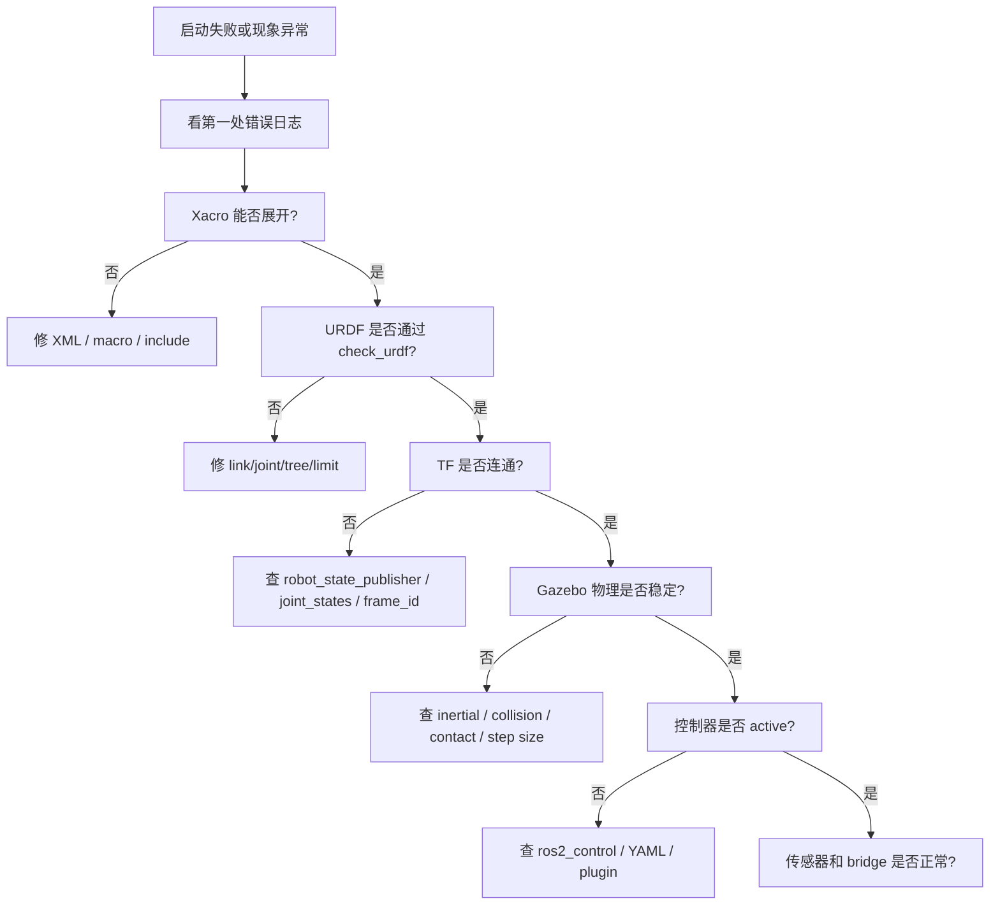

# 08 调试清单和练习项目

本篇用于排错。机器人仿真错误很容易互相影响，所以排查时要分层，不要一次改很多东西。

## 本篇学习目标

学完本篇后，你应该能：

- 按 Xacro/URDF、TF、Gazebo、控制器、传感器、时间六层排查问题；
- 为每个问题保留可复现记录；
- 用最小实验隔离变量，而不是在多个文件里同时试错；
- 把错误归档成自己的调试知识库。

## 总体排查原则

1. 先看日志第一处错误。
2. 先验证模型文件能否解析。
3. 再验证 TF。
4. 再验证 Gazebo 物理稳定性。
5. 再验证控制器。
6. 再验证传感器和桥接。
7. 每次只改一个变量。

推荐总流程：



## Xacro/URDF 无法解析

症状：

- launch 启动失败；
- robot_state_publisher 报 XML 错误；
- `xacro` 命令报错；
- RViz 没有模型。

检查命令：

```bash
ros2 run xacro xacro robot.urdf.xacro > /tmp/robot.urdf
check_urdf /tmp/robot.urdf
```

检查点：

- XML 标签是否闭合；
- 属性引号是否完整；
- Xacro property 是否定义；
- Xacro macro 参数是否传入；
- include 路径是否正确；
- package 是否已经 build 和 source；
- 文件编码是否正常；
- 是否混用了 ROS 1 的写法。

## RViz 看不到模型

检查：

```bash
ros2 node list
ros2 param get /robot_state_publisher robot_description
ros2 topic echo /joint_states
ros2 run tf2_tools view_frames
```

可能原因：

- robot_state_publisher 没启动；
- robot_description 为空；
- fixed frame 选错；
- TF 树断裂；
- joint_states 没有发布；
- visual 几何太小或在很远位置；
- alpha 透明度为 0；
- mesh 路径错误。

## TF 树断裂

症状：

- RViz 报 `No transform`；
- 传感器数据无法显示；
- 导航或 SLAM 报 frame 错误。

检查：

```bash
ros2 run tf2_tools view_frames
ros2 run tf2_ros tf2_echo base_link laser_link
```

可能原因：

- URDF 中 parent/child 拼写错误；
- joint_states 缺少运动关节；
- 某个 link 没有关节连接；
- 多个根 link；
- frame_id 写错；
- namespace 导致 frame 名不一致；
- `use_sim_time` 不一致导致时间戳错位。

## Gazebo 中模型飞走或抖动

优先检查：

- inertial 是否缺失；
- 惯性矩是否为 0；
- 质量是否极端；
- collision 是否互相重叠；
- 关节 limit 是否合理；
- 关节 damping 是否太小或太大；
- 控制器输出是否过大；
- 轮子是否埋进地面；
- 物理步长是否太大。

快速实验：

- 暂时去掉控制器，只看模型是否静止稳定；
- 暂时把复杂 collision 换成 box/cylinder；
- 降低初始高度，避免从高处掉落；
- 给关节增加少量 damping；
- 降低控制命令。

## 小车不动

检查：

```bash
ros2 control list_controllers
ros2 control list_hardware_interfaces
ros2 topic echo /cmd_vel
ros2 topic echo /joint_states
```

可能原因：

- Gazebo 暂停；
- 控制器没有 active；
- `/cmd_vel` 话题名不匹配；
- controller 使用了 namespace；
- wheel joint 名称不匹配；
- command interface 不是 velocity；
- 轮子 joint 不是 continuous；
- 轮子 collision 没有接触地面；
- 摩擦太低；
- 质量或惯性不合理。

## 小车方向反了

可能原因：

- 左右轮名字反了；
- wheel joint axis 方向反了；
- 轮子视觉方向和物理方向不一致；
- wheel separation 符号或数值错；
- 控制器参数左右轮列表写反；
- 坐标系 x 轴没有朝前。

验证方法：

1. 只给正线速度，看小车是否沿 x 正方向前进。
2. 只给正角速度，看是否逆时针旋转。
3. 单独让左轮转，观察模型方向。
4. 单独让右轮转，观察模型方向。

## 传感器没有数据

检查 Gazebo：

```bash
gz topic -l
gz topic -i -t /your_sensor_topic
```

检查 ROS 2：

```bash
ros2 topic list
ros2 topic hz /scan
ros2 topic echo /imu
```

可能原因：

- 传感器没有配置 update_rate；
- Gazebo 中 topic 名称和 bridge 配置不同；
- bridge 消息类型不匹配；
- 传感器 link 没有被加载；
- Gazebo 暂停；
- 相机没有渲染插件或 GUI/headless 配置问题；
- frame_id 和 RViz fixed frame 不连通。

传感器问题要分成“三个有无”：

| 检查 | 命令 | 如果没有 |
| --- | --- | --- |
| Gazebo 是否有 topic | `gz topic -l` | 查 SDF/插件/update_rate |
| ROS 2 是否有 topic | `ros2 topic list` | 查 bridge 配置和消息类型 |
| TF 是否能连通 | `tf2_echo fixed_frame sensor_frame` | 查 URDF fixed joint 和 frame_id |

## 仿真时间问题

症状：

- RViz 报时间 extrapolation；
- SLAM 不更新；
- TF 偶发错误；
- 传感器消息时间戳异常。

检查：

```bash
ros2 topic echo /clock
ros2 param get /rviz use_sim_time
ros2 param get /your_node use_sim_time
```

建议：

- 仿真系统中所有依赖时间的节点统一 `use_sim_time: true`；
- 确认 `/clock` 已桥接；
- Gazebo 暂停时不要误判节点卡死。

## 练习项目 1：最小显示模型

目标：

- 一个 `base_link`；
- 一个 box visual；
- RViz 能显示；
- TF 树只有一个根。

验收：

```bash
ros2 launch my_robot_description display.launch.py
ros2 run tf2_tools view_frames
```

## 练习项目 2：两轮小车

目标：

- base_link；
- left_wheel_link；
- right_wheel_link；
- 两个 continuous joint；
- visual、collision、inertial 完整。

验收：

- RViz 显示正常；
- check_urdf 通过；
- Gazebo 中不抖动；
- 轮子与地面接触。

## 练习项目 3：Xacro 参数化

目标：

- 抽取尺寸和质量；
- 写轮子宏；
- 写惯性宏；
- 支持参数控制是否启用雷达。

验收：

```bash
ros2 run xacro xacro robot.urdf.xacro use_lidar:=true > /tmp/robot.urdf
check_urdf /tmp/robot.urdf
```

## 练习项目 4：Gazebo 世界

目标：

- 写一个 world；
- 有地面、太阳光和障碍物；
- spawn 小车；
- 桥接 `/clock`。

验收：

- Gazebo 能启动；
- 小车稳定落地；
- ROS 2 能收到 `/clock`；
- RViz 使用仿真时间。

## 练习项目 5：控制和传感器

目标：

- 小车能响应 `/cmd_vel`；
- 有 `/joint_states`；
- 有 `/odom`；
- 有 `/scan`；
- RViz 能显示模型、TF、LaserScan。

验收：

```bash
ros2 control list_controllers
ros2 topic hz /joint_states
ros2 topic hz /scan
ros2 topic echo /odom
```

## 学习记录模板

每次遇到问题，建议按这个模板记录：

```markdown
## 问题标题

### 环境

- Ubuntu:
- ROS 2:
- Gazebo:
- 包名:

### 现象

写清楚报错、截图、命令输出。

### 复现步骤

1.
2.
3.

### 已检查内容

- Xacro 是否能展开：
- check_urdf 是否通过：
- TF 是否连通：
- Gazebo topic 是否存在：
- ROS topic 是否存在：

### 原因

最终定位到的根因。

### 解决

改了哪些文件，为什么这样改。

### 经验

下次如何避免。
```

## 复盘方式

每解决一个问题后，建议补充两行：

- **可提前发现的信号**：下次在什么命令或日志中能更早看到它。
- **最小验证命令**：以后如何用一条命令确认问题已经解决。

长期看，这比只记录“改了某个参数”更有价值，因为机器人仿真中的错误经常换一种形式再次出现。

## 参考资料

- [ROS 2 Jazzy 调试与排错工具入口](https://docs.ros.org/en/jazzy/How-To-Guides.html)
- [ROS 2 Jazzy TF2 教程](https://docs.ros.org/en/jazzy/Tutorials/Intermediate/Tf2/Tf2-Main.html)
- [Gazebo Harmonic 文档](https://gazebosim.org/docs/harmonic/)
- [Gazebo ROS 2 集成文档](https://gazebosim.org/docs/latest/ros2_integration/)
- [gz_ros2_control Jazzy 文档](https://control.ros.org/jazzy/doc/gz_ros2_control/doc/index.html)
- [ros_gz_bridge README](https://github.com/gazebosim/ros_gz/blob/ros2/ros_gz_bridge/README.md)

