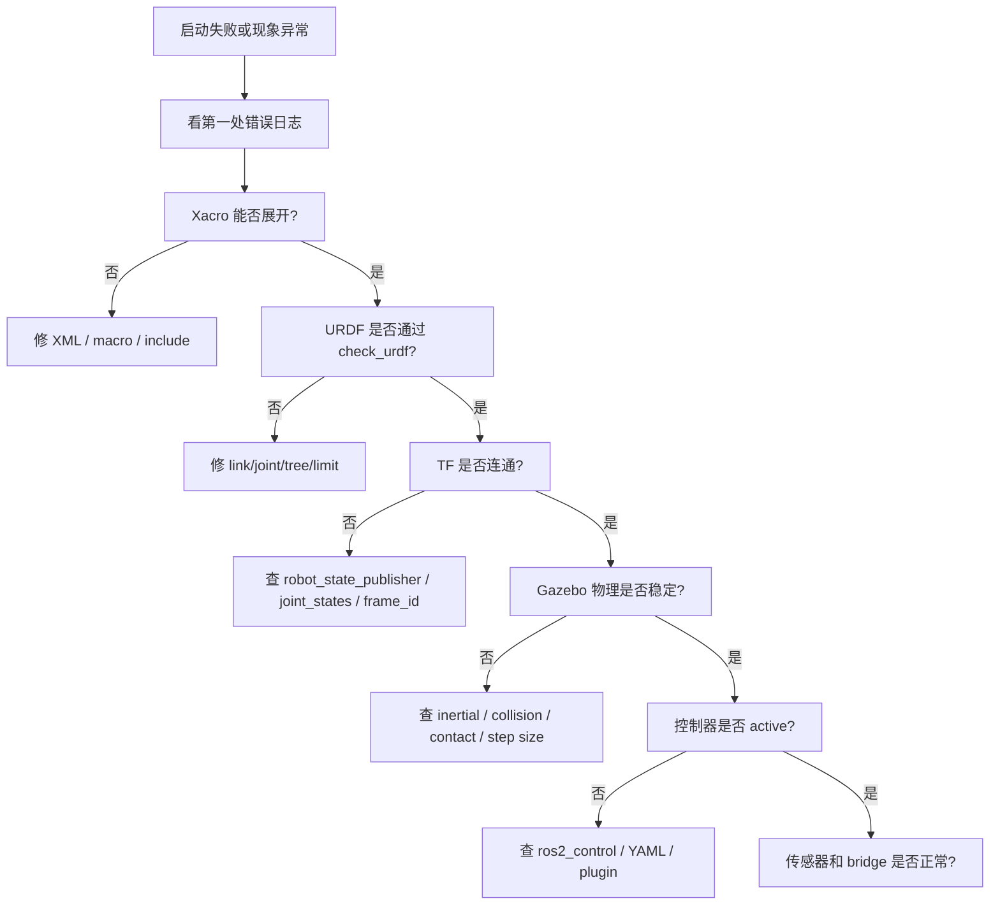

# 08 调试清单和练习项目

<!-- lecture-notes:integrated-v2 -->

## 讲义导读：把机器人当成可验证的闭环系统

这一章讲的是 **08 调试清单和练习项目**。阅读时不要只记命令、参数或算法名，而要把它放进机器人闭环：模型是否描述真实机器人，坐标系和时间是否一致，传感器数据是否可信，状态估计是否稳定，规划结果是否可执行，控制命令是否安全，仿真和真机差异是否被验证。机器人学习的关键不是让 demo 偶然跑通，而是能解释每个模块为什么工作、怎样失败、如何调试。

### 一句话先懂

机器人仿真不是画一个模型好看，而是让几何、惯性、碰撞、传感器、控制接口和物理环境足够接近真实系统。

### 通俗类比

可以把机器人想成一个会移动、会感知、会决策的闭环系统：传感器像眼睛和耳朵，TF 和状态估计像方向感，地图像环境记忆，规划器像路线顾问，控制器像肌肉和反射，仿真像训练场，安全机制像刹车和护栏。任何一环的单位、方向、时间或边界错了，整机表现都会变差。

类比只能帮助建立直觉。回到工程上，要把每个模块写成输入、输出、坐标系、时间戳、参数、频率、误差来源和验收指标。只有这些信息清楚，才知道问题是来自硬件、驱动、模型、通信、算法、控制还是环境。

### 本章学习主线

1. **模型和坐标**：先确认 URDF/SDF、TF、外参、单位和 REP 103/105 约定是否正确。
2. **数据和时间**：检查 Topic、QoS、Header、frame_id、timestamp、use_sim_time 和 rosbag 回放是否一致。
3. **算法和接口**：弄清输入数据是什么，输出命令或估计是什么，中间参数控制什么物理或数学含义。
4. **闭环和反馈**：观察命令是否被执行，执行结果是否反馈到 odom、TF、状态估计或任务层。
5. **失败和安全**：记录不动、乱动、漂移、震荡、穿墙、丢图、延迟、碰撞和失联时的排查顺序。
6. **仿真到真机**：把仿真中默认理想化的部分逐项换成真实约束，例如摩擦、延迟、噪声、限幅和电源。

### 概念怎么学才不容易忘

遇到机器人概念时，建议按 白话作用 -> ROS 2 接口 -> 坐标时间 -> 最小实验 -> 典型故障 -> 调试命令 六步学习。比如学习 TF，不只背 map、odom、base_link，还要知道谁发布、频率多少、时间戳是否能查到；学习控制器，不只看 cmd_vel 是否发布，还要看底盘是否执行、odom 是否反馈、限速和急停是否生效。

### 最小实践任务

建立一个两轮差速小车 URDF/Xacro，接入 ros2_control 和 Gazebo Sim，检查 TF、joint、collision、inertial、传感器数据和 cmd_vel 到 odom 的闭环。

实践时要保留失败记录：TF 断裂、QoS 不匹配、use_sim_time 忘开、frame_id 写错、惯性参数不合理、footprint 偏小、传感器外参偏差、控制频率不足。机器人系统的经验很大一部分来自这些可复现的错误。

### 读完本章应该能做到

- 用自己的话解释本章主题在机器人闭环中的位置。
- 画出最小数据流，标明 Topic、Service、Action、TF、参数和启动文件。
- 说出至少三个常见失败现象，并给出对应的检查命令或观测信号。
- 解释关键参数的物理意义，而不是只复制默认 YAML。
- 能说明 URDF、Xacro、SDF、Gazebo Sim、ros2_control、传感器插件和仿真时间之间的关系，并知道仿真到真机差异来自哪里。

> 本节是讲义化阅读入口，后续正文中的 ROS 2 接口、坐标系、算法、仿真、控制和调试内容都应围绕这条机器人闭环来理解。
本篇用于排错。机器人仿真错误很容易互相影响，所以排查时要分层，不要一次改很多东西。

## 本篇学习目标

学完本篇后，你应该能：

- 按 Xacro/URDF、TF、Gazebo、控制器、传感器、时间六层排查问题；
- 为每个问题保留可复现记录；
- 用最小实验隔离变量，而不是在多个文件里同时试错；
- 把错误归档成自己的调试知识库。

## 总体排查原则

1. 先看日志第一处错误。
2. 先验证模型文件能否解析。
3. 再验证 TF。
4. 再验证 Gazebo 物理稳定性。
5. 再验证控制器。
6. 再验证传感器和桥接。
7. 每次只改一个变量。

推荐总流程：



## Xacro/URDF 无法解析

症状：

- launch 启动失败；
- robot_state_publisher 报 XML 错误；
- `xacro` 命令报错；
- RViz 没有模型。

检查命令：

```bash
ros2 run xacro xacro robot.urdf.xacro > /tmp/robot.urdf
check_urdf /tmp/robot.urdf
```

检查点：

- XML 标签是否闭合；
- 属性引号是否完整；
- Xacro property 是否定义；
- Xacro macro 参数是否传入；
- include 路径是否正确；
- package 是否已经 build 和 source；
- 文件编码是否正常；
- 是否混用了 ROS 1 的写法。

## RViz 看不到模型

检查：

```bash
ros2 node list
ros2 param get /robot_state_publisher robot_description
ros2 topic echo /joint_states
ros2 run tf2_tools view_frames
```

可能原因：

- robot_state_publisher 没启动；
- robot_description 为空；
- fixed frame 选错；
- TF 树断裂；
- joint_states 没有发布；
- visual 几何太小或在很远位置；
- alpha 透明度为 0；
- mesh 路径错误。

## TF 树断裂

症状：

- RViz 报 `No transform`；
- 传感器数据无法显示；
- 导航或 SLAM 报 frame 错误。

检查：

```bash
ros2 run tf2_tools view_frames
ros2 run tf2_ros tf2_echo base_link laser_link
```

可能原因：

- URDF 中 parent/child 拼写错误；
- joint_states 缺少运动关节；
- 某个 link 没有关节连接；
- 多个根 link；
- frame_id 写错；
- namespace 导致 frame 名不一致；
- `use_sim_time` 不一致导致时间戳错位。

## Gazebo 中模型飞走或抖动

优先检查：

- inertial 是否缺失；
- 惯性矩是否为 0；
- 质量是否极端；
- collision 是否互相重叠；
- 关节 limit 是否合理；
- 关节 damping 是否太小或太大；
- 控制器输出是否过大；
- 轮子是否埋进地面；
- 物理步长是否太大。

快速实验：

- 暂时去掉控制器，只看模型是否静止稳定；
- 暂时把复杂 collision 换成 box/cylinder；
- 降低初始高度，避免从高处掉落；
- 给关节增加少量 damping；
- 降低控制命令。

## 小车不动

检查：

```bash
ros2 control list_controllers
ros2 control list_hardware_interfaces
ros2 topic echo /cmd_vel
ros2 topic echo /joint_states
```

可能原因：

- Gazebo 暂停；
- 控制器没有 active；
- `/cmd_vel` 话题名不匹配；
- controller 使用了 namespace；
- wheel joint 名称不匹配；
- command interface 不是 velocity；
- 轮子 joint 不是 continuous；
- 轮子 collision 没有接触地面；
- 摩擦太低；
- 质量或惯性不合理。

## 小车方向反了

可能原因：

- 左右轮名字反了；
- wheel joint axis 方向反了；
- 轮子视觉方向和物理方向不一致；
- wheel separation 符号或数值错；
- 控制器参数左右轮列表写反；
- 坐标系 x 轴没有朝前。

验证方法：

1. 只给正线速度，看小车是否沿 x 正方向前进。
2. 只给正角速度，看是否逆时针旋转。
3. 单独让左轮转，观察模型方向。
4. 单独让右轮转，观察模型方向。

## 传感器没有数据

检查 Gazebo：

```bash
gz topic -l
gz topic -i -t /your_sensor_topic
```

检查 ROS 2：

```bash
ros2 topic list
ros2 topic hz /scan
ros2 topic echo /imu
```

可能原因：

- 传感器没有配置 update_rate；
- Gazebo 中 topic 名称和 bridge 配置不同；
- bridge 消息类型不匹配；
- 传感器 link 没有被加载；
- Gazebo 暂停；
- 相机没有渲染插件或 GUI/headless 配置问题；
- frame_id 和 RViz fixed frame 不连通。

传感器问题要分成“三个有无”：

| 检查 | 命令 | 如果没有 |
| --- | --- | --- |
| Gazebo 是否有 topic | `gz topic -l` | 查 SDF/插件/update_rate |
| ROS 2 是否有 topic | `ros2 topic list` | 查 bridge 配置和消息类型 |
| TF 是否能连通 | `tf2_echo fixed_frame sensor_frame` | 查 URDF fixed joint 和 frame_id |

## 仿真时间问题

症状：

- RViz 报时间 extrapolation；
- SLAM 不更新；
- TF 偶发错误；
- 传感器消息时间戳异常。

检查：

```bash
ros2 topic echo /clock
ros2 param get /rviz use_sim_time
ros2 param get /your_node use_sim_time
```

建议：

- 仿真系统中所有依赖时间的节点统一 `use_sim_time: true`；
- 确认 `/clock` 已桥接；
- Gazebo 暂停时不要误判节点卡死。

## 练习项目 1：最小显示模型

目标：

- 一个 `base_link`；
- 一个 box visual；
- RViz 能显示；
- TF 树只有一个根。

验收：

```bash
ros2 launch my_robot_description display.launch.py
ros2 run tf2_tools view_frames
```

## 练习项目 2：两轮小车

目标：

- base_link；
- left_wheel_link；
- right_wheel_link；
- 两个 continuous joint；
- visual、collision、inertial 完整。

验收：

- RViz 显示正常；
- check_urdf 通过；
- Gazebo 中不抖动；
- 轮子与地面接触。

## 练习项目 3：Xacro 参数化

目标：

- 抽取尺寸和质量；
- 写轮子宏；
- 写惯性宏；
- 支持参数控制是否启用雷达。

验收：

```bash
ros2 run xacro xacro robot.urdf.xacro use_lidar:=true > /tmp/robot.urdf
check_urdf /tmp/robot.urdf
```

## 练习项目 4：Gazebo 世界

目标：

- 写一个 world；
- 有地面、太阳光和障碍物；
- spawn 小车；
- 桥接 `/clock`。

验收：

- Gazebo 能启动；
- 小车稳定落地；
- ROS 2 能收到 `/clock`；
- RViz 使用仿真时间。

## 练习项目 5：控制和传感器

目标：

- 小车能响应 `/cmd_vel`；
- 有 `/joint_states`；
- 有 `/odom`；
- 有 `/scan`；
- RViz 能显示模型、TF、LaserScan。

验收：

```bash
ros2 control list_controllers
ros2 topic hz /joint_states
ros2 topic hz /scan
ros2 topic echo /odom
```

## 学习记录模板

每次遇到问题，建议按这个模板记录：

```markdown
## 问题标题

### 环境

- Ubuntu:
- ROS 2:
- Gazebo:
- 包名:

### 现象

写清楚报错、截图、命令输出。

### 复现步骤

1.
2.
3.

### 已检查内容

- Xacro 是否能展开：
- check_urdf 是否通过：
- TF 是否连通：
- Gazebo topic 是否存在：
- ROS topic 是否存在：

### 原因

最终定位到的根因。

### 解决

改了哪些文件，为什么这样改。

### 经验

下次如何避免。
```

## 复盘方式

每解决一个问题后，建议补充两行：

- **可提前发现的信号**：下次在什么命令或日志中能更早看到它。
- **最小验证命令**：以后如何用一条命令确认问题已经解决。

长期看，这比只记录“改了某个参数”更有价值，因为机器人仿真中的错误经常换一种形式再次出现。

## 2026 机器人资料与版本核对补充

机器人生态版本变化很快，尤其是 ROS 2 发行版、Gazebo Sim、Nav2、ros2_control、MoveIt 2、SLAM Toolbox 和各类驱动包。复现实验前应记录 ROS 2 发行版、Ubuntu 版本、RMW 实现、工作空间 source 顺序、Gazebo 版本、机器人模型文件、参数 YAML、传感器驱动版本、固件版本和仿真或真机环境。

排错时优先核对官方文档、REP 标准和当前发行版文档。社区教程很适合入门和排坑，但包名、插件名、参数名、launch 文件和命令可能随发行版变化。尤其是 Nav2、Gazebo Sim 和 ros2_control，建议按当前项目使用的发行版页面核对，而不是混用 Humble、Iron、Jazzy、Kilted 或 Rolling 的教程。

### 资料入口

- ROS 2 Documentation: https://docs.ros.org/
- ROS 2 Jazzy Documentation: https://docs.ros.org/en/jazzy/
- Nav2 Documentation: https://docs.nav2.org/
- Gazebo Sim Documentation: https://gazebosim.org/docs/
- Gazebo ROS 2 integration: https://gazebosim.org/docs/latest/ros2_integration/
- ros2_control Documentation: https://control.ros.org/
- MoveIt 2 Documentation: https://moveit.picknik.ai/main/index.html
- REP 103 Standard Units and Coordinate Conventions: https://www.ros.org/reps/rep-0103.html
- REP 105 Coordinate Frames for Mobile Platforms: https://www.ros.org/reps/rep-0105.html
- SLAM Toolbox: https://github.com/SteveMacenski/slam_toolbox

仿真章节要特别核对 collision、inertial、joint limit、transmission、controller、sensor plugin 和 sim time。模型看起来正确不代表物理正确，惯性和碰撞错误会直接导致控制震荡或仿真穿模。

## 参考资料

- [ROS 2 Jazzy 调试与排错工具入口](https://docs.ros.org/en/jazzy/How-To-Guides.html)
- [ROS 2 Jazzy TF2 教程](https://docs.ros.org/en/jazzy/Tutorials/Intermediate/Tf2/Tf2-Main.html)
- [Gazebo Harmonic 文档](https://gazebosim.org/docs/harmonic/)
- [Gazebo ROS 2 集成文档](https://gazebosim.org/docs/latest/ros2_integration/)
- [gz_ros2_control Jazzy 文档](https://control.ros.org/jazzy/doc/gz_ros2_control/doc/index.html)
- [ros_gz_bridge README](https://github.com/gazebosim/ros_gz/blob/ros2/ros_gz_bridge/README.md)
## 2026-06 深化精讲补充：仿真调试清单和练习项目

Last researched: 2026-06-16

### 本篇在仿真体系中的位置

高效调试的核心不是记住所有错误，而是按层次缩小问题范围。 本篇关注的重点是：从 XML、TF、物理、控制、桥接、时间到 Nav2 的分层排查。机器人仿真不是单纯运行一个窗口，而是一条从模型文件到 ROS 2 接口、从物理引擎到上层算法的闭环链路。任何一层没有验证，后续问题都会以更隐蔽的形式出现。


Figure: 本图为面向机器人学习笔记的通用工程闭环，综合 ROS 2、REP 103/105、Nav2、Gazebo Sim 与 ros2_control 官方资料重新整理。


### 分层理解

| 层级 | 主要对象 | 应确认的问题 | 常用工具 |
| --- | --- | --- | --- |
| 模型层 | URDF、Xacro、SDF、mesh | link/joint 是否正确，单位是否为 SI，惯性和碰撞是否合理 | `xacro`、`check_urdf`、RViz |
| TF 层 | `map`、`odom`、`base_link`、传感器 frame | 坐标树是否连通，parent/child 是否正确，时间戳是否可查询 | `view_frames`、`tf2_echo` |
| 物理层 | 质量、惯量、摩擦、接触、重力 | 是否抖动、飞走、穿模，仿真步长是否稳定 | Gazebo GUI、日志 |
| 控制层 | ros2_control、controller manager、控制器 | 控制器是否 loaded/active，joint 名称和接口是否匹配 | `ros2 control`、`ros2 topic echo /cmd_vel` |
| 传感器层 | LaserScan、IMU、Image、PointCloud2 | frame、频率、QoS、噪声和桥接是否正确 | `ros2 topic hz/info -v`、RViz |
| 算法层 | SLAM、Nav2、MoveIt 2、任务节点 | 输入是否完整，生命周期是否 active，恢复策略是否有效 | Nav2 日志、rosbag2 |

### 工程流程精讲

第一步是固定版本。ROS 2、Gazebo Sim、ros_gz、ros2_control 和 Nav2 的版本组合必须以官方文档为准。Jazzy 与 Humble 的包名、默认中间件、Gazebo 推荐版本和教程细节可能不同。跟教程学习时不要混用 ROS 1、Gazebo Classic、Ignition 旧命名和 Gazebo Sim 新命名。

第二步是建立最小模型。最小模型只需要一个 `base_link`、简单几何体、必要的 `collision` 和 `inertial`。先让它在 RViz 中显示，再让它在 Gazebo 中稳定落地。这个阶段不要急着加 Nav2、SLAM 或复杂 mesh，因为它们会掩盖模型错误。

第三步是补齐控制闭环。移动机器人通常需要把 `/cmd_vel` 变成轮子关节速度，机械臂需要把轨迹控制器和关节状态接通。ros2_control 的价值是统一仿真和实机接口，但它要求硬件接口、控制器配置、joint 名称、command/state interface 严格一致。

第四步是接入传感器。Gazebo 内部 topic 和 ROS 2 topic 不是同一个系统，Gazebo Sim 常通过 `ros_gz_bridge` 进行消息桥接。桥接前要确认消息类型受支持，桥接方向正确，frame_id 和仿真时间正确传递。

第五步才是上层算法。Nav2、SLAM、定位和任务逻辑都假设底层模型、TF、控制和传感器基本可信。若底层未验证就直接调 Nav2 参数，常见结果是参数越改越乱。

### 最小验证项目

建议把本篇内容落实到一个 `my_robot_description` + `my_robot_bringup` 工作空间中：

```text
robot_ws/src/
  my_robot_description/
    urdf/
    meshes/
    rviz/
    launch/
  my_robot_bringup/
    launch/
    config/
  my_robot_control/
    config/
  my_robot_navigation/
    maps/
    params/
```

验收标准不是“能启动 Gazebo”，而是以下每一项都能独立证明：`robot_description` 能生成，TF 树连通，模型在 RViz 中方向正确，Gazebo 中不抖动，控制器 active，`/cmd_vel` 后轮子和底盘运动方向正确，传感器话题有稳定频率，`use_sim_time` 在所有相关节点一致。

### 常见实践坑

- `visual` 正常不代表 `collision` 和 `inertial` 正常。RViz 只看显示和 TF，Gazebo 还要计算物理。
- 复杂 mesh 不适合直接做碰撞。碰撞体应尽量用 box、cylinder、sphere 或简化网格。
- 动态 link 没有合理惯性时，仿真容易抖动、飞走或在接触时爆炸。
- `base_link`、`base_footprint`、`odom`、`map` 的语义要遵循 REP 105，不要为了“看起来能跑”随意改 frame 名。
- Gazebo world 坐标和 ROS `map` 坐标不是天然同一个概念。需要明确谁发布哪条 TF。
- `ros_gz_bridge` 只桥接配置过且支持的消息类型。看到 Gazebo 有 topic 不代表 ROS 2 一定能收到。
- QoS 不匹配会导致 topic 存在但订阅不到，尤其是传感器数据和地图数据。
- 仿真时间 `/clock` 必须被所有算法节点一致使用，否则 TF 查询和 rosbag 回放会出现时间错位。
- 控制器 loaded 不等于 active，active 不等于 joint interface 名称正确。
- Nav2 失败时先查 TF、里程计、传感器和 costmap，再讨论 planner/controller 参数。

### 调试顺序

1. `ros2 doctor` 和环境变量：确认 ROS 发行版、Domain ID、RMW 和 source 顺序。
2. `ros2 pkg list` / `ros2 launch`：确认包能被找到，launch 文件能被安装。
3. `ros2 param get /robot_state_publisher robot_description`：确认模型实际传入。
4. `ros2 run tf2_tools view_frames`：确认 TF 树没有断裂和重复发布。
5. Gazebo 中暂停/单步观察模型：确认物理稳定。
6. `ros2 control list_controllers`：确认控制器状态。
7. `ros2 topic info -v`：检查关键 topic 的类型、QoS、发布者和订阅者。
8. RViz 同时显示 TF、RobotModel、LaserScan、Odometry、Map 和 Path。
9. 录制 rosbag2，离线复现问题，避免每次重新跑完整仿真。

### 从仿真迁移到实机

仿真到实机的关键不是“代码完全不变”，而是接口和假设可控。URDF 可以复用，但质量、摩擦、传感器噪声、延迟和控制饱和需要实测校准。ros2_control 能让控制器层更容易复用，但硬件接口必须处理通信超时、编码器异常、电机使能、急停和安全限速。Nav2 参数也要根据真实机器人最大速度、加速度、制动距离、定位误差和传感器盲区重新调整。

### 推荐练习

- 从零写一个只有底盘和两个轮子的 URDF/Xacro，并在 RViz 中验证 TF。
- 给模型添加 collision 和 inertial，观察缺失或错误参数对 Gazebo 稳定性的影响。
- 用 ros2_control 接入差速控制器，发布 `/cmd_vel` 验证正转、倒车和原地旋转。
- 添加 2D LiDAR，用 `ros_gz_bridge` 桥接到 ROS 2，并在 RViz 中显示 `/scan`。
- 录制 `/tf`、`/odom`、`/scan`、`/cmd_vel` 和 `/clock`，用 rosbag2 回放排查。

## References and further reading

- [Official] [ROS 2 Documentation](https://docs.ros.org/)
- [Official] [ROS 2 Jazzy Documentation](https://docs.ros.org/en/jazzy/)
- [Standard] [REP 103: Standard Units of Measure and Coordinate Conventions](https://www.ros.org/reps/rep-0103.html)
- [Standard] [REP 105: Coordinate Frames for Mobile Platforms](https://www.ros.org/reps/rep-0105.html)
- [Book / Course] [Modern Robotics](https://modernrobotics.northwestern.edu/)
- [Book] [Probabilistic Robotics](https://mitpress.mit.edu/9780262303804/probabilistic-robotics/)
- [Book] [State Estimation for Robotics](https://www.cambridge.org/core/books/state-estimation-for-robotics/00E53274A2F1E6CC1A55CA5C3D1C9718)
- [Course] [MIT Underactuated Robotics](https://underactuated.mit.edu/)
- [Official] [Nav2 Documentation](https://docs.nav2.org/)
- [Official] [Gazebo Sim Documentation](https://gazebosim.org/docs/latest/)
- [Official] [SDFormat Documentation](https://sdformat.org/)
- [Official] [ros2_control Documentation](https://control.ros.org/)
- [Community] [ROS2 Control分析讲解 - CSDN](https://blog.csdn.net/Bing_Lee/article/details/135003678)
- [Community] [在机器人仿真中使用 ros2_control - CSDN](https://blog.csdn.net/apingna/article/details/148333455)
- [Community] [ROS2 SLAM 建图导航 - 掘金](https://juejin.cn/post/7101201729122730020)
- [Community] [机器人导航仿真 - 博客园](https://www.cnblogs.com/zjh1170/p/16133766.html)
- [Official] [Use ROS 2 to interact with Gazebo](https://gazebosim.org/docs/latest/ros2_integration/)
- [Official] [Installing Gazebo with ROS](https://gazebosim.org/docs/latest/ros_installation/)
- [Official] [ros_gz_bridge package documentation](https://docs.ros.org/en/jazzy/p/ros_gz_bridge/)
- [Official] [SDFormat model kinematics](https://sdformat.org/tutorials/specification/spec_model_kinematics/)

## References and further reading

- [Official] [ROS 2 Documentation](https://docs.ros.org/)
- [Official] [ROS 2 Jazzy Documentation](https://docs.ros.org/en/jazzy/)
- [Official] [Nav2 Documentation](https://docs.nav2.org/)
- [Official] [Gazebo Sim Documentation](https://gazebosim.org/docs/latest/)
- [Official] [Gazebo ROS 2 integration](https://gazebosim.org/docs/latest/ros2_integration/)
- [Official] [SDFormat Documentation](https://sdformat.org/)
- [Official] [ros2_control Documentation](https://control.ros.org/)
- [Standard] [REP 103: Standard Units of Measure and Coordinate Conventions](https://www.ros.org/reps/rep-0103.html)
- [Standard] [REP 105: Coordinate Frames for Mobile Platforms](https://www.ros.org/reps/rep-0105.html)
- [Book / Course] [Modern Robotics](https://modernrobotics.northwestern.edu/)
- [Book] [Probabilistic Robotics](https://mitpress.mit.edu/9780262303804/probabilistic-robotics/)
- [Book] [State Estimation for Robotics](https://www.cambridge.org/core/books/state-estimation-for-robotics/00E53274A2F1E6CC1A55CA5C3D1C9718)
- [Course] [MIT Underactuated Robotics](https://underactuated.mit.edu/)
- [Source] [ros2_control_demos](https://github.com/ros-controls/ros2_control_demos)
- [Community] [ROS2 Control分析讲解 - CSDN](https://blog.csdn.net/Bing_Lee/article/details/135003678)
- [Community] [在机器人仿真中使用 ros2_control - CSDN](https://blog.csdn.net/apingna/article/details/148333455)
- [Community] [ROS2 SLAM 建图导航 - 掘金](https://juejin.cn/post/7101201729122730020)
- [Community] [机器人导航仿真 - 博客园](https://www.cnblogs.com/zjh1170/p/16133766.html)
