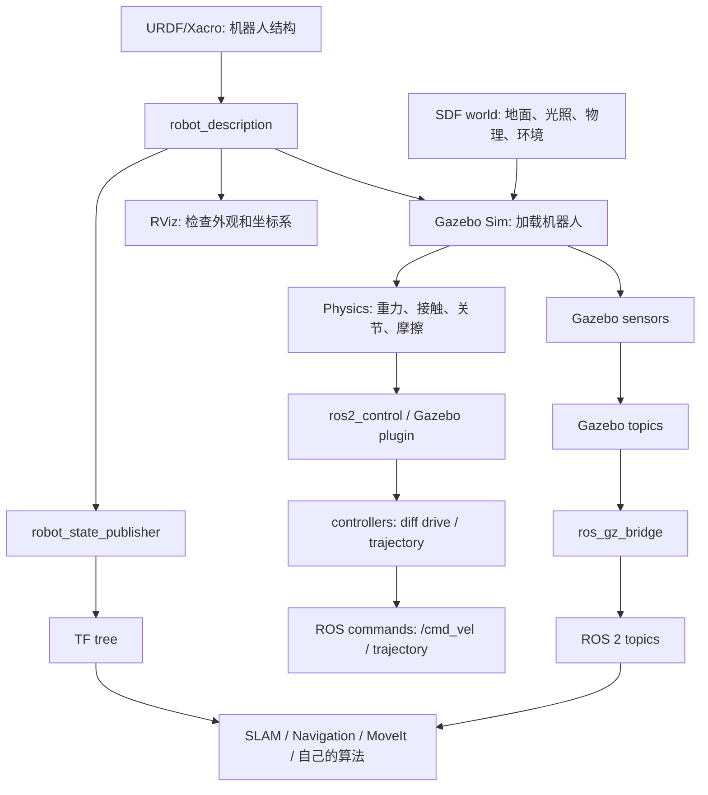
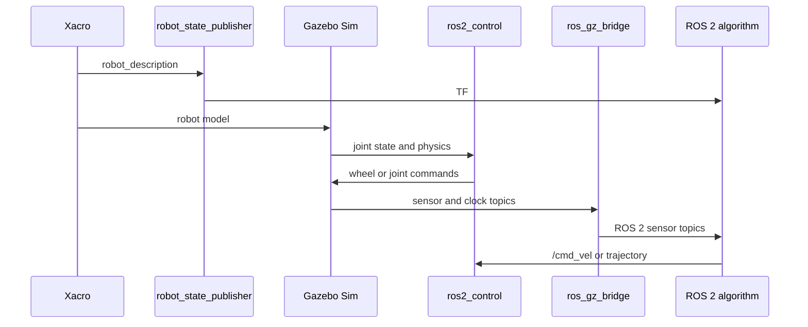

# 09 架构流程图与总复习

本篇不是新增知识点，而是把前面 8 篇串起来。学习机器人仿真时，最重要的是知道自己当前站在哪一层：模型、TF、物理、控制、传感器、桥接，还是上层算法。

最后资料核对：2026-06-08。

## 总架构

读图方法：

- RViz 主要帮助你看 `robot_description` 和 TF。
- Gazebo Sim 负责物理、传感器和仿真世界。
- `ros_gz_bridge` 负责 Gazebo topic 和 ROS 2 topic 之间的消息转换。
- 上层算法依赖 ROS 2 topic、TF 和仿真时间，不直接依赖你在 Gazebo GUI 里看到的画面。

## 最小可运行闭环

如果这个闭环跑通，你就具备继续学习导航、SLAM、MoveIt 或强化学习仿真的基础。

## 学习检查表

### 1. 模型层

- [ ] Xacro 可以展开成 URDF。
- [ ] `check_urdf` 通过。
- [ ] link 和 joint 名称清晰、唯一。
- [ ] 动态 link 有合理质量和惯性矩。
- [ ] collision 简单且不严重重叠。
- [ ] mesh 使用 `package://` 路径，单位和 scale 正确。

### 2. TF 层

- [ ] `robot_state_publisher` 已启动。
- [ ] `/joint_states` 有运动关节状态。
- [ ] `view_frames` 中没有断裂。
- [ ] 传感器 frame 能连到 `base_link` 或目标 fixed frame。
- [ ] 没有多个节点发布同一段 TF。

### 3. Gazebo 层

- [ ] world 能启动。
- [ ] 模型 spawn 后不飞、不抖、不穿地。
- [ ] 轮子和地面接触合理。
- [ ] 物理步长和控制频率匹配。
- [ ] Gazebo topic 能看到传感器和 `/clock`。

### 4. 控制层

- [ ] `ros2 control list_controllers` 中控制器 active。
- [ ] command/state interface 和 URDF 中一致。
- [ ] joint 名称与 controllers.yaml 一致。
- [ ] `/cmd_vel` 话题名和 namespace 正确。
- [ ] 小速度命令下前进、旋转方向符合预期。

### 5. 传感器层

- [ ] Gazebo 中有传感器 topic。
- [ ] ROS 2 中有桥接后的 topic。
- [ ] 消息 `frame_id` 在 TF 树中存在。
- [ ] 频率、量程、噪声、分辨率符合算法需求。
- [ ] RViz fixed frame 选择正确。

## 常见问题定位矩阵

| 现象 | 首先看 | 常见根因 |
| --- | --- | --- |
| launch 直接失败 | Xacro/URDF 日志 | XML 错、macro 参数缺失、include 路径错 |
| RViz 没模型 | `robot_description`、TF、fixed frame | robot_state_publisher 没启动、TF 断裂 |
| Gazebo 模型飞走 | inertial、collision、初始位姿 | 惯性为 0、碰撞重叠、质量比例极端 |
| 小车不动 | controller、`/cmd_vel`、joint interface | 控制器 inactive、joint 名不匹配、Gazebo 暂停 |
| 小车方向反 | wheel joint axis、左右轮列表 | 左右轮反、axis 反、轮距配置错 |
| 传感器没数据 | `gz topic -l` 和 `ros2 topic list` | sensor 未加载、bridge 缺失、消息类型错 |
| RViz 报时间错误 | `/clock`、`use_sim_time` | 仿真时间没有统一 |

## 复习题

1. 画出你自己的“URDF 到 Gazebo 到 ROS 2 算法”的链路图。
2. 解释为什么 `visual` 正常不代表 `collision` 和 `inertial` 正常。
3. 说明 `gz topic -l` 和 `ros2 topic list` 的区别。
4. 小车 `/cmd_vel` 有数据但不动，你会检查哪 8 项？
5. 为什么不建议从复杂 CAD 模型开始学习仿真？
6. Gazebo Classic 教程迁移到 Gazebo Sim 时，你会重点检查哪些包名、插件名和命令？

## 官方参考入口

- [ROS 2 Jazzy 文档](https://docs.ros.org/en/jazzy/)
- [ROS 2 Jazzy URDF 教程](https://docs.ros.org/en/jazzy/Tutorials/Intermediate/URDF/URDF-Main.html)
- [Gazebo Harmonic 文档](https://gazebosim.org/docs/harmonic/)
- [Gazebo 与 ROS 安装建议](https://gazebosim.org/docs/harmonic/ros_installation/)
- [SDFormat 规范](https://sdformat.org/spec/)
- [ros2_control Jazzy 文档](https://control.ros.org/jazzy/)
- [gz_ros2_control Jazzy 文档](https://control.ros.org/jazzy/doc/gz_ros2_control/doc/index.html)
