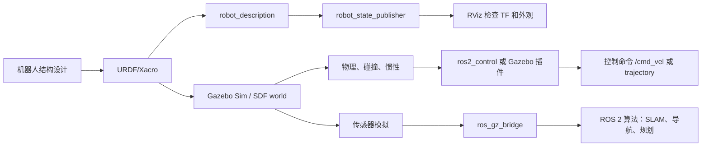

# 机器人仿真学习笔记

<!-- lecture-notes:integrated-v2 -->

## 讲义导读：把机器人当成可验证的闭环系统

这一章讲的是 **机器人仿真学习笔记**。阅读时不要只记命令、参数或算法名，而要把它放进机器人闭环：模型是否描述真实机器人，坐标系和时间是否一致，传感器数据是否可信，状态估计是否稳定，规划结果是否可执行，控制命令是否安全，仿真和真机差异是否被验证。机器人学习的关键不是让 demo 偶然跑通，而是能解释每个模块为什么工作、怎样失败、如何调试。

### 一句话先懂

机器人仿真不是画一个模型好看，而是让几何、惯性、碰撞、传感器、控制接口和物理环境足够接近真实系统。

### 通俗类比

可以把机器人想成一个会移动、会感知、会决策的闭环系统：传感器像眼睛和耳朵，TF 和状态估计像方向感，地图像环境记忆，规划器像路线顾问，控制器像肌肉和反射，仿真像训练场，安全机制像刹车和护栏。任何一环的单位、方向、时间或边界错了，整机表现都会变差。

类比只能帮助建立直觉。回到工程上，要把每个模块写成输入、输出、坐标系、时间戳、参数、频率、误差来源和验收指标。只有这些信息清楚，才知道问题是来自硬件、驱动、模型、通信、算法、控制还是环境。

### 本章学习主线

1. **模型和坐标**：先确认 URDF/SDF、TF、外参、单位和 REP 103/105 约定是否正确。
2. **数据和时间**：检查 Topic、QoS、Header、frame_id、timestamp、use_sim_time 和 rosbag 回放是否一致。
3. **算法和接口**：弄清输入数据是什么，输出命令或估计是什么，中间参数控制什么物理或数学含义。
4. **闭环和反馈**：观察命令是否被执行，执行结果是否反馈到 odom、TF、状态估计或任务层。
5. **失败和安全**：记录不动、乱动、漂移、震荡、穿墙、丢图、延迟、碰撞和失联时的排查顺序。
6. **仿真到真机**：把仿真中默认理想化的部分逐项换成真实约束，例如摩擦、延迟、噪声、限幅和电源。

### 概念怎么学才不容易忘

遇到机器人概念时，建议按 白话作用 -> ROS 2 接口 -> 坐标时间 -> 最小实验 -> 典型故障 -> 调试命令 六步学习。比如学习 TF，不只背 map、odom、base_link，还要知道谁发布、频率多少、时间戳是否能查到；学习控制器，不只看 cmd_vel 是否发布，还要看底盘是否执行、odom 是否反馈、限速和急停是否生效。

### 最小实践任务

建立一个两轮差速小车 URDF/Xacro，接入 ros2_control 和 Gazebo Sim，检查 TF、joint、collision、inertial、传感器数据和 cmd_vel 到 odom 的闭环。

实践时要保留失败记录：TF 断裂、QoS 不匹配、use_sim_time 忘开、frame_id 写错、惯性参数不合理、footprint 偏小、传感器外参偏差、控制频率不足。机器人系统的经验很大一部分来自这些可复现的错误。

### 读完本章应该能做到

- 用自己的话解释本章主题在机器人闭环中的位置。
- 画出最小数据流，标明 Topic、Service、Action、TF、参数和启动文件。
- 说出至少三个常见失败现象，并给出对应的检查命令或观测信号。
- 解释关键参数的物理意义，而不是只复制默认 YAML。
- 能说明 URDF、Xacro、SDF、Gazebo Sim、ros2_control、传感器插件和仿真时间之间的关系，并知道仿真到真机差异来自哪里。

> 本节是讲义化阅读入口，后续正文中的 ROS 2 接口、坐标系、算法、仿真、控制和调试内容都应围绕这条机器人闭环来理解。
本目录是一套面向新手的机器人仿真学习笔记，重点覆盖 ROS 2、URDF、Xacro、机器人学基础、Gazebo Sim、SDF、连杆、关节、惯性、碰撞、传感器和控制接口。

写作日期：2026-06-08。

最后资料核对：2026-06-08。主要依据 ROS 2 Jazzy、Gazebo Harmonic、SDFormat 和 ros2_control 官方文档。

## 推荐技术主线

如果你刚开始学习，建议采用：

- Ubuntu 24.04
- ROS 2 Jazzy Jalisco
- Gazebo Harmonic
- `ros_gz` 作为 ROS 2 和 Gazebo Sim 的集成桥梁

原因：Gazebo 官方文档建议新用户优先使用 ROS 和 Gazebo 的 LTS 组合；ROS 2 Jazzy 对应 Gazebo Harmonic 是推荐组合。Gazebo Classic 已经是旧版路线，除非课程、教材或现有项目明确要求，否则不建议作为新项目主线。

## 文档阅读顺序

1. [00_learning_map.md](00_学习路线与知识地图.md)：学习路线、先后顺序和常见误区。
2. [01_environment_ros2_gazebo.md](01_环境、工作空间和常用命令.md)：环境、工作空间、包结构和常用命令。
3. [02_robotics_foundations.md](02_机器人学基础.md)：坐标系、变换、速度、力、正逆运动学等基础。
4. [03_urdf_basics.md](03_URDF 基础.md)：URDF 文件结构和从零建模方法。
5. [04_xacro_practice.md](04_Xacro 实战.md)：用 Xacro 复用参数、宏和结构。
6. [05_links_joints_inertia_collision.md](05_连杆、关节、惯性和碰撞.md)：连杆、关节、惯性、碰撞和物理仿真的重点。
7. [06_gazebo_sim_sdf_world.md](06_Gazebo Sim、SDF 和仿真世界.md)：Gazebo Sim、SDF 世界、模型加载和仿真配置。
8. [07_ros2_control_and_sensors.md](07_控制、ros2_control 和传感器.md)：ros2_control、控制器、差速底盘和常用传感器。
9. [08_debugging_checklists.md](08_调试清单和练习项目.md)：排错清单、验证命令和练习项目。
10. [09_visual_architecture_and_review.md](09_架构流程图与总复习.md)：总架构流程图、关键链路复盘、复习题和学习检查表。
11. [10_versions_and_common_pitfalls.md](10_版本选型与常见实践坑.md)：版本选型、Gazebo Classic/Sim 差异、桥接、仿真时间和实践踩坑。

示例文件：

- [examples/minimal_mobile_base.urdf.xacro](examples/minimal_mobile_base.urdf.xacro)：一个最小差速小车模型，便于对照 URDF/Xacro 笔记学习。

## 怎么使用这些笔记

不要一开始就追求复杂机械臂或完整无人车。先按下面的顺序做出可运行的小系统：

1. 用 URDF 描述一个只有底盘和两个轮子的模型。
2. 用 RViz 检查视觉模型和 TF 树。
3. 给每个 link 补上 collision 和 inertial。
4. 改成 Xacro，抽取尺寸、质量、颜色和宏。
5. 放进 Gazebo Sim，观察模型是否稳定。
6. 加入 ros2_control 或 Gazebo 插件，让轮子可以动。
7. 加入激光雷达、IMU、相机等传感器。
8. 记录每次异常：模型飞走、抖动、穿模、TF 错误、关节方向反了、质量不合理等。

建议每学完一篇都做三件事：

- 用自己的话复述“这一篇解决什么问题”；
- 跑一条最小验证命令，例如 `check_urdf`、`view_frames`、`gz topic -l`；
- 把遇到的错误按 [08 调试清单](08_调试清单和练习项目.md) 的模板记录下来。

## 核心判断标准

一个机器人模型是否适合仿真，不是看它在 RViz 里好不好看，而是看：

- TF 树是否正确；
- link 和 joint 层级是否清晰；
- 视觉模型、碰撞模型、惯性模型是否分别合理；
- 质量、惯性矩、摩擦、阻尼是否接近真实物理；
- 控制接口是否和真实机器人一致；
- 传感器坐标系、频率、噪声和话题是否符合算法需要。

## 学习路线总图



先用这张图定位自己当前学的是哪一层。排错时也按这张图从左到右检查，不要一上来同时改模型、控制器和传感器。

## 参考入口

- [ROS 2 Jazzy URDF 教程](https://docs.ros.org/en/jazzy/Tutorials/Intermediate/URDF/URDF-Main.html)
- [ROS 2 Xacro 教程](https://docs.ros.org/en/rolling/Tutorials/Intermediate/URDF/Using-Xacro-to-Clean-Up-a-URDF-File.html)
- [Gazebo Harmonic 文档](https://gazebosim.org/docs/harmonic/)
- [Gazebo + ROS 安装建议](https://gazebosim.org/docs/harmonic/ros_installation/)
- [SDFormat 规范](https://sdformat.org/spec/)
- [gz_ros2_control Jazzy 文档](https://control.ros.org/jazzy/doc/gz_ros2_control/doc/index.html)
- [Gazebo Classic 页面](https://classic.gazebosim.org/)
## 2026-06 深化精讲补充：机器人仿真学习笔记总览

Last researched: 2026-06-16

### 本篇在仿真体系中的位置

总览文档应该能帮助读者判断先读哪篇、做到什么程度算过关、遇到问题回到哪一层排查。 本篇关注的重点是：目录导读、学习路径、验收标准、项目组织和参考入口。机器人仿真不是单纯运行一个窗口，而是一条从模型文件到 ROS 2 接口、从物理引擎到上层算法的闭环链路。任何一层没有验证，后续问题都会以更隐蔽的形式出现。


Figure: 本图为面向机器人学习笔记的通用工程闭环，综合 ROS 2、REP 103/105、Nav2、Gazebo Sim 与 ros2_control 官方资料重新整理。


### 分层理解

| 层级 | 主要对象 | 应确认的问题 | 常用工具 |
| --- | --- | --- | --- |
| 模型层 | URDF、Xacro、SDF、mesh | link/joint 是否正确，单位是否为 SI，惯性和碰撞是否合理 | `xacro`、`check_urdf`、RViz |
| TF 层 | `map`、`odom`、`base_link`、传感器 frame | 坐标树是否连通，parent/child 是否正确，时间戳是否可查询 | `view_frames`、`tf2_echo` |
| 物理层 | 质量、惯量、摩擦、接触、重力 | 是否抖动、飞走、穿模，仿真步长是否稳定 | Gazebo GUI、日志 |
| 控制层 | ros2_control、controller manager、控制器 | 控制器是否 loaded/active，joint 名称和接口是否匹配 | `ros2 control`、`ros2 topic echo /cmd_vel` |
| 传感器层 | LaserScan、IMU、Image、PointCloud2 | frame、频率、QoS、噪声和桥接是否正确 | `ros2 topic hz/info -v`、RViz |
| 算法层 | SLAM、Nav2、MoveIt 2、任务节点 | 输入是否完整，生命周期是否 active，恢复策略是否有效 | Nav2 日志、rosbag2 |

### 工程流程精讲

第一步是固定版本。ROS 2、Gazebo Sim、ros_gz、ros2_control 和 Nav2 的版本组合必须以官方文档为准。Jazzy 与 Humble 的包名、默认中间件、Gazebo 推荐版本和教程细节可能不同。跟教程学习时不要混用 ROS 1、Gazebo Classic、Ignition 旧命名和 Gazebo Sim 新命名。

第二步是建立最小模型。最小模型只需要一个 `base_link`、简单几何体、必要的 `collision` 和 `inertial`。先让它在 RViz 中显示，再让它在 Gazebo 中稳定落地。这个阶段不要急着加 Nav2、SLAM 或复杂 mesh，因为它们会掩盖模型错误。

第三步是补齐控制闭环。移动机器人通常需要把 `/cmd_vel` 变成轮子关节速度，机械臂需要把轨迹控制器和关节状态接通。ros2_control 的价值是统一仿真和实机接口，但它要求硬件接口、控制器配置、joint 名称、command/state interface 严格一致。

第四步是接入传感器。Gazebo 内部 topic 和 ROS 2 topic 不是同一个系统，Gazebo Sim 常通过 `ros_gz_bridge` 进行消息桥接。桥接前要确认消息类型受支持，桥接方向正确，frame_id 和仿真时间正确传递。

第五步才是上层算法。Nav2、SLAM、定位和任务逻辑都假设底层模型、TF、控制和传感器基本可信。若底层未验证就直接调 Nav2 参数，常见结果是参数越改越乱。

### 最小验证项目

建议把本篇内容落实到一个 `my_robot_description` + `my_robot_bringup` 工作空间中：

```text
robot_ws/src/
  my_robot_description/
    urdf/
    meshes/
    rviz/
    launch/
  my_robot_bringup/
    launch/
    config/
  my_robot_control/
    config/
  my_robot_navigation/
    maps/
    params/
```

验收标准不是“能启动 Gazebo”，而是以下每一项都能独立证明：`robot_description` 能生成，TF 树连通，模型在 RViz 中方向正确，Gazebo 中不抖动，控制器 active，`/cmd_vel` 后轮子和底盘运动方向正确，传感器话题有稳定频率，`use_sim_time` 在所有相关节点一致。

### 常见实践坑

- `visual` 正常不代表 `collision` 和 `inertial` 正常。RViz 只看显示和 TF，Gazebo 还要计算物理。
- 复杂 mesh 不适合直接做碰撞。碰撞体应尽量用 box、cylinder、sphere 或简化网格。
- 动态 link 没有合理惯性时，仿真容易抖动、飞走或在接触时爆炸。
- `base_link`、`base_footprint`、`odom`、`map` 的语义要遵循 REP 105，不要为了“看起来能跑”随意改 frame 名。
- Gazebo world 坐标和 ROS `map` 坐标不是天然同一个概念。需要明确谁发布哪条 TF。
- `ros_gz_bridge` 只桥接配置过且支持的消息类型。看到 Gazebo 有 topic 不代表 ROS 2 一定能收到。
- QoS 不匹配会导致 topic 存在但订阅不到，尤其是传感器数据和地图数据。
- 仿真时间 `/clock` 必须被所有算法节点一致使用，否则 TF 查询和 rosbag 回放会出现时间错位。
- 控制器 loaded 不等于 active，active 不等于 joint interface 名称正确。
- Nav2 失败时先查 TF、里程计、传感器和 costmap，再讨论 planner/controller 参数。

### 调试顺序

1. `ros2 doctor` 和环境变量：确认 ROS 发行版、Domain ID、RMW 和 source 顺序。
2. `ros2 pkg list` / `ros2 launch`：确认包能被找到，launch 文件能被安装。
3. `ros2 param get /robot_state_publisher robot_description`：确认模型实际传入。
4. `ros2 run tf2_tools view_frames`：确认 TF 树没有断裂和重复发布。
5. Gazebo 中暂停/单步观察模型：确认物理稳定。
6. `ros2 control list_controllers`：确认控制器状态。
7. `ros2 topic info -v`：检查关键 topic 的类型、QoS、发布者和订阅者。
8. RViz 同时显示 TF、RobotModel、LaserScan、Odometry、Map 和 Path。
9. 录制 rosbag2，离线复现问题，避免每次重新跑完整仿真。

### 从仿真迁移到实机

仿真到实机的关键不是“代码完全不变”，而是接口和假设可控。URDF 可以复用，但质量、摩擦、传感器噪声、延迟和控制饱和需要实测校准。ros2_control 能让控制器层更容易复用，但硬件接口必须处理通信超时、编码器异常、电机使能、急停和安全限速。Nav2 参数也要根据真实机器人最大速度、加速度、制动距离、定位误差和传感器盲区重新调整。

### 推荐练习

- 从零写一个只有底盘和两个轮子的 URDF/Xacro，并在 RViz 中验证 TF。
- 给模型添加 collision 和 inertial，观察缺失或错误参数对 Gazebo 稳定性的影响。
- 用 ros2_control 接入差速控制器，发布 `/cmd_vel` 验证正转、倒车和原地旋转。
- 添加 2D LiDAR，用 `ros_gz_bridge` 桥接到 ROS 2，并在 RViz 中显示 `/scan`。
- 录制 `/tf`、`/odom`、`/scan`、`/cmd_vel` 和 `/clock`，用 rosbag2 回放排查。

## 2026 机器人资料与版本核对补充

机器人生态版本变化很快，尤其是 ROS 2 发行版、Gazebo Sim、Nav2、ros2_control、MoveIt 2、SLAM Toolbox 和各类驱动包。复现实验前应记录 ROS 2 发行版、Ubuntu 版本、RMW 实现、工作空间 source 顺序、Gazebo 版本、机器人模型文件、参数 YAML、传感器驱动版本、固件版本和仿真或真机环境。

排错时优先核对官方文档、REP 标准和当前发行版文档。社区教程很适合入门和排坑，但包名、插件名、参数名、launch 文件和命令可能随发行版变化。尤其是 Nav2、Gazebo Sim 和 ros2_control，建议按当前项目使用的发行版页面核对，而不是混用 Humble、Iron、Jazzy、Kilted 或 Rolling 的教程。

### 资料入口

- ROS 2 Documentation: https://docs.ros.org/
- ROS 2 Jazzy Documentation: https://docs.ros.org/en/jazzy/
- Nav2 Documentation: https://docs.nav2.org/
- Gazebo Sim Documentation: https://gazebosim.org/docs/
- Gazebo ROS 2 integration: https://gazebosim.org/docs/latest/ros2_integration/
- ros2_control Documentation: https://control.ros.org/
- MoveIt 2 Documentation: https://moveit.picknik.ai/main/index.html
- REP 103 Standard Units and Coordinate Conventions: https://www.ros.org/reps/rep-0103.html
- REP 105 Coordinate Frames for Mobile Platforms: https://www.ros.org/reps/rep-0105.html
- SLAM Toolbox: https://github.com/SteveMacenski/slam_toolbox

仿真章节要特别核对 collision、inertial、joint limit、transmission、controller、sensor plugin 和 sim time。模型看起来正确不代表物理正确，惯性和碰撞错误会直接导致控制震荡或仿真穿模。

## References and further reading

- [Official] [ROS 2 Documentation](https://docs.ros.org/)
- [Official] [ROS 2 Jazzy Documentation](https://docs.ros.org/en/jazzy/)
- [Standard] [REP 103: Standard Units of Measure and Coordinate Conventions](https://www.ros.org/reps/rep-0103.html)
- [Standard] [REP 105: Coordinate Frames for Mobile Platforms](https://www.ros.org/reps/rep-0105.html)
- [Book / Course] [Modern Robotics](https://modernrobotics.northwestern.edu/)
- [Book] [Probabilistic Robotics](https://mitpress.mit.edu/9780262303804/probabilistic-robotics/)
- [Book] [State Estimation for Robotics](https://www.cambridge.org/core/books/state-estimation-for-robotics/00E53274A2F1E6CC1A55CA5C3D1C9718)
- [Course] [MIT Underactuated Robotics](https://underactuated.mit.edu/)
- [Official] [Nav2 Documentation](https://docs.nav2.org/)
- [Official] [Gazebo Sim Documentation](https://gazebosim.org/docs/latest/)
- [Official] [SDFormat Documentation](https://sdformat.org/)
- [Official] [ros2_control Documentation](https://control.ros.org/)
- [Community] [ROS2 Control分析讲解 - CSDN](https://blog.csdn.net/Bing_Lee/article/details/135003678)
- [Community] [在机器人仿真中使用 ros2_control - CSDN](https://blog.csdn.net/apingna/article/details/148333455)
- [Community] [ROS2 SLAM 建图导航 - 掘金](https://juejin.cn/post/7101201729122730020)
- [Community] [机器人导航仿真 - 博客园](https://www.cnblogs.com/zjh1170/p/16133766.html)
- [Official] [Use ROS 2 to interact with Gazebo](https://gazebosim.org/docs/latest/ros2_integration/)
- [Official] [Installing Gazebo with ROS](https://gazebosim.org/docs/latest/ros_installation/)
- [Official] [ros_gz_bridge package documentation](https://docs.ros.org/en/jazzy/p/ros_gz_bridge/)
- [Official] [SDFormat model kinematics](https://sdformat.org/tutorials/specification/spec_model_kinematics/)

## 2026-06 万字精讲补充：从知识点到可交付能力

Last researched: 2026-06-16

### 1. 这一主题最终要解决什么问题

README 的学习不应停留在名词解释。它最终要解决的是：当机器人系统出现不符合预期的运动、观测、规划或任务行为时，开发者能把现象拆成可验证的问题，并能用数据证明修复是否有效。围绕本主题，核心关注点是：围绕 ROS 2、URDF/Xacro、Gazebo Sim、SDF、ros2_control、传感器桥接和 Nav2 验证建立可复现仿真闭环。

一篇合格的机器人笔记，需要同时回答四类问题。第一，概念是什么，它和相邻概念的边界在哪里；第二，工程中它以什么文件、话题、参数、坐标系或控制器形式出现；第三，常见错误会产生什么现象；第四，怎样设计一个最小实验验证理解。只记录命令而不记录判断标准，后续换发行版、换机器人、换传感器时会很快失效。

### 2. 输入、输出和边界

学习任何机器人模块，都要先写清楚输入、输出和边界。输入可能是传感器观测、控制目标、地图、机械结构参数、机器人当前状态或任务上下文；输出可能是速度命令、关节轨迹、位姿估计、地图、路径、行为结果或安全状态。边界则说明这个模块不负责什么。边界越清晰，系统越容易测试。

以移动机器人为例，定位模块可以输出 `map -> odom` 或机器人在地图中的位姿估计，但它不应该直接决定电机电流；局部控制器可以输出 `/cmd_vel`，但它不应该随意修改全局地图；底层驱动可以执行速度命令并反馈编码器，但它不应该理解行为树任务。清晰边界能避免一个节点变成所有问题的堆积点。

在笔记中建议为每个主题补充一张“接口表”：

| 项目 | 应记录内容 |
| --- | --- |
| 输入 | topic、service、action、文件、参数、坐标系、单位、频率 |
| 输出 | 数据类型、坐标系、单位、更新条件、失败状态 |
| 依赖 | TF、时间、QoS、外参、模型文件、控制器、硬件状态 |
| 非目标 | 本模块明确不负责的事情 |
| 验收 | 可以自动化或手动复现的检查方式 |

### 3. 从最小例子开始，而不是从完整系统开始

机器人系统的复杂性来自耦合。一个完整导航系统同时依赖地图、定位、里程计、激光雷达、TF、代价地图、规划器、控制器、行为树、生命周期节点和底盘控制。如果一开始就运行完整系统，任何一个错误都会表现为“机器人不动”或“导航失败”，很难定位。更稳的方式是从最小例子开始。

最小例子不是玩具，而是工程验证的基准。对于 README，可以按以下顺序构造：

1. 纸面或脚本验证：用固定数值验证公式、坐标、参数或状态转移。
2. ROS 2 接口验证：把输入输出接成最小节点，检查消息类型、Header、frame_id、时间戳和 QoS。
3. 可视化验证：在 RViz 或日志中观察结果是否符合直觉。
4. 仿真验证：在 Gazebo Sim 或简单模拟器中加入物理、传感器、控制和时间因素。
5. 数据回放验证：用 rosbag2 固定输入，确保改动前后差异可比较。
6. 实机验证：加入真实噪声、延迟、饱和、外参误差和安全边界。

每一步都应有明确的通过标准。例如“能显示”不是充分标准；应该进一步确认坐标轴方向、单位、频率、时间戳、误差范围和异常情况下的行为。

### 4. 坐标系和时间是贯穿所有主题的基础约束

机器人问题经常不是算法本身错，而是坐标和时间错。ROS 生态通常遵循 REP 103 的坐标约定：移动机器人常用右手坐标系，`x` 向前、`y` 向左、`z` 向上；REP 105 给出了移动平台常见 frame 的语义，尤其是 `map`、`odom`、`base_link` 和 `earth` 等坐标系之间的职责。即使某个算法不直接讨论 TF，它的输入数据仍然隐含坐标系。

时间同样关键。传感器消息、TF、rosbag2 回放、Gazebo 仿真、状态估计和 Nav2 都依赖一致时间语义。仿真中应统一使用 `/clock` 和 `use_sim_time`；实机中要关注多计算机时钟同步；离线回放时要确认 TF 缓存和消息时间戳是否匹配。一个常见错误是只看 topic 是否存在，却不检查消息时间是否落在 TF 可查询范围内。

### 5. 参数不是魔法，要能解释每个参数影响

机器人调参容易陷入“复制别人 YAML”的误区。正确方式是把参数和物理含义对应起来。速度上限来自底盘能力和安全要求；加速度上限来自电机、摩擦和制动距离；footprint 来自真实外形和定位误差；控制周期来自硬件采样和计算资源；协方差来自传感器误差而不是随意填写；惯性参数来自几何和质量分布。

如果一个参数改动后系统表现变化很大，笔记里应记录三件事：改动前后的数值、现象变化、推测机制。这样下次遇到类似问题时，可以从机制出发而不是从记忆出发。对于版本相关参数，还应记录 ROS 2 发行版、Nav2 或 ros2_control 版本，因为参数名、默认值和插件行为可能随版本变化。

### 6. 调试要按层次，不要按直觉乱改

建议把调试顺序固定下来：

1. 环境层：确认 ROS 发行版、工作空间 source 顺序、依赖包、`ROS_DOMAIN_ID`、`RMW_IMPLEMENTATION`。
2. 构建层：确认 `colcon build` 成功，包和可执行文件能被 `ros2 pkg`、`ros2 run` 找到。
3. 接口层：确认 topic/service/action 存在，类型一致，QoS 兼容，发布订阅数量符合预期。
4. 坐标层：确认 TF 树连通，静态和动态变换没有重复发布，frame_id 拼写一致。
5. 时间层：确认仿真时间、系统时间、rosbag 回放时间和消息时间戳一致。
6. 模型层：确认 URDF/SDF 的 link、joint、collision、inertial、传感器外参和控制接口。
7. 算法层：最后再调规划器、控制器、滤波器、SLAM 或任务策略参数。

这种顺序的好处是每一层都有可观测证据。比如 Nav2 不动时，先看 lifecycle 是否 active，再看 costmap 是否有数据，再看 TF 和 `/odom`，再看 `/cmd_vel` 是否发布，最后才看底盘是否执行。若直接改 planner 参数，可能只是掩盖了 TF 或控制器问题。

### 7. 典型故障案例

案例一：RViz 中模型正常，Gazebo 中模型飞走。常见原因是动态 link 缺少合理 inertial、质量比例极端、collision 重叠、关节轴写错或物理步长不稳定。排查时应先把模型简化成 box/cylinder，再逐步恢复 mesh 和插件。

案例二：topic 存在但订阅者收不到消息。常见原因是 QoS 不兼容、命名空间或 remap 不一致、`ROS_DOMAIN_ID` 不一致、消息类型不同或节点其实在另一个工作空间版本中运行。应使用 `ros2 topic info -v` 查看发布者和订阅者详情。

案例三：导航路径看起来正确但机器人原地转圈。可能是 `base_link` 方向错误、里程计角速度符号反了、局部控制器参数不匹配、footprint 与真实尺寸差异过大，或代价地图把机器人自身传感器误识别为障碍。

案例四：SLAM 地图逐渐扭曲。可能是轮速里程计尺度错误、IMU 坐标轴方向错误、激光外参偏差、环境退化、动态物体过多、回环检测过松或时间同步问题。不能只通过“地图好不好看”判断，应结合轨迹、回环约束和重定位表现分析。

案例五：机械臂规划成功但执行失败。可能是 SRDF 规划组错误、控制器未 active、joint 名称和硬件接口不一致、轨迹时间参数不合理、末端 TCP 未建模或真实夹具与碰撞模型不一致。

### 8. 如何把本主题写进项目文档

项目文档应避免只写“使用了某某算法”。更有价值的写法是：

- 问题定义：这个模块解决什么具体问题。
- 输入输出：使用哪些 ROS 2 接口，数据单位和坐标系是什么。
- 核心假设：依赖哪些硬件、模型、时间同步、环境条件或运动约束。
- 失败模式：已知会在哪些情况下失败，系统如何检测和恢复。
- 验证方法：使用哪些 rosbag、仿真场景、实机测试或指标证明有效。
- 版本信息：ROS 2、Gazebo、Nav2、ros2_control、驱动和硬件固件版本。

这种文档结构能让后续维护者快速理解模块边界，也能让学习笔记从“知识收藏”变成“工程资产”。

### 9. 深入学习建议

如果你已经能跑通基础示例，下一步不要盲目扩大项目规模，而应提高验证质量。为每个关键模块建立一个可重复实验：固定输入、固定环境、固定参数、固定评价指标。比如定位模块可以记录一段 rosbag，反复比较轨迹平滑性、漂移和重定位能力；控制模块可以记录阶跃响应和超调；仿真模块可以记录 real-time factor、碰撞稳定性和传感器频率；任务模块可以记录失败恢复路径和超时处理。

同时，要主动阅读官方文档和标准。社区教程适合快速入门和排坑，但规范性事实应以官方文档、标准、源代码或论文为准。尤其是 ROS 2、Gazebo Sim、Nav2 和 ros2_control 这类仍在快速演进的生态，旧教程中的包名、插件名、参数名和启动方式可能已经变化。

### 10. 本篇复盘清单

- 能否用一句话说明 README 解决的问题。
- 能否画出输入、输出、依赖和非目标。
- 能否指出至少三个常见失败模式及其排查命令。
- 能否把本主题连接到 ROS 2 的 topic、service、action、parameter、TF 或 launch。
- 能否设计一个最小仿真或 rosbag 实验验证理解。
- 能否解释仿真结果和实机结果可能不同的原因。
- 能否在笔记末尾保留官方资料、标准资料和实践资料链接，方便未来更新。

## References and further reading

- [Official] [ROS 2 Documentation](https://docs.ros.org/)
- [Official] [ROS 2 Jazzy Documentation](https://docs.ros.org/en/jazzy/)
- [Official] [Nav2 Documentation](https://docs.nav2.org/)
- [Official] [Gazebo Sim Documentation](https://gazebosim.org/docs/latest/)
- [Official] [Gazebo ROS 2 integration](https://gazebosim.org/docs/latest/ros2_integration/)
- [Official] [SDFormat Documentation](https://sdformat.org/)
- [Official] [ros2_control Documentation](https://control.ros.org/)
- [Standard] [REP 103: Standard Units of Measure and Coordinate Conventions](https://www.ros.org/reps/rep-0103.html)
- [Standard] [REP 105: Coordinate Frames for Mobile Platforms](https://www.ros.org/reps/rep-0105.html)
- [Book / Course] [Modern Robotics](https://modernrobotics.northwestern.edu/)
- [Book] [Probabilistic Robotics](https://mitpress.mit.edu/9780262303804/probabilistic-robotics/)
- [Book] [State Estimation for Robotics](https://www.cambridge.org/core/books/state-estimation-for-robotics/00E53274A2F1E6CC1A55CA5C3D1C9718)
- [Course] [MIT Underactuated Robotics](https://underactuated.mit.edu/)
- [Source] [ros2_control_demos](https://github.com/ros-controls/ros2_control_demos)
- [Community] [ROS2 Control分析讲解 - CSDN](https://blog.csdn.net/Bing_Lee/article/details/135003678)
- [Community] [在机器人仿真中使用 ros2_control - CSDN](https://blog.csdn.net/apingna/article/details/148333455)
- [Community] [ROS2 SLAM 建图导航 - 掘金](https://juejin.cn/post/7101201729122730020)
- [Community] [机器人导航仿真 - 博客园](https://www.cnblogs.com/zjh1170/p/16133766.html)
