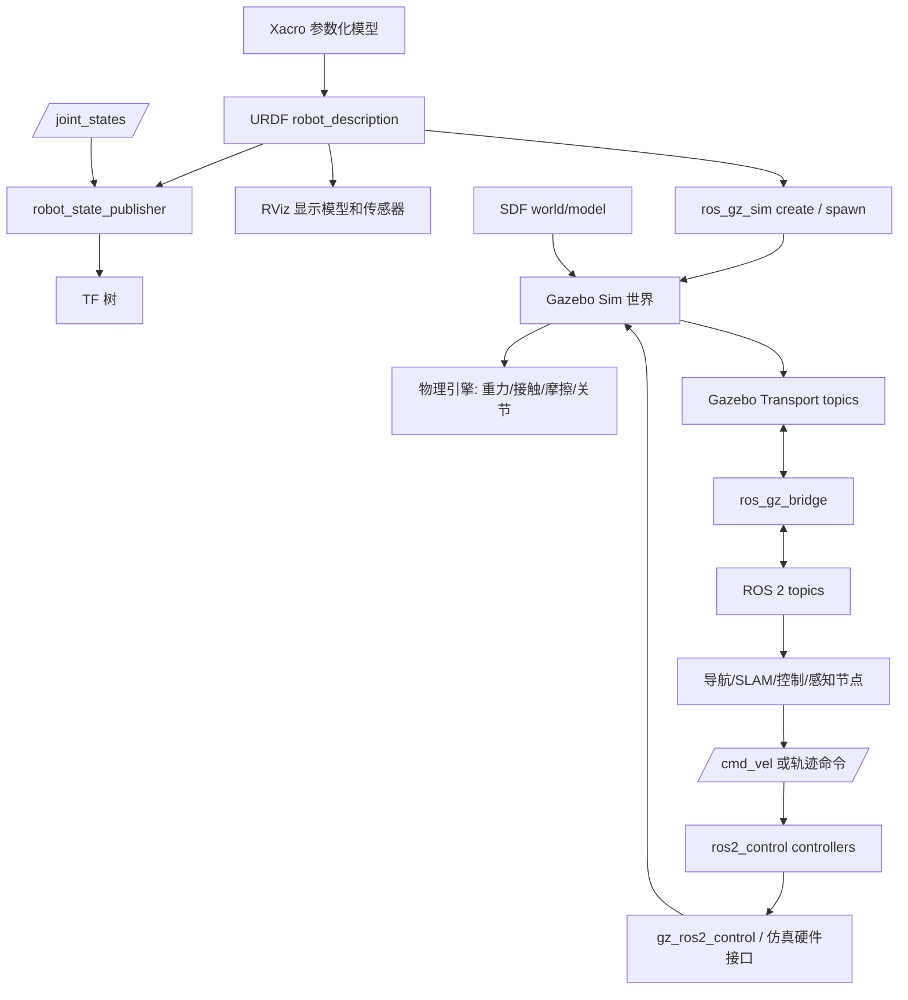
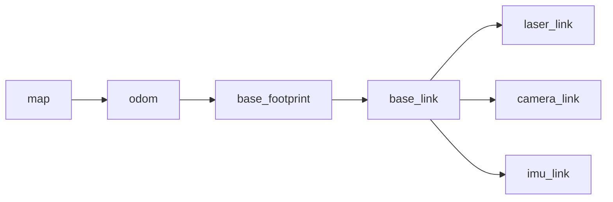
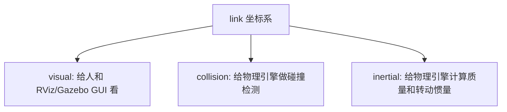
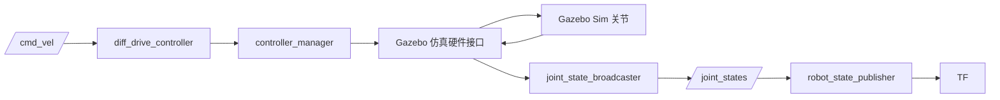

# 机器人仿真完整学习笔记

> Last researched: 2026-06-14  
> 适用主线：ROS 2 + Gazebo Sim + URDF/Xacro + ros2_control + ros_gz  
> 推荐起步环境：Ubuntu 24.04 + ROS 2 Jazzy Jalisco + Gazebo Harmonic。若使用 Ubuntu 26.04，可关注 ROS 2 Lyrical Luth 与其对应 Gazebo 组合，但新手学习仍建议优先选择资料更稳定的 Jazzy/Harmonic。

## 1. 这份笔记解决什么问题

机器人仿真不是“把模型放进软件里看一看”。一个能用于算法验证的仿真系统至少要同时处理：

- 机器人几何结构：底盘、轮子、机械臂、传感器安装位。
- 坐标关系：`map`、`odom`、`base_link`、`laser_link`、`camera_link` 等 TF。
- 物理属性：质量、惯性、碰撞、摩擦、阻尼、关节限制。
- 控制链路：`/cmd_vel`、`joint_states`、控制器、硬件接口。
- 传感器数据：LiDAR、IMU、相机、深度相机、里程计。
- 仿真世界：地面、障碍物、光照、重力、物理引擎、仿真时间。
- ROS 与仿真器之间的数据桥接：Gazebo topic 和 ROS 2 topic 不是同一套通信系统。

新手最常见的问题是直接下载一个复杂模型，然后在 Gazebo 里遇到抖动、飞走、穿模、控制器不动、传感器没数据，却不知道问题来自 URDF、TF、惯性、碰撞、插件、bridge、控制器还是版本组合。更稳的路线是从“最小可运行闭环”开始，再逐层增加复杂度。

## 2. 学习目标

学完后应该能做到：

- 解释一个机器人模型从 Xacro/URDF 到 RViz、Gazebo Sim、ROS 2 topic 的完整链路。
- 区分 RViz、Gazebo Sim、robot_state_publisher、ros2_control、ros_gz_bridge 的职责边界。
- 写出一个包含底盘、轮子、传感器、碰撞和惯性的最小移动机器人模型。
- 用 Xacro 管理尺寸、颜色、惯性公式和重复部件。
- 判断 URDF、SDF、Gazebo 扩展各自适合放什么内容。
- 通过命令检查 TF、topic、controller、clock、Gazebo topic 和 bridge。
- 按层定位常见问题：模型看不到、TF 断裂、仿真发散、小车不动、传感器没数据、时间戳异常。

## 3. 前置知识

建议先具备：

- Linux 基本命令和包管理。
- ROS 2 基础概念：node、topic、service、parameter、launch、workspace。
- XML/YAML/Python launch 的基本阅读能力。
- 坐标系、欧拉角、四元数、刚体位姿、速度的基本概念。

不需要一开始就掌握完整动力学、控制理论或 SLAM。仿真入门最重要的是把模型、TF、物理、控制、传感器这些边界拆清楚。

## 4. 版本选型

### 4.1 推荐组合

| 场景 | 推荐组合 | 说明 |
| --- | --- | --- |
| 新手从零学习 | Ubuntu 24.04 + ROS 2 Jazzy + Gazebo Harmonic | LTS 组合，资料稳定，适合课程、笔记、个人项目 |
| Ubuntu 26.04 新项目 | ROS 2 Lyrical + 对应 Gazebo 发行版 | 适合跟随最新长期支持平台，但早期社区资料少 |
| 复现实验室旧项目 | 严格按项目 README 的 ROS/Gazebo 版本 | 不要随意升级，否则插件名、topic、launch、依赖可能不同 |
| 跟踪最新功能 | ROS 2 Rolling + 最新 Gazebo Sim | API 变化快，不适合作为第一条学习主线 |
| 阅读旧教程 | ROS 1 + Gazebo Classic | 只能参考思想，不建议作为新项目主线 |

ROS 2 发行版与 Ubuntu 版本存在官方支持矩阵。Gazebo 也有自己的版本生命周期。学习时不要混装多个发行版，尤其不要把 Gazebo Classic 的教程命令直接套到 Gazebo Sim。

### 4.2 Gazebo Classic 与 Gazebo Sim

Gazebo Classic 是旧路线，Gazebo Sim 是当前主线。两者常见差异：

| 项目 | Gazebo Classic | Gazebo Sim |
| --- | --- | --- |
| 命令习惯 | `gazebo`、`gzserver`、`gzclient` | `gz sim`、`gz topic`、`gz model` |
| ROS 集成 | `gazebo_ros_pkgs` | `ros_gz`、`ros_gz_bridge`、`ros_gz_sim` |
| 插件生态 | 旧教程多 | 新项目主推 |
| 文档入口 | Classic 文档 | Gazebo Sim 文档 |
| 新手建议 | 只为复现旧项目时使用 | 新学习路线优先选择 |

判断教程是否过期，可以看它是否使用 `gazebo_ros_control`、`gazebo.launch.py`、`spawn_entity.py`、`gzserver`、ROS 1 的 `catkin_make`、`roslaunch`。这些并不一定错误，但往往属于旧技术线。

## 5. 总体架构

一个典型 ROS 2 + Gazebo Sim 机器人仿真系统可以理解为：



核心边界：

- URDF/Xacro 描述“机器人是什么”：link、joint、visual、collision、inertial、传感器安装位、控制接口。
- SDF 描述“仿真世界怎么运行”：world、光照、地面、障碍物、物理参数、传感器和 Gazebo 原生插件。
- RViz 是可视化工具，不是物理仿真器。
- Gazebo Sim 是物理仿真器，负责重力、接触、传感器模拟和仿真时间。
- ROS 2 负责机器人软件通信、控制、感知、导航、规划和系统编排。
- `ros_gz_bridge` 负责 Gazebo Transport 与 ROS 2 topic 之间的消息转换。

## 6. 最小可运行闭环

学习路线建议按这个顺序推进：

1. 写最小 URDF：只有 `base_link` 和一个简单 `visual`。
2. 启动 `robot_state_publisher`，在 RViz 看到模型。
3. 增加 `laser_link`、`camera_link`、`imu_link` 等 fixed joint，检查 TF。
4. 增加轮子 link 和 continuous joint，用 `joint_state_publisher_gui` 检查关节方向。
5. 增加 `collision` 和 `inertial`，让模型具备物理仿真条件。
6. 改成 Xacro，用 property/macro/include 管理重复结构。
7. 启动 Gazebo Sim 空世界，把模型 spawn 进去。
8. 增加控制接口，让轮子响应 `/cmd_vel`。
9. 增加 LiDAR/IMU/相机，并用 `ros_gz_bridge` 桥接到 ROS 2。
10. 最后接入 SLAM、导航、MoveIt 或上层算法。

一个合理的最小项目结构：

```text
ros2_ws/
  src/
    my_robot_description/
      package.xml
      CMakeLists.txt
      urdf/
        my_robot.urdf.xacro
        materials.xacro
        inertial_macros.xacro
      meshes/
      rviz/
        display.rviz
      launch/
        display.launch.py
    my_robot_bringup/
      package.xml
      CMakeLists.txt
      launch/
        sim.launch.py
      config/
        bridge.yaml
        controllers.yaml
```

职责建议：

- `*_description`：只放模型、mesh、RViz 配置和模型显示 launch。
- `*_bringup`：统一启动 Gazebo、bridge、controller、RViz、导航等。
- `*_control`：复杂项目中可单独放控制器配置、硬件接口和控制相关代码。

## 7. 坐标系与 TF

### 7.1 ROS 坐标约定

ROS 常用右手坐标系：

- `x`：前方。
- `y`：左方。
- `z`：上方。
- 长度单位通常是 m。
- 角度单位通常是 rad。
- 质量单位是 kg。
- 惯性矩单位是 `kg*m^2`。

移动机器人常见 frame：

| Frame | 含义 | 常见发布者 |
| --- | --- | --- |
| `map` | 全局地图坐标系，可能因定位修正而跳变 | SLAM、定位系统 |
| `odom` | 局部连续里程计坐标系，会随时间漂移 | 里程计、底盘控制器 |
| `base_footprint` | 机器人在地面的投影，通常 z=0，不含 roll/pitch | 底盘或 TF 节点 |
| `base_link` | 机器人主体坐标系 | URDF/robot_state_publisher |
| `laser_link` | 激光雷达坐标系 | URDF fixed joint |
| `camera_link` | 相机主体坐标系 | URDF fixed joint |
| `imu_link` | IMU 坐标系 | URDF fixed joint |

典型 TF 树：



### 7.2 `origin xyz rpy`

URDF/SDF 中常见：

```xml
<origin xyz="0.2 0 0.1" rpy="0 0 1.5708"/>
```

它表示子坐标系相对父坐标系的位姿：

- `xyz` 是平移，单位 m。
- `rpy` 是 roll、pitch、yaw，单位 rad。
- 90 度约等于 `1.5708` rad，180 度约等于 `3.1416` rad。

常见错误：

| 错误 | 现象 | 修正思路 |
| --- | --- | --- |
| 把角度当弧度 | 模型姿态完全异常 | 所有 URDF/SDF 角度统一换算为 rad |
| 把 mm 当 m | 模型巨大或极小 | mesh 导出和 URDF 尺寸统一检查 |
| 混淆 link origin 与 joint origin | visual 看似正确但 TF 不对 | 先画 parent/child 坐标，再放 visual |
| frame_id 不在 TF 树里 | RViz 显示 `No transform` | 检查 topic header 和 URDF frame 名称 |

### 7.3 TF 检查命令

```bash
ros2 run tf2_tools view_frames
ros2 run tf2_ros tf2_echo base_link laser_link
ros2 topic echo /tf
ros2 topic echo /tf_static
```

排查顺序：

1. `robot_state_publisher` 是否启动。
2. `robot_description` 是否正确加载。
3. `/joint_states` 是否有对应关节。
4. fixed joint 是否出现在 `/tf_static`。
5. 传感器消息的 `header.frame_id` 是否能在 TF 树中找到。

## 8. URDF 核心

URDF 是 Unified Robot Description Format，是 ROS 里描述机器人结构的 XML 格式。它擅长描述树状刚体系统：

- link：刚体。
- joint：link 之间的连接。
- visual：显示用几何。
- collision：碰撞检测用几何。
- inertial：质量和惯性。
- material：颜色和材质。
- ros2_control、Gazebo 相关扩展：控制和仿真插件配置。

URDF 不擅长描述：

- 复杂仿真世界。
- 地形、光照、天气。
- 多机器人场景。
- 闭链机构。
- 复杂接触参数。

这些内容通常放到 SDF 或 Gazebo 插件配置中。

### 8.1 link 的三套模型



三者可以不一样：

- `visual` 可以精细一些，用 `.dae`、`.stl`、`.obj`。
- `collision` 应尽量简单，用 box、cylinder、sphere 或简化 mesh。
- `inertial` 必须数值合理，不能乱填 0。

### 8.2 最小 link 示例

```xml
<link name="base_link">
  <visual>
    <origin xyz="0 0 0" rpy="0 0 0"/>
    <geometry>
      <box size="0.4 0.3 0.1"/>
    </geometry>
    <material name="blue">
      <color rgba="0.1 0.3 0.9 1.0"/>
    </material>
  </visual>

  <collision>
    <origin xyz="0 0 0" rpy="0 0 0"/>
    <geometry>
      <box size="0.4 0.3 0.1"/>
    </geometry>
  </collision>

  <inertial>
    <origin xyz="0 0 0" rpy="0 0 0"/>
    <mass value="2.0"/>
    <inertia ixx="0.0167" ixy="0" ixz="0"
             iyy="0.0283" iyz="0"
             izz="0.0417"/>
  </inertial>
</link>
```

### 8.3 joint 示例

```xml
<joint name="left_wheel_joint" type="continuous">
  <parent link="base_link"/>
  <child link="left_wheel_link"/>
  <origin xyz="0 0.165 -0.025" rpy="0 0 0"/>
  <axis xyz="0 1 0"/>
  <dynamics damping="0.1" friction="0.0"/>
</joint>
```

`axis` 表达在 joint 坐标系下。轮子方向不对时，优先检查：

- 圆柱默认轴向是否与你想象一致。
- visual/collision 是否用了额外 `rpy`。
- joint axis 是否反了。
- 左右轮 joint 名称是否被控制器配置写反。
- 控制器对左右轮速度符号的约定。

### 8.4 常见 joint 类型

| 类型 | 作用 | 常见用途 | 注意事项 |
| --- | --- | --- | --- |
| `fixed` | 固定连接 | 传感器、外壳、支架 | 无运动，无需 joint state |
| `continuous` | 无限旋转 | 轮子 | 不写上下限 |
| `revolute` | 有限旋转 | 机械臂关节、舵机 | 必须设置 limit |
| `prismatic` | 直线滑动 | 升降机构、滑轨 | 必须设置 limit |
| `floating` | 6 自由度 | 少见 | 普通 URDF 项目慎用 |
| `planar` | 平面运动 | 少见 | 支持情况有限 |

### 8.5 URDF 检查清单

- XML 是否闭合。
- link 和 joint 名称是否唯一。
- parent/child 是否拼写正确。
- 是否只有一个根 link。
- link/joint 是否形成树，不要形成环。
- `revolute` 和 `prismatic` 是否有 `limit`。
- `axis` 是否接近单位向量。
- `origin` 单位是否为 m 和 rad。
- mesh 是否使用 `package://` 路径。
- 参与物理仿真的 link 是否有合理 `collision` 和 `inertial`。
- visual 和 collision 的几何是否相对 link 坐标系放置正确。

验证命令：

```bash
ros2 run xacro xacro path/to/robot.urdf.xacro > /tmp/robot.urdf
check_urdf /tmp/robot.urdf
urdf_to_graphiz /tmp/robot.urdf
ros2 launch my_robot_description display.launch.py
```

## 9. Xacro 实战

Xacro 是 XML macro，用来减少 URDF 重复。它适合：

- 抽取尺寸、质量、颜色等 property。
- 用 macro 复用轮子、传感器、惯性块。
- 用 include 拆分材料、惯性公式、底盘、传感器。
- 用条件开关控制是否启用 Gazebo 插件或某些传感器。

### 9.1 property

```xml
<xacro:property name="base_length" value="0.4"/>
<xacro:property name="base_width" value="0.3"/>
<xacro:property name="base_height" value="0.1"/>
<xacro:property name="wheel_radius" value="0.05"/>
<xacro:property name="wheel_width" value="0.03"/>
```

使用：

```xml
<box size="${base_length} ${base_width} ${base_height}"/>
```

### 9.2 macro

```xml
<xacro:macro name="wheel" params="prefix y">
  <link name="${prefix}_wheel_link">
    <visual>
      <origin rpy="1.5708 0 0"/>
      <geometry>
        <cylinder radius="${wheel_radius}" length="${wheel_width}"/>
      </geometry>
    </visual>
    <collision>
      <origin rpy="1.5708 0 0"/>
      <geometry>
        <cylinder radius="${wheel_radius}" length="${wheel_width}"/>
      </geometry>
    </collision>
  </link>

  <joint name="${prefix}_wheel_joint" type="continuous">
    <parent link="base_link"/>
    <child link="${prefix}_wheel_link"/>
    <origin xyz="0 ${y} -0.025"/>
    <axis xyz="0 1 0"/>
  </joint>
</xacro:macro>

<xacro:wheel prefix="left" y="0.165"/>
<xacro:wheel prefix="right" y="-0.165"/>
```

### 9.3 include

```xml
<xacro:include filename="$(find-pkg-share my_robot_description)/urdf/materials.xacro"/>
<xacro:include filename="$(find-pkg-share my_robot_description)/urdf/inertial_macros.xacro"/>
```

建议：

- property 集中放在文件顶部。
- 重复结构用 macro，不要复制粘贴左右轮。
- macro 参数命名清楚，比如 `prefix`、`parent`、`xyz`、`rpy`。
- 展开 Xacro 后再检查 URDF，不要只看源文件。

## 10. 惯性、碰撞和物理稳定性

Gazebo 中模型飞走、抖动、穿模，大量问题都来自不合理的物理参数。

### 10.1 为什么 collision 要简单

复杂 mesh 直接作为 collision 会带来：

- 碰撞检测慢。
- 接触点数量过多。
- 数值解算不稳定。
- 细小面片导致抖动。
- 与视觉模型原点或尺度不一致时更难排查。

建议：

- 底盘 collision 用 box。
- 轮子 collision 用 cylinder。
- 球形结构用 sphere。
- 复杂外壳用多个简单几何近似。
- 只有确实需要时才用简化 mesh。

### 10.2 常用惯性公式

长方体，质量 `m`，尺寸 `x, y, z`：

```text
ixx = 1/12 * m * (y^2 + z^2)
iyy = 1/12 * m * (x^2 + z^2)
izz = 1/12 * m * (x^2 + y^2)
```

实心圆柱，质量 `m`，半径 `r`，长度 `l`，若圆柱轴沿 z：

```text
ixx = 1/12 * m * (3*r^2 + l^2)
iyy = 1/12 * m * (3*r^2 + l^2)
izz = 1/2  * m * r^2
```

球体，质量 `m`，半径 `r`：

```text
ixx = iyy = izz = 2/5 * m * r^2
```

如果圆柱通过 `rpy` 转了方向，要确认惯性矩是否也对应到 link 坐标系。初学阶段可以让轮子 link 坐标系与圆柱轴向设计保持一致，减少心智负担。

### 10.3 物理稳定性清单

- 质量不要极端小，例如 `0.0001 kg` 的大部件。
- 惯性矩不要为 0。
- 碰撞体不要与地面初始重叠。
- 左右轮不要和底盘 collision 重叠太多。
- 不要把视觉 mesh 的毫米尺度误当米。
- 关节限制不要过窄或与初始姿态冲突。
- 接触摩擦不要一开始就设得极端。
- 控制命令先用小速度测试。
- Gazebo 暂停时不要误以为控制器失效。

## 11. Gazebo Sim 与 SDF

SDF 是 Simulation Description Format。Gazebo Sim 原生使用 SDF 描述 world、model、link、joint、sensor、plugin、physics 等仿真元素。

### 11.1 URDF 与 SDF 的边界

| 内容 | 更适合放 URDF/Xacro | 更适合放 SDF |
| --- | --- | --- |
| 机器人 link/joint 树 | 是 | 可，但 ROS 生态通常仍用 URDF |
| visual/collision/inertial | 是 | 是 |
| 传感器安装位 | 是 | 也可 |
| 仿真 world | 否 | 是 |
| 地面、光照、障碍物 | 否 | 是 |
| 物理引擎参数 | 少量扩展 | 是 |
| 多机器人场景 | 不适合 | 是 |
| Gazebo 原生插件 | 可用扩展 | 是 |

实用建议：

- 机器人本体主描述放 URDF/Xacro，方便 RViz、robot_state_publisher、MoveIt、Nav2 等使用。
- world、场景、地面、光照和仿真全局参数放 SDF。
- Gazebo 专属参数可通过 URDF 中的 `<gazebo>` 扩展或 SDF model 补充。

### 11.2 最小 world

```xml
<?xml version="1.0" ?>
<sdf version="1.10">
  <world name="default">
    <gravity>0 0 -9.8</gravity>

    <light name="sun" type="directional">
      <pose>0 0 10 0 0 0</pose>
      <diffuse>0.8 0.8 0.8 1</diffuse>
      <specular>0.2 0.2 0.2 1</specular>
      <direction>-0.5 0.1 -0.9</direction>
    </light>

    <model name="ground_plane">
      <static>true</static>
      <link name="link">
        <collision name="collision">
          <geometry>
            <plane>
              <normal>0 0 1</normal>
              <size>100 100</size>
            </plane>
          </geometry>
        </collision>
        <visual name="visual">
          <geometry>
            <plane>
              <normal>0 0 1</normal>
              <size>100 100</size>
            </plane>
          </geometry>
        </visual>
      </link>
    </model>
  </world>
</sdf>
```

启动：

```bash
gz sim path/to/world.sdf
```

查看 Gazebo topic：

```bash
gz topic -l
gz topic -i -t /clock
gz model --list
```

### 11.3 加载机器人

常见方式是通过 ROS 2 launch 启动 Gazebo，再用 `ros_gz_sim create` 创建模型：

```bash
ros2 run ros_gz_sim create -topic robot_description -name my_robot
```

实际项目中通常写入 launch：

```python
Node(
    package="ros_gz_sim",
    executable="create",
    arguments=["-topic", "robot_description", "-name", "my_robot"],
    output="screen",
)
```

## 12. ros_gz_bridge

Gazebo Sim 使用 Gazebo Transport，ROS 2 使用 DDS。两边 topic 名称可能一样，但不是同一个通信系统。`ros_gz_bridge` 的任务是把消息类型互相转换。

### 12.1 桥接方向

常见写法：

```bash
ros2 run ros_gz_bridge parameter_bridge /clock@rosgraph_msgs/msg/Clock[gz.msgs.Clock
```

方向符号常见含义：

- `[`：Gazebo 到 ROS。
- `]`：ROS 到 Gazebo。
- `@`：双向桥接。

不同版本命令细节可能变化，实际使用前优先看：

```bash
ros2 run ros_gz_bridge parameter_bridge --help
```

### 12.2 常见桥接项

| 数据 | Gazebo -> ROS | 典型 ROS topic |
| --- | --- | --- |
| 仿真时间 | 是 | `/clock` |
| LiDAR | 是 | `/scan` |
| IMU | 是 | `/imu` |
| 相机图像 | 是 | `/camera/image` |
| 深度图 | 是 | `/camera/depth/image` |
| 点云 | 是 | `/points` |
| 速度命令 | 通常 ROS -> Gazebo 或 ROS -> controller | `/cmd_vel` |

如果 Gazebo 里能看到传感器数据，但 `ros2 topic list` 看不到，优先排查 bridge。

### 12.3 bridge 调试

```bash
gz topic -l
gz topic -i -t /world/default/clock
ros2 topic list
ros2 topic info /scan
ros2 topic hz /scan
ros2 topic echo /clock
```

重点检查：

- Gazebo topic 是否存在。
- ROS topic 是否存在。
- bridge 方向是否正确。
- 消息类型是否匹配。
- topic 名称是否重映射。
- `frame_id` 是否能在 TF 树里找到。

## 13. ros2_control 与控制链路

`ros2_control` 把“上层控制器”和“硬件或仿真硬件接口”分开。核心概念：

| 概念 | 作用 |
| --- | --- |
| hardware interface | 真实硬件或仿真硬件的读写接口 |
| controller manager | 管理控制器生命周期 |
| controller | 具体控制逻辑，如 diff_drive_controller、joint_state_broadcaster |
| command interface | 控制器写入的命令，如速度、位置、力矩 |
| state interface | 硬件反馈的状态，如位置、速度、力 |

控制链路：



### 13.1 URDF 中的 ros2_control 片段

```xml
<ros2_control name="GazeboSystem" type="system">
  <hardware>
    <plugin>gz_ros2_control/GazeboSimSystem</plugin>
  </hardware>

  <joint name="left_wheel_joint">
    <command_interface name="velocity"/>
    <state_interface name="position"/>
    <state_interface name="velocity"/>
  </joint>

  <joint name="right_wheel_joint">
    <command_interface name="velocity"/>
    <state_interface name="position"/>
    <state_interface name="velocity"/>
  </joint>
</ros2_control>
```

插件名和包名会随 Gazebo/ROS 组合变化，必须以当前版本官方文档为准。

### 13.2 controllers.yaml 示例

```yaml
controller_manager:
  ros__parameters:
    update_rate: 100

    joint_state_broadcaster:
      type: joint_state_broadcaster/JointStateBroadcaster

    diff_drive_controller:
      type: diff_drive_controller/DiffDriveController

diff_drive_controller:
  ros__parameters:
    left_wheel_names: ["left_wheel_joint"]
    right_wheel_names: ["right_wheel_joint"]
    wheel_separation: 0.33
    wheel_radius: 0.05
    base_frame_id: base_link
    odom_frame_id: odom
    publish_rate: 50.0
    use_stamped_vel: false
```

加载控制器：

```bash
ros2 control list_controllers
ros2 control list_hardware_interfaces
ros2 control load_controller --set-state active joint_state_broadcaster
ros2 control load_controller --set-state active diff_drive_controller
```

发送速度：

```bash
ros2 topic pub /cmd_vel geometry_msgs/msg/Twist "{linear: {x: 0.1}, angular: {z: 0.0}}" --once
ros2 topic pub /cmd_vel geometry_msgs/msg/Twist "{linear: {x: 0.0}, angular: {z: 0.2}}" --once
```

### 13.3 小车不动时的排查顺序

1. Gazebo 是否暂停。
2. `/clock` 是否正常。
3. `ros2 control list_controllers` 中控制器是否 `active`。
4. `ros2 control list_hardware_interfaces` 中 command/state interface 是否存在。
5. `/cmd_vel` 是否发到了控制器实际订阅的话题。
6. 控制器参数中的 joint 名称是否与 URDF 完全一致。
7. wheel radius、wheel separation 是否合理。
8. 轮子 joint axis 是否正确。
9. 轮子 collision 是否与地面接触，摩擦是否合理。
10. 质量、惯性是否导致物理发散。

## 14. 传感器仿真

### 14.1 通用原则

传感器建模要同时考虑：

- 传感器安装位：URDF fixed joint。
- 传感器数据生成：Gazebo/SDF sensor。
- 数据桥接：`ros_gz_bridge`。
- ROS 消息 frame：`header.frame_id`。
- 噪声、频率、分辨率、范围。
- RViz 显示和上层算法输入要求。

### 14.2 LiDAR

关注参数：

- 水平扫描角度范围。
- beam 数量。
- 最小/最大距离。
- update rate。
- 噪声。
- frame_id。

调试：

```bash
gz topic -l | grep scan
ros2 topic hz /scan
ros2 topic echo /scan --once
ros2 run tf2_ros tf2_echo base_link laser_link
```

常见问题：

- Gazebo 有扫描，ROS 没有：bridge 未配置。
- RViz 看不到 scan：fixed frame 不对或 TF 缺失。
- scan 全是 inf：环境中没有障碍物，或 range 设置不合理。
- scan 方向不对：`laser_link` 姿态或 Gazebo sensor pose 错误。

### 14.3 IMU

关注参数：

- 角速度。
- 线加速度。
- 姿态估计。
- 噪声和 bias。
- frame_id。

调试：

```bash
ros2 topic echo /imu --once
ros2 topic hz /imu
ros2 run tf2_ros tf2_echo base_link imu_link
```

注意：理想 IMU 往往会让算法在仿真里表现过好。用于接近真实部署时，应加入合理噪声和延迟。

### 14.4 相机和深度相机

关注参数：

- 分辨率。
- 水平视场角。
- update rate。
- clip near/far。
- 光照。
- 图像 topic、camera_info topic。
- optical frame 坐标约定。

调试：

```bash
ros2 topic list | grep camera
ros2 topic hz /camera/image
ros2 topic echo /camera/camera_info --once
rviz2
```

## 15. 仿真时间

Gazebo 发布仿真时间，ROS 2 节点如果要使用仿真时间，需要设置：

```yaml
use_sim_time: true
```

常见现象：

| 问题 | 现象 | 检查 |
| --- | --- | --- |
| `/clock` 未桥接 | ROS 节点没有仿真时间 | `ros2 topic echo /clock` |
| 部分节点没开 `use_sim_time` | 时间戳不一致，TF extrapolation | `ros2 param get /node use_sim_time` |
| Gazebo 暂停 | 时间停止，依赖 timer 的节点不动 | Gazebo GUI 或 `/clock` |
| bag 与仿真时间混用 | 回放/算法不同步 | 统一时间源 |

排查命令：

```bash
ros2 topic echo /clock
ros2 param list | grep use_sim_time
ros2 param get /robot_state_publisher use_sim_time
```

仿真系统中，时间是底层基础设施。传感器、TF、导航、SLAM、控制器都依赖时间戳一致。

## 16. 常用命令速查

### ROS 2

```bash
ros2 node list
ros2 node info /robot_state_publisher
ros2 topic list
ros2 topic info /joint_states
ros2 topic hz /scan
ros2 topic echo /clock
ros2 service list
ros2 param list
ros2 param get /robot_state_publisher robot_description
ros2 doctor
```

### TF

```bash
ros2 run tf2_tools view_frames
ros2 run tf2_ros tf2_echo base_link laser_link
```

### Xacro/URDF

```bash
ros2 run xacro xacro robot.urdf.xacro > /tmp/robot.urdf
check_urdf /tmp/robot.urdf
urdf_to_graphiz /tmp/robot.urdf
```

### Gazebo

```bash
gz sim
gz sim world.sdf
gz topic -l
gz topic -i -t /clock
gz model --list
gz --help
```

### ros2_control

```bash
ros2 control list_controllers
ros2 control list_hardware_components
ros2 control list_hardware_interfaces
ros2 control load_controller --set-state active joint_state_broadcaster
ros2 control load_controller --set-state active diff_drive_controller
```

## 17. 调试矩阵

| 现象 | 优先怀疑 | 检查命令 | 常见修复 |
| --- | --- | --- | --- |
| RViz 看不到模型 | `robot_description`、fixed frame、TF | `ros2 param get`、`view_frames` | 修正 launch、fixed frame、URDF |
| TF 树断裂 | joint state 缺失、frame 名称不一致 | `tf2_echo`、`/joint_states` | 修正 joint 名称和 frame_id |
| Gazebo 模型飞走 | 惯性、质量、collision 重叠 | Gazebo GUI、URDF 检查 | 修正 inertial，简化 collision |
| 小车不动 | controller inactive、topic 错、joint 名错 | `ros2 control list_controllers` | 激活控制器，修正 YAML |
| 小车方向反 | 轮子轴、左右轮符号、半径/轮距 | 小速度 `/cmd_vel` | 修正 axis、joint 名称和参数 |
| 传感器没数据 | sensor 未生成、bridge 缺失 | `gz topic -l`、`ros2 topic list` | 配置 sensor 和 bridge |
| RViz sensor 报 TF 错 | frame_id 不在 TF 树 | `tf2_echo`、topic echo | 修正 frame_id 或 fixed joint |
| 时间戳异常 | `/clock`、`use_sim_time` | `ros2 topic echo /clock` | 桥接 clock，统一参数 |
| 仿真很慢 | collision 太复杂、传感器频率高 | real time factor | 简化模型，降低频率 |

## 18. 社区经验提炼

结合中文社区常见 ROS 2/Gazebo 仿真文章和问题记录，可以把实践坑总结为：

- 不要混用 ROS 1、ROS 2、Gazebo Classic、Gazebo Sim 的命令。很多旧教程思想有价值，但命令、包名和插件名不能直接复制。
- 先让模型在 RViz 中正确，再进入 Gazebo。RViz 阶段能提前发现 frame、joint、mesh 路径和尺度问题。
- Gazebo 里能看到数据，不代表 ROS 2 能看到。两边 topic 需要 bridge，且消息类型和方向要对。
- `use_sim_time` 要统一设置。只给部分节点设置会导致 TF 和传感器时间戳问题。
- `visual` 好看不等于 `collision` 合理。仿真稳定性主要看 collision 和 inertial。
- 控制器问题不要从 `/cmd_vel` 一路猜到物理引擎，先看 controller 是否 active，再看硬件接口和 joint 名称。
- 轮式机器人方向异常时，优先用很小的线速度和角速度分开测试。不要一开始同时给线速度和角速度。
- 传感器调试要同时看 Gazebo topic、ROS topic、frame_id 和 RViz fixed frame。

## 19. 练习项目

### 练习 1：最小显示模型

目标：

- 创建 `my_robot_description`。
- 写一个只有 `base_link` 的 URDF/Xacro。
- 在 RViz 中显示。

验收：

```bash
ros2 launch my_robot_description display.launch.py
ros2 run tf2_tools view_frames
```

### 练习 2：两轮小车

目标：

- 增加左右轮 link。
- 使用 continuous joint。
- 用 `joint_state_publisher_gui` 检查轮子旋转方向。

验收：

- TF 树连续。
- wheel joint 在 GUI 中可动。
- 视觉方向符合预期。

### 练习 3：Xacro 参数化

目标：

- 抽取底盘尺寸、轮子半径、轮距。
- 写 wheel macro。
- 写 inertial macro。

验收：

```bash
ros2 run xacro xacro urdf/my_robot.urdf.xacro > /tmp/my_robot.urdf
check_urdf /tmp/my_robot.urdf
```

### 练习 4：进入 Gazebo

目标：

- 写最小 `world.sdf`。
- spawn 机器人。
- 检查模型不飞、不抖、不穿地。

验收：

```bash
gz topic -l
gz model --list
```

### 练习 5：控制和传感器

目标：

- 配置 `ros2_control`。
- 启动 diff drive controller。
- 添加 LiDAR 或 IMU。
- 桥接 `/clock` 和传感器 topic。

验收：

```bash
ros2 control list_controllers
ros2 topic pub /cmd_vel geometry_msgs/msg/Twist "{linear: {x: 0.1}, angular: {z: 0.0}}" --once
ros2 topic hz /scan
ros2 topic echo /clock
```

## 20. 学习路线

| 阶段 | 目标 | 最小产物 | 不要急着做 |
| --- | --- | --- | --- |
| 坐标系 | 看懂 TF 和 `origin` | `base_link` + `laser_link` | 不要先接导航 |
| URDF | 写出结构树 | 小车模型能在 RViz 显示 | 不要直接上复杂 mesh |
| 物理属性 | 模型能稳定落地 | collision + inertial | 不要乱填质量和惯性 |
| Xacro | 参数化复用 | wheel macro、inertial macro | 不要过度抽象 |
| Gazebo | 能进入物理世界 | world + spawn | 不要混用 Classic 教程 |
| 控制 | 小车可响应命令 | ros2_control + diff drive | 不要跳过 controller 状态检查 |
| 传感器 | 数据进入 ROS | `/scan`、`/imu`、`/clock` | 不要忘记 bridge 和 TF |
| 上层算法 | 导航/SLAM/规划 | Nav2、SLAM、MoveIt | 不要在底层不稳时调算法 |

## 21. 关键判断标准

一个机器人仿真项目达到“可以继续接算法”的最低标准：

- `colcon build` 无错误。
- Xacro 能展开，URDF 能通过基础检查。
- RViz 中模型、TF、传感器 frame 正常。
- Gazebo 中模型稳定，不飞走、不明显抖动、不穿地。
- `/clock` 正常，关键节点使用 `use_sim_time`。
- 控制器 active，`/cmd_vel` 能让机器人按预期移动。
- `/joint_states` 正常发布。
- 传感器数据在 Gazebo 和 ROS 2 两侧都能观察。
- 传感器消息的 `frame_id` 在 TF 树中存在。
- 问题能按模型层、TF 层、Gazebo 层、bridge 层、控制层、算法层分层定位。

## References and further reading

- Official: ROS 2 Documentation, https://docs.ros.org/
- Official: ROS 2 Jazzy Documentation, https://docs.ros.org/en/jazzy/
- Official: ROS 2 Jazzy Installation, https://docs.ros.org/en/jazzy/Installation.html
- Official: ROS REP 2000, ROS 2 distribution target platforms, https://www.ros.org/reps/rep-2000.html
- Official: ROS REP 103, Standard Units of Measure and Coordinate Conventions, https://www.ros.org/reps/rep-0103.html
- Official: ROS REP 105, Coordinate Frames for Mobile Platforms, https://www.ros.org/reps/rep-0105.html
- Official: ROS 2 tf2 tutorials, https://docs.ros.org/en/jazzy/Tutorials/Intermediate/Tf2/Tf2-Main.html
- Official: ROS 2 URDF tutorials, https://docs.ros.org/en/jazzy/Tutorials/Intermediate/URDF/URDF-Main.html
- Official: robot_state_publisher package, https://docs.ros.org/en/jazzy/p/robot_state_publisher/
- Official: xacro package documentation, https://docs.ros.org/en/jazzy/p/xacro/
- Official: Gazebo Sim Documentation, https://gazebosim.org/docs/
- Official: Gazebo Harmonic Documentation, https://gazebosim.org/docs/harmonic/
- Official: Gazebo ROS installation guidance, https://gazebosim.org/docs/harmonic/ros_installation/
- Official: Gazebo ROS 2 integration overview, https://gazebosim.org/docs/harmonic/ros2_overview/
- Official: ros_gz project repository, https://github.com/gazebosim/ros_gz
- Official: ros_gz_bridge documentation, https://docs.ros.org/en/jazzy/p/ros_gz_bridge/
- Official: SDFormat specification, http://sdformat.org/spec
- Official: ros2_control documentation, https://control.ros.org/jazzy/
- Official: gz_ros2_control documentation, https://control.ros.org/jazzy/doc/gz_ros2_control/doc/index.html
- Official: diff_drive_controller documentation, https://control.ros.org/jazzy/doc/ros2_controllers/diff_drive_controller/doc/userdoc.html
- Official: Modern Robotics online textbook, https://modernrobotics.northwestern.edu/nu-gm-book-resource/
- Community: 鱼香ROS / 动手学 ROS 2, https://fishros.org.cn/
- Community: CSDN ROS2 Gazebo Sim ros_gz_bridge 实践文章检索, https://so.csdn.net/so/search?q=ROS2%20Gazebo%20Sim%20ros_gz_bridge
- Community: 博客园 ROS2 Gazebo 仿真实践文章检索, https://zzk.cnblogs.com/s?w=ROS2%20Gazebo%20%E4%BB%BF%E7%9C%9F
- Community: 掘金 ROS2 Gazebo 仿真实践文章检索, https://juejin.cn/search?query=ROS2%20Gazebo%20%E4%BB%BF%E7%9C%9F
