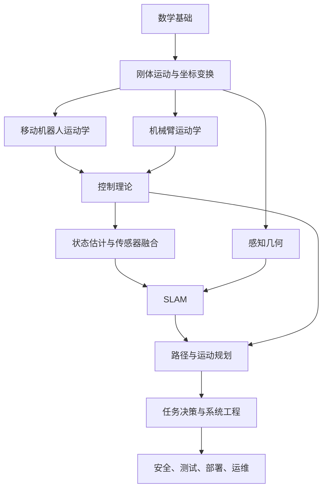

# 机器人学理论学习笔记总览

> Last researched: 2026-06-14  
> 适合对象：零基础转行机器人方向，希望系统补齐机器人学理论，并能把理论用到 ROS 2、Nav2、MoveIt 2、仿真和企业项目中。

## 学习方式

机器人学理论不要当成纯数学课学。更有效的方式是：

1. 先知道理论解决什么工程问题。
2. 再掌握核心概念和必要公式。
3. 用 Python、ROS 2、仿真或小项目验证。
4. 最后把理论和真实项目问题对应起来。

## 推荐阅读顺序

| 顺序 | 文件 | 目标 |
|---|---|---|
| 1 | [01_math_foundations.md](01_数学基础.md) | 补齐机器人最常用的数学基础 |
| 2 | [02_rigid_body_motion_and_tf.md](02_刚体运动坐标变换.md) | 理解坐标系、姿态、刚体变换和 TF |
| 3 | [03_mobile_robot_kinematics.md](03_移动机器人运动学.md) | 理解差速、阿克曼、全向底盘如何运动 |
| 4 | [04_manipulator_kinematics.md](04_机械臂运动学.md) | 理解机械臂正逆运动学、雅可比和奇异位形 |
| 5 | [05_dynamics_and_control.md](05_动力学与控制理论.md) | 理解动力学、PID、轨迹跟踪和闭环控制 |
| 6 | [06_state_estimation_sensor_fusion.md](06_状态估计与传感器融合.md) | 理解噪声、卡尔曼滤波、粒子滤波和传感器融合 |
| 7 | [07_slam_theory.md](07_Slam理论.md) | 理解 SLAM 的前端、后端、回环和地图 |
| 8 | [08_motion_planning.md](08_路径规划.md) | 理解 A*、RRT、轨迹优化、Nav2 和 MoveIt 规划思想 |
| 9 | [09_robot_perception_geometry.md](09_机器人感知几何.md) | 理解相机模型、标定、点云、ICP 和手眼标定 |
| 10 | [10_robot_modeling_and_simulation.md](10_机器人建模仿真与数字孪生.md) | 理解 URDF/SDF、仿真、传感器模型和数字孪生 |
| 11 | [11_task_planning_behavior_trees.md](11_任务规划状态机与行为树.md) | 理解状态机、行为树、任务规划和失败恢复 |
| 12 | [12_robot_safety_systems_engineering.md](12_机器人安全可靠性与系统工程.md) | 理解企业级机器人安全、可靠性、测试和系统工程 |

## 理论知识地图

## 每个方向最终要能解决的问题

| 方向 | 你应该能解决的问题 |
|---|---|
| 数学基础 | 看懂机器人论文和文档里的矩阵、概率、优化目标 |
| 刚体运动 | 正确处理 `map`、`odom`、`base_link`、传感器坐标系 |
| 移动机器人运动学 | 从速度指令推导轮速，理解里程计漂移 |
| 机械臂运动学 | 从关节角得到末端位姿，理解抓取和规划为什么失败 |
| 动力学与控制 | 调 PID，理解振荡、超调、延迟和限幅 |
| 状态估计 | 融合轮速计、IMU、GPS、LiDAR 或视觉定位 |
| SLAM | 判断建图失败、定位漂移和回环错误的原因 |
| 运动规划 | 理解全局规划、局部规划、碰撞检测和轨迹优化 |
| 感知几何 | 做相机标定、点云处理、手眼标定和坐标投影 |
| 建模与仿真 | 正确建立机器人模型，理解仿真和真机差异 |
| 任务规划 | 设计巡检、抓取、充电、恢复等任务逻辑 |
| 系统工程 | 设计安全策略、日志、回归测试和故障恢复 |

## References and further reading

- [Modern Robotics](https://modernrobotics.northwestern.edu/)
- [ROS 2 Documentation](https://docs.ros.org/en/jazzy/)
- [ROS 2 TF2 Tutorials](https://docs.ros.org/en/jazzy/Tutorials/Intermediate/Tf2/Tf2-Main.html)
- [Probabilistic Robotics](https://probabilistic-robotics.org/)
- [State Estimation for Robotics](https://github.com/utiasSTARS/state-estimation-for-robotics)
- [Planning Algorithms](https://lavalle.pl/planning/)
- [Navigation2 Documentation](https://docs.nav2.org/)
- [MoveIt 2 Documentation](https://moveit.picknik.ai/main/index.html)
- [OpenCV Camera Calibration](https://docs.opencv.org/4.x/dc/dbb/tutorial_py_calibration.html)
- [Open3D Registration Tutorial](https://www.open3d.org/docs/release/tutorial/pipelines/registration.html)
