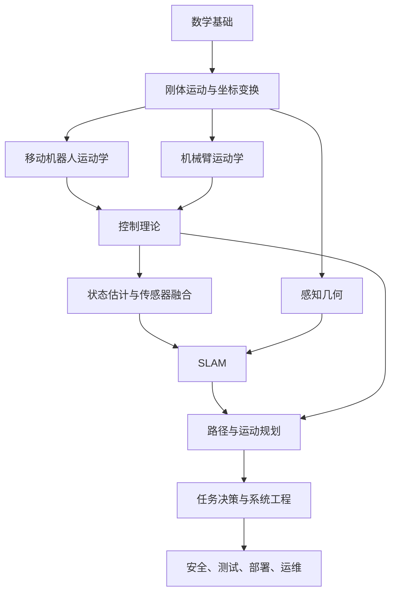

# 机器人学理论学习笔记总览

> Last researched: 2026-06-14  
> 适合对象：零基础转行机器人方向，希望系统补齐机器人学理论，并能把理论用到 ROS 2、Nav2、MoveIt 2、仿真和企业项目中。

## 学习方式

机器人学理论不要当成纯数学课学。更有效的方式是：

1. 先知道理论解决什么工程问题。
2. 再掌握核心概念和必要公式。
3. 用 Python、ROS 2、仿真或小项目验证。
4. 最后把理论和真实项目问题对应起来。

## 推荐阅读顺序

| 顺序 | 文件 | 目标 |
|---|---|---|
| 1 | [01_math_foundations.md](01_数学基础.md) | 补齐机器人最常用的数学基础 |
| 2 | [02_rigid_body_motion_and_tf.md](02_刚体运动坐标变换.md) | 理解坐标系、姿态、刚体变换和 TF |
| 3 | [03_mobile_robot_kinematics.md](03_移动机器人运动学.md) | 理解差速、阿克曼、全向底盘如何运动 |
| 4 | [04_manipulator_kinematics.md](04_机械臂运动学.md) | 理解机械臂正逆运动学、雅可比和奇异位形 |
| 5 | [05_dynamics_and_control.md](05_动力学与控制理论.md) | 理解动力学、PID、轨迹跟踪和闭环控制 |
| 6 | [06_state_estimation_sensor_fusion.md](06_状态估计与传感器融合.md) | 理解噪声、卡尔曼滤波、粒子滤波和传感器融合 |
| 7 | [07_slam_theory.md](07_Slam理论.md) | 理解 SLAM 的前端、后端、回环和地图 |
| 8 | [08_motion_planning.md](08_路径规划.md) | 理解 A*、RRT、轨迹优化、Nav2 和 MoveIt 规划思想 |
| 9 | [09_robot_perception_geometry.md](09_机器人感知几何.md) | 理解相机模型、标定、点云、ICP 和手眼标定 |
| 10 | [10_robot_modeling_and_simulation.md](10_机器人建模仿真与数字孪生.md) | 理解 URDF/SDF、仿真、传感器模型和数字孪生 |
| 11 | [11_task_planning_behavior_trees.md](11_任务规划状态机与行为树.md) | 理解状态机、行为树、任务规划和失败恢复 |
| 12 | [12_robot_safety_systems_engineering.md](12_机器人安全可靠性与系统工程.md) | 理解企业级机器人安全、可靠性、测试和系统工程 |

## 理论知识地图



## 每个方向最终要能解决的问题

| 方向 | 你应该能解决的问题 |
|---|---|
| 数学基础 | 看懂机器人论文和文档里的矩阵、概率、优化目标 |
| 刚体运动 | 正确处理 `map`、`odom`、`base_link`、传感器坐标系 |
| 移动机器人运动学 | 从速度指令推导轮速，理解里程计漂移 |
| 机械臂运动学 | 从关节角得到末端位姿，理解抓取和规划为什么失败 |
| 动力学与控制 | 调 PID，理解振荡、超调、延迟和限幅 |
| 状态估计 | 融合轮速计、IMU、GPS、LiDAR 或视觉定位 |
| SLAM | 判断建图失败、定位漂移和回环错误的原因 |
| 运动规划 | 理解全局规划、局部规划、碰撞检测和轨迹优化 |
| 感知几何 | 做相机标定、点云处理、手眼标定和坐标投影 |
| 建模与仿真 | 正确建立机器人模型，理解仿真和真机差异 |
| 任务规划 | 设计巡检、抓取、充电、恢复等任务逻辑 |
| 系统工程 | 设计安全策略、日志、回归测试和故障恢复 |

## References and further reading

- [Modern Robotics](https://modernrobotics.northwestern.edu/)
- [ROS 2 Documentation](https://docs.ros.org/en/jazzy/)
- [ROS 2 TF2 Tutorials](https://docs.ros.org/en/jazzy/Tutorials/Intermediate/Tf2/Tf2-Main.html)
- [Probabilistic Robotics](https://probabilistic-robotics.org/)
- [State Estimation for Robotics](https://github.com/utiasSTARS/state-estimation-for-robotics)
- [Planning Algorithms](https://lavalle.pl/planning/)
- [Navigation2 Documentation](https://docs.nav2.org/)
- [MoveIt 2 Documentation](https://moveit.picknik.ai/main/index.html)
- [OpenCV Camera Calibration](https://docs.opencv.org/4.x/dc/dbb/tutorial_py_calibration.html)
- [Open3D Registration Tutorial](https://www.open3d.org/docs/release/tutorial/pipelines/registration.html)
## 2026-06 系统化补充：机器人学理论学习笔记总览

Last researched: 2026-06-16

### 总体定位

理论总览应该把数学、运动学、动力学、估计、规划和安全串成一张可执行路线图。 本文覆盖的主线是：理论分册导读、知识依赖、阅读顺序和实践衔接。学习机器人技术时，最重要的不是把知识点分开背，而是把它们组织成能运行、能调试、能迭代的系统。一个完整机器人项目至少包含模型、通信、坐标、控制、感知、规划、任务、安全和运维，每个模块都有自己的输入输出和失败模式。


Figure: 本图为面向机器人学习笔记的通用工程闭环，综合 ROS 2、REP 103/105、Nav2、Gazebo Sim 与 ros2_control 官方资料重新整理。


### 系统分层

| 层级 | 典型内容 | 关键问题 |
| --- | --- | --- |
| 硬件层 | 电机、驱动器、传感器、计算平台、电源 | 能否稳定供电、通信、采样和执行 |
| 模型层 | URDF、Xacro、SDF、TF、外参 | 软件中的机器人是否和真实机器人一致 |
| 中间件层 | ROS 2 节点、Topic、Service、Action、QoS | 数据是否按正确语义传递 |
| 控制层 | PID、轨迹控制、ros2_control、安全限幅 | 命令能否变成稳定运动 |
| 感知估计层 | IMU、雷达、相机、SLAM、滤波 | 状态是否可信，不确定性是否合理 |
| 规划任务层 | Nav2、MoveIt 2、行为树、状态机 | 任务是否可执行，失败是否可恢复 |
| 工程运维层 | Launch、参数、日志、rosbag、测试、部署 | 问题能否复现、定位和回归 |

### 学习方法

第一，始终用“最小闭环”学习。ROS 2 的最小闭环可以是 talker/listener；移动机器人的最小闭环可以是 `/cmd_vel -> 控制器 -> /odom -> TF -> RViz`；导航的最小闭环可以是 `map + AMCL + costmap + planner + controller + bt_navigator`。闭环越小，问题越容易定位。

第二，始终记录版本和假设。机器人生态变化很快，ROS 2 发行版、Gazebo 版本、Nav2 参数、ros2_control 接口和教程命令都会随时间变化。笔记中保留 Last researched 日期和官方链接，可以避免未来按过期教程排错。

第三，始终区分“概念正确”和“工程可运行”。例如 TF 树概念上很简单，但工程上会遇到 frame 拼写、时间戳、重复发布、静态/动态变换混用、仿真时间和 rosbag 回放问题。真正掌握一个概念，必须知道它的常见失败模式。

### 项目验收指标

- 能从源码干净构建：`colcon build --symlink-install` 无错误，依赖写在 `package.xml` 和构建文件中。
- 能一键启动：bringup launch 能启动核心节点，参数路径和命名空间清楚。
- 能看见坐标：`view_frames` 生成的 TF 树连通，没有重复发布核心边。
- 能记录数据：关键 topic 可用 rosbag2 录制并回放。
- 能解释失败：遇到导航失败、控制不动、传感器不显示时，有固定排查顺序。
- 能迁移实机：仿真接口和实机接口职责一致，安全限幅和急停不依赖上层算法。

### 常见系统级误区

- 把 ROS 2 当算法库，而不是系统集成框架。
- 把 RViz 显示正常当作仿真物理正常。
- 把 Gazebo 仿真跑通当作实机一定可行。
- 把 Nav2 参数调不通归因于 planner，而忽略 TF、odom、scan、costmap 和 footprint。
- 把控制命令直接发到底盘，缺少 timeout、限速、急停和状态反馈。
- 把所有逻辑写进单节点，导致后期无法测试、复用和定位问题。

### 建议的长期笔记组织方式

每篇笔记都建议保留五类信息：核心概念、最小例子、工程接口、调试清单、参考来源。核心概念帮助建立判断力，最小例子帮助验证理解，工程接口帮助接入项目，调试清单帮助复现问题，参考来源帮助未来更新。对机器人学习来说，这种结构比单纯复制命令更有长期价值。

## References and further reading

- [Official] [ROS 2 Documentation](https://docs.ros.org/)
- [Official] [ROS 2 Jazzy Documentation](https://docs.ros.org/en/jazzy/)
- [Standard] [REP 103: Standard Units of Measure and Coordinate Conventions](https://www.ros.org/reps/rep-0103.html)
- [Standard] [REP 105: Coordinate Frames for Mobile Platforms](https://www.ros.org/reps/rep-0105.html)
- [Book / Course] [Modern Robotics](https://modernrobotics.northwestern.edu/)
- [Book] [Probabilistic Robotics](https://mitpress.mit.edu/9780262303804/probabilistic-robotics/)
- [Book] [State Estimation for Robotics](https://www.cambridge.org/core/books/state-estimation-for-robotics/00E53274A2F1E6CC1A55CA5C3D1C9718)
- [Course] [MIT Underactuated Robotics](https://underactuated.mit.edu/)
- [Official] [Nav2 Documentation](https://docs.nav2.org/)
- [Official] [Gazebo Sim Documentation](https://gazebosim.org/docs/latest/)
- [Official] [SDFormat Documentation](https://sdformat.org/)
- [Official] [ros2_control Documentation](https://control.ros.org/)
- [Community] [ROS2 Control分析讲解 - CSDN](https://blog.csdn.net/Bing_Lee/article/details/135003678)
- [Community] [在机器人仿真中使用 ros2_control - CSDN](https://blog.csdn.net/apingna/article/details/148333455)
- [Community] [ROS2 SLAM 建图导航 - 掘金](https://juejin.cn/post/7101201729122730020)
- [Community] [机器人导航仿真 - 博客园](https://www.cnblogs.com/zjh1170/p/16133766.html)

## 2026-06 万字精讲补充：从知识点到可交付能力

Last researched: 2026-06-16

### 1. 这一主题最终要解决什么问题

学习笔记总览 的学习不应停留在名词解释。它最终要解决的是：当机器人系统出现不符合预期的运动、观测、规划或任务行为时，开发者能把现象拆成可验证的问题，并能用数据证明修复是否有效。围绕本主题，核心关注点是：建立目录导读、知识依赖、验收标准和问题排查入口。

一篇合格的机器人笔记，需要同时回答四类问题。第一，概念是什么，它和相邻概念的边界在哪里；第二，工程中它以什么文件、话题、参数、坐标系或控制器形式出现；第三，常见错误会产生什么现象；第四，怎样设计一个最小实验验证理解。只记录命令而不记录判断标准，后续换发行版、换机器人、换传感器时会很快失效。

### 2. 输入、输出和边界

学习任何机器人模块，都要先写清楚输入、输出和边界。输入可能是传感器观测、控制目标、地图、机械结构参数、机器人当前状态或任务上下文；输出可能是速度命令、关节轨迹、位姿估计、地图、路径、行为结果或安全状态。边界则说明这个模块不负责什么。边界越清晰，系统越容易测试。

以移动机器人为例，定位模块可以输出 `map -> odom` 或机器人在地图中的位姿估计，但它不应该直接决定电机电流；局部控制器可以输出 `/cmd_vel`，但它不应该随意修改全局地图；底层驱动可以执行速度命令并反馈编码器，但它不应该理解行为树任务。清晰边界能避免一个节点变成所有问题的堆积点。

在笔记中建议为每个主题补充一张“接口表”：

| 项目 | 应记录内容 |
| --- | --- |
| 输入 | topic、service、action、文件、参数、坐标系、单位、频率 |
| 输出 | 数据类型、坐标系、单位、更新条件、失败状态 |
| 依赖 | TF、时间、QoS、外参、模型文件、控制器、硬件状态 |
| 非目标 | 本模块明确不负责的事情 |
| 验收 | 可以自动化或手动复现的检查方式 |

### 3. 从最小例子开始，而不是从完整系统开始

机器人系统的复杂性来自耦合。一个完整导航系统同时依赖地图、定位、里程计、激光雷达、TF、代价地图、规划器、控制器、行为树、生命周期节点和底盘控制。如果一开始就运行完整系统，任何一个错误都会表现为“机器人不动”或“导航失败”，很难定位。更稳的方式是从最小例子开始。

最小例子不是玩具，而是工程验证的基准。对于 学习笔记总览，可以按以下顺序构造：

1. 纸面或脚本验证：用固定数值验证公式、坐标、参数或状态转移。
2. ROS 2 接口验证：把输入输出接成最小节点，检查消息类型、Header、frame_id、时间戳和 QoS。
3. 可视化验证：在 RViz 或日志中观察结果是否符合直觉。
4. 仿真验证：在 Gazebo Sim 或简单模拟器中加入物理、传感器、控制和时间因素。
5. 数据回放验证：用 rosbag2 固定输入，确保改动前后差异可比较。
6. 实机验证：加入真实噪声、延迟、饱和、外参误差和安全边界。

每一步都应有明确的通过标准。例如“能显示”不是充分标准；应该进一步确认坐标轴方向、单位、频率、时间戳、误差范围和异常情况下的行为。

### 4. 坐标系和时间是贯穿所有主题的基础约束

机器人问题经常不是算法本身错，而是坐标和时间错。ROS 生态通常遵循 REP 103 的坐标约定：移动机器人常用右手坐标系，`x` 向前、`y` 向左、`z` 向上；REP 105 给出了移动平台常见 frame 的语义，尤其是 `map`、`odom`、`base_link` 和 `earth` 等坐标系之间的职责。即使某个算法不直接讨论 TF，它的输入数据仍然隐含坐标系。

时间同样关键。传感器消息、TF、rosbag2 回放、Gazebo 仿真、状态估计和 Nav2 都依赖一致时间语义。仿真中应统一使用 `/clock` 和 `use_sim_time`；实机中要关注多计算机时钟同步；离线回放时要确认 TF 缓存和消息时间戳是否匹配。一个常见错误是只看 topic 是否存在，却不检查消息时间是否落在 TF 可查询范围内。

### 5. 参数不是魔法，要能解释每个参数影响

机器人调参容易陷入“复制别人 YAML”的误区。正确方式是把参数和物理含义对应起来。速度上限来自底盘能力和安全要求；加速度上限来自电机、摩擦和制动距离；footprint 来自真实外形和定位误差；控制周期来自硬件采样和计算资源；协方差来自传感器误差而不是随意填写；惯性参数来自几何和质量分布。

如果一个参数改动后系统表现变化很大，笔记里应记录三件事：改动前后的数值、现象变化、推测机制。这样下次遇到类似问题时，可以从机制出发而不是从记忆出发。对于版本相关参数，还应记录 ROS 2 发行版、Nav2 或 ros2_control 版本，因为参数名、默认值和插件行为可能随版本变化。

### 6. 调试要按层次，不要按直觉乱改

建议把调试顺序固定下来：

1. 环境层：确认 ROS 发行版、工作空间 source 顺序、依赖包、`ROS_DOMAIN_ID`、`RMW_IMPLEMENTATION`。
2. 构建层：确认 `colcon build` 成功，包和可执行文件能被 `ros2 pkg`、`ros2 run` 找到。
3. 接口层：确认 topic/service/action 存在，类型一致，QoS 兼容，发布订阅数量符合预期。
4. 坐标层：确认 TF 树连通，静态和动态变换没有重复发布，frame_id 拼写一致。
5. 时间层：确认仿真时间、系统时间、rosbag 回放时间和消息时间戳一致。
6. 模型层：确认 URDF/SDF 的 link、joint、collision、inertial、传感器外参和控制接口。
7. 算法层：最后再调规划器、控制器、滤波器、SLAM 或任务策略参数。

这种顺序的好处是每一层都有可观测证据。比如 Nav2 不动时，先看 lifecycle 是否 active，再看 costmap 是否有数据，再看 TF 和 `/odom`，再看 `/cmd_vel` 是否发布，最后才看底盘是否执行。若直接改 planner 参数，可能只是掩盖了 TF 或控制器问题。

### 7. 典型故障案例

案例一：RViz 中模型正常，Gazebo 中模型飞走。常见原因是动态 link 缺少合理 inertial、质量比例极端、collision 重叠、关节轴写错或物理步长不稳定。排查时应先把模型简化成 box/cylinder，再逐步恢复 mesh 和插件。

案例二：topic 存在但订阅者收不到消息。常见原因是 QoS 不兼容、命名空间或 remap 不一致、`ROS_DOMAIN_ID` 不一致、消息类型不同或节点其实在另一个工作空间版本中运行。应使用 `ros2 topic info -v` 查看发布者和订阅者详情。

案例三：导航路径看起来正确但机器人原地转圈。可能是 `base_link` 方向错误、里程计角速度符号反了、局部控制器参数不匹配、footprint 与真实尺寸差异过大，或代价地图把机器人自身传感器误识别为障碍。

案例四：SLAM 地图逐渐扭曲。可能是轮速里程计尺度错误、IMU 坐标轴方向错误、激光外参偏差、环境退化、动态物体过多、回环检测过松或时间同步问题。不能只通过“地图好不好看”判断，应结合轨迹、回环约束和重定位表现分析。

案例五：机械臂规划成功但执行失败。可能是 SRDF 规划组错误、控制器未 active、joint 名称和硬件接口不一致、轨迹时间参数不合理、末端 TCP 未建模或真实夹具与碰撞模型不一致。

### 8. 如何把本主题写进项目文档

项目文档应避免只写“使用了某某算法”。更有价值的写法是：

- 问题定义：这个模块解决什么具体问题。
- 输入输出：使用哪些 ROS 2 接口，数据单位和坐标系是什么。
- 核心假设：依赖哪些硬件、模型、时间同步、环境条件或运动约束。
- 失败模式：已知会在哪些情况下失败，系统如何检测和恢复。
- 验证方法：使用哪些 rosbag、仿真场景、实机测试或指标证明有效。
- 版本信息：ROS 2、Gazebo、Nav2、ros2_control、驱动和硬件固件版本。

这种文档结构能让后续维护者快速理解模块边界，也能让学习笔记从“知识收藏”变成“工程资产”。

### 9. 深入学习建议

如果你已经能跑通基础示例，下一步不要盲目扩大项目规模，而应提高验证质量。为每个关键模块建立一个可重复实验：固定输入、固定环境、固定参数、固定评价指标。比如定位模块可以记录一段 rosbag，反复比较轨迹平滑性、漂移和重定位能力；控制模块可以记录阶跃响应和超调；仿真模块可以记录 real-time factor、碰撞稳定性和传感器频率；任务模块可以记录失败恢复路径和超时处理。

同时，要主动阅读官方文档和标准。社区教程适合快速入门和排坑，但规范性事实应以官方文档、标准、源代码或论文为准。尤其是 ROS 2、Gazebo Sim、Nav2 和 ros2_control 这类仍在快速演进的生态，旧教程中的包名、插件名、参数名和启动方式可能已经变化。

### 10. 本篇复盘清单

- 能否用一句话说明 学习笔记总览 解决的问题。
- 能否画出输入、输出、依赖和非目标。
- 能否指出至少三个常见失败模式及其排查命令。
- 能否把本主题连接到 ROS 2 的 topic、service、action、parameter、TF 或 launch。
- 能否设计一个最小仿真或 rosbag 实验验证理解。
- 能否解释仿真结果和实机结果可能不同的原因。
- 能否在笔记末尾保留官方资料、标准资料和实践资料链接，方便未来更新。

## References and further reading

- [Official] [ROS 2 Documentation](https://docs.ros.org/)
- [Official] [ROS 2 Jazzy Documentation](https://docs.ros.org/en/jazzy/)
- [Official] [Nav2 Documentation](https://docs.nav2.org/)
- [Official] [Gazebo Sim Documentation](https://gazebosim.org/docs/latest/)
- [Official] [Gazebo ROS 2 integration](https://gazebosim.org/docs/latest/ros2_integration/)
- [Official] [SDFormat Documentation](https://sdformat.org/)
- [Official] [ros2_control Documentation](https://control.ros.org/)
- [Standard] [REP 103: Standard Units of Measure and Coordinate Conventions](https://www.ros.org/reps/rep-0103.html)
- [Standard] [REP 105: Coordinate Frames for Mobile Platforms](https://www.ros.org/reps/rep-0105.html)
- [Book / Course] [Modern Robotics](https://modernrobotics.northwestern.edu/)
- [Book] [Probabilistic Robotics](https://mitpress.mit.edu/9780262303804/probabilistic-robotics/)
- [Book] [State Estimation for Robotics](https://www.cambridge.org/core/books/state-estimation-for-robotics/00E53274A2F1E6CC1A55CA5C3D1C9718)
- [Course] [MIT Underactuated Robotics](https://underactuated.mit.edu/)
- [Source] [ros2_control_demos](https://github.com/ros-controls/ros2_control_demos)
- [Community] [ROS2 Control分析讲解 - CSDN](https://blog.csdn.net/Bing_Lee/article/details/135003678)
- [Community] [在机器人仿真中使用 ros2_control - CSDN](https://blog.csdn.net/apingna/article/details/148333455)
- [Community] [ROS2 SLAM 建图导航 - 掘金](https://juejin.cn/post/7101201729122730020)
- [Community] [机器人导航仿真 - 博客园](https://www.cnblogs.com/zjh1170/p/16133766.html)

<!-- research-notes: enhanced-v1 -->

## 研究笔记增强

> Last reviewed: 2026-06-17。此节用于把《机器人学理论学习笔记总览》从阅读笔记推进到可复习、可实践、可验证的研究笔记；具体版本、参数和环境仍需结合官方资料、项目约束和实测结果校准。

### 知识定位

把机械、电气、感知、定位、规划、控制、仿真和安全连成闭环，关注坐标、时间、状态和故障处理。

### 重点补充
- 明确坐标系、TF 树、时间戳、传感器外参和控制频率。
- 区分仿真模型、真实硬件、驱动接口和上层算法的误差来源。
- 用 rosbag、日志、rviz、仿真和实测数据复盘问题。
- 明确适用场景、限制条件、替代方案和迁移成本。

### 实践清单
- 为本章整理一张概念关系图、流程图或最小系统图。
- 写一个最小可运行示例，并保留运行命令、输入、输出和环境版本。
- 列出常见错误、排查命令、关键日志和修复动作。
- 补充安全、性能、兼容性、可维护性和上线运维注意事项。
- 用一次真实问题或练习项目复盘验证笔记是否可用。

### 常见误区
- 只摘抄定义或命令，没有记录上下文、前提条件和边界。
- 只记录成功路径，不记录失败样本、异常现象和排查过程。
- 没有版本、环境和数据样本，导致后续无法复现。
- 把教程默认值直接用于真实项目，没有结合约束重新评估。

### 复盘问题
- 学完《机器人学理论学习笔记总览》后，能否用自己的话说明它解决什么问题、不解决什么问题？
- 如果要在真实项目中使用，需要哪些前置条件、依赖版本、输入数据和验证手段？
- 失败时最先检查哪三类证据：日志、指标、抓包、堆栈、配置、样本还是硬件测量？
- 有没有形成可重复的最小实验、测试用例或排查命令？

### 延伸方向
- 官方文档和版本变更记录。
- 同类技术、框架或方案对比。
- 面向真实项目的最小实践。
- 故障排查清单和复盘案例库。

### 复盘记录模板

```text
主题：机器人学理论学习笔记总览
日期：
目标：本次要验证或掌握的具体问题
环境：系统 / 语言 / 框架 / 工具 / 设备 / 版本
步骤：最小可复现流程
现象：成功输出、失败输出、日志、指标或测量数据
分析：为什么会出现该现象，和哪些概念相关
结论：可复用的规则、命令、配置或设计取舍
风险：边界条件、性能、安全、兼容性或维护成本
下一步：继续实验、补充资料或应用到项目
```
