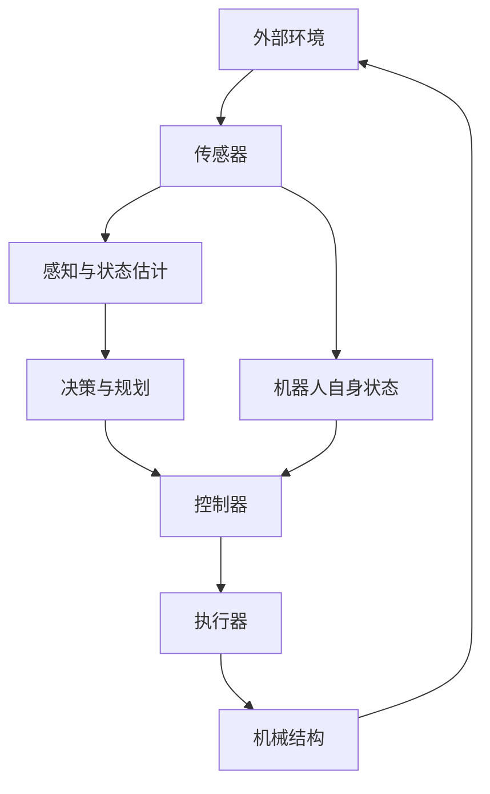

# 1. 介绍

机器人不是单独一门学科，而是机械、电子、控制、计算机、嵌入式、传感器、通信、软件工程和人工智能等多个领域组合成的复杂系统。
简单来说，机器人 = 感知环境 + 理解状态 + 决策规划 + 执行动作 + 反馈修正

例如扫地机器人：
- 感知：通过碰撞传感器、悬崖传感器、里程计、激光雷达或摄像头理解房间环境。
- 决策：判断当前位置、清扫区域、障碍物位置、回充路径。
- 执行：控制轮子、风机、滚刷、边刷运动。
- 反馈：根据传感器反馈不断修正运动和路径。

常见机器人包括： 工业机械臂，AGV / AMR 移动机器人，扫地机器人，巡检机器人，无人机，四足机器人，人形机器人等等    
普通机器和机器人的区别在于普通机器通常执行固定流程，环境变化后需要人工干预。机器人更强调能感知自身状态和外部环境，能根据反馈修正行为，能在一定范围内自主完成任务，能与物理世界交互，通常存在闭环控制，而不只是一次性执行命令。

## 2. 机器人系统

机器人可以看成一个多层闭环系统：



典型机器人系统由以下模块组成：

| 模块 | 作用 | 示例 |
|---|---|---|
| 机械结构 | 承载、运动、传力 | 底盘、连杆、关节、外壳、夹爪 |
| 执行器 | 把电能、气压、液压转成运动 | 电机、舵机、气缸、液压缸 |
| 传感器 | 获取环境和自身状态 | 编码器、IMU、相机、激光雷达、力传感器 |
| 控制器 | 计算控制量并驱动执行器 | MCU、PLC、工控机、嵌入式板卡 |
| 电源系统 | 提供能源并保护系统 | 电池、BMS、降压模块、保险、急停 |
| 通信系统 | 模块间交换数据 | UART、I2C、SPI、CAN、Ethernet、Wi-Fi |
| 软件系统 | 组织算法、调度模块、记录数据 | ROS 2、驱动、导航、视觉、日志 |
| 算法模块 | 完成定位、建图、规划、识别 | SLAM、路径规划、目标检测、轨迹规划 |
| 安全系统 | 避免伤人、损坏设备、失控 | 急停、限位、看门狗、超时停止 |


机器人常见分层：

| 层级 | 典型问题 |
|---|---|
| 任务层 | 去哪里、抓什么、什么时候停止 |
| 规划层 | 路径怎么走、轨迹怎么生成、如何避障 |
| 感知层 | 障碍物在哪里、机器人在哪里、物体是什么 |
| 控制层 | 速度误差怎么修正、关节如何跟踪轨迹 |
| 驱动层 | 如何读编码器、如何发 PWM、如何处理 CAN |
| 硬件层 | 电机扭矩够不够、结构强度够不够、电源是否稳定 |

一个移动机器人执行导航任务时，数据大致这样流动：

```text
传感器采集数据
  -> 雷达 / 相机 / IMU / 编码器数据进入计算机
    -> 定位模块估计当前位姿
      -> 建图或读取已有地图
        -> 全局规划器生成路径
          -> 局部控制器生成速度命令
            -> 下位机控制电机
              -> 机器人运动
                -> 传感器再次反馈
```

## 3. 机器人理论知识


### 3.1 数学基础

需要掌握：

- 线性代数：向量、矩阵、旋转矩阵、特征值。
- 三角函数：角度、弧度、正弦余弦、几何关系。
- 微积分：速度、加速度、积分、导数。
- 概率统计：噪声、误差、滤波、概率分布。
- 优化基础：最小二乘、代价函数、约束。
- 图论基础：路径搜索、图优化、状态图。

用途：

| 数学内容 | 机器人用途 |
|---|---|
| 矩阵 | 坐标变换、相机模型、状态估计 |
| 三角函数 | 底盘运动学、机械臂几何 |
| 微积分 | 控制、速度、加速度、轨迹 |
| 概率统计 | SLAM、滤波、传感器融合 |
| 优化 | 轨迹规划、图优化、标定 |
| 图论 | A*、Dijkstra、拓扑地图 |

### 3.2 编程基础

推荐顺序：

1. Linux 命令行
2. Git
3. Python
4. C++ 基础
5. 数据结构与算法
6. CMake / colcon / ROS 2 构建

Python 适合：

- 快速验证算法。
- 数据处理。
- 写 ROS 2 原型节点。
- 处理日志、绘图、测试脚本。
- AI / 视觉实验。

C++ 适合：

- 高性能机器人节点。
- 驱动开发。
- 实时性更高的控制。
- ROS 2 核心组件。
- 大型机器人系统工程。

### 3.3 电子与嵌入式基础

需要知道：

- 电压、电流、电阻、功率。
- 电池、稳压、保险、接地。
- 电机驱动器、H 桥、MOSFET。
- PWM、ADC、GPIO、定时器、中断。
- UART、I2C、SPI、CAN、USB、RS-485。
- MCU 基础，例如 STM32、ESP32、Arduino、RP2040。

机器人真实项目里，很多问题不是算法问题，而是电源、电机、接线、干扰、通信和时序问题。

### 3.4 机械基础

需要知道：

- 刚体、连杆、关节。
- 轴承、齿轮、同步带、丝杠、减速器。
- 轮子、履带、麦克纳姆轮、全向轮。
- 材料、强度、刚度、重量。
- 摩擦、间隙、背隙、变形。
- 载荷、力矩、重心。

机械结构决定机器人“能不能动、能怎么动、动得稳不稳”。

### 3.5 控制基础

需要知道：

- 开环控制和闭环控制。
- 反馈。
- PID。
- 速度控制、位置控制、力控制。
- 控制频率。
- 饱和、延迟、震荡、超调。

机器人控制不是“给电机一个值就完了”，而是不断测量误差并修正。

### 3.6 软件工程基础

机器人项目通常模块多、数据多、实时性要求高，需要工程化能力：

- 模块拆分。
- 日志记录。
- 参数管理。
- 配置文件。
- 数据录制和回放。
- 单元测试和集成测试。
- 版本管理。
- 故障复现。
- 性能分析。
- 文档和实验记录。


## 5. 机器人硬件系统

机器人硬件决定了系统上限。软件可以补偿误差，但无法彻底弥补硬件设计错误。

### 5.1 主控计算机

主控计算机负责运行高级算法：

- ROS 2 节点。
- 感知算法。
- SLAM。
- 导航。
- 任务调度。
- 可视化。
- 数据记录。

常见选择：

| 平台 | 特点 | 适合 |
|---|---|---|
| 工控机 / x86 小主机 | 性能强、Linux 兼容好 | 中大型机器人 |
| NVIDIA Jetson | GPU 加速，适合视觉 AI | 视觉、深度学习机器人 |
| Raspberry Pi | 成本低，生态好 | 教学、小型机器人 |
| 嵌入式 Linux 板卡 | 功耗低、可定制 | 产品化设备 |

### 5.2 下位机 / MCU

下位机负责底层实时任务：

- 电机 PWM 输出。
- 编码器读取。
- PID 控制。
- IMU 或简单传感器采集。
- 安全保护。
- 与上位机通信。

常见 MCU：

- STM32
- ESP32
- Arduino 系列
- RP2040
- TI C2000

为什么需要 MCU：

- 普通 Linux 用户态程序实时性不稳定。
- 电机控制需要稳定周期，例如 1 ms、5 ms、10 ms。
- 安全保护需要在上位机卡死时仍能执行。

典型上位机 / 下位机结构：

```text
ROS 2 上位机
  发布 /cmd_vel
    -> MCU 接收速度命令
      -> MCU 做轮速 PID
        -> 电机驱动器输出电流
          -> 编码器反馈速度
            -> MCU 回传 /odom 数据
```

### 5.3 执行器

执行器把控制命令变成物理运动。

#### 直流电机

特点：

- 控制简单。
- 成本低。
- 需要驱动器。
- 常用 PWM 调速。
- 加编码器后可做闭环控制。

常用于：

- 移动机器人轮子。
- 小型传动机构。
- 风扇、滚刷。

#### 舵机

特点：

- 输入目标角度。
- 内部通常已有位置闭环。
- 容易上手。
- 负载和精度有限。

常用于：

- 小型机械臂。
- 云台。
- 教学机器人。

#### 步进电机

特点：

- 按步转动。
- 位置控制方便。
- 低速力矩较大。
- 可能丢步。
- 高速性能有限。

常用于：

- 3D 打印机。
- CNC。
- 精密移动平台。

#### 无刷电机

特点：

- 效率高。
- 功率密度高。
- 控制复杂。
- 需要 ESC 或 FOC 驱动。

常用于：

- 无人机。
- 四足机器人关节。
- 高性能移动平台。

#### 气动与液压执行器

特点：

- 输出力大。
- 适合工业场景。
- 系统复杂。
- 控制精度和维护成本需要考虑。

### 5.4 传感器

传感器分为两类：

- 内部状态传感器：感知机器人自身。
- 外部环境传感器：感知外部世界。

内部传感器：

| 传感器 | 测量内容 | 用途 |
|---|---|---|
| 编码器 | 位置、速度 | 轮速控制、里程计、关节反馈 |
| IMU | 加速度、角速度 | 姿态估计、状态估计 |
| 电流传感器 | 电机电流 | 负载估计、保护 |
| 电压传感器 | 电池电压 | 电量估计、低电压保护 |
| 限位开关 | 机械边界 | 回零、安全保护 |
| 力矩传感器 | 力和力矩 | 力控、协作安全 |

外部传感器：

| 传感器 | 测量内容 | 用途 |
|---|---|---|
| 摄像头 | 图像 | 目标检测、识别、视觉 SLAM |
| 深度相机 | 深度图 / 点云 | 三维感知、避障、抓取 |
| 2D 激光雷达 | 平面距离 | 建图、定位、避障 |
| 3D 激光雷达 | 三维点云 | 自动驾驶、三维建图 |
| 超声波 | 距离 | 简单避障 |
| 毫米波雷达 | 距离、速度 | 车辆、恶劣环境感知 |
| GPS / GNSS | 全球位置 | 室外定位 |

选择传感器要考虑：

- 测量范围。
- 精度。
- 分辨率。
- 频率。
- 延迟。
- 接口。
- 抗干扰能力。
- 成本。
- 环境适应性。
- 数据处理难度。

### 5.5 电源系统

机器人电源系统常见问题非常多，必须重视。

需要考虑：

- 电池电压。
- 最大持续电流。
- 峰值电流。
- 电机启动电流。
- 降压模块余量。
- 地线连接。
- 保险丝。
- 反接保护。
- 欠压保护。
- 急停。
- 电机噪声隔离。

常见电压：

| 电压 | 用途 |
|---|---|
| 3.3V | MCU、传感器逻辑 |
| 5V | 单板机、传感器、舵机 |
| 7.4V / 11.1V / 14.8V | 锂电池常见电压 |
| 12V / 24V | 移动机器人、电机、工业设备 |
| 48V | 高功率电机、工业移动平台 |

经验：

- 电机电源和控制电源最好分开规划。
- 电机启动电流可能远大于额定电流。
- 电压掉落会导致主控重启。
- 接地错误会造成通信异常和传感器噪声。
- 电源线太细会发热、压降大。

## 6. 嵌入式与底层控制

底层控制通常运行在 MCU 或实时控制器上。

### 6.1 MCU 主要任务

- 读取编码器。
- 输出 PWM。
- 采集 ADC。
- 读取 IMU。
- 控制电机驱动器。
- 执行 PID。
- 监测电压电流。
- 处理急停、限位。
- 与上位机通信。

### 6.2 常见通信协议

| 协议 | 特点 | 用途 |
|---|---|---|
| UART | 简单、点对点 | MCU 与上位机、调试串口 |
| I2C | 两线、多设备、短距离 | 板内低速传感器 |
| SPI | 高速、短距离 | IMU、显示屏、ADC |
| CAN | 抗干扰、多节点 | 电机驱动、车辆、工业机器人 |
| USB | 通用、带宽较高 | 相机、雷达、调试 |
| Ethernet | 高速、远距离 | 工控机、激光雷达、分布式系统 |
| RS-485 | 长距离、抗干扰 | 工业传感器、串行总线 |

### 6.3 实时性

控制任务必须周期稳定。例如：

```text
每 1 ms：电流环
每 5 ms：速度环
每 10 ms：位置环
每 20 ms：底盘状态上报
每 100 ms：电池状态上报
```

实时性差会导致：

- 控制震荡。
- 速度不稳定。
- 轨迹跟踪差。
- 安全响应慢。
- 数据时间戳混乱。

### 6.4 上位机与下位机协议设计

一个好的通信协议应该包含：

- 帧头。
- 消息类型。
- 数据长度。
- 序号。
- 时间戳。
- 负载数据。
- 校验。
- 超时处理。

示例：

```text
Header | MsgType | Length | Seq | Payload | CRC
```

必须处理：

- 丢包。
- 粘包。
- 校验失败。
- 超时。
- 重复包。
- 上位机断联。

底盘安全规则：

```text
如果 300 ms 内没有收到新的速度命令，则自动停止电机。
```

## 7. 控制系统基础

机器人控制的核心是让实际状态跟随目标状态。

```text
目标值 - 实际值 = 误差
控制器根据误差输出控制量
执行器运动后改变实际值
传感器反馈新的实际值
```

### 7.1 开环控制

开环控制没有反馈。

示例：

```text
给电机 50% PWM，让它转 2 秒。
```

问题：

- 地面摩擦变了，速度会变。
- 电池电压变了，速度会变。
- 负载变了，速度会变。
- 无法知道实际转了多少。

适合：

- 简单演示。
- 对精度要求低的机构。
- 初学实验。

### 7.2 闭环控制

闭环控制有反馈。

示例：

```text
目标轮速：1.0 m/s
编码器测得：0.8 m/s
控制器增加 PWM
再次测量并修正
```

优点：

- 能抵抗扰动。
- 精度更高。
- 稳定性更好。

### 7.3 PID 控制

PID 是最常见的控制方法。

```text
输出 = Kp * 当前误差 + Ki * 误差积分 + Kd * 误差变化率
```

直观理解：

- P：现在差多少。
- I：过去长期差多少。
- D：误差变化得多快。

常见用途：

- 电机速度控制。
- 关节位置控制。
- 云台姿态控制。
- 温度控制。
- 简单平衡控制。

调参经验：

1. 先只开 P，让系统能响应。
2. 增大 P 到响应较快但不严重震荡。
3. 加少量 D 抑制震荡。
4. 加少量 I 消除稳态误差。
5. 设置输出限幅和积分限幅。

常见问题：

| 现象 | 可能原因 |
|---|---|
| 响应很慢 | P 太小 |
| 震荡 | P 太大或 D 不合适 |
| 长期有误差 | I 不足或有摩擦死区 |
| 超调严重 | P/I 太大，D 太小 |
| 电机抖动 | 采样噪声、控制周期不稳、D 放大噪声 |

### 7.4 控制频率

控制频率不是越高越好，而是要匹配系统。

参考范围：

| 控制环 | 常见频率 |
|---|---|
| 电流环 | 1 kHz - 20 kHz |
| 速度环 | 50 Hz - 1 kHz |
| 位置环 | 20 Hz - 500 Hz |
| 移动底盘速度命令 | 10 Hz - 100 Hz |
| 全局路径规划 | 0.2 Hz - 5 Hz |
| 局部避障 / 控制 | 10 Hz - 50 Hz |

频率太低会响应慢，频率太高可能受噪声和计算资源限制。

## 8. 坐标系、位姿与空间变换

机器人必须理解“位置”和“方向”。

### 8.1 坐标系

常见坐标系：

- `map`：地图坐标系，通常全局稳定。
- `odom`：里程计坐标系，短时间连续但会漂移。
- `base_link`：机器人本体坐标系。
- `base_footprint`：底盘投影坐标系。
- `laser` / `camera_link`：传感器坐标系。
- `tool0`：机械臂末端工具坐标系。
- `world`：仿真或世界坐标系。

移动机器人常见 TF 关系：

```text
map -> odom -> base_link -> laser
                       -> camera_link
```

含义：

- `map -> odom`：定位模块修正全局漂移。
- `odom -> base_link`：里程计估计短期运动。
- `base_link -> sensor`：机器人本体到传感器的固定安装关系。

### 8.2 位姿

二维位姿：

```text
x, y, theta
```

三维位姿：

```text
位置：x, y, z
姿态：roll, pitch, yaw 或 quaternion
```

ROS 中常见消息：

- `geometry_msgs/msg/Pose`
- `geometry_msgs/msg/PoseStamped`
- `geometry_msgs/msg/Twist`
- `nav_msgs/msg/Odometry`
- `tf2_msgs/msg/TFMessage`

### 8.3 欧拉角与四元数

欧拉角直观，但存在万向节锁问题。四元数不直观，但适合计算和插值。

实践建议：

- 人类阅读和调参时常看 roll / pitch / yaw。
- 程序内部和 ROS TF 中常用 quaternion。
- 不要随意手写四元数转换，优先使用成熟库。

### 8.4 标定

标定是确定传感器、机器人和环境之间的几何关系。

常见标定：

- 相机内参标定。
- 相机畸变标定。
- 相机和雷达外参标定。
- 手眼标定。
- IMU 与相机外参标定。
- 轮子半径和轮距标定。

标定错误会导致：

- 地图扭曲。
- 目标位置不准。
- 抓取失败。
- 导航偏移。
- 多传感器融合异常。

## 9. 运动学与动力学

### 9.1 运动学

运动学研究“运动关系”，不考虑力。

核心问题：

- 给定关节角，末端在哪里。
- 给定轮速，底盘怎么动。
- 给定目标位姿，关节应该是多少。

### 9.2 移动机器人运动学

差速底盘：

```text
v = (v_r + v_l) / 2
omega = (v_r - v_l) / L
```

其中：

- `v`：机器人线速度。
- `omega`：机器人角速度。
- `v_r`：右轮线速度。
- `v_l`：左轮线速度。
- `L`：左右轮距。

动作关系：

| 左轮 | 右轮 | 运动 |
|---|---|---|
| 同速正转 | 同速正转 | 前进 |
| 同速反转 | 同速反转 | 后退 |
| 正转 | 反转 | 原地旋转 |
| 慢 | 快 | 转弯 |

阿克曼底盘类似汽车：

- 不能原地旋转。
- 有最小转弯半径。
- 适合车辆和室外机器人。

麦克纳姆轮 / 全向轮：

- 可以横向移动。
- 运动灵活。
- 对地面和轮子安装要求高。
- 控制和校准更复杂。

### 9.3 机械臂正运动学

正运动学：

```text
关节角度 -> 末端位姿
```

用途：

- 计算夹爪位置。
- 显示机械臂模型。
- 判断末端是否到达目标。
- 与视觉结果结合。

### 9.4 机械臂逆运动学

逆运动学：

```text
末端目标位姿 -> 关节角度
```

难点：

- 可能无解。
- 可能多解。
- 可能接近奇异点。
- 可能碰撞。
- 可能超过关节限位。

机械臂规划不能只求 IK，还要考虑路径和碰撞。

### 9.5 动力学

动力学研究力和运动的关系。

涉及：

- 质量。
- 惯性。
- 力。
- 力矩。
- 摩擦。
- 重力。
- 加速度。

为什么需要动力学：

- 机械臂高速运动时需要考虑惯性。
- 四足机器人需要考虑地面反作用力。
- 无人机必须考虑推力和姿态耦合。
- 人形机器人必须考虑全身平衡。
- 电机选型需要考虑力矩和负载。

## 10. 移动机器人基础

移动机器人最核心的链路：

```text
传感器 -> 定位 -> 地图 -> 规划 -> 控制 -> 底盘
```

### 10.1 典型硬件组成

- 底盘结构。
- 左右轮或多轮系统。
- 电机和驱动器。
- 编码器。
- IMU。
- 激光雷达或深度相机。
- 上位机。
- MCU。
- 电池和电源管理。
- 急停和保险。

### 10.2 里程计

里程计根据轮速、IMU 或视觉估计机器人相对运动。

来源：

- 编码器。
- IMU。
- 视觉里程计。
- 激光里程计。

特点：

- 短时间连续。
- 会累积误差。
- 轮子打滑会导致漂移。
- IMU 零偏会导致漂移。

ROS 中常见话题：

```text
/odom
```

常见消息：

```text
nav_msgs/msg/Odometry
```

### 10.3 速度命令

ROS 移动机器人常用 `Twist` 表示速度命令。

常见话题：

```text
/cmd_vel
```

二维移动机器人通常使用：

```text
linear.x   前进速度
angular.z  旋转速度
```

底盘收到 `/cmd_vel` 后，需要转换成轮速，再由 MCU 控制电机。

### 10.4 地图

常见地图形式：

- 栅格地图：每个格子表示占用概率或代价。
- 点云地图：三维点集合。
- 拓扑地图：地点和连接关系。
- 语义地图：带物体、区域、语义标签。

导航中最常见的是二维栅格地图。

## 11. 机械臂基础

机械臂由连杆和关节组成。

### 11.1 基本概念

| 概念 | 含义 |
|---|---|
| Link | 连杆，刚体部分 |
| Joint | 关节，连接两个连杆 |
| DOF | 自由度，可独立运动的数量 |
| End Effector | 末端执行器，如夹爪、吸盘、焊枪 |
| Workspace | 工作空间 |
| Joint Limit | 关节限位 |
| Singularity | 奇异点，控制或运动能力退化的位置 |

### 11.2 自由度

常见机械臂：

- 3 DOF：简单定位。
- 4 DOF：教学、小型抓取。
- 6 DOF：工业标准，可控制末端位姿。
- 7 DOF：冗余自由度，避障和姿态更灵活。

自由度越高，能力越强，但控制和规划更复杂。

### 11.3 机械臂控制流程

```text
目标物体位姿
  -> 选择抓取姿态
    -> 逆运动学求关节解
      -> 碰撞检测
        -> 轨迹规划
          -> 轨迹时间参数化
            -> 控制器执行
              -> 编码器反馈
```

### 11.4 末端执行器

常见末端：

- 平行夹爪。
- 三指夹爪。
- 真空吸盘。
- 磁吸工具。
- 焊枪。
- 螺丝刀。
- 相机。
- 力控工具。

选择末端执行器要看：

- 目标物体形状。
- 重量。
- 材质。
- 表面粗糙度。
- 是否允许接触。
- 是否需要力控。

## 12. 感知系统：视觉、雷达、点云、融合

感知让机器人理解自己和环境。

### 12.1 感知任务

- 障碍物检测。
- 目标检测。
- 目标跟踪。
- 语义分割。
- 距离估计。
- 位姿估计。
- 地图构建。
- 自身状态估计。
- 人体或手势识别。

### 12.2 相机

相机提供图像信息。

常见参数：

- 分辨率。
- 帧率。
- 焦距。
- 视场角。
- 曝光。
- 畸变。
- 快门类型。

常见视觉任务：

- 目标检测。
- 二维码识别。
- 特征点匹配。
- 语义分割。
- 位姿估计。
- 手眼标定。

### 12.3 深度相机

深度相机提供每个像素的距离。

用途：

- 三维避障。
- 物体抓取。
- 人体检测。
- 点云生成。
- 室内建图。

局限：

- 室外强光可能影响结构光或 ToF 相机。
- 透明、反光、黑色物体可能测不准。
- 距离范围有限。

### 12.4 激光雷达

2D 激光雷达：

- 输出一圈平面距离。
- 常用于室内 SLAM 和导航。
- ROS 消息常见为 `sensor_msgs/msg/LaserScan`。

3D 激光雷达：

- 输出三维点云。
- 常用于自动驾驶、室外机器人、三维建图。
- ROS 消息常见为 `sensor_msgs/msg/PointCloud2`。

### 12.5 点云

点云是一组三维点：

```text
(x, y, z)
```

可能还包括：

- 颜色。
- 强度。
- 时间戳。
- 法向量。

常见处理：

- 下采样。
- 去噪。
- 地面分割。
- 聚类。
- 配准。
- 障碍物检测。
- 三维重建。

### 12.6 多传感器融合

单个传感器通常不够可靠，需要融合：

- 编码器 + IMU：提高里程计稳定性。
- 激光 + IMU：改善建图。
- 相机 + IMU：视觉惯性里程计。
- GPS + IMU + 轮速：室外定位。
- 相机 + 深度：三维识别。

融合难点：

- 时间同步。
- 坐标系标定。
- 噪声建模。
- 延迟补偿。
- 异常数据剔除。

## 13. 定位、建图与 SLAM

SLAM 是 Simultaneous Localization and Mapping，同步定位与建图。

机器人在未知环境中同时做两件事：

- 建立地图。
- 估计自己在地图中的位置。

### 13.1 为什么 SLAM 难

原因：

- 传感器有噪声。
- 里程计会漂移。
- 环境可能重复。
- 障碍物可能移动。
- 数据关联困难。
- 回环检测复杂。
- 计算量大。

### 13.2 常见 SLAM 类型

| 类型 | 传感器 | 特点 |
|---|---|---|
| 2D 激光 SLAM | 2D 雷达 | 室内移动机器人常用 |
| 视觉 SLAM | 单目/双目/RGB-D | 信息丰富，但受光照影响 |
| 激光视觉融合 SLAM | 雷达 + 相机 | 稳定性更好，系统复杂 |
| VIO | 相机 + IMU | 适合无人机、AR、移动设备 |
| 3D LiDAR SLAM | 3D 雷达 | 室外、自动驾驶、三维建图 |

### 13.3 建图与定位的区别

建图：

- 目标是生成地图。
- 通常需要移动机器人采集环境数据。
- 输出地图文件或地图数据库。

定位：

- 目标是在已有地图中估计当前位置。
- 导航时通常依赖定位。
- 定位失败会导致导航失败。

典型导航流程：

```text
先用 SLAM 建图 -> 保存地图 -> 下次加载地图 -> 用 AMCL 或其他定位方法定位 -> Nav2 导航
```

### 13.4 AMCL

AMCL 是 Adaptive Monte Carlo Localization，自适应蒙特卡洛定位。

常用于：

- 已有二维栅格地图。
- 使用 2D 激光雷达。
- 移动机器人室内定位。

它使用粒子表示机器人可能位置，通过传感器观测不断更新粒子权重。

## 14. 路径规划、导航与避障

导航是移动机器人从当前位置到目标位置的完整过程。

包含：

- 定位。
- 地图。
- 全局规划。
- 局部规划 / 控制。
- 障碍物检测。
- 恢复行为。
- 底盘控制。

### 14.1 全局规划

全局规划回答：

```text
从当前位置到目标位置，整体上应该走哪条路？
```

常见算法：

- Dijkstra。
- A*。
- D*。
- Hybrid A*。
- PRM。
- RRT。

全局规划依赖地图，通常不直接处理快速动态障碍物。

### 14.2 局部规划 / 局部控制

局部规划回答：

```text
接下来几秒应该怎么走，才能跟随路径并避开实时障碍？
```

常见方法：

- DWA。
- TEB。
- Pure Pursuit。
- MPC。
- Regulated Pure Pursuit。

局部规划需要考虑：

- 当前速度。
- 机器人运动学约束。
- 障碍物距离。
- 最大速度和加速度。
- 轨迹平滑性。

### 14.3 代价地图

代价地图把环境表示为网格，每个格子有代价。

高代价表示：

- 有障碍物。
- 靠近障碍物。
- 不适合通过。

常见层：

- 静态地图层。
- 障碍物层。
- 膨胀层。
- 体素层。

膨胀层非常重要。机器人不是一个点，必须让路径离障碍物保持安全距离。

### 14.4 恢复行为

导航失败时，机器人需要恢复行为：

- 原地旋转重新观测。
- 后退。
- 清理局部代价地图。
- 重新规划。
- 停止并报警。

恢复行为不能盲目执行，必须考虑安全。

## 15. ROS 2 机器人软件框架

ROS 2 是机器人软件框架，不是传统意义上的操作系统。它提供通信、构建、工具、消息、参数、日志、可视化和生态包。

### 15.1 ROS 2 核心概念

| 概念 | 作用 |
|---|---|
| Node | 节点，一个功能模块 |
| Topic | 话题，异步发布订阅 |
| Service | 服务，同步请求响应 |
| Action | 动作，适合长时间任务 |
| Message | 消息类型 |
| Parameter | 参数 |
| Launch | 启动多个节点 |
| TF2 | 坐标变换 |
| URDF | 机器人模型描述 |
| RViz | 可视化 |
| rosbag2 | 数据录制和回放 |
| colcon | 构建工具 |

### 15.2 Topic、Service、Action 的区别

| 通信方式 | 适合场景 | 示例 |
|---|---|---|
| Topic | 持续数据流 | `/scan`、`/odom`、`/cmd_vel` |
| Service | 快速请求响应 | 清空地图、查询状态 |
| Action | 长时间任务，有反馈和取消 | 导航到目标点、机械臂执行轨迹 |

经验：

- 传感器数据用 Topic。
- 简单命令查询用 Service。
- 可取消、持续反馈的任务用 Action。

### 15.3 常见 ROS 2 话题

| 话题 | 消息 | 含义 |
|---|---|---|
| `/cmd_vel` | `geometry_msgs/msg/Twist` | 速度命令 |
| `/odom` | `nav_msgs/msg/Odometry` | 里程计 |
| `/scan` | `sensor_msgs/msg/LaserScan` | 2D 激光 |
| `/tf` | `tf2_msgs/msg/TFMessage` | 动态坐标变换 |
| `/tf_static` | `tf2_msgs/msg/TFMessage` | 静态坐标变换 |
| `/map` | `nav_msgs/msg/OccupancyGrid` | 栅格地图 |
| `/joint_states` | `sensor_msgs/msg/JointState` | 关节状态 |

### 15.4 ROS 2 工程结构

典型工作空间：

```text
ros2_ws/
  src/
    my_robot_bringup/
    my_robot_description/
    my_robot_driver/
    my_robot_navigation/
    my_robot_perception/
  build/
  install/
  log/
```

包职责：

| 包 | 作用 |
|---|---|
| `my_robot_description` | URDF / Xacro / meshes |
| `my_robot_driver` | 硬件驱动 |
| `my_robot_bringup` | 启动文件 |
| `my_robot_navigation` | Nav2 配置 |
| `my_robot_perception` | 感知算法 |

### 15.5 常用命令

```bash
ros2 topic list
ros2 topic echo /scan
ros2 topic hz /odom
ros2 topic info /cmd_vel

ros2 node list
ros2 node info /controller_server

ros2 service list
ros2 action list
ros2 param list
ros2 param get /controller_server use_sim_time

ros2 run package_name executable_name
ros2 launch package_name launch_file.py

ros2 bag record /scan /odom /tf
ros2 bag play bag_file

ros2 doctor
```

## 16. Nav2 导航框架

Nav2 是 ROS 2 的导航系统，负责让移动机器人从当前位置移动到目标位置。

### 16.1 Nav2 解决什么问题

Nav2 负责：

- 地图加载。
- 定位集成。
- 全局路径规划。
- 局部控制。
- 代价地图。
- 行为树任务调度。
- 恢复行为。
- 路径平滑。
- 多目标点导航。

核心输入：

- `map`
- `odom`
- `tf`
- `scan` 或点云
- `goal`

核心输出：

- `/cmd_vel`

### 16.2 Nav2 主要组件

| 组件 | 作用 |
|---|---|
| Map Server | 加载和发布地图 |
| AMCL | 在已有地图中定位 |
| Planner Server | 全局路径规划 |
| Controller Server | 跟踪路径并输出速度 |
| Behavior Server | 恢复行为 |
| BT Navigator | 行为树导航任务管理 |
| Costmap 2D | 全局和局部代价地图 |
| Lifecycle Manager | 管理节点生命周期 |

### 16.3 Nav2 调参重点

常见关键参数：

- 机器人半径或 footprint。
- 最大速度和最小速度。
- 最大加速度。
- 控制频率。
- 代价地图分辨率。
- 障碍物层数据源。
- 膨胀半径。
- 目标容差。
- 控制器插件参数。
- AMCL 粒子数和噪声参数。

调参原则：

1. 先确保 TF 正确。
2. 再确保里程计方向和尺度正确。
3. 再确认雷达数据方向正确。
4. 再看地图和定位。
5. 最后调规划和控制。

不要在 TF、odom、scan 错误时盲目调 Nav2 参数。

## 17. MoveIt 2 机械臂规划框架

MoveIt 2 是 ROS 2 中常用的机械臂运动规划框架。

### 17.1 MoveIt 2 解决什么问题

MoveIt 2 提供：

- 机械臂模型加载。
- 运动规划。
- 逆运动学。
- 碰撞检测。
- 规划场景。
- 轨迹执行。
- RViz 交互。
- 抓取和操作相关能力。

### 17.2 学 MoveIt 2 前需要什么

需要先理解：

- ROS 2 基础。
- URDF / Xacro。
- TF。
- JointState。
- ros2_control。
- 机械臂正逆运动学。
- 碰撞模型。

### 17.3 机械臂模型文件

常见文件：

- URDF / Xacro：描述连杆、关节、几何、惯量。
- SRDF：描述规划组、默认姿态、禁用碰撞对。
- ros2_control 配置：描述硬件接口和控制器。
- MoveIt 配置：规划器、控制器、传感器。

### 17.4 MoveIt 2 工作流

```text
准备 URDF
  -> 配置 SRDF
    -> 配置规划组
      -> 配置控制器
        -> RViz 测试规划
          -> 接入真实硬件
            -> 调试轨迹执行
```

常见坑：

- URDF 坐标轴方向错误。
- 碰撞模型太复杂导致规划慢。
- joint limit 配置不正确。
- 控制器接口不匹配。
- 真实机械臂零点和模型不一致。

## 18. 仿真、建模与数字验证

仿真可以在没有真实硬件时测试机器人软件，但仿真不等于真实。

### 18.1 常见仿真工具

| 工具 | 特点 |
|---|---|
| Gazebo | ROS 生态常用，适合机器人仿真 |
| Webots | 上手较友好，支持多种机器人 |
| Isaac Sim | NVIDIA 生态，适合视觉和 AI 仿真 |
| MuJoCo | 动力学仿真强，常用于强化学习 |
| CoppeliaSim | 功能丰富，教学和研究常见 |

### 18.2 仿真能做什么

- 测试 ROS 2 节点。
- 验证导航流程。
- 测试机械臂规划。
- 调试 TF 和 URDF。
- 生成传感器数据。
- 降低硬件损坏风险。
- 做算法初步验证。

### 18.3 仿真的局限

真实世界中存在：

- 摩擦误差。
- 轮子打滑。
- 结构变形。
- 传感器噪声。
- 光照变化。
- 通信延迟。
- 电源波动。
- 碰撞误差。

因此：

```text
仿真通过 != 真实机器人一定可用
```

正确流程：

```text
仿真验证 -> 半实物测试 -> 低速真实测试 -> 安全场地测试 -> 逐步提高速度和复杂度
```

## 19. 机器人软件工程

机器人系统复杂，不能只靠“能跑就行”。

### 19.1 模块化

推荐模块划分：

```text
driver：硬件驱动
state_estimation：状态估计
perception：感知
planning：规划
control：控制
behavior：任务逻辑
bringup：启动
description：模型
tools：调试工具
```

模块之间通过清晰接口通信，减少耦合。

### 19.2 日志和数据录制

必须记录：

- 传感器数据。
- 里程计。
- TF。
- 控制命令。
- 状态机变化。
- 错误信息。
- 参数版本。

ROS 2 中使用 `rosbag2` 录制数据，方便离线复现问题。

示例：

```bash
ros2 bag record /scan /odom /tf /cmd_vel
```

### 19.3 参数管理

机器人参数很多，例如：

- 轮距。
- 轮半径。
- PID 参数。
- 最大速度。
- 代价地图参数。
- 传感器频率。
- 坐标系名称。

建议：

- 参数写入 YAML。
- 不同机器人和环境使用不同配置。
- 参数变更要记录。
- 关键参数要写注释。
- 不要把调参结果只留在命令行历史中。

### 19.4 测试

机器人测试包括：

- 单元测试。
- 节点测试。
- 仿真测试。
- 数据回放测试。
- 硬件在环测试。
- 现场测试。

测试顺序：

```text
纯算法 -> 数据回放 -> 仿真 -> 架空电机 -> 低速实机 -> 真实任务
```

## 20. AI 与机器人

AI 可以增强机器人的感知、理解和决策能力，但 AI 不是机器人全部。

### 20.1 AI 常见用途

- 目标检测。
- 语义分割。
- 姿态估计。
- 语音识别。
- 自然语言交互。
- 任务规划。
- 抓取点检测。
- 强化学习控制。
- 模仿学习。

### 20.2 AI 的边界

即使模型很强，机器人仍然需要：

- 稳定硬件。
- 可靠电源。
- 准确标定。
- 实时控制。
- 安全机制。
- 工程化部署。
- 异常处理。

一个检测模型再准，如果底盘里程计漂移严重、TF 错误、电机控制不稳，机器人仍然不能可靠工作。

### 20.3 大模型与机器人

大模型可以用于：

- 自然语言任务理解。
- 高层任务分解。
- 人机交互。
- 代码和配置辅助生成。
- 视觉语言理解。

但执行层仍必须有：

- 可验证的状态机。
- 安全约束。
- 运动规划器。
- 底层控制器。
- 急停和权限边界。

不要让不受约束的大模型直接控制电机。

## 21. 机器人安全

机器人会运动、会带电、会和人或物理环境接触，安全优先级必须高于功能。

### 21.1 常见风险

- 撞人。
- 撞设备。
- 夹手。
- 电池起火。
- 电机失控。
- 程序卡死。
- 通信中断。
- 传感器误判。
- 地图错误。
- 机械结构断裂。

### 21.2 硬件安全

应考虑：

- 急停按钮。
- 保险丝。
- 电池保护。
- 机械限位。
- 防夹设计。
- 防撞结构。
- 电源隔离。
- 线缆固定。
- 外壳防护。

### 21.3 软件安全

应考虑：

- `cmd_vel` 超时停止。
- 控制输出限幅。
- 速度和加速度限制。
- 传感器异常检测。
- 看门狗。
- 状态机保护。
- 故障降级。
- 日志记录。
- 上电默认停止。

示例规则：

```text
如果没有定位，不允许进入自动导航。
如果没有雷达数据，不允许高速运动。
如果急停触发，所有电机立即断使能。
如果控制命令超时，底盘速度置零。
```

## 22. 常见项目路线

### 22.1 入门项目：避障小车

目标：

- 控制电机。
- 读取超声波或红外传感器。
- 遇到障碍物转向。

学习内容：

- 电机驱动。
- MCU。
- PWM。
- 简单传感器。
- 基本控制逻辑。

### 22.2 编码器闭环小车

目标：

- 读取左右轮编码器。
- 计算轮速。
- 实现 PID 速度控制。

学习内容：

- 编码器。
- 中断。
- 定时器。
- PID。
- 里程计基础。

### 22.3 ROS 2 小车

目标：

- 上位机运行 ROS 2。
- 下位机控制底盘。
- 发布 `/odom`。
- 订阅 `/cmd_vel`。
- 发布 TF。

学习内容：

- ROS 2 Topic。
- 自定义驱动。
- TF。
- RViz。
- 串口或 CAN 通信。

### 22.4 Nav2 导航小车

目标：

- 接入激光雷达。
- 建图。
- 定位。
- 导航到目标点。

学习内容：

- SLAM。
- AMCL。
- Nav2。
- costmap。
- planner。
- controller。

### 22.5 简单机械臂

目标：

- 控制多关节舵机或电机。
- 建立 URDF。
- 在 RViz 中显示。
- 实现简单正逆运动学。

学习内容：

- 关节。
- 连杆。
- 坐标变换。
- URDF。
- 运动学。

### 22.6 视觉抓取

目标：

- 相机识别物体。
- 求物体位姿。
- 机械臂规划抓取。

学习内容：

- 相机标定。
- 目标检测。
- 手眼标定。
- MoveIt 2。
- 末端执行器控制。

## 23. 零基础学习路线

### 阶段 1：编程和工具

学习：

- Linux 基础命令。
- Git。
- Python。
- C++ 基础。
- CMake。

实践：

- 写命令行程序。
- 读取串口数据。
- 画传感器曲线。
- 用 Git 管理项目。

### 阶段 2：电子和 MCU

学习：

- 电路基础。
- GPIO。
- PWM。
- ADC。
- UART。
- I2C。
- SPI。
- CAN 基础。

实践：

- 点亮 LED。
- 读取按键。
- 控制舵机。
- 控制直流电机。
- 读取编码器。
- 做 PID 速度控制。

### 阶段 3：机器人底盘

学习：

- 差速底盘。
- 轮速与车体速度。
- 里程计。
- IMU。
- 电源系统。

实践：

- 搭建小车。
- 实现遥控。
- 实现闭环速度。
- 计算 odom。

### 阶段 4：ROS 2

学习：

- Node。
- Topic。
- Service。
- Action。
- Launch。
- Parameter。
- TF2。
- URDF。
- RViz。
- rosbag2。

实践：

- 写发布订阅节点。
- 显示机器人模型。
- 发布 TF。
- 录制和回放数据。

### 阶段 5：SLAM 和导航

学习：

- 激光雷达。
- 栅格地图。
- SLAM。
- AMCL。
- Nav2。
- costmap。
- planner / controller。

实践：

- 用雷达建图。
- 保存地图。
- 在地图中定位。
- 发送导航目标。
- 调整速度和避障参数。

### 阶段 6：选择深入方向

方向 A：移动机器人

- 多传感器融合。
- 复杂环境导航。
- 语义导航。
- 多机器人协同。

方向 B：机械臂

- 运动学。
- MoveIt 2。
- 抓取规划。
- 力控。

方向 C：感知算法

- OpenCV。
- 深度学习。
- 点云处理。
- 视觉 SLAM。

方向 D：控制

- 现代控制。
- MPC。
- 状态估计。
- 动力学控制。

方向 E：无人机 / 四足 / 人形

- 姿态控制。
- 动力学。
- 轨迹优化。
- 强化学习。

## 24. 调试方法与常见问题

### 24.1 调试原则

不要同时怀疑所有模块。按数据流逐层检查：

```text
硬件供电 -> 通信 -> 传感器数据 -> 坐标系 -> 状态估计 -> 规划 -> 控制 -> 执行器
```

### 24.2 移动机器人导航失败排查

顺序：

1. 电机方向是否正确。
2. 编码器方向是否正确。
3. 轮半径和轮距是否正确。
4. `/odom` 是否连续。
5. `/tf` 是否完整。
6. 雷达方向是否正确。
7. `base_link` 到 `laser` 外参是否正确。
8. 地图是否正确。
9. AMCL 定位是否稳定。
10. costmap 是否能看到障碍物。
11. planner 是否能生成路径。
12. controller 是否输出 `/cmd_vel`。
13. 下位机是否收到 `/cmd_vel`。

### 24.3 TF 常见问题

现象：

- RViz 报 TF 不存在。
- 雷达数据位置不对。
- 地图和机器人错位。
- Nav2 无法启动或导航异常。

检查：

```bash
ros2 run tf2_tools view_frames
ros2 run tf2_ros tf2_echo map base_link
ros2 topic echo /tf
ros2 topic echo /tf_static
```

常见原因：

- frame_id 写错。
- 静态 TF 没发布。
- 时间戳不一致。
- `use_sim_time` 配置不一致。
- URDF 坐标轴错误。

### 24.4 里程计漂移

可能原因：

- 轮半径不准。
- 轮距不准。
- 编码器分辨率配置错。
- 轮子打滑。
- 地面不平。
- IMU 噪声大。
- 时间戳错误。

处理：

- 标定轮半径和轮距。
- 降低速度和加速度。
- 改善轮胎摩擦。
- 融合 IMU。
- 使用外部定位修正。

### 24.5 雷达和地图异常

可能原因：

- 雷达安装角度错误。
- 雷达 frame 配置错。
- 雷达被遮挡。
- 反光或透明物体影响测距。
- 地图分辨率不合适。
- 动态障碍物太多。

### 24.6 机械臂规划失败

可能原因：

- URDF 模型错误。
- joint limit 错误。
- 碰撞模型过大。
- 目标位姿不可达。
- IK 无解。
- 起始状态不正确。
- 控制器未连接。

排查顺序：

1. RViz 中模型是否正确。
2. `/joint_states` 是否正确。
3. TF 是否正确。
4. 目标位姿是否在工作空间内。
5. 是否发生碰撞。
6. 控制器是否可用。

## 25. 学习检查清单

### 基础能力

- 会使用 Linux 命令行。
- 会使用 Git。
- 会写 Python 脚本。
- 会读 C++ 基础代码。
- 理解电压、电流、功率。
- 会使用万用表。
- 理解串口、I2C、SPI、CAN 的基本区别。

### 硬件能力

- 能控制电机。
- 能读取编码器。
- 能读取 IMU。
- 能搭建基本电源系统。
- 能识别电源容量不足问题。
- 能处理急停和限位。

### 控制能力

- 理解开环和闭环。
- 会写 PID。
- 会调速度环。
- 知道采样周期的重要性。
- 知道输出限幅和积分限幅。

### ROS 2 能力

- 会创建工作空间。
- 会创建包。
- 会写发布订阅节点。
- 会写 launch 文件。
- 会使用参数。
- 会使用 RViz。
- 会录制 rosbag。
- 理解 TF。
- 理解 URDF。

### 移动机器人能力

- 理解 `/cmd_vel`。
- 理解 `/odom`。
- 理解 `map -> odom -> base_link`。
- 会建图。
- 会定位。
- 会启动 Nav2。
- 会看 costmap。
- 会排查导航失败。

### 机械臂能力

- 理解关节和连杆。
- 理解自由度。
- 理解正运动学和逆运动学。
- 会写或修改 URDF。
- 会使用 MoveIt 2 做基本规划。
- 理解碰撞检测。

### 工程能力

- 会写实验记录。
- 会保存参数版本。
- 会录制问题数据。
- 会逐层排查。
- 会设计安全保护。
- 会写基本文档。

## 26. 总结

机器人学习可以用这条主线理解：

```text
机械结构提供身体
电子硬件提供能源和接口
执行器产生动作
传感器提供反馈
控制算法保证稳定运动
坐标系描述空间关系
感知算法理解环境
定位和建图确定位置
规划算法决定行动
软件框架组织模块
安全机制保证可靠运行
```

对零基础学习者，最稳妥的路线是：

1. 学 Linux、Python、C++、Git。
2. 学电路、MCU、电机、编码器。
3. 做一个能遥控的小车。
4. 加编码器做闭环速度控制。
5. 接入 ROS 2，发布 odom 和 TF，订阅 cmd_vel。
6. 加激光雷达做建图。
7. 使用 Nav2 实现定位和导航。
8. 再选择机械臂、视觉、SLAM、无人机、四足或人形方向深入。

机器人是典型的长期积累型学科。真正的理解来自项目：让电机转起来，让传感器读出来，让坐标系对起来，让机器人知道自己在哪里，让它安全地到达目标点。不要只看视频和论文，也不要只调现成包。每次把一个模块真正跑通、测准、记录清楚，都是在建立可复用的机器人能力。

## 27. 参考资料

### 官方文档与权威资料

- [ROS 2 Documentation - Basic Concepts](https://docs.ros.org/en/rolling/Concepts/Basic.html)  

- [ROS 2 Tutorials](https://docs.ros.org/en/rolling/Tutorials.html)  

- [ROS 2 tf2 Tutorials](https://docs.ros.org/en/rolling/Tutorials/Intermediate/Tf2/Tf2-Main.html)  

- [ROS 2 URDF Tutorials](https://docs.ros.org/en/rolling/Tutorials/Intermediate/URDF/URDF-Main.html)  

- [ROS 2 rosbag2 Documentation](https://docs.ros.org/en/rolling/Tutorials/Advanced/Recording-A-Bag-From-Your-Own-Node-CPP.html)  

- [Nav2 Documentation](https://docs.nav2.org/)  

- [Nav2 Concepts](https://docs.nav2.org/concepts/index.html)  

- [Nav2 Configuration Guide](https://docs.nav2.org/configuration/index.html)  

- [MoveIt 2 Documentation](https://moveit.picknik.ai/main/index.html)  

- [MoveIt 2 Tutorials](https://moveit.picknik.ai/main/doc/tutorials/tutorials.html)  

- [Modern Robotics: Mechanics, Planning, and Control](https://modernrobotics.northwestern.edu/)  

- [Modern Robotics Book Resources](https://modernrobotics.northwestern.edu/nu-gm-book-resource/foundations-of-robot-motion/)  

- [OpenCV Documentation](https://docs.opencv.org/)  

- [Gazebo Documentation](https://gazebosim.org/docs/)  

- [Webots Documentation](https://cyberbotics.com/doc/guide/index)  

- [NVIDIA Isaac Sim Documentation](https://docs.isaacsim.omniverse.nvidia.com/)  

### 中文社区与实践资料入口

- [CSDN：ROS 2、Nav2、SLAM、机器人学习路线相关文章](https://so.csdn.net/so/search?q=ROS2%20Nav2%20SLAM%20%E6%9C%BA%E5%99%A8%E4%BA%BA%E5%AD%A6%E4%B9%A0%E8%B7%AF%E7%BA%BF)  

- [掘金：机器人、ROS 2、SLAM 实践文章](https://juejin.cn/search?query=ROS2%20SLAM%20%E6%9C%BA%E5%99%A8%E4%BA%BA)  

- [博客园：ROS 2 与机器人学习笔记](https://zzk.cnblogs.com/s/blogpost?w=ROS2%20%E6%9C%BA%E5%99%A8%E4%BA%BA%20Nav2)  

- [知乎：机器人学习路线、ROS、SLAM 经验讨论](https://www.zhihu.com/search?type=content&q=%E6%9C%BA%E5%99%A8%E4%BA%BA%20ROS2%20SLAM%20%E5%AD%A6%E4%B9%A0%E8%B7%AF%E7%BA%BF)  

- [SegmentFault：ROS 2 与机器人开发问题](https://segmentfault.com/search?q=ROS2%20%E6%9C%BA%E5%99%A8%E4%BA%BA)  

## 28. 2026-06 深化补充：机器人项目的系统工程视角

机器人系统的难点不是单点算法，而是机械、电子、控制、感知、规划、软件、网络和安全一起工作。一个机器人项目失败，常见原因并不是“算法不先进”，而是接口边界不清、传感器标定不准、底盘控制不稳、数据记录不足、测试场景太少。

### 28.1 机器人系统分层

```text
任务层
  -> 行为决策
    -> 规划与控制
      -> 状态估计与感知
        -> 驱动与通信
          -> 硬件与电源
```

| 层级 | 关注点 | 常见问题 |
| --- | --- | --- |
| 硬件与电源 | 结构强度、电压、电流、急停、散热 | 电源压降、线束松动、急停缺失 |
| 驱动与通信 | CAN/UART/Ethernet、驱动频率、错误码 | 丢包、延迟、协议不清 |
| 状态估计与感知 | IMU、编码器、雷达、相机、融合 | 时间不同步、外参错误、噪声大 |
| 规划与控制 | 路径、速度、约束、避障 | 约束建模错误、控制震荡 |
| 行为决策 | 状态机、行为树、任务恢复 | 异常路径没设计 |
| 任务层 | 用户目标、业务流程、人机交互 | 需求模糊、验收标准不清 |

### 28.2 真实机器人调试顺序

1. 确认机械结构、电源、急停和安全边界。
2. 单独测试每个执行器和传感器。
3. 校验时间同步、坐标系和标定。
4. 低速闭环控制，验证里程计和速度响应。
5. 录制传感器和状态数据，离线分析。
6. 上仿真和实机对比，找 sim-to-real 差异。
7. 最后再调高级规划、导航和任务策略。

### 28.3 项目资料应该沉淀什么

- 硬件清单：型号、接口、电源、安装位置。
- 坐标系说明：每个 frame 的方向、原点、父子关系。
- 标定记录：相机内参、外参、雷达安装角、轮距、轮半径。
- 通信协议：字段、单位、频率、错误码、超时策略。
- 参数版本：不同场景的参数文件和变更原因。
- 测试用例：直线、转弯、避障、定位丢失、急停、低电量。
- 数据包：典型成功和失败场景的 rosbag。

### 28.4 AI 与机器人的现实边界

大模型和视觉语言模型可以帮助机器人理解任务、解析自然语言、生成高层计划、辅助标注和调试，但不应直接绕过安全控制层。真实机器人上，低层控制、碰撞检测、速度限制、急停和权限边界必须由确定性系统兜底。

## 29. 补充参考资料

- [ROS 2 Documentation](https://docs.ros.org/)
- [Nav2 Documentation](https://docs.nav2.org/)
- [MoveIt 2 Documentation](https://moveit.picknik.ai/)
- [Gazebo Documentation](https://gazebosim.org/docs/)
- [ros2_control Documentation](https://control.ros.org/)
- [Modern Robotics Course](https://modernrobotics.northwestern.edu/)

## References and further reading

- [Official] [ROS 2 Documentation](https://docs.ros.org/)
- [Official] [ROS 2 Jazzy Documentation](https://docs.ros.org/en/jazzy/)
- [Official] [Nav2 Documentation](https://docs.nav2.org/)
- [Official] [Gazebo Sim Documentation](https://gazebosim.org/docs/latest/)
- [Official] [Gazebo ROS 2 integration](https://gazebosim.org/docs/latest/ros2_integration/)
- [Official] [SDFormat Documentation](https://sdformat.org/)
- [Official] [ros2_control Documentation](https://control.ros.org/)
- [Standard] [REP 103: Standard Units of Measure and Coordinate Conventions](https://www.ros.org/reps/rep-0103.html)
- [Standard] [REP 105: Coordinate Frames for Mobile Platforms](https://www.ros.org/reps/rep-0105.html)
- [Book / Course] [Modern Robotics](https://modernrobotics.northwestern.edu/)
- [Book] [Probabilistic Robotics](https://mitpress.mit.edu/9780262303804/probabilistic-robotics/)
- [Book] [State Estimation for Robotics](https://www.cambridge.org/core/books/state-estimation-for-robotics/00E53274A2F1E6CC1A55CA5C3D1C9718)
- [Course] [MIT Underactuated Robotics](https://underactuated.mit.edu/)
- [Source] [ros2_control_demos](https://github.com/ros-controls/ros2_control_demos)
- [Community] [ROS2 Control分析讲解 - CSDN](https://blog.csdn.net/Bing_Lee/article/details/135003678)
- [Community] [在机器人仿真中使用 ros2_control - CSDN](https://blog.csdn.net/apingna/article/details/148333455)
- [Community] [ROS2 SLAM 建图导航 - 掘金](https://juejin.cn/post/7101201729122730020)
- [Community] [机器人导航仿真 - 博客园](https://www.cnblogs.com/zjh1170/p/16133766.html)
