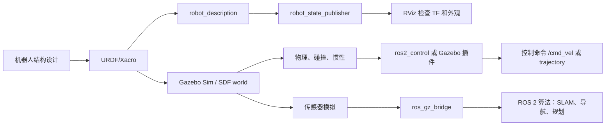

# 机器人仿真学习笔记

本目录是一套面向新手的机器人仿真学习笔记，重点覆盖 ROS 2、URDF、Xacro、机器人学基础、Gazebo Sim、SDF、连杆、关节、惯性、碰撞、传感器和控制接口。

写作日期：2026-06-08。

最后资料核对：2026-06-08。主要依据 ROS 2 Jazzy、Gazebo Harmonic、SDFormat 和 ros2_control 官方文档。

## 推荐技术主线

如果你刚开始学习，建议采用：

- Ubuntu 24.04
- ROS 2 Jazzy Jalisco
- Gazebo Harmonic
- `ros_gz` 作为 ROS 2 和 Gazebo Sim 的集成桥梁

原因：Gazebo 官方文档建议新用户优先使用 ROS 和 Gazebo 的 LTS 组合；ROS 2 Jazzy 对应 Gazebo Harmonic 是推荐组合。Gazebo Classic 已经是旧版路线，除非课程、教材或现有项目明确要求，否则不建议作为新项目主线。

## 文档阅读顺序

1. [00_learning_map.md](00_learning_map.md)：学习路线、先后顺序和常见误区。
2. [01_environment_ros2_gazebo.md](01_environment_ros2_gazebo.md)：环境、工作空间、包结构和常用命令。
3. [02_robotics_foundations.md](02_robotics_foundations.md)：坐标系、变换、速度、力、正逆运动学等基础。
4. [03_urdf_basics.md](03_urdf_basics.md)：URDF 文件结构和从零建模方法。
5. [04_xacro_practice.md](04_xacro_practice.md)：用 Xacro 复用参数、宏和结构。
6. [05_links_joints_inertia_collision.md](05_links_joints_inertia_collision.md)：连杆、关节、惯性、碰撞和物理仿真的重点。
7. [06_gazebo_sim_sdf_world.md](06_gazebo_sim_sdf_world.md)：Gazebo Sim、SDF 世界、模型加载和仿真配置。
8. [07_ros2_control_and_sensors.md](07_ros2_control_and_sensors.md)：ros2_control、控制器、差速底盘和常用传感器。
9. [08_debugging_checklists.md](08_debugging_checklists.md)：排错清单、验证命令和练习项目。
10. [09_visual_architecture_and_review.md](09_visual_architecture_and_review.md)：总架构流程图、关键链路复盘、复习题和学习检查表。
11. [10_versions_and_common_pitfalls.md](10_versions_and_common_pitfalls.md)：版本选型、Gazebo Classic/Sim 差异、桥接、仿真时间和实践踩坑。

示例文件：

- [examples/minimal_mobile_base.urdf.xacro](examples/minimal_mobile_base.urdf.xacro)：一个最小差速小车模型，便于对照 URDF/Xacro 笔记学习。

## 怎么使用这些笔记

不要一开始就追求复杂机械臂或完整无人车。先按下面的顺序做出可运行的小系统：

1. 用 URDF 描述一个只有底盘和两个轮子的模型。
2. 用 RViz 检查视觉模型和 TF 树。
3. 给每个 link 补上 collision 和 inertial。
4. 改成 Xacro，抽取尺寸、质量、颜色和宏。
5. 放进 Gazebo Sim，观察模型是否稳定。
6. 加入 ros2_control 或 Gazebo 插件，让轮子可以动。
7. 加入激光雷达、IMU、相机等传感器。
8. 记录每次异常：模型飞走、抖动、穿模、TF 错误、关节方向反了、质量不合理等。

建议每学完一篇都做三件事：

- 用自己的话复述“这一篇解决什么问题”；
- 跑一条最小验证命令，例如 `check_urdf`、`view_frames`、`gz topic -l`；
- 把遇到的错误按 [08 调试清单](08_debugging_checklists.md) 的模板记录下来。

## 核心判断标准

一个机器人模型是否适合仿真，不是看它在 RViz 里好不好看，而是看：

- TF 树是否正确；
- link 和 joint 层级是否清晰；
- 视觉模型、碰撞模型、惯性模型是否分别合理；
- 质量、惯性矩、摩擦、阻尼是否接近真实物理；
- 控制接口是否和真实机器人一致；
- 传感器坐标系、频率、噪声和话题是否符合算法需要。

## 学习路线总图

先用这张图定位自己当前学的是哪一层。排错时也按这张图从左到右检查，不要一上来同时改模型、控制器和传感器。

## 参考入口

- ROS 2 Jazzy URDF 教程：https://docs.ros.org/en/jazzy/Tutorials/Intermediate/URDF/URDF-Main.html
- ROS 2 Xacro 教程：https://docs.ros.org/en/rolling/Tutorials/Intermediate/URDF/Using-Xacro-to-Clean-Up-a-URDF-File.html
- Gazebo Harmonic 文档：https://gazebosim.org/docs/harmonic/
- Gazebo + ROS 安装建议：https://gazebosim.org/docs/harmonic/ros_installation/
- SDFormat 规范：https://sdformat.org/spec/
- gz_ros2_control Jazzy 文档：https://control.ros.org/jazzy/doc/gz_ros2_control/doc/index.html
- Gazebo Classic 页面：https://classic.gazebosim.org/

