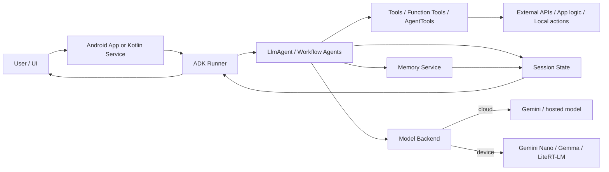

# ADK for Kotlin / Android 学习笔记

Last researched: 2026-07-16

这里的 ADK 指的是 **Agent Development Kit**，不是 Android Debug Kit，也不是 Android Debug Bridge。
它是一套代码优先的智能体开发框架，Kotlin 版本可用于 JVM 和 Android。

---

## 1. 一句话理解

ADK for Kotlin / Android 的目标，是让你用 Kotlin 把 AI Agent 做成真正可维护的工程：

- 有明确的 Agent 结构
- 能接工具、记状态、做多智能体编排
- 能接云端模型，也能接端侧模型
- 能在 Android App 里直接落地

它不是“再写一层 prompt 封装”，而是把 Agent 当作正式的软件模块来设计。

---

## 2. 为什么要学它

你会在这些场景里需要 ADK：

- 想把 LLM 能力放进 Kotlin 服务或 Android App
- 想把工具调用、会话、记忆、编排统一起来
- 想做多 Agent 协作，而不是单次问答
- 想把 agent 调试、评估、发布做成工程化流程
- 想兼顾云端模型和端侧模型

如果只是简单调一次模型接口，ADK 可能过重；  
如果你要做一个长期演进的 agent 系统，ADK 就很合适。

---

## 3. 当前状态与版本

我核实到的最新稳定 Kotlin 版本是 **v0.5.0**，GitHub release 页面标记为 Latest。

版本演进里，和 Kotlin / Android 最相关的几个节点是：

| 版本 | 重点 |
| --- | --- |
| v0.1.0 | Kotlin / Android 初始发布，支持 LLM agent、多 Agent 编排、工具、长任务、内存、Gemini on JVM/Android、Gemini Nano / Gemma |
| v0.4.0 | 增加 Android RoomSessionService、Room storage、LiteRT-LM 集成、context compaction、outputKey 等 |
| v0.5.0 | 增加 `addMemory` / `addEventsToMemory`、HITL 工具、更多运行与 telemetry 改进 |

---

## 4. 架构总览



这个结构的关键点是：

1. UI 只负责交互。
2. Agent 负责决策。
3. Tool 负责执行外部动作。
4. Session 负责短期上下文。
5. Memory 负责长期知识。
6. Model 可以来自云端，也可以来自设备端。

---

## 5. 核心概念

| 概念 | 作用 |
| --- | --- |
| Agent | 执行任务的智能体单元 |
| LlmAgent | 由模型驱动的 Agent，负责推理、选择工具、生成回复 |
| Workflow Agent | 以确定性方式编排多个子 Agent |
| Tool | 让 Agent 访问外部世界的能力 |
| Session | 一次对话或一次运行的上下文容器 |
| State | Session 内的可写键值状态 |
| Memory | 跨会话的长期记忆 |
| Callback | 在 Agent 生命周期的关键阶段插入逻辑 |
| Runner | 执行 Agent、管理运行、调试和恢复 |

---

## 6. Kotlin / Android 的定位

### Kotlin 版

适合：

- JVM 后端
- 服务端 Agent
- 桌面工具
- 测试和调试环境

### Android 版

适合：

- 原生 Android App 内嵌 Agent
- Compose 驱动的交互式体验
- 端云混合推理
- 低延迟、隐私优先、离线可用的场景

官方 Android 指南明确说，Android 里的 ADK Kotlin 用法和 Kotlin 快速开始基本一致，差异主要在 Gradle 依赖、项目配置和运行时调用方式。

---

## 7. 模块深挖

### 7.1 Agent / LlmAgent

`LlmAgent` 是 ADK 的核心。

它通常包含：

- `name`
- `description`
- `model`
- `instruction`
- `tools`

它的行为不是固定脚本，而是模型驱动的决策流程。  
适合做需要理解自然语言、选择工具、组织步骤的任务。

简单示意：

```kotlin
val rootAgent = LlmAgent(
    name = "search_assistant",
    description = "Search the web and answer clearly.",
    model = Gemini(name = "gemini-3.1-flash-lite-preview"),
    instruction = Instruction("Use search when needed."),
    tools = listOf(GoogleSearchTool())
)
```

### 7.2 Tools / Function Tools

工具是 Agent 和外部世界的连接点。

Kotlin 里常见做法是：

- 用 `@Tool` 标记函数
- 用 `@Param` 描述参数
- 由 KSP 在编译期生成工具包装代码

要点：

- 参数描述要写清楚
- 返回值尽量用结构化数据
- 不要让工具返回只有人能看懂、模型看不懂的内容

### 7.3 Session / State

`session.state` 是 Agent 的短期工作台。

适合放：

- 当前任务步骤
- 用户偏好
- 临时计算结果
- 需要在本次调用链里传递的数据

注意：

- 不要直接塞不可序列化对象
- `temp:` 适合一次调用内的临时数据
- `user:` 和 `app:` 适合更长生命周期的状态

### 7.4 Memory

Memory 负责跨会话记忆。

ADK 里常见思路有：

- In-memory memory service
- 持久化 memory service
- RAG memory

适合记：

- 用户长期偏好
- 历史对话摘要
- 可复用的背景知识

不适合把所有原始对话都无脑塞进去。

### 7.5 Workflow Agents

ADK 支持多智能体工作流，常见三类：

- SequentialAgent：顺序执行
- ParallelAgent：并行执行
- LoopAgent：循环执行直到条件满足

适合：

- 先检索再总结
- 多个独立子任务并行做
- 反复修改直到达标

### 7.6 Runtime

官方运行方式包括：

- `adk web`
- `adk run`
- `adk api_server`

这说明 ADK 不只是“写 agent”，还把调试、交互、暴露 API 这几个开发阶段一起考虑了。

### 7.7 Evaluation

ADK 的评估不只看最终答案，还看 trajectory，也就是 Agent 走了什么步骤、用了什么工具、是否按预期完成任务。

这点很重要，因为 Agent 是非确定性的。

### 7.8 Android Integration

Android 侧的官方样例是完整原生 App，基于 Compose。

官方样例仓库里，Android samples 具备这些前提：

- Android Studio
- Android SDK
- Java 17+
- Gemini API key
- 依赖 ADK Kotlin

样例仓库中有 `android/` 和 `kotlin/` 两个主要入口，说明官方已经把 JVM 和 Android 两条线分开维护。

### 7.9 On-device model integration

Kotlin / Android 不只连云端模型，也能连端侧模型。

官方 release notes 和 Android / AI Edge 文档都指向：

- Gemini Nano
- Gemma
- LiteRT
- LiteRT-LM

这意味着 Android 上可以做低延迟、隐私优先、可离线的 agent 体验。

---

## 8. 版本演进理解

### v0.1.0

第一次把 Kotlin / Android 的基础能力放出来：

- LLM agents
- custom agents
- multi-agent orchestration
- function tools
- long-running operations
- in-memory session / memory
- Google GenAI SDK / Firebase AI
- Gemini Nano / Gemma on-device

### v0.4.0

这一版开始更像真正的 Android 工程底座：

- RoomSessionService
- Room storage primitives
- LiteRT-LM integration
- sliding-window context compaction
- outputKey
- maxSteps

### v0.5.0

更偏向可用性和生产化：

- `addMemory`
- `addEventsToMemory`
- 内建 HITL 工具
- 更完整的 telemetry
- 更多恢复与 long-running 改进

---

## 9. 最小实践路径

### 9.1 Kotlin 后端或桌面

1. 添加 `google-adk-kotlin-core`
2. 配置 KSP processor
3. 定义 `LlmAgent`
4. 加一个简单工具
5. 跑 `adk web` 或 `adk run`
6. 补 session / memory / workflow

### 9.2 Android App

1. 新建 Android Studio 项目
2. 接入 ADK Kotlin 依赖
3. 准备 Gemini API key 或端侧模型方案
4. 把 agent 封装进 repository / service / viewmodel 层
5. 用 Compose 做聊天或任务界面
6. 逐步加入 session、memory、tooling

---

## 10. 常见错误

- 把 ADK 当成简单 LLM 封装
- 一个 Agent 塞太多工具
- 工具描述太短，模型不知道怎么用
- 返回值不结构化
- 把所有状态都塞进 session.state
- 误以为 memory 和 state 是一回事
- 忘了 KSP / 注解处理器
- Android 样例里忽略 `minSdk` / `compileSdk` 要求
- on-device 模型没确认设备支持

---

## 11. 调试与排错

### 如果工具不触发

- 看工具名和参数描述是否清晰
- 看 instruction 是否真的要求调用工具
- 看返回类型是否符合预期

### 如果上下文丢失

- 检查 session service 是否持久化
- 检查是否用了正确的 state prefix
- 检查是否误把临时数据放进了错误层级

### 如果 Android 编译失败

- 检查 KSP 版本
- 检查 Kotlin / Gradle / AGP 兼容性
- 检查 compileSdk / minSdk
- 检查 Java 版本

### 如果端侧模型跑不动

- 确认设备和运行时支持
- 先用云端模型验证业务逻辑
- 再切换 LiteRT / LiteRT-LM 做端侧优化

---

## 12. 适用与不适用

### 适合

- 需要工具调用的智能助手
- 需要多步任务编排的 agent
- 需要长期记忆的产品
- 需要 Android 原生体验的应用
- 需要云端 + 端侧混合推理的场景

### 不太适合

- 只想做一次性 prompt 调用
- 没有明确工具和状态需求
- 需要极简 demo，但不打算长期维护
- 对模型行为完全确定性有硬要求

---

## 13. 与相关方案的区别

| 方案 | 侧重点 |
| --- | --- |
| 普通 Gemini API 调用 | 单轮问答、轻量接入 |
| ADK Kotlin | 工程化 agent、工具、状态、编排 |
| ADK Android | 原生 Android App 内的 agent 体验 |
| LiteRT / LiteRT-LM | 端侧模型推理与执行层 |
| Android AppFunctions | 把 App 能力暴露给系统级 agent |

---

## 14. 实战建议

先按这个顺序学：

1. `LlmAgent`
2. `@Tool` / `@Param`
3. `session.state`
4. `MemoryService`
5. `SequentialAgent` / `ParallelAgent` / `LoopAgent`
6. runtime 和 evaluation
7. Android Compose 集成
8. 端侧模型接入

不要一开始就追求全套，多数坑都出在概念没分清。

---

## 15. 社区实践观察

社区文章里对 ADK for Kotlin / Android 的共识大体一致：

- Kotlin 适合服务端和 JVM 场景
- Android 适合 App 内 agent 体验
- `@Tool` / `@Param` 的注解化方式很关键
- 端云混合、多 Agent、会话和记忆是核心卖点

我把这些作为实践侧参考，但真正的规范仍以官方文档和 release notes 为准。

---

## 16. 一个推荐的学习顺序

### 第一轮

- 搞懂 Agent、Tool、Session、Memory
- 跑通一个最小 Kotlin agent
- 看懂一个 Android sample

### 第二轮

- 做一个多工具 agent
- 加上 state 和 memory
- 加一个 workflow agent

### 第三轮

- 接入 Android Compose UI
- 做持久化 session
- 试端侧模型
- 加 evaluation 和 telemetry

---

## References and further reading

### Official

- Google ADK home: https://adk.dev/
- Technical overview: https://adk.dev/get-started/about/
- Kotlin installation: https://adk.dev/get-started/installation/
- Agent concepts: https://adk.dev/agents/
- Runtime: https://adk.dev/runtime/
- Function tools: https://adk.dev/tools-custom/function-tools/
- State: https://adk.dev/sessions/state/
- Memory: https://adk.dev/sessions/memory/
- Evaluation: https://adk.dev/evaluate/
- Kotlin repo: https://github.com/google/adk-kotlin
- Kotlin releases: https://github.com/google/adk-kotlin/releases
- Samples repo: https://github.com/google/adk-samples
- Android samples README: https://github.com/google/adk-samples/blob/main/android/README.md
- Android guide: https://developer.android.com/ai/adk
- Android I/O 2026 AI update: https://developer.android.com/blog/posts/top-ai-on-android-updates-for-building-intelligent-experiences-from-google-i-o-26
- LiteRT-LM Android: https://ai.google.dev/edge/litert-lm/android
- LiteRT overview: https://ai.google.dev/edge/litert/overview

### Community

- Juejin: https://juejin.cn/post/7647438301877501978
- Juejin: https://juejin.cn/post/7644480592969023531
- CSDN: https://blog.csdn.net/vitaviva/article/details/161872447
- CSDN: https://blog.csdn.net/ZuoYueLiang/article/details/161474250

