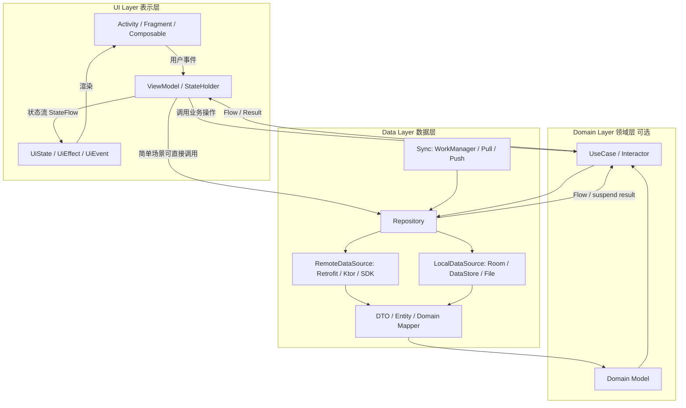
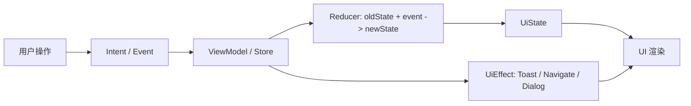
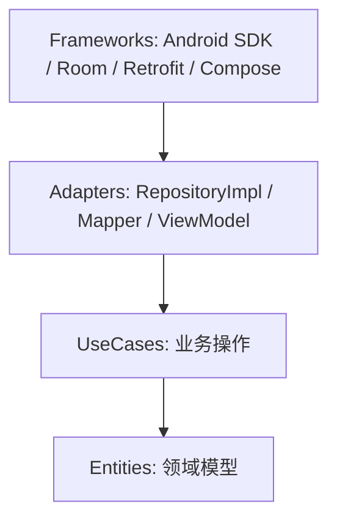
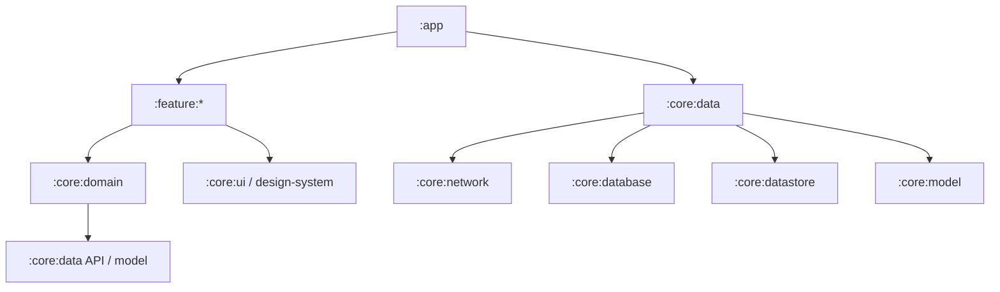
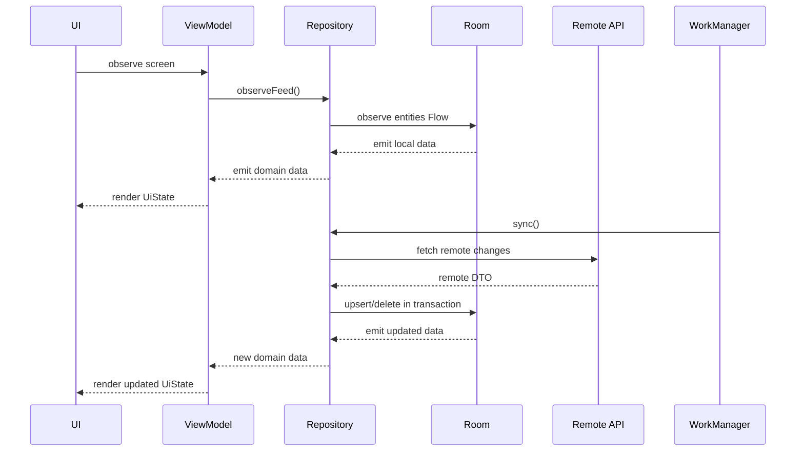
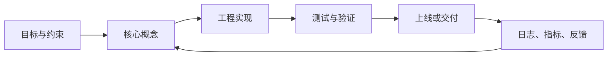

# Android 开发架构详解

<!-- lecture-notes:integrated-v2 -->

## 讲义导读：把概念落到可验证实践

这一章讲的是 **Android 开发架构详解**，属于 **Android 与 Material 设计**。阅读时不要把它当成零散资料堆叠，而要把它当成一份讲义：先弄清它解决什么问题，再看核心概念和流程，最后做一个能复现、能观察、能排错的小练习。

### 一句话先懂

Android 和 Material 学习的重点，是把界面、状态、生命周期、架构、主题和交互规范组织成可维护的应用体验。

初学时先问三个问题：它的输入或前提是什么；它内部按什么规则工作；结果该用什么命令、日志、测试、图纸、波形或指标来证明。

### 通俗类比

Android 应用像一座有前台、后台和调度规则的店：界面接待用户，状态记录当前业务，生命周期决定什么时候开门、暂停和恢复。

类比只是入门扶手。真正掌握时，要回到准确术语、配置、接口、版本、边界条件、错误信息和验证证据上。能解释失败原因，比只会照着步骤跑通更重要。

### 本章学习主线

1. **先看场景**：这个知识点通常在什么项目、岗位或问题里出现？
2. **再看结构**：它有哪些核心对象、配置、文件、命令、接口或流程？
3. **然后看路径**：一次完整使用从哪里开始，到哪里结束，中间有哪些状态变化？
4. **接着看边界**：版本差异、平台差异、权限、性能、安全、兼容性和资源限制在哪里？
5. **最后看验证**：用最小样例、测试、日志、调试工具或实物结果证明理解是对的。

### 本章重点抓手

组件、生命周期、状态管理、架构分层、Compose/Material 3、导航、权限、性能、测试和无障碍。

### 最小实践任务

做一个最小 Android 页面：有列表、详情、状态保存、主题色、错误态、加载态和一次配置变化测试。

建议把练习记录成固定格式：目标、环境版本、最小示例、执行步骤、预期结果、实际结果、错误信息、定位过程和复盘。以后遇到真实项目问题时，这些记录会比单纯收藏教程更有用。

### 常见误区

- 只会堆页面，不处理生命周期和状态。
- UI 好看但不符合交互与无障碍。
- 架构分层写在文档里，代码里仍互相乱调。

### 推荐工具与资料

官方文档、最小 demo、日志、调试器、版本管理、测试命令、性能/诊断工具和复盘记录。

### 读完本章应该能做到

- 用自己的话解释核心概念和适用场景。
- 给出一个最小可运行或可验证样例。
- 说清至少一个常见错误的现象、原因和排查路径。
- 知道当前版本应该查哪份官方文档，而不是只依赖旧教程。

> 本节是讲义化改写后的阅读入口。后续正文中的命令、配置、图纸、代码和参考资料，都应围绕“场景 -> 概念 -> 操作 -> 验证 -> 复盘”来理解。


> Last researched: 2026-06-14  
> Audience level: 初中级到高级 Android 开发者  
> Scope: Android 应用层架构、Jetpack/Compose 推荐实践、MVC/MVP/MVVM/MVI、Clean Architecture、模块化/组件化、数据层、离线优先、依赖注入、协程 Flow、导航、后台任务、测试、性能与常见踩坑。本文不展开 Android Framework 系统架构、Binder 内核细节、ROM 架构、图形栈、驱动层和 NDK 底层架构。
## 目录

- [1. 总结](#1-总结)
- [2. 学习目标](#2-学习目标)
- [3. 前置知识](#3-前置知识)
- [4. Android 架构要解决什么问题](#4-android-架构要解决什么问题)
- [5. 架构总览图](#5-架构总览图)
- [6. Android 架构模式演进](#6-android-架构模式演进)
- [7. 官方推荐应用架构](#7-官方推荐应用架构)
- [8. UI 层详解](#8-ui-层详解)
- [9. Domain 层详解](#9-domain-层详解)
- [10. Data 层详解](#10-data-层详解)
- [11. Clean Architecture 在 Android 中的落地](#11-clean-architecture-在-android-中的落地)
- [12. MVVM、MVI 与单向数据流](#12-mvvmmvi-与单向数据流)
- [13. 模块化与组件化](#13-模块化与组件化)
- [14. 依赖注入架构](#14-依赖注入架构)
- [15. 协程、Flow 与异步架构](#15-协程flow-与异步架构)
- [16. 导航架构](#16-导航架构)
- [17. 后台任务、同步与离线优先](#17-后台任务同步与离线优先)
- [18. 状态保存与生命周期](#18-状态保存与生命周期)
- [19. 错误处理、加载态与一次性事件](#19-错误处理加载态与一次性事件)
- [20. 测试架构](#20-测试架构)
- [21. 性能与构建架构](#21-性能与构建架构)
- [22. 端到端最小示例](#22-端到端最小示例)
- [23. 架构选型指南](#23-架构选型指南)
- [24. 常见反模式与踩坑](#24-常见反模式与踩坑)
- [25. 迁移路线](#25-迁移路线)
- [26. 术语表](#26-术语表)
- [27. References and further reading](#27-references-and-further-reading)

## 1. 总结

Android 应用架构的核心目标不是“套某个名词”，而是把变化频繁的 UI、生命周期、网络、数据库、业务规则、平台 API 和团队协作边界分开，让代码可维护、可测试、可扩展、可替换。

现代 Android 应用最稳妥的默认方案是：

- UI 层使用 `Activity/Fragment/Composable + ViewModel + UiState + UiEvent`。
- 数据从下往上流动：`DataSource -> Repository -> UseCase(可选) -> ViewModel -> UI`。
- 事件从上往下流动：`UI -> ViewModel -> UseCase/Repository -> DataSource`。
- Repository 作为数据访问入口，屏蔽网络、数据库、缓存、同步和数据模型转换。
- 复杂业务逻辑放入 Domain 层的 UseCase；简单 CRUD 页面可以省略 Domain 层。
- 大中型项目采用模块化：`app` 负责装配，`feature` 负责业务入口，`core` 提供基础能力，`data/domain/model/design-system` 按职责拆分。
- Compose 场景优先使用单向数据流、状态提升、不可变 UiState；XML/View 场景也可以沿用 ViewModel + StateFlow/LiveData。
- 离线优先场景把本地数据库作为单一可信数据源，网络同步只负责刷新本地存储。
- 依赖注入优先使用 Hilt；KMP 或非 Android 共享逻辑可考虑 Koin/manual DI。
- 架构要随业务规模增长，不要在小项目中强行制造过多 UseCase、Mapper、Module 和抽象层。

一句话心法：**ViewModel 不应该变成“上帝类”，Repository 不应该变成“垃圾桶”，Domain 层不应该变成“形式主义文件夹”，模块化不应该变成“循环依赖制造机”。**

## 2. 学习目标

- 理解 Android 官方推荐的 UI/Data/Domain 分层，以及它和 Clean Architecture 的关系。
- 区分 MVC、MVP、MVVM、MVI、UDF、Clean Architecture、模块化、组件化这些概念。
- 掌握 ViewModel、UiState、Repository、UseCase、DataSource、Room、DataStore、WorkManager、Hilt、Flow 在架构中的边界。
- 能根据项目规模选择架构，不为了“看起来高级”引入不必要的复杂度。
- 能设计一个可测试、可离线、可模块化演进的 Android 项目结构。
- 能识别大型 Android 项目中常见的架构腐化信号，并制定迁移路线。

## 3. 前置知识

- Kotlin 基础：`data class`、`sealed interface`、扩展函数、泛型、协程。
- Android 基础：Activity/Fragment 生命周期、ViewModel、Navigation、Room、DataStore、WorkManager。
- Compose 基础：Composable、State、State Hoisting、`remember`、`collectAsStateWithLifecycle`。
- Gradle 基础：Android Gradle Plugin、Kotlin DSL、多模块依赖。
- 软件设计基础：单一职责、依赖倒置、接口隔离、关注点分离、可测试性。

## 4. Android 架构要解决什么问题

### 4.1 Android 应用天然复杂

Android 应用不是普通的脚本程序，它需要同时处理：

- 用户交互：点击、输入、滚动、手势、返回键、深链。
- 生命周期：配置变更、进程死亡、前后台切换、多窗口、屏幕旋转。
- 异步任务：网络请求、数据库读写、定位、蓝牙、后台同步、推送。
- 多数据源：远程 API、本地数据库、缓存、文件、系统服务、第三方 SDK。
- 设备差异：系统版本、屏幕尺寸、厂商 ROM、权限策略、后台限制。
- 团队协作：多人并行开发、代码 ownership、独立构建、功能隔离。
- 质量要求：单元测试、UI 测试、性能监控、崩溃恢复、安全合规。

没有架构时，代码通常会变成：

- Activity/Fragment 同时负责 UI、网络、数据库、权限、业务判断和路由。
- ViewModel 越来越大，包含页面展示、业务流程、数据合并、埋点、导航和错误处理。
- 网络 DTO、数据库 Entity、UI Model 混用，修改一个字段牵动全局。
- 模块之间互相依赖，最后只能在 `app` 模块里“到处注入”。
- 测试只能靠手点，因为逻辑被 Android 框架、静态单例和 SDK 紧耦合。

### 4.2 好架构的判断标准

| 标准 | 好的表现 | 坏的表现 |
| --- | --- | --- |
| 可维护性 | 修改某个功能只影响少量文件 | 改一个字段牵动 UI、网络、数据库、测试 |
| 可测试性 | UseCase、Repository、ViewModel 可独立测试 | 逻辑藏在 Activity/Fragment 或静态单例里 |
| 可替换性 | 网络库、数据库、UI 技术可局部替换 | Retrofit/Room/Compose 类型泄漏到所有层 |
| 可理解性 | 层级、命名、依赖方向稳定 | 文件夹很多但职责不清 |
| 可扩展性 | 新功能可以按模块加入 | 新功能只能复制旧页面“祖传代码” |
| 可协作性 | 模块边界清晰，构建速度可控 | 所有人都改 `app`，冲突频繁 |

### 4.3 架构不是越复杂越好

架构复杂度应该和业务复杂度匹配：

- Demo/一次性页面：`ViewModel + Repository` 足够。
- 中等 App：推荐 UI/Data 分层，复杂场景增加 UseCase。
- 大型 App：需要多模块、统一数据模型、设计系统、统一错误处理、测试策略和构建治理。
- 平台型/多端复用：可能需要 KMP、领域模型抽离、统一协议、统一同步框架。

## 5. 架构总览图



Figure: Android 应用常见分层与单向数据流，综合整理自 Android 官方 App Architecture、UI/Data/Domain layer、Now in Android 示例项目。

核心流向：

- 用户事件向下传递：`UI -> ViewModel -> UseCase/Repository -> DataSource`。
- 数据状态向上传递：`DataSource -> Repository -> UseCase -> ViewModel -> UI`。
- 依赖方向通常向内或向下，不允许 UI 直接依赖数据库 DAO、网络 DTO 或具体同步实现。

## 6. Android 架构模式演进

### 6.1 MVC

MVC 通常包含：

- Model：数据与业务逻辑。
- View：界面展示。
- Controller：处理输入并协调 Model/View。

Android 早期项目常把 Activity/Fragment 当 Controller。但由于 Activity/Fragment 本身又是 View 的一部分，还要处理生命周期、权限、导航、资源加载，最终很容易变成巨型类。

适合：

- 很小的页面。
- 学习或原型项目。
- 没有复杂状态和测试要求的工具页面。

不适合：

- 业务逻辑复杂的页面。
- 多人协作的大型项目。
- 需要单元测试和状态可追踪的项目。

常见问题：

- Activity 同时承担 View、Controller、生命周期 owner。
- Model 常直接暴露数据库或网络细节。
- UI 和业务逻辑高度耦合。

### 6.2 MVP

MVP 把表示逻辑抽到 Presenter：

- View：Activity/Fragment 实现 View 接口。
- Presenter：持有 View 接口，处理业务和 UI 指令。
- Model：数据来源。

优点：

- 让 Activity/Fragment 变薄。
- Presenter 可以脱离 Android UI 做部分单元测试。
- XML/View 时代比 MVC 更容易分工。

缺点：

- Presenter 和 View 通常双向引用，生命周期管理麻烦。
- View 接口数量多，样板代码多。
- 页面状态分散在 Presenter 字段和 View 方法调用中，复杂页面难复现问题。
- 在 Compose 和响应式状态流中不再是首选。

适合：

- 老项目维护。
- 传统 XML/View 项目中仍有大量 Presenter 基础设施。

不适合：

- 新 Compose 项目。
- 需要统一状态建模、强响应式数据流的项目。

### 6.3 MVVM

MVVM 在 Android 中通常是：

- View：Activity/Fragment/Composable 只负责渲染和转发事件。
- ViewModel：暴露 UI 状态，处理页面逻辑，调用 UseCase/Repository。
- Model：Repository、Domain model、DataSource。

优点：

- ViewModel 生命周期比 Activity/Fragment 更适合保存 UI 相关状态。
- 配合 LiveData/StateFlow 可以让 UI 观察状态变化。
- 可测试性比 MVC/MVP 更好。
- 和 Jetpack 生态贴合。

缺点：

- 如果没有边界，ViewModel 会膨胀成业务中心。
- 双向绑定使用不当会让状态来源不清晰。
- 多个 LiveData/Flow 互相驱动时容易产生状态组合复杂度。

适合：

- 大多数现代 Android 项目。
- XML/View 与 Compose 均可使用。
- 页面逻辑中等复杂，需要生命周期感知和测试。

### 6.4 MVI

MVI 强调单向数据流和不可变状态：

- Model/State：完整 UI 状态。
- View：根据状态渲染 UI。
- Intent/Event：用户意图或页面事件。
- Reducer/Processor：把事件和旧状态转换成新状态，或触发副作用。

典型流程：



优点：

- 状态集中，可追踪、可回放、可测试。
- 与 Compose 的声明式 UI、状态驱动渲染天然匹配。
- 复杂页面中比散落多个 LiveData 更容易理解。

缺点：

- 简单页面会显得模板代码多。
- 单一大 State 如果设计不当会非常臃肿。
- 一次性事件、副作用、局部状态需要明确规范。

适合：

- Compose 项目。
- 状态复杂、交互多、加载/错误/分页/筛选/编辑并存的页面。
- 需要严格状态追踪和测试的业务。

不适合：

- 极简单 CRUD 页面。
- 团队还没有统一事件、状态、副作用约定的项目。

### 6.5 Clean Architecture

Clean Architecture 是一种更宏观的依赖规则，不是 Android 专属 UI 模式。核心思想是：

- 业务规则不依赖 UI、数据库、网络、框架。
- 依赖方向指向更稳定、更抽象的内层。
- 外层通过接口适配内层。

在 Android 中常见映射：

| Clean Architecture 概念 | Android 常见实现 |
| --- | --- |
| Entities | Domain Model，例如 `User`、`Order` |
| Use Cases | `GetUserProfileUseCase`、`SyncCartUseCase` |
| Interface Adapters | Repository 接口、Mapper、ViewModel |
| Frameworks & Drivers | Room、Retrofit、DataStore、Compose、Android SDK |

注意：Android 官方推荐架构和传统 Clean Architecture 不是完全同一种结构。官方架构通常是 UI/Data/可选 Domain 三层，Repository 多在 Data 层中对外提供数据 API；传统 Clean Architecture 常把 Repository 接口放在 Domain 层，由 Data 层实现。两种都能工作，关键是依赖方向和职责边界一致。

## 7. 官方推荐应用架构

Android 官方架构建议围绕三个层次组织：

- UI Layer：显示应用数据，处理用户交互，把数据转换成屏幕状态。
- Data Layer：包含业务数据、Repository、DataSource，是应用数据来源。
- Domain Layer：可选，用于封装复杂业务逻辑或多个 ViewModel 复用的逻辑。

### 7.1 分层职责

| 层 | 主要职责 | 不应承担 |
| --- | --- | --- |
| UI Layer | 渲染、用户事件、页面状态、生命周期感知收集 | 直接访问数据库、拼装网络请求、复杂业务规则 |
| Domain Layer | 业务规则、跨 Repository 组合、复用逻辑 | Android `Context`、Room Entity、Retrofit DTO、UI 文案 |
| Data Layer | 数据读写、缓存、同步、模型转换、Repository API | 页面渲染、导航、Toast、UI 状态 |

### 7.2 依赖方向

推荐依赖：

```text
app -> feature -> domain -> data contract/model
app -> data implementations
feature -> core-ui/design-system
data -> network/database/datastore
domain -> model/common
```

更常见的简单项目依赖：

```text
UI -> ViewModel -> UseCase -> Repository -> DataSource
UI -> ViewModel -> Repository -> DataSource  // 简单场景可省略 UseCase
```

需要避免：

```text
UI -> DAO
UI -> RetrofitService
Domain -> Android Context
Domain -> Room Entity
RepositoryImpl -> Composable
FeatureA -> FeatureB -> FeatureA
```

### 7.3 数据模型分层

大型项目中推荐分开：

| 模型 | 所属层 | 示例 | 用途 |
| --- | --- | --- | --- |
| DTO | Network | `UserResponse` | 表示 API 返回结构 |
| Entity | Database | `UserEntity` | 表示本地持久化结构 |
| Domain Model | Domain/Data API | `User` | 表示业务对象 |
| UI Model | UI | `UserUiState`、`UserItemUiModel` | 表示屏幕需要的展示状态 |

小项目可以减少模型数量，但要知道代价：DTO/Entity 泄漏到 UI 后，接口字段和数据库字段的变化会直接影响页面。

### 7.4 单向数据流

单向数据流不是 MVI 专属，MVVM 也可以遵守：

```text
User action
  -> ViewModel public method
  -> UseCase / Repository
  -> DataSource
  -> Repository emits Flow
  -> ViewModel maps to UiState
  -> UI renders UiState
```

好处：

- 状态来源唯一。
- UI 重组或生命周期重启时容易恢复。
- 测试可以验证输入事件产生的状态变化。
- 日志、埋点、错误处理更容易统一。

## 8. UI 层详解

UI 层包括：

- 屏幕组件：Activity、Fragment、Composable。
- 状态持有者：ViewModel、普通 state holder、remember state holder。
- UI 状态：`UiState`、`UiModel`。
- UI 事件：用户点击、输入、刷新、重试、分页、返回。
- UI 副作用：Toast、Snackbar、导航、权限弹窗、打开系统页面。

### 8.1 UI 层职责

应该做：

- 收集 `StateFlow`/`LiveData` 并渲染。
- 把用户操作转发给 ViewModel。
- 根据生命周期启动/停止收集。
- 持有纯 UI 临时状态，例如输入框焦点、展开/折叠状态、滚动状态。
- 处理 Android UI API，例如权限请求、ActivityResult、系统窗口。

不应该做：

- 调用 Retrofit/DAO。
- 拼接复杂业务规则。
- 解析网络 DTO。
- 持有长生命周期单例。
- 根据数据库 Entity 字段直接渲染。

### 8.2 UiState 设计

推荐把屏幕状态建模为不可变数据：

```kotlin
data class UserProfileUiState(
    val isLoading: Boolean = false,
    val user: UserUiModel? = null,
    val errorMessage: String? = null,
    val isRefreshing: Boolean = false
)

data class UserUiModel(
    val id: String,
    val displayName: String,
    val avatarUrl: String,
    val memberSinceText: String
)
```

复杂页面可以使用 sealed hierarchy：

```kotlin
sealed interface ProfileUiState {
    data object Loading : ProfileUiState
    data class Content(val user: UserUiModel) : ProfileUiState
    data class Error(val message: String) : ProfileUiState
}
```

选择建议：

| 方式 | 适合 | 注意 |
| --- | --- | --- |
| 单个 data class | 页面有内容、加载、刷新、错误并存 | 字段多时拆分子状态 |
| sealed interface | 页面互斥状态明显，如 Loading/Content/Error | 不适合表达“内容上叠加刷新中” |
| 多个 Flow/LiveData | 极简单页面或局部状态 | 复杂页面容易状态不一致 |

### 8.3 ViewModel 设计

ViewModel 应该：

- 暴露只读状态：`val uiState: StateFlow<UiState>`。
- 使用 `viewModelScope` 管理协程。
- 调用 UseCase/Repository。
- 把 Domain/Data 结果映射成 UI 状态。
- 处理 UI 事件。

ViewModel 不应该：

- 持有 Activity/Fragment/View 引用。
- 持有会泄漏的 `Context`，除非使用 Application context 且确有必要。
- 包含大量平台 API 操作。
- 直接处理复杂 SQL、HTTP 请求细节。
- 暴露可变的 `MutableStateFlow` 给 UI。

示例：

```kotlin
@HiltViewModel
class ProfileViewModel @Inject constructor(
    private val observeUserProfile: ObserveUserProfileUseCase,
    private val refreshUserProfile: RefreshUserProfileUseCase
) : ViewModel() {

    private val _events = MutableSharedFlow<ProfileEffect>()
    val events: SharedFlow<ProfileEffect> = _events.asSharedFlow()

    val uiState: StateFlow<ProfileUiState> =
        observeUserProfile()
            .map { user -> ProfileUiState.Content(user.toUiModel()) }
            .catch { emit(ProfileUiState.Error("加载失败")) }
            .stateIn(
                scope = viewModelScope,
                started = SharingStarted.WhileSubscribed(5_000),
                initialValue = ProfileUiState.Loading
            )

    fun onRefresh() {
        viewModelScope.launch {
            refreshUserProfile()
                .onFailure { _events.emit(ProfileEffect.ShowMessage("刷新失败")) }
        }
    }
}

sealed interface ProfileEffect {
    data class ShowMessage(val message: String) : ProfileEffect
}
```

### 8.4 Compose UI 层

Compose 推荐：

- Composable 尽量无状态，状态从上层传入。
- 状态提升到调用者或 ViewModel。
- 事件以 lambda 形式向上传递。
- 使用 `collectAsStateWithLifecycle()` 收集 Flow。
- 不在 Composable 中直接启动长期业务协程。

示例：

```kotlin
@Composable
fun ProfileRoute(
    viewModel: ProfileViewModel = hiltViewModel(),
    onBack: () -> Unit
) {
    val uiState by viewModel.uiState.collectAsStateWithLifecycle()

    LaunchedEffect(Unit) {
        viewModel.events.collect { effect ->
            when (effect) {
                is ProfileEffect.ShowMessage -> {
                    // 调用 SnackbarHostState 或上层 effect handler
                }
            }
        }
    }

    ProfileScreen(
        uiState = uiState,
        onRefresh = viewModel::onRefresh,
        onBack = onBack
    )
}

@Composable
fun ProfileScreen(
    uiState: ProfileUiState,
    onRefresh: () -> Unit,
    onBack: () -> Unit
) {
    when (uiState) {
        ProfileUiState.Loading -> LoadingContent()
        is ProfileUiState.Content -> ProfileContent(uiState.user, onRefresh, onBack)
        is ProfileUiState.Error -> ErrorContent(uiState.message, onRefresh)
    }
}
```

### 8.5 XML/View UI 层

XML/View 项目也可以使用同样架构：

```kotlin
class ProfileFragment : Fragment(R.layout.fragment_profile) {

    private val viewModel: ProfileViewModel by viewModels()

    override fun onViewCreated(view: View, savedInstanceState: Bundle?) {
        viewLifecycleOwner.lifecycleScope.launch {
            repeatOnLifecycle(Lifecycle.State.STARTED) {
                viewModel.uiState.collect { state ->
                    render(state)
                }
            }
        }
    }

    private fun render(state: ProfileUiState) {
        // 更新 ViewBinding
    }
}
```

关键点：用 `viewLifecycleOwner.lifecycleScope`，不要用 Fragment 自身生命周期去收集 View 相关状态，避免 View 销毁后继续更新旧 binding。

## 9. Domain 层详解

Domain 层是可选层。它不是“必须建一个文件夹”，而是当业务逻辑值得独立表达时才引入。

### 9.1 Domain 层职责

适合放入 Domain 层：

- 多个 ViewModel 复用的业务逻辑。
- 多个 Repository 的组合逻辑。
- 复杂规则：优惠计算、权限判断、内容过滤、订单状态流转。
- 与 UI 无关的输入校验。
- 需要单元测试的核心业务流程。

不适合放入 Domain 层：

- 单纯转调 Repository 的空壳 UseCase。
- UI 文案、颜色、格式化展示。
- Android `Context`、资源读取、Navigation。
- Room/Retrofit/DataStore 具体实现。

### 9.2 UseCase 命名

推荐：

```text
GetUserProfileUseCase
ObserveUserProfileUseCase
RefreshUserProfileUseCase
SubmitOrderUseCase
ValidateLoginFormUseCase
SyncUserDataUseCase
```

命名规则：

- `Get`：一次性读取，通常 `suspend`。
- `Observe`：持续观察，通常返回 `Flow<T>`。
- `Refresh/Sync`：触发刷新或同步。
- `Validate`：校验。
- `Submit/Create/Delete/Update`：写操作。

### 9.3 UseCase 示例

```kotlin
class ObserveUserProfileUseCase @Inject constructor(
    private val userRepository: UserRepository,
    private val membershipRepository: MembershipRepository
) {
    operator fun invoke(userId: String): Flow<UserProfile> {
        return combine(
            userRepository.observeUser(userId),
            membershipRepository.observeMembership(userId)
        ) { user, membership ->
            UserProfile(
                id = user.id,
                name = user.name,
                avatarUrl = user.avatarUrl,
                membershipLevel = membership.level
            )
        }
    }
}
```

### 9.4 Domain Model

Domain Model 应该表达业务，不表达网络或数据库细节：

```kotlin
data class UserProfile(
    val id: UserId,
    val name: String,
    val avatarUrl: String,
    val membershipLevel: MembershipLevel
)

@JvmInline
value class UserId(val value: String)

enum class MembershipLevel {
    Free, Pro, Enterprise
}
```

### 9.5 Repository 接口放哪里

两种常见方案：

方案 A：Repository 接口放 Domain 层，Data 层实现。

```text
domain:
  interface UserRepository
  class ObserveUserProfileUseCase

data:
  class OfflineFirstUserRepository : UserRepository
```

优点：

- 符合依赖倒置。
- Domain 不依赖 Data。
- 对核心业务测试友好。

缺点：

- 简单项目会多一层抽象。
- 需要管理接口和实现的模块依赖。

方案 B：Repository 作为 Data 层对外 API，UI/Domain 调用它。

```text
data:
  interface UserRepository
  class OfflineFirstUserRepository : UserRepository
domain:
  class ObserveUserProfileUseCase(repository: UserRepository)
```

优点：

- 与 Android 官方文档和 Now in Android 示例更贴近。
- 简单直接。

缺点：

- 如果 Data 模块导出太多实现细节，容易污染上层。

实践建议：

- 小中型项目：Repository 接口可以放在 `data` 或 `core:data` 暴露 API。
- 强 Clean Architecture/多端复用项目：Repository 接口放 Domain，Data 实现。
- 无论放哪里，都不要让上层依赖 `RetrofitService`、`Dao`、`Entity`、`Dto`。

## 10. Data 层详解

Data 层是应用数据和业务数据的核心来源。它负责把外部世界的不稳定细节封装起来。

### 10.1 Data 层组成

```text
data/
  repository/
    OfflineFirstUserRepository.kt
  local/
    UserDao.kt
    UserEntity.kt
    UserLocalDataSource.kt
  remote/
    UserApi.kt
    UserDto.kt
    UserRemoteDataSource.kt
  mapper/
    UserMappers.kt
  sync/
    UserSyncWorker.kt
```

### 10.2 Repository

Repository 是上层访问数据的唯一入口。

职责：

- 决定从本地、远程、缓存还是 SDK 读取数据。
- 暴露稳定 API：`Flow<T>` 或 `suspend`。
- 合并多个 DataSource。
- 管理同步策略。
- 执行模型转换。
- 处理数据层异常并转换成应用错误类型。

示例：

```kotlin
interface UserRepository {
    fun observeUser(userId: String): Flow<User>
    suspend fun refreshUser(userId: String): Result<Unit>
    suspend fun updateUserName(userId: String, name: String): Result<Unit>
}

class OfflineFirstUserRepository @Inject constructor(
    private val localDataSource: UserLocalDataSource,
    private val remoteDataSource: UserRemoteDataSource
) : UserRepository {

    override fun observeUser(userId: String): Flow<User> {
        return localDataSource.observeUser(userId)
            .map { entity -> entity.toDomain() }
    }

    override suspend fun refreshUser(userId: String): Result<Unit> = runCatching {
        val remote = remoteDataSource.getUser(userId)
        localDataSource.upsert(remote.toEntity())
    }

    override suspend fun updateUserName(userId: String, name: String): Result<Unit> = runCatching {
        localDataSource.updateName(userId, name)
        remoteDataSource.updateName(userId, name)
    }
}
```

### 10.3 DataSource

DataSource 是对具体数据来源的封装：

| 类型 | 示例 | 说明 |
| --- | --- | --- |
| LocalDataSource | Room DAO、DataStore、File | 读取本地数据 |
| RemoteDataSource | Retrofit、Ktor、GraphQL、Firebase | 读取远程数据 |
| MemoryDataSource | LruCache、Map、内存 Session | 临时缓存 |
| PlatformDataSource | Contacts、Location、Bluetooth、MediaStore | Android 系统服务 |
| ThirdPartyDataSource | 支付、地图、IM、统计 SDK | 第三方 SDK |

DataSource 不应该知道 UI，也不应该把自身模型泄漏到 UI。

### 10.4 Room

Room 适合结构化持久数据：

- 列表、详情、关系型数据。
- 离线缓存。
- 本地搜索。
- 需要事务和迁移的数据。

示例：

```kotlin
@Entity(tableName = "users")
data class UserEntity(
    @PrimaryKey val id: String,
    val name: String,
    val avatarUrl: String,
    val updatedAt: Long
)

@Dao
interface UserDao {
    @Query("SELECT * FROM users WHERE id = :id")
    fun observeById(id: String): Flow<UserEntity?>

    @Upsert
    suspend fun upsert(user: UserEntity)

    @Query("UPDATE users SET name = :name WHERE id = :id")
    suspend fun updateName(id: String, name: String)
}
```

Room 使用注意：

- DAO 可以返回 `Flow`，数据库变化时自动发射新数据。
- 复杂写入使用 `@Transaction`。
- Schema 变更必须写 migration，不要在线上随意 destructive migration。
- Entity 不要直接给 UI 使用。
- 大对象、图片、文件不要直接塞数据库，保存路径或 URI。

### 10.5 DataStore

DataStore 适合：

- 用户设置。
- 登录状态摘要。
- 功能开关。
- 小型键值或 protobuf 配置。

不适合：

- 大量列表数据。
- 复杂查询。
- 关系型数据。
- 高频大对象写入。

选择：

| 类型 | 适合 |
| --- | --- |
| Preferences DataStore | 简单键值配置 |
| Proto DataStore | 类型安全、结构化配置 |

### 10.6 网络层

网络层职责：

- 定义 API。
- 处理序列化。
- 处理认证 token。
- 处理基础错误码。
- 返回 DTO 或网络结果。

示例：

```kotlin
interface UserApi {
    @GET("users/{id}")
    suspend fun getUser(@Path("id") id: String): UserDto
}

data class UserDto(
    val id: String,
    val name: String?,
    val avatar_url: String?,
    val updated_at: Long?
)
```

注意：

- DTO 要按 API 真实结构建模，不要为了 UI 方便改 DTO。
- API 字段可空时 DTO 应可空，Mapper 再处理默认值。
- 认证、重试、日志、超时应在网络基础设施中统一处理。
- 不要在 ViewModel 中直接拼 URL 或处理 HTTP 状态码。

### 10.7 Mapper

Mapper 负责模型转换：

```kotlin
fun UserDto.toEntity(): UserEntity {
    return UserEntity(
        id = id,
        name = name.orEmpty(),
        avatarUrl = avatar_url.orEmpty(),
        updatedAt = updated_at ?: System.currentTimeMillis()
    )
}

fun UserEntity.toDomain(): User {
    return User(
        id = id,
        name = name,
        avatarUrl = avatarUrl
    )
}

fun User.toUiModel(): UserUiModel {
    return UserUiModel(
        id = id,
        displayName = name.ifBlank { "未命名用户" },
        avatarUrl = avatarUrl
    )
}
```

Mapper 放置建议：

- DTO -> Entity：靠近 remote/local data 层。
- Entity -> Domain：data 层。
- Domain -> UiModel：UI 层或 feature 层。
- 不建议放一个全局 `mapper` 大杂烩模块，容易失去边界。

## 11. Clean Architecture 在 Android 中的落地

### 11.1 经典依赖规则

Clean Architecture 最重要的规则是依赖方向：源代码依赖只能指向更内层、更稳定的抽象，内层不应该知道外层细节。

Android 中可以这样理解：



Figure: Clean Architecture 的依赖方向在 Android 中的简化映射，概念整理自 Robert C. Martin 的 Clean Architecture 文章与 Android 官方架构文档。

### 11.2 Android 推荐结构

```text
project/
  app/
  core/
    common/
    model/
    network/
    database/
    datastore/
    design-system/
    testing/
  domain/
    usecase/
    repository/        // 如果采用强 Clean Architecture，可放接口
  data/
    repository/
    mapper/
  feature/
    profile/
      presentation/
      navigation/
    settings/
    feed/
```

### 11.3 强 Clean Architecture 模块示例

```text
domain/
  model/User.kt
  repository/UserRepository.kt
  usecase/ObserveUserUseCase.kt

data/
  repository/OfflineFirstUserRepository.kt
  local/UserDao.kt
  remote/UserApi.kt

feature-profile/
  ProfileViewModel.kt
  ProfileScreen.kt
```

依赖：

```text
feature-profile -> domain
data -> domain
app -> feature-profile
app -> data
domain -> common/model only
```

Hilt 绑定：

```kotlin
@Module
@InstallIn(SingletonComponent::class)
abstract class RepositoryModule {
    @Binds
    abstract fun bindUserRepository(
        impl: OfflineFirstUserRepository
    ): UserRepository
}
```

### 11.4 UseCase 是否必须每个操作一个

不是。

值得建 UseCase 的信号：

- 被多个 ViewModel 复用。
- 包含多个 Repository 协作。
- 业务规则复杂，需要独立测试。
- ViewModel 中逻辑明显膨胀。
- 流组合、过滤、排序、权限判断较复杂。

不值得建 UseCase 的信号：

- 只是 `repository.getUser()` 的一行转调。
- 只有一个页面使用，且逻辑简单。
- 团队为了“层数完整”而批量生成空壳类。

折中方案：

- 读操作复杂时建 `ObserveXxxUseCase`。
- 写操作简单时 ViewModel 可直接调用 Repository。
- 当逻辑增长后再抽 UseCase。

### 11.5 Clean Architecture 常见误区

| 误区 | 问题 | 建议 |
| --- | --- | --- |
| 每个 API 都一个 UseCase | 文件爆炸，导航困难 | 只为业务语义和复用建 UseCase |
| Domain 完全无依赖但模型贫血 | 所有逻辑又回到 ViewModel | 把真正业务规则放回 Domain |
| Mapper 层层套娃 | 维护成本高 | 小项目可合并模型，大项目再拆 |
| Repository 接口和实现同模块 | 抽象意义弱 | 小项目可以接受，大项目按依赖倒置拆 |
| UI Model 过早抽象 | 重复字段多 | 页面复杂或展示逻辑多时再引入 |

## 12. MVVM、MVI 与单向数据流

### 12.1 MVVM 与 MVI 的关系

在现代 Android 中，MVVM 和 MVI 不一定冲突。很多项目实际使用的是：

```text
View/Composable + ViewModel + immutable UiState + UiEvent + Repository
```

这可以叫 MVVM，也可以带有 MVI/UDF 风格。关键不在命名，而在：

- 状态是否统一建模。
- 事件是否清晰。
- 副作用是否单独处理。
- 数据流是否单向。
- ViewModel 是否可测试。

### 12.2 MVVM 示例

```kotlin
class LoginViewModel @Inject constructor(
    private val login: LoginUseCase
) : ViewModel() {

    private val _uiState = MutableStateFlow(LoginUiState())
    val uiState = _uiState.asStateFlow()

    fun onUsernameChange(value: String) {
        _uiState.update { it.copy(username = value) }
    }

    fun onPasswordChange(value: String) {
        _uiState.update { it.copy(password = value) }
    }

    fun onLoginClick() {
        viewModelScope.launch {
            val current = _uiState.value
            _uiState.update { it.copy(isLoading = true, error = null) }
            login(current.username, current.password)
                .onSuccess { _uiState.update { it.copy(isLoading = false) } }
                .onFailure { error -> _uiState.update { it.copy(isLoading = false, error = error.message) } }
        }
    }
}
```

### 12.3 MVI 示例

```kotlin
data class LoginState(
    val username: String = "",
    val password: String = "",
    val isLoading: Boolean = false,
    val error: String? = null
)

sealed interface LoginIntent {
    data class UsernameChanged(val value: String) : LoginIntent
    data class PasswordChanged(val value: String) : LoginIntent
    data object Submit : LoginIntent
}

sealed interface LoginEffect {
    data object NavigateHome : LoginEffect
    data class ShowMessage(val message: String) : LoginEffect
}

class LoginViewModel @Inject constructor(
    private val login: LoginUseCase
) : ViewModel() {

    private val _state = MutableStateFlow(LoginState())
    val state = _state.asStateFlow()

    private val _effect = MutableSharedFlow<LoginEffect>()
    val effect = _effect.asSharedFlow()

    fun dispatch(intent: LoginIntent) {
        when (intent) {
            is LoginIntent.UsernameChanged -> reduce { copy(username = intent.value) }
            is LoginIntent.PasswordChanged -> reduce { copy(password = intent.value) }
            LoginIntent.Submit -> submit()
        }
    }

    private fun reduce(block: LoginState.() -> LoginState) {
        _state.update(block)
    }

    private fun submit() {
        viewModelScope.launch {
            reduce { copy(isLoading = true, error = null) }
            login(state.value.username, state.value.password)
                .onSuccess {
                    reduce { copy(isLoading = false) }
                    _effect.emit(LoginEffect.NavigateHome)
                }
                .onFailure { error ->
                    reduce { copy(isLoading = false, error = error.message) }
                }
        }
    }
}
```

### 12.4 什么时候选 MVVM

选择 MVVM：

- 页面相对简单。
- 团队熟悉 ViewModel + StateFlow/LiveData。
- 状态不需要严格 reducer。
- 不想引入大量 Intent/Reducer 模板。

### 12.5 什么时候选 MVI

选择 MVI：

- 页面状态复杂，交互密集。
- 需要调试“事件 -> 状态”链路。
- Compose 项目希望所有 UI 都由 State 驱动。
- 团队愿意制定统一 Intent/State/Effect 规范。

### 12.6 一次性事件处理

导航、Toast、Snackbar、打开外部页面等不应该塞进可持久 UiState 后反复消费。

推荐：

```kotlin
private val _effect = MutableSharedFlow<UiEffect>()
val effect = _effect.asSharedFlow()
```

或者使用事件 wrapper，但 SharedFlow 更符合流式架构。

注意：

- `StateFlow` 表示状态，适合可重复渲染。
- `SharedFlow`/`Channel` 表示事件，适合一次性副作用。
- 导航事件是否应该由 ViewModel 发出，要根据团队规范；也可以 UI 判断状态后调用上层导航回调。

## 13. 模块化与组件化

### 13.1 模块化是什么

模块化是把代码库拆成多个 Gradle 模块，每个模块有明确职责和依赖边界。Android 官方将模块化视为管理大型代码库复杂度的有效方式。

收益：

- 降低认知复杂度。
- 改善构建速度，支持增量编译和并行开发。
- 明确模块 ownership。
- 降低循环依赖和意外耦合。
- 支持动态功能、独立测试、功能隔离。

成本：

- Gradle 配置变复杂。
- 公共 API 设计要求更高。
- 依赖图治理更重要。
- 过度拆分会导致跳转成本和样板代码增加。

### 13.2 组件化是什么

组件化通常比模块化更偏业务和运行时能力：

- 每个业务组件可以独立开发、调试、集成。
- 组件之间通过路由、接口、事件或服务注册通信。
- 可能支持动态下发、插件化、独立构建。

模块化是基础，组件化是更高层的业务隔离和装配机制。

### 13.3 常见模块类型

| 模块类型 | 示例 | 职责 |
| --- | --- | --- |
| app | `:app` | 应用入口、Application、主导航、DI 装配 |
| feature | `:feature:profile` | 某个业务功能的 UI、ViewModel、导航 |
| core-model | `:core:model` | 共享模型 |
| core-common | `:core:common` | 通用 Result、Dispatcher、工具 |
| core-network | `:core:network` | Retrofit/Ktor、拦截器、DTO |
| core-database | `:core:database` | Room DB、DAO、Entity |
| core-datastore | `:core:datastore` | DataStore 配置 |
| core-data | `:core:data` | Repository 实现 |
| core-domain | `:core:domain` | UseCase |
| core-design-system | `:core:design-system` | 主题、组件、图标 |
| core-testing | `:core:testing` | fake、test rule、test dispatcher |

### 13.4 Now in Android 风格依赖



Figure: 大型 Android 项目常见多模块依赖结构，参考 Android 官方模块化指南与 Now in Android 示例。

### 13.5 Feature 模块拆分方式

按业务功能拆：

```text
feature/
  login/
  home/
  feed/
  profile/
  settings/
```

适合大多数 App。

按层拆：

```text
presentation/
domain/
data/
```

适合小中型项目，但大型项目中所有功能混在同一层可能难以维护。

按业务 + 层混合：

```text
feature/profile/presentation
feature/profile/domain
feature/profile/data
```

适合功能强隔离、可独立交付的项目，但模块数量会很多。

实践建议：

- 初期按 `app + core + feature` 拆。
- 共享基础能力放 `core`。
- 强业务隔离时再给 feature 内部拆 data/domain。
- 不要为了“整洁”把每个页面拆成独立 Gradle 模块。

### 13.6 模块通信

推荐通信方式：

- 编译期依赖：通过 public API、接口、UseCase。
- 导航：通过 route 字符串、typed route、navigation API。
- 服务发现：通过接口 + DI 绑定。
- 事件：通过领域事件或消息总线，但要谨慎。

避免：

- Feature 之间直接互相依赖形成网状结构。
- 全局单例随意调用。
- 通过反射字符串调用业务方法。
- 滥用 EventBus 导致调用链不可追踪。

### 13.7 独立运行 Feature

组件化项目常希望业务模块可单独运行：

```text
feature-profile/
  src/main/
  src/demo/       // 独立调试假数据、入口 Activity
```

或者：

```text
app-profile-debug/
  只装配 profile 需要的依赖
```

优点：

- 提升开发效率。
- 降低主 App 启动和构建成本。
- 便于业务团队独立验证。

成本：

- 需要 fake data、mock navigation、mock DI。
- 需要保证独立环境和主 App 行为一致。

## 14. 依赖注入架构

### 14.1 为什么需要 DI

依赖注入解决：

- 对象创建分散。
- 构造参数复杂。
- 测试难替换依赖。
- 单例生命周期混乱。
- 模块之间实现和接口耦合。

### 14.2 Hilt

Hilt 是 Android 官方推荐的 DI 方案之一，基于 Dagger，能感知 Android 组件生命周期。

常见作用域：

| 作用域 | 生命周期 |
| --- | --- |
| `SingletonComponent` | Application |
| `ActivityRetainedComponent` | Activity 配置变更保留 |
| `ViewModelComponent` | ViewModel |
| `ActivityComponent` | Activity |
| `FragmentComponent` | Fragment |

Repository 绑定：

```kotlin
@Module
@InstallIn(SingletonComponent::class)
abstract class RepositoryModule {
    @Binds
    abstract fun bindUserRepository(
        impl: OfflineFirstUserRepository
    ): UserRepository
}
```

提供 Retrofit：

```kotlin
@Module
@InstallIn(SingletonComponent::class)
object NetworkModule {

    @Provides
    @Singleton
    fun provideRetrofit(okHttpClient: OkHttpClient): Retrofit {
        return Retrofit.Builder()
            .baseUrl("https://api.example.com/")
            .client(okHttpClient)
            .addConverterFactory(Json.asConverterFactory("application/json".toMediaType()))
            .build()
    }
}
```

### 14.3 多模块 Hilt

多模块中常见规则：

- `app` 依赖所有需要参与注入图的模块。
- feature 模块可以声明自己的 Hilt module。
- data 模块提供 Repository 实现绑定。
- 测试中用 `@TestInstallIn` 替换生产 module。

### 14.4 Manual DI

小项目或 SDK 模块可以手写 DI：

```kotlin
class AppContainer(context: Context) {
    private val database = AppDatabase.create(context)
    private val api = RetrofitFactory.create().create(UserApi::class.java)

    val userRepository: UserRepository =
        OfflineFirstUserRepository(
            localDataSource = UserLocalDataSource(database.userDao()),
            remoteDataSource = UserRemoteDataSource(api)
        )
}
```

适合：

- 小项目。
- 不想引入 Hilt/Dagger。
- Library 模块需要保持轻量。

不适合：

- 大量作用域和复杂依赖图。
- 多团队协作的大型 App。

### 14.5 Koin

Koin 配置简单，适合 KMP 或中小项目：

```kotlin
val appModule = module {
    single<UserRepository> { OfflineFirstUserRepository(get(), get()) }
    factory { ObserveUserProfileUseCase(get()) }
    viewModel { ProfileViewModel(get(), get()) }
}
```

权衡：

- Koin 上手快，运行时解析。
- Hilt/Dagger 编译期生成，类型安全和大型项目性能更强。

## 15. 协程、Flow 与异步架构

### 15.1 协程分层原则

推荐：

- ViewModel 创建 UI 相关协程。
- Repository/DataSource 暴露 `suspend` 或 `Flow`。
- Data/Domain 层不硬编码 `Dispatchers.IO`，通过注入 Dispatcher 或由底层库处理。
- 不使用 `GlobalScope`。
- 不把协程异常随意吞掉。

Dispatcher 注入：

```kotlin
interface AppDispatchers {
    val io: CoroutineDispatcher
    val default: CoroutineDispatcher
}

class DefaultAppDispatchers @Inject constructor() : AppDispatchers {
    override val io = Dispatchers.IO
    override val default = Dispatchers.Default
}
```

### 15.2 suspend 与 Flow

| 返回类型 | 适合 |
| --- | --- |
| `suspend fun getX(): X` | 一次性读取或写入 |
| `fun observeX(): Flow<X>` | 持续观察数据变化 |
| `StateFlow<X>` | ViewModel 对 UI 暴露当前状态 |
| `SharedFlow<Event>` | 一次性事件或广播 |

### 15.3 Repository 暴露 Flow

```kotlin
fun observeFeed(): Flow<List<FeedItem>> {
    return feedDao.observeAll()
        .map { entities -> entities.map { it.toDomain() } }
}
```

离线优先中，UI 订阅本地数据库 Flow；同步任务更新数据库；数据库变化自动推送 UI。

### 15.4 stateIn 与 SharingStarted

ViewModel 中常把冷 Flow 转为热 StateFlow：

```kotlin
val uiState = repository.observeItems()
    .map<List<Item>, ItemsUiState> { ItemsUiState.Success(it) }
    .catch { emit(ItemsUiState.Error) }
    .stateIn(
        scope = viewModelScope,
        started = SharingStarted.WhileSubscribed(5_000),
        initialValue = ItemsUiState.Loading
    )
```

注意：

- `WhileSubscribed(5_000)` 常用于避免配置变更时频繁停止/重启上游。
- `stateIn` 初始值应该真实表达加载态。
- 不要在 UI 每次重组时创建新的 Flow 链。

### 15.5 异常处理

Flow 中：

```kotlin
repository.observeUser()
    .map { it.toUiState() }
    .catch { throwable -> emit(ProfileUiState.Error(throwable.toUserMessage())) }
```

suspend 中：

```kotlin
sealed interface AppResult<out T> {
    data class Success<T>(val value: T) : AppResult<T>
    data class Failure(val error: AppError) : AppResult<Nothing>
}
```

不要让 UI 直接处理 `IOException`、`HttpException`、SQL 异常。Data 层应转换成稳定的 `AppError`。

## 16. 导航架构

### 16.1 导航属于谁

常见方案：

| 方案 | 说明 | 适合 |
| --- | --- | --- |
| UI 层持有 NavController | ViewModel 发事件，UI 执行导航 | 大多数项目 |
| 上层 AppState 统一导航 | 顶层管理多 back stack、底部导航 | 中大型 Compose App |
| Feature 暴露 navigation graph | 每个 feature 自己注册路由 | 多模块项目 |

不推荐：

- Repository 发起导航。
- UseCase 依赖 NavController。
- Data 层知道页面 route。

### 16.2 Compose Navigation 结构

```kotlin
fun NavGraphBuilder.profileScreen(
    onBackClick: () -> Unit
) {
    composable<ProfileRoute> {
        ProfileRoute(onBack = onBackClick)
    }
}
```

Feature 模块只暴露：

- route 定义。
- `NavGraphBuilder.xxxScreen()`。
- 对外导航函数。

`app` 模块装配所有 feature navigation。

### 16.3 参数传递

建议：

- 只传 ID，不传大对象。
- 大对象通过 Repository/DataStore/数据库读取。
- 参数需要可恢复，能在进程死亡后从 route/SavedStateHandle 找回。

```kotlin
@Serializable
data class ProfileRoute(val userId: String)
```

ViewModel：

```kotlin
@HiltViewModel
class ProfileViewModel @Inject constructor(
    savedStateHandle: SavedStateHandle,
    observeUser: ObserveUserUseCase
) : ViewModel() {
    private val route = savedStateHandle.toRoute<ProfileRoute>()
    val uiState = observeUser(route.userId).map { it.toUiState() }
}
```

### 16.4 多 back stack

底部导航常需要每个 tab 保留自己的 back stack。架构上要注意：

- 顶层 AppState 管理当前 tab。
- 每个 tab 的 NavHost 或 graph 独立。
- ViewModel scope 和 back stack entry 绑定清晰。
- 不要用全局变量保存当前页面。

## 17. 后台任务、同步与离线优先

### 17.1 WorkManager

WorkManager 适合可延迟、需要保证执行的后台任务：

- 数据同步。
- 日志上传。
- 图片压缩上传。
- 周期性刷新。
- 网络恢复后继续任务。

不适合：

- 需要立即执行的短任务。
- 实时音视频。
- 精确闹钟。
- 长时间前台服务场景。

示例：

```kotlin
@HiltWorker
class SyncWorker @AssistedInject constructor(
    @Assisted context: Context,
    @Assisted params: WorkerParameters,
    private val syncRepository: SyncRepository
) : CoroutineWorker(context, params) {

    override suspend fun doWork(): Result {
        return syncRepository.sync()
            .fold(
                onSuccess = { Result.success() },
                onFailure = { Result.retry() }
            )
    }
}
```

### 17.2 离线优先

离线优先基本原则：

- 本地数据库是 UI 读取的单一可信数据源。
- 网络请求成功后写入本地数据库。
- UI 不直接依赖网络返回渲染主要内容。
- 同步失败不应清空已有本地内容。
- 写操作需要定义冲突策略。

流程：



Figure: 离线优先数据流，参考 Android Offline-first 指南与 Now in Android 的同步架构。

### 17.3 同步策略

| 策略 | 说明 | 适合 |
| --- | --- | --- |
| Pull on app start | 启动时拉取 | 新闻、配置、轻量内容 |
| Pull to refresh | 用户手动刷新 | Feed、列表 |
| Periodic sync | 周期同步 | 天气、订阅内容 |
| Push then pull | 收到推送后拉取详情 | IM、通知、订单 |
| Write-through | 先写本地再同步远端 | 笔记、草稿 |
| Remote authoritative | 远端为准覆盖本地 | 权限、支付状态 |
| Merge/conflict resolution | 本地远端合并 | 协作文档、复杂表单 |

### 17.4 分页架构

大型列表推荐 Paging 3：

- 本地分页：Room + PagingSource。
- 网络分页：PagingSource 调 API。
- 离线优先分页：RemoteMediator + Room。

架构边界：

- UI 只处理 `PagingData<UiModel>`。
- Repository 暴露 `Flow<PagingData<DomainModel>>`。
- RemoteMediator 处理网络和数据库同步。

## 18. 状态保存与生命周期

### 18.1 状态分类

| 状态 | 示例 | 保存位置 |
| --- | --- | --- |
| UI 元素状态 | 输入框内容、滚动位置、展开状态 | `rememberSaveable`、SavedStateHandle |
| 屏幕 UI 状态 | 加载、列表、错误 | ViewModel StateFlow |
| 业务数据 | 用户、订单、文章 | Repository/Database |
| 长期配置 | 主题、语言、开关 | DataStore |

### 18.2 配置变更

ViewModel 能跨配置变更保留状态，但不能跨进程死亡保留所有内存状态。关键参数应进入 `SavedStateHandle` 或持久存储。

### 18.3 进程死亡

需要恢复：

- 当前 route 和参数。
- 用户正在编辑的草稿。
- 关键业务流程状态。

不需要强行恢复：

- 临时 Toast。
- 可重新加载的网络数据。
- 可从数据库恢复的列表。

### 18.4 生命周期感知收集

Compose：

```kotlin
val uiState by viewModel.uiState.collectAsStateWithLifecycle()
```

View：

```kotlin
viewLifecycleOwner.lifecycleScope.launch {
    repeatOnLifecycle(Lifecycle.State.STARTED) {
        viewModel.uiState.collect(::render)
    }
}
```

## 19. 错误处理、加载态与一次性事件

### 19.1 错误类型分层

```kotlin
sealed interface AppError {
    data object NetworkUnavailable : AppError
    data object Unauthorized : AppError
    data class Server(val code: Int, val message: String?) : AppError
    data class Validation(val field: String, val reason: String) : AppError
    data object Unknown : AppError
}
```

Data 层把底层异常转换为 `AppError`，UI 层把 `AppError` 映射成文案。

### 19.2 加载态分类

| 加载态 | 场景 | UI 表现 |
| --- | --- | --- |
| Initial loading | 首次进入无数据 | 全屏 loading |
| Refreshing | 已有数据，下拉刷新 | 内容保留 + refresh indicator |
| Pagination loading | 加载下一页 | 列表底部 loading |
| Mutating | 点赞、收藏、提交 | 局部按钮 loading 或 optimistic UI |
| Syncing | 后台同步 | 可弱提示或不提示 |

不要用一个 `isLoading` 表达所有加载状态。

### 19.3 Result 建模

简单：

```kotlin
typealias AppResult<T> = Result<T>
```

更可控：

```kotlin
sealed interface DataResult<out T> {
    data class Success<T>(val data: T) : DataResult<T>
    data class Error(val error: AppError) : DataResult<Nothing>
}
```

Flow 资源状态：

```kotlin
sealed interface Loadable<out T> {
    data object Loading : Loadable<Nothing>
    data class Data<T>(val value: T, val isRefreshing: Boolean = false) : Loadable<T>
    data class Error(val error: AppError) : Loadable<Nothing>
}
```

### 19.4 乐观更新

例如收藏：

```text
用户点击收藏
-> 立即更新本地数据库收藏状态
-> UI 立刻变化
-> 后台同步远端
-> 失败时回滚或标记 pending
```

适合：

- 点赞、收藏、开关。
- 用户期望立即反馈。

不适合：

- 支付、库存、权限等必须远端确认的操作。

## 20. 测试架构

### 20.1 测试金字塔

```text
大量：Unit Test
中量：Integration Test
少量：End-to-End / UI Test
```

Android 项目应尽量把业务逻辑放到可 JVM 单元测试的位置，减少只能跑设备测试的逻辑。

### 20.2 各层测试重点

| 层 | 测试内容 | 工具 |
| --- | --- | --- |
| Domain | UseCase 业务规则 | JUnit、Turbine、Mock/Fake |
| Data | Repository 同步、Mapper、错误转换 | JUnit、Room in-memory、MockWebServer |
| UI/ViewModel | 事件到状态变化 | JUnit、Coroutine Test、Turbine |
| Compose UI | 渲染和交互 | Compose UI Test |
| Navigation | route 和参数 | Navigation testing |
| End-to-End | 关键业务链路 | Espresso/Compose Test、Macrobenchmark |

### 20.3 ViewModel 测试

```kotlin
@OptIn(ExperimentalCoroutinesApi::class)
class ProfileViewModelTest {

    @get:Rule
    val dispatcherRule = MainDispatcherRule()

    @Test
    fun `shows user when repository emits user`() = runTest {
        val repository = FakeUserRepository()
        val viewModel = ProfileViewModel(ObserveUserProfileUseCase(repository))

        repository.emit(User(id = "1", name = "Ada", avatarUrl = ""))

        assertEquals(
            ProfileUiState.Content(UserUiModel("1", "Ada", "")),
            viewModel.uiState.value
        )
    }
}
```

### 20.4 Repository 测试

Repository 测试应该覆盖：

- 本地数据是否作为 source of truth。
- 网络成功是否写入数据库。
- 网络失败是否保留本地数据。
- Mapper 是否处理空字段。
- 冲突策略是否正确。

### 20.5 Fake 优于 Mock 的场景

Fake 更适合：

- Repository。
- DataSource。
- Dispatcher。
- Clock。
- ID generator。

Mock 更适合：

- 验证某个交互确实发生。
- 第三方 SDK wrapper。

架构建议：给核心依赖定义接口或测试替身，让测试不依赖真实网络、真实数据库、真实时间。

## 21. 性能与构建架构

### 21.1 架构对性能的影响

架构会影响：

- 启动速度：Application 初始化、DI 图、ContentProvider、同步任务。
- 页面性能：状态拆分、Compose 重组、列表分页。
- 内存：单例、缓存、Flow 订阅、图片加载。
- 数据库：查询复杂度、索引、事务。
- 网络：并发、缓存、重试。
- 构建速度：模块数量、KAPT/KSP、依赖图、资源模块。

### 21.2 启动优化

建议：

- Application 中只做必要初始化。
- 延迟初始化非关键 SDK。
- 使用 App Startup 管理初始化依赖。
- 避免首屏同步阻塞。
- 远程配置、广告、统计等放到首屏后。

### 21.3 Compose 性能

建议：

- UiState 使用稳定、不可变模型。
- 大列表使用 `LazyColumn` key。
- 避免在 Composable 中创建昂贵对象。
- 使用 `remember`、`derivedStateOf` 控制计算。
- 拆分 Composable，减少不必要重组范围。
- 关注稳定性和 Baseline Profiles。

### 21.4 Baseline Profiles

Baseline Profiles 可以帮助 Android Runtime 预编译关键路径，改善启动和滚动等性能。适合：

- 发布到生产的 App。
- Compose 页面较多的 App。
- 首屏性能敏感的业务。

### 21.5 构建架构

建议：

- 使用 Gradle convention plugins 统一模块配置。
- 避免每个模块复制大段 `build.gradle.kts`。
- 优先 KSP，减少 KAPT 成本。
- 控制模块 API 依赖，减少 `api` 滥用。
- 公共依赖通过 version catalog 管理。

Convention plugin 示例：

```kotlin
// build-logic/src/main/kotlin/android-feature.gradle.kts
plugins {
    id("com.android.library")
    id("org.jetbrains.kotlin.android")
}

android {
    compileSdk = 36
}
```

## 22. 端到端最小示例

下面用“用户资料页”串起 UI、Domain、Data。

### 22.1 Domain model

```kotlin
data class User(
    val id: String,
    val name: String,
    val avatarUrl: String
)
```

### 22.2 Repository contract

```kotlin
interface UserRepository {
    fun observeUser(id: String): Flow<User>
    suspend fun refreshUser(id: String): Result<Unit>
}
```

### 22.3 Room

```kotlin
@Entity(tableName = "users")
data class UserEntity(
    @PrimaryKey val id: String,
    val name: String,
    val avatarUrl: String
)

@Dao
interface UserDao {
    @Query("SELECT * FROM users WHERE id = :id")
    fun observeUser(id: String): Flow<UserEntity?>

    @Upsert
    suspend fun upsert(user: UserEntity)
}
```

### 22.4 Remote

```kotlin
data class UserDto(
    val id: String,
    val name: String?,
    val avatarUrl: String?
)

interface UserApi {
    @GET("users/{id}")
    suspend fun getUser(@Path("id") id: String): UserDto
}
```

### 22.5 Mapper

```kotlin
fun UserDto.toEntity() = UserEntity(
    id = id,
    name = name.orEmpty(),
    avatarUrl = avatarUrl.orEmpty()
)

fun UserEntity.toDomain() = User(
    id = id,
    name = name,
    avatarUrl = avatarUrl
)
```

### 22.6 Repository implementation

```kotlin
class OfflineFirstUserRepository @Inject constructor(
    private val userDao: UserDao,
    private val userApi: UserApi
) : UserRepository {

    override fun observeUser(id: String): Flow<User> {
        return userDao.observeUser(id)
            .filterNotNull()
            .map { it.toDomain() }
    }

    override suspend fun refreshUser(id: String): Result<Unit> = runCatching {
        val dto = userApi.getUser(id)
        userDao.upsert(dto.toEntity())
    }
}
```

### 22.7 UseCase

```kotlin
class ObserveUserUseCase @Inject constructor(
    private val repository: UserRepository
) {
    operator fun invoke(id: String): Flow<User> = repository.observeUser(id)
}

class RefreshUserUseCase @Inject constructor(
    private val repository: UserRepository
) {
    suspend operator fun invoke(id: String): Result<Unit> = repository.refreshUser(id)
}
```

### 22.8 ViewModel

```kotlin
data class ProfileUiState(
    val isLoading: Boolean = true,
    val name: String = "",
    val avatarUrl: String = "",
    val error: String? = null
)

@HiltViewModel
class ProfileViewModel @Inject constructor(
    savedStateHandle: SavedStateHandle,
    observeUser: ObserveUserUseCase,
    private val refreshUser: RefreshUserUseCase
) : ViewModel() {

    private val userId: String = checkNotNull(savedStateHandle["userId"])

    val uiState: StateFlow<ProfileUiState> =
        observeUser(userId)
            .map { user ->
                ProfileUiState(
                    isLoading = false,
                    name = user.name,
                    avatarUrl = user.avatarUrl
                )
            }
            .catch {
                emit(ProfileUiState(isLoading = false, error = "加载失败"))
            }
            .stateIn(viewModelScope, SharingStarted.WhileSubscribed(5_000), ProfileUiState())

    fun refresh() {
        viewModelScope.launch {
            refreshUser(userId)
        }
    }
}
```

### 22.9 Compose Screen

```kotlin
@Composable
fun ProfileRoute(
    viewModel: ProfileViewModel = hiltViewModel()
) {
    val state by viewModel.uiState.collectAsStateWithLifecycle()

    ProfileScreen(
        state = state,
        onRefresh = viewModel::refresh
    )
}

@Composable
fun ProfileScreen(
    state: ProfileUiState,
    onRefresh: () -> Unit
) {
    when {
        state.isLoading -> CircularProgressIndicator()
        state.error != null -> ErrorContent(state.error, onRetry = onRefresh)
        else -> ProfileContent(name = state.name, avatarUrl = state.avatarUrl)
    }
}
```

这个例子体现：

- UI 不知道 Room/Retrofit。
- ViewModel 只处理 UI 状态和事件。
- UseCase 表达业务操作。
- Repository 使用本地数据库作为观察源。
- Remote 刷新写回本地，UI 自动更新。

## 23. 架构选型指南

### 23.1 按项目规模

| 项目规模 | 推荐架构 |
| --- | --- |
| Demo/练习 | ViewModel + Repository |
| 小型商业项目 | UI/Data 分层 + Hilt + Room/Retrofit |
| 中型项目 | UI/Data/可选 Domain + feature/core 模块化 |
| 大型项目 | 多模块 + Clean Architecture 思想 + 离线优先 + 统一设计系统 + 测试基础设施 |
| 多端复用 | Domain/Data 部分 KMP + 平台 UI 层 |

### 23.2 按 UI 技术

| UI 技术 | 推荐 |
| --- | --- |
| XML/View | MVVM + StateFlow/LiveData + ViewBinding |
| Compose | UDF/MVI 风格 + immutable UiState + state hoisting |
| 混合迁移 | Fragment 承载 ComposeView，逐步把页面迁移成 Compose Route |

### 23.3 按数据要求

| 数据场景 | 推荐 |
| --- | --- |
| 纯网络实时数据 | Repository + RemoteDataSource |
| 可离线阅读 | Room source of truth + WorkManager sync |
| 用户配置 | DataStore |
| 大列表分页 | Paging 3 |
| 文件/图片 | 文件存储 + DB 保存 URI/metadata |
| 多端冲突 | 明确版本号、时间戳、冲突合并策略 |

### 23.4 按团队能力

| 团队状态 | 建议 |
| --- | --- |
| 新团队 | 先统一命名、分层、状态模型，不急于组件化 |
| 老项目维护 | 从 ViewModel 瘦身和 Repository 抽象开始 |
| 多业务线 | 建 feature/core 模块边界和导航规范 |
| 性能压力大 | 引入 baseline profile、启动治理、构建治理 |
| 测试薄弱 | 先给 UseCase/ViewModel/Repository 建 fake 和单测 |

## 24. 常见反模式与踩坑

### 24.1 Activity/Fragment 过重

表现：

- 上千行代码。
- 直接调用 API/DAO。
- 同时处理权限、业务、UI、导航、埋点。

解决：

- 把状态放 ViewModel。
- 把数据访问放 Repository。
- 把复杂业务放 UseCase。
- 把 UI 组件拆成可复用函数或自定义 View/Composable。

### 24.2 ViewModel 过重

表现：

- 一个 ViewModel 注入十几个 Repository。
- 包含大量格式化、校验、同步、权限、导航逻辑。
- 测试难写。

解决：

- 复用业务抽 UseCase。
- 页面展示转换抽 mapper。
- 平台能力包成 service/wrapper。
- 按页面子区域拆 StateHolder，但不要过度拆。

### 24.3 Repository 变成垃圾桶

表现：

- 一个 Repository 管所有 API。
- 方法命名模糊：`doRequest()`、`getData()`。
- 同时处理 UI 文案、缓存、埋点、导航。

解决：

- 按聚合根或业务资源拆 Repository。
- 只暴露稳定数据 API。
- DataSource 处理具体来源。
- UI 文案留在 UI 层。

### 24.4 DTO/Entity 泄漏到 UI

表现：

- Composable 参数是 `UserEntity`。
- 页面直接使用 API 字段名。
- 数据库迁移导致 UI 大面积修改。

解决：

- Entity/DTO 在 data 层终止。
- Domain/UI 使用稳定模型。
- Mapper 靠近边界。

### 24.5 空壳 UseCase 泛滥

表现：

```kotlin
class GetUserUseCase(private val repo: UserRepository) {
    suspend operator fun invoke(id: String) = repo.getUser(id)
}
```

如果项目中大量都是这种一行转调，要重新评估 Domain 层价值。

解决：

- 简单页面直接调用 Repository。
- 等逻辑复杂或复用时再抽 UseCase。
- UseCase 应表达业务语义，而不是机械包装。

### 24.6 过度模块化

表现：

- 每个页面一个 Gradle 模块。
- 改一个功能要打开十几个 build 文件。
- 公共 API 尚未稳定就强行拆分。

解决：

- 先按 feature/core 粗粒度拆。
- 模块边界稳定后再细拆。
- 使用 convention plugin 降低配置成本。

### 24.7 循环依赖

表现：

```text
feature:home -> feature:profile
feature:profile -> feature:home
```

解决：

- 抽公共 contract 模块。
- 通过 app 层装配导航。
- 通过接口和 DI 反转依赖。

### 24.8 StateFlow 使用不当

表现：

- UI 直接修改 `MutableStateFlow`。
- 每个字段一个 StateFlow，状态组合混乱。
- 一次性事件用 StateFlow 导致旋转屏幕后重复弹 Toast。

解决：

- 对外暴露只读 `StateFlow`。
- 页面主状态尽量聚合成一个 UiState。
- 一次性事件用 SharedFlow/Channel。

### 24.9 Flow 重复收集导致重复请求

表现：

- 进入页面多次请求。
- 屏幕旋转重复同步。
- Compose 重组创建新 Flow。

解决：

- ViewModel 中用 `stateIn/shareIn`。
- UI 使用生命周期感知收集。
- 不在 Composable body 中直接创建昂贵 Flow。

### 24.10 离线优先冲突策略缺失

表现：

- 本地修改被远端覆盖。
- 多设备编辑数据丢失。
- 失败重试导致重复提交。

解决：

- 设计版本号、更新时间、pending 状态。
- 写操作幂等。
- 明确 last-write-wins、server-wins 或 merge 策略。
- 对关键业务使用服务端确认。

### 24.11 导航和业务耦合

表现：

- Repository 调 NavController。
- UseCase 返回页面 route。
- Data 层决定跳哪个页面。

解决：

- 业务层返回业务结果。
- ViewModel 发 UI effect 或更新状态。
- UI/AppState 执行导航。

### 24.12 Context 滥用

表现：

- Domain/Repository 持有 Activity context。
- 单例 SDK 持有 View。
- ViewModel 直接读取资源字符串。

解决：

- Domain 保持纯 Kotlin。
- 需要系统能力时封装 platform service。
- 文案格式化放 UI 层，或通过 ResourceProvider 抽象但谨慎使用。

## 25. 迁移路线

### 25.1 从 MVC/巨型 Activity 迁移

步骤：

1. 引入 ViewModel，把页面状态迁出 Activity/Fragment。
2. 把网络和数据库调用迁入 Repository。
3. 用 UiState 统一渲染状态。
4. 把复杂业务规则抽到 UseCase。
5. 增加 ViewModel 单元测试。
6. 再考虑模块化。

### 25.2 从 MVP 迁移

步骤：

1. Presenter 的状态字段迁入 ViewModel。
2. View 接口方法改成 UiState 渲染。
3. Presenter 调 Model 的逻辑迁到 UseCase/Repository。
4. Activity/Fragment 从实现 View 接口变成收集 state。
5. 删除双向引用。

### 25.3 从 LiveData 迁移到 Flow/StateFlow

步骤：

1. Data/Domain 层先暴露 Flow。
2. ViewModel 中将 Flow 转成 StateFlow。
3. UI 使用 `collectAsStateWithLifecycle` 或 `repeatOnLifecycle`。
4. 保留 LiveData adapter 兼容旧页面。
5. 新页面统一 StateFlow。

### 25.4 从 XML/View 迁移到 Compose

步骤：

1. 保持 ViewModel/Repository 不变。
2. 单页面用 ComposeView 嵌入。
3. 把 UI 状态改成不可变 UiState。
4. 新页面使用 Compose Navigation 或 feature route。
5. 逐步提取 design-system。
6. 关注重组、稳定性、列表性能。

### 25.5 从单模块迁移到多模块

步骤：

1. 先抽 `core:model`、`core:common`。
2. 抽 `core:network`、`core:database`。
3. 抽 `core:data` Repository。
4. 按业务抽 `feature:*`。
5. `app` 只做装配和入口。
6. 引入 convention plugins。
7. 用依赖图检查循环依赖。

## 26. 术语表

| 术语 | 含义 |
| --- | --- |
| UI Layer | 表示层，负责渲染和交互 |
| ViewModel | UI 状态持有者，处理 UI 事件并调用业务逻辑 |
| UiState | 屏幕可渲染状态 |
| UiEffect | 一次性副作用，如导航、Toast |
| Domain Layer | 领域层，可选，封装业务规则 |
| UseCase | 单个业务操作或业务流组合 |
| Data Layer | 数据层，负责数据读写和同步 |
| Repository | 数据访问入口，封装 DataSource |
| DataSource | 具体数据来源，如 Room、Retrofit、DataStore |
| DTO | 网络传输对象 |
| Entity | 数据库实体 |
| Domain Model | 业务模型 |
| UI Model | 展示模型 |
| UDF | 单向数据流 |
| MVI | Model-View-Intent，强调事件、状态和副作用 |
| MVVM | Model-View-ViewModel，Android 主流表示层模式 |
| Clean Architecture | 强调依赖规则和业务独立性的架构思想 |
| Modularization | 多 Gradle 模块组织代码 |
| Componentization | 业务组件独立开发、集成和通信 |
| Offline-first | 本地优先、网络同步的架构 |
| Source of truth | 单一可信数据源 |
| StateFlow | 有当前值的热流，适合 UI 状态 |
| SharedFlow | 热事件流，适合一次性事件或广播 |

## 27. References and further reading

### Official / Primary

- Android Developers - Guide to app architecture: https://developer.android.com/topic/architecture
- Android Developers - Recommendations for Android architecture: https://developer.android.com/topic/architecture/recommendations
- Android Developers - UI layer: https://developer.android.com/topic/architecture/ui-layer
- Android Developers - Domain layer: https://developer.android.com/topic/architecture/domain-layer
- Android Developers - Data layer: https://developer.android.com/topic/architecture/data-layer
- Android Developers - Build an offline-first app: https://developer.android.com/topic/architecture/data-layer/offline-first
- Android Developers - Guide to Android app modularization: https://developer.android.com/topic/modularization
- Android Developers - State and Jetpack Compose: https://developer.android.com/develop/ui/compose/state
- Android Developers - StateFlow and SharedFlow: https://developer.android.com/kotlin/flow/stateflow-and-sharedflow
- Android Developers - Best practices for coroutines in Android: https://developer.android.com/kotlin/coroutines/coroutines-best-practices
- Android Developers - Dependency injection with Hilt: https://developer.android.com/training/dependency-injection/hilt-android
- Android Developers - Save data in a local database using Room: https://developer.android.com/training/data-storage/room
- Android Developers - DataStore: https://developer.android.com/topic/libraries/architecture/datastore
- Android Developers - WorkManager / persistent work: https://developer.android.com/develop/background-work/background-tasks/persistent
- Android Developers - Navigation: https://developer.android.com/guide/navigation
- Android Developers - Design your navigation graph: https://developer.android.com/guide/navigation/design
- Android Developers - Fundamentals of testing Android apps: https://developer.android.com/training/testing/fundamentals
- Android Developers - Baseline Profiles overview: https://developer.android.com/topic/performance/baselineprofiles/overview
- GitHub - android/nowinandroid: https://github.com/android/nowinandroid
- Now in Android - Architecture Learning Journey: https://github.com/android/nowinandroid/blob/main/docs/ArchitectureLearningJourney.md
- GitHub - android/architecture-samples: https://github.com/android/architecture-samples
- Robert C. Martin - The Clean Architecture: https://8thlight.com/insights/the-clean-architecture
- Martin Fowler - Presentation Model: https://martinfowler.com/eaaDev/PresentationModel.html

### Chinese Community / Practice Notes

- CSDN - Android 官方架构中的 UseCase 该怎么写: https://blog.csdn.net/vitaviva/article/details/130837188
- 博客园 / vivo 互联网技术 - Android 架构模式如何选择: https://www.cnblogs.com/vivotech/p/17592926.html
- 掘金 - Android 架构设计（模块化+组件化+MVI）: https://juejin.cn/post/7486001370213138484
- 掘金 - Android 组件化开发实践（一）：为什么要进行组件化开发？: https://juejin.cn/post/6844903709487415309
- 掘金 - Android 组件化渐进方案: https://juejin.cn/post/7199594760533540922
- 掘金 - 基于 Android 的 MVI 架构：从双向绑定到单向数据流: https://juejin.cn/post/6920427168749060110
- 掘金 - Android Flow + ViewModel 最佳实践教程: https://juejin.cn/post/7478304240123133990
- CSDN - Android Clean Architecture 最佳实践详解: https://blog.csdn.net/JMY_2016/article/details/149054983
- 博客园 - 详细解析 MVC/MVP/MVVM/MVI 架构完整教程: https://www.cnblogs.com/jzssuanfa/p/19624658
- 知乎专栏 - Compose 下的 MVI 架构实践: https://zhuanlan.zhihu.com/p/612916989
- GitHub - AndroidTechBlog 大厂公众号客户端技术博文汇总: https://github.com/ZhaoxiZhang/AndroidTechBlog
- 微信公众号文章索引示例 - Android 大型工程 App Bundle 模块化实践: https://mp.weixin.qq.com/s/imiss3WZThjUN79A5IlObg
- 微信公众号文章索引示例 - Android 微信客户端是如何支持 R8 构建的？: https://mp.weixin.qq.com/s/rMOia_MC3w9wapIESaO35Q

## 2026-06 深化整理：Android 开发架构 的工程化学习框架

Last researched: 2026-06-16

### 1. 学习定位

Android 开发架构 这类知识不适合只按“概念清单”记忆，更适合按可交付能力组织。本文后续复习时，应围绕这条主线展开：分层架构、Jetpack、Compose、ViewModel、Repository、Room、网络层、状态管理和可测试性。如果只会照抄命令、配置或示例，而不能解释输入、输出、边界、失败模式和验证方法，知识在真实项目里会很快失效。

一份万字级笔记要承担三个作用：第一，建立准确概念，避免把相似术语混在一起；第二，形成可执行流程，知道从零搭建、调试和交付的顺序；第三，沉淀排错经验，遇到异常时能按证据定位，而不是凭感觉改配置。学习时建议把每个小节都对应到“是什么、为什么、怎么做、什么时候不用、出了问题怎么查”五个问题。

### 2. 核心模块

- UI 层只表达界面状态和用户事件
- Domain 层沉淀业务规则和用例
- Data 层屏蔽本地、远程和缓存细节
- 依赖注入让模块边界可测试
- 单向数据流降低状态错乱

这些模块之间不是孤立关系。通常先有需求和约束，再选择架构或工具；工具落地后会产生配置、接口、状态和制品；运行阶段再通过日志、指标、测试和回滚机制验证结果。真正掌握本主题，意味着能从一次失败现象反推到是哪一层出了问题。



Figure: 通用学习与工程闭环，结合官方文档、标准资料和社区实践重新整理。

### 3. 实践路线

建议按四轮学习。第一轮只跑通最小例子，不追求复杂度；第二轮补齐关键概念，明确每个配置项和命令的作用；第三轮做故障注入，主动制造常见错误并记录现象；第四轮整理成项目模板，把目录结构、命名规范、检查清单和参考链接固化下来。

对技术笔记而言，最小例子必须可重复。命令类主题要记录操作系统、Shell、权限、工作目录和返回码；框架类主题要记录版本、依赖、构建命令、目录结构和运行入口；工程设计类主题要记录标准依据、图纸、点表、验收项和变更记录。没有环境信息的示例，后续很难判断是知识错误、版本差异还是本机配置问题。

### 4. 常见错误

- Activity/Fragment 写成万能类
- Repository 直接返回可变内部对象
- 协程作用域泄漏
- 离线缓存没有失效策略
- 导航和业务状态混在一起

排查时先收集事实：版本、配置、输入、输出、日志、错误码、时间点、复现步骤。不要一开始就改多个参数。一次只改一个变量，并记录改动前后的现象。对于涉及安全、权限、部署、数据库、电气或工业控制的主题，要优先查官方文档和标准，社区文章只能作为实践参考，不能作为唯一依据。

### 5. 笔记维护建议

后续更新这篇文档时，建议保留 `Last researched` 日期，并把新增内容放到“版本差异”“实践坑”“调试清单”“参考资料”中。对于快速变化的工具链，例如 Android、Gradle、Docker、CI/CD、Redis、uv、Qt 和前端标准，至少在重新实践前核对一次官方文档。对于工业、电气、PLC、RBAC 这类涉及安全、权限或标准的内容，应明确标准编号、适用地区、适用版本和项目约束。

## 2026 综合技术资料与实践核对补充

这一组笔记主题较散，建议按“官方文档 + 最小样例 + 版本记录”三层核对。

- **官方来源**：Docker、CMake、Gradle、Maven、Redis、uv、Qt、Android、Material、MDN、Microsoft Learn、GNU Bash、PostgreSQL、NIST RBAC 等内容都应优先查对应官方文档。
- **版本记录**：Android 查 Android Developers，Material 3 查 Material Design 官方文档，版本相关内容以当前 Compose/Gradle/SDK 文档为准。 学习笔记里涉及命令、配置、API、硬件型号或工具行为时，最好写清工具版本、系统环境和验证日期。
- **最小实践**：每个主题至少保留一个能复现的最小样例，包含输入、步骤、输出和错误排查。
- **工程意识**：不要只记“怎么用”，还要记录为什么这样用、边界条件是什么、换版本或换平台会不会失效。

参考资料入口：

- Docker Docs：https://docs.docker.com/
- CMake Documentation：https://cmake.org/documentation/
- Gradle User Manual：https://docs.gradle.org/current/userguide/userguide.html
- Apache Maven Documentation：https://maven.apache.org/guides/
- MDN Web Docs：https://developer.mozilla.org/
- Redis Docs：https://redis.io/docs/latest/
- uv Documentation：https://docs.astral.sh/uv/
- Qt Documentation：https://doc.qt.io/
- Android Developers：https://developer.android.com/
- Material Design：https://m3.material.io/
- Microsoft Learn PowerShell：https://learn.microsoft.com/powershell/
- Microsoft Windows Commands：https://learn.microsoft.com/windows-server/administration/windows-commands/windows-commands
- GNU Bash Manual：https://www.gnu.org/software/bash/manual/
- PostgreSQL Documentation：https://www.postgresql.org/docs/
- NIST RBAC Library：https://csrc.nist.gov/projects/role-based-access-control/rbac-library

## References and further reading

- [Official] [Guide to app architecture](https://developer.android.com/topic/architecture)
- [Official] [UI layer](https://developer.android.com/topic/architecture/ui-layer)
- [Official] [Data layer](https://developer.android.com/topic/architecture/data-layer)
- [Official] [Configure your build](https://developer.android.com/build)
- [Official] [MDN Web Docs](https://developer.mozilla.org/)
- [Official] [Microsoft Learn](https://learn.microsoft.com/)
- [Official] [Docker Docs](https://docs.docker.com/)
- [Official] [GitHub Actions documentation](https://docs.github.com/actions)
- [Official] [GitLab CI/CD documentation](https://docs.gitlab.com/ci/)
- [Official] [CMake Documentation](https://cmake.org/cmake/help/latest/)
- [Official] [Gradle User Manual](https://docs.gradle.org/)
- [Official] [Apache Maven Guides](https://maven.apache.org/guides/)
- [Official] [Redis Documentation](https://redis.io/docs/latest/)
- [Official] [Qt Documentation](https://doc.qt.io/qt-6/)
- [Course] [MIT 6.006 Introduction to Algorithms](https://ocw.mit.edu/courses/6-006-introduction-to-algorithms-spring-2020/)
