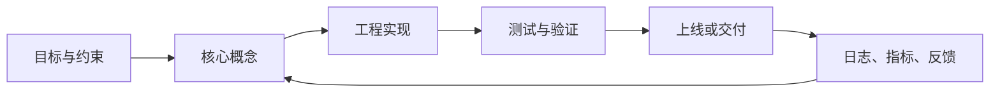

# Docker 完整学习笔记

> 适合对象：后端开发、前端开发、运维、测试、DevOps、AI/数据开发，以及想系统掌握容器、镜像、Dockerfile、Compose、网络、存储、镜像仓库、部署和排错的人。

Docker 是最常用的容器化平台之一。它可以把应用、运行时、依赖库、系统工具和配置打包成镜像，再以容器的形式在不同机器上运行。Docker 的核心价值不是“虚拟一台机器”，而是用标准化镜像交付一个可重复运行的应用环境。

如果你只会执行 `docker run nginx`，还不算真正理解 Docker。真正掌握 Docker，需要理解：镜像和容器是什么关系、Dockerfile 每一层如何构建、BuildKit 为什么重要、容器网络如何通信、volume 和 bind mount 有什么区别、Compose 如何编排多服务、镜像 tag 和 digest 如何保证可复现、为什么不要把密钥写进镜像、容器为什么应该前台运行一个主进程，以及如何排查端口、网络、权限、缓存、磁盘占用和构建失败。

最后调研：2026-06-13。

版本说明：截至 2026-06-13，Docker 官方文档以 Docker Desktop、Docker Engine、Docker Compose、Docker Build、Dockerfile Reference、Compose Specification 等文档为准。Docker 版本、Compose 插件版本、BuildKit/Buildx 能力更新较快，具体命令参数请以 `docker --help`、`docker compose --help` 和 Docker 官方文档为准。现代 Docker 推荐使用 `docker compose` 子命令，而不是旧的独立 `docker-compose` 命令。

学习目标：

- 能从 Dockerfile 构建可复现、体积合理、权限安全的镜像。
- 能解释 image、container、registry、network、volume、bind mount 的边界。
- 能用 Compose 组织本地多服务开发环境。
- 能排查容器退出、端口不通、权限错误、缓存失效、磁盘占用等问题。
- 能理解 Docker 与 Kubernetes、CI/CD、镜像供应链安全之间的关系。

## 目录

1. Docker 是什么
2. Docker 解决什么问题
3. 容器和虚拟机的区别
4. Docker 核心组件
5. 安装与环境检查
6. Docker 基本工作流
7. 镜像 Image
8. 容器 Container
9. 常用容器命令
10. 镜像常用命令
11. Dockerfile 基础
12. Dockerfile 指令详解
13. CMD 和 ENTRYPOINT
14. COPY、ADD、WORKDIR、USER
15. ENV 和 ARG
16. 镜像层、缓存与 .dockerignore
17. 多阶段构建
18. BuildKit 与 buildx
19. 容器网络
20. 端口映射
21. 数据卷 Volume
22. Bind Mount 和 tmpfs
23. Docker Compose 基础
24. compose.yaml 详解
25. Compose 网络、卷、环境变量
26. Compose profiles、depends_on、healthcheck
27. 镜像仓库 Registry
28. Docker Hub、私有仓库与镜像发布
29. Docker 日志、监控和调试
30. 资源限制
31. 清理磁盘空间
32. 安全最佳实践
33. Dockerfile 最佳实践
34. 开发环境中的 Docker
35. Python / Node / Java 示例
36. CI/CD 中使用 Docker
37. Docker 与 Kubernetes 的关系
38. 常见错误排查
39. 学习路线
40. 命令速查
41. 参考资料与扩展阅读

## 1. Docker 是什么

Docker 是一个容器化平台。

它提供：

- 镜像构建
- 容器运行
- 容器网络
- 数据卷
- 镜像仓库交互
- 多服务编排 Compose
- 构建缓存和多平台构建

一句话理解：

```text
Docker 用镜像封装应用运行环境，用容器运行镜像。
```

典型流程：

```text
写代码
  ↓
写 Dockerfile
  ↓
docker build 构建镜像
  ↓
docker run 运行容器
  ↓
docker push 推送镜像
  ↓
服务器 / CI / Kubernetes 拉取并运行
```

## 2. Docker 解决什么问题

### 2.1 环境不一致

传统问题：

```text
我本地能跑，服务器不能跑。
```

原因可能是：

- Python/Node/Java 版本不同
- 系统库版本不同
- 环境变量不同
- 配置文件缺失
- 依赖安装方式不同

Docker 把应用和依赖打包进镜像，减少环境差异。

### 2.2 部署复杂

传统部署可能要：

- 安装运行时
- 安装依赖
- 配置系统服务
- 配置目录权限
- 配置日志
- 手动启动进程

Docker 部署通常变成：

```bash
docker run image
```

或：

```bash
docker compose up -d
```

### 2.3 多服务开发困难

一个后端项目可能依赖：

- MySQL
- Redis
- RabbitMQ
- Elasticsearch
- MinIO

Docker Compose 可以一条命令拉起所有服务：

```bash
docker compose up -d
```

### 2.4 应用交付标准化

镜像可以推送到仓库：

```bash
docker push registry.example.com/my-app:1.0.0
```

部署时拉取：

```bash
docker pull registry.example.com/my-app:1.0.0
```

镜像成为标准交付物。

## 3. 容器和虚拟机的区别

| 对比 | 容器 | 虚拟机 |
| :--- | :--- | :--- |
| 隔离层级 | 操作系统级隔离 | 硬件虚拟化 |
| 是否包含完整 OS | 通常不包含 | 包含 Guest OS |
| 启动速度 | 秒级甚至更快 | 通常更慢 |
| 资源占用 | 较低 | 较高 |
| 镜像大小 | 通常较小 | 通常较大 |
| 隔离强度 | 较强但共享内核 | 更强 |
| 适合场景 | 应用部署、微服务、开发环境 | 多 OS、强隔离、完整系统 |

容器不是轻量虚拟机。

更准确地说：

```text
容器是被隔离的进程，运行在宿主机内核之上。
```

Linux 容器依赖：

- namespaces
- cgroups
- capabilities
- union filesystem

## 4. Docker 核心组件

### 4.1 Docker Client

命令行工具：

```bash
docker
```

你执行：

```bash
docker run nginx
```

实际上是 Docker Client 向 Docker Daemon 发请求。

### 4.2 Docker Daemon

后台服务：

```text
dockerd
```

负责：

- 管理镜像
- 创建容器
- 管理网络
- 管理卷
- 与 registry 通信

### 4.3 Image 镜像

镜像是只读模板。

例如：

```text
nginx:1.27
postgres:17
redis:7
python:3.12-slim
```

### 4.4 Container 容器

容器是镜像运行后的实例。

一个镜像可以运行多个容器。

```bash
docker run --name web1 nginx
docker run --name web2 nginx
```

### 4.5 Registry 镜像仓库

镜像仓库用于存储和分发镜像。

常见：

- Docker Hub
- GitHub Container Registry
- GitLab Container Registry
- Harbor
- AWS ECR
- Google Artifact Registry
- Azure Container Registry

### 4.6 Docker Compose

Compose 用于定义和运行多容器应用。

配置文件：

```text
compose.yaml
```

启动：

```bash
docker compose up -d
```

### 4.7 BuildKit / Buildx

BuildKit 是现代 Docker 构建后端。

Buildx 是 Docker Build 的扩展命令，支持：

- 多平台构建
- 高级缓存
- secret mount
- ssh mount
- provenance
- SBOM

## 5. 安装与环境检查

### 5.1 Windows

推荐安装 Docker Desktop。

要求通常包括：

- Windows 10/11
- WSL2
- 开启虚拟化

安装后检查：

```powershell
docker version
docker info
docker compose version
```

### 5.2 macOS

推荐安装 Docker Desktop。

也可使用其他容器运行环境，但初学 Docker 优先用官方 Desktop。

### 5.3 Linux

服务器上通常安装 Docker Engine。

Ubuntu 大致流程：

```bash
sudo apt-get update
sudo apt-get install docker-ce docker-ce-cli containerd.io docker-buildx-plugin docker-compose-plugin
```

具体安装步骤应以 Docker 官方 Engine Install 文档为准。

### 5.4 验证安装

```bash
docker version
docker info
docker run hello-world
```

### 5.5 Linux 非 root 使用 Docker

把用户加入 docker 组：

```bash
sudo usermod -aG docker $USER
```

重新登录后生效。

注意：

```text
docker 组权限接近 root，生产环境要谨慎管理。
```

## 6. Docker 基本工作流

### 6.1 拉取镜像

```bash
docker pull nginx:1.27
```

### 6.2 运行容器

```bash
docker run --name web -p 8080:80 nginx:1.27
```

访问：

```text
http://localhost:8080
```

### 6.3 查看容器

```bash
docker ps
docker ps -a
```

### 6.4 查看日志

```bash
docker logs web
docker logs -f web
```

### 6.5 进入容器

```bash
docker exec -it web sh
```

如果容器有 bash：

```bash
docker exec -it web bash
```

### 6.6 停止和删除

```bash
docker stop web
docker rm web
```

### 6.7 构建镜像

```bash
docker build -t my-app:1.0.0 .
```

### 6.8 运行自定义镜像

```bash
docker run --name my-app -p 8000:8000 my-app:1.0.0
```

## 7. 镜像 Image

### 7.1 镜像是什么

镜像是容器的只读模板。

镜像包含：

- 文件系统
- 应用代码
- 运行时
- 系统依赖
- 默认命令
- 元数据

### 7.2 镜像名

格式：

```text
仓库地址/命名空间/镜像名:标签
```

示例：

```text
nginx:1.27
library/redis:7
docker.io/library/postgres:17
ghcr.io/org/app:1.0.0
registry.example.com/team/app:2026.06.07
```

### 7.3 tag

tag 是镜像标签。

```text
nginx:latest
nginx:1.27
nginx:1.27-alpine
```

注意：

```text
latest 不是最新版保证，只是一个普通标签。
```

生产环境不要依赖 `latest`。

### 7.4 digest

digest 是内容哈希。

示例：

```text
nginx@sha256:...
```

生产环境追求强可复现时，可以使用 digest。

### 7.5 镜像层

镜像由多层组成。

Dockerfile 中很多指令都会生成层：

- `FROM`
- `RUN`
- `COPY`
- `ADD`

层可以缓存和复用。

## 8. 容器 Container

### 8.1 容器是什么

容器是镜像运行时实例。

镜像和容器关系：

```text
镜像 = 类
容器 = 对象
```

或：

```text
镜像 = 程序包
容器 = 正在运行的进程环境
```

### 8.2 容器生命周期

常见状态：

- created
- running
- paused
- exited
- dead

### 8.3 容器前台进程

容器通常围绕一个主进程运行。

如果主进程退出，容器退出。

例如：

```bash
docker run ubuntu
```

会很快退出，因为没有前台长期进程。

运行 shell：

```bash
docker run -it ubuntu bash
```

### 8.4 容器不等于持久化存储

容器文件系统是临时的。

删除容器后，容器内写入的数据通常丢失。

需要持久化时使用：

- volume
- bind mount
- 外部数据库/对象存储

## 9. 常用容器命令

### 9.1 运行容器

```bash
docker run nginx
```

后台运行：

```bash
docker run -d nginx
```

指定名称：

```bash
docker run --name web nginx
```

端口映射：

```bash
docker run -d --name web -p 8080:80 nginx
```

自动删除：

```bash
docker run --rm alpine echo hello
```

交互式：

```bash
docker run --rm -it ubuntu bash
```

### 9.2 查看容器

```bash
docker ps
docker ps -a
```

只显示 ID：

```bash
docker ps -q
```

### 9.3 停止、启动、重启

```bash
docker stop web
docker start web
docker restart web
```

### 9.4 删除容器

```bash
docker rm web
```

强制删除运行中容器：

```bash
docker rm -f web
```

### 9.5 查看日志

```bash
docker logs web
docker logs -f web
docker logs --tail 100 web
```

### 9.6 进入容器执行命令

```bash
docker exec web ls
docker exec -it web sh
```

### 9.7 查看容器详情

```bash
docker inspect web
```

### 9.8 查看资源占用

```bash
docker stats
docker stats web
```

### 9.9 复制文件

从容器复制到宿主机：

```bash
docker cp web:/etc/nginx/nginx.conf ./nginx.conf
```

从宿主机复制到容器：

```bash
docker cp ./index.html web:/usr/share/nginx/html/index.html
```

### 9.10 查看容器内进程

```bash
docker top web
```

## 10. 镜像常用命令

### 10.1 拉取镜像

```bash
docker pull nginx:1.27
```

### 10.2 查看镜像

```bash
docker images
docker image ls
```

### 10.3 删除镜像

```bash
docker rmi nginx:1.27
```

### 10.4 构建镜像

```bash
docker build -t my-app:1.0.0 .
```

### 10.5 打标签

```bash
docker tag my-app:1.0.0 registry.example.com/team/my-app:1.0.0
```

### 10.6 推送镜像

```bash
docker push registry.example.com/team/my-app:1.0.0
```

### 10.7 保存和加载镜像

保存：

```bash
docker save -o my-app.tar my-app:1.0.0
```

加载：

```bash
docker load -i my-app.tar
```

### 10.8 导出和导入容器文件系统

导出容器：

```bash
docker export web -o web.tar
```

导入为镜像：

```bash
docker import web.tar web-imported:latest
```

注意：

```text
docker save/load 保留镜像层和元数据。
docker export/import 只处理容器文件系统，丢失镜像历史和元数据。
```

## 11. Dockerfile 基础

### 11.1 Dockerfile 是什么

Dockerfile 是构建镜像的脚本。

示例：

```dockerfile
FROM python:3.12-slim

WORKDIR /app

COPY requirements.txt .
RUN pip install --no-cache-dir -r requirements.txt

COPY . .

CMD ["python", "main.py"]
```

构建：

```bash
docker build -t python-app:1.0.0 .
```

运行：

```bash
docker run --rm python-app:1.0.0
```

### 11.2 构建上下文

命令：

```bash
docker build -t app .
```

最后的 `.` 是 build context。

Docker 会把构建上下文发送给构建器。

因此不要把无关大文件放进上下文。

使用 `.dockerignore` 排除。

### 11.3 Dockerfile 默认文件名

默认：

```text
Dockerfile
```

指定文件：

```bash
docker build -f Dockerfile.prod -t app:prod .
```

## 12. Dockerfile 指令详解

常见指令：

| 指令 | 作用 |
| :--- | :--- |
| `FROM` | 指定基础镜像 |
| `WORKDIR` | 设置工作目录 |
| `COPY` | 复制文件 |
| `ADD` | 复制文件，额外支持 URL 和自动解压 tar |
| `RUN` | 构建阶段执行命令 |
| `CMD` | 容器默认命令 |
| `ENTRYPOINT` | 容器入口点 |
| `ENV` | 设置环境变量 |
| `ARG` | 构建参数 |
| `EXPOSE` | 声明端口 |
| `VOLUME` | 声明挂载点 |
| `USER` | 切换用户 |
| `LABEL` | 镜像元数据 |
| `HEALTHCHECK` | 健康检查 |
| `SHELL` | 指定 shell |

### 12.1 FROM

```dockerfile
FROM nginx:1.27
```

多阶段构建：

```dockerfile
FROM golang:1.23 AS build
FROM alpine:3.20
```

### 12.2 RUN

```dockerfile
RUN apt-get update && apt-get install -y curl
```

推荐清理缓存：

```dockerfile
RUN apt-get update \
    && apt-get install -y --no-install-recommends curl \
    && rm -rf /var/lib/apt/lists/*
```

### 12.3 COPY

```dockerfile
COPY src/ /app/src/
COPY package.json package-lock.json ./
```

### 12.4 EXPOSE

```dockerfile
EXPOSE 8080
```

`EXPOSE` 只是声明，不会自动发布端口。

真正映射端口：

```bash
docker run -p 8080:8080 app
```

### 12.5 LABEL

```dockerfile
LABEL org.opencontainers.image.source="https://github.com/example/app"
LABEL org.opencontainers.image.version="1.0.0"
```

## 13. CMD 和 ENTRYPOINT

### 13.1 CMD

`CMD` 提供默认命令。

```dockerfile
CMD ["python", "main.py"]
```

运行时可以覆盖：

```bash
docker run app python other.py
```

### 13.2 ENTRYPOINT

`ENTRYPOINT` 定义固定入口。

```dockerfile
ENTRYPOINT ["python", "main.py"]
```

运行时参数会追加：

```bash
docker run app --port 8000
```

实际执行：

```text
python main.py --port 8000
```

### 13.3 ENTRYPOINT + CMD

```dockerfile
ENTRYPOINT ["python", "main.py"]
CMD ["--host", "0.0.0.0", "--port", "8000"]
```

`CMD` 作为默认参数。

### 13.4 shell 格式和 exec 格式

shell 格式：

```dockerfile
CMD python main.py
```

exec 格式：

```dockerfile
CMD ["python", "main.py"]
```

推荐 exec 格式。

原因：

- 信号处理更正确
- 参数转义更清晰
- 不额外启动 shell

## 14. COPY、ADD、WORKDIR、USER

### 14.1 COPY 优先于 ADD

推荐：

```dockerfile
COPY . .
```

只有需要 ADD 的特殊功能时才用：

```dockerfile
ADD archive.tar.gz /app/
```

### 14.2 WORKDIR

推荐：

```dockerfile
WORKDIR /app
```

不推荐：

```dockerfile
RUN cd /app && python main.py
```

### 14.3 USER

默认容器常以 root 运行。

更安全：

```dockerfile
RUN useradd -r -u 10001 appuser
USER appuser
```

### 14.4 权限问题

复制时指定所有者：

```dockerfile
COPY --chown=appuser:appuser . .
```

前提是用户已存在。

## 15. ENV 和 ARG

### 15.1 ARG

构建参数，只在构建时使用。

```dockerfile
ARG APP_VERSION=dev
RUN echo "version=${APP_VERSION}"
```

构建传入：

```bash
docker build --build-arg APP_VERSION=1.0.0 -t app:1.0.0 .
```

### 15.2 ENV

运行时环境变量。

```dockerfile
ENV APP_ENV=production
```

运行时覆盖：

```bash
docker run -e APP_ENV=development app
```

### 15.3 ARG 和 ENV 区别

| 对比 | ARG | ENV |
| :--- | :--- | :--- |
| 生效阶段 | 构建阶段 | 构建和运行阶段 |
| 是否保留到镜像 | 不一定直接作为环境变量保留 | 会保留 |
| 典型用途 | 版本号、构建开关 | 应用配置默认值 |

### 15.4 不要用 ARG/ENV 放密钥

不要：

```dockerfile
ARG TOKEN=secret
ENV PASSWORD=secret
```

密钥可能出现在镜像历史、构建日志或环境变量中。

使用 BuildKit secret。

## 16. 镜像层、缓存与 .dockerignore

### 16.1 镜像层缓存

Dockerfile 每一步会产生缓存。

如果某一层输入变化，该层及后续层通常需要重建。

### 16.2 优化依赖安装缓存

Node 示例：

```dockerfile
COPY package.json package-lock.json ./
RUN npm ci

COPY . .
```

Python 示例：

```dockerfile
COPY requirements.txt .
RUN pip install --no-cache-dir -r requirements.txt

COPY . .
```

这样源码变化不会导致依赖层总是重建。

### 16.3 .dockerignore

示例：

```dockerignore
.git
.idea
.vscode
node_modules
dist
build
.venv
__pycache__
*.pyc
.env
*.log
```

作用：

- 减小 build context
- 避免复制敏感文件
- 提升构建速度
- 避免缓存无意义失效

### 16.4 查看构建上下文问题

如果构建很慢，先检查：

```text
Sending build context to Docker daemon ...
```

上下文过大时通常是 `.dockerignore` 没写好。

## 17. 多阶段构建

### 17.1 为什么需要多阶段构建

构建阶段需要：

- 编译器
- 构建工具
- dev headers
- 测试工具

运行阶段只需要：

- 可执行文件
- 运行时依赖

多阶段构建可以减小最终镜像。

### 17.2 Go 示例

```dockerfile
FROM golang:1.23 AS build

WORKDIR /src
COPY go.mod go.sum ./
RUN go mod download
COPY . .
RUN CGO_ENABLED=0 go build -o /out/app ./cmd/app

FROM alpine:3.20

RUN adduser -D -u 10001 appuser
USER appuser

COPY --from=build /out/app /app

ENTRYPOINT ["/app"]
```

### 17.3 Node 构建前端

```dockerfile
FROM node:22-alpine AS build

WORKDIR /app
COPY package.json package-lock.json ./
RUN npm ci
COPY . .
RUN npm run build

FROM nginx:1.27-alpine

COPY --from=build /app/dist /usr/share/nginx/html
```

### 17.4 Python 多阶段

```dockerfile
FROM python:3.12-slim AS builder

WORKDIR /app
COPY requirements.txt .
RUN pip wheel --wheel-dir /wheels -r requirements.txt

FROM python:3.12-slim

WORKDIR /app
COPY --from=builder /wheels /wheels
RUN pip install --no-cache-dir /wheels/*
COPY . .

CMD ["python", "main.py"]
```

## 18. BuildKit 与 buildx

### 18.1 BuildKit 是什么

BuildKit 是现代 Docker 构建引擎。

它支持：

- 更快构建
- 并行构建
- 更好的缓存
- secret mount
- ssh mount
- cache mount
- 多平台构建

### 18.2 buildx

查看：

```bash
docker buildx version
docker buildx ls
```

创建 builder：

```bash
docker buildx create --use --name mybuilder
```

### 18.3 多平台构建

```bash
docker buildx build \
  --platform linux/amd64,linux/arm64 \
  -t registry.example.com/app:1.0.0 \
  --push .
```

### 18.4 cache mount

```dockerfile
# syntax=docker/dockerfile:1

FROM python:3.12-slim

WORKDIR /app
COPY requirements.txt .

RUN --mount=type=cache,target=/root/.cache/pip \
    pip install -r requirements.txt
```

### 18.5 secret mount

构建：

```bash
docker build --secret id=pip_token,env=PIP_TOKEN -t app .
```

Dockerfile：

```dockerfile
# syntax=docker/dockerfile:1

RUN --mount=type=secret,id=pip_token \
    TOKEN="$(cat /run/secrets/pip_token)" && \
    echo "use token without baking it into image"
```

密钥不会写入最终镜像层。

## 19. 容器网络

### 19.1 查看网络

```bash
docker network ls
```

### 19.2 默认网络

常见：

| 网络 | 说明 |
| :--- | :--- |
| `bridge` | 默认桥接网络 |
| `host` | 使用宿主机网络，Linux 常见 |
| `none` | 无网络 |

### 19.3 创建自定义网络

```bash
docker network create app-net
```

运行容器：

```bash
docker run -d --name redis --network app-net redis:7
docker run --rm --network app-net alpine ping redis
```

自定义 bridge 网络支持容器名 DNS 解析。

### 19.4 容器互联推荐方式

推荐：

```text
同一个自定义网络 + 使用服务名/容器名访问
```

不推荐旧的：

```bash
--link
```

### 19.5 查看网络详情

```bash
docker network inspect app-net
```

## 20. 端口映射

### 20.1 基本映射

```bash
docker run -p 8080:80 nginx
```

含义：

```text
宿主机 8080 -> 容器 80
```

访问：

```text
http://localhost:8080
```

### 20.2 只绑定本地地址

```bash
docker run -p 127.0.0.1:8080:80 nginx
```

只允许本机访问。

### 20.3 随机端口

```bash
docker run -P nginx
```

查看映射：

```bash
docker port <container>
```

### 20.4 容器内服务监听地址

容器内应用应监听：

```text
0.0.0.0
```

如果只监听 `127.0.0.1`，宿主机端口映射可能无法访问。

## 21. 数据卷 Volume

### 21.1 volume 是什么

Volume 是 Docker 管理的数据目录。

适合持久化：

- 数据库数据
- 上传文件
- 应用持久数据

### 21.2 创建 volume

```bash
docker volume create db-data
```

### 21.3 使用 volume

```bash
docker run -d \
  --name postgres \
  -e POSTGRES_PASSWORD=secret \
  -v db-data:/var/lib/postgresql/data \
  postgres:17
```

### 21.4 查看 volume

```bash
docker volume ls
docker volume inspect db-data
```

### 21.5 删除 volume

```bash
docker volume rm db-data
```

注意：

```text
删除 volume 会删除其中数据。
```

### 21.6 备份 volume

```bash
docker run --rm \
  -v db-data:/data \
  -v "$PWD":/backup \
  alpine tar czf /backup/db-data.tar.gz -C /data .
```

### 21.7 恢复 volume

```bash
docker run --rm \
  -v db-data:/data \
  -v "$PWD":/backup \
  alpine sh -c "cd /data && tar xzf /backup/db-data.tar.gz"
```

## 22. Bind Mount 和 tmpfs

### 22.1 Bind Mount

把宿主机路径挂载进容器。

```bash
docker run --rm -it \
  -v "$PWD":/app \
  -w /app \
  python:3.12 python main.py
```

### 22.2 volume vs bind mount

| 对比 | volume | bind mount |
| :--- | :--- | :--- |
| 管理方 | Docker | 用户 |
| 路径 | Docker 管理 | 宿主机指定 |
| 可移植性 | 更好 | 依赖宿主机路径 |
| 适合 | 持久数据 | 开发挂载源码、配置 |

### 22.3 tmpfs

内存临时文件系统。

```bash
docker run --tmpfs /tmp nginx
```

适合：

- 临时敏感数据
- 高速临时文件
- 不需要持久化的数据

## 23. Docker Compose 基础

### 23.1 Compose 是什么

Docker Compose 用一个 YAML 文件定义多容器应用。

默认文件名：

```text
compose.yaml
compose.yml
docker-compose.yaml
docker-compose.yml
```

现代推荐：

```text
compose.yaml
```

### 23.2 最小示例

```yaml
services:
  web:
    image: nginx:1.27
    ports:
      - "8080:80"
```

启动：

```bash
docker compose up
```

后台启动：

```bash
docker compose up -d
```

停止：

```bash
docker compose down
```

### 23.3 常用命令

```bash
docker compose up -d
docker compose down
docker compose ps
docker compose logs
docker compose logs -f web
docker compose exec web sh
docker compose build
docker compose pull
docker compose restart
```

### 23.4 Compose 项目名

默认项目名通常来自目录名。

指定：

```bash
docker compose -p myproject up -d
```

## 24. compose.yaml 详解

### 24.1 多服务示例

```yaml
services:
  app:
    build:
      context: .
      dockerfile: Dockerfile
    ports:
      - "8000:8000"
    environment:
      APP_ENV: development
      DATABASE_URL: postgres://postgres:secret@db:5432/app
    depends_on:
      - db
      - redis

  db:
    image: postgres:17
    environment:
      POSTGRES_DB: app
      POSTGRES_USER: postgres
      POSTGRES_PASSWORD: secret
    volumes:
      - db-data:/var/lib/postgresql/data

  redis:
    image: redis:7

volumes:
  db-data:
```

### 24.2 image

```yaml
services:
  redis:
    image: redis:7
```

### 24.3 build

```yaml
services:
  app:
    build:
      context: .
      dockerfile: Dockerfile
      args:
        APP_VERSION: "1.0.0"
```

### 24.4 command

覆盖镜像默认 CMD：

```yaml
services:
  app:
    command: ["python", "main.py"]
```

### 24.5 entrypoint

覆盖 ENTRYPOINT：

```yaml
services:
  app:
    entrypoint: ["/entrypoint.sh"]
```

### 24.6 restart

```yaml
services:
  app:
    restart: unless-stopped
```

常见：

| 策略 | 说明 |
| :--- | :--- |
| `no` | 不重启 |
| `always` | 总是重启 |
| `on-failure` | 失败时重启 |
| `unless-stopped` | 除非手动停止，否则重启 |

## 25. Compose 网络、卷、环境变量

### 25.1 服务名 DNS

Compose 默认创建一个网络。

服务之间可以用服务名访问：

```text
app -> db:5432
app -> redis:6379
```

不要在容器之间使用 `localhost` 访问对方。

容器内：

```text
localhost = 当前容器自己
```

### 25.2 声明网络

```yaml
services:
  app:
    networks:
      - backend

  db:
    networks:
      - backend

networks:
  backend:
```

### 25.3 声明卷

```yaml
services:
  db:
    volumes:
      - db-data:/var/lib/postgresql/data

volumes:
  db-data:
```

### 25.4 bind mount

```yaml
services:
  app:
    volumes:
      - .:/app
```

开发环境常用，生产环境谨慎使用。

### 25.5 environment

```yaml
services:
  app:
    environment:
      APP_ENV: development
      DEBUG: "true"
```

### 25.6 env_file

```yaml
services:
  app:
    env_file:
      - .env
```

`.env` 示例：

```env
APP_ENV=development
DATABASE_URL=postgres://postgres:secret@db:5432/app
```

注意：

```text
不要把包含真实密钥的 .env 提交到仓库。
```

## 26. Compose profiles、depends_on、healthcheck

### 26.1 profiles

按需启用服务：

```yaml
services:
  app:
    build: .

  adminer:
    image: adminer
    profiles:
      - tools
    ports:
      - "8081:8080"
```

默认启动：

```bash
docker compose up -d
```

启用 tools：

```bash
docker compose --profile tools up -d
```

### 26.2 depends_on

```yaml
services:
  app:
    depends_on:
      - db
```

基础 `depends_on` 只保证启动顺序，不保证服务已就绪。

### 26.3 healthcheck

```yaml
services:
  db:
    image: postgres:17
    environment:
      POSTGRES_PASSWORD: secret
    healthcheck:
      test: ["CMD-SHELL", "pg_isready -U postgres"]
      interval: 5s
      timeout: 3s
      retries: 10
```

### 26.4 depends_on 配合健康状态

```yaml
services:
  app:
    build: .
    depends_on:
      db:
        condition: service_healthy

  db:
    image: postgres:17
    environment:
      POSTGRES_PASSWORD: secret
    healthcheck:
      test: ["CMD-SHELL", "pg_isready -U postgres"]
      interval: 5s
      timeout: 3s
      retries: 10
```

### 26.5 查看配置合并结果

```bash
docker compose config
```

这是排查 Compose 配置问题的重要命令。

## 27. 镜像仓库 Registry

### 27.1 登录

```bash
docker login
```

登录私有仓库：

```bash
docker login registry.example.com
```

### 27.2 打标签

```bash
docker tag app:1.0.0 registry.example.com/team/app:1.0.0
```

### 27.3 推送

```bash
docker push registry.example.com/team/app:1.0.0
```

### 27.4 拉取

```bash
docker pull registry.example.com/team/app:1.0.0
```

### 27.5 tag 策略

常见 tag：

- `1.0.0`
- `1.0`
- `stable`
- `main`
- `git-sha`
- `2026.06.07`

生产推荐：

```text
语义版本 + git sha + digest 校验
```

不要只依赖：

```text
latest
```

## 28. Docker Hub、私有仓库与镜像发布

### 28.1 Docker Hub

官方公共镜像常见命名：

```text
nginx
redis
postgres
python
node
eclipse-temurin
```

### 28.2 GitHub Container Registry

镜像示例：

```text
ghcr.io/owner/repo/app:1.0.0
```

### 28.3 Harbor

Harbor 是常见企业私有镜像仓库。

提供：

- 项目隔离
- 权限管理
- 镜像复制
- 漏洞扫描
- 镜像签名集成

### 28.4 发布前检查

```bash
docker build -t app:1.0.0 .
docker run --rm app:1.0.0 --version
docker tag app:1.0.0 registry.example.com/team/app:1.0.0
docker push registry.example.com/team/app:1.0.0
```

## 29. Docker 日志、监控和调试

### 29.1 日志

```bash
docker logs app
docker logs -f app
docker logs --since 10m app
docker logs --tail 200 app
```

### 29.2 资源使用

```bash
docker stats
```

### 29.3 进入容器

```bash
docker exec -it app sh
```

### 29.4 查看文件系统变化

```bash
docker diff app
```

### 29.5 查看底层信息

```bash
docker inspect app
docker inspect image:tag
```

### 29.6 查看事件

```bash
docker events
```

### 29.7 调试无 shell 镜像

有些镜像很小，没有 shell。

处理方向：

- 使用 debug 版本镜像。
- 临时构建带 shell 的镜像。
- 用 sidecar 容器共享网络命名空间。
- 在 Kubernetes 中使用 ephemeral container。

## 30. 资源限制

### 30.1 限制内存

```bash
docker run --memory 512m app
```

### 30.2 限制 CPU

```bash
docker run --cpus 1.5 app
```

### 30.3 Compose 中限制

```yaml
services:
  app:
    image: app:1.0.0
    mem_limit: 512m
    cpus: 1.5
```

### 30.4 查看资源

```bash
docker stats
```

### 30.5 OOM 排查

如果容器被杀：

```bash
docker inspect app
```

查看：

```text
OOMKilled
ExitCode
```

## 31. 清理磁盘空间

### 31.1 查看占用

```bash
docker system df
```

### 31.2 删除停止的容器

```bash
docker container prune
```

### 31.3 删除未使用镜像

```bash
docker image prune
```

删除所有未使用镜像：

```bash
docker image prune -a
```

### 31.4 删除未使用 volume

```bash
docker volume prune
```

注意：

```text
可能删除数据库数据，先确认。
```

### 31.5 一次性清理

```bash
docker system prune
```

包括 volume：

```bash
docker system prune --volumes
```

危险操作，执行前确认。

## 32. 安全最佳实践

### 32.1 不要把密钥写进镜像

不要：

```dockerfile
ENV API_KEY=secret
RUN echo "token" > /root/token
```

不要把 `.env`、私钥、云厂商凭证复制进镜像。

### 32.2 使用 BuildKit secrets

```bash
docker build --secret id=npm_token,env=NPM_TOKEN -t app .
```

Dockerfile：

```dockerfile
# syntax=docker/dockerfile:1
RUN --mount=type=secret,id=npm_token \
    echo "use secret only during build"
```

### 32.3 使用非 root 用户

```dockerfile
RUN useradd -r -u 10001 appuser
USER appuser
```

### 32.4 最小权限运行

```bash
docker run --read-only --cap-drop ALL app
```

根据应用需要再添加权限。

### 32.5 不随意挂载 Docker socket

危险：

```yaml
volumes:
  - /var/run/docker.sock:/var/run/docker.sock
```

容器拿到 Docker socket 往往等价于宿主机 root 权限。

### 32.6 扫描镜像

可以使用：

- Docker Scout
- Trivy
- Grype
- 企业镜像仓库扫描

### 32.7 固定基础镜像版本

不推荐：

```dockerfile
FROM python:latest
```

推荐：

```dockerfile
FROM python:3.12-slim
```

更严格可使用 digest。

### 32.8 最小化构建上下文和凭证暴露

构建上下文会被发送给 Docker daemon 或远程 builder。即使 Dockerfile 没有 `COPY` 某个文件，敏感文件也不应该进入上下文。

`.dockerignore` 至少应包含：

```text
.git
.env
*.pem
*.key
node_modules
dist
build
target
__pycache__
```

对于 npm、pip、Maven、Gradle 等私有仓库凭证，优先使用 BuildKit secret 或 CI 的临时凭证，不要写入 `ARG`、`ENV` 或镜像层。

## 33. Dockerfile 最佳实践

### 33.1 选择合适基础镜像

常见：

- `alpine` 小，但 musl 可能带来兼容问题
- `slim` 平衡体积和兼容性
- `distroless` 更小更安全，但调试不方便
- 完整镜像适合构建阶段

### 33.2 减少层和无效缓存

合理合并：

```dockerfile
RUN apt-get update \
    && apt-get install -y --no-install-recommends curl \
    && rm -rf /var/lib/apt/lists/*
```

### 33.3 先复制依赖清单

```dockerfile
COPY package.json package-lock.json ./
RUN npm ci
COPY . .
```

### 33.4 使用 .dockerignore

必须排除：

- `.git`
- 构建产物
- 本地依赖目录
- 虚拟环境
- 日志
- 密钥

### 33.5 一个容器一个主进程

通常一个容器运行一个主服务。

多个服务用 Compose 或 Kubernetes 编排。

### 33.6 日志输出到 stdout/stderr

容器应用应把日志输出到标准输出和标准错误。

Docker 日志系统才能收集：

```bash
docker logs app
```

### 33.7 不在构建中下载不固定版本

不推荐：

```dockerfile
RUN curl https://example.com/install.sh | sh
```

至少应固定版本并校验来源。

### 33.8 BuildKit cache mount

依赖下载目录适合使用 cache mount，提高重复构建速度，同时避免把缓存直接打进镜像层：

```dockerfile
# syntax=docker/dockerfile:1
FROM node:22-slim AS build
WORKDIR /app

COPY package.json package-lock.json ./
RUN --mount=type=cache,target=/root/.npm \
    npm ci

COPY . .
RUN npm run build
```

常见缓存目录：

| 生态 | 缓存目录示例 |
| :--- | :--- |
| npm | `/root/.npm` |
| pnpm | `/root/.local/share/pnpm/store` |
| pip | `/root/.cache/pip` |
| Gradle | `/root/.gradle/caches` |
| Maven | `/root/.m2` |

### 33.9 构建产物和运行镜像分离

多阶段构建的目标是让运行镜像只包含运行需要的文件：

```dockerfile
FROM eclipse-temurin:21-jdk AS build
WORKDIR /src
COPY . .
RUN ./gradlew clean bootJar --no-daemon

FROM eclipse-temurin:21-jre
WORKDIR /app
COPY --from=build /src/build/libs/app.jar app.jar
USER 10001
ENTRYPOINT ["java", "-jar", "app.jar"]
```

不要把编译器、源码、测试缓存、包管理器缓存留在最终镜像里。

## 34. 开发环境中的 Docker

### 34.1 开发数据库

```bash
docker run -d \
  --name dev-postgres \
  -e POSTGRES_PASSWORD=secret \
  -p 5432:5432 \
  -v dev-postgres-data:/var/lib/postgresql/data \
  postgres:17
```

### 34.2 开发 Redis

```bash
docker run -d \
  --name dev-redis \
  -p 6379:6379 \
  redis:7
```

### 34.3 Compose 开发环境

```yaml
services:
  db:
    image: postgres:17
    environment:
      POSTGRES_PASSWORD: secret
    ports:
      - "5432:5432"
    volumes:
      - db-data:/var/lib/postgresql/data

  redis:
    image: redis:7
    ports:
      - "6379:6379"

volumes:
  db-data:
```

启动：

```bash
docker compose up -d
```

### 34.4 挂载源码热更新

```yaml
services:
  app:
    build: .
    volumes:
      - .:/app
    ports:
      - "8000:8000"
```

注意：

```text
Windows/macOS bind mount 性能可能比 Linux 差。
```

### 34.5 healthcheck

开发环境里可以给关键服务加健康检查，避免应用过早连接数据库：

```yaml
services:
  db:
    image: postgres:17
    environment:
      POSTGRES_PASSWORD: secret
    healthcheck:
      test: ["CMD-SHELL", "pg_isready -U postgres"]
      interval: 5s
      timeout: 3s
      retries: 10

  app:
    build: .
    depends_on:
      db:
        condition: service_healthy
```

注意：`depends_on` 只能表达 Compose 层面的启动顺序和健康依赖，应用自身仍应实现连接重试。

### 34.6 Compose 的边界

Compose 很适合：

- 本地开发环境。
- 单机测试环境。
- 简单内部工具。
- CI 中启动依赖服务。

不适合直接替代 Kubernetes 的能力：

- 多节点调度。
- 自动扩缩容。
- 滚动发布和回滚。
- 复杂服务发现和入口流量治理。
- 大规模密钥和配置管理。

## 35. Python / Node / Java 示例

### 35.1 Python FastAPI

```dockerfile
FROM python:3.12-slim

WORKDIR /app

COPY requirements.txt .
RUN pip install --no-cache-dir -r requirements.txt

COPY . .

EXPOSE 8000

CMD ["uvicorn", "main:app", "--host", "0.0.0.0", "--port", "8000"]
```

构建运行：

```bash
docker build -t fastapi-app .
docker run --rm -p 8000:8000 fastapi-app
```

### 35.2 Node

```dockerfile
FROM node:22-alpine

WORKDIR /app

COPY package.json package-lock.json ./
RUN npm ci --omit=dev

COPY . .

EXPOSE 3000

CMD ["node", "server.js"]
```

### 35.3 Java Spring Boot

```dockerfile
FROM eclipse-temurin:21-jdk AS build

WORKDIR /src
COPY . .
RUN ./gradlew bootJar

FROM eclipse-temurin:21-jre

WORKDIR /app
COPY --from=build /src/build/libs/*.jar app.jar

EXPOSE 8080

ENTRYPOINT ["java", "-jar", "app.jar"]
```

### 35.4 Nginx 静态站点

```dockerfile
FROM nginx:1.27-alpine

COPY dist/ /usr/share/nginx/html/
```

## 36. CI/CD 中使用 Docker

### 36.1 GitHub Actions 构建推送

```yaml
name: Docker

on:
  push:
    branches: [main]

jobs:
  docker:
    runs-on: ubuntu-latest

    steps:
      - uses: actions/checkout@v4

      - uses: docker/setup-buildx-action@v3

      - uses: docker/login-action@v3
        with:
          registry: ghcr.io
          username: ${{ github.actor }}
          password: ${{ secrets.GITHUB_TOKEN }}

      - uses: docker/build-push-action@v6
        with:
          context: .
          push: true
          tags: ghcr.io/${{ github.repository }}:latest
```

具体 action 版本请以官方 Marketplace 和 Docker 文档为准。

### 36.2 CI 构建建议

- 使用 Buildx。
- 使用缓存。
- 固定基础镜像版本。
- 不把密钥写入 Dockerfile。
- 使用 commit sha 打 tag。
- 构建后运行基本测试。
- 推送前扫描镜像。

### 36.3 使用缓存

示意：

```yaml
with:
  cache-from: type=gha
  cache-to: type=gha,mode=max
```

### 36.4 多平台推送

```yaml
with:
  platforms: linux/amd64,linux/arm64
  push: true
```

## 37. Docker 与 Kubernetes 的关系

Docker 主要解决：

```text
构建和运行容器
```

Kubernetes 主要解决：

```text
大规模容器编排
```

Kubernetes 管理：

- 调度
- 副本
- 服务发现
- 滚动发布
- 自动恢复
- 配置和密钥
- 存储编排

学习顺序建议：

```text
先学 Docker 基础
再学 Compose
最后学 Kubernetes
```

## 38. 常见错误排查

### 38.1 端口被占用

错误：

```text
Bind for 0.0.0.0:8080 failed: port is already allocated
```

处理：

```bash
docker ps
```

换端口：

```bash
docker run -p 8081:80 nginx
```

或停止占用端口的服务。

### 38.2 容器启动后立刻退出

查看：

```bash
docker ps -a
docker logs <container>
```

常见原因：

- 主进程执行完退出。
- 命令写错。
- 配置文件错误。
- 应用启动失败。

### 38.3 容器内访问不到宿主机服务

容器内的 `localhost` 是容器自己。

Docker Desktop 常用：

```text
host.docker.internal
```

Linux 上需要额外配置或使用宿主机网关。

### 38.4 服务之间连接失败

Compose 中服务之间用服务名：

```text
db:5432
redis:6379
```

不要用：

```text
localhost:5432
```

### 38.5 permission denied

常见场景：

- bind mount 文件权限不匹配
- 容器用户不是 root
- Linux SELinux 限制
- Docker socket 权限不足

排查：

```bash
docker exec -it app id
ls -l
docker inspect app
```

### 38.6 no space left on device

查看：

```bash
docker system df
```

清理：

```bash
docker system prune
```

谨慎清理 volume：

```bash
docker volume prune
```

### 38.7 镜像构建很慢

检查：

- `.dockerignore`
- 构建上下文大小
- Dockerfile 指令顺序
- 依赖层缓存
- 是否每次复制全量源码再安装依赖
- 是否使用 BuildKit cache mount

### 38.8 pull 镜像失败

常见原因：

- 网络问题
- 镜像名错误
- tag 不存在
- 未登录私有仓库
- 平台架构不支持

排查：

```bash
docker pull image:tag
docker login registry.example.com
docker manifest inspect image:tag
```

### 38.9 exec 进入失败

如果容器已经退出：

```bash
docker exec
```

会失败。

先看：

```bash
docker ps -a
docker logs container
```

### 38.10 Compose 配置不生效

查看最终配置：

```bash
docker compose config
```

重建：

```bash
docker compose up -d --build
```

### 38.11 系统化排查流程

遇到 Docker 问题时，按层次定位：

1. 镜像是否正确：`docker image ls`、`docker history image`、`docker inspect image`。
2. 容器是否还在：`docker ps -a`。
3. 进程为什么退出：`docker logs container`、`docker inspect container --format '{{.State.ExitCode}}'`。
4. 端口是否映射：`docker port container`、`docker ps`。
5. 网络是否连通：`docker network inspect network`，容器内用 `getent hosts service`、`curl`、`nc`。
6. 数据是否持久化：`docker volume ls`、`docker volume inspect volume`。
7. 构建缓存是否命中：检查 Dockerfile 指令顺序、`.dockerignore` 和 build 输出。
8. Compose 最终配置是否符合预期：`docker compose config`。

常用排查命令：

```bash
docker inspect container
docker logs -f container
docker exec -it container sh
docker system df
docker events
docker compose ps
docker compose logs -f
```

### 38.12 架构不匹配

Apple Silicon、ARM 服务器和 x86 服务器混用时，可能出现镜像平台不匹配：

```bash
docker image inspect image:tag --format '{{.Architecture}}'
docker buildx imagetools inspect image:tag
```

构建多架构镜像：

```bash
docker buildx build \
  --platform linux/amd64,linux/arm64 \
  -t registry.example.com/app:1.0.0 \
  --push .
```

## 39. 学习路线

### 阶段 1：会用容器

掌握：

- `docker run`
- `docker ps`
- `docker logs`
- `docker exec`
- `docker stop`
- `docker rm`

### 阶段 2：理解镜像

掌握：

- `docker pull`
- `docker images`
- `docker build`
- `docker tag`
- `docker push`
- tag 和 digest

### 阶段 3：掌握 Dockerfile

掌握：

- `FROM`
- `RUN`
- `COPY`
- `WORKDIR`
- `CMD`
- `ENTRYPOINT`
- `ENV`
- `ARG`
- `.dockerignore`
- 多阶段构建

### 阶段 4：掌握网络和存储

掌握：

- 端口映射
- 自定义网络
- 服务名 DNS
- volume
- bind mount
- 数据备份

### 阶段 5：掌握 Compose

掌握：

- `compose.yaml`
- `services`
- `volumes`
- `networks`
- `environment`
- `depends_on`
- `healthcheck`
- `profiles`

### 阶段 6：工程化

掌握：

- BuildKit
- buildx
- 多平台构建
- 镜像仓库
- CI/CD
- 安全扫描
- Dockerfile 优化

## 40. 命令速查

### 40.1 基础信息

```bash
docker version
docker info
docker system df
```

### 40.2 容器

```bash
docker run --rm hello-world
docker run -d --name web -p 8080:80 nginx
docker ps
docker ps -a
docker logs -f web
docker exec -it web sh
docker stop web
docker start web
docker restart web
docker rm web
docker rm -f web
docker inspect web
docker stats
```

### 40.3 镜像

```bash
docker pull nginx:1.27
docker images
docker build -t app:1.0.0 .
docker tag app:1.0.0 registry.example.com/app:1.0.0
docker push registry.example.com/app:1.0.0
docker rmi app:1.0.0
docker save -o app.tar app:1.0.0
docker load -i app.tar
```

### 40.4 网络

```bash
docker network ls
docker network create app-net
docker network inspect app-net
docker network rm app-net
```

### 40.5 Volume

```bash
docker volume ls
docker volume create db-data
docker volume inspect db-data
docker volume rm db-data
docker volume prune
```

### 40.6 Compose

```bash
docker compose version
docker compose up
docker compose up -d
docker compose down
docker compose ps
docker compose logs
docker compose logs -f app
docker compose exec app sh
docker compose build
docker compose pull
docker compose restart
docker compose config
```

### 40.7 Buildx

```bash
docker buildx version
docker buildx ls
docker buildx create --use --name mybuilder
docker buildx build --platform linux/amd64,linux/arm64 -t app:1.0.0 .
```

### 40.8 清理

```bash
docker container prune
docker image prune
docker image prune -a
docker volume prune
docker network prune
docker system prune
docker system prune --volumes
```

## 41. 参考资料与扩展阅读

建议优先阅读 Docker 官方文档：

- [Docker Docs](https://docs.docker.com/)
- [Get Docker](https://docs.docker.com/get-docker/)
- [Docker Engine](https://docs.docker.com/engine/)
- [Docker CLI Reference](https://docs.docker.com/reference/cli/docker/)
- [Dockerfile Reference](https://docs.docker.com/reference/dockerfile/)
- [Docker Build](https://docs.docker.com/build/)
- [Docker Buildx](https://docs.docker.com/build/building/multi-platform/)
- [Docker Compose](https://docs.docker.com/compose/)
- [Compose File Reference](https://docs.docker.com/reference/compose-file/)
- [Docker Networking](https://docs.docker.com/engine/network/)
- [Docker Storage](https://docs.docker.com/engine/storage/)
- [Volumes](https://docs.docker.com/engine/storage/volumes/)
- [Bind mounts](https://docs.docker.com/engine/storage/bind-mounts/)
- [Build secrets](https://docs.docker.com/build/building/secrets/)
- [Cache mounts](https://docs.docker.com/build/cache/optimize/)
- [Multi-stage builds](https://docs.docker.com/build/building/multi-stage/)
- [Docker Hub](https://docs.docker.com/docker-hub/)
- [Docker Scout](https://docs.docker.com/scout/)

实践检索关键词：

- `Dockerfile BuildKit secret cache mount`
- `Docker compose healthcheck depends_on service_healthy`
- `Docker no space left on device system df prune`
- `Docker container localhost host.docker.internal`
- `Docker multi arch buildx linux/amd64 linux/arm64`

## 最后总结

Docker 的核心可以浓缩为：

```text
Dockerfile 定义镜像如何构建
image 是只读应用模板
container 是镜像运行实例
registry 存储和分发镜像
network 解决容器通信
volume 解决数据持久化
compose 编排多服务开发环境
BuildKit/buildx 提供现代构建能力
```

学习 Docker 时最重要的是建立正确模型：

1. 容器是进程，不是完整虚拟机。
2. 镜像应可重复构建，不要混入本地偶然状态。
3. 数据不要只存在容器可写层，重要数据用 volume 或外部存储。
4. 容器间通信用网络和服务名，不要误用 localhost。
5. Dockerfile 要关注缓存、安全、体积和可维护性。
6. 生产镜像不要依赖 `latest`，不要把密钥写进镜像。

当你能解释 `docker run -p 8080:80 nginx` 背后发生了什么、为什么容器退出、为什么服务之间不能用 localhost、volume 和 bind mount 的区别、CMD 和 ENTRYPOINT 的区别、Dockerfile 缓存为什么失效、Compose 如何创建网络时，就已经真正入门 Docker。

## 2026-06 深化整理：Docker 的工程化学习框架

Last researched: 2026-06-16

### 1. 学习定位

Docker 这类知识不适合只按“概念清单”记忆，更适合按可交付能力组织。本文后续复习时，应围绕这条主线展开：镜像、容器、Dockerfile、BuildKit、网络、卷、Compose、安全和生产部署边界。如果只会照抄命令、配置或示例，而不能解释输入、输出、边界、失败模式和验证方法，知识在真实项目里会很快失效。

一份万字级笔记要承担三个作用：第一，建立准确概念，避免把相似术语混在一起；第二，形成可执行流程，知道从零搭建、调试和交付的顺序；第三，沉淀排错经验，遇到异常时能按证据定位，而不是凭感觉改配置。学习时建议把每个小节都对应到“是什么、为什么、怎么做、什么时候不用、出了问题怎么查”五个问题。

### 2. 核心模块

- 镜像是不可变模板，容器是运行实例
- Dockerfile 层缓存影响构建速度和安全
- 卷负责持久化和宿主机边界
- 网络决定服务发现和访问面
- 生产环境还需要编排、监控和镜像治理

这些模块之间不是孤立关系。通常先有需求和约束，再选择架构或工具；工具落地后会产生配置、接口、状态和制品；运行阶段再通过日志、指标、测试和回滚机制验证结果。真正掌握本主题，意味着能从一次失败现象反推到是哪一层出了问题。



Figure: 通用学习与工程闭环，结合官方文档、标准资料和社区实践重新整理。

### 3. 实践路线

建议按四轮学习。第一轮只跑通最小例子，不追求复杂度；第二轮补齐关键概念，明确每个配置项和命令的作用；第三轮做故障注入，主动制造常见错误并记录现象；第四轮整理成项目模板，把目录结构、命名规范、检查清单和参考链接固化下来。

对技术笔记而言，最小例子必须可重复。命令类主题要记录操作系统、Shell、权限、工作目录和返回码；框架类主题要记录版本、依赖、构建命令、目录结构和运行入口；工程设计类主题要记录标准依据、图纸、点表、验收项和变更记录。没有环境信息的示例，后续很难判断是知识错误、版本差异还是本机配置问题。

### 4. 常见错误

- 把密钥 bake 进镜像
- latest 标签不可追踪
- 容器内用 root 且无必要能力限制
- 数据只放容器可写层
- 构建上下文过大

排查时先收集事实：版本、配置、输入、输出、日志、错误码、时间点、复现步骤。不要一开始就改多个参数。一次只改一个变量，并记录改动前后的现象。对于涉及安全、权限、部署、数据库、电气或工业控制的主题，要优先查官方文档和标准，社区文章只能作为实践参考，不能作为唯一依据。

### 5. 笔记维护建议

后续更新这篇文档时，建议保留 `Last researched` 日期，并把新增内容放到“版本差异”“实践坑”“调试清单”“参考资料”中。对于快速变化的工具链，例如 Android、Gradle、Docker、CI/CD、Redis、uv、Qt 和前端标准，至少在重新实践前核对一次官方文档。对于工业、电气、PLC、RBAC 这类涉及安全、权限或标准的内容，应明确标准编号、适用地区、适用版本和项目约束。

## References and further reading

- [Official] [Docker Docs](https://docs.docker.com/)
- [Official] [Dockerfile reference](https://docs.docker.com/reference/dockerfile/)
- [Official] [Docker Compose documentation](https://docs.docker.com/compose/)
- [Official] [MDN Web Docs](https://developer.mozilla.org/)
- [Official] [Microsoft Learn](https://learn.microsoft.com/)
- [Official] [GitHub Actions documentation](https://docs.github.com/actions)
- [Official] [GitLab CI/CD documentation](https://docs.gitlab.com/ci/)
- [Official] [CMake Documentation](https://cmake.org/cmake/help/latest/)
- [Official] [Gradle User Manual](https://docs.gradle.org/)
- [Official] [Apache Maven Guides](https://maven.apache.org/guides/)
- [Official] [Redis Documentation](https://redis.io/docs/latest/)
- [Official] [Qt Documentation](https://doc.qt.io/qt-6/)
- [Course] [MIT 6.006 Introduction to Algorithms](https://ocw.mit.edu/courses/6-006-introduction-to-algorithms-spring-2020/)

<!-- research-notes: enhanced-v1 -->

## 研究笔记增强

> Last reviewed: 2026-06-17。此节用于把《Docker 完整学习笔记》从阅读笔记推进到可复习、可实践、可验证的研究笔记；具体版本、参数和环境仍需结合官方资料、项目约束和实测结果校准。

### 知识定位

按概念理解、最小实践、故障排查、复盘沉淀的路径学习，既记录是什么，也记录什么时候用、什么时候不用和失败后如何定位。

### 重点补充
- 明确该技术解决的问题、输入输出、边界条件和依赖环境。
- 把核心概念落到一个最小可运行示例。
- 记录版本、配置、命令、日志和错误信息，保证以后可以复现。
- 明确适用场景、限制条件、替代方案和迁移成本。

### 实践清单
- 为本章整理一张概念关系图、流程图或最小系统图。
- 写一个最小可运行示例，并保留运行命令、输入、输出和环境版本。
- 列出常见错误、排查命令、关键日志和修复动作。
- 补充安全、性能、兼容性、可维护性和上线运维注意事项。
- 用一次真实问题或练习项目复盘验证笔记是否可用。

### 常见误区
- 只摘抄定义或命令，没有记录上下文、前提条件和边界。
- 只记录成功路径，不记录失败样本、异常现象和排查过程。
- 没有版本、环境和数据样本，导致后续无法复现。
- 把教程默认值直接用于真实项目，没有结合约束重新评估。

### 复盘问题
- 学完《Docker 完整学习笔记》后，能否用自己的话说明它解决什么问题、不解决什么问题？
- 如果要在真实项目中使用，需要哪些前置条件、依赖版本、输入数据和验证手段？
- 失败时最先检查哪三类证据：日志、指标、抓包、堆栈、配置、样本还是硬件测量？
- 有没有形成可重复的最小实验、测试用例或排查命令？

### 延伸方向
- 官方文档和版本变更记录。
- 同类技术、框架或方案对比。
- 面向真实项目的最小实践。
- 故障排查清单和复盘案例库。

### 复盘记录模板

```text
主题：Docker 完整学习笔记
日期：
目标：本次要验证或掌握的具体问题
环境：系统 / 语言 / 框架 / 工具 / 设备 / 版本
步骤：最小可复现流程
现象：成功输出、失败输出、日志、指标或测量数据
分析：为什么会出现该现象，和哪些概念相关
结论：可复用的规则、命令、配置或设计取舍
风险：边界条件、性能、安全、兼容性或维护成本
下一步：继续实验、补充资料或应用到项目
```
