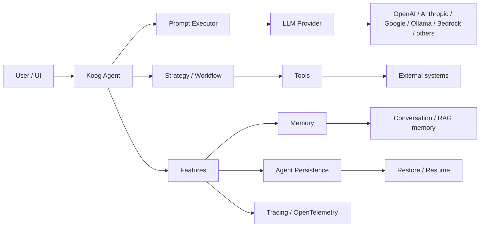

# Koog学习笔记

Last researched: 2026-07-16

Koog 是 JetBrains 的开源 AI Agent 框架，面向 JVM 生态，提供 Kotlin DSL 和 Java API，并支持 Kotlin Multiplatform 场景下的 Android、iOS、JS、WasmJS 部署。

---

## 1. 学习目标

这份笔记要解决四件事：

1. 先搞清楚 Koog 是什么。
2. 再搞清楚它的核心架构和工作方式。
3. 理解常用模块和适用场景。
4. 知道在 Kotlin、Android 项目里怎么落地。

---

## 2. Koog 是什么

Koog 不是单纯的 LLM 封装层，而是一个用于构建 AI agents 的工程化框架。

它的官方定位有几个关键词：

- JVM 生态
- Kotlin DSL
- Java fluent API
- 多平台支持
- 可靠性和可观测性
- 工具、工作流、记忆、持久化

从官方文档看，Koog 的目标是把 agent 作为一个**结构化、类型安全的状态机**来建模，而不是把 prompt 拼接当成整个系统。

---

## 3. 为什么要学 Koog

适合学 Koog 的场景：

- 你要做 Kotlin AI 应用
- 你要把 agent 放进后端、Android、或 KMP 项目
- 你需要工具调用、状态管理、历史压缩、记忆、观测
- 你想让 agent 可恢复、可测试、可扩展
- 你要做多步任务、graph workflow、planner、RAG、MCP、A2A

不太适合的场景：

- 只是做一次性模型调用
- 只想快速拼个 prompt demo
- 业务还没想清楚工具和状态边界

---

## 4. 当前版本与稳定性

Koog 当前稳定主线是 `1.0.0`。

官方版本策略：

- `X.Y.Z` 为语义化版本
- 稳定模块不会在小版本内破坏 API
- `-beta` 模块允许演进
- Koog 1.0 提供稳定核心，并给出 1 年 API 稳定性保证

推荐起步依赖是：

```kotlin
implementation("ai.koog:koog-agents:1.0.0")
```

如果你确实需要实验特性，再加 `koog-agents-additions` 这类 beta 组合包。

---

## 5. 架构总览



Koog 的核心思路是：

1. Prompt Executor 负责把请求送到模型。
2. Strategy 负责定义 agent 如何思考和行动。
3. Tool 负责把外部能力暴露给 agent。
4. Feature 负责给 agent 加能力。
5. Memory 和 Persistence 负责长期行为。
6. Tracing 负责让整个过程可观察。

---

## 6. 核心概念

| 概念 | 作用 |
| --- | --- |
| Agent | 执行任务的主体 |
| Prompt | 驱动 LLM 的输入 |
| Prompt Executor | 管理并执行 prompt |
| Strategy | 定义 agent 工作流 |
| Tool | 让 agent 访问外部系统 |
| Feature | 扩展 agent 行为 |
| Session | 单次执行或对话上下文 |
| Memory | 跨会话记忆 |
| Persistence | 保存和恢复 agent 状态 |
| Tracing | 记录和观测 agent 执行 |

---

## 7. Koog 的 Agent 模型

官方把 agent 描述为一个类型安全的状态机。常见 agent 类型有：

| 类型 | 适用场景 | 特点 |
| --- | --- | --- |
| Basic agent | 简单任务 | 预定义策略，开箱即用 |
| Functional agent | 快速原型 | 用函数写自定义逻辑 |
| Graph-based agent | 复杂工作流 | 最强控制力，适合可视化和状态管理 |
| Planner agent | 多步骤规划 | 迭代计划直到满足目标 |

### 7.1 Basic agent

适合绝大多数常规任务，重点是快。

### 7.2 Functional agent

适合你已经知道流程，但不想一开始就建图。

### 7.3 Graph-based agent

适合明确的流程编排、条件分支、多工具调用、可恢复执行。

### 7.4 Planner agent

适合“先计划再执行”的任务，比如复杂调研、分步操作、循环修正。

---

## 8. Prompt Executor 与模型接入

Koog 通过 prompt executor 连接不同模型提供方。

### 8.1 单提供方 executor

单提供方 executor 只包一个 provider，适合一个模型家族内部切换。

### 8.2 多提供方 executor

多提供方 executor 允许同时挂多个 provider，比如 OpenAI、Anthropic、Google、Ollama。

### 8.3 路由和 fallback

Koog 还支持路由和 fallback：

- 避免单点 provider 限流
- 做 provider failover
- 按任务分发到不同模型

### 8.4 常见 provider

官方列出的 provider 包括：

- OpenAI
- Anthropic
- Google
- DeepSeek
- OpenRouter
- Amazon Bedrock
- Mistral
- Alibaba / DashScope
- Ollama

---

## 9. 一个最小 Agent 示例

下面是一个简化版思路，体现 Koog 的结构：

```kotlin
val agent = AIAgent(
    promptExecutor = MultiLLMPromptExecutor(OpenAILLMClient(System.getenv("OPENAI_API_KEY"))),
    llmModel = OpenAIModels.Chat.GPT4o
)

val result = agent.run("Hello, what can you do?")
println(result)
```

这个例子说明三件事：

1. 先准备 LLM client。
2. 再交给 prompt executor。
3. 最后由 agent 执行。

---

## 10. Tools

Tools 是 Koog 里最关键的扩展点之一。

### 10.1 Annotation-based tools

这是 JVM-only 的方式，适合 Kotlin/Java JVM 项目。

特点：

- 用 `@Tool` 暴露函数或方法
- 用 `@LLMDescription` 写说明
- 适合把现有 JVM 方法快速暴露给模型

### 10.2 Class-based tools

这是更灵活的方式，适合 multiplatform。

特点：

- Kotlin 里可以完整控制参数、元数据、执行逻辑、注册和调用
- 适合需要跨平台的项目

### 10.3 选择建议

| 场景 | 推荐方式 |
| --- | --- |
| JVM 单平台，快速接入 | Annotation-based tools |
| KMP / Android / iOS | Class-based tools |
| 需要复杂元数据和自定义注册 | Class-based tools |

### 10.4 工具设计原则

- 参数要清晰
- 返回值尽量结构化
- 工具名要语义化
- 不要让一个工具做太多事

---

## 11. Strategies 和工作流

Koog 的 workflow 由 strategy 驱动。

### 11.1 Predefined strategies

官方内置了常见策略：

- Chat agent strategy
- ReAct strategy

### 11.2 Chat agent strategy

适合对话式 agent。

它的典型流程是：

1. 接收用户输入
2. 调用 LLM
3. 选择调用工具或直接回复
4. 处理工具结果
5. 继续对话

### 11.3 ReAct strategy

适合需要“推理 + 行动”反复循环的任务。

流程是：

1. 思考下一步
2. 执行动作
3. 观察结果
4. 再思考

### 11.4 Custom strategy graphs

当内置策略不够时，用 graph 自定义工作流。

适合：

- 条件分支
- 并行执行
- 多节点状态流转
- 子图复用

---

## 12. Features

Koog 的 features 是给 agent 加能力的模块化机制。

官方内置 feature 包括：

- Event handling
- Tracing
- Chat memory
- Long-term memory
- Agent persistence
- OpenTelemetry

### 12.1 Event handling

用来监听 agent 运行中的事件，便于调试和插桩。

### 12.2 Tracing

记录更详细的执行信息，适合排障和性能分析。

### 12.3 OpenTelemetry

把 agent 的 traces 导出到观测系统里，和现有可观测性栈对接。

---

## 13. Memory、History Compression、Persistence

这三个概念很容易混。

### 13.1 Chat memory

保存和恢复对话历史，适合多轮聊天。

### 13.2 Long-term memory

用于跨会话的持久记忆，通常和 RAG、向量存储、文档检索配合。

### 13.3 History compression

用于长对话压缩上下文，减少 token 消耗。

常见压缩策略包括：

- WholeHistory TL;DR
- FromLastNMessages
- Chunked

### 13.4 Agent persistence

不是只存聊天记录，而是保存 agent 的 checkpoint。

checkpoint 里通常包括：

- 消息历史
- 已执行节点
- 输出数据
- 已选 LLM
- LLM 参数
- 工具选择
- agent storage

它的用途是：

- 恢复执行
- 回滚到某个状态
- 在会话间持久化 agent 状态

---

## 14. 观测与调试

Koog 强调可观测性，不是跑完才看结果，而是过程中就能看。

你会用到：

- tracing
- OpenTelemetry
- provider-level 日志和指标
- 失败恢复点

这对复杂 workflow、工具调用链、长任务非常重要。

---

## 15. LLM Providers

Koog 不是绑定单一模型供应商，而是 provider-agnostic。

官方支持的主要能力包括：

- 文本
- 图片
- 音频
- 视频
- 文档
- 流式输出
- 工具调用

常见本地/云端选择：

- OpenAI：通用能力强
- Anthropic：长上下文、prompt caching
- Google：多模态和大上下文
- Ollama：本地开发和离线

---

## 16. Android / Kotlin Multiplatform 重点

Koog 很适合 Kotlin Multiplatform。

官方明确支持：

- JVM
- JS
- WasmJS
- Android
- iOS

这意味着你可以把 agent 逻辑写成共享代码，再在 Android 或 iOS 端复用。

### Android 场景价值

- 原生 App 内嵌 agent
- 结合 Compose 做交互式体验
- 接本地模型做离线或低延迟能力
- 统一 Kotlin 代码，减少跨平台重复实现

### Android 1.0 相关变化

Koog 1.0 官方强调了：

- 本地 Android AI
- LiteRT 模型本地运行
- Multiplatform observability
- 更稳定的生产核心

---

## 17. 版本与模块分层

Koog 的模块化很强。

### 17.1 推荐起点

- `koog-agents`

这是聚合稳定模块的起点。

### 17.2 beta 聚合包

- `koog-agents-additions`

包含大部分 beta / experimental 模块。

### 17.3 稳定与 beta

规则大致是：

- 稳定模块：`1.0.0`
- beta 模块：`1.0.0-beta`
- beta 可以用于外部不稳定集成或实验性协议

---

## 18. 典型项目结构

一个比较合理的 Koog 项目通常分层如下：

- `agent/`：Agent 定义
- `tools/`：工具
- `strategy/`：workflow / graph
- `memory/`：记忆与检索
- `persistence/`：checkpoint
- `observability/`：tracing / telemetry
- `app/`：UI、HTTP、CLI

这样做的好处是：

- agent 逻辑不会散落
- 工具可复用
- 容易测试和替换模型

---

## 19. 常见坑

- 把 Koog 当成 prompt 拼接库
- 一个 agent 塞太多工具
- 工具描述太弱，模型不会正确选
- 把长期记忆和 session state 混为一谈
- 不做 history compression，长对话很快爆 token
- 在 Android/KMP 场景误用 JVM-only 的 annotation tools
- 不看 beta/stable 边界，直接依赖实验模块
- 忽略 checkpoint/persistence，长任务失败后无法恢复

---

## 20. 调试思路

### 20.1 工具不触发

先检查：

- tool 名称是否清晰
- description 是否足够语义化
- prompt 是否明确要求工具调用
- strategy 是否允许工具执行

### 20.2 历史越来越长

先考虑：

- history compression
- session 清理
- 把长期知识迁移到 memory / RAG

### 20.3 状态丢失

先检查：

- persistence 是否启用
- 是否保存了 checkpoint
- 是否正确 restore

### 20.4 Android 编译问题

重点检查：

- Kotlin 版本
- KSP / Gradle 兼容性
- 依赖是否选了 JVM-only 特性
- compileSdk / minSdk 是否匹配

---

## 21. 最小学习路径

建议按这个顺序学：

1. Quickstart
2. Agents
3. Tools
4. Predefined strategies
5. Custom strategy graphs
6. Features
7. Chat memory / long-term memory / persistence
8. OpenTelemetry
9. Android / KMP 集成

---

## 22. 一个实战示例

做一个“天气 + 搜索 + 记忆”的 agent，可以拆成：

- 一个 chat agent strategy
- 两个工具：search / weather
- chat memory 保存对话
- history compression 控制 token
- tracing 看每步执行

如果要上 Android：

- UI 用 Compose
- agent 逻辑共享
- 工具层对接本地和网络能力
- 本地模型优先时接 LiteRT

---

## 23. 选型结论

如果你的项目满足以下任意几条，Koog 值得重点考虑：

- Kotlin 是主语言
- 要做 agent，不只是调用模型
- 要支持 Android / KMP
- 要做工具调用、状态恢复、观测
- 要做多模型切换或路由

它最像的是“AI agent 的工程底座”，不是 demo 工具。

---

## References and further reading

### Official

- Koog Overview: https://docs.koog.ai/
- Key features: https://docs.koog.ai/key-features/
- Why Koog: https://docs.koog.ai/why-koog/
- Quickstart: https://docs.koog.ai/quickstart/
- Agents: https://docs.koog.ai/agents/
- Module versioning: https://docs.koog.ai/module-versioning/
- LLM providers: https://docs.koog.ai/llm-providers/
- Prompt executors: https://docs.koog.ai/prompts/prompt-executors/
- Annotation-based tools: https://docs.koog.ai/tools/annotation-based-tools/
- Class-based tools: https://docs.koog.ai/tools/class-based-tools/
- Predefined strategies: https://docs.koog.ai/predefined-agent-strategies/
- Custom strategy graphs: https://docs.koog.ai/custom-strategy-graphs/
- Features: https://docs.koog.ai/features/
- Chat memory: https://docs.koog.ai/features/chat-memory/
- Long-term memory: https://docs.koog.ai/features/long-term-memory/
- Agent persistence: https://docs.koog.ai/features/agent-persistence/
- History compression: https://docs.koog.ai/history-compression/
- Sessions: https://docs.koog.ai/sessions/
- OpenTelemetry: https://docs.koog.ai/features/open-telemetry/
- RAG: https://docs.koog.ai/retrieval-augmented-generation/
- Examples: https://docs.koog.ai/examples/
- Kotlin AI stack blog: https://blog.jetbrains.com/kotlin/2025/09/the-kotlin-ai-stack-build-ai-agents-with-koog-code-smarter-with-junie-and-more/
- Koog 1.0 release blog: https://blog.jetbrains.com/ai/2026/05/koog-1-0-is-out-stable-core-better-interop-and-multiplatform-observability/
- Koog 0.5.0 release blog: https://blog.jetbrains.com/ai/2025/10/koog-0-5-0-is-out-smarter-tools-persistent-agents-and-simplified-strategy-design/
- Koog 0.4.0 release blog: https://blog.jetbrains.com/ai/2025/08/koog-0-4-0-is-out-observable-predictable-and-deployable-anywhere-you-build/
