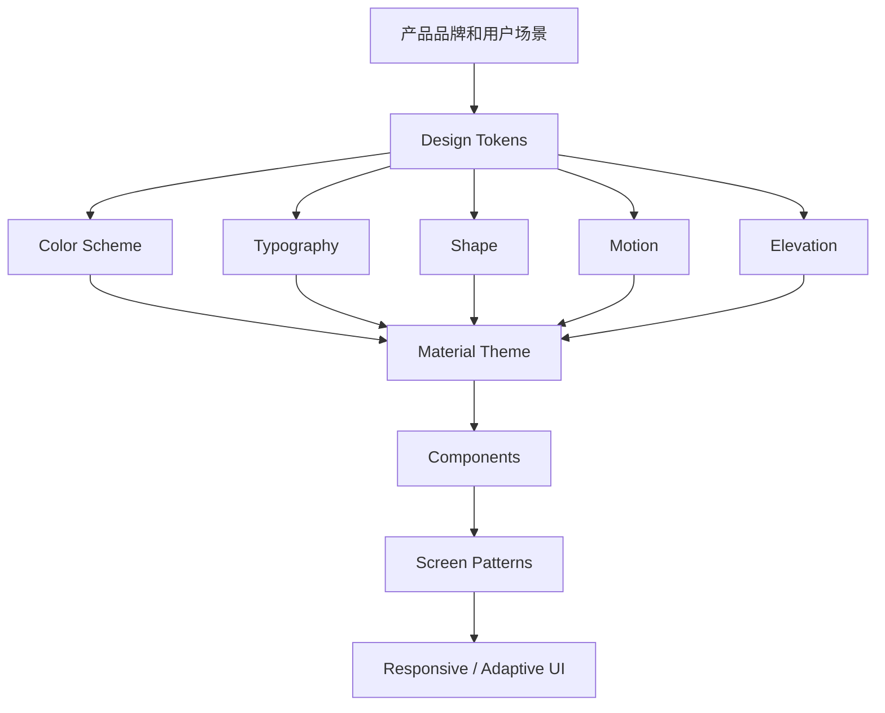
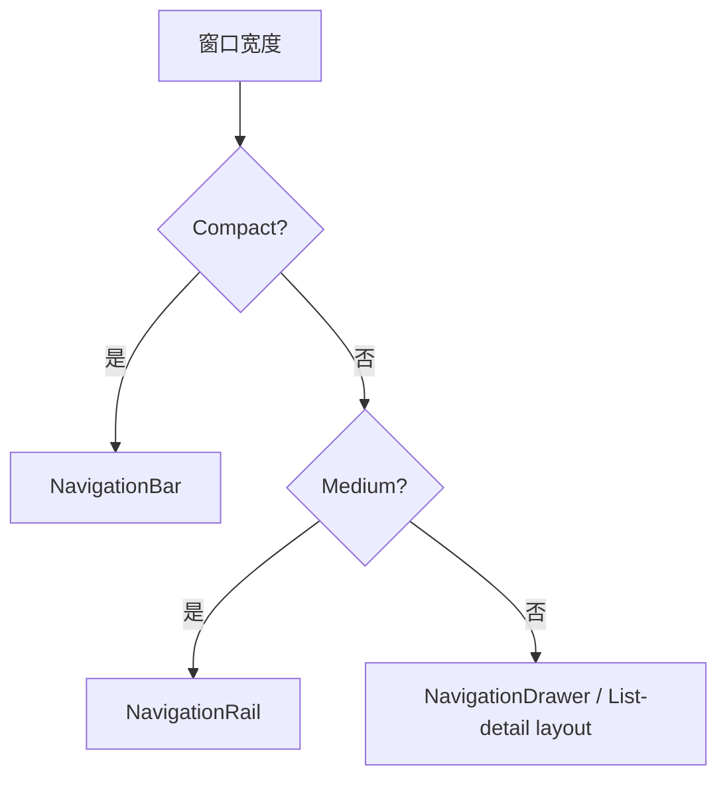

## 

## 1. 介绍

Material 3，也常被称为 Material You，是 Google 的第三代 Material Design 设计体系。Material3将颜色重新定义为更加个性化的体验，助力于构建出色且富有表现力的应用。它不是单个组件库，而是一整套跨平台 UI 设计语言，包含：

- 设计原则：界面层级、交互反馈、可访问性、适应不同屏幕。
- 设计 token：颜色、字体、形状、间距、状态、动效等可复用变量。
- 组件规范：按钮、卡片、导航、文本框、列表、对话框等。
- 平台实现：Android Compose Material3、Material Components for Android、Material Web 等。

## 2. Material 3 的心智模型

M3 的心智模型是把"设计"从"画出固定的样子"变成"定义一套可以自动生成、自动适配、但语义关系始终一致的规则系统"。

"心智模型"(Mental Model)在设计系统语境里,指的不是某个具体功能,而是**使用者(设计师、开发者,甚至最终用户)在脑海中用来理解"这个系统是怎么运作的"那套简化认知框架**。它决定了人们看到一个界面元素时,会本能地预期它该怎么表现、怎么变化。

Material 3 的心智模型可以拆成几层来理解:

**1. "一切颜色都是角色(Role),不是固定值"**

传统做法是设计师直接指定"这个按钮是蓝色 `#1976D2`"。M3 的心智模型是反过来的:你先定义一个**语义角色**(比如 `primary`、`onPrimaryContainer`、`surface`),这个角色的实际颜色值由系统根据种子色动态计算出来。

开发者/设计师需要建立的心智模型是:**"我在给元素分配功能角色,而不是分配颜色"**。这样无论主题怎么变(暗色模式、动态取色、用户换壁纸),你的设计逻辑都不需要重新想一遍——角色的语义关系(比如"容器色要比背景色更突出但比主色浅")是恒定的,变的只是具体数值。

**2. "层级用色调表达,不用阴影表达"**

M2 的心智模型是:**元素越"悬浮"(elevation 越高),阴影越重**——这是一种模拟物理世界光影的直觉。

M3 的心智模型变成:**元素越悬浮,叠加的主色调(surface tint)越明显**。你看到一个卡片颜色比背景稍微"偏色"一点,就该理解为"它在视觉层级上更高"。这对习惯了 M2 的人是需要重新训练直觉的地方。

**3. "个性化是系统默认行为,不是例外"**

M2 的隐含心智模型是:所有 Material 应用应该长得像"同一个产品家族"。

M3 的心智模型反过来是:**每个应用/用户都应该基于同一套底层规则,生成自己独特的外观**。就像一个"生成引擎"而不是一套"固定皮肤"——你不需要问"这个颜色对不对",而要问"这个颜色关系(对比度、层级)对不对"。

**4. "Token 化思维"**

M3 大量使用设计 Token(设计令牌)(如 `color.primary`、`shape.corner.medium`、`typography.titleLarge`)。心智模型是:**设计决策被拆解成可复用、可替换的最小单元**,而不是写死在每个组件里。改一个 Token,全局联动改变。这也是为什么 M3 能同时支持"品牌定制"和"跨平台一致性"——因为一致的是 Token 结构,不是具体数值。



可以把 Material 3 分成三层：

| 层级 | 解决的问题 | 例子 |
| --- | --- | --- |
| Token 层 | 产品视觉语言的基础变量 | `primary`、`bodyLarge`、`cornerMedium` |
| Theme 层 | 把 token 组织成应用主题 | `MaterialTheme(colorScheme, typography, shapes)` |
| Component 层 | 具体 UI 组件如何使用主题 | `Button`、`Card`、`NavigationBar`、`TextField` |

## 3. Material 3 相比 Material 2 的变化

| 维度 | Material 2 | Material 3 |
| --- | --- | --- |
| 设计目标 | 通用 Material 风格 | 更强调个性化、品牌和动态适配 |
| 颜色系统 | primary/secondary 等较少角色 | 更完整的 color roles，强调 surface 和 container |
| 动态颜色 | 非核心能力 | Android 12+ 动态颜色是重要特性 |
| 形状 | 有 shape 体系，但使用较少 | shape token 更常用于组件表达 |
| 组件状态 | 有状态反馈 | 更系统地结合 state layer、tonal elevation |
| 自适应 | 有响应式建议 | 更强调 compact/medium/expanded 窗口级别 |
| Compose 实现 | `androidx.compose.material` | `androidx.compose.material3` |

Material 3 的重点是“角色化”。颜色不是简单地选一个蓝色或绿色，而是给每个 UI 元素分配语义角色，比如 primary action、surface container、error state、outline variant。

## 4. Color Scheme

### 4.1 基本概念

Material 3 使用 color scheme 表达界面颜色。一个 color scheme 不是调色板截图，而是一组有语义的颜色角色。

常见角色：

| 角色 | 用途 |
| --- | --- |
| `primary` | 最重要的品牌色和关键操作 |
| `onPrimary` | 显示在 primary 上的文字或图标 |
| `primaryContainer` | 低强调的 primary 容器背景 |
| `onPrimaryContainer` | 显示在 primaryContainer 上的内容 |
| `secondary` | 次级强调色，辅助表达层级 |
| `tertiary` | 第三强调色，可用于补充品牌或强调 |
| `surface` | 页面、卡片、面板等表面背景 |
| `onSurface` | surface 上的主要文字或图标 |
| `surfaceVariant` | 变化表面，常用于分区或低强调容器 |
| `outline` | 边框、分隔线、输入框轮廓 |
| `error` | 错误状态 |
| `onError` | 错误色上的文字或图标 |

命名规律：

- `onXxx` 表示放在某个背景色上的前景色。
- `XxxContainer` 表示一个强调程度较低、适合大面积容器的颜色。
- `surface` 系列用于承载内容，不应该被 primary 大面积替代。

### 4.2 Dynamic Color

Dynamic Color 是 Material 3 的代表特性之一。Android 12+ 可以从用户壁纸提取颜色，生成应用 color scheme。

Compose 中常见写法：

```kotlin
@Composable
fun AppTheme(
    darkTheme: Boolean = isSystemInDarkTheme(),
    dynamicColor: Boolean = true,
    content: @Composable () -> Unit
) {
    val colorScheme = when {
        dynamicColor && Build.VERSION.SDK_INT >= Build.VERSION_CODES.S -> {
            val context = LocalContext.current
            if (darkTheme) dynamicDarkColorScheme(context) else dynamicLightColorScheme(context)
        }
        darkTheme -> darkColorScheme()
        else -> lightColorScheme()
    }

    MaterialTheme(
        colorScheme = colorScheme,
        typography = AppTypography,
        content = content
    )
}
```

使用建议：

- 系统级 Android 应用、个人工具、内容消费类应用适合 dynamic color。
- 品牌强约束产品可以关闭 dynamic color，使用固定品牌色。
- 不要直接把品牌色硬塞进所有组件；应先生成完整 color scheme，再让组件读取角色色。

### 4.3 常见颜色错误

| 错误 | 问题 | 更好的做法 |
| --- | --- | --- |
| 大面积使用 `primary` 做背景 | 界面过重，层级混乱 | 页面主体使用 `surface`，关键操作用 `primary` |
| 文本颜色手写黑白 | 深色模式和动态色会出问题 | 使用 `onSurface`、`onPrimary` 等角色 |
| 所有卡片同一个灰色 | 层级不清 | 使用 surface container、outline、elevation 区分 |
| 错误状态只改文字 | 用户不容易识别 | 同时使用 `error`、说明文本和语义提示 |

## 5. Typography

Material 3 typography(排版) 是一组文字样式，而不是随手写字号。常见分组：

| 分组 | 样式 | 用途 |
| --- | --- | --- |
| Display | `displayLarge`、`displayMedium`、`displaySmall` | 超大展示标题，慎用 |
| Headline | `headlineLarge`、`headlineMedium`、`headlineSmall` | 页面或区块标题 |
| Title | `titleLarge`、`titleMedium`、`titleSmall` | 卡片、列表、组件标题 |
| Body | `bodyLarge`、`bodyMedium`、`bodySmall` | 正文 |
| Label | `labelLarge`、`labelMedium`、`labelSmall` | 按钮、标签、辅助文字 |

Compose 示例：

```kotlin
val AppTypography = Typography(
    headlineLarge = TextStyle(
        fontWeight = FontWeight.SemiBold,
        fontSize = 32.sp,
        lineHeight = 40.sp
    ),
    bodyLarge = TextStyle(
        fontSize = 16.sp,
        lineHeight = 24.sp
    )
)
```

使用建议：

- 页面标题用 headline，不要在卡片里使用 display。
- 按钮文字通常使用 label。
- 长正文优先保证 line height 和可读性。
- 不要用字号表达所有层级；颜色、间距、容器、图标也能表达层级。

## 6. Shape

Material 3 使用 shape 表达组件性格和层级。常见规模：

| Shape | 常见用途 |
| --- | --- |
| Extra small | 小标签、小输入元素 |
| Small | 小按钮、小卡片 |
| Medium | 普通卡片、菜单 |
| Large | 大卡片、面板、bottom sheet |
| Extra large | 大型容器或强调面板 |

Compose 中可通过 `Shapes` 定义：

```kotlin
val AppShapes = Shapes(
    small = RoundedCornerShape(8.dp),
    medium = RoundedCornerShape(12.dp),
    large = RoundedCornerShape(16.dp)
)
```

设计建议：

- 同一产品中圆角要有规律，不要每个组件随意设置。
- 操作型组件和内容容器可以有不同圆角。
- 企业后台、工具类产品通常不需要过度圆润。
- 游戏、儿童、娱乐类产品可以更大胆。

## 7. Elevation 和 Surface

Material 3 中，elevation 不只是投影。它还和 tonal elevation 相关，用颜色和层级表达表面关系。

常见理解：

| 概念 | 含义 |
| --- | --- |
| Surface | 内容承载面，比如页面、卡片、sheet |
| Shadow elevation | 传统投影高度 |
| Tonal elevation | 通过表面颜色变化表达层级 |
| Container | 组件自己的背景容器 |

使用建议：

- 不要依赖重阴影表达所有层级。
- 卡片、sheet、dialog 可以通过 surface container、outline、间距、tonal elevation 共同表达。
- 深色模式下投影不明显，tonal elevation 更重要。

## 8. Motion 和 State

Material 3 的交互不是“点一下变色”这么简单。组件需要表达状态：

- enabled / disabled
- hovered(悬停)
- focused
- pressed
- dragged
- selected
- error
- loading

常见机制：

| 机制 | 作用 |
| --- | --- |
| State layer | 在组件表面叠加状态反馈 |
| Ripple | 点击反馈 |
| Animated visibility | 内容出现和消失 |
| Container transform | 页面或容器之间的连续转场 |
| Shared axis | 同级页面切换 |

实践原则：

- 动效服务于理解，不要为了动而动。
- 操作反馈要快，尤其是按钮、列表项、导航项。
- 加载、错误、空状态都应有明确 UI。
- 尊重系统减少动效设置。

## 9. Layout 和 Adaptive UI

Material 3 非常强调不同屏幕尺寸下的适配，尤其是手机、折叠屏、平板、桌面。

常见窗口分类：

| 窗口宽度类型 | 常见设备 | 导航建议 |
| --- | --- | --- |
| Compact | 手机竖屏 | Bottom navigation / navigation bar |
| Medium | 大手机横屏、小平板 | Navigation rail |
| Expanded | 平板、桌面、ChromeOS | Navigation drawer / permanent drawer |

导航模式选择：



Compose 中可以结合 `material3-adaptive` 或 Window Size Class 思路实现自适应。

设计建议：

- 不要把手机布局简单拉宽到平板。
- 宽屏应增加信息密度，比如列表-详情、导航 rail、双栏布局。
- 底部导航适合 3-5 个顶级目的地。
- 大屏上 permanent navigation drawer 通常比 bottom navigation 更自然。

## 10. 常用组件学习笔记

Material 3 组件要按“职责”理解，而不是按 API 名称背诵。一个组件通常同时承担四件事：表达信息层级、承载交互、响应状态、读取主题 token。学习组件时要同时看它用什么颜色角色、什么排版样式、什么容器形状、什么状态反馈。

### 10.1 Scaffold：页面骨架

`Scaffold` 是页面级布局组件，用来组织 Material 页面中最常见的结构：顶部栏、底部栏、内容区、浮动操作按钮和 snackbar。它不负责业务内容本身，而是负责给业务内容提供稳定的页面框架。

| 区域 | 常见内容 | 注意点 |
| --- | --- | --- |
| `topBar` | `TopAppBar`、标题、返回、页面操作 | 放页面级信息，不放表单字段 |
| `bottomBar` | `NavigationBar`、底部操作栏 | 避免和 FAB 抢主操作 |
| `floatingActionButton` | 新建、添加、编辑等主操作 | 一个页面通常只有一个最主要 FAB |
| `snackbarHost` | 轻量反馈 | 需要配合 `SnackbarHostState` |
| `content` | 页面主体内容 | 必须处理 `innerPadding` |

Compose 中最容易忽略的是 `innerPadding`。`Scaffold` 会根据 top bar、bottom bar、FAB 等区域计算内边距，内容区如果不用它，列表或表单就可能被遮挡。

```kotlin
Scaffold(
    topBar = {
        TopAppBar(title = { Text("Tasks") })
    },
    floatingActionButton = {
        FloatingActionButton(onClick = onAdd) {
            Icon(Icons.Default.Add, contentDescription = "添加任务")
        }
    }
) { innerPadding ->
    LazyColumn(
        modifier = Modifier.padding(innerPadding)
    ) {
        items(tasks) { task ->
            Text(task.title)
        }
    }
}
```

常见问题：

- 忘记把 `innerPadding` 传给内容区。
- 把所有页面都塞进一个巨大 `Column`，导致 top bar、snackbar、FAB 之间没有统一管理。
- FAB 承载多个并列操作，削弱页面主操作。
- 页面级 loading、empty、error 没有统一放在内容区处理。

### 10.2 TopAppBar：页面标题与操作入口

`TopAppBar` 表达当前页面的身份和页面级操作。它不是普通标题栏，而是导航层级、标题和操作区的组合。

常见变体：

| 组件 | 适用场景 |
| --- | --- |
| `TopAppBar` | 普通页面标题栏 |
| `CenterAlignedTopAppBar` | 标题需要居中、结构较简单的页面 |
| `MediumTopAppBar` | 需要更强标题层级的页面 |
| `LargeTopAppBar` | 内容型页面或需要大标题的页面 |

结构理解：

- `navigationIcon` 通常放返回、关闭、打开 drawer 等导航动作。
- `title` 放当前页面标题，不应该塞过长说明。
- `actions` 放页面级高频操作，例如搜索、分享、删除。
- 低频操作适合放入 overflow menu，而不是全部展开成图标。

顶级页面通常不放返回按钮；详情页、编辑页、二级页面通常需要返回按钮。这个规则不是视觉偏好，而是在表达页面层级。

```kotlin
TopAppBar(
    title = { Text("任务详情") },
    navigationIcon = {
        IconButton(onClick = onBack) {
            Icon(
                Icons.AutoMirrored.Filled.ArrowBack,
                contentDescription = "返回上一页"
            )
        }
    },
    actions = {
        IconButton(onClick = onDelete) {
            Icon(Icons.Default.Delete, contentDescription = "删除任务")
        }
    }
)
```

### 10.3 Text 与 Icon：基础信息表达

`Text` 是文字信息的最终承载者。Material 3 中不要只从字号理解文本，而要从 typography role 理解文本。标题、正文、标签、按钮文字都应使用不同的排版角色。

常用 typography：

| 样式 | 适用内容 |
| --- | --- |
| `headlineLarge` / `headlineMedium` | 页面或大区块标题 |
| `titleLarge` / `titleMedium` | 卡片、列表、组件标题 |
| `bodyLarge` / `bodyMedium` | 正文和说明 |
| `labelLarge` / `labelMedium` | 按钮、标签、辅助操作 |

`Icon` 需要区分“装饰图标”和“操作图标”：

- 装饰图标：`contentDescription = null`。
- 操作图标：`contentDescription` 应描述用户动作，而不是机械写图标名称。

错误示例是把删除按钮描述成 `"Delete icon"`；更好的描述是 `"删除任务"`。屏幕阅读器用户关心的是动作结果，不是图标长什么样。

### 10.4 Button：操作强度


Material 3 的按钮不是只换外观，而是在表达操作优先级。按钮选型应先问“这个操作在当前区域有多重要”。

| 组件 | 强调程度 | 典型用途 |
| --- | --- | --- |
| `Button` | 最高 | 页面或表单主操作 |
| `FilledTonalButton` | 中高 | 次级但仍重要的操作 |
| `OutlinedButton` | 中低 | 辅助操作、取消类操作 |
| `TextButton` | 最低 | 对话框操作、轻量入口，最低强调操作 |
| `ElevatedButton` | 中高 | 需要从背景中浮起的操作 |

原则：

- 一个区域内通常只有一个最主要按钮。
- 删除、重置等危险操作不要只靠颜色区分，最好配合文案和确认。
- 按钮文字要表达动作，例如“保存”“创建项目”，不要写“确定”“提交”“下一步”泛化一切的抽象结果。

按钮状态：

- `enabled = false` 表示当前不可操作。
- loading 状态应阻止重复点击。
- 危险操作不应只靠红色表达，还应结合文案、确认和上下文。

```kotlin
Button(
    onClick = onSave,
    enabled = !isSaving
) {
    if (isSaving) {
        CircularProgressIndicator(
            modifier = Modifier.size(16.dp),
            strokeWidth = 2.dp
        )
    } else {
        Text("保存")
    }
}
```

### 10.5 Card：内容容器

`Card` 表达一个相对独立的内容单元。它适合承载文章摘要、任务项、商品、设置分组、详情片段，但不适合把页面每个区域都包起来。

常见变体：

| 组件 | 视觉含义 |
| --- | --- |
| `Card` | 普通内容容器 |
| `ElevatedCard` | 需要从背景中浮起的内容 |
| `OutlinedCard` | 轻量分组、可点击边界 |

Card 的关键不是“圆角”，而是容器关系。一个页面里如果所有内容都被卡片包裹，用户反而难以判断哪些内容是主要信息，哪些只是辅助信息。

使用原则：

- 卡片不是万能容器，不要把页面所有区域都卡片化。   
- 卡片内部标题通常用 `titleMedium` 或 `titleLarge`，不要随便用 display 级别文字，不应该使用过大的 headline。
- 可点击卡片要给整个卡片清晰点击区域，要有明确反馈和语义。
- 卡片之间用间距表达分组，不要依赖重阴影。
- 卡片背景应来自 `surface` / `surfaceContainer` 体系，而不是随手写灰色。

### 10.6 ListItem：稳定列表结构

`ListItem` 是列表信息的标准结构，常用于任务列表、设置项、联系人、消息、搜索结果。它提供了稳定的信息槽位。

| 槽位 | 内容 |
| --- | --- |
| `headlineContent` | 主标题 |
| `supportingContent` | 副标题、说明、摘要 |
| `leadingContent` | 头像、图标、缩略图 |
| `trailingContent` | 状态、开关、更多操作 |

`ListItem` 的优势是信息密度稳定，适合大量重复内容。不是所有列表项都需要卡片；普通列表用 `ListItem + Divider` 往往更清晰。

常见问题：

- trailing 区域塞多个按钮，导致点击目标太小。
- supporting 文本过长，列表高度不稳定。
- 选中态只靠颜色表达，没有图标、文字或语义辅助。
- 列表项点击区域过小，只能点文字。

### 10.7 TextField：输入与校验

`TextField` 不是单纯的输入框，它同时包含字段名称、输入内容、提示、错误、辅助说明和交互状态。

核心概念：

| 部分 | 含义 |
| --- | --- |
| `value` | 当前输入值 |
| `onValueChange` | 输入变化回调 |
| `label` | 字段名称 |
| `placeholder` | 空值时的输入提示 |
| `supportingText` | 辅助说明或错误说明 |
| `isError` | 错误状态 |
| `singleLine` | 是否单行 |

`label` 和 `placeholder` 不是一回事。`label` 告诉用户字段是什么；`placeholder` 只是输入示例或临时提示。如果只用 placeholder，当用户开始输入后，字段含义可能消失。

常用状态：`normal`   `focused` `error` `disabled` `read-only`

```kotlin
OutlinedTextField(
    value = email,
    onValueChange = onEmailChange,
    label = { Text("邮箱") },
    placeholder = { Text("name@example.com") },
    isError = emailError != null,
    supportingText = {
        if (emailError != null) {
            Text(emailError)
        }
    },
    singleLine = true
)
```

原则：

- 错误状态要有文字说明,不要只用 snackbar 或 toast 报错,，否则用户需要自己猜哪一项错了。
- label、placeholder、supportingText 不是一回事。
- 表单要考虑键盘、焦点顺序和提交动作。

### 10.8 NavigationBar、NavigationRail、NavigationDrawer：全局导航

导航组件表达信息架构。选哪个组件，取决于顶级目的地数量、屏幕宽度和层级复杂度。

| 组件 | 适用场景 |
| --- | --- |
| `NavigationBar` | 手机底部导航，3-5 个顶级目的地 |
| `NavigationRail` | 中等宽度屏幕，横屏或小平板 |
| `NavigationDrawer` | 大屏、复杂层级、需要显示更多目的地 |
| `ModalNavigationDrawer` | 临时打开的抽屉导航 |
| `TabRow` | 页面内部同级内容切换 |

全局导航只放顶级目的地，比如首页、搜索、收藏、设置。返回、筛选、排序、详情页操作不属于全局导航。

导航项通常包含：

- 图标。
- 文案。
- selected 状态。
- 目标 route 或 destination。

原则：

- 导航组件表达的是信息架构，不是装饰。
- 顶级目的地不应频繁变化。
- 当前选中项必须清晰可见，用户应该能从导航状态判断“我现在在哪个主区域”。

### 10.9 Dialog、BottomSheet、Snackbar：临时反馈与决策

这三类组件都属于临时 UI，但职责不同。

| 组件 | 职责 | 例子 |
| --- | --- | --- |
| `Snackbar` | 非阻断轻量反馈 | 已保存、已撤销、网络已恢复 |
| `AlertDialog` | 阻断式决策 | 确认删除、放弃编辑 |
| `ModalBottomSheet` | 临时补充流程 | 筛选、排序、选择账户 |
| `DropdownMenu` | 小范围选项 | 更多操作、排序方式 |

`Snackbar` 不应该承载复杂决策；`Dialog` 不应该用于所有提示；`BottomSheet` 不应该变成另一个完整页面。

删除、重置、退出编辑这类危险操作通常需要确认。确认文案要具体，例如“删除任务”比“确定”更清楚。

### 10.10 ProgressIndicator 与状态页面

真实页面必须处理非理想状态。Material 3 组件不仅用于展示正常内容，也要表达加载、空数据、错误、离线、禁用、提交中等状态。

| 状态 | UI 表达 |
| --- | --- |
| loading | `CircularProgressIndicator` 或骨架屏 |
| determinate progress | `LinearProgressIndicator(progress = ...)` |
| empty | 空状态文案、图标、主操作 |
| error | 错误说明、重试按钮 |
| disabled | 禁用控件、说明原因 |
| submitting | 按钮禁用、显示进度 |

加载状态不要只显示空白页面。错误状态不要只写日志。用户需要知道发生了什么、能不能重试、下一步该做什么。

### 10.11 Selection controls：选择与设置

选择类控件要根据数据关系选型。

| 组件 | 适用关系 |
| --- | --- |
| `Checkbox` | 多选、确认项 |
| `RadioButton` | 单选且选项较少 |
| `Switch` | 立即生效的二元设置 |
| `Slider` | 连续范围值 |
| `DatePicker` | 日期选择 |
| `TimePicker` | 时间选择 |

`Switch` 适合“打开/关闭通知”这种立即生效的设置，不适合“删除账号”这种需要确认的危险操作。`Slider` 适合音量、亮度、字号这类连续值，不适合需要精确输入的金额或数量。

设置项文案要表达结果，而不是只写技术名。例如“自动同步”比“sync_enabled”更适合界面。

### 10.12 Adaptive components：自适应组件

自适应不是把组件拉宽，而是根据窗口宽度改变导航、内容密度和信息结构。Material 3 通常把窗口分为 compact、medium、expanded。

| 宽度类型 | 常见布局 |
| --- | --- |
| compact | 单列内容、底部导航 |
| medium | `NavigationRail`、单列或局部双栏 |
| expanded | permanent drawer、list-detail、supporting pane |

典型变化：

- 手机上列表和详情分成两个页面。
- 平板上可以左侧列表、右侧详情同时显示。
- 大屏上导航从 bottom bar 变成 rail 或 drawer。
- 内容宽度要有限制，不能无限拉伸正文。

自适应组件要和业务信息结构一起设计。如果只改导航，不改内容组织，大屏仍然会显得空和散。

### 10.13 常用组件选型速查

| 需求 | 优先考虑 |
| --- | --- |
| 页面基础结构 | `Scaffold` |
| 页面标题和操作 | `TopAppBar` |
| 主要操作 | `Button` 或 `FloatingActionButton` |
| 次要操作 | `FilledTonalButton`、`OutlinedButton`、`TextButton` |
| 重复列表内容 | `ListItem` |
| 独立内容块 | `Card`、`OutlinedCard` |
| 文本输入 | `OutlinedTextField` |
| 顶级导航 | `NavigationBar`、`NavigationRail`、`NavigationDrawer` |
| 页面内同级切换 | `TabRow` |
| 轻量反馈 | `Snackbar` |
| 需要确认的危险操作 | `AlertDialog` |
| 筛选、排序、临时选择 | `ModalBottomSheet` |
| 加载和进度 | `CircularProgressIndicator`、`LinearProgressIndicator` |
| 多选 | `Checkbox` |
| 单选 | `RadioButton` |
| 即时开关 | `Switch` |
| 连续数值 | `Slider` |

选择组件时要回到三个问题：

1. 这个组件表达什么信息层级？
2. 它在当前页面里是不是最合适的交互形式？
3. 它的 loading、disabled、error、selected 等状态是否完整？

## 11. Compose Material3 基础落地

### 11.1 依赖

Gradle 示例：

```kotlin
dependencies {
    implementation("androidx.compose.material3:material3:1.4.0")
}
```

如果使用 Compose BOM，版本通常由 BOM 统一管理：

```kotlin
dependencies {
    implementation(platform("androidx.compose:compose-bom:<version>"))
    implementation("androidx.compose.material3:material3")
}
```

### 11.2 最小页面骨架

```kotlin
@OptIn(ExperimentalMaterial3Api::class)
@Composable
fun HomeScreen() {
    Scaffold(
        topBar = {
            TopAppBar(title = { Text("Material 3 Notes") })
        },
        floatingActionButton = {
            FloatingActionButton(onClick = { /* TODO */ }) {
                Icon(Icons.Default.Add, contentDescription = "Add")
            }
        }
    ) { innerPadding ->
        LazyColumn(
            modifier = Modifier
                .padding(innerPadding)
                .fillMaxSize(),
            contentPadding = PaddingValues(16.dp),
            verticalArrangement = Arrangement.spacedBy(12.dp)
        ) {
            items(sampleItems) { item ->
                ElevatedCard(onClick = { /* open */ }) {
                    ListItem(
                        headlineContent = { Text(item.title) },
                        supportingContent = { Text(item.subtitle) }
                    )
                }
            }
        }
    }
}
```

要点：

- `Scaffold` 负责处理系统化页面结构。
- 内容区要使用 `innerPadding`，避免被 top bar、bottom bar、FAB 遮挡。
- 尽量让组件读取 `MaterialTheme`，不要到处硬编码颜色。

### 11.3 Theme 结构

```kotlin
@Composable
fun MyAppTheme(
    darkTheme: Boolean = isSystemInDarkTheme(),
    content: @Composable () -> Unit
) {
    val colorScheme = if (darkTheme) {
        darkColorScheme()
    } else {
        lightColorScheme()
    }

    MaterialTheme(
        colorScheme = colorScheme,
        typography = AppTypography,
        shapes = AppShapes,
        content = content
    )
}
```

组织建议：

```text
ui/theme/
  Color.kt
  Type.kt
  Shape.kt
  Theme.kt
```


## 12. Accessibility

Material 3 的可访问性不是附加项。设计和实现时应默认考虑：

- 颜色对比度足够。
- 点击区域足够大。
- 文字支持系统字体缩放。
- 图标按钮有 `contentDescription`。
- 状态不能只靠颜色表达。
- 表单错误有文字说明。
- 动效不过度，尊重减少动效设置。
- TalkBack 顺序符合视觉和业务顺序。

Compose 常见点：

```kotlin
IconButton(onClick = onBack) {
    Icon(
        imageVector = Icons.AutoMirrored.Filled.ArrowBack,
        contentDescription = "返回"
    )
}
```

如果图标只是装饰，可以设置 `contentDescription = null`；如果图标是操作入口，必须提供可理解的描述。

## 13. Material 官方主题生成器

Material Theme Builder 是官方主题生成工具，可从核心颜色生成 Material 3 color scheme，并导出设计或代码资源。

典型用途：

- 设计阶段快速探索品牌色。
- 生成 light/dark color scheme。
- 验证颜色角色，而不是手工拍脑袋配色。
- 交付设计 token 给工程实现。

建议流程：

1. 选一个品牌核心色。
2. 用 Theme Builder 生成 light/dark scheme。
3. 检查 primary、secondary、tertiary、surface、error 是否符合产品气质。
4. 在真实页面中验证，而不是只看色板。
5. 导出到设计和代码体系。

## 14. Web 和 Android Views 中的 Material 3

Material 3 不只存在于 Compose：

| 平台 | 实现 |
| --- | --- |
| Android Compose | `androidx.compose.material3` |
| Android Views | Material Components for Android |
| Web | Material Web |
| Flutter | Flutter Material library 中的 Material 3 支持 |

注意：

- 不同平台的组件命名、成熟度和 API 不完全一致。
- 设计规范可以统一，但代码实现要看各平台文档。
- Compose Material3 和老的 Compose Material2 不是同一个包。
- Android Views 项目迁移时要关注主题、组件父类、颜色属性和 XML style。

## 18. 学习路线

建议按下面顺序学习：

1. Material 3 概念：color roles、typography、shape、surface。
2. Compose Material3 theme：`MaterialTheme`、`colorScheme`、`typography`、`shapes`。
3. 基础组件：Button、Card、TextField、ListItem、TopAppBar。
4. 页面骨架：Scaffold、Snackbar、FAB。
5. 导航：NavigationBar、NavigationRail、NavigationDrawer。
6. 状态：loading、empty、error、disabled、selected。
7. 自适应：Window Size Class、list-detail、supporting pane。
8. 可访问性：语义、触控区域、对比度、字体缩放。
9. 迁移与工程化：Design Token、Theme Builder、组件封装。


## 23. 深化补充：从“会用组件”到“会做设计系统”

Material 3 的学习重点不应该停在 `Button`、`Card`、`Scaffold` 的 API。真正落地时，需要把视觉规范、组件封装、状态设计和响应式布局串成一套可维护的设计系统。

### 23.1 建议的工程分层

```text
Design tokens
  -> AppTheme
    -> 基础组件封装
      -> 页面级模式
        -> 业务页面
```

| 层级 | 主要内容 | 不建议做什么 |
| --- | --- | --- |
| Design tokens | 颜色、字体、圆角、间距、动效、阴影策略 | 在业务页面里散落硬编码颜色 |
| AppTheme | `MaterialTheme`、动态颜色、深色模式、品牌色兜底 | 每个页面单独创建主题 |
| 基础组件封装 | 主按钮、危险按钮、表单项、空状态、错误状态 | 直接到处复制同一套 `Button` 参数 |
| 页面级模式 | list-detail、settings、form、dashboard、wizard | 每个页面重新发明导航和状态布局 |
| 业务页面 | 组合已有模式表达业务 | 把业务规则塞进通用 UI 组件 |

### 23.2 Compose Material3 落地检查

- `colorScheme` 要覆盖浅色和深色，不要只调浅色模式。
- Android 12+ 动态颜色要有开关策略：品牌强的应用可以默认关闭或只在个人化场景开启。
- `Typography` 不要只改 `fontFamily`，还要检查字重、行高和中文显示效果。
- `contentDescription` 不应机械填写图标名称，而要描述用户动作，例如“删除任务”“返回上一页”。
- 表单错误要同时提供颜色、错误文字和语义信息，不能只把边框变红。
- `Scaffold` 负责页面骨架，不要把所有页面区域都做成卡片。
- 大屏适配优先考虑导航形态变化和内容分栏，而不是简单拉伸手机布局。

### 23.3 常见页面模式

| 页面类型 | 推荐结构 | 关键注意点 |
| --- | --- | --- |
| 列表页 | `Scaffold` + `LazyColumn` + 搜索/筛选 + 空状态 | 列表项高度、分隔、点击区域要稳定 |
| 详情页 | 顶部栏 + 内容区 + 底部主操作 | 主操作不要淹没在多个同级按钮中 |
| 表单页 | 分组字段 + 校验提示 + 提交状态 | 错误信息要靠近字段 |
| 设置页 | 分组列表 + switch/slider/menu | 设置项文案要表达结果，不要只写技术名 |
| 主从页 | 列表 + 详情双栏 | 中屏/大屏使用 `NavigationRail` 或分栏 |

### 23.4 调试 UI 的实用方法

1. 先关掉动态颜色，看品牌基础主题是否成立。
2. 切换深色模式，检查 `onSurface`、`outline`、`surfaceContainer` 是否可读。
3. 把系统字体调大，检查按钮、列表项、输入框是否溢出。
4. 用 TalkBack 或语义树检查图标按钮和表单错误。
5. 在 compact、medium、expanded 三类窗口宽度下截图对比。
6. 检查加载、空数据、错误、离线、禁用、提交中等非理想状态。

## 25. 参考资料
- [Material Design 3 官方站](https://m3.material.io/)
- [Material 3 Foundations](https://m3.material.io/foundations)
- [Material 3 Components](https://m3.material.io/components)
- [Material Design 3 Color system](https://m3.material.io/styles/color/system/overview)
- [Material Design 3 Adaptive layout](https://m3.material.io/foundations/layout/applying-layout/window-size-classes)
- [Android Developers - Material Design 3 in Compose](https://developer.android.com/develop/ui/compose/designsystems/material3)
- [Compose Material3 release notes](https://developer.android.com/jetpack/androidx/releases/compose-material3)
- [Material Theme Builder](https://material-foundation.github.io/material-theme-builder/)
- [Android Developers](https://developer.android.com/)
- [Docker Docs](https://docs.docker.com/)
- [CMake Documentation](https://cmake.org/documentation/)
- [Gradle User Manual](https://docs.gradle.org/current/userguide/userguide.html)
- [Apache Maven Guides](https://maven.apache.org/guides/)
- [MDN Web Docs](https://developer.mozilla.org/)
- [Redis Documentation](https://redis.io/docs/latest/)
- [uv Documentation](https://docs.astral.sh/uv/)
- [Qt Documentation](https://doc.qt.io/)
- [Microsoft Learn](https://learn.microsoft.com/)
- [Microsoft Learn PowerShell](https://learn.microsoft.com/powershell/)
- [Microsoft Windows Commands](https://learn.microsoft.com/windows-server/administration/windows-commands/windows-commands)
- [GNU Bash Manual](https://www.gnu.org/software/bash/manual/)
- [PostgreSQL Documentation](https://www.postgresql.org/docs/)
- [GitHub Actions documentation](https://docs.github.com/actions)
- [GitLab CI/CD documentation](https://docs.gitlab.com/ci/)
- [NIST RBAC Library](https://csrc.nist.gov/projects/role-based-access-control/rbac-library)
- [Material Web](https://github.com/material-components/material-web)
- [Material Components for Android](https://github.com/material-components/material-components-android)
- [MIT 6.006 Introduction to Algorithms](https://ocw.mit.edu/courses/6-006-introduction-to-algorithms-spring-2020/)

