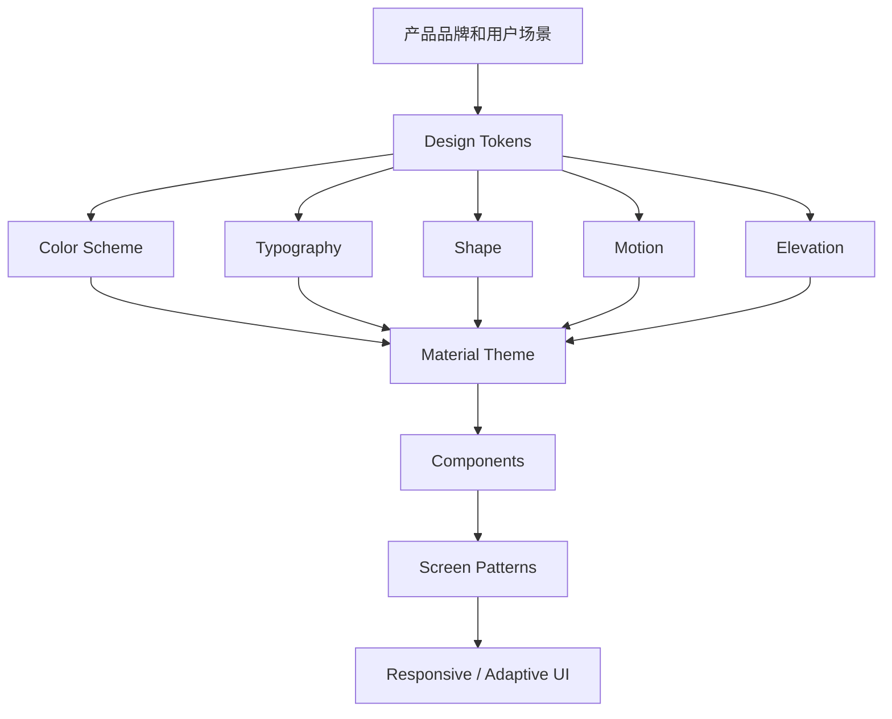
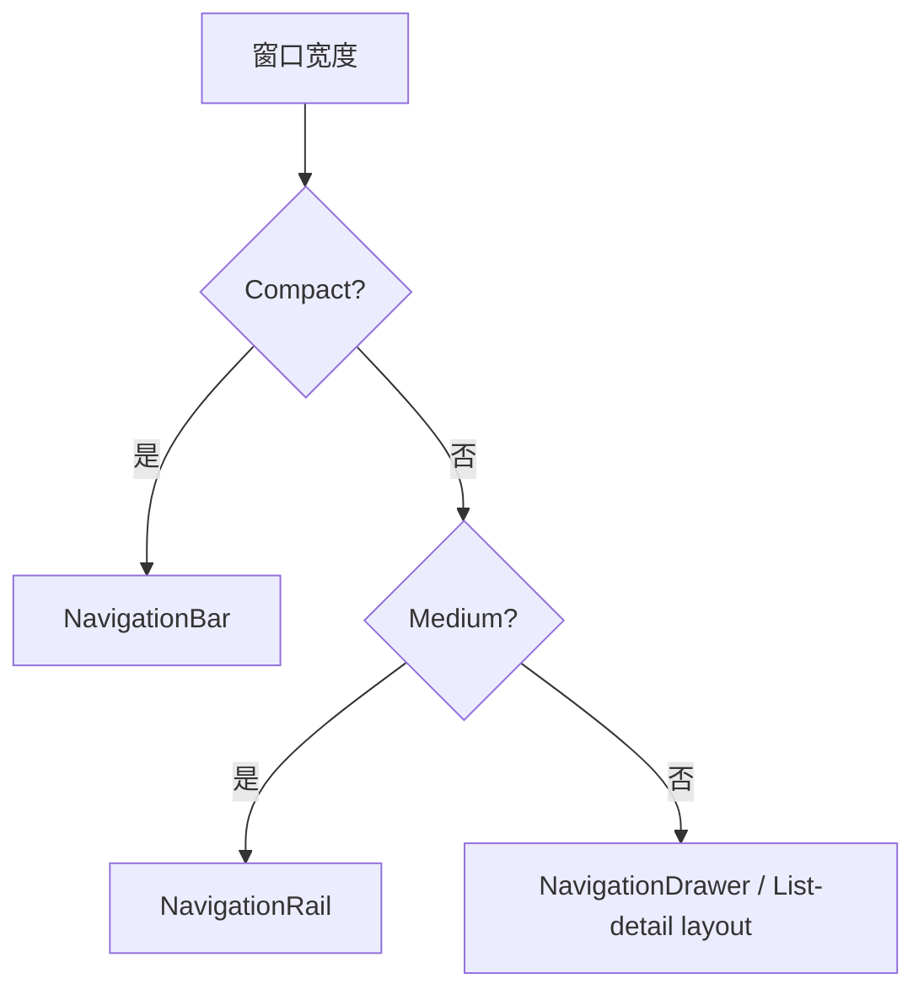
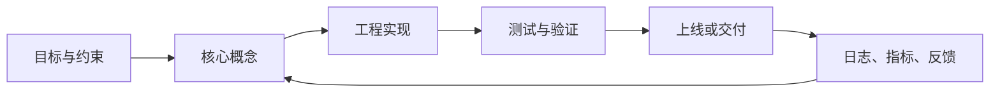

<!-- lecture-notes:integrated-v2 -->

## 讲义导读：把概念落到可验证实践

这一章讲的是 **Material3学习笔记**，属于 **Android 与 Material 设计**。阅读时不要把它当成零散资料堆叠，而要把它当成一份讲义：先弄清它解决什么问题，再看核心概念和流程，最后做一个能复现、能观察、能排错的小练习。

### 一句话先懂

Android 和 Material 学习的重点，是把界面、状态、生命周期、架构、主题和交互规范组织成可维护的应用体验。

初学时先问三个问题：它的输入或前提是什么；它内部按什么规则工作；结果该用什么命令、日志、测试、图纸、波形或指标来证明。

### 通俗类比

Android 应用像一座有前台、后台和调度规则的店：界面接待用户，状态记录当前业务，生命周期决定什么时候开门、暂停和恢复。

类比只是入门扶手。真正掌握时，要回到准确术语、配置、接口、版本、边界条件、错误信息和验证证据上。能解释失败原因，比只会照着步骤跑通更重要。

### 本章学习主线

1. **先看场景**：这个知识点通常在什么项目、岗位或问题里出现？
2. **再看结构**：它有哪些核心对象、配置、文件、命令、接口或流程？
3. **然后看路径**：一次完整使用从哪里开始，到哪里结束，中间有哪些状态变化？
4. **接着看边界**：版本差异、平台差异、权限、性能、安全、兼容性和资源限制在哪里？
5. **最后看验证**：用最小样例、测试、日志、调试工具或实物结果证明理解是对的。

### 本章重点抓手

组件、生命周期、状态管理、架构分层、Compose/Material 3、导航、权限、性能、测试和无障碍。

### 最小实践任务

做一个最小 Android 页面：有列表、详情、状态保存、主题色、错误态、加载态和一次配置变化测试。

建议把练习记录成固定格式：目标、环境版本、最小示例、执行步骤、预期结果、实际结果、错误信息、定位过程和复盘。以后遇到真实项目问题时，这些记录会比单纯收藏教程更有用。

### 常见误区

- 只会堆页面，不处理生命周期和状态。
- UI 好看但不符合交互与无障碍。
- 架构分层写在文档里，代码里仍互相乱调。

### 推荐工具与资料

官方文档、最小 demo、日志、调试器、版本管理、测试命令、性能/诊断工具和复盘记录。

### 读完本章应该能做到

- 用自己的话解释核心概念和适用场景。
- 给出一个最小可运行或可验证样例。
- 说清至少一个常见错误的现象、原因和排查路径。
- 知道当前版本应该查哪份官方文档，而不是只依赖旧教程。

> 本节是讲义化改写后的阅读入口。后续正文中的命令、配置、图纸、代码和参考资料，都应围绕“场景 -> 概念 -> 操作 -> 验证 -> 复盘”来理解。

## 1. 介绍

Material 3，也常被称为 Material You，是 Google 的第三代 Material Design 设计体系。它不是单个组件库，而是一整套跨平台 UI 设计语言，包含：

- 设计原则：界面层级、交互反馈、可访问性、适应不同屏幕。
- 设计 token：颜色、字体、形状、间距、状态、动效等可复用变量。
- 组件规范：按钮、卡片、导航、文本框、列表、对话框等。
- 平台实现：Android Compose Material3、Material Components for Android、Material Web 等。

## 2. 学习目标

学完这份笔记后，你应该能：

- 解释 Material 3 和 Material 2 的核心区别。
- 理解 color scheme、typography、shape、elevation、motion 等基础概念。
- 知道 primary、secondary、tertiary、surface、error 等颜色角色的用途。
- 在 Jetpack Compose 中搭建 Material3 theme。
- 根据窗口尺寸选择 navigation bar、navigation rail、navigation drawer 等导航模式。
- 用 Material 3 组件构建一致、可访问、可维护的界面。
- 判断一个界面“像不像 Material 3”，并知道如何修改。

## 3. Material 3 的心智模型



可以把 Material 3 分成三层：

| 层级 | 解决的问题 | 例子 |
| --- | --- | --- |
| Token 层 | 产品视觉语言的基础变量 | `primary`、`bodyLarge`、`cornerMedium` |
| Theme 层 | 把 token 组织成应用主题 | `MaterialTheme(colorScheme, typography, shapes)` |
| Component 层 | 具体 UI 组件如何使用主题 | `Button`、`Card`、`NavigationBar`、`TextField` |

## 4. Material 3 相比 Material 2 的变化

| 维度 | Material 2 | Material 3 |
| --- | --- | --- |
| 设计目标 | 通用 Material 风格 | 更强调个性化、品牌和动态适配 |
| 颜色系统 | primary/secondary 等较少角色 | 更完整的 color roles，强调 surface 和 container |
| 动态颜色 | 非核心能力 | Android 12+ 动态颜色是重要特性 |
| 形状 | 有 shape 体系，但使用较少 | shape token 更常用于组件表达 |
| 组件状态 | 有状态反馈 | 更系统地结合 state layer、tonal elevation |
| 自适应 | 有响应式建议 | 更强调 compact/medium/expanded 窗口级别 |
| Compose 实现 | `androidx.compose.material` | `androidx.compose.material3` |

Material 3 的重点是“角色化”。颜色不是简单地选一个蓝色或绿色，而是给每个 UI 元素分配语义角色，比如 primary action、surface container、error state、outline variant。

## 5. Color Scheme

### 5.1 基本概念

Material 3 使用 color scheme 表达界面颜色。一个 color scheme 不是调色板截图，而是一组有语义的颜色角色。

常见角色：

| 角色 | 用途 |
| --- | --- |
| `primary` | 最重要的品牌色和关键操作 |
| `onPrimary` | 显示在 primary 上的文字或图标 |
| `primaryContainer` | 低强调的 primary 容器背景 |
| `onPrimaryContainer` | 显示在 primaryContainer 上的内容 |
| `secondary` | 次级强调色，辅助表达层级 |
| `tertiary` | 第三强调色，可用于补充品牌或强调 |
| `surface` | 页面、卡片、面板等表面背景 |
| `onSurface` | surface 上的主要文字或图标 |
| `surfaceVariant` | 变化表面，常用于分区或低强调容器 |
| `outline` | 边框、分隔线、输入框轮廓 |
| `error` | 错误状态 |
| `onError` | 错误色上的文字或图标 |

命名规律：

- `onXxx` 表示放在某个背景色上的前景色。
- `XxxContainer` 表示一个强调程度较低、适合大面积容器的颜色。
- `surface` 系列用于承载内容，不应该被 primary 大面积替代。

### 5.2 Dynamic Color

Dynamic Color 是 Material 3 的代表特性之一。Android 12+ 可以从用户壁纸提取颜色，生成应用 color scheme。

Compose 中常见写法：

```kotlin
@Composable
fun AppTheme(
    darkTheme: Boolean = isSystemInDarkTheme(),
    dynamicColor: Boolean = true,
    content: @Composable () -> Unit
) {
    val colorScheme = when {
        dynamicColor && Build.VERSION.SDK_INT >= Build.VERSION_CODES.S -> {
            val context = LocalContext.current
            if (darkTheme) dynamicDarkColorScheme(context) else dynamicLightColorScheme(context)
        }
        darkTheme -> darkColorScheme()
        else -> lightColorScheme()
    }

    MaterialTheme(
        colorScheme = colorScheme,
        typography = AppTypography,
        content = content
    )
}
```

使用建议：

- 系统级 Android 应用、个人工具、内容消费类应用适合 dynamic color。
- 品牌强约束产品可以关闭 dynamic color，使用固定品牌色。
- 不要直接把品牌色硬塞进所有组件；应先生成完整 color scheme，再让组件读取角色色。

### 5.3 常见颜色错误

| 错误 | 问题 | 更好的做法 |
| --- | --- | --- |
| 大面积使用 `primary` 做背景 | 界面过重，层级混乱 | 页面主体使用 `surface`，关键操作用 `primary` |
| 文本颜色手写黑白 | 深色模式和动态色会出问题 | 使用 `onSurface`、`onPrimary` 等角色 |
| 所有卡片同一个灰色 | 层级不清 | 使用 surface container、outline、elevation 区分 |
| 错误状态只改文字 | 用户不容易识别 | 同时使用 `error`、说明文本和语义提示 |

## 6. Typography

Material 3 typography 是一组文字样式，而不是随手写字号。常见分组：

| 分组 | 样式 | 用途 |
| --- | --- | --- |
| Display | `displayLarge`、`displayMedium`、`displaySmall` | 超大展示标题，慎用 |
| Headline | `headlineLarge`、`headlineMedium`、`headlineSmall` | 页面或区块标题 |
| Title | `titleLarge`、`titleMedium`、`titleSmall` | 卡片、列表、组件标题 |
| Body | `bodyLarge`、`bodyMedium`、`bodySmall` | 正文 |
| Label | `labelLarge`、`labelMedium`、`labelSmall` | 按钮、标签、辅助文字 |

Compose 示例：

```kotlin
val AppTypography = Typography(
    headlineLarge = TextStyle(
        fontWeight = FontWeight.SemiBold,
        fontSize = 32.sp,
        lineHeight = 40.sp
    ),
    bodyLarge = TextStyle(
        fontSize = 16.sp,
        lineHeight = 24.sp
    )
)
```

使用建议：

- 页面标题用 headline，不要在卡片里使用 display。
- 按钮文字通常使用 label。
- 长正文优先保证 line height 和可读性。
- 不要用字号表达所有层级；颜色、间距、容器、图标也能表达层级。

## 7. Shape

Material 3 使用 shape 表达组件性格和层级。常见规模：

| Shape | 常见用途 |
| --- | --- |
| Extra small | 小标签、小输入元素 |
| Small | 小按钮、小卡片 |
| Medium | 普通卡片、菜单 |
| Large | 大卡片、面板、bottom sheet |
| Extra large | 大型容器或强调面板 |

Compose 中可通过 `Shapes` 定义：

```kotlin
val AppShapes = Shapes(
    small = RoundedCornerShape(8.dp),
    medium = RoundedCornerShape(12.dp),
    large = RoundedCornerShape(16.dp)
)
```

设计建议：

- 同一产品中圆角要有规律，不要每个组件随意设置。
- 操作型组件和内容容器可以有不同圆角。
- 企业后台、工具类产品通常不需要过度圆润。
- 游戏、儿童、娱乐类产品可以更大胆。

## 8. Elevation 和 Surface

Material 3 中，elevation 不只是投影。它还和 tonal elevation 相关，用颜色和层级表达表面关系。

常见理解：

| 概念 | 含义 |
| --- | --- |
| Surface | 内容承载面，比如页面、卡片、sheet |
| Shadow elevation | 传统投影高度 |
| Tonal elevation | 通过表面颜色变化表达层级 |
| Container | 组件自己的背景容器 |

使用建议：

- 不要依赖重阴影表达所有层级。
- 卡片、sheet、dialog 可以通过 surface container、outline、间距、tonal elevation 共同表达。
- 深色模式下投影不明显，tonal elevation 更重要。

## 9. Motion 和 State

Material 3 的交互不是“点一下变色”这么简单。组件需要表达状态：

- enabled / disabled
- hovered
- focused
- pressed
- dragged
- selected
- error
- loading

常见机制：

| 机制 | 作用 |
| --- | --- |
| State layer | 在组件表面叠加状态反馈 |
| Ripple | 点击反馈 |
| Animated visibility | 内容出现和消失 |
| Container transform | 页面或容器之间的连续转场 |
| Shared axis | 同级页面切换 |

实践原则：

- 动效服务于理解，不要为了动而动。
- 操作反馈要快，尤其是按钮、列表项、导航项。
- 加载、错误、空状态都应有明确 UI。
- 尊重系统减少动效设置。

## 10. Layout 和 Adaptive UI

Material 3 非常强调不同屏幕尺寸下的适配，尤其是手机、折叠屏、平板、桌面。

常见窗口分类：

| 窗口宽度类型 | 常见设备 | 导航建议 |
| --- | --- | --- |
| Compact | 手机竖屏 | Bottom navigation / navigation bar |
| Medium | 大手机横屏、小平板 | Navigation rail |
| Expanded | 平板、桌面、ChromeOS | Navigation drawer / permanent drawer |

导航模式选择：



Compose 中可以结合 `material3-adaptive` 或 Window Size Class 思路实现自适应。

设计建议：

- 不要把手机布局简单拉宽到平板。
- 宽屏应增加信息密度，比如列表-详情、导航 rail、双栏布局。
- 底部导航适合 3-5 个顶级目的地。
- 大屏上 permanent navigation drawer 通常比 bottom navigation 更自然。

## 11. 常用组件学习顺序

建议按这个顺序学习，而不是从组件列表头到尾背：

1. **Scaffold(骨架）**：理解顶栏、内容区、底栏、FAB(Floating Action Button)、snackbar(消息条/底部提示条) 的页面骨架。
2. **Text / Icon / Button**：最小交互元素。
3. **Card / List item**：内容组织。
4. **TextField**：输入、错误、辅助文本。
5. **NavigationBar / NavigationRail / NavigationDrawer**：页面导航。
6. **TopAppBar**：页面标题、返回、操作入口。
7. **Dialog / BottomSheet / Snackbar**：临时反馈和决策。
8. **ProgressIndicator**：加载状态。
9. **DatePicker / TimePicker / Slider / Switch**：表单和控制。
10. **Adaptive components**：大屏和折叠屏。

## 12. Compose Material3 基础落地

### 12.1 依赖

Gradle 示例：

```kotlin
dependencies {
    implementation("androidx.compose.material3:material3:1.4.0")
}
```

如果使用 Compose BOM，版本通常由 BOM 统一管理：

```kotlin
dependencies {
    implementation(platform("androidx.compose:compose-bom:<version>"))
    implementation("androidx.compose.material3:material3")
}
```

### 12.2 最小页面骨架

```kotlin
@OptIn(ExperimentalMaterial3Api::class)
@Composable
fun HomeScreen() {
    Scaffold(
        topBar = {
            TopAppBar(title = { Text("Material 3 Notes") })
        },
        floatingActionButton = {
            FloatingActionButton(onClick = { /* TODO */ }) {
                Icon(Icons.Default.Add, contentDescription = "Add")
            }
        }
    ) { innerPadding ->
        LazyColumn(
            modifier = Modifier
                .padding(innerPadding)
                .fillMaxSize(),
            contentPadding = PaddingValues(16.dp),
            verticalArrangement = Arrangement.spacedBy(12.dp)
        ) {
            items(sampleItems) { item ->
                ElevatedCard(onClick = { /* open */ }) {
                    ListItem(
                        headlineContent = { Text(item.title) },
                        supportingContent = { Text(item.subtitle) }
                    )
                }
            }
        }
    }
}
```

要点：

- `Scaffold` 负责处理系统化页面结构。
- 内容区要使用 `innerPadding`，避免被 top bar、bottom bar、FAB 遮挡。
- 尽量让组件读取 `MaterialTheme`，不要到处硬编码颜色。

### 12.3 Theme 结构

```kotlin
@Composable
fun MyAppTheme(
    darkTheme: Boolean = isSystemInDarkTheme(),
    content: @Composable () -> Unit
) {
    val colorScheme = if (darkTheme) {
        darkColorScheme()
    } else {
        lightColorScheme()
    }

    MaterialTheme(
        colorScheme = colorScheme,
        typography = AppTypography,
        shapes = AppShapes,
        content = content
    )
}
```

组织建议：

```text
ui/theme/
  Color.kt
  Type.kt
  Shape.kt
  Theme.kt
```

## 13. Material 3 组件使用原则

### 13.1 Button

| 组件 | 用途 |
| --- | --- |
| `Button` | 页面主要操作 |
| `FilledTonalButton` | 次级但仍较明显的操作 |
| `OutlinedButton` | 中低强调操作 |
| `TextButton` | 最低强调操作 |
| `ElevatedButton` | 需要从背景中浮起的操作 |

原则：

- 一个区域内通常只有一个最主要按钮。
- 删除、重置等危险操作不要只靠颜色区分，最好配合文案和确认。
- 按钮文字要表达动作，例如“保存”“创建项目”，不要写“确定”泛化一切。

### 13.2 Card

| 组件 | 用途 |
| --- | --- |
| `Card` | 普通内容容器 |
| `ElevatedCard` | 需要从背景中浮起的内容 |
| `OutlinedCard` | 轻量分组或可点击项 |

原则：

- 卡片不是万能容器，不要把页面所有区域都卡片化。
- 卡片内部标题不应该使用过大的 headline。
- 可点击卡片要有明确反馈和语义。

### 13.3 TextField

常用状态：

- normal
- focused
- error
- disabled
- read-only

示例：

```kotlin
OutlinedTextField(
    value = name,
    onValueChange = { name = it },
    label = { Text("Name") },
    isError = nameError != null,
    supportingText = {
        if (nameError != null) Text(nameError)
    },
    singleLine = true
)
```

原则：

- 错误状态要有文字说明。
- label、placeholder、supportingText 不是一回事。
- 表单要考虑键盘、焦点顺序和提交动作。

### 13.4 Navigation

| 目的地数量/屏幕 | 推荐组件 |
| --- | --- |
| 手机，3-5 个顶级目的地 | `NavigationBar` |
| 中等宽度屏幕 | `NavigationRail` |
| 大屏、复杂层级 | `NavigationDrawer` |
| 页面内同级切换 | `TabRow` |

原则：

- 导航组件表达的是信息架构，不是装饰。
- 顶级目的地不应频繁变化。
- 当前选中项必须清晰可见。

## 14. Accessibility

Material 3 的可访问性不是附加项。设计和实现时应默认考虑：

- 颜色对比度足够。
- 点击区域足够大。
- 文字支持系统字体缩放。
- 图标按钮有 `contentDescription`。
- 状态不能只靠颜色表达。
- 表单错误有文字说明。
- 动效不过度，尊重减少动效设置。
- TalkBack 顺序符合视觉和业务顺序。

Compose 常见点：

```kotlin
IconButton(onClick = onBack) {
    Icon(
        imageVector = Icons.AutoMirrored.Filled.ArrowBack,
        contentDescription = "返回"
    )
}
```

如果图标只是装饰，可以设置 `contentDescription = null`；如果图标是操作入口，必须提供可理解的描述。

## 15. Material Theme Builder

Material Theme Builder 是官方主题生成工具，可从核心颜色生成 Material 3 color scheme，并导出设计或代码资源。

典型用途：

- 设计阶段快速探索品牌色。
- 生成 light/dark color scheme。
- 验证颜色角色，而不是手工拍脑袋配色。
- 交付设计 token 给工程实现。

建议流程：

1. 选一个品牌核心色。
2. 用 Theme Builder 生成 light/dark scheme。
3. 检查 primary、secondary、tertiary、surface、error 是否符合产品气质。
4. 在真实页面中验证，而不是只看色板。
5. 导出到设计和代码体系。

## 16. Web 和 Android Views 中的 Material 3

Material 3 不只存在于 Compose：

| 平台 | 实现 |
| --- | --- |
| Android Compose | `androidx.compose.material3` |
| Android Views | Material Components for Android |
| Web | Material Web |
| Flutter | Flutter Material library 中的 Material 3 支持 |

注意：

- 不同平台的组件命名、成熟度和 API 不完全一致。
- 设计规范可以统一，但代码实现要看各平台文档。
- Compose Material3 和老的 Compose Material2 不是同一个包。
- Android Views 项目迁移时要关注主题、组件父类、颜色属性和 XML style。

## 17. 从 Material 2 迁移到 Material 3

迁移不是简单替换 import。

建议步骤：

1. 先建立 Material 3 theme。
2. 梳理 color roles，避免继续使用 Material 2 的颜色心智模型。
3. 从基础页面开始替换组件。
4. 检查 typography 和 spacing 是否变得不协调。
5. 处理导航和 top app bar 的 API 差异。
6. 检查 dark theme 和 dynamic color。
7. 做 accessibility 回归。

Compose 常见变化：

| Material 2 | Material 3 |
| --- | --- |
| `androidx.compose.material.MaterialTheme` | `androidx.compose.material3.MaterialTheme` |
| `colors` | `colorScheme` |
| `body1`、`h6` 等旧命名 | `bodyLarge`、`titleLarge` 等新命名 |
| `BottomNavigation` | `NavigationBar` |
| `TopAppBar` API | Material3 中有不同变体和 experimental API |

## 18. 设计检查清单

做完一个 Material 3 页面后，用这份清单检查：

- [ ] 页面是否有清晰的信息层级？
- [ ] 主操作是否明确，且没有过多同级强调按钮？
- [ ] 是否正确使用 `surface`，而不是大面积滥用 `primary`？
- [ ] 深色模式是否可读？
- [ ] 动态颜色开启时是否仍然符合品牌和可读性？
- [ ] 文本样式是否来自 typography token？
- [ ] 组件圆角是否有规律？
- [ ] 状态反馈是否完整，包括 pressed、disabled、error、loading？
- [ ] 表单错误是否有文字说明？
- [ ] 图标按钮是否有可访问描述？
- [ ] 手机、平板、横屏是否都有合理布局？
- [ ] 导航组件是否匹配窗口尺寸和目的地数量？

## 19. 常见误区

### 误区 1：把 Material 3 等同于圆角和大按钮

圆角和按钮只是表象。真正的 Material 3 是 token、主题、组件状态、适配策略和可访问性。

### 误区 2：所有页面都做成卡片

卡片用于组织独立内容，不是页面布局的唯一方法。过度卡片化会降低信息密度。

### 误区 3：把 primary 当万能色

Primary 应该保留给关键品牌表达和主要操作。页面背景、普通卡片、输入框不应该全部 primary。

### 误区 4：忽略大屏

Material 3 的自适应设计很重要。手机布局拉伸到平板通常会显得空、散、难用。

### 误区 5：只看组件，不看信息架构

组件选择应该服务于信息架构。比如导航目的地、页面层级、操作优先级没想清楚，再漂亮的组件也会混乱。

## 20. 学习路线

建议按下面顺序学习：

1. Material 3 概念：color roles、typography、shape、surface。
2. Compose Material3 theme：`MaterialTheme`、`colorScheme`、`typography`、`shapes`。
3. 基础组件：Button、Card、TextField、ListItem、TopAppBar。
4. 页面骨架：Scaffold、Snackbar、FAB。
5. 导航：NavigationBar、NavigationRail、NavigationDrawer。
6. 状态：loading、empty、error、disabled、selected。
7. 自适应：Window Size Class、list-detail、supporting pane。
8. 可访问性：语义、触控区域、对比度、字体缩放。
9. 迁移与工程化：Design Token、Theme Builder、组件封装。


## 22. 官方参考资料

- [Material Design 3 官方站](https://m3.material.io/)
- [Material 3 Foundations](https://m3.material.io/foundations)
- [Material 3 Components](https://m3.material.io/components)
- [Android Compose Material 3 指南](https://developer.android.com/develop/ui/compose/designsystems/material3)
- [Compose Material3 release notes](https://developer.android.com/jetpack/androidx/releases/compose-material3)
- [Material Theme Builder](https://material-foundation.github.io/material-theme-builder/)
- [Material Web](https://github.com/material-components/material-web)
- [Material Components for Android](https://github.com/material-components/material-components-android)

## 23. 深化补充：从“会用组件”到“会做设计系统”

Material 3 的学习重点不应该停在 `Button`、`Card`、`Scaffold` 的 API。真正落地时，需要把视觉规范、组件封装、状态设计和响应式布局串成一套可维护的设计系统。

### 23.1 建议的工程分层

```text
Design tokens
  -> AppTheme
    -> 基础组件封装
      -> 页面级模式
        -> 业务页面
```

| 层级 | 主要内容 | 不建议做什么 |
| --- | --- | --- |
| Design tokens | 颜色、字体、圆角、间距、动效、阴影策略 | 在业务页面里散落硬编码颜色 |
| AppTheme | `MaterialTheme`、动态颜色、深色模式、品牌色兜底 | 每个页面单独创建主题 |
| 基础组件封装 | 主按钮、危险按钮、表单项、空状态、错误状态 | 直接到处复制同一套 `Button` 参数 |
| 页面级模式 | list-detail、settings、form、dashboard、wizard | 每个页面重新发明导航和状态布局 |
| 业务页面 | 组合已有模式表达业务 | 把业务规则塞进通用 UI 组件 |

### 23.2 Compose Material3 落地检查

- `colorScheme` 要覆盖浅色和深色，不要只调浅色模式。
- Android 12+ 动态颜色要有开关策略：品牌强的应用可以默认关闭或只在个人化场景开启。
- `Typography` 不要只改 `fontFamily`，还要检查字重、行高和中文显示效果。
- `contentDescription` 不应机械填写图标名称，而要描述用户动作，例如“删除任务”“返回上一页”。
- 表单错误要同时提供颜色、错误文字和语义信息，不能只把边框变红。
- `Scaffold` 负责页面骨架，不要把所有页面区域都做成卡片。
- 大屏适配优先考虑导航形态变化和内容分栏，而不是简单拉伸手机布局。

### 23.3 常见页面模式

| 页面类型 | 推荐结构 | 关键注意点 |
| --- | --- | --- |
| 列表页 | `Scaffold` + `LazyColumn` + 搜索/筛选 + 空状态 | 列表项高度、分隔、点击区域要稳定 |
| 详情页 | 顶部栏 + 内容区 + 底部主操作 | 主操作不要淹没在多个同级按钮中 |
| 表单页 | 分组字段 + 校验提示 + 提交状态 | 错误信息要靠近字段 |
| 设置页 | 分组列表 + switch/slider/menu | 设置项文案要表达结果，不要只写技术名 |
| 主从页 | 列表 + 详情双栏 | 中屏/大屏使用 `NavigationRail` 或分栏 |

### 23.4 调试 UI 的实用方法

1. 先关掉动态颜色，看品牌基础主题是否成立。
2. 切换深色模式，检查 `onSurface`、`outline`、`surfaceContainer` 是否可读。
3. 把系统字体调大，检查按钮、列表项、输入框是否溢出。
4. 用 TalkBack 或语义树检查图标按钮和表单错误。
5. 在 compact、medium、expanded 三类窗口宽度下截图对比。
6. 检查加载、空数据、错误、离线、禁用、提交中等非理想状态。

## 24. 补充参考资料

- [Material Design 3 Color system](https://m3.material.io/styles/color/system/overview)
- [Material Design 3 Adaptive layout](https://m3.material.io/foundations/layout/applying-layout/window-size-classes)
- [Android Developers - Material Design 3 in Compose](https://developer.android.com/develop/ui/compose/designsystems/material3)
- [Compose Material3 release notes](https://developer.android.com/jetpack/androidx/releases/compose-material3)
- [Material Theme Builder](https://material-foundation.github.io/material-theme-builder/)

## 2026-06 深化整理：Material 3 的工程化学习框架

Last researched: 2026-06-16

### 1. 学习定位

Material 3 这类知识不适合只按“概念清单”记忆，更适合按可交付能力组织。本文后续复习时，应围绕这条主线展开：设计令牌、动态色、颜色角色、排版、形状、组件、可访问性和 Compose 实现。如果只会照抄命令、配置或示例，而不能解释输入、输出、边界、失败模式和验证方法，知识在真实项目里会很快失效。

一份万字级笔记要承担三个作用：第一，建立准确概念，避免把相似术语混在一起；第二，形成可执行流程，知道从零搭建、调试和交付的顺序；第三，沉淀排错经验，遇到异常时能按证据定位，而不是凭感觉改配置。学习时建议把每个小节都对应到“是什么、为什么、怎么做、什么时候不用、出了问题怎么查”五个问题。

### 2. 核心模块

- Color Scheme 用语义角色替代硬编码颜色
- Typography 定义阅读层级
- Shape 和 elevation 表达组件关系
- 动态色服务个性化但要守住品牌和对比度
- 组件选型应服从任务而非装饰

这些模块之间不是孤立关系。通常先有需求和约束，再选择架构或工具；工具落地后会产生配置、接口、状态和制品；运行阶段再通过日志、指标、测试和回滚机制验证结果。真正掌握本主题，意味着能从一次失败现象反推到是哪一层出了问题。



Figure: 通用学习与工程闭环，结合官方文档、标准资料和社区实践重新整理。

### 3. 实践路线

建议按四轮学习。第一轮只跑通最小例子，不追求复杂度；第二轮补齐关键概念，明确每个配置项和命令的作用；第三轮做故障注入，主动制造常见错误并记录现象；第四轮整理成项目模板，把目录结构、命名规范、检查清单和参考链接固化下来。

对技术笔记而言，最小例子必须可重复。命令类主题要记录操作系统、Shell、权限、工作目录和返回码；框架类主题要记录版本、依赖、构建命令、目录结构和运行入口；工程设计类主题要记录标准依据、图纸、点表、验收项和变更记录。没有环境信息的示例，后续很难判断是知识错误、版本差异还是本机配置问题。

### 4. 常见错误

- 只套颜色不建主题系统
- 品牌色和动态色冲突
- 组件密度不适合业务场景
- 忽略深色模式
- 状态色缺少可访问性验证

排查时先收集事实：版本、配置、输入、输出、日志、错误码、时间点、复现步骤。不要一开始就改多个参数。一次只改一个变量，并记录改动前后的现象。对于涉及安全、权限、部署、数据库、电气或工业控制的主题，要优先查官方文档和标准，社区文章只能作为实践参考，不能作为唯一依据。

### 5. 笔记维护建议

后续更新这篇文档时，建议保留 `Last researched` 日期，并把新增内容放到“版本差异”“实践坑”“调试清单”“参考资料”中。对于快速变化的工具链，例如 Android、Gradle、Docker、CI/CD、Redis、uv、Qt 和前端标准，至少在重新实践前核对一次官方文档。对于工业、电气、PLC、RBAC 这类涉及安全、权限或标准的内容，应明确标准编号、适用地区、适用版本和项目约束。

## 2026 综合技术资料与实践核对补充

这一组笔记主题较散，建议按“官方文档 + 最小样例 + 版本记录”三层核对。

- **官方来源**：Docker、CMake、Gradle、Maven、Redis、uv、Qt、Android、Material、MDN、Microsoft Learn、GNU Bash、PostgreSQL、NIST RBAC 等内容都应优先查对应官方文档。
- **版本记录**：Android 查 Android Developers，Material 3 查 Material Design 官方文档，版本相关内容以当前 Compose/Gradle/SDK 文档为准。 学习笔记里涉及命令、配置、API、硬件型号或工具行为时，最好写清工具版本、系统环境和验证日期。
- **最小实践**：每个主题至少保留一个能复现的最小样例，包含输入、步骤、输出和错误排查。
- **工程意识**：不要只记“怎么用”，还要记录为什么这样用、边界条件是什么、换版本或换平台会不会失效。

参考资料入口：

- Docker Docs：https://docs.docker.com/
- CMake Documentation：https://cmake.org/documentation/
- Gradle User Manual：https://docs.gradle.org/current/userguide/userguide.html
- Apache Maven Documentation：https://maven.apache.org/guides/
- MDN Web Docs：https://developer.mozilla.org/
- Redis Docs：https://redis.io/docs/latest/
- uv Documentation：https://docs.astral.sh/uv/
- Qt Documentation：https://doc.qt.io/
- Android Developers：https://developer.android.com/
- Material Design：https://m3.material.io/
- Microsoft Learn PowerShell：https://learn.microsoft.com/powershell/
- Microsoft Windows Commands：https://learn.microsoft.com/windows-server/administration/windows-commands/windows-commands
- GNU Bash Manual：https://www.gnu.org/software/bash/manual/
- PostgreSQL Documentation：https://www.postgresql.org/docs/
- NIST RBAC Library：https://csrc.nist.gov/projects/role-based-access-control/rbac-library

## References and further reading

- [Official] [Material Design 3](https://m3.material.io/)
- [Official] [Material Design 3 in Compose](https://developer.android.com/develop/ui/compose/designsystems/material3)
- [Official] [Compose Material 3 release notes](https://developer.android.com/jetpack/androidx/releases/compose-material3)
- [Official] [MDN Web Docs](https://developer.mozilla.org/)
- [Official] [Microsoft Learn](https://learn.microsoft.com/)
- [Official] [Docker Docs](https://docs.docker.com/)
- [Official] [GitHub Actions documentation](https://docs.github.com/actions)
- [Official] [GitLab CI/CD documentation](https://docs.gitlab.com/ci/)
- [Official] [CMake Documentation](https://cmake.org/cmake/help/latest/)
- [Official] [Gradle User Manual](https://docs.gradle.org/)
- [Official] [Apache Maven Guides](https://maven.apache.org/guides/)
- [Official] [Redis Documentation](https://redis.io/docs/latest/)
- [Official] [Qt Documentation](https://doc.qt.io/qt-6/)
- [Course] [MIT 6.006 Introduction to Algorithms](https://ocw.mit.edu/courses/6-006-introduction-to-algorithms-spring-2020/)
