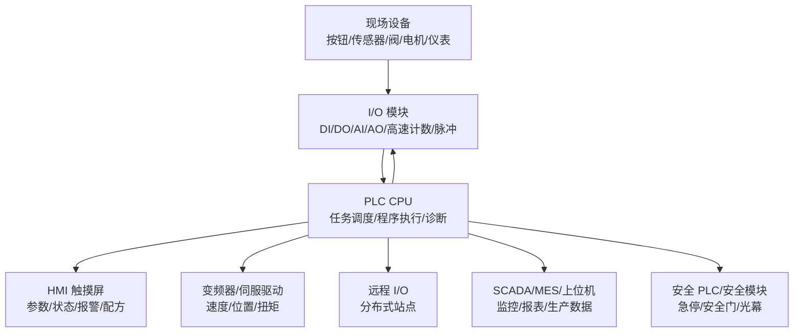
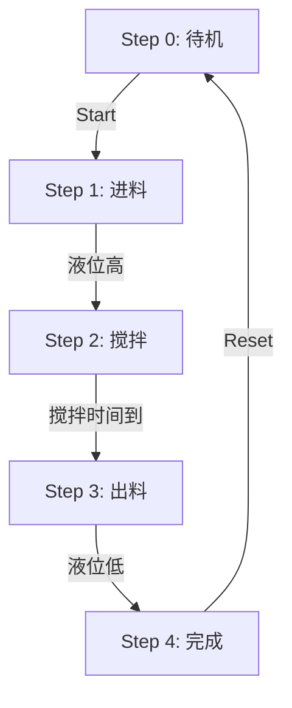
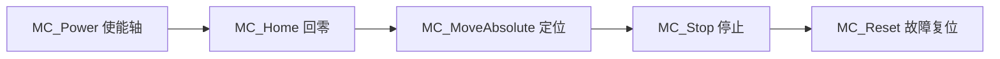
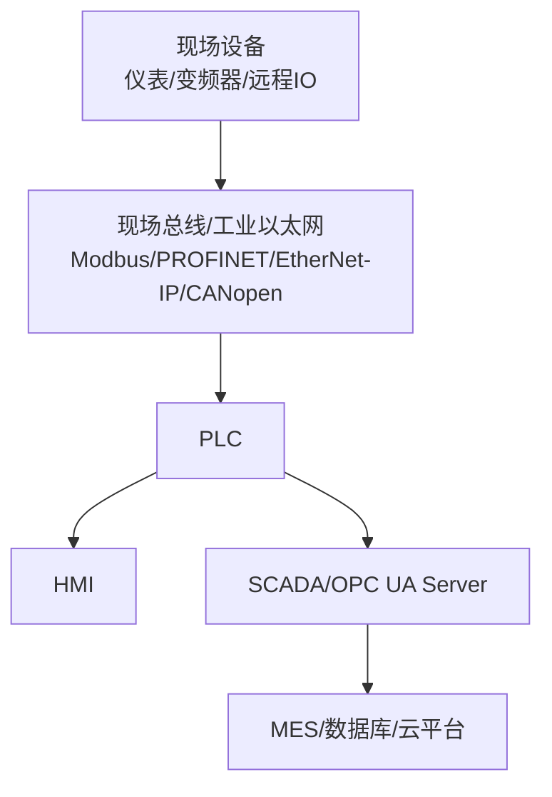
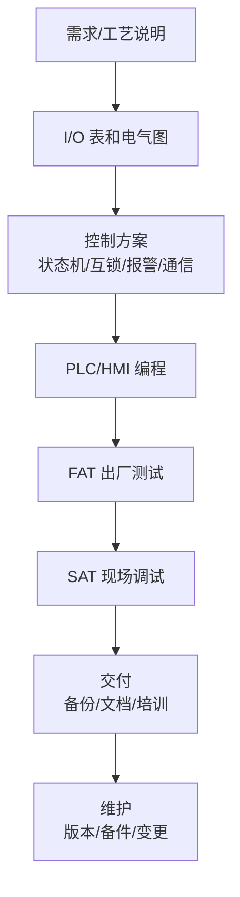
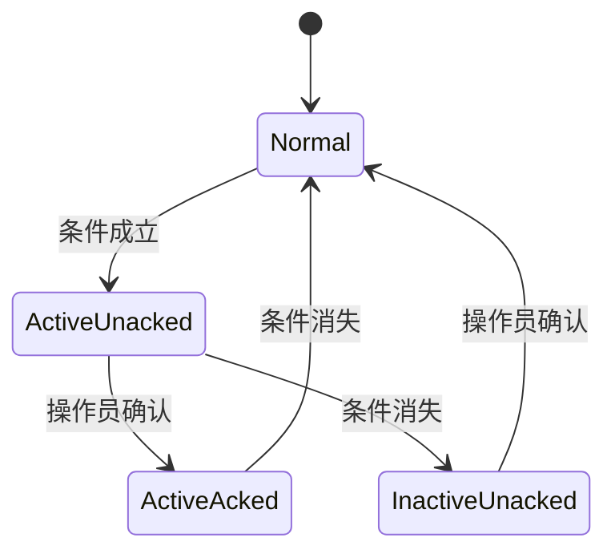

# PLC 完整学习文档

<!-- lecture-notes:integrated-v2 -->

## 讲义导读：把概念落到可验证实践

这一章讲的是 **PLC 完整学习文档**，属于 **工业、电气与机械协作**。阅读时不要把它当成零散资料堆叠，而要把它当成一份讲义：先弄清它解决什么问题，再看核心概念和流程，最后做一个能复现、能观察、能排错的小练习。

### 一句话先懂

工业和电气机械类知识的重点，是把控制逻辑、现场设备、图纸、信号、材料和安全要求对应到真实工程现场。

初学时先问三个问题：它的输入或前提是什么；它内部按什么规则工作；结果该用什么命令、日志、测试、图纸、波形或指标来证明。

### 通俗类比

工业项目像一条生产线：PLC 是控制大脑，电气柜是神经和供电，传感器是眼睛，执行器是手脚，组态界面是操作台，机械结构是骨架。

类比只是入门扶手。真正掌握时，要回到准确术语、配置、接口、版本、边界条件、错误信息和验证证据上。能解释失败原因，比只会照着步骤跑通更重要。

### 本章学习主线

1. **先看场景**：这个知识点通常在什么项目、岗位或问题里出现？
2. **再看结构**：它有哪些核心对象、配置、文件、命令、接口或流程？
3. **然后看路径**：一次完整使用从哪里开始，到哪里结束，中间有哪些状态变化？
4. **接着看边界**：版本差异、平台差异、权限、性能、安全、兼容性和资源限制在哪里？
5. **最后看验证**：用最小样例、测试、日志、调试工具或实物结果证明理解是对的。

### 本章重点抓手

PLC、I/O、传感器、执行器、电气图纸、接线、组态、HMI、报警、联锁、机械术语、材料、装配和安全。

### 最小实践任务

画一个小型控制系统：输入、输出、PLC 点表、电气接线、HMI 画面、报警和调试步骤。

建议把练习记录成固定格式：目标、环境版本、最小示例、执行步骤、预期结果、实际结果、错误信息、定位过程和复盘。以后遇到真实项目问题时，这些记录会比单纯收藏教程更有用。

### 常见误区

- 只会软件逻辑，不懂现场接线和安全。
- 图纸、点表、程序和 HMI 名称对不上。
- 调试没有联锁、急停和异常工况验证。

### 推荐工具与资料

官方文档、最小 demo、日志、调试器、版本管理、测试命令、性能/诊断工具和复盘记录。

### 读完本章应该能做到

- 用自己的话解释核心概念和适用场景。
- 给出一个最小可运行或可验证样例。
- 说清至少一个常见错误的现象、原因和排查路径。
- 知道当前版本应该查哪份官方文档，而不是只依赖旧教程。

> 本节是讲义化改写后的阅读入口。后续正文中的命令、配置、图纸、代码和参考资料，都应围绕“场景 -> 概念 -> 操作 -> 验证 -> 复盘”来理解。


> Last researched: 2026-06-15  
> Audience level: 初学者到工程实践  
> Scope: 覆盖 PLC 基础、硬件架构、扫描周期、I/O、电气基础、IEC 61131-3 编程语言、梯形图、功能块图、结构化文本、定时器计数器、模拟量、PID、运动控制、工业通信、HMI/SCADA、调试、故障诊断、设备选型、网络安全、安全 PLC、项目交付与学习路线。不替代现场电气安全培训、国家/行业强制标准、厂商正式培训和安全认证。
## 1. 总览

PLC 是 Programmable Logic Controller，可编程逻辑控制器。它是一类面向工业现场的实时控制设备，用于采集传感器、按钮、开关、编码器等输入信号，按照用户程序进行逻辑、顺序、运动、过程控制运算，再驱动继电器、接触器、电磁阀、变频器、伺服、指示灯、报警器等输出设备。

PLC 的核心价值不是“会跑程序”，而是能在工业现场长期稳定、可维护、可诊断地控制真实设备。学习 PLC 时要同时掌握四条线：

- 控制逻辑：启停、互锁、顺序、报警、状态机。
- 电气接口：DI、DO、AI、AO、继电器、晶体管、24V DC、接地、屏蔽、隔离。
- 工业通信：Modbus、PROFINET、EtherNet/IP、OPC UA、串口、现场总线。
- 工程安全：急停、安全回路、权限、变更管理、备份、网络安全。

## 2. 学习目标

- 理解 PLC 的硬件组成、工作方式和典型工业控制架构。
- 掌握 PLC 扫描周期、输入映像、程序执行、输出刷新、任务调度。
- 能读懂并编写基本梯形图、功能块图和结构化文本。
- 能实现电机启停、互锁、定时、计数、报警、顺控、模拟量缩放、PID 等典型控制。
- 能理解 PLC 与 HMI、变频器、伺服、远程 I/O、SCADA、上位机之间的通信关系。
- 能掌握现场调试方法：强制、在线监控、交叉引用、趋势、故障码、网络抓包、日志。
- 能识别常见风险：输入输出接线错误、常开常闭逻辑反、扫描周期误判、定时器误用、通信字节序错误、跨任务数据竞争、安全回路错误。

## 3. 前置知识

| 知识 | 要求 |
| --- | --- |
| 电工基础 | 电压、电流、功率、继电器、接触器、断路器、保险丝、接地、24V DC 控制回路。 |
| 数字逻辑 | 与、或、非、置位、复位、边沿、互锁。 |
| 传感器与执行器 | 接近开关、光电、限位、按钮、编码器、电磁阀、电机、变频器、伺服。 |
| 计算机基础 | IP 地址、端口、串口、二进制、十六进制、数据类型。 |
| 工业安全 | 急停、安全门、锁定挂牌、机械危险源、调试许可。 |

## 4. PLC 典型架构



Figure: PLC 控制系统常见组成，综合整理自 IEC 61131-3、PLCopen、Siemens S7-1200/S7-1500、Rockwell Logix、CODESYS、OPC UA、Modbus 和工业网络资料。

### 4.1 PLC 与普通计算机的区别

| 维度 | PLC | 普通计算机/工控机 |
| --- | --- | --- |
| 目标 | 稳定实时控制现场设备 | 通用计算、数据处理、可视化 |
| 环境 | 抗干扰、宽温、DIN 导轨、工业电源 | 多为办公室/机柜环境 |
| I/O | 原生支持 DI/DO/AI/AO/现场总线 | 需扩展板卡或外设 |
| 编程 | 梯形图、FBD、ST、SFC 等 | C/C++/C#/Python/Java 等 |
| 生命周期 | 常见 10 年以上 | 更新快 |
| 维护人员 | 电气工程师、自动化工程师 | IT/软件工程师 |
| 实时性 | 扫描周期和任务确定性较强 | 取决于 OS 和实时扩展 |

## 5. PLC 硬件组成

### 5.1 CPU 模块

CPU 是 PLC 的核心，负责：

- 执行用户程序。
- 管理输入输出映像区。
- 管理通信连接。
- 保存数据块、变量、诊断信息。
- 执行中断、周期任务、运动控制任务。
- 处理故障和运行模式切换。

选型关注：

| 参数 | 意义 |
| --- | --- |
| 程序容量 | 可容纳多少逻辑、功能块、数据。 |
| 数据存储 | 保持变量、配方、报警、历史数据能力。 |
| 指令速度 | 影响复杂程序和短周期控制。 |
| 通信口 | Ethernet、RS-485、PROFINET、EtherNet/IP、CANopen 等。 |
| 最大 I/O 点数 | 本地和远程 I/O 扩展能力。 |
| 运动轴数 | 支持脉冲轴、伺服轴、同步轴数量。 |
| 安全功能 | 是否支持 F-CPU/Safety PLC。 |

### 5.2 电源模块

PLC 常用 24V DC 控制电源。设计原则：

- PLC CPU、I/O、传感器、执行器容量要分开核算。
- 感性负载如电磁阀、继电器线圈要考虑浪涌和反向电动势。
- 控制电源与动力电源分区布线。
- 重要控制系统应有熔断器、断路器、浪涌保护、UPS 或冗余电源。

### 5.3 I/O 模块

| 模块 | 说明 | 常见信号 |
| --- | --- | --- |
| DI | 数字输入 | 按钮、限位、接近、光电、继电器触点 |
| DO | 数字输出 | 继电器线圈、指示灯、电磁阀、接触器 |
| AI | 模拟输入 | 4-20mA、0-10V、热电偶、热电阻 |
| AO | 模拟输出 | 4-20mA、0-10V 控制阀、变频器给定 |
| HSC | 高速计数 | 编码器、脉冲计数 |
| PTO/PWM | 脉冲输出 | 步进、简单伺服 |
| 通信模块 | 网络/串口/现场总线 | RS-485、PROFINET、EtherNet/IP、CANopen |

### 5.4 输入类型

数字输入常见 24V DC。现场要区分：

- PNP/NPN 传感器。
- 源型/漏型输入。
- 常开/常闭触点。
- 干接点/湿接点。
- 输入滤波时间。

常见坑：

- 图纸写的是常闭急停，但程序按常开理解。
- PNP/NPN 与输入模块类型不匹配。
- 传感器电源 0V 未共地。
- 输入滤波太大导致高速信号丢失。

### 5.5 输出类型

| 输出 | 优点 | 限制 | 场景 |
| --- | --- | --- | --- |
| 继电器输出 | 交直流都可，隔离好 | 寿命有限，速度慢，不适合高频 | 接触器、指示灯、低频阀 |
| 晶体管输出 | 速度快，寿命长 | 通常仅 DC，注意源型/漏型 | 脉冲、电磁阀、快速输出 |
| 晶闸管输出 | 适合 AC | 有漏电流，关断依赖 AC 过零 | AC 负载 |

感性负载要加续流二极管、RC 吸收、压敏电阻或浪涌抑制器，按负载和厂商建议设计。

## 6. PLC 工作方式

### 6.1 经典扫描周期


Figure: PLC 经典扫描周期，综合整理自 PLC 厂商文档和 IEC 61131-3 编程模型。

一个典型循环包括：

1. 读取物理输入到输入映像区。
2. 执行用户程序。
3. 将输出映像写到物理输出。
4. 处理通信、诊断、系统任务。

不同厂商实现不完全相同。现代 PLC 支持连续任务、周期任务、事件任务、中断任务、运动任务、通信任务。Rockwell Logix 平台有 tasks/programs/routines 模型；Siemens S7 有 OB 组织块和循环/中断/启动等执行模型；CODESYS 支持任务配置。

### 6.2 扫描周期带来的关键影响

| 现象 | 原因 |
| --- | --- |
| 输入变化不是立即影响输出 | 一般要等下一次扫描或任务周期。 |
| 同一扫描内线圈写多次，最后一次可能覆盖前面结果 | 程序从上到下执行，重复线圈要谨慎。 |
| 短脉冲可能漏掉 | 脉冲宽度小于扫描周期或输入滤波时间。 |
| 定时器精度受任务周期影响 | 定时器更新与扫描/系统时基有关。 |
| 通信数据不是实时同步 | 通信任务、网络周期、对端刷新周期都有延迟。 |

### 6.3 任务和中断

| 类型 | 说明 | 场景 |
| --- | --- | --- |
| 主循环任务 | 周期循环执行 | 大多数逻辑控制 |
| 周期任务 | 固定周期执行 | PID、运动同步、采样 |
| 事件任务 | 由事件触发 | 高速输入、通信事件 |
| 硬件中断 | 输入边沿或硬件事件触发 | 快速响应 |
| 启动任务 | PLC 上电/切 RUN 时执行 | 初始化、复位、装载参数 |
| 故障任务 | 系统异常或模块故障触发 | 安全停机、报警 |

工程建议：

- 普通逻辑放主循环。
- 快速采样和闭环控制放周期任务。
- 极短脉冲用高速计数器或硬件中断。
- 跨任务共享变量要明确写入优先级和互斥策略。

## 7. IEC 61131-3 编程语言

IEC 61131-3 是 PLC 编程语言的核心国际标准。它定义了 PLC 软件模型、数据类型、程序组织单元和多种编程语言。常见语言如下：

| 语言 | 英文 | 特点 | 适合 |
| --- | --- | --- | --- |
| 梯形图 | LD / Ladder Diagram | 类似继电器电路，电气人员易读 | 开关量逻辑、互锁、启停 |
| 功能块图 | FBD / Function Block Diagram | 块连接，数据流直观 | 模拟量、PID、过程控制 |
| 结构化文本 | ST / Structured Text | 类 Pascal，高级文本语言 | 运算、算法、循环、数据处理 |
| 顺序功能图 | SFC / Sequential Function Chart | 步骤与转移 | 顺序控制、工艺流程 |
| 指令表 | IL / Instruction List | 类汇编，老标准中常见 | 旧项目维护；新标准中弱化/不推荐 |

### 7.1 程序组织单元 POU

| POU | 说明 |
| --- | --- |
| Program | 程序，通常由任务调用。 |
| Function Block | 功能块，有内部状态，可实例化。 |
| Function | 函数，无内部持久状态，输入相同输出相同。 |

示例：电机控制适合做 Function Block，因为它要保存运行状态、故障状态、启动沿、计时等内部数据。

### 7.2 数据类型

| 类型 | 说明 |
| --- | --- |
| BOOL | 布尔量 |
| BYTE/WORD/DWORD/LWORD | 位串 |
| SINT/INT/DINT/LINT | 有符号整数 |
| USINT/UINT/UDINT/ULINT | 无符号整数 |
| REAL/LREAL | 浮点数 |
| TIME | 时间 |
| DATE、TIME_OF_DAY、DATE_AND_TIME | 日期时间 |
| STRING/WSTRING | 字符串 |
| ARRAY | 数组 |
| STRUCT | 结构体 |
| ENUM | 枚举 |

常见坑：

- 模拟量原始值是整数，工程量是浮点。
- Modbus 寄存器是 16 位，32 位浮点/整数涉及字序和字节序。
- BOOL 打包方式不同平台可能不同，通信映射要按厂商规则。
- REAL 精度有限，不适合金额或高精度累计。

## 8. 梯形图 LD

梯形图源于继电器控制图。左侧和右侧母线之间是逻辑回路，触点表示条件，线圈表示输出或内部位。

### 8.1 基本元件

| 元件 | 含义 |
| --- | --- |
| 常开触点 | 条件为 TRUE 时导通。 |
| 常闭触点 | 条件为 FALSE 时导通。 |
| 线圈 | 将逻辑结果写入变量。 |
| 置位线圈 | 条件成立时置 TRUE，之后保持。 |
| 复位线圈 | 条件成立时置 FALSE。 |
| 上升沿 | 从 FALSE 到 TRUE 的瞬间。 |
| 下降沿 | 从 TRUE 到 FALSE 的瞬间。 |

### 8.2 电机启停自保持

逻辑需求：

- 按启动按钮，电机运行。
- 按停止按钮，电机停止。
- 急停或过载时停止。
- 启动后即使松开启动按钮也保持运行。

文本化梯形图：

```text
      Stop_NC   EStop_OK   Overload_OK   Start_NO
----|/|--------| |--------| |-----------| |-----------( Motor_Run )
                                           |
                                           | Motor_Run
                                           +--| |------+
```

更严谨的表达：

```text
Motor_Run := Stop_OK AND EStop_OK AND Overload_OK AND (Start_PB OR Motor_Run)
```

注意：

- 停止、急停、过载通常按失电安全思路设计，即现场常闭触点断开代表故障/停止。
- PLC 程序里的 `EStop_OK` 不能替代硬接线安全回路。
- 自保持输出不要和其他网络重复写同一线圈。

### 8.3 正反转互锁

需求：

- 正转和反转不能同时吸合。
- 切换方向前需要先停止，必要时加延时。

```text
Forward_Cmd := Forward_PB AND NOT Reverse_Run AND Safety_OK
Reverse_Cmd := Reverse_PB AND NOT Forward_Run AND Safety_OK
```

硬件层也应使用接触器机械互锁和电气互锁，不能只依赖 PLC 程序。

### 8.4 梯形图常见错误

- 同一输出线圈在多个网络重复赋值。
- 忘记常闭触点在程序中代表“变量为 FALSE 时导通”，与现场接线常闭不是同一概念。
- 将急停只接到 PLC 输入，未切断动力或安全输出。
- 不做互锁，导致两个冲突动作同时输出。
- 使用普通输入捕捉高速脉冲。

## 9. 功能块图 FBD

FBD 使用功能块和连线表达逻辑，适合连续量、模拟量、PID、报警处理、滤波、限幅、选择器等。

### 9.1 模拟量缩放

例如 4-20mA 温度变送器，量程 0-100°C，模块原始值 0-27648，其中 4mA 对应 5530，20mA 对应 27648。

```text
EngineeringValue = (Raw - RawMin) * (EngMax - EngMin) / (RawMax - RawMin) + EngMin
```

ST 表达：

```pascal
Temp_C := (REAL(Raw) - 5530.0) * (100.0 - 0.0) / (27648.0 - 5530.0) + 0.0;
```

工程要点：

- 判断断线：低于 4mA 对应值可能是断线或传感器故障。
- 限幅：避免异常值进入 PID。
- 滤波：模拟量噪声大时使用一阶滤波或移动平均，但会引入延迟。
- 标定：现场量程要与仪表、模块、HMI 单位一致。

### 9.2 PID 控制

PID 用于温度、压力、流量、液位等闭环控制。

核心信号：

| 信号 | 含义 |
| --- | --- |
| PV | Process Variable，过程值。 |
| SP | Setpoint，设定值。 |
| MV/CV | Manipulated/Control Variable，输出控制量。 |
| Kp | 比例增益。 |
| Ti/Ki | 积分参数。 |
| Td/Kd | 微分参数。 |
| Manual/Auto | 手动/自动模式。 |

常见坑：

- PID 周期不稳定，导致控制质量差。
- 工程量方向反了，加热/冷却正反作用设置错误。
- 输出未限幅，阀门/变频器超范围。
- 手自动切换不做无扰切换，输出突变。
- 积分饱和未处理。

## 10. 结构化文本 ST

ST 适合复杂判断、数组、循环、计算和状态机。

### 10.1 基本语法

```pascal
IF Start AND NOT Fault THEN
    MotorRun := TRUE;
ELSIF Stop OR Fault THEN
    MotorRun := FALSE;
END_IF;
```

循环：

```pascal
Sum := 0;
FOR i := 1 TO 10 DO
    Sum := Sum + Values[i];
END_FOR;
```

### 10.2 状态机示例

```pascal
CASE State OF
    0: // Idle
        ValveOpen := FALSE;
        MotorRun := FALSE;
        IF Start THEN
            State := 10;
        END_IF;

    10: // Fill
        ValveOpen := TRUE;
        IF LevelHigh THEN
            ValveOpen := FALSE;
            State := 20;
        END_IF;

    20: // Mix
        MotorRun := TRUE;
        MixTimer(IN := TRUE, PT := T#30s);
        IF MixTimer.Q THEN
            MotorRun := FALSE;
            MixTimer(IN := FALSE);
            State := 30;
        END_IF;

    30: // Done
        Done := TRUE;
        IF Reset THEN
            Done := FALSE;
            State := 0;
        END_IF;

ELSE
    State := 0;
END_CASE;
```

状态机建议：

- 用枚举或常量命名状态，不要大量裸数字。
- 每个状态明确进入动作、持续动作、退出条件。
- 所有异常都能进入安全状态。
- HMI 显示当前状态和步骤说明。

## 11. SFC 顺序功能图

SFC 把工艺流程拆成步骤和转移条件：



适合：

- 批处理。
- 包装机、装配线、清洗机。
- 步骤清晰的设备。

不适合：

- 大量并行设备互相耦合且步骤不清晰。
- 简单启停逻辑。
- 需要极高灵活性的算法运算。

## 12. 定时器、计数器与边沿

### 12.1 定时器

IEC 常见定时器：

| 定时器 | 说明 |
| --- | --- |
| TON | 通电延时，输入 TRUE 持续到设定时间后输出 TRUE。 |
| TOF | 断电延时，输入 FALSE 后延时一段时间输出 FALSE。 |
| TP | 脉冲定时，触发后输出固定宽度脉冲。 |

TON 示例：

```pascal
DelayStart(IN := StartCmd, PT := T#5s);
MotorRun := DelayStart.Q;
```

注意：

- 定时器通常是功能块实例，有内部状态。
- 每个用途应使用独立实例，不要多个逻辑复用同一个定时器实例。
- `IN` 变 FALSE 后 TON 通常复位。

### 12.2 计数器

| 计数器 | 说明 |
| --- | --- |
| CTU | 加计数 |
| CTD | 减计数 |
| CTUD | 加减计数 |

CTU 示例：

```pascal
PartCounter(CU := SensorRise, R := ResetCount, PV := 100);
BatchDone := PartCounter.Q;
PartCount := PartCounter.CV;
```

### 12.3 边沿检测

边沿用于只在信号变化瞬间触发一次。

```pascal
StartRise(CLK := StartButton);
IF StartRise.Q THEN
    StartCount := StartCount + 1;
END_IF;
```

常见坑：

- 用常态信号触发计数，导致每个扫描周期都加 1。
- 边沿功能块实例被复用，导致检测混乱。
- 高速信号用普通边沿检测，扫描周期捕捉不到。

## 13. 数据块、变量与地址

不同厂商变量模型不同，但核心概念类似。

### 13.1 地址型编程

常见地址：

| 地址 | 含义示例 |
| --- | --- |
| I0.0 | 输入第 0 字节第 0 位 |
| Q0.0 | 输出第 0 字节第 0 位 |
| M10.0 | 内部标志位 |
| DB1.DBX0.0 | 数据块位 |
| DB1.DBW2 | 数据块字 |
| %IX0.0 | IEC 风格输入位 |
| %QX0.0 | IEC 风格输出位 |

### 13.2 符号化编程

推荐用符号名：

```text
StartButton
StopButton
MotorRunCmd
MotorFeedback
TankLevelHigh
```

优势：

- 易读。
- 易维护。
- 便于交叉引用。
- 便于 HMI/SCADA 标签同步。

### 13.3 变量命名建议

| 后缀/前缀 | 含义 |
| --- | --- |
| `_Cmd` | 命令 |
| `_Fb` | 反馈 |
| `_Req` | 请求 |
| `_Ack` | 确认 |
| `_Alm` | 报警 |
| `_Warn` | 警告 |
| `_En` | 使能 |
| `_Done` | 完成 |
| `_Busy` | 忙 |
| `_Fault` | 故障 |
| `_Raw` | 原始值 |
| `_EU` | 工程单位值 |

## 14. 模拟量与工程单位

### 14.1 典型信号

| 信号 | 特点 |
| --- | --- |
| 0-10V | 接线简单，抗干扰弱于电流信号。 |
| 4-20mA | 工业常用，抗干扰强，可检测断线。 |
| PT100/RTD | 温度测量，需专用模块。 |
| 热电偶 | 高温测量，需冷端补偿。 |

### 14.2 缩放、滤波、报警流程


### 14.3 报警滞回

没有滞回会导致报警在阈值附近抖动。

```pascal
IF Temp > HighLimit THEN
    TempHighAlm := TRUE;
ELSIF Temp < HighLimit - Hysteresis THEN
    TempHighAlm := FALSE;
END_IF;
```

## 15. 运动控制基础

运动控制包括步进、伺服、变频器、轴组同步、电子齿轮、电子凸轮等。PLCopen Motion Control 定义了常见运动控制功能块模型，许多厂商都参考该模型。

### 15.1 基本概念

| 概念 | 说明 |
| --- | --- |
| Axis | 轴，代表一个电机/执行机构。 |
| Homing | 回零，建立机械位置基准。 |
| Jog | 点动。 |
| Absolute Move | 绝对位置移动。 |
| Relative Move | 相对位置移动。 |
| Velocity Move | 速度控制。 |
| Gear/Cam | 电子齿轮/电子凸轮。 |
| Interpolation | 插补，多轴协调运动。 |

### 15.2 PLCopen 风格功能块

常见功能块：

- `MC_Power`
- `MC_Home`
- `MC_MoveAbsolute`
- `MC_MoveRelative`
- `MC_MoveVelocity`
- `MC_Stop`
- `MC_Reset`

典型流程：



工程要点：

- 运动轴必须明确单位、脉冲当量、电子齿轮比。
- 限位、原点、正负方向必须现场验证。
- 伺服报警复位前要确认机械安全。
- 运动功能块是有状态的，`Execute` 上升沿和 `Busy/Done/Error` 要正确处理。
- 安全相关停止要用 STO/安全回路，不要只靠普通 PLC 指令。

## 16. HMI 与 SCADA

### 16.1 HMI 职责

HMI 负责人机交互，不应承担核心控制安全职责。

HMI 常见功能：

- 设备状态显示。
- 手动/自动模式切换。
- 参数设定。
- 配方管理。
- 报警显示与确认。
- 趋势曲线。
- 用户权限。
- 维护页面。

原则：

- HMI 写入 PLC 的是命令/设定值，不要直接写输出点。
- 关键动作要做权限和二次确认。
- 参数要做上下限校验，PLC 侧也要校验。
- HMI 通信中断时 PLC 应能安全运行或进入定义状态。

### 16.2 SCADA/MES/上位机

SCADA 负责监控、报警、历史数据、报表、远程操作。MES/上位机更偏生产管理、订单、工艺参数、追溯。

PLC 与上位系统通信常用：

- OPC UA。
- Modbus TCP。
- EtherNet/IP。
- PROFINET。
- MQTT/边缘网关。
- 厂商专有驱动。

## 17. 工业通信

### 17.1 通信分层



### 17.2 Modbus

Modbus 是常见开放协议，有 RTU、ASCII、TCP 等形式。

常见数据区：

| 区域 | 类型 | 典型访问 |
| --- | --- | --- |
| Coils | 位，可读写 | 0x01/0x05/0x0F |
| Discrete Inputs | 位，只读 | 0x02 |
| Input Registers | 16 位寄存器，只读 | 0x04 |
| Holding Registers | 16 位寄存器，可读写 | 0x03/0x06/0x10 |

常见坑：

- 地址从 0 开始还是从 1 开始，文档表达不同。
- 40001 只是传统表示法，不一定等于协议地址 40001。
- 32 位整数/浮点跨两个寄存器，存在字节序/字序问题。
- RTU 要配置波特率、校验、停止位、站号。
- TCP 要注意端口 502、连接数、超时和轮询周期。

### 17.3 PROFINET

PROFINET 是 PI 组织的工业以太网技术，常见于 Siemens 生态，也被大量第三方设备支持。

关注点：

- Device Name。
- IP 地址。
- GSDML 设备描述文件。
- IO Controller/IO Device 角色。
- 周期 IO 数据。
- 诊断报警。
- 网络拓扑与交换机。

### 17.4 EtherNet/IP

EtherNet/IP 基于 CIP，常见于 Rockwell/Allen-Bradley 生态。

关注点：

- Scanner/Adapter。
- Assembly Instance。
- EDS 文件。
- Implicit I/O 和 Explicit Messaging。
- RPI 请求包间隔。
- Tag 通信。

### 17.5 OPC UA

OPC UA 是面向工业互操作的数据交换标准，支持对象模型、安全、订阅、历史、方法等。常见于 PLC、SCADA、MES、边缘网关之间。

适合：

- 上位系统读取 PLC 数据。
- 跨厂商集成。
- 带安全认证和加密的数据访问。
- 设备信息模型。

不适合：

- 极短周期硬实时 I/O 控制。
- 安全联锁回路。

### 17.6 通信设计原则

- 控制闭环尽量靠近现场，不要依赖云或远程服务器实时控制。
- 网络中断、超时、坏数据要有明确处理。
- 通信变量要有心跳、时间戳或序号。
- 写入命令要有握手，避免重复执行。
- 上位机不能直接绕过 PLC 安全逻辑控制输出。
- 工业网络和办公网络分区隔离。

## 18. PLC 安全与机器安全

### 18.1 普通 PLC 不能替代安全 PLC

急停、安全门、光幕、双手按钮等安全功能应按风险评估选择：

- 安全继电器。
- 安全 PLC。
- 安全 I/O。
- 安全现场总线。
- 具备 STO 的驱动器。

普通 PLC 可以监视安全状态用于显示和报警，但不应作为唯一安全保护。

### 18.2 常见安全标准

| 标准 | 主题 |
| --- | --- |
| IEC 61508 | 功能安全基础标准。 |
| IEC 62061 | 机械电气/电子/可编程电子控制系统安全。 |
| ISO 13849 | 机械安全控制系统安全相关部件，PL 等级。 |
| IEC 60204-1 | 机械电气设备安全。 |
| IEC 62443 | 工业自动化与控制系统网络安全。 |

### 18.3 安全设计原则

- 风险评估先于控制程序。
- 安全功能独立于普通控制。
- 急停应切断危险能量或让系统进入安全状态。
- 安全回路要防止单点故障导致危险失效。
- 安全 PLC 程序要单独验证、权限管理、变更记录。
- 调试强制输出不能绕过安全保护。

## 19. PLC 网络安全

NIST SP 800-82、CISA PLC 安全建议和 IEC 62443 都强调，OT 系统的安全重点是可用性、完整性和安全运行。

### 19.1 常见风险

- PLC 暴露在公网。
- 默认密码或无认证。
- 工程站随意接入控制网。
- 程序无备份、无版本管理。
- HMI/SCADA 与办公网直接互通。
- 远程维护 VPN 无审计。
- 未授权下载程序或强制 I/O。
- 老旧 PLC 不支持现代加密和身份认证。

### 19.2 基本防护

| 措施 | 说明 |
| --- | --- |
| 网络分区 | 办公网、DMZ、控制网、现场设备网分层。 |
| 最小权限 | 工程站、HMI、SCADA 账号分权。 |
| 禁止公网暴露 | PLC 不应直接暴露互联网。 |
| 备份与版本 | 程序、参数、固件、组态定期备份。 |
| 变更管理 | 下载程序、改参数、强制点位要审批记录。 |
| 安全远程访问 | VPN、MFA、堡垒机、审计。 |
| 资产清单 | 记录 PLC 型号、固件、IP、程序版本、通信关系。 |
| 监测 | 工业防火墙、IDS、日志、异常流量检测。 |

### 19.3 工程师现场习惯

- 不用未知 U 盘连接工程站。
- 不在生产网随意扫网。
- 下载程序前备份当前 PLC 程序。
- 远程调试前确认现场有人监护。
- 修改安全相关参数前确认审批和风险。

## 20. 调试与故障诊断

### 20.1 调试前检查

- 图纸版本、I/O 表、程序版本一致。
- 电源电压正确。
- 端子接线完成并压接可靠。
- 接地、屏蔽、隔离符合设计。
- 急停、安全门、安全继电器动作正确。
- 电机旋转方向和机械限位确认。
- 传感器常开/常闭逻辑确认。
- 通信 IP、站号、设备名、GSD/EDS 文件确认。

### 20.2 调试步骤

1. 离线检查程序和图纸。
2. 上电前绝缘、短路、电源检查。
3. 单点 I/O 测试。
4. 手动模式测试执行器。
5. 单机自动流程测试。
6. 联机联动测试。
7. 故障模拟和报警验证。
8. 安全功能验证。
9. 长时间运行和边界条件测试。
10. 备份最终程序、参数、HMI、驱动器参数。

### 20.3 在线监控

常用工具：

- 变量表/监视表。
- 强制 I/O。
- 程序状态在线显示。
- 交叉引用。
- 趋势曲线。
- 诊断缓冲区。
- 通信状态。
- 模块 LED 和故障码。

强制输出注意：

- 强制前确认现场安全。
- 强制期间要有人监护。
- 强制点要记录。
- 调试结束必须取消强制。

### 20.4 常见故障表

| 现象 | 可能原因 | 排查 |
| --- | --- | --- |
| 输入不亮 | 接线错误、电源缺失、PNP/NPN 不匹配、传感器坏 | 测电压、看模块 LED、查图纸 |
| 输出亮但负载不动作 | 负载电源缺失、继电器坏、保险断、公共端未接 | 测输出端、电源、负载 |
| 电机不启动 | 安全回路断、过载、变频器故障、互锁未满足 | 查安全状态、驱动故障、命令和反馈 |
| 通信不上 | IP/站号错、设备名错、防火墙、线缆、GSD/EDS 错 | ping、诊断、抓包、看交换机 |
| 模拟量跳动 | 屏蔽接地差、干扰、量程错、滤波不足 | 查接线、屏蔽、量程、滤波 |
| 计数丢脉冲 | 扫描周期太长、输入滤波大、未用高速计数 | 用 HSC、缩短滤波、示波器确认 |
| PLC 停机 | 程序错误、模块故障、电源波动、看门狗超时 | 查诊断缓冲区和错误 OB/任务 |

## 21. 工程项目流程

### 21.1 从需求到交付



### 21.2 关键交付物

- 控制说明书。
- 电气原理图。
- I/O 点表。
- PLC 程序源文件。
- HMI/SCADA 工程。
- 通信点表。
- 参数清单。
- 报警清单。
- 测试记录。
- 安全功能验证记录。
- 程序和参数备份。
- 操作维护手册。

### 21.3 版本管理

PLC 工程也应做版本管理：

- 每次下载前备份。
- 文件名包含项目、设备、日期、版本、工程师。
- 记录修改原因。
- 关键逻辑修改走评审。
- 程序、HMI、驱动器、仪表参数一起归档。

## 22. 设备选型

### 22.1 PLC 选型步骤

1. 统计 I/O 点数和类型。
2. 判断控制复杂度和扫描周期要求。
3. 判断通信协议和设备生态。
4. 判断运动控制轴数和性能。
5. 判断安全要求。
6. 判断环境：温度、振动、防护等级、电磁干扰。
7. 判断扩展和维护：备件、工程师熟悉度、售后支持。
8. 判断成本：硬件、软件授权、调试、培训、生命周期。

### 22.2 小型、中型、大型 PLC

| 类型 | 场景 | 示例方向 |
| --- | --- | --- |
| 小型 PLC | 单机设备、小点数、简单通信 | Siemens S7-1200、Mitsubishi FX、Schneider M221、Omron CP |
| 中型 PLC | 产线、远程 I/O、多通信、多轴 | Siemens S7-1500、Rockwell CompactLogix、Mitsubishi iQ-R/iQ-F |
| 大型/冗余系统 | 大型工厂、过程控制、冗余、高可用 | Siemens S7-400H/PCS 7、ControlLogix、DCS/Hybrid |
| 软 PLC | PC-based 控制、运动、边缘计算 | CODESYS、Beckhoff TwinCAT |

### 22.3 厂商生态对比

| 生态 | 特点 |
| --- | --- |
| Siemens | PROFINET、TIA Portal、S7-1200/1500、欧洲和中国项目常见。 |
| Rockwell/Allen-Bradley | EtherNet/IP、Studio 5000、北美市场强。 |
| Mitsubishi | MELSEC、FX/iQ 系列、亚洲设备市场常见。 |
| Schneider | Modicon、EcoStruxure、过程与机器控制都有覆盖。 |
| Omron | 机器自动化、运动控制、Sysmac 生态。 |
| Beckhoff | TwinCAT、PC-based、EtherCAT、运动和高性能控制。 |
| CODESYS | IEC 61131-3 平台，许多厂商控制器采用。 |

## 23. 常见厂商软件

| 厂商 | 软件 | 说明 |
| --- | --- | --- |
| Siemens | TIA Portal / STEP 7 | S7-1200/1500、HMI、驱动等集成工程。 |
| Rockwell | Studio 5000 Logix Designer | ControlLogix/CompactLogix 编程。 |
| Mitsubishi | GX Works2/GX Works3 | MELSEC 系列编程。 |
| Schneider | EcoStruxure Machine Expert / Control Expert | 机器控制和 Modicon 平台。 |
| Omron | Sysmac Studio / CX-One | NX/NJ/CP 等平台。 |
| Beckhoff | TwinCAT 3 | PC-based PLC、运动、EtherCAT。 |
| CODESYS | CODESYS Development System | 通用 IEC 61131-3 编程环境。 |

学习建议：

- 初学者选一个主平台深入，不要同时浅学多个。
- 国内常见入门路线：西门子 S7-1200 + TIA Portal。
- 如果偏软件/运动控制，可学习 CODESYS 或 TwinCAT。
- 如果服务北美设备，Rockwell 生态很重要。

## 24. 典型程序结构

### 24.1 模块划分

```text
PLC_Project
  Main
    Init
    ModeControl
    SafetyStatus
    ManualControl
    AutoSequence
    AlarmManager
    HmiInterface
    Communication
  FB
    Motor
    Valve
    Cylinder
    AnalogInput
    PIDLoop
    Axis
  DB/Tags
    IO
    HMI
    Recipe
    Alarm
    Retain
```

### 24.2 电机功能块设计

输入：

- `StartCmd`
- `StopCmd`
- `ResetCmd`
- `AutoEnable`
- `SafetyOK`
- `Feedback`
- `OverloadOK`

输出：

- `RunOut`
- `Running`
- `Fault`
- `StartTimeoutAlm`

内部：

- 启动超时定时器。
- 停止超时定时器。
- 运行保持位。
- 报警锁存。

伪代码：

```pascal
IF ResetCmd THEN
    Fault := FALSE;
    StartTimeoutAlm := FALSE;
END_IF;

IF NOT SafetyOK OR NOT OverloadOK THEN
    RunLatch := FALSE;
END_IF;

IF StartCmd AND SafetyOK AND OverloadOK AND NOT Fault THEN
    RunLatch := TRUE;
END_IF;

IF StopCmd THEN
    RunLatch := FALSE;
END_IF;

RunOut := RunLatch AND SafetyOK AND OverloadOK AND NOT Fault;

StartTimer(IN := RunOut AND NOT Feedback, PT := T#5s);
IF StartTimer.Q THEN
    StartTimeoutAlm := TRUE;
    Fault := TRUE;
    RunLatch := FALSE;
END_IF;

Running := Feedback;
```

### 24.3 阀门功能块设计

输入：

- `OpenCmd`
- `CloseCmd`
- `OpenFb`
- `CloseFb`
- `Enable`

输出：

- `OpenOut`
- `CloseOut`
- `Opened`
- `Closed`
- `Fault`

逻辑：

- 开关互锁。
- 到位超时。
- 双到位冲突报警。
- 手自动命令统一入口。

## 25. 报警设计

### 25.1 报警分类

| 类型 | 说明 |
| --- | --- |
| 故障 | 需要停机或禁止动作。 |
| 警告 | 提醒操作员，设备可继续运行。 |
| 过程报警 | 温度高、压力低、液位异常。 |
| 设备报警 | 电机过载、变频器故障、伺服报警。 |
| 通信报警 | 远程 I/O 掉线、HMI 通信失败。 |
| 安全报警 | 急停、安全门、光幕触发。 |

### 25.2 报警生命周期



### 25.3 报警原则

- 报警条件要清晰，避免同一故障触发十几个无意义报警。
- 报警要有原因、影响、处理建议。
- 报警确认不等于故障复位。
- 安全报警不应被 HMI 一键绕过。
- 关键报警要有时间戳和历史记录。

## 26. 配方与参数

配方用于不同产品/工艺参数切换。参数包括速度、温度、时间、数量、限位等。

设计原则：

- 参数有单位、上下限、默认值。
- PLC 侧做范围校验，不能只依赖 HMI。
- 修改关键参数要权限和记录。
- 当前运行配方与编辑配方分开。
- 下载新配方前确认设备状态。
- 保持参数要考虑断电保持区和存储寿命。

## 27. 数据记录与追溯

PLC 不适合长期保存大量历史数据。常见方案：

- HMI 记录少量报警和趋势。
- SCADA 记录历史数据库。
- 边缘网关采集 PLC 数据后上传。
- MES 记录批次、工单、质量数据。

PLC 侧应提供：

- 设备状态。
- 当前配方号。
- 批次号/工单号。
- 关键过程值。
- 报警码。
- 生产计数。
- 节拍时间。

## 28. 常见错误与排查

### 28.1 程序逻辑错误

| 错误 | 后果 | 处理 |
| --- | --- | --- |
| 重复线圈 | 输出状态被后面网络覆盖 | 用 Set/Reset 或集中输出管理 |
| 没有互锁 | 动作冲突 | 软件互锁 + 硬件互锁 |
| 手自动逻辑混乱 | 手动误动作或自动抢控制 | 统一命令仲裁 |
| 报警复位不清晰 | 故障未消除也能继续运行 | 区分确认、复位、条件消失 |
| 状态机无异常出口 | 设备卡在某一步 | 每步设计超时和故障处理 |

### 28.2 电气错误

| 错误 | 后果 | 处理 |
| --- | --- | --- |
| PNP/NPN 接错 | 输入不动作 | 核对模块类型和传感器输出 |
| 公共端漏接 | 一组 I/O 都异常 | 查公共端和电源 |
| 屏蔽接地错误 | 模拟量跳动 | 单端/按规范接地 |
| 继电器容量不足 | 触点烧蚀 | 加中间继电器或接触器 |
| 感性负载无抑制 | 干扰、触点寿命短 | 加续流/RC/压敏 |

### 28.3 通信错误

| 错误 | 后果 | 处理 |
| --- | --- | --- |
| IP 冲突 | 设备掉线 | 地址规划和扫描确认 |
| Modbus 地址偏移 | 读错数据 | 明确 0 基/1 基和功能码 |
| 字节序错误 | 浮点数异常 | 测试高低字、高低字节 |
| 轮询太快 | 设备超时或 PLC 负载高 | 调整周期和分组读取 |
| 没有超时处理 | 上位机失联仍执行旧命令 | 心跳和超时清命令 |

## 29. 学习路线

### 阶段一：入门

目标：

- 了解 PLC 硬件、I/O、扫描周期。
- 掌握梯形图基本逻辑。
- 会做启停、自保持、互锁、定时、计数。

练习：

- 单电机启停。
- 正反转互锁。
- 红绿灯控制。
- 传送带计数。

### 阶段二：设备控制

目标：

- 掌握模拟量、报警、状态机、手自动模式。
- 学会 HMI 参数、报警、趋势。

练习：

- 液位控制系统。
- 温度 PID 控制。
- 气缸顺序动作。
- 包装机简化流程。

### 阶段三：通信与集成

目标：

- 掌握 Modbus TCP/RTU。
- 了解 PROFINET 或 EtherNet/IP。
- 会连接变频器、远程 I/O、HMI。

练习：

- PLC 通过 Modbus 读写仪表。
- PLC 控制变频器启停和频率。
- HMI 显示报警和配方。

### 阶段四：工程化

目标：

- 模块化程序。
- 标准功能块。
- 报警管理。
- 版本备份。
- 调试文档和交付文档。

练习：

- 做一套包含电机、阀、模拟量、报警、HMI、通信的完整项目模板。

### 阶段五：高级方向

目标：

- 运动控制。
- 安全 PLC。
- SCADA/OPC UA。
- 网络安全。
- 数字化和边缘采集。

练习：

- 伺服定位轴控制。
- 安全门/急停安全回路验证。
- OPC UA 数据采集到数据库。

## 30. 实战项目

| 项目 | 覆盖知识 |
| --- | --- |
| 电机控制模板 | 启停、互锁、反馈、超时、报警 |
| 水箱液位控制 | DI/DO/AI/AO、模拟量缩放、报警、PID |
| 传送带分拣 | 传感器、计数、气缸、状态机 |
| 恒温箱 | 温度采集、PID、SSR/加热、报警 |
| 变频器控制 | 通信、速度给定、故障读取 |
| 包装机流程 | SFC/状态机、HMI、配方、报警 |
| 伺服定位平台 | 回零、绝对定位、限位、安全停止 |
| SCADA 采集 | OPC UA/Modbus、历史数据、报表 |

## 31. 中文社区经验与踩坑总结

本节综合 CSDN、博客园、知乎、公众号和自动化论坛常见经验，规范性结论以标准和厂商手册为准。

### 31.1 初学者最大误区

- 只学软件仿真，不看电气图和接线。
- 把 PLC 程序当普通软件，不理解扫描周期。
- 只会照抄梯形图，不会做状态机和故障处理。
- 以为 HMI 按钮可以直接控制输出。
- 不重视安全回路。

### 31.2 西门子入门常见问题

- TIA Portal 版本与 CPU 固件版本不匹配。
- S7-1200/1500 优化数据块访问与第三方通信地址不一致。
- PROFINET 设备名未分配导致远程 I/O 不在线。
- 下载前没做在线备份，覆盖现场程序。
- HMI 标签未同步或地址改动后忘记更新。

### 31.3 Modbus 常见问题

- 文档写 40001，但软件要填 0 或 1。
- 读 REAL 时高低字顺序反了。
- RTU 校验位和停止位不一致。
- 多主站同时轮询导致响应异常。
- 没有超时和重连机制。

### 31.4 调试习惯

- 每次改程序记录改了什么、为什么改。
- 强制点位前喊停相关动作并确认现场人员位置。
- 调试动作时先低速、空载、单步。
- 先验证输入，再验证输出，再联动。
- 最终版本立即备份，并导出 PDF 或打印关键逻辑。

## 32. 常用速查

### 32.1 控制逻辑模板

启停保持：

```text
Run := SafetyOK AND StopOK AND (Start OR Run)
```

启动超时：

```text
StartTimeout := RunCmd AND NOT RunFeedback 持续超过 T
```

报警滞回：

```text
Alarm ON:  Value > High
Alarm OFF: Value < High - Hysteresis
```

命令握手：

```text
HMI_SetCmd -> PLC 接收 -> PLC_SetAck -> HMI 清命令
```

### 32.2 现场检查清单

- 电源电压。
- 接地和屏蔽。
- I/O 公共端。
- 传感器 PNP/NPN。
- 常开/常闭逻辑。
- 安全回路。
- 通信 IP/站号/设备名。
- 驱动器参数。
- HMI 标签。
- 程序版本。

### 32.3 常见缩写

| 缩写 | 含义 |
| --- | --- |
| PLC | Programmable Logic Controller |
| PAC | Programmable Automation Controller |
| DCS | Distributed Control System |
| HMI | Human Machine Interface |
| SCADA | Supervisory Control and Data Acquisition |
| DI/DO | Digital Input/Output |
| AI/AO | Analog Input/Output |
| RTD | Resistance Temperature Detector |
| TC | Thermocouple |
| VFD | Variable Frequency Drive |
| VSD | Variable Speed Drive |
| PID | Proportional Integral Derivative |
| STO | Safe Torque Off |
| SIL | Safety Integrity Level |
| PL | Performance Level |
| OEE | Overall Equipment Effectiveness |

## 33. 参考资料与进一步阅读

### Standards and Organizations

- IEC 61131-3 Programmable controllers - Part 3: Programming languages: https://webstore.iec.ch/publication/4552
- PLCopen Technical Committee 1 - IEC 61131-3: https://plcopen.org/technical-activities/logic/iec-61131-3
- PLCopen Motion Control: https://plcopen.org/technical-activities/motion-control
- OPC Foundation - What is OPC UA: https://opcfoundation.org/about/opc-technologies/opc-ua/
- OPC UA Online Reference: https://reference.opcfoundation.org/
- Modbus Organization - Technical Resources: https://modbus.org/tech.php
- Modbus Application Protocol Specification: https://modbus.org/docs/Modbus_Application_Protocol_V1_1b3.pdf
- PI International - PROFINET: https://www.profibus.com/technology/profinet
- ODVA - EtherNet/IP: https://www.odva.org/technology-standards/key-technologies/ethernet-ip/
- IEC 62443 Industrial Automation and Control Systems Security: https://www.iec.ch/blog/understanding-iec-62443
- ISA/IEC 62443 Series: https://www.isa.org/standards-and-publications/isa-standards/isa-iec-62443-series-of-standards
- NIST SP 800-82 Rev. 3 Guide to Operational Technology Security: https://csrc.nist.gov/pubs/sp/800/82/r3/final
- CISA - Securing PLCs: https://www.cisa.gov/resources-tools/resources/securing-programmable-logic-controllers-plcs
- IEC 61508 Functional Safety: https://www.iec.ch/functionalsafety
- ISO 13849 Machine Safety: https://www.iso.org/standard/73481.html

### Vendor Documentation

- Siemens SIMATIC S7-1200 System Manual: https://support.industry.siemens.com/cs/document/109781427/simatic-s7-1200-programmable-controller-system-manual
- Siemens SIMATIC S7-1500 Documentation: https://support.industry.siemens.com/cs/products?pnid=13716
- Siemens TIA Portal Documentation: https://support.industry.siemens.com/cs/products?dtp=Manual&mfn=ps&pnid=14667
- Siemens Programming Guideline for S7-1200/S7-1500: https://support.industry.siemens.com/cs/document/81318674/programming-guideline-for-s7-1200-s7-1500
- Rockwell Automation Studio 5000 Logix Designer Manuals: https://www.rockwellautomation.com/en-us/support/documentation/technical-data/studio-5000-logix-designer.html
- Rockwell Logix 5000 Controllers Tasks, Programs, and Routines: https://literature.rockwellautomation.com/idc/groups/literature/documents/pm/1756-pm005_-en-p.pdf
- Rockwell Logix 5000 Controllers General Instructions Reference: https://literature.rockwellautomation.com/idc/groups/literature/documents/rm/1756-rm003_-en-p.pdf
- Mitsubishi Electric MELSEC iQ-F Manuals: https://www.mitsubishielectric.com/fa/products/cnt/plcf/pmerit/concept/index.html
- Mitsubishi Electric FA Manual Download: https://www.mitsubishielectric.com/fa/download/index.html
- Schneider Electric EcoStruxure Machine Expert: https://www.se.com/ww/en/product-range/2226-ecostruxure-machine-expert/
- Schneider Electric Modicon PLCs and PACs: https://www.se.com/ww/en/product-category/3900-plcs-pacs-and-dedicated-controllers/
- Omron Sysmac Studio: https://automation.omron.com/en/us/products/family/SYSMAC-STUDIO
- Beckhoff TwinCAT 3 PLC: https://infosys.beckhoff.com/english.php?content=../content/1033/tc3_plc_intro/index.html
- CODESYS Online Help: https://content.helpme-codesys.com/
- CODESYS Development System: https://www.codesys.com/products/codesys-engineering/development-system.html

### Practical and Community

- RealPars - What is a PLC: https://realpars.com/what-is-plc/
- RealPars - PLC Scan Cycle: https://realpars.com/plc-scan-cycle/
- RealPars - Ladder Logic: https://realpars.com/ladder-logic/
- Control.com - PLC Programming: https://control.com/technical-articles/an-introduction-to-plc-programming/
- AutomationDirect - PLC Handbook: https://cdn.automationdirect.com/static/manuals/plc_handbook/plc_handbook.pdf
- InstrumentationTools - PLC Tutorials: https://instrumentationtools.com/plc-tutorials/
- 博客园：PLC 学习笔记: https://www.cnblogs.com/lsgxeva/p/13488133.html
- 博客园：西门子 S7-1200 学习笔记: https://www.cnblogs.com/flyinggod/p/12260172.html
- CSDN：PLC 入门基础知识: https://blog.csdn.net/weixin_42601136/article/details/121300658
- CSDN：西门子 PLC S7-1200 入门学习: https://blog.csdn.net/weixin_45525272/article/details/122106659
- CSDN：Modbus TCP 通信详解: https://blog.csdn.net/weixin_43772810/article/details/122276923
- 知乎专栏：PLC 入门学习路线: https://zhuanlan.zhihu.com/p/60686636
- 知乎专栏：PLC 扫描周期理解: https://zhuanlan.zhihu.com/p/363420096
- 自动化网 PLC 技术文章: https://www.gongkong.com/article/plc/
- 工控网 PLC 频道: https://www.gongkong.com/Topic/PLC/
- 西门子工业支持中心: https://support.industry.siemens.com/
- 罗克韦尔自动化知识库入口: https://www.rockwellautomation.com/en-us/support/knowledgebase.html

## 2026-06 深化整理：PLC 的工程化学习框架

Last researched: 2026-06-16

### 1. 学习定位

PLC 这类知识不适合只按“概念清单”记忆，更适合按可交付能力组织。本文后续复习时，应围绕这条主线展开：扫描周期、I/O 映射、IEC 61131-3、梯形图、功能块、结构化文本、工业通信和安全联锁。如果只会照抄命令、配置或示例，而不能解释输入、输出、边界、失败模式和验证方法，知识在真实项目里会很快失效。

一份万字级笔记要承担三个作用：第一，建立准确概念，避免把相似术语混在一起；第二，形成可执行流程，知道从零搭建、调试和交付的顺序；第三，沉淀排错经验，遇到异常时能按证据定位，而不是凭感觉改配置。学习时建议把每个小节都对应到“是什么、为什么、怎么做、什么时候不用、出了问题怎么查”五个问题。

### 2. 核心模块

- 扫描周期决定 PLC 程序执行模型
- I/O 映射连接真实设备和逻辑变量
- IEC 61131-3 定义常见编程语言
- 功能块适合复用控制单元
- 安全逻辑应独立评估和验证

这些模块之间不是孤立关系。通常先有需求和约束，再选择架构或工具；工具落地后会产生配置、接口、状态和制品；运行阶段再通过日志、指标、测试和回滚机制验证结果。真正掌握本主题，意味着能从一次失败现象反推到是哪一层出了问题。


Figure: 通用学习与工程闭环，结合官方文档、标准资料和社区实践重新整理。

### 3. 实践路线

建议按四轮学习。第一轮只跑通最小例子，不追求复杂度；第二轮补齐关键概念，明确每个配置项和命令的作用；第三轮做故障注入，主动制造常见错误并记录现象；第四轮整理成项目模板，把目录结构、命名规范、检查清单和参考链接固化下来。

对技术笔记而言，最小例子必须可重复。命令类主题要记录操作系统、Shell、权限、工作目录和返回码；框架类主题要记录版本、依赖、构建命令、目录结构和运行入口；工程设计类主题要记录标准依据、图纸、点表、验收项和变更记录。没有环境信息的示例，后续很难判断是知识错误、版本差异还是本机配置问题。

### 4. 常见错误

- 把普通软件思维直接套 PLC
- 未考虑上电初始状态
- 急停和安全联锁只写在普通程序里
- 通信异常没有降级
- 现场信号抖动未滤波

排查时先收集事实：版本、配置、输入、输出、日志、错误码、时间点、复现步骤。不要一开始就改多个参数。一次只改一个变量，并记录改动前后的现象。对于涉及安全、权限、部署、数据库、电气或工业控制的主题，要优先查官方文档和标准，社区文章只能作为实践参考，不能作为唯一依据。

### 5. 笔记维护建议

后续更新这篇文档时，建议保留 `Last researched` 日期，并把新增内容放到“版本差异”“实践坑”“调试清单”“参考资料”中。对于快速变化的工具链，例如 Android、Gradle、Docker、CI/CD、Redis、uv、Qt 和前端标准，至少在重新实践前核对一次官方文档。对于工业、电气、PLC、RBAC 这类涉及安全、权限或标准的内容，应明确标准编号、适用地区、适用版本和项目约束。

## 2026 综合技术资料与实践核对补充

这一组笔记主题较散，建议按“官方文档 + 最小样例 + 版本记录”三层核对。

- **官方来源**：Docker、CMake、Gradle、Maven、Redis、uv、Qt、Android、Material、MDN、Microsoft Learn、GNU Bash、PostgreSQL、NIST RBAC 等内容都应优先查对应官方文档。
- **版本记录**：工业设备要优先查厂家手册、IEC/GB/行业标准、设备接线图和现场验收规范。 学习笔记里涉及命令、配置、API、硬件型号或工具行为时，最好写清工具版本、系统环境和验证日期。
- **最小实践**：每个主题至少保留一个能复现的最小样例，包含输入、步骤、输出和错误排查。
- **工程意识**：不要只记“怎么用”，还要记录为什么这样用、边界条件是什么、换版本或换平台会不会失效。

参考资料入口：

- Docker Docs：https://docs.docker.com/
- CMake Documentation：https://cmake.org/documentation/
- Gradle User Manual：https://docs.gradle.org/current/userguide/userguide.html
- Apache Maven Documentation：https://maven.apache.org/guides/
- MDN Web Docs：https://developer.mozilla.org/
- Redis Docs：https://redis.io/docs/latest/
- uv Documentation：https://docs.astral.sh/uv/
- Qt Documentation：https://doc.qt.io/
- Android Developers：https://developer.android.com/
- Material Design：https://m3.material.io/
- Microsoft Learn PowerShell：https://learn.microsoft.com/powershell/
- Microsoft Windows Commands：https://learn.microsoft.com/windows-server/administration/windows-commands/windows-commands
- GNU Bash Manual：https://www.gnu.org/software/bash/manual/
- PostgreSQL Documentation：https://www.postgresql.org/docs/
- NIST RBAC Library：https://csrc.nist.gov/projects/role-based-access-control/rbac-library

## References and further reading

- [Standard] [IEC 61131-3 overview](https://webstore.iec.ch/en/publication/4552)
- [Vendor] [Rockwell IEC 61131-3 Compliance](https://literature.rockwellautomation.com/idc/groups/literature/documents/pm/1756-pm018_-en-p.pdf)
- [Vendor] [Siemens Industry Support](https://support.industry.siemens.com/)
- [Official] [MDN Web Docs](https://developer.mozilla.org/)
- [Official] [Microsoft Learn](https://learn.microsoft.com/)
- [Official] [Docker Docs](https://docs.docker.com/)
- [Official] [GitHub Actions documentation](https://docs.github.com/actions)
- [Official] [GitLab CI/CD documentation](https://docs.gitlab.com/ci/)
- [Official] [CMake Documentation](https://cmake.org/cmake/help/latest/)
- [Official] [Gradle User Manual](https://docs.gradle.org/)
- [Official] [Apache Maven Guides](https://maven.apache.org/guides/)
- [Official] [Redis Documentation](https://redis.io/docs/latest/)
- [Official] [Qt Documentation](https://doc.qt.io/qt-6/)
- [Course] [MIT 6.006 Introduction to Algorithms](https://ocw.mit.edu/courses/6-006-introduction-to-algorithms-spring-2020/)
