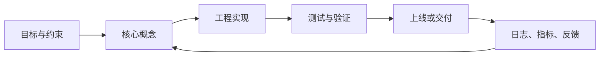

# PowerShell 指令完整学习笔记

<!-- lecture-notes:integrated-v2 -->

## 讲义导读：把概念落到可验证实践

这一章讲的是 **PowerShell 指令完整学习笔记**，属于 **命令行、容器与自动化**。阅读时不要把它当成零散资料堆叠，而要把它当成一份讲义：先弄清它解决什么问题，再看核心概念和流程，最后做一个能复现、能观察、能排错的小练习。

### 一句话先懂

命令行、容器和 CI/CD 的重点，是把人工步骤变成可重复、可审计、可回滚的自动化流程。

初学时先问三个问题：它的输入或前提是什么；它内部按什么规则工作；结果该用什么命令、日志、测试、图纸、波形或指标来证明。

### 通俗类比

自动化像标准化生产线：脚本是操作规程，容器是统一工位，CI/CD 是质检和发货流程，日志是追溯单。

类比只是入门扶手。真正掌握时，要回到准确术语、配置、接口、版本、边界条件、错误信息和验证证据上。能解释失败原因，比只会照着步骤跑通更重要。

### 本章学习主线

1. **先看场景**：这个知识点通常在什么项目、岗位或问题里出现？
2. **再看结构**：它有哪些核心对象、配置、文件、命令、接口或流程？
3. **然后看路径**：一次完整使用从哪里开始，到哪里结束，中间有哪些状态变化？
4. **接着看边界**：版本差异、平台差异、权限、性能、安全、兼容性和资源限制在哪里？
5. **最后看验证**：用最小样例、测试、日志、调试工具或实物结果证明理解是对的。

### 本章重点抓手

Shell/PowerShell/CMD、环境变量、文件权限、进程、Dockerfile、镜像、容器、网络、卷、流水线、缓存、密钥和发布策略。

### 最小实践任务

为一个小项目写 Dockerfile 和 CI 流水线：安装依赖、运行测试、构建镜像、扫描基本问题并输出版本产物。

建议把练习记录成固定格式：目标、环境版本、最小示例、执行步骤、预期结果、实际结果、错误信息、定位过程和复盘。以后遇到真实项目问题时，这些记录会比单纯收藏教程更有用。

### 常见误区

- 本机能跑就认为环境可靠。
- 把密钥写进镜像或日志。
- 流水线失败只重跑，不分析缓存、权限和依赖版本。

### 推荐工具与资料

官方文档、最小 demo、日志、调试器、版本管理、测试命令、性能/诊断工具和复盘记录。

### 读完本章应该能做到

- 用自己的话解释核心概念和适用场景。
- 给出一个最小可运行或可验证样例。
- 说清至少一个常见错误的现象、原因和排查路径。
- 知道当前版本应该查哪份官方文档，而不是只依赖旧教程。

> 本节是讲义化改写后的阅读入口。后续正文中的命令、配置、图纸、代码和参考资料，都应围绕“场景 -> 概念 -> 操作 -> 验证 -> 复盘”来理解。


> 适合对象：Windows 用户、后端开发、测试、运维、DevOps、系统管理员，以及需要掌握现代 Windows 自动化、对象管道、脚本、服务管理、网络排查和结构化数据处理的人。
PowerShell 是 Microsoft 开发的现代命令行 Shell 和脚本语言。它不同于 CMD 的纯文本管道，PowerShell 管道传递的是对象，因此非常适合系统管理、自动化运维、批量处理、JSON/CSV/XML 数据操作、注册表管理、服务管理、远程执行和跨平台脚本。

如果你只把 PowerShell 当成能运行 `dir`、`cd`、`type` 的窗口，就没有理解它的核心。真正掌握 PowerShell，需要理解：cmdlet 命名规则、对象管道、属性筛选、别名、变量、环境变量、Provider、脚本执行策略、参数绑定、函数、模块、错误处理、远程管理、JSON/CSV 处理和管理员权限。

版本说明：Windows 系统内置 Windows PowerShell 5.1，对应 `powershell.exe`；现代 PowerShell 7.x 对应 `pwsh.exe`，跨平台且持续更新。新脚本建议优先考虑 PowerShell 7，但如果脚本要在默认 Windows 环境运行，需要注意 5.1 与 7.x 的差异。

## 目录

1. PowerShell 是什么
2. Windows PowerShell 与 PowerShell 7
3. 启动和管理员权限
4. 获取帮助
5. Cmdlet 命名规则
6. 别名 Alias
7. 文件和目录命令
8. 查看和搜索文件内容
9. 复制、移动、删除和重命名
10. 对象管道
11. Where-Object、Select-Object、Sort-Object
12. Format 命令
13. 变量和数据类型
14. 环境变量
15. 字符串和数组
16. 哈希表
17. 条件和循环
18. 函数和参数
19. 脚本文件 ps1
20. 执行策略
21. 错误处理
22. 进程管理
23. 服务管理
24. 网络命令
25. 注册表和 Provider
26. JSON、CSV、XML
27. 作业、后台任务和并行
28. 模块管理
29. 远程管理
30. 常见排查场景
31. 安全和最佳实践
32. PowerShell 命令速查表
33. 推荐参考资料

## 1. PowerShell 是什么

PowerShell 是：

- 命令行 Shell
- 脚本语言
- 自动化平台
- 对象管道工具
- 系统管理工具

它的核心特点：

```text
管道传递对象，而不是字符串。
```

示例：

```powershell
Get-Process | Where-Object CPU -gt 10 | Sort-Object CPU -Descending
```

这条命令传递的是进程对象，每个对象有：

- Name
- Id
- CPU
- Path
- StartTime

等属性。

## 2. Windows PowerShell 与 PowerShell 7

| 名称 | 命令 | 说明 |
| :--- | :--- | :--- |
| Windows PowerShell | `powershell.exe` | Windows 内置，通常是 5.1 |
| PowerShell 7+ | `pwsh.exe` | 跨平台，需单独安装 |

### 2.1 查看版本

```powershell
$PSVersionTable
```

### 2.2 选择建议

本机现代开发：

```text
优先 PowerShell 7
```

兼容默认 Windows：

```text
注意 Windows PowerShell 5.1
```

## 3. 启动和管理员权限

### 3.1 启动 PowerShell

Windows PowerShell：

```text
powershell
```

PowerShell 7：

```text
pwsh
```

### 3.2 管理员权限

右键：

```text
以管理员身份运行
```

很多命令需要管理员权限：

- 修改服务
- 修改系统目录
- 修改注册表系统区域
- 设置执行策略
- 管理防火墙

### 3.3 判断是否管理员

```powershell
([Security.Principal.WindowsPrincipal] [Security.Principal.WindowsIdentity]::GetCurrent()).IsInRole(
    [Security.Principal.WindowsBuiltInRole]::Administrator
)
```

## 4. 获取帮助

### 4.1 Get-Help

```powershell
Get-Help Get-ChildItem
Get-Help Get-ChildItem -Examples
Get-Help Get-ChildItem -Full
```

### 4.2 更新帮助

```powershell
Update-Help
```

可能需要管理员权限。

### 4.3 Get-Command

```powershell
Get-Command Get-ChildItem
Get-Command *Process*
Get-Command -Verb Get
Get-Command -Noun Service
```

### 4.4 Get-Member

查看对象属性和方法：

```powershell
Get-Process | Get-Member
```

这是学习 PowerShell 对象管道的关键命令。

## 5. Cmdlet 命名规则

PowerShell 命令通常是：

```text
Verb-Noun
```

示例：

```powershell
Get-ChildItem
Set-Location
Copy-Item
Remove-Item
Get-Process
Stop-Service
Invoke-WebRequest
ConvertFrom-Json
```

### 5.1 常见动词

| 动词 | 含义 |
| :--- | :--- |
| `Get` | 获取 |
| `Set` | 设置 |
| `New` | 新建 |
| `Remove` | 删除 |
| `Copy` | 复制 |
| `Move` | 移动 |
| `Start` | 启动 |
| `Stop` | 停止 |
| `Restart` | 重启 |
| `Test` | 测试 |
| `Invoke` | 调用 |
| `ConvertTo` | 转换为 |
| `ConvertFrom` | 从某格式转换 |

## 6. 别名 Alias

### 6.1 常见别名

```powershell
ls
dir
cd
pwd
cat
type
rm
cp
mv
```

### 6.2 查看别名

```powershell
Get-Alias ls
Get-Alias dir
```

### 6.3 脚本中少用别名

交互中可以用：

```powershell
ls
```

脚本中推荐：

```powershell
Get-ChildItem
```

原因：

- 可读性更好
- 跨平台更可靠
- 避免别名冲突

## 7. 文件和目录命令

### 7.1 Get-Location

```powershell
Get-Location
pwd
```

### 7.2 Set-Location

```powershell
Set-Location C:\Users
Set-Location D:\Projects
cd D:\Projects
```

### 7.3 Get-ChildItem

```powershell
Get-ChildItem
Get-ChildItem -Force
Get-ChildItem -Recurse
Get-ChildItem -Filter *.log
Get-ChildItem -File
Get-ChildItem -Directory
```

### 7.4 New-Item

新建文件：

```powershell
New-Item -ItemType File -Path .\app.log
```

新建目录：

```powershell
New-Item -ItemType Directory -Path .\logs
```

### 7.5 Test-Path

```powershell
Test-Path .\app.log
Test-Path C:\Windows
```

## 8. 查看和搜索文件内容

### 8.1 Get-Content

```powershell
Get-Content .\app.log
Get-Content .\app.log -Tail 100
Get-Content .\app.log -Wait
```

### 8.2 Set-Content

覆盖写入：

```powershell
Set-Content -Path .\file.txt -Value "hello"
```

### 8.3 Add-Content

追加：

```powershell
Add-Content -Path .\file.txt -Value "world"
```

### 8.4 Select-String

```powershell
Select-String -Path .\app.log -Pattern "error"
```

递归搜索：

```powershell
Get-ChildItem -Recurse -Filter *.log | Select-String -Pattern "error"
```

显示上下文：

```powershell
Select-String -Path .\app.log -Pattern "error" -Context 2,2
```

## 9. 复制、移动、删除和重命名

### 9.1 Copy-Item

```powershell
Copy-Item .\a.txt .\b.txt
Copy-Item .\src .\backup -Recurse
```

### 9.2 Move-Item

```powershell
Move-Item .\file.txt D:\Backup\
Move-Item .\old.txt .\new.txt
```

### 9.3 Remove-Item

```powershell
Remove-Item .\file.txt
Remove-Item .\logs -Recurse
Remove-Item .\logs -Recurse -Force
```

预演：

```powershell
Remove-Item .\logs -Recurse -WhatIf
```

### 9.4 Rename-Item

```powershell
Rename-Item .\old.txt new.txt
```

### 9.5 LiteralPath

路径包含 `[`、`]` 等通配符字符时：

```powershell
Remove-Item -LiteralPath ".\file[1].txt"
```

## 10. 对象管道

CMD 管道传文本，PowerShell 管道传对象。

示例：

```powershell
Get-Process | Where-Object CPU -gt 10
```

这里 `Where-Object` 处理的是进程对象。

查看对象成员：

```powershell
Get-Process | Get-Member
```

查看属性：

```powershell
Get-Process | Select-Object Name, Id, CPU
```

## 11. Where-Object、Select-Object、Sort-Object

### 11.1 Where-Object

```powershell
Get-Process | Where-Object CPU -gt 10
```

完整写法：

```powershell
Get-Process | Where-Object { $_.CPU -gt 10 }
```

### 11.2 Select-Object

```powershell
Get-Process | Select-Object Name, Id, CPU
Get-Process | Select-Object -First 5
```

### 11.3 Sort-Object

```powershell
Get-Process | Sort-Object CPU -Descending
```

### 11.4 Measure-Object

```powershell
Get-ChildItem | Measure-Object
Get-Process | Measure-Object CPU -Sum
```

## 12. Format 命令

### 12.1 Format-Table

```powershell
Get-Process | Format-Table Name, Id, CPU
```

### 12.2 Format-List

```powershell
Get-Process -Name pwsh | Format-List *
```

### 12.3 注意

`Format-*` 用于最终显示，不要在管道中间使用。

不推荐：

```powershell
Get-Process | Format-Table | Where-Object Name -eq "pwsh"
```

因为格式化后已经不是原始对象。

## 13. 变量和数据类型

### 13.1 变量

```powershell
$name = "Alice"
$age = 18
```

### 13.2 输出变量

```powershell
Write-Output $name
"Hello $name"
```

### 13.3 类型

```powershell
[string]$name = "Alice"
[int]$age = 18
[bool]$enabled = $true
```

### 13.4 查看类型

```powershell
$name.GetType()
```

## 14. 环境变量

### 14.1 查看

```powershell
$env:PATH
$env:USERPROFILE
$env:TEMP
```

### 14.2 设置当前会话变量

```powershell
$env:APP_ENV = "dev"
```

### 14.3 查看所有环境变量

```powershell
Get-ChildItem Env:
```

### 14.4 持久环境变量

用户级：

```powershell
[Environment]::SetEnvironmentVariable("APP_ENV", "dev", "User")
```

机器级：

```powershell
[Environment]::SetEnvironmentVariable("APP_ENV", "prod", "Machine")
```

机器级通常需要管理员权限。

## 15. 字符串和数组

### 15.1 字符串插值

```powershell
$name = "Alice"
"Hello $name"
```

### 15.2 单引号不插值

```powershell
'Hello $name'
```

输出字面量。

### 15.3 数组

```powershell
$items = @("a", "b", "c")
$items[0]
```

### 15.4 遍历数组

```powershell
foreach ($item in $items) {
    $item
}
```

## 16. 哈希表

### 16.1 定义

```powershell
$user = @{
    Name = "Alice"
    Age = 18
}
```

### 16.2 访问

```powershell
$user["Name"]
$user.Name
```

### 16.3 用作参数 splatting

```powershell
$params = @{
    Path = ".\logs"
    Recurse = $true
    Force = $true
}

Remove-Item @params
```

## 17. 条件和循环

### 17.1 if

```powershell
if (Test-Path .\app.log) {
    "exists"
} else {
    "missing"
}
```

### 17.2 switch

```powershell
switch ($env:APP_ENV) {
    "dev" { "development" }
    "prod" { "production" }
    default { "unknown" }
}
```

### 17.3 foreach

```powershell
foreach ($file in Get-ChildItem *.log) {
    $file.FullName
}
```

### 17.4 for

```powershell
for ($i = 0; $i -lt 5; $i++) {
    $i
}
```

### 17.5 while

```powershell
while ($true) {
    Get-Date
    Start-Sleep -Seconds 1
}
```

## 18. 函数和参数

### 18.1 基本函数

```powershell
function Get-Greeting {
    param(
        [string]$Name
    )

    "Hello $Name"
}

Get-Greeting -Name "Alice"
```

### 18.2 必填参数

```powershell
function Remove-LogFile {
    param(
        [Parameter(Mandatory)]
        [string]$Path
    )

    Remove-Item -Path $Path
}
```

### 18.3 高级函数

```powershell
function Get-OldLog {
    [CmdletBinding()]
    param(
        [Parameter(Mandatory)]
        [string]$Path,

        [int]$Days = 7
    )

    Get-ChildItem -Path $Path -Filter *.log |
        Where-Object LastWriteTime -lt (Get-Date).AddDays(-$Days)
}
```

## 19. 脚本文件 ps1

### 19.1 hello.ps1

```powershell
param(
    [string]$Name = "World"
)

Write-Output "Hello $Name"
```

运行：

```powershell
.\hello.ps1 -Name Alice
```

### 19.2 脚本路径

当前脚本目录：

```powershell
$PSScriptRoot
```

当前脚本文件：

```powershell
$PSCommandPath
```

## 20. 执行策略

### 20.1 查看

```powershell
Get-ExecutionPolicy
Get-ExecutionPolicy -List
```

### 20.2 设置当前用户

```powershell
Set-ExecutionPolicy -Scope CurrentUser RemoteSigned
```

### 20.3 临时绕过

```powershell
powershell -ExecutionPolicy Bypass -File .\script.ps1
```

或 PowerShell 7：

```powershell
pwsh -ExecutionPolicy Bypass -File .\script.ps1
```

### 20.4 注意

执行策略不是安全边界。不要运行不可信脚本。

## 21. 错误处理

### 21.1 try/catch

```powershell
try {
    Remove-Item .\missing.txt -ErrorAction Stop
} catch {
    Write-Error "删除失败: $_"
}
```

### 21.2 ErrorAction

```powershell
Get-Item .\missing.txt -ErrorAction SilentlyContinue
Get-Item .\missing.txt -ErrorAction Stop
```

### 21.3 $Error

```powershell
$Error[0]
```

### 21.4 退出码

```powershell
exit 1
```

外部命令退出码：

```powershell
$LASTEXITCODE
```

## 22. 进程管理

### 22.1 Get-Process

```powershell
Get-Process
Get-Process -Name notepad
Get-Process | Sort-Object CPU -Descending | Select-Object -First 10
```

### 22.2 Start-Process

```powershell
Start-Process notepad.exe
Start-Process powershell -Verb RunAs
```

`-Verb RunAs` 以管理员方式启动。

### 22.3 Stop-Process

```powershell
Stop-Process -Id 1234
Stop-Process -Name notepad -Force
```

## 23. 服务管理

### 23.1 Get-Service

```powershell
Get-Service
Get-Service -Name wuauserv
Get-Service | Where-Object Status -eq Running
```

### 23.2 Start-Service

```powershell
Start-Service -Name wuauserv
```

### 23.3 Stop-Service

```powershell
Stop-Service -Name wuauserv
```

### 23.4 Restart-Service

```powershell
Restart-Service -Name wuauserv
```

通常需要管理员权限。

## 24. 网络命令

### 24.1 Test-Connection

```powershell
Test-Connection example.com
Test-Connection example.com -Count 4
```

### 24.2 Test-NetConnection

```powershell
Test-NetConnection example.com -Port 443
Test-NetConnection localhost -Port 8080
```

### 24.3 Invoke-WebRequest

```powershell
Invoke-WebRequest https://example.com
Invoke-WebRequest https://example.com/file.zip -OutFile file.zip
```

### 24.4 Invoke-RestMethod

```powershell
Invoke-RestMethod https://api.example.com/users
```

### 24.5 Get-NetIPAddress

```powershell
Get-NetIPAddress
```

### 24.6 Get-NetTCPConnection

```powershell
Get-NetTCPConnection
Get-NetTCPConnection -LocalPort 8080
```

## 25. 注册表和 Provider

PowerShell Provider 把不同资源暴露成类似文件系统的路径。

### 25.1 查看 Provider

```powershell
Get-PSProvider
```

### 25.2 注册表路径

```powershell
Get-ChildItem HKCU:\Software
Get-ChildItem HKLM:\Software
```

### 25.3 读取注册表属性

```powershell
Get-ItemProperty HKLM:\Software\Microsoft\Windows\CurrentVersion
```

### 25.4 写注册表

```powershell
New-Item -Path HKCU:\Software\Demo -Force
New-ItemProperty -Path HKCU:\Software\Demo -Name Name -Value Value -PropertyType String
```

修改注册表前确认影响。

## 26. JSON、CSV、XML

### 26.1 JSON

```powershell
$json = Get-Content .\config.json -Raw | ConvertFrom-Json
$json.name
```

转 JSON：

```powershell
Get-Process | Select-Object -First 3 Name, Id | ConvertTo-Json
```

### 26.2 CSV

导出：

```powershell
Get-Process | Select-Object Name, Id, CPU |
    Export-Csv .\process.csv -NoTypeInformation
```

导入：

```powershell
Import-Csv .\process.csv
```

### 26.3 XML

```powershell
[xml]$xml = Get-Content .\config.xml
```

## 27. 作业、后台任务和并行

### 27.1 Start-Job

```powershell
$job = Start-Job -ScriptBlock { Get-Process }
Receive-Job $job
Remove-Job $job
```

### 27.2 ForEach-Object -Parallel

PowerShell 7 支持：

```powershell
1..5 | ForEach-Object -Parallel {
    "Item $_"
}
```

### 27.3 Start-ThreadJob

需要模块支持时可使用 ThreadJob。

## 28. 模块管理

### 28.1 查看模块

```powershell
Get-Module
Get-Module -ListAvailable
```

### 28.2 导入模块

```powershell
Import-Module ModuleName
```

### 28.3 安装模块

```powershell
Install-Module ModuleName -Scope CurrentUser
```

### 28.4 更新模块

```powershell
Update-Module ModuleName
```

## 29. 远程管理

### 29.1 Enter-PSSession

```powershell
Enter-PSSession -ComputerName server01
```

### 29.2 Invoke-Command

```powershell
Invoke-Command -ComputerName server01 -ScriptBlock {
    Get-Service
}
```

### 29.3 注意

PowerShell 远程管理涉及 WinRM、权限、认证、防火墙和安全策略，需要按企业规范配置。

## 30. 常见排查场景

### 30.1 端口占用

```powershell
Get-NetTCPConnection -LocalPort 8080
Get-Process -Id <PID>
```

### 30.2 杀进程

```powershell
Stop-Process -Id 1234 -Force
```

### 30.3 搜索文件

```powershell
Get-ChildItem -Recurse -Filter *.log
```

### 30.4 搜索日志

```powershell
Select-String -Path .\app.log -Pattern "error"
```

### 30.5 查看大文件

```powershell
Get-ChildItem -Recurse |
    Sort-Object Length -Descending |
    Select-Object -First 20 FullName, Length
```

### 30.6 查看系统信息

```powershell
Get-ComputerInfo
```

## 31. 安全和最佳实践

1. 脚本中使用完整 cmdlet，不依赖别名。
2. 删除前使用 `-WhatIf` 预演。
3. 路径可能包含特殊字符时使用 `-LiteralPath`。
4. 处理错误时使用 `-ErrorAction Stop` 配合 try/catch。
5. 不运行不可信 `.ps1`。
6. 不在脚本中明文写密码和 token。
7. 管理员权限只在必要时使用。
8. 管道中间不要使用 `Format-*`。
9. 结构化数据优先用对象、JSON、CSV，不要硬解析文本。
10. 新脚本优先考虑 PowerShell 7，但要确认运行环境。

## 32. PowerShell 命令速查表

### 32.1 帮助

```powershell
Get-Help Get-ChildItem
Get-Command *Process*
Get-Member
Update-Help
```

### 32.2 文件目录

```powershell
Get-Location
Set-Location D:\Projects
Get-ChildItem -Force
Get-ChildItem -Recurse -Filter *.log
New-Item -ItemType Directory logs
Test-Path .\app.log
Copy-Item .\src .\backup -Recurse
Move-Item .\old.txt .\new.txt
Remove-Item .\logs -Recurse -Force
Rename-Item .\old.txt new.txt
```

### 32.3 内容搜索

```powershell
Get-Content .\app.log
Get-Content .\app.log -Tail 100 -Wait
Set-Content .\file.txt "hello"
Add-Content .\file.txt "world"
Select-String -Path .\app.log -Pattern "error"
```

### 32.4 对象管道

```powershell
Get-Process | Where-Object CPU -gt 10
Get-Process | Sort-Object CPU -Descending
Get-Process | Select-Object Name, Id, CPU
Get-Process | Measure-Object CPU -Sum
```

### 32.5 进程服务

```powershell
Get-Process
Start-Process notepad
Stop-Process -Id 1234 -Force
Get-Service
Start-Service -Name serviceName
Stop-Service -Name serviceName
Restart-Service -Name serviceName
```

### 32.6 网络

```powershell
Test-Connection example.com
Test-NetConnection example.com -Port 443
Invoke-WebRequest https://example.com -OutFile file.html
Invoke-RestMethod https://api.example.com
Get-NetIPAddress
Get-NetTCPConnection -LocalPort 8080
```

### 32.7 数据格式

```powershell
ConvertFrom-Json
ConvertTo-Json
Import-Csv
Export-Csv
```

## 33. 推荐参考资料

- [PowerShell Documentation](https://learn.microsoft.com/en-us/powershell/)
- [PowerShell 7.5 Reference](https://learn.microsoft.com/en-us/powershell/module/?view=powershell-7.5)
- [about_Core_Commands](https://learn.microsoft.com/en-us/powershell/module/microsoft.powershell.core/about/about_core_commands)
- [about_Pipelines](https://learn.microsoft.com/en-us/powershell/module/microsoft.powershell.core/about/about_pipelines)
- [about_Objects](https://learn.microsoft.com/en-us/powershell/module/microsoft.powershell.core/about/about_objects)
- [about_Execution_Policies](https://learn.microsoft.com/en-us/powershell/module/microsoft.powershell.core/about/about_execution_policies)
- [Get-ChildItem](https://learn.microsoft.com/en-us/powershell/module/microsoft.powershell.management/get-childitem)
- [Select-String](https://learn.microsoft.com/en-us/powershell/module/microsoft.powershell.utility/select-string)

## 最后总结

PowerShell 的核心可以浓缩为：

```text
Get 获取对象
Set 修改状态
New 创建资源
Remove 删除资源
管道传对象
Where 过滤
Select 选择属性
Sort 排序
Format 最终显示
Convert 处理结构化数据
```

PowerShell 比 CMD 更适合现代自动化，因为它处理的是对象，不需要大量脆弱的文本解析。当你能解释 `Get-Process | Where-Object CPU -gt 10` 为什么比 `tasklist | find` 更强、`Format-Table` 为什么不该放在管道中间、`$env:PATH` 和普通变量的区别、`-WhatIf` 和 `-LiteralPath` 的用途时，就已经真正入门 PowerShell。

## 34. 2026-06 深化补充：把 PowerShell 当对象自动化平台

Microsoft 文档将 PowerShell 定义为跨平台任务自动化方案，由命令行 shell、脚本语言和配置管理框架组成；它的关键差异是管道传递 .NET 对象，而不是普通文本。因此学习 PowerShell 时，要优先学习“对象、属性、方法、类型、参数绑定”，而不是只背命令别名。

### 34.1 日常排查固定套路

```powershell
Get-Command <name>
Get-Help <name> -Full
Get-Help <name> -Examples
<command> | Get-Member
<command> | Select-Object -First 5 *
```

解释一个陌生命令时，先问四件事：

1. 它输出什么对象类型？
2. 关键属性有哪些？
3. 参数是否支持管道输入？
4. 失败时抛出终止错误还是非终止错误？

### 34.2 脚本模板

```powershell
[CmdletBinding(SupportsShouldProcess)]
param(
    [Parameter(Mandatory)]
    [string]$Path,

    [switch]$Force
)

Set-StrictMode -Version Latest
$ErrorActionPreference = 'Stop'

try {
    $resolved = Resolve-Path -LiteralPath $Path
    if ($PSCmdlet.ShouldProcess($resolved, 'Process target')) {
        # 执行实际操作
    }
}
catch {
    Write-Error -ErrorRecord $_
    exit 1
}
```

这个模板适合文件批处理、运维脚本和 CI 脚本。`SupportsShouldProcess` 可以配合 `-WhatIf`，在破坏性操作前预演。

### 34.3 Windows PowerShell 5.1 与 PowerShell 7 的实践差异

| 维度 | Windows PowerShell 5.1 | PowerShell 7+ |
| --- | --- | --- |
| 命令 | `powershell.exe` | `pwsh.exe` |
| 平台 | Windows 内置 | Windows/Linux/macOS |
| 运行时 | .NET Framework | .NET |
| 默认场景 | 传统 Windows 管理、老模块 | 新脚本、跨平台、CI |
| 注意点 | 编码和 TLS 默认值较旧 | 少数 Windows 专用模块需兼容验证 |

团队脚本应在文件头或 README 中写清楚目标运行时，例如“需要 PowerShell 7.4+”或“兼容 Windows PowerShell 5.1”。

### 34.4 安全操作文件的原则

- 用 `-LiteralPath` 处理用户输入路径，避免通配符被意外展开。
- 删除前先 `Resolve-Path` 并检查目标是否在预期目录下。
- 批量操作前支持 `-WhatIf`。
- 不把路径拼接成字符串再交给另一个 shell 执行。
- 解析 JSON/CSV/XML 时用 `ConvertFrom-*`，不要手写字符串切割。

## 35. 补充参考资料

- [Microsoft Learn - What is PowerShell](https://learn.microsoft.com/en-us/powershell/scripting/overview)
- [about_Pipelines](https://learn.microsoft.com/en-us/powershell/module/microsoft.powershell.core/about/about_pipelines)
- [about_Functions_Advanced](https://learn.microsoft.com/en-us/powershell/module/microsoft.powershell.core/about/about_functions_advanced)
- [about_CommonParameters](https://learn.microsoft.com/en-us/powershell/module/microsoft.powershell.core/about/about_commonparameters)
- [PowerShell GitHub Releases](https://github.com/PowerShell/PowerShell/releases)

## 2026-06 深化整理：PowerShell 的工程化学习框架

Last researched: 2026-06-16

### 1. 学习定位

PowerShell 这类知识不适合只按“概念清单”记忆，更适合按可交付能力组织。本文后续复习时，应围绕这条主线展开：对象管道、cmdlet、模块、脚本策略、远程管理、错误处理和与 CMD/Bash 的差异。如果只会照抄命令、配置或示例，而不能解释输入、输出、边界、失败模式和验证方法，知识在真实项目里会很快失效。

一份万字级笔记要承担三个作用：第一，建立准确概念，避免把相似术语混在一起；第二，形成可执行流程，知道从零搭建、调试和交付的顺序；第三，沉淀排错经验，遇到异常时能按证据定位，而不是凭感觉改配置。学习时建议把每个小节都对应到“是什么、为什么、怎么做、什么时候不用、出了问题怎么查”五个问题。

### 2. 核心模块

- PowerShell 管道传对象而不是纯文本
- cmdlet 命名遵循 Verb-Noun
- 模块是功能分发单位
- 错误分 terminating 和 non-terminating
- 跨平台 PowerShell 7 与 Windows PowerShell 需区分

这些模块之间不是孤立关系。通常先有需求和约束，再选择架构或工具；工具落地后会产生配置、接口、状态和制品；运行阶段再通过日志、指标、测试和回滚机制验证结果。真正掌握本主题，意味着能从一次失败现象反推到是哪一层出了问题。



Figure: 通用学习与工程闭环，结合官方文档、标准资料和社区实践重新整理。

### 3. 实践路线

建议按四轮学习。第一轮只跑通最小例子，不追求复杂度；第二轮补齐关键概念，明确每个配置项和命令的作用；第三轮做故障注入，主动制造常见错误并记录现象；第四轮整理成项目模板，把目录结构、命名规范、检查清单和参考链接固化下来。

对技术笔记而言，最小例子必须可重复。命令类主题要记录操作系统、Shell、权限、工作目录和返回码；框架类主题要记录版本、依赖、构建命令、目录结构和运行入口；工程设计类主题要记录标准依据、图纸、点表、验收项和变更记录。没有环境信息的示例，后续很难判断是知识错误、版本差异还是本机配置问题。

### 4. 常见错误

- 把对象管道当字符串处理
- 忽略 -WhatIf 和 -Confirm
- 未使用 -LiteralPath 处理特殊路径
- 错误处理只看 $? 
- 执行策略当成安全边界

排查时先收集事实：版本、配置、输入、输出、日志、错误码、时间点、复现步骤。不要一开始就改多个参数。一次只改一个变量，并记录改动前后的现象。对于涉及安全、权限、部署、数据库、电气或工业控制的主题，要优先查官方文档和标准，社区文章只能作为实践参考，不能作为唯一依据。

### 5. 笔记维护建议

后续更新这篇文档时，建议保留 `Last researched` 日期，并把新增内容放到“版本差异”“实践坑”“调试清单”“参考资料”中。对于快速变化的工具链，例如 Android、Gradle、Docker、CI/CD、Redis、uv、Qt 和前端标准，至少在重新实践前核对一次官方文档。对于工业、电气、PLC、RBAC 这类涉及安全、权限或标准的内容，应明确标准编号、适用地区、适用版本和项目约束。

## 2026 综合技术资料与实践核对补充

这一组笔记主题较散，建议按“官方文档 + 最小样例 + 版本记录”三层核对。

- **官方来源**：Docker、CMake、Gradle、Maven、Redis、uv、Qt、Android、Material、MDN、Microsoft Learn、GNU Bash、PostgreSQL、NIST RBAC 等内容都应优先查对应官方文档。
- **版本记录**：Docker 查 Docker Docs，Shell 查 GNU Bash，PowerShell/CMD 查 Microsoft Learn，CI/CD 还要查所用平台官方文档。 学习笔记里涉及命令、配置、API、硬件型号或工具行为时，最好写清工具版本、系统环境和验证日期。
- **最小实践**：每个主题至少保留一个能复现的最小样例，包含输入、步骤、输出和错误排查。
- **工程意识**：不要只记“怎么用”，还要记录为什么这样用、边界条件是什么、换版本或换平台会不会失效。

参考资料入口：

- Docker Docs：https://docs.docker.com/
- CMake Documentation：https://cmake.org/documentation/
- Gradle User Manual：https://docs.gradle.org/current/userguide/userguide.html
- Apache Maven Documentation：https://maven.apache.org/guides/
- MDN Web Docs：https://developer.mozilla.org/
- Redis Docs：https://redis.io/docs/latest/
- uv Documentation：https://docs.astral.sh/uv/
- Qt Documentation：https://doc.qt.io/
- Android Developers：https://developer.android.com/
- Material Design：https://m3.material.io/
- Microsoft Learn PowerShell：https://learn.microsoft.com/powershell/
- Microsoft Windows Commands：https://learn.microsoft.com/windows-server/administration/windows-commands/windows-commands
- GNU Bash Manual：https://www.gnu.org/software/bash/manual/
- PostgreSQL Documentation：https://www.postgresql.org/docs/
- NIST RBAC Library：https://csrc.nist.gov/projects/role-based-access-control/rbac-library

## References and further reading

- [Official] [PowerShell Documentation](https://learn.microsoft.com/en-us/powershell/)
- [Official] [about_Pipelines](https://learn.microsoft.com/en-us/powershell/module/microsoft.powershell.core/about/about_pipelines)
- [Official] [about_Try_Catch_Finally](https://learn.microsoft.com/en-us/powershell/module/microsoft.powershell.core/about/about_try_catch_finally)
- [Official] [MDN Web Docs](https://developer.mozilla.org/)
- [Official] [Microsoft Learn](https://learn.microsoft.com/)
- [Official] [Docker Docs](https://docs.docker.com/)
- [Official] [GitHub Actions documentation](https://docs.github.com/actions)
- [Official] [GitLab CI/CD documentation](https://docs.gitlab.com/ci/)
- [Official] [CMake Documentation](https://cmake.org/cmake/help/latest/)
- [Official] [Gradle User Manual](https://docs.gradle.org/)
- [Official] [Apache Maven Guides](https://maven.apache.org/guides/)
- [Official] [Redis Documentation](https://redis.io/docs/latest/)
- [Official] [Qt Documentation](https://doc.qt.io/qt-6/)
- [Course] [MIT 6.006 Introduction to Algorithms](https://ocw.mit.edu/courses/6-006-introduction-to-algorithms-spring-2020/)
