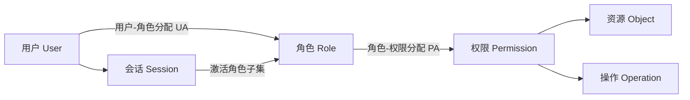
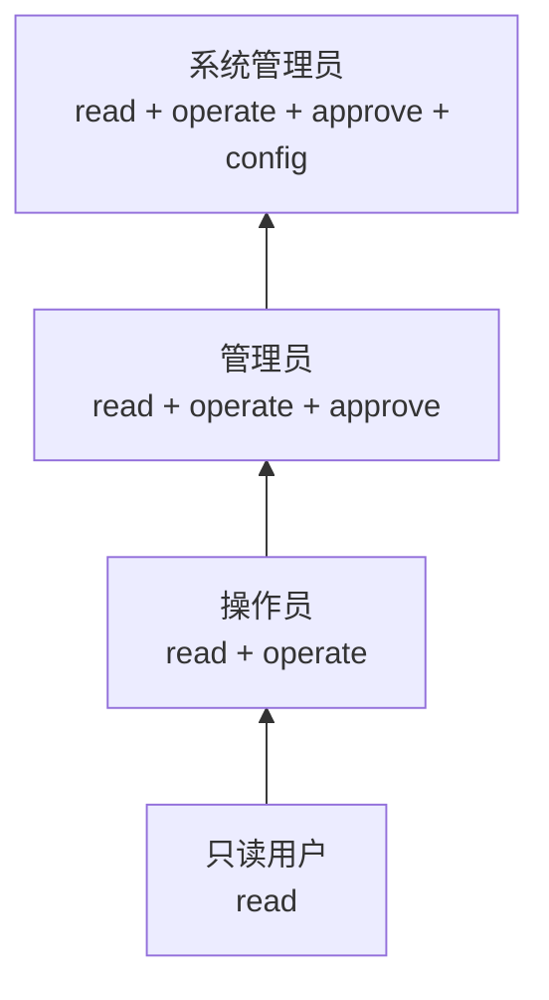
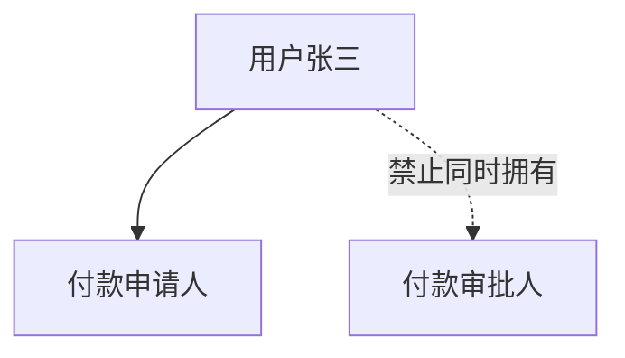
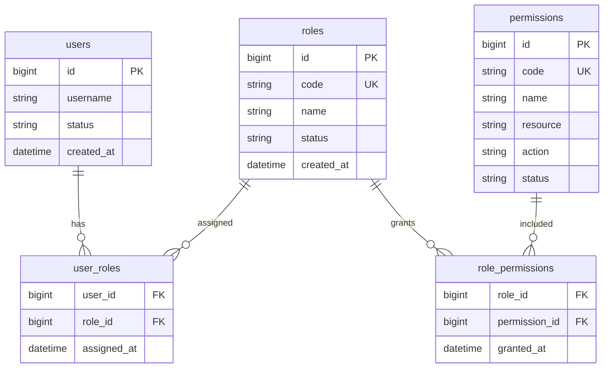
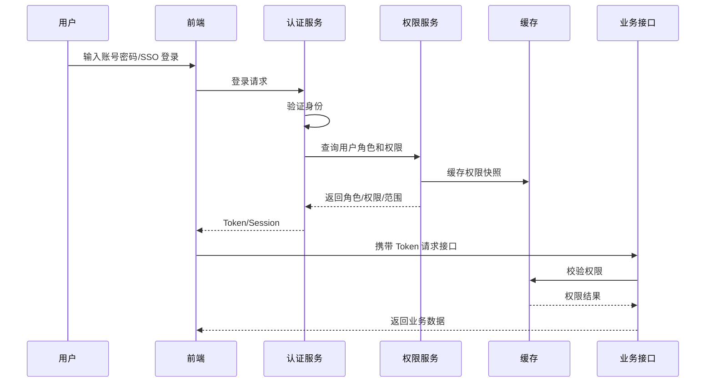
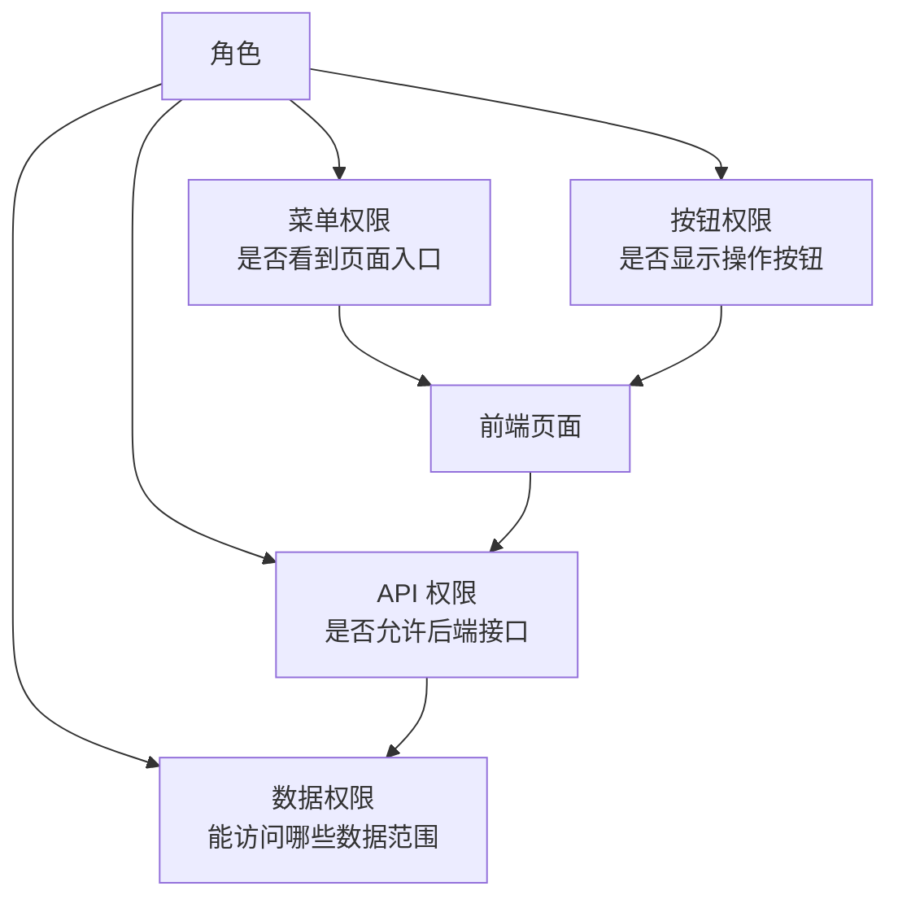
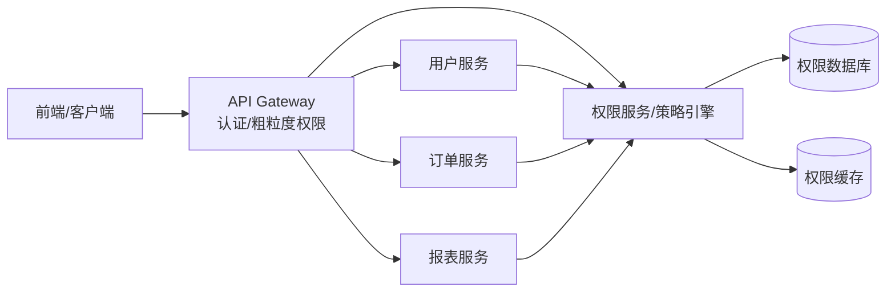
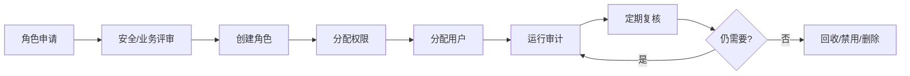

# RBAC 完整学习笔记

<!-- lecture-notes:integrated-v2 -->

## 讲义导读：把概念落到可验证实践

这一章讲的是 **RBAC 完整学习笔记**，属于 **数据、缓存、权限与性能**。阅读时不要把它当成零散资料堆叠，而要把它当成一份讲义：先弄清它解决什么问题，再看核心概念和流程，最后做一个能复现、能观察、能排错的小练习。

### 一句话先懂

数据系统学习的重点，是在正确性、性能、可扩展性和安全边界之间做可验证的取舍。

初学时先问三个问题：它的输入或前提是什么；它内部按什么规则工作；结果该用什么命令、日志、测试、图纸、波形或指标来证明。

### 通俗类比

数据库像账本，缓存像常用摘要，权限像门禁，性能优化像疏通堵点；任何一个环节快但不可信，系统都会出问题。

类比只是入门扶手。真正掌握时，要回到准确术语、配置、接口、版本、边界条件、错误信息和验证证据上。能解释失败原因，比只会照着步骤跑通更重要。

### 本章学习主线

1. **先看场景**：这个知识点通常在什么项目、岗位或问题里出现？
2. **再看结构**：它有哪些核心对象、配置、文件、命令、接口或流程？
3. **然后看路径**：一次完整使用从哪里开始，到哪里结束，中间有哪些状态变化？
4. **接着看边界**：版本差异、平台差异、权限、性能、安全、兼容性和资源限制在哪里？
5. **最后看验证**：用最小样例、测试、日志、调试工具或实物结果证明理解是对的。

### 本章重点抓手

关系模型、事务、索引、查询计划、缓存策略、一致性、锁、并发、RBAC、审计、性能指标和故障恢复。

### 最小实践任务

设计一个小业务表和缓存方案，写出权限角色、关键 SQL、索引、缓存失效规则和压测/解释计划。

建议把练习记录成固定格式：目标、环境版本、最小示例、执行步骤、预期结果、实际结果、错误信息、定位过程和复盘。以后遇到真实项目问题时，这些记录会比单纯收藏教程更有用。

### 常见误区

- 缓存命中就以为数据一定正确。
- 权限只在前端控制。
- 没有事务边界和索引解释就谈性能。

### 推荐工具与资料

官方文档、最小 demo、日志、调试器、版本管理、测试命令、性能/诊断工具和复盘记录。

### 读完本章应该能做到

- 用自己的话解释核心概念和适用场景。
- 给出一个最小可运行或可验证样例。
- 说清至少一个常见错误的现象、原因和排查路径。
- 知道当前版本应该查哪份官方文档，而不是只依赖旧教程。

> 本节是讲义化改写后的阅读入口。后续正文中的命令、配置、图纸、代码和参考资料，都应围绕“场景 -> 概念 -> 操作 -> 验证 -> 复盘”来理解。


> Last researched: 2026-06-16  
> Audience level: 后端/前端/全栈/架构/安全工程实践入门到进阶  
> Scope: 本文覆盖 RBAC 的理论模型、NIST/ANSI 标准思想、核心概念、数据库设计、鉴权链路、API/菜单/按钮/数据权限、多租户、缓存、审计、微服务、Kubernetes/IAM/Keycloak/Casbin/OPA/Spring Security 等平台实践，以及常见错误和排查方法。本文不是法律合规意见，也不替代企业安全评审、等保/ISO/SOC2 审计和具体厂商文档。
## 1. 总览

RBAC 是 Role-Based Access Control，即基于角色的访问控制。它的核心思想是：不要直接把权限分配给每个用户，而是把权限分配给角色，再把用户分配到角色。这样可以把“人”和“权限”之间的复杂多对多关系，拆成更容易管理的“用户-角色”和“角色-权限”关系。

在企业系统里，RBAC 几乎无处不在：

- 后台管理系统：管理员、运营、财务、审计员、普通用户。
- SaaS 系统：组织管理员、项目管理员、成员、访客。
- 云平台：IAM 用户、角色、策略、资源权限。
- Kubernetes：Role、ClusterRole、RoleBinding、ClusterRoleBinding。
- CMS/博客：作者、编辑、发布者、站点管理员。
- OA/ERP/MES/CRM：岗位、部门、菜单、按钮、数据范围。
- 微服务系统：网关鉴权、服务间权限、管理后台授权。

学习 RBAC 要抓住五条主线：

| 主线 | 核心问题 | 典型产物 |
| --- | --- | --- |
| 模型主线 | 用户、角色、权限、会话、约束如何建模 | RBAC0/RBAC1/RBAC2/RBAC3 模型 |
| 数据主线 | 表怎么设计，权限粒度如何表达 | 用户表、角色表、权限表、关联表 |
| 鉴权主线 | 请求进来后如何判断是否允许 | 中间件、过滤器、策略引擎、权限缓存 |
| 管理主线 | 管理员如何授权、回收、审计、审批 | 角色管理、授权页面、审计日志 |
| 安全主线 | 如何避免越权、权限膨胀、缓存脏读 | 最小权限、职责分离、审计、测试 |

RBAC 看起来简单，但真正难点不在“建三张表”，而在这些工程问题：

- 权限粒度如何设计，太粗无法控制，太细难以维护。
- 角色是按岗位、组织、业务流程、资源范围，还是租户来设计。
- 前端菜单权限、按钮权限、后端 API 权限、数据权限如何一致。
- 用户权限变更后，JWT、Session、缓存、网关、服务端如何及时生效。
- 多租户、多组织、多项目场景下，角色是否跨范围有效。
- 超级管理员如何限制，避免成为不可审计的后门。
- 权限系统如何测试，避免 IDOR、水平越权和垂直越权。

## 2. 学习目标

学完本文后，应能达到以下目标：

- 能准确解释 RBAC 与 ACL、ABAC、PBAC、ReBAC、MAC、DAC 的区别。
- 能画出 RBAC0、RBAC1、RBAC2、RBAC3 的关系。
- 能设计一套后台管理系统常用的 RBAC 数据库表。
- 能区分用户、账号、主体、角色、权限、资源、操作、策略、会话。
- 能实现 API 级权限、菜单权限、按钮权限和基础数据权限。
- 能设计角色继承、互斥角色、最小权限、临时授权和权限审计。
- 能理解 Kubernetes RBAC、AWS IAM Role、Keycloak Role、Casbin RBAC、OPA 策略引擎中的 RBAC 思想。
- 能识别常见安全问题：只做前端控制、越权访问、角色膨胀、权限缓存失效、租户隔离失败、审计缺失。

## 3. 前置知识

| 知识 | 要求 |
| --- | --- |
| Web 基础 | HTTP、Cookie、Session、JWT、REST API、状态码 |
| 数据库 | 主键、外键、唯一约束、索引、多对多关系、事务 |
| 后端框架 | 中间件/过滤器/拦截器、Controller、Service、Repository |
| 认证基础 | 登录、密码、Token、OAuth 2.0、OIDC、SSO 基本概念 |
| 安全基础 | 最小权限、越权、水平越权、垂直越权、审计日志 |
| 前端基础 | 路由、菜单、组件、按钮状态、接口请求 |
| 分布式基础 | 网关、微服务、缓存、消息、配置中心、服务间调用 |

## 4. RBAC 的历史与标准

### 4.1 经典研究脉络

RBAC 在 1990 年代逐渐形成体系。David Ferraiolo、Richard Kuhn、Ravi Sandhu 等人的研究把 RBAC 从工程实践抽象成形式化模型。NIST 对 RBAC 的研究和推广促进了后来的 ANSI/INCITS 359 标准。

经典模型通常拆成：

- RBAC0：基础模型，包含用户、角色、权限、会话。
- RBAC1：在 RBAC0 上增加角色层级。
- RBAC2：在 RBAC0 上增加约束。
- RBAC3：同时包含角色层级和约束。

这些模型不是“数据库表必须照抄”，而是帮助理解访问控制系统应该如何表达主体、权限集合、继承关系和约束规则。

### 4.2 NIST/ANSI 标准思想

NIST RBAC 模型强调：

- 用户通过角色获得权限。
- 权限是对对象执行操作的批准。
- 用户可以被分配多个角色。
- 会话可以激活用户已拥有角色的一个子集。
- 角色层级可以表达继承。
- 约束可以表达职责分离、基数限制、先决条件等规则。

在工程系统中，这些思想通常落地为：

- 用户管理。
- 角色管理。
- 权限管理。
- 角色授权。
- 用户分配角色。
- 登录后加载角色和权限。
- 请求时校验权限。
- 审计授权和访问行为。

## 5. 核心概念

### 5.1 主体、用户、账号

| 概念 | 含义 | 示例 |
| --- | --- | --- |
| Subject/主体 | 发起访问请求的实体 | 用户、服务账号、应用、设备 |
| User/用户 | 组织中的自然人或系统用户 | 张三、财务账号、机器人账号 |
| Account/账号 | 用于登录和认证的凭据实体 | 手机号账号、邮箱账号、LDAP 账号 |
| Principal | 认证后的主体标识 | `userId=1001`、`service=order-api` |

在简单系统中，用户和账号常合并。但在企业系统中，一个人可能有多个账号，一个账号也可能绑定多个身份来源。设计 RBAC 时应明确：权限是授给自然人、账号、岗位、服务账号，还是组织成员关系。

### 5.2 角色

角色是权限集合的命名抽象。角色通常对应：

- 岗位：财务、运营、客服、审核员。
- 职责：订单管理员、商品管理员、内容发布者。
- 系统级身份：系统管理员、租户管理员、项目管理员。
- 临时任务：活动配置员、应急处理员。
- 服务身份：支付服务、报表服务、同步任务。

好角色应具备：

- 名称清晰。
- 权限边界明确。
- 业务负责人明确。
- 可以审计。
- 可以回收。
- 不应成为所有权限随意堆叠的容器。

### 5.3 权限

权限是“允许某主体对某资源执行某操作”的表达。

常见表达：

```text
resource:action
```

示例：

| 权限码 | 含义 |
| --- | --- |
| `user:read` | 查看用户 |
| `user:create` | 创建用户 |
| `user:update` | 修改用户 |
| `user:delete` | 删除用户 |
| `order:refund` | 订单退款 |
| `report:export` | 导出报表 |
| `system:audit:read` | 查看审计日志 |

权限设计原则：

- 权限码稳定，不要直接使用菜单名称。
- 权限应表达后端能力，不只是前端按钮。
- 高风险操作单独拆权限。
- 读、写、删除、审批、导出、授权应区分。
- 权限描述要让业务人员能理解。

### 5.4 资源

资源是被访问的对象：

- API：`GET /api/users`
- 菜单：用户管理菜单
- 按钮：删除用户按钮
- 数据：某个订单、某个项目、某个租户的数据
- 文件：报表文件、附件
- 系统能力：导出、审批、配置、发布

RBAC 通常擅长控制“能不能执行某类操作”，但对“能不能访问某一行数据、某个具体资源实例”表达能力有限。这就是数据权限、ABAC、ReBAC、策略引擎经常与 RBAC 组合使用的原因。

### 5.5 会话

会话表示用户一次登录或一次安全上下文。在标准 RBAC 中，用户可以拥有多个角色，但某个会话只激活其中一部分角色。

工程意义：

- 用户登录后不一定启用所有角色。
- 切换租户、项目、组织时，会话中的有效角色可能不同。
- 高权限操作可以要求用户临时提升权限或重新认证。
- JWT 中放入角色时，要考虑角色变更后的失效问题。

### 5.6 约束

约束是对授权关系的限制。常见约束：

| 约束 | 含义 | 示例 |
| --- | --- | --- |
| 静态职责分离 | 用户不能同时拥有两个冲突角色 | 付款申请人与付款审批人不能同一人 |
| 动态职责分离 | 用户可拥有多个角色，但同一会话不能同时激活 | 审核员和发布员不能同次操作同时生效 |
| 基数约束 | 一个角色最多/最少分配给多少人 | 超级管理员最多 2 人 |
| 先决条件角色 | 分配某角色前必须已有另一个角色 | 项目管理员必须先是项目成员 |
| 时间约束 | 权限只在某段时间有效 | 临时运维授权 2 小时 |
| 范围约束 | 角色只在某组织/项目/租户有效 | A 项目管理员不能管理 B 项目 |

## 6. RBAC 模型

### 6.1 RBAC0：基础模型

RBAC0 包含四类核心元素：

- Users：用户集合。
- Roles：角色集合。
- Permissions：权限集合。
- Sessions：会话集合。

关系：

- 用户与角色是多对多。
- 角色与权限是多对多。
- 用户通过会话激活角色。



Figure: RBAC0 基础模型，按 NIST/Sandhu/Ferraiolo RBAC 模型思想重画。

### 6.2 RBAC1：角色层级

RBAC1 增加角色继承。高级角色继承低级角色的权限。

示例：



Figure: 角色层级示例。箭头表示上级角色继承下级角色权限。

角色继承适合：

- 层级清晰的组织权限。
- 读权限普遍继承，写权限逐步增加。
- 平台内置基础角色。

不适合：

- 业务角色交叉复杂。
- 角色继承链太深。
- 权限需要精确组合。

实践建议：

- 继承层级不要太深，通常 2-3 层足够。
- 高风险权限不要靠深层继承隐式获得。
- 授权页面要能展示“直接权限”和“继承权限”。

### 6.3 RBAC2：约束模型

RBAC2 增加约束。例如职责分离：



约束示例：

| 约束 | 数据库/业务实现 |
| --- | --- |
| 用户不能同时拥有 A/B 角色 | 授权时检查互斥角色表 |
| 超级管理员最多 2 个 | 分配角色前统计人数 |
| 临时角色 24 小时后失效 | 用户角色关联表增加开始/结束时间 |
| 同一订单申请人与审批人不能相同 | 审批时检查业务数据 |

RBAC2 的重点不是“表里多一个字段”，而是授权流程和运行时鉴权都必须执行约束。

### 6.4 RBAC3：层级 + 约束

RBAC3 同时支持角色层级和约束，是最完整的传统 RBAC 模型。

工程中很少需要完整实现所有标准能力。更常见做法是：

- 基础 RBAC 做用户-角色-权限。
- 层级角色只做少量内置角色继承。
- 约束只实现关键业务需要的互斥、范围和临时授权。
- 数据权限用组织/租户/项目范围或 ABAC 规则补充。

## 7. RBAC 与其他访问控制模型对比

| 模型 | 核心思想 | 优点 | 缺点 | 适用 |
| --- | --- | --- | --- | --- |
| ACL | 每个资源维护允许访问的主体列表 | 直观、适合资源实例权限 | 大规模难管理 | 文件系统、小型资源共享 |
| RBAC | 权限给角色，用户绑定角色 | 易管理、适合组织岗位 | 数据实例条件表达弱 | 企业后台、管理系统 |
| ABAC | 基于主体/资源/环境属性决策 | 灵活、适合复杂条件 | 策略复杂、难审计 | 云 IAM、零信任、数据权限 |
| PBAC | 基于策略集中决策 | 表达能力强、可统一治理 | 需要策略引擎和治理流程 | 大型平台、微服务 |
| ReBAC | 基于关系图谱授权 | 适合协作和资源关系 | 实现复杂 | Google Zanzibar 类系统、文档协作 |
| MAC | 强制访问控制，系统强制标签 | 安全性高 | 灵活性低 | 军事、安全域 |
| DAC | 资源所有者自主授权 | 灵活 | 容易权限扩散 | 文件分享、协作应用 |

RBAC 的定位：

- 它适合管理“用户能做什么功能”。
- 它不天然解决“用户能访问哪一条数据”。
- 它可以和 ABAC/ReBAC/PBAC 组合，形成更完整的授权体系。

## 8. RBAC 数据库设计

### 8.1 最小表结构

最小可用 RBAC 通常需要 5 张表：



### 8.2 推荐表结构

真实后台系统建议增加字段：

#### users

| 字段 | 说明 |
| --- | --- |
| `id` | 用户 ID |
| `username` | 登录名 |
| `display_name` | 显示名 |
| `email` / `phone` | 联系方式 |
| `status` | enabled/disabled/locked |
| `tenant_id` | 多租户场景 |
| `created_at` / `updated_at` | 审计字段 |
| `deleted_at` | 软删除可选 |

#### roles

| 字段 | 说明 |
| --- | --- |
| `id` | 角色 ID |
| `tenant_id` | 租户级角色可选 |
| `code` | 稳定角色编码，如 `ORG_ADMIN` |
| `name` | 角色名称 |
| `description` | 角色说明 |
| `type` | system/custom |
| `scope_type` | global/tenant/org/project |
| `status` | enabled/disabled |
| `created_by` | 创建人 |

#### permissions

| 字段 | 说明 |
| --- | --- |
| `id` | 权限 ID |
| `code` | 权限码，如 `user:create` |
| `name` | 权限名称 |
| `resource` | 资源，如 `user` |
| `action` | 操作，如 `create` |
| `type` | api/menu/button/data |
| `parent_id` | 权限树可选 |
| `status` | enabled/disabled |
| `description` | 说明 |

#### user_roles

| 字段 | 说明 |
| --- | --- |
| `user_id` | 用户 |
| `role_id` | 角色 |
| `scope_type` | 授权范围类型 |
| `scope_id` | 组织/项目/租户 ID |
| `start_at` / `end_at` | 临时授权 |
| `assigned_by` | 授权人 |
| `assigned_at` | 授权时间 |

#### role_permissions

| 字段 | 说明 |
| --- | --- |
| `role_id` | 角色 |
| `permission_id` | 权限 |
| `effect` | allow/deny，可选 |
| `granted_by` | 授权人 |
| `granted_at` | 授权时间 |

### 8.3 菜单和权限是否合表

常见两种设计：

#### 方案 A：菜单和权限合表

`permissions` 表中用 `type` 区分：

- `menu`
- `button`
- `api`
- `data`

优点：

- 简单。
- 授权页面容易做成一棵树。
- 适合中小后台。

缺点：

- 前端菜单和后端 API 耦合。
- 一个按钮可能对应多个 API。
- 非菜单 API 权限不容易展示。

#### 方案 B：菜单、按钮、API 权限分表

例如：

- `menus`
- `actions`
- `api_permissions`
- `role_menus`
- `role_permissions`

优点：

- 边界清晰。
- 更适合大型系统。
- API 权限不依赖 UI。

缺点：

- 表多。
- 授权页面复杂。
- 需要维护菜单与 API 的映射。

建议：

- 中小项目可合表，但权限码必须独立于菜单名称。
- 大型平台建议 UI 权限和 API 权限分离。
- 后端 API 鉴权必须以后端权限为准，不能依赖前端菜单。

### 8.4 角色继承表

如果需要 RBAC1，可增加：

```sql
CREATE TABLE role_hierarchy (
  parent_role_id BIGINT NOT NULL,
  child_role_id BIGINT NOT NULL,
  created_at TIMESTAMP NOT NULL,
  PRIMARY KEY (parent_role_id, child_role_id)
);
```

注意：

- 必须防止循环继承。
- 查询继承权限时要考虑递归查询或闭包表。
- 授权页面要显示继承来源。

### 8.5 互斥角色表

如果需要职责分离：

```sql
CREATE TABLE role_conflicts (
  role_id_a BIGINT NOT NULL,
  role_id_b BIGINT NOT NULL,
  conflict_type VARCHAR(32) NOT NULL,
  description VARCHAR(255),
  PRIMARY KEY (role_id_a, role_id_b)
);
```

授权时检查：

- 用户已有角色是否与新角色互斥。
- 同一范围内互斥还是全局互斥。
- 临时授权是否允许例外。

## 9. 鉴权流程

### 9.1 登录与权限加载



Figure: RBAC 登录与 API 鉴权链路。

### 9.2 请求鉴权步骤

一次后端 API 请求通常经历：

1. 认证：确认用户是谁。
2. 解析主体：得到 `userId`、`tenantId`、`roles`、`scopes`。
3. 定位资源：当前接口需要什么权限。
4. 权限判断：用户是否拥有该权限。
5. 范围判断：用户是否能访问当前租户/组织/项目/数据。
6. 业务约束判断：状态、流程、所有权、审批人等。
7. 审计记录：高风险操作写日志。
8. 返回结果：允许或拒绝。

伪代码：

```java
public Order getOrder(Long orderId, CurrentUser user) {
    authz.checkPermission(user, "order:read");

    Order order = orderRepository.findById(orderId);
    if (order == null) {
        throw new NotFoundException();
    }

    authz.checkDataScope(user, "order", order.getOrgId());
    return order;
}
```

### 9.3 前端权限与后端权限

前端权限负责用户体验：

- 控制菜单是否显示。
- 控制按钮是否显示/禁用。
- 控制路由是否可进入。
- 避免用户点击无权限功能。

后端权限负责安全：

- 每个受保护 API 必须鉴权。
- 每个敏感操作必须检查权限。
- 每个涉及具体数据的接口必须检查数据范围。

原则：

- 前端隐藏按钮不是安全措施。
- 不允许“只要前端不显示，后端就不校验”。
- API 鉴权应以权限码为准，而不是 URL 字符串硬编码散落在各处。

## 10. 权限粒度设计

### 10.1 CRUD 粒度

最常见：

| 权限 | 说明 |
| --- | --- |
| `user:read` | 查看用户 |
| `user:create` | 新增用户 |
| `user:update` | 修改用户 |
| `user:delete` | 删除用户 |

适合资源型后台。

### 10.2 业务动作粒度

很多业务不能只用 CRUD：

| 权限 | 说明 |
| --- | --- |
| `order:pay` | 支付 |
| `order:refund` | 退款 |
| `order:cancel` | 取消 |
| `order:approve` | 审批 |
| `invoice:issue` | 开票 |
| `report:export` | 导出 |

建议把高风险动作独立成权限，尤其是：

- 删除。
- 导出。
- 审批。
- 退款。
- 授权。
- 配置变更。
- 批量操作。

### 10.3 菜单、按钮、API 的关系



Figure: 菜单、按钮、API、数据权限的关系。安全边界在后端 API 和数据权限。

常见映射：

- 一个菜单对应多个 API。
- 一个按钮对应一个或多个 API。
- 一个 API 可能被多个页面使用。
- 数据权限通常不由菜单决定。

### 10.4 权限码命名

推荐格式：

```text
domain:resource:action
```

或简单：

```text
resource:action
```

示例：

```text
iam:user:create
iam:user:disable
iam:role:grant
order:refund
finance:report:export
system:audit:read
```

命名建议：

- 使用小写英文和冒号。
- 不要使用中文作为权限码。
- 不要把数据库 ID 当权限码。
- 权限码一旦发布应尽量保持稳定。
- 删除权限码前先确认没有角色引用。

## 11. 数据权限

### 11.1 为什么 RBAC 不够

RBAC 可以回答：

```text
张三是否能查看订单？
```

但它通常不能单独回答：

```text
张三是否能查看华东区 A 门店的订单？
```

这需要数据范围、组织关系、租户关系、资源归属、业务状态等条件。

### 11.2 常见数据范围

| 范围 | 含义 |
| --- | --- |
| 全部数据 | 系统级管理员 |
| 本租户数据 | SaaS 租户管理员 |
| 本组织及下级 | 部门负责人 |
| 本组织 | 部门成员 |
| 本人数据 | 普通员工 |
| 指定项目 | 项目成员 |
| 指定资源列表 | 特定授权 |

### 11.3 数据权限实现方式

#### 方式 A：SQL 条件拼接

示例：

```sql
SELECT * FROM orders
WHERE tenant_id = :tenantId
  AND org_id IN (:allowedOrgIds);
```

优点：

- 简单直接。
- 查询性能可控。

缺点：

- 容易在某些接口漏加条件。
- 条件散落在业务代码中。

#### 方式 B：Repository/DAO 层统一注入

把数据范围封装成查询条件对象：

```java
DataScope scope = dataScopeService.resolve(user, "order");
orderRepository.findOrders(query, scope);
```

优点：

- 比散落 SQL 更可维护。
- 便于测试。

缺点：

- 复杂查询仍需小心。

#### 方式 C：数据库行级安全

例如 PostgreSQL Row Level Security。

优点：

- 靠数据库强制执行。
- 漏写业务条件的风险降低。

缺点：

- 对数据库能力有要求。
- 调试和迁移复杂。

#### 方式 D：策略引擎

使用 OPA、Casbin、自研策略服务等。

优点：

- 规则集中管理。
- 适合复杂条件和多服务。

缺点：

- 引入额外组件。
- 策略调试、性能、可观测性需要治理。

### 11.4 数据权限常见坑

- 只控制列表，不控制详情接口。
- 只控制查询，不控制导出接口。
- 只控制页面，不控制 API。
- IDOR：用户改 URL 参数访问别人的资源。
- 多租户系统漏加 `tenant_id` 条件。
- 组织树变更后缓存未刷新。
- 后台任务绕过权限写入数据。
- 超级管理员逻辑到处 `if admin return true`，难以审计。

## 12. 多租户 RBAC

### 12.1 租户、组织、项目的区别

| 概念 | 含义 |
| --- | --- |
| 租户 | SaaS 中隔离客户边界 |
| 组织 | 一个租户内的部门/公司结构 |
| 项目 | 跨部门协作或资源集合 |
| 空间/Workspace | SaaS 产品中常见协作范围 |

多租户 RBAC 的关键问题：

- 用户是否可加入多个租户。
- 同一个角色名在不同租户是否独立。
- 系统角色与租户自定义角色如何区分。
- 租户管理员能否创建角色。
- 跨租户超级管理员如何审计。

### 12.2 表设计要点

常见做法：

- `tenant_id` 写入业务表。
- `roles` 表支持 `tenant_id`，系统角色可为空或固定为系统租户。
- `user_roles` 记录 `tenant_id` 或 `scope_id`。
- 登录后必须选择或确定当前租户上下文。

示例：

```text
user_id=1001
tenant_id=T001
role=TENANT_ADMIN

user_id=1001
tenant_id=T002
role=VIEWER
```

同一个用户在不同租户可以拥有不同角色。

### 12.3 租户隔离原则

- 所有业务查询默认带 `tenant_id`。
- 所有写操作校验当前租户。
- 缓存 Key 包含租户维度。
- 文件、对象存储路径包含租户隔离。
- 消息队列事件包含租户字段。
- 管理后台跨租户操作必须审计。

## 13. 缓存与权限变更生效

### 13.1 为什么要缓存

权限查询可能涉及：

- 用户角色。
- 角色权限。
- 角色继承。
- 数据范围。
- 租户/组织关系。
- 菜单树。

每个请求都查数据库会影响性能，因此常用缓存。

### 13.2 缓存对象

| 缓存 | 内容 |
| --- | --- |
| 用户权限缓存 | 用户拥有的权限码集合 |
| 用户角色缓存 | 用户当前租户/组织下角色 |
| 菜单缓存 | 前端菜单树 |
| 数据范围缓存 | 可访问组织/项目 ID |
| 角色权限缓存 | 角色对应权限集合 |

### 13.3 缓存失效策略

| 变更 | 应失效 |
| --- | --- |
| 给用户分配角色 | 用户权限、菜单、数据范围 |
| 修改角色权限 | 拥有该角色的所有用户权限 |
| 禁用角色 | 角色权限、用户权限 |
| 修改组织树 | 数据范围 |
| 修改菜单 | 菜单树 |
| 用户禁用 | 登录态/Token/Session |

### 13.4 JWT 与权限变更

JWT 常见问题是无状态 Token 签发后，在过期前不查服务端。若 JWT 里放入角色/权限，用户权限被收回后，旧 Token 仍可能继续访问。

解决方案：

- JWT 只放用户 ID、租户、会话 ID，不放完整权限。
- 服务端每次从缓存查权限。
- 短 Token + Refresh Token。
- Token 版本号：用户权限变更后增加 `token_version`。
- 黑名单/撤销列表，用于高风险场景。
- 管理端支持强制下线。

## 14. 审计与合规

### 14.1 应记录的授权审计

| 行为 | 记录内容 |
| --- | --- |
| 创建角色 | 创建人、角色编码、名称、时间 |
| 修改角色权限 | 修改人、角色、旧权限、新权限 |
| 删除/禁用角色 | 操作人、角色、影响用户数 |
| 给用户授权 | 授权人、用户、角色、范围、有效期 |
| 回收权限 | 操作人、用户、角色、原因 |
| 修改互斥规则 | 操作人、规则、变更内容 |

### 14.2 应记录的访问审计

高风险操作应记录：

- 用户 ID。
- 租户/组织。
- IP、User-Agent。
- 操作时间。
- 请求 ID。
- 资源类型和资源 ID。
- 操作类型。
- 操作结果。
- 失败原因。
- 旧值和新值。

注意：

- 密码、Token、密钥不能明文写日志。
- 审计日志应防篡改或至少限制修改权限。
- 审计日志要有保留周期。
- 导出审计日志本身也应审计。

## 15. 后端实现模式

### 15.1 注解式权限

示例：

```java
@RequiresPermission("user:create")
@PostMapping("/users")
public UserVO createUser(@RequestBody CreateUserRequest request) {
    return userService.create(request);
}
```

优点：

- 简洁。
- 权限与接口靠近。
- 容易阅读。

缺点：

- 批量维护不方便。
- 动态权限较难。
- 容易漏标注，需要测试和扫描。

### 15.2 配置式权限

在数据库或配置文件中维护 URL 与权限：

```text
POST /api/users -> user:create
GET /api/users -> user:read
DELETE /api/users/{id} -> user:delete
```

优点：

- 动态调整。
- 适合网关统一鉴权。

缺点：

- URL 匹配规则复杂。
- 与代码变更可能不同步。
- 方法级细粒度控制较弱。

### 15.3 策略服务

业务服务调用授权服务：

```text
allow = authzService.check(user, action, resource, context)
```

优点：

- 集中治理。
- 多语言、多服务统一。
- 可加入 ABAC/PBAC。

缺点：

- 网络调用和可用性问题。
- 策略版本和业务发布需要协调。
- 调试链路更复杂。

### 15.4 网关鉴权与服务内鉴权

网关适合：

- 登录态验证。
- 粗粒度 API 权限。
- 限流、IP、租户上下文。

服务内必须处理：

- 业务对象权限。
- 数据范围。
- 状态机约束。
- 审批人/所有者判断。

不能只靠网关，因为网关通常不知道订单归属、项目成员关系、业务状态等细节。

## 16. 前端实现模式

### 16.1 菜单权限

流程：

1. 登录后获取当前用户菜单树。
2. 前端根据菜单树生成路由。
3. 无权限路由不注册或访问时跳转 403。
4. 切换租户/角色后重新加载菜单。

注意：

- 前端路由权限只改善体验。
- 刷新页面时必须重新恢复权限状态。
- 菜单 ID 与权限码不要混为一谈。

### 16.2 按钮权限

常见实现：

```vue
<button v-if="hasPermission('user:create')">新增用户</button>
```

或指令：

```vue
<button v-permission="'user:create'">新增用户</button>
```

注意：

- 隐藏按钮不等于安全。
- 批量操作按钮要单独权限。
- 同一按钮在不同数据状态下还要结合业务条件。

### 16.3 前端权限状态

推荐保存：

- 当前用户。
- 当前租户/组织/项目。
- 当前角色列表。
- 权限码集合。
- 菜单树。
- 数据范围摘要。

切换租户或组织后，应清空旧权限并重新加载，避免权限串用。

## 17. 微服务与分布式 RBAC

### 17.1 常见架构



Figure: 微服务 RBAC 常见架构。网关做入口控制，业务服务仍需做资源和数据权限判断。

### 17.2 权限上下文传递

服务间调用要传递：

- 用户 ID。
- 租户 ID。
- 请求 ID。
- 已认证主体。
- 必要的角色/权限摘要。
- 服务身份。

注意：

- 不要信任客户端直接传来的 `userId` 和 `role`。
- 内部服务调用也要鉴权，尤其是跨边界调用。
- 对后台任务和服务账号单独建角色和权限。

### 17.3 权限服务可用性

权限服务不可用时如何处理？

| 策略 | 说明 |
| --- | --- |
| Fail Closed | 默认拒绝，安全性高 |
| Fail Open | 默认允许，风险高 |
| 本地缓存兜底 | 使用短期缓存，兼顾可用性 |
| 降级只读 | 高风险写操作拒绝，低风险读操作按缓存 |

安全系统通常优先 Fail Closed，但核心生产系统要结合可用性设计。建议对高风险操作默认拒绝，对低风险读请求可使用短期缓存并记录降级日志。

## 18. 平台实现对比

### 18.1 Kubernetes RBAC

Kubernetes RBAC 使用：

- Role：命名空间内权限集合。
- ClusterRole：集群级权限集合。
- RoleBinding：把 Role/ClusterRole 绑定给用户、组或 ServiceAccount，作用于命名空间。
- ClusterRoleBinding：集群级绑定。

特点：

- 权限由 API Group、Resource、Verb 表达。
- 支持命名空间范围和集群范围。
- 常见 Verb：get、list、watch、create、update、patch、delete。
- ServiceAccount 是集群内工作负载常用主体。

示例思想：

```yaml
kind: Role
rules:
  - apiGroups: [""]
    resources: ["pods"]
    verbs: ["get", "list", "watch"]
```

学习 Kubernetes RBAC 有助于理解“资源 + 动作 + 范围 + 绑定”的工程表达。

### 18.2 AWS IAM Role

AWS IAM 不只是传统 RBAC，它更偏策略模型，包含用户、组、角色、策略、资源 ARN、条件等。Role 常用于：

- 给 EC2/Lambda/ECS 等服务临时权限。
- 跨账号访问。
- 联邦身份登录后承担角色。

特点：

- 权限由 Policy JSON 表达。
- 支持 Allow/Deny、Action、Resource、Condition。
- 显式 Deny 优先级高。
- 与 ABAC 条件结合能力强。

工程启发：

- 角色不一定只分配给人，也可以分配给服务。
- 临时凭证比长期密钥更安全。
- 条件和资源范围对于云权限很关键。

### 18.3 Keycloak

Keycloak 提供身份认证、SSO、Realm、Client、Role、Group、Authorization Services 等能力。

RBAC 相关概念：

- Realm Role：Realm 范围的角色。
- Client Role：某个应用 Client 下的角色。
- Group：用户组，可映射角色。
- Role Mapping：把角色分配给用户或组。
- Composite Role：组合角色，类似角色继承/聚合。

适合：

- 企业 SSO。
- 多应用统一身份。
- 用户、组、角色集中管理。
- 与 OIDC/OAuth2 集成。

注意：

- 应用内部数据权限仍需业务系统处理。
- Token 中角色过多会变大。
- 角色变更后 Token 生效策略要设计。

### 18.4 Spring Security

Spring Security 常见角色/权限表达：

- `hasRole("ADMIN")`
- `hasAuthority("user:create")`
- `@PreAuthorize("hasAuthority('user:create')")`

注意：

- Spring Security 中角色常带 `ROLE_` 前缀约定。
- `role` 和 `authority` 在工程中要统一语义。
- 方法级安全适合细粒度保护。
- 数据权限仍要在业务层处理。

### 18.5 Casbin

Casbin 是一个访问控制库，支持 ACL、RBAC、ABAC、RESTful、Domain/Tenant 等模型。

RBAC 模型通常包含：

- request definition：请求，如 `sub, obj, act`。
- policy definition：策略，如 `sub, obj, act`。
- role definition：角色关系，如 `g = _, _`。
- matcher：匹配逻辑。

典型表达：

```text
p, admin, user, create
g, alice, admin
```

表示 `alice` 拥有 `admin` 角色，`admin` 可对 `user` 执行 `create`。

适合：

- 多语言项目。
- 需要可配置访问控制模型。
- 中小型策略引擎。

注意：

- 策略存储、缓存和失效要设计。
- 复杂数据权限可能需要自定义函数。
- 授权模型要保持可读性。

### 18.6 Open Policy Agent

OPA 是通用策略引擎，使用 Rego 语言表达策略。它不是专门的 RBAC 框架，但可以实现 RBAC、ABAC、PBAC 等。

适合：

- Kubernetes admission control。
- API 网关策略。
- 微服务统一策略。
- 基础设施策略。

特点：

- 策略与应用代码分离。
- 可测试策略。
- 表达能力强。

注意：

- Rego 有学习成本。
- 策略版本、数据同步、性能和调试需要治理。

### 18.7 Auth0

Auth0 支持用户、角色、权限，并可把权限加入 Access Token。适合 SaaS 应用快速接入 RBAC。

注意：

- Token 中加入权限后要考虑体积和刷新。
- 应用后端仍需校验权限。
- 复杂组织/数据范围通常需要应用侧扩展。

## 19. 实战示例：后台管理系统 RBAC

### 19.1 需求

一个后台管理系统包含：

- 用户管理。
- 角色管理。
- 订单管理。
- 报表导出。
- 审计日志。

角色：

- `SUPER_ADMIN`：系统管理员。
- `USER_ADMIN`：用户管理员。
- `ORDER_OPERATOR`：订单运营。
- `FINANCE`：财务。
- `AUDITOR`：审计员。

### 19.2 权限清单

| 权限码 | 名称 | 类型 |
| --- | --- | --- |
| `user:read` | 查看用户 | API |
| `user:create` | 新增用户 | API |
| `user:update` | 修改用户 | API |
| `user:disable` | 禁用用户 | API |
| `role:read` | 查看角色 | API |
| `role:grant` | 角色授权 | API |
| `order:read` | 查看订单 | API |
| `order:refund` | 订单退款 | API |
| `report:read` | 查看报表 | API |
| `report:export` | 导出报表 | API |
| `audit:read` | 查看审计日志 | API |

### 19.3 角色授权

| 角色 | 权限 |
| --- | --- |
| `SUPER_ADMIN` | 全部权限 |
| `USER_ADMIN` | `user:*`、`role:read` |
| `ORDER_OPERATOR` | `order:read`、`order:refund` |
| `FINANCE` | `order:read`、`report:read`、`report:export` |
| `AUDITOR` | `audit:read`、`user:read`、`role:read`、`order:read`、`report:read` |

### 19.4 接口保护

| 接口 | 权限 |
| --- | --- |
| `GET /api/users` | `user:read` |
| `POST /api/users` | `user:create` |
| `PATCH /api/users/{id}` | `user:update` |
| `POST /api/users/{id}/disable` | `user:disable` |
| `POST /api/roles/{id}/permissions` | `role:grant` |
| `GET /api/orders` | `order:read` |
| `POST /api/orders/{id}/refund` | `order:refund` |
| `GET /api/reports/sales` | `report:read` |
| `POST /api/reports/sales/export` | `report:export` |
| `GET /api/audit-logs` | `audit:read` |

### 19.5 安全规则

- `SUPER_ADMIN` 不能被普通管理员修改。
- `role:grant` 不能授权自己没有的权限。
- `order:refund` 必须记录审计日志。
- `report:export` 必须限制导出数据范围。
- `AUDITOR` 只读，不能修改业务数据。
- 用户被禁用后立即失效登录态。
- 修改角色权限后清理相关用户缓存。

## 20. 测试 RBAC

### 20.1 单元测试

测试：

- 用户拥有角色时能获得权限。
- 用户多个角色权限合并。
- 禁用角色不生效。
- 角色继承权限正确。
- 互斥角色不能同时分配。
- 临时授权过期后失效。

### 20.2 接口测试

每个接口至少测：

- 未登录访问返回 401。
- 已登录但无权限返回 403。
- 有权限访问成功。
- 有功能权限但无数据范围返回 403 或空结果。
- 禁用用户不能访问。

### 20.3 越权测试

重点测试：

- 修改 URL 中的资源 ID。
- 修改租户 ID。
- 修改组织 ID。
- 调用前端隐藏按钮对应 API。
- 直接调用导出接口。
- 使用旧 Token 访问。
- 修改请求体中的 `userId`、`roleId`、`tenantId`。
- 普通管理员尝试给自己授权。

### 20.4 自动化检查

建议：

- 扫描 Controller 是否缺少权限注解。
- 权限码是否在权限表中存在。
- 删除的权限是否仍被角色引用。
- 高风险接口是否有审计。
- 数据查询是否带租户条件。

## 21. 常见问题与排查

| 问题 | 可能原因 | 排查 |
| --- | --- | --- |
| 用户明明授权但 403 | 缓存未刷新、租户上下文错、角色禁用 | 查用户角色、权限缓存、当前租户 |
| 用户被回收权限后仍可访问 | JWT 未失效、缓存未清理 | Token 版本、缓存 Key、过期时间 |
| 前端按钮不显示但接口可调用 | 只做前端权限 | 后端接口加权限校验 |
| 有列表权限但详情越权 | 详情接口没做数据权限 | 对详情按资源归属校验 |
| 多租户数据串了 | 漏加 tenant_id、缓存 Key 没带租户 | SQL、缓存、消息、文件路径 |
| 角色越来越多 | 角色按人创建、缺少角色治理 | 合并角色、建立角色申请流程 |
| 超级管理员太多 | 缺少基数约束和审批 | 限制人数、定期审计 |
| 权限码混乱 | 没有命名规范 | 建权限字典和评审 |
| 授权页面很慢 | 每次递归查角色/权限 | 缓存、闭包表、批量查询 |
| 审计日志缺失 | 高风险操作未统一拦截 | AOP/中间件统一记录 |

## 22. 常见设计错误

### 22.1 把角色写死在代码里

错误：

```java
if (user.getRole().equals("admin")) {
    return true;
}
```

问题：

- 角色名变更要改代码。
- 无法细粒度授权。
- 多角色、多租户困难。

更好：

```java
authz.checkPermission(user, "user:create");
```

### 22.2 只有角色，没有权限

只判断 `admin`、`manager`、`user`，短期简单，长期会导致：

- 角色爆炸。
- 无法精确授权。
- 无法审计某个功能谁能用。

### 22.3 只做菜单权限

菜单权限只能控制入口，不能保护接口。攻击者可以直接请求 API。

### 22.4 直接把权限存在 JWT 里且长期有效

问题：

- Token 太大。
- 权限变更不及时。
- 角色回收后旧 Token 仍可用。

### 22.5 数据权限和功能权限混在一起

例如创建角色：

```text
华东订单管理员
华南订单管理员
北京订单管理员
上海订单管理员
```

如果每个地区都创建一个角色，角色数量会迅速膨胀。更好的做法是：

```text
角色：订单管理员
数据范围：华东/华南/北京/上海
```

### 22.6 超级管理员绕过所有逻辑

`if super_admin return true` 虽然方便，但应限制：

- 超级管理员人数。
- 超级管理员操作必须审计。
- 不能绕过租户隔离和安全合规底线。
- 高风险操作仍可要求二次认证。

## 23. RBAC 治理

### 23.1 角色生命周期



### 23.2 定期复核

建议定期检查：

- 哪些用户拥有高权限角色。
- 哪些角色长期无人使用。
- 哪些权限没有任何角色使用。
- 离职/转岗用户是否回收权限。
- 临时授权是否过期。
- 角色权限是否超过岗位需要。
- 超级管理员操作记录。

### 23.3 最小权限

最小权限不是“让用户尽量少做事”，而是让用户只拥有完成工作所需的权限。实现方法：

- 默认无权限。
- 按职责授权。
- 高风险权限单独申请。
- 临时授权自动过期。
- 权限复核和回收。
- 审计异常授权。

## 24. 学习路线

### 24.1 第一阶段：理解模型

掌握：

- RBAC 核心概念。
- 用户-角色-权限多对多关系。
- RBAC0/RBAC1/RBAC2/RBAC3。
- RBAC 与 ACL/ABAC 的区别。

练习：

- 画出一个后台系统的用户、角色、权限关系图。
- 设计 5 张最小 RBAC 表。

### 24.2 第二阶段：实现后台权限

掌握：

- 登录后加载权限。
- 菜单权限。
- 按钮权限。
- API 权限。
- 权限缓存。
- 403/401 处理。

练习：

- 实现 `user:read`、`user:create`、`user:delete`。
- 前端按权限展示按钮。
- 后端接口按权限拒绝访问。

### 24.3 第三阶段：加入数据权限

掌握：

- 租户隔离。
- 组织树数据范围。
- 本人/本部门/下级部门。
- 列表、详情、导出一致校验。

练习：

- 做一个订单列表，只能看本组织订单。
- 修改 URL 中订单 ID，验证不能访问其他组织订单。

### 24.4 第四阶段：治理和安全

掌握：

- 审计日志。
- 临时授权。
- 互斥角色。
- 权限复核。
- Token 失效。
- 越权测试。

练习：

- 实现角色授权审计。
- 实现权限变更后强制用户重新加载权限。
- 写一组越权测试用例。

### 24.5 第五阶段：平台化和策略化

掌握：

- Keycloak。
- Spring Security。
- Casbin。
- OPA。
- Kubernetes RBAC。
- 云 IAM。
- 微服务权限服务。

练习：

- 用 Casbin 实现 `sub, obj, act` RBAC。
- 用 OPA 写一个简单 allow/deny 策略。
- 配置一个 Kubernetes RoleBinding。

## 25. 面试与工程表达

### 25.1 如何说明 RBAC

可以这样回答：

> RBAC 是基于角色的访问控制。系统不直接给用户分配每个权限，而是把权限分配给角色，再把用户分配给角色。这样可以降低授权管理复杂度。标准模型包含用户、角色、权限、会话，并可扩展角色层级和约束。工程中常用它实现菜单权限、按钮权限、API 权限，再结合组织/租户/项目实现数据权限。

### 25.2 常见追问

| 问题 | 回答要点 |
| --- | --- |
| RBAC 和 ABAC 区别 | RBAC 基于角色，ABAC 基于属性和条件；RBAC 易管理，ABAC 更灵活 |
| 如何防止越权 | 后端统一鉴权、数据权限、租户隔离、审计、测试 |
| JWT 中放权限好吗 | 可放少量摘要，但权限变更生效困难；更推荐服务端缓存校验 |
| 菜单权限和 API 权限关系 | 菜单控制展示，API 控制安全，不能只做菜单 |
| 数据权限怎么做 | 按租户/组织/项目/本人等范围生成查询条件或策略 |
| 角色太多怎么办 | 区分角色和数据范围，治理角色生命周期 |
| 超级管理员怎么控制 | 限制人数、审计、高风险二次认证、定期复核 |

## 26. 参考资料与进一步阅读

### Standards / Papers / Primary Sources

- NIST RBAC Project overview: https://csrc.nist.gov/projects/role-based-access-control
- NIST RBAC Library: https://csrc.nist.gov/projects/role-based-access-control/rbac-library
- NIST RBAC Model paper page, Role-Based Access Control Models: https://csrc.nist.gov/pubs/conference/1996/10/01/rolebased-access-control-models/final
- Sandhu, Coyne, Feinstein, Youman, Role-Based Access Control Models, IEEE Computer 1996: https://csrc.nist.gov/files/pubs/conference/1996/10/01/rolebased-access-control-models/final/docs/ferraiolo-kuhn-92.pdf
- Ferraiolo and Kuhn, Role-Based Access Controls, NIST 1992 paper page: https://csrc.nist.gov/pubs/conference/1992/10/13/rolebased-access-controls/final
- Proposed NIST Standard for Role-Based Access Control: https://csrc.nist.gov/pubs/conference/2000/07/26/proposed-nist-standard-for-rolebased-access-control/final
- ANSI INCITS 359-2012 product page, Information Technology - Role Based Access Control: https://webstore.ansi.org/standards/incits/ansiincits3592012r2022

### Official Docs / Platform Implementations

- Kubernetes RBAC Authorization documentation: https://kubernetes.io/docs/reference/access-authn-authz/rbac/
- AWS IAM Roles documentation: https://docs.aws.amazon.com/IAM/latest/UserGuide/id_roles.html
- AWS IAM Policies and Permissions: https://docs.aws.amazon.com/IAM/latest/UserGuide/access_policies.html
- Keycloak Server Administration Guide, Assigning permissions using roles and groups: https://www.keycloak.org/docs/latest/server_admin/#assigning-permissions-using-roles-and-groups
- Keycloak Authorization Services Guide: https://www.keycloak.org/docs/latest/authorization_services/
- Spring Security Authorize HTTP Requests: https://docs.spring.io/spring-security/reference/servlet/authorization/authorize-http-requests.html
- Spring Security Method Security: https://docs.spring.io/spring-security/reference/servlet/authorization/method-security.html
- Django authentication and authorization: https://docs.djangoproject.com/en/stable/topics/auth/
- Casbin RBAC Model documentation: https://casbin.org/docs/rbac
- Casbin RBAC with Domains/Tenants: https://casbin.org/docs/rbac-with-domains
- Open Policy Agent Policy Language documentation: https://www.openpolicyagent.org/docs/latest/policy-language/
- Open Policy Agent RBAC examples: https://www.openpolicyagent.org/docs/latest/comparison-to-other-systems/
- Auth0 Role-Based Access Control documentation: https://auth0.com/docs/manage-users/access-control/rbac

### Community / Chinese Practice Notes

- CSDN：RBAC 权限模型详解与数据库设计实践: https://blog.csdn.net/qq_41432730/article/details/124333140
- CSDN：RBAC 权限管理系统数据库设计: https://blog.csdn.net/weixin_44799217/article/details/132207528
- 博客园：RBAC 权限模型学习与实践: https://www.cnblogs.com/zhangweizhong/p/11749718.html
- 博客园：基于 RBAC 的权限管理系统设计: https://www.cnblogs.com/linjiqin/p/9668443.html
- 掘金：RBAC 权限模型与前后端权限控制实践: https://juejin.cn/post/6844904071680495624
- 掘金：权限系统设计详解，菜单、按钮、接口、数据权限: https://juejin.cn/post/6991680654418579470
- SegmentFault：RBAC 权限模型设计与实现: https://segmentfault.com/a/1190000018174293
- 知乎：权限系统设计与 RBAC 模型实践: https://zhuanlan.zhihu.com/p/63769951
- 腾讯云开发者社区：RBAC 权限模型与系统设计: https://cloud.tencent.com/developer/article/1770838
- 阿里云开发者社区：权限系统设计中的 RBAC、数据权限与多租户实践: https://developer.aliyun.com/article/1092393

## 2026-06 深化整理：RBAC 的工程化学习框架

Last researched: 2026-06-16

### 1. 学习定位

RBAC 这类知识不适合只按“概念清单”记忆，更适合按可交付能力组织。本文后续复习时，应围绕这条主线展开：用户、角色、权限、会话、角色层级、静态/动态职责分离、租户和审计。如果只会照抄命令、配置或示例，而不能解释输入、输出、边界、失败模式和验证方法，知识在真实项目里会很快失效。

一份万字级笔记要承担三个作用：第一，建立准确概念，避免把相似术语混在一起；第二，形成可执行流程，知道从零搭建、调试和交付的顺序；第三，沉淀排错经验，遇到异常时能按证据定位，而不是凭感觉改配置。学习时建议把每个小节都对应到“是什么、为什么、怎么做、什么时候不用、出了问题怎么查”五个问题。

### 2. 核心模块

- 权限绑定角色而不是直接绑定用户
- 角色层级降低重复授权
- 职责分离控制高风险组合
- 会话决定用户当前激活角色
- 审计和治理比菜单隐藏更重要

这些模块之间不是孤立关系。通常先有需求和约束，再选择架构或工具；工具落地后会产生配置、接口、状态和制品；运行阶段再通过日志、指标、测试和回滚机制验证结果。真正掌握本主题，意味着能从一次失败现象反推到是哪一层出了问题。


Figure: 通用学习与工程闭环，结合官方文档、标准资料和社区实践重新整理。

### 3. 实践路线

建议按四轮学习。第一轮只跑通最小例子，不追求复杂度；第二轮补齐关键概念，明确每个配置项和命令的作用；第三轮做故障注入，主动制造常见错误并记录现象；第四轮整理成项目模板，把目录结构、命名规范、检查清单和参考链接固化下来。

对技术笔记而言，最小例子必须可重复。命令类主题要记录操作系统、Shell、权限、工作目录和返回码；框架类主题要记录版本、依赖、构建命令、目录结构和运行入口；工程设计类主题要记录标准依据、图纸、点表、验收项和变更记录。没有环境信息的示例，后续很难判断是知识错误、版本差异还是本机配置问题。

### 4. 常见错误

- 角色数量失控
- 把组织岗位和系统角色一一硬绑定
- 只做前端按钮隐藏
- 权限粒度过细导致不可维护
- 缺少权限变更审计

排查时先收集事实：版本、配置、输入、输出、日志、错误码、时间点、复现步骤。不要一开始就改多个参数。一次只改一个变量，并记录改动前后的现象。对于涉及安全、权限、部署、数据库、电气或工业控制的主题，要优先查官方文档和标准，社区文章只能作为实践参考，不能作为唯一依据。

### 5. 笔记维护建议

后续更新这篇文档时，建议保留 `Last researched` 日期，并把新增内容放到“版本差异”“实践坑”“调试清单”“参考资料”中。对于快速变化的工具链，例如 Android、Gradle、Docker、CI/CD、Redis、uv、Qt 和前端标准，至少在重新实践前核对一次官方文档。对于工业、电气、PLC、RBAC 这类涉及安全、权限或标准的内容，应明确标准编号、适用地区、适用版本和项目约束。

## 2026 综合技术资料与实践核对补充

这一组笔记主题较散，建议按“官方文档 + 最小样例 + 版本记录”三层核对。

- **官方来源**：Docker、CMake、Gradle、Maven、Redis、uv、Qt、Android、Material、MDN、Microsoft Learn、GNU Bash、PostgreSQL、NIST RBAC 等内容都应优先查对应官方文档。
- **版本记录**：数据库以 PostgreSQL/MySQL 等官方文档为准，Redis 查 Redis Docs，RBAC 概念可核对 NIST RBAC 模型。 学习笔记里涉及命令、配置、API、硬件型号或工具行为时，最好写清工具版本、系统环境和验证日期。
- **最小实践**：每个主题至少保留一个能复现的最小样例，包含输入、步骤、输出和错误排查。
- **工程意识**：不要只记“怎么用”，还要记录为什么这样用、边界条件是什么、换版本或换平台会不会失效。

参考资料入口：

- Docker Docs：https://docs.docker.com/
- CMake Documentation：https://cmake.org/documentation/
- Gradle User Manual：https://docs.gradle.org/current/userguide/userguide.html
- Apache Maven Documentation：https://maven.apache.org/guides/
- MDN Web Docs：https://developer.mozilla.org/
- Redis Docs：https://redis.io/docs/latest/
- uv Documentation：https://docs.astral.sh/uv/
- Qt Documentation：https://doc.qt.io/
- Android Developers：https://developer.android.com/
- Material Design：https://m3.material.io/
- Microsoft Learn PowerShell：https://learn.microsoft.com/powershell/
- Microsoft Windows Commands：https://learn.microsoft.com/windows-server/administration/windows-commands/windows-commands
- GNU Bash Manual：https://www.gnu.org/software/bash/manual/
- PostgreSQL Documentation：https://www.postgresql.org/docs/
- NIST RBAC Library：https://csrc.nist.gov/projects/role-based-access-control/rbac-library

## References and further reading

- [Standard] [NIST RBAC project](https://csrc.nist.gov/projects/role-based-access-control)
- [Standard] [NIST RBAC glossary](https://csrc.nist.gov/glossary/term/role_based_access_control)
- [Standard] [ANSI INCITS 359-2004 RBAC PDF](https://profsandhu.com/journals/tissec/ANSI%2BINCITS%2B359-2004.pdf)
- [Official] [MDN Web Docs](https://developer.mozilla.org/)
- [Official] [Microsoft Learn](https://learn.microsoft.com/)
- [Official] [Docker Docs](https://docs.docker.com/)
- [Official] [GitHub Actions documentation](https://docs.github.com/actions)
- [Official] [GitLab CI/CD documentation](https://docs.gitlab.com/ci/)
- [Official] [CMake Documentation](https://cmake.org/cmake/help/latest/)
- [Official] [Gradle User Manual](https://docs.gradle.org/)
- [Official] [Apache Maven Guides](https://maven.apache.org/guides/)
- [Official] [Redis Documentation](https://redis.io/docs/latest/)
- [Official] [Qt Documentation](https://doc.qt.io/qt-6/)
- [Course] [MIT 6.006 Introduction to Algorithms](https://ocw.mit.edu/courses/6-006-introduction-to-algorithms-spring-2020/)
