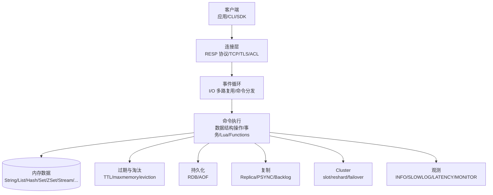
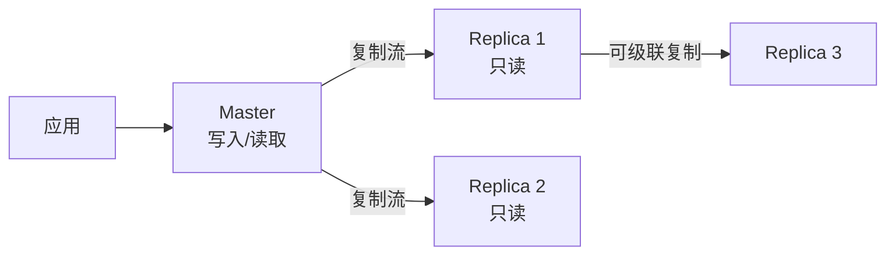
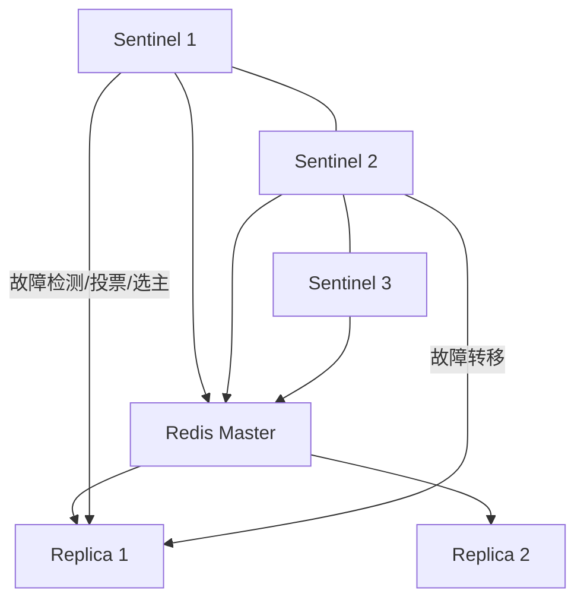
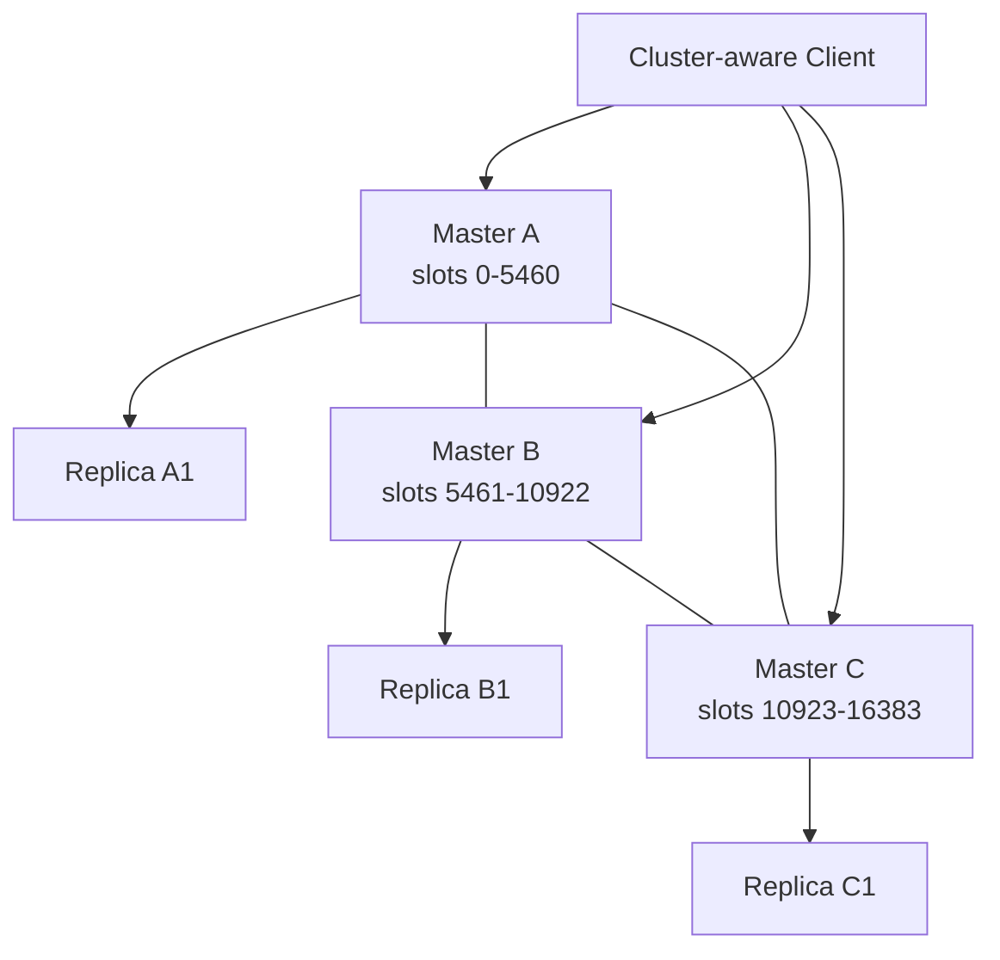
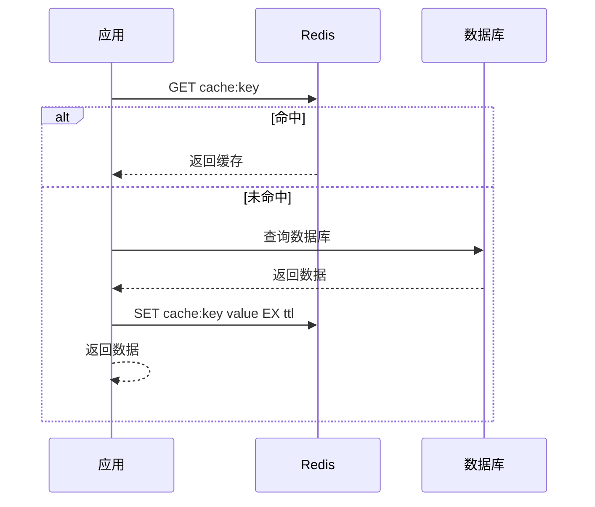
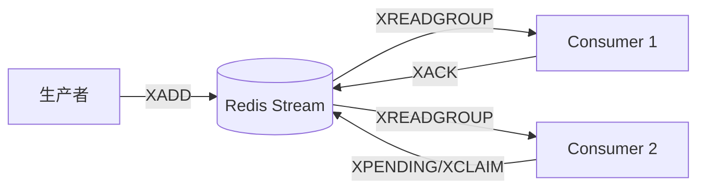

# Redis 完整学习笔记

> Last researched: 2026-06-16  
> Audience level: 后端/全栈/运维/架构工程实践入门到进阶  
> Scope: 本文以 Redis 8.x 当前体系为主线，覆盖 Redis 概念、版本与许可变化、安装使用、数据类型、命令、持久化、复制、哨兵、Cluster、事务、Lua/Functions、Pub/Sub、Streams、缓存问题、分布式锁、内存淘汰、性能优化、安全、监控、故障排查和生产实践。本文不替代 Redis 官方文档、云厂商 SLA、企业安全审计和生产变更流程。

## 1. 总览

Redis 是一个以内存为核心的高性能数据存储系统，常用于缓存、排行榜、计数器、分布式锁、会话存储、消息流、延迟队列、实时统计、限流、地理位置、向量检索和实时特征存储。Redis 的价值不只是“快”，而是它把多种常用数据结构和原子操作封装成网络服务，让应用可以用很少的代码完成高并发数据访问和协调。

Redis 常被描述为 key-value 数据库，但这个说法不够完整。Redis 的 key 是字符串，value 可以是 String、List、Hash、Set、Sorted Set、Bitmap、HyperLogLog、Geospatial、Stream、JSON、Time Series、Bloom/Count-Min/Top-K、Vector Set 等结构。Redis 8 起整合 Redis Stack 能力，官方文档中 Redis Query Engine、JSON、Time Series、Bloom、Vector Set 等能力成为学习时需要关注的新主线。

学习 Redis 要抓住七条主线：

| 主线 | 核心问题 | 典型内容 |
| --- | --- | --- |
| 数据结构 | 用什么结构表达业务数据 | String、Hash、List、Set、ZSet、Stream、Bitmap |
| 性能模型 | 为什么快，什么时候会慢 | 内存、事件循环、I/O 线程、pipeline、大 key、慢查询 |
| 持久化 | 宕机后数据如何恢复 | RDB、AOF、混合持久化、fsync、恢复 |
| 高可用 | 节点故障如何继续服务 | 主从复制、Sentinel、Cluster、故障转移 |
| 缓存设计 | 如何避免缓存问题 | 穿透、击穿、雪崩、一致性、预热、淘汰 |
| 分布式协调 | 如何做锁、限流、队列 | SET NX PX、Lua、Streams、Pub/Sub、Redlock |
| 运维安全 | 如何稳定运行 | ACL、TLS、内存限制、监控、备份、升级 |

Redis 不是万能数据库。它擅长高性能内存访问和数据结构操作，但不适合无限量数据存储、复杂事务、强一致关系查询、跨多 key 的复杂业务约束和不受控的大对象存储。

## 2. 学习目标

学完本文后，应能达到以下目标：

- 能说明 Redis 与关系型数据库、Memcached、消息队列、搜索引擎的区别。
- 能根据业务选择合适数据类型，而不是所有数据都用 String。
- 能理解单线程事件循环、I/O 多路复用、pipeline、慢查询、大 key、热 key对性能的影响。
- 能配置和理解 RDB、AOF、混合持久化的优缺点。
- 能搭建和解释主从复制、Sentinel、Cluster 的基本架构。
- 能处理缓存穿透、缓存击穿、缓存雪崩、缓存一致性问题。
- 能正确使用 Redis 实现分布式锁，并理解它的边界。
- 能使用 Stream 和 Consumer Group 构建可靠消息流。
- 能理解 maxmemory、淘汰策略、过期删除策略和内存碎片。
- 能进行基础监控和排障：INFO、SLOWLOG、LATENCY、MONITOR、MEMORY、CLIENT。
- 能识别生产常见坑：大 key、热 key、阻塞命令、无 TTL、持久化配置错误、复制延迟、集群槽迁移、权限暴露。

## 3. 版本、许可与生态现状

### 3.1 当前版本情况

截至 2026-06-16，Redis 官方 GitHub Releases 页面显示 `8.8.0` 为 Latest。Redis 8.x 已经不是简单的“Redis 7 后续小升级”，而是一个整合 Redis Stack 能力的新主线。学习资料如果只停留在 Redis 5/6/7，需要注意以下变化：

- Redis 8 将查询、JSON、向量、时间序列、概率数据结构等 Redis Stack 能力整合进 Redis。
- Redis 8 提供 AGPLv3 许可选项。
- Redis 7.4 曾引入 RSALv2 和 SSPLv1 许可，Redis 8 又引入 AGPLv3。
- 命令、模块能力、客户端兼容和部署方式要以当前官方文档为准。

### 3.2 许可变化与 Valkey

2024 年 Redis 公司变更 Redis 许可，引发社区和云厂商关注。Linux Foundation 随后启动 Valkey 项目，作为 Redis 7.2.4 的开源分支。2025 年 Redis 宣布 Redis 8 增加 AGPLv3 许可选项。

工程建议：

- 新项目要明确使用 Redis 官方发行版、云厂商 Redis 兼容服务、Valkey，还是其他兼容产品。
- 商业产品嵌入、SaaS、托管服务场景要核对许可和法务要求。
- 技术学习层面，Redis 命令和核心原理仍有大量共通，但版本差异不能忽略。

## 4. Redis 适用与不适用场景

### 4.1 适用场景

| 场景 | 常用结构/能力 | 示例 |
| --- | --- | --- |
| 缓存 | String、Hash、TTL | 用户信息、商品详情、配置 |
| 会话 | String、Hash、TTL | 登录态、验证码 |
| 计数器 | INCR、Hash | 阅读数、点赞数、库存预扣 |
| 排行榜 | Sorted Set | 积分榜、热度榜 |
| 去重 | Set、Bitmap、Bloom | 签到、UV、黑名单 |
| 限流 | INCR + EXPIRE、Lua、Sorted Set | API 限流、短信限流 |
| 分布式锁 | SET NX PX、Lua | 防重复提交、任务互斥 |
| 消息流 | Stream、Consumer Group | 订单事件、异步任务 |
| 发布订阅 | Pub/Sub | 实时通知、配置变更 |
| 延迟队列 | Sorted Set、Stream | 超时订单、重试任务 |
| 地理位置 | GEO | 附近门店、附近司机 |
| 实时统计 | Bitmap、HyperLogLog、Time Series | UV、在线状态、指标 |
| 向量检索 | Vector Set / Redis Query Engine | 语义搜索、推荐召回 |

### 4.2 不适用或谨慎使用场景

| 场景 | 原因 |
| --- | --- |
| 作为唯一强一致主库保存关键金融账务 | Redis 偏高性能内存模型，事务和一致性语义不等同关系型数据库 |
| 存超大对象 | 大 key 会阻塞、复制慢、迁移慢、内存碎片 |
| 复杂多表关联查询 | Redis 不是关系型查询引擎 |
| 无限增长日志 | 内存成本高，保留和归档需要严格控制 |
| 强顺序、高可靠消息队列替代专业 MQ | Stream 很强，但仍要评估确认、重试、堆积、运维和业务语义 |
| 无权限暴露在公网 | Redis 高危，必须限制网络和认证 |

## 5. Redis 总体架构



Figure: Redis 单节点核心模块关系，综合整理自 Redis 官方文档与源码架构说明。

Redis 核心特点：

- 大多数命令在内存中执行，延迟低。
- 命令执行主路径强调单线程原子性，避免复杂锁竞争。
- 网络 I/O 可使用 I/O 线程辅助，但命令执行仍要理解单线程事件循环的阻塞风险。
- 支持多种数据结构和原子操作。
- 通过 RDB/AOF 持久化降低宕机丢数据风险。
- 通过复制、Sentinel、Cluster 提供高可用和扩展。

## 6. 安装与基本使用

### 6.1 Docker 快速启动

```bash
docker run --name redis-dev -p 6379:6379 -d redis:8
docker exec -it redis-dev redis-cli
```

基础测试：

```redis
PING
SET hello world
GET hello
DEL hello
```

### 6.2 redis-cli 常用方式

```bash
redis-cli -h 127.0.0.1 -p 6379
redis-cli -a 'password'
redis-cli --tls -h redis.example.com -p 6379
redis-cli --scan --pattern 'user:*'
```

注意：

- 生产环境不要在命令历史或脚本中明文暴露密码。
- 扫描 key 使用 `SCAN`，不要使用 `KEYS *`。
- 远程连接要确认网络、ACL、TLS 和防火墙。

### 6.3 配置文件核心项

| 配置 | 作用 |
| --- | --- |
| `bind` | 监听地址 |
| `port` | 端口 |
| `protected-mode` | 保护模式 |
| `requirepass` | 旧式全局密码，ACL 更推荐 |
| `user` | ACL 用户配置 |
| `dir` | 持久化文件目录 |
| `dbfilename` | RDB 文件名 |
| `appendonly` | 是否开启 AOF |
| `maxmemory` | 最大内存 |
| `maxmemory-policy` | 内存淘汰策略 |
| `save` | RDB 触发规则 |
| `replicaof` | 配置从节点 |
| `cluster-enabled` | 是否启用 Cluster |

## 7. 基础命令与 key 设计

### 7.1 Key 命名

推荐格式：

```text
业务域:对象类型:对象ID:字段
```

示例：

```text
user:1001:profile
user:1001:session
product:889:detail
order:202606160001:status
rank:daily:2026-06-16
lock:order:202606160001
```

原则：

- 使用冒号分隔层级。
- key 不要太长，但要能表达业务。
- 避免无命名空间的 `id=1`、`cache`、`test`。
- 多租户系统 key 中加入租户维度：`tenant:100:user:1`。
- Cluster 中需要同槽操作时使用 hash tag：`order:{1001}:base`、`order:{1001}:items`。

### 7.2 通用 key 命令

| 命令 | 用途 | 注意 |
| --- | --- | --- |
| `EXISTS key` | 判断 key 是否存在 | 返回存在数量 |
| `DEL key` | 删除 key | 删除大 key 可能阻塞 |
| `UNLINK key` | 异步删除 key | 大 key 更推荐 |
| `EXPIRE key seconds` | 设置 TTL | 秒级 |
| `PEXPIRE key ms` | 设置毫秒 TTL | 毫秒级 |
| `TTL key` | 查看剩余秒数 | -1 无过期，-2 不存在 |
| `TYPE key` | 查看类型 | 排查常用 |
| `RENAME` | 重命名 | 注意覆盖风险 |
| `SCAN` | 渐进扫描 | 替代 `KEYS` |

### 7.3 不要滥用 KEYS

`KEYS *` 会遍历整个 keyspace，数据量大时会阻塞 Redis。生产排查应使用：

```redis
SCAN 0 MATCH user:* COUNT 1000
```

但 `SCAN` 也不是无成本操作。大规模扫描仍应限速、分批、避开高峰。

## 8. 数据类型详解

### 8.1 String

String 是最基础类型，可以存文本、JSON、数字、二进制。最大值大小受 Redis 限制和实际内存约束影响，工程上不应存过大的字符串。

常用命令：

```redis
SET user:1:name Alice
GET user:1:name
SETEX sms:code:13800138000 300 123456
SET lock:order:1 uuid NX PX 30000
INCR counter:page:home
MGET k1 k2 k3
MSET k1 v1 k2 v2
```

适用：

- 缓存简单对象。
- 计数器。
- 分布式锁。
- 验证码。
- 短期 Token。

常见坑：

- 把很大的 JSON 对象整体存 String，每次读写都传输全量。
- 没有 TTL，缓存永久增长。
- 用 `GET`/`SET` 实现并发计数，导致丢更新，应使用 `INCR`。

### 8.2 Hash

Hash 适合存对象字段。

```redis
HSET user:1 name Alice age 20 city Beijing
HGET user:1 name
HMGET user:1 name age
HINCRBY user:1 login_count 1
HGETALL user:1
```

适用：

- 用户资料。
- 商品部分字段。
- 配置项。
- 小对象。

优点：

- 可以单独更新字段。
- 比多个 String key 更聚合。

注意：

- Hash 字段过多也会成为大 key。
- `HGETALL` 对大 Hash 有阻塞和网络传输风险。
- 对象字段更新频率差异很大时，要考虑拆分。

### 8.3 List

List 是有序链表/列表语义，常用于队列、栈、最近记录。

```redis
LPUSH queue:email job1
RPOP queue:email
BRPOP queue:email 5
LPUSH recent:user:1 item1
LTRIM recent:user:1 0 99
```

适用：

- 简单队列。
- 最新 N 条记录。
- 栈。

注意：

- 可靠队列更推荐 Stream。
- 大 List 做范围删除、随机访问不适合。

### 8.4 Set

Set 是无序不重复集合。

```redis
SADD article:1:likes user1 user2
SISMEMBER article:1:likes user1
SCARD article:1:likes
SINTER set:a set:b
SUNION set:a set:b
```

适用：

- 去重。
- 标签。
- 用户集合。
- 共同关注。

注意：

- 大集合的交并差操作可能阻塞。
- `SMEMBERS` 对大 Set 风险高，优先 `SSCAN`。

### 8.5 Sorted Set

Sorted Set 是带 score 的有序集合。

```redis
ZADD rank:daily 100 user1 90 user2
ZREVRANGE rank:daily 0 9 WITHSCORES
ZINCRBY rank:daily 10 user1
ZRANK rank:daily user2
ZREM rank:daily user2
```

适用：

- 排行榜。
- 延迟队列。
- 按时间排序的任务。
- Top N。

注意：

- score 是浮点数，精度和排序规则要理解。
- 大 ZSet 的范围删除、全量读取要谨慎。

### 8.6 Bitmap

Bitmap 基于 String 位操作。

```redis
SETBIT signin:2026-06 user1001 1
GETBIT signin:2026-06 user1001
BITCOUNT signin:2026-06
```

适用：

- 签到。
- 用户在线状态。
- 布尔标记。
- 大规模 0/1 统计。

注意：

- offset 太大会导致内存按最大偏移扩展。
- 用户 ID 不连续时要做映射。

### 8.7 HyperLogLog

HyperLogLog 用于基数估算，牺牲少量精度换取极低内存。

```redis
PFADD uv:2026-06-16 user1 user2 user3
PFCOUNT uv:2026-06-16
PFMERGE uv:2026-06 uv:2026-06-15 uv:2026-06-16
```

适用：

- UV 估算。
- 去重计数但不需要具体成员。

不适合：

- 需要精确计数。
- 需要列出成员。

### 8.8 Geospatial

GEO 基于 Sorted Set 实现地理位置。

```redis
GEOADD shop:geo 116.397128 39.916527 shop1
GEOSEARCH shop:geo FROMLONLAT 116.40 39.91 BYRADIUS 5 km WITHDIST
```

适用：

- 附近门店。
- 附近司机。
- 位置搜索。

注意：

- 地球模型和距离精度不是 GIS 专业系统级别。
- 大规模复杂地理查询仍应评估专业搜索/地理系统。

### 8.9 Stream

Stream 是 Redis 的日志型消息流结构，支持消息 ID、消费组、ACK、Pending 列表。

```redis
XADD order:events * type created orderId 1001
XGROUP CREATE order:events group-a $ MKSTREAM
XREADGROUP GROUP group-a consumer-1 COUNT 10 BLOCK 5000 STREAMS order:events >
XACK order:events group-a 1700000000000-0
```

适用：

- 可靠消息流。
- 事件日志。
- 异步任务。
- 多消费者组。

优势：

- 比 Pub/Sub 更可靠，消息可持久保留。
- 支持消费者组和待确认消息。

注意：

- 要处理 Pending 消息。
- 要设置裁剪策略，避免无限增长。
- 不是所有 MQ 功能都自动具备，如复杂路由、死信队列、事务消息需要自己设计。

### 8.10 JSON、Time Series、Bloom、Vector Set

Redis 8 整合 Redis Stack 能力后，以下能力越来越重要：

| 能力 | 用途 |
| --- | --- |
| JSON | 原生 JSON 文档存储和路径操作 |
| Query Engine | 查询、索引、全文、向量检索 |
| Time Series | 时间序列数据、聚合、降采样 |
| Bloom / Cuckoo | 概率去重、缓存穿透防护 |
| Count-Min Sketch | 频次估算、热 key 统计 |
| Top-K | 热门元素 |
| Vector Set | 向量相似度检索 |

学习建议：

- 传统缓存和基础数据结构先掌握。
- 做实时搜索、推荐、AI 检索、时间序列时，再深入 Redis Query Engine 和相关结构。
- 注意云服务或兼容 Redis 产品是否支持这些扩展能力。

## 9. 过期删除与内存淘汰

### 9.1 TTL 与过期删除

Redis key 可以设置过期时间：

```redis
SET session:1 token EX 3600
EXPIRE user:cache:1 600
TTL user:cache:1
```

Redis 使用惰性删除和定期删除结合：

- 惰性删除：访问 key 时发现过期再删除。
- 定期删除：后台周期性抽样检查过期 key。

### 9.2 maxmemory

生产环境应设置 `maxmemory`，避免 Redis 占满机器内存导致系统 OOM。

```conf
maxmemory 4gb
maxmemory-policy allkeys-lru
```

### 9.3 淘汰策略

常见策略：

| 策略 | 含义 | 场景 |
| --- | --- | --- |
| `noeviction` | 内存满后写入报错 | 不允许丢缓存/数据 |
| `allkeys-lru` | 所有 key 中近似 LRU 淘汰 | 通用缓存 |
| `volatile-lru` | 只淘汰有 TTL 的 key | 混合缓存和持久数据 |
| `allkeys-lfu` | 所有 key 中近似 LFU 淘汰 | 热点访问明显 |
| `volatile-lfu` | 有 TTL 的 key 中 LFU 淘汰 | 热点缓存 |
| `allkeys-random` | 随机淘汰所有 key | 特殊场景 |
| `volatile-random` | 随机淘汰有 TTL 的 key | 特殊场景 |
| `volatile-ttl` | 优先淘汰 TTL 更短的 key | TTL 语义强 |

建议：

- 纯缓存优先评估 `allkeys-lru` 或 `allkeys-lfu`。
- 缓存 key 都设置 TTL。
- 不要在同一个 Redis 实例混放“绝不能丢的数据”和“可淘汰缓存”。

## 10. 持久化

Redis 是内存数据库，但可以通过 RDB 和 AOF 持久化。

### 10.1 RDB

RDB 是快照持久化，把某一时刻数据保存成二进制文件。

优点：

- 文件紧凑。
- 恢复速度较快。
- 适合备份。
- 对主线程影响相对可控，通常 fork 子进程写文件。

缺点：

- 两次快照之间的数据可能丢失。
- fork 在大内存实例上可能带来延迟和额外内存压力。

常见配置：

```conf
save 3600 1
save 300 100
save 60 10000
dbfilename dump.rdb
dir /data/redis
```

### 10.2 AOF

AOF 记录写命令日志，通过重放命令恢复数据。

```conf
appendonly yes
appendfsync everysec
```

fsync 策略：

| 策略 | 含义 | 风险 |
| --- | --- | --- |
| `always` | 每次写都 fsync | 最安全但慢 |
| `everysec` | 每秒 fsync | 常用，最多约 1 秒数据风险 |
| `no` | 交给 OS | 性能好但丢失风险更高 |

AOF 重写：

- AOF 会随着写入增长。
- Redis 可重写 AOF，把当前数据压缩成更短命令集。
- 重写期间要关注磁盘空间和 I/O。

### 10.3 混合持久化

Redis 支持 AOF 文件中包含 RDB 前缀，再追加增量 AOF。优点是恢复速度和数据完整性折中更好。

### 10.4 持久化选择

| 场景 | 建议 |
| --- | --- |
| 纯缓存，可从数据库重建 | 可不开持久化或只开 RDB |
| 允许少量丢失 | RDB + AOF everysec |
| 对数据丢失敏感 | AOF everysec/always + 主从 + 备份，仍需评估 Redis 是否适合作主存储 |
| 大实例 | 关注 fork、磁盘、复制、恢复时间 |

## 11. 复制

### 11.1 主从复制



Figure: Redis 主从复制基础架构。

复制用途：

- 读扩展。
- 高可用基础。
- 数据备份。
- 降低主节点读压力。

配置：

```conf
replicaof 192.168.1.10 6379
```

### 11.2 全量同步与部分同步

复制大致流程：

1. Replica 连接 Master。
2. 尝试部分同步。
3. 如果无法部分同步，Master 生成 RDB 给 Replica。
4. Master 继续发送复制 backlog 中的增量命令。
5. Replica 加载数据并持续接收增量。

注意：

- 全量同步会消耗网络、CPU、磁盘和内存。
- 复制延迟可能导致读到旧数据。
- 主从不是强一致。

### 11.3 读写分离问题

读从节点要注意：

- 复制延迟。
- 主从切换后客户端路由。
- 读自己刚写的数据可能读不到。
- 从节点默认只读，但配置可变。

对强一致读要求高的接口，不建议随意读从节点。

## 12. Sentinel 高可用

Sentinel 用于监控 Redis 主从、自动故障转移、通知客户端新主节点。



Figure: Redis Sentinel 典型部署。生产应至少 3 个 Sentinel，避免单点和脑裂风险。

Sentinel 负责：

- 监控 Master/Replica 是否可达。
- 主观下线和客观下线判断。
- 选举 Leader Sentinel。
- 选择一个 Replica 晋升为新 Master。
- 让其他 Replica 复制新 Master。
- 通知客户端配置变化。

注意：

- Sentinel 不做数据分片。
- Sentinel 高可用不等于零数据丢失。
- 客户端必须支持 Sentinel 发现。
- Sentinel 自身也要多节点部署。

## 13. Redis Cluster

Redis Cluster 用于数据分片和高可用。它把 keyspace 分成 16384 个 hash slot，每个主节点负责一部分槽。



Figure: Redis Cluster 基础结构。

### 13.1 Hash Slot

key 到 slot：

```text
slot = CRC16(key) mod 16384
```

hash tag：

```text
user:{1001}:profile
user:{1001}:orders
```

大括号中的 `1001` 用于计算 slot，因此两个 key 可落到同一槽，支持部分多 key 操作。

### 13.2 MOVED 与 ASK

客户端请求错节点时：

- `MOVED`：槽已永久迁移到另一个节点，客户端应更新路由表。
- `ASK`：槽正在迁移中，客户端临时向目标节点请求。

使用 Redis Cluster 必须使用支持 Cluster 的客户端。

### 13.3 Cluster 注意点

- 多 key 命令要求 key 在同一 slot。
- Lua 脚本涉及多 key 时也要同槽。
- 扩容缩容需要迁移 slot。
- 热 key 仍可能压垮单个节点。
- Cluster 不提供跨 slot 强事务。
- 客户端连接数会随节点数增加。

## 14. 事务、Lua 与 Functions

### 14.1 事务

Redis 事务使用 `MULTI`、`EXEC`、`DISCARD`、`WATCH`。

```redis
WATCH balance:1
GET balance:1
MULTI
DECRBY balance:1 100
INCRBY balance:2 100
EXEC
```

特点：

- `MULTI` 后命令排队，`EXEC` 时顺序执行。
- Redis 事务不支持关系型数据库那种回滚语义。
- `WATCH` 可实现乐观锁。

常见误解：

- Redis 事务不是 ACID 事务的完整替代。
- 命令运行时错误不会自动回滚之前命令。

### 14.2 Lua 脚本

Lua 脚本在 Redis 中原子执行。

分布式锁释放示例：

```lua
if redis.call("GET", KEYS[1]) == ARGV[1] then
  return redis.call("DEL", KEYS[1])
else
  return 0
end
```

执行：

```redis
EVAL "if redis.call('GET', KEYS[1]) == ARGV[1] then return redis.call('DEL', KEYS[1]) else return 0 end" 1 lock:order:1 uuid
```

注意：

- Lua 脚本执行期间会阻塞其他命令。
- 脚本不能做长时间计算。
- Cluster 中脚本 key 要在同一 slot。
- 脚本要通过 `KEYS` 显式声明访问的 key。

### 14.3 Redis Functions

Redis Functions 是比脚本更工程化的服务端函数机制，支持加载、调用和管理函数库。适合把常用原子逻辑部署到 Redis 侧。

使用建议：

- 简单一次性逻辑用 Lua 脚本。
- 多处复用、需要版本管理的逻辑评估 Functions。
- 不要把复杂业务系统搬进 Redis。

## 15. Pipeline、批量与客户端性能

### 15.1 Pipeline

Pipeline 可以一次发送多个命令，减少网络 RTT。

适用：

- 批量写入。
- 批量读取。
- 初始化数据。

注意：

- Pipeline 不是事务。
- 批次过大可能导致服务端和客户端内存压力。
- 错误处理要逐条检查响应。

### 15.2 MGET/MSET 与 Pipeline

| 方式 | 特点 |
| --- | --- |
| `MGET/MSET` | 单命令多 key，简单高效；Cluster 要求同槽或客户端拆分 |
| Pipeline | 多命令批量发送，更灵活 |
| Lua | 原子逻辑 |

### 15.3 连接池

客户端应使用连接池，但不要无限增大：

- 连接太少：等待连接。
- 连接太多：Redis 文件描述符、上下文和网络压力上升。
- 慢命令会占用连接，导致池耗尽。

## 16. 缓存设计

### 16.1 Cache Aside

最常见模式：



更新常用策略：

1. 更新数据库。
2. 删除缓存。
3. 下次读请求重建缓存。

原因：直接更新缓存容易遇到并发覆盖和复杂对象局部更新问题。

### 16.2 缓存穿透

穿透：请求的数据不存在，缓存也没有，每次都打到数据库。

解决：

- 缓存空值，设置短 TTL。
- 使用 Bloom Filter。
- 参数校验，过滤非法 ID。
- 限流。

### 16.3 缓存击穿

击穿：热点 key 过期，大量请求同时打到数据库。

解决：

- 互斥锁重建缓存。
- 逻辑过期，后台异步刷新。
- 热点 key 不设置短 TTL，而是主动刷新。
- 请求合并。

### 16.4 缓存雪崩

雪崩：大量 key 同时失效或 Redis 故障，导致数据库被打爆。

解决：

- TTL 加随机抖动。
- 分批预热。
- 多级缓存。
- 限流和降级。
- Redis 高可用。
- 熔断保护数据库。

### 16.5 缓存一致性

常用策略：

| 策略 | 说明 |
| --- | --- |
| 先更新 DB 再删缓存 | 常用，简单 |
| 延迟双删 | 处理并发读写窗口，但不是万能 |
| Binlog/CDC 删缓存 | 通过数据库变更事件驱动 |
| 写穿/写回 | 复杂，需要专门设计 |
| 版本号/时间戳 | 防止旧值覆盖新值 |

工程建议：

- 大多数业务接受最终一致。
- 对强一致要求高的场景不要只靠缓存。
- 删除缓存失败要重试或进入补偿队列。
- 缓存值中可带版本号，避免乱序覆盖。

## 17. 分布式锁

### 17.1 正确的单实例锁

加锁：

```redis
SET lock:order:1 9f0b7c2a NX PX 30000
```

释放锁必须校验 value：

```lua
if redis.call("GET", KEYS[1]) == ARGV[1] then
  return redis.call("DEL", KEYS[1])
else
  return 0
end
```

要点：

- 使用唯一 value 标识持有者。
- 必须设置过期时间。
- 释放锁用 Lua 保证“判断 + 删除”原子。
- 锁过期时间要大于业务最大执行时间，或使用续期机制。

### 17.2 分布式锁边界

Redis 锁不能自动解决：

- 业务执行超过锁 TTL。
- GC Stop-The-World 导致锁过期。
- 主从切换造成锁丢失。
- 网络分区。
- 业务幂等缺失。

建议：

- 锁用于降低并发冲突，不是唯一安全保障。
- 关键业务使用数据库唯一约束、状态机、幂等 token 兜底。
- 使用成熟客户端如 Redisson 时，也要理解 Watchdog 和故障语义。

### 17.3 Redlock

Redlock 是 Redis 官方文档中描述的多实例分布式锁算法。它通过多个独立 Redis 节点投票获取锁，试图降低单点故障风险。

注意：

- Redlock 在社区有争议。
- 对强一致要求极高的分布式协调，应评估 ZooKeeper、etcd、Consul 等 CP 系统。
- 对普通业务互斥，单 Redis + 幂等兜底往往更简单。

## 18. 消息：Pub/Sub 与 Streams

### 18.1 Pub/Sub

```redis
SUBSCRIBE news
PUBLISH news "hello"
```

特点：

- 实时广播。
- 订阅者在线才能收到。
- 不保存历史。
- 不支持 ACK。

适用：

- 在线通知。
- 本地缓存失效广播。
- 简单实时消息。

不适合：

- 可靠任务队列。
- 消息必须不丢的业务。

### 18.2 Streams

Stream 更适合可靠消息：

- 消息持久化。
- 消费者组。
- ACK。
- Pending 列表。
- 可重试。
- 可裁剪。

基本消费流程：



Figure: Redis Streams 消费组基本流程。

生产实践：

- 设置最大长度或裁剪策略。
- 监控 Pending 数量。
- 处理消费者宕机后的消息认领。
- 保证消费者幂等。

## 19. 性能优化

### 19.1 为什么 Redis 快

主要原因：

- 数据在内存中。
- 高效数据结构。
- 单线程命令执行避免锁竞争。
- I/O 多路复用。
- 命令简单且多数时间复杂度低。
- Pipeline 减少 RTT。

但 Redis 也会慢：

- 大 key。
- 热 key。
- 慢命令。
- fork 持久化。
- AOF fsync。
- 网络拥塞。
- 内存碎片。
- Swap。
- 客户端连接爆炸。

### 19.2 大 key

大 key 指 value 很大或元素很多的 key。例：

- 10MB 的 String。
- 100 万元素的 Hash/Set/ZSet/List。

危害：

- 阻塞命令执行。
- 网络传输慢。
- 复制慢。
- AOF/RDB 大。
- Cluster 迁移慢。
- 删除慢。

排查：

```bash
redis-cli --bigkeys
redis-cli --memkeys
```

处理：

- 拆分 key。
- 分页读取。
- 使用 `UNLINK` 异步删除。
- 限制集合大小。
- 对历史数据归档。

### 19.3 热 key

热 key 是访问频率极高的 key。

危害：

- 单节点 CPU/网络被打满。
- Cluster 中热点集中到一个 slot。
- 下游重建缓存压力大。

处理：

- 本地缓存。
- 多副本读。
- key 分片。
- 热点预热。
- 限流。
- 业务降级。

### 19.4 慢查询

```redis
SLOWLOG GET 10
SLOWLOG LEN
SLOWLOG RESET
```

注意：

- SLOWLOG 记录的是命令执行时间，不包含网络排队时间。
- 阈值由 `slowlog-log-slower-than` 控制。

### 19.5 延迟监控

```redis
LATENCY LATEST
LATENCY DOCTOR
```

排查延迟要看：

- Redis 内部事件。
- 系统 CPU。
- 网络。
- 磁盘 I/O。
- fork。
- AOF fsync。
- 客户端连接。

## 20. 安全

### 20.1 网络安全

原则：

- Redis 不应暴露公网。
- 只监听内网地址。
- 使用防火墙和安全组限制来源。
- 管理端口和业务端口隔离。
- 云 Redis 使用 VPC 内访问。

配置：

```conf
bind 127.0.0.1 10.0.0.5
protected-mode yes
```

### 20.2 ACL

Redis ACL 可以创建用户、限制命令、限制 key pattern。

示例：

```redis
ACL SETUSER app on >strong-password ~app:* +get +set +del +expire
ACL LIST
ACL WHOAMI
```

建议：

- 每个应用使用独立 Redis 用户。
- 限制 key 前缀。
- 禁用危险命令或重命名危险命令。
- 定期轮换密码。

### 20.3 TLS

跨网络、云环境、敏感数据场景应评估 TLS。TLS 会带来一定性能开销，需要压测。

### 20.4 危险命令

谨慎使用：

- `FLUSHALL`
- `FLUSHDB`
- `KEYS`
- `MONITOR`
- `CONFIG`
- `SHUTDOWN`
- `SAVE`
- 大范围 `DEL`

生产建议通过 ACL 限制普通应用账号使用这些命令。

## 21. 监控与运维

### 21.1 INFO

```redis
INFO server
INFO clients
INFO memory
INFO persistence
INFO stats
INFO replication
INFO commandstats
INFO cluster
```

关注指标：

| 指标 | 含义 |
| --- | --- |
| `used_memory` | Redis 使用内存 |
| `used_memory_rss` | 进程实际占用 |
| `mem_fragmentation_ratio` | 内存碎片 |
| `connected_clients` | 客户端连接 |
| `blocked_clients` | 阻塞客户端 |
| `instantaneous_ops_per_sec` | QPS |
| `keyspace_hits/misses` | 缓存命中/未命中 |
| `evicted_keys` | 淘汰 key 数 |
| `expired_keys` | 过期 key 数 |
| `rejected_connections` | 拒绝连接 |
| `master_repl_offset` | 复制偏移 |
| `used_cpu_sys/used_cpu_user` | CPU |

### 21.2 MEMORY

```redis
MEMORY USAGE key
MEMORY STATS
MEMORY DOCTOR
```

用于排查：

- 单 key 内存。
- 总体内存结构。
- 碎片问题。

### 21.3 客户端排查

```redis
CLIENT LIST
CLIENT KILL id 123
CLIENT PAUSE 1000
```

关注：

- 连接数。
- 客户端地址。
- 空闲时间。
- 输出缓冲区。
- 阻塞状态。

## 22. 生产配置建议

### 22.1 基础配置

```conf
bind 10.0.0.5
protected-mode yes
port 6379
tcp-keepalive 300
timeout 0
maxclients 10000

maxmemory 8gb
maxmemory-policy allkeys-lru

appendonly yes
appendfsync everysec
```

### 22.2 系统层建议

- 禁用或谨慎使用 Swap。
- 设置合理 `vm.overcommit_memory`。
- 关注 Transparent Huge Pages。
- 磁盘使用 SSD。
- 监控磁盘空间。
- Redis 数据目录与系统盘分离。
- 使用 NTP 保持时间同步。

### 22.3 部署建议

- 单机开发环境可以 Docker。
- 生产用专用实例或托管 Redis。
- 高可用使用 Sentinel 或 Cluster。
- 大规模缓存优先 Cluster。
- 关键业务做容量评估和压测。
- 持久化文件定期备份到异地。

## 23. 故障排查流程

### 23.1 Redis 变慢

排查顺序：

1. 看 `INFO stats` QPS、命中率。
2. 看 `SLOWLOG GET`。
3. 看 CPU、内存、网络、磁盘。
4. 查大 key：`--bigkeys`、`MEMORY USAGE`。
5. 查热 key：客户端统计、代理层、监控。
6. 看 fork、AOF fsync、RDB save。
7. 看客户端连接池和超时。
8. 看是否有 `KEYS`、`SMEMBERS`、`HGETALL` 大集合操作。

### 23.2 内存暴涨

可能原因：

- 无 TTL key 增长。
- 缓存 key 维度过细。
- 大 key。
- AOF rewrite / RDB fork 内存峰值。
- 客户端输出缓冲区堆积。
- 内存碎片。

处理：

- 查 keyspace。
- 查大 key。
- 设置 maxmemory。
- 设置 TTL。
- 拆分或归档。
- 优化客户端消费。

### 23.3 主从延迟

排查：

- 网络带宽。
- 主节点写入量。
- Replica 机器性能。
- 大 key 写入和删除。
- RDB 全量同步。
- 磁盘 I/O。

### 23.4 Cluster 故障

排查：

```redis
CLUSTER INFO
CLUSTER NODES
CLUSTER SLOTS
```

关注：

- slot 是否完整覆盖。
- 节点是否 fail。
- 是否正在迁移。
- 客户端是否支持 MOVED/ASK。
- hash tag 是否正确。

## 24. 常见面试与工程问题

### 24.1 Redis 为什么快

答题要点：

- 内存存储。
- 高效数据结构。
- 单线程命令执行减少锁竞争。
- I/O 多路复用。
- Pipeline 减少网络往返。
- 命令模型简单。

补充：Redis 快不代表所有命令都快，大 key、慢命令、持久化、网络和客户端都会导致延迟。

### 24.2 Redis 是单线程吗

准确说法：

- Redis 命令执行主路径长期以单线程模型为核心。
- Redis 还有后台线程处理关闭文件、AOF fsync、lazy free 等任务。
- Redis 6 起支持 I/O 线程辅助网络读写。
- 对使用者而言，仍要避免长时间阻塞命令，因为命令执行会影响其他请求。

### 24.3 RDB 和 AOF 区别

| 维度 | RDB | AOF |
| --- | --- | --- |
| 形式 | 快照 | 写命令日志 |
| 文件大小 | 较小 | 通常较大 |
| 恢复速度 | 快 | 可能较慢，混合持久化改善 |
| 数据丢失 | 两次快照间可能丢 | 取决于 fsync |
| 适合 | 备份、快速恢复 | 更低数据丢失风险 |

### 24.4 缓存和数据库如何保持一致

常见回答：

- 先更新数据库，再删除缓存。
- 删除失败要重试或补偿。
- TTL 兜底。
- 对高并发热点使用互斥重建或逻辑过期。
- 强一致场景不要只依赖缓存。

### 24.5 Redis 分布式锁安全吗

回答：

- 正确加锁应使用 `SET key value NX PX ttl`。
- 解锁必须校验 value 并用 Lua 原子删除。
- 锁需要 TTL 和唯一标识。
- Redis 锁不是万能，需处理锁过期、主从切换、业务超时。
- 关键业务要有幂等和数据库约束兜底。

## 25. 学习路线

### 25.1 第一阶段：基础使用

掌握：

- 安装 Redis。
- redis-cli。
- String、Hash、List、Set、ZSet。
- TTL。
- 基础缓存。

练习：

- 用户缓存。
- 验证码。
- 计数器。
- 排行榜。

### 25.2 第二阶段：缓存工程

掌握：

- Cache Aside。
- 穿透、击穿、雪崩。
- 缓存一致性。
- 分布式锁。
- 限流。

练习：

- 实现商品详情缓存。
- 实现互斥重建缓存。
- 实现短信验证码限流。

### 25.3 第三阶段：高可用与持久化

掌握：

- RDB。
- AOF。
- 主从复制。
- Sentinel。
- Cluster。

练习：

- 搭建一主两从。
- 搭建 Sentinel。
- 搭建三主三从 Cluster。
- 模拟主节点宕机。

### 25.4 第四阶段：性能与运维

掌握：

- Pipeline。
- 慢查询。
- 大 key。
- 热 key。
- maxmemory。
- 淘汰策略。
- INFO/MEMORY/LATENCY。

练习：

- 构造大 key 并排查。
- 对比 Pipeline 前后性能。
- 配置 maxmemory 并观察淘汰。

### 25.5 第五阶段：高级能力

掌握：

- Streams。
- Lua/Functions。
- Redis Query Engine。
- JSON。
- Time Series。
- Bloom。
- Vector Set。

练习：

- 用 Stream 实现订单事件消费。
- 用 Lua 实现原子限流。
- 用 Bloom Filter 防缓存穿透。

## 26. 社区实践与常见坑总结

中文社区和工程实践中反复出现的经验可以概括为：

- Redis 不是只会 `get/set`，数据结构选型决定系统复杂度。
- 不设置 TTL 是缓存系统膨胀的常见根源。
- `KEYS`、大 `HGETALL`、大 `SMEMBERS`、大 `DEL` 是生产事故高频来源。
- 缓存穿透、击穿、雪崩需要在设计阶段处理，不要等数据库被打爆。
- 分布式锁必须校验锁值释放，不能简单 `DEL lock`。
- Redis Cluster 不是自动解决一切扩展问题，热 key 仍然会压垮单节点。
- 主从复制不是强一致，读从节点要接受延迟。
- AOF/RDB 配置必须结合数据丢失容忍度和磁盘性能。
- 监控命中率、内存、延迟、慢查询、连接数、淘汰数，比只看 Redis 是否存活更重要。
- 生产 Redis 必须限制网络访问、开启认证/ACL，不能暴露公网。

## 27. References and further reading

### Official / Primary

- Redis official documentation: https://redis.io/docs/latest/
- Redis GitHub releases: https://github.com/redis/redis/releases
- Redis data types documentation: https://redis.io/docs/latest/develop/data-types/
- Redis commands reference: https://redis.io/docs/latest/commands/
- Redis persistence documentation: https://redis.io/docs/latest/operate/oss_and_stack/management/persistence/
- Redis replication documentation: https://redis.io/docs/latest/operate/oss_and_stack/management/replication/
- Redis Sentinel documentation: https://redis.io/docs/latest/operate/oss_and_stack/management/sentinel/
- Redis Cluster tutorial: https://redis.io/docs/latest/operate/oss_and_stack/management/scaling/
- Redis Cluster specification: https://redis.io/docs/latest/operate/oss_and_stack/reference/cluster-spec/
- Redis transactions documentation: https://redis.io/docs/latest/develop/interact/transactions/
- Redis programmability, Lua scripts and Functions: https://redis.io/docs/latest/develop/programmability/
- Redis Pub/Sub documentation: https://redis.io/docs/latest/develop/pubsub/
- Redis Streams documentation: https://redis.io/docs/latest/develop/data-types/streams/
- Redis pipelining documentation: https://redis.io/docs/latest/develop/using-commands/pipelining/
- Redis distributed locks and Redlock: https://redis.io/docs/latest/develop/use/patterns/distributed-locks/
- Redis key eviction documentation: https://redis.io/docs/latest/develop/reference/eviction/
- Redis ACL documentation: https://redis.io/docs/latest/operate/oss_and_stack/management/security/acl/
- Redis TLS documentation: https://redis.io/docs/latest/operate/oss_and_stack/management/security/encryption/
- Redis latency troubleshooting: https://redis.io/docs/latest/operate/oss_and_stack/management/optimization/latency/
- Redis license and trademark information: https://redis.io/legal/licenses/
- Redis 8 release announcement: https://redis.io/blog/redis-8-ga/
- Redis 8 AGPLv3 announcement: https://redis.io/blog/agplv3/
- Redis license update 2024: https://redis.io/blog/redis-adopts-dual-source-available-licensing/
- Valkey project announcement, Linux Foundation: https://www.linuxfoundation.org/press/linux-foundation-launches-open-source-valkey-community

### Community / Chinese Practice Notes

- CSDN：Redis 缓存穿透、击穿、雪崩详解: https://blog.csdn.net/m0_63325890/article/details/131146282
- CSDN：Redis 持久化 RDB 和 AOF 原理: https://blog.csdn.net/qq_35190492/article/details/108038040
- 博客园：Redis 主从复制、哨兵、集群原理: https://www.cnblogs.com/kismetv/p/9236731.html
- 博客园：Redis 常见问题和性能优化: https://www.cnblogs.com/javazhiyin/p/13839357.html
- 掘金：Redis 面试知识点与缓存一致性实践: https://juejin.cn/post/6844903986475057165
- 掘金：Redis 分布式锁正确实现与常见坑: https://juejin.cn/post/6844903830442737671
- SegmentFault：Redis 大 key、热 key、缓存雪崩与击穿实践: https://segmentfault.com/a/1190000040406118
- 知乎专栏：Redis 深度历险与实践总结: https://zhuanlan.zhihu.com/p/91539644
- 阿里云开发者社区：Redis 开发规范与性能优化实践: https://developer.aliyun.com/article/782494
- 腾讯云开发者社区：Redis 缓存设计与常见问题: https://cloud.tencent.com/developer/article/1819154

## 2026-06 深化整理：Redis 的工程化学习框架

Last researched: 2026-06-16

### 1. 学习定位

Redis 这类知识不适合只按“概念清单”记忆，更适合按可交付能力组织。本文后续复习时，应围绕这条主线展开：数据结构、持久化、复制、哨兵、集群、缓存模式、过期策略、Lua 和性能排查。如果只会照抄命令、配置或示例，而不能解释输入、输出、边界、失败模式和验证方法，知识在真实项目里会很快失效。

一份万字级笔记要承担三个作用：第一，建立准确概念，避免把相似术语混在一起；第二，形成可执行流程，知道从零搭建、调试和交付的顺序；第三，沉淀排错经验，遇到异常时能按证据定位，而不是凭感觉改配置。学习时建议把每个小节都对应到“是什么、为什么、怎么做、什么时候不用、出了问题怎么查”五个问题。

### 2. 核心模块

- Redis 是内存数据结构服务器
- 缓存模式要围绕一致性和失效设计
- 持久化在性能和恢复点之间权衡
- 复制和集群解决可用性和容量
- 慢查询、big key、hot key 是生产排查重点

这些模块之间不是孤立关系。通常先有需求和约束，再选择架构或工具；工具落地后会产生配置、接口、状态和制品；运行阶段再通过日志、指标、测试和回滚机制验证结果。真正掌握本主题，意味着能从一次失败现象反推到是哪一层出了问题。


Figure: 通用学习与工程闭环，结合官方文档、标准资料和社区实践重新整理。

### 3. 实践路线

建议按四轮学习。第一轮只跑通最小例子，不追求复杂度；第二轮补齐关键概念，明确每个配置项和命令的作用；第三轮做故障注入，主动制造常见错误并记录现象；第四轮整理成项目模板，把目录结构、命名规范、检查清单和参考链接固化下来。

对技术笔记而言，最小例子必须可重复。命令类主题要记录操作系统、Shell、权限、工作目录和返回码；框架类主题要记录版本、依赖、构建命令、目录结构和运行入口；工程设计类主题要记录标准依据、图纸、点表、验收项和变更记录。没有环境信息的示例，后续很难判断是知识错误、版本差异还是本机配置问题。

### 4. 常见错误

- 把 Redis 当唯一数据库却不设计持久化
- 无 TTL 缓存无限增长
- 大 key 阻塞事件循环
- 缓存穿透/击穿/雪崩没有防护
- 分布式锁没有过期和唯一 token

排查时先收集事实：版本、配置、输入、输出、日志、错误码、时间点、复现步骤。不要一开始就改多个参数。一次只改一个变量，并记录改动前后的现象。对于涉及安全、权限、部署、数据库、电气或工业控制的主题，要优先查官方文档和标准，社区文章只能作为实践参考，不能作为唯一依据。

### 5. 笔记维护建议

后续更新这篇文档时，建议保留 `Last researched` 日期，并把新增内容放到“版本差异”“实践坑”“调试清单”“参考资料”中。对于快速变化的工具链，例如 Android、Gradle、Docker、CI/CD、Redis、uv、Qt 和前端标准，至少在重新实践前核对一次官方文档。对于工业、电气、PLC、RBAC 这类涉及安全、权限或标准的内容，应明确标准编号、适用地区、适用版本和项目约束。

## References and further reading

- [Official] [Redis Documentation](https://redis.io/docs/latest/)
- [Official] [Redis data types](https://redis.io/docs/latest/develop/data-types/)
- [Vendor] [AWS Redis caching patterns](https://docs.aws.amazon.com/whitepapers/latest/database-caching-strategies-using-redis/caching-patterns.html)
- [Official] [MDN Web Docs](https://developer.mozilla.org/)
- [Official] [Microsoft Learn](https://learn.microsoft.com/)
- [Official] [Docker Docs](https://docs.docker.com/)
- [Official] [GitHub Actions documentation](https://docs.github.com/actions)
- [Official] [GitLab CI/CD documentation](https://docs.gitlab.com/ci/)
- [Official] [CMake Documentation](https://cmake.org/cmake/help/latest/)
- [Official] [Gradle User Manual](https://docs.gradle.org/)
- [Official] [Apache Maven Guides](https://maven.apache.org/guides/)
- [Official] [Qt Documentation](https://doc.qt.io/qt-6/)
- [Course] [MIT 6.006 Introduction to Algorithms](https://ocw.mit.edu/courses/6-006-introduction-to-algorithms-spring-2020/)

<!-- research-notes: enhanced-v1 -->

## 研究笔记增强

> Last reviewed: 2026-06-17。此节用于把《Redis 完整学习笔记》从阅读笔记推进到可复习、可实践、可验证的研究笔记；具体版本、参数和环境仍需结合官方资料、项目约束和实测结果校准。

### 知识定位

同时关注数据结构、命令语义、持久化、复制、集群、内存模型和故障恢复。

### 重点补充
- 明确数据结构读写复杂度、过期策略和业务语义。
- 理解缓存穿透、击穿、雪崩、热 key、大 key 和一致性问题。
- 用 slowlog、latency、memory、monitor 和指标定位问题。
- 明确适用场景、限制条件、替代方案和迁移成本。

### 实践清单
- 为本章整理一张概念关系图、流程图或最小系统图。
- 写一个最小可运行示例，并保留运行命令、输入、输出和环境版本。
- 列出常见错误、排查命令、关键日志和修复动作。
- 补充安全、性能、兼容性、可维护性和上线运维注意事项。
- 用一次真实问题或练习项目复盘验证笔记是否可用。

### 常见误区
- 只摘抄定义或命令，没有记录上下文、前提条件和边界。
- 只记录成功路径，不记录失败样本、异常现象和排查过程。
- 没有版本、环境和数据样本，导致后续无法复现。
- 把教程默认值直接用于真实项目，没有结合约束重新评估。

### 复盘问题
- 学完《Redis 完整学习笔记》后，能否用自己的话说明它解决什么问题、不解决什么问题？
- 如果要在真实项目中使用，需要哪些前置条件、依赖版本、输入数据和验证手段？
- 失败时最先检查哪三类证据：日志、指标、抓包、堆栈、配置、样本还是硬件测量？
- 有没有形成可重复的最小实验、测试用例或排查命令？

### 延伸方向
- 官方文档和版本变更记录。
- 同类技术、框架或方案对比。
- 面向真实项目的最小实践。
- 故障排查清单和复盘案例库。

### 复盘记录模板

```text
主题：Redis 完整学习笔记
日期：
目标：本次要验证或掌握的具体问题
环境：系统 / 语言 / 框架 / 工具 / 设备 / 版本
步骤：最小可复现流程
现象：成功输出、失败输出、日志、指标或测量数据
分析：为什么会出现该现象，和哪些概念相关
结论：可复用的规则、命令、配置或设计取舍
风险：边界条件、性能、安全、兼容性或维护成本
下一步：继续实验、补充资料或应用到项目
```
