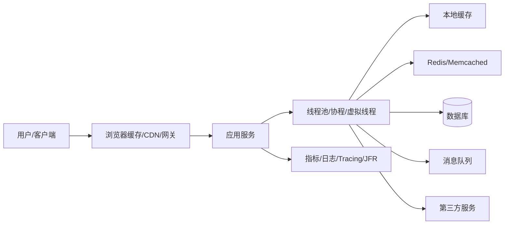
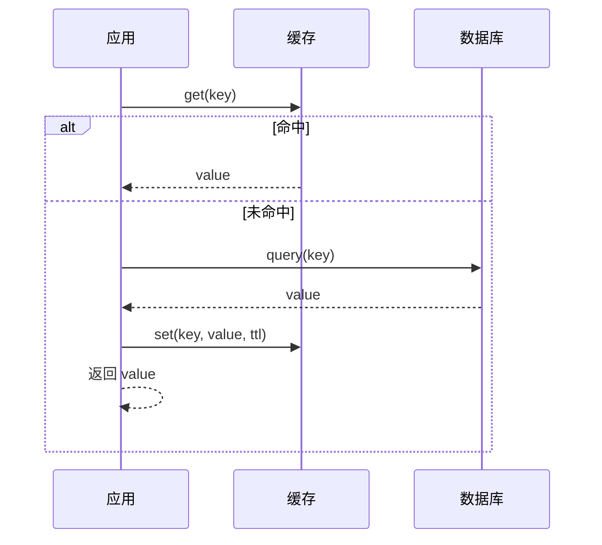
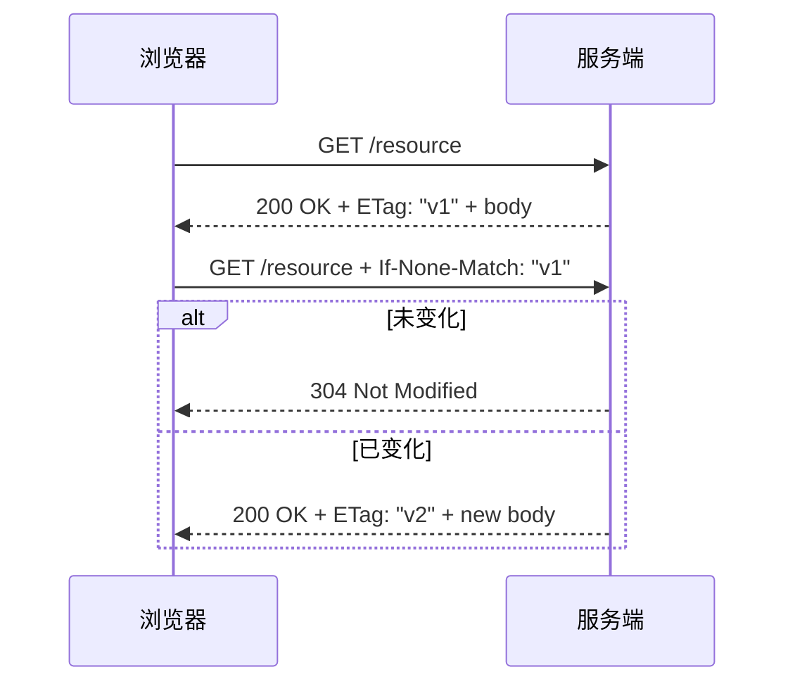
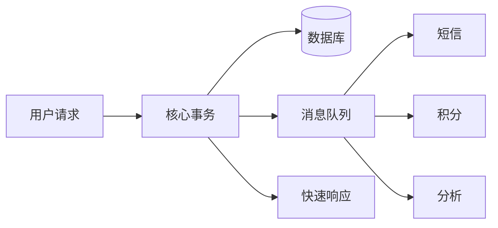
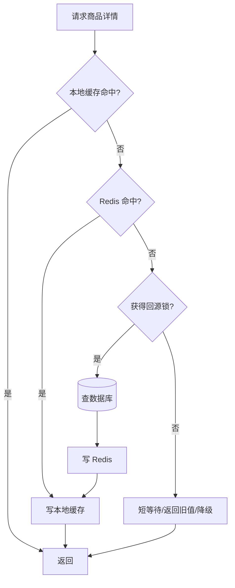

# 并发缓存与性能优化学习笔记

<!-- lecture-notes:integrated-v2 -->

## 讲义导读：把概念落到可验证实践

这一章讲的是 **并发缓存与性能优化学习笔记**，属于 **数据、缓存、权限与性能**。阅读时不要把它当成零散资料堆叠，而要把它当成一份讲义：先弄清它解决什么问题，再看核心概念和流程，最后做一个能复现、能观察、能排错的小练习。

### 一句话先懂

数据系统学习的重点，是在正确性、性能、可扩展性和安全边界之间做可验证的取舍。

初学时先问三个问题：它的输入或前提是什么；它内部按什么规则工作；结果该用什么命令、日志、测试、图纸、波形或指标来证明。

### 通俗类比

数据库像账本，缓存像常用摘要，权限像门禁，性能优化像疏通堵点；任何一个环节快但不可信，系统都会出问题。

类比只是入门扶手。真正掌握时，要回到准确术语、配置、接口、版本、边界条件、错误信息和验证证据上。能解释失败原因，比只会照着步骤跑通更重要。

### 本章学习主线

1. **先看场景**：这个知识点通常在什么项目、岗位或问题里出现？
2. **再看结构**：它有哪些核心对象、配置、文件、命令、接口或流程？
3. **然后看路径**：一次完整使用从哪里开始，到哪里结束，中间有哪些状态变化？
4. **接着看边界**：版本差异、平台差异、权限、性能、安全、兼容性和资源限制在哪里？
5. **最后看验证**：用最小样例、测试、日志、调试工具或实物结果证明理解是对的。

### 本章重点抓手

关系模型、事务、索引、查询计划、缓存策略、一致性、锁、并发、RBAC、审计、性能指标和故障恢复。

### 最小实践任务

设计一个小业务表和缓存方案，写出权限角色、关键 SQL、索引、缓存失效规则和压测/解释计划。

建议把练习记录成固定格式：目标、环境版本、最小示例、执行步骤、预期结果、实际结果、错误信息、定位过程和复盘。以后遇到真实项目问题时，这些记录会比单纯收藏教程更有用。

### 常见误区

- 缓存命中就以为数据一定正确。
- 权限只在前端控制。
- 没有事务边界和索引解释就谈性能。

### 推荐工具与资料

官方文档、最小 demo、日志、调试器、版本管理、测试命令、性能/诊断工具和复盘记录。

### 读完本章应该能做到

- 用自己的话解释核心概念和适用场景。
- 给出一个最小可运行或可验证样例。
- 说清至少一个常见错误的现象、原因和排查路径。
- 知道当前版本应该查哪份官方文档，而不是只依赖旧教程。

> 本节是讲义化改写后的阅读入口。后续正文中的命令、配置、图纸、代码和参考资料，都应围绕“场景 -> 概念 -> 操作 -> 验证 -> 复盘”来理解。


> Last researched: 2026-06-16  
> Audience level: 后端/全栈/Java/系统设计学习者  
> Scope: 本文聚焦服务端常见性能主题：并发模型、线程池、锁、Java 内存模型、虚拟线程、缓存模式、本地缓存、分布式缓存、HTTP/CDN 缓存、缓存一致性、缓存穿透/击穿/雪崩、异步化、限流降级、数据库与 IO 优化、可观测性、压测和线上排障。示例以 Java 为主，但思想适用于多数服务端系统。
## 1. 总览

性能优化不是把代码写得“看起来更快”，而是让系统在目标负载下稳定满足业务指标。典型目标包括：

- 延迟更低：用户等待时间减少，接口 P95/P99 更稳定。
- 吞吐更高：单位时间处理更多请求。
- 资源更省：同样流量下消耗更少 CPU、内存、网络、磁盘和数据库连接。
- 稳定性更好：高峰、突发、依赖抖动、缓存失效、节点故障时不轻易雪崩。
- 可定位性更强：出问题时能通过指标、日志、链路追踪、Profiling 快速定位瓶颈。

性能问题通常不是单点问题，而是链路问题。一次请求可能经过浏览器缓存、CDN、网关、应用线程池、本地缓存、Redis、数据库、消息队列、对象存储和第三方 API。任何一层的延迟、排队、锁竞争、连接池耗尽、缓存失效或重试放大，都可能拖垮整体。



Figure: 服务端性能链路示意，综合参考 Java 并发文档、Redis/AWS 缓存模式、Google SRE 和 USE/RED 监控方法。

学习这类知识建议抓住六条主线：

| 主线 | 核心问题 | 典型内容 |
| --- | --- | --- |
| 并发 | 如何同时处理更多任务 | 线程、线程池、锁、CAS、AQS、异步、虚拟线程 |
| 缓存 | 如何减少重复计算和慢存储访问 | 本地缓存、Redis、CDN、HTTP 缓存、多级缓存 |
| 数据 | 如何让存储访问更稳更快 | 索引、分页、批量、连接池、读写分离、分库分表 |
| 流控 | 如何保护系统不被突发流量打垮 | 限流、熔断、降级、隔离、背压、排队 |
| 架构 | 如何拆分、异步化和横向扩展 | 消息队列、事件驱动、无状态服务、分片 |
| 观测 | 如何证明问题和验证优化 | RED、USE、四大黄金信号、Profiling、压测 |

## 2. 学习目标

学完本文后，应能做到：

- 区分并发、并行、吞吐、延迟、QPS、TPS、P95/P99、饱和度等概念。
- 理解 Java 并发中的可见性、原子性、有序性、happens-before、volatile、synchronized、Lock、CAS、AQS。
- 能设计基本线程池参数，避免无界队列、无限制创建线程、阻塞任务混入 CPU 线程池等问题。
- 能判断同步、异步、虚拟线程、消息队列分别适合什么场景。
- 能说明 Cache-Aside、Read-Through、Write-Through、Write-Behind、Refresh-Ahead 的差异。
- 能处理缓存穿透、击穿、雪崩、热点 key、大 key、缓存污染、缓存一致性等问题。
- 能为接口设计浏览器/CDN/网关/本地/Redis/数据库多级缓存策略。
- 能建立性能排查思路：先测量，再定位瓶颈，再做小步优化，最后验证。
- 能用 RED、USE、四大黄金信号构建性能指标面板。

## 3. 基础概念

### 3.1 并发与并行

| 概念 | 含义 | 例子 |
| --- | --- | --- |
| 并发 | 同一时间段内处理多个任务，任务可能交替执行 | 单核 CPU 时间片切换多个线程 |
| 并行 | 同一时刻真正同时执行多个任务 | 多核 CPU 同时执行多个线程 |
| 同步 | 调用方等待结果返回 | HTTP 请求直接查数据库 |
| 异步 | 调用方提交任务后不立即等待最终结果 | 下单后发消息异步发送短信 |
| 阻塞 | 当前执行单元等待资源，不能继续做别的事 | 等待数据库响应 |
| 非阻塞 | 当前执行单元没有结果也可以继续执行 | NIO 事件循环 |

并发的价值不只是“更快”，更多时候是提高资源利用率。例如大量请求在等待网络 IO 时，如果每个请求都占着昂贵的平台线程，线程数会快速膨胀；如果使用异步 IO 或虚拟线程，可以更低成本地承载更多等待中的任务。

### 3.2 延迟、吞吐和并发数

| 指标 | 含义 | 常见误区 |
| --- | --- | --- |
| RT/Latency | 一次请求从发出到收到响应的时间 | 只看平均值，忽略 P95/P99 |
| QPS | 每秒请求数 | QPS 高不代表用户体验好 |
| TPS | 每秒事务数 | 需要定义“事务”边界 |
| 并发数 | 同时在系统中处理或等待的请求数量 | 并发数不等于 QPS |
| P95/P99 | 95%/99% 请求低于该延迟 | 尾延迟更能反映线上体验 |
| 饱和度 | 资源排队或接近满载程度 | CPU 低不代表没有瓶颈，可能卡在 IO/锁/连接池 |

一个简单关系：

```text
系统中平均并发数 ~= 吞吐量 * 平均响应时间
```

这就是 Little's Law 的直观用法。例如一个接口 1000 QPS，平均响应 200ms，则系统中大约有 200 个请求处于处理中或等待中。响应时间变长时，即使入口 QPS 不变，并发堆积也会变大，最终耗尽线程、连接池、内存或队列。

### 3.3 CPU 密集与 IO 密集

| 类型 | 特点 | 优化方向 |
| --- | --- | --- |
| CPU 密集 | 主要时间花在计算、压缩、加密、序列化、图片处理 | 减少算法复杂度、并行计算、SIMD/本地库、减少锁竞争 |
| IO 密集 | 主要时间花在网络、数据库、磁盘、第三方 API | 异步化、缓存、批量、连接池、虚拟线程、超时和降级 |
| 混合型 | 既有计算又有 IO | 拆分线程池，避免互相阻塞 |

线程数不是越多越好。CPU 密集任务线程过多会增加上下文切换；IO 密集任务可以有更多并发，但要受连接池、下游容量、内存和队列限制。

## 4. Java 并发基础

### 4.1 Java 内存模型：可见性、原子性、有序性

Java 内存模型规定了线程之间如何通过内存交互，核心是 happens-before 关系。根据 JLS 第 17 章，正确同步的程序才能获得可预测的跨线程可见性。

| 问题 | 含义 | 常见解决手段 |
| --- | --- | --- |
| 可见性 | 一个线程修改共享变量，其他线程能否看到 | volatile、synchronized、Lock、final 安全发布 |
| 原子性 | 一个操作是否不可被中途打断 | synchronized、Lock、AtomicInteger、LongAdder |
| 有序性 | 编译器/CPU/JIT 是否可能重排 | volatile、锁、内存屏障、happens-before |

常见 happens-before 规则：

- 同一线程内，前面的操作 happens-before 后面的操作。
- 对一个锁的 unlock happens-before 后续对同一个锁的 lock。
- 对 volatile 变量的写 happens-before 后续对同一个 volatile 变量的读。
- 线程 `start()` happens-before 被启动线程中的动作。
- 线程中的动作 happens-before 其他线程从 `join()` 成功返回。

错误示例：

```java
class StopFlag {
    private boolean stop = false;

    void worker() {
        while (!stop) {
            // do work
        }
    }

    void stop() {
        stop = true;
    }
}
```

`stop` 没有同步保证，工作线程可能长期看不到主线程写入。修正方式：

```java
class StopFlag {
    private volatile boolean stop = false;

    void worker() {
        while (!stop) {
            // do work
        }
    }

    void stop() {
        stop = true;
    }
}
```

注意：`volatile` 适合状态标记、配置引用、单写多读等场景，但不适合 `count++` 这类复合操作，因为 `count++` 包含读、加、写三个步骤。

### 4.2 synchronized、Lock、CAS、AQS

| 机制 | 适合场景 | 优点 | 风险 |
| --- | --- | --- | --- |
| synchronized | 简单互斥、对象内状态保护 | 语义清楚，JVM 优化成熟 | 锁范围过大导致阻塞 |
| ReentrantLock | 需要可中断、超时、公平锁、多个条件队列 | 控制能力强 | 必须 finally unlock |
| Atomic/CAS | 简单计数、状态机、无锁更新 | 避免阻塞 | 自旋消耗 CPU，ABA，复杂逻辑难写对 |
| LongAdder | 高并发计数 | 竞争低，吞吐高 | 读取是汇总值，不适合严格瞬时一致 |
| AQS | 构建锁、信号量、闭锁等同步器 | JUC 基础设施 | 使用者通常不直接实现 |

`ConcurrentHashMap + LongAdder` 是高并发计数的典型写法：

```java
ConcurrentHashMap<String, LongAdder> counters = new ConcurrentHashMap<>();

void record(String key) {
    counters.computeIfAbsent(key, k -> new LongAdder()).increment();
}

long get(String key) {
    LongAdder adder = counters.get(key);
    return adder == null ? 0 : adder.sum();
}
```

这个模式来自 JDK 官方文档：`ConcurrentHashMap` 可配合 `LongAdder` 做可扩展频率表。

### 4.3 锁优化思路

锁不是不能用，关键是缩小锁竞争和锁持有时间。

| 优化方向 | 做法 |
| --- | --- |
| 缩小临界区 | 只把真正共享状态修改放进锁内 |
| 减少共享 | 使用局部变量、不可变对象、ThreadLocal、分片 |
| 降低粒度 | 全局锁改成分段锁、按 key 加锁 |
| 避免锁内 IO | 锁内不要调用数据库、Redis、HTTP、文件系统 |
| 避免嵌套锁 | 降低死锁概率，固定加锁顺序 |
| 使用读写锁 | 读多写少时可考虑，但写多时可能更差 |
| 使用无锁结构 | 原子类、并发集合、队列 |

死锁四条件：

- 互斥：资源同一时刻只能被一个线程持有。
- 占有且等待：持有一个资源时继续等待另一个资源。
- 不可抢占：资源不能被强制夺走。
- 循环等待：多个线程形成等待环。

工程上避免死锁常用策略：

- 固定资源加锁顺序。
- 使用 `tryLock(timeout)`，超时释放已持有资源。
- 避免锁内调用外部系统或回调用户代码。
- 用线程 dump 查看 `BLOCKED`、`WAITING`、死锁报告。

## 5. 线程池与异步执行

### 5.1 线程池为什么重要

线程池的价值：

- 复用线程，减少创建和销毁成本。
- 控制并发上限，保护 CPU、内存、连接池和下游系统。
- 通过队列削峰，但队列不能无限制堆积。
- 统一监控任务数、队列长度、拒绝次数、执行耗时。

常见错误：

- 使用 `Executors.newFixedThreadPool`，默认无界队列，可能堆积大量任务导致 OOM。
- 使用 `Executors.newCachedThreadPool`，可能无限创建线程。
- 所有任务共用一个线程池，慢 IO 拖死 CPU 任务。
- 拒绝策略使用默认 `AbortPolicy` 但没有处理异常。
- 没有设置任务超时，任务永久阻塞。
- 没有暴露线程池指标，出问题只看到接口变慢。

推荐显式创建线程池：

```java
ThreadPoolExecutor executor = new ThreadPoolExecutor(
    16,
    64,
    60, TimeUnit.SECONDS,
    new ArrayBlockingQueue<>(1000),
    r -> {
        Thread t = new Thread(r);
        t.setName("order-worker-" + t.getId());
        return t;
    },
    new ThreadPoolExecutor.CallerRunsPolicy()
);
```

### 5.2 线程池参数怎么估算

没有一个公式能替代压测，但可以用经验起点：

| 任务类型 | 初始线程数思路 |
| --- | --- |
| CPU 密集 | 接近 CPU 核数或核数 + 1 |
| IO 密集 | 大于 CPU 核数，取决于等待时间/计算时间比例 |
| 混合任务 | 拆成 CPU 池和 IO 池 |
| 调用下游 | 不能超过下游承载能力和连接池大小 |

估算公式：

```text
线程数 ~= CPU 核数 * CPU 目标利用率 * (1 + 等待时间 / 计算时间)
```

例如 8 核机器，目标 CPU 70%，任务平均计算 20ms、等待 IO 80ms：

```text
线程数 ~= 8 * 0.7 * (1 + 80 / 20) = 28
```

这只是起点，最终要通过压测观察：

- CPU 是否达到目标利用率。
- 队列长度是否持续增长。
- P95/P99 是否恶化。
- GC 是否增加。
- 下游连接池是否耗尽。
- 拒绝任务是否可接受。

### 5.3 CompletableFuture 与异步编排

适合把多个互不依赖的 IO 调用并行化：

```java
CompletableFuture<User> userFuture =
    CompletableFuture.supplyAsync(() -> userService.getUser(userId), ioExecutor);

CompletableFuture<List<Order>> orderFuture =
    CompletableFuture.supplyAsync(() -> orderService.listRecentOrders(userId), ioExecutor);

CompletableFuture<ProfilePage> pageFuture = userFuture.thenCombine(
    orderFuture,
    ProfilePage::new
);

ProfilePage page = pageFuture.orTimeout(500, TimeUnit.MILLISECONDS).join();
```

注意点：

- 明确传入业务线程池，不要默认使用公共 `ForkJoinPool` 承载阻塞 IO。
- 给每个下游调用设置超时。
- 异常要收敛，不能让一个非核心接口拖垮整个页面。
- 并行化会提高下游瞬时压力，必须配合限流和连接池上限。

### 5.4 虚拟线程

Java 21 将虚拟线程作为正式特性。虚拟线程是轻量级线程，适合大量阻塞式 IO 场景，让代码保持同步风格，同时降低线程资源成本。

```java
try (var executor = Executors.newVirtualThreadPerTaskExecutor()) {
    Future<String> result = executor.submit(() -> httpClient.get(url));
    return result.get();
}
```

适合：

- 请求主要等待数据库、HTTP、RPC、文件等 IO。
- 想保留同步代码风格，降低回调和异步链复杂度。
- 每个任务生命周期清晰，任务数量多但大部分时间在等待。

不适合：

- CPU 密集计算。虚拟线程不会让 CPU 核数变多。
- 依赖大量 `synchronized` 长时间阻塞的旧代码，可能出现 carrier thread pinning。
- 没有下游限流。虚拟线程能发起更多并发，也更容易压垮数据库或第三方服务。

工程建议：

- 虚拟线程解决“线程贵”的问题，不解决“下游容量有限”的问题。
- 数据库连接池、HTTP 连接池、Redis 连接池仍然要限制。
- 用压测验证 P95/P99、连接池等待时间和下游错误率。
- 关注 JFR 中线程、锁、阻塞和 pinning 相关事件。

## 6. 缓存基础

### 6.1 缓存的本质

缓存是用更快、更近、更便宜的存储或计算结果，替代重复访问慢资源。代价是：

- 数据可能过期。
- 会占用内存。
- 需要淘汰策略。
- 会引入一致性问题。
- 会出现穿透、击穿、雪崩、热点 key 等新故障模式。

缓存适合：

- 读多写少。
- 数据可短暂不一致。
- 计算或查询成本高。
- 热点明显。
- 结果可以通过 key 唯一确定。

缓存不适合：

- 强一致交易核心链路。
- 写多读少且变化频繁的数据。
- 无法接受旧值的数据。
- key 空间巨大但访问无重复，命中率低。
- 大对象、无限增长对象、不可控用户输入对象。

### 6.2 缓存指标

| 指标 | 含义 | 观察重点 |
| --- | --- | --- |
| Hit Ratio | 命中率 | 命中低说明 key 设计、TTL、容量或访问模式有问题 |
| Miss Rate | 未命中率 | 未命中是否打到数据库 |
| Load Time | 回源耗时 | 回源慢会放大击穿风险 |
| Eviction Count | 淘汰次数 | 容量不足或 TTL/权重设计不合理 |
| Stale Rate | 返回旧值比例 | 是否符合业务容忍度 |
| Key Cardinality | key 数量 | 是否存在 key 爆炸 |
| Hot Key | 热点 key | 单 key QPS 是否过高 |
| Big Key | 大 key | 单 value 是否过大，是否阻塞网络/序列化/Redis |

## 7. 缓存模式

### 7.1 Cache-Aside

Cache-Aside 是最常见模式，也叫 Lazy Loading。应用自己控制缓存和数据库。

读取流程：



写入流程常见做法：

```text
先更新数据库，再删除缓存
```

为什么通常是删除缓存而不是更新缓存：

- 删除比更新更简单，避免复杂对象重新计算。
- 多表聚合缓存很难在写入时准确更新。
- 删除后下一次读取会用新数据库值回填。

风险：

- 数据库更新成功、删除缓存失败，会读到旧缓存。
- 删除缓存后大量并发读可能击穿数据库。
- 读写并发下仍可能出现短暂不一致。

改进：

- 删除缓存失败进入重试队列。
- 使用延迟双删，但只能降低概率，不是强一致保证。
- 用消息队列或 CDC 订阅数据库变更删除缓存。
- 对热点 key 使用单飞机制或互斥锁回源。

### 7.2 Read-Through

应用只读缓存，缓存层负责加载数据。适合缓存产品或框架支持 loader 的场景。

优点：

- 应用代码简单。
- 加载逻辑集中。
- 可做请求合并。

缺点：

- 缓存层和数据源耦合。
- 分布式缓存通常没有完整业务加载能力，更多见于本地缓存库。

Caffeine 的 `LoadingCache` 就是典型 Read-Through 风格：

```java
LoadingCache<Long, User> cache = Caffeine.newBuilder()
    .maximumSize(10_000)
    .expireAfterWrite(Duration.ofMinutes(10))
    .build(userRepository::findById);

User user = cache.get(userId);
```

### 7.3 Write-Through

写入时同时更新数据库和缓存。

优点：

- 写后读缓存更可能命中新值。
- 适合写入路径可控、读多写少、数据模型简单的场景。

缺点：

- 写延迟增加。
- 数据库成功、缓存失败时仍要处理一致性。
- 对复杂聚合缓存不友好。

### 7.4 Write-Behind

先写缓存或内存队列，再异步写数据库。

优点：

- 写入延迟低。
- 可以批量合并写数据库。

缺点：

- 宕机可能丢数据。
- 一致性复杂。
- 需要可靠队列、重试、幂等、补偿。

适合日志、计数、统计、非核心状态，不适合金融账务等强一致核心数据。

### 7.5 Refresh-Ahead / Stale-While-Revalidate

在缓存快过期或已经过期时，先返回旧值，同时异步刷新。

适合：

- 可以接受短时间旧值。
- 热点数据回源成本高。
- 希望尾延迟稳定。

常见实现：

- Caffeine `refreshAfterWrite`。
- HTTP `stale-while-revalidate`。
- 应用层维护逻辑过期时间：物理 TTL 较长，逻辑 TTL 到期后异步刷新。

## 8. 多级缓存

多级缓存从近到远通常是：

```text
浏览器缓存 -> CDN -> 网关/Nginx 缓存 -> 应用本地缓存 -> Redis -> 数据库
```

| 层级 | 优点 | 风险 |
| --- | --- | --- |
| 浏览器缓存 | 离用户最近，减少请求 | 失效不可完全控制 |
| CDN | 抗大流量，适合静态资源和公开内容 | 个性化内容不能乱缓存 |
| 网关/Nginx | 降低应用入口压力 | 配置复杂，需区分用户态 |
| 本地缓存 | 极低延迟，不走网络 | 多实例一致性弱，占用 JVM 内存 |
| Redis | 跨实例共享，性能高 | 网络开销、热点 key、大 key、可用性 |
| 数据库 | 权威数据源 | 慢、贵、连接有限 |

设计原则：

- 越靠前的缓存，越适合公开、静态、弱个性化数据。
- 越靠后的缓存，越适合业务对象和权限相关数据。
- 用户私有数据不要被 CDN 或共享代理错误缓存。
- 多级缓存必须明确失效链路，否则问题会很难排查。

## 9. 本地缓存：Caffeine

Caffeine 是 Java 常用高性能本地缓存库，支持手动缓存、同步加载、异步加载、过期、刷新、最大容量、统计等能力。

### 9.1 适合场景

- 配置、字典、权限点、规则、低频变化元数据。
- 热点读非常高，希望减少 Redis 网络开销。
- 允许单实例短暂不一致。
- key 数量可控。

不适合：

- 大量用户私有对象无限缓存。
- 需要多实例强一致。
- value 很大，容易撑爆 JVM 堆。
- 写入频繁、失效复杂的数据。

### 9.2 常见配置

```java
Cache<String, Product> cache = Caffeine.newBuilder()
    .maximumSize(100_000)
    .expireAfterWrite(Duration.ofMinutes(10))
    .recordStats()
    .build();
```

异步加载：

```java
AsyncLoadingCache<Long, Product> cache = Caffeine.newBuilder()
    .maximumSize(100_000)
    .expireAfterWrite(Duration.ofMinutes(10))
    .refreshAfterWrite(Duration.ofMinutes(1))
    .buildAsync(productRepository::findByIdAsync);
```

注意：

- 一定设置容量上限或权重上限。
- 开发和压测环境开启 `recordStats()` 观察命中率。
- value 大小时使用 `maximumWeight + weigher`。
- 不要把异常结果长期缓存，除非明确是“空对象缓存”。

## 10. 分布式缓存：Redis

Redis 常用于缓存、计数、排行榜、限流、分布式锁、会话、消息流等场景。作为缓存时重点不是命令本身，而是缓存策略和故障模式。

### 10.1 key 设计

推荐：

```text
业务:对象类型:对象ID:字段或版本
user:profile:10001:v1
product:detail:sku123:v3
permission:role:admin:v2
```

原则：

- key 可读、可定位、可按业务归类。
- 避免过长 key，浪费内存和网络。
- 加版本号方便整体切换。
- 避免把用户可控长字符串直接作为 key。
- 对热点 key 需要提前识别和拆分。

### 10.2 TTL 设计

| 数据类型 | TTL 建议 |
| --- | --- |
| 商品详情 | 分钟级到小时级，写入删除缓存 |
| 首页/榜单 | 秒级到分钟级，可异步刷新 |
| 配置/字典 | 长 TTL + 变更主动失效 |
| 用户会话 | 跟登录态生命周期一致 |
| 空对象缓存 | 短 TTL，避免穿透 |
| 热点数据 | 逻辑过期 + 异步刷新，避免物理过期击穿 |

TTL 加随机抖动：

```java
long ttlSeconds = 3600 + ThreadLocalRandom.current().nextLong(0, 300);
redis.setex(key, ttlSeconds, value);
```

这样可以降低大量 key 同时过期导致雪崩的概率。

### 10.3 大 key 与热 key

大 key 风险：

- 网络传输慢。
- 序列化/反序列化慢。
- Redis 单线程执行大对象命令可能阻塞其他请求。
- 迁移、复制、删除成本高。

治理：

- 拆分 value，例如按分页、字段、时间片拆。
- 使用 Hash 但也要控制 field 数量和 value 大小。
- 删除大 key 使用渐进式删除策略。
- 定期扫描 key 大小和访问频率。

热 key 风险：

- 单 key QPS 极高，打满 Redis 单分片或网卡。
- 热点失效会瞬间击穿数据库。

治理：

- 本地缓存扛热点。
- 热点 key 多副本：`hot:product:1:0..N` 随机读。
- 逻辑过期 + 异步刷新。
- 单飞回源，避免并发重建。
- 提前预热。

## 11. 缓存三大问题

### 11.1 缓存穿透

定义：请求查询的数据在缓存和数据库中都不存在，导致每次请求都绕过缓存打到数据库。

例子：攻击者不断请求不存在的用户 ID。

解决：

| 方案 | 优点 | 缺点 |
| --- | --- | --- |
| 参数校验 | 成本低，挡明显非法请求 | 挡不住合法格式的不存在 ID |
| 空对象缓存 | 简单有效 | 会占内存，TTL 要短 |
| 布隆过滤器 | 空间效率高，适合判断“可能存在/一定不存在” | 有误判，删除困难 |
| 限流/风控 | 抵抗恶意请求 | 需要规则和运营 |

空对象缓存示例：

```java
Product product = redis.get(key);
if (product != null) {
    return product == NullProduct.INSTANCE ? null : product;
}

product = db.findProduct(id);
if (product == null) {
    redis.setex(key, 60, NullProduct.INSTANCE);
    return null;
}

redis.setex(key, 3600, product);
return product;
```

### 11.2 缓存击穿

定义：某个热点 key 过期，大量请求同时未命中，集中打到数据库。

解决：

- 热点 key 不设置短物理过期，改用逻辑过期。
- 单飞机制：同一个 key 同一时间只允许一个请求回源。
- 分布式锁：一个实例重建缓存，其他实例等待或返回旧值。
- 预热热点数据。
- 互斥回源失败时返回旧值或降级值。

单飞思想：

```java
Value getWithSingleFlight(String key) {
    Value cached = cache.get(key);
    if (cached != null && !cached.logicExpired()) {
        return cached;
    }

    Lock lock = lockFor(key);
    if (lock.tryLock()) {
        try {
            Value latest = db.load(key);
            cache.set(key, latest);
            return latest;
        } finally {
            lock.unlock();
        }
    }

    return cached != null ? cached : fallback();
}
```

### 11.3 缓存雪崩

定义：大量 key 同时失效，或缓存集群故障，导致请求大面积打到数据库。

解决：

- TTL 加随机抖动。
- 热点预热。
- 多级缓存。
- Redis 高可用和容量规划。
- 限流、熔断、降级。
- 缓存不可用时快速失败或返回兜底，不要把所有流量转发到数据库。

## 12. 缓存一致性

缓存一致性没有银弹，要先问业务能接受什么一致性。

| 一致性级别 | 含义 | 场景 |
| --- | --- | --- |
| 强一致 | 读一定读到最新写入 | 支付、库存扣减、账户余额 |
| 最终一致 | 短暂不一致可接受，最终收敛 | 商品详情、用户资料、配置 |
| 弱一致 | 允许较长时间旧值 | 榜单、推荐、统计 |

常见方案：

| 方案 | 流程 | 适合 |
| --- | --- | --- |
| 先写 DB 再删缓存 | DB 成功后删除缓存 | Cache-Aside 主流方案 |
| 延迟双删 | 写 DB 前后或后续延迟再删一次 | 降低并发读写不一致概率 |
| MQ 删除缓存 | 写 DB 后发消息删除缓存 | 删除失败可重试 |
| CDC/binlog 失效 | 订阅数据库变更删除缓存 | 多服务共享失效链路 |
| 版本号缓存 | value 带版本，旧版本不覆盖新版本 | 避免乱序写 |
| 短 TTL | 靠过期自然收敛 | 简单但不实时 |

重要结论：

- 缓存和数据库跨系统操作很难做到强一致。
- 对强一致数据，不要把缓存作为权威判断依据。
- 缓存删除失败必须可重试。
- 写路径和读路径都要考虑并发交错。

## 13. HTTP 与 CDN 缓存

HTTP 缓存由 RFC 9111 定义，常见控制头包括 `Cache-Control`、`ETag`、`Last-Modified`、`Expires`。

### 13.1 常见 Cache-Control

| 指令 | 含义 |
| --- | --- |
| `max-age=60` | 响应可缓存 60 秒 |
| `s-maxage=60` | 共享缓存如 CDN 使用的 max-age |
| `public` | 可被共享缓存存储 |
| `private` | 只允许浏览器私有缓存 |
| `no-store` | 不存储 |
| `no-cache` | 使用前必须向源站 revalidate |
| `must-revalidate` | 过期后必须重新验证 |
| `stale-while-revalidate=30` | 过期后可先返回旧值并后台刷新 |
| `stale-if-error=300` | 源站错误时可返回旧缓存 |

静态资源推荐：

```http
Cache-Control: public, max-age=31536000, immutable
```

前提是文件名带 hash，例如：

```text
app.8f3a1c.js
style.19ac2d.css
```

用户私有 API：

```http
Cache-Control: private, no-store
```

公开列表页短缓存：

```http
Cache-Control: public, max-age=30, stale-while-revalidate=60
```

### 13.2 ETag 与协商缓存

流程：



协商缓存减少响应体传输，但仍然有一次请求往返。强缓存则连请求都不发。

## 14. 异步化、队列与削峰

异步化适合把非核心、耗时、可重试的步骤从主链路移出去。

例子：

- 下单主链路：创建订单、扣库存、支付状态。
- 异步链路：发短信、发邮件、积分、推荐特征、数据分析。



异步不是免费午餐，会引入：

- 消息丢失。
- 重复消费。
- 顺序问题。
- 延迟积压。
- 补偿和幂等。
- 事务边界复杂。

设计要点：

- 消费者必须幂等。
- 消息要有唯一业务 ID。
- 失败要重试，但要有最大次数和死信队列。
- 队列积压要有监控。
- 对用户可见状态要能表达“处理中”。

## 15. 限流、熔断、降级、隔离

### 15.1 限流

限流是控制入口流量，避免系统超过承载能力。

| 算法 | 特点 | 场景 |
| --- | --- | --- |
| 固定窗口 | 实现简单 | 粗粒度接口限流 |
| 滑动窗口 | 比固定窗口平滑 | API 网关 |
| 漏桶 | 匀速流出 | 平滑处理请求 |
| 令牌桶 | 允许突发 | 常用通用限流 |
| 并发数限制 | 控制同时执行数量 | 保护慢接口和下游 |

令牌桶直觉：

```text
系统按固定速率生成令牌，请求拿到令牌才执行；桶容量允许短时间突发。
```

### 15.2 熔断

熔断是发现下游持续失败或超时后，临时停止调用下游，直接失败或走 fallback，避免线程被拖死。

状态：

- Closed：正常调用。
- Open：熔断，快速失败。
- Half-Open：放少量探测请求，成功则恢复，失败则继续熔断。

### 15.3 降级

降级是在资源不足或依赖异常时，牺牲非核心能力保核心链路。

例子：

- 商品详情页不展示推荐。
- 评论只展示缓存旧数据。
- 排行榜返回上一次快照。
- 搜索关闭复杂排序。

### 15.4 隔离

隔离是避免一个依赖或业务拖垮整体。

方式：

- 不同业务线程池隔离。
- 不同下游连接池隔离。
- 核心/非核心接口资源隔离。
- 租户隔离。
- 舱壁模式。

## 16. 数据库与 IO 性能

### 16.1 数据库常见优化

| 问题 | 优化 |
| --- | --- |
| 慢查询 | 建索引、改 SQL、减少扫描行数 |
| N+1 查询 | 批量查询、join、预加载 |
| 深分页慢 | 基于游标/seek 分页 |
| 大事务 | 拆小事务，减少锁持有时间 |
| 热点行 | 分片、队列串行化、乐观锁、合并写 |
| 连接池耗尽 | 调整池大小、减少慢查询、设置超时 |
| 写入压力大 | 批量写、异步写、削峰 |

### 16.2 连接池

连接池保护数据库和下游服务，不能无限放大。

关键指标：

- active connections：活跃连接数。
- idle connections：空闲连接数。
- pending acquire：等待连接的请求数。
- acquire time：获取连接耗时。
- timeout count：获取连接超时次数。

连接池过小会排队，过大会压垮数据库。调参要看数据库 CPU、锁等待、慢查询、连接数上限和应用实例数量。

### 16.3 批量与合并

批量能减少网络往返和事务开销：

```text
1000 次单条写入 -> 10 次每批 100 条写入
```

但批量过大也会导致：

- 单次事务太长。
- 锁持有时间增加。
- 内存占用增加。
- 失败重试成本变大。

建议从小批量开始压测，例如 50、100、500 对比。

## 17. JVM 性能关注点

### 17.1 GC

常见指标：

- 堆使用率。
- Young GC 频率和耗时。
- Full GC 次数和耗时。
- 分配速率。
- 晋升速率。
- 老年代占用。
- GC 后存活对象大小。

常见问题：

- 大量临时对象导致 Young GC 频繁。
- 缓存无上限导致老年代膨胀。
- 大对象直接进入老年代。
- 日志/JSON/字符串拼接造成分配过多。

优化顺序：

1. 先确认是否真是 GC 导致延迟。
2. 找出分配热点。
3. 减少无意义对象创建。
4. 控制缓存大小。
5. 再调整堆和 GC 参数。

### 17.2 JFR 与 Profiling

Java Flight Recorder 可用于记录 JVM 事件，适合分析：

- CPU 热点。
- 方法采样。
- 锁竞争。
- 线程阻塞。
- 文件/Socket IO。
- 对象分配。
- GC 暂停。
- 虚拟线程 pinning。

常用命令示例：

```bash
jcmd <pid> JFR.start name=profile settings=profile duration=120s filename=app.jfr
jcmd <pid> JFR.dump name=profile filename=app.jfr
jcmd <pid> JFR.stop name=profile
```

排查原则：

- CPU 高：看 CPU profile 和热点方法。
- CPU 不高但延迟高：看锁、IO、连接池、队列、下游。
- GC 高：看分配热点和缓存大小。
- 线程多：看线程状态和阻塞点。

## 18. 性能观测方法

### 18.1 四大黄金信号

Google SRE 常用四大黄金信号：

| 信号 | 含义 |
| --- | --- |
| Latency | 请求延迟，区分成功和失败请求 |
| Traffic | 系统流量，如 QPS、请求数 |
| Errors | 错误率、失败数 |
| Saturation | 饱和度，系统还有多少余量 |

### 18.2 RED 方法

RED 适合服务接口：

| 指标 | 含义 |
| --- | --- |
| Rate | 每秒请求数 |
| Errors | 每秒错误数或错误率 |
| Duration | 请求耗时分布 |

每个重要接口都应有：

- QPS。
- P50/P95/P99。
- 2xx/4xx/5xx。
- 超时数。
- 依赖调用耗时。

### 18.3 USE 方法

USE 适合资源排查，由 Brendan Gregg 提出：

| 指标 | 含义 | 例子 |
| --- | --- | --- |
| Utilization | 使用率 | CPU 使用率、磁盘忙碌率 |
| Saturation | 饱和度/排队 | CPU run queue、磁盘队列、连接池等待 |
| Errors | 错误 | 网卡错误、磁盘错误、超时、拒绝 |

资源排查表：

| 资源 | Utilization | Saturation | Errors |
| --- | --- | --- | --- |
| CPU | CPU 使用率 | run queue、线程数 | CPU throttling |
| 内存 | used、RSS、heap | swap、GC 压力 | OOM |
| 磁盘 | busy%、吞吐 | await、queue depth | IO error |
| 网络 | 带宽使用 | 丢包、重传 | connection reset |
| 线程池 | active/max | queue size | reject count |
| DB 连接池 | active/max | pending acquire | timeout |
| Redis | ops、CPU、内存 | client queue、latency | timeout、eviction |

## 19. 压测与容量规划

### 19.1 压测前明确目标

压测不是随便打流量，要先定义：

- 目标 QPS/TPS。
- 目标 P95/P99。
- 可接受错误率。
- 数据规模。
- 请求比例。
- 缓存命中率。
- 是否包含登录、鉴权、数据库写入、第三方依赖。

### 19.2 压测类型

| 类型 | 目的 |
| --- | --- |
| 基准测试 | 单接口、单组件最大能力 |
| 负载测试 | 验证目标负载是否达标 |
| 压力测试 | 找系统极限和拐点 |
| 稳定性测试 | 长时间运行看内存泄漏、GC、连接泄漏 |
| 峰值测试 | 模拟突发流量 |
| 故障演练 | Redis/DB/下游异常时系统表现 |

### 19.3 看拐点

性能曲线通常不是线性的：

```text
低负载：延迟稳定
接近瓶颈：P95/P99 开始上升
超过瓶颈：队列堆积、超时、重试、错误率上升
雪崩：线程/连接/内存耗尽
```

优化时要找第一个拐点，而不是只看最高 QPS。

## 20. 常见性能优化手段

| 手段 | 适合 | 风险 |
| --- | --- | --- |
| 缓存 | 重复读、慢查询、热点数据 | 一致性和失效复杂 |
| 并行化 | 多个独立 IO | 下游压力增大 |
| 异步化 | 非核心耗时任务 | 最终一致和补偿复杂 |
| 批量化 | 大量小请求/小写入 | 单批过大影响延迟 |
| 池化 | 线程、连接、对象复用 | 池耗尽和泄漏 |
| 限流 | 保护入口和下游 | 拒绝部分请求 |
| 降级 | 保核心链路 | 功能不完整 |
| 分片 | 扩展容量、降低热点 | 路由和一致性复杂 |
| 索引优化 | 数据库查询慢 | 写入成本和空间增加 |
| 减少序列化 | JSON/对象转换热点 | 可读性或兼容性影响 |
| 压缩 | 网络瓶颈 | CPU 增加 |

## 21. 典型场景方案

### 21.1 商品详情页

目标：读多写少，高峰流量大。

方案：

- CDN 缓存公开静态资源。
- 应用本地缓存热点商品。
- Redis 缓存商品详情。
- DB 作为权威数据源。
- 商品更新后发消息删除 Redis 和本地缓存。
- 热点商品逻辑过期 + 异步刷新。
- TTL 加随机抖动。

流程：



### 21.2 秒杀/抢购

目标：瞬时高并发，库存不能超卖。

方案：

- 页面静态化 + CDN。
- 活动开始前预热库存到 Redis。
- 接口限流和验证码/风控。
- Redis 原子扣减或 Lua 脚本做资格判断。
- 成功请求写消息队列，异步创建订单。
- 数据库最终落单，唯一索引防重复。
- 用户查询订单状态显示“排队中/成功/失败”。

注意：

- Redis 扣减只是快速入口控制，最终库存和订单仍需数据库约束兜底。
- 消费者必须幂等。
- 队列积压要可见。

### 21.3 配置中心/字典数据

目标：读非常多，变化少。

方案：

- 本地缓存为主。
- 配置变更通过消息通知各实例失效。
- 本地缓存设置较长 TTL 作为兜底。
- 拉取失败时保留旧值。

### 21.4 聚合首页

目标：一次页面聚合多个服务，避免一个慢服务拖累整体。

方案：

- 多个组件并行拉取。
- 每个组件独立超时。
- 非核心组件失败返回空位或旧缓存。
- 重要组件使用缓存快照。
- 线程池隔离。

## 22. 常见坑与排查

### 22.1 线程池相关

| 现象 | 可能原因 | 排查 |
| --- | --- | --- |
| 接口突然变慢 | 队列堆积、下游慢 | 看 active、queue、task duration |
| CPU 不高但请求超时 | 线程阻塞、连接池耗尽 | thread dump、连接池 pending |
| OOM | 无界队列堆积任务 | 看队列大小和堆 dump |
| 部分接口拖累整体 | 共用线程池 | 拆池隔离 |

### 22.2 缓存相关

| 现象 | 可能原因 | 排查 |
| --- | --- | --- |
| 命中率低 | key 设计错误、TTL 太短、容量不足 | 看 hit ratio、eviction、key 分布 |
| DB 突然被打满 | 缓存雪崩/击穿/Redis 故障 | 看 Redis miss、DB QPS、TTL 分布 |
| Redis 延迟高 | 大 key、慢命令、网络、持久化 | slowlog、latency、bigkeys |
| 数据不一致 | 删除缓存失败、并发读写 | 查写链路、消息重试、版本号 |

### 22.3 数据库相关

| 现象 | 可能原因 | 排查 |
| --- | --- | --- |
| 慢查询增多 | 索引失效、数据量增长 | explain、慢 SQL |
| 连接池耗尽 | SQL 慢、事务长、池太小 | active/pending/acquire time |
| 锁等待 | 热点行、大事务 | DB lock wait、事务日志 |
| 写入慢 | 索引多、批量不合理 | 写入耗时、redo/binlog、磁盘 |

## 23. 性能优化流程

推荐流程：

```text
明确目标 -> 建立基线 -> 找瓶颈 -> 小步优化 -> 压测验证 -> 观察线上 -> 复盘沉淀
```

不要一上来就改架构。先回答：

1. 慢在哪里：客户端、网关、应用、Redis、DB、第三方？
2. 是平均慢还是尾延迟慢？
3. 是 CPU、内存、磁盘、网络、锁、连接池、队列哪类资源饱和？
4. 是所有请求慢还是某些 key/用户/接口慢？
5. 最近是否有发布、流量变化、数据量变化、缓存失效、下游异常？

## 24. 面试与工程表达

### 24.1 如何回答“如何提升系统性能”

结构化回答：

1. 先定义目标：QPS、P95、错误率、成本。
2. 建立观测：RED/USE、日志、Tracing、Profiling。
3. 找瓶颈：CPU、IO、DB、缓存、锁、线程池、下游。
4. 针对优化：缓存、索引、批量、异步、并行、限流、降级、隔离。
5. 验证效果：压测对比、线上灰度、回滚方案。

### 24.2 如何回答“缓存和数据库如何保持一致”

推荐回答：

- 先说明缓存不是权威数据源，数据库才是。
- 根据业务一致性要求选择方案。
- 常见读多写少场景采用 Cache-Aside：先更新数据库，再删除缓存。
- 删除失败必须重试，可用 MQ 或 CDC。
- 热点数据用逻辑过期和单飞机制避免击穿。
- 对强一致场景，不依赖缓存做最终判断，使用数据库事务/唯一约束/乐观锁兜底。

### 24.3 如何回答“线程池参数怎么设置”

推荐回答：

- 区分 CPU 密集和 IO 密集。
- CPU 密集接近核数；IO 密集根据等待/计算比例估算。
- 结合下游连接池和承载能力限制最大并发。
- 使用有界队列和明确拒绝策略。
- 监控 active、queue、reject、task duration。
- 最终以压测结果为准。

## 25. 速查表

### 25.1 并发工具选择

| 需求 | 推荐 |
| --- | --- |
| 简单互斥 | synchronized |
| 可超时/可中断锁 | ReentrantLock |
| 高并发计数 | LongAdder |
| 原子状态更新 | AtomicReference/AtomicInteger |
| 读多写少集合 | ConcurrentHashMap |
| 多生产多消费 | BlockingQueue |
| 大量 IO 阻塞任务 | 虚拟线程或异步 IO |
| 复杂异步编排 | CompletableFuture/响应式框架 |

### 25.2 缓存策略选择

| 场景 | 推荐 |
| --- | --- |
| 读多写少对象 | Cache-Aside |
| 本地元数据 | Caffeine LoadingCache |
| 热点数据 | 本地缓存 + Redis + 逻辑过期 |
| 公开静态资源 | CDN + 长 max-age + 文件 hash |
| 私有敏感数据 | no-store 或 private |
| 不存在数据频繁查询 | 空对象缓存/布隆过滤器 |
| 大量 key 同时过期 | TTL 随机抖动 |
| 缓存回源贵 | 单飞/互斥锁/异步刷新 |

### 25.3 优化优先级

通常优先做：

1. 指标和日志补齐。
2. 慢 SQL、缺索引、N+1 查询。
3. 缓存热点读。
4. 线程池/连接池上限和隔离。
5. 超时、重试、限流、降级。
6. 异步化非核心链路。
7. 架构拆分和分片。

## 26. Community Notes and Pitfalls

结合中文社区实践文章，常见经验可以归纳为：

- 缓存穿透、击穿、雪崩是高并发缓存设计中最常见的三类问题，不能只会背定义，要能按场景组合空对象缓存、布隆过滤器、互斥回源、逻辑过期、TTL 抖动、限流降级。
- 线程池不能直接套 `Executors` 默认工厂，生产中要显式设置核心线程数、最大线程数、有界队列、线程名和拒绝策略。
- 高并发系统不是只有缓存，还要配合限流、降级、隔离和异步削峰。
- 本地缓存很快，但多实例一致性弱；Redis 共享性好，但有网络开销和热点风险。
- 虚拟线程能改善大量阻塞 IO 的线程成本，但不能替代连接池、限流和下游容量规划。
- 性能优化最怕“凭感觉改”。没有基线、没有指标、没有压测的优化，很容易把问题从一个地方转移到另一个地方。

## 2026 综合技术资料与实践核对补充

这一组笔记主题较散，建议按“官方文档 + 最小样例 + 版本记录”三层核对。

- **官方来源**：Docker、CMake、Gradle、Maven、Redis、uv、Qt、Android、Material、MDN、Microsoft Learn、GNU Bash、PostgreSQL、NIST RBAC 等内容都应优先查对应官方文档。
- **版本记录**：数据库以 PostgreSQL/MySQL 等官方文档为准，Redis 查 Redis Docs，RBAC 概念可核对 NIST RBAC 模型。 学习笔记里涉及命令、配置、API、硬件型号或工具行为时，最好写清工具版本、系统环境和验证日期。
- **最小实践**：每个主题至少保留一个能复现的最小样例，包含输入、步骤、输出和错误排查。
- **工程意识**：不要只记“怎么用”，还要记录为什么这样用、边界条件是什么、换版本或换平台会不会失效。

参考资料入口：

- Docker Docs：https://docs.docker.com/
- CMake Documentation：https://cmake.org/documentation/
- Gradle User Manual：https://docs.gradle.org/current/userguide/userguide.html
- Apache Maven Documentation：https://maven.apache.org/guides/
- MDN Web Docs：https://developer.mozilla.org/
- Redis Docs：https://redis.io/docs/latest/
- uv Documentation：https://docs.astral.sh/uv/
- Qt Documentation：https://doc.qt.io/
- Android Developers：https://developer.android.com/
- Material Design：https://m3.material.io/
- Microsoft Learn PowerShell：https://learn.microsoft.com/powershell/
- Microsoft Windows Commands：https://learn.microsoft.com/windows-server/administration/windows-commands/windows-commands
- GNU Bash Manual：https://www.gnu.org/software/bash/manual/
- PostgreSQL Documentation：https://www.postgresql.org/docs/
- NIST RBAC Library：https://csrc.nist.gov/projects/role-based-access-control/rbac-library

## References and further reading

- Official: Java Language Specification, Chapter 17. Threads and Locks  
  https://docs.oracle.com/javase/specs/jls/se8/html/jls-17.html
- Official: Oracle Java 21 Virtual Threads  
  https://docs.oracle.com/en/java/javase/21/core/virtual-threads.html
- Official: OpenJDK JEP 444 Virtual Threads  
  https://openjdk.org/jeps/444
- Official: Java `ConcurrentHashMap` API  
  https://docs.oracle.com/javase/8/docs/api/java/util/concurrent/ConcurrentHashMap.html
- Official: Java `LongAdder` API  
  https://docs.oracle.com/javase/8/docs/api/java/util/concurrent/atomic/LongAdder.html
- Official: Oracle Troubleshoot Performance Issues Using Flight Recorder  
  https://docs.oracle.com/en/java/javase/25/troubleshoot/troubleshoot-performance-issues-using-jfr.html
- Official/Project: Caffeine Wiki - Population  
  https://github.com/ben-manes/caffeine/wiki/Population
- Official/Project: Caffeine Wiki - Refresh  
  https://github.com/ben-manes/caffeine/wiki/Refresh
- Official: Redis Caching Solutions  
  https://redis.io/solutions/caching/
- Vendor whitepaper: AWS Database Caching Strategies Using Redis - Caching patterns  
  https://docs.aws.amazon.com/whitepapers/latest/database-caching-strategies-using-redis/caching-patterns.html
- Vendor docs: Microsoft Azure Cache-Aside Pattern  
  https://learn.microsoft.com/en-us/azure/architecture/patterns/cache-aside
- Standard: RFC 9111 HTTP Caching  
  https://datatracker.ietf.org/doc/rfc9111/
- Reference: MDN Cache-Control Header  
  https://developer.mozilla.org/en-US/docs/Web/HTTP/Reference/Headers/Cache-Control
- SRE: Google SRE Book - Monitoring Distributed Systems  
  https://sre.google/sre-book/monitoring-distributed-systems/
- Performance methodology: Brendan Gregg - The USE Method  
  https://www.brendangregg.com/usemethod.html
- Observability: Grafana Labs - The RED Method  
  https://grafana.com/blog/the-red-method-how-to-instrument-your-services/
- Deep dive: Aleksey Shipilev - Close Encounters of The Java Memory Model Kind  
  https://shipilev.net/blog/2016/close-encounters-of-jmm-kind/
- Community: 阿里云开发者社区 - Bloom Filter 布隆过滤器（解决 Redis 缓存穿透）  
  https://developer.aliyun.com/article/886473
- Community: 阿里云开发者社区 - Redis 缓存穿透、缓存击穿、缓存雪崩、布隆过滤器  
  https://developer.aliyun.com/article/1388522
- Community: 腾讯云开发者社区 - 如何做好高并发系统设计，我总结了三点  
  https://cloud.tencent.com/developer/article/1893476
- Community: 腾讯云开发者社区 - 高并发系统设计之缓存  
  https://cloud.tencent.com/developer/article/2331095
- Community: 博客园 - Java 中的锁原理、锁优化、CAS、AQS 详解  
  https://www.cnblogs.com/javastack/p/12848357.html
- Community: 掘金 - Java 线程池指南：从入门到生产踩坑  
  https://juejin.cn/post/7594396523440472099
- Community: 小林 coding - 什么是缓存雪崩、击穿、穿透？  
  https://www.xiaolincoding.com/redis/cluster/cache_problem.html

## 2026-06 深化整理：并发、缓存与性能优化 的工程化学习框架

Last researched: 2026-06-16

### 1. 学习定位

并发、缓存与性能优化 这类知识不适合只按“概念清单”记忆，更适合按可交付能力组织。本文后续复习时，应围绕这条主线展开：延迟、吞吐、锁、线程池、缓存策略、限流、降级、观测和容量规划。如果只会照抄命令、配置或示例，而不能解释输入、输出、边界、失败模式和验证方法，知识在真实项目里会很快失效。

一份万字级笔记要承担三个作用：第一，建立准确概念，避免把相似术语混在一起；第二，形成可执行流程，知道从零搭建、调试和交付的顺序；第三，沉淀排错经验，遇到异常时能按证据定位，而不是凭感觉改配置。学习时建议把每个小节都对应到“是什么、为什么、怎么做、什么时候不用、出了问题怎么查”五个问题。

### 2. 核心模块

- 性能优化先度量再改动
- 并发需要控制共享状态
- 缓存要定义一致性边界
- 限流和降级保护系统稳定
- 容量规划需要压测和生产指标闭环

这些模块之间不是孤立关系。通常先有需求和约束，再选择架构或工具；工具落地后会产生配置、接口、状态和制品；运行阶段再通过日志、指标、测试和回滚机制验证结果。真正掌握本主题，意味着能从一次失败现象反推到是哪一层出了问题。


Figure: 通用学习与工程闭环，结合官方文档、标准资料和社区实践重新整理。

### 3. 实践路线

建议按四轮学习。第一轮只跑通最小例子，不追求复杂度；第二轮补齐关键概念，明确每个配置项和命令的作用；第三轮做故障注入，主动制造常见错误并记录现象；第四轮整理成项目模板，把目录结构、命名规范、检查清单和参考链接固化下来。

对技术笔记而言，最小例子必须可重复。命令类主题要记录操作系统、Shell、权限、工作目录和返回码；框架类主题要记录版本、依赖、构建命令、目录结构和运行入口；工程设计类主题要记录标准依据、图纸、点表、验收项和变更记录。没有环境信息的示例，后续很难判断是知识错误、版本差异还是本机配置问题。

### 4. 常见错误

- 没有指标就优化
- 锁粒度过大或过小
- 缓存和数据库不一致
- 线程池无界队列
- 只看平均延迟不看 P95/P99

排查时先收集事实：版本、配置、输入、输出、日志、错误码、时间点、复现步骤。不要一开始就改多个参数。一次只改一个变量，并记录改动前后的现象。对于涉及安全、权限、部署、数据库、电气或工业控制的主题，要优先查官方文档和标准，社区文章只能作为实践参考，不能作为唯一依据。

### 5. 笔记维护建议

后续更新这篇文档时，建议保留 `Last researched` 日期，并把新增内容放到“版本差异”“实践坑”“调试清单”“参考资料”中。对于快速变化的工具链，例如 Android、Gradle、Docker、CI/CD、Redis、uv、Qt 和前端标准，至少在重新实践前核对一次官方文档。对于工业、电气、PLC、RBAC 这类涉及安全、权限或标准的内容，应明确标准编号、适用地区、适用版本和项目约束。

## References and further reading

- [Vendor] [AWS Redis caching patterns](https://docs.aws.amazon.com/whitepapers/latest/database-caching-strategies-using-redis/caching-patterns.html)
- [Official] [Redis caching](https://redis.io/solutions/caching/)
- [Official] [Java Concurrency package](https://docs.oracle.com/en/java/javase/21/docs/api/java.base/java/util/concurrent/package-summary.html)
- [Official] [MDN Web Docs](https://developer.mozilla.org/)
- [Official] [Microsoft Learn](https://learn.microsoft.com/)
- [Official] [Docker Docs](https://docs.docker.com/)
- [Official] [GitHub Actions documentation](https://docs.github.com/actions)
- [Official] [GitLab CI/CD documentation](https://docs.gitlab.com/ci/)
- [Official] [CMake Documentation](https://cmake.org/cmake/help/latest/)
- [Official] [Gradle User Manual](https://docs.gradle.org/)
- [Official] [Apache Maven Guides](https://maven.apache.org/guides/)
- [Official] [Redis Documentation](https://redis.io/docs/latest/)
- [Official] [Qt Documentation](https://doc.qt.io/qt-6/)
- [Course] [MIT 6.006 Introduction to Algorithms](https://ocw.mit.edu/courses/6-006-introduction-to-algorithms-spring-2020/)

<!-- AUTO_EXPANDED_TO_REFERENCE_LENGTH_2026_06_23 -->

## 万字精讲扩展：并发缓存与性能优化学习笔记

> 本节为按参考笔记篇幅补充的系统化扩展内容，目标是把原有笔记从“知识点记录”扩展为“概念、原理、流程、工程实践、常见误区和复盘清单”完整学习材料。

### 精讲扩展 1：并发缓存与性能优化学习笔记 的接口设计、领域建模 与工程化理解

学习 $topic 时，不能只把它当成一个孤立知识点来背诵，而要把它放到 $category 的完整问题链条里理解。一个知识点通常同时包含概念定义、适用边界、输入输出、运行过程、常见异常和工程取舍。真正掌握它，意味着看到一个具体场景时，能够判断它解决什么问题、依赖哪些前提、失败时会出现什么现象，以及应该用什么手段验证自己的判断。

从 $a 的角度看，最重要的是先建立清晰的对象模型。也就是明确系统里有哪些参与者、它们之间如何连接、数据或控制信号如何流动、哪些环节是同步的、哪些环节是异步的、哪些状态是临时状态、哪些状态需要长期保存。很多初学问题并不是公式不会、API 不熟，而是对象边界不清：把配置当成状态，把结果当成过程，把局部现象当成全局规律。写笔记时建议始终追问：这个概念的主体是谁，输入是什么，输出是什么，中间约束是什么，错误会在哪里暴露。

从 $b 的角度看，流程比单点知识更关键。一个成熟方案通常不是单个技巧，而是一组步骤：先确定目标，再拆分约束，然后选择工具，最后通过测试和复盘确认效果。比如在实际项目中，不能只问“怎么实现”，还要问“为什么要这样实现”“有没有更简单的替代方案”“边界条件是什么”“数据量、并发量、实时性、可靠性变化后还能不能工作”。这种流程意识能够避免把学习停留在教程层面，也能让后续排错有明确路线。

$topic 的 $c 往往决定它在真实项目中的稳定性。理论上可行的方案，到了工程环境中会受到数据质量、硬件条件、依赖版本、网络环境、团队协作、部署方式和维护成本影响。写代码或做设计时，应该把正常路径和异常路径同时考虑：正常情况下如何运行，输入为空怎么办，超时怎么办，重复执行怎么办，部分成功怎么办，版本升级后兼容性怎么办，日志和指标如何证明系统确实按预期工作。

进一步看 $d，它通常对应性能、可靠性或可维护性的核心矛盾。很多技术选择并没有绝对正确答案，只有是否适合当前约束。例如追求极致性能可能牺牲可读性，追求高度抽象可能增加调试成本，追求快速交付可能留下技术债，追求完全通用可能让简单场景变复杂。高质量笔记应该把这些取舍写出来，而不是只给一个“推荐方案”。推荐方案背后的条件越清楚，迁移到新场景时越不容易误用。

最后从 $e 的角度进行复盘，可以把知识从“看懂”推进到“会用”。建议为 $topic 建立三个层次的检查：第一层是概念检查，确认术语、流程和边界没有混淆；第二层是实践检查，确认能够独立完成一个最小案例；第三层是工程检查，确认这个案例在异常、规模、性能和维护方面经得起追问。每次学习完一个章节，都可以用这三层检查反向补齐笔记。

#### 典型场景拆解

在真实场景中，$topic 通常会经历“需求出现、方案选择、实现落地、问题暴露、持续优化”几个阶段。需求出现时，要先判断这个需求属于基础能力、性能优化、体验改进、可靠性建设还是长期架构演进。不同类型的需求对方案的评价标准不同：基础能力看正确性，性能优化看指标，体验改进看路径是否顺滑，可靠性建设看故障时能否降级和恢复，架构演进看未来变化是否容易吸收。

方案选择阶段，最容易犯的错误是直接套用熟悉工具。更稳妥的方式是列出约束：数据规模、时延要求、资源预算、团队熟悉度、运维能力、安全要求、可测试性和长期维护成本。只有把约束列清楚，才能解释为什么选择当前方案。否则方案看似高级，实际可能只是增加了复杂度。

实现落地阶段，要把 $a 和 $b 拆成可验证的小步骤。每一步都应该有明确的输入、输出和检查方式。对学习笔记而言，这意味着不能只有大段概念，还应该补充流程图式的文字描述、伪代码、命令示例、参数解释、错误现象和排查路径。这样以后复习时，笔记不仅能帮助理解，也能直接指导实践。

问题暴露阶段，要优先区分“理解错误、实现错误、环境错误、数据错误、依赖错误、边界条件错误”。很多复杂问题之所以难排，是因为一开始就把问题归因到错误层级。例如把配置问题当成算法问题，把权限问题当成代码问题，把数据分布变化当成模型失效，把硬件噪声当成软件逻辑错误。好的排查顺序应该从可观测事实开始，而不是从猜测开始。

持续优化阶段，不应只追求把当前问题压下去，还要沉淀成规则。比如记录触发条件、影响范围、定位方法、最终修复、预防措施和可监控指标。这样下一次出现类似问题时，团队可以复用经验，而不是重新从零排查。

#### 常见误区与纠偏

第一个误区是只记结论，不记前提。$topic 中很多结论都是有条件的：适用于小规模，不一定适用于大规模；适用于离线处理，不一定适用于实时系统；适用于单机环境，不一定适用于分布式环境；适用于教学案例，不一定适用于生产项目。纠偏方法是在每个重要结论后面补一句“适用条件”和“不适用情况”。

第二个误区是只关注工具，不关注模型。工具会变化，模型更稳定。无论工具名称如何变化，底层仍然要解决输入建模、状态管理、资源调度、错误恢复、性能约束和质量验证这些问题。学习 $topic 时，应该把工具用法和底层模型分开记录：工具命令解决“怎么做”，底层模型解释“为什么这样做”。

第三个误区是没有验证意识。很多笔记写得很完整，但没有说明如何确认自己做对了。对于 $category 相关主题，验证至少应包含最小样例、边界样例、异常样例和性能样例。最小样例证明流程跑通，边界样例证明理解完整，异常样例证明系统可恢复，性能样例证明方案在目标规模下仍然可用。

第四个误区是忽略可维护性。短期学习时，能跑通就容易产生掌握的错觉；长期使用时，命名、分层、注释、测试、日志、版本管理和文档才会决定知识能否转化为稳定能力。扩充 $topic 笔记时，应把“如何写得清楚、如何排查、如何交接、如何复盘”也纳入内容。

#### 学习与实践建议

建议围绕 $topic 做一个小型闭环练习：先用自己的话解释概念，再画出流程，再实现一个最小案例，然后主动制造一个错误并排查，最后写下复盘。这个过程看起来比直接读资料慢，但能显著提高迁移能力。很多人学完后不会用，根本原因是缺少“从概念到问题再到验证”的闭环。

复习时可以使用四个问题：它解决什么问题；它依赖什么条件；它失败时有什么表现；它如何被验证。只要这四个问题能回答清楚，说明对 $topic 的理解已经从表层进入工程层。如果回答不清楚，就回到对应章节补充例子、边界和排错方法。
## 扩展复盘清单

- 能否用一句话说明本主题解决的问题。
- 能否列出本主题最重要的输入、输出、约束和失败模式。
- 能否独立完成一个最小实践案例，并解释每一步为什么需要。
- 能否设计边界测试、异常测试和性能测试。
- 能否把本主题和所在技术体系中的其他主题连接起来理解。
