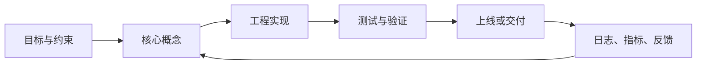

# 1. 概念介绍

数据结构是计算机中组织、存储和管理数据的方式。    
数据结构是一种具有一定逻辑关系，在计算机中应用某种存储结构，并且封装了相应操作的数据元素集合。它包含三方面的内容，逻辑关系、存储关系及操作。

数据结构按照逻辑结构分为线性结构（数据元素之间存在一对一的线性关系）和非线性结构（数据元素之间存在一对多或多对多的关系）。线性结构主要有数组（Array）链表（Linked List）栈（Stack）队列（Queue）；非线性数据结构主要有树（Tree）图（Graph）集合（Sets) 散列表（Hash table）

常见的数据结构有：栈（Stack）队列（Queue）数组（Array）链表（Linked List）树（Tree）图（Graph）堆（Heap）散列表（Hash table）

例如：

- 要保存一组学生成绩，可以用数组。

- 要频繁在头部插入数据，可以用链表。

- 要实现浏览器后退，可以用栈。

- 要实现排队叫号，可以用队列。

- 要快速根据用户名查用户信息，可以用哈希表。

- 要表示文件夹层级，可以用树。

- 要表示城市路线，可以用图。

# 2. 基础

学习数据结构之前，先要理解几个底层概念：数据元素如何放在内存里，元素之间如何建立关系，算法如何遍历这些元素，以及递归、指针、边界条件这些基础思想如何影响程序正确性。

数据结构不是孤立的“容器”，而是由下面几部分共同组成：

| 组成 | 含义 | 例子 |
| :--- | :--- | :--- |
| 数据元素 | 被存储和处理的基本对象 | 学生、订单、节点、整数 |
| 逻辑关系 | 元素之间在概念上的关系 | 前后关系、父子关系、连接关系 |
| 存储结构 | 元素在内存中的实际组织方式 | 连续存储、链式存储、索引存储 |
| 基本操作 | 围绕数据执行的动作 | 查找、插入、删除、遍历、更新 |

例如“学生名单”从逻辑上看是一个列表，但它既可以用数组存，也可以用链表存。逻辑结构回答“数据之间是什么关系”，存储结构回答“数据在内存里怎么放”，算法操作回答“如何使用这些数据”。

## 2.1 数据元素、数据项与数据对象

这三个概念容易混在一起：

| 概念 | 含义 | 示例 |
| :--- | :--- | :--- |
| 数据项 | 描述对象的最小字段 | 学号、姓名、成绩 |
| 数据元素 | 数据结构中的基本单位 | 一个学生记录 |
| 数据对象 | 具有相同性质的数据元素集合 | 全班学生记录 |

示例：

```text
学生记录 = {
  学号: 1001,
  姓名: "张三",
  成绩: 92
}
```

其中“学号”“姓名”“成绩”是数据项，整条学生记录是数据元素，很多条学生记录组成的数据集合就是数据对象。

理解这个层次有助于区分“字段级别操作”和“结构级别操作”。修改某个学生的成绩是更新数据项；向学生名单中新增一名学生是插入数据元素；对全班成绩排序是对数据对象进行整体处理。

## 2.2 逻辑结构与存储结构

逻辑结构描述元素之间的关系，和计算机如何存储无关。

常见逻辑结构：

| 逻辑结构 | 关系特点 | 典型结构 |
| :--- | :--- | :--- |
| 集合结构 | 元素之间没有明显前后关系 | Set |
| 线性结构 | 元素之间是一对一的前驱后继关系 | 数组、链表、栈、队列 |
| 树形结构 | 元素之间是一对多的层级关系 | 树、二叉树、堆、Trie |
| 图形结构 | 元素之间是多对多的连接关系 | 图、网络、依赖关系 |

存储结构描述元素在内存中的实际组织方式。

常见存储结构：

| 存储结构 | 特点 | 典型例子 |
| :--- | :--- | :--- |
| 顺序存储 | 元素存放在连续内存中 | 数组、动态数组 |
| 链式存储 | 元素分散存放，通过指针或引用连接 | 链表、树节点 |
| 索引存储 | 额外建立索引，加快查找 | 数据库索引、跳表 |
| 散列存储 | 通过哈希函数计算存放位置 | 哈希表、HashMap |

同一种逻辑结构可以有不同存储方式。例如线性表既可以用数组实现，也可以用链表实现。数组适合随机访问，链表适合已知节点后的插入删除。

## 2.3 内存

| 概念 | 含义 |
| :--- | :--- |
| 连续内存 | 数据挨在一起存，例如数组 |
| 非连续内存 | 数据分散存，通过引用或指针连接，例如链表 |

数组访问快，是因为可以通过下标直接计算地址。

链表插入删除灵活，是因为只需要改连接关系。

数组的地址计算方式可以理解为：

```text
第 i 个元素地址 = 起始地址 + i * 单个元素大小
```

例如一个整数数组从地址 1000 开始，每个整数占 4 字节：

```text
arr[0] 地址 = 1000
arr[1] 地址 = 1004
arr[2] 地址 = 1008
arr[3] 地址 = 1012
```

这就是数组可以 O(1) 按下标访问的原因。

链表则不同。链表节点不要求连续存储，每个节点保存“数据”和“下一个节点的位置”：

```text
[数据 | next] -> [数据 | next] -> [数据 | next] -> null
```

所以链表想访问第 i 个元素时，必须从头节点一步一步走过去，复杂度通常是 O(n)。

### 内存局部性

连续内存还有一个重要优势：内存局部性好。

CPU 读取内存时，通常不会只读取一个元素，而是会把附近的一段数据一起加载到缓存中。数组元素连续存放，遍历数组时更容易命中缓存；链表节点分散在内存中，遍历时可能频繁跳转，缓存命中率较低。

因此在工程实践中，即使链表的理论插入删除复杂度很好，实际性能也不一定比数组好。选择数据结构不能只看 Big-O，还要考虑缓存、内存分配、对象数量和实现复杂度。

## 2.4 指针、引用与节点

很多数据结构依赖“引用关系”来连接元素，例如链表、树、图。

在不同语言中叫法不同：

| 语言/概念 | 说明 |
| :--- | :--- |
| C / C++ 指针 | 保存内存地址，可以直接操作地址 |
| Java / Kotlin 引用 | 指向对象，不能像 C 指针一样做地址运算 |
| Python 引用 | 变量名绑定到对象，对象之间通过引用连接 |

不管语言细节如何，理解数据结构时可以把它抽象成：

```text
变量保存的不是整个对象本身，而是找到对象的线索。
```

链表节点示例：

```text
Node:
  value
  next
```

二叉树节点示例：

```text
TreeNode:
  value
  left
  right
```

图节点示例：

```text
GraphNode:
  value
  neighbors
```

节点结构的核心是“数据 + 关系”。数据保存当前元素的值，关系保存它与其他元素的连接。

## 2.5 遍历

遍历是指按照某种规则访问数据结构中的每个元素。

不同数据结构有不同遍历方式：

| 数据结构 | 常见遍历方式 |
| :--- | :--- |
| 数组 | 按下标从左到右遍历 |
| 链表 | 从头节点沿 next 遍历 |
| 栈 | 通常只能从栈顶取出 |
| 队列 | 通常只能从队头取出 |
| 树 | 前序、中序、后序、层序遍历 |
| 图 | BFS、DFS |

数组遍历：

```text
for i = 0 到 n - 1:
  访问 arr[i]
```

链表遍历：

```text
cur = head
while cur != null:
  访问 cur.value
  cur = cur.next
```

树的递归遍历：

```text
visit(node):
  if node == null:
    return
  访问 node.value
  visit(node.left)
  visit(node.right)
```

图的遍历通常需要记录 visited，避免重复访问或陷入环。

## 2.6 递归

树、图、分治、回溯都大量用到递归。

递归三要素：

1. 函数自己调用自己
2. 有终止条件
3. 每次递归都让问题变小

递归的本质是把一个大问题拆成同类型的小问题。

例如计算阶乘：

```text
factorial(n):
  if n == 1:
    return 1
  return n * factorial(n - 1)
```

这里：

- 原问题：求 n!
- 子问题：求 (n - 1)!
- 终止条件：n == 1
- 合并方式：n * factorial(n - 1)

递归调用会使用函数调用栈。每进入一层递归，系统都要保存当前函数的局部变量、参数和返回位置。递归太深时，可能出现栈溢出。

```text
factorial(4)
=> 4 * factorial(3)
=> 4 * 3 * factorial(2)
=> 4 * 3 * 2 * factorial(1)
=> 4 * 3 * 2 * 1
```

常见递归场景：

| 场景 | 说明 |
| :--- | :--- |
| 树结构 | 每个子树仍然是树 |
| 分治算法 | 把问题分成多个子问题 |
| 回溯搜索 | 试探、撤销、继续试探 |
| DFS | 沿着路径一直深入 |

递归常见错误：

| 错误 | 后果 |
| :--- | :--- |
| 没有终止条件 | 无限递归 |
| 子问题没有变小 | 递归无法收敛 |
| 忘记返回结果 | 得不到正确值 |
| 递归层数太深 | 栈溢出 |
| 在递归中重复计算 | 性能急剧下降 |

## 2.7 迭代

迭代是通过循环反复执行某段逻辑。

递归和迭代经常可以互相转换：

递归写法：

```text
sum(n):
  if n == 0:
    return 0
  return n + sum(n - 1)
```

迭代写法：

```text
sum = 0
for i = 1 到 n:
  sum = sum + i
```

递归更适合描述树、图、分治、回溯这类天然分层的问题；迭代更适合线性遍历、计数、累加和需要精确控制内存的场景。

| 对比项 | 递归 | 迭代 |
| :--- | :--- | :--- |
| 表达能力 | 适合层级和分治问题 | 适合线性重复问题 |
| 内存占用 | 依赖调用栈 | 通常更可控 |
| 可读性 | 问题天然递归时更清晰 | 简单循环更直接 |
| 风险 | 栈溢出、重复计算 | 循环条件写错 |

## 2.8 边界条件与不变量

数据结构题和工程代码中，很多错误不是核心思路错，而是边界条件没处理好。

常见边界条件：

| 场景 | 需要检查的问题 |
| :--- | :--- |
| 空结构 | 空数组、空链表、空树 |
| 单元素 | 只有一个节点时前后指针如何处理 |
| 首尾位置 | 插入或删除头节点、尾节点 |
| 越界访问 | 下标是否小于 0 或大于等于长度 |
| 重复元素 | 是否允许重复，重复时如何处理 |
| 环 | 链表或图中是否可能无限循环 |

不变量是指在程序执行过程中始终保持成立的条件。写数据结构代码时，先明确不变量，可以减少很多错误。

例子：

| 数据结构 | 常见不变量 |
| :--- | :--- |
| 栈 | 只能从栈顶插入和删除 |
| 队列 | 队头出队，队尾入队 |
| 二叉搜索树 | 左子树小于根，右子树大于根 |
| 小根堆 | 父节点小于等于子节点 |
| 哈希表 | 相同 key 必须定位到同一个桶或探测序列 |

写代码时可以按下面顺序思考：

1. 正常情况怎么处理
2. 空结构怎么处理
3. 只有一个元素怎么处理
4. 操作发生在头部或尾部怎么处理
5. 操作后数据结构的不变量是否仍然成立

例如删除链表节点时，不只要考虑“中间节点”，还要考虑删除头节点、删除尾节点、链表为空、链表只有一个节点这几种情况。

## 2.9 基础操作模型

大多数数据结构都会围绕以下几类操作展开：

| 操作 | 含义 | 关注点 |
| :--- | :--- | :--- |
| 访问 | 获取某个位置或某个 key 对应的元素 | 是否能快速定位 |
| 查找 | 判断某个值是否存在 | 是否需要遍历 |
| 插入 | 增加新元素 | 是否需要移动或改指针 |
| 删除 | 移除已有元素 | 是否需要保持结构关系 |
| 更新 | 修改已有元素 | 是否能快速找到目标 |
| 遍历 | 访问所有元素 | 顺序、去重、终止条件 |

学习每种数据结构时，都可以用这张表去问：

```text
这个结构访问快不快？
查找快不快？
插入删除快不快？
遍历顺序是什么？
需要额外空间吗？
适合什么业务场景？
```

这样就不会只背概念，而是能把数据结构和实际问题对应起来。

# 3. 时间复杂度与空间复杂度

复杂度用于描述算法或数据结构操作随着输入规模增长的成本。

它不关心某一次程序在某台电脑上到底运行了几毫秒，而是关心：

```text
当输入规模 n 变大时，运行时间和内存占用会如何增长。
```

例如处理 10 个元素时，O(n) 和 O(n^2) 差距不明显；处理 100 万个元素时，差距会非常大。

复杂度主要分为两类：

| 类型 | 关注点 | 例子 |
| :--- | :--- | :--- |
| 时间复杂度 | 算法执行步骤随 n 增长的趋势 | 遍历数组、排序、查找 |
| 空间复杂度 | 额外内存占用随 n 增长的趋势 | 创建数组、递归调用栈、哈希表 |

## 3.1 时间复杂度

时间复杂度表示操作执行时间随数据规模增长的趋势。

这里的“时间”不是精确秒数，而是执行步骤数量级。例如下面代码执行 n 次：

```text
for i = 0 到 n - 1:
  打印 arr[i]
```

它的时间复杂度是 O(n)。

如果是双重循环：

```text
for i = 0 到 n - 1:
  for j = 0 到 n - 1:
    比较 arr[i] 和 arr[j]
```

外层执行 n 次，内层每次执行 n 次，总执行次数约为 n * n，所以时间复杂度是 O(n^2)。

常见复杂度从低到高大致如下：

| 复杂度 | 名称 | 例子 |
| :--- | :--- | :--- |
| O(1) | 常数时间 | 数组按下标访问 |
| O(log n) | 对数时间 | 二分查找 |
| O(n) | 线性时间 | 遍历数组 |
| O(n log n) | 线性对数 | 高效排序 |
| O(n^2) | 平方时间 | 双重循环比较 |
| O(n^3) | 立方时间 | 三重循环、部分动态规划 |
| O(2^n) | 指数时间 | 暴力枚举子集 |
| O(n!) | 阶乘时间 | 暴力排列 |

复杂度增长对比：

| n | O(log n) | O(n) | O(n log n) | O(n^2) | O(2^n) |
| :--- | :--- | :--- | :--- | :--- | :--- |
| 10 | 约 3 | 10 | 约 30 | 100 | 1024 |
| 100 | 约 7 | 100 | 约 700 | 10000 | 非常大 |
| 10000 | 约 14 | 10000 | 约 140000 | 100000000 | 不可接受 |

这张表说明：复杂度越高，数据规模稍微变大，成本增长越快。

## 3.2 空间复杂度

空间复杂度表示额外占用内存随输入规模增长的趋势。

这里要注意“额外空间”这个概念。输入数据本身通常不计入额外空间，算法运行过程中新增的辅助变量、数组、哈希表、递归调用栈才是重点。

常见例子：

- 只用几个变量：O(1)
- 创建一个长度 n 的数组：O(n)
- 创建 n x n 矩阵：O(n^2)
- 递归深度为 n：O(n)
- 图的邻接矩阵：O(V^2)
- 图的邻接表：O(V + E)

示例 1：只使用常数个变量：

```text
max = arr[0]
for x in arr:
  if x > max:
    max = x
```

无论数组有多大，只额外使用了 `max` 这类少量变量，所以空间复杂度是 O(1)。

示例 2：创建新数组：

```text
result = []
for x in arr:
  result.add(x * 2)
```

输入有 n 个元素，`result` 也有 n 个元素，所以额外空间复杂度是 O(n)。

示例 3：递归调用栈：

```text
dfs(node):
  if node == null:
    return
  dfs(node.left)
  dfs(node.right)
```

递归空间取决于递归深度。平衡二叉树高度约为 log n，递归栈空间是 O(log n)；如果树退化成链表，高度是 n，递归栈空间就是 O(n)。

## 3.3 Big-O、Big-Ω 和 Big-Θ

平时最常见的是 Big-O，但完整复杂度分析里还有 Big-Ω 和 Big-Θ。

| 记号 | 含义 | 直观理解 |
| :--- | :--- | :--- |
| Big-O | 渐进上界 | 最多增长到什么量级 |
| Big-Ω | 渐进下界 | 至少需要什么量级 |
| Big-Θ | 紧确界 | 上界和下界同阶 |

通常学习数据结构时，重点掌握 Big-O，因为工程中最关心“最坏情况下会不会慢到不可接受”。

例如线性查找：

```text
for i = 0 到 n - 1:
  if arr[i] == target:
    return i
return -1
```

不同情况：

| 情况 | 说明 | 复杂度 |
| :--- | :--- | :--- |
| 最好情况 | 第一个元素就是目标 | O(1) |
| 最坏情况 | 最后一个元素才是目标，或不存在 | O(n) |
| 平均情况 | 目标大概出现在中间 | O(n) |

虽然最好情况是 O(1)，但通常仍说线性查找的时间复杂度是 O(n)，因为它描述的是更有风险的增长上界。

## 3.4 复杂度分析规则

分析复杂度时，不需要精确计算每一条语句执行多少次，而是抓主要增长项。

### 规则一：忽略常数

```text
for i = 0 到 n - 1:
  执行 A

for i = 0 到 n - 1:
  执行 B
```

总共约执行 2n 次，复杂度写作 O(n)，不写 O(2n)。

原因是当 n 很大时，常数倍不改变增长趋势。

### 规则二：只保留最高阶项

```text
for i = 0 到 n - 1:
  执行 A

for i = 0 到 n - 1:
  for j = 0 到 n - 1:
    执行 B
```

总执行次数约为 n + n^2。因为 n^2 增长更快，所以复杂度是 O(n^2)。

### 规则三：顺序代码复杂度相加

```text
执行 O(n) 的操作
执行 O(n^2) 的操作
```

总复杂度是：

```text
O(n + n^2) = O(n^2)
```

### 规则四：嵌套循环复杂度相乘

```text
for i = 0 到 n - 1:
  for j = 0 到 m - 1:
    执行操作
```

外层 n 次，内层 m 次，总复杂度是 O(n * m)。

如果 m 和 n 是同一规模，才可以写成 O(n^2)。如果它们代表两个不同输入规模，就应保留 O(n * m)。

### 规则五：二分、倍增、折半通常是 O(log n)

只要每次操作都把问题规模缩小为原来的一半，通常就是 O(log n)。

例如二分查找：

```text
left = 0
right = n - 1
while left <= right:
  mid = (left + right) / 2
  if arr[mid] == target:
    return mid
  else if arr[mid] < target:
    left = mid + 1
  else:
    right = mid - 1
```

每轮搜索范围减半，所以复杂度是 O(log n)。

## 3.5 常见代码结构的复杂度

| 代码结构 | 示例 | 时间复杂度 |
| :--- | :--- | :--- |
| 单次赋值或访问 | `x = arr[i]` | O(1) |
| 单层循环 | 遍历数组 | O(n) |
| 双重循环 | 两两比较 | O(n^2) |
| 三重循环 | 三元组枚举 | O(n^3) |
| 每次减半 | 二分查找 | O(log n) |
| 分治后合并 | 归并排序 | O(n log n) |
| 枚举所有子集 | 子集搜索 | O(2^n) |
| 枚举所有排列 | 全排列 | O(n!) |

容易误判的例子：

```text
for i = 1; i < n; i = i * 2:
  执行操作
```

i 每次翻倍，循环次数不是 n，而是 log n，所以复杂度是 O(log n)。

再看一个例子：

```text
for i = 0 到 n - 1:
  j = 1
  while j < n:
    j = j * 2
```

外层 n 次，内层 log n 次，总复杂度是 O(n log n)。

## 3.6 递归复杂度

递归复杂度要看两个问题：

1. 一共递归多少层
2. 每一层做多少额外工作

### 线性递归

```text
f(n):
  if n == 0:
    return
  f(n - 1)
```

每次规模减 1，一共递归 n 层，每层 O(1)，所以时间复杂度是 O(n)，空间复杂度也是 O(n)。

### 二分递归

```text
binarySearch(left, right):
  if left > right:
    return
  mid = (left + right) / 2
  binarySearch(某一半区间)
```

每次只进入一半区间，递归深度是 log n，每层 O(1)，所以时间复杂度是 O(log n)，空间复杂度是 O(log n)。

### 分治递归

归并排序的递归关系可以理解为：

```text
T(n) = 2 * T(n / 2) + O(n)
```

含义是：把数组分成两半分别排序，再用 O(n) 时间合并。

递归树大致如下：

```text
第 0 层：n
第 1 层：n/2 + n/2 = n
第 2 层：n/4 + n/4 + n/4 + n/4 = n
...
共有 log n 层
```

每层总工作量都是 O(n)，共有 O(log n) 层，所以归并排序时间复杂度是 O(n log n)。

### 指数递归

```text
fib(n):
  if n <= 1:
    return n
  return fib(n - 1) + fib(n - 2)
```

普通递归斐波那契会重复计算大量子问题，时间复杂度接近 O(2^n)。如果使用记忆化搜索或动态规划，把已经算过的结果保存起来，可以优化到 O(n)。

## 3.7 摊还复杂度

摊还复杂度用于描述一组操作的平均成本，不是概率意义上的平均，而是把偶尔很贵的操作分摊到多次普通操作中。

典型例子是动态数组尾部追加。

如果容量足够：

```text
append(x) -> O(1)
```

如果容量不够，需要扩容：

```text
创建更大数组
复制旧元素
插入新元素
```

这一次可能是 O(n)，但扩容不是每次都发生。若通常按 2 倍扩容，连续执行很多次 append 后，平均到每一次 append 的成本仍然是摊还 O(1)。

因此动态数组的尾部追加通常写作：

```text
append: 摊还 O(1)
```

注意：摊还 O(1) 不等于每次都是 O(1)，它表示长期平均下来是 O(1)。

## 3.8 数据结构常见操作复杂度速查

| 数据结构 | 访问 | 查找 | 插入 | 删除 | 备注 |
| :--- | :--- | :--- | :--- | :--- | :--- |
| 数组 | O(1) | O(n) | O(n) | O(n) | 随机访问快 |
| 动态数组 | O(1) | O(n) | 尾部摊还 O(1)，中间 O(n) | O(n) | 工程中最常用列表结构 |
| 链表 | O(n) | O(n) | 已知节点 O(1) | 已知前驱 O(1) | 不支持随机访问 |
| 栈 | O(1) 栈顶 | O(n) | O(1) | O(1) | 后进先出 |
| 队列 | O(1) 队头 | O(n) | O(1) | O(1) | 先进先出 |
| 哈希表 | 不适合按序访问 | 平均 O(1) | 平均 O(1) | 平均 O(1) | 最坏情况可能退化 |
| 二叉搜索树 | O(log n) 到 O(n) | O(log n) 到 O(n) | O(log n) 到 O(n) | O(log n) 到 O(n) | 取决于是否平衡 |
| 平衡树 | O(log n) | O(log n) | O(log n) | O(log n) | 有序且稳定 |
| 堆 | 堆顶 O(1) | O(n) | O(log n) | 删除堆顶 O(log n) | 适合优先级队列 |
| 图邻接表 | 访问邻居 O(度数) | 取决于遍历 | 加边 O(1) | 删除边取决于实现 | 适合稀疏图 |

这张表可以作为选型参考，但不能机械套用。实际选择时还要看数据规模、是否要求有序、是否频繁随机访问、是否频繁插入删除、内存是否敏感等因素。

## 3.9 最好、最坏与平均情况

同一个算法在不同输入下，复杂度可能不同。

以线性查找为例：

```text
find(arr, target):
  for i = 0 到 n - 1:
    if arr[i] == target:
      return i
  return -1
```

| 情况 | 说明 | 复杂度 |
| :--- | :--- | :--- |
| 最好情况 | 第一个元素命中 | O(1) |
| 最坏情况 | 最后一个元素命中或不存在 | O(n) |
| 平均情况 | 目标均匀分布 | O(n) |

以快速排序为例：

| 情况 | 说明 | 复杂度 |
| :--- | :--- | :--- |
| 平均情况 | 每次划分比较均衡 | O(n log n) |
| 最坏情况 | 每次划分都极不均衡 | O(n^2) |

工程和考试中，如果没有特别说明，通常默认讨论最坏时间复杂度，因为最坏情况最能反映风险上界。

## 3.10 复杂度分析常见误区

| 误区 | 纠正 |
| :--- | :--- |
| 看到一个循环就一定是 O(n) | 要看循环变量如何变化，翻倍可能是 O(log n) |
| 看到两个循环就一定是 O(n^2) | 如果不是嵌套，而是顺序执行，可能仍是 O(n) |
| 只看时间复杂度 | 空间复杂度、缓存、常数、实现复杂度也重要 |
| O(1) 一定比 O(log n) 快 | 理论上增长更慢，但常数和实际实现也会影响性能 |
| 哈希表一定是 O(1) | 平均 O(1)，哈希冲突严重时会退化 |
| 递归一定慢 | 递归是否慢取决于重复计算、调用深度和语言实现 |

复杂度分析的目标不是背公式，而是判断方案在数据变大后是否还能承受。

## 3.11 分析复杂度的步骤

可以按下面流程分析一个算法：

1. 明确输入规模 n 代表什么
2. 找出核心操作，例如比较、访问、插入、删除
3. 计算核心操作随 n 执行多少次
4. 如果有嵌套循环，看是否相乘
5. 如果有递归，分析递归层数和每层工作量
6. 去掉常数和低阶项
7. 同时检查额外空间占用

示例：

```text
for i = 0 到 n - 1:
  for j = i + 1 到 n - 1:
    if arr[i] + arr[j] == target:
      return true
return false
```

这是两数之和的暴力解法。外层 n 次，内层平均接近 n 次，总比较次数约为 n^2 / 2，所以时间复杂度是 O(n^2)，额外空间是 O(1)。

如果用哈希表优化：

```text
set = {}
for x in arr:
  if target - x in set:
    return true
  set.add(x)
return false
```

每个元素只处理一次，哈希查找平均 O(1)，所以时间复杂度是 O(n)，但需要额外哈希表，空间复杂度是 O(n)。

这体现了一个常见取舍：

```text
用空间换时间。
```

# 4. 抽象数据类型 ADT

ADT 是 Abstract Data Type，抽象数据类型。它关注“能做什么”，不关注“怎么实现”。

更具体地说，ADT 是从使用者角度定义的一组数据和操作规范。它描述一个数据结构应该提供哪些能力、这些能力的行为是什么、操作前后应满足什么条件，但不规定内部必须使用数组、链表、树还是哈希表。

例如栈 Stack，支持操作：push（入栈），pop（出栈），peek（查看栈顶），isEmpty（是否为空）。栈可以用数组实现，也可以用链表实现。栈这个 ADT 关注行为，不关心底层实现。

## 4.1 ADT 的核心思想

ADT 的核心是“接口和实现分离”。

| 角度 | 关注内容 |
| :--- | :--- |
| 使用者 | 这个结构能做什么，怎么调用 |
| 实现者 | 底层怎么存，如何保证性能和正确性 |

以栈为例，使用者只需要知道：

```text
push(x): 把 x 放入栈顶
pop(): 移除并返回栈顶元素
peek(): 查看栈顶元素但不移除
isEmpty(): 判断栈是否为空
```

使用者不需要知道栈底层是这样：

```text
数组: [10, 20, 30]
```

还是这样：

```text
链表: 30 -> 20 -> 10 -> null
```

只要对外行为一致，它们就是同一个 ADT 的不同实现。

## 4.2 ADT、数据结构和实现的区别

这三个概念关系密切，但层次不同。

| 概念 | 含义 | 示例 |
| :--- | :--- | :--- |
| ADT | 抽象能力和操作规范 | Stack、Queue、Map |
| 数据结构 | 组织数据的方式 | 数组、链表、树、图、哈希表 |
| 实现 | 用具体代码完成 ADT | 用数组实现栈，用链表实现队列 |

可以理解为：

```text
ADT = 需求规格
数据结构 = 组织方式
实现 = 具体代码
```

例如 List 是一个 ADT，表示一组有顺序的元素，支持按位置访问、插入、删除、遍历等操作。它可以用动态数组实现，也可以用链表实现。

```text
List ADT
  -> ArrayList 实现：底层动态数组
  -> LinkedList 实现：底层链表
```

同一个 ADT 的不同实现，功能可能相似，但性能特点不同。

## 4.3 ADT 的组成

一个完整的 ADT 通常包含以下内容：

| 组成 | 说明 |
| :--- | :--- |
| 数据对象 | 这个 ADT 管理什么数据 |
| 操作集合 | 支持哪些操作 |
| 操作语义 | 每个操作具体是什么意思 |
| 前置条件 | 调用操作前必须满足什么条件 |
| 后置条件 | 操作完成后结构应变成什么状态 |
| 异常情况 | 空结构、越界、重复 key 等如何处理 |
| 性能约束 | 操作期望达到什么复杂度 |

以 Stack 为例：

| 项目 | 内容 |
| :--- | :--- |
| 数据对象 | 一组元素 |
| 逻辑规则 | 后进先出 LIFO |
| push(x) | 将元素 x 放入栈顶 |
| pop() | 删除并返回栈顶元素 |
| peek() | 返回栈顶元素但不删除 |
| isEmpty() | 判断是否为空 |
| 前置条件 | pop 和 peek 通常要求栈非空 |
| 后置条件 | push 后新元素成为栈顶，pop 后原次栈顶成为栈顶 |

ADT 不只是“函数列表”，还包括这些函数背后的行为约束。

## 4.4 接口、封装与信息隐藏

ADT 强调封装。封装的意思是把内部细节藏起来，只暴露稳定的操作接口。

不推荐让外部直接操作内部存储：

```text
stack.data[stack.size - 1] = x
```

更推荐通过接口操作：

```text
stack.push(x)
stack.pop()
stack.peek()
```

这样做的好处：

| 好处 | 说明 |
| :--- | :--- |
| 降低耦合 | 使用者不依赖内部实现 |
| 方便替换实现 | 数组实现可以替换成链表实现 |
| 保证不变量 | 防止外部破坏结构规则 |
| 便于测试 | 可以围绕接口写测试 |
| 便于维护 | 内部优化不影响调用方 |

例如栈的不变量是“只能从栈顶插入和删除”。如果外部可以随便修改内部数组，就可能破坏这个规则。

## 4.5 常见 ADT

常见 ADT 有：List（列表）、Stack（栈）、Queue（队列）、Deque（双端队列）、Set（集合）、Map（映射）、Tree（树）、Graph（图）。

| ADT | 核心特征 | 常见操作 | 常见实现 |
| :--- | :--- | :--- | :--- |
| List | 有序、可按位置组织 | get、set、add、remove | 动态数组、链表 |
| Stack | 后进先出 | push、pop、peek | 动态数组、链表 |
| Queue | 先进先出 | enqueue、dequeue、front | 循环数组、链表 |
| Deque | 两端都可进出 | addFirst、addLast、removeFirst、removeLast | 双端队列、双向链表 |
| Set | 不重复元素集合 | add、remove、contains | 哈希表、平衡树 |
| Map | key-value 映射 | put、get、remove、containsKey | 哈希表、平衡树 |
| PriorityQueue | 按优先级取出元素 | offer、poll、peek | 堆 |
| Tree | 层级结构 | insert、delete、traverse | 链式节点、数组 |
| Graph | 顶点和边 | addVertex、addEdge、neighbors | 邻接表、邻接矩阵 |

ADT 的命名一般体现“行为模型”，实现方式体现“性能取舍”。

## 4.6 List ADT

List 表示有顺序的一组元素，元素可以重复。

常见操作：

| 操作 | 含义 |
| :--- | :--- |
| size() | 返回元素个数 |
| isEmpty() | 判断是否为空 |
| get(index) | 获取指定位置元素 |
| set(index, value) | 修改指定位置元素 |
| add(value) | 添加元素 |
| add(index, value) | 在指定位置插入元素 |
| remove(index) | 删除指定位置元素 |
| contains(value) | 判断是否包含某个值 |

List 可以用动态数组实现：

```text
[10, 20, 30, 40]
```

也可以用链表实现：

```text
10 -> 20 -> 30 -> 40 -> null
```

两者都能表现为 List，但复杂度不同：

| 操作 | 动态数组 | 链表 |
| :--- | :--- | :--- |
| 按下标访问 | O(1) | O(n) |
| 尾部追加 | 摊还 O(1) | O(1)，如果有 tail |
| 中间插入 | O(n) | 找到节点后 O(1)，查找位置 O(n) |
| 中间删除 | O(n) | 找到节点后 O(1)，查找位置 O(n) |

因此如果频繁按下标访问，动态数组更合适；如果频繁在已知节点附近插入删除，链表更合适。

## 4.7 Stack ADT

Stack 表示后进先出结构，英文是 Last In First Out，简称 LIFO。

```text
push 10
push 20
push 30

栈顶 -> 30
       20
栈底 -> 10
```

此时 pop 会先取出 30。

常见操作：

| 操作 | 含义 | 复杂度 |
| :--- | :--- | :--- |
| push(x) | 入栈 | O(1) |
| pop() | 出栈 | O(1) |
| peek() / top() | 查看栈顶 | O(1) |
| isEmpty() | 判断是否为空 | O(1) |

常见应用：

| 场景 | 说明 |
| :--- | :--- |
| 函数调用栈 | 保存函数调用关系 |
| 括号匹配 | 遇到左括号入栈，右括号匹配栈顶 |
| 表达式求值 | 运算符和操作数管理 |
| 浏览器后退 | 最近访问页面先返回 |
| DFS | 深度优先搜索可用栈实现 |
| 撤销操作 | 最近操作优先撤销 |

Stack ADT 的关键不是“怎么存”，而是“只能从栈顶操作”。

## 4.8 Queue ADT

Queue 表示先进先出结构，英文是 First In First Out，简称 FIFO。

```text
队头                       队尾
10  <-  20  <-  30  <-  40
```

先入队的 10 会先出队。

常见操作：

| 操作 | 含义 | 复杂度 |
| :--- | :--- | :--- |
| enqueue(x) / offer(x) | 入队 | O(1) |
| dequeue() / poll() | 出队 | O(1) |
| front() / peek() | 查看队头 | O(1) |
| isEmpty() | 判断是否为空 | O(1) |

常见应用：

| 场景 | 说明 |
| :--- | :--- |
| 排队叫号 | 先来先服务 |
| BFS | 广度优先搜索 |
| 任务调度 | 按到达顺序处理 |
| 消息队列 | 生产者发送，消费者按顺序消费 |
| 缓冲区 | 临时保存等待处理的数据 |

队列如果用普通数组实现，频繁从头部删除可能导致 O(n) 移动元素。工程中常用循环数组或链表实现队列。

## 4.9 Set ADT

Set 表示不重复元素集合，重点是“是否存在”，不是“第几个元素”。

常见操作：

| 操作 | 含义 |
| :--- | :--- |
| add(x) | 添加元素 |
| remove(x) | 删除元素 |
| contains(x) | 判断元素是否存在 |
| size() | 元素个数 |
| union(other) | 并集 |
| intersection(other) | 交集 |
| difference(other) | 差集 |

Set 常见实现：

| 实现 | 特点 |
| :--- | :--- |
| HashSet | 查询、插入、删除平均 O(1)，不保证有序 |
| TreeSet | 查询、插入、删除 O(log n)，通常保持有序 |
| BitSet | 适合整数范围有限的集合，空间紧凑 |

常见应用：

- 去重
- 判断元素是否出现过
- 图遍历中的 visited
- 权限集合
- 标签集合

## 4.10 Map ADT

Map 表示 key-value 映射，也叫字典、关联数组。

```text
key      -> value
"name"   -> "张三"
"age"    -> 18
"score"  -> 92
```

常见操作：

| 操作 | 含义 |
| :--- | :--- |
| put(key, value) | 新增或更新键值对 |
| get(key) | 根据 key 获取 value |
| remove(key) | 删除 key 对应的键值对 |
| containsKey(key) | 判断 key 是否存在 |
| keys() | 获取所有 key |
| values() | 获取所有 value |

Map 常见实现：

| 实现 | 特点 |
| :--- | :--- |
| HashMap | 平均 O(1)，不保证顺序 |
| TreeMap | O(log n)，按 key 有序 |
| LinkedHashMap | 保留插入顺序或访问顺序 |

常见应用：

- 根据用户 ID 查用户信息
- 统计词频
- 缓存
- 配置项读取
- 建立索引

Map 的核心是 key 必须能唯一定位 value。如果 key 重复，通常会覆盖旧值，具体行为取决于接口定义。

## 4.11 ADT 的操作契约

ADT 的每个操作都应该有清晰契约。契约包括输入、输出、状态变化和异常情况。

以 `pop()` 为例：

| 项目 | 内容 |
| :--- | :--- |
| 输入 | 无 |
| 输出 | 返回栈顶元素 |
| 前置条件 | 栈不为空 |
| 状态变化 | 栈顶元素被删除 |
| 异常情况 | 如果栈为空，抛异常或返回特殊值 |
| 复杂度 | O(1) |

如果不定义清楚空栈时 `pop()` 的行为，调用方就很难写出可靠代码。

常见异常策略：

| 策略 | 示例 | 特点 |
| :--- | :--- | :--- |
| 抛异常 | `pop()` 空栈时报错 | 错误明显，适合强约束 |
| 返回 null | 空结构返回 null | 调用方必须判空 |
| 返回布尔值 | `tryPop(out value)` | 适合避免异常开销 |
| Optional | 返回可空包装 | 表达更明确 |

## 4.12 ADT 与复杂度契约

ADT 除了功能契约，还常常隐含复杂度预期。

例如：

| ADT 操作 | 常见复杂度预期 |
| :--- | :--- |
| Stack.push | O(1) |
| Stack.pop | O(1) |
| Queue.enqueue | O(1) |
| Queue.dequeue | O(1) |
| HashMap.get | 平均 O(1) |
| TreeMap.get | O(log n) |
| PriorityQueue.poll | O(log n) |

如果一个 Stack 的 `push` 是 O(n)，它仍然可能功能正确，但性能上不符合常见预期。

设计 ADT 时要同时回答：

```text
这个操作做什么？
出错时怎么办？
期望复杂度是多少？
是否保持顺序？
是否允许重复元素？
是否允许 null？
是否线程安全？
```

这些问题决定了 ADT 的可用性和工程边界。

## 4.13 ADT 的实现选择

同一个 ADT 可以有多个实现。选择实现时，要根据主要操作决定。

| 需求 | 更合适的实现 |
| :--- | :--- |
| 频繁按下标访问 | 动态数组 |
| 频繁尾部追加 | 动态数组 |
| 频繁头部插入删除 | 链表或双端队列 |
| 快速判断是否存在 | 哈希表 |
| 需要有序遍历 | 平衡树 |
| 频繁取最大值或最小值 | 堆 |
| 表示层级关系 | 树 |
| 表示复杂连接关系 | 图 |

例如“任务队列”只关心先进先出，可以用 Queue ADT；如果任务有优先级，就应该使用 PriorityQueue ADT；如果任务还需要按 ID 快速取消，可能需要 Queue + Map 组合实现。

## 4.14 ADT 设计示例：LRU 缓存

LRU 缓存的行为是：容量有限，最近使用的数据保留，最久未使用的数据淘汰。

从 ADT 角度看，它可以定义为：

```text
get(key): 如果 key 存在，返回 value，并把它标记为最近使用
put(key, value): 插入或更新 key，如果超过容量，淘汰最久未使用项
remove(key): 删除 key
size(): 返回当前元素数量
```

为了满足 `get` 和 `put` 都尽量 O(1)，常见实现是：

| 结构 | 作用 |
| :--- | :--- |
| HashMap | 根据 key 快速找到节点 |
| 双向链表 | 维护最近使用顺序 |

这说明工程中的复杂结构常常不是单一数据结构，而是多个 ADT 和底层结构组合起来。

## 4.15 学习 ADT 的方法

学习每个 ADT 时，可以按下面模板整理：

| 问题 | 说明 |
| :--- | :--- |
| 它解决什么问题 | 使用场景是什么 |
| 核心规则是什么 | LIFO、FIFO、有序、不重复、key-value |
| 支持哪些操作 | 增删改查、遍历、取极值 |
| 每个操作复杂度是多少 | 平均、最坏、摊还 |
| 底层可以怎么实现 | 数组、链表、哈希表、树、堆 |
| 有哪些边界条件 | 空结构、越界、重复、容量限制 |
| 工程中常见名字 | ArrayList、LinkedList、HashMap、TreeMap |

例如学习 Queue 时，不要只记“队列是先进先出”，还要继续问：

```text
入队和出队从哪一端发生？
空队列出队怎么办？
用数组实现如何避免头部删除 O(n)？
循环队列如何判断满和空？
BFS 为什么需要队列？
消息队列和内存队列有什么区别？
```

这样 ADT 就不只是概念，而会变成能指导编码和选型的工具。

# 5. 数组 Array

数组是最基础、最常用的数据结构之一。很多高级数据结构的底层都会用到数组，例如动态数组、堆、哈希表、邻接矩阵、位图等。

数组的核心特点是：

```text
用一段连续内存存放一组相同类型或同类语义的数据。
```

数组的优势是访问快、实现简单、内存局部性好；劣势是插入删除通常需要移动元素，固定数组扩容不方便。

## 5.1 普通数组

数组是一组连续内存中的元素集合。

**特点：**

- 元素在内存中连续存放
- 可以通过下标访问
- 下标通常从 0 开始
- 固定数组大小通常不可变
- 同一数组中的元素通常类型相同
- 适合顺序遍历和随机访问

**常见操作复杂度**

| 操作 | 复杂度 | 说明 |
| :--- | :--- | :--- |
| 按下标访问 | O(1) | 直接计算地址 |
| 修改元素 | O(1) | 已知下标 |
| 遍历 | O(n) | 访问所有元素 |
| 查找某值 | O(n) | 无序数组需要遍历 |
| 尾部插入 | O(1) 或受容量影响 | 固定数组可能不支持 |
| 中间插入 | O(n) | 需要移动元素 |
| 中间删除 | O(n) | 需要移动元素 |

**优点：**下标访问非常快；内存局部性好；实现简单；适合遍历和随机访问

**缺点：**插入删除成本高；固定数组扩容不方便；需要连续内存

**适用场景：**需要频繁按下标访问；数据规模相对固定；需要顺序遍历；实现矩阵、堆、哈希桶等结构

## 5.2 数组的内存模型

数组之所以能 O(1) 按下标访问，是因为它的元素连续存储，可以直接通过公式计算地址。

```text
元素地址 = 数组起始地址 + 下标 * 单个元素大小
```

例如一个整型数组从地址 1000 开始，每个整数占 4 字节：

| 元素 | 下标 | 地址 |
| :--- | :--- | :--- |
| arr[0] | 0 | 1000 |
| arr[1] | 1 | 1004 |
| arr[2] | 2 | 1008 |
| arr[3] | 3 | 1012 |

访问 `arr[2]` 时，计算过程是：

```text
1000 + 2 * 4 = 1008
```

所以数组不需要从头遍历到目标位置，而是可以直接定位。

这也是为什么数组下标通常从 0 开始：第 0 个元素的偏移量正好是 0。

## 5.3 下标与越界

数组下标一般从 0 到 `length - 1`。

```text
长度为 5 的数组:

下标:  0   1   2   3   4
元素: [A] [B] [C] [D] [E]
```

合法下标：

```text
0 <= index < length
```

常见越界错误：

| 错误 | 说明 |
| :--- | :--- |
| index < 0 | 访问负数下标 |
| index == length | 把长度误当成最后一个下标 |
| index > length | 超过数组范围 |
| 空数组访问 arr[0] | 空数组没有任何合法下标 |

循环遍历数组时，最常见写法是：

```text
for i = 0 到 length - 1:
  访问 arr[i]
```

如果写成 `i <= length`，就会访问到不存在的 `arr[length]`。

## 5.4 数组访问、查找与遍历

数组按下标访问是 O(1)：

```text
x = arr[i]
```

但根据值查找通常是 O(n)，因为不知道目标值在哪个位置，需要一个个检查：

```text
find(arr, target):
  for i = 0 到 arr.length - 1:
    if arr[i] == target:
      return i
  return -1
```

如果数组无序，查找目标值最坏要看完所有元素。

如果数组有序，可以使用二分查找，把查找复杂度从 O(n) 降到 O(log n)：

```text
binarySearch(arr, target):
  left = 0
  right = arr.length - 1
  while left <= right:
    mid = (left + right) / 2
    if arr[mid] == target:
      return mid
    else if arr[mid] < target:
      left = mid + 1
    else:
      right = mid - 1
  return -1
```

数组遍历顺序通常有几种：

| 遍历方式 | 说明 |
| :--- | :--- |
| 正向遍历 | 从 0 到 n - 1 |
| 反向遍历 | 从 n - 1 到 0 |
| 跳步遍历 | 每次跳过固定步长 |
| 双指针遍历 | 左右两个指针协同移动 |
| 滑动窗口 | 维护一个连续区间 |

## 5.5 数组插入

固定数组的容量固定，如果数组已满，就不能直接插入新元素。即使容量没满，在中间插入也需要移动元素。

例如在下标 2 插入 99：

```text
原数组:
下标:  0   1   2   3
元素: [10][20][30][40]

插入 99 到 index = 2

移动后:
下标:  0   1   2   3   4
元素: [10][20][99][30][40]
```

移动过程：

```text
40 向后移动
30 向后移动
把 99 放到 index = 2
```

伪代码：

```text
insert(arr, size, index, value):
  if index < 0 or index > size:
    报错
  if size == capacity:
    报错或扩容
  for i = size - 1 到 index:
    arr[i + 1] = arr[i]
  arr[index] = value
  size = size + 1
```

插入位置越靠前，需要移动的元素越多。最坏情况下在头部插入，需要移动 n 个元素，时间复杂度是 O(n)。

| 插入位置 | 复杂度 | 原因 |
| :--- | :--- | :--- |
| 尾部插入 | O(1) | 不需要移动元素 |
| 中间插入 | O(n) | 需要移动后半部分元素 |
| 头部插入 | O(n) | 几乎所有元素都要后移 |

## 5.6 数组删除

数组删除元素后，为了保持元素连续，通常需要把后面的元素向前移动。

例如删除下标 1 的元素：

```text
原数组:
下标:  0   1   2   3
元素: [10][20][30][40]

删除 index = 1 的 20

移动后:
下标:  0   1   2
元素: [10][30][40]
```

伪代码：

```text
remove(arr, size, index):
  if index < 0 or index >= size:
    报错
  removed = arr[index]
  for i = index 到 size - 2:
    arr[i] = arr[i + 1]
  size = size - 1
  return removed
```

| 删除位置 | 复杂度 | 原因 |
| :--- | :--- | :--- |
| 尾部删除 | O(1) | 不需要移动元素 |
| 中间删除 | O(n) | 需要移动后半部分元素 |
| 头部删除 | O(n) | 几乎所有元素都要前移 |

如果不要求保持顺序，可以用“末尾元素覆盖被删除元素”的方式把删除优化为 O(1)：

```text
arr[index] = arr[size - 1]
size = size - 1
```

这种方法适合元素顺序不重要的场景，例如游戏对象池、无序集合的数组实现等。

## 5.7 动态数组 Dynamic Array

动态数组是可以自动扩容的数组。很多语言内置的 List / ArrayList / vector 本质上都是动态数组。

固定数组的问题是容量一旦确定，就很难直接改变。动态数组在固定数组外面封装了一层容量管理逻辑，让使用者感觉数组可以自动变长。

动态数组内部通常维护两个概念：

| 概念 | 含义 |
| :--- | :--- |
| size | 当前已经存了多少个元素 |
| capacity | 底层数组最多能容纳多少个元素 |

例如：

```text
底层数组: [10][20][30][ ][ ][ ][ ][ ]
size = 3
capacity = 8
```

此时数组里真正有效的元素只有前三个，后面的空位是预留容量。

**扩容机制：**当容量不够时，创建一个更大的新数组，把旧元素复制过去，插入新元素，释放或丢弃旧数组，通常扩容为原来的 1.5 倍或 2 倍。

扩容过程：

```text
旧数组 capacity = 4
[10][20][30][40]

append(50) 时容量不够

创建新数组 capacity = 8
[10][20][30][40][50][ ][ ][ ]
```

**摊还复杂度：**尾部追加看起来有时需要 O(n) 复制，但不是每次都复制。平均下来，尾部追加是摊还 O(1)。

| 操作 | 复杂度 |
| :--- | :--- |
| 按下标访问 | O(1) |
| 尾部追加 | 摊还 O(1) |
| 中间插入 | O(n) |
| 中间删除 | O(n) |
| 查找 | O(n) |

**优点：**使用方便；支持随机访问；尾部追加效率高

**缺点：**中间插入删除仍然慢；扩容时有复制成本；可能浪费部分容量

**适用场景：**大多数需要列表的场景；频繁尾部追加；频繁随机访问；数据量动态增长

## 5.8 动态数组的摊还分析

动态数组尾部追加的复杂度通常写作“摊还 O(1)”，这是数组章节非常重要的点。

假设容量按 2 倍扩容，连续追加元素时，扩容大概发生在容量为 1、2、4、8、16 的时刻。

```text
追加第 1 个元素：扩容，复制 0 个
追加第 2 个元素：扩容，复制 1 个
追加第 3 个元素：扩容，复制 2 个
追加第 5 个元素：扩容，复制 4 个
追加第 9 个元素：扩容，复制 8 个
```

虽然某一次扩容可能复制很多元素，但在一长串 append 操作中，总复制次数仍然和 n 同阶。因此平均到每一次 append 上，是 O(1)。

```text
n 次 append 的总成本约为 O(n)
单次 append 的摊还成本约为 O(1)
```

注意：

- 摊还 O(1) 不代表每一次都是 O(1)
- 扩容瞬间可能有明显耗时
- 实时系统或低延迟系统要注意扩容尖峰
- 如果能预估数据量，可以提前设置容量，减少扩容次数

## 5.9 数组缩容

动态数组不仅会扩容，有些实现还会在元素大量删除后缩容，释放多余内存。

例如：

```text
size = 10
capacity = 100
```

如果长期只保存 10 个元素，底层容量 100 可能浪费内存。

常见缩容策略：

```text
当 size < capacity / 4 时，把 capacity 缩小为原来的一半
```

为什么不是 `size < capacity / 2` 就缩容？因为如果扩容和缩容阈值太接近，可能出现反复扩容、缩容的抖动。

```text
size = 50, capacity = 100
删除一个 -> 缩容
再添加一个 -> 扩容
```

这会导致性能不稳定。设置不同阈值可以避免频繁调整容量。

## 5.10 二维数组与多维数组

二维数组可以理解为“数组的数组”，常用于矩阵、表格、棋盘、图像像素等场景。

```text
matrix = [
  [1, 2, 3],
  [4, 5, 6],
  [7, 8, 9]
]
```

访问第 i 行第 j 列：

```text
matrix[i][j]
```

二维数组遍历：

```text
for i = 0 到 rows - 1:
  for j = 0 到 cols - 1:
    访问 matrix[i][j]
```

如果有 rows 行、cols 列，遍历所有元素的时间复杂度是：

```text
O(rows * cols)
```

如果是 n x n 矩阵，则是 O(n^2)。

常见应用：

| 场景 | 说明 |
| :--- | :--- |
| 矩阵计算 | 线性代数、图像处理 |
| 棋盘问题 | 八皇后、数独、迷宫 |
| 动态规划 | dp 表 |
| 图的邻接矩阵 | 表示点之间是否有边 |
| 表格数据 | 行列结构 |

## 5.11 稀疏数组

如果一个二维数组中大部分元素都是 0 或空值，就可以称为稀疏数组。

例如：

```text
0 0 0 0 0
0 0 7 0 0
0 0 0 0 0
0 3 0 0 0
```

如果直接用二维数组存储，会浪费大量空间。可以只记录非零元素：

| row | col | value |
| :--- | :--- | :--- |
| 1 | 2 | 7 |
| 3 | 1 | 3 |

这种表示方式适合：

- 稀疏矩阵
- 棋盘存档
- 图的边较少时
- 推荐系统中的用户-物品评分矩阵

空间复杂度从 O(rows * cols) 降为 O(k)，其中 k 是非零元素个数。

## 5.12 数组与字符串

字符串可以看作字符数组或字符序列。很多字符串算法本质上是在数组上操作。

例如：

```text
"hello"
下标:  0   1   2   3   4
字符: 'h' 'e' 'l' 'l' 'o'
```

常见字符串问题经常使用数组技巧：

| 问题 | 常见方法 |
| :--- | :--- |
| 字符频率统计 | 长度 26、128 或 256 的计数数组 |
| 判断异位词 | 计数数组 |
| 最长无重复子串 | 滑动窗口 + 数组/哈希表 |
| 字符串匹配 | KMP、滚动哈希 |
| 回文判断 | 双指针 |

例如统计小写字母出现次数：

```text
count = 长度为 26 的数组
for ch in s:
  index = ch - 'a'
  count[index] = count[index] + 1
```

当字符范围固定时，数组比哈希表更简单，也通常更快。

## 5.13 数组常见算法技巧

数组是算法题中最常见的输入结构，常见技巧包括双指针、滑动窗口、前缀和、差分数组、排序后二分等。

### 双指针

双指针通常用两个下标协同移动。

常见类型：

| 类型 | 说明 | 示例 |
| :--- | :--- | :--- |
| 左右指针 | 一个从左，一个从右 | 反转数组、两数之和有序版 |
| 快慢指针 | 一个快，一个慢 | 原地去重、移动零 |
| 同向指针 | 两个指针都向右 | 滑动窗口 |

反转数组：

```text
left = 0
right = n - 1
while left < right:
  swap(arr[left], arr[right])
  left = left + 1
  right = right - 1
```

时间复杂度 O(n)，空间复杂度 O(1)。

### 滑动窗口

滑动窗口适合处理连续子数组或连续子串问题。

基本思想：

```text
维护一个窗口 [left, right]
right 向右扩大窗口
当窗口不满足条件时，left 向右缩小窗口
```

常见问题：

- 长度最小的子数组
- 最长无重复子串
- 固定窗口最大和
- 满足条件的连续区间数量

### 前缀和

前缀和用于快速计算区间和。

定义：

```text
prefix[0] = 0
prefix[i + 1] = prefix[i] + arr[i]
```

区间 `[left, right]` 的和：

```text
sum(left, right) = prefix[right + 1] - prefix[left]
```

预处理 O(n)，之后每次查询区间和 O(1)。

适合场景：

- 多次区间求和
- 子数组和问题
- 二维矩阵区域和

### 差分数组

差分数组适合频繁做区间加法。

如果要对区间 `[l, r]` 全部加 x：

```text
diff[l] += x
diff[r + 1] -= x
```

最后对 diff 做一次前缀和，就能还原修改后的数组。

适合场景：

- 多次区间更新
- 航班座位预订
- 区间增量统计
- 日程并发人数统计

### 排序加二分

如果数组可以排序，很多查找问题可以变成二分问题。

```text
排序: O(n log n)
每次二分查找: O(log n)
```

适合多次查询的场景。如果只查询一次，排序成本可能不划算。

## 5.14 数组在其他数据结构中的应用

数组不仅是单独的数据结构，也经常作为其他结构的底层存储。

| 数据结构 | 数组的作用 |
| :--- | :--- |
| 动态数组 | 底层容量数组 |
| 栈 | 用尾部作为栈顶 |
| 队列 | 用循环数组实现队头队尾 |
| 堆 | 用数组表示完全二叉树 |
| 哈希表 | 用数组保存桶 |
| 位图 | 用数组中的 bit 表示状态 |
| 邻接矩阵 | 用二维数组表示图 |
| 并查集 | 用 parent 数组表示父节点 |
| 线段树 | 可用数组表示树结构 |
| 树状数组 | 用数组维护前缀信息 |

例如堆用数组表示时：

```text
父节点下标: parent = (i - 1) / 2
左孩子下标: left = 2 * i + 1
右孩子下标: right = 2 * i + 2
```

这说明数组虽然简单，但它是很多复杂结构的基础。

## 5.15 数组的工程注意点

实际开发中使用数组或动态数组时，要注意以下问题：

| 问题 | 说明 |
| :--- | :--- |
| 越界访问 | 最常见错误之一 |
| 空数组 | 访问第一个或最后一个元素前要判断 |
| 扩容成本 | 动态数组扩容可能造成瞬时耗时 |
| 内存浪费 | capacity 大于 size 时会预留空间 |
| 插入删除成本 | 中间操作需要移动元素 |
| 并发修改 | 遍历时修改数组可能导致错误 |
| 基本类型与对象 | 对象数组保存的是引用 |
| 拷贝成本 | 大数组复制成本高 |

常见优化建议：

- 如果知道大概元素数量，提前设置容量
- 频繁头部插入删除时，不要使用普通数组
- 需要快速判断存在性时，考虑哈希表
- 需要保持有序并频繁插入时，考虑平衡树或跳表
- 大量布尔状态可以考虑位图
- 多次区间查询可以考虑前缀和
- 多次区间更新可以考虑差分数组或线段树

## 5.16 数组常见面试与练习题型

数组题通常不是考数组定义，而是考下标控制、边界处理和算法技巧。

常见题型：

| 题型 | 常见方法 |
| :--- | :--- |
| 查找最大最小值 | 一次遍历 |
| 反转数组 | 双指针 |
| 移动零 | 快慢指针 |
| 删除有序数组重复项 | 快慢指针 |
| 两数之和 | 哈希表或排序双指针 |
| 有序数组二分查找 | 二分 |
| 合并两个有序数组 | 双指针 |
| 最大子数组和 | 动态规划 / Kadane 算法 |
| 区间和查询 | 前缀和 |
| 区间批量修改 | 差分数组 |
| 旋转数组 | 反转技巧或取模 |
| 矩阵遍历 | 方向数组、边界收缩 |

做数组题时建议先写清楚：

```text
数组长度是多少？
下标范围是什么？
是否允许空数组？
是否需要原地修改？
是否要求保持原顺序？
时间和空间复杂度目标是什么？
```

## 5.17 数组小结

数组的关键点可以总结为：

| 维度 | 结论 |
| :--- | :--- |
| 核心特征 | 连续内存、下标访问 |
| 最大优势 | O(1) 随机访问、缓存友好 |
| 主要缺点 | 中间插入删除 O(n)，扩容需要复制 |
| 常见变体 | 动态数组、二维数组、稀疏数组 |
| 常见技巧 | 双指针、滑动窗口、前缀和、差分、二分 |
| 适合场景 | 随机访问多、遍历多、数据相对连续 |
| 不适合场景 | 高频头部插入删除、频繁中间增删 |

数组是学习数据结构的起点。后面的栈、队列、堆、哈希表、图的邻接矩阵、并查集等结构，都可以看到数组的影子。

# 6. 链表 Linked List

链表由节点组成，每个节点保存数据和指向下一个节点的引用。

链表和数组最大的区别是：数组依赖连续内存，链表依赖节点之间的引用关系。

```text
数组: [10][20][30][40]  连续存放
链表: [10 | next] -> [20 | next] -> [30 | next] -> [40 | null]
```

链表不支持 O(1) 按下标访问，但在已知节点位置时，插入和删除可以很灵活。

## 6.1 链表的基本结构

链表的基本单位是节点 Node。

节点结构：

```text
Node:
  value
  next
```

其中：

| 字段 | 含义 |
| :--- | :--- |
| value | 当前节点保存的数据 |
| next | 指向下一个节点的引用 |

示例：

```text
10 -> 20 -> 30 -> null
```

`head` 指向第一个节点。最后一个节点的 `next` 指向 `null`，表示链表结束。

## 6.2 单向链表

单向链表每个节点只保存一个 `next` 指针，只能从前往后走。

```text
head -> 10 -> 20 -> 30 -> null
```

常见操作：

| 操作 | 复杂度 | 说明 |
| :--- | :--- | :--- |
| 访问第 i 个元素 | O(n) | 需要从 head 一步步走 |
| 查找某个值 | O(n) | 需要遍历 |
| 头部插入 | O(1) | 修改 head |
| 头部删除 | O(1) | 修改 head |
| 尾部插入 | O(n) 或 O(1) | 无 tail 是 O(n)，有 tail 是 O(1) |
| 已知节点后插入 | O(1) | 修改 next |
| 删除指定值 | O(n) | 通常需要找到前驱节点 |

单向链表适合从头到尾顺序处理，不适合频繁反向查找。

## 6.3 双向链表

双向链表每个节点同时保存前驱和后继。

节点结构：

```text
Node:
  prev
  value
  next
```

示例：

```text
null <- 10 <-> 20 <-> 30 -> null
```

双向链表可以从当前节点向前走，也可以向后走。

| 字段 | 含义 |
| :--- | :--- |
| prev | 指向前一个节点 |
| next | 指向后一个节点 |

双向链表的优势：

- 已知节点时，删除当前节点更方便
- 支持从尾部向前遍历
- 适合实现 LRU 缓存、双端队列等结构

删除双向链表中的节点：

```text
node.prev.next = node.next
node.next.prev = node.prev
```

实际代码中还要处理头节点、尾节点、空节点等边界情况。

## 6.4 循环链表

循环链表的尾节点不指向 `null`，而是指回头节点。

```text
head -> 10 -> 20 -> 30
        ^           |
        |___________|
```

循环链表适合需要循环访问的场景：

- 约瑟夫环问题
- 轮询调度
- 循环播放列表
- 环形缓冲区的某些实现

遍历循环链表时必须特别注意终止条件，否则容易无限循环。

```text
cur = head
do:
  访问 cur
  cur = cur.next
while cur != head
```

## 6.5 哨兵节点 Dummy Node

哨兵节点也叫虚拟头节点，通常不保存有效数据，只用于简化边界处理。

```text
dummy -> head -> ...
```

使用哨兵节点后，删除头节点和删除普通节点可以用同一套逻辑处理。

```text
remove(head, target):
  dummy = new Node()
  dummy.next = head
  prev = dummy
  cur = head

  while cur != null:
    if cur.value == target:
      prev.next = cur.next
      break
    prev = cur
    cur = cur.next

  return dummy.next
```

| 好处 | 说明 |
| :--- | :--- |
| 统一头节点和普通节点处理 | 删除头节点不再需要单独分支 |
| 简化插入删除代码 | 总能找到一个前驱节点 |
| 降低边界错误 | 空链表、单节点链表更容易处理 |

## 6.6 链表访问与查找

链表不能像数组一样通过下标直接计算地址。访问第 i 个节点必须从头开始走。

```text
get(head, index):
  cur = head
  for step = 0 到 index - 1:
    if cur == null:
      return null
    cur = cur.next
  return cur
```

查找某个值：

```text
find(head, target):
  cur = head
  while cur != null:
    if cur.value == target:
      return cur
    cur = cur.next
  return null
```

链表查找慢的根本原因是只能顺着指针一个节点一个节点走。

## 6.7 头插法与尾插法

头插法是在链表头部插入新节点。

```text
原链表:
head -> 20 -> 30 -> null

插入 10:
new.next = head
head = new

结果:
head -> 10 -> 20 -> 30 -> null
```

头插法复杂度是 O(1)。

尾插法是在链表尾部插入新节点。如果没有维护 tail 指针，需要先找到尾节点，复杂度是 O(n)；如果维护 `tail` 指针，复杂度是 O(1)。

```text
tail.next = newNode
tail = newNode
```

| 插入方式 | 是否需要 tail | 复杂度 |
| :--- | :--- | :--- |
| 头插 | 不需要 | O(1) |
| 尾插 | 不维护 tail | O(n) |
| 尾插 | 维护 tail | O(1) |

## 6.8 链表插入

在已知节点 `prev` 后插入新节点：

```text
newNode.next = prev.next
prev.next = newNode
```

注意赋值顺序很重要。应该先让新节点接上后面的节点，再让前驱节点指向新节点。错误顺序可能导致原来的后续链表丢失，甚至形成自环。

## 6.9 链表删除

单向链表删除某个节点时，通常需要知道它的前驱节点。

```text
prev -> target -> next
```

删除 target：

```text
prev.next = target.next
```

删除头节点：

```text
head = head.next
```

删除操作本身改指针是 O(1)，但找到目标节点通常是 O(n)。

## 6.10 链表反转

反转链表是链表最经典的操作之一。

```text
原链表: 1 -> 2 -> 3 -> 4 -> null
反转后: 4 -> 3 -> 2 -> 1 -> null
```

迭代写法：

```text
prev = null
cur = head

while cur != null:
  next = cur.next
  cur.next = prev
  prev = cur
  cur = next

return prev
```

| 指针 | 作用 |
| :--- | :--- |
| prev | 已反转部分的头 |
| cur | 当前正在处理的节点 |
| next | 暂存后续节点，防止链表断开 |

复杂度：时间 O(n)，空间 O(1)。链表反转最容易出错的地方是忘记保存 `next`，导致后续节点丢失。

## 6.11 快慢指针

快慢指针是链表题中最常见的技巧。

```text
slow 每次走 1 步
fast 每次走 2 步
```

| 用途 | 思路 |
| :--- | :--- |
| 找中点 | fast 到尾时，slow 在中间 |
| 判断是否有环 | 如果有环，fast 会追上 slow |
| 找环入口 | 相遇后，一个指针回 head，同速前进 |
| 删除倒数第 n 个节点 | 快指针先走 n 步 |
| 判断回文链表 | 找中点，反转后半段再比较 |

判断链表是否有环：

```text
slow = head
fast = head

while fast != null and fast.next != null:
  slow = slow.next
  fast = fast.next.next
  if slow == fast:
    return true

return false
```

这也叫 Floyd 判环算法。

## 6.12 删除倒数第 n 个节点

这是双指针的典型应用。使用 dummy 节点指向 head，让 fast 先走 n 步，然后 fast 和 slow 同时走。当 fast 到达尾部时，slow 指向待删除节点的前驱。

```text
removeNthFromEnd(head, n):
  dummy.next = head
  fast = dummy
  slow = dummy

  重复 n 次:
    fast = fast.next

  while fast.next != null:
    fast = fast.next
    slow = slow.next

  slow.next = slow.next.next
  return dummy.next
```

时间复杂度 O(n)，空间复杂度 O(1)。

## 6.13 合并两个有序链表

```text
1 -> 3 -> 5
2 -> 4 -> 6

合并后:
1 -> 2 -> 3 -> 4 -> 5 -> 6
```

```text
merge(l1, l2):
  dummy = new Node()
  tail = dummy

  while l1 != null and l2 != null:
    if l1.value <= l2.value:
      tail.next = l1
      l1 = l1.next
    else:
      tail.next = l2
      l2 = l2.next
    tail = tail.next

  if l1 != null:
    tail.next = l1
  else:
    tail.next = l2

  return dummy.next
```

时间复杂度 O(m + n)，额外空间 O(1)。

## 6.14 链表与数组对比

| 对比项 | 数组 | 链表 |
| :--- | :--- | :--- |
| 内存 | 连续内存 | 非连续内存 |
| 随机访问 | O(1) | O(n) |
| 查找值 | O(n) | O(n) |
| 头部插入删除 | O(n) | O(1) |
| 中间插入删除 | O(n)，需要移动元素 | 已知节点时 O(1) |
| 内存局部性 | 好 | 较差 |
| 额外空间 | 少 | 每个节点需要指针 |
| 实现复杂度 | 简单 | 较复杂 |

理论上链表插入删除灵活，但实际工程中数组和动态数组更常用，因为数组缓存友好、实现简单、常数开销小。

## 6.15 链表操作复杂度

| 操作 | 单向链表 | 双向链表 | 说明 |
| :--- | :--- | :--- | :--- |
| 访问第 i 个元素 | O(n) | O(n) | 需要遍历 |
| 查找某个值 | O(n) | O(n) | 需要遍历 |
| 头部插入 | O(1) | O(1) | 修改 head |
| 头部删除 | O(1) | O(1) | 修改 head |
| 尾部插入 | O(n) 或 O(1) | O(n) 或 O(1) | 取决于是否维护 tail |
| 尾部删除 | O(n) | O(1)，如果有 tail | 单链表需要找前驱 |
| 已知节点后插入 | O(1) | O(1) | 改指针 |
| 删除已知节点 | 通常 O(n) | O(1) | 单链表常需要前驱 |

**优点：**插入删除灵活；不需要连续内存；容量自然增长

**缺点：**不能 O(1) 随机访问；每个节点需要额外指针空间；内存局部性差；实现比数组复杂

**适用场景：**频繁在头部插入删除；已知节点位置后频繁插入删除；实现队列、栈、LRU 缓存

## 6.16 链表常见题型

| 题型 | 常用方法 |
| :--- | :--- |
| 反转链表 | 三指针迭代 |
| 判断是否有环 | 快慢指针 |
| 找链表中点 | 快慢指针 |
| 删除倒数第 n 个节点 | 快慢指针 + dummy |
| 合并有序链表 | 双指针 + dummy |
| 两两交换节点 | dummy + 指针重连 |
| K 个一组反转 | 分组 + 局部反转 |
| 判断回文链表 | 找中点 + 反转后半段 |
| 相交链表 | 双指针换头走 |
| 复制带随机指针链表 | 哈希表或节点拆分 |

链表题最重要的是画图。每次改指针前，先明确：

```text
当前节点是谁？
前驱节点是谁？
后继节点是否已经保存？
head 是否可能变化？
空链表和单节点链表怎么处理？
```

## 6.17 链表的工程应用

链表在工程中不像动态数组那么常用，但在一些结构中非常关键。

| 应用 | 说明 |
| :--- | :--- |
| LRU 缓存 | 双向链表维护访问顺序 |
| LinkedHashMap | 哈希表 + 双向链表 |
| 内存管理 | 空闲块链表 |
| 操作系统调度 | 就绪队列、任务链表 |
| 队列和双端队列 | 可用链表实现 |
| 邻接表 | 图的边表可用链式结构 |

LRU 的典型组合：

```text
HashMap: key -> node
DoubleLinkedList: 维护最近使用顺序
```

## 6.18 链表常见错误

| 错误 | 后果 |
| :--- | :--- |
| 忘记保存 next | 后续链表丢失 |
| 指针赋值顺序错误 | 形成自环或断链 |
| 没处理 head 变化 | 删除或插入头节点出错 |
| 没处理空链表 | 空指针错误 |
| 没处理单节点链表 | 边界错误 |
| 循环链表缺少终止条件 | 无限循环 |
| 双向链表只改 next 不改 prev | 前后关系不一致 |

调试链表时，可以在每一步画出：

```text
prev -> cur -> next
```

并检查每个节点最终是否还能从 head 访问到。

## 6.19 链表小结

| 维度 | 结论 |
| :--- | :--- |
| 核心特征 | 节点通过引用连接 |
| 最大优势 | 已知位置时插入删除灵活 |
| 最大缺点 | 不支持 O(1) 随机访问，缓存局部性差 |
| 常见类型 | 单向链表、双向链表、循环链表 |
| 常用技巧 | dummy、快慢指针、三指针反转 |
| 适合场景 | LRU、队列、频繁局部插入删除 |
| 学习重点 | 指针重连顺序和边界条件 |

数组偏向“按位置快速访问”，链表偏向“通过连接关系灵活增删”。理解这两者的差异，是后续学习栈、队列、哈希表、图和缓存结构的基础。

# 7. 栈 Stack

栈是一种后进先出 LIFO（Last In First Out） 的结构。

```text
Last In First Out = 后进先出
```

可以把栈理解成一摞盘子：最后放上去的盘子，最先被拿走。

```text
栈顶 -> 30
       20
栈底 -> 10
```

如果继续入栈 40：

```text
栈顶 -> 40
       30
       20
栈底 -> 10
```

如果执行出栈，会先取出 40。

## 7.1 栈的基本概念

栈是一种受限的线性结构。它的限制是：只能在同一端进行插入和删除，这一端叫栈顶。

| 概念 | 含义 |
| :--- | :--- |
| 栈顶 top | 允许插入和删除的一端 |
| 栈底 bottom | 固定不直接操作的一端 |
| 入栈 push | 把元素放到栈顶 |
| 出栈 pop | 删除并返回栈顶元素 |
| 查看栈顶 peek/top | 只查看栈顶，不删除 |
| 空栈 | 没有任何元素的栈 |

栈的核心规则：

```text
只能操作最近加入的元素。
```

这就是为什么栈适合处理“最近发生的事情优先处理”的问题。

## 7.2 基本操作

| 操作 | 含义 | 复杂度 |
| :--- | :--- | :--- |
| push | 入栈 | O(1) |
| pop | 出栈 | O(1) |
| peek / top | 查看栈顶 | O(1) |
| isEmpty | 是否为空 | O(1) |

常见接口语义：

```text
push(x): 把 x 放到栈顶
pop(): 删除并返回栈顶元素
peek(): 返回栈顶元素，但不删除
isEmpty(): 判断栈是否为空
size(): 返回栈中元素个数
```

示例过程：

```text
push(10)
push(20)
push(30)
peek() -> 30
pop()  -> 30
pop()  -> 20
peek() -> 10
```

注意：对空栈执行 `pop` 或 `peek` 时，要明确是抛异常、返回 null，还是返回特殊值。

## 7.3 顺序栈：用数组实现栈

顺序栈就是用数组或动态数组实现的栈。通常把数组尾部当作栈顶。

```text
数组: [10][20][30]
              ^
             top
```

入栈：

```text
arr.add(x)
```

出栈：

```text
arr.removeLast()
```

为什么通常用数组尾部做栈顶？因为动态数组尾部追加和尾部删除通常是 O(1)，而头部插入删除需要移动元素。

顺序栈伪代码：

```text
Stack:
  data = []

push(x):
  data.add(x)

pop():
  if data is empty:
    报错
  return data.removeLast()

peek():
  if data is empty:
    报错
  return data[lastIndex]
```

特点：

| 优点 | 缺点 |
| :--- | :--- |
| 实现简单 | 扩容时可能有复制成本 |
| 内存局部性好 | 容量可能浪费 |
| 访问栈顶快 | 固定数组实现时可能栈满 |

工程中最常见的栈实现通常就是动态数组。

## 7.4 链式栈：用链表实现栈

链式栈用链表实现，通常把链表头部当作栈顶。

```text
top -> 30 -> 20 -> 10 -> null
```

入栈就是头插：

```text
newNode.next = top
top = newNode
```

出栈就是删除头节点：

```text
value = top.value
top = top.next
return value
```

链式栈特点：

| 优点 | 缺点 |
| :--- | :--- |
| 不需要连续内存 | 每个节点需要额外指针 |
| 容量自然增长 | 内存局部性较差 |
| 入栈出栈稳定 O(1) | 实现比数组复杂 |

如果不希望动态数组扩容带来瞬时复制成本，可以考虑链式栈。但大多数普通场景下，数组栈更简单、更快。

## 7.5 栈的复杂度

| 操作 | 数组栈 | 链式栈 |
| :--- | :--- | :--- |
| push | 摊还 O(1) | O(1) |
| pop | O(1) | O(1) |
| peek | O(1) | O(1) |
| isEmpty | O(1) | O(1) |
| search | O(n) | O(n) |

栈只保证栈顶操作高效。如果要频繁查找中间元素，栈不是合适结构。

## 7.6 函数调用栈

程序运行时，函数调用也依赖栈。

```text
main()
  -> A()
      -> B()
          -> C()
```

调用过程：

```text
push main
push A
push B
push C
```

当 C 执行完：

```text
pop C
pop B
pop A
pop main
```

函数调用栈中通常保存：

| 内容 | 说明 |
| :--- | :--- |
| 函数参数 | 当前函数的输入 |
| 局部变量 | 当前函数内部变量 |
| 返回地址 | 函数结束后回到哪里 |
| 调用上下文 | 当前执行状态 |

递归本质上就是函数不断调用自己，因此递归深度太大时，会消耗大量调用栈空间，可能导致栈溢出。

## 7.7 括号匹配

括号匹配是栈最经典的应用。

```text
()[]{}      正确
([{}])      正确
(]          错误
([)]        错误
```

思路：

1. 遇到左括号，入栈
2. 遇到右括号，检查栈顶是否是对应左括号
3. 匹配则弹出
4. 不匹配或栈为空，则错误
5. 扫描结束后，栈为空才正确

伪代码：

```text
isValid(s):
  stack = []
  for ch in s:
    if ch 是左括号:
      stack.push(ch)
    else if ch 是右括号:
      if stack.isEmpty():
        return false
      left = stack.pop()
      if left 和 ch 不匹配:
        return false
  return stack.isEmpty()
```

复杂度：

| 项目 | 复杂度 |
| :--- | :--- |
| 时间 | O(n) |
| 空间 | O(n) |

空间最坏 O(n)，例如字符串全是左括号。

## 7.8 表达式求值

栈也常用于表达式求值。

中缀表达式：

```text
3 + 4 * 2
```

乘法优先级高于加法，所以不能简单从左到右计算。通常可以使用两个栈：

| 栈 | 作用 |
| :--- | :--- |
| 数字栈 | 保存操作数 |
| 运算符栈 | 保存 +、-、*、/、括号等 |

后缀表达式更适合用栈求值。

```text
3 4 2 * +
```

计算过程：

```text
push 3
push 4
push 2
遇到 *: pop 2 和 4，计算 4 * 2 = 8，push 8
遇到 +: pop 8 和 3，计算 3 + 8 = 11
```

后缀表达式求值伪代码：

```text
eval(tokens):
  stack = []
  for token in tokens:
    if token 是数字:
      stack.push(token)
    else:
      b = stack.pop()
      a = stack.pop()
      stack.push(a token b)
  return stack.pop()
```

## 7.9 DFS 与栈

深度优先搜索 DFS 可以用递归实现，也可以用显式栈实现。

递归 DFS：

```text
dfs(node):
  if node == null:
    return
  visit(node)
  dfs(node.left)
  dfs(node.right)
```

显式栈 DFS：

```text
stack.push(root)
while stack 不为空:
  node = stack.pop()
  visit(node)
  if node.right != null:
    stack.push(node.right)
  if node.left != null:
    stack.push(node.left)
```

如果希望先访问左子树，入栈时通常先放右节点，再放左节点，因为栈是后进先出。

## 7.10 单调栈

单调栈是一种保持栈内元素单调性的技巧，常用于解决“下一个更大元素”“下一个更小元素”“柱状图最大矩形”等问题。

示例：寻找每个元素右边第一个更大的元素。

```text
arr = [2, 1, 2, 4, 3]
结果 = [4, 2, 4, -1, -1]
```

伪代码：

```text
nextGreater(arr):
  ans = 全部填 -1
  stack = []

  for i = 0 到 n - 1:
    while stack 不为空 and arr[i] > arr[stack.top()]:
      index = stack.pop()
      ans[index] = arr[i]
    stack.push(i)

  return ans
```

复杂度是 O(n)，因为每个元素最多入栈一次、出栈一次。

单调栈常见题型：

| 题型 | 说明 |
| :--- | :--- |
| 下一个更大元素 | 找右边第一个更大的数 |
| 下一个更小元素 | 找右边第一个更小的数 |
| 每日温度 | 等几天后温度更高 |
| 柱状图最大矩形 | 找左右第一个更矮柱子 |
| 接雨水 | 可用单调栈或双指针 |

## 7.11 栈与队列对比

| 对比项 | 栈 Stack | 队列 Queue |
| :--- | :--- | :--- |
| 规则 | 后进先出 LIFO | 先进先出 FIFO |
| 插入位置 | 栈顶 | 队尾 |
| 删除位置 | 栈顶 | 队头 |
| 典型应用 | DFS、撤销、括号匹配 | BFS、排队、任务调度 |
| 关注点 | 最近元素优先 | 最早元素优先 |

简单记忆：

```text
栈：后来者先走
队列：先来者先走
```

## 7.12 栈的常见错误

| 错误 | 后果 |
| :--- | :--- |
| 空栈 pop | 抛异常或得到无效值 |
| 空栈 peek | 访问不存在的栈顶 |
| 混淆 push/pop 顺序 | 结果顺序错误 |
| DFS 入栈顺序错误 | 遍历顺序和预期相反 |
| 表达式求值时操作数顺序反了 | 减法、除法结果错误 |
| 递归过深 | 调用栈溢出 |
| 把栈用于频繁中间查找 | 性能不合适 |

表达式中尤其要注意操作数顺序：

```text
b = stack.pop()
a = stack.pop()
计算 a - b，而不是 b - a
```

## 7.13 栈的应用场景

**实现方式：**动态数组  链表。动态数组实现最常见。

**应用场景：**函数调用栈；括号匹配；表达式求值；浏览器前进后退；撤销操作；深度优先搜索 DFS；单调栈

更完整的应用表：

| 场景 | 为什么适合栈 |
| :--- | :--- |
| 函数调用 | 后调用的函数先返回 |
| 递归 | 调用过程天然形成栈 |
| 括号匹配 | 最近的左括号先匹配 |
| 表达式求值 | 暂存操作数和运算符 |
| 浏览器后退 | 最近访问页面先返回 |
| 撤销操作 | 最近操作先撤销 |
| DFS | 最近发现的节点先深入 |
| 单调栈 | 维护最近且仍可能成为答案的元素 |

## 7.14 栈小结

| 维度 | 结论 |
| :--- | :--- |
| 核心规则 | 后进先出 LIFO |
| 主要操作 | push、pop、peek |
| 常见实现 | 动态数组、链表 |
| 最大优势 | 栈顶操作 O(1)，适合处理最近状态 |
| 主要限制 | 只能操作栈顶，不适合随机访问 |
| 典型技巧 | 括号匹配、表达式求值、DFS、单调栈 |
| 常见风险 | 空栈访问、递归栈溢出、顺序写反 |

学习栈时，不要只记“后进先出”，还要把它和“最近状态优先处理”联系起来。只要问题有回退、撤销、嵌套、匹配、路径深入等特征，就应该优先想到栈。

# 8. 队列 Queue

队列是一种先进先出 FIFO（First In First Out）的线性结构。

```text
First In First Out = 先进先出
```

可以把队列理解成排队买票：先排队的人先被服务，后来的人排到队尾。

```text
队头                         队尾
 10  <-  20  <-  30  <-  40
```

其中 10 最早进入队列，所以会最先出队。

## 8.1 普通队列

队列是一种先进先出 FIFO（First In First Out） 的结构。

**基本操作**

| 操作 | 含义 | 复杂度 |
| :--- | :--- | :--- |
| enqueue | 入队 | O(1) |
| dequeue | 出队 | O(1) |
| front | 查看队头 | O(1) |
| isEmpty | 是否为空 | O(1) |

常见接口语义：

```text
enqueue(x): 把 x 加入队尾
dequeue(): 删除并返回队头元素
front() / peek(): 查看队头元素但不删除
isEmpty(): 判断队列是否为空
size(): 返回队列元素个数
```

示例过程：

```text
enqueue(10)
enqueue(20)
enqueue(30)
front()   -> 10
dequeue() -> 10
dequeue() -> 20
front()   -> 30
```

队列的核心规则是：

```text
只能从队尾进入，从队头离开。
```

## 8.2 队列的基本概念

| 概念 | 含义 |
| :--- | :--- |
| 队头 front/head | 出队的一端 |
| 队尾 rear/tail | 入队的一端 |
| 入队 enqueue/offer | 在队尾加入元素 |
| 出队 dequeue/poll | 从队头移除元素 |
| 查看队头 peek/front | 查看但不删除队头元素 |
| 空队列 | 没有任何元素的队列 |

队列适合处理“先来的任务先处理”的场景。

常见例子：

- 排队叫号
- 打印任务
- 消息队列
- 线程任务队列
- BFS 广度优先搜索
- 生产者消费者缓冲区

## 8.3 用普通数组实现队列的问题

如果直接用普通数组实现队列，入队可以在尾部追加，出队如果从头部删除，就会导致后面所有元素前移。

```text
原队列:
[10][20][30][40]

dequeue 10 后:
[20][30][40]
```

为了保持数组从下标 0 开始连续，20、30、40 都要向前移动一次。

如果每次出队都移动元素，出队复杂度是 O(n)，这不符合队列期望的 O(1)。

错误实现：

```text
dequeue():
  value = arr[0]
  for i = 0 到 size - 2:
    arr[i] = arr[i + 1]
  size = size - 1
  return value
```

这种方式适合少量数据，不适合高频队列。

## 8.4 循环队列 Circular Queue

循环队列用数组实现队列，但不移动元素，而是通过 `front` 和 `rear` 指针循环移动。

```text
capacity = 5

下标:   0    1    2    3    4
数组: [10] [20] [30] [  ] [  ]
       ^
     front
                 ^
                rear
```

出队时只移动 front：

```text
front = (front + 1) % capacity
```

入队时只移动 rear：

```text
rear = (rear + 1) % capacity
```

取模 `% capacity` 的作用是让下标到达数组末尾后回到开头。

```text
下标: 0 -> 1 -> 2 -> 3 -> 4 -> 0 -> 1 ...
```

循环队列常见设计：

| 方案 | 说明 |
| :--- | :--- |
| 额外维护 size | 用 size 判断空和满 |
| 浪费一个位置 | `(rear + 1) % capacity == front` 表示满 |

使用 size 的判断：

```text
isEmpty(): size == 0
isFull(): size == capacity
```

循环队列操作复杂度：

| 操作 | 复杂度 |
| :--- | :--- |
| enqueue | O(1) |
| dequeue | O(1) |
| front | O(1) |
| isEmpty | O(1) |

## 8.5 链式队列

链式队列用链表实现，通常维护 `head` 和 `tail` 两个指针。

```text
head                       tail
 |                          |
 v                          v
10 -> 20 -> 30 -> 40 -> null
```

入队是在尾部插入：

```text
tail.next = newNode
tail = newNode
```

出队是在头部删除：

```text
value = head.value
head = head.next
```

如果删除后队列变空，需要同步处理 tail：

```text
if head == null:
  tail = null
```

链式队列特点：

| 优点 | 缺点 |
| :--- | :--- |
| 不需要连续内存 | 每个节点需要额外指针 |
| 入队出队稳定 O(1) | 内存局部性较差 |
| 容量自然增长 | 实现比循环数组复杂 |

**实现方式：**链表、循环数组。不要用普通数组头部删除来实现高频队列，因为头删可能是 O(n)。

## 8.6 队列复杂度

| 实现方式 | 入队 | 出队 | 查看队头 | 备注 |
| :--- | :--- | :--- | :--- | :--- |
| 普通数组头删 | O(1) | O(n) | O(1) | 出队要移动元素 |
| 循环数组 | O(1) | O(1) | O(1) | 工程常用 |
| 链表 | O(1) | O(1) | O(1) | 需要 head 和 tail |
| 动态数组模拟 | O(1) | 可能 O(n) | O(1) | 要看是否移动元素 |

队列 ADT 的期望是入队、出队、查看队头都能 O(1)。

## 8.7 双端队列 Deque

Deque 是 Double-ended Queue，双端队列。两端都能插入和删除。

**基本操作**

| 操作 | 含义 |
| :--- | :--- |
| pushFront | 头部插入 |
| pushBack | 尾部插入 |
| popFront | 头部删除 |
| popBack | 尾部删除 |
| front | 查看头部 |
| back | 查看尾部 |

这些操作通常都是 O(1)。

Deque 可以同时模拟栈和队列：

```text
当栈用: 只在同一端 push/pop
当队列用: 一端 push，另一端 pop
```

常见实现：

| 实现 | 特点 |
| :--- | :--- |
| 双向链表 | 两端插入删除方便 |
| 循环数组 | 缓存友好，工程常用 |

**应用场景：**滑动窗口最大值；单调队列；双端调度；实现栈和队列。

## 8.8 优先队列 Priority Queue

普通队列按进入顺序出队，优先队列按优先级出队。

```text
普通队列: 谁先来谁先走
优先队列: 谁优先级高谁先走
```

例如医院急诊、任务调度、Dijkstra 最短路径都会用到优先队列。

常见操作：

| 操作 | 含义 | 堆实现复杂度 |
| :--- | :--- | :--- |
| offer(x) | 插入元素 | O(log n) |
| poll() | 取出最高优先级元素 | O(log n) |
| peek() | 查看最高优先级元素 | O(1) |

优先队列通常用堆实现。它名字里有“队列”，但行为和 FIFO 队列不同。

## 8.9 BFS 与队列

广度优先搜索 BFS 是队列最经典的算法应用。

BFS 的特点是按层扩展：

```text
先访问距离起点 1 步的节点
再访问距离起点 2 步的节点
再访问距离起点 3 步的节点
```

这正好符合队列的先进先出。

树的层序遍历：

```text
levelOrder(root):
  queue.enqueue(root)

  while queue 不为空:
    node = queue.dequeue()
    visit(node)
    if node.left != null:
      queue.enqueue(node.left)
    if node.right != null:
      queue.enqueue(node.right)
```

图 BFS：

```text
bfs(start):
  queue.enqueue(start)
  visited.add(start)

  while queue 不为空:
    node = queue.dequeue()
    for next in node.neighbors:
      if next not in visited:
        visited.add(next)
        queue.enqueue(next)
```

BFS 常见应用：

| 场景 | 说明 |
| :--- | :--- |
| 树的层序遍历 | 一层一层访问 |
| 无权图最短路径 | 第一次到达就是最短步数 |
| 迷宫最短路 | 每次扩展一步 |
| 多源扩散 | 腐烂橘子、地图扩散 |
| 拓扑排序 | 入度为 0 的点入队 |

## 8.10 生产者消费者模型

队列常用于生产者消费者模型。

```text
生产者 -> 队列 -> 消费者
```

生产者负责产生任务，消费者负责处理任务，中间用队列解耦。

好处：

| 好处 | 说明 |
| :--- | :--- |
| 解耦 | 生产和消费不需要直接依赖 |
| 削峰 | 高峰任务先进入队列，消费者慢慢处理 |
| 异步 | 生产者不用等待消费者立即处理 |
| 缓冲 | 临时保存未处理任务 |

常见工程场景：

- 日志写入
- 消息队列
- 线程池任务队列
- 网络请求缓冲
- 数据采集和处理管道

如果队列容量有限，还要考虑队列满时怎么办：

| 策略 | 说明 |
| :--- | :--- |
| 阻塞等待 | 生产者等待空间 |
| 丢弃任务 | 直接丢弃新任务或旧任务 |
| 扩容 | 增加队列容量 |
| 限流 | 降低生产速度 |

## 8.11 单调队列

单调队列常用于滑动窗口最值。其核心思想是：

```text
队列中保持元素单调；
新元素进来时删除不可能成为答案的元素；
窗口移出时删除过期元素。
```

以滑动窗口最大值为例：

```text
arr = [1, 3, -1, -3, 5, 3, 6, 7]
k = 3
结果 = [3, 3, 5, 5, 6, 7]
```

单调队列中通常保存下标，而不是直接保存值，因为需要判断元素是否过期。

伪代码：

```text
maxSlidingWindow(arr, k):
  deque = []
  ans = []

  for i = 0 到 n - 1:
    while deque 不为空 and deque.front <= i - k:
      deque.popFront()

    while deque 不为空 and arr[deque.back] <= arr[i]:
      deque.popBack()

    deque.pushBack(i)

    if i >= k - 1:
      ans.add(arr[deque.front])

  return ans
```

复杂度是 O(n)，因为每个元素最多入队一次、出队一次。

## 8.12 队列与栈对比

| 对比项 | 队列 Queue | 栈 Stack |
| :--- | :--- | :--- |
| 规则 | 先进先出 FIFO | 后进先出 LIFO |
| 插入位置 | 队尾 | 栈顶 |
| 删除位置 | 队头 | 栈顶 |
| 典型搜索 | BFS | DFS |
| 典型场景 | 排队、任务调度、缓冲 | 撤销、括号匹配、递归 |

简单记忆：

```text
队列：先来先服务
栈：后来先处理
```

## 8.13 队列常见错误

| 错误 | 后果 |
| :--- | :--- |
| 用普通数组头删实现高频队列 | 出队 O(n)，性能差 |
| 循环队列空满判断混乱 | 覆盖数据或误判为空 |
| 出队后忘记更新 tail | 空队列状态错误 |
| BFS 忘记 visited | 图中重复访问或死循环 |
| BFS 入队时不标记 visited | 同一节点可能重复入队 |
| 队列容量无限增长 | 内存风险 |
| 混淆 Queue 和 PriorityQueue | 出队顺序错误 |

图 BFS 中通常建议“入队时就标记 visited”，而不是出队时才标记，这样可以避免同一个节点被重复加入队列。

## 8.14 队列小结

| 维度 | 结论 |
| :--- | :--- |
| 核心规则 | 先进先出 FIFO |
| 主要操作 | enqueue、dequeue、front |
| 常见实现 | 循环数组、链表 |
| 常见变体 | Deque、PriorityQueue、单调队列 |
| 最大优势 | 适合按到达顺序处理任务 |
| 典型算法 | BFS、层序遍历、拓扑排序 |
| 工程场景 | 消息队列、任务队列、缓冲区 |

队列关注的是“顺序公平”和“按到达时间处理”。只要问题有排队、分层、扩散、缓冲、任务调度等特征，就应该优先想到队列。

# 9. 哈希表 Hash Table

哈希表通过哈希函数把 key 映射到数组下标，实现快速查找。

哈希表的核心目标是：

```text
根据 key 快速找到 value。
```

数组可以通过下标 O(1) 访问元素，但现实问题通常不是用数字下标查找，而是用用户名、ID、手机号、单词等 key 查找。哈希表的作用就是把这些 key 转换成数组下标。

```text
key -> hash(key) -> index -> bucket -> value
```

## 9.1 哈希表的核心思想

**核心思想：**

```text
index = hash(key) % capacity
```

含义是：先用哈希函数把 key 转成一个整数，再通过取模把整数映射到数组范围内。

例如：

```text
capacity = 8
hash("Tom") = 12345
index = 12345 % 8 = 1
```

于是 `"Tom"` 对应的数据就放在数组下标 1 的位置。

哈希表底层可以理解为一个数组：

```text
buckets:
0: ...
1: ("Tom", 90)
2: ...
3: ...
```

查找时重复同样的计算：

```text
index = hash("Tom") % capacity
到 buckets[index] 中查找 key 为 "Tom" 的数据
```

## 9.2 哈希表保存什么

哈希表通常保存 key-value 键值对。

```text
key -> value
```

例子：

| key | value |
| :--- | :--- |
| 用户 ID | 用户信息 |
| 单词 | 出现次数 |
| 商品 ID | 商品详情 |
| URL | 页面缓存 |
| 配置名 | 配置值 |

节点可以抽象为：

```text
Entry:
  key
  value
  hash
  next
```

其中 `next` 常用于链地址法，处理多个 key 落到同一个桶的情况。

## 9.3 基本操作

哈希表常见操作：

| 操作 | 含义 | 平均复杂度 |
| :--- | :--- | :--- |
| put(key, value) | 插入或更新键值对 | O(1) |
| get(key) | 根据 key 查找 value | O(1) |
| remove(key) | 删除 key 对应的数据 | O(1) |
| containsKey(key) | 判断 key 是否存在 | O(1) |
| size() | 返回键值对数量 | O(1) |

插入过程：

```text
put(key, value):
  index = hash(key) % capacity
  到 buckets[index] 中查找 key
  如果 key 已存在，更新 value
  如果 key 不存在，插入新 Entry
```

查找过程：

```text
get(key):
  index = hash(key) % capacity
  到 buckets[index] 中查找 key
  找到则返回 value
  找不到则返回 null 或特殊值
```

删除过程：

```text
remove(key):
  index = hash(key) % capacity
  到 buckets[index] 中找到 key
  删除对应 Entry
```

## 9.4 哈希函数

哈希函数负责把 key 转成整数。

好的哈希函数应该满足：

| 特点 | 说明 |
| :--- | :--- |
| 确定性 | 同一个 key 每次算出的 hash 应相同 |
| 分布均匀 | 尽量把 key 分散到不同桶 |
| 计算快 | 哈希计算本身不能太慢 |
| 冲突少 | 不同 key 尽量不要映射到同一个位置 |

例如字符串哈希可以按字符累加和乘法组合：

```text
hash = 0
for ch in s:
  hash = hash * 31 + ch
```

这里的 31 是常见乘数之一，实际语言和库会有自己的实现。

哈希函数不要求不同 key 一定得到不同 hash。由于输入空间通常远大于数组容量，冲突不可避免。

## 9.5 哈希冲突

**哈希冲突：**不同 key 可能映射到同一个位置，这叫冲突。

例如：

```text
hash("Tom") % 8 = 3
hash("Jerry") % 8 = 3
```

两个 key 都落到桶 3，这就是冲突。

解决冲突的常见方法：

| 方法 | 思路 |
| :--- | :--- |
| 链地址法 | 每个桶中挂链表或树 |
| 开放寻址法 | 冲突后继续寻找其他空位置 |
| 再哈希 | 使用另一个哈希函数重新定位 |

最常见的是链地址法和开放寻址法。

## 9.6 链地址法

**链地址法：**数组每个位置存一个链表或桶。

```text
bucket[3] -> (key1, value1) -> (key2, value2) -> null
```

插入时：

```text
index = hash(key) % capacity
把 Entry 放入 bucket[index]
```

查找时：

```text
index = hash(key) % capacity
遍历 bucket[index] 中的链表
找到 key 相等的 Entry
```

链地址法特点：

| 优点 | 缺点 |
| :--- | :--- |
| 实现相对直观 | 需要额外指针空间 |
| 删除比较简单 | 冲突多时链表变长 |
| 负载因子可以大于 1 | 内存局部性较差 |

如果某个桶中元素太多，查找会从 O(1) 退化为 O(k)，k 是桶中元素个数。

一些工程实现会在链表过长时把链表转换成平衡树，以降低最坏情况成本。

## 9.7 开放寻址法

**开放寻址法：**所有元素都存在数组中，冲突后继续寻找下一个可用位置。

### 线性探测

冲突后依次检查下一个位置：

```text
index, index + 1, index + 2, ...
```

取模后循环：

```text
(index + step) % capacity
```

优点是实现简单、缓存友好；缺点是容易产生聚集。

### 二次探测

冲突后按平方步长探测：

```text
index + 1^2
index + 2^2
index + 3^2
```

相比线性探测，可以减轻连续聚集问题。

### 双重哈希

使用第二个哈希函数决定探测步长：

```text
index = hash1(key) % capacity
step = hash2(key)
```

开放寻址法删除元素时不能简单置空，否则可能中断后续元素的查找路径。常见做法是使用“删除标记”。

```text
EMPTY: 从未使用
DELETED: 曾经有元素，后来删除
OCCUPIED: 当前有元素
```

## 9.8 负载因子

**负载因子：**

```text
load factor = 元素数量 / 桶数量
```

例如：

```text
元素数量 = 12
桶数量 = 16
load factor = 12 / 16 = 0.75
```

负载因子越高，冲突通常越多，查找和插入性能会下降。

常见策略：

```text
当 load factor 超过阈值时扩容
```

例如阈值设为 0.75，当元素数量超过容量的 75% 时进行扩容。

## 9.9 扩容与再哈希

哈希表扩容不是简单地扩大数组，还需要重新计算每个 key 的位置。

原因是：

```text
index = hash(key) % capacity
```

当 capacity 改变时，取模结果也会改变。

扩容过程：

```text
创建更大的 bucket 数组
遍历旧数组中的所有 Entry
重新计算 index
把 Entry 放入新数组
```

这叫 rehash，再哈希。

扩容成本：

| 项目 | 复杂度 |
| :--- | :--- |
| 单次扩容 | O(n) |
| 普通插入 | 平均 O(1) |
| 长期插入 | 摊还 O(1) |

和动态数组类似，哈希表扩容不是每次都发生，所以插入通常说平均或摊还 O(1)。

## 9.10 哈希表复杂度

**操作复杂度：**平均情况下，插入、查找、删除都是 O(1)；最坏情况可能 O(n)，例如大量冲突。

| 操作 | 平均复杂度 | 最坏复杂度 | 说明 |
| :--- | :--- | :--- | :--- |
| put | O(1) | O(n) | 冲突严重或扩容时变慢 |
| get | O(1) | O(n) | 所有 key 落到同一桶时退化 |
| remove | O(1) | O(n) | 需要先找到 key |
| containsKey | O(1) | O(n) | 本质是查找 |
| 遍历所有元素 | O(n) | O(n) | 必须访问所有键值对 |

为什么说哈希表快？因为在哈希函数分布较均匀、负载因子合理时，每个桶里的元素很少，查找时只需要看很少的候选项。

## 9.11 HashMap、HashSet 和 HashTable

这些名字容易混淆。

| 名称 | 含义 |
| :--- | :--- |
| Hash Table | 泛指哈希表这种数据结构 |
| HashMap | key-value 映射，底层常用哈希表 |
| HashSet | 不重复集合，底层可用 HashMap 的 key 实现 |
| Hashtable | 某些语言中的具体类名，可能带同步语义 |

HashMap 保存键值对：

```text
key -> value
```

HashSet 只保存 key：

```text
key -> PRESENT
```

因此 HashSet 可以理解为只使用 key 的 HashMap。

## 9.12 哈希表与数组、链表、树的关系

哈希表通常是组合结构。

| 结构 | 在哈希表中的作用 |
| :--- | :--- |
| 数组 | 保存桶 buckets |
| 链表 | 链地址法处理冲突 |
| 红黑树 | 某些实现中处理长链退化 |
| 哈希函数 | 把 key 映射到数组下标 |

可以理解为：

```text
哈希表 = 数组 + 哈希函数 + 冲突处理策略
```

这也是为什么哈希表既有数组的快速定位，又需要链表或树来处理冲突。

## 9.13 哈希表是否有序

普通哈希表通常不保证顺序。

```text
插入顺序: A, B, C
遍历顺序: 可能是 B, A, C
```

如果需要顺序，要使用对应结构：

| 需求 | 结构 |
| :--- | :--- |
| 保留插入顺序 | LinkedHashMap / LinkedHashSet |
| 按 key 排序 | TreeMap / TreeSet |
| 快速查找，不关心顺序 | HashMap / HashSet |

不要在业务逻辑中依赖普通哈希表的遍历顺序。

## 9.14 key 的不可变性

哈希表中的 key 最好是不可变的，或者至少不要在放入哈希表后修改影响 hash 和相等性的字段。

错误示例：

```text
user = User(id=1, name="Tom")
map.put(user, value)

user.id = 2
map.get(user) 可能找不到
```

原因是 key 的 hash 可能变了，原来存放的位置和现在查找的位置不一致。

适合作为 key 的类型：

- 整数
- 字符串
- 枚举
- 不可变对象
- 正确定义 hash 和 equals 的对象

## 9.15 哈希表应用场景

**应用场景：**快速查找；去重；计数；缓存；索引；两数之和。

更完整的场景：

| 场景 | 用法 |
| :--- | :--- |
| 快速查找 | key -> value |
| 去重 | HashSet |
| 计数 | key -> count |
| 缓存 | key -> cached value |
| 索引 | id -> object |
| 频率统计 | word -> frequency |
| 图 visited | node -> visited |
| 两数之和 | value -> index |
| LRU 缓存 | HashMap + 双向链表 |

两数之和示例：

```text
twoSum(arr, target):
  map = {}
  for i = 0 到 n - 1:
    need = target - arr[i]
    if map contains need:
      return [map[need], i]
    map[arr[i]] = i
```

时间复杂度 O(n)，空间复杂度 O(n)。

## 9.16 哈希表常见题型

| 题型 | 哈希表用法 |
| :--- | :--- |
| 两数之和 | value -> index |
| 字母异位词 | 字符 -> 次数 |
| 第一个不重复字符 | 字符 -> 频率 |
| 数组交集 | HashSet |
| 最长连续序列 | HashSet |
| 子数组和为 K | 前缀和 -> 出现次数 |
| LRU 缓存 | HashMap + 双向链表 |
| 复制随机链表 | 原节点 -> 新节点 |
| 图搜索去重 | visited Set |

子数组和为 K 的思路：

```text
prefixSum[j] - prefixSum[i] = k
=> prefixSum[i] = prefixSum[j] - k
```

用哈希表记录每个前缀和出现次数，就可以在 O(n) 时间内统计答案。

## 9.17 哈希表常见错误

**注意事项：**key 必须可哈希；哈希函数要分布均匀；哈希表不保证有序；扩容有成本。

| 错误 | 后果 |
| :--- | :--- |
| 依赖 HashMap 遍历顺序 | 输出不稳定 |
| 修改已作为 key 的对象字段 | get/remove 可能失败 |
| 自定义对象没定义 hash/equals | 去重或查找错误 |
| 负载因子过高 | 冲突增加，性能下降 |
| 忽略扩容成本 | 某次插入可能耗时明显 |
| 把哈希表当有序结构用 | 范围查询困难 |
| 只看平均 O(1) | 最坏情况可能退化 |

如果需要范围查询、排序、前驱后继，就应该考虑 TreeMap、TreeSet、跳表等有序结构。

## 9.18 哈希表小结

| 维度 | 结论 |
| :--- | :--- |
| 核心思想 | 用哈希函数把 key 映射到数组下标 |
| 主要操作 | put、get、remove、containsKey |
| 平均复杂度 | 插入、查找、删除平均 O(1) |
| 最坏复杂度 | 冲突严重时可能 O(n) |
| 冲突处理 | 链地址法、开放寻址法 |
| 关键参数 | 哈希函数、容量、负载因子 |
| 常见结构 | HashMap、HashSet |
| 典型应用 | 快速查找、去重、计数、缓存、索引 |

哈希表的本质是“用空间换时间”。只要问题的核心是根据 key 快速定位数据，就应该优先考虑哈希表。

# 10. 集合 Set

集合存储不重复元素。常见操作：add；remove；contains；size。底层常用哈希表或树。

集合最核心的特征是：

```text
元素不重复，只关心“有没有”，不关心“在第几个位置”。
```

例如：

```text
List: [10, 20, 20, 30]
Set:  {10, 20, 30}
```

List 可以保存重复元素，Set 会自动去重。

## 10.1 Set 的基本概念

Set 是一种抽象数据类型，表示不重复元素的集合。

常见操作：

| 操作 | 含义 |
| :--- | :--- |
| add(x) | 添加元素 x |
| remove(x) | 删除元素 x |
| contains(x) | 判断 x 是否存在 |
| size() | 返回集合大小 |
| isEmpty() | 判断集合是否为空 |
| clear() | 清空集合 |

Set 的常见语义：

```text
add(10)
add(20)
add(20)

集合中只有 {10, 20}
```

重复添加同一个元素，通常不会改变集合内容。

## 10.2 Set 与 List 的区别

| 对比项 | Set | List |
| :--- | :--- | :--- |
| 是否允许重复 | 不允许 | 允许 |
| 是否关心顺序 | 通常不关心，取决于实现 | 关心元素位置 |
| 主要操作 | add、remove、contains | get、set、add、remove |
| 按下标访问 | 通常不支持 | 支持 |
| 典型用途 | 去重、存在性判断 | 顺序存储、按位置访问 |

示例：

```text
输入: [3, 1, 2, 3, 2, 4]
Set: {1, 2, 3, 4}
```

如果业务需要保留重复次数，不应该只用 Set，而应该使用 Map 计数。

```text
3 出现 2 次
2 出现 2 次
1 出现 1 次
4 出现 1 次
```

这种场景更适合 `Map<Value, Count>`。

## 10.3 哈希集合 HashSet

哈希集合底层通常使用哈希表。

特点：查找快；无序；平均 O(1)。

常见复杂度：

| 操作 | 平均复杂度 | 最坏复杂度 |
| :--- | :--- | :--- |
| add | O(1) | O(n) |
| remove | O(1) | O(n) |
| contains | O(1) | O(n) |

HashSet 的核心思想：

```text
index = hash(element) % capacity
```

通过哈希函数把元素映射到桶的位置。

优点：

- 查询非常快
- 插入删除平均 O(1)
- 适合去重和存在性判断

缺点：

- 通常不保证遍历顺序
- 依赖哈希函数质量
- 扩容有成本
- 元素需要能正确计算 hash 和相等性

适合场景：

- 判断某个元素是否出现过
- 数组去重
- 图遍历中的 visited
- 两数之和
- 权限、标签、特征开关集合

## 10.4 有序集合 TreeSet

有序集合底层常用平衡二叉搜索树，例如红黑树。

特点：元素有序；查找、插入、删除 O(log n)；支持范围查询。

常见复杂度：

| 操作 | 复杂度 |
| :--- | :--- |
| add | O(log n) |
| remove | O(log n) |
| contains | O(log n) |
| first / last | O(log n) 或 O(1)，取决于实现 |
| floor / ceiling | O(log n) |

有序集合常见能力：

| 操作 | 含义 |
| :--- | :--- |
| first | 最小元素 |
| last | 最大元素 |
| floor(x) | 小于等于 x 的最大元素 |
| ceiling(x) | 大于等于 x 的最小元素 |
| lower(x) | 小于 x 的最大元素 |
| higher(x) | 大于 x 的最小元素 |
| rangeQuery | 查询某个范围内的元素 |

适合场景：

- 需要元素有序
- 需要找前驱后继
- 需要范围查询
- 需要动态维护排序集合

例如维护在线分数排名、时间区间、价格区间等，TreeSet 比 HashSet 更合适。

## 10.5 LinkedHashSet

有些语言或库提供 LinkedHashSet，它通常结合哈希表和链表。

特点：

| 特点 | 说明 |
| :--- | :--- |
| 不重复 | 仍然是 Set |
| 查找快 | 底层有哈希表 |
| 保留顺序 | 通常保留插入顺序 |

示例：

```text
依次插入: 3, 1, 2, 3, 4
遍历结果: 3, 1, 2, 4
```

HashSet 不一定保留这个顺序，LinkedHashSet 通常会保留首次插入顺序。

适合场景：

- 既需要去重，又需要保留插入顺序
- 最近访问记录
- 去重后的稳定输出

## 10.6 BitSet / Bitmap

如果元素是非负整数，并且范围不大，可以用位图表示集合。

例如要表示集合 `{1, 3, 5}`：

```text
下标: 0 1 2 3 4 5
位值: 0 1 0 1 0 1
```

第 i 位为 1 表示 i 存在于集合中。

常见操作：

| 操作 | 位运算 |
| :--- | :--- |
| 添加 x | bit[x] = 1 |
| 删除 x | bit[x] = 0 |
| 判断 x | bit[x] 是否为 1 |

BitSet 优点：

- 空间非常紧凑
- 判断存在很快
- 支持高效集合运算

BitSet 缺点：

- 只适合整数或可映射为整数的元素
- 如果范围很大但元素很少，可能浪费空间
- 不适合直接保存复杂对象

适合场景：

- 大量布尔状态
- 权限位
- 状态标记
- 整数集合
- 海量数据去重的基础结构

## 10.7 集合运算

Set 支持数学中的集合运算。

假设：

```text
A = {1, 2, 3}
B = {3, 4, 5}
```

### 并集 Union

并集表示属于 A 或属于 B 的元素。

```text
A ∪ B = {1, 2, 3, 4, 5}
```

伪代码：

```text
result = copy(A)
for x in B:
  result.add(x)
```

### 交集 Intersection

交集表示同时属于 A 和 B 的元素。

```text
A ∩ B = {3}
```

伪代码：

```text
result = {}
for x in A:
  if B.contains(x):
    result.add(x)
```

### 差集 Difference

差集表示属于 A 但不属于 B 的元素。

```text
A - B = {1, 2}
```

伪代码：

```text
result = {}
for x in A:
  if not B.contains(x):
    result.add(x)
```

### 对称差 Symmetric Difference

对称差表示只属于其中一个集合，但不同时属于两个集合的元素。

```text
A △ B = {1, 2, 4, 5}
```

## 10.8 Set 的常见实现对比

| 实现 | 底层结构 | 是否有序 | 查找 | 插入 | 删除 | 适合场景 |
| :--- | :--- | :--- | :--- | :--- | :--- | :--- |
| HashSet | 哈希表 | 通常无序 | 平均 O(1) | 平均 O(1) | 平均 O(1) | 快速去重、存在性判断 |
| TreeSet | 平衡树 | 有序 | O(log n) | O(log n) | O(log n) | 有序遍历、范围查询 |
| LinkedHashSet | 哈希表 + 链表 | 插入顺序 | 平均 O(1) | 平均 O(1) | 平均 O(1) | 去重且保留顺序 |
| BitSet | 位数组 | 按整数位 | O(1) | O(1) | O(1) | 整数范围有限的集合 |

选择建议：

| 需求 | 推荐 |
| :--- | :--- |
| 只需要快速判断是否存在 | HashSet |
| 需要元素自动排序 | TreeSet |
| 需要去重并保留插入顺序 | LinkedHashSet |
| 元素是小范围整数 | BitSet |
| 需要统计出现次数 | Map，不是 Set |

## 10.9 去重场景

Set 最常见用途就是去重。

数组去重：

```text
unique(arr):
  set = {}
  result = []

  for x in arr:
    if not set.contains(x):
      set.add(x)
      result.add(x)

  return result
```

如果不关心顺序，可以直接把数组放入 HashSet。

如果要保留原始顺序，可以使用：

```text
HashSet + result 列表
```

或者使用 LinkedHashSet。

字符串去重示例：

```text
输入: "banana"
去重后: "ban"
```

思路是用 Set 记录已经出现过的字符。

## 10.10 visited 集合

在图、树、搜索、回溯中，Set 常用于记录访问状态。

图 BFS：

```text
bfs(start):
  queue.enqueue(start)
  visited.add(start)

  while queue 不为空:
    node = queue.dequeue()
    for next in node.neighbors:
      if next not in visited:
        visited.add(next)
        queue.enqueue(next)
```

图 DFS：

```text
dfs(node):
  if node in visited:
    return
  visited.add(node)
  for next in node.neighbors:
    dfs(next)
```

visited 的作用：

- 防止重复访问
- 防止图中环导致死循环
- 降低重复计算
- 记录搜索状态

注意：BFS 中通常在“入队时”就加入 visited，而不是出队时再加入，这样可以避免同一个节点被多次入队。

## 10.11 Set 与 Map 的关系

很多 Set 的底层其实可以用 Map 实现。

```text
Set.add(x)
```

可以理解为：

```text
Map.put(x, PRESENT)
```

也就是说，Set 只关心 key，不关心 value。

```text
HashSet 底层可理解为 HashMap 的 key 集合
TreeSet 底层可理解为 TreeMap 的 key 集合
```

这也是为什么 Set 和 Map 的很多复杂度特征非常相似。

## 10.12 可哈希与相等性

使用 HashSet 时，必须明确两个问题：

```text
两个元素什么时候算相等？
相等元素的 hash 是否一致？
```

对于自定义对象，如果相等性和哈希计算定义不正确，HashSet 可能无法正确去重。

例如学生对象：

```text
Student(id=1, name="张三")
Student(id=1, name="张三")
```

如果没有定义“id 相同就是同一个学生”，集合可能会把它们当成两个不同对象。

HashSet 的基本要求：

| 要求 | 说明 |
| :--- | :--- |
| 相等对象 hash 必须相同 | 否则无法定位到同一桶 |
| hash 相同不代表一定相等 | 哈希冲突需要进一步比较 |
| 放入集合后不要修改影响 hash 的字段 | 否则可能找不到元素 |

## 10.13 Set 常见错误

| 错误 | 后果 |
| :--- | :--- |
| 以为 Set 保留插入顺序 | HashSet 通常不保证顺序 |
| 用 Set 统计次数 | 重复次数会丢失 |
| 自定义对象没定义相等性 | 去重失败 |
| 修改已放入 HashSet 的对象字段 | contains/remove 可能失效 |
| 遍历 Set 时依赖顺序 | 结果不稳定 |
| 数据需要范围查询却用 HashSet | 查询不方便 |
| 整数范围巨大却用 BitSet | 可能浪费大量空间 |

如果业务依赖顺序，要明确使用有序集合或插入有序集合，而不是普通 HashSet。

## 10.14 Set 常见题型

| 题型 | 方法 |
| :--- | :--- |
| 数组去重 | HashSet |
| 判断是否有重复元素 | HashSet |
| 两个数组交集 | HashSet |
| 最长连续序列 | HashSet |
| 两数之和 | HashSet 或 HashMap |
| 图遍历防重复 | visited Set |
| 判断链表是否有环 | HashSet 或快慢指针 |
| 字符串是否包含重复字符 | Set |
| 权限是否命中 | Set contains |

最长连续序列思路：

```text
把所有数字放入 Set
只从“没有前驱”的数字开始扩展
例如 x - 1 不在 Set 中，才从 x 开始数连续长度
```

这样每个数字最多被访问常数次，整体可以做到 O(n)。

## 10.15 Set 小结

| 维度 | 结论 |
| :--- | :--- |
| 核心特征 | 元素不重复 |
| 主要操作 | add、remove、contains |
| 常见实现 | HashSet、TreeSet、LinkedHashSet、BitSet |
| 最大优势 | 快速去重和存在性判断 |
| 常见应用 | 去重、visited、权限集合、标签集合 |
| 主要风险 | 顺序不保证、自定义对象相等性错误 |
| 选型关键 | 是否需要有序、是否保留插入顺序、元素范围是否有限 |

**应用场景：**去重；判断是否出现过；集合交并差；快速存在性查询。

Set 的本质是围绕“唯一性”和“存在性”设计的。只要问题重点是“不重复”或“是否出现过”，就应该优先考虑 Set。

# 13. 映射 Map / Dictionary

Map 存储 key-value 键值对。常见操作：put(key, value)；get(key)；remove(key)；containsKey(key)

**1. 哈希 Map**

平均：插入 O(1)；查询 O(1)；删除 O(1)适合快速查询。

**2. 有序 Map**

底层常用平衡树。

操作：O(log n)

支持：按 key 排序；范围查询；找前驱后继

**应用场景：**用户 ID -> 用户信息；单词 -> 出现次数；缓存；索引；频率统计

# 14. 字符串 String

字符串是字符序列。

**常见操作**

| 操作 | 复杂度 |
| :--- | :--- |
| 访问字符 | O(1) 或取决于编码 |
| 遍历 | O(n) |
| 拼接 | 可能 O(n) |
| 子串查找 | 朴素 O(nm) |

**不可变字符串**

很多语言中字符串不可变。例如不断拼接字符串可能很慢，因为每次都创建新字符串。

解决：

- 使用 StringBuilder
- 使用字符数组
- 使用列表最后 join

**常见字符串算法相关结构:**字符数组；哈希表；Trie；KMP 前缀表；Rolling Hash；后缀数组；后缀自动机

# 15. 树 Tree

树是一种层级结构。

1. **基本概念**

| 术语 | 含义 |
| :--- | :--- |
| 根节点 | 树的起点 |
| 父节点 | 某节点的上级 |
| 子节点 | 某节点的下级 |
| 叶子节点 | 没有子节点 |
| 深度 | 从根到该节点的边数 |
| 高度 | 从该节点到最远叶子的边数 |
| 子树 | 某节点及其后代 |


2. **应用场景**文件系统；HTML DOM；组织架构；数据库索引；编译器语法树；路由树

# 16. 二叉树 Binary Tree

二叉树中每个节点最多有两个子节点。

```text
      A
     / \
    B   C
   / \
  D   E
```

## 16.1 遍历方式

### 前序遍历

顺序：

```text
根 -> 左 -> 右
```

### 中序遍历

顺序：

```text
左 -> 根 -> 右
```

### 后序遍历

顺序：

```text
左 -> 右 -> 根
```

### 层序遍历

按层从上到下，用队列实现。

## 16.2 常见问题

- 求最大深度
- 判断是否对称
- 判断是否平衡
- 路径和
- 最近公共祖先
- 层序遍历
- 反转二叉树

# 17. 二叉搜索树 BST

BST 是 Binary Search Tree。

性质：

- 左子树所有节点值 < 根节点
- 右子树所有节点值 > 根节点
- 左右子树也都是 BST

## 17.1 中序遍历

BST 中序遍历得到有序序列。

## 17.2 操作复杂度

平均：

- 查找 O(log n)
- 插入 O(log n)
- 删除 O(log n)

最坏：

- O(n)

如果树退化成链表：

```text
1 -> 2 -> 3 -> 4 -> 5
```

查找会变慢。

## 17.3 应用

- 有序集合
- 有序映射
- 范围查询
- 找前驱后继

# 18. 平衡二叉搜索树

平衡树用于避免 BST 退化。

常见：

- AVL 树
- 红黑树
- Treap

## 18.1 AVL 树

特点：

- 更严格平衡
- 查询快
- 插入删除旋转较多

## 18.2 红黑树

特点：

- 近似平衡
- 插入删除效率好
- 工程中常用

许多语言的有序 Map / Set 使用红黑树或类似结构。

## 18.3 操作复杂度

| 操作 | 复杂度 |
| :--- | :--- |
| 查找 | O(log n) |
| 插入 | O(log n) |
| 删除 | O(log n) |

# 19. 堆 Heap / Priority Queue

堆是一种特殊的完全二叉树，常用于实现优先队列。

## 19.1 小根堆

父节点 <= 子节点。

堆顶是最小值。

## 19.2 大根堆

父节点 >= 子节点。

堆顶是最大值。

## 19.3 数组表示

堆通常用数组存。

对于下标 i：

```text
left = 2i + 1
right = 2i + 2
parent = (i - 1) / 2
```

## 19.4 操作复杂度

| 操作 | 复杂度 |
| :--- | :--- |
| 查看堆顶 | O(1) |
| 插入 | O(log n) |
| 删除堆顶 | O(log n) |
| 建堆 | O(n) |

## 19.5 应用

- 优先队列
- Top K
- 堆排序
- Dijkstra
- 任务调度
- 合并 K 个有序链表

# 20. 字典树 Trie

Trie 又叫前缀树，用于存储字符串集合。

## 20.1 结构

每个节点代表一个字符路径。

例如存：

```text
cat
car
dog
```

共同前缀 `ca` 可以共享节点。

## 20.2 操作复杂度

设字符串长度为 L：

| 操作 | 复杂度 |
| :--- | :--- |
| 插入 | O(L) |
| 查找单词 | O(L) |
| 查找前缀 | O(L) |

## 20.3 应用

- 自动补全
- 前缀搜索
- 敏感词过滤
- 字典匹配
- 路由匹配

## 20.4 缺点

- 占用内存较多
- 字符集大时节点浪费明显

# 21. 并查集 Union Find

并查集用于维护不相交集合。

支持：

- find：查找所属集合
- union：合并两个集合
- connected：判断是否同集合

## 21.1 应用场景

- 连通性判断
- 网络连接
- 岛屿数量
- Kruskal 最小生成树
- 社交关系合并

## 21.2 优化

路径压缩：

- find 时把节点直接挂到根上

按秩合并：

- 小树挂到大树上

优化后复杂度接近 O(1)。

# 22. 图 Graph

图由顶点和边组成。

## 22.1 类型

| 类型 | 说明 |
| :--- | :--- |
| 无向图 | 边没有方向 |
| 有向图 | 边有方向 |
| 有权图 | 边有权重 |
| 无权图 | 边无权重 |
| 连通图 | 任意两个点可达 |
| DAG | 有向无环图 |

## 22.2 应用

- 地图导航
- 社交网络
- 依赖关系
- 网络拓扑
- 推荐系统
- 任务调度

# 23. 图的存储方式

## 23.1 邻接矩阵

用二维数组存边。

优点：

- 判断两点是否相连 O(1)
- 简单

缺点：

- 空间 O(V^2)
- 稀疏图浪费空间

适合：

- 点较少
- 边较密

## 23.2 邻接表

每个点存它的邻居列表。

优点：

- 空间 O(V + E)
- 适合稀疏图

缺点：

- 判断两点是否直接相连可能需要遍历邻居

工程中常用邻接表。

## 23.3 边集

直接存边列表：

```text
(u, v, w)
```

适合：

- Kruskal
- 需要按边排序

# 24. 图的遍历

## 24.1 BFS

广度优先搜索，用队列。

特点：

- 一层一层遍历
- 无权图最短路径

## 24.2 DFS

深度优先搜索，用递归或栈。

特点：

- 一条路走到底
- 适合连通性、环检测、拓扑排序

## 24.3 visited

图遍历必须记录访问状态，避免重复和死循环。

# 25. 最短路径相关结构

## 25.1 BFS 最短路

适用于无权图。

## 25.2 Dijkstra

适用于非负权图。

常用数据结构：

- 邻接表
- 优先队列 / 堆

复杂度通常：

```text
O((V + E) log V)
```

## 25.3 Bellman-Ford

适用于有负权边的图，可以检测负环。

复杂度：

```text
O(VE)
```

## 25.4 Floyd

多源最短路径。

复杂度：

```text
O(n^3)
```

适合点数较少。

# 26. 拓扑排序相关结构

拓扑排序用于有向无环图 DAG。

应用：

- 课程依赖
- 编译依赖
- 任务调度
- 构建系统

## 26.1 入度法

步骤：

1. 统计每个节点入度
2. 入度为 0 的点入队
3. 弹出节点，删除它的出边
4. 新入度为 0 的点入队
5. 输出顺序

如果无法输出所有节点，说明有环。

# 27. 位图 Bitmap / Bitset

位图用 bit 表示状态。

例如一个整数是否出现：

```text
bit[i] = 1 表示 i 出现过
```

## 27.1 优点

- 极省空间
- 操作快

## 27.2 缺点

- 适合整数范围
- 范围太大仍然占内存
- 只能表达有限状态

## 27.3 应用

- 去重
- 权限标记
- 状态压缩
- 大规模布尔集合

# 28. 布隆过滤器 Bloom Filter

布隆过滤器用于判断一个元素“可能存在”或“一定不存在”。

## 28.1 特点

- 空间效率高
- 有误判
- 不会漏判

也就是说：

- 返回不存在：一定不存在
- 返回存在：可能存在

## 28.2 原理

使用多个哈希函数，把元素映射到 bit 数组多个位置，并置为 1。

查询时检查这些位置是否都为 1。

## 28.3 应用

- 缓存穿透防护
- 大规模去重
- 爬虫 URL 判重
- 数据库查询前过滤

# 29. LRU / LFU 缓存结构

## 29.1 LRU

LRU：Least Recently Used，最近最少使用。

淘汰最久没被访问的数据。

常用结构：

```text
哈希表 + 双向链表
```

哈希表：

- O(1) 找节点

双向链表：

- O(1) 移动节点
- O(1) 删除尾部

## 29.2 LFU

LFU：Least Frequently Used，最不经常使用。

淘汰访问频率最低的数据。

比 LRU 更复杂，需要维护频率。

# 30. 跳表 Skip List

跳表是一种有序数据结构，通过多级索引加速查找。

## 30.1 思想

底层是有序链表，上层建立稀疏索引。

查找时从高层开始跳跃，逐步下降。

## 30.2 复杂度

平均：

- 查找 O(log n)
- 插入 O(log n)
- 删除 O(log n)

## 30.3 应用

- Redis Sorted Set
- 有序集合
- 范围查询

# 31. B 树和 B+ 树

B 树和 B+ 树常用于数据库和文件系统索引。

## 31.1 为什么需要 B 树

磁盘访问比内存慢很多。

普通二叉树层数太高，磁盘 IO 次数多。

B 树每个节点存多个 key，树更矮，减少 IO。

## 31.2 B+ 树特点

- 非叶子节点主要做索引
- 数据通常在叶子节点
- 叶子节点有链表连接
- 范围查询效率高

## 31.3 应用

- MySQL InnoDB 索引
- 文件系统索引
- 数据库范围查询

# 32. 线段树 Segment Tree

线段树用于区间查询和区间更新。

## 32.1 适用问题

- 区间和
- 区间最大值
- 区间最小值
- 区间修改

## 32.2 复杂度

| 操作 | 复杂度 |
| :--- | :--- |
| 构建 | O(n) |
| 查询 | O(log n) |
| 单点更新 | O(log n) |
| 区间更新 | O(log n)，配合懒标记 |

## 32.3 懒标记

Lazy Propagation 用于延迟下发区间修改，避免每次更新整个区间。

# 33. 树状数组 Fenwick Tree

树状数组用于维护前缀和。

## 33.1 支持

- 单点更新
- 前缀和查询
- 区间和查询

## 33.2 复杂度

| 操作 | 复杂度 |
| :--- | :--- |
| 更新 | O(log n) |
| 查询前缀和 | O(log n) |

## 33.3 和线段树对比

树状数组：

- 实现短
- 适合前缀和
- 功能相对少

线段树：

- 更通用
- 支持更多区间信息
- 实现更复杂

# 34. 常见数据结构对比

## 34.1 数组 vs 链表

| 对比 | 数组 | 链表 |
| :--- | :--- | :--- |
| 内存 | 连续 | 非连续 |
| 随机访问 | O(1) | O(n) |
| 插入删除 | 中间 O(n) | 已知位置 O(1) |
| 缓存友好 | 好 | 差 |
| 实现 | 简单 | 较复杂 |

## 34.2 栈 vs 队列

| 对比 | 栈 | 队列 |
| :--- | :--- | :--- |
| 规则 | 后进先出 | 先进先出 |
| 典型应用 | 撤销、递归、DFS | 排队、BFS、任务调度 |

## 34.3 哈希表 vs 平衡树

| 对比 | 哈希表 | 平衡树 |
| :--- | :--- | :--- |
| 查询 | 平均 O(1) | O(log n) |
| 是否有序 | 无序 | 有序 |
| 范围查询 | 不适合 | 适合 |
| 最坏情况 | 可能退化 | 稳定 O(log n) |

## 34.4 堆 vs 排序数组

| 对比 | 堆 | 排序数组 |
| :--- | :--- | :--- |
| 获取最值 | O(1) | O(1) |
| 插入 | O(log n) | O(n) |
| 删除最值 | O(log n) | O(n) 或 O(1) 取决于端 |
| 适用 | 动态优先级 | 静态有序数据 |

# 35. 如何选择数据结构

选择数据结构时问：

1. 需要按下标访问吗？
2. 需要频繁插入删除吗？
3. 需要快速查找吗？
4. 是否需要有序？
5. 是否需要范围查询？
6. 是否只关心最大或最小？
7. 数据是否有层级关系？
8. 数据是否是网络关系？
9. 是否需要节省空间？

## 35.1 常见选择

| 需求 | 数据结构 |
| :--- | :--- |
| 按下标快速访问 | 数组 / 动态数组 |
| 频繁头部插入删除 | 链表 / 双端队列 |
| 后进先出 | 栈 |
| 先进先出 | 队列 |
| 快速查找 | 哈希表 |
| 有序查找 | 平衡树 |
| 动态最大最小 | 堆 |
| 前缀搜索 | Trie |
| 连通性合并 | 并查集 |
| 层级关系 | 树 |
| 网络关系 | 图 |
| 区间查询 | 线段树 / 树状数组 |
| 缓存淘汰 | LRU / LFU |


# 38. 总结

数据结构不是孤立知识点，而是一套解决问题的工具箱。

核心记忆：

```text
数组：随机访问快
链表：插入删除灵活
栈：后进先出
队列：先进先出
哈希表：快速查找
树：层级关系
堆：动态最值
图：复杂关系
Trie：前缀匹配
并查集：连通性
线段树 / 树状数组：区间查询
```


## 39.1 选择数据结构的五个问题

| 问题 | 指向的结构 |
| --- | --- |
| 是否需要按下标随机访问？ | 数组、动态数组 |
| 是否需要频繁按 key 查找？ | 哈希表、平衡树 |
| 是否需要维护有序性？ | 平衡树、跳表、堆、排序数组 |
| 是否只关心最大/最小值？ | 堆、单调队列 |
| 是否处理连通关系？ | 图、并查集 |
| 是否处理前缀匹配？ | Trie |
| 是否处理区间查询/更新？ | 前缀和、差分、树状数组、线段树 |

## 39.2 复杂度之外还要看什么

| 因素 | 说明 |
| --- | --- |
| 常数因子 | 小数据量时简单数组可能比复杂树更快 |
| 内存局部性 | 连续数组通常缓存友好，链表指针跳转成本高 |
| 实现风险 | 手写红黑树通常不如使用标准库 |
| 并发安全 | 共享结构需要锁、无锁结构或不可变设计 |
| 语言特性 | Python list、Java ArrayList、C++ vector 的行为细节不同 |
| 数据分布 | 哈希冲突、树退化、图稠密度都会影响性能 |

## 39.3 常见题型到结构映射

| 题型信号 | 优先考虑 |
| --- | --- |
| “最近、匹配、撤销、括号” | 栈 |
| “层序、最短步数、扩散” | 队列、BFS |
| “Top K、第 K 大、动态最值” | 堆 |
| “不相交集合、连通分量” | 并查集 |
| “前缀、自动补全、词典” | Trie |
| “区间和、单点更新” | 树状数组、线段树 |
| “区间修改、区间查询” | 线段树 + 懒标记 |
| “滑动窗口最大值” | 单调队列 |
| “下一个更大元素” | 单调栈 |

## 39.4 工程实践建议

- 业务代码优先使用语言标准库和成熟集合库。
- 算法题可以手写结构，生产代码不要轻易手写复杂平衡树。
- 数据量小、逻辑简单时，清晰代码优先于理论最优复杂度。
- 数据结构选择要结合读写比例：读多、写少、是否需要排序、是否需要范围查询。
- 涉及持久化时，内存结构和数据库索引结构要一起考虑，例如 B+ 树适合磁盘页访问。

# 40. 补充参考资料

- [MIT OpenCourseWare - Introduction to Algorithms](https://ocw.mit.edu/courses/6-006-introduction-to-algorithms-spring-2020/)
- [VisuAlgo Data Structures](https://visualgo.net/en)
- [CP-Algorithms](https://cp-algorithms.com/)
- [Open Data Structures](https://opendatastructures.org/)
- [Princeton Algorithms](https://algs4.cs.princeton.edu/home/)

# 2026-06 深化整理：数据结构 的工程化学习框架

Last researched: 2026-06-16

## 1. 学习定位

数据结构 这类知识不适合只按“概念清单”记忆，更适合按可交付能力组织。本文后续复习时，应围绕这条主线展开：数组、链表、栈、队列、哈希表、树、堆、图、复杂度和工程取舍。如果只会照抄命令、配置或示例，而不能解释输入、输出、边界、失败模式和验证方法，知识在真实项目里会很快失效。

一份万字级笔记要承担三个作用：第一，建立准确概念，避免把相似术语混在一起；第二，形成可执行流程，知道从零搭建、调试和交付的顺序；第三，沉淀排错经验，遇到异常时能按证据定位，而不是凭感觉改配置。学习时建议把每个小节都对应到“是什么、为什么、怎么做、什么时候不用、出了问题怎么查”五个问题。

## 2. 核心模块

- 数据结构是数据组织和操作代价的权衡
- 复杂度分析预测规模增长后的表现
- 哈希表用空间换平均查询速度
- 树结构服务有序和层级关系
- 图结构表达关系网络和路径问题

这些模块之间不是孤立关系。通常先有需求和约束，再选择架构或工具；工具落地后会产生配置、接口、状态和制品；运行阶段再通过日志、指标、测试和回滚机制验证结果。真正掌握本主题，意味着能从一次失败现象反推到是哪一层出了问题。



Figure: 通用学习与工程闭环，结合官方文档、标准资料和社区实践重新整理。

## 3. 实践路线

建议按四轮学习。第一轮只跑通最小例子，不追求复杂度；第二轮补齐关键概念，明确每个配置项和命令的作用；第三轮做故障注入，主动制造常见错误并记录现象；第四轮整理成项目模板，把目录结构、命名规范、检查清单和参考链接固化下来。

对技术笔记而言，最小例子必须可重复。命令类主题要记录操作系统、Shell、权限、工作目录和返回码；框架类主题要记录版本、依赖、构建命令、目录结构和运行入口；工程设计类主题要记录标准依据、图纸、点表、验收项和变更记录。没有环境信息的示例，后续很难判断是知识错误、版本差异还是本机配置问题。

## 4. 常见错误

- 只背 Big-O 不看常数和缓存局部性
- 哈希冲突和扩容成本忽略
- 递归深度爆栈
- 树旋转只会背不会用
- 图遍历未处理 visited

排查时先收集事实：版本、配置、输入、输出、日志、错误码、时间点、复现步骤。不要一开始就改多个参数。一次只改一个变量，并记录改动前后的现象。对于涉及安全、权限、部署、数据库、电气或工业控制的主题，要优先查官方文档和标准，社区文章只能作为实践参考，不能作为唯一依据。

## 5. 笔记维护建议

后续更新这篇文档时，建议保留 `Last researched` 日期，并把新增内容放到“版本差异”“实践坑”“调试清单”“参考资料”中。对于快速变化的工具链，例如 Android、Gradle、Docker、CI/CD、Redis、uv、Qt 和前端标准，至少在重新实践前核对一次官方文档。对于工业、电气、PLC、RBAC 这类涉及安全、权限或标准的内容，应明确标准编号、适用地区、适用版本和项目约束。

# 2026 综合技术资料与实践核对补充

这一组笔记主题较散，建议按“官方文档 + 最小样例 + 版本记录”三层核对。

- **官方来源**：Docker、CMake、Gradle、Maven、Redis、uv、Qt、Android、Material、MDN、Microsoft Learn、GNU Bash、PostgreSQL、NIST RBAC 等内容都应优先查对应官方文档。
- **版本记录**：基础概念可用教材和语言官方文档核对，实现细节要结合具体语言标准库。 学习笔记里涉及命令、配置、API、硬件型号或工具行为时，最好写清工具版本、系统环境和验证日期。
- **最小实践**：每个主题至少保留一个能复现的最小样例，包含输入、步骤、输出和错误排查。
- **工程意识**：不要只记“怎么用”，还要记录为什么这样用、边界条件是什么、换版本或换平台会不会失效。

参考资料入口：

- Docker Docs：https://docs.docker.com/
- CMake Documentation：https://cmake.org/documentation/
- Gradle User Manual：https://docs.gradle.org/current/userguide/userguide.html
- Apache Maven Documentation：https://maven.apache.org/guides/
- MDN Web Docs：https://developer.mozilla.org/
- Redis Docs：https://redis.io/docs/latest/
- uv Documentation：https://docs.astral.sh/uv/
- Qt Documentation：https://doc.qt.io/
- Android Developers：https://developer.android.com/
- Material Design：https://m3.material.io/
- Microsoft Learn PowerShell：https://learn.microsoft.com/powershell/
- Microsoft Windows Commands：https://learn.microsoft.com/windows-server/administration/windows-commands/windows-commands
- GNU Bash Manual：https://www.gnu.org/software/bash/manual/
- PostgreSQL Documentation：https://www.postgresql.org/docs/
- NIST RBAC Library：https://csrc.nist.gov/projects/role-based-access-control/rbac-library

# References and further reading

- [Course] [MIT 6.006 Introduction to Algorithms](https://ocw.mit.edu/courses/6-006-introduction-to-algorithms-spring-2020/)
- [Course] [MIT 6.046J Introduction to Algorithms](https://ocw.mit.edu/courses/6-046j-introduction-to-algorithms-sma-5503-fall-2005/)
- [Book] [Introduction to Algorithms - MIT Press](https://mitpress.mit.edu/9780262046305/introduction-to-algorithms/)
- [Official] [MDN Web Docs](https://developer.mozilla.org/)
- [Official] [Microsoft Learn](https://learn.microsoft.com/)
- [Official] [Docker Docs](https://docs.docker.com/)
- [Official] [GitHub Actions documentation](https://docs.github.com/actions)
- [Official] [GitLab CI/CD documentation](https://docs.gitlab.com/ci/)
- [Official] [CMake Documentation](https://cmake.org/cmake/help/latest/)
- [Official] [Gradle User Manual](https://docs.gradle.org/)
- [Official] [Apache Maven Guides](https://maven.apache.org/guides/)
- [Official] [Redis Documentation](https://redis.io/docs/latest/)
- [Official] [Qt Documentation](https://doc.qt.io/qt-6/)

<!-- AUTO_EXPANDED_TO_REFERENCE_LENGTH_2026_06_23 -->

# 万字精讲扩展：数据结构笔记

> 本节为按参考笔记篇幅补充的系统化扩展内容，目标是把原有笔记从“知识点记录”扩展为“概念、原理、流程、工程实践、常见误区和复盘清单”完整学习材料。

## 精讲扩展 1：数据结构笔记 的概念边界、核心流程 与工程化理解

学习 $topic 时，不能只把它当成一个孤立知识点来背诵，而要把它放到 $category 的完整问题链条里理解。一个知识点通常同时包含概念定义、适用边界、输入输出、运行过程、常见异常和工程取舍。真正掌握它，意味着看到一个具体场景时，能够判断它解决什么问题、依赖哪些前提、失败时会出现什么现象，以及应该用什么手段验证自己的判断。

从 $a 的角度看，最重要的是先建立清晰的对象模型。也就是明确系统里有哪些参与者、它们之间如何连接、数据或控制信号如何流动、哪些环节是同步的、哪些环节是异步的、哪些状态是临时状态、哪些状态需要长期保存。很多初学问题并不是公式不会、API 不熟，而是对象边界不清：把配置当成状态，把结果当成过程，把局部现象当成全局规律。写笔记时建议始终追问：这个概念的主体是谁，输入是什么，输出是什么，中间约束是什么，错误会在哪里暴露。

从 $b 的角度看，流程比单点知识更关键。一个成熟方案通常不是单个技巧，而是一组步骤：先确定目标，再拆分约束，然后选择工具，最后通过测试和复盘确认效果。比如在实际项目中，不能只问“怎么实现”，还要问“为什么要这样实现”“有没有更简单的替代方案”“边界条件是什么”“数据量、并发量、实时性、可靠性变化后还能不能工作”。这种流程意识能够避免把学习停留在教程层面，也能让后续排错有明确路线。

$topic 的 $c 往往决定它在真实项目中的稳定性。理论上可行的方案，到了工程环境中会受到数据质量、硬件条件、依赖版本、网络环境、团队协作、部署方式和维护成本影响。写代码或做设计时，应该把正常路径和异常路径同时考虑：正常情况下如何运行，输入为空怎么办，超时怎么办，重复执行怎么办，部分成功怎么办，版本升级后兼容性怎么办，日志和指标如何证明系统确实按预期工作。

进一步看 $d，它通常对应性能、可靠性或可维护性的核心矛盾。很多技术选择并没有绝对正确答案，只有是否适合当前约束。例如追求极致性能可能牺牲可读性，追求高度抽象可能增加调试成本，追求快速交付可能留下技术债，追求完全通用可能让简单场景变复杂。高质量笔记应该把这些取舍写出来，而不是只给一个“推荐方案”。推荐方案背后的条件越清楚，迁移到新场景时越不容易误用。

最后从 $e 的角度进行复盘，可以把知识从“看懂”推进到“会用”。建议为 $topic 建立三个层次的检查：第一层是概念检查，确认术语、流程和边界没有混淆；第二层是实践检查，确认能够独立完成一个最小案例；第三层是工程检查，确认这个案例在异常、规模、性能和维护方面经得起追问。每次学习完一个章节，都可以用这三层检查反向补齐笔记。

### 典型场景拆解

在真实场景中，$topic 通常会经历“需求出现、方案选择、实现落地、问题暴露、持续优化”几个阶段。需求出现时，要先判断这个需求属于基础能力、性能优化、体验改进、可靠性建设还是长期架构演进。不同类型的需求对方案的评价标准不同：基础能力看正确性，性能优化看指标，体验改进看路径是否顺滑，可靠性建设看故障时能否降级和恢复，架构演进看未来变化是否容易吸收。

方案选择阶段，最容易犯的错误是直接套用熟悉工具。更稳妥的方式是列出约束：数据规模、时延要求、资源预算、团队熟悉度、运维能力、安全要求、可测试性和长期维护成本。只有把约束列清楚，才能解释为什么选择当前方案。否则方案看似高级，实际可能只是增加了复杂度。

实现落地阶段，要把 $a 和 $b 拆成可验证的小步骤。每一步都应该有明确的输入、输出和检查方式。对学习笔记而言，这意味着不能只有大段概念，还应该补充流程图式的文字描述、伪代码、命令示例、参数解释、错误现象和排查路径。这样以后复习时，笔记不仅能帮助理解，也能直接指导实践。

问题暴露阶段，要优先区分“理解错误、实现错误、环境错误、数据错误、依赖错误、边界条件错误”。很多复杂问题之所以难排，是因为一开始就把问题归因到错误层级。例如把配置问题当成算法问题，把权限问题当成代码问题，把数据分布变化当成模型失效，把硬件噪声当成软件逻辑错误。好的排查顺序应该从可观测事实开始，而不是从猜测开始。

持续优化阶段，不应只追求把当前问题压下去，还要沉淀成规则。比如记录触发条件、影响范围、定位方法、最终修复、预防措施和可监控指标。这样下一次出现类似问题时，团队可以复用经验，而不是重新从零排查。

### 常见误区与纠偏

第一个误区是只记结论，不记前提。$topic 中很多结论都是有条件的：适用于小规模，不一定适用于大规模；适用于离线处理，不一定适用于实时系统；适用于单机环境，不一定适用于分布式环境；适用于教学案例，不一定适用于生产项目。纠偏方法是在每个重要结论后面补一句“适用条件”和“不适用情况”。

第二个误区是只关注工具，不关注模型。工具会变化，模型更稳定。无论工具名称如何变化，底层仍然要解决输入建模、状态管理、资源调度、错误恢复、性能约束和质量验证这些问题。学习 $topic 时，应该把工具用法和底层模型分开记录：工具命令解决“怎么做”，底层模型解释“为什么这样做”。

第三个误区是没有验证意识。很多笔记写得很完整，但没有说明如何确认自己做对了。对于 $category 相关主题，验证至少应包含最小样例、边界样例、异常样例和性能样例。最小样例证明流程跑通，边界样例证明理解完整，异常样例证明系统可恢复，性能样例证明方案在目标规模下仍然可用。

第四个误区是忽略可维护性。短期学习时，能跑通就容易产生掌握的错觉；长期使用时，命名、分层、注释、测试、日志、版本管理和文档才会决定知识能否转化为稳定能力。扩充 $topic 笔记时，应把“如何写得清楚、如何排查、如何交接、如何复盘”也纳入内容。

### 学习与实践建议

建议围绕 $topic 做一个小型闭环练习：先用自己的话解释概念，再画出流程，再实现一个最小案例，然后主动制造一个错误并排查，最后写下复盘。这个过程看起来比直接读资料慢，但能显著提高迁移能力。很多人学完后不会用，根本原因是缺少“从概念到问题再到验证”的闭环。

复习时可以使用四个问题：它解决什么问题；它依赖什么条件；它失败时有什么表现；它如何被验证。只要这四个问题能回答清楚，说明对 $topic 的理解已经从表层进入工程层。如果回答不清楚，就回到对应章节补充例子、边界和排错方法。
## 精讲扩展 2：数据结构笔记 的核心流程、实践方法 与工程化理解

学习 $topic 时，不能只把它当成一个孤立知识点来背诵，而要把它放到 $category 的完整问题链条里理解。一个知识点通常同时包含概念定义、适用边界、输入输出、运行过程、常见异常和工程取舍。真正掌握它，意味着看到一个具体场景时，能够判断它解决什么问题、依赖哪些前提、失败时会出现什么现象，以及应该用什么手段验证自己的判断。

从 $a 的角度看，最重要的是先建立清晰的对象模型。也就是明确系统里有哪些参与者、它们之间如何连接、数据或控制信号如何流动、哪些环节是同步的、哪些环节是异步的、哪些状态是临时状态、哪些状态需要长期保存。很多初学问题并不是公式不会、API 不熟，而是对象边界不清：把配置当成状态，把结果当成过程，把局部现象当成全局规律。写笔记时建议始终追问：这个概念的主体是谁，输入是什么，输出是什么，中间约束是什么，错误会在哪里暴露。

从 $b 的角度看，流程比单点知识更关键。一个成熟方案通常不是单个技巧，而是一组步骤：先确定目标，再拆分约束，然后选择工具，最后通过测试和复盘确认效果。比如在实际项目中，不能只问“怎么实现”，还要问“为什么要这样实现”“有没有更简单的替代方案”“边界条件是什么”“数据量、并发量、实时性、可靠性变化后还能不能工作”。这种流程意识能够避免把学习停留在教程层面，也能让后续排错有明确路线。

$topic 的 $c 往往决定它在真实项目中的稳定性。理论上可行的方案，到了工程环境中会受到数据质量、硬件条件、依赖版本、网络环境、团队协作、部署方式和维护成本影响。写代码或做设计时，应该把正常路径和异常路径同时考虑：正常情况下如何运行，输入为空怎么办，超时怎么办，重复执行怎么办，部分成功怎么办，版本升级后兼容性怎么办，日志和指标如何证明系统确实按预期工作。

进一步看 $d，它通常对应性能、可靠性或可维护性的核心矛盾。很多技术选择并没有绝对正确答案，只有是否适合当前约束。例如追求极致性能可能牺牲可读性，追求高度抽象可能增加调试成本，追求快速交付可能留下技术债，追求完全通用可能让简单场景变复杂。高质量笔记应该把这些取舍写出来，而不是只给一个“推荐方案”。推荐方案背后的条件越清楚，迁移到新场景时越不容易误用。

最后从 $e 的角度进行复盘，可以把知识从“看懂”推进到“会用”。建议为 $topic 建立三个层次的检查：第一层是概念检查，确认术语、流程和边界没有混淆；第二层是实践检查，确认能够独立完成一个最小案例；第三层是工程检查，确认这个案例在异常、规模、性能和维护方面经得起追问。每次学习完一个章节，都可以用这三层检查反向补齐笔记。

### 典型场景拆解

在真实场景中，$topic 通常会经历“需求出现、方案选择、实现落地、问题暴露、持续优化”几个阶段。需求出现时，要先判断这个需求属于基础能力、性能优化、体验改进、可靠性建设还是长期架构演进。不同类型的需求对方案的评价标准不同：基础能力看正确性，性能优化看指标，体验改进看路径是否顺滑，可靠性建设看故障时能否降级和恢复，架构演进看未来变化是否容易吸收。

方案选择阶段，最容易犯的错误是直接套用熟悉工具。更稳妥的方式是列出约束：数据规模、时延要求、资源预算、团队熟悉度、运维能力、安全要求、可测试性和长期维护成本。只有把约束列清楚，才能解释为什么选择当前方案。否则方案看似高级，实际可能只是增加了复杂度。

实现落地阶段，要把 $a 和 $b 拆成可验证的小步骤。每一步都应该有明确的输入、输出和检查方式。对学习笔记而言，这意味着不能只有大段概念，还应该补充流程图式的文字描述、伪代码、命令示例、参数解释、错误现象和排查路径。这样以后复习时，笔记不仅能帮助理解，也能直接指导实践。

问题暴露阶段，要优先区分“理解错误、实现错误、环境错误、数据错误、依赖错误、边界条件错误”。很多复杂问题之所以难排，是因为一开始就把问题归因到错误层级。例如把配置问题当成算法问题，把权限问题当成代码问题，把数据分布变化当成模型失效，把硬件噪声当成软件逻辑错误。好的排查顺序应该从可观测事实开始，而不是从猜测开始。

持续优化阶段，不应只追求把当前问题压下去，还要沉淀成规则。比如记录触发条件、影响范围、定位方法、最终修复、预防措施和可监控指标。这样下一次出现类似问题时，团队可以复用经验，而不是重新从零排查。

### 常见误区与纠偏

第一个误区是只记结论，不记前提。$topic 中很多结论都是有条件的：适用于小规模，不一定适用于大规模；适用于离线处理，不一定适用于实时系统；适用于单机环境，不一定适用于分布式环境；适用于教学案例，不一定适用于生产项目。纠偏方法是在每个重要结论后面补一句“适用条件”和“不适用情况”。

第二个误区是只关注工具，不关注模型。工具会变化，模型更稳定。无论工具名称如何变化，底层仍然要解决输入建模、状态管理、资源调度、错误恢复、性能约束和质量验证这些问题。学习 $topic 时，应该把工具用法和底层模型分开记录：工具命令解决“怎么做”，底层模型解释“为什么这样做”。

第三个误区是没有验证意识。很多笔记写得很完整，但没有说明如何确认自己做对了。对于 $category 相关主题，验证至少应包含最小样例、边界样例、异常样例和性能样例。最小样例证明流程跑通，边界样例证明理解完整，异常样例证明系统可恢复，性能样例证明方案在目标规模下仍然可用。

第四个误区是忽略可维护性。短期学习时，能跑通就容易产生掌握的错觉；长期使用时，命名、分层、注释、测试、日志、版本管理和文档才会决定知识能否转化为稳定能力。扩充 $topic 笔记时，应把“如何写得清楚、如何排查、如何交接、如何复盘”也纳入内容。

### 学习与实践建议

建议围绕 $topic 做一个小型闭环练习：先用自己的话解释概念，再画出流程，再实现一个最小案例，然后主动制造一个错误并排查，最后写下复盘。这个过程看起来比直接读资料慢，但能显著提高迁移能力。很多人学完后不会用，根本原因是缺少“从概念到问题再到验证”的闭环。

复习时可以使用四个问题：它解决什么问题；它依赖什么条件；它失败时有什么表现；它如何被验证。只要这四个问题能回答清楚，说明对 $topic 的理解已经从表层进入工程层。如果回答不清楚，就回到对应章节补充例子、边界和排错方法。
## 精讲扩展 3：数据结构笔记 的实践方法、常见问题 与工程化理解

学习 $topic 时，不能只把它当成一个孤立知识点来背诵，而要把它放到 $category 的完整问题链条里理解。一个知识点通常同时包含概念定义、适用边界、输入输出、运行过程、常见异常和工程取舍。真正掌握它，意味着看到一个具体场景时，能够判断它解决什么问题、依赖哪些前提、失败时会出现什么现象，以及应该用什么手段验证自己的判断。

从 $a 的角度看，最重要的是先建立清晰的对象模型。也就是明确系统里有哪些参与者、它们之间如何连接、数据或控制信号如何流动、哪些环节是同步的、哪些环节是异步的、哪些状态是临时状态、哪些状态需要长期保存。很多初学问题并不是公式不会、API 不熟，而是对象边界不清：把配置当成状态，把结果当成过程，把局部现象当成全局规律。写笔记时建议始终追问：这个概念的主体是谁，输入是什么，输出是什么，中间约束是什么，错误会在哪里暴露。

从 $b 的角度看，流程比单点知识更关键。一个成熟方案通常不是单个技巧，而是一组步骤：先确定目标，再拆分约束，然后选择工具，最后通过测试和复盘确认效果。比如在实际项目中，不能只问“怎么实现”，还要问“为什么要这样实现”“有没有更简单的替代方案”“边界条件是什么”“数据量、并发量、实时性、可靠性变化后还能不能工作”。这种流程意识能够避免把学习停留在教程层面，也能让后续排错有明确路线。

$topic 的 $c 往往决定它在真实项目中的稳定性。理论上可行的方案，到了工程环境中会受到数据质量、硬件条件、依赖版本、网络环境、团队协作、部署方式和维护成本影响。写代码或做设计时，应该把正常路径和异常路径同时考虑：正常情况下如何运行，输入为空怎么办，超时怎么办，重复执行怎么办，部分成功怎么办，版本升级后兼容性怎么办，日志和指标如何证明系统确实按预期工作。

进一步看 $d，它通常对应性能、可靠性或可维护性的核心矛盾。很多技术选择并没有绝对正确答案，只有是否适合当前约束。例如追求极致性能可能牺牲可读性，追求高度抽象可能增加调试成本，追求快速交付可能留下技术债，追求完全通用可能让简单场景变复杂。高质量笔记应该把这些取舍写出来，而不是只给一个“推荐方案”。推荐方案背后的条件越清楚，迁移到新场景时越不容易误用。

最后从 $e 的角度进行复盘，可以把知识从“看懂”推进到“会用”。建议为 $topic 建立三个层次的检查：第一层是概念检查，确认术语、流程和边界没有混淆；第二层是实践检查，确认能够独立完成一个最小案例；第三层是工程检查，确认这个案例在异常、规模、性能和维护方面经得起追问。每次学习完一个章节，都可以用这三层检查反向补齐笔记。

### 典型场景拆解

在真实场景中，$topic 通常会经历“需求出现、方案选择、实现落地、问题暴露、持续优化”几个阶段。需求出现时，要先判断这个需求属于基础能力、性能优化、体验改进、可靠性建设还是长期架构演进。不同类型的需求对方案的评价标准不同：基础能力看正确性，性能优化看指标，体验改进看路径是否顺滑，可靠性建设看故障时能否降级和恢复，架构演进看未来变化是否容易吸收。

方案选择阶段，最容易犯的错误是直接套用熟悉工具。更稳妥的方式是列出约束：数据规模、时延要求、资源预算、团队熟悉度、运维能力、安全要求、可测试性和长期维护成本。只有把约束列清楚，才能解释为什么选择当前方案。否则方案看似高级，实际可能只是增加了复杂度。

实现落地阶段，要把 $a 和 $b 拆成可验证的小步骤。每一步都应该有明确的输入、输出和检查方式。对学习笔记而言，这意味着不能只有大段概念，还应该补充流程图式的文字描述、伪代码、命令示例、参数解释、错误现象和排查路径。这样以后复习时，笔记不仅能帮助理解，也能直接指导实践。

问题暴露阶段，要优先区分“理解错误、实现错误、环境错误、数据错误、依赖错误、边界条件错误”。很多复杂问题之所以难排，是因为一开始就把问题归因到错误层级。例如把配置问题当成算法问题，把权限问题当成代码问题，把数据分布变化当成模型失效，把硬件噪声当成软件逻辑错误。好的排查顺序应该从可观测事实开始，而不是从猜测开始。

持续优化阶段，不应只追求把当前问题压下去，还要沉淀成规则。比如记录触发条件、影响范围、定位方法、最终修复、预防措施和可监控指标。这样下一次出现类似问题时，团队可以复用经验，而不是重新从零排查。

### 常见误区与纠偏

第一个误区是只记结论，不记前提。$topic 中很多结论都是有条件的：适用于小规模，不一定适用于大规模；适用于离线处理，不一定适用于实时系统；适用于单机环境，不一定适用于分布式环境；适用于教学案例，不一定适用于生产项目。纠偏方法是在每个重要结论后面补一句“适用条件”和“不适用情况”。

第二个误区是只关注工具，不关注模型。工具会变化，模型更稳定。无论工具名称如何变化，底层仍然要解决输入建模、状态管理、资源调度、错误恢复、性能约束和质量验证这些问题。学习 $topic 时，应该把工具用法和底层模型分开记录：工具命令解决“怎么做”，底层模型解释“为什么这样做”。

第三个误区是没有验证意识。很多笔记写得很完整，但没有说明如何确认自己做对了。对于 $category 相关主题，验证至少应包含最小样例、边界样例、异常样例和性能样例。最小样例证明流程跑通，边界样例证明理解完整，异常样例证明系统可恢复，性能样例证明方案在目标规模下仍然可用。

第四个误区是忽略可维护性。短期学习时，能跑通就容易产生掌握的错觉；长期使用时，命名、分层、注释、测试、日志、版本管理和文档才会决定知识能否转化为稳定能力。扩充 $topic 笔记时，应把“如何写得清楚、如何排查、如何交接、如何复盘”也纳入内容。

### 学习与实践建议

建议围绕 $topic 做一个小型闭环练习：先用自己的话解释概念，再画出流程，再实现一个最小案例，然后主动制造一个错误并排查，最后写下复盘。这个过程看起来比直接读资料慢，但能显著提高迁移能力。很多人学完后不会用，根本原因是缺少“从概念到问题再到验证”的闭环。

复习时可以使用四个问题：它解决什么问题；它依赖什么条件；它失败时有什么表现；它如何被验证。只要这四个问题能回答清楚，说明对 $topic 的理解已经从表层进入工程层。如果回答不清楚，就回到对应章节补充例子、边界和排错方法。
# 扩展复盘清单

- 能否用一句话说明本主题解决的问题。
- 能否列出本主题最重要的输入、输出、约束和失败模式。
- 能否独立完成一个最小实践案例，并解释每一步为什么需要。
- 能否设计边界测试、异常测试和性能测试。
- 能否把本主题和所在技术体系中的其他主题连接起来理解。
