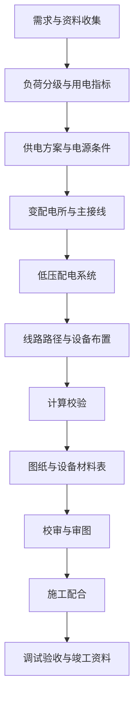
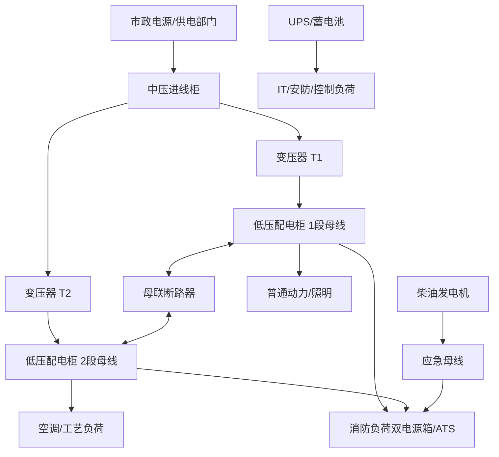
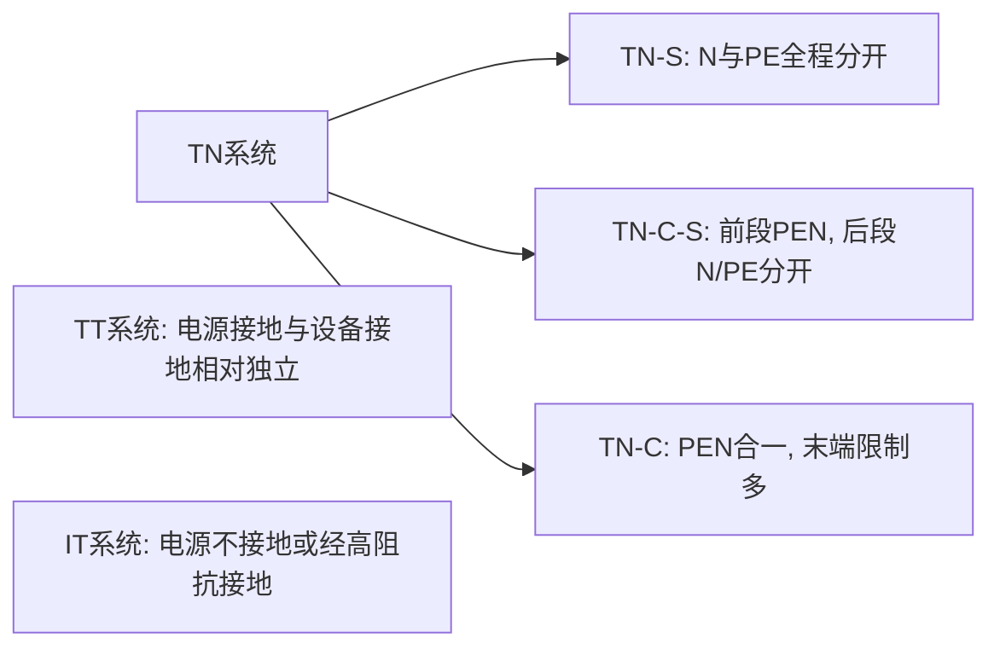
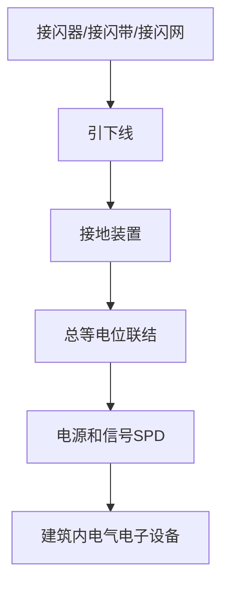
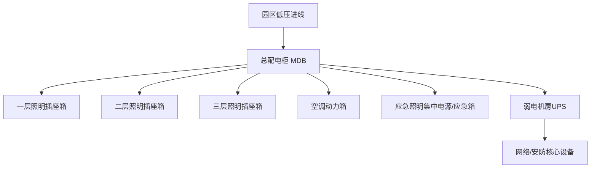

# 电气设计完整学习文档

> Last researched: 2026-06-15  
> Audience level: 初学者到工程实践入门  
> Scope: 以建筑与一般工业低压/中低压供配电电气设计为主，覆盖规范体系、负荷计算、供配电系统、变配电所、低压配电、短路与保护、电缆与母线、接地、防雷、照明、应急电源、电动机、弱电/智能化接口、图纸交付、审图常见问题和学习路线。本文不是执业签章文件，不替代现行强制性标准、地方审查要点、供电部门要求、消防审查意见和注册电气工程师审核。

## 1. 总览

电气设计的核心目标不是“把线连起来”，而是在满足建筑或工艺功能的前提下，形成一个安全、可靠、经济、可维护、可扩展、可审查、可施工、可运维的电力与信息基础系统。工程上通常把电气设计分成强电与弱电两大部分：

| 类别 | 主要内容 | 设计目标 |
| --- | --- | --- |
| 强电 | 供配电、变配电所、低压配电、照明、动力、电动机、应急电源、防雷接地、电气防火 | 安全供电、可靠运行、保护动作正确、满足容量与电能质量 |
| 弱电/智能化 | 通信、网络、综合布线、安防、广播、建筑设备监控、信息发布、会议、有线电视等 | 信息传输可靠、系统边界清晰、机房和线路资源可维护 |
| 消防相关电气 | 火灾自动报警、消防联动、消防电源、应急照明、疏散指示、防火剩余电流/电气火灾监控 | 火灾时维持必要功能，满足消防法规与专项标准 |
| 专项系统 | 医疗场所、数据中心、充电设施、光伏、储能、防爆场所、轨道交通、洁净厂房等 | 按专项标准处理特殊风险 |

学习电气设计要抓住五条主线：

- **规范主线**：知道项目适用哪些国家标准、行业标准、地方要求和供电部门要求。
- **计算主线**：负荷计算、短路计算、电压损失、保护整定、电缆截面、照度、防雷、接地。
- **系统主线**：电源从哪里来，如何变压、如何分配、故障如何切除、重要负荷如何保障。
- **图纸主线**：系统图、平面图、详图、设备表、材料表、计算书、设计说明之间要一致。
- **现场主线**：设计必须能施工、能调试、能检修、能验收，不能只在图面上成立。

## 2. 学习目标

完成本文学习后，应能达到以下目标：

- 能说清建筑电气设计的完整工作流：方案、初设、施工图、审查、施工配合、竣工资料。
- 能理解负荷等级、供电电源、配电级数、放射式/树干式/混合式配电的选择逻辑。
- 能做基础负荷计算、变压器容量估算、柴油发电机/UPS/EPS容量估算的入门级判断。
- 能理解低压断路器、熔断器、接触器、热继电器、RCD、SPD、隔离开关、ATS的作用边界。
- 能按“载流量、压降、热稳定、机械强度、敷设条件、保护配合”思路选择电缆。
- 能理解 TN-S、TN-C-S、TT、IT 接地系统的差异，以及保护接地、等电位联结、防雷接地之间的关系。
- 能读懂常见强电系统图、配电箱系统图、照明/插座/动力平面图、防雷接地平面图。
- 能识别审图和现场中最常见的问题：负荷分级错误、消防负荷供电错误、N/PE混接、RCD误用、SPD级配缺失、电缆压降未校验、图纸前后矛盾。

## 3. 前置知识

| 知识 | 要求 |
| --- | --- |
| 电工基础 | 电压、电流、电阻、功率、功率因数、三相交流、电能、电压降、短路、接地 |
| 电气安全 | 直接接触防护、间接接触防护、过电流保护、剩余电流保护、等电位联结 |
| 建筑识图 | 建筑轴网、楼层、墙体、门窗、吊顶、机房、管井、桥架、设备基础 |
| 设备基础 | 变压器、配电柜、断路器、电缆、母线、配电箱、灯具、插座、电动机、风机、水泵 |
| CAD/BIM | 图层、块、外部参照、比例、标注、系统图与平面图对应关系 |
| 规范意识 | 任何结论都要能回到规范条文、产品样本、计算书或业主需求 |

## 4. 规范体系与资料地图

电气设计首先要确定“用哪套规则”。不同国家、行业和项目类型要求不同。中国建筑电气设计通常以国家工程建设标准为主，配合行业标准、地方审查要点、供电部门技术要求和产品标准。国际低压电气装置可参考 IEC 60364 系列；北美项目通常以 NFPA 70 / NEC 为核心。

### 4.1 国内常用标准

| 标准 | 适用重点 | 学习用途 |
| --- | --- | --- |
| `GB 50052-2009 供配电系统设计规范` | 负荷分级、电源与供电系统、无功补偿、供配电可靠性 | 建立供配电系统的顶层逻辑 |
| `GB 50054-2011 低压配电设计规范` | 交流工频 1000V 及以下低压配电，保护电器、导体、配电线路 | 低压柜、箱、回路、电缆和保护的基础 |
| `GB 51348-2019 民用建筑电气设计标准` | 民用建筑电气综合标准，含供配电、变电所、照明、防雷、接地、智能化等 | 民用建筑施工图设计主线 |
| `GB 50053-2013 20kV及以下变电所设计规范` | 20kV及以下变电所所址、电气部分、装置布置、专业条件 | 变配电所设计依据 |
| `GB 50057-2010 建筑物防雷设计规范` | 防雷分类、外部防雷、内部防雷、SPD、防雷击电磁脉冲 | 防雷接地专项 |
| `GB/T 50034-2024 建筑照明设计标准` | 建筑照明、节能、LED、智能照明、健康照明、室外功能照明 | 照明设计与照明节能 |
| `GB/T 16895` 系列 | 低压电气装置，等同/修改采用 IEC 60364 多个部分 | 对照国际低压电气装置体系 |
| `GB 50016 建筑设计防火规范`、消防专项标准 | 消防负荷、消防线路、防火封堵、联动要求 | 电气消防边界 |
| 地方审图要点与供电部门要求 | 地区性变配电所布置、计量、进线、报装、审查口径 | 项目落地必须核对 |

学习顺序建议：

1. 先读 `GB 50052`，建立负荷分级、电源可靠性、供配电系统的概念。
2. 再读 `GB 50054`，学习低压配电保护、导体、电气设备选择。
3. 做民用建筑时通读 `GB 51348`，把强电、弱电、消防、电气节能串起来。
4. 设计变配电所时补 `GB 50053`。
5. 做防雷接地时补 `GB 50057`。
6. 做照明时使用 `GB/T 50034-2024`，注意该标准已自 2024-08-01 实施，原 `GB 50034-2013` 同时废止。

### 4.2 国际体系对照

| 体系 | 说明 | 与国内学习的关系 |
| --- | --- | --- |
| IEC 60364 | 低压电气装置国际标准系列，覆盖设计、安装、验证、安全防护、设备选择、特殊场所等。IEC 60364-1:2025 已替代 2005 版基础原则部分。 | `GB/T 16895` 系列大量对应 IEC 60364，用于理解低压电气装置的国际化逻辑。 |
| Schneider Electrical Installation Guide | 施耐德低压电气安装指南，面向设计、安装、检查、维护人员，覆盖压降、短路、接地、保护、谐波、无功补偿等实践主题。 | 适合做计算与设备选择的学习辅助资料，但不能替代中国工程强制性标准。 |
| NFPA 70 / NEC | 美国国家电气规范，通常由州或地方采用为强制要求。 | 北美项目、电气安全概念、设备认证和施工验收时重要；中国项目不能直接套用。 |

## 5. 电气设计的全流程



Figure: 电气设计常见流程，综合整理自国内建筑电气设计标准、12SDX101-2 计算示例目录、IEC 60364 设计/安装/验证思路。

### 5.1 资料收集

设计前必须收集：

- 建筑专业：总图、建筑平立剖、房间功能、面积、层高、吊顶、疏散路线、屋面设备、管井。
- 结构专业：梁板柱、剪力墙、基础、设备基础、预留洞、接地利用钢筋条件。
- 暖通专业：风机、空调机组、新风机、排烟风机、风阀、电加热、控制箱位置。
- 给排水专业：生活泵、消防泵、喷淋泵、排水泵、稳压泵、水处理设备。
- 动力/工艺专业：生产设备清单、功率、启动方式、运行制度、谐波源、冲击负荷。
- 弱电/智能化专业：机房、电井、线槽、桥架、终端点位、系统边界。
- 业主与物业：运营模式、计量分户、备用容量、租户二装、分期建设。
- 供电部门：电源电压等级、进线点、容量、计量方式、功率因数考核、报装要求。
- 当地审查要求：消防、电力、住建、人防、绿色建筑、节能、海绵城市等。

### 5.2 设计阶段

| 阶段 | 主要成果 | 重点 |
| --- | --- | --- |
| 方案阶段 | 用电指标、变配电所位置、电源方案、主要机房面积 | 把容量、电源、机房、管井和成本边界定住 |
| 初步设计 | 系统框架、主要设备容量、配电干线、应急电源、主要计算 | 满足审批和概算深度 |
| 施工图 | 完整图纸、计算书、设备材料表、设计说明、详图 | 可施工、可审查、可计量、可验收 |
| 施工配合 | 图纸会审、变更、设备选型复核、现场问题处理 | 维护设计意图，处理专业冲突 |
| 竣工阶段 | 竣工图、调试记录、检测报告、设备资料、运维交底 | 保证后续运维和验收闭环 |

## 6. 基础电气概念

### 6.1 常用量与公式

| 名称 | 符号 | 常用关系 |
| --- | --- | --- |
| 有功功率 | `P` | 单相 `P = U I cosφ`；三相 `P = √3 U I cosφ` |
| 无功功率 | `Q` | `Q = P tanφ` |
| 视在功率 | `S` | `S = P / cosφ`；三相 `S = √3 U I` |
| 功率因数 | `cosφ` | 有功功率与视在功率之比 |
| 电能 | `W` | `W = P × t` |
| 电阻 | `R` | `R = ρL/S` |
| 电压损失 | `ΔU` | 与电流、线路长度、导体阻抗、功率因数有关 |
| 短路电流 | `Isc` | 与电源容量、变压器阻抗、线路阻抗有关 |

### 6.2 三相系统

建筑低压配电常见电压为 `380/220V` 三相四线或三相五线系统。三相负荷平衡时，三相电流相等，中性线电流较小；单相负荷不平衡、非线性负荷较多时，中性线可能有较大电流甚至谐波电流，不能简单忽略。

### 6.3 负荷类型

| 负荷 | 特点 | 设计关注 |
| --- | --- | --- |
| 照明 | 数量多、功率分散、运行时间长 | 照度、功率密度、控制方式、应急照明 |
| 插座 | 随机性强、扩展性强 | 分回路、RCD、容量预留、办公/商业二装 |
| 风机水泵 | 电动机负荷，启动电流大 | 启动方式、保护、消防/非消防属性 |
| 电梯 | 冲击负荷、运行工况特殊 | 供电可靠性、消防电梯、再生/谐波 |
| 空调主机 | 大容量动力负荷 | 变配电容量、电压降、谐波、启动压降 |
| IT/数据中心 | 对供电连续性敏感 | UPS、双路电源、接地、谐波、监控 |
| 消防负荷 | 火灾时必须可靠工作 | 双电源、末端切换、耐火线路、消防联动 |

## 7. 负荷分级与供电可靠性

负荷分级决定供电方案，是电气设计的起点之一。错误的负荷分级会导致后续电源、变压器、发电机、ATS、配电线路全部偏离。

### 7.1 负荷等级

一般工程中按重要性分为一级负荷、二级负荷、三级负荷；其中一级负荷中还可能有特别重要负荷。具体分类必须按现行标准和项目功能判断。

| 等级 | 典型特征 | 供电设计倾向 |
| --- | --- | --- |
| 一级负荷中特别重要负荷 | 中断供电会造成重大人身、政治、经济或公共影响，且不能等待普通备用电源恢复 | 独立可靠电源、UPS/蓄电池/柴油发电机等持续保障，严控切换时间 |
| 一级负荷 | 中断供电会造成较大损失或重要影响 | 两个电源供电，必要时末端自动切换 |
| 二级负荷 | 中断供电会造成一般重要影响 | 宜由两回线路或较可靠电源供电 |
| 三级负荷 | 一般用电 | 单电源可满足 |

设计时不要只看设备名称，要看设备服务对象。例如“排水泵”可能只是普通集水坑排水，也可能服务地下车库防淹；“风机”可能是普通通风，也可能是消防排烟。

### 7.2 供电方式

| 方式 | 优点 | 局限 | 适用场景 |
| --- | --- | --- | --- |
| 单电源单回路 | 简单、成本低 | 可靠性低 | 三级负荷、小型项目 |
| 双电源双回路 | 可靠性较高 | 成本、空间、计量复杂 | 一级/二级负荷 |
| 市电 + 柴油发电机 | 适合长时间备用 | 启动时间、油料、排烟、噪声、维护要求高 | 消防负荷、重要动力、应急运行 |
| 市电 + UPS | 切换连续，适合电子设备 | 续航有限，电池维护成本高 | IT机房、安防、控制系统 |
| EPS/集中电源 | 面向应急照明等特定负荷 | 适用边界受标准和产品限制 | 应急照明、疏散指示 |

## 8. 负荷计算

负荷计算是容量选择的基础。它不是把所有设备铭牌功率简单相加，而是按设备运行概率、同时系数、需要系数、功率因数、工作制和备用关系确定计算负荷。

### 8.1 常见概念

| 名称 | 含义 |
| --- | --- |
| 设备功率 | 设备铭牌或折算后的输入功率 |
| 安装容量 | 某范围内设备功率总和 |
| 需要系数 | 计算负荷与安装容量之间的经验折减系数 |
| 同时系数 | 多组负荷同时达到最大值的概率修正 |
| 计算负荷 | 用于选择变压器、干线、开关、电缆的负荷 |
| 尖峰电流 | 电动机启动、冲击负荷等短时最大电流 |
| 功率因数 | 影响电流、变压器容量、无功补偿和供电考核 |

### 8.2 计算步骤

1. 列设备表：名称、数量、功率、电压、相数、功率因数、效率、运行方式、负荷等级。
2. 分系统归类：照明、插座、空调、动力、消防、弱电机房、电梯、厨房、工艺等。
3. 折算设备功率：电动机考虑输入功率，电焊机、电梯、周期工作制设备按相应方法折算。
4. 取需要系数/同时系数：按标准、手册、业主运营模式和类似项目经验。
5. 算 `Pjs`、`Qjs`、`Sjs`、`Ijs`。
6. 汇总到配电箱、配电柜、变压器、总进线。
7. 校验功率因数和无功补偿容量。
8. 与供电报装容量、变压器负载率、发电机容量、UPS容量互相校核。

### 8.3 简化示例

假设某小型办公区域：

| 负荷 | 安装容量 | 需要系数 | 功率因数 | 计算有功 |
| --- | ---: | ---: | ---: | ---: |
| 照明 | 20 kW | 0.9 | 0.95 | 18 kW |
| 插座 | 60 kW | 0.5 | 0.90 | 30 kW |
| 空调末端 | 35 kW | 0.8 | 0.85 | 28 kW |
| 弱电机房 | 10 kW | 1.0 | 0.90 | 10 kW |

合计有功 `Pjs = 86 kW`。若综合功率因数按 `0.90` 估算，视在功率 `Sjs = 86 / 0.90 = 95.6 kVA`。若三相低压电压为 `0.38 kV`，计算电流近似：

```text
Ijs = S / (√3 × U)
    = 95.6 / (1.732 × 0.38)
    ≈ 145 A
```

该电流只能作为初步选择进线开关、电缆和箱柜容量的起点，最终还要校验电缆敷设修正、电压损失、保护配合、备用容量和上级系统条件。

### 8.4 负荷计算常见错误

- 把所有设备铭牌功率直接相加，导致变压器和电缆明显偏大。
- 忽略备用设备，备用泵一用一备时不应简单按两台长期同时运行处理，但消防、轮换、检修工况要说明。
- 忽略单相负荷不平衡，导致某相电流或中性线电流超出预期。
- 忽略电动机启动电流，导致启动压降、发电机带载能力和断路器瞬时脱扣误判。
- 插座负荷没有按使用性质分类，办公、商业、厨房、实验室、医疗场所差别很大。
- 未区分消防负荷和非消防负荷，导致应急电源容量错误。

## 9. 供配电系统设计

### 9.1 典型供配电结构



Figure: 常见建筑中低压供配电框架，按 `GB 50052`、`GB 50054`、`GB 51348` 和 IEC 60364 的设计思路重新绘制。

### 9.2 主接线选择

| 主接线 | 特点 | 适用 |
| --- | --- | --- |
| 单母线 | 结构简单、投资低 | 小型项目、三级负荷为主 |
| 单母线分段 | 可靠性较好，可分列运行或母联备用 | 两台变压器、二级及以上负荷较多 |
| 双电源末端切换 | 重要负荷末端可靠性高 | 消防泵、消防电梯、重要机房 |
| 放射式配电 | 故障影响范围小，管理清晰 | 重要负荷、大容量设备 |
| 树干式配电 | 节省电缆和柜位 | 普通照明/插座、负荷分散但可靠性要求一般 |
| 混合式 | 工程最常见 | 兼顾可靠性、成本和施工 |

### 9.3 配电级数

配电级数过多会增加压降、故障点和选择性配合难度；级数过少会导致电缆长、箱柜大、维护不便。常见层级：

```text
变配电所低压柜 -> 楼层/区域总箱 -> 分配电箱 -> 末端回路 -> 设备/灯具/插座
```

消防和重要负荷常采用更清晰的专用干线和末端切换，避免与普通负荷混接。

## 10. 变配电所设计

变配电所设计要同时满足电气、建筑、结构、暖通、消防、运维和供电部门要求。`GB 50053-2013` 适用于交流 20kV 及以下变电所，核心目标是安全、可靠、经济、便于安装维护。

### 10.1 所址选择

选址要考虑：

- 靠近负荷中心，减少低压干线长度和压降。
- 便于高压进线、低压出线、设备运输、检修更换。
- 避免积水、潮湿、腐蚀、爆炸危险、强振动、高温环境。
- 与建筑功能协调，控制噪声、电磁影响、消防分隔。
- 预留扩容、设备吊装和运维通道。

### 10.2 主要设备

| 设备 | 作用 | 设计关注 |
| --- | --- | --- |
| 高压柜 | 中压进线、计量、保护、出线 | 供电部门要求、保护配置、五防、操作通道 |
| 变压器 | 电压变换和容量承载 | 容量、阻抗、损耗、噪声、温升、接线组别 |
| 低压柜 | 低压总进线、母联、馈线、补偿 | 短路耐受、分断能力、选择性、母线容量 |
| 无功补偿柜 | 提高功率因数、降低无功 | 投切方式、谐波抑制、电容器容量 |
| 直流屏/UPS | 高压操作、保护、控制电源 | 蓄电池容量、监控、维护 |
| 发电机并机/ATS柜 | 应急电源切换 | 切换逻辑、消防联动、负荷分级 |

### 10.3 变压器容量选择

变压器容量不是越大越好。过大导致初投资、空载损耗、短路电流增大；过小导致过载、扩容困难和电压质量下降。

设计时关注：

- 计算负荷和负荷发展。
- 变压器台数和互为备用能力。
- 低压短路电流水平与开关分断能力。
- 运行负载率和经济运行区间。
- 消防负荷、季节性负荷、工艺连续性。
- 供电部门容量审批和计量方式。

简化判断：

```text
单台变压器容量 >= 该变压器承担的计算视在功率 / 目标负载率
```

目标负载率要结合项目类型、备用关系、季节变化和能效要求确定，不能机械固定。

## 11. 短路计算与电器选择

短路计算用于确定电气设备能否承受和切除故障电流。它直接影响断路器分断能力、柜体短时耐受、母线热稳定/动稳定、电缆热稳定和保护整定。

### 11.1 为什么短路计算重要

如果短路电流估小：

- 断路器分断能力可能不足，故障时不能安全切除。
- 配电柜母线短时耐受能力不足，可能发生严重事故。
- 电缆热稳定不满足，短路时绝缘损坏。

如果短路电流估大：

- 设备规格和成本不必要增大。
- 保护选择性设计可能过于保守。

### 11.2 低压短路电流的影响因素

| 因素 | 影响 |
| --- | --- |
| 上级电网短路容量 | 电源越强，短路电流越大 |
| 变压器容量 | 容量越大，短路电流通常越大 |
| 变压器阻抗电压 | 阻抗越小，短路电流越大 |
| 电缆长度和截面 | 距离越远、截面越小，短路电流越小 |
| 发电机供电 | 短路电流水平和衰减特性不同于市电 |
| 电动机反馈 | 大型电机可能在短路初期反馈电流 |

### 11.3 电器选择基本校验

| 校验项 | 含义 |
| --- | --- |
| 额定电压 | 电器额定电压不低于系统电压 |
| 额定电流 | 不小于长期计算电流，并考虑温度、安装、谐波等 |
| 分断能力 | 不小于安装点预期短路电流 |
| 短时耐受 | 柜体、母线、开关能承受保护动作前短路热效应 |
| 选择性 | 下级故障优先由下级保护切除，减少停电范围 |
| 灵敏性 | 线路末端故障时保护能可靠动作 |
| 限流能力 | 限流断路器/熔断器可降低下级设备承受应力 |

### 11.4 保护配合

保护配合的目标是“该跳的跳，不该跳的不跳”。常见方式：

- **电流级差**：上级整定电流大于下级。
- **时间级差**：下级先动作，上级延时后备。
- **区域选择性联锁**：智能断路器之间通信，实现快速且选择性切除。
- **熔断器与断路器配合**：利用限流熔断器保护下级设备。

常见错误：

- 只按额定电流选开关，不看分断能力。
- 下级短路时上级总开关先跳，整个区域停电。
- 末端短路电流太小，瞬时脱扣不动作，热脱扣时间过长。
- 消防负荷和非消防负荷混在同一保护回路，火灾时切非困难。

## 12. 低压配电设计

`GB 50054-2011` 是低压配电设计的核心规范之一，适用于新建、改建、扩建工程中交流工频 1000V 及以下低压配电设计。

### 12.1 低压配电设备

| 设备 | 作用 | 注意事项 |
| --- | --- | --- |
| 断路器 MCCB/ACB/MCB | 过载、短路保护，部分带隔离和漏电保护 | 分断能力、脱扣曲线、选择性、附件 |
| 熔断器 | 短路保护和限流保护 | 更换维护、选择性、熔体特性 |
| 隔离开关 | 检修隔离 | 不能替代保护电器 |
| 接触器 | 频繁通断负荷 | 需配合保护电器，不负责短路保护 |
| 热继电器/电动机保护器 | 电动机过载、缺相等保护 | 与电动机启动方式配合 |
| RCD/漏电保护器 | 剩余电流保护，降低触电和接地故障风险 | 类型、额定剩余动作电流、选择性、误动 |
| SPD | 浪涌保护 | 分级配置、接地和引线长度很关键 |
| ATS | 双电源自动转换 | 负荷等级、切换时间、消防联动、旁路维护 |

### 12.2 配电箱系统图

一个合格的配电箱系统图至少应表达：

- 箱号、安装位置、供电来源。
- 总开关型号、极数、额定电流、保护功能。
- 各出线回路编号、用途、开关规格、电缆型号、敷设方式。
- 计算容量、计算电流、需要系数、功率因数。
- 接地型式、N/PE端子、浪涌保护、漏电保护。
- 消防/非消防属性、双电源切换关系。

### 12.3 照明、插座、动力回路

| 回路 | 设计要点 |
| --- | --- |
| 照明回路 | 按区域、控制方式、应急/普通分开；避免一个故障导致大面积黑暗 |
| 普通插座回路 | 合理分区，必要时设 RCD；办公和商业预留容量 |
| 厨房/设备插座 | 按设备专用回路，考虑防水、防油污、局部等电位 |
| 空调回路 | 室内机、室外机、集中空调末端按系统边界供电 |
| 水泵/风机 | 消防与非消防严格区分，控制箱位置和供电责任明确 |
| 电梯 | 消防电梯、客梯、货梯负荷等级不同，机房/井道供电要协调 |

## 13. 电缆、导线、母线与敷设

电缆截面选择通常至少要满足五类条件：

1. **长期允许载流量**：在实际敷设环境下不超过导体允许温升。
2. **电压损失**：末端电压满足设备启动和运行要求。
3. **短路热稳定**：短路持续时间内导体绝缘不被热损坏。
4. **机械强度**：截面不能小到无法可靠施工和运行。
5. **保护配合**：故障时保护电器能在规定时间内动作。

### 13.1 影响载流量的因素

| 因素 | 影响 |
| --- | --- |
| 导体材料 | 铜导体载流能力和机械性能通常优于铝导体，但成本更高 |
| 绝缘材料 | PVC、XLPE、矿物绝缘等允许温度不同 |
| 敷设方式 | 穿管、桥架、直埋、空气中、密集敷设差异明显 |
| 环境温度 | 温度越高，允许载流量越低 |
| 多回路并列 | 散热变差，需要降容 |
| 谐波 | 中性线和相线发热可能增加 |

### 13.2 电压损失

电压损失过大会导致：

- 电动机启动困难或转矩不足。
- 照明闪烁、亮度下降。
- 电子设备欠压报警。
- 发电机或 UPS 供电时末端电压更差。

压降控制思路：

- 缩短线路。
- 增大截面。
- 提高供电电压等级。
- 调整配电点位置。
- 大容量设备采用专用回路。
- 电动机采用软启动、变频或降压启动。

### 13.3 桥架、线槽、管路

桥架设计要注意：

- 强弱电分设或保持间距，避免电磁干扰。
- 消防线路和普通线路分开或采取防火措施。
- 桥架转弯、穿墙、穿楼板、防火封堵要表达清楚。
- 竖井内桥架、电缆、母线、配电箱要留检修空间。
- 不同电压等级、不同用途电缆混敷要符合规范要求。
- 桥架填充率不能只看平面宽度，还要考虑散热和施工。

## 14. 接地、等电位与电击防护

接地系统是电气安全的底层。很多事故不是“没有接地”，而是接地概念混乱：N 与 PE 混接、重复接地点错误、RCD使用错误、等电位缺失、弱电接地和防雷接地边界不清。

### 14.1 接地型式



Figure: 低压接地系统分类，按 IEC 60364 / GB/T 16895 系列常见分类重新绘制。

| 系统 | 特点 | 常见关注 |
| --- | --- | --- |
| TN-S | N 与 PE 分开，建筑低压系统常用 | PE 连续性、N/PE不得混接 |
| TN-C-S | 电源侧 PEN，进入建筑后分为 N 和 PE | PEN 分离点、重复接地、后续不得再合并 |
| TT | 设备外露可导电部分接本地接地极 | RCD 通常很关键，接地电阻和动作条件要校验 |
| IT | 第一次接地故障不立即切断 | 医疗、连续工艺等特殊场所，需绝缘监测 |

### 14.2 等电位联结

等电位联结的目的是降低不同可导电部分之间的电位差，减少触电风险。常见对象：

- 建筑物金属结构。
- 进出建筑的金属管道。
- PE干线、接地干线。
- 电气设备外露可导电部分。
- 卫生间、浴室、游泳池、医疗场所等局部等电位。
- 弱电机房、数据中心、通信机房接地网。

### 14.3 RCD 使用要点

RCD 不能替代 PE。采用剩余电流动作保护作为间接接触防护时，回路必须有保护导体。常见误区：

- 认为装了漏保就可以不接 PE。
- 多级 RCD 没有选择性，上下级同时跳。
- 变频器、UPS、充电桩等非线性负荷未按漏电波形选择 RCD 类型。
- 消防或安全设施回路误加不合适的 RCD，导致火灾时误切断。
- 多回路共用 N 线导致 RCD 误动。

## 15. 防雷与浪涌保护

防雷设计包括外部防雷和内部防雷。外部防雷解决直击雷；内部防雷解决雷电流引起的电磁脉冲、反击、过电压和设备损坏。

### 15.1 防雷系统组成



Figure: 建筑物防雷与等电位、SPD关系，按 `GB 50057-2010` 防雷装置和防雷击电磁脉冲思路重新绘制。

### 15.2 防雷设计步骤

1. 判断建筑物防雷类别。
2. 确定接闪器形式：接闪带、接闪网、接闪杆、金属屋面等。
3. 布置引下线和接地装置。
4. 做等电位联结。
5. 配置电源 SPD 和信号 SPD。
6. 校核屋面设备、金属构件、光伏、通信天线、室外摄像机等。
7. 与结构专业协调基础接地、引下线、测试点。

### 15.3 SPD 设计要点

| 位置 | 常见配置思路 |
| --- | --- |
| 总配电处 | 一级/Type 1 或满足雷电流泄放要求的 SPD |
| 分配电处 | 二级/Type 2 SPD，限制残压 |
| 终端敏感设备 | 三级/Type 3 SPD 或设备级保护 |
| 弱电线路 | 网络、通信、视频、控制线按接口类型选信号 SPD |

SPD 不是“装上就有用”。引线过长、接地不良、级配不当、没有前置保护、信号线未保护，都会导致效果大幅下降。

## 16. 照明设计

照明设计要同时满足视觉功能、舒适性、节能、控制和安全。`GB/T 50034-2024` 已自 2024-08-01 实施，重点包括 LED、智能照明、健康照明、照明功率密度、室外功能照明等更新内容。

### 16.1 基本指标

| 指标 | 含义 |
| --- | --- |
| 照度 | 被照面单位面积接受的光通量，单位 lx |
| 照度均匀度 | 最小照度与平均照度的关系 |
| 统一眩光值 UGR | 评价眩光影响 |
| 显色指数 Ra | 光源还原颜色的能力 |
| 色温 CCT | 暖白/中性白/冷白视觉感受 |
| 照明功率密度 LPD | 单位面积照明功率，节能控制指标 |
| 频闪与闪烁 | 影响视觉舒适和健康 |

### 16.2 照明设计流程

1. 明确房间功能和照度标准。
2. 选择灯具类型、光束角、配光、显色、色温、防护等级。
3. 初步布灯并计算照度和均匀度。
4. 校核眩光、功率密度、控制方式。
5. 区分普通照明、应急照明、值班照明、景观/功能照明。
6. 确定回路、开关、调光、传感器、智能控制。
7. 与吊顶、风口、喷淋、烟感、检修口协调。

### 16.3 利用系数法入门

简化公式：

```text
N = E × A / (Φ × UF × MF)
```

其中：

- `N`：灯具数量。
- `E`：目标平均照度。
- `A`：房间面积。
- `Φ`：单套灯具光通量。
- `UF`：利用系数。
- `MF`：维护系数。

该方法适合初估，复杂空间应使用专业照明软件计算。

### 16.4 常见错误

- 只满足平均照度，不看均匀度和眩光。
- 灯具与风口、喷淋、烟感、梁位冲突。
- 只做平面布灯，不做回路和控制逻辑。
- 应急照明和普通照明电源混乱。
- 未按新标准控制照明功率密度和智能控制。

## 17. 应急电源、消防电源与连续供电

应急电源设计的关键不是“有没有备用电源”，而是备用电源是否服务正确负荷、容量是否足够、切换时间是否满足、线路是否耐火、火灾时是否可靠。

### 17.1 常见应急电源

| 电源 | 优点 | 局限 |
| --- | --- | --- |
| 柴油发电机 | 可长时间供电，容量大 | 启动时间、燃油、排烟、噪声、维护 |
| UPS | 不间断切换，电能质量好 | 续航有限，电池寿命与环境要求高 |
| EPS/集中电源 | 面向应急照明等特定应用 | 适用范围需按消防和产品标准 |
| 蓄电池灯具 | 分散可靠，线路简单 | 维护点多，电池状态需管理 |
| 双市电 | 可靠性高 | 取决于供电部门电源独立性 |

### 17.2 消防负荷供电要点

- 消防负荷应按负荷等级、消防规范和项目类别确定供电方式。
- 消防设备配电线路与普通负荷线路要有清晰边界。
- 消防水泵、排烟风机、消防电梯、防火卷帘、消防控制室、应急照明等负荷属性不能混淆。
- 末端双电源切换箱的位置、上级电源来源、切换逻辑要在系统图和平面图中一致。
- 火灾时需要切除非消防电源，但不应误切消防和安全设施电源。

## 18. 电动机与动力控制

建筑和工业项目中大量负荷本质是电动机：水泵、风机、冷却塔、空压机、输送设备、电梯等。

### 18.1 启动方式

| 启动方式 | 特点 | 适用 |
| --- | --- | --- |
| 直接启动 | 简单、成本低，启动电流大 | 小容量电机、电网容量足够 |
| 星三角启动 | 降低启动电流和转矩 | 适合特定接线电机，负载启动转矩要求不高 |
| 自耦降压启动 | 降压效果较好 | 中大容量电机 |
| 软启动 | 平滑启动，机械冲击小 | 风机、水泵等 |
| 变频启动/运行 | 调速节能，启动平滑 | 风机、水泵、工艺调速 |

### 18.2 电动机保护

常见保护包括：

- 短路保护。
- 过载保护。
- 缺相保护。
- 堵转保护。
- 接地故障保护。
- 欠压/失压保护。
- 过温保护。
- 变频器故障保护。

### 18.3 变频器设计注意

- 变频器输入侧可能产生谐波，必要时配置电抗器、滤波器或有源滤波。
- 输出侧长电缆可能导致电机端过电压，需要按厂家要求配置输出电抗器或滤波器。
- 变频器回路 RCD 类型要谨慎，普通 AC 型可能不适用。
- 变频器散热、柜体通风、EMC、屏蔽接地要落实。
- 消防风机是否允许变频运行，要按消防控制要求和产品认证确认。

## 19. 电能质量、无功补偿与谐波

现代建筑中 LED、UPS、变频器、充电桩、开关电源大量存在，电能质量越来越重要。

### 19.1 功率因数与无功补偿

功率因数低会导致：

- 电流增大。
- 线路损耗增加。
- 变压器容量被无功占用。
- 可能被供电部门考核。

无功补偿设计注意：

- 补偿容量按计算无功和目标功率因数确定。
- 谐波较多时，普通电容器可能谐振或过载，应配置串联电抗或滤波。
- 补偿宜分组自动投切，避免过补偿。
- 变压器轻载、夜间负荷、季节性负荷要考虑。

### 19.2 谐波

谐波来源：

- 变频器。
- UPS。
- LED驱动电源。
- 开关电源。
- 电梯。
- 充电桩。
- 整流设备。

影响：

- 中性线过热。
- 变压器附加损耗。
- 电容器过流。
- 保护误动。
- 通信干扰。
- 设备发热和寿命降低。

治理方式：

- 选用低谐波设备。
- 合理分配非线性负荷。
- 设置电抗器、无源滤波、有源滤波。
- 谐波严重项目做专项计算和测试。

## 20. 弱电与智能化接口

弱电系统不是强电的附属“点位图”，它有自己的系统架构、机房、线缆、供电、接地、防雷和运维要求。强电设计与弱电设计的接口非常多。

### 20.1 常见系统

| 系统 | 主要内容 |
| --- | --- |
| 综合布线 | 数据、语音、无线 AP、信息插座、配线架、机柜 |
| 信息网络 | 核心交换、汇聚、接入、无线、网络安全 |
| 安防 | 视频监控、门禁、入侵报警、电子巡更、停车管理 |
| 建筑设备监控 | 空调、给排水、照明、电梯、电表、水表、能耗监测 |
| 公共广播 | 背景音乐、业务广播、消防应急广播接口 |
| 有线电视/信息发布 | 信号源、分配、终端 |
| 机房工程 | UPS、精密空调、接地、防雷、消防、监控 |

### 20.2 强弱电接口

- 弱电机房和设备间需要可靠供电，常配置 UPS。
- 弱电桥架与强电桥架应分开布置或保持间距。
- 摄像机、门禁、AP、信息屏等终端点位需要供电方式确认：本地电源、PoE、集中电源。
- 弱电系统的 SPD、接地、等电位要与建筑接地系统协调。
- 消防联动接口需要明确责任：火灾报警专业、强电专业、暖通专业、给排水专业、弱电专业之间要形成闭环。

## 21. 图纸表达与交付文件

### 21.1 施工图目录

常见建筑电气施工图包括：

- 图纸目录。
- 设计说明。
- 主要设备材料表。
- 供配电系统图。
- 变配电所高低压系统图。
- 配电箱系统图。
- 竖向配电干线图。
- 照明平面图。
- 插座平面图。
- 动力平面图。
- 防雷平面图。
- 接地平面图。
- 火灾自动报警/消防联动图。
- 弱电系统图和平面图。
- 机房、竖井、桥架、接地端子箱、等电位箱详图。
- 计算书。

### 21.2 图纸一致性

设计校审最常查：

- 系统图回路编号与平面图编号是否一致。
- 配电箱编号、容量、安装位置是否一致。
- 电缆型号规格在系统图、平面图、材料表是否一致。
- 消防设备在强电、消防、暖通、给排水图纸中名称和容量是否一致。
- 竖井、桥架、管线穿越是否与建筑结构冲突。
- 设计说明中的规范版本是否现行。
- 计算书容量是否能支撑设备表和系统图。

### 21.3 设计说明应包含

- 工程概况。
- 设计依据。
- 设计范围。
- 供电电源、电压等级、负荷等级。
- 变配电所和应急电源。
- 低压配电系统和接地型式。
- 照明、动力、消防、弱电、防雷接地。
- 节能措施。
- 施工安装要求。
- 设备材料技术要求。
- 与其他专业配合要求。
- 未尽事宜按现行国家标准执行。

## 22. 计算书框架

参考 `12SDX101-2 民用建筑电气设计计算及示例` 的目录，完整计算书可按以下框架组织：

| 计算内容 | 目的 |
| --- | --- |
| 负荷计算 | 确定配电箱、柜、变压器、发电机、UPS容量 |
| 变压器容量计算 | 确定台数、容量、负载率 |
| 柴油发电机容量计算 | 校核消防/应急负荷、启动冲击、持续运行 |
| UPS/EPS容量计算 | 校核重要电子负荷和应急照明 |
| 短路电流计算 | 选择断路器、柜体、母线、电缆热稳定 |
| 继电保护/整定计算 | 保护动作正确、选择性配合 |
| 电缆截面计算 | 载流量、压降、热稳定、机械强度 |
| 电压损失计算 | 保证末端设备运行和启动 |
| 无功补偿计算 | 达到目标功率因数 |
| 谐波计算 | 判断是否需要滤波和特殊设备 |
| 照度计算 | 满足照度、均匀度、眩光、LPD |
| 防雷计算 | 防雷类别、接闪保护范围、接地 |
| 接地计算 | 接地电阻、等电位、故障保护动作 |

## 23. 端到端小型项目示例

假设一个三层小型办公楼，建筑面积 3000 m2，无大型厨房和数据中心，设置普通办公、会议室、弱电机房、小型空调系统、消防泵房由园区统一供给。

### 23.1 设计判断

| 项目 | 判断 |
| --- | --- |
| 电源 | 园区低压引入，设置总配电柜 |
| 负荷等级 | 普通办公多为三级；应急照明、消防报警等按消防要求 |
| 配电 | 总柜 -> 楼层配电箱 -> 照明/插座/空调回路 |
| 接地 | TN-S 或由进线处 TN-C-S 分离后全楼 TN-S，按实际供电条件 |
| 照明 | LED灯具，分区控制，疏散路径设置应急照明 |
| 弱电 | 每层弱电箱，机房设置 UPS 给网络核心和安防 |
| 防雷 | 按建筑物类别和当地雷暴资料判断，屋面设置接闪与引下 |

### 23.2 配电结构



### 23.3 关键校核

- 总负荷按各系统需要系数汇总。
- 每层照明、插座分回路，插座回路设置合适 RCD。
- 空调外机或集中设备采用专用回路。
- 应急照明与普通照明分清电源和回路。
- 总柜进线和出线断路器分断能力按短路计算选择。
- 电缆按载流量、压降和保护配合校验。
- 防雷接地与等电位端子箱在图纸中表达。

## 24. 常见审图问题与现场坑

### 24.1 系统与负荷

- 负荷等级判定依据不足。
- 消防负荷没有采用符合要求的双电源或末端切换。
- 应急电源容量只按运行功率算，未考虑启动冲击。
- 变压器容量、低压柜容量、供电报装容量互相矛盾。
- 普通负荷和消防负荷混用同一配电回路。

### 24.2 保护与安全

- 断路器分断能力不足。
- 上下级保护没有选择性。
- RCD 设置不当，导致误动或不动作。
- N线和PE线混接。
- 等电位联结遗漏，尤其卫生间、设备机房、屋面金属设备。
- SPD 没有前置保护或接地引线过长。

### 24.3 电缆与敷设

- 电缆只按载流量选，未校验压降。
- 多回路密集敷设未降容。
- 消防线路与普通线路混敷且无防火措施。
- 桥架穿越防火分区未标注封堵。
- 电井空间不足，箱体门无法打开或检修通道不足。

### 24.4 图纸问题

- 系统图、平面图、材料表电缆规格不一致。
- 回路编号重复或缺失。
- 配电箱位置与建筑门窗、结构墙、管井冲突。
- 设备功率与暖通/给排水提资不一致。
- 设计说明引用废止标准。
- 平面图没有表达线路敷设方式和安装高度。

## 25. 调试、验收与运维视角

设计人员要提前考虑后续如何验收和维护。

### 25.1 常见测试

| 测试 | 目的 |
| --- | --- |
| 绝缘电阻测试 | 检查线路绝缘状态 |
| 接地电阻测试 | 检查接地装置有效性 |
| 等电位连续性测试 | 检查保护导体和联结可靠性 |
| RCD动作测试 | 检查剩余电流保护动作 |
| 断路器整定检查 | 确认保护参数 |
| 双电源切换测试 | 检查ATS切换逻辑 |
| 发电机带载测试 | 检查启动、切换、带载能力 |
| UPS放电测试 | 检查续航和切换 |
| 照度测试 | 检查照明效果 |
| 消防联动测试 | 检查火灾时设备动作 |

### 25.2 运维友好设计

- 配电箱柜留有清晰标识和回路表。
- 重要回路预留计量和监测。
- 设备周围留检修空间。
- 电缆桥架留余量但不过度堆积。
- 消防、安防、网络、楼控等系统有清晰电源边界。
- 竣工图与现场一致，变更闭环。

## 26. 学习路线

### 26.1 第一阶段：基础识图与概念

目标：能看懂普通照明、插座、配电箱系统图。

学习内容：

- 电工基础公式。
- 三相交流和功率因数。
- 断路器、电缆、配电箱、灯具、插座。
- CAD图层、轴网、比例、标注。
- 常用图例和回路编号。

练习：

- 找一套小型办公楼电气图，逐个回路从系统图追到平面图。
- 把每个配电箱的电源来源、容量、出线用途列成表。

### 26.2 第二阶段：低压配电与负荷计算

目标：能完成小型项目低压系统初步设计。

学习内容：

- `GB 50052` 负荷分级和供电系统。
- `GB 50054` 低压配电保护和导体选择。
- 负荷计算、需要系数、同时系数。
- 电缆载流量和电压损失。
- RCD、SPD、接地型式。

练习：

- 做一个三层办公楼负荷计算表。
- 画总配电柜到楼层箱的系统图。
- 校验一条最长插座回路电压损失。

### 26.3 第三阶段：变配电所与短路保护

目标：能理解变配电所系统图和短路计算逻辑。

学习内容：

- `GB 50053` 变电所设计。
- 变压器容量、阻抗、损耗。
- 高低压柜、母联、无功补偿。
- 短路电流计算。
- 断路器分断能力和选择性配合。

练习：

- 根据变压器容量和阻抗估算低压侧短路电流。
- 选择低压进线和馈线断路器的分断能力。
- 对比两级断路器脱扣曲线。

### 26.4 第四阶段：专项系统

目标：能处理照明、防雷、消防、弱电接口。

学习内容：

- `GB/T 50034-2024` 照明。
- `GB 50057` 防雷。
- 消防电源、应急照明、火灾自动报警接口。
- 综合布线、安防、楼控供电。
- BIM/CAD专业协调。

练习：

- 用照明软件或利用系数法做一个办公室照度计算。
- 画屋面防雷平面和基础接地平面。
- 列一张消防负荷供电清单。

### 26.5 第五阶段：工程闭环

目标：能独立完成小型项目施工图并参与审图和现场配合。

学习内容：

- 图纸校审。
- 计算书整理。
- 设备材料表。
- 设计变更。
- 施工验收规范。
- 竣工图和运维资料。

练习：

- 拿一套完整图纸做自审清单。
- 对照审图意见逐条归类：规范问题、计算问题、图纸一致性问题、专业配合问题。

## 27. 快速检查清单

### 27.1 方案阶段

- 电源条件是否明确。
- 负荷等级是否明确。
- 变配电所位置和面积是否可行。
- 柴油发电机、UPS、电池间、弱电机房是否预留。
- 电井、桥架主通道是否有空间。
- 消防和非消防供电边界是否明确。

### 27.2 施工图阶段

- 规范版本是否现行。
- 负荷计算是否与设备表一致。
- 短路计算是否支撑开关分断能力。
- 电缆是否校验载流量、压降、热稳定。
- 接地型式是否清楚。
- RCD 和 SPD 是否配置合理。
- 双电源切换是否画到末端。
- 强弱电、消防、暖通、给排水接口是否闭合。
- 系统图、平面图、材料表是否一致。

### 27.3 施工配合阶段

- 设备厂家参数是否与设计一致。
- 断路器脱扣器、ATS、UPS、发电机控制逻辑是否复核。
- 桥架与风管、水管、结构是否冲突。
- 防火封堵、接地跨接、等电位是否落实。
- 隐蔽工程资料是否完整。

## 28. 专业边界与职业习惯

优秀电气设计人员的习惯：

- 所有容量都有计算来源。
- 所有重要回路都能说明负荷等级。
- 所有保护电器都校验分断能力和动作条件。
- 所有专业接口都用提资单或会议纪要闭环。
- 现场问题先判断安全和规范底线，再讨论经济方案。
- 不盲信厂家样本，不用“以前都这么做”替代条文和计算。
- 图纸表达尽量让施工人员少猜。

## References and further reading

- [Standard / IEC] IEC 60364-1:2025, Low-voltage electrical installations - Part 1: Fundamental principles, assessment of general characteristics, and definitions: https://webstore.iec.ch/en/publication/63699
- [Vendor guide] Schneider Electric Electrical Installation Guide: https://www.se.com/ww/en/work/products/product-launch/electrical-installation-guide/
- [Standard portal] 国家标准全文公开系统，GB/T 16895 系列检索结果: https://openstd.samr.gov.cn/bzgk/std/std_list?p.p1=0&p.p2=16895&p.p90=circulation_date&p.p91=desc
- [Standard project] 全国标准信息公共服务平台，低压电气装置 第5-56部分：安全设施: https://std.samr.gov.cn/gb/search/gbDetailed?id=8989C178572EBDA4E05397BE0A0A39DA
- [Standard] GB 50052-2009 供配电系统设计规范说明页: https://www.waizi.org.cn/bz/131497.html
- [Standard PDF] GB 50052-2009 供配电系统设计规范 PDF: https://upload.wikimedia.org/wikipedia/commons/4/48/GB_50052-2009_%E4%BE%9B%E9%85%8D%E7%94%B5%E7%B3%BB%E7%BB%9F%E8%AE%BE%E8%AE%A1%E8%A7%84%E8%8C%83.pdf
- [Standard] GB 50054-2011 低压配电设计规范说明页: https://www.waizi.org.cn/bz/131499.html
- [Standard PDF] GB 50054-2011 低压配电设计规范 PDF: https://files.anshan.gov.cn/files/ueditor/ASJKQ/jsp/upload/file/20211201/1638343166465002256.pdf
- [Standard] GB 51348-2019 民用建筑电气设计标准说明页: https://www.waizi.org.cn/bz/130895.html
- [Standard] GB 50053-2013 20kV及以下变电所设计规范说明页: https://www.waizi.org.cn/bz/131498.html
- [Standard PDF] GB 50053-2013 20kV及以下变电所设计规范 PDF: https://upload.wikimedia.org/wikipedia/commons/9/9e/GB_50053-2013_20kV%E5%8F%8A%E4%BB%A5%E4%B8%8B%E5%8F%98%E7%94%B5%E6%89%80%E8%AE%BE%E8%AE%A1%E8%A7%84%E8%8C%83.pdf
- [Standard] GB 50057-2010 建筑物防雷设计规范说明页: https://www.waizi.org.cn/law/8940.html
- [Standard PDF] GB 50057-2010 建筑物防雷设计规范 PDF: https://www.gbwindows.net/ow-content/uploads/download/gfbzdown/1.0.5%E6%9D%A1/%E5%85%B3%E8%81%94%E6%A0%87%E5%87%86/GB50057-2010%20%E5%BB%BA%E7%AD%91%E7%89%A9%E9%98%B2%E9%9B%B7%E8%AE%BE%E8%AE%A1%E8%A7%84%E8%8C%83.pdf
- [Standard] GB/T 50034-2024 建筑照明设计标准发布信息: https://www.gbwindows.net/news/3084.html
- [Standard PDF] GB/T 50034-2024 建筑照明设计标准 PDF: https://www.linzi.gov.cn/gongkai/site_lzqwsjkj/channel_654c78504f0ac470b73523f4/doc_67079ceb0c81719cbf7165ea_7a1fc91bc659dcda5e0ac0c5ad768cf1.pdf
- [Design atlas] 12SDX101-2 民用建筑电气设计计算及示例目录: https://ebook.chinabuilding.com.cn/zbooklib/bookpdf/probation?SiteID=1&bookID=55872
- [Community] 博客园：历年注册电气工程师专业考试经验谈（供配电专业）: https://www.cnblogs.com/jiewei915/archive/2012/04/20/2459353.html
- [Community] 知乎专栏：入门电气，掌握这200个电气原理基础知识足够了: https://zhuanlan.zhihu.com/p/152187173
- [Community] 知乎专栏：电路施工避坑指南：回路规划、空开漏保配置、电线选择: https://zhuanlan.zhihu.com/p/642709667
- [Research article] 民用建筑电气配电分析: https://www.researchgate.net/publication/382703141_minyongjianzhudianqipeidianfenxi
- [NFPA] NFPA 70, National Electrical Code: https://www.nfpa.org/product/nfpa-70-national-electrical-code-nec/p0070code
- [ESFI] The National Electrical Code overview: https://www.esfi.org/workplace-safety/industry-codes-regulations/the-national-electrical-code-nec/

## 2026-06 深化整理：电气设计 的工程化学习框架

Last researched: 2026-06-16

### 1. 学习定位

电气设计 这类知识不适合只按“概念清单”记忆，更适合按可交付能力组织。本文后续复习时，应围绕这条主线展开：电源、配电、保护、接地、线缆、控制柜、短路电流、热管理、EMC 和安全标准。如果只会照抄命令、配置或示例，而不能解释输入、输出、边界、失败模式和验证方法，知识在真实项目里会很快失效。

一份万字级笔记要承担三个作用：第一，建立准确概念，避免把相似术语混在一起；第二，形成可执行流程，知道从零搭建、调试和交付的顺序；第三，沉淀排错经验，遇到异常时能按证据定位，而不是凭感觉改配置。学习时建议把每个小节都对应到“是什么、为什么、怎么做、什么时候不用、出了问题怎么查”五个问题。

### 2. 核心模块

- 电气设计首先是安全设计
- 保护器件要与线缆和负载配合
- 接地和屏蔽影响安全与抗干扰
- 控制柜布局影响散热和维护
- 图纸、端子和标识决定可运维性

这些模块之间不是孤立关系。通常先有需求和约束，再选择架构或工具；工具落地后会产生配置、接口、状态和制品；运行阶段再通过日志、指标、测试和回滚机制验证结果。真正掌握本主题，意味着能从一次失败现象反推到是哪一层出了问题。


Figure: 通用学习与工程闭环，结合官方文档、标准资料和社区实践重新整理。

### 3. 实践路线

建议按四轮学习。第一轮只跑通最小例子，不追求复杂度；第二轮补齐关键概念，明确每个配置项和命令的作用；第三轮做故障注入，主动制造常见错误并记录现象；第四轮整理成项目模板，把目录结构、命名规范、检查清单和参考链接固化下来。

对技术笔记而言，最小例子必须可重复。命令类主题要记录操作系统、Shell、权限、工作目录和返回码；框架类主题要记录版本、依赖、构建命令、目录结构和运行入口；工程设计类主题要记录标准依据、图纸、点表、验收项和变更记录。没有环境信息的示例，后续很难判断是知识错误、版本差异还是本机配置问题。

### 4. 常见错误

- 只按电流选线不看敷设和温升
- PE/屏蔽/功能地混用
- 保护器件选择性差
- 控制柜散热无裕量
- 现场修改不回写图纸

排查时先收集事实：版本、配置、输入、输出、日志、错误码、时间点、复现步骤。不要一开始就改多个参数。一次只改一个变量，并记录改动前后的现象。对于涉及安全、权限、部署、数据库、电气或工业控制的主题，要优先查官方文档和标准，社区文章只能作为实践参考，不能作为唯一依据。

### 5. 笔记维护建议

后续更新这篇文档时，建议保留 `Last researched` 日期，并把新增内容放到“版本差异”“实践坑”“调试清单”“参考资料”中。对于快速变化的工具链，例如 Android、Gradle、Docker、CI/CD、Redis、uv、Qt 和前端标准，至少在重新实践前核对一次官方文档。对于工业、电气、PLC、RBAC 这类涉及安全、权限或标准的内容，应明确标准编号、适用地区、适用版本和项目约束。

## References and further reading

- [Standard] [NFPA 79](https://www.nfpa.org/codes-and-standards/nfpa-79-standard-development/79)
- [Vendor] [Siemens Industrial Control Panels guide](https://assets.new.siemens.com/siemens/assets/api/uuid%3A6826bcbd-f0a9-476b-bef9-9ab23763f167/controlpanelna-guideline-icp-us.pdf)
- [Reference] [IEC 60204-1 overview](https://webstore.iec.ch/en/publication/26037)
- [Official] [MDN Web Docs](https://developer.mozilla.org/)
- [Official] [Microsoft Learn](https://learn.microsoft.com/)
- [Official] [Docker Docs](https://docs.docker.com/)
- [Official] [GitHub Actions documentation](https://docs.github.com/actions)
- [Official] [GitLab CI/CD documentation](https://docs.gitlab.com/ci/)
- [Official] [CMake Documentation](https://cmake.org/cmake/help/latest/)
- [Official] [Gradle User Manual](https://docs.gradle.org/)
- [Official] [Apache Maven Guides](https://maven.apache.org/guides/)
- [Official] [Redis Documentation](https://redis.io/docs/latest/)
- [Official] [Qt Documentation](https://doc.qt.io/qt-6/)
- [Course] [MIT 6.006 Introduction to Algorithms](https://ocw.mit.edu/courses/6-006-introduction-to-algorithms-spring-2020/)

<!-- research-notes: enhanced-v1 -->

## 研究笔记增强

> Last reviewed: 2026-06-17。此节用于把《电气设计完整学习文档》从阅读笔记推进到可复习、可实践、可验证的研究笔记；具体版本、参数和环境仍需结合官方资料、项目约束和实测结果校准。

### 知识定位

按概念理解、最小实践、故障排查、复盘沉淀的路径学习，既记录是什么，也记录什么时候用、什么时候不用和失败后如何定位。

### 重点补充
- 明确该技术解决的问题、输入输出、边界条件和依赖环境。
- 把核心概念落到一个最小可运行示例。
- 记录版本、配置、命令、日志和错误信息，保证以后可以复现。
- 明确适用场景、限制条件、替代方案和迁移成本。

### 实践清单
- 为本章整理一张概念关系图、流程图或最小系统图。
- 写一个最小可运行示例，并保留运行命令、输入、输出和环境版本。
- 列出常见错误、排查命令、关键日志和修复动作。
- 补充安全、性能、兼容性、可维护性和上线运维注意事项。
- 用一次真实问题或练习项目复盘验证笔记是否可用。

### 常见误区
- 只摘抄定义或命令，没有记录上下文、前提条件和边界。
- 只记录成功路径，不记录失败样本、异常现象和排查过程。
- 没有版本、环境和数据样本，导致后续无法复现。
- 把教程默认值直接用于真实项目，没有结合约束重新评估。

### 复盘问题
- 学完《电气设计完整学习文档》后，能否用自己的话说明它解决什么问题、不解决什么问题？
- 如果要在真实项目中使用，需要哪些前置条件、依赖版本、输入数据和验证手段？
- 失败时最先检查哪三类证据：日志、指标、抓包、堆栈、配置、样本还是硬件测量？
- 有没有形成可重复的最小实验、测试用例或排查命令？

### 延伸方向
- 官方文档和版本变更记录。
- 同类技术、框架或方案对比。
- 面向真实项目的最小实践。
- 故障排查清单和复盘案例库。

### 复盘记录模板

```text
主题：电气设计完整学习文档
日期：
目标：本次要验证或掌握的具体问题
环境：系统 / 语言 / 框架 / 工具 / 设备 / 版本
步骤：最小可复现流程
现象：成功输出、失败输出、日志、指标或测量数据
分析：为什么会出现该现象，和哪些概念相关
结论：可复用的规则、命令、配置或设计取舍
风险：边界条件、性能、安全、兼容性或维护成本
下一步：继续实验、补充资料或应用到项目
```

<!-- lecture-notes:start -->

## 讲义级补充：如何真正学懂《电气设计完整学习文档》

> 适用位置：杂\电气设计学习文档.md  
> 说明：本补充用于把原始提纲扩展成课堂讲义式学习材料。阅读时建议先看原文，再用本节建立知识框架、例子、实践和自测闭环。

### 1. 这一讲要解决什么问题

硬件学习强调物理约束和工程余量。原理图上的一根线在真实世界里有电阻、电感、电容、噪声、发热和制造误差，设计时要习惯从“理想电路”走向“可制造、可调试、可量产”的系统。

学习本讲时，可以用三个问题检查自己是否真的理解：

1. 它解决的真实问题是什么？
2. 如果没有它，系统会出现什么具体麻烦？
3. 在真实项目中，应该用什么现象或指标判断它做得好不好？

### 2. 核心知识拆解

可以把本讲拆成几块来学：

- 需求约束：电气指标、机械空间、成本、环境和法规。
- 原理设计：器件选择、电源、信号、保护和接口。
- PCB 实现：布局、布线、回流、散热、EMI 和可制造性。
- 验证量产：上电、测试、调试、文档、BOM 和供应链。

拆解的好处是防止“整章都懂一点，但哪块都说不清”。复习时可以逐块追问：它的输入是什么、输出是什么、依赖什么、失败时有什么表现。

### 3. 通俗类比

可以把电路板类比成一座城市：电源是供水供电系统，地和回流路径是下水道与道路，信号线是交通路线，去耦电容像就近的小水箱。布局布线不好，即使原理图正确，系统也可能噪声大、发热高或偶发故障。

类比不是严格定义，但能帮助初学者先建立直觉。真正使用时，还要回到术语、公式、接口、数据结构、时序图或工程规范上，把“感觉理解”变成“可验证理解”。

### 4. 具体例子

学习《电气设计完整学习文档》时，可以围绕一个简单电源或传感器板卡展开：先读数据手册，再画原理图，接着标出电流路径和信号路径，最后列出上电前检查表。这个过程比单独背概念更接近真实设计。

讲义级学习不能只停留在“概念解释”。至少要有一个能跑、能算、能画或能检查的例子。例子越小，越容易看清关键机制；等机制清楚后，再逐步扩展到复杂项目。

### 5. 学习路径

- 先读懂需求和约束：电压、电流、频率、精度、环境、安全和成本。
- 再画清信号路径、电源路径、地回流路径和关键器件的数据手册限制。
- 最后通过 DRC/ERC、设计评审、上电检查和仪器测量闭环验证。

建议每学完一小节都做一次“复述练习”：不用看笔记，用自己的话讲清楚概念、输入、输出、关键步骤和常见错误。如果讲不清，通常说明还没有真正掌握。

### 6. 课堂讲解框架

可以按下面顺序讲解或复习本主题：

1. 背景：先讲这个知识为什么出现，它试图降低什么成本、解决什么风险或提升什么能力。
2. 基本概念：给出核心名词的准确定义，说明它们之间的关系。
3. 工作流程：按时间顺序描述一次完整过程，必要时画出流程图、状态机或数据流图。
4. 关键细节：解释最容易误解的机制，例如边界条件、异常处理、性能限制、资源生命周期或安全约束。
5. 实战例子：用一个足够小但完整的例子，把概念落到命令、代码、图纸、配置、数据或操作步骤上。
6. 反例与排错：展示错误做法会导致什么现象，再说明如何定位和修复。
7. 总结迁移：最后说明它和相邻知识点的区别、联系以及后续该学什么。

### 7. 最小实践任务

为了避免“看懂了但不会用”，建议为本讲配一个最小实践：

- 选一个可以在 30 到 90 分钟内完成的小任务。
- 明确输入、预期输出和验收标准。
- 记录遇到的第一个错误、定位过程和最终修复方法。
- 完成后写 5 行复盘：我原来以为是什么，实际是什么，下次会如何更快处理。

如果本主题偏理论，实践可以是手算一个小例子、画一张流程图、推导一个简化公式或解释一段真实日志；如果偏工程，实践应该尽量落到可运行命令、可测试代码、可检查配置或可测量硬件现象上。

### 8. 常见误区

- 只看原理图连通，不看回流路径、走线阻抗、热和 EMI。
- 忽略数据手册里的绝对最大额定值、推荐工作条件和布局建议。
- 上电前没有分级检查，导致小错误扩大成硬件损坏。

遇到这些问题时，不要急着背更多资料。更有效的办法是回到一个最小例子，把输入、状态变化、输出和验证方式重新走一遍。

### 9. 自测题

1. 用一句话说明本讲主题解决的核心问题。
2. 列出本讲最重要的 3 个概念，并说明它们的关系。
3. 举一个生活类比，再指出这个类比在哪些地方不严谨。
4. 写出一个最小实践任务的验收标准。
5. 如果结果不符合预期，你会优先检查哪 3 个环节？为什么？
6. 本讲和相邻章节的知识边界是什么？哪些问题应该交给其他章节解决？

### 10. 复习口诀

先问场景，再看输入；先拆结构，再走流程；先做小例，再谈优化；先会排错，再做规模化。

<!-- lecture-notes:end -->
