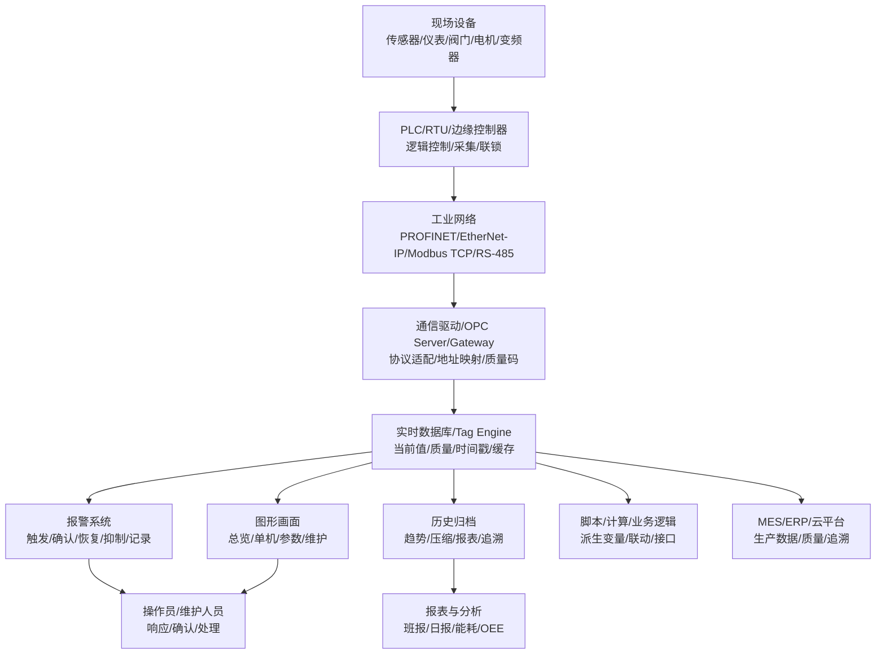
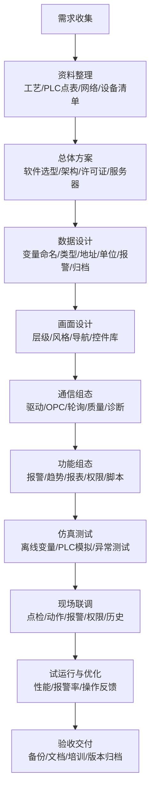
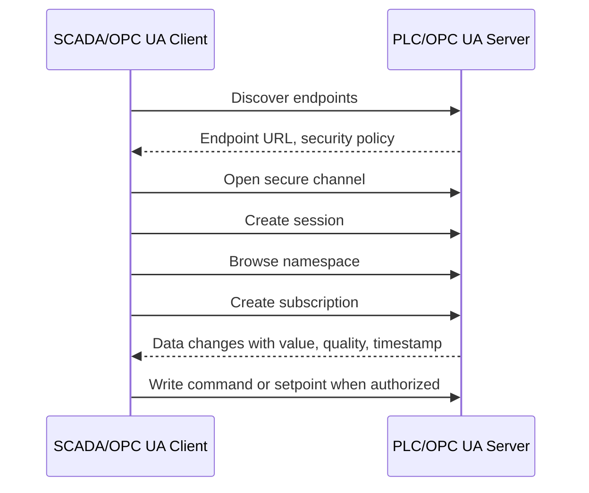
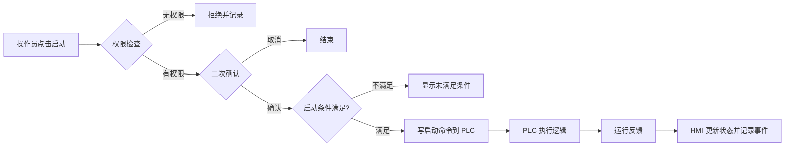
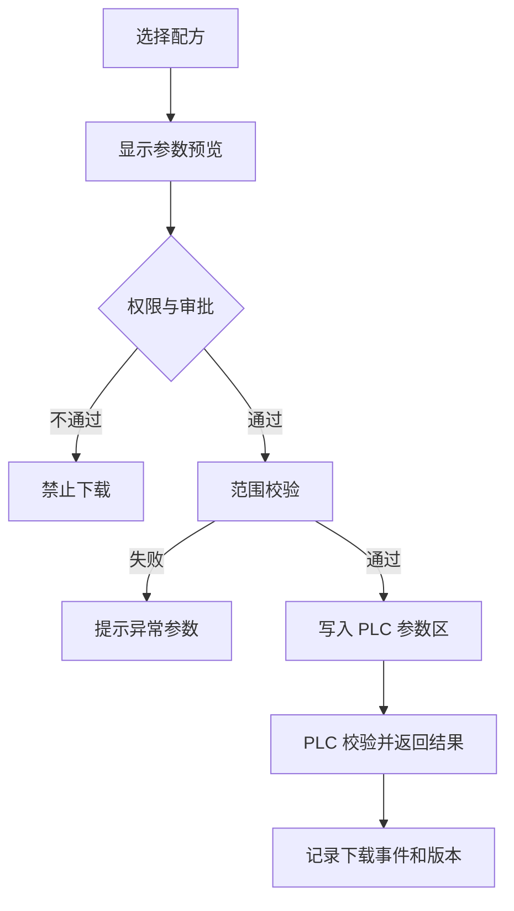

# 组态设计完整学习文档

<!-- lecture-notes:integrated-v2 -->

## 讲义导读：把概念落到可验证实践

这一章讲的是 **组态设计完整学习文档**，属于 **工业、电气与机械协作**。阅读时不要把它当成零散资料堆叠，而要把它当成一份讲义：先弄清它解决什么问题，再看核心概念和流程，最后做一个能复现、能观察、能排错的小练习。

### 一句话先懂

工业和电气机械类知识的重点，是把控制逻辑、现场设备、图纸、信号、材料和安全要求对应到真实工程现场。

初学时先问三个问题：它的输入或前提是什么；它内部按什么规则工作；结果该用什么命令、日志、测试、图纸、波形或指标来证明。

### 通俗类比

工业项目像一条生产线：PLC 是控制大脑，电气柜是神经和供电，传感器是眼睛，执行器是手脚，组态界面是操作台，机械结构是骨架。

类比只是入门扶手。真正掌握时，要回到准确术语、配置、接口、版本、边界条件、错误信息和验证证据上。能解释失败原因，比只会照着步骤跑通更重要。

### 本章学习主线

1. **先看场景**：这个知识点通常在什么项目、岗位或问题里出现？
2. **再看结构**：它有哪些核心对象、配置、文件、命令、接口或流程？
3. **然后看路径**：一次完整使用从哪里开始，到哪里结束，中间有哪些状态变化？
4. **接着看边界**：版本差异、平台差异、权限、性能、安全、兼容性和资源限制在哪里？
5. **最后看验证**：用最小样例、测试、日志、调试工具或实物结果证明理解是对的。

### 本章重点抓手

PLC、I/O、传感器、执行器、电气图纸、接线、组态、HMI、报警、联锁、机械术语、材料、装配和安全。

### 最小实践任务

画一个小型控制系统：输入、输出、PLC 点表、电气接线、HMI 画面、报警和调试步骤。

建议把练习记录成固定格式：目标、环境版本、最小示例、执行步骤、预期结果、实际结果、错误信息、定位过程和复盘。以后遇到真实项目问题时，这些记录会比单纯收藏教程更有用。

### 常见误区

- 只会软件逻辑，不懂现场接线和安全。
- 图纸、点表、程序和 HMI 名称对不上。
- 调试没有联锁、急停和异常工况验证。

### 推荐工具与资料

官方文档、最小 demo、日志、调试器、版本管理、测试命令、性能/诊断工具和复盘记录。

### 读完本章应该能做到

- 用自己的话解释核心概念和适用场景。
- 给出一个最小可运行或可验证样例。
- 说清至少一个常见错误的现象、原因和排查路径。
- 知道当前版本应该查哪份官方文档，而不是只依赖旧教程。

> 本节是讲义化改写后的阅读入口。后续正文中的命令、配置、图纸、代码和参考资料，都应围绕“场景 -> 概念 -> 操作 -> 验证 -> 复盘”来理解。


> Last researched: 2026-06-15  
> Audience level: 初学者到工程实践入门/进阶  
> Scope: 本文以工业自动化中的 HMI/SCADA 组态设计为主线，覆盖组态软件概念、SCADA/HMI 架构、变量点表、通信驱动、画面设计、报警管理、历史数据、报表、脚本、权限、安全、冗余、部署调试、验收交付、主流软件选型和学习路线。本文不替代厂商正式培训、项目安全评估、行业强制标准、网络安全审计和现场操作规程。
## 1. 总览

组态设计是工业自动化上位机、触摸屏、监控系统和数据采集系统中最常见的工程工作之一。它的核心不是“画几个漂亮界面”，而是把设备、工艺、人员和数据组织成一个可运行、可维护、可追溯、可扩展、可交付的监控应用。

在工程现场，“组态”通常指通过组态软件提供的可视化配置、变量绑定、通信驱动、报警、趋势、报表、脚本和权限功能，快速构建 HMI 或 SCADA 系统，而不是从零编写完整软件。典型软件包括 Siemens WinCC、AVEVA InTouch/System Platform、Rockwell FactoryTalk View、GE iFIX、Ignition、组态王、力控、MCGS、威纶通 EasyBuilder、FUXA、Rapid SCADA、ThingsBoard 等。

学习组态设计要抓住六条主线：

| 主线 | 关键问题 | 工程产物 |
| --- | --- | --- |
| 工艺主线 | 设备怎么运行，异常怎么处理，操作员需要看到什么 | 工艺流程图、操作说明、联锁逻辑、报警清单 |
| 数据主线 | 哪些变量要采集、显示、报警、归档、计算、上送 | I/O 点表、变量表、数据字典、数据库表 |
| 通信主线 | PLC、仪表、驱动器、网关、数据库和云平台如何连通 | 通信拓扑、驱动配置、地址映射、网络规划 |
| 画面主线 | 操作员如何快速判断状态、定位异常、执行操作 | 画面层级、导航结构、HMI 风格指南、控件库 |
| 运维主线 | 系统如何诊断、备份、恢复、升级、审计 | 日志、权限、备份包、版本记录、维护手册 |
| 安全主线 | 哪些操作危险，哪些网络边界需要隔离，谁有权限 | 用户权限、操作确认、审计记录、网络分区 |

## 2. 学习目标

学完本文后，应能达到以下目标：

- 能说清 HMI、SCADA、DCS、PLC、RTU、Historian、MES、IIoT 平台之间的关系。
- 能独立整理一个中小型项目的变量点表、画面清单、报警清单、趋势清单、报表清单和权限矩阵。
- 能理解组态软件的典型模块：通信驱动、实时数据库、图形画面、报警、历史归档、报表、脚本、用户管理、冗余、Web 发布。
- 能设计基本画面层级：总览画面、区域画面、单机画面、参数画面、报警画面、趋势画面、报表画面、维护画面。
- 能按 ISA-101 的思想理解高性能 HMI：界面不是越炫越好，而是要提升态势感知和异常响应效率。
- 能按 ISA-18.2/IEC 62682 的思想理解报警管理：报警必须可行动、可优先级排序、可管理生命周期。
- 能识别常见问题：变量命名混乱、PLC 地址错位、字节序错误、轮询周期过短、报警泛滥、历史库膨胀、脚本滥用、权限缺失、无备份、无版本记录。
- 能根据项目规模、PLC 品牌、行业要求、预算、平台、长期维护能力选择合适的组态软件。

## 3. 前置知识

| 知识 | 要求 |
| --- | --- |
| PLC 基础 | 理解 DI/DO/AI/AO、扫描周期、数据块、寄存器、位、字、双字、浮点数 |
| 电气与仪表 | 理解传感器、执行器、变频器、伺服、阀门、仪表量程、4-20mA、0-10V |
| 工业通信 | 理解以太网、串口、RS-485、IP、端口、Modbus、OPC UA、PROFINET、EtherNet/IP |
| 工艺流程 | 能读懂设备流程、启停顺序、联锁条件、异常处理和操作规程 |
| 数据库基础 | 理解表、字段、时间戳、索引、查询、备份、归档、数据保留周期 |
| Windows/Linux 基础 | 理解服务、进程、权限、防火墙、远程桌面、日志、系统时间 |
| 网络安全意识 | 理解账号权限、最小权限、网络隔离、补丁、备份、审计、远程访问风险 |

## 4. 核心术语

| 术语 | 含义 | 学习重点 |
| --- | --- | --- |
| HMI | Human-Machine Interface，人机界面，通常指触摸屏或操作站界面 | 操作、显示、参数、报警、单机控制 |
| SCADA | Supervisory Control and Data Acquisition，监控与数据采集系统 | 多设备、多站点、集中监控、数据归档、报表 |
| 组态软件 | 用配置方式构建 HMI/SCADA 应用的软件平台 | 变量、画面、报警、趋势、报表、脚本、权限 |
| Tag/变量 | 组态系统中的数据点，可来自 PLC、内部计算、数据库或脚本 | 命名、类型、地址、量程、单位、质量、报警、归档 |
| 实时数据库 | 组态运行时保存当前变量值、状态和质量的内存/服务层 | 刷新、缓存、订阅、质量码、死区 |
| Historian | 历史数据库/过程数据归档系统 | 压缩、死区、采样、查询、保留周期 |
| Alarm/报警 | 需要操作员注意并采取行动的异常状态 | 优先级、确认、恢复、抑制、搁置、泛滥控制 |
| Event/事件 | 系统或用户动作记录，不一定要求立即响应 | 登录、参数修改、启停操作、模式切换 |
| Driver/驱动 | 连接 PLC、仪表、协议或数据库的通信模块 | 协议、地址、周期、重连、诊断 |
| OPC UA | 工业互操作通信标准，常用于跨厂商数据交换 | 信息模型、安全、证书、客户端/服务器、PubSub |
| Modbus | 简单开放的工业通信协议，有 RTU/TCP 等形式 | 功能码、寄存器、字节序、轮询、无内建安全 |
| 冗余 | 服务器、网络、PLC 或数据库的主备/热备机制 | 切换时间、数据一致性、许可证、测试 |
| Web HMI | 基于浏览器访问的 HMI/SCADA 界面 | 部署便利、权限、安全、实时性、移动端适配 |

## 5. 组态系统典型架构



Figure: 典型 HMI/SCADA 组态系统结构，综合整理自 ISA-101、OPC Foundation、Modbus Organization、Ignition、WinCC、FactoryTalk View、InTouch 等资料。

### 5.1 小型 HMI 架构

适用于单台设备或小型生产单元：

- 一块触摸屏直接连接 PLC。
- 变量数量通常几十到几千点。
- 数据多保存在 HMI 本地，历史能力有限。
- 重点是操作方便、启动快速、维护简单。
- 常见工具：西门子 Comfort/Unified Panel、威纶通 EasyBuilder、MCGS、台达 DOPSoft、三菱 GOT、欧姆龙 NB/NA 等。

优点是成本低、部署简单；缺点是跨设备数据整合、长期历史、集中权限和远程运维能力较弱。

### 5.2 单机 SCADA 架构

适用于一条生产线、一个水处理站、一个配电房或一个实验平台：

- 一台工控机运行 SCADA Runtime。
- PLC/仪表通过以太网或串口接入。
- 工控机本地保存历史、报警和报表。
- 可配一个工程师站用于开发和维护。

优点是开发效率高、功能完整；风险是工控机单点故障，因此需要做好备份、UPS、磁盘健康监控和恢复方案。

### 5.3 客户端/服务器 SCADA 架构

适用于多操作站、多区域、多设备项目：

- SCADA Server 负责通信、实时数据、报警、历史。
- 多个 Operator Client 负责显示和操作。
- 工程师站负责开发、发布和版本管理。
- 数据库服务器或 Historian 负责长期数据。
- 可增加 Web Client、移动端、报表服务器。

优点是集中管理、扩展性更好；难点是许可证、网络、冗余、用户权限、时钟同步和版本发布流程。

### 5.4 分布式与多站点 SCADA

适用于水务、能源、管网、矿山、园区、远程站点：

- 每个站点有 PLC/RTU/边缘网关。
- 站点通过专线、VPN、4G/5G、无线电或工业路由器接入中心。
- 中心 SCADA 做统一监控、报警、历史和报表。
- 关键站点可本地自治，中心断线时不影响基本控制。

设计重点：

- 断网缓存和补传。
- 通信质量监控。
- 数据时间戳来源。
- 远程控制权限。
- 网络安全边界。
- 中心与现场的控制权划分。

### 5.5 Web/云组态架构

适用于设备联网、远程运维、轻量看板、能源管理、园区可视化：

- 前端浏览器展示画面。
- 后端服务采集设备数据并存储。
- 通过 MQTT、OPC UA、Modbus TCP、HTTP API、边缘网关接入。
- 可部署在本地服务器、私有云或公有云。

优点是访问方便、发布快、适合多终端；风险是实时控制能力、浏览器兼容、安全认证、外网暴露和现场网络可靠性。对于涉及人身和设备安全的控制，不应依赖公网 Web 操作链路。

## 6. 标准、规范与设计思想

### 6.1 ISA-101：HMI 生命周期与高性能 HMI

ISA-101 面向制造应用中的人机界面标准和推荐实践。它强调 HMI 不是一次性画面制作，而是一个从需求、设计、实现、运行到维护的生命周期问题。

学习 ISA-101 时要抓住这些思想：

- HMI 的目标是帮助操作员理解过程状态并及时做正确动作。
- 界面一致性比单个画面“好看”更重要。
- 正常状态应低干扰，异常状态应醒目。
- 颜色、闪烁、动画应服务于状态区分，不能装饰性滥用。
- 画面层级应支持从全局态势到局部细节的快速下钻。
- HMI 标准应形成项目级风格指南，而不是靠工程师个人习惯。

### 6.2 ISA-18.2 / IEC 62682：报警管理

ISA-18.2 和 IEC 62682 都强调报警系统的生命周期管理。报警不是“变量超过阈值就弹窗”，而是对操作员有明确行动价值的异常提示。

一个合格报警应满足：

- 表示异常或即将异常的过程状态。
- 需要操作员采取行动。
- 有明确响应时间。
- 有明确后果说明。
- 有合理优先级。
- 不应在正常操作中反复无意义出现。

报警生命周期通常包括：


Figure: 报警管理生命周期，按 ISA-18.2/IEC 62682 思路重画。

### 6.3 ISA/IEC 62443 与 NIST SP 800-82：工业网络安全

组态系统越来越多使用以太网、Web、数据库、远程访问和云平台，因此必须纳入 OT 网络安全设计。ISA/IEC 62443 强调工业自动化控制系统的安全要求、流程和安全等级；NIST SP 800-82 提供 OT 安全指南，强调 OT 系统在性能、可靠性和安全方面与传统 IT 不同。

组态项目中最基本的安全原则：

- 工控网与办公网分区，不能随意互通。
- 工程师站、操作站、服务器使用独立账号和最小权限。
- 禁止默认密码、共享管理员账号和长期无人管理的远程桌面。
- 远程访问要经过 VPN、跳板机、MFA、审批和审计。
- 关键操作必须有权限控制、二次确认和操作记录。
- 定期备份工程、运行库、数据库、许可证和系统镜像。
- 补丁升级前要在测试环境验证，避免破坏运行系统。

### 6.4 OPC UA 与 Modbus 的位置

OPC UA 是跨厂商工业数据互操作的重要标准，支持信息模型、安全机制、客户端/服务器和发布订阅等能力。它适合做 PLC、SCADA、MES、网关、边缘平台之间的标准化数据交换。

Modbus 是简单、开放、部署广泛的工业协议，常见于仪表、变频器、网关和小型 PLC。它的优点是简单通用，缺点是语义弱、数据类型有限、依赖轮询、协议本身不提供认证和加密。

工程建议：

- 新系统跨厂商集成优先评估 OPC UA。
- 简单仪表和老设备接入常用 Modbus RTU/TCP。
- 使用 Modbus 时必须确认寄存器偏移、功能码、数据类型、字节序、字/双字顺序、比例系数和单位。
- 不要把 Modbus TCP 直接暴露到不可信网络。

## 7. 项目全流程



Figure: 组态设计完整工程流程。

### 7.1 需求收集

必须收集：

- 工艺流程说明。
- P&ID 或设备流程图。
- PLC 程序变量表或数据块说明。
- 电气原理图和 I/O 点表。
- 设备清单、仪表清单、变频器/伺服参数。
- 操作规程、报警处理规程、维护规程。
- 网络拓扑、IP 地址规划、交换机/VLAN/防火墙信息。
- 客户对画面、报表、权限、远程访问、数据接口的要求。
- 运行环境：工控机、服务器、触摸屏、操作系统、数据库、许可证。

常见问题是需求只写“做一套上位机监控系统”，没有明确点数、画面、报警、历史、报表、用户、接口和验收标准。遇到这种需求，必须先补齐边界，否则后期变更会失控。

### 7.2 总体方案

总体方案要回答：

- 用触摸屏、单机 SCADA、客户端/服务器，还是 Web/云组态？
- 运行在 Windows、Linux、嵌入式屏，还是浏览器？
- 通信是直连 PLC、通过 OPC Server，还是通过边缘网关？
- 历史数据保存在本地文件、SQL 数据库、Historian，还是时序数据库？
- 是否需要冗余服务器、冗余网络、冗余数据库？
- 是否需要 Web 发布、移动端访问、MES/ERP/云平台接口？
- 点数、客户端数、历史变量数、报警变量数是否满足许可证限制？

### 7.3 详细设计

详细设计不应该直接从画面开始，而应先固化数据模型：

- 变量命名规则。
- 变量类型和地址。
- 单位、量程、缩放。
- 报警阈值、优先级、延时、死区、文本、处理建议。
- 历史采样周期、死区、保留周期。
- 权限矩阵。
- 画面清单和导航关系。
- 报表模板。
- 脚本触发条件。
- 第三方接口字段。

### 7.4 实施与测试

实施阶段建议按“先数据、后画面、再业务”的顺序推进：

1. 配置通信和变量。
2. 做变量质量诊断画面。
3. 做基础控件模板。
4. 做总览和单机画面。
5. 配置报警、趋势、历史。
6. 配置权限和审计。
7. 配置脚本和报表。
8. 做离线仿真。
9. 现场逐点核对。
10. 做异常和恢复测试。

### 7.5 验收交付

交付不只是运行画面，还应包含：

- 工程源文件。
- Runtime 发布包。
- 数据库初始化脚本或备份。
- 变量点表。
- 报警清单。
- 画面清单。
- 用户权限表。
- 网络/IP 表。
- 服务器和客户端配置说明。
- 安装恢复说明。
- 操作手册。
- 维护手册。
- 版本记录。
- 许可证信息。
- 最终备份和校验说明。

## 8. 变量与点表设计

变量是组态系统的骨架。变量设计差，后续画面、报警、趋势、报表和维护都会困难。

### 8.1 变量分类

| 类型 | 来源 | 示例 | 注意点 |
| --- | --- | --- | --- |
| I/O 变量 | PLC、仪表、驱动器 | `MTR101_RunFb`、`TT201_PV` | 地址、类型、缩放、质量 |
| 内部变量 | HMI/SCADA 本地 | 当前登录用户、画面状态 | 重启是否保持 |
| 计算变量 | 表达式或脚本 | 流量累计、效率、温差 | 触发周期、异常值处理 |
| 命令变量 | HMI 写入 PLC | 启动、停止、复位、设定值 | 权限、确认、握手 |
| 系统变量 | 运行平台提供 | 当前时间、报警数量、通信状态 | 软件差异大 |
| 数据库变量 | SQL/接口读取 | 工单号、配方号、产品型号 | 延迟、缓存、失败策略 |

### 8.2 命名规则

推荐命名结构：

```text
区域_设备_信号_属性
```

示例：

| 变量名 | 含义 |
| --- | --- |
| `Line1_MTR101_RunCmd` | 1 号线 MTR101 启动命令 |
| `Line1_MTR101_RunFb` | 1 号线 MTR101 运行反馈 |
| `Line1_MTR101_Fault` | 1 号线 MTR101 故障状态 |
| `Line1_MTR101_AutoMode` | 1 号线 MTR101 自动模式 |
| `Line1_TT201_PV` | 1 号线 TT201 温度当前值 |
| `Line1_TT201_HH_SP` | 1 号线 TT201 高高报警设定值 |
| `Line1_TT201_Unit` | 1 号线 TT201 单位 |

命名原则：

- 同一项目只用一种语言风格，不要中英文混杂。
- 不要使用 `Tag1`、`temp`、`aaa` 这类无语义名称。
- 命名中区分命令、反馈、设定、当前值、报警、模式。
- 与 PLC 变量名尽量保持可追溯关系。
- 使用设备位号时要与图纸一致。
- 不要把单位、量程、报警阈值隐藏在画面脚本里。

### 8.3 点表字段

一个可交付的点表至少包含：

| 字段 | 示例 | 说明 |
| --- | --- | --- |
| 序号 | 001 | 便于核对 |
| 区域 | Line1 | 工段或系统 |
| 设备位号 | MTR101 | 与图纸一致 |
| 变量名 | Line1_MTR101_RunFb | 组态变量名 |
| 中文描述 | 电机运行反馈 | 画面和报警可用 |
| 数据类型 | Bool/Int/Real/String | 与 PLC 地址匹配 |
| 读写属性 | R/W/RW | 控制写入必须明确 |
| PLC 地址 | DB10.DBX0.0 / 40001 | 各平台格式不同 |
| 单位 | ℃ / kPa / A | 模拟量必须有 |
| 原始量程 | 0-27648 | PLC 或模块原始值 |
| 工程量程 | 0-100 ℃ | 显示值范围 |
| 扫描周期 | 500 ms / 1 s | 影响通信负载 |
| 报警 | HI/LO/HH/LL | 是否报警 |
| 历史 | Yes/No | 是否归档 |
| 备注 | 来自 AI 模块 1 通道 3 | 维护信息 |

### 8.4 数据类型与缩放

常见数据类型：

| 类型 | 用途 | 常见坑 |
| --- | --- | --- |
| Bool | 开关量、状态、命令 | 常开/常闭逻辑搞反 |
| Int/UInt | 计数、状态码、寄存器 | 有符号/无符号混淆 |
| DInt/UDInt | 大计数、累计量 | 高低字顺序错误 |
| Real/Float | 温度、压力、流量 | 字节序、NaN、精度 |
| String | 批号、配方名、报警文本 | 长度、编码、结束符 |
| DateTime | 时间戳 | 时区、时钟同步 |

模拟量缩放示例：

```text
工程值 = (原始值 - 原始下限) / (原始上限 - 原始下限) * (工程上限 - 工程下限) + 工程下限
```

例如西门子常见模拟量原始值 0-27648，对应 0-100 ℃：

```text
PV = Raw / 27648.0 * 100.0
```

工程建议：

- 优先在 PLC 内完成关键缩放和限幅，让 HMI 只显示工程量。
- 如果在 HMI 缩放，必须在点表记录原始量程、工程量程和单位。
- 对写入设定值做上下限限制。
- 对异常值、断线值、质量差值要有明确显示方式。

### 8.5 变量质量

变量不只是“值”，还应关注质量：

- 通信正常还是中断。
- 数据是否超时。
- OPC 质量码是否 Good。
- 是否使用了最后一次缓存值。
- 是否来自仿真或手动强制。

画面设计中应让操作员能区分“设备真的停止”和“通信断了导致状态不刷新”。通信状态应作为一级诊断信息显示。

## 9. 通信组态

### 9.1 常见通信方式

| 方式 | 适用场景 | 优点 | 风险 |
| --- | --- | --- | --- |
| PLC 原生驱动 | WinCC 连 S7、FactoryTalk 连 Logix | 集成度高、配置直接 | 厂商绑定强 |
| OPC DA | 老 Windows 系统 | 旧系统常见 | DCOM 配置复杂、安全弱 |
| OPC UA | 新系统跨厂商集成 | 标准化、安全机制更完整 | 证书和命名空间需要理解 |
| Modbus TCP | 仪表、网关、小型 PLC | 简单通用 | 无语义、无内建安全 |
| Modbus RTU | 串口仪表、变频器 | 成本低、距离较远 | 轮询慢、布线和干扰问题 |
| MQTT | IIoT、云平台、边缘发布 | 解耦、适合远程与消息队列 | 控制实时性和可靠性需设计 |
| SQL/API | MES/ERP/报表系统 | 与业务系统集成方便 | 事务、权限、网络中断处理 |

### 9.2 Modbus 组态要点

Modbus 主要数据区：

| 数据区 | 访问 | 数据粒度 | 常见用途 |
| --- | --- | --- | --- |
| Coil | 读/写 | 1 bit | 输出线圈、命令 |
| Discrete Input | 只读 | 1 bit | 输入状态 |
| Input Register | 只读 | 16 bit | 测量值 |
| Holding Register | 读/写 | 16 bit | 参数、设定值 |

常见坑：

- 40001 与偏移 0/1 的差异。
- 16 位寄存器组合 32 位数据时，高低字顺序不同。
- 浮点数存在 ABCD、BADC、CDAB、DCBA 等字节序差异。
- 轮询周期太短导致设备响应超时。
- 一个站号多个设备冲突。
- RS-485 终端电阻、屏蔽接地、A/B 线定义混乱。
- 写多个寄存器时功能码和设备支持范围不匹配。

排查顺序：

1. 用厂家工具或 Modbus Poll/ModScan 先验证设备响应。
2. 确认 IP、端口、站号、波特率、校验位、停止位。
3. 确认功能码和地址偏移。
4. 确认数据类型和字节序。
5. 增大超时和轮询周期测试。
6. 抓包或串口监听确认请求与响应。

### 9.3 OPC UA 组态要点

OPC UA 典型流程：



Figure: OPC UA 客户端/服务器基本交互，按 OPC Foundation 公开资料重画。

重点：

- 确认证书信任关系。
- 确认 Endpoint URL 和安全策略。
- 浏览命名空间，记录 NodeId。
- 关注值、质量和时间戳。
- 订阅方式通常比高频轮询更合适。
- 写入操作要做权限、范围和审计。
- 证书过期会导致系统突然无法通信，必须纳入维护计划。

### 9.4 通信性能设计

通信不是越快越好。过快的刷新会让 PLC、网关、网络和 SCADA Server 负载上升，反而导致超时和画面卡顿。

推荐分层：

| 数据类型 | 刷新建议 | 说明 |
| --- | --- | --- |
| 关键操作反馈 | 100-500 ms | 启停、急停、门禁等 |
| 常规状态 | 500 ms-1 s | 运行、故障、模式 |
| 模拟量显示 | 1 s | 温度、压力、流量 |
| 慢变量 | 5-30 s | 液位慢变化、环境量 |
| 能耗/累计量 | 10 s-1 min | 报表和趋势为主 |
| 配方/参数 | 按需读取 | 不必持续高频刷新 |

优化原则：

- 同类地址连续读取，减少零散请求。
- 高频变量和低频变量分组。
- 画面未打开时减少非必要刷新。
- 历史归档使用死区和合理采样。
- 大系统使用通信诊断画面监控延迟、超时、质量差点数。

## 10. 画面设计

### 10.1 画面层级

推荐四层结构：

| 层级 | 目的 | 典型画面 |
| --- | --- | --- |
| Level 1 总览 | 看整体是否正常 | 全厂/全线/全站 KPI、关键报警、关键状态 |
| Level 2 区域 | 定位异常区域 | 工段流程、设备组、主要参数 |
| Level 3 单元 | 操作和诊断 | 单机控制、阀组、泵站、温控回路 |
| Level 4 细节 | 参数维护 | PID 参数、I/O 诊断、设备详情、维护信息 |

导航原则：

- 操作员从报警到相关设备画面不超过 2 次点击。
- 每个画面有明确标题、区域、时间、登录用户、通信状态。
- 返回路径稳定，不要让用户迷路。
- 总览画面只显示最重要信息，不塞满所有细节。
- 维护画面与操作画面区分，避免误操作。

### 10.2 高性能 HMI 视觉原则

传统 HMI 常见问题是颜色过多、动画过多、3D 管道过多、背景太花，正常状态和异常状态难以区分。高性能 HMI 更强调信息层级和异常突出。

建议：

- 正常设备使用灰色、低饱和度颜色。
- 颜色优先留给异常、报警、危险、选中状态。
- 红色只用于真正紧急或高优先级报警。
- 闪烁只用于需要立即注意的少量状态。
- 动画用于表达状态，不用于装饰。
- 数值旁必须有单位，必要时显示正常范围。
- 重要趋势比单个瞬时值更能帮助判断。
- 设备状态要能区分运行、停止、故障、检修、手动、自动、通信故障。

### 10.3 工业画面常用对象

| 对象 | 用途 | 设计要点 |
| --- | --- | --- |
| 泵/电机 | 运行、停止、故障、就地/远程 | 状态颜色一致，点击进入详情 |
| 阀门 | 开到位、关到位、开度、故障 | 区分命令与反馈 |
| 仪表 | 温度、压力、流量、液位 | 单位、量程、报警限 |
| 管线 | 介质流向、通断、流动 | 不要用过度动画 |
| 趋势 | 过程变化 | 时间范围、缩放、游标、导出 |
| 报警条 | 当前关键报警 | 优先级、时间、确认状态 |
| 参数框 | 设定值、配方、阈值 | 权限、范围、确认 |
| 诊断块 | 通信、PLC、I/O、服务状态 | 便于维护定位 |

### 10.4 控制操作设计

对设备控制，必须区分命令、反馈和条件：



Figure: HMI 控制命令的推荐处理路径。

工程要点：

- HMI 不应绕过 PLC 联锁直接控制危险设备。
- 启停命令建议采用脉冲命令或握手机制，避免长时间保持命令位。
- 参数写入要做范围校验。
- 关键操作要记录用户、时间、设备、旧值、新值。
- 远程/就地、手动/自动、检修/运行模式要明确显示。

## 11. 报警设计

### 11.1 报警与事件的区别

| 类型 | 是否要求操作员行动 | 示例 |
| --- | --- | --- |
| 报警 | 是 | 电机过载、液位高高、通信中断、急停触发 |
| 事件 | 不一定 | 用户登录、参数修改、设备启动、配方下载 |
| 提示 | 通常否 | 操作成功、保存完成、当前处于手动模式 |

不要把所有事件都做成报警。报警泛滥会让真正重要的报警被淹没。

### 11.2 报警字段

报警清单建议字段：

| 字段 | 说明 |
| --- | --- |
| 报警编号 | 唯一编号 |
| 变量名 | 触发变量 |
| 报警文本 | 操作员看到的文本 |
| 优先级 | 紧急/高/中/低 |
| 类型 | 数字量、模拟量高低限、通信、系统 |
| 触发条件 | 如 `PV > 80 ℃` |
| 延时 | 防抖 |
| 死区 | 防止临界值反复报警 |
| 是否需要确认 | Ack |
| 响应时间 | 操作员应在多久内处理 |
| 后果 | 不处理会发生什么 |
| 建议动作 | 操作步骤 |
| 抑制条件 | 检修、停机、设备未投用等 |
| 责任人 | 工艺、电气、仪表、设备 |

### 11.3 报警优先级

优先级应由后果严重性和响应时间共同决定：

| 优先级 | 特征 | 示例 |
| --- | --- | --- |
| 紧急 | 需要立即响应，可能影响人身/设备/环保 | 高高液位导致溢流风险 |
| 高 | 短时间内需处理，可能导致停机或质量事故 | 关键泵故障 |
| 中 | 需要处理但不立即造成严重后果 | 温度偏高 |
| 低 | 提醒维护或趋势异常 | 滤网压差偏高 |

常见错误：

- 所有报警都设为高优先级。
- 没有报警延时和死区。
- 报警文本只有“故障”两个字。
- 报警没有关联画面。
- 设备停机/检修时仍产生大量无意义报警。
- 报警确认后就不再追踪是否恢复。

### 11.4 报警泛滥控制

报警泛滥表现：

- 几分钟内出现几十上百条报警。
- 同一设备重复报警。
- 通信中断导致全站报警刷屏。
- 启停过程产生大量预期报警。

控制方法：

- 对模拟量使用延时、死区、滤波。
- 对停机、检修、未投用设备做条件抑制。
- 对通信中断使用汇总报警，避免每个点都弹出。
- 对派生报警做根因优先，减少伴随报警。
- 定期统计报警率、Top 10 报警、长期未确认报警。
- 报警修改需要变更记录。

## 12. 历史数据、趋势与报表

### 12.1 历史归档的目的

历史数据用于：

- 过程追溯。
- 故障分析。
- 质量分析。
- 能耗统计。
- 设备维护。
- 产量报表。
- 合规审计。

不是所有变量都需要高频归档。历史库设计要平衡数据价值、存储空间和查询性能。

### 12.2 采样策略

| 策略 | 说明 | 适用 |
| --- | --- | --- |
| 周期采样 | 固定周期保存 | 稳定过程、报表统计 |
| 变化采样 | 值变化超过死区保存 | 模拟量趋势 |
| 事件采样 | 状态变化时保存 | 开关量、启停、报警 |
| 压缩归档 | 保留趋势特征，减少点数 | 大规模 Historian |
| 批次归档 | 按批次/工单组织数据 | 制药、食品、离散制造 |

### 12.3 趋势设计

趋势画面应支持：

- 实时趋势和历史趋势。
- 多曲线对比。
- 时间范围切换。
- 游标读数。
- Y 轴缩放。
- 单位显示。
- 数据导出。
- 报警线或设定值线。
- 从报警跳转到报警前后趋势。

常见问题：

- 趋势只显示实时值，没有历史回看。
- 多条曲线单位不同却共用一个 Y 轴。
- 采样周期太长，故障瞬态被漏掉。
- 采样周期太短，数据库迅速膨胀。
- 服务器时钟不同步导致趋势错位。

### 12.4 报表设计

报表常见类型：

| 报表 | 内容 |
| --- | --- |
| 班报 | 班次产量、运行时间、停机时间、关键指标 |
| 日报 | 日产量、能耗、报警统计、质量指标 |
| 月报 | 汇总趋势、能耗分析、设备利用率 |
| 批次报表 | 批号、配方、参数、关键过程值、操作记录 |
| 设备报表 | 启停次数、运行小时、故障次数、维护提醒 |
| 报警报表 | 报警次数、持续时间、确认时间、Top 报警 |

报表要明确：

- 统计周期。
- 班次切换时间。
- 数据来源。
- 异常数据处理。
- 人工修改权限。
- 导出格式。
- 存档周期。

## 13. 脚本、表达式与业务逻辑

组态软件通常提供脚本或表达式能力，例如 VBScript、C Script、JavaScript、Python、表达式语言等。脚本可以提高灵活性，也可能成为维护灾难。

### 13.1 适合脚本处理的内容

- 简单计算和格式化。
- 画面导航逻辑。
- 参数范围校验。
- 报表生成触发。
- 数据库读写。
- 与外部系统接口。
- 批量变量操作。

### 13.2 不适合放在 HMI 脚本里的内容

- 关键安全联锁。
- 高实时控制逻辑。
- 复杂运动控制。
- 必须确定性执行的顺序控制。
- 失效会导致危险动作的逻辑。

这些逻辑应放在 PLC、安全 PLC、DCS 或专用控制器中。

### 13.3 脚本工程规范

- 脚本命名清晰，按功能分组。
- 避免在多个画面复制粘贴相同脚本。
- 对数据库、文件、网络操作做异常处理。
- 对写入 PLC 的脚本做权限和范围校验。
- 记录关键脚本执行失败日志。
- 脚本修改纳入版本管理。
- 避免高频定时脚本做大量计算或数据库查询。

## 14. 用户权限与审计

### 14.1 角色设计

| 角色 | 权限 |
| --- | --- |
| 访客/只读 | 查看画面和趋势，不允许操作 |
| 操作员 | 启停设备、确认报警、切换常规模式 |
| 班长 | 修改部分工艺设定、处理高级报警 |
| 工艺工程师 | 修改配方、工艺参数、报警阈值 |
| 维护工程师 | 设备维护、通信诊断、I/O 测试 |
| 管理员 | 用户管理、系统配置、发布工程 |

原则：

- 角色授权，不按个人随意授权。
- 关键操作二次确认。
- 参数修改记录旧值和新值。
- 用户离开自动登出。
- 禁止多人共用同一账号。
- 密码策略符合项目安全要求。

### 14.2 审计记录

应记录：

- 登录/登出。
- 设备启停。
- 模式切换。
- 参数修改。
- 配方下载。
- 报警确认。
- 报警抑制/解除。
- 用户权限变更。
- 工程发布。
- 系统服务启动/停止。

审计记录应包含用户、时间、操作对象、操作内容、结果、客户端/终端信息。

## 15. 配方与参数管理

配方用于不同产品、批次或工艺条件下批量下发参数。

### 15.1 配方设计字段

| 字段 | 说明 |
| --- | --- |
| 配方编号 | 唯一 ID |
| 配方名称 | 产品或工艺名称 |
| 版本 | 防止覆盖 |
| 参数列表 | 设定值集合 |
| 单位/上下限 | 校验依据 |
| 创建人/修改人 | 审计 |
| 生效时间 | 追溯 |
| 审批状态 | 可选 |

### 15.2 配方下载流程



常见坑：

- 只写参数，不记录配方版本。
- 下载中断没有回滚或校验。
- 参数单位不一致。
- 配方修改无权限控制。
- PLC 运行中不允许修改的参数被强行写入。

## 16. 冗余、备份与恢复

### 16.1 冗余类型

| 类型 | 说明 |
| --- | --- |
| SCADA Server 冗余 | 主备服务器切换，保证客户端继续监控 |
| 通信路径冗余 | 双网卡、双交换机、双链路 |
| 数据库冗余 | 数据库主备、镜像、集群或定期备份 |
| Historian 缓存补传 | 网络断开后本地缓存，恢复后补传 |
| 电源冗余 | UPS、双电源、冗余电源模块 |

冗余必须测试，不能只看宣传资料。测试场景包括：

- 主服务器断电。
- 网络断开。
- 数据库服务停止。
- PLC 通信中断。
- 主备切换后报警和历史是否连续。
- 客户端是否自动重连。

### 16.2 备份内容

至少备份：

- 组态工程源文件。
- 运行发布包。
- 变量点表和报警清单。
- 数据库结构和关键数据。
- 历史数据备份策略。
- 许可证文件或授权信息。
- 驱动安装包和版本。
- 操作系统镜像。
- 网络配置和 IP 表。
- 用户权限配置。

建议按版本命名：

```text
ProjectName_SCADA_V1.2.0_2026-06-15.zip
```

不要只在运行工控机桌面放一个“最终版”“最终最终版”文件夹。

## 17. 性能与可靠性

### 17.1 性能指标

| 指标 | 说明 |
| --- | --- |
| 变量点数 | 总点数、外部点、内部点、历史点 |
| 刷新周期 | 画面刷新和通信刷新 |
| 报警处理能力 | 同时报警数量、报警查询速度 |
| 历史写入能力 | 每秒写入点数 |
| 客户端数量 | 同时在线操作站/Web 客户端 |
| CPU/内存/磁盘 | 服务器资源 |
| 网络延迟 | PLC 到 SCADA、客户端到服务器 |
| 启动时间 | Runtime 从启动到可操作 |
| 恢复时间 | 故障后恢复监控的时间 |

### 17.2 优化策略

- 变量分组和分周期采集。
- 不显示的画面不持续刷新重控件。
- 历史数据使用死区和压缩。
- 报表查询走汇总表，避免直接扫全量历史。
- 图片资源压缩，避免超大背景图。
- 复杂对象做模板或全局对象，减少重复维护。
- 定期清理日志和历史归档。
- 使用 SSD、UPS 和工业级硬件。
- 服务器资源预留，不要满负载运行。

## 18. 调试与故障排查

### 18.1 现场调试顺序

1. 检查供电、网络、IP、网关、防火墙。
2. Ping PLC/服务器/客户端。
3. 用协议工具验证通信。
4. 在组态软件中检查驱动状态。
5. 检查变量质量和时间戳。
6. 逐点核对数字量。
7. 逐点核对模拟量量程和单位。
8. 测试命令写入和反馈。
9. 测试报警触发、确认、恢复。
10. 测试趋势和历史。
11. 测试报表。
12. 测试用户权限。
13. 测试断电、断网、重启恢复。

### 18.2 常见故障表

| 现象 | 可能原因 | 排查 |
| --- | --- | --- |
| 所有变量无数据 | IP 错误、驱动未启动、防火墙、PLC 停机 | Ping、端口、驱动日志、PLC 状态 |
| 部分变量错 | 地址偏移、数据类型、DB 未优化访问、寄存器映射错 | 对照点表和 PLC 在线监控 |
| 模拟量数值很怪 | 缩放错误、字节序错误、单位错误 | 原始值与工程值同时显示 |
| 浮点数跳变 | 高低字/字节序错误 | 用已知值测试 |
| 控制无反应 | 写权限、命令位保持、PLC 联锁不满足 | 看命令位和 PLC 条件 |
| 报警不出现 | 报警运行系统未启用、阈值错、变量质量差 | 看报警配置和触发值 |
| 趋势无历史 | 历史记录未启用、归档变量没选、数据库连接失败 | 看历史服务和日志 |
| 画面卡顿 | 刷新过快、对象过多、脚本阻塞、服务器负载高 | 性能监控、逐步禁用对象 |
| 客户端连不上 | 许可证、网络、服务、防火墙、版本不一致 | 服务状态、端口、日志 |
| 时间错乱 | 服务器/PLC/客户端时钟不同步 | 配 NTP，统一时区 |

## 19. 主流组态软件对比

### 19.1 传统商用 HMI/SCADA

| 软件 | 典型场景 | 优势 | 注意点 |
| --- | --- | --- | --- |
| Siemens WinCC / WinCC Unified | 西门子 PLC、TIA Portal 生态、制造业 | 与 S7、TIA、面板和 PC Runtime 集成好 | 版本、许可证、硬件性能、Unified 与传统 WinCC 差异 |
| AVEVA InTouch / System Platform | 流程工业、工厂 SCADA、历史数据 | 历史积累深、对象化建模、生态成熟 | 授权和架构复杂度较高 |
| Rockwell FactoryTalk View | Allen-Bradley Logix 生态 | 与 Rockwell 控制系统集成好 | 平台组件和版本匹配要严格 |
| GE iFIX | 老牌 HMI/SCADA、流程和基础设施 | 历史项目多、工业 SCADA 功能完整 | 维护人员和版本兼容性要评估 |
| Ignition | 跨平台、Web、数据库、现代 SCADA | Tag、报警、历史、Perspective Web 能力强 | 需要理解 Gateway、模块和数据库架构 |
| 组态王/力控/MCGS | 国内中小项目、教学、设备监控 | 本地资料多、上手快、成本可控 | 大规模架构、长期维护和生态需按项目评估 |
| 威纶通 EasyBuilder | 设备触摸屏 | 成本低、PLC 驱动多、适合单机 | 不适合替代大型 SCADA |

### 19.2 开源与 Web/IIoT 方案

| 软件/平台 | 场景 | 优势 | 注意点 |
| --- | --- | --- | --- |
| FUXA | Web HMI、轻量 SCADA、教学实验 | Web 化、支持 Modbus/OPC UA/MQTT/S7 | 工程级冗余、审计、长期支持需验证 |
| Rapid SCADA | 开源 SCADA、监控控制系统 | 开源、完整 SCADA 框架 | 驱动、模块和社区生态需评估 |
| ThingsBoard | IoT 数据、设备管理、Dashboard、SCADA 看板 | 设备管理、遥测、告警、仪表盘能力强 | 实时控制和工控安全边界要谨慎 |
| Node-RED + Dashboard | 协议桥接、原型、轻量看板 | 快速集成 Modbus/OPC UA/MQTT/API | 不应轻易承担关键控制和高可靠生产 SCADA |
| Grafana + 时序库 | 监控分析、趋势看板 | 查询和可视化强 | 不是完整 HMI/SCADA，控制、报警确认、权限审计需补齐 |

### 19.3 选型决策

| 场景 | 推荐方向 |
| --- | --- |
| 单台设备触摸屏 | HMI 面板组态软件 |
| 西门子 PLC 为主的产线 | WinCC/WinCC Unified 优先评估 |
| Rockwell PLC 为主 | FactoryTalk View 优先评估 |
| 多品牌 PLC、Web 客户端、数据库集成强 | Ignition 或现代 Web SCADA |
| 老项目维护 | 优先沿用原平台，除非有明确迁移收益 |
| 教学和小实验 | FUXA、Rapid SCADA、Node-RED、国产免费/学习版 |
| 大型流程工业 | DCS/SCADA/Historian 整体方案，按行业标准设计 |
| 云端设备运维 | ThingsBoard/IIoT 平台 + 边缘网关 |

不要只看软件购买价格。总成本还包括许可证、开发效率、培训、驱动、数据库、服务器、冗余、维护人员、长期升级、供应商支持和项目风险。

## 20. 模块深度学习

### 20.1 通信驱动模块

是什么：连接 PLC、仪表、网关和外部系统的数据通道。

为什么存在：不同设备协议不同，组态软件需要把它们统一抽象为变量。

输入：设备地址、协议参数、变量地址、轮询周期。

输出：变量值、质量、时间戳、诊断状态。

常见错误：

- 地址表没版本，PLC 改了 HMI 不知道。
- 所有变量一个采集周期。
- 通信故障没有画面诊断。
- 多个客户端同时高频读取 PLC。

最小示例：

```text
设备：PLC_01
协议：Modbus TCP
IP：192.168.10.11
端口：502
变量：Tank1_Level_Raw
地址：Holding Register 40001
类型：UInt16
周期：1000 ms
缩放：0-10000 -> 0.0-100.0 %
```

### 20.2 实时数据库/Tag Engine

是什么：运行时保存变量当前值、质量和状态的核心。

为什么存在：画面、报警、趋势、脚本都不应直接各自访问 PLC，而应通过统一数据层。

职责：

- 管理变量。
- 处理订阅和刷新。
- 提供质量码。
- 提供内部变量和计算变量。
- 为报警、历史、画面提供统一数据源。

常见错误：

- 将同一个 PLC 地址建多个变量，导致重复读取。
- 不区分外部点和内部点。
- 不维护变量描述和单位。
- 不监控 Bad Quality 变量。

### 20.3 图形画面模块

是什么：操作员与系统交互的入口。

职责：

- 显示过程状态。
- 提供安全操作入口。
- 支持导航和下钻。
- 提供报警、趋势、诊断入口。

边界：

- 不承载关键控制逻辑。
- 不替代 PLC 联锁。
- 不把所有数据都堆在一个画面。

最小示例：

```text
画面：P101 泵详情
显示：运行反馈、故障、自动/手动、远程/就地、电流、累计运行时间
操作：启动、停止、故障复位
诊断：启动条件列表、最近报警、趋势入口
权限：操作员可启停，维护工程师可复位维护计数
```

### 20.4 报警模块

是什么：异常状态的检测、通知、确认、记录系统。

输入：变量值、阈值、状态、延时、抑制条件。

输出：当前报警、历史报警、报警统计、声音/弹窗/通知。

与其他模块关系：

- 从实时数据库读取变量。
- 向历史库写入报警事件。
- 与画面导航关联。
- 与权限系统关联确认和抑制操作。

最小示例：

```text
报警：Tank1_Level_HH
条件：Tank1_Level > 90 %
延时：5 s
优先级：高
文本：1号罐液位高高，请检查进料阀和出料泵
响应：立即确认进料是否关闭，启动出料流程
关联画面：Tank1_Detail
```

### 20.5 历史归档模块

是什么：把过程数据长期保存，用于趋势、报表、追溯。

输入：变量值、时间戳、质量、采样策略。

输出：历史查询、趋势曲线、报表数据。

常见错误：

- 所有变量 100 ms 归档。
- 没有保留周期，磁盘写满。
- 没有数据备份。
- 时钟不同步。
- 报表直接查原始高频数据导致慢。

### 20.6 报表模块

是什么：把历史数据按班次、日、月、批次或设备维度汇总输出。

关键点：

- 先定义业务口径，再做报表。
- 班次时间要可配置。
- 异常数据要标记。
- 手工修正要审计。
- 报表和原始数据要能追溯。

### 20.7 用户与权限模块

是什么：控制谁能看、谁能操作、谁能修改参数和工程。

关键点：

- 角色权限矩阵。
- 账号生命周期。
- 自动登出。
- 操作审计。
- 与 Windows/AD/LDAP 集成时注意网络和容灾。

### 20.8 脚本与接口模块

是什么：扩展组态平台能力，与数据库、文件、Web API、MES 等交互。

关键点：

- 把脚本视为代码，必须测试和版本管理。
- 对外部接口失败要有重试、超时和日志。
- 不要用脚本堆复杂实时控制。
- 接口字段要有数据字典。

## 21. 工程示例：水箱液位监控系统

### 21.1 需求

系统包含：

- 一个水箱。
- 一个进水阀 `XV101`。
- 一个出水泵 `P101`。
- 一个液位计 `LT101`。
- 一个高液位报警和低液位报警。
- 一个触摸屏或 SCADA 画面。

### 21.2 点表

| 变量名 | 类型 | 地址 | 单位 | 说明 |
| --- | --- | --- | --- | --- |
| `Tank_LT101_Level` | Real | PLC 工程量 | % | 水箱液位 |
| `Tank_XV101_OpenCmd` | Bool | PLC 命令位 | - | 进水阀开命令 |
| `Tank_XV101_CloseCmd` | Bool | PLC 命令位 | - | 进水阀关命令 |
| `Tank_XV101_OpenFb` | Bool | PLC 反馈位 | - | 进水阀开到位 |
| `Tank_P101_StartCmd` | Bool | PLC 命令位 | - | 出水泵启动命令 |
| `Tank_P101_StopCmd` | Bool | PLC 命令位 | - | 出水泵停止命令 |
| `Tank_P101_RunFb` | Bool | PLC 反馈位 | - | 出水泵运行反馈 |
| `Tank_P101_Fault` | Bool | PLC 反馈位 | - | 出水泵故障 |
| `Tank_Mode_Auto` | Bool | PLC 状态位 | - | 自动模式 |
| `PLC_Comm_OK` | Bool | 系统变量 | - | PLC 通信状态 |

### 21.3 报警清单

| 报警 | 条件 | 优先级 | 延时 | 文本 |
| --- | --- | --- | --- | --- |
| 液位高 | `Tank_LT101_Level > 80` | 中 | 5s | 水箱液位高，请检查进水阀 |
| 液位高高 | `Tank_LT101_Level > 90` | 高 | 3s | 水箱液位高高，请立即停止进水并启动出水 |
| 液位低 | `Tank_LT101_Level < 20` | 中 | 5s | 水箱液位低，请检查供水 |
| 泵故障 | `Tank_P101_Fault = 1` | 高 | 0s | 出水泵故障，请检查电机保护 |
| 通信中断 | `PLC_Comm_OK = 0` | 高 | 5s | PLC 通信中断，画面数据可能失效 |

### 21.4 画面设计

画面包含：

- 水箱图形和液位百分比。
- 进水阀状态。
- 出水泵状态。
- 自动/手动模式。
- 启停按钮。
- 当前报警条。
- 液位实时趋势。
- 通信状态。

控制逻辑：

- 点击出水泵启动前检查权限。
- 弹出确认对话框。
- 写入 `Tank_P101_StartCmd` 脉冲。
- 等待 `Tank_P101_RunFb` 反馈。
- 若超时未运行，提示启动失败并记录事件。

### 21.5 历史与报表

归档：

- `Tank_LT101_Level`：1s 或变化超过 0.5% 保存。
- `Tank_P101_RunFb`：变化保存。
- 报警：全部保存。

报表：

- 日最高液位、最低液位、平均液位。
- 泵运行小时。
- 泵启动次数。
- 报警次数。

## 22. 设计文档模板

### 22.1 画面清单模板

| 画面编号 | 画面名称 | 层级 | 用途 | 主要变量 | 权限 |
| --- | --- | --- | --- | --- | --- |
| S001 | 系统总览 | L1 | 总体监控 | KPI、报警汇总 | 只读 |
| S101 | 1号线流程 | L2 | 工段监控 | 设备状态、关键参数 | 操作员 |
| S201 | P101 详情 | L3 | 单机操作 | 泵状态、命令、故障 | 操作员 |
| S301 | 参数设置 | L4 | 工艺参数 | 设定值、上下限 | 工艺工程师 |

### 22.2 权限矩阵模板

| 功能 | 只读 | 操作员 | 班长 | 工艺 | 维护 | 管理员 |
| --- | --- | --- | --- | --- | --- | --- |
| 查看画面 | √ | √ | √ | √ | √ | √ |
| 确认报警 | - | √ | √ | √ | √ | √ |
| 启停设备 | - | √ | √ | - | √ | √ |
| 修改工艺设定 | - | - | 部分 | √ | - | √ |
| 修改报警阈值 | - | - | - | √ | - | √ |
| 用户管理 | - | - | - | - | - | √ |
| 工程发布 | - | - | - | - | - | √ |

### 22.3 版本记录模板

| 版本 | 日期 | 修改内容 | 修改人 | 审核 | 备注 |
| --- | --- | --- | --- | --- | --- |
| V1.0.0 | 2026-06-15 | 初始发布 | 张三 | 李四 | FAT 版本 |
| V1.0.1 | 2026-06-20 | 修改 P101 报警延时 | 张三 | 李四 | 现场反馈 |

## 23. 常见坑与经验

### 23.1 数据与通信

- PLC 点表不是最终版，组态提前做完后大量返工。
- PLC 优化数据块导致外部访问地址变化。
- S7、Modbus、AB Logix 的地址模型不同，不能机械套用。
- OPC UA 证书未管理，过期或不信任导致通信失败。
- Modbus 地址偏移 1 位导致所有数据看似“有值但不对”。
- 浮点数高低字顺序错误，现场最容易误判成仪表坏。
- 采集周期过快，PLC 通信负载过高。
- 通信断开时画面继续显示旧值，没有质量提示。

### 23.2 画面与操作

- 用大量红绿闪烁和 3D 元素，异常反而不突出。
- 把所有对象塞进总览画面，操作员找不到重点。
- 启停按钮没有权限、确认和反馈超时处理。
- 只显示“故障”，不显示故障原因和处理建议。
- 手动/自动、远程/就地状态不明显。
- 画面没有通信状态，断线后误以为设备停了。

### 23.3 报警与历史

- 所有报警同一优先级。
- 报警没有延时和死区。
- 设备停机时产生大量无意义报警。
- 报警确认后没有统计持续时间。
- 历史数据采样过密导致磁盘写满。
- 趋势没有单位和量程。
- 报表统计口径与生产口径不一致。

### 23.4 权限与安全

- 所有人共用管理员账号。
- 工控机自动登录管理员。
- 远程桌面直接暴露到办公网甚至公网。
- 参数修改没有记录。
- 工程文件只存在运行电脑，硬盘坏了无法恢复。
- 没有离线备份许可证和安装包。
- 系统补丁随意安装，导致 Runtime 或驱动异常。

## 24. 学习路线

### 24.1 第一阶段：基础入门

目标：能做单机 HMI。

学习内容：

- PLC 基础变量和地址。
- HMI 软件基本操作。
- 按钮、指示灯、数值显示、输入框。
- 简单报警和趋势。
- 下载到触摸屏或 Runtime。

练习：

- 做一个电机启停画面。
- 做一个水箱液位画面。
- 做一个温度报警画面。

### 24.2 第二阶段：工程规范

目标：能做可维护项目。

学习内容：

- 点表设计。
- 变量命名。
- 画面层级。
- 报警清单。
- 历史归档。
- 权限矩阵。
- 版本备份。

练习：

- 为一条小产线做完整点表和画面清单。
- 设计报警优先级和处理建议。
- 做一个可交付工程包。

### 24.3 第三阶段：通信与集成

目标：能处理多设备、多协议。

学习内容：

- Modbus RTU/TCP。
- OPC UA。
- PLC 原生驱动。
- 数据库连接。
- MQTT/API。
- 抓包和通信诊断。

练习：

- 用模拟 Modbus 设备接入 SCADA。
- 用 OPC UA 浏览并绑定变量。
- 把历史数据写入 SQL 数据库。

### 24.4 第四阶段：高级 SCADA

目标：能做中大型系统设计。

学习内容：

- 客户端/服务器架构。
- 冗余。
- Historian。
- Web Client。
- 报表系统。
- 安全分区。
- 审计和合规。
- 性能优化。

练习：

- 设计一个多操作站 SCADA 架构。
- 做服务器断网/断电恢复测试方案。
- 做报警统计和优化报告。

### 24.5 第五阶段：行业深化

目标：形成行业解决方案能力。

方向：

- 水处理 SCADA。
- 供配电/变电站监控。
- 暖通与楼宇自控。
- 化工过程监控。
- 食品/制药批次追溯。
- 设备远程运维。
- 能源管理。
- 智能制造/MES 集成。

## 25. 推荐实践清单

### 25.1 开工前

- 明确项目范围和验收标准。
- 收集 PLC 点表、图纸、工艺说明。
- 确定软件版本和许可证。
- 确定变量命名规则。
- 确定画面层级和风格。
- 确定报警原则。
- 确定历史和报表口径。
- 确定权限矩阵。

### 25.2 开发中

- 先做变量和通信诊断。
- 使用模板和全局对象。
- 每天备份工程。
- 每次修改记录版本。
- 复杂逻辑写说明。
- 用仿真变量测试画面。
- 不把安全联锁写在 HMI 脚本中。

### 25.3 现场调试

- 逐点核对。
- 先读后写，谨慎测试控制命令。
- 模拟报警和异常。
- 测试断网、断电、重启。
- 检查历史和报表。
- 检查权限和审计。
- 保存现场最终版本。

### 25.4 交付后

- 培训操作员和维护人员。
- 留下恢复步骤。
- 定期备份。
- 定期检查磁盘空间。
- 定期统计报警。
- 定期检查账号和权限。
- 对变更走审批和版本记录。

## 26. 与相关系统的关系

| 系统 | 与组态系统的关系 |
| --- | --- |
| PLC | 底层控制核心，HMI/SCADA 不应替代 PLC 实时控制 |
| DCS | 面向过程控制的分布式控制系统，自带操作站、历史和报警体系 |
| MES | 生产执行系统，关注工单、批次、质量、追溯、OEE |
| ERP | 企业资源计划，关注订单、库存、财务、采购 |
| Historian | 专业过程历史数据库，承载高性能长期归档 |
| IIoT 平台 | 设备联网、遥测、云端分析和远程运维 |
| BI 平台 | 管理层数据分析，不适合直接承担实时监控 |
| CMMS/EAM | 设备维护管理，可接收运行小时、故障和维护事件 |

边界原则：

- PLC 做确定性控制。
- SCADA 做监控、操作、报警、历史和本地报表。
- MES 做生产业务流转。
- ERP 做企业经营数据。
- 云平台做远程运维和跨站点分析。

## 27. 版本与迁移注意

### 27.1 软件版本

组态软件版本差异可能影响：

- 工程文件兼容性。
- Runtime 兼容性。
- 操作系统支持。
- 数据库版本。
- 驱动版本。
- Web 客户端支持。
- 许可证形式。
- 脚本引擎。
- 控件库和对象模型。

升级前必须：

- 备份旧工程和运行环境。
- 阅读厂商迁移说明。
- 在测试机转换工程。
- 验证通信、报警、历史、脚本、报表。
- 保留回退方案。

### 27.2 传统架构到 Web 架构

迁移到 Web/云组态时，不应只追求“浏览器访问”。要重新评估：

- 实时性要求。
- 控制操作是否允许远程。
- 网络断开后的本地自治。
- 用户认证和权限。
- HTTPS/证书。
- 审计日志。
- 数据缓存和补传。
- 浏览器兼容性。
- 移动端误操作风险。

## 28. 参考资料与进一步阅读

### Official / Standards

- ISA101, Human-Machine Interfaces, ISA: https://www.isa.org/standards-and-publications/isa-standards/isa-standards-committees/isa101
- ANSI/ISA-101.01-2015 overview, ANSI blog: https://blog.ansi.org/ansi/ansi-isa-101-01-2015-hmi-for-process-automation/
- ANSI/ISA-18.2-2016, Management of Alarm Systems for the Process Industries, ISA: https://www.isa.org/products/ansi-isa-18-2-2016-management-of-alarm-systems-for
- ISA-18 Series of Standards, ISA: https://www.isa.org/standards-and-publications/isa-standards/isa-18-series-of-standards
- IEC 62682:2022, Management of alarm systems for the process industries, IEC: https://webstore.iec.ch/en/publication/65543
- EEMUA Publication 191, Alarm Systems, EEMUA: https://www.eemua.org/products/publications/digital/eemua-publication-191
- ISA/IEC 62443 Series of Standards, ISA: https://www.isa.org/standards-and-publications/isa-standards/isa-iec-62443-series-of-standards
- NIST SP 800-82 Rev. 3, Guide to Operational Technology Security: https://csrc.nist.gov/pubs/sp/800/82/r3/final
- CISA Cybersecurity Best Practices for Industrial Control Systems: https://www.cisa.gov/resources-tools/resources/cybersecurity-best-practices-industrial-control-systems
- OPC UA overview, OPC Foundation: https://opcfoundation.org/about/opc-technologies/opc-ua/
- OPC UA Online Reference, OPC Foundation: https://reference.opcfoundation.org/
- Modbus Specifications, Modbus Organization: https://www.modbus.org/modbus-specifications
- Modbus Application Protocol Specification V1.1b3: https://www.modbus.org/file/secure/modbusprotocolspecification.pdf

### Vendor Documentation

- Inductive Automation Ignition Tags documentation: https://www.docs.inductiveautomation.com/docs/8.1/platform/tags
- Inductive Automation Ignition Alarming documentation: https://www.docs.inductiveautomation.com/docs/8.1/platform/alarming
- Inductive Automation Ignition Tag Historian documentation: https://www.docs.inductiveautomation.com/docs/8.1/ignition-modules/tag-historian/configuring-tag-history
- Siemens WinCC Unified Runtime System Manual: https://support.industry.siemens.com/cs/attachments/109803796/UnifiedRT_enUS_en-US.pdf
- Siemens WinCC Unified logging configuration: https://support.industry.siemens.com/cs/attachments/109782859/109782859_WinCC_Unified_Logging_DOC_V1.0_EN.pdf
- Siemens TIA Portal WinCC Runtime Professional performance features: https://docs.tia.siemens.cloud/r/en-us/v20/performance-features-basic-panels-panels-comfort-panels-rt-advanced-rt-professional/performance-features-of-the-devices-basic-panels-panels-comfort-panels-rt-advanced-rt-professional/wincc-runtime-professional-rt-professional
- Rockwell FactoryTalk View Site Edition User's Guide: https://literature.rockwellautomation.com/idc/groups/literature/documents/um/viewse-um006_-en-e.pdf
- Rockwell Process HMI Style Guide: https://literature.rockwellautomation.com/idc/groups/literature/documents/wp/proces-wp023_-en-p.pdf
- AVEVA InTouch and the Historian documentation: https://docs.aveva.com/bundle/intouch-hmi/page/310590.html
- InTouch HMI Alarms and Events Guide: https://cdn.logic-control.com/media/ITAlarmsAndEvents.pdf

### Open Source / Web SCADA / IIoT

- FUXA GitHub repository: https://github.com/frangoteam/fuxa
- FUXA documentation note: https://github.com/frangoteam/FUXA/wiki
- Rapid SCADA official site: https://rapidscada.org/
- Rapid SCADA documentation: https://rapidscada.org/product/documentation/
- Rapid SCADA 6 source code: https://github.com/RapidScada/scada-v6
- ThingsBoard documentation: https://thingsboard.io/docs/
- ThingsBoard dashboards documentation: https://thingsboard.io/docs/pe/user-guide/dashboards/
- ThingsBoard SCADA dashboards documentation: https://thingsboard.io/docs/pe/user-guide/scada/
- Node-RED Modbus guide by FlowFuse: https://flowfuse.com/node-red/protocol/modbus/

### Community / Chinese Practice Notes

- CSDN：WinCC v7.4 与 S7-200 PLC 通信、PC Access 与 OPC 排障: https://blog.csdn.net/weixin_29309475/article/details/158562152
- 博客园：WinCC 组态、变量归档、趋势与报警运行系统注意事项: https://www.cnblogs.com/Learntoprogram/p/16996147.html
- 博客园：NI Lookout 组态软件编程详解: https://www.cnblogs.com/code1527/p/3645620.html
- 博客园：轻量型 Web SCADA 组态软件介绍: https://www.cnblogs.com/DLIOTOPO/p/17754867.html
- 知乎专栏：国内主流 SCADA 组态软件盘点: https://zhuanlan.zhihu.com/p/668131515
- 知乎专栏：什么是工业组态？常用工控组态软件盘点: https://zhuanlan.zhihu.com/p/667310310
- 知乎专栏：工控 SCADA 上位机的基本架构与功能讲解: https://zhuanlan.zhihu.com/p/1983223324285887552
- 腾讯云开发者社区：国内外主流工业组态软件推荐: https://cloud.tencent.com/developer/article/2315519

## 2026-06 深化整理：组态设计 / HMI / SCADA 的工程化学习框架

Last researched: 2026-06-16

### 1. 学习定位

组态设计 / HMI / SCADA 这类知识不适合只按“概念清单”记忆，更适合按可交付能力组织。本文后续复习时，应围绕这条主线展开：点表、画面、报警、趋势、权限、脚本、通信、历史数据和运维发布。如果只会照抄命令、配置或示例，而不能解释输入、输出、边界、失败模式和验证方法，知识在真实项目里会很快失效。

一份万字级笔记要承担三个作用：第一，建立准确概念，避免把相似术语混在一起；第二，形成可执行流程，知道从零搭建、调试和交付的顺序；第三，沉淀排错经验，遇到异常时能按证据定位，而不是凭感觉改配置。学习时建议把每个小节都对应到“是什么、为什么、怎么做、什么时候不用、出了问题怎么查”五个问题。

### 2. 核心模块

- 点表是组态项目的数据契约
- 画面应服务操作任务而非装饰
- 报警设计要控制优先级和泛滥
- 历史趋势支撑诊断和追溯
- 权限和审计保护生产操作

这些模块之间不是孤立关系。通常先有需求和约束，再选择架构或工具；工具落地后会产生配置、接口、状态和制品；运行阶段再通过日志、指标、测试和回滚机制验证结果。真正掌握本主题，意味着能从一次失败现象反推到是哪一层出了问题。


Figure: 通用学习与工程闭环，结合官方文档、标准资料和社区实践重新整理。

### 3. 实践路线

建议按四轮学习。第一轮只跑通最小例子，不追求复杂度；第二轮补齐关键概念，明确每个配置项和命令的作用；第三轮做故障注入，主动制造常见错误并记录现象；第四轮整理成项目模板，把目录结构、命名规范、检查清单和参考链接固化下来。

对技术笔记而言，最小例子必须可重复。命令类主题要记录操作系统、Shell、权限、工作目录和返回码；框架类主题要记录版本、依赖、构建命令、目录结构和运行入口；工程设计类主题要记录标准依据、图纸、点表、验收项和变更记录。没有环境信息的示例，后续很难判断是知识错误、版本差异还是本机配置问题。

### 4. 常见错误

- 点位命名不统一
- 报警过多导致操作员忽略
- 画面信息密度失衡
- 脚本散落难维护
- 缺少离线备份和版本管理

排查时先收集事实：版本、配置、输入、输出、日志、错误码、时间点、复现步骤。不要一开始就改多个参数。一次只改一个变量，并记录改动前后的现象。对于涉及安全、权限、部署、数据库、电气或工业控制的主题，要优先查官方文档和标准，社区文章只能作为实践参考，不能作为唯一依据。

### 5. 笔记维护建议

后续更新这篇文档时，建议保留 `Last researched` 日期，并把新增内容放到“版本差异”“实践坑”“调试清单”“参考资料”中。对于快速变化的工具链，例如 Android、Gradle、Docker、CI/CD、Redis、uv、Qt 和前端标准，至少在重新实践前核对一次官方文档。对于工业、电气、PLC、RBAC 这类涉及安全、权限或标准的内容，应明确标准编号、适用地区、适用版本和项目约束。

## 2026 综合技术资料与实践核对补充

这一组笔记主题较散，建议按“官方文档 + 最小样例 + 版本记录”三层核对。

- **官方来源**：Docker、CMake、Gradle、Maven、Redis、uv、Qt、Android、Material、MDN、Microsoft Learn、GNU Bash、PostgreSQL、NIST RBAC 等内容都应优先查对应官方文档。
- **版本记录**：工业设备要优先查厂家手册、IEC/GB/行业标准、设备接线图和现场验收规范。 学习笔记里涉及命令、配置、API、硬件型号或工具行为时，最好写清工具版本、系统环境和验证日期。
- **最小实践**：每个主题至少保留一个能复现的最小样例，包含输入、步骤、输出和错误排查。
- **工程意识**：不要只记“怎么用”，还要记录为什么这样用、边界条件是什么、换版本或换平台会不会失效。

参考资料入口：

- Docker Docs：https://docs.docker.com/
- CMake Documentation：https://cmake.org/documentation/
- Gradle User Manual：https://docs.gradle.org/current/userguide/userguide.html
- Apache Maven Documentation：https://maven.apache.org/guides/
- MDN Web Docs：https://developer.mozilla.org/
- Redis Docs：https://redis.io/docs/latest/
- uv Documentation：https://docs.astral.sh/uv/
- Qt Documentation：https://doc.qt.io/
- Android Developers：https://developer.android.com/
- Material Design：https://m3.material.io/
- Microsoft Learn PowerShell：https://learn.microsoft.com/powershell/
- Microsoft Windows Commands：https://learn.microsoft.com/windows-server/administration/windows-commands/windows-commands
- GNU Bash Manual：https://www.gnu.org/software/bash/manual/
- PostgreSQL Documentation：https://www.postgresql.org/docs/
- NIST RBAC Library：https://csrc.nist.gov/projects/role-based-access-control/rbac-library

## References and further reading

- [Official] [Ignition User Manual](https://www.docs.inductiveautomation.com/)
- [Official] [Introducing Ignition](https://www.docs.inductiveautomation.com/docs/8.3/getting-started/introducing-ignition)
- [Official] [Ignition Siemens driver docs](https://www.docs.inductiveautomation.com/docs/8.1/ignition-modules/opc-ua/opc-ua-drivers/siemens)
- [Official] [MDN Web Docs](https://developer.mozilla.org/)
- [Official] [Microsoft Learn](https://learn.microsoft.com/)
- [Official] [Docker Docs](https://docs.docker.com/)
- [Official] [GitHub Actions documentation](https://docs.github.com/actions)
- [Official] [GitLab CI/CD documentation](https://docs.gitlab.com/ci/)
- [Official] [CMake Documentation](https://cmake.org/cmake/help/latest/)
- [Official] [Gradle User Manual](https://docs.gradle.org/)
- [Official] [Apache Maven Guides](https://maven.apache.org/guides/)
- [Official] [Redis Documentation](https://redis.io/docs/latest/)
- [Official] [Qt Documentation](https://doc.qt.io/qt-6/)
- [Course] [MIT 6.006 Introduction to Algorithms](https://ocw.mit.edu/courses/6-006-introduction-to-algorithms-spring-2020/)
