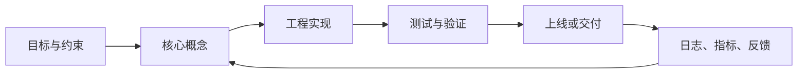

# 编程范式学习笔记：面向过程、面向对象、函数式与常见范式

<!-- lecture-notes:integrated-v2 -->

## 讲义导读：把概念落到可验证实践

这一章讲的是 **编程范式学习笔记：面向过程、面向对象、函数式与常见范式**，属于 **编程基础与抽象方法**。阅读时不要把它当成零散资料堆叠，而要把它当成一份讲义：先弄清它解决什么问题，再看核心概念和流程，最后做一个能复现、能观察、能排错的小练习。

### 一句话先懂

数据结构和编程范式的重点，是根据问题的数据形态和变化方式，选择合适的组织方式和思考模型。

初学时先问三个问题：它的输入或前提是什么；它内部按什么规则工作；结果该用什么命令、日志、测试、图纸、波形或指标来证明。

### 通俗类比

数据结构像仓库货架，编程范式像工作方法：货怎么摆、工人怎么协作，会直接影响查找、修改和扩展成本。

类比只是入门扶手。真正掌握时，要回到准确术语、配置、接口、版本、边界条件、错误信息和验证证据上。能解释失败原因，比只会照着步骤跑通更重要。

### 本章学习主线

1. **先看场景**：这个知识点通常在什么项目、岗位或问题里出现？
2. **再看结构**：它有哪些核心对象、配置、文件、命令、接口或流程？
3. **然后看路径**：一次完整使用从哪里开始，到哪里结束，中间有哪些状态变化？
4. **接着看边界**：版本差异、平台差异、权限、性能、安全、兼容性和资源限制在哪里？
5. **最后看验证**：用最小样例、测试、日志、调试工具或实物结果证明理解是对的。

### 本章重点抓手

数组、链表、栈、队列、哈希、树、图、复杂度、面向过程、面向对象、函数式、并发模型和可维护性。

### 最小实践任务

用同一个小需求分别用过程式、面向对象和函数式思路实现，并比较可读性、状态管理和测试方式。

建议把练习记录成固定格式：目标、环境版本、最小示例、执行步骤、预期结果、实际结果、错误信息、定位过程和复盘。以后遇到真实项目问题时，这些记录会比单纯收藏教程更有用。

### 常见误区

- 只背结构定义，不知道适用场景。
- 过早套设计模式。
- 只看平均复杂度，不看真实数据规模和维护成本。

### 推荐工具与资料

官方文档、最小 demo、日志、调试器、版本管理、测试命令、性能/诊断工具和复盘记录。

### 读完本章应该能做到

- 用自己的话解释核心概念和适用场景。
- 给出一个最小可运行或可验证样例。
- 说清至少一个常见错误的现象、原因和排查路径。
- 知道当前版本应该查哪份官方文档，而不是只依赖旧教程。

> 本节是讲义化改写后的阅读入口。后续正文中的命令、配置、图纸、代码和参考资料，都应围绕“场景 -> 概念 -> 操作 -> 验证 -> 复盘”来理解。


最后整理：2026-06-12

编程范式是组织代码和思考问题的方式。它不是某一种语法，也不是某一种语言的专利，而是回答几个核心问题：

- 程序应该围绕“步骤”组织，还是围绕“对象”组织？
- 数据和行为应该分开，还是绑定在一起？
- 状态可以随时改变，还是尽量不可变？
- 程序主要靠命令一步步执行，还是靠表达式和数据转换组合？
- 复杂系统应该通过继承、组合、消息、事件、规则还是数据流来建模？

常见范式包括：

- 面向过程编程 Procedural Programming；
- 面向对象编程 Object-Oriented Programming，OOP；
- 函数式编程 Functional Programming，FP；
- 命令式编程 Imperative Programming；
- 声明式编程 Declarative Programming；
- 事件驱动编程 Event-Driven Programming；
- 数据驱动编程 Data-Driven Programming；
- 反应式编程 Reactive Programming；
- 逻辑式编程 Logic Programming；
- 并发/Actor 模型等。

新手学习时不要把范式当成互相排斥的阵营。真实项目通常是混合范式：例如 Java 后端常用 OOP 建模，用 SQL 做声明式查询，用 Stream 做函数式数据转换；前端项目用组件化 OOP/函数式思想组织 UI，用事件驱动响应用户操作。

## 一、先理解两组基础概念

### 1. 命令式与声明式

命令式编程关注“怎么做”。代码写出一步一步的执行过程。

```python
numbers = [1, 2, 3, 4, 5]
result = []

for n in numbers:
    if n % 2 == 0:
        result.append(n * 10)
```

这段代码明确告诉计算机：

1. 创建空列表；
2. 遍历数字；
3. 判断是否为偶数；
4. 把偶数乘以 10；
5. 放入结果列表。

声明式编程关注“要什么”。代码更强调目标结果，而不是每一步如何执行。

```python
numbers = [1, 2, 3, 4, 5]
result = [n * 10 for n in numbers if n % 2 == 0]
```

SQL 是典型声明式语言：

```sql
SELECT name, age
FROM users
WHERE age >= 18
ORDER BY age DESC;
```

你告诉数据库“我要 18 岁以上用户，并按年龄排序”，但没有写数据库如何扫描索引、如何执行排序、如何选择查询计划。

### 2. 状态与副作用

状态是程序在某一时刻保存的信息。

```python
count = 0
count = count + 1
```

副作用是函数或代码除了返回结果之外，还改变了外部世界。

常见副作用：

- 修改全局变量；
- 修改传入对象；
- 写文件；
- 写数据库；
- 发网络请求；
- 打印日志；
- 读取当前时间；
- 生成随机数；
- 操作 UI。

不是所有副作用都坏。程序必须通过副作用和外部世界交互。关键是要管理副作用，避免核心业务逻辑被隐藏状态和隐式依赖污染。

## 二、面向过程编程

面向过程编程 Procedural Programming 是以“过程”或“函数”为核心组织程序的方式。程序被拆成一系列步骤，数据在步骤之间传递，每个过程完成一件相对明确的任务。

### 核心思想

面向过程的思考方式是：

1. 我要解决什么问题？
2. 解决这个问题需要哪些步骤？
3. 每个步骤需要哪些输入？
4. 每个步骤会产生什么输出？
5. 这些步骤按什么顺序执行？

它强调流程、顺序、条件判断、循环和函数分解。

### 简单示例

假设要计算订单总价：

```python
def calculate_subtotal(items):
    total = 0
    for item in items:
        total += item["price"] * item["quantity"]
    return total


def calculate_discount(subtotal, user_level):
    if user_level == "vip":
        return subtotal * 0.1
    return 0


def calculate_shipping(subtotal):
    if subtotal >= 99:
        return 0
    return 10


def calculate_total(items, user_level):
    subtotal = calculate_subtotal(items)
    discount = calculate_discount(subtotal, user_level)
    shipping = calculate_shipping(subtotal)
    return subtotal - discount + shipping
```

这就是典型面向过程写法：把问题拆成计算小计、计算折扣、计算运费、计算总价几个步骤。

### 优点

- 简单直接，容易入门；
- 执行流程清晰；
- 适合脚本、算法、数据处理、嵌入式控制流程；
- 性能和内存行为通常容易理解；
- 对小型程序非常高效。

### 缺点

- 数据和操作容易分散；
- 全局变量过多时难以维护；
- 项目变大后容易出现长函数、重复流程和复杂条件；
- 对复杂业务对象的建模能力不如 OOP；
- 如果副作用到处都是，测试和调试会困难。

### 适合场景

- 小脚本；
- 算法题；
- 批处理；
- 单片机控制流程；
- Linux 命令行工具；
- 数据清洗任务；
- 简单自动化任务。

### 常见坏味道

1. 一个函数几百行。
2. 大量全局变量。
3. 函数既读文件、又处理业务、又写数据库。
4. 同一个数据结构被多个过程随意修改。
5. 条件分支越来越多，却没有抽象出清晰概念。

### 改进建议

- 把长函数拆成多个小函数；
- 函数命名使用动词，例如 `parse_config`、`validate_user`；
- 让函数输入输出明确；
- 减少全局变量；
- 把 I/O 和纯计算拆开；
- 对复杂数据结构使用类型、结构体、类或数据类表达。

## 三、面向对象编程

面向对象编程 Object-Oriented Programming 是以“对象”为核心组织程序的方式。对象把数据和操作数据的方法封装在一起，程序通过对象之间的协作完成任务。

### 核心思想

OOP 的思考方式是：

1. 系统里有哪些对象？
2. 每个对象有什么状态？
3. 每个对象能做什么？
4. 对象之间如何协作？
5. 哪些行为应该封装起来？

例如电商系统可以建模为：

- `User` 用户；
- `Product` 商品；
- `Cart` 购物车；
- `Order` 订单；
- `Payment` 支付；
- `Coupon` 优惠券。

### 类与对象

类是模板，对象是实例。

```python
class Order:
    def __init__(self, items, user_level):
        self.items = items
        self.user_level = user_level

    def subtotal(self):
        return sum(item["price"] * item["quantity"] for item in self.items)

    def discount(self):
        if self.user_level == "vip":
            return self.subtotal() * 0.1
        return 0

    def shipping(self):
        if self.subtotal() >= 99:
            return 0
        return 10

    def total(self):
        return self.subtotal() - self.discount() + self.shipping()


order = Order(items=[{"price": 30, "quantity": 2}], user_level="vip")
print(order.total())
```

这里 `Order` 把订单数据和订单相关行为放在一起。

### OOP 三大特征

#### 1. 封装

封装是把数据和操作数据的方法放在一起，并隐藏内部细节。

目标：

- 外部不需要知道内部如何实现；
- 内部变化尽量不影响外部调用；
- 限制不合理的状态修改。

例子：

```python
class BankAccount:
    def __init__(self, balance):
        if balance < 0:
            raise ValueError("balance cannot be negative")
        self._balance = balance

    def deposit(self, amount):
        if amount <= 0:
            raise ValueError("amount must be positive")
        self._balance += amount

    def withdraw(self, amount):
        if amount <= 0:
            raise ValueError("amount must be positive")
        if amount > self._balance:
            raise ValueError("insufficient balance")
        self._balance -= amount

    def balance(self):
        return self._balance
```

外部不能随便把余额改成负数，只能通过 `deposit` 和 `withdraw` 操作。

#### 2. 继承

继承用于表达“某类对象是另一类对象的特殊类型”。

```python
class Animal:
    def speak(self):
        raise NotImplementedError


class Dog(Animal):
    def speak(self):
        return "wang"


class Cat(Animal):
    def speak(self):
        return "miao"
```

继承可以复用代码，但也容易导致层级复杂。现代工程更推荐：

- 少用深继承；
- 多用组合；
- 只有在确实存在稳定的 is-a 关系时再继承。

#### 3. 多态

多态是指不同对象可以响应同一个接口，但表现不同。

```python
def make_sound(animal):
    print(animal.speak())


make_sound(Dog())
make_sound(Cat())
```

调用方只关心对象有 `speak` 方法，不关心具体是狗还是猫。

### 组合优于继承

继承表达“是什么”，组合表达“有什么能力”。

不推荐的深继承：

```text
Vehicle
  -> Car
    -> ElectricCar
      -> SmartElectricCar
```

更灵活的组合：

```python
class Battery:
    def charge(self):
        pass


class Navigation:
    def route_to(self, destination):
        pass


class Car:
    def __init__(self, battery, navigation):
        self.battery = battery
        self.navigation = navigation
```

这样 `Battery` 和 `Navigation` 可以独立替换、测试和复用。

### 优点

- 适合复杂业务建模；
- 封装能力强；
- 容易表达领域概念；
- 多态让扩展更自然；
- 适合大型工程中的模块边界；
- 便于通过接口替换实现。

### 缺点

- 设计不当会类太多；
- 深继承会导致耦合严重；
- 对简单任务可能显得繁琐；
- 对象状态可变时容易出现时序问题；
- 过度设计会引入抽象负担。

### 适合场景

- 业务系统；
- GUI 应用；
- 游戏对象建模；
- 后端领域模型；
- 框架和 SDK；
- 需要长期维护和扩展的大型项目。

### 常见坏味道

1. 只有 getter/setter，没有行为的贫血模型。
2. 继承层级太深。
3. 一个类承担太多职责。
4. 类名很抽象，但没有稳定语义。
5. 为了设计模式而设计模式。
6. 对象方法严重依赖调用顺序。

### 改进建议

- 类应该有清晰职责；
- 优先组合而不是继承；
- 用接口表达稳定契约；
- 把业务规则放在靠近数据的地方；
- 避免万能 Manager、Service、Util；
- 让对象保持合法状态，不要暴露随意修改内部字段的入口。

## 四、函数式编程

函数式编程 Functional Programming 是以“函数”和“数据转换”为核心的编程方式。它强调纯函数、不可变数据、显式输入输出和副作用隔离。

### 核心思想

函数式编程的思考方式是：

1. 输入数据是什么？
2. 输出数据是什么？
3. 中间有哪些转换步骤？
4. 哪些逻辑可以写成纯函数？
5. 哪些副作用必须放在边界？

函数式编程不是简单地“多写函数”。面向过程也会写函数。FP 更关注函数是否纯、数据是否不可变、依赖是否显式、副作用是否隔离。

### 纯函数

纯函数满足两个条件：

1. 相同输入永远得到相同输出；
2. 没有副作用。

纯函数示例：

```python
def add(a, b):
    return a + b
```

非纯函数示例：

```python
count = 0


def next_count():
    global count
    count += 1
    return count
```

`next_count` 依赖并修改外部变量，所以不是纯函数。

### 不可变数据

不可变数据指创建后不再原地修改，而是返回新值。

可变写法：

```python
user = {"name": "Alice", "age": 17}
user["age"] = 18
```

不可变风格：

```python
user = {"name": "Alice", "age": 17}
updated_user = {**user, "age": 18}
```

不可变数据的好处：

- 更容易推理；
- 减少意外修改；
- 更容易测试；
- 并发场景更安全；
- 历史状态更容易保留。

代价：

- 可能增加内存分配；
- 在性能敏感场景要注意复制成本；
- 某些语言中写法可能不够自然。

### 高阶函数

高阶函数是指函数可以接收函数作为参数，或返回一个函数。

```python
def apply_twice(fn, value):
    return fn(fn(value))


def double(x):
    return x * 2


print(apply_twice(double, 3))
```

常见高阶函数：

- `map`：把每个元素转换成另一个元素；
- `filter`：筛选元素；
- `reduce`：把多个元素折叠成一个结果；
- `sort` with key：按指定函数排序；
- 回调函数 callback。

### map、filter、reduce

命令式写法：

```python
numbers = [1, 2, 3, 4, 5]
result = []

for n in numbers:
    if n % 2 == 0:
        result.append(n * 10)
```

函数式风格：

```python
numbers = [1, 2, 3, 4, 5]
result = list(map(lambda n: n * 10, filter(lambda n: n % 2 == 0, numbers)))
```

Python 中更推荐列表推导，因为更可读：

```python
result = [n * 10 for n in numbers if n % 2 == 0]
```

关键不是强行使用 `map` 或 `reduce`，而是让数据流清晰。

### 副作用隔离

函数式编程不是不允许副作用，而是把副作用放到边界。

不推荐：

```python
def process_order(order_id):
    order = database.find_order(order_id)
    if order["total"] > 99:
        order["shipping"] = 0
    else:
        order["shipping"] = 10
    database.save(order)
    email.send(order["user_email"], "order processed")
```

这里读取数据库、计算运费、保存数据库、发送邮件混在一起，难以测试。

更清晰：

```python
def calculate_shipping(total):
    if total > 99:
        return 0
    return 10


def with_shipping(order):
    return {**order, "shipping": calculate_shipping(order["total"])}


def process_order(order_id):
    order = database.find_order(order_id)
    updated_order = with_shipping(order)
    database.save(updated_order)
    email.send(updated_order["user_email"], "order processed")
```

`calculate_shipping` 和 `with_shipping` 是纯逻辑，容易测试。数据库和邮件仍然存在，但集中在外层编排函数中。

### 函数组合与管道

函数式风格常把复杂逻辑拆成一组小转换：

```python
def active_users(users):
    return [user for user in users if user["active"]]


def adult_users(users):
    return [user for user in users if user["age"] >= 18]


def user_names(users):
    return [user["name"] for user in users]


names = user_names(adult_users(active_users(users)))
```

这是一条数据处理管道：

```text
users -> active_users -> adult_users -> user_names -> names
```

### 优点

- 逻辑更容易测试；
- 数据流更清楚；
- 隐藏状态更少；
- 并发场景更安全；
- 适合数据转换、规则计算、编译器、解析器、前端状态管理；
- 纯函数更容易复用和组合。

### 缺点

- 对习惯命令式的人有学习成本；
- 抽象过度会难读；
- 不可变数据可能带来性能成本；
- 某些语言对 FP 支持有限；
- I/O 密集业务仍然需要清晰管理副作用。

### 适合场景

- 数据处理；
- 业务规则计算；
- 表单校验；
- 编译器和解释器；
- 并发任务；
- 前端状态管理；
- 单元测试要求高的核心逻辑；
- 需要可预测数据流的系统。

### 常见坏味道

1. 为了函数式而函数式，写出难懂链式调用。
2. 过度使用匿名函数，缺少中间变量和命名。
3. 把简单循环改成复杂 reduce。
4. 没有真正隔离副作用，只是换了语法。
5. 在性能敏感路径上盲目复制大数据结构。

### 改进建议

- 优先把核心业务规则写成纯函数；
- 把 I/O、网络、数据库、时间、随机数放到边界；
- 函数输入输出要明确；
- 保持转换函数短小并有好名字；
- 在当前语言中使用自然写法，不强行模仿 Haskell；
- 循环更清楚时就保留循环。

## 五、三大范式对比

### 思考中心不同

| 范式 | 核心关注点 | 典型问题 |
|---|---|---|
| 面向过程 | 步骤和流程 | 先做什么，再做什么？ |
| 面向对象 | 对象和协作 | 系统里有哪些对象？对象有什么行为？ |
| 函数式 | 数据和转换 | 输入如何转换成输出？副作用在哪里？ |

### 数据和行为的关系

| 范式 | 数据和行为 |
|---|---|
| 面向过程 | 数据和函数通常分离 |
| 面向对象 | 数据和行为封装到对象中 |
| 函数式 | 数据不可变，行为是纯函数转换 |

### 状态管理

| 范式 | 状态处理方式 |
|---|---|
| 面向过程 | 常通过变量逐步修改状态 |
| 面向对象 | 状态封装在对象内部 |
| 函数式 | 尽量避免原地修改，返回新状态 |

### 扩展示例

假设要支持不同用户折扣。

面向过程常见写法：

```python
def discount(user_level, subtotal):
    if user_level == "vip":
        return subtotal * 0.1
    if user_level == "svip":
        return subtotal * 0.2
    return 0
```

面向对象常见写法：

```python
class DiscountPolicy:
    def calculate(self, subtotal):
        return 0


class VipDiscountPolicy(DiscountPolicy):
    def calculate(self, subtotal):
        return subtotal * 0.1


class SVipDiscountPolicy(DiscountPolicy):
    def calculate(self, subtotal):
        return subtotal * 0.2
```

函数式常见写法：

```python
def no_discount(subtotal):
    return 0


def vip_discount(subtotal):
    return subtotal * 0.1


def svip_discount(subtotal):
    return subtotal * 0.2


discount_policies = {
    "normal": no_discount,
    "vip": vip_discount,
    "svip": svip_discount,
}

discount = discount_policies[user_level](subtotal)
```

没有绝对最优，取决于项目规模、变化方向和团队习惯。

## 六、其他常见编程范式

### 1. 事件驱动编程

事件驱动编程以事件为核心。程序不是按固定主流程一路执行，而是在事件发生时触发对应处理器。

常见事件：

- 用户点击；
- 键盘输入；
- 网络消息；
- 定时器；
- 文件变化；
- 传感器数据；
- 消息队列事件。

JavaScript 前端示例：

```javascript
button.addEventListener("click", () => {
  console.log("button clicked");
});
```

适合：

- GUI；
- 前端；
- 游戏；
- Node.js 服务；
- 消息队列系统；
- 嵌入式中断处理。

风险：

- 事件流复杂后难追踪；
- 回调嵌套；
- 状态分散；
- 事件顺序问题。

### 2. 声明式编程

声明式编程关注“结果是什么”，而不是“如何一步步做”。

典型例子：

- SQL；
- HTML；
- CSS；
- 正则表达式；
- Terraform；
- Kubernetes YAML；
- React UI 描述。

SQL 示例：

```sql
SELECT department, COUNT(*)
FROM employees
GROUP BY department;
```

声明式的优势是表达简洁，底层执行由引擎优化。缺点是当底层行为不符合预期时，需要理解执行模型。

### 3. 数据驱动编程

数据驱动编程把可变规则放到数据或配置中，代码解释这些数据。

例子：

```python
rules = [
    {"level": "vip", "rate": 0.1},
    {"level": "svip", "rate": 0.2},
]


def discount_for(level, subtotal):
    for rule in rules:
        if rule["level"] == level:
            return subtotal * rule["rate"]
    return 0
```

适合：

- 配置化系统；
- 游戏数值；
- 工作流；
- 表单校验；
- 权限规则；
- 低代码平台。

风险：

- 配置变成另一种难维护的代码；
- 缺少类型和测试；
- 规则冲突难排查。

### 4. 反应式编程

反应式编程关注随时间变化的数据流。一个值变化后，依赖它的计算自动更新。

典型场景：

- 前端状态；
- 实时数据看板；
- 股票行情；
- 传感器流；
- 异步事件流。

Rx 风格示例：

```text
clicks
  -> filter(valid)
  -> map(toRequest)
  -> debounce(300ms)
  -> switchMap(fetchData)
```

优点：

- 适合异步流；
- 能表达复杂事件组合；
- 方便处理防抖、节流、合并、取消。

缺点：

- 学习成本高；
- 调试复杂；
- 操作符过多时可读性下降。

### 5. 逻辑式编程

逻辑式编程关注事实和规则，由推理引擎寻找答案。

Prolog 风格示意：

```prolog
parent(alice, bob).
parent(bob, charlie).
grandparent(X, Z) :- parent(X, Y), parent(Y, Z).
```

适合：

- 规则推理；
- 约束求解；
- 专家系统；
- 某些 AI 推理任务。

普通业务开发中不常作为主范式，但规则引擎、查询引擎、约束求解器会吸收它的思想。

### 6. Actor 模型

Actor 模型把系统看作很多独立 Actor。每个 Actor 有自己的状态，通过消息通信，不共享内存。

特点：

- Actor 之间通过消息通信；
- 每个 Actor 串行处理自己的消息；
- 避免共享可变状态；
- 适合高并发和分布式系统。

典型技术：

- Erlang/Elixir；
- Akka；
- Orleans；
- 一些游戏服务器架构。

## 七、如何选择编程范式

### 按任务选择

| 任务 | 推荐思路 |
|---|---|
| 简单脚本 | 面向过程 |
| 算法实现 | 面向过程 + 函数式辅助 |
| 复杂业务系统 | 面向对象 + 函数式核心规则 |
| 数据清洗 | 函数式/声明式 |
| 数据库查询 | 声明式 SQL |
| GUI/前端交互 | 事件驱动 + 组件化 |
| 工业控制流程 | 面向过程 + 状态机 |
| 并发消息系统 | Actor/事件驱动 |
| 配置化规则 | 数据驱动 |

### 按变化方向选择

如果变化主要是“流程步骤变化”，面向过程容易直接改。

如果变化主要是“新增对象类型”，OOP 多态比较适合。

如果变化主要是“数据转换规则”，函数式管道比较适合。

如果变化主要是“规则配置”，数据驱动更适合。

如果变化主要是“事件来源和异步流程”，事件驱动或反应式更适合。

## 八、实战中的混合范式

真实项目中可以这样组合：

1. 外层用面向对象组织模块和边界。
2. 中间用面向过程编排业务流程。
3. 核心计算用函数式写成纯函数。
4. 数据查询用 SQL 这类声明式语言。
5. 用户交互用事件驱动。
6. 可变规则用数据驱动。

例子：

```text
Controller 接收请求
  -> Service 编排流程
    -> Repository 读写数据库
    -> Domain Policy 纯函数计算规则
    -> Event Publisher 发布事件
```

这种结构并不属于单一范式，而是把每种范式放在合适的位置。

## 九、学习路线

### 阶段 1：掌握面向过程

目标：

- 会拆函数；
- 会写清晰流程；
- 理解变量、条件、循环；
- 避免长函数和全局变量滥用。

练习：

- 写一个学生成绩统计程序；
- 写一个文件批量重命名脚本；
- 写一个 CSV 清洗脚本；
- 写一个命令行计算器。

### 阶段 2：掌握面向对象

目标：

- 理解类、对象、封装、继承、多态；
- 能识别对象职责；
- 会用组合替代不必要继承；
- 能写出保持合法状态的类。

练习：

- 写一个图书管理系统；
- 写一个购物车和订单模型；
- 写一个简单游戏角色系统；
- 用策略模式实现不同折扣规则。

### 阶段 3：掌握函数式思想

目标：

- 理解纯函数；
- 理解不可变数据；
- 会隔离副作用；
- 会写清晰数据转换管道；
- 不滥用复杂抽象。

练习：

- 把订单价格计算写成纯函数；
- 把表单校验写成多个校验函数组合；
- 把日志分析写成过滤、映射、聚合流程；
- 把一个读文件的大函数拆成 I/O 外壳 + 纯计算核心。

### 阶段 4：学习混合设计

目标：

- 按问题选择范式；
- 识别代码坏味道；
- 能把副作用放到边界；
- 能用对象表达领域，用函数表达规则，用数据表达配置。

练习：

- 写一个小型记账系统；
- 写一个 Todo 应用；
- 写一个设备通信协议解析器；
- 写一个规则可配置的优惠系统。

## 十、常见误区

### 误区 1：面向对象就是多写类

不是。OOP 的重点是封装稳定概念和行为。如果类没有行为，只是字段容器，可能只是把字典换成了类。

### 误区 2：函数式就是不用循环

不是。函数式重点是纯函数、不可变数据、清晰数据流和副作用隔离。循环更清楚时可以保留循环。

### 误区 3：面向过程一定低级

不是。很多系统底层、算法、脚本和控制逻辑用面向过程最清晰。问题不在面向过程，而在无边界的全局状态和过长流程。

### 误区 4：设计模式越多越高级

不是。设计模式是解决特定问题的工具，不是代码装饰。没有真实变化点时强行套模式，只会增加复杂度。

### 误区 5：不可变数据一定性能差

不一定。很多语言有结构共享和优化。即使有复制成本，也要结合实际性能瓶颈判断。清晰和正确通常比过早优化更重要。

## 十一、快速对照表

| 对比项 | 面向过程 | 面向对象 | 函数式 |
|---|---|---|---|
| 组织单位 | 函数/过程 | 类/对象 | 函数/表达式 |
| 主要关注 | 流程步骤 | 对象职责 | 数据转换 |
| 状态 | 变量逐步变化 | 封装在对象中 | 尽量不可变 |
| 副作用 | 常直接发生 | 通常在对象方法中 | 尽量隔离到边界 |
| 复用方式 | 函数复用 | 继承、组合、多态 | 函数组合、高阶函数 |
| 适合规模 | 小到中等流程 | 中大型业务系统 | 核心规则、数据处理 |
| 常见风险 | 长函数、全局状态 | 过度抽象、深继承 | 抽象过度、难读链式调用 |

## 十二、总结

面向过程、面向对象、函数式不是谁取代谁的关系，而是不同的思考工具。

- 面向过程帮助你把事情按步骤做清楚。
- 面向对象帮助你把复杂系统中的概念和职责封装清楚。
- 函数式帮助你把数据转换、副作用和状态变化控制清楚。

写代码时最实用的判断是：

1. 如果流程很简单，用面向过程。
2. 如果领域概念复杂，用面向对象建模。
3. 如果核心是计算和转换，用函数式写纯逻辑。
4. 如果是查询和配置，用声明式或数据驱动。
5. 如果是用户交互和异步消息，用事件驱动或反应式。

好的程序员不是只会一种范式，而是知道什么时候该用哪种范式，以及什么时候不要过度设计。

## 2026-06 深化整理：编程范式 的工程化学习框架

Last researched: 2026-06-16

### 1. 学习定位

编程范式 这类知识不适合只按“概念清单”记忆，更适合按可交付能力组织。本文后续复习时，应围绕这条主线展开：命令式、声明式、面向过程、面向对象、函数式、响应式、逻辑式和多范式组合。如果只会照抄命令、配置或示例，而不能解释输入、输出、边界、失败模式和验证方法，知识在真实项目里会很快失效。

一份万字级笔记要承担三个作用：第一，建立准确概念，避免把相似术语混在一起；第二，形成可执行流程，知道从零搭建、调试和交付的顺序；第三，沉淀排错经验，遇到异常时能按证据定位，而不是凭感觉改配置。学习时建议把每个小节都对应到“是什么、为什么、怎么做、什么时候不用、出了问题怎么查”五个问题。

### 2. 核心模块

- 范式是组织问题和代码的思维模型
- 命令式强调步骤和状态变化
- 面向对象把状态和行为封装到对象
- 函数式强调不可变、组合和副作用隔离
- 声明式关注描述目标而不是执行步骤

这些模块之间不是孤立关系。通常先有需求和约束，再选择架构或工具；工具落地后会产生配置、接口、状态和制品；运行阶段再通过日志、指标、测试和回滚机制验证结果。真正掌握本主题，意味着能从一次失败现象反推到是哪一层出了问题。



Figure: 通用学习与工程闭环，结合官方文档、标准资料和社区实践重新整理。

### 3. 实践路线

建议按四轮学习。第一轮只跑通最小例子，不追求复杂度；第二轮补齐关键概念，明确每个配置项和命令的作用；第三轮做故障注入，主动制造常见错误并记录现象；第四轮整理成项目模板，把目录结构、命名规范、检查清单和参考链接固化下来。

对技术笔记而言，最小例子必须可重复。命令类主题要记录操作系统、Shell、权限、工作目录和返回码；框架类主题要记录版本、依赖、构建命令、目录结构和运行入口；工程设计类主题要记录标准依据、图纸、点表、验收项和变更记录。没有环境信息的示例，后续很难判断是知识错误、版本差异还是本机配置问题。

### 4. 常见错误

- 把范式当宗教选择
- OOP 过度继承
- 函数式只学 map/filter 不处理副作用
- 声明式 DSL 缺少调试能力
- 不同范式边界混乱

排查时先收集事实：版本、配置、输入、输出、日志、错误码、时间点、复现步骤。不要一开始就改多个参数。一次只改一个变量，并记录改动前后的现象。对于涉及安全、权限、部署、数据库、电气或工业控制的主题，要优先查官方文档和标准，社区文章只能作为实践参考，不能作为唯一依据。

### 5. 笔记维护建议

后续更新这篇文档时，建议保留 `Last researched` 日期，并把新增内容放到“版本差异”“实践坑”“调试清单”“参考资料”中。对于快速变化的工具链，例如 Android、Gradle、Docker、CI/CD、Redis、uv、Qt 和前端标准，至少在重新实践前核对一次官方文档。对于工业、电气、PLC、RBAC 这类涉及安全、权限或标准的内容，应明确标准编号、适用地区、适用版本和项目约束。

## 2026 综合技术资料与实践核对补充

这一组笔记主题较散，建议按“官方文档 + 最小样例 + 版本记录”三层核对。

- **官方来源**：Docker、CMake、Gradle、Maven、Redis、uv、Qt、Android、Material、MDN、Microsoft Learn、GNU Bash、PostgreSQL、NIST RBAC 等内容都应优先查对应官方文档。
- **版本记录**：基础概念可用教材和语言官方文档核对，实现细节要结合具体语言标准库。 学习笔记里涉及命令、配置、API、硬件型号或工具行为时，最好写清工具版本、系统环境和验证日期。
- **最小实践**：每个主题至少保留一个能复现的最小样例，包含输入、步骤、输出和错误排查。
- **工程意识**：不要只记“怎么用”，还要记录为什么这样用、边界条件是什么、换版本或换平台会不会失效。

参考资料入口：

- Docker Docs：https://docs.docker.com/
- CMake Documentation：https://cmake.org/documentation/
- Gradle User Manual：https://docs.gradle.org/current/userguide/userguide.html
- Apache Maven Documentation：https://maven.apache.org/guides/
- MDN Web Docs：https://developer.mozilla.org/
- Redis Docs：https://redis.io/docs/latest/
- uv Documentation：https://docs.astral.sh/uv/
- Qt Documentation：https://doc.qt.io/
- Android Developers：https://developer.android.com/
- Material Design：https://m3.material.io/
- Microsoft Learn PowerShell：https://learn.microsoft.com/powershell/
- Microsoft Windows Commands：https://learn.microsoft.com/windows-server/administration/windows-commands/windows-commands
- GNU Bash Manual：https://www.gnu.org/software/bash/manual/
- PostgreSQL Documentation：https://www.postgresql.org/docs/
- NIST RBAC Library：https://csrc.nist.gov/projects/role-based-access-control/rbac-library

## References and further reading

- [Community] [freeCodeCamp Programming Paradigms](https://www.freecodecamp.org/news/an-introduction-to-programming-paradigms/)
- [Reference] [Structure and Interpretation of Computer Programs](https://mitpress.mit.edu/9780262510875/structure-and-interpretation-of-computer-programs/)
- [Reference] [Programming Language Pragmatics](https://www.cs.rochester.edu/~scott/pragmatics/)
- [Official] [MDN Web Docs](https://developer.mozilla.org/)
- [Official] [Microsoft Learn](https://learn.microsoft.com/)
- [Official] [Docker Docs](https://docs.docker.com/)
- [Official] [GitHub Actions documentation](https://docs.github.com/actions)
- [Official] [GitLab CI/CD documentation](https://docs.gitlab.com/ci/)
- [Official] [CMake Documentation](https://cmake.org/cmake/help/latest/)
- [Official] [Gradle User Manual](https://docs.gradle.org/)
- [Official] [Apache Maven Guides](https://maven.apache.org/guides/)
- [Official] [Redis Documentation](https://redis.io/docs/latest/)
- [Official] [Qt Documentation](https://doc.qt.io/qt-6/)
- [Course] [MIT 6.006 Introduction to Algorithms](https://ocw.mit.edu/courses/6-006-introduction-to-algorithms-spring-2020/)
