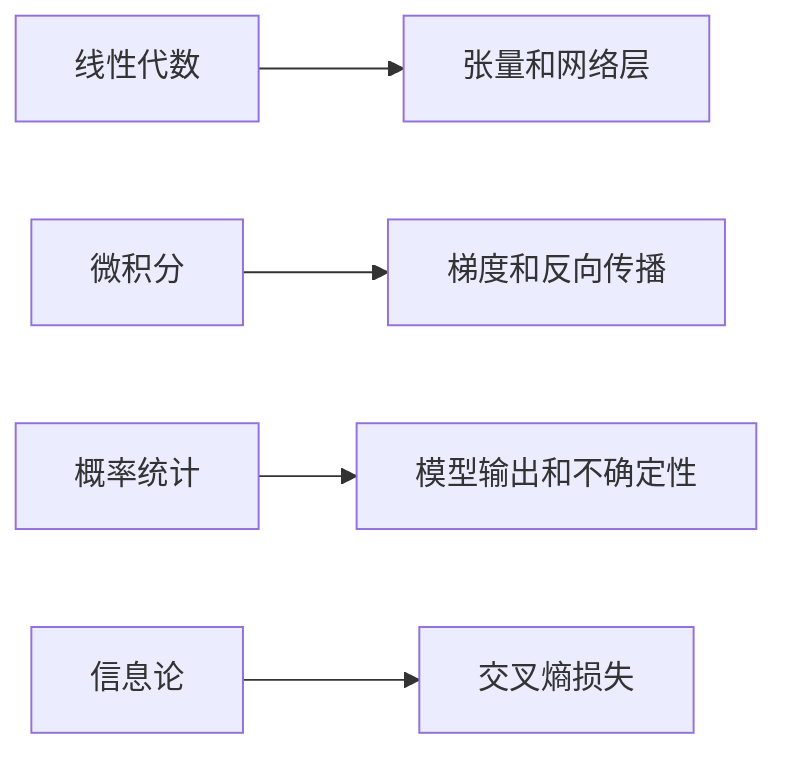
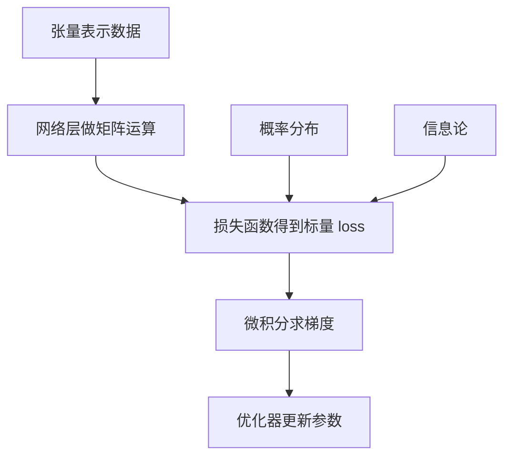
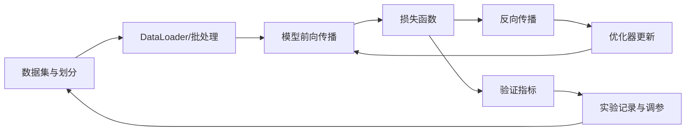
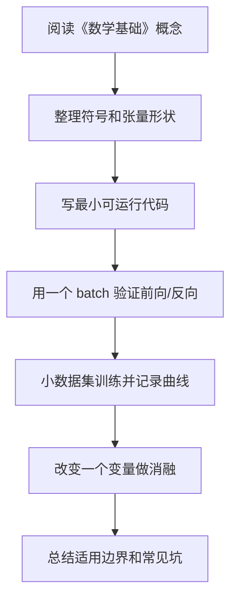

# 01 数学基础

## 1. 总览

深度学习的数学基础不需要一开始学到非常抽象，但必须理解四类工具：

- 线性代数：向量、矩阵、张量、线性变换。
- 微积分：导数、偏导、梯度、链式法则。
- 概率统计：随机变量、分布、期望、方差、最大似然。
- 信息论：熵、交叉熵、KL 散度。

这些内容对应深度学习中的不同模块：



## 2. 线性代数

### 2.1 向量

**是什么：** 一组有顺序的数，可以表示样本、特征、参数或梯度。

**为什么存在：** 机器学习通常把一个样本表示成特征向量。

**简单例子：**

```text
一条房屋样本:
x = [面积, 房间数, 楼层, 距地铁距离]
```

#### 向量基本运算

加法：

```text
x + y = [x_1 + y_1, x_2 + y_2, ..., x_n + y_n]
```

数乘：

```text
alpha x = [alpha x_1, alpha x_2, ..., alpha x_n]
```

内积：

```text
x^T y = sum_i x_i y_i
```

内积在深度学习中非常常见。线性层、注意力机制、相似度计算都离不开内积。

#### 范数

范数衡量向量大小：

```text
||x||_1 = sum_i |x_i|
||x||_2 = sqrt(sum_i x_i^2)
```

用途：

- L1 正则化使用 `||w||_1`，倾向产生稀疏参数。
- L2 正则化使用 `||w||_2^2`，倾向让权重变小且平滑。
- 梯度裁剪常用梯度的 L2 范数。

### 2.2 矩阵

**是什么：** 二维数组，可以表示一批样本、一组线性变换或神经网络权重。

**职责：**

- 批量组织数据；
- 表示线性映射；
- 提高计算效率。

**简单例子：**

```text
X shape = [batch_size, input_dim]
W shape = [input_dim, output_dim]
Y = XW
Y shape = [batch_size, output_dim]
```

#### 矩阵乘法

```text
C = AB
C_ij = sum_k A_ik B_kj
```

维度要求：

```text
A: [m, n]
B: [n, p]
C: [m, p]
```

神经网络线性层通常写作：

```text
Y = XW + b
```

其中：

- `X` 是一批输入；
- `W` 是权重矩阵；
- `b` 是偏置；
- `Y` 是输出特征。

#### 转置和逆

转置：

```text
(A^T)_ij = A_ji
```

逆矩阵：

```text
A A^-1 = I
```

深度学习中不常显式求逆，因为数值不稳定且计算昂贵。更多时候使用梯度优化而不是解析解。

### 2.3 张量

**是什么：** 多维数组，是深度学习框架中的基本数据结构。

**常见形状：**

| 数据 | 常见 shape |
| --- | --- |
| 表格批数据 | `[batch, features]` |
| 图像 | `[batch, channels, height, width]` |
| 文本 token | `[batch, seq_len]` |
| 词向量序列 | `[batch, seq_len, hidden_dim]` |

**简单例子：**

```python
import torch

x = torch.randn(32, 3, 224, 224)
print(x.shape)  # 32 张 RGB 图片
```

#### Broadcasting

Broadcasting 允许不同 shape 的张量在兼容维度上自动扩展。

```python
import torch

x = torch.randn(4, 3)
b = torch.randn(3)
y = x + b
print(y.shape)  # [4, 3]
```

常见风险：broadcasting 太方便，可能掩盖 shape 错误。训练前应主动打印关键张量 shape。

## 3. 微积分

### 3.1 导数

**是什么：** 函数输出相对于输入变化的敏感程度。

**为什么存在：** 训练模型时要知道参数怎么改能让损失下降。

**简单例子：**

```text
f(w) = w^2
f'(w) = 2w

当 w = 3 时，梯度为 6。
如果要减小 f(w)，可以让 w 往负梯度方向移动。
```

#### 导数和优化方向

如果要最小化函数 `f(w)`，梯度下降更新为：

```text
w_new = w - eta * df/dw
```

其中 `eta` 是学习率。负梯度方向是函数局部下降最快的方向。

### 3.2 偏导和梯度

**是什么：** 多变量函数对每个变量分别求导，组合起来就是梯度。

**简单例子：**

```text
L(w1, w2) = w1^2 + 3w2^2

dL/dw1 = 2w1
dL/dw2 = 6w2
gradient = [2w1, 6w2]
```

梯度向量：

```text
grad f(x) = [partial f / partial x_1, ..., partial f / partial x_n]^T
```

在神经网络中，参数可能是矩阵或高维张量。框架会为每个参数张量计算同 shape 的梯度张量。

### 3.3 链式法则

**是什么：** 复合函数求导规则。

**为什么存在：** 神经网络是多层函数复合，反向传播依赖链式法则。

**简单例子：**

```text
z = wx + b
y = sigmoid(z)
L = (y - target)^2

dL/dw = dL/dy * dy/dz * dz/dw
```

#### 多变量链式法则

如果 `z = f(x, y)`，且 `x = x(t)`、`y = y(t)`，则：

```text
dz/dt = partial z/partial x * dx/dt + partial z/partial y * dy/dt
```

神经网络反向传播本质上就是在计算图上反复应用链式法则，并把来自不同路径的梯度相加。

## 4. 矩阵求导

深度学习公式经常使用矩阵求导。先掌握几个常见结果即可。

### 4.1 线性函数

```text
y = Wx + b
```

若 `L` 是标量损失，且已知 `partial L / partial y`，则：

```text
partial L / partial W = (partial L / partial y) x^T
partial L / partial b = partial L / partial y
partial L / partial x = W^T (partial L / partial y)
```

批量形式：

```text
Y = XW + b
partial L / partial W = X^T (partial L / partial Y)
```

### 4.2 平方误差

```text
L = 1/2 * ||y_hat - y||_2^2
```

对预测值求导：

```text
partial L / partial y_hat = y_hat - y
```

这里前面的 `1/2` 是为了求导后抵消平方项产生的系数 2。

## 5. 概率统计

### 4.1 随机变量和分布

**是什么：** 随机变量描述不确定结果，分布描述结果出现的可能性。

**深度学习中的用途：**

- 分类输出可以看作类别概率分布；
- 生成模型学习数据分布；
- Dropout 引入随机性；
- 贝叶斯方法显式建模不确定性。

**简单例子：**

```text
分类模型输出:
P(cat)=0.7, P(dog)=0.2, P(car)=0.1
```

### 5.2 条件概率和贝叶斯公式

条件概率：

```text
P(A | B) = P(A, B) / P(B)
```

贝叶斯公式：

```text
P(y | x) = P(x | y) P(y) / P(x)
```

机器学习中可以理解为：

- `P(y | x)`：看到输入 x 后类别 y 的概率；
- `P(x | y)`：类别 y 生成样本 x 的可能性；
- `P(y)`：类别先验；
- `P(x)`：证据项，起归一化作用。

### 5.3 期望和方差

**是什么：**

- 期望表示平均水平；
- 方差表示波动程度。

**简单例子：**

```text
训练 loss 每个 batch 都不同。
平均 loss 看趋势，方差看训练是否稳定。
```

公式：

```text
E[X] = sum_x x P(X=x)
Var(X) = E[(X - E[X])^2]
```

常用等价形式：

```text
Var(X) = E[X^2] - E[X]^2
```

### 5.4 最大似然

**是什么：** 选择一组参数，让观测到的数据出现概率最大。

**和深度学习的关系：** 很多损失函数可以从最大似然角度解释。例如分类中的交叉熵可以对应最大化正确类别的对数概率。

设数据集为：

```text
D = {(x_i, y_i)}_{i=1}^m
```

模型给出条件概率：

```text
P(y | x; theta)
```

最大似然：

```text
theta* = argmax_theta product_i P(y_i | x_i; theta)
```

通常取对数：

```text
theta* = argmax_theta sum_i log P(y_i | x_i; theta)
```

最小化负对数似然：

```text
L(theta) = - sum_i log P(y_i | x_i; theta)
```

这就是很多分类损失的概率解释。

## 6. 信息论

### 6.1 熵

**是什么：** 衡量不确定性。

**简单例子：**

```text
如果一个硬币总是正面，结果不确定性低。
如果正反各 50%，不确定性高。
```

离散分布的熵：

```text
H(p) = - sum_i p_i log p_i
```

熵越大，分布越不确定。均匀分布通常有较高熵；非常集中的分布熵低。

### 6.2 交叉熵

**是什么：** 衡量真实分布和预测分布之间的差异，分类任务中常用。

**简单例子：**

```python
import torch
import torch.nn.functional as F

logits = torch.tensor([[2.0, 0.5, -1.0]])
target = torch.tensor([0])
loss = F.cross_entropy(logits, target)
print(loss.item())
```

这里 `target=0` 表示正确类别是第 0 类。模型给第 0 类的 logit 越高，交叉熵通常越小。

公式：

```text
H(p, q) = - sum_i p_i log q_i
```

其中：

- `p` 是真实分布；
- `q` 是模型预测分布。

如果 `p` 是 one-hot，正确类别为 `y`：

```text
H(p, q) = -log q_y
```

### 6.3 KL 散度

**是什么：** 衡量分布 `q` 相对真实分布 `p` 的差异。

```text
D_KL(p || q) = sum_i p_i log(p_i / q_i)
```

与交叉熵关系：

```text
H(p, q) = H(p) + D_KL(p || q)
```

训练数据标签固定时，`H(p)` 不随模型变化，因此最小化交叉熵等价于最小化 KL 散度。

## 7. 数学模块之间的关系



## 8. 常见误区

- 只背公式，不知道公式中的量对应代码里的什么张量。
- 不检查 shape，导致矩阵乘法维度错误。
- 把 softmax 后的概率再传给 `cross_entropy`，造成重复 softmax。
- 只看平均 loss，不观察训练波动。

---

## 万字精讲扩展（2026-06-16 更新）
> Last researched: 2026-06-16。本文补充内容以深度学习入门到工程实践为主，版本相关 API 以 PyTorch 官方文档和实际环境为准，论文结论应结合任务、数据和计算预算理解。

### 本章在整套深度学习路线中的位置

《数学基础》不是孤立章节，而是深度学习知识链条中的一个环节。向前看，它依赖数学、机器学习基本概念、数据划分和评估指标；向后看，它会影响模型实现、训练稳定性、泛化能力和项目复现。学习时不要把公式、代码和实验割裂开。一个概念如果不能解释张量形状，通常还没有真正进入代码层面；一个代码片段如果不能解释训练曲线，通常还没有真正进入实验层面。

本章学习完成后，建议至少达到三个标准。第一，能说清核心概念解决的问题和适用边界。第二，能写出最小公式并对应到 PyTorch 张量形状。第三，能设计一个小实验验证它的作用，并能根据训练曲线判断常见失败原因。达到这三个标准后，本章才真正从“看过”变成“可用”。

### 数学类笔记的精讲重点

深度学习所需数学不等于完整数学专业课程，而是围绕张量变换、梯度传播、概率建模和优化稳定性展开。线性代数帮助理解数据如何表示成向量、矩阵和张量，矩阵乘法如何实现特征变换，特征空间如何被投影和组合。微积分帮助理解损失对参数的敏感性，链式法则解释反向传播为什么能从输出层传回每一层。概率统计帮助理解数据分布、似然、交叉熵、噪声、不确定性和评估波动。信息论帮助理解熵、交叉熵、KL 散度和分类损失。

学习数学时要坚持“符号形状化”。看到 `y = XW + b`，不要只读公式，要写出 `X` 是 `[batch, in_features]`，`W` 是 `[in_features, out_features]`，`b` 是 `[out_features]`，`y` 是 `[batch, out_features]`。看到 softmax 和交叉熵，要说明 logits、概率、标签和损失的形状。这样数学就能直接映射到 PyTorch 代码，而不是停留在纸面推导。

### 深度学习的学习闭环：公式、代码、实验三者必须互相解释

深度学习最容易学散：一边背线性代数和概率，一边看模型结构图，一边抄训练代码，但三者没有真正连起来。真正能长期使用的学习方式，是把每个概念都放进同一个闭环里：数学表达负责说明对象和变换，代码实现负责说明张量形状和计算顺序，实验记录负责说明这个设计在数据上是否有效。只会公式，容易不知道代码里维度为什么变；只会代码，容易不知道损失为什么下降或不下降；只看结果，容易把偶然的超参数组合误认为通用规律。

建议每学一个主题都做四件事。第一，用自然语言说明它解决什么问题，比如卷积解决局部模式和参数共享，Attention 解决动态依赖建模，正则化解决泛化而不是训练误差本身。第二，写出最小公式，并标出每个符号的形状。第三，用 PyTorch 或 NumPy 写一个最小可运行例子，不追求工程封装，只追求看见输入、输出、损失和梯度。第四，做一个小实验改变关键因素，例如学习率、batch size、初始化、正则强度、模型宽度、数据噪声或序列长度，观察训练曲线变化。

### 训练系统的基本结构



Figure: 深度学习训练闭环，综合 PyTorch 官方教程、Dive into Deep Learning 和 Google Tuning Playbook 整理。

这个闭环说明了一个重要事实：模型性能不是模型结构单独决定的，而是数据、目标、损失、优化、正则化、评估和工程细节共同决定的。很多训练问题看起来像模型问题，实际可能是数据泄漏、标签错误、归一化不一致、学习率不合适、评估指标不匹配或随机种子导致的实验不可复现。因此学习笔记不能只写“某模型更强”，还要写“在什么数据、什么目标、什么计算预算、什么调参策略下更合适”。

### 从形状检查开始理解模型

深度学习代码调试的第一原则是先检查张量形状。线性层通常期望 `[batch, features]`，卷积层通常是 `[batch, channels, height, width]`，RNN 和 Transformer 常见形状可能是 `[batch, seq, hidden]` 或 `[seq, batch, hidden]`，注意力里的 Q、K、V 还会拆成多头维度。很多错误并不是数学错，而是把 batch 维、时间维、通道维、特征维混在一起。

建议在每个模型的 forward 里临时打印或断言关键形状，训练前用一个 batch 跑通前向、损失和反向。先确认 loss 是标量，梯度不是 None，参数会更新，再开始长时间训练。对初学者而言，`overfit one batch` 是非常有效的调试方法：让模型在一个小 batch 上训练到接近零损失，如果做不到，通常说明模型、损失、标签、学习率或梯度链路存在基础问题。

### 实验记录比单次结果更重要

深度学习结果具有随机性，数据划分、初始化、batch 顺序、GPU 算子和混合精度都可能影响数值。PyTorch 官方文档也提醒，完全复现并不总是保证的，但可以通过固定随机种子、记录版本、保存配置、控制数据划分和记录硬件环境来降低不确定性。学习阶段至少应记录：数据集版本、划分方式、模型配置、优化器、学习率计划、batch size、训练轮数、随机种子、评价指标、最好 checkpoint 和训练曲线。

当实验结果变化时，不要只看最终准确率。训练 loss、验证 loss、训练指标、验证指标、梯度范数、学习率曲线、样本预测案例、错误样本分布都能提供线索。训练集很好验证集差，通常指向过拟合、数据分布差异或数据泄漏；训练集也学不好，可能是欠拟合、学习率错误、标签错、模型容量不足或输入预处理错误；loss 出现 NaN，常见原因是学习率过大、数值溢出、非法 log、除零、混合精度缩放问题或梯度爆炸。

### 核心知识点逐条精讲

#### 1. 线性代数

在《数学基础》中，`线性代数` 应该同时从概念、公式、代码和实验四个层面理解。概念层面要回答它解决什么问题、引入什么假设、和相邻方法有什么差异；公式层面要写出输入、输出、参数和损失之间的关系；代码层面要确认张量形状、广播规则、自动微分路径和数值稳定处理；实验层面要观察它对训练 loss、验证指标、收敛速度、显存占用和泛化能力的影响。

学习 `算法` 或 `模型结构` 时，不要只停留在结构图。结构图通常隐藏了 batch 维、mask、归一化、残差、初始化、学习率和数据预处理等细节，而这些细节经常决定训练是否成功。以 `线性代数` 为主题做笔记时，建议固定写五项：适用任务、核心公式、张量形状、最小代码、常见失败现象。这样以后回看时可以直接用于实现和排错。

判断 `线性代数` 是否真正掌握，可以用三个问题自测：如果输入维度变化，能否推导输出形状；如果训练曲线异常，能否提出可验证的原因；如果换一个数据集，能否说清哪些假设可能失效。深度学习不是把所有模型都背下来，而是建立一套能解释、能实现、能诊断的工作方式。

#### 2. 微积分与链式法则

在《数学基础》中，`微积分与链式法则` 应该同时从概念、公式、代码和实验四个层面理解。概念层面要回答它解决什么问题、引入什么假设、和相邻方法有什么差异；公式层面要写出输入、输出、参数和损失之间的关系；代码层面要确认张量形状、广播规则、自动微分路径和数值稳定处理；实验层面要观察它对训练 loss、验证指标、收敛速度、显存占用和泛化能力的影响。

学习 `算法` 或 `模型结构` 时，不要只停留在结构图。结构图通常隐藏了 batch 维、mask、归一化、残差、初始化、学习率和数据预处理等细节，而这些细节经常决定训练是否成功。以 `微积分与链式法则` 为主题做笔记时，建议固定写五项：适用任务、核心公式、张量形状、最小代码、常见失败现象。这样以后回看时可以直接用于实现和排错。

判断 `微积分与链式法则` 是否真正掌握，可以用三个问题自测：如果输入维度变化，能否推导输出形状；如果训练曲线异常，能否提出可验证的原因；如果换一个数据集，能否说清哪些假设可能失效。深度学习不是把所有模型都背下来，而是建立一套能解释、能实现、能诊断的工作方式。

#### 3. 矩阵求导

在《数学基础》中，`矩阵求导` 应该同时从概念、公式、代码和实验四个层面理解。概念层面要回答它解决什么问题、引入什么假设、和相邻方法有什么差异；公式层面要写出输入、输出、参数和损失之间的关系；代码层面要确认张量形状、广播规则、自动微分路径和数值稳定处理；实验层面要观察它对训练 loss、验证指标、收敛速度、显存占用和泛化能力的影响。

学习 `算法` 或 `模型结构` 时，不要只停留在结构图。结构图通常隐藏了 batch 维、mask、归一化、残差、初始化、学习率和数据预处理等细节，而这些细节经常决定训练是否成功。以 `矩阵求导` 为主题做笔记时，建议固定写五项：适用任务、核心公式、张量形状、最小代码、常见失败现象。这样以后回看时可以直接用于实现和排错。

判断 `矩阵求导` 是否真正掌握，可以用三个问题自测：如果输入维度变化，能否推导输出形状；如果训练曲线异常，能否提出可验证的原因；如果换一个数据集，能否说清哪些假设可能失效。深度学习不是把所有模型都背下来，而是建立一套能解释、能实现、能诊断的工作方式。

#### 4. 概率统计

在《数学基础》中，`概率统计` 应该同时从概念、公式、代码和实验四个层面理解。概念层面要回答它解决什么问题、引入什么假设、和相邻方法有什么差异；公式层面要写出输入、输出、参数和损失之间的关系；代码层面要确认张量形状、广播规则、自动微分路径和数值稳定处理；实验层面要观察它对训练 loss、验证指标、收敛速度、显存占用和泛化能力的影响。

学习 `算法` 或 `模型结构` 时，不要只停留在结构图。结构图通常隐藏了 batch 维、mask、归一化、残差、初始化、学习率和数据预处理等细节，而这些细节经常决定训练是否成功。以 `概率统计` 为主题做笔记时，建议固定写五项：适用任务、核心公式、张量形状、最小代码、常见失败现象。这样以后回看时可以直接用于实现和排错。

判断 `概率统计` 是否真正掌握，可以用三个问题自测：如果输入维度变化，能否推导输出形状；如果训练曲线异常，能否提出可验证的原因；如果换一个数据集，能否说清哪些假设可能失效。深度学习不是把所有模型都背下来，而是建立一套能解释、能实现、能诊断的工作方式。

#### 5. 信息论

在《数学基础》中，`信息论` 应该同时从概念、公式、代码和实验四个层面理解。概念层面要回答它解决什么问题、引入什么假设、和相邻方法有什么差异；公式层面要写出输入、输出、参数和损失之间的关系；代码层面要确认张量形状、广播规则、自动微分路径和数值稳定处理；实验层面要观察它对训练 loss、验证指标、收敛速度、显存占用和泛化能力的影响。

学习 `算法` 或 `模型结构` 时，不要只停留在结构图。结构图通常隐藏了 batch 维、mask、归一化、残差、初始化、学习率和数据预处理等细节，而这些细节经常决定训练是否成功。以 `信息论` 为主题做笔记时，建议固定写五项：适用任务、核心公式、张量形状、最小代码、常见失败现象。这样以后回看时可以直接用于实现和排错。

判断 `信息论` 是否真正掌握，可以用三个问题自测：如果输入维度变化，能否推导输出形状；如果训练曲线异常，能否提出可验证的原因；如果换一个数据集，能否说清哪些假设可能失效。深度学习不是把所有模型都背下来，而是建立一套能解释、能实现、能诊断的工作方式。


### 场景化学习与排错表

| 主题 | 推荐学习动作 | 常见风险 | 验证方式 |
| :--- | :--- | :--- | :--- |
| 线性代数 | 写清概念、公式、张量形状、最小代码和实验现象 | 只背名称或只复制代码 | 形状断言、one-batch overfit、训练/验证曲线、消融实验 |
| 微积分与链式法则 | 写清概念、公式、张量形状、最小代码和实验现象 | 只背名称或只复制代码 | 形状断言、one-batch overfit、训练/验证曲线、消融实验 |
| 矩阵求导 | 写清概念、公式、张量形状、最小代码和实验现象 | 只背名称或只复制代码 | 形状断言、one-batch overfit、训练/验证曲线、消融实验 |
| 概率统计 | 写清概念、公式、张量形状、最小代码和实验现象 | 只背名称或只复制代码 | 形状断言、one-batch overfit、训练/验证曲线、消融实验 |
| 信息论 | 写清概念、公式、张量形状、最小代码和实验现象 | 只背名称或只复制代码 | 形状断言、one-batch overfit、训练/验证曲线、消融实验 |

这个表的目的不是把所有知识点变成同一种解释，而是强迫每个主题都落到可验证行为。深度学习中很多错误不会直接报错，而是表现为指标不涨、收敛很慢、验证集波动、显存异常、loss NaN 或结果不可复现。只有把概念和实验记录绑定，才能区分“理论没懂”“代码写错”“数据有问题”和“超参数不合适”。

### 本章建议工作流



Figure: 《数学基础》学习工作流，综合 Deep Learning Book、Dive into Deep Learning、PyTorch 官方教程和 Google Tuning Playbook 整理。

这个流程强调“小步可验证”。先让一个最小例子跑通，再逐渐增加模型复杂度、数据规模和训练技巧。不要在还没确认数据和标签正确时就调优化器，也不要在一个 batch 都无法过拟合时讨论复杂正则化。深度学习工程中，很多高阶问题都要先排除基础错误。

### 常见误区和纠正方法

- 误区：只背公式，不检查张量形状。纠正：每个公式都写出 batch 维、特征维、通道维或序列维，并在代码里用断言验证。
- 误区：训练失败后马上换复杂模型。纠正：先检查数据、标签、loss、学习率、梯度和 one-batch overfit，再讨论模型容量。
- 误区：把验证集当测试集反复调参。纠正：验证集用于选择模型和超参数，最终测试集应尽量只用于最后评估。
- 误区：只看最终准确率。纠正：同时看训练/验证 loss、混淆矩阵、错误样本、随机种子波动、计算成本和推理延迟。
- 误区：盲目复制论文配置。纠正：论文配置依赖数据规模、模型规模、硬件和训练预算，迁移到小数据集时需要重新验证。

### 与相邻章节的关系

《数学基础》应和其他章节交叉使用。数学章节提供符号和梯度基础，机器学习章节提供任务与评估框架，神经网络和反向传播章节解释可微训练机制，优化和正则化章节解释为什么模型能收敛并泛化，CNN/RNN/Transformer 章节提供结构归纳偏置，训练实践章节负责把所有内容变成可复现实验。每当某一章出现疑问，都应回到这个链条中寻找缺失环节。

### 实操训练和复盘模板

1. 围绕 `线性代数` 写一个最小实验：固定数据和模型，只改变一个变量，记录训练 loss、验证指标和异常现象。
2. 围绕 `微积分与链式法则` 写一个最小实验：固定数据和模型，只改变一个变量，记录训练 loss、验证指标和异常现象。
3. 围绕 `矩阵求导` 写一个最小实验：固定数据和模型，只改变一个变量，记录训练 loss、验证指标和异常现象。
4. 围绕 `概率统计` 写一个最小实验：固定数据和模型，只改变一个变量，记录训练 loss、验证指标和异常现象。
5. 围绕 `信息论` 写一个最小实验：固定数据和模型，只改变一个变量，记录训练 loss、验证指标和异常现象。

建议每次实验都记录如下信息：

```text
实验名称：
本章主题：数学基础
数据集版本与划分：
模型结构和关键超参数：
输入输出张量形状：
损失函数与评估指标：
优化器、学习率、batch size、训练轮数：
随机种子和运行环境：
训练曲线观察：
最好结果与失败结果：
结论和下一步：
```

复盘的关键是把“结果好/不好”拆成证据。比如验证集差，要说明训练集是否已拟合、数据增强是否一致、类别是否不平衡、指标是否适合任务；loss NaN，要说明在哪个 step 出现、梯度范数是否异常、输入是否有非法值、混合精度是否开启。这样的记录会比单独保存一张结果截图有用得多。

## 参考资料与延伸阅读

- [Book / Official] Deep Learning, Ian Goodfellow, Yoshua Bengio, Aaron Courville: https://www.deeplearningbook.org/
- [Book / Official] Dive into Deep Learning: https://d2l.ai/
- [Framework / Official] PyTorch Tutorials: https://docs.pytorch.org/tutorials/
- [Framework / Official] PyTorch Autograd Mechanics: https://docs.pytorch.org/docs/stable/notes/autograd.html
- [Framework / Official] PyTorch Reproducibility: https://docs.pytorch.org/docs/stable/notes/randomness.html
- [Framework / Official] PyTorch Automatic Mixed Precision: https://docs.pytorch.org/docs/stable/amp.html
- [Course / Stanford] CS231n Convolutional Neural Networks for Visual Recognition: https://cs231n.github.io/
- [Course / Stanford] CS224n Natural Language Processing with Deep Learning: https://web.stanford.edu/class/cs224n/
- [Paper] Adam: A Method for Stochastic Optimization: https://arxiv.org/abs/1412.6980
- [Paper] Decoupled Weight Decay Regularization / AdamW: https://arxiv.org/abs/1711.05101
- [Paper] Dropout: A Simple Way to Prevent Neural Networks from Overfitting: https://jmlr.org/papers/v15/srivastava14a.html
- [Paper] Batch Normalization: Accelerating Deep Network Training by Reducing Internal Covariate Shift: https://arxiv.org/abs/1502.03167
- [Paper] Attention Is All You Need: https://arxiv.org/abs/1706.03762
- [Paper] Layer Normalization: https://arxiv.org/abs/1607.06450
- [Paper] Deep Residual Learning for Image Recognition: https://arxiv.org/abs/1512.03385
- [Paper] ImageNet Classification with Deep Convolutional Neural Networks: https://papers.nips.cc/paper/4824-imagenet-classification-with-deep-convolutional-neural-networks
- [Paper] Long Short-Term Memory: https://www.bioinf.jku.at/publications/older/2604.pdf
- [Paper] Sequence to Sequence Learning with Neural Networks: https://arxiv.org/abs/1409.3215
- [Practice / Official] Google Deep Learning Tuning Playbook: https://github.com/google-research/tuning_playbook
- [Library / Official] scikit-learn Model Evaluation: https://scikit-learn.org/stable/modules/model_evaluation.html
- [Community / CSDN] 深度学习基础与实践相关笔记检索入口: https://so.csdn.net/so/search?q=%E6%B7%B1%E5%BA%A6%E5%AD%A6%E4%B9%A0%20%E5%AD%A6%E4%B9%A0%E7%AC%94%E8%AE%B0
- [Community / 博客园] 深度学习与反向传播实践笔记检索入口: https://zzk.cnblogs.com/s/blogpost?Keywords=%E6%B7%B1%E5%BA%A6%E5%AD%A6%E4%B9%A0%20%E5%8F%8D%E5%90%91%E4%BC%A0%E6%92%AD
- [Community / 掘金] Transformer 原理与实践文章检索入口: https://juejin.cn/search?query=Transformer%20%E5%8E%9F%E7%90%86&type=0
