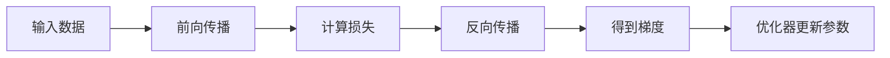
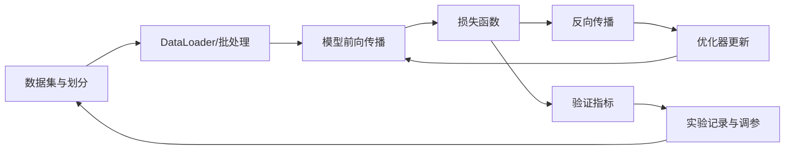
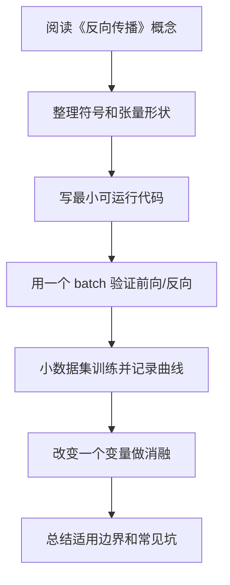

# 04 反向传播

<!-- lecture-notes:integrated-v2 -->

## 讲义导读：从数据到可训练模型

这一章讲的是 **04 反向传播**，属于 **反向传播**。读深度学习时，不要从“这个网络叫什么名字”开始，而要先抓住一条主线：数据进入模型，模型做前向计算，损失函数衡量预测和目标的差距，反向传播计算梯度，优化器更新参数，验证集和错误样本判断它是不是真的学到了规律。

### 一句话先懂

反向传播本质上是链式法则的高效记账：从损失出发，把责任按计算图一路分摊回每个参数。

初学时先问三个问题：输入张量是什么形状，模型把它变成了什么输出，loss 和指标分别在评价什么。只要这三个问题不清楚，后面的公式和代码就很容易变成死记硬背。

### 通俗类比

反向传播像追责表：最终产品不合格，不是只怪最后一道工序，而是沿生产记录计算每个工序对错误贡献了多少。

类比只是帮助入门。真正训练模型时，要把类比落回张量形状、参数、梯度、学习率、正则化、数据划分、指标和错误样本这些可检查对象上。

### 本章学习主线

1. **先看任务和数据**：输入是什么，标签是什么，数据有没有泄漏、偏差、类别不平衡或标注噪声？
2. **再看模型结构**：每一层输入输出形状是什么，参数量是多少，为什么这个结构适合当前数据？
3. **然后看训练信号**：损失函数是否匹配任务，梯度能否稳定传递，优化器和学习率是否合理？
4. **接着看泛化能力**：训练集、验证集、测试集是否分清，过拟合和欠拟合分别从曲线哪里看出来？
5. **最后看复现与诊断**：保存配置、随机种子、版本、指标曲线、checkpoint 和错误样本，而不是只保存一个最终分数。

### 本章重点抓手

计算图、局部梯度、链式法则、自动微分、前向缓存、梯度检查、梯度消失和梯度爆炸。

### 最小实践任务

手写一个小计算图的反向传播，再用 PyTorch autograd 对比每个中间变量的梯度。

建议每次实验都记录：数据版本、预处理、模型结构、超参数、随机种子、训练曲线、验证指标、错误样本和一次改动的理由。深度学习最怕“调参靠感觉”；讲义里的每个结论都应尽量能被一段代码、一张曲线或一组错误样本验证。

### 常见误区

- 只记公式，不画计算图。
- 忘记梯度形状必须和变量形状匹配。
- 原地操作或 detach 导致梯度链断掉。

### 推荐工具

PyTorch/TensorFlow/Keras、NumPy、Jupyter、TensorBoard、Weights & Biases、scikit-learn 指标、Hugging Face Transformers。

### 读完本章应该能做到

- 用自己的话解释本章概念，并能指出它在“数据 -> 模型 -> 损失 -> 梯度 -> 优化 -> 评估”链路中的位置。
- 写出一个最小可运行例子，打印关键张量形状和训练指标。
- 解释至少一个训练失败现象，例如 loss 不降、过拟合、梯度爆炸、指标虚高或预测偏置。
- 给出一个可复现实验记录，而不是只给最终结果。

> 本节是讲义化改写后的阅读入口。后续正文中的公式、结构图、代码和参考资料，都应围绕“可训练链路 + 可诊断证据”来理解。


## 1. 总览

反向传播是训练神经网络的核心算法。它用链式法则高效计算损失函数对每个参数的梯度。

训练流程：



## 2. 计算图

### 2.1 什么是计算图

**是什么：** 把计算过程表示成节点和边的有向图。

**为什么存在：** 反向传播需要知道每个中间变量如何由前面的变量计算出来。

**简单例子：**

```text
x ----*
      |--> z = x * w + b --> y = sigmoid(z) --> L
w ----*
b ----+
```

### 2.2 PyTorch 中的计算图

PyTorch 会在前向计算时动态构建计算图。

**简单例子：**

```python
import torch

w = torch.tensor(2.0, requires_grad=True)
x = torch.tensor(3.0)
y = w * x
loss = y ** 2
loss.backward()
print(w.grad)
```

## 3. 链式法则

### 3.1 基本形式

如果：

```text
y = f(z)
z = g(x)
```

那么：

```text
dy/dx = dy/dz * dz/dx
```

### 3.2 在神经网络中的作用

多层网络是复合函数：

```text
L = L(f3(f2(f1(x))))
```

反向传播从损失开始，逐层向前计算梯度：

```text
dL/df3 -> dL/df2 -> dL/df1 -> dL/d参数
```

## 4. 标准反向传播符号

设第 `l` 层：

```text
z^(l) = W^(l) h^(l-1) + b^(l)
h^(l) = phi(z^(l))
```

其中：

- `h^(0) = x`；
- `W^(l)` 是第 `l` 层权重；
- `b^(l)` 是第 `l` 层偏置；
- `z^(l)` 是激活前值；
- `h^(l)` 是激活后输出。

定义误差项：

```text
delta^(l) = partial L / partial z^(l)
```

输出层：

```text
delta^(L) = partial L / partial z^(L)
```

隐藏层：

```text
delta^(l) = ((W^(l+1))^T delta^(l+1)) odot phi'(z^(l))
```

参数梯度：

```text
partial L / partial W^(l) = delta^(l) (h^(l-1))^T
partial L / partial b^(l) = delta^(l)
```

批量训练时，对 batch 中样本的梯度通常求平均或求和，具体取决于损失函数实现。

## 5. 模块详解

### 5.1 前向缓存

**是什么：** 前向传播时保存中间变量。

**为什么存在：** 反向传播计算梯度时需要这些中间值。

**简单例子：**

```text
ReLU 反向传播需要知道前向时哪些位置大于 0。
```

### 5.2 局部梯度

**是什么：** 当前操作输出对输入的导数。

**例子：**

```text
y = x^2
dy/dx = 2x
```

### 5.3 上游梯度

**是什么：** 损失对当前操作输出的梯度。

**作用：** 与局部梯度相乘，得到损失对当前输入的梯度。

**简单例子：**

```text
dL/dx = dL/dy * dy/dx
```

### 5.4 参数梯度

**是什么：** 损失对可学习参数的导数。

**用途：** 优化器根据参数梯度更新权重。

**简单例子：**

```python
for name, param in model.named_parameters():
    print(name, param.grad.shape)
```

## 6. 一个线性层的反向传播

前向：

```text
Y = XW + b
L = loss(Y)
```

反向中需要计算：

```text
dL/dW
dL/db
dL/dX
```

直观理解：

- `dL/dW` 告诉每个权重如何影响损失；
- `dL/db` 告诉偏置如何影响损失；
- `dL/dX` 把梯度继续传给前一层。

批量矩阵形式：

```text
Y = XW + b
G = partial L / partial Y

partial L / partial W = X^T G
partial L / partial b = sum_batch G
partial L / partial X = G W^T
```

shape 对照：

```text
X: [B, Din]
W: [Din, Dout]
Y: [B, Dout]
G: [B, Dout]
dW: [Din, Dout]
db: [Dout]
dX: [B, Din]
```

## 7. 两层网络推导

网络：

```text
z1 = W1 x + b1
h1 = ReLU(z1)
z2 = W2 h1 + b2
p = softmax(z2)
L = -log p_y
```

softmax + cross entropy 的输出层梯度：

```text
delta2 = p - one_hot(y)
```

第二层参数梯度：

```text
dW2 = delta2 h1^T
db2 = delta2
```

传回隐藏层：

```text
dh1 = W2^T delta2
delta1 = dh1 odot ReLU'(z1)
```

第一层参数梯度：

```text
dW1 = delta1 x^T
db1 = delta1
```

这就是最基本的 MLP 反向传播。深层网络只是重复同样的局部规则。

## 8. 自动微分

现代框架通常不要求手写反向传播，而是使用自动微分。

PyTorch 训练步骤：

```python
pred = model(x)
loss = loss_fn(pred, y)
loss.backward()
optimizer.step()
optimizer.zero_grad()
```

模块职责：

| 模块 | 作用 |
| --- | --- |
| `loss.backward()` | 从 loss 出发计算所有参数梯度 |
| `optimizer.step()` | 用梯度更新参数 |
| `optimizer.zero_grad()` | 清空旧梯度，避免累积 |

## 9. 常见问题

### 9.1 忘记清空梯度

PyTorch 默认梯度会累积。

```python
optimizer.zero_grad()
loss.backward()
optimizer.step()
```

### 9.2 梯度消失

**现象：** 前面层梯度很小，学习变慢。

**常见原因：**

- 网络很深；
- 激活函数饱和；
- 初始化不合适。

### 9.3 梯度爆炸

**现象：** loss 变成 NaN 或剧烈震荡。

**处理方式：**

- 降低学习率；
- 梯度裁剪；
- 检查输入归一化；
- 检查损失函数是否数值稳定。

## 10. 简单例子：观察梯度

```python
import torch
import torch.nn as nn
import torch.nn.functional as F

model = nn.Sequential(nn.Linear(4, 8), nn.ReLU(), nn.Linear(8, 2))
x = torch.randn(3, 4)
y = torch.tensor([0, 1, 0])

logits = model(x)
loss = F.cross_entropy(logits, y)
loss.backward()

for name, p in model.named_parameters():
    print(name, p.grad.norm())
```

这个例子可以帮助你确认每层参数都收到了梯度。

---

## 万字精讲扩展（2026-06-16 更新）
> Last researched: 2026-06-16。本文补充内容以深度学习入门到工程实践为主，版本相关 API 以 PyTorch 官方文档和实际环境为准，论文结论应结合任务、数据和计算预算理解。

### 本章在整套深度学习路线中的位置

《反向传播》不是孤立章节，而是深度学习知识链条中的一个环节。向前看，它依赖数学、机器学习基本概念、数据划分和评估指标；向后看，它会影响模型实现、训练稳定性、泛化能力和项目复现。学习时不要把公式、代码和实验割裂开。一个概念如果不能解释张量形状，通常还没有真正进入代码层面；一个代码片段如果不能解释训练曲线，通常还没有真正进入实验层面。

本章学习完成后，建议至少达到三个标准。第一，能说清核心概念解决的问题和适用边界。第二，能写出最小公式并对应到 PyTorch 张量形状。第三，能设计一个小实验验证它的作用，并能根据训练曲线判断常见失败原因。达到这三个标准后，本章才真正从“看过”变成“可用”。

### 反向传播类笔记的精讲重点

反向传播不是一个神秘算法，而是链式法则在计算图上的系统应用。前向传播保存中间值，损失函数产生标量，反向传播从损失开始，沿计算图反向计算每个中间变量和参数的梯度。自动微分框架会替你管理图和局部导数，但如果你不知道计算图和梯度形状，很难定位梯度为 None、梯度爆炸、原地操作破坏图、detach 误用等问题。

学习反向传播时，最重要的是理解局部梯度和上游梯度的乘法关系。一个线性层、激活函数、softmax、交叉熵、卷积层和归一化层都可以看成计算图节点。每个节点只需要知道本地输入输出关系和上游梯度，就能把梯度传给前面节点。这个模块化思想正是深度学习框架 autograd 的基础。

### 深度学习的学习闭环：公式、代码、实验三者必须互相解释

深度学习最容易学散：一边背线性代数和概率，一边看模型结构图，一边抄训练代码，但三者没有真正连起来。真正能长期使用的学习方式，是把每个概念都放进同一个闭环里：数学表达负责说明对象和变换，代码实现负责说明张量形状和计算顺序，实验记录负责说明这个设计在数据上是否有效。只会公式，容易不知道代码里维度为什么变；只会代码，容易不知道损失为什么下降或不下降；只看结果，容易把偶然的超参数组合误认为通用规律。

建议每学一个主题都做四件事。第一，用自然语言说明它解决什么问题，比如卷积解决局部模式和参数共享，Attention 解决动态依赖建模，正则化解决泛化而不是训练误差本身。第二，写出最小公式，并标出每个符号的形状。第三，用 PyTorch 或 NumPy 写一个最小可运行例子，不追求工程封装，只追求看见输入、输出、损失和梯度。第四，做一个小实验改变关键因素，例如学习率、batch size、初始化、正则强度、模型宽度、数据噪声或序列长度，观察训练曲线变化。

### 训练系统的基本结构



Figure: 深度学习训练闭环，综合 PyTorch 官方教程、Dive into Deep Learning 和 Google Tuning Playbook 整理。

这个闭环说明了一个重要事实：模型性能不是模型结构单独决定的，而是数据、目标、损失、优化、正则化、评估和工程细节共同决定的。很多训练问题看起来像模型问题，实际可能是数据泄漏、标签错误、归一化不一致、学习率不合适、评估指标不匹配或随机种子导致的实验不可复现。因此学习笔记不能只写“某模型更强”，还要写“在什么数据、什么目标、什么计算预算、什么调参策略下更合适”。

### 从形状检查开始理解模型

深度学习代码调试的第一原则是先检查张量形状。线性层通常期望 `[batch, features]`，卷积层通常是 `[batch, channels, height, width]`，RNN 和 Transformer 常见形状可能是 `[batch, seq, hidden]` 或 `[seq, batch, hidden]`，注意力里的 Q、K、V 还会拆成多头维度。很多错误并不是数学错，而是把 batch 维、时间维、通道维、特征维混在一起。

建议在每个模型的 forward 里临时打印或断言关键形状，训练前用一个 batch 跑通前向、损失和反向。先确认 loss 是标量，梯度不是 None，参数会更新，再开始长时间训练。对初学者而言，`overfit one batch` 是非常有效的调试方法：让模型在一个小 batch 上训练到接近零损失，如果做不到，通常说明模型、损失、标签、学习率或梯度链路存在基础问题。

### 实验记录比单次结果更重要

深度学习结果具有随机性，数据划分、初始化、batch 顺序、GPU 算子和混合精度都可能影响数值。PyTorch 官方文档也提醒，完全复现并不总是保证的，但可以通过固定随机种子、记录版本、保存配置、控制数据划分和记录硬件环境来降低不确定性。学习阶段至少应记录：数据集版本、划分方式、模型配置、优化器、学习率计划、batch size、训练轮数、随机种子、评价指标、最好 checkpoint 和训练曲线。

当实验结果变化时，不要只看最终准确率。训练 loss、验证 loss、训练指标、验证指标、梯度范数、学习率曲线、样本预测案例、错误样本分布都能提供线索。训练集很好验证集差，通常指向过拟合、数据分布差异或数据泄漏；训练集也学不好，可能是欠拟合、学习率错误、标签错、模型容量不足或输入预处理错误；loss 出现 NaN，常见原因是学习率过大、数值溢出、非法 log、除零、混合精度缩放问题或梯度爆炸。

### 核心知识点逐条精讲

#### 1. 计算图

在《反向传播》中，`计算图` 应该同时从概念、公式、代码和实验四个层面理解。概念层面要回答它解决什么问题、引入什么假设、和相邻方法有什么差异；公式层面要写出输入、输出、参数和损失之间的关系；代码层面要确认张量形状、广播规则、自动微分路径和数值稳定处理；实验层面要观察它对训练 loss、验证指标、收敛速度、显存占用和泛化能力的影响。

学习 `算法` 或 `模型结构` 时，不要只停留在结构图。结构图通常隐藏了 batch 维、mask、归一化、残差、初始化、学习率和数据预处理等细节，而这些细节经常决定训练是否成功。以 `计算图` 为主题做笔记时，建议固定写五项：适用任务、核心公式、张量形状、最小代码、常见失败现象。这样以后回看时可以直接用于实现和排错。

判断 `计算图` 是否真正掌握，可以用三个问题自测：如果输入维度变化，能否推导输出形状；如果训练曲线异常，能否提出可验证的原因；如果换一个数据集，能否说清哪些假设可能失效。深度学习不是把所有模型都背下来，而是建立一套能解释、能实现、能诊断的工作方式。

#### 2. 链式法则

在《反向传播》中，`链式法则` 应该同时从概念、公式、代码和实验四个层面理解。概念层面要回答它解决什么问题、引入什么假设、和相邻方法有什么差异；公式层面要写出输入、输出、参数和损失之间的关系；代码层面要确认张量形状、广播规则、自动微分路径和数值稳定处理；实验层面要观察它对训练 loss、验证指标、收敛速度、显存占用和泛化能力的影响。

学习 `算法` 或 `模型结构` 时，不要只停留在结构图。结构图通常隐藏了 batch 维、mask、归一化、残差、初始化、学习率和数据预处理等细节，而这些细节经常决定训练是否成功。以 `链式法则` 为主题做笔记时，建议固定写五项：适用任务、核心公式、张量形状、最小代码、常见失败现象。这样以后回看时可以直接用于实现和排错。

判断 `链式法则` 是否真正掌握，可以用三个问题自测：如果输入维度变化，能否推导输出形状；如果训练曲线异常，能否提出可验证的原因；如果换一个数据集，能否说清哪些假设可能失效。深度学习不是把所有模型都背下来，而是建立一套能解释、能实现、能诊断的工作方式。

#### 3. 线性层反传

在《反向传播》中，`线性层反传` 应该同时从概念、公式、代码和实验四个层面理解。概念层面要回答它解决什么问题、引入什么假设、和相邻方法有什么差异；公式层面要写出输入、输出、参数和损失之间的关系；代码层面要确认张量形状、广播规则、自动微分路径和数值稳定处理；实验层面要观察它对训练 loss、验证指标、收敛速度、显存占用和泛化能力的影响。

学习 `算法` 或 `模型结构` 时，不要只停留在结构图。结构图通常隐藏了 batch 维、mask、归一化、残差、初始化、学习率和数据预处理等细节，而这些细节经常决定训练是否成功。以 `线性层反传` 为主题做笔记时，建议固定写五项：适用任务、核心公式、张量形状、最小代码、常见失败现象。这样以后回看时可以直接用于实现和排错。

判断 `线性层反传` 是否真正掌握，可以用三个问题自测：如果输入维度变化，能否推导输出形状；如果训练曲线异常，能否提出可验证的原因；如果换一个数据集，能否说清哪些假设可能失效。深度学习不是把所有模型都背下来，而是建立一套能解释、能实现、能诊断的工作方式。

#### 4. 自动微分

在《反向传播》中，`自动微分` 应该同时从概念、公式、代码和实验四个层面理解。概念层面要回答它解决什么问题、引入什么假设、和相邻方法有什么差异；公式层面要写出输入、输出、参数和损失之间的关系；代码层面要确认张量形状、广播规则、自动微分路径和数值稳定处理；实验层面要观察它对训练 loss、验证指标、收敛速度、显存占用和泛化能力的影响。

学习 `算法` 或 `模型结构` 时，不要只停留在结构图。结构图通常隐藏了 batch 维、mask、归一化、残差、初始化、学习率和数据预处理等细节，而这些细节经常决定训练是否成功。以 `自动微分` 为主题做笔记时，建议固定写五项：适用任务、核心公式、张量形状、最小代码、常见失败现象。这样以后回看时可以直接用于实现和排错。

判断 `自动微分` 是否真正掌握，可以用三个问题自测：如果输入维度变化，能否推导输出形状；如果训练曲线异常，能否提出可验证的原因；如果换一个数据集，能否说清哪些假设可能失效。深度学习不是把所有模型都背下来，而是建立一套能解释、能实现、能诊断的工作方式。

#### 5. 梯度检查

在《反向传播》中，`梯度检查` 应该同时从概念、公式、代码和实验四个层面理解。概念层面要回答它解决什么问题、引入什么假设、和相邻方法有什么差异；公式层面要写出输入、输出、参数和损失之间的关系；代码层面要确认张量形状、广播规则、自动微分路径和数值稳定处理；实验层面要观察它对训练 loss、验证指标、收敛速度、显存占用和泛化能力的影响。

学习 `算法` 或 `模型结构` 时，不要只停留在结构图。结构图通常隐藏了 batch 维、mask、归一化、残差、初始化、学习率和数据预处理等细节，而这些细节经常决定训练是否成功。以 `梯度检查` 为主题做笔记时，建议固定写五项：适用任务、核心公式、张量形状、最小代码、常见失败现象。这样以后回看时可以直接用于实现和排错。

判断 `梯度检查` 是否真正掌握，可以用三个问题自测：如果输入维度变化，能否推导输出形状；如果训练曲线异常，能否提出可验证的原因；如果换一个数据集，能否说清哪些假设可能失效。深度学习不是把所有模型都背下来，而是建立一套能解释、能实现、能诊断的工作方式。


### 场景化学习与排错表

| 主题 | 推荐学习动作 | 常见风险 | 验证方式 |
| :--- | :--- | :--- | :--- |
| 计算图 | 写清概念、公式、张量形状、最小代码和实验现象 | 只背名称或只复制代码 | 形状断言、one-batch overfit、训练/验证曲线、消融实验 |
| 链式法则 | 写清概念、公式、张量形状、最小代码和实验现象 | 只背名称或只复制代码 | 形状断言、one-batch overfit、训练/验证曲线、消融实验 |
| 线性层反传 | 写清概念、公式、张量形状、最小代码和实验现象 | 只背名称或只复制代码 | 形状断言、one-batch overfit、训练/验证曲线、消融实验 |
| 自动微分 | 写清概念、公式、张量形状、最小代码和实验现象 | 只背名称或只复制代码 | 形状断言、one-batch overfit、训练/验证曲线、消融实验 |
| 梯度检查 | 写清概念、公式、张量形状、最小代码和实验现象 | 只背名称或只复制代码 | 形状断言、one-batch overfit、训练/验证曲线、消融实验 |

这个表的目的不是把所有知识点变成同一种解释，而是强迫每个主题都落到可验证行为。深度学习中很多错误不会直接报错，而是表现为指标不涨、收敛很慢、验证集波动、显存异常、loss NaN 或结果不可复现。只有把概念和实验记录绑定，才能区分“理论没懂”“代码写错”“数据有问题”和“超参数不合适”。

### 本章建议工作流



Figure: 《反向传播》学习工作流，综合 Deep Learning Book、Dive into Deep Learning、PyTorch 官方教程和 Google Tuning Playbook 整理。

这个流程强调“小步可验证”。先让一个最小例子跑通，再逐渐增加模型复杂度、数据规模和训练技巧。不要在还没确认数据和标签正确时就调优化器，也不要在一个 batch 都无法过拟合时讨论复杂正则化。深度学习工程中，很多高阶问题都要先排除基础错误。

### 常见误区和纠正方法

- 误区：只背公式，不检查张量形状。纠正：每个公式都写出 batch 维、特征维、通道维或序列维，并在代码里用断言验证。
- 误区：训练失败后马上换复杂模型。纠正：先检查数据、标签、loss、学习率、梯度和 one-batch overfit，再讨论模型容量。
- 误区：把验证集当测试集反复调参。纠正：验证集用于选择模型和超参数，最终测试集应尽量只用于最后评估。
- 误区：只看最终准确率。纠正：同时看训练/验证 loss、混淆矩阵、错误样本、随机种子波动、计算成本和推理延迟。
- 误区：盲目复制论文配置。纠正：论文配置依赖数据规模、模型规模、硬件和训练预算，迁移到小数据集时需要重新验证。

### 与相邻章节的关系

《反向传播》应和其他章节交叉使用。数学章节提供符号和梯度基础，机器学习章节提供任务与评估框架，神经网络和反向传播章节解释可微训练机制，优化和正则化章节解释为什么模型能收敛并泛化，CNN/RNN/Transformer 章节提供结构归纳偏置，训练实践章节负责把所有内容变成可复现实验。每当某一章出现疑问，都应回到这个链条中寻找缺失环节。

### 实操训练和复盘模板

1. 围绕 `计算图` 写一个最小实验：固定数据和模型，只改变一个变量，记录训练 loss、验证指标和异常现象。
2. 围绕 `链式法则` 写一个最小实验：固定数据和模型，只改变一个变量，记录训练 loss、验证指标和异常现象。
3. 围绕 `线性层反传` 写一个最小实验：固定数据和模型，只改变一个变量，记录训练 loss、验证指标和异常现象。
4. 围绕 `自动微分` 写一个最小实验：固定数据和模型，只改变一个变量，记录训练 loss、验证指标和异常现象。
5. 围绕 `梯度检查` 写一个最小实验：固定数据和模型，只改变一个变量，记录训练 loss、验证指标和异常现象。

建议每次实验都记录如下信息：

```text
实验名称：
本章主题：反向传播
数据集版本与划分：
模型结构和关键超参数：
输入输出张量形状：
损失函数与评估指标：
优化器、学习率、batch size、训练轮数：
随机种子和运行环境：
训练曲线观察：
最好结果与失败结果：
结论和下一步：
```

复盘的关键是把“结果好/不好”拆成证据。比如验证集差，要说明训练集是否已拟合、数据增强是否一致、类别是否不平衡、指标是否适合任务；loss NaN，要说明在哪个 step 出现、梯度范数是否异常、输入是否有非法值、混合精度是否开启。这样的记录会比单独保存一张结果截图有用得多。

## 参考资料与延伸阅读

- [Book / Official] Deep Learning, Ian Goodfellow, Yoshua Bengio, Aaron Courville: https://www.deeplearningbook.org/
- [Book / Official] Dive into Deep Learning: https://d2l.ai/
- [Framework / Official] PyTorch Tutorials: https://docs.pytorch.org/tutorials/
- [Framework / Official] PyTorch Autograd Mechanics: https://docs.pytorch.org/docs/stable/notes/autograd.html
- [Framework / Official] PyTorch Reproducibility: https://docs.pytorch.org/docs/stable/notes/randomness.html
- [Framework / Official] PyTorch Automatic Mixed Precision: https://docs.pytorch.org/docs/stable/amp.html
- [Course / Stanford] CS231n Convolutional Neural Networks for Visual Recognition: https://cs231n.github.io/
- [Course / Stanford] CS224n Natural Language Processing with Deep Learning: https://web.stanford.edu/class/cs224n/
- [Paper] Adam: A Method for Stochastic Optimization: https://arxiv.org/abs/1412.6980
- [Paper] Decoupled Weight Decay Regularization / AdamW: https://arxiv.org/abs/1711.05101
- [Paper] Dropout: A Simple Way to Prevent Neural Networks from Overfitting: https://jmlr.org/papers/v15/srivastava14a.html
- [Paper] Batch Normalization: Accelerating Deep Network Training by Reducing Internal Covariate Shift: https://arxiv.org/abs/1502.03167
- [Paper] Attention Is All You Need: https://arxiv.org/abs/1706.03762
- [Paper] Layer Normalization: https://arxiv.org/abs/1607.06450
- [Paper] Deep Residual Learning for Image Recognition: https://arxiv.org/abs/1512.03385
- [Paper] ImageNet Classification with Deep Convolutional Neural Networks: https://papers.nips.cc/paper/4824-imagenet-classification-with-deep-convolutional-neural-networks
- [Paper] Long Short-Term Memory: https://www.bioinf.jku.at/publications/older/2604.pdf
- [Paper] Sequence to Sequence Learning with Neural Networks: https://arxiv.org/abs/1409.3215
- [Practice / Official] Google Deep Learning Tuning Playbook: https://github.com/google-research/tuning_playbook
- [Library / Official] scikit-learn Model Evaluation: https://scikit-learn.org/stable/modules/model_evaluation.html
- [Community / CSDN] 深度学习基础与实践相关笔记检索入口: https://so.csdn.net/so/search?q=%E6%B7%B1%E5%BA%A6%E5%AD%A6%E4%B9%A0%20%E5%AD%A6%E4%B9%A0%E7%AC%94%E8%AE%B0
- [Community / 博客园] 深度学习与反向传播实践笔记检索入口: https://zzk.cnblogs.com/s/blogpost?Keywords=%E6%B7%B1%E5%BA%A6%E5%AD%A6%E4%B9%A0%20%E5%8F%8D%E5%90%91%E4%BC%A0%E6%92%AD
- [Community / 掘金] Transformer 原理与实践文章检索入口: https://juejin.cn/search?query=Transformer%20%E5%8E%9F%E7%90%86&type=0

## 2026 深度学习资料与工程核对补充

这一组笔记建议按“理论教材 + 框架文档 + 可复现实验”三层学习。

- **理论教材**：Deep Learning Book 适合补数学和概念框架；Dive into Deep Learning 适合把公式、代码和实验连起来。
- **框架实现**：PyTorch、TensorFlow 和 Keras 的官方文档用于核对张量 API、自动微分、训练循环、模型保存和部署接口。
- **预训练模型**：Transformer、LLM、视觉模型相关内容优先查 Hugging Face Transformers 和对应论文/模型卡，重点核对 tokenizer、输入截断、mask、评估集和许可证。
- **评估规范**：分类、回归、序列任务和生成任务要区分训练损失与业务指标；必要时用 scikit-learn 指标或任务官方评测脚本复核。
- **实验要求**：理论用 Deep Learning Book 和 D2L 打底，工程实现优先查 PyTorch、TensorFlow/Keras 和 Hugging Face 官方文档。 每个结论最好配一段可运行代码、一条训练曲线或一个错误样本分析。

通俗地说，教材负责解释“为什么这样学”，框架文档负责说明“代码到底怎么写”，实验记录负责证明“这次真的有效”。不要只看模型名字和排行榜；能复现、能诊断、能解释失败，才算真正掌握。

参考资料：

- Deep Learning Book：https://www.deeplearningbook.org/
- Dive into Deep Learning：https://d2l.ai/
- PyTorch Documentation：https://docs.pytorch.org/docs/stable/index.html
- TensorFlow Learn：https://www.tensorflow.org/learn
- Keras Documentation：https://keras.io/
- Hugging Face Transformers：https://huggingface.co/docs/transformers/en/index
- scikit-learn Model Selection and Evaluation：https://scikit-learn.org/stable/model_selection.html
- Papers with Code：https://paperswithcode.com/
