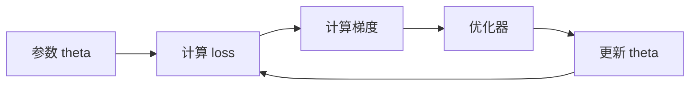
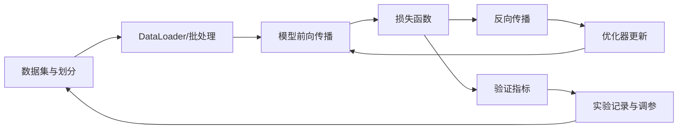
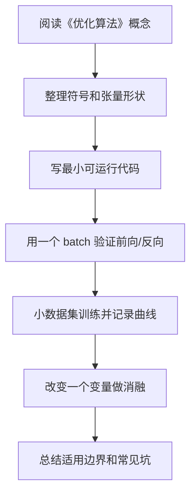

# 05 优化算法

<!-- lecture-notes:integrated-v2 -->

## 讲义导读：从数据到可训练模型

这一章讲的是 **05 优化算法**，属于 **优化算法**。读深度学习时，不要从“这个网络叫什么名字”开始，而要先抓住一条主线：数据进入模型，模型做前向计算，损失函数衡量预测和目标的差距，反向传播计算梯度，优化器更新参数，验证集和错误样本判断它是不是真的学到了规律。

### 一句话先懂

优化算法决定参数怎样沿着损失地形移动：SGD、Momentum、Adam 等方法都是在速度、稳定性和泛化之间取舍。

初学时先问三个问题：输入张量是什么形状，模型把它变成了什么输出，loss 和指标分别在评价什么。只要这三个问题不清楚，后面的公式和代码就很容易变成死记硬背。

### 通俗类比

训练像下山找低谷：学习率是步子大小，动量像带惯性的小车，Adam 像给不同方向自动调步长。

类比只是帮助入门。真正训练模型时，要把类比落回张量形状、参数、梯度、学习率、正则化、数据划分、指标和错误样本这些可检查对象上。

### 本章学习主线

1. **先看任务和数据**：输入是什么，标签是什么，数据有没有泄漏、偏差、类别不平衡或标注噪声？
2. **再看模型结构**：每一层输入输出形状是什么，参数量是多少，为什么这个结构适合当前数据？
3. **然后看训练信号**：损失函数是否匹配任务，梯度能否稳定传递，优化器和学习率是否合理？
4. **接着看泛化能力**：训练集、验证集、测试集是否分清，过拟合和欠拟合分别从曲线哪里看出来？
5. **最后看复现与诊断**：保存配置、随机种子、版本、指标曲线、checkpoint 和错误样本，而不是只保存一个最终分数。

### 本章重点抓手

学习率、批量大小、SGD、Momentum、RMSProp、Adam/AdamW、学习率调度、梯度裁剪和收敛诊断。

### 最小实践任务

固定模型和数据，只改变优化器、学习率和 batch size，画出训练/验证曲线并解释差异。

建议每次实验都记录：数据版本、预处理、模型结构、超参数、随机种子、训练曲线、验证指标、错误样本和一次改动的理由。深度学习最怕“调参靠感觉”；讲义里的每个结论都应尽量能被一段代码、一张曲线或一组错误样本验证。

### 常见误区

- loss 不降就盲目换模型。
- 学习率过大震荡、过小停滞却没有检查。
- 只追求训练 loss 最低，忽略泛化。

### 推荐工具

PyTorch/TensorFlow/Keras、NumPy、Jupyter、TensorBoard、Weights & Biases、scikit-learn 指标、Hugging Face Transformers。

### 读完本章应该能做到

- 用自己的话解释本章概念，并能指出它在“数据 -> 模型 -> 损失 -> 梯度 -> 优化 -> 评估”链路中的位置。
- 写出一个最小可运行例子，打印关键张量形状和训练指标。
- 解释至少一个训练失败现象，例如 loss 不降、过拟合、梯度爆炸、指标虚高或预测偏置。
- 给出一个可复现实验记录，而不是只给最终结果。

> 本节是讲义化改写后的阅读入口。后续正文中的公式、结构图、代码和参考资料，都应围绕“可训练链路 + 可诊断证据”来理解。


## 1. 总览

优化算法解决的问题是：如何根据梯度更新参数，让损失函数下降。



## 2. 梯度下降

### 2.1 基本形式

```text
theta = theta - learning_rate * gradient
```

标准记号：

```text
theta_{t+1} = theta_t - eta * grad_theta L(theta_t)
```

其中：

- `theta_t` 是第 `t` 步参数；
- `eta` 是学习率；
- `grad_theta L` 是损失对参数的梯度。

**模块职责：**

- `theta`：模型参数；
- `gradient`：损失对参数的导数；
- `learning_rate`：每次更新步长。

**简单例子：**

```python
w = 3.0
lr = 0.1
grad = 2 * w
w = w - lr * grad
```

### 2.2 学习率

学习率是最重要的超参数之一。

| 学习率 | 常见现象 |
| --- | --- |
| 太大 | loss 震荡、发散、NaN |
| 太小 | 收敛很慢、卡住 |
| 合理 | loss 稳定下降 |

## 3. Batch、Mini-batch、SGD

| 方法 | 特点 |
| --- | --- |
| Batch Gradient Descent | 每次用全部数据，稳定但慢 |
| Stochastic Gradient Descent | 每次用一个样本，噪声大 |
| Mini-batch SGD | 每次用一小批样本，最常用 |

深度学习中通常说 SGD，是指 mini-batch 形式。

## 4. Momentum

### 4.1 什么是 Momentum

Momentum 引入“速度”概念，让更新方向不只看当前梯度，也参考过去梯度。

**为什么存在：**

- 减少震荡；
- 加速一致方向的更新；
- 帮助穿过浅谷。

**简单例子：**

```text
v = beta * v + grad
theta = theta - lr * v
```

更常见写法：

```text
v_t = beta v_{t-1} + (1 - beta) g_t
theta_{t+1} = theta_t - eta v_t
```

也有实现不带 `(1-beta)`，不同资料形式略有差异，本质都是用历史梯度的指数移动平均平滑更新方向。

### 4.2 PyTorch 示例

```python
optimizer = torch.optim.SGD(
    model.parameters(),
    lr=0.01,
    momentum=0.9
)
```

## 5. AdaGrad

**是什么：** 根据历史梯度平方和调整每个参数的学习率。

**优点：** 稀疏特征任务中有用。

**缺点：** 学习率可能不断衰减，后期更新过小。

公式：

```text
s_t = s_{t-1} + g_t^2
theta_{t+1} = theta_t - eta * g_t / sqrt(s_t + epsilon)
```

其中平方和开方都是逐元素操作。

## 6. RMSProp

**是什么：** 使用梯度平方的指数移动平均，缓解 AdaGrad 学习率过快衰减。

**简单形式：**

```text
s = beta * s + (1 - beta) * grad^2
theta = theta - lr * grad / sqrt(s + eps)
```

RMSProp 可以看作 AdaGrad 的改进：它不累计全部历史平方梯度，而是使用指数移动平均，让旧梯度影响逐渐衰减。

## 7. Adam

Adam 同时使用一阶矩估计和二阶矩估计，是深度学习中非常常用的优化器。

**模块职责：**

- 一阶矩：类似 Momentum，估计梯度方向；
- 二阶矩：估计梯度平方，调节每个参数步长；
- bias correction：修正初期估计偏差。

**PyTorch 示例：**

```python
optimizer = torch.optim.Adam(
    model.parameters(),
    lr=1e-3,
    weight_decay=1e-4
)
```

完整公式：

```text
g_t = grad_theta L(theta_t)
m_t = beta1 m_{t-1} + (1 - beta1) g_t
v_t = beta2 v_{t-1} + (1 - beta2) g_t^2
m_hat_t = m_t / (1 - beta1^t)
v_hat_t = v_t / (1 - beta2^t)
theta_{t+1} = theta_t - eta * m_hat_t / (sqrt(v_hat_t) + epsilon)
```

直观理解：

- `m_t` 是带动量的平均梯度；
- `v_t` 是梯度平方的平均尺度；
- 参数更新会自动按梯度尺度做归一化。

## 8. AdamW

AdamW 是 Adam 的常用变体，重点是把 weight decay 从梯度更新中解耦。

直观区别：

```text
Adam + L2: 正则项混入梯度，被自适应学习率缩放
AdamW: 先按 Adam 更新，再单独衰减权重
```

常见更新可理解为：

```text
theta = theta - eta * adam_update - eta * weight_decay * theta
```

Transformer、预训练模型微调中常用 AdamW。

PyTorch 示例：

```python
optimizer = torch.optim.AdamW(
    model.parameters(),
    lr=3e-4,
    weight_decay=0.01
)
```

## 9. 学习率调度

学习率不一定固定。常见策略：

| 策略 | 含义 |
| --- | --- |
| Step decay | 每隔若干 epoch 降低 |
| Cosine decay | 按余弦曲线下降 |
| Warmup | 训练初期逐步增大学习率 |
| Reduce on plateau | 验证指标停滞时降低 |

**简单例子：**

```python
scheduler = torch.optim.lr_scheduler.CosineAnnealingLR(
    optimizer,
    T_max=100
)
```

### 9.1 Warmup

Warmup 在训练初期逐渐增大学习率：

```text
eta_t = eta_max * t / warmup_steps
```

适合大模型、Transformer、较大 batch 的训练。初期参数和梯度不稳定，直接用大学习率容易发散。

### 9.2 Cosine Decay

余弦衰减常见形式：

```text
eta_t = eta_min + 1/2 * (eta_max - eta_min) * (1 + cos(pi * t / T))
```

训练初期学习率较大，后期平滑降低。

## 10. 梯度裁剪

**是什么：** 当梯度范数过大时缩放梯度，防止更新过猛。

常见形式：

```text
if ||g|| > c:
    g = c * g / ||g||
```

PyTorch 示例：

```python
torch.nn.utils.clip_grad_norm_(model.parameters(), max_norm=1.0)
```

常用于 RNN、Transformer 或训练不稳定的深层网络。

## 11. 优化器选择建议

| 场景 | 常用选择 |
| --- | --- |
| 默认起步 | Adam / AdamW |
| 视觉分类经典训练 | SGD + Momentum |
| Transformer | AdamW + Warmup |
| 小数据微调 | AdamW + 较小学习率 |

## 12. 常见训练现象和优化判断

| 现象 | 可能原因 | 优先操作 |
| --- | --- | --- |
| loss 直接 NaN | 学习率太大、输入异常、数值溢出 | 降低学习率、检查数据、梯度裁剪 |
| loss 不下降 | 学习率太小/太大、模型没梯度、标签错 | 小数据过拟合测试、检查梯度 |
| 训练震荡大 | batch 太小、学习率偏大 | 降低学习率、增大 batch、加动量 |
| 训练慢 | 学习率太小、模型过大、数据瓶颈 | 调 lr、检查 DataLoader |
| 验证集变差 | 过拟合 | 正则化、数据增强、早停 |

## 13. 常见误区

- 训练不收敛只改模型，不先检查学习率。
- 忘记 `optimizer.zero_grad()`。
- weight decay 和 L2 regularization 的实现差异不理解。
- batch size 改变后不重新考虑学习率。
- 只看训练 loss，不看验证指标。

---

## 万字精讲扩展（2026-06-16 更新）
> Last researched: 2026-06-16。本文补充内容以深度学习入门到工程实践为主，版本相关 API 以 PyTorch 官方文档和实际环境为准，论文结论应结合任务、数据和计算预算理解。

### 本章在整套深度学习路线中的位置

《优化算法》不是孤立章节，而是深度学习知识链条中的一个环节。向前看，它依赖数学、机器学习基本概念、数据划分和评估指标；向后看，它会影响模型实现、训练稳定性、泛化能力和项目复现。学习时不要把公式、代码和实验割裂开。一个概念如果不能解释张量形状，通常还没有真正进入代码层面；一个代码片段如果不能解释训练曲线，通常还没有真正进入实验层面。

本章学习完成后，建议至少达到三个标准。第一，能说清核心概念解决的问题和适用边界。第二，能写出最小公式并对应到 PyTorch 张量形状。第三，能设计一个小实验验证它的作用，并能根据训练曲线判断常见失败原因。达到这三个标准后，本章才真正从“看过”变成“可用”。

### 优化类笔记的精讲重点

深度学习优化通常不是寻找严格全局最优，而是在高维非凸空间中找到泛化效果足够好的参数区域。SGD 的噪声有时有助于逃离尖锐区域，Momentum 利用历史方向减少震荡，AdaGrad/RMSProp/Adam 使用自适应学习率处理不同参数尺度，AdamW 把权重衰减从 Adam 的梯度更新中解耦，常用于 Transformer 等模型。优化器选择不能脱离模型结构、batch size、学习率计划和正则化策略。

学习率通常是最敏感的超参数。太大学不稳甚至 NaN，太小收敛慢或停在差区域。实际训练中，warmup、cosine decay、step decay、ReduceLROnPlateau 和学习率搜索都很常见。Google Tuning Playbook 强调先建立可靠基线和搜索空间，再系统调参，而不是随机改一堆参数后只记最后最好结果。

### 深度学习的学习闭环：公式、代码、实验三者必须互相解释

深度学习最容易学散：一边背线性代数和概率，一边看模型结构图，一边抄训练代码，但三者没有真正连起来。真正能长期使用的学习方式，是把每个概念都放进同一个闭环里：数学表达负责说明对象和变换，代码实现负责说明张量形状和计算顺序，实验记录负责说明这个设计在数据上是否有效。只会公式，容易不知道代码里维度为什么变；只会代码，容易不知道损失为什么下降或不下降；只看结果，容易把偶然的超参数组合误认为通用规律。

建议每学一个主题都做四件事。第一，用自然语言说明它解决什么问题，比如卷积解决局部模式和参数共享，Attention 解决动态依赖建模，正则化解决泛化而不是训练误差本身。第二，写出最小公式，并标出每个符号的形状。第三，用 PyTorch 或 NumPy 写一个最小可运行例子，不追求工程封装，只追求看见输入、输出、损失和梯度。第四，做一个小实验改变关键因素，例如学习率、batch size、初始化、正则强度、模型宽度、数据噪声或序列长度，观察训练曲线变化。

### 训练系统的基本结构



Figure: 深度学习训练闭环，综合 PyTorch 官方教程、Dive into Deep Learning 和 Google Tuning Playbook 整理。

这个闭环说明了一个重要事实：模型性能不是模型结构单独决定的，而是数据、目标、损失、优化、正则化、评估和工程细节共同决定的。很多训练问题看起来像模型问题，实际可能是数据泄漏、标签错误、归一化不一致、学习率不合适、评估指标不匹配或随机种子导致的实验不可复现。因此学习笔记不能只写“某模型更强”，还要写“在什么数据、什么目标、什么计算预算、什么调参策略下更合适”。

### 从形状检查开始理解模型

深度学习代码调试的第一原则是先检查张量形状。线性层通常期望 `[batch, features]`，卷积层通常是 `[batch, channels, height, width]`，RNN 和 Transformer 常见形状可能是 `[batch, seq, hidden]` 或 `[seq, batch, hidden]`，注意力里的 Q、K、V 还会拆成多头维度。很多错误并不是数学错，而是把 batch 维、时间维、通道维、特征维混在一起。

建议在每个模型的 forward 里临时打印或断言关键形状，训练前用一个 batch 跑通前向、损失和反向。先确认 loss 是标量，梯度不是 None，参数会更新，再开始长时间训练。对初学者而言，`overfit one batch` 是非常有效的调试方法：让模型在一个小 batch 上训练到接近零损失，如果做不到，通常说明模型、损失、标签、学习率或梯度链路存在基础问题。

### 实验记录比单次结果更重要

深度学习结果具有随机性，数据划分、初始化、batch 顺序、GPU 算子和混合精度都可能影响数值。PyTorch 官方文档也提醒，完全复现并不总是保证的，但可以通过固定随机种子、记录版本、保存配置、控制数据划分和记录硬件环境来降低不确定性。学习阶段至少应记录：数据集版本、划分方式、模型配置、优化器、学习率计划、batch size、训练轮数、随机种子、评价指标、最好 checkpoint 和训练曲线。

当实验结果变化时，不要只看最终准确率。训练 loss、验证 loss、训练指标、验证指标、梯度范数、学习率曲线、样本预测案例、错误样本分布都能提供线索。训练集很好验证集差，通常指向过拟合、数据分布差异或数据泄漏；训练集也学不好，可能是欠拟合、学习率错误、标签错、模型容量不足或输入预处理错误；loss 出现 NaN，常见原因是学习率过大、数值溢出、非法 log、除零、混合精度缩放问题或梯度爆炸。

### 核心知识点逐条精讲

#### 1. SGD 与 Mini-batch

在《优化算法》中，`SGD 与 Mini-batch` 应该同时从概念、公式、代码和实验四个层面理解。概念层面要回答它解决什么问题、引入什么假设、和相邻方法有什么差异；公式层面要写出输入、输出、参数和损失之间的关系；代码层面要确认张量形状、广播规则、自动微分路径和数值稳定处理；实验层面要观察它对训练 loss、验证指标、收敛速度、显存占用和泛化能力的影响。

学习 `算法` 或 `模型结构` 时，不要只停留在结构图。结构图通常隐藏了 batch 维、mask、归一化、残差、初始化、学习率和数据预处理等细节，而这些细节经常决定训练是否成功。以 `SGD 与 Mini-batch` 为主题做笔记时，建议固定写五项：适用任务、核心公式、张量形状、最小代码、常见失败现象。这样以后回看时可以直接用于实现和排错。

判断 `SGD 与 Mini-batch` 是否真正掌握，可以用三个问题自测：如果输入维度变化，能否推导输出形状；如果训练曲线异常，能否提出可验证的原因；如果换一个数据集，能否说清哪些假设可能失效。深度学习不是把所有模型都背下来，而是建立一套能解释、能实现、能诊断的工作方式。

#### 2. Momentum

在《优化算法》中，`Momentum` 应该同时从概念、公式、代码和实验四个层面理解。概念层面要回答它解决什么问题、引入什么假设、和相邻方法有什么差异；公式层面要写出输入、输出、参数和损失之间的关系；代码层面要确认张量形状、广播规则、自动微分路径和数值稳定处理；实验层面要观察它对训练 loss、验证指标、收敛速度、显存占用和泛化能力的影响。

学习 `算法` 或 `模型结构` 时，不要只停留在结构图。结构图通常隐藏了 batch 维、mask、归一化、残差、初始化、学习率和数据预处理等细节，而这些细节经常决定训练是否成功。以 `Momentum` 为主题做笔记时，建议固定写五项：适用任务、核心公式、张量形状、最小代码、常见失败现象。这样以后回看时可以直接用于实现和排错。

判断 `Momentum` 是否真正掌握，可以用三个问题自测：如果输入维度变化，能否推导输出形状；如果训练曲线异常，能否提出可验证的原因；如果换一个数据集，能否说清哪些假设可能失效。深度学习不是把所有模型都背下来，而是建立一套能解释、能实现、能诊断的工作方式。

#### 3. Adam

在《优化算法》中，`Adam` 应该同时从概念、公式、代码和实验四个层面理解。概念层面要回答它解决什么问题、引入什么假设、和相邻方法有什么差异；公式层面要写出输入、输出、参数和损失之间的关系；代码层面要确认张量形状、广播规则、自动微分路径和数值稳定处理；实验层面要观察它对训练 loss、验证指标、收敛速度、显存占用和泛化能力的影响。

学习 `算法` 或 `模型结构` 时，不要只停留在结构图。结构图通常隐藏了 batch 维、mask、归一化、残差、初始化、学习率和数据预处理等细节，而这些细节经常决定训练是否成功。以 `Adam` 为主题做笔记时，建议固定写五项：适用任务、核心公式、张量形状、最小代码、常见失败现象。这样以后回看时可以直接用于实现和排错。

判断 `Adam` 是否真正掌握，可以用三个问题自测：如果输入维度变化，能否推导输出形状；如果训练曲线异常，能否提出可验证的原因；如果换一个数据集，能否说清哪些假设可能失效。深度学习不是把所有模型都背下来，而是建立一套能解释、能实现、能诊断的工作方式。

#### 4. AdamW

在《优化算法》中，`AdamW` 应该同时从概念、公式、代码和实验四个层面理解。概念层面要回答它解决什么问题、引入什么假设、和相邻方法有什么差异；公式层面要写出输入、输出、参数和损失之间的关系；代码层面要确认张量形状、广播规则、自动微分路径和数值稳定处理；实验层面要观察它对训练 loss、验证指标、收敛速度、显存占用和泛化能力的影响。

学习 `算法` 或 `模型结构` 时，不要只停留在结构图。结构图通常隐藏了 batch 维、mask、归一化、残差、初始化、学习率和数据预处理等细节，而这些细节经常决定训练是否成功。以 `AdamW` 为主题做笔记时，建议固定写五项：适用任务、核心公式、张量形状、最小代码、常见失败现象。这样以后回看时可以直接用于实现和排错。

判断 `AdamW` 是否真正掌握，可以用三个问题自测：如果输入维度变化，能否推导输出形状；如果训练曲线异常，能否提出可验证的原因；如果换一个数据集，能否说清哪些假设可能失效。深度学习不是把所有模型都背下来，而是建立一套能解释、能实现、能诊断的工作方式。

#### 5. 学习率调度和梯度裁剪

在《优化算法》中，`学习率调度和梯度裁剪` 应该同时从概念、公式、代码和实验四个层面理解。概念层面要回答它解决什么问题、引入什么假设、和相邻方法有什么差异；公式层面要写出输入、输出、参数和损失之间的关系；代码层面要确认张量形状、广播规则、自动微分路径和数值稳定处理；实验层面要观察它对训练 loss、验证指标、收敛速度、显存占用和泛化能力的影响。

学习 `算法` 或 `模型结构` 时，不要只停留在结构图。结构图通常隐藏了 batch 维、mask、归一化、残差、初始化、学习率和数据预处理等细节，而这些细节经常决定训练是否成功。以 `学习率调度和梯度裁剪` 为主题做笔记时，建议固定写五项：适用任务、核心公式、张量形状、最小代码、常见失败现象。这样以后回看时可以直接用于实现和排错。

判断 `学习率调度和梯度裁剪` 是否真正掌握，可以用三个问题自测：如果输入维度变化，能否推导输出形状；如果训练曲线异常，能否提出可验证的原因；如果换一个数据集，能否说清哪些假设可能失效。深度学习不是把所有模型都背下来，而是建立一套能解释、能实现、能诊断的工作方式。


### 场景化学习与排错表

| 主题 | 推荐学习动作 | 常见风险 | 验证方式 |
| :--- | :--- | :--- | :--- |
| SGD 与 Mini-batch | 写清概念、公式、张量形状、最小代码和实验现象 | 只背名称或只复制代码 | 形状断言、one-batch overfit、训练/验证曲线、消融实验 |
| Momentum | 写清概念、公式、张量形状、最小代码和实验现象 | 只背名称或只复制代码 | 形状断言、one-batch overfit、训练/验证曲线、消融实验 |
| Adam | 写清概念、公式、张量形状、最小代码和实验现象 | 只背名称或只复制代码 | 形状断言、one-batch overfit、训练/验证曲线、消融实验 |
| AdamW | 写清概念、公式、张量形状、最小代码和实验现象 | 只背名称或只复制代码 | 形状断言、one-batch overfit、训练/验证曲线、消融实验 |
| 学习率调度和梯度裁剪 | 写清概念、公式、张量形状、最小代码和实验现象 | 只背名称或只复制代码 | 形状断言、one-batch overfit、训练/验证曲线、消融实验 |

这个表的目的不是把所有知识点变成同一种解释，而是强迫每个主题都落到可验证行为。深度学习中很多错误不会直接报错，而是表现为指标不涨、收敛很慢、验证集波动、显存异常、loss NaN 或结果不可复现。只有把概念和实验记录绑定，才能区分“理论没懂”“代码写错”“数据有问题”和“超参数不合适”。

### 本章建议工作流



Figure: 《优化算法》学习工作流，综合 Deep Learning Book、Dive into Deep Learning、PyTorch 官方教程和 Google Tuning Playbook 整理。

这个流程强调“小步可验证”。先让一个最小例子跑通，再逐渐增加模型复杂度、数据规模和训练技巧。不要在还没确认数据和标签正确时就调优化器，也不要在一个 batch 都无法过拟合时讨论复杂正则化。深度学习工程中，很多高阶问题都要先排除基础错误。

### 常见误区和纠正方法

- 误区：只背公式，不检查张量形状。纠正：每个公式都写出 batch 维、特征维、通道维或序列维，并在代码里用断言验证。
- 误区：训练失败后马上换复杂模型。纠正：先检查数据、标签、loss、学习率、梯度和 one-batch overfit，再讨论模型容量。
- 误区：把验证集当测试集反复调参。纠正：验证集用于选择模型和超参数，最终测试集应尽量只用于最后评估。
- 误区：只看最终准确率。纠正：同时看训练/验证 loss、混淆矩阵、错误样本、随机种子波动、计算成本和推理延迟。
- 误区：盲目复制论文配置。纠正：论文配置依赖数据规模、模型规模、硬件和训练预算，迁移到小数据集时需要重新验证。

### 与相邻章节的关系

《优化算法》应和其他章节交叉使用。数学章节提供符号和梯度基础，机器学习章节提供任务与评估框架，神经网络和反向传播章节解释可微训练机制，优化和正则化章节解释为什么模型能收敛并泛化，CNN/RNN/Transformer 章节提供结构归纳偏置，训练实践章节负责把所有内容变成可复现实验。每当某一章出现疑问，都应回到这个链条中寻找缺失环节。

### 实操训练和复盘模板

1. 围绕 `SGD 与 Mini-batch` 写一个最小实验：固定数据和模型，只改变一个变量，记录训练 loss、验证指标和异常现象。
2. 围绕 `Momentum` 写一个最小实验：固定数据和模型，只改变一个变量，记录训练 loss、验证指标和异常现象。
3. 围绕 `Adam` 写一个最小实验：固定数据和模型，只改变一个变量，记录训练 loss、验证指标和异常现象。
4. 围绕 `AdamW` 写一个最小实验：固定数据和模型，只改变一个变量，记录训练 loss、验证指标和异常现象。
5. 围绕 `学习率调度和梯度裁剪` 写一个最小实验：固定数据和模型，只改变一个变量，记录训练 loss、验证指标和异常现象。

建议每次实验都记录如下信息：

```text
实验名称：
本章主题：优化算法
数据集版本与划分：
模型结构和关键超参数：
输入输出张量形状：
损失函数与评估指标：
优化器、学习率、batch size、训练轮数：
随机种子和运行环境：
训练曲线观察：
最好结果与失败结果：
结论和下一步：
```

复盘的关键是把“结果好/不好”拆成证据。比如验证集差，要说明训练集是否已拟合、数据增强是否一致、类别是否不平衡、指标是否适合任务；loss NaN，要说明在哪个 step 出现、梯度范数是否异常、输入是否有非法值、混合精度是否开启。这样的记录会比单独保存一张结果截图有用得多。

## 参考资料与延伸阅读

- [Book / Official] Deep Learning, Ian Goodfellow, Yoshua Bengio, Aaron Courville: https://www.deeplearningbook.org/
- [Book / Official] Dive into Deep Learning: https://d2l.ai/
- [Framework / Official] PyTorch Tutorials: https://docs.pytorch.org/tutorials/
- [Framework / Official] PyTorch Autograd Mechanics: https://docs.pytorch.org/docs/stable/notes/autograd.html
- [Framework / Official] PyTorch Reproducibility: https://docs.pytorch.org/docs/stable/notes/randomness.html
- [Framework / Official] PyTorch Automatic Mixed Precision: https://docs.pytorch.org/docs/stable/amp.html
- [Course / Stanford] CS231n Convolutional Neural Networks for Visual Recognition: https://cs231n.github.io/
- [Course / Stanford] CS224n Natural Language Processing with Deep Learning: https://web.stanford.edu/class/cs224n/
- [Paper] Adam: A Method for Stochastic Optimization: https://arxiv.org/abs/1412.6980
- [Paper] Decoupled Weight Decay Regularization / AdamW: https://arxiv.org/abs/1711.05101
- [Paper] Dropout: A Simple Way to Prevent Neural Networks from Overfitting: https://jmlr.org/papers/v15/srivastava14a.html
- [Paper] Batch Normalization: Accelerating Deep Network Training by Reducing Internal Covariate Shift: https://arxiv.org/abs/1502.03167
- [Paper] Attention Is All You Need: https://arxiv.org/abs/1706.03762
- [Paper] Layer Normalization: https://arxiv.org/abs/1607.06450
- [Paper] Deep Residual Learning for Image Recognition: https://arxiv.org/abs/1512.03385
- [Paper] ImageNet Classification with Deep Convolutional Neural Networks: https://papers.nips.cc/paper/4824-imagenet-classification-with-deep-convolutional-neural-networks
- [Paper] Long Short-Term Memory: https://www.bioinf.jku.at/publications/older/2604.pdf
- [Paper] Sequence to Sequence Learning with Neural Networks: https://arxiv.org/abs/1409.3215
- [Practice / Official] Google Deep Learning Tuning Playbook: https://github.com/google-research/tuning_playbook
- [Library / Official] scikit-learn Model Evaluation: https://scikit-learn.org/stable/modules/model_evaluation.html
- [Community / CSDN] 深度学习基础与实践相关笔记检索入口: https://so.csdn.net/so/search?q=%E6%B7%B1%E5%BA%A6%E5%AD%A6%E4%B9%A0%20%E5%AD%A6%E4%B9%A0%E7%AC%94%E8%AE%B0
- [Community / 博客园] 深度学习与反向传播实践笔记检索入口: https://zzk.cnblogs.com/s/blogpost?Keywords=%E6%B7%B1%E5%BA%A6%E5%AD%A6%E4%B9%A0%20%E5%8F%8D%E5%90%91%E4%BC%A0%E6%92%AD
- [Community / 掘金] Transformer 原理与实践文章检索入口: https://juejin.cn/search?query=Transformer%20%E5%8E%9F%E7%90%86&type=0

## 2026 深度学习资料与工程核对补充

这一组笔记建议按“理论教材 + 框架文档 + 可复现实验”三层学习。

- **理论教材**：Deep Learning Book 适合补数学和概念框架；Dive into Deep Learning 适合把公式、代码和实验连起来。
- **框架实现**：PyTorch、TensorFlow 和 Keras 的官方文档用于核对张量 API、自动微分、训练循环、模型保存和部署接口。
- **预训练模型**：Transformer、LLM、视觉模型相关内容优先查 Hugging Face Transformers 和对应论文/模型卡，重点核对 tokenizer、输入截断、mask、评估集和许可证。
- **评估规范**：分类、回归、序列任务和生成任务要区分训练损失与业务指标；必要时用 scikit-learn 指标或任务官方评测脚本复核。
- **实验要求**：理论用 Deep Learning Book 和 D2L 打底，工程实现优先查 PyTorch、TensorFlow/Keras 和 Hugging Face 官方文档。 每个结论最好配一段可运行代码、一条训练曲线或一个错误样本分析。

通俗地说，教材负责解释“为什么这样学”，框架文档负责说明“代码到底怎么写”，实验记录负责证明“这次真的有效”。不要只看模型名字和排行榜；能复现、能诊断、能解释失败，才算真正掌握。

参考资料：

- Deep Learning Book：https://www.deeplearningbook.org/
- Dive into Deep Learning：https://d2l.ai/
- PyTorch Documentation：https://docs.pytorch.org/docs/stable/index.html
- TensorFlow Learn：https://www.tensorflow.org/learn
- Keras Documentation：https://keras.io/
- Hugging Face Transformers：https://huggingface.co/docs/transformers/en/index
- scikit-learn Model Selection and Evaluation：https://scikit-learn.org/stable/model_selection.html
- Papers with Code：https://paperswithcode.com/

<!-- AUTO_EXPANDED_TO_REFERENCE_LENGTH_2026_06_23 -->

## 万字精讲扩展：优化算法

> 本节为按参考笔记篇幅补充的系统化扩展内容，目标是把原有笔记从“知识点记录”扩展为“概念、原理、流程、工程实践、常见误区和复盘清单”完整学习材料。

### 精讲扩展 1：优化算法 的数据分布、特征工程 与工程化理解

学习 $topic 时，不能只把它当成一个孤立知识点来背诵，而要把它放到 $category 的完整问题链条里理解。一个知识点通常同时包含概念定义、适用边界、输入输出、运行过程、常见异常和工程取舍。真正掌握它，意味着看到一个具体场景时，能够判断它解决什么问题、依赖哪些前提、失败时会出现什么现象，以及应该用什么手段验证自己的判断。

从 $a 的角度看，最重要的是先建立清晰的对象模型。也就是明确系统里有哪些参与者、它们之间如何连接、数据或控制信号如何流动、哪些环节是同步的、哪些环节是异步的、哪些状态是临时状态、哪些状态需要长期保存。很多初学问题并不是公式不会、API 不熟，而是对象边界不清：把配置当成状态，把结果当成过程，把局部现象当成全局规律。写笔记时建议始终追问：这个概念的主体是谁，输入是什么，输出是什么，中间约束是什么，错误会在哪里暴露。

从 $b 的角度看，流程比单点知识更关键。一个成熟方案通常不是单个技巧，而是一组步骤：先确定目标，再拆分约束，然后选择工具，最后通过测试和复盘确认效果。比如在实际项目中，不能只问“怎么实现”，还要问“为什么要这样实现”“有没有更简单的替代方案”“边界条件是什么”“数据量、并发量、实时性、可靠性变化后还能不能工作”。这种流程意识能够避免把学习停留在教程层面，也能让后续排错有明确路线。

$topic 的 $c 往往决定它在真实项目中的稳定性。理论上可行的方案，到了工程环境中会受到数据质量、硬件条件、依赖版本、网络环境、团队协作、部署方式和维护成本影响。写代码或做设计时，应该把正常路径和异常路径同时考虑：正常情况下如何运行，输入为空怎么办，超时怎么办，重复执行怎么办，部分成功怎么办，版本升级后兼容性怎么办，日志和指标如何证明系统确实按预期工作。

进一步看 $d，它通常对应性能、可靠性或可维护性的核心矛盾。很多技术选择并没有绝对正确答案，只有是否适合当前约束。例如追求极致性能可能牺牲可读性，追求高度抽象可能增加调试成本，追求快速交付可能留下技术债，追求完全通用可能让简单场景变复杂。高质量笔记应该把这些取舍写出来，而不是只给一个“推荐方案”。推荐方案背后的条件越清楚，迁移到新场景时越不容易误用。

最后从 $e 的角度进行复盘，可以把知识从“看懂”推进到“会用”。建议为 $topic 建立三个层次的检查：第一层是概念检查，确认术语、流程和边界没有混淆；第二层是实践检查，确认能够独立完成一个最小案例；第三层是工程检查，确认这个案例在异常、规模、性能和维护方面经得起追问。每次学习完一个章节，都可以用这三层检查反向补齐笔记。

#### 典型场景拆解

在真实场景中，$topic 通常会经历“需求出现、方案选择、实现落地、问题暴露、持续优化”几个阶段。需求出现时，要先判断这个需求属于基础能力、性能优化、体验改进、可靠性建设还是长期架构演进。不同类型的需求对方案的评价标准不同：基础能力看正确性，性能优化看指标，体验改进看路径是否顺滑，可靠性建设看故障时能否降级和恢复，架构演进看未来变化是否容易吸收。

方案选择阶段，最容易犯的错误是直接套用熟悉工具。更稳妥的方式是列出约束：数据规模、时延要求、资源预算、团队熟悉度、运维能力、安全要求、可测试性和长期维护成本。只有把约束列清楚，才能解释为什么选择当前方案。否则方案看似高级，实际可能只是增加了复杂度。

实现落地阶段，要把 $a 和 $b 拆成可验证的小步骤。每一步都应该有明确的输入、输出和检查方式。对学习笔记而言，这意味着不能只有大段概念，还应该补充流程图式的文字描述、伪代码、命令示例、参数解释、错误现象和排查路径。这样以后复习时，笔记不仅能帮助理解，也能直接指导实践。

问题暴露阶段，要优先区分“理解错误、实现错误、环境错误、数据错误、依赖错误、边界条件错误”。很多复杂问题之所以难排，是因为一开始就把问题归因到错误层级。例如把配置问题当成算法问题，把权限问题当成代码问题，把数据分布变化当成模型失效，把硬件噪声当成软件逻辑错误。好的排查顺序应该从可观测事实开始，而不是从猜测开始。

持续优化阶段，不应只追求把当前问题压下去，还要沉淀成规则。比如记录触发条件、影响范围、定位方法、最终修复、预防措施和可监控指标。这样下一次出现类似问题时，团队可以复用经验，而不是重新从零排查。

#### 常见误区与纠偏

第一个误区是只记结论，不记前提。$topic 中很多结论都是有条件的：适用于小规模，不一定适用于大规模；适用于离线处理，不一定适用于实时系统；适用于单机环境，不一定适用于分布式环境；适用于教学案例，不一定适用于生产项目。纠偏方法是在每个重要结论后面补一句“适用条件”和“不适用情况”。

第二个误区是只关注工具，不关注模型。工具会变化，模型更稳定。无论工具名称如何变化，底层仍然要解决输入建模、状态管理、资源调度、错误恢复、性能约束和质量验证这些问题。学习 $topic 时，应该把工具用法和底层模型分开记录：工具命令解决“怎么做”，底层模型解释“为什么这样做”。

第三个误区是没有验证意识。很多笔记写得很完整，但没有说明如何确认自己做对了。对于 $category 相关主题，验证至少应包含最小样例、边界样例、异常样例和性能样例。最小样例证明流程跑通，边界样例证明理解完整，异常样例证明系统可恢复，性能样例证明方案在目标规模下仍然可用。

第四个误区是忽略可维护性。短期学习时，能跑通就容易产生掌握的错觉；长期使用时，命名、分层、注释、测试、日志、版本管理和文档才会决定知识能否转化为稳定能力。扩充 $topic 笔记时，应把“如何写得清楚、如何排查、如何交接、如何复盘”也纳入内容。

#### 学习与实践建议

建议围绕 $topic 做一个小型闭环练习：先用自己的话解释概念，再画出流程，再实现一个最小案例，然后主动制造一个错误并排查，最后写下复盘。这个过程看起来比直接读资料慢，但能显著提高迁移能力。很多人学完后不会用，根本原因是缺少“从概念到问题再到验证”的闭环。

复习时可以使用四个问题：它解决什么问题；它依赖什么条件；它失败时有什么表现；它如何被验证。只要这四个问题能回答清楚，说明对 $topic 的理解已经从表层进入工程层。如果回答不清楚，就回到对应章节补充例子、边界和排错方法。
### 精讲扩展 2：优化算法 的特征工程、模型假设 与工程化理解

学习 $topic 时，不能只把它当成一个孤立知识点来背诵，而要把它放到 $category 的完整问题链条里理解。一个知识点通常同时包含概念定义、适用边界、输入输出、运行过程、常见异常和工程取舍。真正掌握它，意味着看到一个具体场景时，能够判断它解决什么问题、依赖哪些前提、失败时会出现什么现象，以及应该用什么手段验证自己的判断。

从 $a 的角度看，最重要的是先建立清晰的对象模型。也就是明确系统里有哪些参与者、它们之间如何连接、数据或控制信号如何流动、哪些环节是同步的、哪些环节是异步的、哪些状态是临时状态、哪些状态需要长期保存。很多初学问题并不是公式不会、API 不熟，而是对象边界不清：把配置当成状态，把结果当成过程，把局部现象当成全局规律。写笔记时建议始终追问：这个概念的主体是谁，输入是什么，输出是什么，中间约束是什么，错误会在哪里暴露。

从 $b 的角度看，流程比单点知识更关键。一个成熟方案通常不是单个技巧，而是一组步骤：先确定目标，再拆分约束，然后选择工具，最后通过测试和复盘确认效果。比如在实际项目中，不能只问“怎么实现”，还要问“为什么要这样实现”“有没有更简单的替代方案”“边界条件是什么”“数据量、并发量、实时性、可靠性变化后还能不能工作”。这种流程意识能够避免把学习停留在教程层面，也能让后续排错有明确路线。

$topic 的 $c 往往决定它在真实项目中的稳定性。理论上可行的方案，到了工程环境中会受到数据质量、硬件条件、依赖版本、网络环境、团队协作、部署方式和维护成本影响。写代码或做设计时，应该把正常路径和异常路径同时考虑：正常情况下如何运行，输入为空怎么办，超时怎么办，重复执行怎么办，部分成功怎么办，版本升级后兼容性怎么办，日志和指标如何证明系统确实按预期工作。

进一步看 $d，它通常对应性能、可靠性或可维护性的核心矛盾。很多技术选择并没有绝对正确答案，只有是否适合当前约束。例如追求极致性能可能牺牲可读性，追求高度抽象可能增加调试成本，追求快速交付可能留下技术债，追求完全通用可能让简单场景变复杂。高质量笔记应该把这些取舍写出来，而不是只给一个“推荐方案”。推荐方案背后的条件越清楚，迁移到新场景时越不容易误用。

最后从 $e 的角度进行复盘，可以把知识从“看懂”推进到“会用”。建议为 $topic 建立三个层次的检查：第一层是概念检查，确认术语、流程和边界没有混淆；第二层是实践检查，确认能够独立完成一个最小案例；第三层是工程检查，确认这个案例在异常、规模、性能和维护方面经得起追问。每次学习完一个章节，都可以用这三层检查反向补齐笔记。

#### 典型场景拆解

在真实场景中，$topic 通常会经历“需求出现、方案选择、实现落地、问题暴露、持续优化”几个阶段。需求出现时，要先判断这个需求属于基础能力、性能优化、体验改进、可靠性建设还是长期架构演进。不同类型的需求对方案的评价标准不同：基础能力看正确性，性能优化看指标，体验改进看路径是否顺滑，可靠性建设看故障时能否降级和恢复，架构演进看未来变化是否容易吸收。

方案选择阶段，最容易犯的错误是直接套用熟悉工具。更稳妥的方式是列出约束：数据规模、时延要求、资源预算、团队熟悉度、运维能力、安全要求、可测试性和长期维护成本。只有把约束列清楚，才能解释为什么选择当前方案。否则方案看似高级，实际可能只是增加了复杂度。

实现落地阶段，要把 $a 和 $b 拆成可验证的小步骤。每一步都应该有明确的输入、输出和检查方式。对学习笔记而言，这意味着不能只有大段概念，还应该补充流程图式的文字描述、伪代码、命令示例、参数解释、错误现象和排查路径。这样以后复习时，笔记不仅能帮助理解，也能直接指导实践。

问题暴露阶段，要优先区分“理解错误、实现错误、环境错误、数据错误、依赖错误、边界条件错误”。很多复杂问题之所以难排，是因为一开始就把问题归因到错误层级。例如把配置问题当成算法问题，把权限问题当成代码问题，把数据分布变化当成模型失效，把硬件噪声当成软件逻辑错误。好的排查顺序应该从可观测事实开始，而不是从猜测开始。

持续优化阶段，不应只追求把当前问题压下去，还要沉淀成规则。比如记录触发条件、影响范围、定位方法、最终修复、预防措施和可监控指标。这样下一次出现类似问题时，团队可以复用经验，而不是重新从零排查。

#### 常见误区与纠偏

第一个误区是只记结论，不记前提。$topic 中很多结论都是有条件的：适用于小规模，不一定适用于大规模；适用于离线处理，不一定适用于实时系统；适用于单机环境，不一定适用于分布式环境；适用于教学案例，不一定适用于生产项目。纠偏方法是在每个重要结论后面补一句“适用条件”和“不适用情况”。

第二个误区是只关注工具，不关注模型。工具会变化，模型更稳定。无论工具名称如何变化，底层仍然要解决输入建模、状态管理、资源调度、错误恢复、性能约束和质量验证这些问题。学习 $topic 时，应该把工具用法和底层模型分开记录：工具命令解决“怎么做”，底层模型解释“为什么这样做”。

第三个误区是没有验证意识。很多笔记写得很完整，但没有说明如何确认自己做对了。对于 $category 相关主题，验证至少应包含最小样例、边界样例、异常样例和性能样例。最小样例证明流程跑通，边界样例证明理解完整，异常样例证明系统可恢复，性能样例证明方案在目标规模下仍然可用。

第四个误区是忽略可维护性。短期学习时，能跑通就容易产生掌握的错觉；长期使用时，命名、分层、注释、测试、日志、版本管理和文档才会决定知识能否转化为稳定能力。扩充 $topic 笔记时，应把“如何写得清楚、如何排查、如何交接、如何复盘”也纳入内容。

#### 学习与实践建议

建议围绕 $topic 做一个小型闭环练习：先用自己的话解释概念，再画出流程，再实现一个最小案例，然后主动制造一个错误并排查，最后写下复盘。这个过程看起来比直接读资料慢，但能显著提高迁移能力。很多人学完后不会用，根本原因是缺少“从概念到问题再到验证”的闭环。

复习时可以使用四个问题：它解决什么问题；它依赖什么条件；它失败时有什么表现；它如何被验证。只要这四个问题能回答清楚，说明对 $topic 的理解已经从表层进入工程层。如果回答不清楚，就回到对应章节补充例子、边界和排错方法。
### 精讲扩展 3：优化算法 的模型假设、损失函数 与工程化理解

学习 $topic 时，不能只把它当成一个孤立知识点来背诵，而要把它放到 $category 的完整问题链条里理解。一个知识点通常同时包含概念定义、适用边界、输入输出、运行过程、常见异常和工程取舍。真正掌握它，意味着看到一个具体场景时，能够判断它解决什么问题、依赖哪些前提、失败时会出现什么现象，以及应该用什么手段验证自己的判断。

从 $a 的角度看，最重要的是先建立清晰的对象模型。也就是明确系统里有哪些参与者、它们之间如何连接、数据或控制信号如何流动、哪些环节是同步的、哪些环节是异步的、哪些状态是临时状态、哪些状态需要长期保存。很多初学问题并不是公式不会、API 不熟，而是对象边界不清：把配置当成状态，把结果当成过程，把局部现象当成全局规律。写笔记时建议始终追问：这个概念的主体是谁，输入是什么，输出是什么，中间约束是什么，错误会在哪里暴露。

从 $b 的角度看，流程比单点知识更关键。一个成熟方案通常不是单个技巧，而是一组步骤：先确定目标，再拆分约束，然后选择工具，最后通过测试和复盘确认效果。比如在实际项目中，不能只问“怎么实现”，还要问“为什么要这样实现”“有没有更简单的替代方案”“边界条件是什么”“数据量、并发量、实时性、可靠性变化后还能不能工作”。这种流程意识能够避免把学习停留在教程层面，也能让后续排错有明确路线。

$topic 的 $c 往往决定它在真实项目中的稳定性。理论上可行的方案，到了工程环境中会受到数据质量、硬件条件、依赖版本、网络环境、团队协作、部署方式和维护成本影响。写代码或做设计时，应该把正常路径和异常路径同时考虑：正常情况下如何运行，输入为空怎么办，超时怎么办，重复执行怎么办，部分成功怎么办，版本升级后兼容性怎么办，日志和指标如何证明系统确实按预期工作。

进一步看 $d，它通常对应性能、可靠性或可维护性的核心矛盾。很多技术选择并没有绝对正确答案，只有是否适合当前约束。例如追求极致性能可能牺牲可读性，追求高度抽象可能增加调试成本，追求快速交付可能留下技术债，追求完全通用可能让简单场景变复杂。高质量笔记应该把这些取舍写出来，而不是只给一个“推荐方案”。推荐方案背后的条件越清楚，迁移到新场景时越不容易误用。

最后从 $e 的角度进行复盘，可以把知识从“看懂”推进到“会用”。建议为 $topic 建立三个层次的检查：第一层是概念检查，确认术语、流程和边界没有混淆；第二层是实践检查，确认能够独立完成一个最小案例；第三层是工程检查，确认这个案例在异常、规模、性能和维护方面经得起追问。每次学习完一个章节，都可以用这三层检查反向补齐笔记。

#### 典型场景拆解

在真实场景中，$topic 通常会经历“需求出现、方案选择、实现落地、问题暴露、持续优化”几个阶段。需求出现时，要先判断这个需求属于基础能力、性能优化、体验改进、可靠性建设还是长期架构演进。不同类型的需求对方案的评价标准不同：基础能力看正确性，性能优化看指标，体验改进看路径是否顺滑，可靠性建设看故障时能否降级和恢复，架构演进看未来变化是否容易吸收。

方案选择阶段，最容易犯的错误是直接套用熟悉工具。更稳妥的方式是列出约束：数据规模、时延要求、资源预算、团队熟悉度、运维能力、安全要求、可测试性和长期维护成本。只有把约束列清楚，才能解释为什么选择当前方案。否则方案看似高级，实际可能只是增加了复杂度。

实现落地阶段，要把 $a 和 $b 拆成可验证的小步骤。每一步都应该有明确的输入、输出和检查方式。对学习笔记而言，这意味着不能只有大段概念，还应该补充流程图式的文字描述、伪代码、命令示例、参数解释、错误现象和排查路径。这样以后复习时，笔记不仅能帮助理解，也能直接指导实践。

问题暴露阶段，要优先区分“理解错误、实现错误、环境错误、数据错误、依赖错误、边界条件错误”。很多复杂问题之所以难排，是因为一开始就把问题归因到错误层级。例如把配置问题当成算法问题，把权限问题当成代码问题，把数据分布变化当成模型失效，把硬件噪声当成软件逻辑错误。好的排查顺序应该从可观测事实开始，而不是从猜测开始。

持续优化阶段，不应只追求把当前问题压下去，还要沉淀成规则。比如记录触发条件、影响范围、定位方法、最终修复、预防措施和可监控指标。这样下一次出现类似问题时，团队可以复用经验，而不是重新从零排查。

#### 常见误区与纠偏

第一个误区是只记结论，不记前提。$topic 中很多结论都是有条件的：适用于小规模，不一定适用于大规模；适用于离线处理，不一定适用于实时系统；适用于单机环境，不一定适用于分布式环境；适用于教学案例，不一定适用于生产项目。纠偏方法是在每个重要结论后面补一句“适用条件”和“不适用情况”。

第二个误区是只关注工具，不关注模型。工具会变化，模型更稳定。无论工具名称如何变化，底层仍然要解决输入建模、状态管理、资源调度、错误恢复、性能约束和质量验证这些问题。学习 $topic 时，应该把工具用法和底层模型分开记录：工具命令解决“怎么做”，底层模型解释“为什么这样做”。

第三个误区是没有验证意识。很多笔记写得很完整，但没有说明如何确认自己做对了。对于 $category 相关主题，验证至少应包含最小样例、边界样例、异常样例和性能样例。最小样例证明流程跑通，边界样例证明理解完整，异常样例证明系统可恢复，性能样例证明方案在目标规模下仍然可用。

第四个误区是忽略可维护性。短期学习时，能跑通就容易产生掌握的错觉；长期使用时，命名、分层、注释、测试、日志、版本管理和文档才会决定知识能否转化为稳定能力。扩充 $topic 笔记时，应把“如何写得清楚、如何排查、如何交接、如何复盘”也纳入内容。

#### 学习与实践建议

建议围绕 $topic 做一个小型闭环练习：先用自己的话解释概念，再画出流程，再实现一个最小案例，然后主动制造一个错误并排查，最后写下复盘。这个过程看起来比直接读资料慢，但能显著提高迁移能力。很多人学完后不会用，根本原因是缺少“从概念到问题再到验证”的闭环。

复习时可以使用四个问题：它解决什么问题；它依赖什么条件；它失败时有什么表现；它如何被验证。只要这四个问题能回答清楚，说明对 $topic 的理解已经从表层进入工程层。如果回答不清楚，就回到对应章节补充例子、边界和排错方法。
### 精讲扩展 4：优化算法 的损失函数、优化算法 与工程化理解

学习 $topic 时，不能只把它当成一个孤立知识点来背诵，而要把它放到 $category 的完整问题链条里理解。一个知识点通常同时包含概念定义、适用边界、输入输出、运行过程、常见异常和工程取舍。真正掌握它，意味着看到一个具体场景时，能够判断它解决什么问题、依赖哪些前提、失败时会出现什么现象，以及应该用什么手段验证自己的判断。

从 $a 的角度看，最重要的是先建立清晰的对象模型。也就是明确系统里有哪些参与者、它们之间如何连接、数据或控制信号如何流动、哪些环节是同步的、哪些环节是异步的、哪些状态是临时状态、哪些状态需要长期保存。很多初学问题并不是公式不会、API 不熟，而是对象边界不清：把配置当成状态，把结果当成过程，把局部现象当成全局规律。写笔记时建议始终追问：这个概念的主体是谁，输入是什么，输出是什么，中间约束是什么，错误会在哪里暴露。

从 $b 的角度看，流程比单点知识更关键。一个成熟方案通常不是单个技巧，而是一组步骤：先确定目标，再拆分约束，然后选择工具，最后通过测试和复盘确认效果。比如在实际项目中，不能只问“怎么实现”，还要问“为什么要这样实现”“有没有更简单的替代方案”“边界条件是什么”“数据量、并发量、实时性、可靠性变化后还能不能工作”。这种流程意识能够避免把学习停留在教程层面，也能让后续排错有明确路线。

$topic 的 $c 往往决定它在真实项目中的稳定性。理论上可行的方案，到了工程环境中会受到数据质量、硬件条件、依赖版本、网络环境、团队协作、部署方式和维护成本影响。写代码或做设计时，应该把正常路径和异常路径同时考虑：正常情况下如何运行，输入为空怎么办，超时怎么办，重复执行怎么办，部分成功怎么办，版本升级后兼容性怎么办，日志和指标如何证明系统确实按预期工作。

进一步看 $d，它通常对应性能、可靠性或可维护性的核心矛盾。很多技术选择并没有绝对正确答案，只有是否适合当前约束。例如追求极致性能可能牺牲可读性，追求高度抽象可能增加调试成本，追求快速交付可能留下技术债，追求完全通用可能让简单场景变复杂。高质量笔记应该把这些取舍写出来，而不是只给一个“推荐方案”。推荐方案背后的条件越清楚，迁移到新场景时越不容易误用。

最后从 $e 的角度进行复盘，可以把知识从“看懂”推进到“会用”。建议为 $topic 建立三个层次的检查：第一层是概念检查，确认术语、流程和边界没有混淆；第二层是实践检查，确认能够独立完成一个最小案例；第三层是工程检查，确认这个案例在异常、规模、性能和维护方面经得起追问。每次学习完一个章节，都可以用这三层检查反向补齐笔记。

#### 典型场景拆解

在真实场景中，$topic 通常会经历“需求出现、方案选择、实现落地、问题暴露、持续优化”几个阶段。需求出现时，要先判断这个需求属于基础能力、性能优化、体验改进、可靠性建设还是长期架构演进。不同类型的需求对方案的评价标准不同：基础能力看正确性，性能优化看指标，体验改进看路径是否顺滑，可靠性建设看故障时能否降级和恢复，架构演进看未来变化是否容易吸收。

方案选择阶段，最容易犯的错误是直接套用熟悉工具。更稳妥的方式是列出约束：数据规模、时延要求、资源预算、团队熟悉度、运维能力、安全要求、可测试性和长期维护成本。只有把约束列清楚，才能解释为什么选择当前方案。否则方案看似高级，实际可能只是增加了复杂度。

实现落地阶段，要把 $a 和 $b 拆成可验证的小步骤。每一步都应该有明确的输入、输出和检查方式。对学习笔记而言，这意味着不能只有大段概念，还应该补充流程图式的文字描述、伪代码、命令示例、参数解释、错误现象和排查路径。这样以后复习时，笔记不仅能帮助理解，也能直接指导实践。

问题暴露阶段，要优先区分“理解错误、实现错误、环境错误、数据错误、依赖错误、边界条件错误”。很多复杂问题之所以难排，是因为一开始就把问题归因到错误层级。例如把配置问题当成算法问题，把权限问题当成代码问题，把数据分布变化当成模型失效，把硬件噪声当成软件逻辑错误。好的排查顺序应该从可观测事实开始，而不是从猜测开始。

持续优化阶段，不应只追求把当前问题压下去，还要沉淀成规则。比如记录触发条件、影响范围、定位方法、最终修复、预防措施和可监控指标。这样下一次出现类似问题时，团队可以复用经验，而不是重新从零排查。

#### 常见误区与纠偏

第一个误区是只记结论，不记前提。$topic 中很多结论都是有条件的：适用于小规模，不一定适用于大规模；适用于离线处理，不一定适用于实时系统；适用于单机环境，不一定适用于分布式环境；适用于教学案例，不一定适用于生产项目。纠偏方法是在每个重要结论后面补一句“适用条件”和“不适用情况”。

第二个误区是只关注工具，不关注模型。工具会变化，模型更稳定。无论工具名称如何变化，底层仍然要解决输入建模、状态管理、资源调度、错误恢复、性能约束和质量验证这些问题。学习 $topic 时，应该把工具用法和底层模型分开记录：工具命令解决“怎么做”，底层模型解释“为什么这样做”。

第三个误区是没有验证意识。很多笔记写得很完整，但没有说明如何确认自己做对了。对于 $category 相关主题，验证至少应包含最小样例、边界样例、异常样例和性能样例。最小样例证明流程跑通，边界样例证明理解完整，异常样例证明系统可恢复，性能样例证明方案在目标规模下仍然可用。

第四个误区是忽略可维护性。短期学习时，能跑通就容易产生掌握的错觉；长期使用时，命名、分层、注释、测试、日志、版本管理和文档才会决定知识能否转化为稳定能力。扩充 $topic 笔记时，应把“如何写得清楚、如何排查、如何交接、如何复盘”也纳入内容。

#### 学习与实践建议

建议围绕 $topic 做一个小型闭环练习：先用自己的话解释概念，再画出流程，再实现一个最小案例，然后主动制造一个错误并排查，最后写下复盘。这个过程看起来比直接读资料慢，但能显著提高迁移能力。很多人学完后不会用，根本原因是缺少“从概念到问题再到验证”的闭环。

复习时可以使用四个问题：它解决什么问题；它依赖什么条件；它失败时有什么表现；它如何被验证。只要这四个问题能回答清楚，说明对 $topic 的理解已经从表层进入工程层。如果回答不清楚，就回到对应章节补充例子、边界和排错方法。
## 扩展复盘清单

- 能否用一句话说明本主题解决的问题。
- 能否列出本主题最重要的输入、输出、约束和失败模式。
- 能否独立完成一个最小实践案例，并解释每一步为什么需要。
- 能否设计边界测试、异常测试和性能测试。
- 能否把本主题和所在技术体系中的其他主题连接起来理解。
