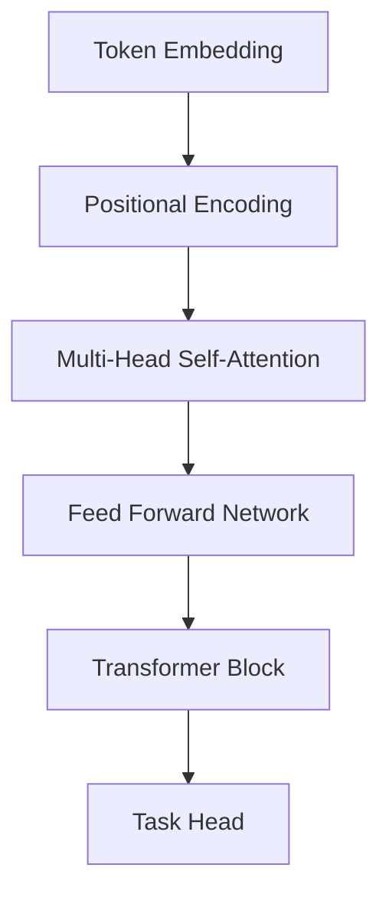
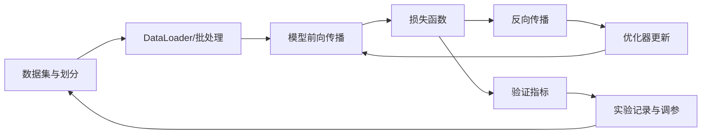
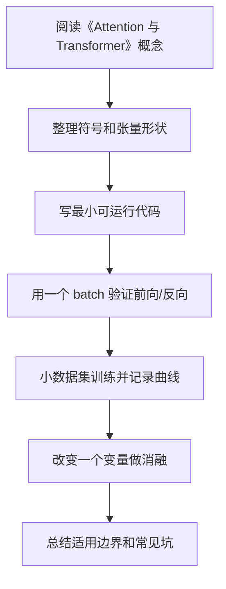

# 09 Attention 与 Transformer

<!-- lecture-notes:integrated-v2 -->

## 讲义导读：从数据到可训练模型

这一章讲的是 **09 Attention 与 Transformer**，属于 **Attention 与 Transformer**。读深度学习时，不要从“这个网络叫什么名字”开始，而要先抓住一条主线：数据进入模型，模型做前向计算，损失函数衡量预测和目标的差距，反向传播计算梯度，优化器更新参数，验证集和错误样本判断它是不是真的学到了规律。

### 一句话先懂

Attention 的核心是让每个位置按相关性去读取其他位置的信息，Transformer 则用这种机制替代传统循环结构。

初学时先问三个问题：输入张量是什么形状，模型把它变成了什么输出，loss 和指标分别在评价什么。只要这三个问题不清楚，后面的公式和代码就很容易变成死记硬背。

### 通俗类比

Attention 像开卷考试时带着问题去翻资料：Query 是问题，Key 是目录索引，Value 是真正要抄回来的内容。

类比只是帮助入门。真正训练模型时，要把类比落回张量形状、参数、梯度、学习率、正则化、数据划分、指标和错误样本这些可检查对象上。

### 本章学习主线

1. **先看任务和数据**：输入是什么，标签是什么，数据有没有泄漏、偏差、类别不平衡或标注噪声？
2. **再看模型结构**：每一层输入输出形状是什么，参数量是多少，为什么这个结构适合当前数据？
3. **然后看训练信号**：损失函数是否匹配任务，梯度能否稳定传递，优化器和学习率是否合理？
4. **接着看泛化能力**：训练集、验证集、测试集是否分清，过拟合和欠拟合分别从曲线哪里看出来？
5. **最后看复现与诊断**：保存配置、随机种子、版本、指标曲线、checkpoint 和错误样本，而不是只保存一个最终分数。

### 本章重点抓手

Query/Key/Value、注意力权重、多头注意力、位置编码、残差连接、LayerNorm、Encoder/Decoder、预训练和微调。

### 最小实践任务

手算一个极小 QKV 注意力例子，再用 Hugging Face 或 PyTorch 跑一个小模型并检查 attention mask。

建议每次实验都记录：数据版本、预处理、模型结构、超参数、随机种子、训练曲线、验证指标、错误样本和一次改动的理由。深度学习最怕“调参靠感觉”；讲义里的每个结论都应尽量能被一段代码、一张曲线或一组错误样本验证。

### 常见误区

- 只背 QKV 名字，不理解矩阵维度。
- 忽略 mask 导致看见不该看的 token。
- 把预训练模型当黑盒，不检查 tokenizer、截断和评估。

### 推荐工具

PyTorch/TensorFlow/Keras、NumPy、Jupyter、TensorBoard、Weights & Biases、scikit-learn 指标、Hugging Face Transformers。

### 读完本章应该能做到

- 用自己的话解释本章概念，并能指出它在“数据 -> 模型 -> 损失 -> 梯度 -> 优化 -> 评估”链路中的位置。
- 写出一个最小可运行例子，打印关键张量形状和训练指标。
- 解释至少一个训练失败现象，例如 loss 不降、过拟合、梯度爆炸、指标虚高或预测偏置。
- 给出一个可复现实验记录，而不是只给最终结果。

> 本节是讲义化改写后的阅读入口。后续正文中的公式、结构图、代码和参考资料，都应围绕“可训练链路 + 可诊断证据”来理解。


## 1. 总览

Attention 的核心思想是：模型在处理一个位置时，可以根据相关性选择关注其他位置的信息。

Transformer 用 Self-Attention 替代传统循环结构，成为现代 NLP 和多模态模型的基础架构。



## 2. Attention 基础

### 2.1 Query、Key、Value

**是什么：**

- Query：当前要查询的信息。
- Key：每个候选信息的索引特征。
- Value：真正被加权汇总的信息。

**简单类比：**

```text
Query: 我想找什么
Key: 每条信息的标签
Value: 每条信息的内容
```

### 2.2 Scaled Dot-Product Attention

核心计算：

```text
Attention(Q, K, V) = softmax(QK^T / sqrt(d_k)) V
```

维度：

```text
Q: [batch, query_len, d_k]
K: [batch, key_len, d_k]
V: [batch, key_len, d_v]
QK^T: [batch, query_len, key_len]
Output: [batch, query_len, d_v]
```

**模块职责：**

- `QK^T` 计算相关性；
- `sqrt(d_k)` 缩放数值，稳定训练；
- `softmax` 得到权重；
- 乘以 `V` 汇总信息。

### 2.3 简单例子

```python
import torch
import torch.nn.functional as F

Q = torch.randn(2, 4, 8)
K = torch.randn(2, 4, 8)
V = torch.randn(2, 4, 8)

scores = Q @ K.transpose(-2, -1) / (8 ** 0.5)
weights = F.softmax(scores, dim=-1)
out = weights @ V
print(out.shape)  # [2, 4, 8]
```

为什么除以 `sqrt(d_k)`：

如果 `d_k` 很大，点积 `QK^T` 的数值方差会变大，softmax 容易进入极端饱和区，导致梯度变小。缩放可以改善数值稳定性。

## 3. Self-Attention

**是什么：** Q、K、V 都来自同一个序列。

**为什么存在：** 序列中每个 token 都能直接和其他 token 建立联系。

**优点：**

- 长距离依赖路径短；
- 并行性强；
- 可解释为 token 间关系建模。

**代价：**

- 复杂度通常随序列长度平方增长；
- 长序列成本高。

复杂度：

```text
Time: O(n^2 d)
Memory: O(n^2)
```

其中 `n` 是序列长度，`d` 是隐藏维度。瓶颈主要来自 attention score 矩阵 `[n, n]`。

## 4. Multi-Head Attention

**是什么：** 多组 attention 并行学习不同关系。

**为什么存在：** 一个注意力头可能只捕捉单一模式，多头可以关注不同子空间。

**简单例子：**

```python
import torch.nn as nn

mha = nn.MultiheadAttention(
    embed_dim=128,
    num_heads=8,
    batch_first=True
)

x = torch.randn(4, 20, 128)
out, weights = mha(x, x, x)
print(out.shape)
```

公式：

```text
head_i = Attention(QW_i^Q, KW_i^K, VW_i^V)
MultiHead(Q,K,V) = Concat(head_1, ..., head_h) W^O
```

如果 `d_model = 512`，`num_heads = 8`，通常每个 head 的维度：

```text
d_head = d_model / num_heads = 64
```

多头不是简单重复，而是让不同 head 学习不同关系，例如局部邻近、句法关系、长距离依赖等。

## 5. Positional Encoding

**是什么：** 给 token 加入位置信息。

**为什么存在：** Self-Attention 本身不天然知道顺序。

常见方式：

| 方法 | 特点 |
| --- | --- |
| Sinusoidal position encoding | 固定函数，不需要学习 |
| Learned position embedding | 位置向量可学习 |
| Relative position encoding | 表达 token 间相对距离 |
| RoPE | 旋转位置编码，大模型常见 |

经典正弦位置编码：

```text
PE(pos, 2i) = sin(pos / 10000^(2i/d_model))
PE(pos, 2i+1) = cos(pos / 10000^(2i/d_model))
```

其中：

- `pos` 是位置；
- `i` 是维度索引；
- `d_model` 是隐藏维度。

正弦位置编码不需要学习参数，并且可以外推到比训练时更长的位置，但现代大模型也常用可学习位置编码、相对位置编码或 RoPE。

## 6. Transformer Block

### 6.1 组成

典型 block 包含：

- Multi-Head Self-Attention；
- Add & Norm；
- Feed Forward Network；
- Add & Norm。

```text
x = x + SelfAttention(LayerNorm(x))
x = x + FFN(LayerNorm(x))
```

上面是 Pre-LN 写法。另一种 Post-LN 写法是：

```text
x = LayerNorm(x + SelfAttention(x))
x = LayerNorm(x + FFN(x))
```

现代深层 Transformer 常偏向 Pre-LN，因为训练更稳定。

### 6.2 Feed Forward Network

**是什么：** 对每个 token 独立应用的 MLP。

**简单例子：**

```python
ffn = nn.Sequential(
    nn.Linear(128, 512),
    nn.GELU(),
    nn.Linear(512, 128)
)
```

公式：

```text
FFN(x) = W2 phi(W1 x + b1) + b2
```

通常中间维度大于 `d_model`：

```text
d_ff = 4 * d_model
```

例如 `d_model=768` 时，`d_ff` 常见为 `3072`。

## 7. Encoder、Decoder、Encoder-Decoder

| 架构 | 用途 |
| --- | --- |
| Encoder-only | 表征学习、分类、理解任务 |
| Decoder-only | 自回归生成、语言模型 |
| Encoder-Decoder | 翻译、摘要等输入输出序列任务 |

### 7.1 Encoder-only

每个 token 可以双向关注其他 token，适合理解任务。

```text
输入文本 -> Encoder -> [CLS] 或池化表示 -> 分类头
```

### 7.2 Decoder-only

使用 causal mask，只能看当前位置之前的 token，适合生成。

```text
token_1 ... token_t -> 预测 token_{t+1}
```

### 7.3 Encoder-Decoder

Encoder 编码源序列，Decoder 在生成目标序列时通过 cross-attention 读取 encoder 输出。

```text
source -> Encoder -> memory
target prefix -> Decoder attends to memory -> next token
```

## 8. Mask

### 8.1 Padding Mask

避免模型关注补齐 token。

### 8.2 Causal Mask

自回归生成中，当前位置不能看到未来 token。

**简单含义：**

```text
预测第 t 个 token 时，只能看 1 到 t-1 的 token。
```

矩阵直观：

```text
允许关注:
1 0 0 0
1 1 0 0
1 1 1 0
1 1 1 1
```

实际实现中常把禁止位置加上一个很大的负数：

```text
scores = scores + mask * (-inf)
```

这样 softmax 后对应位置权重接近 0。

## 9. Transformer 最小代码结构

```python
import torch
import torch.nn as nn

encoder_layer = nn.TransformerEncoderLayer(
    d_model=128,
    nhead=8,
    dim_feedforward=512,
    batch_first=True
)
encoder = nn.TransformerEncoder(encoder_layer, num_layers=2)

x = torch.randn(4, 20, 128)
y = encoder(x)
print(y.shape)  # [4, 20, 128]
```

这个例子只演示结构。真实文本任务还需要 tokenization、embedding、position encoding、mask 和任务头。

## 10. 常见误区

- 忘记位置编码，以为 attention 自动知道顺序。
- 不使用 padding mask，导致模型关注无意义补齐位。
- 混淆 encoder-only 和 decoder-only。
- 只记住 Transformer 图，不理解 Q/K/V。
- 长序列任务忽略 attention 的平方复杂度。

---

## 万字精讲扩展（2026-06-16 更新）
> Last researched: 2026-06-16。本文补充内容以深度学习入门到工程实践为主，版本相关 API 以 PyTorch 官方文档和实际环境为准，论文结论应结合任务、数据和计算预算理解。

### 本章在整套深度学习路线中的位置

《Attention 与 Transformer》不是孤立章节，而是深度学习知识链条中的一个环节。向前看，它依赖数学、机器学习基本概念、数据划分和评估指标；向后看，它会影响模型实现、训练稳定性、泛化能力和项目复现。学习时不要把公式、代码和实验割裂开。一个概念如果不能解释张量形状，通常还没有真正进入代码层面；一个代码片段如果不能解释训练曲线，通常还没有真正进入实验层面。

本章学习完成后，建议至少达到三个标准。第一，能说清核心概念解决的问题和适用边界。第二，能写出最小公式并对应到 PyTorch 张量形状。第三，能设计一个小实验验证它的作用，并能根据训练曲线判断常见失败原因。达到这三个标准后，本章才真正从“看过”变成“可用”。

### Attention 与 Transformer 类笔记的精讲重点

Attention 的核心是让模型根据当前查询动态选择需要关注的信息。Self-Attention 中，序列中每个位置都会生成 Query、Key、Value，通过 QK 相似度得到权重，再对 Value 加权求和。Multi-Head Attention 把表示拆成多个子空间，让不同头学习不同关系。位置编码补充序列顺序信息，残差连接、LayerNorm 和前馈网络共同构成 Transformer Block。

Transformer 的优势是并行计算和长距离依赖建模，但代价是注意力复杂度通常随序列长度平方增长。学习时要特别关注 mask：padding mask 防止模型看见填充位置，causal mask 防止自回归模型看见未来 token。Transformer 训练还高度依赖学习率 warmup、AdamW、权重衰减、归一化位置、初始化、batch size 和数据规模，不能只背结构图。

### 深度学习的学习闭环：公式、代码、实验三者必须互相解释

深度学习最容易学散：一边背线性代数和概率，一边看模型结构图，一边抄训练代码，但三者没有真正连起来。真正能长期使用的学习方式，是把每个概念都放进同一个闭环里：数学表达负责说明对象和变换，代码实现负责说明张量形状和计算顺序，实验记录负责说明这个设计在数据上是否有效。只会公式，容易不知道代码里维度为什么变；只会代码，容易不知道损失为什么下降或不下降；只看结果，容易把偶然的超参数组合误认为通用规律。

建议每学一个主题都做四件事。第一，用自然语言说明它解决什么问题，比如卷积解决局部模式和参数共享，Attention 解决动态依赖建模，正则化解决泛化而不是训练误差本身。第二，写出最小公式，并标出每个符号的形状。第三，用 PyTorch 或 NumPy 写一个最小可运行例子，不追求工程封装，只追求看见输入、输出、损失和梯度。第四，做一个小实验改变关键因素，例如学习率、batch size、初始化、正则强度、模型宽度、数据噪声或序列长度，观察训练曲线变化。

### 训练系统的基本结构



Figure: 深度学习训练闭环，综合 PyTorch 官方教程、Dive into Deep Learning 和 Google Tuning Playbook 整理。

这个闭环说明了一个重要事实：模型性能不是模型结构单独决定的，而是数据、目标、损失、优化、正则化、评估和工程细节共同决定的。很多训练问题看起来像模型问题，实际可能是数据泄漏、标签错误、归一化不一致、学习率不合适、评估指标不匹配或随机种子导致的实验不可复现。因此学习笔记不能只写“某模型更强”，还要写“在什么数据、什么目标、什么计算预算、什么调参策略下更合适”。

### 从形状检查开始理解模型

深度学习代码调试的第一原则是先检查张量形状。线性层通常期望 `[batch, features]`，卷积层通常是 `[batch, channels, height, width]`，RNN 和 Transformer 常见形状可能是 `[batch, seq, hidden]` 或 `[seq, batch, hidden]`，注意力里的 Q、K、V 还会拆成多头维度。很多错误并不是数学错，而是把 batch 维、时间维、通道维、特征维混在一起。

建议在每个模型的 forward 里临时打印或断言关键形状，训练前用一个 batch 跑通前向、损失和反向。先确认 loss 是标量，梯度不是 None，参数会更新，再开始长时间训练。对初学者而言，`overfit one batch` 是非常有效的调试方法：让模型在一个小 batch 上训练到接近零损失，如果做不到，通常说明模型、损失、标签、学习率或梯度链路存在基础问题。

### 实验记录比单次结果更重要

深度学习结果具有随机性，数据划分、初始化、batch 顺序、GPU 算子和混合精度都可能影响数值。PyTorch 官方文档也提醒，完全复现并不总是保证的，但可以通过固定随机种子、记录版本、保存配置、控制数据划分和记录硬件环境来降低不确定性。学习阶段至少应记录：数据集版本、划分方式、模型配置、优化器、学习率计划、batch size、训练轮数、随机种子、评价指标、最好 checkpoint 和训练曲线。

当实验结果变化时，不要只看最终准确率。训练 loss、验证 loss、训练指标、验证指标、梯度范数、学习率曲线、样本预测案例、错误样本分布都能提供线索。训练集很好验证集差，通常指向过拟合、数据分布差异或数据泄漏；训练集也学不好，可能是欠拟合、学习率错误、标签错、模型容量不足或输入预处理错误；loss 出现 NaN，常见原因是学习率过大、数值溢出、非法 log、除零、混合精度缩放问题或梯度爆炸。

### 核心知识点逐条精讲

#### 1. Attention 机制

在《Attention 与 Transformer》中，`Attention 机制` 应该同时从概念、公式、代码和实验四个层面理解。概念层面要回答它解决什么问题、引入什么假设、和相邻方法有什么差异；公式层面要写出输入、输出、参数和损失之间的关系；代码层面要确认张量形状、广播规则、自动微分路径和数值稳定处理；实验层面要观察它对训练 loss、验证指标、收敛速度、显存占用和泛化能力的影响。

学习 `算法` 或 `模型结构` 时，不要只停留在结构图。结构图通常隐藏了 batch 维、mask、归一化、残差、初始化、学习率和数据预处理等细节，而这些细节经常决定训练是否成功。以 `Attention 机制` 为主题做笔记时，建议固定写五项：适用任务、核心公式、张量形状、最小代码、常见失败现象。这样以后回看时可以直接用于实现和排错。

判断 `Attention 机制` 是否真正掌握，可以用三个问题自测：如果输入维度变化，能否推导输出形状；如果训练曲线异常，能否提出可验证的原因；如果换一个数据集，能否说清哪些假设可能失效。深度学习不是把所有模型都背下来，而是建立一套能解释、能实现、能诊断的工作方式。

#### 2. Self-Attention

在《Attention 与 Transformer》中，`Self-Attention` 应该同时从概念、公式、代码和实验四个层面理解。概念层面要回答它解决什么问题、引入什么假设、和相邻方法有什么差异；公式层面要写出输入、输出、参数和损失之间的关系；代码层面要确认张量形状、广播规则、自动微分路径和数值稳定处理；实验层面要观察它对训练 loss、验证指标、收敛速度、显存占用和泛化能力的影响。

学习 `算法` 或 `模型结构` 时，不要只停留在结构图。结构图通常隐藏了 batch 维、mask、归一化、残差、初始化、学习率和数据预处理等细节，而这些细节经常决定训练是否成功。以 `Self-Attention` 为主题做笔记时，建议固定写五项：适用任务、核心公式、张量形状、最小代码、常见失败现象。这样以后回看时可以直接用于实现和排错。

判断 `Self-Attention` 是否真正掌握，可以用三个问题自测：如果输入维度变化，能否推导输出形状；如果训练曲线异常，能否提出可验证的原因；如果换一个数据集，能否说清哪些假设可能失效。深度学习不是把所有模型都背下来，而是建立一套能解释、能实现、能诊断的工作方式。

#### 3. Multi-Head Attention

在《Attention 与 Transformer》中，`Multi-Head Attention` 应该同时从概念、公式、代码和实验四个层面理解。概念层面要回答它解决什么问题、引入什么假设、和相邻方法有什么差异；公式层面要写出输入、输出、参数和损失之间的关系；代码层面要确认张量形状、广播规则、自动微分路径和数值稳定处理；实验层面要观察它对训练 loss、验证指标、收敛速度、显存占用和泛化能力的影响。

学习 `算法` 或 `模型结构` 时，不要只停留在结构图。结构图通常隐藏了 batch 维、mask、归一化、残差、初始化、学习率和数据预处理等细节，而这些细节经常决定训练是否成功。以 `Multi-Head Attention` 为主题做笔记时，建议固定写五项：适用任务、核心公式、张量形状、最小代码、常见失败现象。这样以后回看时可以直接用于实现和排错。

判断 `Multi-Head Attention` 是否真正掌握，可以用三个问题自测：如果输入维度变化，能否推导输出形状；如果训练曲线异常，能否提出可验证的原因；如果换一个数据集，能否说清哪些假设可能失效。深度学习不是把所有模型都背下来，而是建立一套能解释、能实现、能诊断的工作方式。

#### 4. 位置编码

在《Attention 与 Transformer》中，`位置编码` 应该同时从概念、公式、代码和实验四个层面理解。概念层面要回答它解决什么问题、引入什么假设、和相邻方法有什么差异；公式层面要写出输入、输出、参数和损失之间的关系；代码层面要确认张量形状、广播规则、自动微分路径和数值稳定处理；实验层面要观察它对训练 loss、验证指标、收敛速度、显存占用和泛化能力的影响。

学习 `算法` 或 `模型结构` 时，不要只停留在结构图。结构图通常隐藏了 batch 维、mask、归一化、残差、初始化、学习率和数据预处理等细节，而这些细节经常决定训练是否成功。以 `位置编码` 为主题做笔记时，建议固定写五项：适用任务、核心公式、张量形状、最小代码、常见失败现象。这样以后回看时可以直接用于实现和排错。

判断 `位置编码` 是否真正掌握，可以用三个问题自测：如果输入维度变化，能否推导输出形状；如果训练曲线异常，能否提出可验证的原因；如果换一个数据集，能否说清哪些假设可能失效。深度学习不是把所有模型都背下来，而是建立一套能解释、能实现、能诊断的工作方式。

#### 5. Mask 和 Transformer Block

在《Attention 与 Transformer》中，`Mask 和 Transformer Block` 应该同时从概念、公式、代码和实验四个层面理解。概念层面要回答它解决什么问题、引入什么假设、和相邻方法有什么差异；公式层面要写出输入、输出、参数和损失之间的关系；代码层面要确认张量形状、广播规则、自动微分路径和数值稳定处理；实验层面要观察它对训练 loss、验证指标、收敛速度、显存占用和泛化能力的影响。

学习 `算法` 或 `模型结构` 时，不要只停留在结构图。结构图通常隐藏了 batch 维、mask、归一化、残差、初始化、学习率和数据预处理等细节，而这些细节经常决定训练是否成功。以 `Mask 和 Transformer Block` 为主题做笔记时，建议固定写五项：适用任务、核心公式、张量形状、最小代码、常见失败现象。这样以后回看时可以直接用于实现和排错。

判断 `Mask 和 Transformer Block` 是否真正掌握，可以用三个问题自测：如果输入维度变化，能否推导输出形状；如果训练曲线异常，能否提出可验证的原因；如果换一个数据集，能否说清哪些假设可能失效。深度学习不是把所有模型都背下来，而是建立一套能解释、能实现、能诊断的工作方式。


### 场景化学习与排错表

| 主题 | 推荐学习动作 | 常见风险 | 验证方式 |
| :--- | :--- | :--- | :--- |
| Attention 机制 | 写清概念、公式、张量形状、最小代码和实验现象 | 只背名称或只复制代码 | 形状断言、one-batch overfit、训练/验证曲线、消融实验 |
| Self-Attention | 写清概念、公式、张量形状、最小代码和实验现象 | 只背名称或只复制代码 | 形状断言、one-batch overfit、训练/验证曲线、消融实验 |
| Multi-Head Attention | 写清概念、公式、张量形状、最小代码和实验现象 | 只背名称或只复制代码 | 形状断言、one-batch overfit、训练/验证曲线、消融实验 |
| 位置编码 | 写清概念、公式、张量形状、最小代码和实验现象 | 只背名称或只复制代码 | 形状断言、one-batch overfit、训练/验证曲线、消融实验 |
| Mask 和 Transformer Block | 写清概念、公式、张量形状、最小代码和实验现象 | 只背名称或只复制代码 | 形状断言、one-batch overfit、训练/验证曲线、消融实验 |

这个表的目的不是把所有知识点变成同一种解释，而是强迫每个主题都落到可验证行为。深度学习中很多错误不会直接报错，而是表现为指标不涨、收敛很慢、验证集波动、显存异常、loss NaN 或结果不可复现。只有把概念和实验记录绑定，才能区分“理论没懂”“代码写错”“数据有问题”和“超参数不合适”。

### 本章建议工作流



Figure: 《Attention 与 Transformer》学习工作流，综合 Deep Learning Book、Dive into Deep Learning、PyTorch 官方教程和 Google Tuning Playbook 整理。

这个流程强调“小步可验证”。先让一个最小例子跑通，再逐渐增加模型复杂度、数据规模和训练技巧。不要在还没确认数据和标签正确时就调优化器，也不要在一个 batch 都无法过拟合时讨论复杂正则化。深度学习工程中，很多高阶问题都要先排除基础错误。

### 常见误区和纠正方法

- 误区：只背公式，不检查张量形状。纠正：每个公式都写出 batch 维、特征维、通道维或序列维，并在代码里用断言验证。
- 误区：训练失败后马上换复杂模型。纠正：先检查数据、标签、loss、学习率、梯度和 one-batch overfit，再讨论模型容量。
- 误区：把验证集当测试集反复调参。纠正：验证集用于选择模型和超参数，最终测试集应尽量只用于最后评估。
- 误区：只看最终准确率。纠正：同时看训练/验证 loss、混淆矩阵、错误样本、随机种子波动、计算成本和推理延迟。
- 误区：盲目复制论文配置。纠正：论文配置依赖数据规模、模型规模、硬件和训练预算，迁移到小数据集时需要重新验证。

### 与相邻章节的关系

《Attention 与 Transformer》应和其他章节交叉使用。数学章节提供符号和梯度基础，机器学习章节提供任务与评估框架，神经网络和反向传播章节解释可微训练机制，优化和正则化章节解释为什么模型能收敛并泛化，CNN/RNN/Transformer 章节提供结构归纳偏置，训练实践章节负责把所有内容变成可复现实验。每当某一章出现疑问，都应回到这个链条中寻找缺失环节。

### 实操训练和复盘模板

1. 围绕 `Attention 机制` 写一个最小实验：固定数据和模型，只改变一个变量，记录训练 loss、验证指标和异常现象。
2. 围绕 `Self-Attention` 写一个最小实验：固定数据和模型，只改变一个变量，记录训练 loss、验证指标和异常现象。
3. 围绕 `Multi-Head Attention` 写一个最小实验：固定数据和模型，只改变一个变量，记录训练 loss、验证指标和异常现象。
4. 围绕 `位置编码` 写一个最小实验：固定数据和模型，只改变一个变量，记录训练 loss、验证指标和异常现象。
5. 围绕 `Mask 和 Transformer Block` 写一个最小实验：固定数据和模型，只改变一个变量，记录训练 loss、验证指标和异常现象。

建议每次实验都记录如下信息：

```text
实验名称：
本章主题：Attention 与 Transformer
数据集版本与划分：
模型结构和关键超参数：
输入输出张量形状：
损失函数与评估指标：
优化器、学习率、batch size、训练轮数：
随机种子和运行环境：
训练曲线观察：
最好结果与失败结果：
结论和下一步：
```

复盘的关键是把“结果好/不好”拆成证据。比如验证集差，要说明训练集是否已拟合、数据增强是否一致、类别是否不平衡、指标是否适合任务；loss NaN，要说明在哪个 step 出现、梯度范数是否异常、输入是否有非法值、混合精度是否开启。这样的记录会比单独保存一张结果截图有用得多。

## 参考资料与延伸阅读

- [Book / Official] Deep Learning, Ian Goodfellow, Yoshua Bengio, Aaron Courville: https://www.deeplearningbook.org/
- [Book / Official] Dive into Deep Learning: https://d2l.ai/
- [Framework / Official] PyTorch Tutorials: https://docs.pytorch.org/tutorials/
- [Framework / Official] PyTorch Autograd Mechanics: https://docs.pytorch.org/docs/stable/notes/autograd.html
- [Framework / Official] PyTorch Reproducibility: https://docs.pytorch.org/docs/stable/notes/randomness.html
- [Framework / Official] PyTorch Automatic Mixed Precision: https://docs.pytorch.org/docs/stable/amp.html
- [Course / Stanford] CS231n Convolutional Neural Networks for Visual Recognition: https://cs231n.github.io/
- [Course / Stanford] CS224n Natural Language Processing with Deep Learning: https://web.stanford.edu/class/cs224n/
- [Paper] Adam: A Method for Stochastic Optimization: https://arxiv.org/abs/1412.6980
- [Paper] Decoupled Weight Decay Regularization / AdamW: https://arxiv.org/abs/1711.05101
- [Paper] Dropout: A Simple Way to Prevent Neural Networks from Overfitting: https://jmlr.org/papers/v15/srivastava14a.html
- [Paper] Batch Normalization: Accelerating Deep Network Training by Reducing Internal Covariate Shift: https://arxiv.org/abs/1502.03167
- [Paper] Attention Is All You Need: https://arxiv.org/abs/1706.03762
- [Paper] Layer Normalization: https://arxiv.org/abs/1607.06450
- [Paper] Deep Residual Learning for Image Recognition: https://arxiv.org/abs/1512.03385
- [Paper] ImageNet Classification with Deep Convolutional Neural Networks: https://papers.nips.cc/paper/4824-imagenet-classification-with-deep-convolutional-neural-networks
- [Paper] Long Short-Term Memory: https://www.bioinf.jku.at/publications/older/2604.pdf
- [Paper] Sequence to Sequence Learning with Neural Networks: https://arxiv.org/abs/1409.3215
- [Practice / Official] Google Deep Learning Tuning Playbook: https://github.com/google-research/tuning_playbook
- [Library / Official] scikit-learn Model Evaluation: https://scikit-learn.org/stable/modules/model_evaluation.html
- [Community / CSDN] 深度学习基础与实践相关笔记检索入口: https://so.csdn.net/so/search?q=%E6%B7%B1%E5%BA%A6%E5%AD%A6%E4%B9%A0%20%E5%AD%A6%E4%B9%A0%E7%AC%94%E8%AE%B0
- [Community / 博客园] 深度学习与反向传播实践笔记检索入口: https://zzk.cnblogs.com/s/blogpost?Keywords=%E6%B7%B1%E5%BA%A6%E5%AD%A6%E4%B9%A0%20%E5%8F%8D%E5%90%91%E4%BC%A0%E6%92%AD
- [Community / 掘金] Transformer 原理与实践文章检索入口: https://juejin.cn/search?query=Transformer%20%E5%8E%9F%E7%90%86&type=0

## 2026 深度学习资料与工程核对补充

这一组笔记建议按“理论教材 + 框架文档 + 可复现实验”三层学习。

- **理论教材**：Deep Learning Book 适合补数学和概念框架；Dive into Deep Learning 适合把公式、代码和实验连起来。
- **框架实现**：PyTorch、TensorFlow 和 Keras 的官方文档用于核对张量 API、自动微分、训练循环、模型保存和部署接口。
- **预训练模型**：Transformer、LLM、视觉模型相关内容优先查 Hugging Face Transformers 和对应论文/模型卡，重点核对 tokenizer、输入截断、mask、评估集和许可证。
- **评估规范**：分类、回归、序列任务和生成任务要区分训练损失与业务指标；必要时用 scikit-learn 指标或任务官方评测脚本复核。
- **实验要求**：理论用 Deep Learning Book 和 D2L 打底，工程实现优先查 PyTorch、TensorFlow/Keras 和 Hugging Face 官方文档。 每个结论最好配一段可运行代码、一条训练曲线或一个错误样本分析。

通俗地说，教材负责解释“为什么这样学”，框架文档负责说明“代码到底怎么写”，实验记录负责证明“这次真的有效”。不要只看模型名字和排行榜；能复现、能诊断、能解释失败，才算真正掌握。

参考资料：

- Deep Learning Book：https://www.deeplearningbook.org/
- Dive into Deep Learning：https://d2l.ai/
- PyTorch Documentation：https://docs.pytorch.org/docs/stable/index.html
- TensorFlow Learn：https://www.tensorflow.org/learn
- Keras Documentation：https://keras.io/
- Hugging Face Transformers：https://huggingface.co/docs/transformers/en/index
- scikit-learn Model Selection and Evaluation：https://scikit-learn.org/stable/model_selection.html
- Papers with Code：https://paperswithcode.com/
