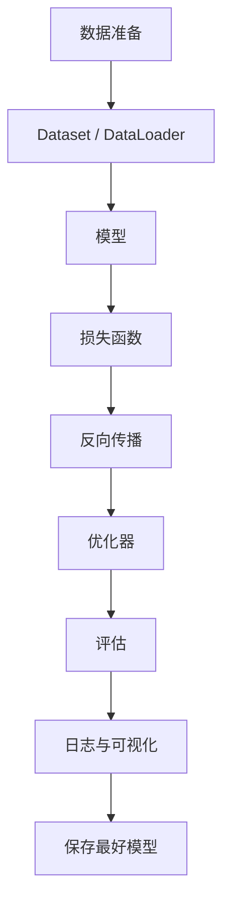
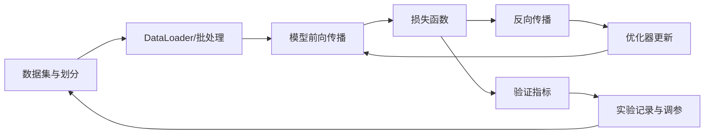
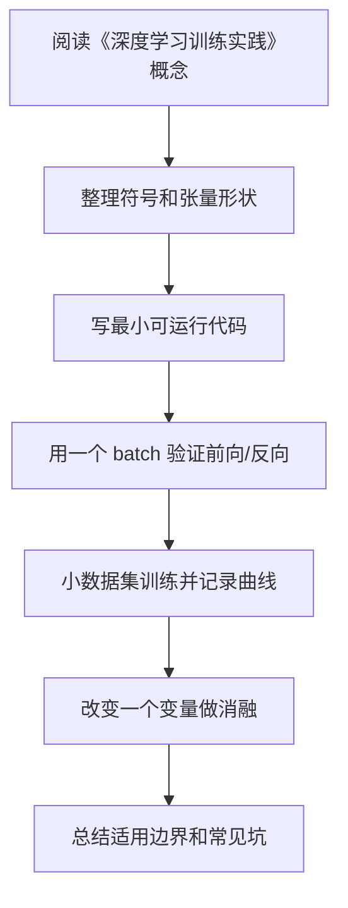

# 10 深度学习训练实践

## 1. 总览

深度学习实践不是只写模型结构。完整训练系统包含数据、模型、损失、优化、日志、评估、保存、复现和部署前检查。



## 2. 数据模块

### 2.1 职责

- 读取样本；
- 做预处理和增强；
- 返回模型需要的张量；
- 保证 train/val/test 划分清晰。

### 2.2 简单例子

```python
from torch.utils.data import Dataset

class MyDataset(Dataset):
    def __init__(self, items):
        self.items = items

    def __len__(self):
        return len(self.items)

    def __getitem__(self, idx):
        x, y = self.items[idx]
        return x, y
```

## 3. 模型模块

### 3.1 职责

- 定义从输入到输出的计算；
- 暴露可学习参数；
- 保持 forward 逻辑清晰。

### 3.2 简单例子

```python
import torch.nn as nn

class MLP(nn.Module):
    def __init__(self, input_dim, num_classes):
        super().__init__()
        self.net = nn.Sequential(
            nn.Linear(input_dim, 128),
            nn.ReLU(),
            nn.Linear(128, num_classes)
        )

    def forward(self, x):
        return self.net(x)
```

## 4. 训练循环

### 4.1 职责

- 切换训练模式；
- 前向传播；
- 计算损失；
- 反向传播；
- 更新参数；
- 记录指标。

### 4.2 简单例子

```python
model.train()
for x, y in train_loader:
    optimizer.zero_grad()
    logits = model(x)
    loss = loss_fn(logits, y)
    loss.backward()
    optimizer.step()
```

更完整的训练 epoch：

```python
def train_one_epoch(model, loader, optimizer, loss_fn, device):
    model.train()
    total_loss = 0.0
    total = 0

    for x, y in loader:
        x = x.to(device)
        y = y.to(device)

        optimizer.zero_grad(set_to_none=True)
        logits = model(x)
        loss = loss_fn(logits, y)
        loss.backward()
        optimizer.step()

        batch_size = y.size(0)
        total_loss += loss.item() * batch_size
        total += batch_size

    return total_loss / total
```

关键点：

- `model.train()` 影响 Dropout 和 BatchNorm；
- `zero_grad` 应在反向传播前调用；
- 记录 loss 时要按 batch size 加权，避免最后一个小 batch 影响平均值。

## 5. 验证循环

### 5.1 职责

- 切换评估模式；
- 关闭梯度；
- 计算验证指标；
- 不更新参数。

### 5.2 简单例子

```python
model.eval()
correct = 0
total = 0

with torch.no_grad():
    for x, y in val_loader:
        logits = model(x)
        pred = logits.argmax(dim=1)
        correct += (pred == y).sum().item()
        total += y.numel()

acc = correct / total
```

验证时不要调用：

```text
loss.backward()
optimizer.step()
```

否则验证集会泄漏进训练过程。

## 6. 实验记录

每次实验至少记录：

| 项目 | 内容 |
| --- | --- |
| 数据版本 | 数据来源、划分方式、预处理 |
| 模型 | 结构、参数量、初始化 |
| 损失函数 | 类型和关键参数 |
| 优化器 | optimizer、lr、weight_decay |
| 训练配置 | batch size、epoch、seed |
| 结果 | train/val/test 指标 |
| 备注 | 异常现象和改动原因 |

建议使用 YAML 或 JSON 保存配置：

```yaml
seed: 42
model:
  name: small_cnn
  num_classes: 10
optimizer:
  name: adamw
  lr: 0.0003
  weight_decay: 0.01
train:
  batch_size: 64
  epochs: 50
data:
  image_size: 224
  augmentation: basic
```

## 7. 调参路径

建议按优先级检查：

1. 数据和标签是否正确。
2. 输入 shape 是否正确。
3. loss 是否能在小数据集上快速下降。
4. 学习率是否合理。
5. 模型容量是否合适。
6. 正则化是否过强或过弱。
7. 数据增强是否破坏标签。
8. 指标是否符合任务目标。

## 8. Debug 技巧

### 8.1 小数据过拟合测试

用很少样本训练，模型应该能接近记住训练集。

如果做不到，可能是：

- 模型或 loss 写错；
- 标签错；
- 学习率不合适；
- 梯度没有传到参数；
- 输入预处理错误。

### 8.2 检查梯度

```python
for name, p in model.named_parameters():
    if p.grad is not None:
        print(name, p.grad.norm().item())
```

### 8.3 检查数据

```python
x, y = next(iter(train_loader))
print(x.shape, y.shape)
print(x.min(), x.max(), y[:10])
```

### 8.4 检查参数是否更新

```python
before = {n: p.detach().clone() for n, p in model.named_parameters()}

loss.backward()
optimizer.step()

for n, p in model.named_parameters():
    diff = (p.detach() - before[n]).abs().sum().item()
    print(n, diff)
```

如果所有 diff 都是 0，说明参数没有被更新，可能是梯度断了、优化器没拿到参数、学习率为 0，或误用了 `torch.no_grad()`。

## 9. 混合精度训练

混合精度用较低精度加速训练、降低显存占用。常见是 FP16/BF16。

PyTorch AMP 示例：

```python
scaler = torch.cuda.amp.GradScaler()

for x, y in train_loader:
    optimizer.zero_grad(set_to_none=True)

    with torch.cuda.amp.autocast():
        logits = model(x)
        loss = loss_fn(logits, y)

    scaler.scale(loss).backward()
    scaler.step(optimizer)
    scaler.update()
```

注意：

- 新版本 PyTorch 推荐使用更新的 `torch.amp` API，具体写法以当前版本文档为准；
- BF16 通常不需要 loss scaling；
- 混合精度可能暴露数值不稳定问题。

## 10. 保存和加载模型

### 9.1 保存参数

```python
torch.save(model.state_dict(), "model.pt")
```

### 9.2 加载参数

```python
model.load_state_dict(torch.load("model.pt"))
model.eval()
```

训练中建议保存验证集表现最好的模型，而不是最后一个 epoch 的模型。

更完整 checkpoint：

```python
torch.save({
    "model": model.state_dict(),
    "optimizer": optimizer.state_dict(),
    "epoch": epoch,
    "best_metric": best_metric,
    "config": config,
}, "checkpoint.pt")
```

恢复：

```python
ckpt = torch.load("checkpoint.pt", map_location=device)
model.load_state_dict(ckpt["model"])
optimizer.load_state_dict(ckpt["optimizer"])
```

## 11. 可复现性

常见设置：

```python
import random
import numpy as np
import torch

seed = 42
random.seed(seed)
np.random.seed(seed)
torch.manual_seed(seed)
torch.cuda.manual_seed_all(seed)
```

注意：完全可复现可能会牺牲性能，并且不同硬件、CUDA、cuDNN、框架版本仍可能带来差异。

## 12. 训练问题排查表

| 现象 | 优先检查 | 常见处理 |
| --- | --- | --- |
| 小数据也无法过拟合 | 数据、标签、loss、梯度 | 打印样本，检查梯度和参数更新 |
| 训练 loss 降，验证差 | 过拟合 | 数据增强、正则化、早停 |
| train/val 都差 | 欠拟合或训练失败 | 增大模型、训练更久、调学习率 |
| loss NaN | 学习率、输入范围、梯度爆炸 | 降 lr、梯度裁剪、检查归一化 |
| 指标异常高 | 数据泄漏 | 检查划分、重复样本、预处理 |
| GPU 利用率低 | 数据加载慢 | 增加 num_workers、缓存、预处理优化 |

## 13. 项目路线

### 项目 1：MLP 表格分类

目标：

- 熟悉 Dataset、DataLoader、MLP、cross entropy。
- 学会训练/验证/测试划分。

### 项目 2：CNN 图像分类

目标：

- 熟悉卷积、池化、数据增强。
- 理解 train/val 曲线和过拟合。

### 项目 3：RNN 文本分类

目标：

- 熟悉 tokenization、embedding、padding mask。
- 理解序列长度和隐藏状态。

### 项目 4：Transformer 小模型

目标：

- 理解 self-attention、position encoding、mask。
- 跑通一个小型文本分类或语言建模任务。

## 14. 常见误区

- 不做数据可视化，直接训练。
- 训练失败时同时改很多参数，无法定位原因。
- 只保存模型，不保存配置和代码版本。
- 用测试集调参。
- 忘记 `model.eval()`，导致验证指标波动异常。
- 不设随机种子，实验难复现。

---

## 万字精讲扩展（2026-06-16 更新）
> Last researched: 2026-06-16。本文补充内容以深度学习入门到工程实践为主，版本相关 API 以 PyTorch 官方文档和实际环境为准，论文结论应结合任务、数据和计算预算理解。

### 本章在整套深度学习路线中的位置

《深度学习训练实践》不是孤立章节，而是深度学习知识链条中的一个环节。向前看，它依赖数学、机器学习基本概念、数据划分和评估指标；向后看，它会影响模型实现、训练稳定性、泛化能力和项目复现。学习时不要把公式、代码和实验割裂开。一个概念如果不能解释张量形状，通常还没有真正进入代码层面；一个代码片段如果不能解释训练曲线，通常还没有真正进入实验层面。

本章学习完成后，建议至少达到三个标准。第一，能说清核心概念解决的问题和适用边界。第二，能写出最小公式并对应到 PyTorch 张量形状。第三，能设计一个小实验验证它的作用，并能根据训练曲线判断常见失败原因。达到这三个标准后，本章才真正从“看过”变成“可用”。

### 训练实践类笔记的精讲重点

训练工程的目标是让实验可运行、可诊断、可复现、可比较。一个完整训练项目至少包含数据集定义、数据增强、模型、损失、优化器、学习率计划、训练循环、验证循环、checkpoint、日志、配置文件和错误样本分析。初学时可以写简单脚本，但一旦实验变多，就必须管理配置和输出目录，否则很快无法知道哪个结果来自哪个设置。

调试训练问题应从最小闭环开始。先用少量样本确认数据读取和标签正确，再 overfit 一个 batch，再跑小规模训练，再加入数据增强、正则化和复杂模型。混合精度、分布式训练和复杂调度应该在单机单卡基线可靠后再加。任何工程加速手段都不能替代基础正确性检查。

### 深度学习的学习闭环：公式、代码、实验三者必须互相解释

深度学习最容易学散：一边背线性代数和概率，一边看模型结构图，一边抄训练代码，但三者没有真正连起来。真正能长期使用的学习方式，是把每个概念都放进同一个闭环里：数学表达负责说明对象和变换，代码实现负责说明张量形状和计算顺序，实验记录负责说明这个设计在数据上是否有效。只会公式，容易不知道代码里维度为什么变；只会代码，容易不知道损失为什么下降或不下降；只看结果，容易把偶然的超参数组合误认为通用规律。

建议每学一个主题都做四件事。第一，用自然语言说明它解决什么问题，比如卷积解决局部模式和参数共享，Attention 解决动态依赖建模，正则化解决泛化而不是训练误差本身。第二，写出最小公式，并标出每个符号的形状。第三，用 PyTorch 或 NumPy 写一个最小可运行例子，不追求工程封装，只追求看见输入、输出、损失和梯度。第四，做一个小实验改变关键因素，例如学习率、batch size、初始化、正则强度、模型宽度、数据噪声或序列长度，观察训练曲线变化。

### 训练系统的基本结构



Figure: 深度学习训练闭环，综合 PyTorch 官方教程、Dive into Deep Learning 和 Google Tuning Playbook 整理。

这个闭环说明了一个重要事实：模型性能不是模型结构单独决定的，而是数据、目标、损失、优化、正则化、评估和工程细节共同决定的。很多训练问题看起来像模型问题，实际可能是数据泄漏、标签错误、归一化不一致、学习率不合适、评估指标不匹配或随机种子导致的实验不可复现。因此学习笔记不能只写“某模型更强”，还要写“在什么数据、什么目标、什么计算预算、什么调参策略下更合适”。

### 从形状检查开始理解模型

深度学习代码调试的第一原则是先检查张量形状。线性层通常期望 `[batch, features]`，卷积层通常是 `[batch, channels, height, width]`，RNN 和 Transformer 常见形状可能是 `[batch, seq, hidden]` 或 `[seq, batch, hidden]`，注意力里的 Q、K、V 还会拆成多头维度。很多错误并不是数学错，而是把 batch 维、时间维、通道维、特征维混在一起。

建议在每个模型的 forward 里临时打印或断言关键形状，训练前用一个 batch 跑通前向、损失和反向。先确认 loss 是标量，梯度不是 None，参数会更新，再开始长时间训练。对初学者而言，`overfit one batch` 是非常有效的调试方法：让模型在一个小 batch 上训练到接近零损失，如果做不到，通常说明模型、损失、标签、学习率或梯度链路存在基础问题。

### 实验记录比单次结果更重要

深度学习结果具有随机性，数据划分、初始化、batch 顺序、GPU 算子和混合精度都可能影响数值。PyTorch 官方文档也提醒，完全复现并不总是保证的，但可以通过固定随机种子、记录版本、保存配置、控制数据划分和记录硬件环境来降低不确定性。学习阶段至少应记录：数据集版本、划分方式、模型配置、优化器、学习率计划、batch size、训练轮数、随机种子、评价指标、最好 checkpoint 和训练曲线。

当实验结果变化时，不要只看最终准确率。训练 loss、验证 loss、训练指标、验证指标、梯度范数、学习率曲线、样本预测案例、错误样本分布都能提供线索。训练集很好验证集差，通常指向过拟合、数据分布差异或数据泄漏；训练集也学不好，可能是欠拟合、学习率错误、标签错、模型容量不足或输入预处理错误；loss 出现 NaN，常见原因是学习率过大、数值溢出、非法 log、除零、混合精度缩放问题或梯度爆炸。

### 核心知识点逐条精讲

#### 1. 数据模块

在《深度学习训练实践》中，`数据模块` 应该同时从概念、公式、代码和实验四个层面理解。概念层面要回答它解决什么问题、引入什么假设、和相邻方法有什么差异；公式层面要写出输入、输出、参数和损失之间的关系；代码层面要确认张量形状、广播规则、自动微分路径和数值稳定处理；实验层面要观察它对训练 loss、验证指标、收敛速度、显存占用和泛化能力的影响。

学习 `算法` 或 `模型结构` 时，不要只停留在结构图。结构图通常隐藏了 batch 维、mask、归一化、残差、初始化、学习率和数据预处理等细节，而这些细节经常决定训练是否成功。以 `数据模块` 为主题做笔记时，建议固定写五项：适用任务、核心公式、张量形状、最小代码、常见失败现象。这样以后回看时可以直接用于实现和排错。

判断 `数据模块` 是否真正掌握，可以用三个问题自测：如果输入维度变化，能否推导输出形状；如果训练曲线异常，能否提出可验证的原因；如果换一个数据集，能否说清哪些假设可能失效。深度学习不是把所有模型都背下来，而是建立一套能解释、能实现、能诊断的工作方式。

#### 2. 训练循环

在《深度学习训练实践》中，`训练循环` 应该同时从概念、公式、代码和实验四个层面理解。概念层面要回答它解决什么问题、引入什么假设、和相邻方法有什么差异；公式层面要写出输入、输出、参数和损失之间的关系；代码层面要确认张量形状、广播规则、自动微分路径和数值稳定处理；实验层面要观察它对训练 loss、验证指标、收敛速度、显存占用和泛化能力的影响。

学习 `算法` 或 `模型结构` 时，不要只停留在结构图。结构图通常隐藏了 batch 维、mask、归一化、残差、初始化、学习率和数据预处理等细节，而这些细节经常决定训练是否成功。以 `训练循环` 为主题做笔记时，建议固定写五项：适用任务、核心公式、张量形状、最小代码、常见失败现象。这样以后回看时可以直接用于实现和排错。

判断 `训练循环` 是否真正掌握，可以用三个问题自测：如果输入维度变化，能否推导输出形状；如果训练曲线异常，能否提出可验证的原因；如果换一个数据集，能否说清哪些假设可能失效。深度学习不是把所有模型都背下来，而是建立一套能解释、能实现、能诊断的工作方式。

#### 3. 验证和指标

在《深度学习训练实践》中，`验证和指标` 应该同时从概念、公式、代码和实验四个层面理解。概念层面要回答它解决什么问题、引入什么假设、和相邻方法有什么差异；公式层面要写出输入、输出、参数和损失之间的关系；代码层面要确认张量形状、广播规则、自动微分路径和数值稳定处理；实验层面要观察它对训练 loss、验证指标、收敛速度、显存占用和泛化能力的影响。

学习 `算法` 或 `模型结构` 时，不要只停留在结构图。结构图通常隐藏了 batch 维、mask、归一化、残差、初始化、学习率和数据预处理等细节，而这些细节经常决定训练是否成功。以 `验证和指标` 为主题做笔记时，建议固定写五项：适用任务、核心公式、张量形状、最小代码、常见失败现象。这样以后回看时可以直接用于实现和排错。

判断 `验证和指标` 是否真正掌握，可以用三个问题自测：如果输入维度变化，能否推导输出形状；如果训练曲线异常，能否提出可验证的原因；如果换一个数据集，能否说清哪些假设可能失效。深度学习不是把所有模型都背下来，而是建立一套能解释、能实现、能诊断的工作方式。

#### 4. 实验记录和调参

在《深度学习训练实践》中，`实验记录和调参` 应该同时从概念、公式、代码和实验四个层面理解。概念层面要回答它解决什么问题、引入什么假设、和相邻方法有什么差异；公式层面要写出输入、输出、参数和损失之间的关系；代码层面要确认张量形状、广播规则、自动微分路径和数值稳定处理；实验层面要观察它对训练 loss、验证指标、收敛速度、显存占用和泛化能力的影响。

学习 `算法` 或 `模型结构` 时，不要只停留在结构图。结构图通常隐藏了 batch 维、mask、归一化、残差、初始化、学习率和数据预处理等细节，而这些细节经常决定训练是否成功。以 `实验记录和调参` 为主题做笔记时，建议固定写五项：适用任务、核心公式、张量形状、最小代码、常见失败现象。这样以后回看时可以直接用于实现和排错。

判断 `实验记录和调参` 是否真正掌握，可以用三个问题自测：如果输入维度变化，能否推导输出形状；如果训练曲线异常，能否提出可验证的原因；如果换一个数据集，能否说清哪些假设可能失效。深度学习不是把所有模型都背下来，而是建立一套能解释、能实现、能诊断的工作方式。

#### 5. 混合精度、保存加载和可复现性

在《深度学习训练实践》中，`混合精度、保存加载和可复现性` 应该同时从概念、公式、代码和实验四个层面理解。概念层面要回答它解决什么问题、引入什么假设、和相邻方法有什么差异；公式层面要写出输入、输出、参数和损失之间的关系；代码层面要确认张量形状、广播规则、自动微分路径和数值稳定处理；实验层面要观察它对训练 loss、验证指标、收敛速度、显存占用和泛化能力的影响。

学习 `算法` 或 `模型结构` 时，不要只停留在结构图。结构图通常隐藏了 batch 维、mask、归一化、残差、初始化、学习率和数据预处理等细节，而这些细节经常决定训练是否成功。以 `混合精度、保存加载和可复现性` 为主题做笔记时，建议固定写五项：适用任务、核心公式、张量形状、最小代码、常见失败现象。这样以后回看时可以直接用于实现和排错。

判断 `混合精度、保存加载和可复现性` 是否真正掌握，可以用三个问题自测：如果输入维度变化，能否推导输出形状；如果训练曲线异常，能否提出可验证的原因；如果换一个数据集，能否说清哪些假设可能失效。深度学习不是把所有模型都背下来，而是建立一套能解释、能实现、能诊断的工作方式。


### 场景化学习与排错表

| 主题 | 推荐学习动作 | 常见风险 | 验证方式 |
| :--- | :--- | :--- | :--- |
| 数据模块 | 写清概念、公式、张量形状、最小代码和实验现象 | 只背名称或只复制代码 | 形状断言、one-batch overfit、训练/验证曲线、消融实验 |
| 训练循环 | 写清概念、公式、张量形状、最小代码和实验现象 | 只背名称或只复制代码 | 形状断言、one-batch overfit、训练/验证曲线、消融实验 |
| 验证和指标 | 写清概念、公式、张量形状、最小代码和实验现象 | 只背名称或只复制代码 | 形状断言、one-batch overfit、训练/验证曲线、消融实验 |
| 实验记录和调参 | 写清概念、公式、张量形状、最小代码和实验现象 | 只背名称或只复制代码 | 形状断言、one-batch overfit、训练/验证曲线、消融实验 |
| 混合精度、保存加载和可复现性 | 写清概念、公式、张量形状、最小代码和实验现象 | 只背名称或只复制代码 | 形状断言、one-batch overfit、训练/验证曲线、消融实验 |

这个表的目的不是把所有知识点变成同一种解释，而是强迫每个主题都落到可验证行为。深度学习中很多错误不会直接报错，而是表现为指标不涨、收敛很慢、验证集波动、显存异常、loss NaN 或结果不可复现。只有把概念和实验记录绑定，才能区分“理论没懂”“代码写错”“数据有问题”和“超参数不合适”。

### 本章建议工作流



Figure: 《深度学习训练实践》学习工作流，综合 Deep Learning Book、Dive into Deep Learning、PyTorch 官方教程和 Google Tuning Playbook 整理。

这个流程强调“小步可验证”。先让一个最小例子跑通，再逐渐增加模型复杂度、数据规模和训练技巧。不要在还没确认数据和标签正确时就调优化器，也不要在一个 batch 都无法过拟合时讨论复杂正则化。深度学习工程中，很多高阶问题都要先排除基础错误。

### 常见误区和纠正方法

- 误区：只背公式，不检查张量形状。纠正：每个公式都写出 batch 维、特征维、通道维或序列维，并在代码里用断言验证。
- 误区：训练失败后马上换复杂模型。纠正：先检查数据、标签、loss、学习率、梯度和 one-batch overfit，再讨论模型容量。
- 误区：把验证集当测试集反复调参。纠正：验证集用于选择模型和超参数，最终测试集应尽量只用于最后评估。
- 误区：只看最终准确率。纠正：同时看训练/验证 loss、混淆矩阵、错误样本、随机种子波动、计算成本和推理延迟。
- 误区：盲目复制论文配置。纠正：论文配置依赖数据规模、模型规模、硬件和训练预算，迁移到小数据集时需要重新验证。

### 与相邻章节的关系

《深度学习训练实践》应和其他章节交叉使用。数学章节提供符号和梯度基础，机器学习章节提供任务与评估框架，神经网络和反向传播章节解释可微训练机制，优化和正则化章节解释为什么模型能收敛并泛化，CNN/RNN/Transformer 章节提供结构归纳偏置，训练实践章节负责把所有内容变成可复现实验。每当某一章出现疑问，都应回到这个链条中寻找缺失环节。

### 实操训练和复盘模板

1. 围绕 `数据模块` 写一个最小实验：固定数据和模型，只改变一个变量，记录训练 loss、验证指标和异常现象。
2. 围绕 `训练循环` 写一个最小实验：固定数据和模型，只改变一个变量，记录训练 loss、验证指标和异常现象。
3. 围绕 `验证和指标` 写一个最小实验：固定数据和模型，只改变一个变量，记录训练 loss、验证指标和异常现象。
4. 围绕 `实验记录和调参` 写一个最小实验：固定数据和模型，只改变一个变量，记录训练 loss、验证指标和异常现象。
5. 围绕 `混合精度、保存加载和可复现性` 写一个最小实验：固定数据和模型，只改变一个变量，记录训练 loss、验证指标和异常现象。

建议每次实验都记录如下信息：

```text
实验名称：
本章主题：深度学习训练实践
数据集版本与划分：
模型结构和关键超参数：
输入输出张量形状：
损失函数与评估指标：
优化器、学习率、batch size、训练轮数：
随机种子和运行环境：
训练曲线观察：
最好结果与失败结果：
结论和下一步：
```

复盘的关键是把“结果好/不好”拆成证据。比如验证集差，要说明训练集是否已拟合、数据增强是否一致、类别是否不平衡、指标是否适合任务；loss NaN，要说明在哪个 step 出现、梯度范数是否异常、输入是否有非法值、混合精度是否开启。这样的记录会比单独保存一张结果截图有用得多。

## 参考资料与延伸阅读

- [Book / Official] Deep Learning, Ian Goodfellow, Yoshua Bengio, Aaron Courville: https://www.deeplearningbook.org/
- [Book / Official] Dive into Deep Learning: https://d2l.ai/
- [Framework / Official] PyTorch Tutorials: https://docs.pytorch.org/tutorials/
- [Framework / Official] PyTorch Autograd Mechanics: https://docs.pytorch.org/docs/stable/notes/autograd.html
- [Framework / Official] PyTorch Reproducibility: https://docs.pytorch.org/docs/stable/notes/randomness.html
- [Framework / Official] PyTorch Automatic Mixed Precision: https://docs.pytorch.org/docs/stable/amp.html
- [Course / Stanford] CS231n Convolutional Neural Networks for Visual Recognition: https://cs231n.github.io/
- [Course / Stanford] CS224n Natural Language Processing with Deep Learning: https://web.stanford.edu/class/cs224n/
- [Paper] Adam: A Method for Stochastic Optimization: https://arxiv.org/abs/1412.6980
- [Paper] Decoupled Weight Decay Regularization / AdamW: https://arxiv.org/abs/1711.05101
- [Paper] Dropout: A Simple Way to Prevent Neural Networks from Overfitting: https://jmlr.org/papers/v15/srivastava14a.html
- [Paper] Batch Normalization: Accelerating Deep Network Training by Reducing Internal Covariate Shift: https://arxiv.org/abs/1502.03167
- [Paper] Attention Is All You Need: https://arxiv.org/abs/1706.03762
- [Paper] Layer Normalization: https://arxiv.org/abs/1607.06450
- [Paper] Deep Residual Learning for Image Recognition: https://arxiv.org/abs/1512.03385
- [Paper] ImageNet Classification with Deep Convolutional Neural Networks: https://papers.nips.cc/paper/4824-imagenet-classification-with-deep-convolutional-neural-networks
- [Paper] Long Short-Term Memory: https://www.bioinf.jku.at/publications/older/2604.pdf
- [Paper] Sequence to Sequence Learning with Neural Networks: https://arxiv.org/abs/1409.3215
- [Practice / Official] Google Deep Learning Tuning Playbook: https://github.com/google-research/tuning_playbook
- [Library / Official] scikit-learn Model Evaluation: https://scikit-learn.org/stable/modules/model_evaluation.html
- [Community / CSDN] 深度学习基础与实践相关笔记检索入口: https://so.csdn.net/so/search?q=%E6%B7%B1%E5%BA%A6%E5%AD%A6%E4%B9%A0%20%E5%AD%A6%E4%B9%A0%E7%AC%94%E8%AE%B0
- [Community / 博客园] 深度学习与反向传播实践笔记检索入口: https://zzk.cnblogs.com/s/blogpost?Keywords=%E6%B7%B1%E5%BA%A6%E5%AD%A6%E4%B9%A0%20%E5%8F%8D%E5%90%91%E4%BC%A0%E6%92%AD
- [Community / 掘金] Transformer 原理与实践文章检索入口: https://juejin.cn/search?query=Transformer%20%E5%8E%9F%E7%90%86&type=0
