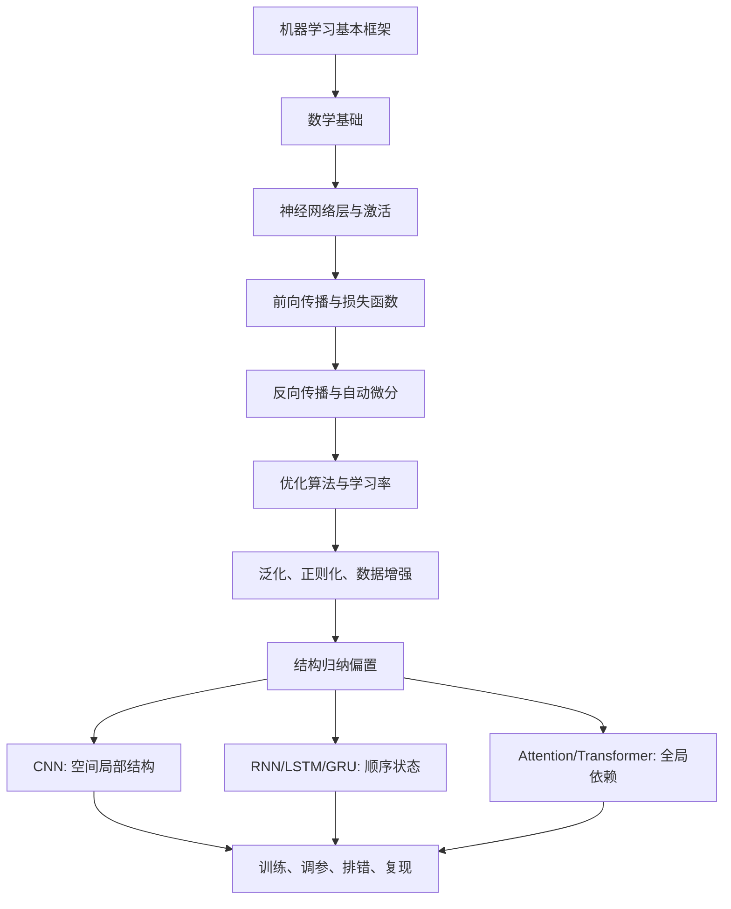

# 12 深度学习综合复习与实践手册

> Last researched: 2026-06-13  
> 目标：把前面数学、机器学习、神经网络、反向传播、优化、正则化、CNN、RNN、Attention、Transformer 和训练实践串成一套可复习、可落地的知识框架。

## 1. 一句话总览

深度学习可以压缩成一个闭环：

```text
数据 x, y
-> 模型 f_theta(x)
-> 损失 L(f_theta(x), y)
-> 自动微分计算 grad_theta L
-> 优化器更新 theta
-> 验证集评估泛化
-> 根据诊断结果调整数据、模型、损失、优化和正则化
```

不要把深度学习只理解成“搭网络结构”。网络结构只是模型部分，真正决定结果的是整个闭环是否正确：

- 数据是否干净、划分是否可靠、标签是否正确。
- 模型的归纳偏置是否适合数据。
- 损失函数是否真的对应任务目标。
- 优化器、学习率、batch size、初始化是否让训练稳定。
- 正则化、数据增强、早停是否控制了过拟合。
- 指标是否能反映真实业务目标。

## 2. 学习路线回顾



每一层学习都要回答 4 个问题：

| 问题 | 对应能力 |
| --- | --- |
| 它解决什么问题？ | 知道为什么要学 |
| 输入、输出、参数是什么？ | 能和代码 shape 对上 |
| 核心公式是什么？ | 能理解推导和梯度 |
| 常见失败模式是什么？ | 能 debug 训练过程 |

## 3. 核心概念地图

### 3.1 数据表示

深度学习框架中，一切输入最终都变成张量。

| 数据类型 | 原始形式 | 模型输入 |
| --- | --- | --- |
| 表格 | 行和列 | `[batch, features]` |
| 图像 | 像素矩阵 | `[batch, channels, height, width]` |
| 文本 | token 序列 | `[batch, seq_len]` 或 `[batch, seq_len, hidden]` |
| 音频 | 波形或频谱 | `[batch, time]` 或 `[batch, channels, freq, time]` |
| 时间序列 | 多变量时序 | `[batch, seq_len, features]` |

学习时要形成习惯：每遇到一个模型模块，先写清楚 shape。

```text
Linear:
X: [B, Din]
W: [Din, Dout]
Y = XW + b
Y: [B, Dout]

Conv2d:
X: [B, Cin, H, W]
K: [Cout, Cin, Kh, Kw]
Y: [B, Cout, Hout, Wout]

Self-Attention:
X: [B, T, D]
Q,K,V: [B, T, Dh]
Attention scores: [B, T, T]
Output: [B, T, Dh]
```

### 3.2 模型

模型是带参数的函数：

```text
y_hat = f_theta(x)
```

深度学习中，`theta` 通常是大量权重矩阵和偏置。模型结构决定了它更容易学习哪类规律，这叫归纳偏置。

| 模型 | 主要归纳偏置 | 适合数据 |
| --- | --- | --- |
| MLP | 特征间自由组合 | 表格、低维特征、分类头 |
| CNN | 局部性、参数共享、平移等变 | 图像、二维网格 |
| RNN/LSTM/GRU | 顺序递推、历史状态 | 中短序列、时间序列 |
| Transformer | token 间全局依赖、并行序列建模 | 文本、多模态、长距离关系 |

### 3.3 损失函数

损失函数把“预测好不好”变成一个可求导标量。

| 任务 | 输出 | 常用损失 | 注意点 |
| --- | --- | --- | --- |
| 多分类 | logits `[B, C]` | `CrossEntropyLoss` | 不要先 softmax |
| 二分类 | logits `[B]` 或 `[B, 1]` | `BCEWithLogitsLoss` | 不要先 sigmoid |
| 回归 | 数值 `[B, D]` | MSE / MAE / Huber | 目标量纲会影响 loss |
| 序列标注 | logits `[B, T, C]` | token-level CE | padding 位置要 ignore |
| 生成式语言模型 | next-token logits | causal CE | mask 不能泄漏未来 |

多分类交叉熵的常见写法：

```text
p_i = softmax(z)_i = exp(z_i) / sum_j exp(z_j)
L = -log p_y
```

`CrossEntropyLoss` 通常接收的是 logits，不是概率。它内部会做数值稳定的 `log_softmax + NLLLoss`。

### 3.4 梯度与优化

训练的本质是沿着损失下降方向更新参数：

```text
theta_{t+1} = theta_t - eta * grad_theta L(theta_t)
```

但真实深度学习训练中很少使用最朴素的全量梯度下降，更多使用 mini-batch、Momentum、Adam、AdamW 和学习率调度。

| 优化器 | 直觉 | 常用场景 |
| --- | --- | --- |
| SGD | 直接沿 mini-batch 梯度走 | 基础理解 |
| SGD + Momentum | 使用历史梯度平滑方向 | 经典视觉分类 |
| Adam | 一阶矩 + 二阶矩自适应学习率 | 默认起步、原型实验 |
| AdamW | 解耦 weight decay | Transformer、微调、大模型 |

Adam 的核心：

```text
m_t = beta1 m_{t-1} + (1-beta1) g_t
v_t = beta2 v_{t-1} + (1-beta2) g_t^2
theta = theta - lr * m_hat_t / (sqrt(v_hat_t) + eps)
```

其中 `m_t` 近似“平均方向”，`v_t` 近似“梯度尺度”。

## 4. 反向传播如何和代码对应

### 4.1 计算图视角

神经网络不是一个黑盒，而是一张计算图。

```text
x -> Linear -> ReLU -> Linear -> logits -> loss
```

反向传播从 `loss` 开始，按计算图反向应用链式法则，把梯度传到每个参数。

```text
dL/dlogits
-> dL/dW2, dL/dh1
-> dL/dz1
-> dL/dW1, dL/dx
```

### 4.2 PyTorch 训练三件事

```python
optimizer.zero_grad(set_to_none=True)
loss.backward()
optimizer.step()
```

含义：

| 代码 | 作用 |
| --- | --- |
| `zero_grad` | 清空上一轮累积梯度 |
| `loss.backward()` | 从标量 loss 出发计算梯度 |
| `optimizer.step()` | 根据梯度更新参数 |

常见顺序：

```python
model.train()

for x, y in train_loader:
    x = x.to(device)
    y = y.to(device)

    optimizer.zero_grad(set_to_none=True)
    logits = model(x)
    loss = loss_fn(logits, y)
    loss.backward()
    optimizer.step()
```

如果忘记清空梯度，PyTorch 会默认累积梯度。这在梯度累积训练中有用，但普通训练中通常是 bug。

### 4.3 验证循环必须关闭训练行为

```python
model.eval()

total_loss = 0.0
correct = 0
total = 0

with torch.no_grad():
    for x, y in val_loader:
        x = x.to(device)
        y = y.to(device)

        logits = model(x)
        loss = loss_fn(logits, y)
        pred = logits.argmax(dim=1)

        total_loss += loss.item() * y.size(0)
        correct += (pred == y).sum().item()
        total += y.size(0)

val_loss = total_loss / total
val_acc = correct / total
```

`model.eval()` 会影响 Dropout 和 BatchNorm；`torch.no_grad()` 会减少显存和计算图开销。

## 5. 从零搭一个最小训练工程

### 5.1 文件结构建议

```text
project/
  configs/
    baseline.yaml
  data/
  src/
    dataset.py
    model.py
    train.py
    evaluate.py
    utils.py
  runs/
  README.md
```

核心原则：数据、模型、训练循环、评估逻辑分开。原型阶段可以写在一个 notebook，但一旦要反复实验，就应该拆成可复现脚本。

### 5.2 配置文件

```yaml
seed: 42
device: cuda

data:
  name: cifar10
  image_size: 32
  batch_size: 128
  num_workers: 4

model:
  name: small_cnn
  num_classes: 10

optimizer:
  name: adamw
  lr: 0.0003
  weight_decay: 0.01

train:
  epochs: 50
  amp: true
  grad_clip: 1.0
```

配置文件的价值是让实验差异可追踪。不要只在代码里随手改学习率。

### 5.3 训练函数模板

```python
def train_one_epoch(model, loader, optimizer, loss_fn, device, grad_clip=None):
    model.train()
    total_loss = 0.0
    total = 0

    for x, y in loader:
        x = x.to(device, non_blocking=True)
        y = y.to(device, non_blocking=True)

        optimizer.zero_grad(set_to_none=True)
        logits = model(x)
        loss = loss_fn(logits, y)
        loss.backward()

        if grad_clip is not None:
            torch.nn.utils.clip_grad_norm_(model.parameters(), grad_clip)

        optimizer.step()

        batch_size = y.size(0)
        total_loss += loss.item() * batch_size
        total += batch_size

    return total_loss / total
```

### 5.4 AMP 混合精度模板

PyTorch 新版推荐使用 `torch.amp` 统一接口。CUDA 上 FP16 常和 `GradScaler` 配合；BF16 通常不需要 loss scaling。

```python
scaler = torch.amp.GradScaler("cuda")

for x, y in train_loader:
    x = x.to(device)
    y = y.to(device)

    optimizer.zero_grad(set_to_none=True)

    with torch.amp.autocast("cuda"):
        logits = model(x)
        loss = loss_fn(logits, y)

    scaler.scale(loss).backward()
    scaler.unscale_(optimizer)
    torch.nn.utils.clip_grad_norm_(model.parameters(), 1.0)
    scaler.step(optimizer)
    scaler.update()
```

如果使用 CPU 或 BF16，要根据当前 PyTorch 文档和硬件支持调整写法。

## 6. 常见模型结构怎么选

### 6.1 MLP

适合表格特征、简单分类头、embedding 后的浅层变换。

```python
class MLP(nn.Module):
    def __init__(self, input_dim, num_classes):
        super().__init__()
        self.net = nn.Sequential(
            nn.Linear(input_dim, 256),
            nn.ReLU(),
            nn.Dropout(0.2),
            nn.Linear(256, 128),
            nn.ReLU(),
            nn.Linear(128, num_classes),
        )

    def forward(self, x):
        return self.net(x)
```

排查重点：

- 输入特征是否标准化。
- 类别特征是否正确编码。
- 输出维度是否等于类别数。
- 是否把概率传给了 `CrossEntropyLoss`。

### 6.2 CNN

适合图像和有局部网格结构的数据。

```python
class SmallCNN(nn.Module):
    def __init__(self, num_classes=10):
        super().__init__()
        self.features = nn.Sequential(
            nn.Conv2d(3, 32, 3, padding=1, bias=False),
            nn.BatchNorm2d(32),
            nn.ReLU(inplace=True),
            nn.MaxPool2d(2),
            nn.Conv2d(32, 64, 3, padding=1, bias=False),
            nn.BatchNorm2d(64),
            nn.ReLU(inplace=True),
            nn.AdaptiveAvgPool2d((1, 1)),
        )
        self.classifier = nn.Linear(64, num_classes)

    def forward(self, x):
        x = self.features(x).flatten(1)
        return self.classifier(x)
```

排查重点：

- PyTorch 图像输入默认是 `[B, C, H, W]`。
- 图像像素是否归一化到合理范围。
- 数据增强是否破坏标签。
- 小数据集上训练大 CNN 是否过拟合。

### 6.3 RNN/LSTM/GRU

适合顺序信号，尤其是中短序列或显式时间状态很重要的任务。

```python
class TextRNN(nn.Module):
    def __init__(self, vocab_size, embed_dim, hidden_dim, num_classes, pad_id=0):
        super().__init__()
        self.embedding = nn.Embedding(vocab_size, embed_dim, padding_idx=pad_id)
        self.rnn = nn.GRU(embed_dim, hidden_dim, batch_first=True)
        self.classifier = nn.Linear(hidden_dim, num_classes)

    def forward(self, token_ids):
        x = self.embedding(token_ids)
        output, h_n = self.rnn(x)
        last = h_n[-1]
        return self.classifier(last)
```

排查重点：

- padding token 是否被 mask 或设置 `padding_idx`。
- 变长序列是否需要 `pack_padded_sequence`。
- 长序列是否出现梯度爆炸，需要梯度裁剪。
- `output` 和 `h_n` 含义是否混淆。

### 6.4 Transformer

适合需要建模 token 间全局关系的任务。

```python
encoder_layer = nn.TransformerEncoderLayer(
    d_model=128,
    nhead=8,
    dim_feedforward=512,
    batch_first=True,
)
encoder = nn.TransformerEncoder(encoder_layer, num_layers=2)

x = torch.randn(4, 20, 128)
y = encoder(x)
```

排查重点：

- 是否加入位置编码或位置相关机制。
- padding mask 是否正确。
- 自回归生成是否使用 causal mask。
- 序列长度增加时显存是否因为 attention score `[T, T]` 暴涨。

## 7. 训练曲线诊断

### 7.1 先看四条曲线

每次实验至少记录：

- train loss
- val loss
- train metric
- val metric

| 现象 | 可能原因 | 优先操作 |
| --- | --- | --- |
| train loss 不下降 | 学习率不合适、标签错、模型无梯度 | 小数据过拟合测试、检查梯度、调学习率 |
| train loss 降，val loss 升 | 过拟合 | 数据增强、weight decay、Dropout、早停 |
| train/val 都差 | 欠拟合或数据问题 | 增大模型、训练更久、检查数据和损失 |
| loss 直接 NaN | 学习率太大、输入异常、溢出 | 降 lr、检查输入范围、梯度裁剪 |
| 指标异常高 | 数据泄漏 | 检查划分、重复样本、预处理是否泄漏 |

### 7.2 小数据过拟合测试

这是最重要的 debug 技巧之一。

步骤：

1. 取 8 到 64 个样本。
2. 关闭强数据增强。
3. 用较小模型训练。
4. 观察训练 loss 是否能接近 0，训练 accuracy 是否能接近 100%。

如果做不到，优先怀疑：

- 标签和输入错位。
- loss 用错。
- 模型输出维度错。
- 梯度没有传到参数。
- 学习率过大或过小。
- 数据预处理把信息破坏了。

### 7.3 梯度检查

```python
for name, p in model.named_parameters():
    if p.grad is None:
        print(name, "grad is None")
    else:
        print(name, p.grad.norm().item())
```

如果关键层梯度一直是 `None`，说明它没有参与 loss 计算，或者参数被冻结。

如果梯度范数极大，可能需要降低学习率或做梯度裁剪。

如果梯度范数长期接近 0，可能是饱和激活、初始化问题、损失写错或网络太深。

## 8. 数据问题排查

很多训练问题不是模型问题，而是数据问题。

### 8.1 必查项

```python
x, y = next(iter(train_loader))
print(x.shape, x.dtype, x.min().item(), x.max().item())
print(y.shape, y.dtype, y[:10])
```

检查：

- shape 是否符合模型预期。
- dtype 是否正确。
- 图像范围是 `[0, 1]`、`[-1, 1]` 还是 `[0, 255]`。
- 标签是否从 0 开始且小于类别数。
- batch 中是否类别极端不均衡。

### 8.2 数据划分

正确划分：

```text
train: 更新参数
val: 调参、早停、模型选择
test: 最终报告，只使用一次或尽量少用
```

错误做法：

- 用测试集调学习率。
- 同一用户、同一视频、同一病例的相似样本同时出现在 train 和 test。
- 数据增强先做完再划分，导致增强版本泄漏到测试集。
- 标准化统计量使用了全量数据，而不是只用训练集估计。

### 8.3 类别不均衡

现象：

```text
accuracy 很高，但少数类 recall 很低。
```

处理方式：

- 使用 per-class precision、recall、F1。
- 观察混淆矩阵。
- 使用 class weight、重采样、focal loss 或更合适的数据采集。
- 不要只看 accuracy。

## 9. 正则化与泛化策略

### 9.1 从轻到重的处理顺序

1. 确认数据划分无泄漏。
2. 增加合理数据增强。
3. 使用 weight decay。
4. 使用早停。
5. 适当加入 Dropout。
6. 减小模型容量。
7. 收集更多数据或清洗标签。

不要一开始就叠满所有正则化。正则化太强会导致欠拟合。

### 9.2 常用策略对照

| 方法 | 解决问题 | 风险 |
| --- | --- | --- |
| Weight decay | 权重过大、过拟合 | 太大会欠拟合 |
| Dropout | 神经元共适应 | CNN/Transformer 中位置要谨慎 |
| Data augmentation | 数据不足、鲁棒性差 | 变换不合理会破坏标签 |
| Early stopping | 训练过久过拟合 | patience 太小可能提前停止 |
| Label smoothing | 过度自信 | 不适合所有任务 |
| BatchNorm | 训练不稳定 | 小 batch 时统计不稳 |
| LayerNorm | 序列模型稳定性 | 位置和归一化维度要正确 |

## 10. Attention 与 Transformer 深入复习

### 10.1 Q/K/V 的直觉

```text
Query: 我现在想找什么信息
Key: 每个位置提供什么索引特征
Value: 每个位置真正要汇总的内容
```

公式：

```text
Attention(Q, K, V) = softmax(QK^T / sqrt(d_k)) V
```

维度：

```text
Q: [B, Tq, Dk]
K: [B, Tk, Dk]
V: [B, Tk, Dv]
QK^T: [B, Tq, Tk]
Output: [B, Tq, Dv]
```

`sqrt(d_k)` 的作用是缩放点积，避免维度大时 softmax 过度饱和。

### 10.2 三种 attention

| 类型 | Q 来自 | K/V 来自 | 用途 |
| --- | --- | --- | --- |
| Self-Attention | 当前序列 | 当前序列 | 序列内部关系 |
| Masked Self-Attention | 目标前缀 | 目标前缀 | 自回归生成 |
| Cross-Attention | decoder 状态 | encoder 输出 | 翻译、摘要等 seq2seq |

### 10.3 Encoder-only、Decoder-only、Encoder-Decoder

| 架构 | 代表任务 | 注意力特点 |
| --- | --- | --- |
| Encoder-only | 分类、检索、理解 | 双向 self-attention |
| Decoder-only | 语言模型、生成 | causal self-attention |
| Encoder-Decoder | 翻译、摘要 | encoder 编码，decoder cross-attention 读取 |

### 10.4 Transformer block

现代常见 Pre-LN 写法：

```text
x = x + SelfAttention(LayerNorm(x))
x = x + FFN(LayerNorm(x))
```

FFN 对每个 token 独立应用：

```text
FFN(x) = W2 phi(W1 x + b1) + b2
```

通常：

```text
d_ff = 4 * d_model
```

注意：self-attention 负责 token 间信息交换，FFN 负责每个 token 内部的非线性变换。

## 11. 公式和代码的对应关系

### 11.1 线性层

公式：

```text
Y = XW + b
```

PyTorch：

```python
layer = nn.Linear(Din, Dout)
y = layer(x)
```

注意 PyTorch 内部权重 shape 通常显示为 `[Dout, Din]`，但数学上常写作 `[Din, Dout]`。这是实现细节，理解输入输出 shape 更重要。

### 11.2 Softmax 交叉熵

公式：

```text
L = -log softmax(logits)_y
```

PyTorch：

```python
loss = nn.CrossEntropyLoss()(logits, labels)
```

要求：

```text
logits: [B, C]
labels: [B], dtype long, value in [0, C-1]
```

### 11.3 二分类

公式：

```text
p = sigmoid(z)
L = -[y log(p) + (1-y) log(1-p)]
```

PyTorch：

```python
loss = nn.BCEWithLogitsLoss()(logits, targets.float())
```

`BCEWithLogitsLoss` 把 sigmoid 和 BCE 合在一起，数值更稳定。

## 12. 面向项目的完整检查清单

### 12.1 开始训练前

- 数据样本能被正确读取。
- 标签范围和类别数匹配。
- train/val/test 划分无泄漏。
- 输入 shape 和 dtype 正确。
- 模型输出 shape 正确。
- loss 接收的是 logits 还是概率已经确认。
- 一个 batch 能完成 forward、loss、backward、step。
- 日志能记录 loss、metric、学习率、配置和随机种子。

### 12.2 第一次跑通

- 先在小数据上过拟合。
- 再在完整训练集上跑 1 到 3 个 epoch。
- 观察 loss 是否下降。
- 保存 checkpoint。
- 固定随机种子。
- 记录环境版本。

### 12.3 正式实验

- 每次只改一个主要变量。
- 实验名包含模型、数据、关键超参数。
- 保存最优验证指标对应的模型。
- 不用测试集做调参。
- 最终报告包含均值、方差或多次运行结果，尤其是小数据任务。

## 13. 常见错误速查

| 错误 | 典型报错或现象 | 处理 |
| --- | --- | --- |
| 标签越界 | `Target X is out of bounds` | 检查类别是否从 0 到 C-1 |
| CE 前手动 softmax | loss 降得慢或不稳定 | 直接传 logits |
| BCE 前手动 sigmoid | 数值不稳定 | 用 `BCEWithLogitsLoss` |
| 忘记 `model.eval()` | 验证指标波动异常 | 验证和推理前调用 |
| 忘记 `zero_grad` | 梯度异常累积 | 每 step 前清梯度 |
| shape 顺序错 | CNN 输出尺寸不对 | PyTorch 用 `[B,C,H,W]` |
| padding 未 mask | 序列模型学到 padding | 使用 `padding_idx`、mask、`ignore_index` |
| 学习率太大 | loss NaN 或震荡 | 降 lr、warmup、梯度裁剪 |
| 数据泄漏 | 测试集异常高 | 重新检查划分和预处理 |

## 14. 如何配合前面章节复习

| 当前疑问 | 回看章节 |
| --- | --- |
| 公式和 shape 看不懂 | [01_math_foundations.md](01_数学基础.md) |
| 不懂损失、泛化、评估 | [02_machine_learning_basics.md](02_机器学习基础.md) |
| 不懂层、激活、MLP | [03_neural_network_foundations.md](03_神经网络基础.md) |
| 不懂梯度怎么来 | [04_backpropagation.md](04_反向传播.md) |
| loss 不降、学习率怎么调 | [05_optimization.md](05_优化算法.md) |
| 过拟合、正则化怎么选 | [06_regularization_generalization.md](06_正则化与泛化.md) |
| 图像模型结构 | [07_cnn.md](07_CNN.md) |
| 序列模型、LSTM、GRU | [08_rnn_sequence.md](08_RNN.md) |
| Attention、Transformer | [09_attention_transformer.md](09_Attention 与 Transformer.md) |
| 训练工程和 debug | [10_training_practice.md](10_深度学习训练实践.md) |
| 公式快速查阅 | [11_formula_index.md](11_常用公式索引.md) |

## 15. 参考资料与延伸阅读

- [Official book: Deep Learning Book, Ian Goodfellow, Yoshua Bengio, Aaron Courville](https://www.deeplearningbook.org/)
- [Official book: Dive into Deep Learning](https://d2l.ai/)
- [Official course notes: CS231n Deep Learning for Computer Vision](https://cs231n.github.io/)
- [Official docs: PyTorch `torch.utils.data`](https://docs.pytorch.org/docs/stable/data.html)
- [Official docs: PyTorch `CrossEntropyLoss`](https://docs.pytorch.org/docs/stable/generated/torch.nn.CrossEntropyLoss.html)
- [Official docs: PyTorch `BCEWithLogitsLoss`](https://docs.pytorch.org/docs/stable/generated/torch.nn.BCEWithLogitsLoss.html)
- [Official docs: PyTorch Automatic Mixed Precision `torch.amp`](https://docs.pytorch.org/docs/stable/amp.html)
- [Paper: Attention Is All You Need](https://arxiv.org/abs/1706.03762)
- [Paper: Adam: A Method for Stochastic Optimization](https://arxiv.org/abs/1412.6980)
- [Paper: Batch Normalization: Accelerating Deep Network Training by Reducing Internal Covariate Shift](https://arxiv.org/abs/1502.03167)
- [Paper: Dropout: A Simple Way to Prevent Neural Networks from Overfitting](https://jmlr.org/papers/v15/srivastava14a.html)
- [Explainer: Understanding LSTM Networks, Christopher Olah](https://colah.github.io/posts/2015-08-Understanding-LSTMs/)
- [Community note: PyTorch 训练流程 `zero_grad`、`backward`、`step` 实践说明](https://blog.csdn.net/weixin_48018951/article/details/130410944)
- [Community note: 反向传播学习笔记，博客园](https://www.cnblogs.com/charlotte77/p/5629865.html)
- [Community note: Transformer 学习笔记，掘金](https://juejin.cn/post/7448945963686101030)
