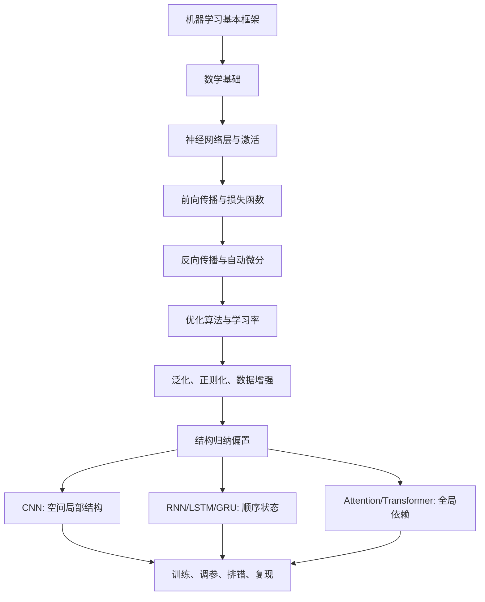
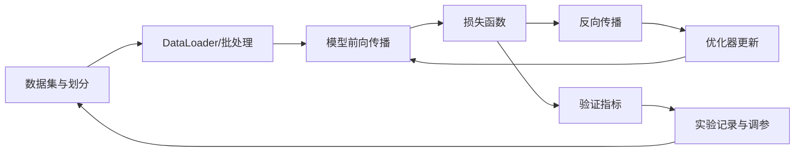
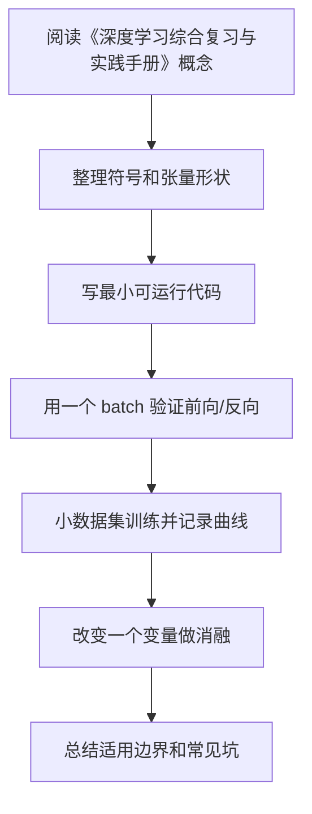

# 12 深度学习综合复习与实践手册

<!-- lecture-notes:integrated-v2 -->

## 讲义导读：从数据到可训练模型

这一章讲的是 **12 深度学习综合复习与实践手册**，属于 **深度学习复习与实践**。读深度学习时，不要从“这个网络叫什么名字”开始，而要先抓住一条主线：数据进入模型，模型做前向计算，损失函数衡量预测和目标的差距，反向传播计算梯度，优化器更新参数，验证集和错误样本判断它是不是真的学到了规律。

### 一句话先懂

综合复习要把知识从章节重新组织成项目流程：定义任务、准备数据、建立基线、训练模型、诊断错误、迭代改进。

初学时先问三个问题：输入张量是什么形状，模型把它变成了什么输出，loss 和指标分别在评价什么。只要这三个问题不清楚，后面的公式和代码就很容易变成死记硬背。

### 通俗类比

综合实践像做一场完整项目交付，不是展示单个零件，而是证明从需求到结果每一步都能解释、能复现、能改进。

类比只是帮助入门。真正训练模型时，要把类比落回张量形状、参数、梯度、学习率、正则化、数据划分、指标和错误样本这些可检查对象上。

### 本章学习主线

1. **先看任务和数据**：输入是什么，标签是什么，数据有没有泄漏、偏差、类别不平衡或标注噪声？
2. **再看模型结构**：每一层输入输出形状是什么，参数量是多少，为什么这个结构适合当前数据？
3. **然后看训练信号**：损失函数是否匹配任务，梯度能否稳定传递，优化器和学习率是否合理？
4. **接着看泛化能力**：训练集、验证集、测试集是否分清，过拟合和欠拟合分别从曲线哪里看出来？
5. **最后看复现与诊断**：保存配置、随机种子、版本、指标曲线、checkpoint 和错误样本，而不是只保存一个最终分数。

### 本章重点抓手

项目闭环、知识串联、实验设计、消融实验、指标选择、错误分析、复现清单和面试/考试复盘。

### 最小实践任务

完成一个端到端小项目，提交数据说明、模型结构、训练曲线、指标、错误分析和下一步改进计划。

建议每次实验都记录：数据版本、预处理、模型结构、超参数、随机种子、训练曲线、验证指标、错误样本和一次改动的理由。深度学习最怕“调参靠感觉”；讲义里的每个结论都应尽量能被一段代码、一张曲线或一组错误样本验证。

### 常见误区

- 复习时按章节背，做项目时不会串起来。
- 没有基线和消融，无法说明改进来自哪里。
- 只报最好结果，不报告失败和限制。

### 推荐工具

PyTorch/TensorFlow/Keras、NumPy、Jupyter、TensorBoard、Weights & Biases、scikit-learn 指标、Hugging Face Transformers。

### 读完本章应该能做到

- 用自己的话解释本章概念，并能指出它在“数据 -> 模型 -> 损失 -> 梯度 -> 优化 -> 评估”链路中的位置。
- 写出一个最小可运行例子，打印关键张量形状和训练指标。
- 解释至少一个训练失败现象，例如 loss 不降、过拟合、梯度爆炸、指标虚高或预测偏置。
- 给出一个可复现实验记录，而不是只给最终结果。

> 本节是讲义化改写后的阅读入口。后续正文中的公式、结构图、代码和参考资料，都应围绕“可训练链路 + 可诊断证据”来理解。

> Last researched: 2026-06-13  
> 目标：把前面数学、机器学习、神经网络、反向传播、优化、正则化、CNN、RNN、Attention、Transformer 和训练实践串成一套可复习、可落地的知识框架。


## 1. 一句话总览

深度学习可以压缩成一个闭环：

```text
数据 x, y
-> 模型 f_theta(x)
-> 损失 L(f_theta(x), y)
-> 自动微分计算 grad_theta L
-> 优化器更新 theta
-> 验证集评估泛化
-> 根据诊断结果调整数据、模型、损失、优化和正则化
```

不要把深度学习只理解成“搭网络结构”。网络结构只是模型部分，真正决定结果的是整个闭环是否正确：

- 数据是否干净、划分是否可靠、标签是否正确。
- 模型的归纳偏置是否适合数据。
- 损失函数是否真的对应任务目标。
- 优化器、学习率、batch size、初始化是否让训练稳定。
- 正则化、数据增强、早停是否控制了过拟合。
- 指标是否能反映真实业务目标。

## 2. 学习路线回顾



每一层学习都要回答 4 个问题：

| 问题 | 对应能力 |
| --- | --- |
| 它解决什么问题？ | 知道为什么要学 |
| 输入、输出、参数是什么？ | 能和代码 shape 对上 |
| 核心公式是什么？ | 能理解推导和梯度 |
| 常见失败模式是什么？ | 能 debug 训练过程 |

## 3. 核心概念地图

### 3.1 数据表示

深度学习框架中，一切输入最终都变成张量。

| 数据类型 | 原始形式 | 模型输入 |
| --- | --- | --- |
| 表格 | 行和列 | `[batch, features]` |
| 图像 | 像素矩阵 | `[batch, channels, height, width]` |
| 文本 | token 序列 | `[batch, seq_len]` 或 `[batch, seq_len, hidden]` |
| 音频 | 波形或频谱 | `[batch, time]` 或 `[batch, channels, freq, time]` |
| 时间序列 | 多变量时序 | `[batch, seq_len, features]` |

学习时要形成习惯：每遇到一个模型模块，先写清楚 shape。

```text
Linear:
X: [B, Din]
W: [Din, Dout]
Y = XW + b
Y: [B, Dout]

Conv2d:
X: [B, Cin, H, W]
K: [Cout, Cin, Kh, Kw]
Y: [B, Cout, Hout, Wout]

Self-Attention:
X: [B, T, D]
Q,K,V: [B, T, Dh]
Attention scores: [B, T, T]
Output: [B, T, Dh]
```

### 3.2 模型

模型是带参数的函数：

```text
y_hat = f_theta(x)
```

深度学习中，`theta` 通常是大量权重矩阵和偏置。模型结构决定了它更容易学习哪类规律，这叫归纳偏置。

| 模型 | 主要归纳偏置 | 适合数据 |
| --- | --- | --- |
| MLP | 特征间自由组合 | 表格、低维特征、分类头 |
| CNN | 局部性、参数共享、平移等变 | 图像、二维网格 |
| RNN/LSTM/GRU | 顺序递推、历史状态 | 中短序列、时间序列 |
| Transformer | token 间全局依赖、并行序列建模 | 文本、多模态、长距离关系 |

### 3.3 损失函数

损失函数把“预测好不好”变成一个可求导标量。

| 任务 | 输出 | 常用损失 | 注意点 |
| --- | --- | --- | --- |
| 多分类 | logits `[B, C]` | `CrossEntropyLoss` | 不要先 softmax |
| 二分类 | logits `[B]` 或 `[B, 1]` | `BCEWithLogitsLoss` | 不要先 sigmoid |
| 回归 | 数值 `[B, D]` | MSE / MAE / Huber | 目标量纲会影响 loss |
| 序列标注 | logits `[B, T, C]` | token-level CE | padding 位置要 ignore |
| 生成式语言模型 | next-token logits | causal CE | mask 不能泄漏未来 |

多分类交叉熵的常见写法：

```text
p_i = softmax(z)_i = exp(z_i) / sum_j exp(z_j)
L = -log p_y
```

`CrossEntropyLoss` 通常接收的是 logits，不是概率。它内部会做数值稳定的 `log_softmax + NLLLoss`。

### 3.4 梯度与优化

训练的本质是沿着损失下降方向更新参数：

```text
theta_{t+1} = theta_t - eta * grad_theta L(theta_t)
```

但真实深度学习训练中很少使用最朴素的全量梯度下降，更多使用 mini-batch、Momentum、Adam、AdamW 和学习率调度。

| 优化器 | 直觉 | 常用场景 |
| --- | --- | --- |
| SGD | 直接沿 mini-batch 梯度走 | 基础理解 |
| SGD + Momentum | 使用历史梯度平滑方向 | 经典视觉分类 |
| Adam | 一阶矩 + 二阶矩自适应学习率 | 默认起步、原型实验 |
| AdamW | 解耦 weight decay | Transformer、微调、大模型 |

Adam 的核心：

```text
m_t = beta1 m_{t-1} + (1-beta1) g_t
v_t = beta2 v_{t-1} + (1-beta2) g_t^2
theta = theta - lr * m_hat_t / (sqrt(v_hat_t) + eps)
```

其中 `m_t` 近似“平均方向”，`v_t` 近似“梯度尺度”。

## 4. 反向传播如何和代码对应

### 4.1 计算图视角

神经网络不是一个黑盒，而是一张计算图。

```text
x -> Linear -> ReLU -> Linear -> logits -> loss
```

反向传播从 `loss` 开始，按计算图反向应用链式法则，把梯度传到每个参数。

```text
dL/dlogits
-> dL/dW2, dL/dh1
-> dL/dz1
-> dL/dW1, dL/dx
```

### 4.2 PyTorch 训练三件事

```python
optimizer.zero_grad(set_to_none=True)
loss.backward()
optimizer.step()
```

含义：

| 代码 | 作用 |
| --- | --- |
| `zero_grad` | 清空上一轮累积梯度 |
| `loss.backward()` | 从标量 loss 出发计算梯度 |
| `optimizer.step()` | 根据梯度更新参数 |

常见顺序：

```python
model.train()

for x, y in train_loader:
    x = x.to(device)
    y = y.to(device)

    optimizer.zero_grad(set_to_none=True)
    logits = model(x)
    loss = loss_fn(logits, y)
    loss.backward()
    optimizer.step()
```

如果忘记清空梯度，PyTorch 会默认累积梯度。这在梯度累积训练中有用，但普通训练中通常是 bug。

### 4.3 验证循环必须关闭训练行为

```python
model.eval()

total_loss = 0.0
correct = 0
total = 0

with torch.no_grad():
    for x, y in val_loader:
        x = x.to(device)
        y = y.to(device)

        logits = model(x)
        loss = loss_fn(logits, y)
        pred = logits.argmax(dim=1)

        total_loss += loss.item() * y.size(0)
        correct += (pred == y).sum().item()
        total += y.size(0)

val_loss = total_loss / total
val_acc = correct / total
```

`model.eval()` 会影响 Dropout 和 BatchNorm；`torch.no_grad()` 会减少显存和计算图开销。

## 5. 从零搭一个最小训练工程

### 5.1 文件结构建议

```text
project/
  configs/
    baseline.yaml
  data/
  src/
    dataset.py
    model.py
    train.py
    evaluate.py
    utils.py
  runs/
  README.md
```

核心原则：数据、模型、训练循环、评估逻辑分开。原型阶段可以写在一个 notebook，但一旦要反复实验，就应该拆成可复现脚本。

### 5.2 配置文件

```yaml
seed: 42
device: cuda

data:
  name: cifar10
  image_size: 32
  batch_size: 128
  num_workers: 4

model:
  name: small_cnn
  num_classes: 10

optimizer:
  name: adamw
  lr: 0.0003
  weight_decay: 0.01

train:
  epochs: 50
  amp: true
  grad_clip: 1.0
```

配置文件的价值是让实验差异可追踪。不要只在代码里随手改学习率。

### 5.3 训练函数模板

```python
def train_one_epoch(model, loader, optimizer, loss_fn, device, grad_clip=None):
    model.train()
    total_loss = 0.0
    total = 0

    for x, y in loader:
        x = x.to(device, non_blocking=True)
        y = y.to(device, non_blocking=True)

        optimizer.zero_grad(set_to_none=True)
        logits = model(x)
        loss = loss_fn(logits, y)
        loss.backward()

        if grad_clip is not None:
            torch.nn.utils.clip_grad_norm_(model.parameters(), grad_clip)

        optimizer.step()

        batch_size = y.size(0)
        total_loss += loss.item() * batch_size
        total += batch_size

    return total_loss / total
```

### 5.4 AMP 混合精度模板

PyTorch 新版推荐使用 `torch.amp` 统一接口。CUDA 上 FP16 常和 `GradScaler` 配合；BF16 通常不需要 loss scaling。

```python
scaler = torch.amp.GradScaler("cuda")

for x, y in train_loader:
    x = x.to(device)
    y = y.to(device)

    optimizer.zero_grad(set_to_none=True)

    with torch.amp.autocast("cuda"):
        logits = model(x)
        loss = loss_fn(logits, y)

    scaler.scale(loss).backward()
    scaler.unscale_(optimizer)
    torch.nn.utils.clip_grad_norm_(model.parameters(), 1.0)
    scaler.step(optimizer)
    scaler.update()
```

如果使用 CPU 或 BF16，要根据当前 PyTorch 文档和硬件支持调整写法。

## 6. 常见模型结构怎么选

### 6.1 MLP

适合表格特征、简单分类头、embedding 后的浅层变换。

```python
class MLP(nn.Module):
    def __init__(self, input_dim, num_classes):
        super().__init__()
        self.net = nn.Sequential(
            nn.Linear(input_dim, 256),
            nn.ReLU(),
            nn.Dropout(0.2),
            nn.Linear(256, 128),
            nn.ReLU(),
            nn.Linear(128, num_classes),
        )

    def forward(self, x):
        return self.net(x)
```

排查重点：

- 输入特征是否标准化。
- 类别特征是否正确编码。
- 输出维度是否等于类别数。
- 是否把概率传给了 `CrossEntropyLoss`。

### 6.2 CNN

适合图像和有局部网格结构的数据。

```python
class SmallCNN(nn.Module):
    def __init__(self, num_classes=10):
        super().__init__()
        self.features = nn.Sequential(
            nn.Conv2d(3, 32, 3, padding=1, bias=False),
            nn.BatchNorm2d(32),
            nn.ReLU(inplace=True),
            nn.MaxPool2d(2),
            nn.Conv2d(32, 64, 3, padding=1, bias=False),
            nn.BatchNorm2d(64),
            nn.ReLU(inplace=True),
            nn.AdaptiveAvgPool2d((1, 1)),
        )
        self.classifier = nn.Linear(64, num_classes)

    def forward(self, x):
        x = self.features(x).flatten(1)
        return self.classifier(x)
```

排查重点：

- PyTorch 图像输入默认是 `[B, C, H, W]`。
- 图像像素是否归一化到合理范围。
- 数据增强是否破坏标签。
- 小数据集上训练大 CNN 是否过拟合。

### 6.3 RNN/LSTM/GRU

适合顺序信号，尤其是中短序列或显式时间状态很重要的任务。

```python
class TextRNN(nn.Module):
    def __init__(self, vocab_size, embed_dim, hidden_dim, num_classes, pad_id=0):
        super().__init__()
        self.embedding = nn.Embedding(vocab_size, embed_dim, padding_idx=pad_id)
        self.rnn = nn.GRU(embed_dim, hidden_dim, batch_first=True)
        self.classifier = nn.Linear(hidden_dim, num_classes)

    def forward(self, token_ids):
        x = self.embedding(token_ids)
        output, h_n = self.rnn(x)
        last = h_n[-1]
        return self.classifier(last)
```

排查重点：

- padding token 是否被 mask 或设置 `padding_idx`。
- 变长序列是否需要 `pack_padded_sequence`。
- 长序列是否出现梯度爆炸，需要梯度裁剪。
- `output` 和 `h_n` 含义是否混淆。

### 6.4 Transformer

适合需要建模 token 间全局关系的任务。

```python
encoder_layer = nn.TransformerEncoderLayer(
    d_model=128,
    nhead=8,
    dim_feedforward=512,
    batch_first=True,
)
encoder = nn.TransformerEncoder(encoder_layer, num_layers=2)

x = torch.randn(4, 20, 128)
y = encoder(x)
```

排查重点：

- 是否加入位置编码或位置相关机制。
- padding mask 是否正确。
- 自回归生成是否使用 causal mask。
- 序列长度增加时显存是否因为 attention score `[T, T]` 暴涨。

## 7. 训练曲线诊断

### 7.1 先看四条曲线

每次实验至少记录：

- train loss
- val loss
- train metric
- val metric

| 现象 | 可能原因 | 优先操作 |
| --- | --- | --- |
| train loss 不下降 | 学习率不合适、标签错、模型无梯度 | 小数据过拟合测试、检查梯度、调学习率 |
| train loss 降，val loss 升 | 过拟合 | 数据增强、weight decay、Dropout、早停 |
| train/val 都差 | 欠拟合或数据问题 | 增大模型、训练更久、检查数据和损失 |
| loss 直接 NaN | 学习率太大、输入异常、溢出 | 降 lr、检查输入范围、梯度裁剪 |
| 指标异常高 | 数据泄漏 | 检查划分、重复样本、预处理是否泄漏 |

### 7.2 小数据过拟合测试

这是最重要的 debug 技巧之一。

步骤：

1. 取 8 到 64 个样本。
2. 关闭强数据增强。
3. 用较小模型训练。
4. 观察训练 loss 是否能接近 0，训练 accuracy 是否能接近 100%。

如果做不到，优先怀疑：

- 标签和输入错位。
- loss 用错。
- 模型输出维度错。
- 梯度没有传到参数。
- 学习率过大或过小。
- 数据预处理把信息破坏了。

### 7.3 梯度检查

```python
for name, p in model.named_parameters():
    if p.grad is None:
        print(name, "grad is None")
    else:
        print(name, p.grad.norm().item())
```

如果关键层梯度一直是 `None`，说明它没有参与 loss 计算，或者参数被冻结。

如果梯度范数极大，可能需要降低学习率或做梯度裁剪。

如果梯度范数长期接近 0，可能是饱和激活、初始化问题、损失写错或网络太深。

## 8. 数据问题排查

很多训练问题不是模型问题，而是数据问题。

### 8.1 必查项

```python
x, y = next(iter(train_loader))
print(x.shape, x.dtype, x.min().item(), x.max().item())
print(y.shape, y.dtype, y[:10])
```

检查：

- shape 是否符合模型预期。
- dtype 是否正确。
- 图像范围是 `[0, 1]`、`[-1, 1]` 还是 `[0, 255]`。
- 标签是否从 0 开始且小于类别数。
- batch 中是否类别极端不均衡。

### 8.2 数据划分

正确划分：

```text
train: 更新参数
val: 调参、早停、模型选择
test: 最终报告，只使用一次或尽量少用
```

错误做法：

- 用测试集调学习率。
- 同一用户、同一视频、同一病例的相似样本同时出现在 train 和 test。
- 数据增强先做完再划分，导致增强版本泄漏到测试集。
- 标准化统计量使用了全量数据，而不是只用训练集估计。

### 8.3 类别不均衡

现象：

```text
accuracy 很高，但少数类 recall 很低。
```

处理方式：

- 使用 per-class precision、recall、F1。
- 观察混淆矩阵。
- 使用 class weight、重采样、focal loss 或更合适的数据采集。
- 不要只看 accuracy。

## 9. 正则化与泛化策略

### 9.1 从轻到重的处理顺序

1. 确认数据划分无泄漏。
2. 增加合理数据增强。
3. 使用 weight decay。
4. 使用早停。
5. 适当加入 Dropout。
6. 减小模型容量。
7. 收集更多数据或清洗标签。

不要一开始就叠满所有正则化。正则化太强会导致欠拟合。

### 9.2 常用策略对照

| 方法 | 解决问题 | 风险 |
| --- | --- | --- |
| Weight decay | 权重过大、过拟合 | 太大会欠拟合 |
| Dropout | 神经元共适应 | CNN/Transformer 中位置要谨慎 |
| Data augmentation | 数据不足、鲁棒性差 | 变换不合理会破坏标签 |
| Early stopping | 训练过久过拟合 | patience 太小可能提前停止 |
| Label smoothing | 过度自信 | 不适合所有任务 |
| BatchNorm | 训练不稳定 | 小 batch 时统计不稳 |
| LayerNorm | 序列模型稳定性 | 位置和归一化维度要正确 |

## 10. Attention 与 Transformer 深入复习

### 10.1 Q/K/V 的直觉

```text
Query: 我现在想找什么信息
Key: 每个位置提供什么索引特征
Value: 每个位置真正要汇总的内容
```

公式：

```text
Attention(Q, K, V) = softmax(QK^T / sqrt(d_k)) V
```

维度：

```text
Q: [B, Tq, Dk]
K: [B, Tk, Dk]
V: [B, Tk, Dv]
QK^T: [B, Tq, Tk]
Output: [B, Tq, Dv]
```

`sqrt(d_k)` 的作用是缩放点积，避免维度大时 softmax 过度饱和。

### 10.2 三种 attention

| 类型 | Q 来自 | K/V 来自 | 用途 |
| --- | --- | --- | --- |
| Self-Attention | 当前序列 | 当前序列 | 序列内部关系 |
| Masked Self-Attention | 目标前缀 | 目标前缀 | 自回归生成 |
| Cross-Attention | decoder 状态 | encoder 输出 | 翻译、摘要等 seq2seq |

### 10.3 Encoder-only、Decoder-only、Encoder-Decoder

| 架构 | 代表任务 | 注意力特点 |
| --- | --- | --- |
| Encoder-only | 分类、检索、理解 | 双向 self-attention |
| Decoder-only | 语言模型、生成 | causal self-attention |
| Encoder-Decoder | 翻译、摘要 | encoder 编码，decoder cross-attention 读取 |

### 10.4 Transformer block

现代常见 Pre-LN 写法：

```text
x = x + SelfAttention(LayerNorm(x))
x = x + FFN(LayerNorm(x))
```

FFN 对每个 token 独立应用：

```text
FFN(x) = W2 phi(W1 x + b1) + b2
```

通常：

```text
d_ff = 4 * d_model
```

注意：self-attention 负责 token 间信息交换，FFN 负责每个 token 内部的非线性变换。

## 11. 公式和代码的对应关系

### 11.1 线性层

公式：

```text
Y = XW + b
```

PyTorch：

```python
layer = nn.Linear(Din, Dout)
y = layer(x)
```

注意 PyTorch 内部权重 shape 通常显示为 `[Dout, Din]`，但数学上常写作 `[Din, Dout]`。这是实现细节，理解输入输出 shape 更重要。

### 11.2 Softmax 交叉熵

公式：

```text
L = -log softmax(logits)_y
```

PyTorch：

```python
loss = nn.CrossEntropyLoss()(logits, labels)
```

要求：

```text
logits: [B, C]
labels: [B], dtype long, value in [0, C-1]
```

### 11.3 二分类

公式：

```text
p = sigmoid(z)
L = -[y log(p) + (1-y) log(1-p)]
```

PyTorch：

```python
loss = nn.BCEWithLogitsLoss()(logits, targets.float())
```

`BCEWithLogitsLoss` 把 sigmoid 和 BCE 合在一起，数值更稳定。

## 12. 面向项目的完整检查清单

### 12.1 开始训练前

- 数据样本能被正确读取。
- 标签范围和类别数匹配。
- train/val/test 划分无泄漏。
- 输入 shape 和 dtype 正确。
- 模型输出 shape 正确。
- loss 接收的是 logits 还是概率已经确认。
- 一个 batch 能完成 forward、loss、backward、step。
- 日志能记录 loss、metric、学习率、配置和随机种子。

### 12.2 第一次跑通

- 先在小数据上过拟合。
- 再在完整训练集上跑 1 到 3 个 epoch。
- 观察 loss 是否下降。
- 保存 checkpoint。
- 固定随机种子。
- 记录环境版本。

### 12.3 正式实验

- 每次只改一个主要变量。
- 实验名包含模型、数据、关键超参数。
- 保存最优验证指标对应的模型。
- 不用测试集做调参。
- 最终报告包含均值、方差或多次运行结果，尤其是小数据任务。

## 13. 常见错误速查

| 错误 | 典型报错或现象 | 处理 |
| --- | --- | --- |
| 标签越界 | `Target X is out of bounds` | 检查类别是否从 0 到 C-1 |
| CE 前手动 softmax | loss 降得慢或不稳定 | 直接传 logits |
| BCE 前手动 sigmoid | 数值不稳定 | 用 `BCEWithLogitsLoss` |
| 忘记 `model.eval()` | 验证指标波动异常 | 验证和推理前调用 |
| 忘记 `zero_grad` | 梯度异常累积 | 每 step 前清梯度 |
| shape 顺序错 | CNN 输出尺寸不对 | PyTorch 用 `[B,C,H,W]` |
| padding 未 mask | 序列模型学到 padding | 使用 `padding_idx`、mask、`ignore_index` |
| 学习率太大 | loss NaN 或震荡 | 降 lr、warmup、梯度裁剪 |
| 数据泄漏 | 测试集异常高 | 重新检查划分和预处理 |

## 14. 如何配合前面章节复习

| 当前疑问 | 回看章节 |
| --- | --- |
| 公式和 shape 看不懂 | [01_math_foundations.md](01_数学基础.md) |
| 不懂损失、泛化、评估 | [02_machine_learning_basics.md](02_机器学习基础.md) |
| 不懂层、激活、MLP | [03_neural_network_foundations.md](03_神经网络基础.md) |
| 不懂梯度怎么来 | [04_backpropagation.md](04_反向传播.md) |
| loss 不降、学习率怎么调 | [05_optimization.md](05_优化算法.md) |
| 过拟合、正则化怎么选 | [06_regularization_generalization.md](06_正则化与泛化.md) |
| 图像模型结构 | [07_cnn.md](07_CNN.md) |
| 序列模型、LSTM、GRU | [08_rnn_sequence.md](08_RNN.md) |
| Attention、Transformer | [09_attention_transformer.md](09_Attention 与 Transformer.md) |
| 训练工程和 debug | [10_training_practice.md](10_深度学习训练实践.md) |
| 公式快速查阅 | [11_formula_index.md](11_常用公式索引.md) |

## 15. 参考资料与延伸阅读

- [Official book: Deep Learning Book, Ian Goodfellow, Yoshua Bengio, Aaron Courville](https://www.deeplearningbook.org/)
- [Official book: Dive into Deep Learning](https://d2l.ai/)
- [Official course notes: CS231n Deep Learning for Computer Vision](https://cs231n.github.io/)
- [Official docs: PyTorch `torch.utils.data`](https://docs.pytorch.org/docs/stable/data.html)
- [Official docs: PyTorch `CrossEntropyLoss`](https://docs.pytorch.org/docs/stable/generated/torch.nn.CrossEntropyLoss.html)
- [Official docs: PyTorch `BCEWithLogitsLoss`](https://docs.pytorch.org/docs/stable/generated/torch.nn.BCEWithLogitsLoss.html)
- [Official docs: PyTorch Automatic Mixed Precision `torch.amp`](https://docs.pytorch.org/docs/stable/amp.html)
- [Paper: Attention Is All You Need](https://arxiv.org/abs/1706.03762)
- [Paper: Adam: A Method for Stochastic Optimization](https://arxiv.org/abs/1412.6980)
- [Paper: Batch Normalization: Accelerating Deep Network Training by Reducing Internal Covariate Shift](https://arxiv.org/abs/1502.03167)
- [Paper: Dropout: A Simple Way to Prevent Neural Networks from Overfitting](https://jmlr.org/papers/v15/srivastava14a.html)
- [Explainer: Understanding LSTM Networks, Christopher Olah](https://colah.github.io/posts/2015-08-Understanding-LSTMs/)
- [Community note: PyTorch 训练流程 `zero_grad`、`backward`、`step` 实践说明](https://blog.csdn.net/weixin_48018951/article/details/130410944)
- [Community note: 反向传播学习笔记，博客园](https://www.cnblogs.com/charlotte77/p/5629865.html)
- [Community note: Transformer 学习笔记，掘金](https://juejin.cn/post/7448945963686101030)

---

## 万字精讲扩展（2026-06-16 更新）
> Last researched: 2026-06-16。本文补充内容以深度学习入门到工程实践为主，版本相关 API 以 PyTorch 官方文档和实际环境为准，论文结论应结合任务、数据和计算预算理解。

### 本章在整套深度学习路线中的位置

《深度学习综合复习与实践手册》不是孤立章节，而是深度学习知识链条中的一个环节。向前看，它依赖数学、机器学习基本概念、数据划分和评估指标；向后看，它会影响模型实现、训练稳定性、泛化能力和项目复现。学习时不要把公式、代码和实验割裂开。一个概念如果不能解释张量形状，通常还没有真正进入代码层面；一个代码片段如果不能解释训练曲线，通常还没有真正进入实验层面。

本章学习完成后，建议至少达到三个标准。第一，能说清核心概念解决的问题和适用边界。第二，能写出最小公式并对应到 PyTorch 张量形状。第三，能设计一个小实验验证它的作用，并能根据训练曲线判断常见失败原因。达到这三个标准后，本章才真正从“看过”变成“可用”。

### 训练实践类笔记的精讲重点

训练工程的目标是让实验可运行、可诊断、可复现、可比较。一个完整训练项目至少包含数据集定义、数据增强、模型、损失、优化器、学习率计划、训练循环、验证循环、checkpoint、日志、配置文件和错误样本分析。初学时可以写简单脚本，但一旦实验变多，就必须管理配置和输出目录，否则很快无法知道哪个结果来自哪个设置。

调试训练问题应从最小闭环开始。先用少量样本确认数据读取和标签正确，再 overfit 一个 batch，再跑小规模训练，再加入数据增强、正则化和复杂模型。混合精度、分布式训练和复杂调度应该在单机单卡基线可靠后再加。任何工程加速手段都不能替代基础正确性检查。

### 深度学习的学习闭环：公式、代码、实验三者必须互相解释

深度学习最容易学散：一边背线性代数和概率，一边看模型结构图，一边抄训练代码，但三者没有真正连起来。真正能长期使用的学习方式，是把每个概念都放进同一个闭环里：数学表达负责说明对象和变换，代码实现负责说明张量形状和计算顺序，实验记录负责说明这个设计在数据上是否有效。只会公式，容易不知道代码里维度为什么变；只会代码，容易不知道损失为什么下降或不下降；只看结果，容易把偶然的超参数组合误认为通用规律。

建议每学一个主题都做四件事。第一，用自然语言说明它解决什么问题，比如卷积解决局部模式和参数共享，Attention 解决动态依赖建模，正则化解决泛化而不是训练误差本身。第二，写出最小公式，并标出每个符号的形状。第三，用 PyTorch 或 NumPy 写一个最小可运行例子，不追求工程封装，只追求看见输入、输出、损失和梯度。第四，做一个小实验改变关键因素，例如学习率、batch size、初始化、正则强度、模型宽度、数据噪声或序列长度，观察训练曲线变化。

### 训练系统的基本结构



Figure: 深度学习训练闭环，综合 PyTorch 官方教程、Dive into Deep Learning 和 Google Tuning Playbook 整理。

这个闭环说明了一个重要事实：模型性能不是模型结构单独决定的，而是数据、目标、损失、优化、正则化、评估和工程细节共同决定的。很多训练问题看起来像模型问题，实际可能是数据泄漏、标签错误、归一化不一致、学习率不合适、评估指标不匹配或随机种子导致的实验不可复现。因此学习笔记不能只写“某模型更强”，还要写“在什么数据、什么目标、什么计算预算、什么调参策略下更合适”。

### 从形状检查开始理解模型

深度学习代码调试的第一原则是先检查张量形状。线性层通常期望 `[batch, features]`，卷积层通常是 `[batch, channels, height, width]`，RNN 和 Transformer 常见形状可能是 `[batch, seq, hidden]` 或 `[seq, batch, hidden]`，注意力里的 Q、K、V 还会拆成多头维度。很多错误并不是数学错，而是把 batch 维、时间维、通道维、特征维混在一起。

建议在每个模型的 forward 里临时打印或断言关键形状，训练前用一个 batch 跑通前向、损失和反向。先确认 loss 是标量，梯度不是 None，参数会更新，再开始长时间训练。对初学者而言，`overfit one batch` 是非常有效的调试方法：让模型在一个小 batch 上训练到接近零损失，如果做不到，通常说明模型、损失、标签、学习率或梯度链路存在基础问题。

### 实验记录比单次结果更重要

深度学习结果具有随机性，数据划分、初始化、batch 顺序、GPU 算子和混合精度都可能影响数值。PyTorch 官方文档也提醒，完全复现并不总是保证的，但可以通过固定随机种子、记录版本、保存配置、控制数据划分和记录硬件环境来降低不确定性。学习阶段至少应记录：数据集版本、划分方式、模型配置、优化器、学习率计划、batch size、训练轮数、随机种子、评价指标、最好 checkpoint 和训练曲线。

当实验结果变化时，不要只看最终准确率。训练 loss、验证 loss、训练指标、验证指标、梯度范数、学习率曲线、样本预测案例、错误样本分布都能提供线索。训练集很好验证集差，通常指向过拟合、数据分布差异或数据泄漏；训练集也学不好，可能是欠拟合、学习率错误、标签错、模型容量不足或输入预处理错误；loss 出现 NaN，常见原因是学习率过大、数值溢出、非法 log、除零、混合精度缩放问题或梯度爆炸。

### 核心知识点逐条精讲

#### 1. 核心概念地图

在《深度学习综合复习与实践手册》中，`核心概念地图` 应该同时从概念、公式、代码和实验四个层面理解。概念层面要回答它解决什么问题、引入什么假设、和相邻方法有什么差异；公式层面要写出输入、输出、参数和损失之间的关系；代码层面要确认张量形状、广播规则、自动微分路径和数值稳定处理；实验层面要观察它对训练 loss、验证指标、收敛速度、显存占用和泛化能力的影响。

学习 `算法` 或 `模型结构` 时，不要只停留在结构图。结构图通常隐藏了 batch 维、mask、归一化、残差、初始化、学习率和数据预处理等细节，而这些细节经常决定训练是否成功。以 `核心概念地图` 为主题做笔记时，建议固定写五项：适用任务、核心公式、张量形状、最小代码、常见失败现象。这样以后回看时可以直接用于实现和排错。

判断 `核心概念地图` 是否真正掌握，可以用三个问题自测：如果输入维度变化，能否推导输出形状；如果训练曲线异常，能否提出可验证的原因；如果换一个数据集，能否说清哪些假设可能失效。深度学习不是把所有模型都背下来，而是建立一套能解释、能实现、能诊断的工作方式。

#### 2. 最小训练工程

在《深度学习综合复习与实践手册》中，`最小训练工程` 应该同时从概念、公式、代码和实验四个层面理解。概念层面要回答它解决什么问题、引入什么假设、和相邻方法有什么差异；公式层面要写出输入、输出、参数和损失之间的关系；代码层面要确认张量形状、广播规则、自动微分路径和数值稳定处理；实验层面要观察它对训练 loss、验证指标、收敛速度、显存占用和泛化能力的影响。

学习 `算法` 或 `模型结构` 时，不要只停留在结构图。结构图通常隐藏了 batch 维、mask、归一化、残差、初始化、学习率和数据预处理等细节，而这些细节经常决定训练是否成功。以 `最小训练工程` 为主题做笔记时，建议固定写五项：适用任务、核心公式、张量形状、最小代码、常见失败现象。这样以后回看时可以直接用于实现和排错。

判断 `最小训练工程` 是否真正掌握，可以用三个问题自测：如果输入维度变化，能否推导输出形状；如果训练曲线异常，能否提出可验证的原因；如果换一个数据集，能否说清哪些假设可能失效。深度学习不是把所有模型都背下来，而是建立一套能解释、能实现、能诊断的工作方式。

#### 3. 模型结构选择

在《深度学习综合复习与实践手册》中，`模型结构选择` 应该同时从概念、公式、代码和实验四个层面理解。概念层面要回答它解决什么问题、引入什么假设、和相邻方法有什么差异；公式层面要写出输入、输出、参数和损失之间的关系；代码层面要确认张量形状、广播规则、自动微分路径和数值稳定处理；实验层面要观察它对训练 loss、验证指标、收敛速度、显存占用和泛化能力的影响。

学习 `算法` 或 `模型结构` 时，不要只停留在结构图。结构图通常隐藏了 batch 维、mask、归一化、残差、初始化、学习率和数据预处理等细节，而这些细节经常决定训练是否成功。以 `模型结构选择` 为主题做笔记时，建议固定写五项：适用任务、核心公式、张量形状、最小代码、常见失败现象。这样以后回看时可以直接用于实现和排错。

判断 `模型结构选择` 是否真正掌握，可以用三个问题自测：如果输入维度变化，能否推导输出形状；如果训练曲线异常，能否提出可验证的原因；如果换一个数据集，能否说清哪些假设可能失效。深度学习不是把所有模型都背下来，而是建立一套能解释、能实现、能诊断的工作方式。

#### 4. 训练曲线诊断

在《深度学习综合复习与实践手册》中，`训练曲线诊断` 应该同时从概念、公式、代码和实验四个层面理解。概念层面要回答它解决什么问题、引入什么假设、和相邻方法有什么差异；公式层面要写出输入、输出、参数和损失之间的关系；代码层面要确认张量形状、广播规则、自动微分路径和数值稳定处理；实验层面要观察它对训练 loss、验证指标、收敛速度、显存占用和泛化能力的影响。

学习 `算法` 或 `模型结构` 时，不要只停留在结构图。结构图通常隐藏了 batch 维、mask、归一化、残差、初始化、学习率和数据预处理等细节，而这些细节经常决定训练是否成功。以 `训练曲线诊断` 为主题做笔记时，建议固定写五项：适用任务、核心公式、张量形状、最小代码、常见失败现象。这样以后回看时可以直接用于实现和排错。

判断 `训练曲线诊断` 是否真正掌握，可以用三个问题自测：如果输入维度变化，能否推导输出形状；如果训练曲线异常，能否提出可验证的原因；如果换一个数据集，能否说清哪些假设可能失效。深度学习不是把所有模型都背下来，而是建立一套能解释、能实现、能诊断的工作方式。

#### 5. 项目检查清单

在《深度学习综合复习与实践手册》中，`项目检查清单` 应该同时从概念、公式、代码和实验四个层面理解。概念层面要回答它解决什么问题、引入什么假设、和相邻方法有什么差异；公式层面要写出输入、输出、参数和损失之间的关系；代码层面要确认张量形状、广播规则、自动微分路径和数值稳定处理；实验层面要观察它对训练 loss、验证指标、收敛速度、显存占用和泛化能力的影响。

学习 `算法` 或 `模型结构` 时，不要只停留在结构图。结构图通常隐藏了 batch 维、mask、归一化、残差、初始化、学习率和数据预处理等细节，而这些细节经常决定训练是否成功。以 `项目检查清单` 为主题做笔记时，建议固定写五项：适用任务、核心公式、张量形状、最小代码、常见失败现象。这样以后回看时可以直接用于实现和排错。

判断 `项目检查清单` 是否真正掌握，可以用三个问题自测：如果输入维度变化，能否推导输出形状；如果训练曲线异常，能否提出可验证的原因；如果换一个数据集，能否说清哪些假设可能失效。深度学习不是把所有模型都背下来，而是建立一套能解释、能实现、能诊断的工作方式。


### 场景化学习与排错表

| 主题 | 推荐学习动作 | 常见风险 | 验证方式 |
| :--- | :--- | :--- | :--- |
| 核心概念地图 | 写清概念、公式、张量形状、最小代码和实验现象 | 只背名称或只复制代码 | 形状断言、one-batch overfit、训练/验证曲线、消融实验 |
| 最小训练工程 | 写清概念、公式、张量形状、最小代码和实验现象 | 只背名称或只复制代码 | 形状断言、one-batch overfit、训练/验证曲线、消融实验 |
| 模型结构选择 | 写清概念、公式、张量形状、最小代码和实验现象 | 只背名称或只复制代码 | 形状断言、one-batch overfit、训练/验证曲线、消融实验 |
| 训练曲线诊断 | 写清概念、公式、张量形状、最小代码和实验现象 | 只背名称或只复制代码 | 形状断言、one-batch overfit、训练/验证曲线、消融实验 |
| 项目检查清单 | 写清概念、公式、张量形状、最小代码和实验现象 | 只背名称或只复制代码 | 形状断言、one-batch overfit、训练/验证曲线、消融实验 |

这个表的目的不是把所有知识点变成同一种解释，而是强迫每个主题都落到可验证行为。深度学习中很多错误不会直接报错，而是表现为指标不涨、收敛很慢、验证集波动、显存异常、loss NaN 或结果不可复现。只有把概念和实验记录绑定，才能区分“理论没懂”“代码写错”“数据有问题”和“超参数不合适”。

### 本章建议工作流



Figure: 《深度学习综合复习与实践手册》学习工作流，综合 Deep Learning Book、Dive into Deep Learning、PyTorch 官方教程和 Google Tuning Playbook 整理。

这个流程强调“小步可验证”。先让一个最小例子跑通，再逐渐增加模型复杂度、数据规模和训练技巧。不要在还没确认数据和标签正确时就调优化器，也不要在一个 batch 都无法过拟合时讨论复杂正则化。深度学习工程中，很多高阶问题都要先排除基础错误。

### 常见误区和纠正方法

- 误区：只背公式，不检查张量形状。纠正：每个公式都写出 batch 维、特征维、通道维或序列维，并在代码里用断言验证。
- 误区：训练失败后马上换复杂模型。纠正：先检查数据、标签、loss、学习率、梯度和 one-batch overfit，再讨论模型容量。
- 误区：把验证集当测试集反复调参。纠正：验证集用于选择模型和超参数，最终测试集应尽量只用于最后评估。
- 误区：只看最终准确率。纠正：同时看训练/验证 loss、混淆矩阵、错误样本、随机种子波动、计算成本和推理延迟。
- 误区：盲目复制论文配置。纠正：论文配置依赖数据规模、模型规模、硬件和训练预算，迁移到小数据集时需要重新验证。

### 与相邻章节的关系

《深度学习综合复习与实践手册》应和其他章节交叉使用。数学章节提供符号和梯度基础，机器学习章节提供任务与评估框架，神经网络和反向传播章节解释可微训练机制，优化和正则化章节解释为什么模型能收敛并泛化，CNN/RNN/Transformer 章节提供结构归纳偏置，训练实践章节负责把所有内容变成可复现实验。每当某一章出现疑问，都应回到这个链条中寻找缺失环节。

### 实操训练和复盘模板

1. 围绕 `核心概念地图` 写一个最小实验：固定数据和模型，只改变一个变量，记录训练 loss、验证指标和异常现象。
2. 围绕 `最小训练工程` 写一个最小实验：固定数据和模型，只改变一个变量，记录训练 loss、验证指标和异常现象。
3. 围绕 `模型结构选择` 写一个最小实验：固定数据和模型，只改变一个变量，记录训练 loss、验证指标和异常现象。
4. 围绕 `训练曲线诊断` 写一个最小实验：固定数据和模型，只改变一个变量，记录训练 loss、验证指标和异常现象。
5. 围绕 `项目检查清单` 写一个最小实验：固定数据和模型，只改变一个变量，记录训练 loss、验证指标和异常现象。

建议每次实验都记录如下信息：

```text
实验名称：
本章主题：深度学习综合复习与实践手册
数据集版本与划分：
模型结构和关键超参数：
输入输出张量形状：
损失函数与评估指标：
优化器、学习率、batch size、训练轮数：
随机种子和运行环境：
训练曲线观察：
最好结果与失败结果：
结论和下一步：
```

复盘的关键是把“结果好/不好”拆成证据。比如验证集差，要说明训练集是否已拟合、数据增强是否一致、类别是否不平衡、指标是否适合任务；loss NaN，要说明在哪个 step 出现、梯度范数是否异常、输入是否有非法值、混合精度是否开启。这样的记录会比单独保存一张结果截图有用得多。

## 参考资料与延伸阅读

- [Book / Official] Deep Learning, Ian Goodfellow, Yoshua Bengio, Aaron Courville: https://www.deeplearningbook.org/
- [Book / Official] Dive into Deep Learning: https://d2l.ai/
- [Framework / Official] PyTorch Tutorials: https://docs.pytorch.org/tutorials/
- [Framework / Official] PyTorch Autograd Mechanics: https://docs.pytorch.org/docs/stable/notes/autograd.html
- [Framework / Official] PyTorch Reproducibility: https://docs.pytorch.org/docs/stable/notes/randomness.html
- [Framework / Official] PyTorch Automatic Mixed Precision: https://docs.pytorch.org/docs/stable/amp.html
- [Course / Stanford] CS231n Convolutional Neural Networks for Visual Recognition: https://cs231n.github.io/
- [Course / Stanford] CS224n Natural Language Processing with Deep Learning: https://web.stanford.edu/class/cs224n/
- [Paper] Adam: A Method for Stochastic Optimization: https://arxiv.org/abs/1412.6980
- [Paper] Decoupled Weight Decay Regularization / AdamW: https://arxiv.org/abs/1711.05101
- [Paper] Dropout: A Simple Way to Prevent Neural Networks from Overfitting: https://jmlr.org/papers/v15/srivastava14a.html
- [Paper] Batch Normalization: Accelerating Deep Network Training by Reducing Internal Covariate Shift: https://arxiv.org/abs/1502.03167
- [Paper] Attention Is All You Need: https://arxiv.org/abs/1706.03762
- [Paper] Layer Normalization: https://arxiv.org/abs/1607.06450
- [Paper] Deep Residual Learning for Image Recognition: https://arxiv.org/abs/1512.03385
- [Paper] ImageNet Classification with Deep Convolutional Neural Networks: https://papers.nips.cc/paper/4824-imagenet-classification-with-deep-convolutional-neural-networks
- [Paper] Long Short-Term Memory: https://www.bioinf.jku.at/publications/older/2604.pdf
- [Paper] Sequence to Sequence Learning with Neural Networks: https://arxiv.org/abs/1409.3215
- [Practice / Official] Google Deep Learning Tuning Playbook: https://github.com/google-research/tuning_playbook
- [Library / Official] scikit-learn Model Evaluation: https://scikit-learn.org/stable/modules/model_evaluation.html
- [Community / CSDN] 深度学习基础与实践相关笔记检索入口: https://so.csdn.net/so/search?q=%E6%B7%B1%E5%BA%A6%E5%AD%A6%E4%B9%A0%20%E5%AD%A6%E4%B9%A0%E7%AC%94%E8%AE%B0
- [Community / 博客园] 深度学习与反向传播实践笔记检索入口: https://zzk.cnblogs.com/s/blogpost?Keywords=%E6%B7%B1%E5%BA%A6%E5%AD%A6%E4%B9%A0%20%E5%8F%8D%E5%90%91%E4%BC%A0%E6%92%AD
- [Community / 掘金] Transformer 原理与实践文章检索入口: https://juejin.cn/search?query=Transformer%20%E5%8E%9F%E7%90%86&type=0

## 2026 深度学习资料与工程核对补充

这一组笔记建议按“理论教材 + 框架文档 + 可复现实验”三层学习。

- **理论教材**：Deep Learning Book 适合补数学和概念框架；Dive into Deep Learning 适合把公式、代码和实验连起来。
- **框架实现**：PyTorch、TensorFlow 和 Keras 的官方文档用于核对张量 API、自动微分、训练循环、模型保存和部署接口。
- **预训练模型**：Transformer、LLM、视觉模型相关内容优先查 Hugging Face Transformers 和对应论文/模型卡，重点核对 tokenizer、输入截断、mask、评估集和许可证。
- **评估规范**：分类、回归、序列任务和生成任务要区分训练损失与业务指标；必要时用 scikit-learn 指标或任务官方评测脚本复核。
- **实验要求**：理论用 Deep Learning Book 和 D2L 打底，工程实现优先查 PyTorch、TensorFlow/Keras 和 Hugging Face 官方文档。 每个结论最好配一段可运行代码、一条训练曲线或一个错误样本分析。

通俗地说，教材负责解释“为什么这样学”，框架文档负责说明“代码到底怎么写”，实验记录负责证明“这次真的有效”。不要只看模型名字和排行榜；能复现、能诊断、能解释失败，才算真正掌握。

参考资料：

- Deep Learning Book：https://www.deeplearningbook.org/
- Dive into Deep Learning：https://d2l.ai/
- PyTorch Documentation：https://docs.pytorch.org/docs/stable/index.html
- TensorFlow Learn：https://www.tensorflow.org/learn
- Keras Documentation：https://keras.io/
- Hugging Face Transformers：https://huggingface.co/docs/transformers/en/index
- scikit-learn Model Selection and Evaluation：https://scikit-learn.org/stable/model_selection.html
- Papers with Code：https://paperswithcode.com/

<!-- AUTO_EXPANDED_TO_REFERENCE_LENGTH_2026_06_23 -->

## 万字精讲扩展：深度学习综合复习与实践手册

> 本节为按参考笔记篇幅补充的系统化扩展内容，目标是把原有笔记从“知识点记录”扩展为“概念、原理、流程、工程实践、常见误区和复盘清单”完整学习材料。

### 精讲扩展 1：深度学习综合复习与实践手册 的数据分布、特征工程 与工程化理解

学习 $topic 时，不能只把它当成一个孤立知识点来背诵，而要把它放到 $category 的完整问题链条里理解。一个知识点通常同时包含概念定义、适用边界、输入输出、运行过程、常见异常和工程取舍。真正掌握它，意味着看到一个具体场景时，能够判断它解决什么问题、依赖哪些前提、失败时会出现什么现象，以及应该用什么手段验证自己的判断。

从 $a 的角度看，最重要的是先建立清晰的对象模型。也就是明确系统里有哪些参与者、它们之间如何连接、数据或控制信号如何流动、哪些环节是同步的、哪些环节是异步的、哪些状态是临时状态、哪些状态需要长期保存。很多初学问题并不是公式不会、API 不熟，而是对象边界不清：把配置当成状态，把结果当成过程，把局部现象当成全局规律。写笔记时建议始终追问：这个概念的主体是谁，输入是什么，输出是什么，中间约束是什么，错误会在哪里暴露。

从 $b 的角度看，流程比单点知识更关键。一个成熟方案通常不是单个技巧，而是一组步骤：先确定目标，再拆分约束，然后选择工具，最后通过测试和复盘确认效果。比如在实际项目中，不能只问“怎么实现”，还要问“为什么要这样实现”“有没有更简单的替代方案”“边界条件是什么”“数据量、并发量、实时性、可靠性变化后还能不能工作”。这种流程意识能够避免把学习停留在教程层面，也能让后续排错有明确路线。

$topic 的 $c 往往决定它在真实项目中的稳定性。理论上可行的方案，到了工程环境中会受到数据质量、硬件条件、依赖版本、网络环境、团队协作、部署方式和维护成本影响。写代码或做设计时，应该把正常路径和异常路径同时考虑：正常情况下如何运行，输入为空怎么办，超时怎么办，重复执行怎么办，部分成功怎么办，版本升级后兼容性怎么办，日志和指标如何证明系统确实按预期工作。

进一步看 $d，它通常对应性能、可靠性或可维护性的核心矛盾。很多技术选择并没有绝对正确答案，只有是否适合当前约束。例如追求极致性能可能牺牲可读性，追求高度抽象可能增加调试成本，追求快速交付可能留下技术债，追求完全通用可能让简单场景变复杂。高质量笔记应该把这些取舍写出来，而不是只给一个“推荐方案”。推荐方案背后的条件越清楚，迁移到新场景时越不容易误用。

最后从 $e 的角度进行复盘，可以把知识从“看懂”推进到“会用”。建议为 $topic 建立三个层次的检查：第一层是概念检查，确认术语、流程和边界没有混淆；第二层是实践检查，确认能够独立完成一个最小案例；第三层是工程检查，确认这个案例在异常、规模、性能和维护方面经得起追问。每次学习完一个章节，都可以用这三层检查反向补齐笔记。

#### 典型场景拆解

在真实场景中，$topic 通常会经历“需求出现、方案选择、实现落地、问题暴露、持续优化”几个阶段。需求出现时，要先判断这个需求属于基础能力、性能优化、体验改进、可靠性建设还是长期架构演进。不同类型的需求对方案的评价标准不同：基础能力看正确性，性能优化看指标，体验改进看路径是否顺滑，可靠性建设看故障时能否降级和恢复，架构演进看未来变化是否容易吸收。

方案选择阶段，最容易犯的错误是直接套用熟悉工具。更稳妥的方式是列出约束：数据规模、时延要求、资源预算、团队熟悉度、运维能力、安全要求、可测试性和长期维护成本。只有把约束列清楚，才能解释为什么选择当前方案。否则方案看似高级，实际可能只是增加了复杂度。

实现落地阶段，要把 $a 和 $b 拆成可验证的小步骤。每一步都应该有明确的输入、输出和检查方式。对学习笔记而言，这意味着不能只有大段概念，还应该补充流程图式的文字描述、伪代码、命令示例、参数解释、错误现象和排查路径。这样以后复习时，笔记不仅能帮助理解，也能直接指导实践。

问题暴露阶段，要优先区分“理解错误、实现错误、环境错误、数据错误、依赖错误、边界条件错误”。很多复杂问题之所以难排，是因为一开始就把问题归因到错误层级。例如把配置问题当成算法问题，把权限问题当成代码问题，把数据分布变化当成模型失效，把硬件噪声当成软件逻辑错误。好的排查顺序应该从可观测事实开始，而不是从猜测开始。

持续优化阶段，不应只追求把当前问题压下去，还要沉淀成规则。比如记录触发条件、影响范围、定位方法、最终修复、预防措施和可监控指标。这样下一次出现类似问题时，团队可以复用经验，而不是重新从零排查。

#### 常见误区与纠偏

第一个误区是只记结论，不记前提。$topic 中很多结论都是有条件的：适用于小规模，不一定适用于大规模；适用于离线处理，不一定适用于实时系统；适用于单机环境，不一定适用于分布式环境；适用于教学案例，不一定适用于生产项目。纠偏方法是在每个重要结论后面补一句“适用条件”和“不适用情况”。

第二个误区是只关注工具，不关注模型。工具会变化，模型更稳定。无论工具名称如何变化，底层仍然要解决输入建模、状态管理、资源调度、错误恢复、性能约束和质量验证这些问题。学习 $topic 时，应该把工具用法和底层模型分开记录：工具命令解决“怎么做”，底层模型解释“为什么这样做”。

第三个误区是没有验证意识。很多笔记写得很完整，但没有说明如何确认自己做对了。对于 $category 相关主题，验证至少应包含最小样例、边界样例、异常样例和性能样例。最小样例证明流程跑通，边界样例证明理解完整，异常样例证明系统可恢复，性能样例证明方案在目标规模下仍然可用。

第四个误区是忽略可维护性。短期学习时，能跑通就容易产生掌握的错觉；长期使用时，命名、分层、注释、测试、日志、版本管理和文档才会决定知识能否转化为稳定能力。扩充 $topic 笔记时，应把“如何写得清楚、如何排查、如何交接、如何复盘”也纳入内容。

#### 学习与实践建议

建议围绕 $topic 做一个小型闭环练习：先用自己的话解释概念，再画出流程，再实现一个最小案例，然后主动制造一个错误并排查，最后写下复盘。这个过程看起来比直接读资料慢，但能显著提高迁移能力。很多人学完后不会用，根本原因是缺少“从概念到问题再到验证”的闭环。

复习时可以使用四个问题：它解决什么问题；它依赖什么条件；它失败时有什么表现；它如何被验证。只要这四个问题能回答清楚，说明对 $topic 的理解已经从表层进入工程层。如果回答不清楚，就回到对应章节补充例子、边界和排错方法。
### 精讲扩展 2：深度学习综合复习与实践手册 的特征工程、模型假设 与工程化理解

学习 $topic 时，不能只把它当成一个孤立知识点来背诵，而要把它放到 $category 的完整问题链条里理解。一个知识点通常同时包含概念定义、适用边界、输入输出、运行过程、常见异常和工程取舍。真正掌握它，意味着看到一个具体场景时，能够判断它解决什么问题、依赖哪些前提、失败时会出现什么现象，以及应该用什么手段验证自己的判断。

从 $a 的角度看，最重要的是先建立清晰的对象模型。也就是明确系统里有哪些参与者、它们之间如何连接、数据或控制信号如何流动、哪些环节是同步的、哪些环节是异步的、哪些状态是临时状态、哪些状态需要长期保存。很多初学问题并不是公式不会、API 不熟，而是对象边界不清：把配置当成状态，把结果当成过程，把局部现象当成全局规律。写笔记时建议始终追问：这个概念的主体是谁，输入是什么，输出是什么，中间约束是什么，错误会在哪里暴露。

从 $b 的角度看，流程比单点知识更关键。一个成熟方案通常不是单个技巧，而是一组步骤：先确定目标，再拆分约束，然后选择工具，最后通过测试和复盘确认效果。比如在实际项目中，不能只问“怎么实现”，还要问“为什么要这样实现”“有没有更简单的替代方案”“边界条件是什么”“数据量、并发量、实时性、可靠性变化后还能不能工作”。这种流程意识能够避免把学习停留在教程层面，也能让后续排错有明确路线。

$topic 的 $c 往往决定它在真实项目中的稳定性。理论上可行的方案，到了工程环境中会受到数据质量、硬件条件、依赖版本、网络环境、团队协作、部署方式和维护成本影响。写代码或做设计时，应该把正常路径和异常路径同时考虑：正常情况下如何运行，输入为空怎么办，超时怎么办，重复执行怎么办，部分成功怎么办，版本升级后兼容性怎么办，日志和指标如何证明系统确实按预期工作。

进一步看 $d，它通常对应性能、可靠性或可维护性的核心矛盾。很多技术选择并没有绝对正确答案，只有是否适合当前约束。例如追求极致性能可能牺牲可读性，追求高度抽象可能增加调试成本，追求快速交付可能留下技术债，追求完全通用可能让简单场景变复杂。高质量笔记应该把这些取舍写出来，而不是只给一个“推荐方案”。推荐方案背后的条件越清楚，迁移到新场景时越不容易误用。

最后从 $e 的角度进行复盘，可以把知识从“看懂”推进到“会用”。建议为 $topic 建立三个层次的检查：第一层是概念检查，确认术语、流程和边界没有混淆；第二层是实践检查，确认能够独立完成一个最小案例；第三层是工程检查，确认这个案例在异常、规模、性能和维护方面经得起追问。每次学习完一个章节，都可以用这三层检查反向补齐笔记。

#### 典型场景拆解

在真实场景中，$topic 通常会经历“需求出现、方案选择、实现落地、问题暴露、持续优化”几个阶段。需求出现时，要先判断这个需求属于基础能力、性能优化、体验改进、可靠性建设还是长期架构演进。不同类型的需求对方案的评价标准不同：基础能力看正确性，性能优化看指标，体验改进看路径是否顺滑，可靠性建设看故障时能否降级和恢复，架构演进看未来变化是否容易吸收。

方案选择阶段，最容易犯的错误是直接套用熟悉工具。更稳妥的方式是列出约束：数据规模、时延要求、资源预算、团队熟悉度、运维能力、安全要求、可测试性和长期维护成本。只有把约束列清楚，才能解释为什么选择当前方案。否则方案看似高级，实际可能只是增加了复杂度。

实现落地阶段，要把 $a 和 $b 拆成可验证的小步骤。每一步都应该有明确的输入、输出和检查方式。对学习笔记而言，这意味着不能只有大段概念，还应该补充流程图式的文字描述、伪代码、命令示例、参数解释、错误现象和排查路径。这样以后复习时，笔记不仅能帮助理解，也能直接指导实践。

问题暴露阶段，要优先区分“理解错误、实现错误、环境错误、数据错误、依赖错误、边界条件错误”。很多复杂问题之所以难排，是因为一开始就把问题归因到错误层级。例如把配置问题当成算法问题，把权限问题当成代码问题，把数据分布变化当成模型失效，把硬件噪声当成软件逻辑错误。好的排查顺序应该从可观测事实开始，而不是从猜测开始。

持续优化阶段，不应只追求把当前问题压下去，还要沉淀成规则。比如记录触发条件、影响范围、定位方法、最终修复、预防措施和可监控指标。这样下一次出现类似问题时，团队可以复用经验，而不是重新从零排查。

#### 常见误区与纠偏

第一个误区是只记结论，不记前提。$topic 中很多结论都是有条件的：适用于小规模，不一定适用于大规模；适用于离线处理，不一定适用于实时系统；适用于单机环境，不一定适用于分布式环境；适用于教学案例，不一定适用于生产项目。纠偏方法是在每个重要结论后面补一句“适用条件”和“不适用情况”。

第二个误区是只关注工具，不关注模型。工具会变化，模型更稳定。无论工具名称如何变化，底层仍然要解决输入建模、状态管理、资源调度、错误恢复、性能约束和质量验证这些问题。学习 $topic 时，应该把工具用法和底层模型分开记录：工具命令解决“怎么做”，底层模型解释“为什么这样做”。

第三个误区是没有验证意识。很多笔记写得很完整，但没有说明如何确认自己做对了。对于 $category 相关主题，验证至少应包含最小样例、边界样例、异常样例和性能样例。最小样例证明流程跑通，边界样例证明理解完整，异常样例证明系统可恢复，性能样例证明方案在目标规模下仍然可用。

第四个误区是忽略可维护性。短期学习时，能跑通就容易产生掌握的错觉；长期使用时，命名、分层、注释、测试、日志、版本管理和文档才会决定知识能否转化为稳定能力。扩充 $topic 笔记时，应把“如何写得清楚、如何排查、如何交接、如何复盘”也纳入内容。

#### 学习与实践建议

建议围绕 $topic 做一个小型闭环练习：先用自己的话解释概念，再画出流程，再实现一个最小案例，然后主动制造一个错误并排查，最后写下复盘。这个过程看起来比直接读资料慢，但能显著提高迁移能力。很多人学完后不会用，根本原因是缺少“从概念到问题再到验证”的闭环。

复习时可以使用四个问题：它解决什么问题；它依赖什么条件；它失败时有什么表现；它如何被验证。只要这四个问题能回答清楚，说明对 $topic 的理解已经从表层进入工程层。如果回答不清楚，就回到对应章节补充例子、边界和排错方法。
## 扩展复盘清单

- 能否用一句话说明本主题解决的问题。
- 能否列出本主题最重要的输入、输出、约束和失败模式。
- 能否独立完成一个最小实践案例，并解释每一步为什么需要。
- 能否设计边界测试、异常测试和性能测试。
- 能否把本主题和所在技术体系中的其他主题连接起来理解。
