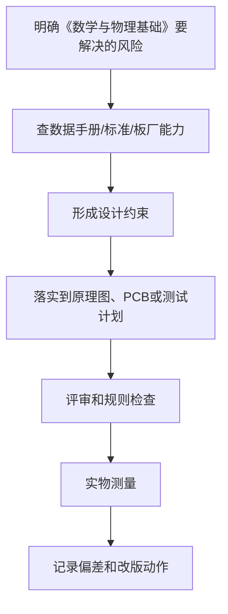

# 04 数学与物理基础

## 学习目标

学完本章，你应该能：

- 熟练进行电子单位换算。
- 使用欧姆定律和功率公式做基础计算。
- 理解频率、周期、时间常数和分贝的基本意义。
- 知道哪些数学知识是入门必须，哪些可以后续再学。

硬件设计不要求一开始掌握很深的数学，但基本计算必须扎实。很多烧板问题，本质上是没有算电流、功耗、耐压和余量。

## 1. 工程单位

电子工程中常用前缀：

| 前缀 | 符号 | 倍率 | 例子 |
| :--- | :--- | :--- | :--- |
| giga | G | 10^9 | 2.4GHz |
| mega | M | 10^6 | 16MHz、1MΩ |
| kilo | k | 10^3 | 10kΩ |
| milli | m | 10^-3 | 20mA |
| micro | u / μ | 10^-6 | 100uF |
| nano | n | 10^-9 | 100nF |
| pico | p | 10^-12 | 22pF |

注意大小写：

- `MΩ` 是兆欧。
- `mΩ` 是毫欧。
- `uF` 是微法。
- `nF` 是纳法。

## 2. 常见单位换算

电压：

```text
1V = 1000mV
1mV = 0.001V
```

电流：

```text
1A = 1000mA
1mA = 1000uA
```

电阻：

```text
1MΩ = 1000kΩ
1kΩ = 1000Ω
```

电容：

```text
1F = 1000000uF
1uF = 1000nF
1nF = 1000pF
100nF = 0.1uF
```

频率：

```text
1GHz = 1000MHz
1MHz = 1000kHz
1kHz = 1000Hz
```

## 3. 欧姆定律

核心公式：

```text
U = I x R
I = U / R
R = U / I
```

其中：

- U 是电压，单位 V。
- I 是电流，单位 A。
- R 是电阻，单位 Ω。

例子 1：5V 电源接 1kΩ 电阻，电流是多少？

```text
I = 5V / 1000Ω = 0.005A = 5mA
```

例子 2：3.3V 逻辑信号通过 330Ω 电阻点亮 LED，LED 压降 2V，电流约多少？

```text
I = (3.3V - 2V) / 330Ω = 0.00394A = 3.94mA
```

## 4. 功率计算

功率公式：

```text
P = U x I
P = I^2 x R
P = U^2 / R
```

例子：一个 10Ω 电阻流过 0.2A，功率：

```text
P = I^2 x R = 0.2 x 0.2 x 10 = 0.4W
```

这时使用 1/4W 电阻不够，至少选 1/2W，并最好留更多余量。

## 5. 余量意识

硬件设计不能只按刚好够用。

常见余量：

| 参数 | 建议 |
| :--- | :--- |
| 电容耐压 | 实际电压的 1.5-2 倍或按规范 |
| 电阻功率 | 实际功耗至少留 2 倍余量 |
| 电源电流 | 最大负载基础上留 20%-50% |
| MOSFET 耐压 | 高于最大电压并考虑尖峰 |
| TVS 选型 | 根据工作电压和保护电压匹配 |

余量不是越大越好，过大可能导致成本、体积、性能问题，但新手不能按极限设计。

## 6. 频率和周期

频率表示每秒重复次数，单位 Hz。

周期表示一次重复所需时间。

公式：

```text
T = 1 / f
f = 1 / T
```

例子：

1kHz 方波周期：

```text
T = 1 / 1000 = 0.001s = 1ms
```

16MHz 时钟周期：

```text
T = 1 / 16000000 = 62.5ns
```

## 7. RC 时间常数

电阻和电容组成 RC 电路时，有一个时间常数：

```text
τ = R x C
```

例如：

```text
R = 10kΩ
C = 100nF
τ = 10000 x 0.0000001 = 0.001s = 1ms
```

用途：

- 按键消抖
- 复位延时
- 简单滤波
- 信号平滑

## 8. RC 低通截止频率

简单 RC 低通滤波器：

```text
fc = 1 / (2πRC)
```

例子：

```text
R = 1kΩ
C = 100nF
fc ≈ 1 / (6.28 x 1000 x 0.0000001)
fc ≈ 1592Hz
```

频率高于 fc 的信号会逐渐被衰减。

## 9. 分贝 dB

dB 用来表达比例。

电压增益：

```text
dB = 20 x log10(Vout / Vin)
```

功率增益：

```text
dB = 10 x log10(Pout / Pin)
```

常见直觉：

- +6dB 约等于电压变 2 倍。
- -6dB 约等于电压变 1/2。
- +20dB 等于电压 10 倍。
- -20dB 等于电压 1/10。

入门阶段只需知道 dB 是比例单位，常用于增益、衰减、滤波和信号强度。

## 10. 需要逐步学习的数学

入门必须：

- 单位换算
- 欧姆定律
- 功率公式
- 比例和分压
- 基础频率周期

进阶再学：

- 复数和阻抗
- 微积分
- 拉普拉斯变换
- 傅里叶变换
- 控制理论
- 传输线理论

不要因为进阶数学复杂就不开始。很多入门项目只需要基础计算就能完成。

## 实操练习

1. 计算 5V 电源、LED 压降 2V、目标电流 5mA 时的限流电阻。
2. 计算 12V 到 5V LDO，输出 200mA 时的功耗。
3. 计算 10kΩ 和 100nF 的 RC 时间常数。
4. 把 0.1uF、100nF、100000pF 互相换算。
5. 计算 1MHz 信号的周期。

## 检查清单

- 我能否熟练换算 mA、uA、kΩ、uF、nF？
- 我能否用欧姆定律计算限流电阻？
- 我能否计算电阻或 LDO 的功耗？
- 我能否理解频率和周期的关系？
- 我是否知道设计要留余量？

## 常见误区

- 误区：电阻只看阻值。
  纠正：还要看功率、精度、封装和温漂。

- 误区：电容只看容值。
  纠正：还要看耐压、材质、ESR 和直流偏压。

- 误区：理论算刚好够就行。
  纠正：工程设计要留余量。

## 本章总结

数学和物理基础不是为了考试，而是为了避免设计错误。能算电流、功耗、时间常数和单位换算，就能解决大量入门硬件问题。

---

## 万字精讲扩展（2026-06-16 更新）
> Last researched: 2026-06-16。本文补充内容以入门到工程实践为主，数值和规则应在真实项目中继续以数据手册、板厂能力表、产品标准和实测结果校准。

### 本章在整套学习路线中的位置

《数学与物理基础》承担的是把局部知识放进完整硬件设计流程的作用。学习这一章时，不要只看定义，而要关注它怎样影响需求、选型、原理图、PCB、制造、装配、调试和改版。硬件设计的每个决定都会在后面的实物阶段兑现：原理图里少一个保护器件，可能在插拔时烧芯片；PCB 上去耦电容放远，可能在负载跳变时复位；封装核对不严，可能导致整批板子无法焊接；没有测试点，可能让一个本来十分钟能定位的问题拖成几天。

本章学习完成后，至少应能做到三件事。第一，能用自己的话解释关键概念，而不是只背术语。第二，能把概念转换成设计检查项，例如线宽、间距、去耦、回流、保护、测试点、BOM 字段或生产文件。第三，能在调试时根据现象反推可能原因，并用仪器或目检验证。只要这三件事能完成，这章就不再是静态笔记，而会变成你设计下一块板子的工具。

### 基础类章节的精讲重点

基础类内容的目标不是让你推导复杂公式，而是建立工程直觉。电压可以理解为推动电荷移动的势能差，电流是单位时间通过截面的电荷量，电阻把电能转化为热，电容抵抗电压突变，电感抵抗电流突变。只要把这些直觉和公式联系起来，就能解释很多 PCB 现象：为什么电源线太细会压降和发热，为什么去耦电容要靠近芯片，为什么继电器和电机需要续流路径，为什么高频信号不再只沿着铜线“自己走”。

计算时应先做数量级估算。比如一个 5 V 负载电流 500 mA，功率就是 2.5 W；如果线缆、连接器、走线合计 0.2 欧姆，压降就是 0.1 V，发热就是 0.05 W。这个量级可能可以接受，也可能对低压数字系统造成边界问题。再比如 RC 低通的截止频率由电阻和电容共同决定，如果 ADC 前端随手放一个很大的电阻和电容，虽然看起来滤波更强，但采样保持电容可能充不满，导致读数偏差。基础公式必须和实际器件、布局、测量一起用。

学习基础知识时，建议每个概念都做一个小实验。欧姆定律用 LED 限流电阻验证，功率用不同阻值电阻发热验证，RC 时间常数用示波器观察按键或方波边沿，二极管压降用万用表二极管档观察，MOSFET 导通用小负载验证栅源电压影响。实验不追求复杂，但要形成“公式、实物、测量”三者对应关系。

### 工程学习的底层方法

硬件学习最容易出现的偏差，是把知识点当成孤立名词背诵。真正能落地的学习方式，是把每个知识点放进同一条工程链路里理解：需求从哪里来，器件为什么这样选，原理图如何表达意图，PCB 如何把电气意图变成物理结构，制造和装配会怎样限制你的设计，调试时又如何证明假设成立。这个链路一旦建立，很多看似零散的规则会变成同一个目标的不同侧面：降低回路面积、控制电流路径、保证制造余量、保留测试入口、减少不确定性。

初学阶段不要追求一次学完所有高端主题。更稳妥的路线是先把低压、低速、小电流、少接口的板子做闭环。所谓闭环，不是画完 PCB 就结束，而是完成需求定义、器件选型、原理图、ERC、PCB、DRC、Gerber 检查、打样、焊接、上电、测量、故障记录和改版。每完成一次闭环，你对数据手册、封装、布局、布线、去耦、接地、调试的理解都会变得更具体。没有实物反馈时，很多规则只是口号；有了失败样板以后，规则才会变成可执行的判断。

学习时建议同时维护三类笔记。第一类是概念笔记，用自己的话解释术语，不直接复制资料原文。第二类是规则笔记，把板厂能力、器件要求、个人默认规则写成表格，并标注来源和适用边界。第三类是复盘笔记，记录每块板子的设计假设、测量数据、错误原因和下一版修改。硬件经验的价值往往不在“知道一个规则”，而在知道这个规则什么时候适用、什么时候不够、什么时候必须回到数据手册或标准重新计算。

### 从规则到判断：不要把经验值当标准

很多入门资料会给出 100 nF 去耦、45 度走线、线宽 0.2 mm、线距 0.2 mm、TVS 靠近接口、晶振靠近芯片等经验值。这些经验很有用，但它们不是脱离条件的真理。100 nF 的作用依赖电容封装、ESL、布局回路、电源阻抗和芯片瞬态电流；线宽取决于电流、铜厚、温升、压降、散热铜皮和工作环境；线距受制造能力、电压、安全规范、污染等级和产品要求影响。学习笔记里应当写清楚“为什么”和“边界”，而不是只写一个数字。

工程上可以采用四级依据。最高优先级是安全法规、产品标准和客户要求；其次是芯片数据手册、评估板、应用笔记和参考设计；再往下是板厂能力表、装配厂工艺能力和 EDA 规则；最后才是个人经验和论坛建议。社区经验可以帮助发现常见坑，但不能替代标准和厂商文档。尤其是高压、电池、大电流、电机、射频、高速总线、医疗和汽车场景，入门经验值通常不够，必须引入正式规范、仿真、评审和测试。

### 一个可复用的硬件闭环


Figure: PCB 学习闭环，综合 KiCad 官方流程、板厂 DFM 要求、TI/ADI 布局应用笔记和中文社区调试经验重新整理。

### 调试意识：把问题拆成可验证假设

调试不是“看到不工作就随机改”，而是把系统拆成一组可以测量的假设。电源是否到位，复位是否释放，时钟是否振荡，下载接口是否连通，GPIO 是否能翻转，通信波形是否符合电平和时序，模拟输入是否超量程，负载电流是否超过器件能力，每一步都应该有测量点、预期值和异常解释。硬件调试最忌讳同时改变多个变量，因为这样即使问题消失，也无法知道真正原因。

第一次上电建议采用限流电源，并把电流限值设成符合预期的保守值。先不上昂贵芯片或外部负载，先测裸板短路；再焊电源部分，测输入保护、稳压输出和纹波；再焊主控和下载接口；最后逐个启用传感器、通信接口和执行器。每一步都记录电压、电流、温度和波形截图。对于后续改版，测量记录比口头记忆可靠得多。

### 核心知识点逐条精讲

#### 1. 单位换算

在《数学与物理基础》这一章里，`单位换算` 不是孤立知识点，而是一个需要落实到设计动作、检查动作和测试动作的工程对象。学习时先问三个问题：它解决什么风险，它依赖哪些前置条件，它失败时会表现成什么现象。比如一个规则如果用于 PCB，就要进一步落实到板框、封装、网络类、线宽线距、过孔、参考平面、测试点或生产文件；如果用于电路，就要落实到器件参数、工作条件、热、保护和测量方法。这样做可以避免只记住结论，却不知道如何在下一块板子上执行。

实践中建议把 `单位换算` 写成可检查条目，而不是写成笼统口号。可检查条目应包含对象、位置、数值或来源、验证方法和异常处理。例如“确认每个外部接口有合适保护”比“注意 ESD”更可执行；“确认 U1 每个 VDD 引脚旁边 1 至 3 mm 内有低 ESL 去耦路径，且地过孔靠近电容地端”比“加 100 nF”更接近工程要求。每个条目都要能在评审时被勾选，在调试时被测量，在改版时被追踪。

当 `单位换算` 与其他规则冲突时，应按约束优先级处理。安全和法规高于性能，数据手册高于经验，板厂能力高于个人习惯，实际测量高于未经验证的猜测。很多设计取舍没有唯一答案，例如更宽的线有利于电流和压降，却可能破坏阻抗或增加布线困难；更强的滤波有利于噪声，却可能降低响应速度或影响启动；更密的布局有利于面积，却可能损害焊接、返修和散热。笔记要记录取舍理由，而不是只留下最后结果。

#### 2. 欧姆定律

在《数学与物理基础》这一章里，`欧姆定律` 不是孤立知识点，而是一个需要落实到设计动作、检查动作和测试动作的工程对象。学习时先问三个问题：它解决什么风险，它依赖哪些前置条件，它失败时会表现成什么现象。比如一个规则如果用于 PCB，就要进一步落实到板框、封装、网络类、线宽线距、过孔、参考平面、测试点或生产文件；如果用于电路，就要落实到器件参数、工作条件、热、保护和测量方法。这样做可以避免只记住结论，却不知道如何在下一块板子上执行。

实践中建议把 `欧姆定律` 写成可检查条目，而不是写成笼统口号。可检查条目应包含对象、位置、数值或来源、验证方法和异常处理。例如“确认每个外部接口有合适保护”比“注意 ESD”更可执行；“确认 U1 每个 VDD 引脚旁边 1 至 3 mm 内有低 ESL 去耦路径，且地过孔靠近电容地端”比“加 100 nF”更接近工程要求。每个条目都要能在评审时被勾选，在调试时被测量，在改版时被追踪。

当 `欧姆定律` 与其他规则冲突时，应按约束优先级处理。安全和法规高于性能，数据手册高于经验，板厂能力高于个人习惯，实际测量高于未经验证的猜测。很多设计取舍没有唯一答案，例如更宽的线有利于电流和压降，却可能破坏阻抗或增加布线困难；更强的滤波有利于噪声，却可能降低响应速度或影响启动；更密的布局有利于面积，却可能损害焊接、返修和散热。笔记要记录取舍理由，而不是只留下最后结果。

#### 3. 功率和热

在《数学与物理基础》这一章里，`功率和热` 不是孤立知识点，而是一个需要落实到设计动作、检查动作和测试动作的工程对象。学习时先问三个问题：它解决什么风险，它依赖哪些前置条件，它失败时会表现成什么现象。比如一个规则如果用于 PCB，就要进一步落实到板框、封装、网络类、线宽线距、过孔、参考平面、测试点或生产文件；如果用于电路，就要落实到器件参数、工作条件、热、保护和测量方法。这样做可以避免只记住结论，却不知道如何在下一块板子上执行。

实践中建议把 `功率和热` 写成可检查条目，而不是写成笼统口号。可检查条目应包含对象、位置、数值或来源、验证方法和异常处理。例如“确认每个外部接口有合适保护”比“注意 ESD”更可执行；“确认 U1 每个 VDD 引脚旁边 1 至 3 mm 内有低 ESL 去耦路径，且地过孔靠近电容地端”比“加 100 nF”更接近工程要求。每个条目都要能在评审时被勾选，在调试时被测量，在改版时被追踪。

当 `功率和热` 与其他规则冲突时，应按约束优先级处理。安全和法规高于性能，数据手册高于经验，板厂能力高于个人习惯，实际测量高于未经验证的猜测。很多设计取舍没有唯一答案，例如更宽的线有利于电流和压降，却可能破坏阻抗或增加布线困难；更强的滤波有利于噪声，却可能降低响应速度或影响启动；更密的布局有利于面积，却可能损害焊接、返修和散热。笔记要记录取舍理由，而不是只留下最后结果。

#### 4. RC 时间常数

在《数学与物理基础》这一章里，`RC 时间常数` 不是孤立知识点，而是一个需要落实到设计动作、检查动作和测试动作的工程对象。学习时先问三个问题：它解决什么风险，它依赖哪些前置条件，它失败时会表现成什么现象。比如一个规则如果用于 PCB，就要进一步落实到板框、封装、网络类、线宽线距、过孔、参考平面、测试点或生产文件；如果用于电路，就要落实到器件参数、工作条件、热、保护和测量方法。这样做可以避免只记住结论，却不知道如何在下一块板子上执行。

实践中建议把 `RC 时间常数` 写成可检查条目，而不是写成笼统口号。可检查条目应包含对象、位置、数值或来源、验证方法和异常处理。例如“确认每个外部接口有合适保护”比“注意 ESD”更可执行；“确认 U1 每个 VDD 引脚旁边 1 至 3 mm 内有低 ESL 去耦路径，且地过孔靠近电容地端”比“加 100 nF”更接近工程要求。每个条目都要能在评审时被勾选，在调试时被测量，在改版时被追踪。

当 `RC 时间常数` 与其他规则冲突时，应按约束优先级处理。安全和法规高于性能，数据手册高于经验，板厂能力高于个人习惯，实际测量高于未经验证的猜测。很多设计取舍没有唯一答案，例如更宽的线有利于电流和压降，却可能破坏阻抗或增加布线困难；更强的滤波有利于噪声，却可能降低响应速度或影响启动；更密的布局有利于面积，却可能损害焊接、返修和散热。笔记要记录取舍理由，而不是只留下最后结果。

#### 5. 分贝和频率

在《数学与物理基础》这一章里，`分贝和频率` 不是孤立知识点，而是一个需要落实到设计动作、检查动作和测试动作的工程对象。学习时先问三个问题：它解决什么风险，它依赖哪些前置条件，它失败时会表现成什么现象。比如一个规则如果用于 PCB，就要进一步落实到板框、封装、网络类、线宽线距、过孔、参考平面、测试点或生产文件；如果用于电路，就要落实到器件参数、工作条件、热、保护和测量方法。这样做可以避免只记住结论，却不知道如何在下一块板子上执行。

实践中建议把 `分贝和频率` 写成可检查条目，而不是写成笼统口号。可检查条目应包含对象、位置、数值或来源、验证方法和异常处理。例如“确认每个外部接口有合适保护”比“注意 ESD”更可执行；“确认 U1 每个 VDD 引脚旁边 1 至 3 mm 内有低 ESL 去耦路径，且地过孔靠近电容地端”比“加 100 nF”更接近工程要求。每个条目都要能在评审时被勾选，在调试时被测量，在改版时被追踪。

当 `分贝和频率` 与其他规则冲突时，应按约束优先级处理。安全和法规高于性能，数据手册高于经验，板厂能力高于个人习惯，实际测量高于未经验证的猜测。很多设计取舍没有唯一答案，例如更宽的线有利于电流和压降，却可能破坏阻抗或增加布线困难；更强的滤波有利于噪声，却可能降低响应速度或影响启动；更密的布局有利于面积，却可能损害焊接、返修和散热。笔记要记录取舍理由，而不是只留下最后结果。


### 场景化判断表

| 场景 | 推荐处理 | 典型风险 | 验证方式 |
| :--- | :--- | :--- | :--- |
| 单位换算 | 先查数据手册、板厂能力或测试目标，再转成 EDA 规则和评审项 | 只凭经验值、没有来源、没有验证方法 | 设计评审、DRC、上电测试和改版复盘 |
| 欧姆定律 | 先查数据手册、板厂能力或测试目标，再转成 EDA 规则和评审项 | 只凭经验值、没有来源、没有验证方法 | 设计评审、DRC、上电测试和改版复盘 |
| 功率和热 | 先查数据手册、板厂能力或测试目标，再转成 EDA 规则和评审项 | 只凭经验值、没有来源、没有验证方法 | 设计评审、DRC、上电测试和改版复盘 |
| RC 时间常数 | 先查数据手册、板厂能力或测试目标，再转成 EDA 规则和评审项 | 只凭经验值、没有来源、没有验证方法 | 设计评审、DRC、上电测试和改版复盘 |
| 分贝和频率 | 先查数据手册、板厂能力或测试目标，再转成 EDA 规则和评审项 | 只凭经验值、没有来源、没有验证方法 | 设计评审、DRC、上电测试和改版复盘 |

表格里的“推荐处理”不是固定答案，而是提醒你把每个问题落到来源、约束和验证。硬件工程里最危险的状态不是不知道，而是以为某个经验值在所有场景都成立。每当项目电压、电流、速度、温度、线缆长度、外部环境、制造厂家或装配方式变化时，都应该重新检查这些条目。

### 本章建议工作流



Figure: 《数学与物理基础》学习和实践工作流，综合官方文档、厂商应用笔记和板厂 DFM 资料整理。

这个工作流的重点是“先约束，后执行，再验证”。例如你要决定线宽，就不要只问别人用多少，而要先知道电流、铜厚、温升、压降和板厂能力；你要决定去耦，就不要只看电容值，而要看瞬态电流路径、封装 ESL、过孔位置和参考平面；你要决定接口保护，就要看接口是否出板、线缆长度、人体接触概率、芯片耐受能力和保护器件泄放路径。只要按这个流程写笔记，每一章都会从知识介绍变成工程方法。

### 常见误区和纠正方法

- 误区：把 DRC 通过当作设计正确。纠正：DRC 只能检查你已经设置的规则，不能理解电路意图；设计正确还需要数据手册核对、布局评审、回流路径检查、制造文件检查和实物测试。
- 误区：把社区经验当成标准。纠正：社区经验适合发现问题和启发思路，最终参数要回到官方文档、板厂能力、器件数据手册和实测结果。
- 误区：只关注能不能工作，不关注能不能维护。纠正：学习阶段就要保留丝印、测试点、版本号、BOM 信息和复盘记录，否则下一次遇到同类问题仍然要从头猜。
- 误区：只看电气连接，不看物理路径。纠正：PCB 中的电流路径、回流路径、寄生电感、寄生电容、热路径和装配空间都会影响结果，原理图正确只是起点。
- 误区：追求一次完美。纠正：硬件设计天然需要迭代，关键是让每次迭代有明确假设、测量证据和改版记录。

### 与相邻章节的关系

《数学与物理基础》应与前后章节交叉学习。向前看，它依赖基础电学、器件参数和数据手册阅读；向后看，它会影响 PCB 布局布线、制造装配、调试排障和版本管理。比如你在本章学到一个布局规则，应当回到元器件章节确认器件要求，再到 PCB 规则章节设置约束，再到调试章节设计测量点。这样多个笔记之间会形成网络，而不是彼此孤立。

如果某个概念暂时难以完全理解，不要停留在抽象层面反复阅读，可以通过低风险实验建立直觉。低压 LED 板、按键板、传感器板、MCU 最小系统板、MOSFET 负载板和小型 Buck 板都适合作为验证平台。每块板只重点验证两三个主题，效果通常比一块板塞满所有功能更好。


### 实操训练和复盘模板

1. 选一个真实小项目，围绕 `单位换算` 写一条设计假设、一个检查方法和一个测量方法。
2. 选一个真实小项目，围绕 `欧姆定律` 写一条设计假设、一个检查方法和一个测量方法。
3. 选一个真实小项目，围绕 `功率和热` 写一条设计假设、一个检查方法和一个测量方法。
4. 选一个真实小项目，围绕 `RC 时间常数` 写一条设计假设、一个检查方法和一个测量方法。
5. 选一个真实小项目，围绕 `分贝和频率` 写一条设计假设、一个检查方法和一个测量方法。建议每次练习都输出一页复盘，格式如下：

```text
项目名称：
本章主题：数学与物理基础
设计假设：
依据来源：数据手册 / 标准 / 板厂能力 / 应用笔记 / 实测经验
实施位置：原理图页码、PCB 区域、BOM 行、测试点编号
预期结果：
实际测量：
偏差原因：
下一版修改：
```

这个模板看起来简单，但能强迫你把“我觉得”变成“我依据什么、做在哪里、测到了什么、下一步怎么改”。硬件学习最怕只留下模糊印象，复盘模板能把每一次小失败转化成下一版的规则。

## 参考资料与延伸阅读

- [Standard / IPC] IPC-2221B Preview: Generic Standard on Printed Board Design: https://webstore.ansi.org/preview-pages/IPC/preview_IPC%2B2221B-2012.pdf
- [Standard / ANSI] IPC-2152, Current Carrying Capacity in Printed Board Design: https://blog.ansi.org/ansi/ipc-2152-current-carrying-capacity-in-pcbs/
- [Tool / Official] KiCad 9.0 PCB Editor Documentation: https://docs.kicad.org/9.0/en/pcbnew/pcbnew.html
- [Tool / Official] Getting Started in KiCad 9.0: https://docs.kicad.org/9.0/en/getting_started_in_kicad/getting_started_in_kicad.html
- [Vendor / TI] PCB Design Guidelines For Reduced EMI: https://www.ti.com/lit/pdf/szza009
- [Vendor / TI] High Speed Layout Guidelines: https://www.ti.com/lit/pdf/scaa082
- [Vendor / TI] AN-1149 Layout Guidelines for Switching Power Supplies: https://www.ti.com/lit/pdf/snva021
- [Vendor / TI] PCB layout guidelines to optimize power supply performance: https://www.ti.com/lit/ml/slyp762/slyp762.pdf
- [Vendor / TI] Grounding in mixed-signal systems demystified, Part 2: https://www.ti.com/lit/pdf/slyt512
- [Vendor / Analog Devices] MT-031 Grounding Data Converters: https://www.analog.com/media/en/training-seminars/tutorials/MT-031.pdf
- [Vendor / Analog Devices] MT-101 Decoupling Techniques: https://www.analog.com/media/en/training-seminars/tutorials/MT-101.pdf
- [Vendor / Microchip] Basic 16-Bit MCU Design and Troubleshooting Checklist: https://ww1.microchip.com/downloads/aemDocuments/documents/MCU16/ProductDocuments/SupportingCollateral/Basic-16-Bit-MCU-Design-and-Troubleshooting-Checklist-DS50003274.pdf
- [Fab / PCBWay] PCB Manufacturing Tolerances: https://www.pcbway.com/pcb_prototype/PCB_Manufacturing_tolerances.html
- [Fab / PCBWay] PCB Design Rule Check: https://www.pcbway.com/pcb_prototype/PCB_Design_Rule_Check.html
- [Fab / OSH Park] Fabrication Services Design Rules: https://docs.oshpark.com/services/
- [Fab / Eurocircuits] PCB Design Guidelines: https://www.eurocircuits.com/technical-guidelines/pcb-design-guidelines/
- [Fab / Eurocircuits] Track Width and Isolation Gap Tolerances: https://www.eurocircuits.com/technical-guidelines/understanding-manufacturing-tolerances-on-a-pcb/track-width-and-isolation-gap-tolerances/
- [Community / 博客园] AD 学习笔记（基础）: https://www.cnblogs.com/Roboduster/p/15329893.html
- [Community / 博客园] Altium Designer PCB 文件的绘制（上：PCB 基础和布局）: https://www.cnblogs.com/zhjblogs/p/14172536.html
- [Community / CSDN] PCB 学习笔记: https://blog.csdn.net/weixin_51933819/article/details/122512816
- [Community / CSDN] PCB 布局布线要求及多层电路板叠加原则: https://blog.csdn.net/Ka_wyb/article/details/142337253
- [Community / 掘金] PCB 设计和布局: https://juejin.cn/post/7612948192174817295
- [Community / 掘金] 芯片电源引脚为什么要加一个 100nF 的电容: https://juejin.cn/post/7325069743144108073
- [Community / 电子工程专辑] 5 步搞定 PCB 调试: https://www.eet-china.com/mp/a393354.html
