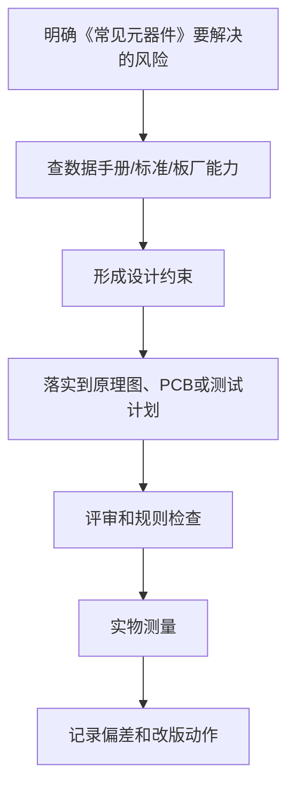

# 06 常见元器件

<!-- lecture-notes:integrated-v2 -->

## 讲义导读：把电路变成能工作的板子

这一章讲的是 **06 常见元器件**，属于 **器件、数据手册与供应链**。学习硬件和 PCB 时，不要只看“这根线怎么连”，而要把它当成一次工程闭环：需求是什么，电路原理是否成立，器件是否选对，封装是否可靠，PCB 规则是否符合板厂能力，电源和地怎么走，信号回流在哪里，上电后用什么证据证明它稳定工作。

### 一句话先懂

器件选型不是找一个参数看起来够用的料号，而是确认它在真实电压、电流、温度、封装、供货和替代料条件下都能工作。

初学时先问三个问题：这部分电路要完成什么功能；最坏电压、电流、温度、频率和误差在哪里；如果板子不工作，我能从哪个测试点或波形开始定位。

### 通俗类比

数据手册像器件身份证和使用说明：第一页广告告诉你它擅长什么，电气表格告诉你边界在哪里，应用图告诉你怎么少踩坑。

类比只是入门扶手。真正设计时，要回到电流路径、阻抗、功耗、热、封装、间距、线宽、层叠、回流路径、测试点和制造公差这些可计算、可测量、可检查的对象上。

### 本章学习主线

1. **先定需求和边界**：输入/输出、电压电流、接口、环境、尺寸、成本、安全和可制造性要求是什么？
2. **再读数据手册**：绝对最大额定值、推荐工作条件、典型应用、封装、热阻、布局建议和禁忌分别在哪里？
3. **然后画原理图**：电源树、保护、时钟、复位、接口、测试点和关键网络命名是否清楚？
4. **接着做 PCB**：先定层叠和规则，再布局关键器件，最后按电源、回流、敏感信号、高速信号和制造约束布线。
5. **最后验证实物**：ERC/DRC/DFM、Gerber、BOM、装配图、上电计划、测量记录和复盘缺一不可。

### 本章重点抓手

绝对最大额定值、推荐工作条件、典型应用、热阻、封装、生命周期、替代料、BOM、降额和采购风险。

### 最小实践任务

挑一个稳压器或 MCU，按数据手册整理供电、时钟、复位、去耦、热设计、封装和 layout checklist。

建议每次设计都保留“设计理由”：为什么选这个器件，为什么这样放置，为什么这条线这么宽，为什么这个电容离引脚这么近，为什么这个测试点必须保留。硬件学习的关键不是画出一块板，而是能解释每个设计选择，并能在实物上验证。

### 常见误区

- 把典型值当保证值。
- 只看价格，不看供货周期和替代料。
- 忽略封装可焊性、散热和测试可达性。

### 推荐工具

KiCad/Altium、万用表、示波器、逻辑分析仪、稳压电源、电子负载、热像仪、LCR 表、Gerber viewer、厂商 DFM 检查。

### 读完本章应该能做到

- 用自己的话解释本章概念，并指出它影响功能、可靠性、制造、调试还是成本。
- 给出一个最小设计例子，说明原理图、PCB、BOM 和测试方法如何对应。
- 说清至少一个常见硬件故障的现象、可能原因、测量方法和修复方向。
- 把经验规则落到数据手册、IPC/板厂规则、仿真或实测证据上。

> 本节是讲义化改写后的阅读入口。后续正文中的电路、规则、清单和参考资料，都应围绕“需求边界 + 数据手册 + PCB 规则 + 实物验证”来理解。
## 学习目标

学完本章，你应该能：

- 识别常见电子元器件。
- 看懂器件的关键参数。
- 知道不同器件的典型用途和选型注意点。
- 初步理解封装、功率、耐压、精度和替代料。

元器件选错，原理图和 PCB 再好也可能失败。学习硬件必须建立“参数意识”：每个元件不是一个图标，而是有真实限制的物理器件。

## 1. 电阻

### 关键参数

| 参数 | 含义 | 选型注意 |
| :--- | :--- | :--- |
| 阻值 | 电阻大小 | 根据电路计算 |
| 精度 | 实际阻值偏差 | 常见 1%、5% |
| 功率 | 可承受发热功率 | 必须大于实际功耗 |
| 温漂 | 温度变化引起阻值变化 | 精密采样要关注 |
| 封装 | 物理尺寸 | 影响焊接和功率 |

### 常见用途

- LED 限流
- 电压分压
- 上拉 / 下拉
- 电流采样
- 信号终端匹配
- 放大器反馈

### 常见封装

| 封装 | 特点 |
| :--- | :--- |
| 0402 | 很小，不适合新手手焊 |
| 0603 | 常用，能手焊但需要练习 |
| 0805 | 新手友好 |
| 1206 | 更大，功率更高 |

新手建议：先用 0603 或 0805。

## 2. 电容

### 关键参数

| 参数 | 含义 | 注意 |
| :--- | :--- | :--- |
| 容值 | 储电能力 | 单位 uF、nF、pF |
| 耐压 | 最大承受电压 | 要留余量 |
| 精度 | 容值偏差 | 滤波一般不太敏感 |
| 材质 | X7R、X5R、C0G 等 | 影响稳定性 |
| ESR | 等效串联电阻 | 电源和高频场景重要 |
| 封装 | 尺寸 | 影响容值和焊接 |

### 常见类型

| 类型 | 特点 | 用途 |
| :--- | :--- | :--- |
| 陶瓷电容 | 小、便宜、高频好 | 去耦、滤波 |
| 电解电容 | 容量大、有极性 | 电源储能 |
| 钽电容 | 容量较大、有极性 | 电源滤波 |
| 薄膜电容 | 稳定、损耗低 | 音频、交流 |

### 新手注意

- 有极性电容不能接反。
- 陶瓷电容在直流偏压下有效容值会下降。
- 去耦电容要靠近芯片电源引脚。
- 电容耐压不能贴着工作电压选。

## 3. 电感

### 关键参数

| 参数 | 含义 |
| :--- | :--- |
| 电感量 | 单位 H、mH、uH |
| 饱和电流 | 超过后电感量明显下降 |
| 额定电流 | 长期可承受电流 |
| DCR | 直流电阻 |
| 屏蔽结构 | 影响 EMI |

### 用途

- DC-DC 电源
- LC 滤波
- EMI 抑制
- 储能

### 新手注意

DC-DC 电感不能只看电感量。饱和电流、DCR 和封装都很重要。

## 4. 磁珠

磁珠常用于抑制高频噪声。

关键参数：

- 阻抗值，例如 600Ω @ 100MHz
- 额定电流
- 直流电阻

用途：

- 模拟电源隔离
- 接口 EMI 抑制
- 电源分支噪声隔离

注意：

磁珠不是普通电感，不能随便替代电感。用在电源上要注意压降和稳定性。

## 5. 二极管

### 类型

| 类型 | 用途 | 特点 |
| :--- | :--- | :--- |
| 普通二极管 | 整流、续流 | 压降约 0.7V |
| 肖特基 | 低压降、防反接 | 速度快，漏电较大 |
| 稳压二极管 | 钳位、简单稳压 | 功耗有限 |
| TVS | ESD、浪涌保护 | 响应快 |
| LED | 发光 | 需要限流 |

### 选型参数

- 反向耐压
- 正向电流
- 正向压降
- 反向漏电
- 功耗
- 封装

## 6. 三极管

类型：

- NPN
- PNP

参数：

- Vceo：集电极-发射极耐压
- Ic：集电极电流
- hFE：电流放大倍数
- 封装功耗

用途：

- 小电流开关
- 信号放大
- 电平转换

新手常用：

- NPN 控制蜂鸣器
- NPN 控制继电器线圈
- PNP 或 PMOS 做高端控制

## 7. MOSFET

类型：

- NMOS
- PMOS

关键参数：

| 参数 | 含义 | 注意 |
| :--- | :--- | :--- |
| Vds | 漏源耐压 | 要高于最大电压和尖峰 |
| Id | 最大电流 | 受散热影响 |
| Rds(on) | 导通电阻 | 决定发热 |
| Vgs(th) | 阈值电压 | 不是完全导通电压 |
| Qg | 栅极电荷 | 影响开关速度 |
| 封装 | 散热和焊接 | 大电流要关注 |

用途：

- 负载开关
- 电机控制
- LED 灯带控制
- 电源防反接
- DC-DC 开关

## 8. 稳压芯片

### LDO

优点：

- 简单
- 噪声低
- 外围少

缺点：

- 压差越大、输出电流越大，发热越严重。

关注：

- 输入电压
- 输出电压
- 最大电流
- Dropout
- 静态电流
- 输出电容要求
- 热阻

### DC-DC

优点：

- 效率高
- 适合较大电流

缺点：

- 外围复杂
- 纹波和 EMI
- PCB 布局要求高

关注：

- 电感
- 输入输出电容
- 开关频率
- 反馈电阻
- 推荐布局

## 9. 连接器

连接器是真实产品里非常重要的器件。

关注：

- 引脚数
- 间距
- 额定电流
- 插拔寿命
- 方向
- 防呆
- 固定强度
- 是否方便购买
- 是否适合手焊

常见连接器：

- 排针
- JST
- USB
- Type-C
- DC 插座
- 端子台
- FPC
- IPEX

新手要核对实物方向。连接器封装错是非常常见的问题。

## 10. 晶振和时钟器件

类型：

- 无源晶振
- 有源晶振
- 陶瓷谐振器

关注：

- 频率
- 负载电容
- 精度
- 启振条件
- 封装
- 温度稳定性

布局：

- 靠近芯片
- 走线短
- 远离噪声

## 11. 传感器

选型关注：

- 测量范围
- 精度
- 分辨率
- 接口
- 供电
- 功耗
- 响应时间
- 校准
- 布局要求

例如温度传感器不能放在 LDO 或 DC-DC 旁边，否则测到的是板上热源温度。

## 12. 保护器件

常见：

- TVS
- ESD 二极管
- 保险丝
- PTC
- NTC
- 压敏电阻

保护位置：

- 电源入口
- 外部接口
- 长线连接
- 用户可触摸接口

## 实操练习

1. 选 10 个常用电阻，写出阻值、精度、封装和功率。
2. 选 5 个电容，比较容值、耐压和材质。
3. 查一个 MOSFET 数据手册，找出 Vds、Id、Rds(on)、Vgs(th)。
4. 找一个 USB Type-C 母座，核对封装和实物方向。
5. 查一个 LDO，按数据手册画典型应用电路。

## 检查清单

- 我是否知道电阻要看功率？
- 我是否知道电容要看耐压和材质？
- 我是否知道 MOSFET 阈值不等于完全导通？
- 我是否能核对连接器方向？
- 我是否会看器件封装尺寸？

## 常见误区

- 误区：参数一样就能替代。
  纠正：还要看封装、耐压、功耗、温度、引脚和库存。

- 误区：电容越大越好。
  纠正：不同频段需要不同电容，且要满足芯片稳定性要求。

- 误区：所有 3.3V 芯片都能直接互连。
  纠正：还要看 IO 电平、输入容限和接口时序。

## 本章总结

元器件是硬件设计的材料。学习元器件时，不要只记名称，要学会看参数、看封装、看限制条件。能正确选型，是从“照抄电路”走向“自己设计”的关键。

---

## 万字精讲扩展（2026-06-16 更新）
> Last researched: 2026-06-16。本文补充内容以入门到工程实践为主，数值和规则应在真实项目中继续以数据手册、板厂能力表、产品标准和实测结果校准。

### 本章在整套学习路线中的位置

《常见元器件》承担的是把局部知识放进完整硬件设计流程的作用。学习这一章时，不要只看定义，而要关注它怎样影响需求、选型、原理图、PCB、制造、装配、调试和改版。硬件设计的每个决定都会在后面的实物阶段兑现：原理图里少一个保护器件，可能在插拔时烧芯片；PCB 上去耦电容放远，可能在负载跳变时复位；封装核对不严，可能导致整批板子无法焊接；没有测试点，可能让一个本来十分钟能定位的问题拖成几天。

本章学习完成后，至少应能做到三件事。第一，能用自己的话解释关键概念，而不是只背术语。第二，能把概念转换成设计检查项，例如线宽、间距、去耦、回流、保护、测试点、BOM 字段或生产文件。第三，能在调试时根据现象反推可能原因，并用仪器或目检验证。只要这三件事能完成，这章就不再是静态笔记，而会变成你设计下一块板子的工具。

### 元器件和数据手册的精讲重点

器件学习的核心不是背封装和型号，而是知道一个器件在系统中承担什么职责、关键参数是什么、哪些参数会随温度、频率、电压和批次变化。电阻除了阻值还有功率、精度、温漂、耐压和封装；电容除了容量还有耐压、介质、直流偏压、ESR、ESL、温度特性和寿命；MOSFET 除了导通电阻还有阈值电压、栅极电荷、安全工作区、体二极管和热阻。初学者常把典型值当保证值，把绝对最大额定值当工作条件，这是非常危险的。

数据手册阅读应当先看四张表：绝对最大额定值、推荐工作条件、电气特性和封装/热参数。绝对最大额定值只说明超过后可能损坏，不说明可以长期工作；推荐工作条件才是设计范围；电气特性表要区分最小值、典型值、最大值和测试条件；封装图要确认顶视图、底视图、引脚间距、焊盘建议和热焊盘要求。对于电源、运放、ADC、接口芯片，还要阅读典型应用电路和 PCB Layout 建议，因为很多性能参数只有在合适布局下才可能接近数据手册。

替代料判断不能只看“功能一样”。需要核对引脚定义、封装尺寸、耐压、电流、逻辑电平、温度范围、时序、默认状态、ESD 等级、输出结构、启动行为、热阻和供货状态。很多硬件错误不是原理错，而是替代料的某个边界条件不一致，例如 LDO 稳定性依赖输出电容 ESR，MOSFET 的阈值电压不能代表在 3.3 V GPIO 下充分导通，连接器同系列不同针序导致线束反接。

### 工程学习的底层方法

硬件学习最容易出现的偏差，是把知识点当成孤立名词背诵。真正能落地的学习方式，是把每个知识点放进同一条工程链路里理解：需求从哪里来，器件为什么这样选，原理图如何表达意图，PCB 如何把电气意图变成物理结构，制造和装配会怎样限制你的设计，调试时又如何证明假设成立。这个链路一旦建立，很多看似零散的规则会变成同一个目标的不同侧面：降低回路面积、控制电流路径、保证制造余量、保留测试入口、减少不确定性。

初学阶段不要追求一次学完所有高端主题。更稳妥的路线是先把低压、低速、小电流、少接口的板子做闭环。所谓闭环，不是画完 PCB 就结束，而是完成需求定义、器件选型、原理图、ERC、PCB、DRC、Gerber 检查、打样、焊接、上电、测量、故障记录和改版。每完成一次闭环，你对数据手册、封装、布局、布线、去耦、接地、调试的理解都会变得更具体。没有实物反馈时，很多规则只是口号；有了失败样板以后，规则才会变成可执行的判断。

学习时建议同时维护三类笔记。第一类是概念笔记，用自己的话解释术语，不直接复制资料原文。第二类是规则笔记，把板厂能力、器件要求、个人默认规则写成表格，并标注来源和适用边界。第三类是复盘笔记，记录每块板子的设计假设、测量数据、错误原因和下一版修改。硬件经验的价值往往不在“知道一个规则”，而在知道这个规则什么时候适用、什么时候不够、什么时候必须回到数据手册或标准重新计算。

### 从规则到判断：不要把经验值当标准

很多入门资料会给出 100 nF 去耦、45 度走线、线宽 0.2 mm、线距 0.2 mm、TVS 靠近接口、晶振靠近芯片等经验值。这些经验很有用，但它们不是脱离条件的真理。100 nF 的作用依赖电容封装、ESL、布局回路、电源阻抗和芯片瞬态电流；线宽取决于电流、铜厚、温升、压降、散热铜皮和工作环境；线距受制造能力、电压、安全规范、污染等级和产品要求影响。学习笔记里应当写清楚“为什么”和“边界”，而不是只写一个数字。

工程上可以采用四级依据。最高优先级是安全法规、产品标准和客户要求；其次是芯片数据手册、评估板、应用笔记和参考设计；再往下是板厂能力表、装配厂工艺能力和 EDA 规则；最后才是个人经验和论坛建议。社区经验可以帮助发现常见坑，但不能替代标准和厂商文档。尤其是高压、电池、大电流、电机、射频、高速总线、医疗和汽车场景，入门经验值通常不够，必须引入正式规范、仿真、评审和测试。

### 一个可复用的硬件闭环


Figure: PCB 学习闭环，综合 KiCad 官方流程、板厂 DFM 要求、TI/ADI 布局应用笔记和中文社区调试经验重新整理。

### 调试意识：把问题拆成可验证假设

调试不是“看到不工作就随机改”，而是把系统拆成一组可以测量的假设。电源是否到位，复位是否释放，时钟是否振荡，下载接口是否连通，GPIO 是否能翻转，通信波形是否符合电平和时序，模拟输入是否超量程，负载电流是否超过器件能力，每一步都应该有测量点、预期值和异常解释。硬件调试最忌讳同时改变多个变量，因为这样即使问题消失，也无法知道真正原因。

第一次上电建议采用限流电源，并把电流限值设成符合预期的保守值。先不上昂贵芯片或外部负载，先测裸板短路；再焊电源部分，测输入保护、稳压输出和纹波；再焊主控和下载接口；最后逐个启用传感器、通信接口和执行器。每一步都记录电压、电流、温度和波形截图。对于后续改版，测量记录比口头记忆可靠得多。

### 核心知识点逐条精讲

#### 1. 电阻电容电感

在《常见元器件》这一章里，`电阻电容电感` 不是孤立知识点，而是一个需要落实到设计动作、检查动作和测试动作的工程对象。学习时先问三个问题：它解决什么风险，它依赖哪些前置条件，它失败时会表现成什么现象。比如一个规则如果用于 PCB，就要进一步落实到板框、封装、网络类、线宽线距、过孔、参考平面、测试点或生产文件；如果用于电路，就要落实到器件参数、工作条件、热、保护和测量方法。这样做可以避免只记住结论，却不知道如何在下一块板子上执行。

实践中建议把 `电阻电容电感` 写成可检查条目，而不是写成笼统口号。可检查条目应包含对象、位置、数值或来源、验证方法和异常处理。例如“确认每个外部接口有合适保护”比“注意 ESD”更可执行；“确认 U1 每个 VDD 引脚旁边 1 至 3 mm 内有低 ESL 去耦路径，且地过孔靠近电容地端”比“加 100 nF”更接近工程要求。每个条目都要能在评审时被勾选，在调试时被测量，在改版时被追踪。

当 `电阻电容电感` 与其他规则冲突时，应按约束优先级处理。安全和法规高于性能，数据手册高于经验，板厂能力高于个人习惯，实际测量高于未经验证的猜测。很多设计取舍没有唯一答案，例如更宽的线有利于电流和压降，却可能破坏阻抗或增加布线困难；更强的滤波有利于噪声，却可能降低响应速度或影响启动；更密的布局有利于面积，却可能损害焊接、返修和散热。笔记要记录取舍理由，而不是只留下最后结果。

#### 2. 二极管和 TVS

在《常见元器件》这一章里，`二极管和 TVS` 不是孤立知识点，而是一个需要落实到设计动作、检查动作和测试动作的工程对象。学习时先问三个问题：它解决什么风险，它依赖哪些前置条件，它失败时会表现成什么现象。比如一个规则如果用于 PCB，就要进一步落实到板框、封装、网络类、线宽线距、过孔、参考平面、测试点或生产文件；如果用于电路，就要落实到器件参数、工作条件、热、保护和测量方法。这样做可以避免只记住结论，却不知道如何在下一块板子上执行。

实践中建议把 `二极管和 TVS` 写成可检查条目，而不是写成笼统口号。可检查条目应包含对象、位置、数值或来源、验证方法和异常处理。例如“确认每个外部接口有合适保护”比“注意 ESD”更可执行；“确认 U1 每个 VDD 引脚旁边 1 至 3 mm 内有低 ESL 去耦路径，且地过孔靠近电容地端”比“加 100 nF”更接近工程要求。每个条目都要能在评审时被勾选，在调试时被测量，在改版时被追踪。

当 `二极管和 TVS` 与其他规则冲突时，应按约束优先级处理。安全和法规高于性能，数据手册高于经验，板厂能力高于个人习惯，实际测量高于未经验证的猜测。很多设计取舍没有唯一答案，例如更宽的线有利于电流和压降，却可能破坏阻抗或增加布线困难；更强的滤波有利于噪声，却可能降低响应速度或影响启动；更密的布局有利于面积，却可能损害焊接、返修和散热。笔记要记录取舍理由，而不是只留下最后结果。

#### 3. 三极管和 MOSFET

在《常见元器件》这一章里，`三极管和 MOSFET` 不是孤立知识点，而是一个需要落实到设计动作、检查动作和测试动作的工程对象。学习时先问三个问题：它解决什么风险，它依赖哪些前置条件，它失败时会表现成什么现象。比如一个规则如果用于 PCB，就要进一步落实到板框、封装、网络类、线宽线距、过孔、参考平面、测试点或生产文件；如果用于电路，就要落实到器件参数、工作条件、热、保护和测量方法。这样做可以避免只记住结论，却不知道如何在下一块板子上执行。

实践中建议把 `三极管和 MOSFET` 写成可检查条目，而不是写成笼统口号。可检查条目应包含对象、位置、数值或来源、验证方法和异常处理。例如“确认每个外部接口有合适保护”比“注意 ESD”更可执行；“确认 U1 每个 VDD 引脚旁边 1 至 3 mm 内有低 ESL 去耦路径，且地过孔靠近电容地端”比“加 100 nF”更接近工程要求。每个条目都要能在评审时被勾选，在调试时被测量，在改版时被追踪。

当 `三极管和 MOSFET` 与其他规则冲突时，应按约束优先级处理。安全和法规高于性能，数据手册高于经验，板厂能力高于个人习惯，实际测量高于未经验证的猜测。很多设计取舍没有唯一答案，例如更宽的线有利于电流和压降，却可能破坏阻抗或增加布线困难；更强的滤波有利于噪声，却可能降低响应速度或影响启动；更密的布局有利于面积，却可能损害焊接、返修和散热。笔记要记录取舍理由，而不是只留下最后结果。

#### 4. 稳压芯片

在《常见元器件》这一章里，`稳压芯片` 不是孤立知识点，而是一个需要落实到设计动作、检查动作和测试动作的工程对象。学习时先问三个问题：它解决什么风险，它依赖哪些前置条件，它失败时会表现成什么现象。比如一个规则如果用于 PCB，就要进一步落实到板框、封装、网络类、线宽线距、过孔、参考平面、测试点或生产文件；如果用于电路，就要落实到器件参数、工作条件、热、保护和测量方法。这样做可以避免只记住结论，却不知道如何在下一块板子上执行。

实践中建议把 `稳压芯片` 写成可检查条目，而不是写成笼统口号。可检查条目应包含对象、位置、数值或来源、验证方法和异常处理。例如“确认每个外部接口有合适保护”比“注意 ESD”更可执行；“确认 U1 每个 VDD 引脚旁边 1 至 3 mm 内有低 ESL 去耦路径，且地过孔靠近电容地端”比“加 100 nF”更接近工程要求。每个条目都要能在评审时被勾选，在调试时被测量，在改版时被追踪。

当 `稳压芯片` 与其他规则冲突时，应按约束优先级处理。安全和法规高于性能，数据手册高于经验，板厂能力高于个人习惯，实际测量高于未经验证的猜测。很多设计取舍没有唯一答案，例如更宽的线有利于电流和压降，却可能破坏阻抗或增加布线困难；更强的滤波有利于噪声，却可能降低响应速度或影响启动；更密的布局有利于面积，却可能损害焊接、返修和散热。笔记要记录取舍理由，而不是只留下最后结果。

#### 5. 连接器和晶振

在《常见元器件》这一章里，`连接器和晶振` 不是孤立知识点，而是一个需要落实到设计动作、检查动作和测试动作的工程对象。学习时先问三个问题：它解决什么风险，它依赖哪些前置条件，它失败时会表现成什么现象。比如一个规则如果用于 PCB，就要进一步落实到板框、封装、网络类、线宽线距、过孔、参考平面、测试点或生产文件；如果用于电路，就要落实到器件参数、工作条件、热、保护和测量方法。这样做可以避免只记住结论，却不知道如何在下一块板子上执行。

实践中建议把 `连接器和晶振` 写成可检查条目，而不是写成笼统口号。可检查条目应包含对象、位置、数值或来源、验证方法和异常处理。例如“确认每个外部接口有合适保护”比“注意 ESD”更可执行；“确认 U1 每个 VDD 引脚旁边 1 至 3 mm 内有低 ESL 去耦路径，且地过孔靠近电容地端”比“加 100 nF”更接近工程要求。每个条目都要能在评审时被勾选，在调试时被测量，在改版时被追踪。

当 `连接器和晶振` 与其他规则冲突时，应按约束优先级处理。安全和法规高于性能，数据手册高于经验，板厂能力高于个人习惯，实际测量高于未经验证的猜测。很多设计取舍没有唯一答案，例如更宽的线有利于电流和压降，却可能破坏阻抗或增加布线困难；更强的滤波有利于噪声，却可能降低响应速度或影响启动；更密的布局有利于面积，却可能损害焊接、返修和散热。笔记要记录取舍理由，而不是只留下最后结果。


### 场景化判断表

| 场景 | 推荐处理 | 典型风险 | 验证方式 |
| :--- | :--- | :--- | :--- |
| 电阻电容电感 | 先查数据手册、板厂能力或测试目标，再转成 EDA 规则和评审项 | 只凭经验值、没有来源、没有验证方法 | 设计评审、DRC、上电测试和改版复盘 |
| 二极管和 TVS | 先查数据手册、板厂能力或测试目标，再转成 EDA 规则和评审项 | 只凭经验值、没有来源、没有验证方法 | 设计评审、DRC、上电测试和改版复盘 |
| 三极管和 MOSFET | 先查数据手册、板厂能力或测试目标，再转成 EDA 规则和评审项 | 只凭经验值、没有来源、没有验证方法 | 设计评审、DRC、上电测试和改版复盘 |
| 稳压芯片 | 先查数据手册、板厂能力或测试目标，再转成 EDA 规则和评审项 | 只凭经验值、没有来源、没有验证方法 | 设计评审、DRC、上电测试和改版复盘 |
| 连接器和晶振 | 先查数据手册、板厂能力或测试目标，再转成 EDA 规则和评审项 | 只凭经验值、没有来源、没有验证方法 | 设计评审、DRC、上电测试和改版复盘 |

表格里的“推荐处理”不是固定答案，而是提醒你把每个问题落到来源、约束和验证。硬件工程里最危险的状态不是不知道，而是以为某个经验值在所有场景都成立。每当项目电压、电流、速度、温度、线缆长度、外部环境、制造厂家或装配方式变化时，都应该重新检查这些条目。

### 本章建议工作流



Figure: 《常见元器件》学习和实践工作流，综合官方文档、厂商应用笔记和板厂 DFM 资料整理。

这个工作流的重点是“先约束，后执行，再验证”。例如你要决定线宽，就不要只问别人用多少，而要先知道电流、铜厚、温升、压降和板厂能力；你要决定去耦，就不要只看电容值，而要看瞬态电流路径、封装 ESL、过孔位置和参考平面；你要决定接口保护，就要看接口是否出板、线缆长度、人体接触概率、芯片耐受能力和保护器件泄放路径。只要按这个流程写笔记，每一章都会从知识介绍变成工程方法。

### 常见误区和纠正方法

- 误区：把 DRC 通过当作设计正确。纠正：DRC 只能检查你已经设置的规则，不能理解电路意图；设计正确还需要数据手册核对、布局评审、回流路径检查、制造文件检查和实物测试。
- 误区：把社区经验当成标准。纠正：社区经验适合发现问题和启发思路，最终参数要回到官方文档、板厂能力、器件数据手册和实测结果。
- 误区：只关注能不能工作，不关注能不能维护。纠正：学习阶段就要保留丝印、测试点、版本号、BOM 信息和复盘记录，否则下一次遇到同类问题仍然要从头猜。
- 误区：只看电气连接，不看物理路径。纠正：PCB 中的电流路径、回流路径、寄生电感、寄生电容、热路径和装配空间都会影响结果，原理图正确只是起点。
- 误区：追求一次完美。纠正：硬件设计天然需要迭代，关键是让每次迭代有明确假设、测量证据和改版记录。

### 与相邻章节的关系

《常见元器件》应与前后章节交叉学习。向前看，它依赖基础电学、器件参数和数据手册阅读；向后看，它会影响 PCB 布局布线、制造装配、调试排障和版本管理。比如你在本章学到一个布局规则，应当回到元器件章节确认器件要求，再到 PCB 规则章节设置约束，再到调试章节设计测量点。这样多个笔记之间会形成网络，而不是彼此孤立。

如果某个概念暂时难以完全理解，不要停留在抽象层面反复阅读，可以通过低风险实验建立直觉。低压 LED 板、按键板、传感器板、MCU 最小系统板、MOSFET 负载板和小型 Buck 板都适合作为验证平台。每块板只重点验证两三个主题，效果通常比一块板塞满所有功能更好。


### 实操训练和复盘模板

1. 选一个真实小项目，围绕 `电阻电容电感` 写一条设计假设、一个检查方法和一个测量方法。
2. 选一个真实小项目，围绕 `二极管和 TVS` 写一条设计假设、一个检查方法和一个测量方法。
3. 选一个真实小项目，围绕 `三极管和 MOSFET` 写一条设计假设、一个检查方法和一个测量方法。
4. 选一个真实小项目，围绕 `稳压芯片` 写一条设计假设、一个检查方法和一个测量方法。
5. 选一个真实小项目，围绕 `连接器和晶振` 写一条设计假设、一个检查方法和一个测量方法。建议每次练习都输出一页复盘，格式如下：

```text
项目名称：
本章主题：常见元器件
设计假设：
依据来源：数据手册 / 标准 / 板厂能力 / 应用笔记 / 实测经验
实施位置：原理图页码、PCB 区域、BOM 行、测试点编号
预期结果：
实际测量：
偏差原因：
下一版修改：
```

这个模板看起来简单，但能强迫你把“我觉得”变成“我依据什么、做在哪里、测到了什么、下一步怎么改”。硬件学习最怕只留下模糊印象，复盘模板能把每一次小失败转化成下一版的规则。

## 参考资料与延伸阅读

- [Standard / IPC] IPC-2221B Preview: Generic Standard on Printed Board Design: https://webstore.ansi.org/preview-pages/IPC/preview_IPC%2B2221B-2012.pdf
- [Standard / ANSI] IPC-2152, Current Carrying Capacity in Printed Board Design: https://blog.ansi.org/ansi/ipc-2152-current-carrying-capacity-in-pcbs/
- [Tool / Official] KiCad 9.0 PCB Editor Documentation: https://docs.kicad.org/9.0/en/pcbnew/pcbnew.html
- [Tool / Official] Getting Started in KiCad 9.0: https://docs.kicad.org/9.0/en/getting_started_in_kicad/getting_started_in_kicad.html
- [Vendor / TI] PCB Design Guidelines For Reduced EMI: https://www.ti.com/lit/pdf/szza009
- [Vendor / TI] High Speed Layout Guidelines: https://www.ti.com/lit/pdf/scaa082
- [Vendor / TI] AN-1149 Layout Guidelines for Switching Power Supplies: https://www.ti.com/lit/pdf/snva021
- [Vendor / TI] PCB layout guidelines to optimize power supply performance: https://www.ti.com/lit/ml/slyp762/slyp762.pdf
- [Vendor / TI] Grounding in mixed-signal systems demystified, Part 2: https://www.ti.com/lit/pdf/slyt512
- [Vendor / Analog Devices] MT-031 Grounding Data Converters: https://www.analog.com/media/en/training-seminars/tutorials/MT-031.pdf
- [Vendor / Analog Devices] MT-101 Decoupling Techniques: https://www.analog.com/media/en/training-seminars/tutorials/MT-101.pdf
- [Vendor / Microchip] Basic 16-Bit MCU Design and Troubleshooting Checklist: https://ww1.microchip.com/downloads/aemDocuments/documents/MCU16/ProductDocuments/SupportingCollateral/Basic-16-Bit-MCU-Design-and-Troubleshooting-Checklist-DS50003274.pdf
- [Fab / PCBWay] PCB Manufacturing Tolerances: https://www.pcbway.com/pcb_prototype/PCB_Manufacturing_tolerances.html
- [Fab / PCBWay] PCB Design Rule Check: https://www.pcbway.com/pcb_prototype/PCB_Design_Rule_Check.html
- [Fab / OSH Park] Fabrication Services Design Rules: https://docs.oshpark.com/services/
- [Fab / Eurocircuits] PCB Design Guidelines: https://www.eurocircuits.com/technical-guidelines/pcb-design-guidelines/
- [Fab / Eurocircuits] Track Width and Isolation Gap Tolerances: https://www.eurocircuits.com/technical-guidelines/understanding-manufacturing-tolerances-on-a-pcb/track-width-and-isolation-gap-tolerances/
- [Community / 博客园] AD 学习笔记（基础）: https://www.cnblogs.com/Roboduster/p/15329893.html
- [Community / 博客园] Altium Designer PCB 文件的绘制（上：PCB 基础和布局）: https://www.cnblogs.com/zhjblogs/p/14172536.html
- [Community / CSDN] PCB 学习笔记: https://blog.csdn.net/weixin_51933819/article/details/122512816
- [Community / CSDN] PCB 布局布线要求及多层电路板叠加原则: https://blog.csdn.net/Ka_wyb/article/details/142337253
- [Community / 掘金] PCB 设计和布局: https://juejin.cn/post/7612948192174817295
- [Community / 掘金] 芯片电源引脚为什么要加一个 100nF 的电容: https://juejin.cn/post/7325069743144108073
- [Community / 电子工程专辑] 5 步搞定 PCB 调试: https://www.eet-china.com/mp/a393354.html

## 2026 硬件 PCB 资料与设计核对补充

硬件 PCB 类笔记建议按“行业标准 + 厂商资料 + 板厂能力 + 实物测量”四层核对。

- **行业标准**：IPC-2221 用来建立通用 PCB 设计要求，IPC-A-600 关注裸板验收，IPC-A-610 关注电子组件可接受性；具体项目还要结合安规、EMC 和行业标准。
- **EDA 工具**：KiCad 官方文档适合核对开源工作流、原理图/PCB/库/制造输出；Altium 文档适合核对规则驱动设计、DRC、层叠和约束管理。
- **芯片厂商**：TI、Analog Devices、ST、Microchip、NXP 等厂商的 datasheet、application note、evaluation board 和 layout guide，通常比通用教程更接近真实器件约束。
- **板厂能力**：线宽线距、孔径、铜厚、阻抗、板材、阻焊桥、拼板、表面处理和装配能力必须按目标板厂确认，不要只套默认规则。
- **实验要求**：通用规则用 IPC-2221/IPC-A-600/IPC-A-610 等 IPC 体系建立底线，具体器件优先看芯片数据手册、评估板设计文件和厂商 layout guide。 关键结论最好能对应到一次 DRC/DFM 结果、一段数据手册原文、一张波形、一次温升测量或一次上电记录。

通俗地说，标准给底线，数据手册给器件边界，板厂规则给制造边界，仪器测量给现实答案。四者对不上，板子就可能“图上正确、实物翻车”。

参考资料：

- IPC Standards：https://www.ipc.org/standards
- KiCad Documentation：https://docs.kicad.org/
- KiCad Official Site：https://www.kicad.org/
- Altium PCB Design Rules Documentation：https://www.altium.com/documentation/altium-designer/pcb/design-rule-types
- Texas Instruments High-Speed Interface Layout Guidelines：https://www.ti.com/lit/pdf/spraar7
- Texas Instruments PCB Design Guidelines for Reduced EMI：https://www.ti.com/lit/pdf/szza009
- TI Grounding in Mixed-Signal Systems：https://www.ti.com/lit/pdf/SLYT499
- Analog Devices Mixed-Signal PCB Layout Guidelines：https://www.analog.com/en/resources/analog-dialogue/articles/what-are-the-basic-guidelines-for-layout-design-of-mixed-signal-pcbs.html
- Analog Devices RF and Mixed-Signal PCB Layout Guidelines：https://www.analog.com/en/resources/technical-articles/pcbs-layout-guidelines-for-rf--mixedsignal.html
- Microchip PCB Design and Layout Guide：https://ww1.microchip.com/downloads/en/Appnotes/VPPD-01161.pdf
- NXP High Speed Layout Design Guidelines：https://www.nxp.com/docs/en/application-note/AN2536.pdf
