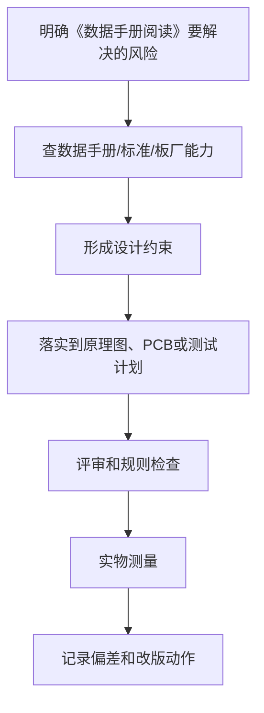

# 07 数据手册阅读

## 学习目标

学完本章，你应该能：

- 知道数据手册每个章节的作用。
- 找到芯片供电、电气参数、引脚、封装和推荐电路。
- 区分绝对最大额定值和推荐工作条件。
- 根据数据手册完成基础原理图和 PCB 注意事项。

硬件设计最可靠的信息来源是官方数据手册、应用笔记和参考设计。网上教程可以参考，但不能替代数据手册。

## 1. 为什么必须看数据手册

数据手册能告诉你：

- 芯片能做什么。
- 供电范围是多少。
- 每个引脚怎么用。
- 哪些引脚必须上拉或下拉。
- 输入输出电平是多少。
- 外围电阻电容怎么选。
- PCB 布局有什么要求。
- 封装尺寸和引脚编号。
- 器件极限和推荐工作条件。

不看数据手册的典型后果：

- 电源接错。
- IO 电平不兼容。
- 引脚方向接反。
- 启动配置错误。
- 去耦电容缺失。
- 封装焊盘错误。
- 芯片无法启动或不稳定。

## 2. 数据手册常见章节

| 章节 | 主要内容 | 阅读重点 |
| :--- | :--- | :--- |
| Features | 特性 | 快速判断是否满足需求 |
| Applications | 应用场景 | 判断芯片定位 |
| Description | 功能描述 | 理解整体功能 |
| Pin Configuration | 引脚排列图 | 防止接错引脚 |
| Pin Description | 引脚说明 | 每个引脚功能和要求 |
| Absolute Maximum Ratings | 绝对最大额定值 | 不能超过 |
| Recommended Operating Conditions | 推荐工作条件 | 正常设计依据 |
| Electrical Characteristics | 电气特性 | 电压、电流、精度、时序 |
| Functional Description | 功能细节 | 理解工作模式 |
| Typical Application | 典型应用 | 原理图重要参考 |
| Layout Guidelines | 布局建议 | PCB 关键参考 |
| Package Information | 封装信息 | 做封装必看 |
| Ordering Information | 订购信息 | 选具体型号 |

## 3. 绝对最大额定值

绝对最大额定值是器件能承受的极限。

重点：

- 超过可能永久损坏。
- 不表示可以长期工作。
- 正常设计不能贴着极限值。

例子：

如果芯片 Absolute Maximum 中 VCC 最大 6V，不代表可以长期用 6V 供电。应该看 Recommended Operating Conditions。

## 4. 推荐工作条件

推荐工作条件才是设计依据。

例如：

- VCC：2.7V - 5.5V
- 工作温度：-40°C - 85°C
- 输入高电平阈值
- 最大输出电流

设计时应满足推荐范围，并留工程余量。

## 5. 电气特性

Electrical Characteristics 通常很长，但非常重要。

常见参数：

- 输入电压范围
- 输出电压范围
- 静态电流
- 最大输出电流
- 输入漏电流
- 输出压降
- 精度
- 纹波
- 噪声
- 时序参数

阅读方法：

1. 先找和你应用相关的参数。
2. 注意测试条件。
3. 区分 Min、Typ、Max。
4. 不要只看典型值。

## 6. 引脚说明

Pin Description 要逐个看。

关注：

- 电源引脚
- 地引脚
- 复位引脚
- 启动配置引脚
- 输入输出方向
- 是否开漏
- 是否需要上拉
- 是否耐 5V
- 未用引脚处理方式

新手常错：

- 把开漏输出当推挽输出。
- 忘记 I2C 上拉。
- Boot 引脚悬空。
- Reset 引脚没有处理。
- 未用模拟输入悬空。

## 7. 典型应用电路

Typical Application 是新手画原理图的核心参考。

通常包含：

- 输入电容
- 输出电容
- 去耦电容
- 上拉 / 下拉
- 反馈电阻
- 电感
- 二极管
- 保护器件

使用原则：

- 第一版优先按推荐电路画。
- 不理解的元件不要随意删。
- 参数修改前要理解作用。
- 多参考官方评估板原理图。

## 8. PCB 布局建议

Layout Guidelines 对这些芯片尤其重要：

- DC-DC
- USB
- RF
- 高速 ADC
- 运放
- 电机驱动
- 高速存储
- 以太网

常见建议：

- 输入电容靠近芯片。
- 高频回路面积最小。
- 反馈线远离开关节点。
- 差分线阻抗控制。
- 模拟地和数字地处理方式。
- 散热焊盘连接大面积铜。

如果数据手册有推荐 PCB 图，认真照着理解。

## 9. 封装信息

Package Information 包含：

- 引脚间距
- 封装外形
- 焊盘尺寸建议
- 热焊盘
- 封装高度
- Pin 1 标记

新手要注意：

- 符号引脚编号必须和封装焊盘编号一致。
- QFN 底部焊盘是否需要接地。
- 连接器封装方向必须和实物一致。
- 不要只凭 EDA 库默认封装。

## 10. 订购型号

同一个芯片可能有多个型号：

- 不同输出电压
- 不同温度等级
- 不同封装
- 不同包装方式
- 不同精度

Ordering Information 用来确定具体料号。

例如 LDO：

```text
ABC123-3.3 SOT23-5
ABC123-5.0 SOT23-5
ABC123-3.3 DFN
```

不要只写芯片系列名，要写完整型号。

## 11. 应用笔记和参考设计

除了数据手册，还要看：

- Application Note
- Evaluation Board User Guide
- Reference Design
- Hardware Design Guide
- Layout Example

这些资料通常比数据手册更具体。

例如：

- STM32 硬件设计应用笔记
- ESP32 硬件设计指南
- DC-DC 芯片布局应用笔记
- USB Type-C 参考设计

## 12. 数据手册阅读步骤

第一次看一个芯片：

1. 看功能和应用场景。
2. 看供电范围。
3. 看引脚图。
4. 看推荐工作条件。
5. 看典型应用电路。
6. 看关键电气参数。
7. 看布局建议。
8. 看封装尺寸。
9. 确定具体订购型号。
10. 再画原理图和封装。

## 实操练习

任选一个 LDO：

1. 找到输入电压范围。
2. 找到输出电流。
3. 找到推荐输入输出电容。
4. 找到封装引脚图。
5. 画出典型应用电路。

任选一个 MCU：

1. 找到供电引脚。
2. 找到复位引脚。
3. 找到下载接口。
4. 找到 Boot 配置。
5. 找到去耦建议。

## 检查清单

- 我是否看了官方数据手册？
- 我是否区分了绝对最大和推荐工作条件？
- 我是否找到了每个关键引脚的说明？
- 我是否按推荐电路放了外围器件？
- 我是否看了 Layout Guidelines？
- 我是否核对了封装尺寸和引脚编号？

## 常见误区

- 误区：绝对最大值就是可用工作值。
  纠正：正常设计看推荐工作条件。

- 误区：典型应用中的电容可以随便删。
  纠正：很多电容影响稳定性和瞬态响应。

- 误区：EDA 自带封装一定对。
  纠正：必须核对数据手册封装图。

## 本章总结

数据手册是硬件设计的依据。新手每用一个芯片，都应该至少看供电、引脚、推荐工作条件、典型应用、布局建议和封装信息。会读数据手册，是硬件能力真正开始成形的标志。

---

## 万字精讲扩展（2026-06-16 更新）
> Last researched: 2026-06-16。本文补充内容以入门到工程实践为主，数值和规则应在真实项目中继续以数据手册、板厂能力表、产品标准和实测结果校准。

### 本章在整套学习路线中的位置

《数据手册阅读》承担的是把局部知识放进完整硬件设计流程的作用。学习这一章时，不要只看定义，而要关注它怎样影响需求、选型、原理图、PCB、制造、装配、调试和改版。硬件设计的每个决定都会在后面的实物阶段兑现：原理图里少一个保护器件，可能在插拔时烧芯片；PCB 上去耦电容放远，可能在负载跳变时复位；封装核对不严，可能导致整批板子无法焊接；没有测试点，可能让一个本来十分钟能定位的问题拖成几天。

本章学习完成后，至少应能做到三件事。第一，能用自己的话解释关键概念，而不是只背术语。第二，能把概念转换成设计检查项，例如线宽、间距、去耦、回流、保护、测试点、BOM 字段或生产文件。第三，能在调试时根据现象反推可能原因，并用仪器或目检验证。只要这三件事能完成，这章就不再是静态笔记，而会变成你设计下一块板子的工具。

### 元器件和数据手册的精讲重点

器件学习的核心不是背封装和型号，而是知道一个器件在系统中承担什么职责、关键参数是什么、哪些参数会随温度、频率、电压和批次变化。电阻除了阻值还有功率、精度、温漂、耐压和封装；电容除了容量还有耐压、介质、直流偏压、ESR、ESL、温度特性和寿命；MOSFET 除了导通电阻还有阈值电压、栅极电荷、安全工作区、体二极管和热阻。初学者常把典型值当保证值，把绝对最大额定值当工作条件，这是非常危险的。

数据手册阅读应当先看四张表：绝对最大额定值、推荐工作条件、电气特性和封装/热参数。绝对最大额定值只说明超过后可能损坏，不说明可以长期工作；推荐工作条件才是设计范围；电气特性表要区分最小值、典型值、最大值和测试条件；封装图要确认顶视图、底视图、引脚间距、焊盘建议和热焊盘要求。对于电源、运放、ADC、接口芯片，还要阅读典型应用电路和 PCB Layout 建议，因为很多性能参数只有在合适布局下才可能接近数据手册。

替代料判断不能只看“功能一样”。需要核对引脚定义、封装尺寸、耐压、电流、逻辑电平、温度范围、时序、默认状态、ESD 等级、输出结构、启动行为、热阻和供货状态。很多硬件错误不是原理错，而是替代料的某个边界条件不一致，例如 LDO 稳定性依赖输出电容 ESR，MOSFET 的阈值电压不能代表在 3.3 V GPIO 下充分导通，连接器同系列不同针序导致线束反接。

### 工程学习的底层方法

硬件学习最容易出现的偏差，是把知识点当成孤立名词背诵。真正能落地的学习方式，是把每个知识点放进同一条工程链路里理解：需求从哪里来，器件为什么这样选，原理图如何表达意图，PCB 如何把电气意图变成物理结构，制造和装配会怎样限制你的设计，调试时又如何证明假设成立。这个链路一旦建立，很多看似零散的规则会变成同一个目标的不同侧面：降低回路面积、控制电流路径、保证制造余量、保留测试入口、减少不确定性。

初学阶段不要追求一次学完所有高端主题。更稳妥的路线是先把低压、低速、小电流、少接口的板子做闭环。所谓闭环，不是画完 PCB 就结束，而是完成需求定义、器件选型、原理图、ERC、PCB、DRC、Gerber 检查、打样、焊接、上电、测量、故障记录和改版。每完成一次闭环，你对数据手册、封装、布局、布线、去耦、接地、调试的理解都会变得更具体。没有实物反馈时，很多规则只是口号；有了失败样板以后，规则才会变成可执行的判断。

学习时建议同时维护三类笔记。第一类是概念笔记，用自己的话解释术语，不直接复制资料原文。第二类是规则笔记，把板厂能力、器件要求、个人默认规则写成表格，并标注来源和适用边界。第三类是复盘笔记，记录每块板子的设计假设、测量数据、错误原因和下一版修改。硬件经验的价值往往不在“知道一个规则”，而在知道这个规则什么时候适用、什么时候不够、什么时候必须回到数据手册或标准重新计算。

### 从规则到判断：不要把经验值当标准

很多入门资料会给出 100 nF 去耦、45 度走线、线宽 0.2 mm、线距 0.2 mm、TVS 靠近接口、晶振靠近芯片等经验值。这些经验很有用，但它们不是脱离条件的真理。100 nF 的作用依赖电容封装、ESL、布局回路、电源阻抗和芯片瞬态电流；线宽取决于电流、铜厚、温升、压降、散热铜皮和工作环境；线距受制造能力、电压、安全规范、污染等级和产品要求影响。学习笔记里应当写清楚“为什么”和“边界”，而不是只写一个数字。

工程上可以采用四级依据。最高优先级是安全法规、产品标准和客户要求；其次是芯片数据手册、评估板、应用笔记和参考设计；再往下是板厂能力表、装配厂工艺能力和 EDA 规则；最后才是个人经验和论坛建议。社区经验可以帮助发现常见坑，但不能替代标准和厂商文档。尤其是高压、电池、大电流、电机、射频、高速总线、医疗和汽车场景，入门经验值通常不够，必须引入正式规范、仿真、评审和测试。

### 一个可复用的硬件闭环


Figure: PCB 学习闭环，综合 KiCad 官方流程、板厂 DFM 要求、TI/ADI 布局应用笔记和中文社区调试经验重新整理。

### 调试意识：把问题拆成可验证假设

调试不是“看到不工作就随机改”，而是把系统拆成一组可以测量的假设。电源是否到位，复位是否释放，时钟是否振荡，下载接口是否连通，GPIO 是否能翻转，通信波形是否符合电平和时序，模拟输入是否超量程，负载电流是否超过器件能力，每一步都应该有测量点、预期值和异常解释。硬件调试最忌讳同时改变多个变量，因为这样即使问题消失，也无法知道真正原因。

第一次上电建议采用限流电源，并把电流限值设成符合预期的保守值。先不上昂贵芯片或外部负载，先测裸板短路；再焊电源部分，测输入保护、稳压输出和纹波；再焊主控和下载接口；最后逐个启用传感器、通信接口和执行器。每一步都记录电压、电流、温度和波形截图。对于后续改版，测量记录比口头记忆可靠得多。

### 核心知识点逐条精讲

#### 1. 绝对最大额定值

在《数据手册阅读》这一章里，`绝对最大额定值` 不是孤立知识点，而是一个需要落实到设计动作、检查动作和测试动作的工程对象。学习时先问三个问题：它解决什么风险，它依赖哪些前置条件，它失败时会表现成什么现象。比如一个规则如果用于 PCB，就要进一步落实到板框、封装、网络类、线宽线距、过孔、参考平面、测试点或生产文件；如果用于电路，就要落实到器件参数、工作条件、热、保护和测量方法。这样做可以避免只记住结论，却不知道如何在下一块板子上执行。

实践中建议把 `绝对最大额定值` 写成可检查条目，而不是写成笼统口号。可检查条目应包含对象、位置、数值或来源、验证方法和异常处理。例如“确认每个外部接口有合适保护”比“注意 ESD”更可执行；“确认 U1 每个 VDD 引脚旁边 1 至 3 mm 内有低 ESL 去耦路径，且地过孔靠近电容地端”比“加 100 nF”更接近工程要求。每个条目都要能在评审时被勾选，在调试时被测量，在改版时被追踪。

当 `绝对最大额定值` 与其他规则冲突时，应按约束优先级处理。安全和法规高于性能，数据手册高于经验，板厂能力高于个人习惯，实际测量高于未经验证的猜测。很多设计取舍没有唯一答案，例如更宽的线有利于电流和压降，却可能破坏阻抗或增加布线困难；更强的滤波有利于噪声，却可能降低响应速度或影响启动；更密的布局有利于面积，却可能损害焊接、返修和散热。笔记要记录取舍理由，而不是只留下最后结果。

#### 2. 推荐工作条件

在《数据手册阅读》这一章里，`推荐工作条件` 不是孤立知识点，而是一个需要落实到设计动作、检查动作和测试动作的工程对象。学习时先问三个问题：它解决什么风险，它依赖哪些前置条件，它失败时会表现成什么现象。比如一个规则如果用于 PCB，就要进一步落实到板框、封装、网络类、线宽线距、过孔、参考平面、测试点或生产文件；如果用于电路，就要落实到器件参数、工作条件、热、保护和测量方法。这样做可以避免只记住结论，却不知道如何在下一块板子上执行。

实践中建议把 `推荐工作条件` 写成可检查条目，而不是写成笼统口号。可检查条目应包含对象、位置、数值或来源、验证方法和异常处理。例如“确认每个外部接口有合适保护”比“注意 ESD”更可执行；“确认 U1 每个 VDD 引脚旁边 1 至 3 mm 内有低 ESL 去耦路径，且地过孔靠近电容地端”比“加 100 nF”更接近工程要求。每个条目都要能在评审时被勾选，在调试时被测量，在改版时被追踪。

当 `推荐工作条件` 与其他规则冲突时，应按约束优先级处理。安全和法规高于性能，数据手册高于经验，板厂能力高于个人习惯，实际测量高于未经验证的猜测。很多设计取舍没有唯一答案，例如更宽的线有利于电流和压降，却可能破坏阻抗或增加布线困难；更强的滤波有利于噪声，却可能降低响应速度或影响启动；更密的布局有利于面积，却可能损害焊接、返修和散热。笔记要记录取舍理由，而不是只留下最后结果。

#### 3. 电气特性表

在《数据手册阅读》这一章里，`电气特性表` 不是孤立知识点，而是一个需要落实到设计动作、检查动作和测试动作的工程对象。学习时先问三个问题：它解决什么风险，它依赖哪些前置条件，它失败时会表现成什么现象。比如一个规则如果用于 PCB，就要进一步落实到板框、封装、网络类、线宽线距、过孔、参考平面、测试点或生产文件；如果用于电路，就要落实到器件参数、工作条件、热、保护和测量方法。这样做可以避免只记住结论，却不知道如何在下一块板子上执行。

实践中建议把 `电气特性表` 写成可检查条目，而不是写成笼统口号。可检查条目应包含对象、位置、数值或来源、验证方法和异常处理。例如“确认每个外部接口有合适保护”比“注意 ESD”更可执行；“确认 U1 每个 VDD 引脚旁边 1 至 3 mm 内有低 ESL 去耦路径，且地过孔靠近电容地端”比“加 100 nF”更接近工程要求。每个条目都要能在评审时被勾选，在调试时被测量，在改版时被追踪。

当 `电气特性表` 与其他规则冲突时，应按约束优先级处理。安全和法规高于性能，数据手册高于经验，板厂能力高于个人习惯，实际测量高于未经验证的猜测。很多设计取舍没有唯一答案，例如更宽的线有利于电流和压降，却可能破坏阻抗或增加布线困难；更强的滤波有利于噪声，却可能降低响应速度或影响启动；更密的布局有利于面积，却可能损害焊接、返修和散热。笔记要记录取舍理由，而不是只留下最后结果。

#### 4. 典型应用电路

在《数据手册阅读》这一章里，`典型应用电路` 不是孤立知识点，而是一个需要落实到设计动作、检查动作和测试动作的工程对象。学习时先问三个问题：它解决什么风险，它依赖哪些前置条件，它失败时会表现成什么现象。比如一个规则如果用于 PCB，就要进一步落实到板框、封装、网络类、线宽线距、过孔、参考平面、测试点或生产文件；如果用于电路，就要落实到器件参数、工作条件、热、保护和测量方法。这样做可以避免只记住结论，却不知道如何在下一块板子上执行。

实践中建议把 `典型应用电路` 写成可检查条目，而不是写成笼统口号。可检查条目应包含对象、位置、数值或来源、验证方法和异常处理。例如“确认每个外部接口有合适保护”比“注意 ESD”更可执行；“确认 U1 每个 VDD 引脚旁边 1 至 3 mm 内有低 ESL 去耦路径，且地过孔靠近电容地端”比“加 100 nF”更接近工程要求。每个条目都要能在评审时被勾选，在调试时被测量，在改版时被追踪。

当 `典型应用电路` 与其他规则冲突时，应按约束优先级处理。安全和法规高于性能，数据手册高于经验，板厂能力高于个人习惯，实际测量高于未经验证的猜测。很多设计取舍没有唯一答案，例如更宽的线有利于电流和压降，却可能破坏阻抗或增加布线困难；更强的滤波有利于噪声，却可能降低响应速度或影响启动；更密的布局有利于面积，却可能损害焊接、返修和散热。笔记要记录取舍理由，而不是只留下最后结果。

#### 5. 封装和订购信息

在《数据手册阅读》这一章里，`封装和订购信息` 不是孤立知识点，而是一个需要落实到设计动作、检查动作和测试动作的工程对象。学习时先问三个问题：它解决什么风险，它依赖哪些前置条件，它失败时会表现成什么现象。比如一个规则如果用于 PCB，就要进一步落实到板框、封装、网络类、线宽线距、过孔、参考平面、测试点或生产文件；如果用于电路，就要落实到器件参数、工作条件、热、保护和测量方法。这样做可以避免只记住结论，却不知道如何在下一块板子上执行。

实践中建议把 `封装和订购信息` 写成可检查条目，而不是写成笼统口号。可检查条目应包含对象、位置、数值或来源、验证方法和异常处理。例如“确认每个外部接口有合适保护”比“注意 ESD”更可执行；“确认 U1 每个 VDD 引脚旁边 1 至 3 mm 内有低 ESL 去耦路径，且地过孔靠近电容地端”比“加 100 nF”更接近工程要求。每个条目都要能在评审时被勾选，在调试时被测量，在改版时被追踪。

当 `封装和订购信息` 与其他规则冲突时，应按约束优先级处理。安全和法规高于性能，数据手册高于经验，板厂能力高于个人习惯，实际测量高于未经验证的猜测。很多设计取舍没有唯一答案，例如更宽的线有利于电流和压降，却可能破坏阻抗或增加布线困难；更强的滤波有利于噪声，却可能降低响应速度或影响启动；更密的布局有利于面积，却可能损害焊接、返修和散热。笔记要记录取舍理由，而不是只留下最后结果。


### 场景化判断表

| 场景 | 推荐处理 | 典型风险 | 验证方式 |
| :--- | :--- | :--- | :--- |
| 绝对最大额定值 | 先查数据手册、板厂能力或测试目标，再转成 EDA 规则和评审项 | 只凭经验值、没有来源、没有验证方法 | 设计评审、DRC、上电测试和改版复盘 |
| 推荐工作条件 | 先查数据手册、板厂能力或测试目标，再转成 EDA 规则和评审项 | 只凭经验值、没有来源、没有验证方法 | 设计评审、DRC、上电测试和改版复盘 |
| 电气特性表 | 先查数据手册、板厂能力或测试目标，再转成 EDA 规则和评审项 | 只凭经验值、没有来源、没有验证方法 | 设计评审、DRC、上电测试和改版复盘 |
| 典型应用电路 | 先查数据手册、板厂能力或测试目标，再转成 EDA 规则和评审项 | 只凭经验值、没有来源、没有验证方法 | 设计评审、DRC、上电测试和改版复盘 |
| 封装和订购信息 | 先查数据手册、板厂能力或测试目标，再转成 EDA 规则和评审项 | 只凭经验值、没有来源、没有验证方法 | 设计评审、DRC、上电测试和改版复盘 |

表格里的“推荐处理”不是固定答案，而是提醒你把每个问题落到来源、约束和验证。硬件工程里最危险的状态不是不知道，而是以为某个经验值在所有场景都成立。每当项目电压、电流、速度、温度、线缆长度、外部环境、制造厂家或装配方式变化时，都应该重新检查这些条目。

### 本章建议工作流



Figure: 《数据手册阅读》学习和实践工作流，综合官方文档、厂商应用笔记和板厂 DFM 资料整理。

这个工作流的重点是“先约束，后执行，再验证”。例如你要决定线宽，就不要只问别人用多少，而要先知道电流、铜厚、温升、压降和板厂能力；你要决定去耦，就不要只看电容值，而要看瞬态电流路径、封装 ESL、过孔位置和参考平面；你要决定接口保护，就要看接口是否出板、线缆长度、人体接触概率、芯片耐受能力和保护器件泄放路径。只要按这个流程写笔记，每一章都会从知识介绍变成工程方法。

### 常见误区和纠正方法

- 误区：把 DRC 通过当作设计正确。纠正：DRC 只能检查你已经设置的规则，不能理解电路意图；设计正确还需要数据手册核对、布局评审、回流路径检查、制造文件检查和实物测试。
- 误区：把社区经验当成标准。纠正：社区经验适合发现问题和启发思路，最终参数要回到官方文档、板厂能力、器件数据手册和实测结果。
- 误区：只关注能不能工作，不关注能不能维护。纠正：学习阶段就要保留丝印、测试点、版本号、BOM 信息和复盘记录，否则下一次遇到同类问题仍然要从头猜。
- 误区：只看电气连接，不看物理路径。纠正：PCB 中的电流路径、回流路径、寄生电感、寄生电容、热路径和装配空间都会影响结果，原理图正确只是起点。
- 误区：追求一次完美。纠正：硬件设计天然需要迭代，关键是让每次迭代有明确假设、测量证据和改版记录。

### 与相邻章节的关系

《数据手册阅读》应与前后章节交叉学习。向前看，它依赖基础电学、器件参数和数据手册阅读；向后看，它会影响 PCB 布局布线、制造装配、调试排障和版本管理。比如你在本章学到一个布局规则，应当回到元器件章节确认器件要求，再到 PCB 规则章节设置约束，再到调试章节设计测量点。这样多个笔记之间会形成网络，而不是彼此孤立。

如果某个概念暂时难以完全理解，不要停留在抽象层面反复阅读，可以通过低风险实验建立直觉。低压 LED 板、按键板、传感器板、MCU 最小系统板、MOSFET 负载板和小型 Buck 板都适合作为验证平台。每块板只重点验证两三个主题，效果通常比一块板塞满所有功能更好。


### 实操训练和复盘模板

1. 选一个真实小项目，围绕 `绝对最大额定值` 写一条设计假设、一个检查方法和一个测量方法。
2. 选一个真实小项目，围绕 `推荐工作条件` 写一条设计假设、一个检查方法和一个测量方法。
3. 选一个真实小项目，围绕 `电气特性表` 写一条设计假设、一个检查方法和一个测量方法。
4. 选一个真实小项目，围绕 `典型应用电路` 写一条设计假设、一个检查方法和一个测量方法。
5. 选一个真实小项目，围绕 `封装和订购信息` 写一条设计假设、一个检查方法和一个测量方法。建议每次练习都输出一页复盘，格式如下：

```text
项目名称：
本章主题：数据手册阅读
设计假设：
依据来源：数据手册 / 标准 / 板厂能力 / 应用笔记 / 实测经验
实施位置：原理图页码、PCB 区域、BOM 行、测试点编号
预期结果：
实际测量：
偏差原因：
下一版修改：
```

这个模板看起来简单，但能强迫你把“我觉得”变成“我依据什么、做在哪里、测到了什么、下一步怎么改”。硬件学习最怕只留下模糊印象，复盘模板能把每一次小失败转化成下一版的规则。

## 参考资料与延伸阅读

- [Standard / IPC] IPC-2221B Preview: Generic Standard on Printed Board Design: https://webstore.ansi.org/preview-pages/IPC/preview_IPC%2B2221B-2012.pdf
- [Standard / ANSI] IPC-2152, Current Carrying Capacity in Printed Board Design: https://blog.ansi.org/ansi/ipc-2152-current-carrying-capacity-in-pcbs/
- [Tool / Official] KiCad 9.0 PCB Editor Documentation: https://docs.kicad.org/9.0/en/pcbnew/pcbnew.html
- [Tool / Official] Getting Started in KiCad 9.0: https://docs.kicad.org/9.0/en/getting_started_in_kicad/getting_started_in_kicad.html
- [Vendor / TI] PCB Design Guidelines For Reduced EMI: https://www.ti.com/lit/pdf/szza009
- [Vendor / TI] High Speed Layout Guidelines: https://www.ti.com/lit/pdf/scaa082
- [Vendor / TI] AN-1149 Layout Guidelines for Switching Power Supplies: https://www.ti.com/lit/pdf/snva021
- [Vendor / TI] PCB layout guidelines to optimize power supply performance: https://www.ti.com/lit/ml/slyp762/slyp762.pdf
- [Vendor / TI] Grounding in mixed-signal systems demystified, Part 2: https://www.ti.com/lit/pdf/slyt512
- [Vendor / Analog Devices] MT-031 Grounding Data Converters: https://www.analog.com/media/en/training-seminars/tutorials/MT-031.pdf
- [Vendor / Analog Devices] MT-101 Decoupling Techniques: https://www.analog.com/media/en/training-seminars/tutorials/MT-101.pdf
- [Vendor / Microchip] Basic 16-Bit MCU Design and Troubleshooting Checklist: https://ww1.microchip.com/downloads/aemDocuments/documents/MCU16/ProductDocuments/SupportingCollateral/Basic-16-Bit-MCU-Design-and-Troubleshooting-Checklist-DS50003274.pdf
- [Fab / PCBWay] PCB Manufacturing Tolerances: https://www.pcbway.com/pcb_prototype/PCB_Manufacturing_tolerances.html
- [Fab / PCBWay] PCB Design Rule Check: https://www.pcbway.com/pcb_prototype/PCB_Design_Rule_Check.html
- [Fab / OSH Park] Fabrication Services Design Rules: https://docs.oshpark.com/services/
- [Fab / Eurocircuits] PCB Design Guidelines: https://www.eurocircuits.com/technical-guidelines/pcb-design-guidelines/
- [Fab / Eurocircuits] Track Width and Isolation Gap Tolerances: https://www.eurocircuits.com/technical-guidelines/understanding-manufacturing-tolerances-on-a-pcb/track-width-and-isolation-gap-tolerances/
- [Community / 博客园] AD 学习笔记（基础）: https://www.cnblogs.com/Roboduster/p/15329893.html
- [Community / 博客园] Altium Designer PCB 文件的绘制（上：PCB 基础和布局）: https://www.cnblogs.com/zhjblogs/p/14172536.html
- [Community / CSDN] PCB 学习笔记: https://blog.csdn.net/weixin_51933819/article/details/122512816
- [Community / CSDN] PCB 布局布线要求及多层电路板叠加原则: https://blog.csdn.net/Ka_wyb/article/details/142337253
- [Community / 掘金] PCB 设计和布局: https://juejin.cn/post/7612948192174817295
- [Community / 掘金] 芯片电源引脚为什么要加一个 100nF 的电容: https://juejin.cn/post/7325069743144108073
- [Community / 电子工程专辑] 5 步搞定 PCB 调试: https://www.eet-china.com/mp/a393354.html
