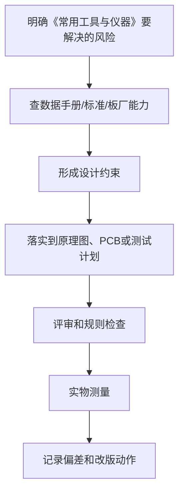

# 08 常用工具与仪器

## 学习目标

学完本章，你应该能：

- 知道硬件学习需要哪些软件、工具和仪器。
- 理解万用表、限流电源、示波器、逻辑分析仪分别解决什么问题。
- 建立基础实验台配置。
- 知道工具使用中的安全注意事项。

工具不是越贵越好。新手最重要的是会用基础工具，并建立正确测量习惯。

## 1. EDA 软件

EDA 是 Electronic Design Automation，用于原理图和 PCB 设计。

| 软件 | 特点 | 适合 |
| :--- | :--- | :--- |
| KiCad | 开源、跨平台、功能完整 | 新手和开源项目 |
| 立创 EDA | 在线、器件库和打样结合方便 | 国内快速打样 |
| Altium Designer | 商业专业工具 | 企业和复杂项目 |
| EasyEDA | 在线工具 | 入门和简单项目 |
| Eagle | 历史较久 | 一些开源项目 |

新手建议：

- 想系统学习：KiCad。
- 想快速打样贴片：立创 EDA。
- 工作要求 Altium：再学 Altium。

## 2. 仿真软件

仿真不是必须，但对理解电路很有帮助。

| 工具 | 用途 |
| :--- | :--- |
| Falstad | 在线直观电路仿真，适合入门 |
| LTspice | 模拟电路、电源仿真 |
| TINA-TI | TI 电路仿真 |
| QSPICE | 电路仿真 |

适合仿真的内容：

- RC 滤波
- 运放电路
- 电源瞬态
- MOSFET 开关
- 简单波形

注意：

仿真结果依赖模型和设置。仿真通过不代表实物一定没问题。

## 3. 万用表

万用表是硬件必备工具。

常用功能：

- 测直流电压
- 测交流电压
- 测电阻
- 通断蜂鸣
- 测电流
- 测二极管压降

### 使用注意

测电压：

- 表笔并联在被测点两端。
- 黑表笔接 GND，红表笔接信号或电源。

测电流：

- 万用表要串联进电路。
- 表笔插孔要换到电流档。
- 不要用电流档直接并联电源，否则相当于短路。

通断档：

- 只能在断电状态下使用。
- 用于检查短路和连接。

## 4. 可调限流电源

作用：

- 设置输出电压。
- 设置最大电流。
- 观察实时电流。
- 安全第一次上电。

关键概念：

- CV：恒压模式。
- CC：恒流模式。

如果电路短路，电源会进入 CC 限流模式，电压下降，电流被限制。

新手建议：

- 第一次上电使用限流。
- 电流异常立即断电。
- 不要直接用大电流适配器首上电。

## 5. 烙铁和焊接工具

基础焊接工具：

- 温控烙铁
- 烙铁架
- 焊锡丝
- 助焊剂
- 吸锡带
- 吸锡器
- 镊子
- 放大镜或显微镜
- 洗板水或酒精

温度建议：

- 有铅焊锡：约 300-330°C
- 无铅焊锡：约 330-370°C

具体温度和焊盘大小、烙铁头、焊锡有关。

## 6. 示波器

示波器用来看电压随时间变化。

适合观察：

- 电源纹波
- 时钟
- PWM
- 复位信号
- UART 波形
- 开关电源 SW 节点
- 按键抖动

关键参数：

- 带宽
- 采样率
- 通道数
- 存储深度
- 探头倍率

新手常用设置：

- 探头 10x。
- 先夹好地线。
- 根据波形调整时间档和电压档。
- 使用触发稳定波形。

注意：

普通台式示波器地夹通常接大地。测非隔离市电电路非常危险，新手不要做。

## 7. 逻辑分析仪

逻辑分析仪用于看数字信号高低电平和通信协议。

适合：

- UART
- I2C
- SPI
- 1-Wire
- GPIO 时序

优点：

- 便宜。
- 多通道。
- 可以协议解码。

缺点：

- 看不到模拟电压细节。
- 只能判断高低电平。

新手调 I2C、SPI、UART 时非常有用。

## 8. 函数发生器

函数发生器可以输出测试信号：

- 正弦波
- 方波
- 三角波
- 脉冲

用途：

- 测滤波器
- 测运放
- 测 ADC 输入
- 模拟传感器信号

入门阶段不是必需，有示波器后再考虑。

## 9. 电子负载

电子负载用于模拟负载消耗电流。

用途：

- 测电源输出能力
- 测 DC-DC 稳定性
- 测电池放电
- 测温升

如果学习电源设计，电子负载很有用。

## 10. 热工具

常见：

- 热风枪
- 加热台
- 热像仪
- 温度计

用途：

- 拆焊贴片 IC。
- 焊接 QFN。
- 观察发热点。
- 评估散热。

热风枪使用要小心，容易吹飞小元件或烤坏塑料连接器。

## 11. 新手基础实验台

最低配置：

- 万用表
- 可调限流电源
- 温控烙铁
- 镊子
- 助焊剂
- 吸锡带
- 面包板和杜邦线
- 常用电阻电容包
- LED、按键、三极管、MOSFET

推荐进阶：

- 入门示波器
- 简易逻辑分析仪
- 放大镜或显微镜
- 热风枪

## 实操练习

1. 用万用表测 5V 电源输出。
2. 用通断档检查一根杜邦线。
3. 设置限流电源 5V / 100mA 点亮 LED。
4. 用示波器观察 Arduino 或 MCU 输出的 PWM。
5. 用逻辑分析仪抓 UART 输出。

## 检查清单

- 我是否会正确测电压？
- 我是否知道测电流要串联？
- 我是否会设置限流电源？
- 我是否知道示波器地夹的风险？
- 我是否能用逻辑分析仪看 UART/I2C/SPI？

## 常见误区

- 误区：万用表电流档和电压档一样用。
  纠正：电流档要串联，错误并联会短路。

- 误区：没有示波器就不能学硬件。
  纠正：入门可以先用万用表和逻辑分析仪，但示波器迟早要学。

- 误区：贵工具自动解决问题。
  纠正：关键是知道测哪里、为什么测。

## 本章总结

工具是硬件学习的延伸感官。万用表看静态值，示波器看波形，逻辑分析仪看数字协议，限流电源保护上电安全。先把基础工具用熟，比买很多高级设备更重要。

---

## 万字精讲扩展（2026-06-16 更新）
> Last researched: 2026-06-16。本文补充内容以入门到工程实践为主，数值和规则应在真实项目中继续以数据手册、板厂能力表、产品标准和实测结果校准。

### 本章在整套学习路线中的位置

《常用工具与仪器》承担的是把局部知识放进完整硬件设计流程的作用。学习这一章时，不要只看定义，而要关注它怎样影响需求、选型、原理图、PCB、制造、装配、调试和改版。硬件设计的每个决定都会在后面的实物阶段兑现：原理图里少一个保护器件，可能在插拔时烧芯片；PCB 上去耦电容放远，可能在负载跳变时复位；封装核对不严，可能导致整批板子无法焊接；没有测试点，可能让一个本来十分钟能定位的问题拖成几天。

本章学习完成后，至少应能做到三件事。第一，能用自己的话解释关键概念，而不是只背术语。第二，能把概念转换成设计检查项，例如线宽、间距、去耦、回流、保护、测试点、BOM 字段或生产文件。第三，能在调试时根据现象反推可能原因，并用仪器或目检验证。只要这三件事能完成，这章就不再是静态笔记，而会变成你设计下一块板子的工具。

### 工具类章节的精讲重点

EDA 和仪器都是放大工程判断的工具。KiCad、Altium、立创 EDA 等软件能帮助你维护网络、封装、规则、铺铜、DRC 和生产文件，但不会自动理解你的电源环路是否合理、TVS 泄放路径是否足够短、ADC 前端是否远离噪声源。示波器、万用表、逻辑分析仪、电源和电子负载能给出证据，但前提是你知道要测什么、参考点在哪里、探头接法会不会引入额外误差。

工具学习应围绕流程，而不是围绕菜单。以 KiCad 为例，重点是项目结构、符号库、封装库、网络标号、ERC、封装分配、Board Setup、Constraints、Net Class、差分规则、铺铜、DRC、3D 检查、Gerber 导出和制造检查。每个功能都应对应一个工程问题：规则设置是为了让错误尽早暴露，网络类是为了让不同电气对象采用不同约束，3D 检查是为了发现高度、方向和机械干涉，Gerber Viewer 是为了确认输出文件和设计意图一致。

仪器使用也要建立边界意识。万用表适合测静态电压、电阻和通断，不适合观察快速瞬态；示波器能看波形，但探头地线太长会把高频噪声放大成假象；逻辑分析仪能解码协议，但不能证明模拟电平质量；热像仪能发现热点，但要注意材料发射率和反光；电子负载能测电源能力，但线损和连接器发热也会影响结果。工具读数必须结合测量方法解释。

### 工程学习的底层方法

硬件学习最容易出现的偏差，是把知识点当成孤立名词背诵。真正能落地的学习方式，是把每个知识点放进同一条工程链路里理解：需求从哪里来，器件为什么这样选，原理图如何表达意图，PCB 如何把电气意图变成物理结构，制造和装配会怎样限制你的设计，调试时又如何证明假设成立。这个链路一旦建立，很多看似零散的规则会变成同一个目标的不同侧面：降低回路面积、控制电流路径、保证制造余量、保留测试入口、减少不确定性。

初学阶段不要追求一次学完所有高端主题。更稳妥的路线是先把低压、低速、小电流、少接口的板子做闭环。所谓闭环，不是画完 PCB 就结束，而是完成需求定义、器件选型、原理图、ERC、PCB、DRC、Gerber 检查、打样、焊接、上电、测量、故障记录和改版。每完成一次闭环，你对数据手册、封装、布局、布线、去耦、接地、调试的理解都会变得更具体。没有实物反馈时，很多规则只是口号；有了失败样板以后，规则才会变成可执行的判断。

学习时建议同时维护三类笔记。第一类是概念笔记，用自己的话解释术语，不直接复制资料原文。第二类是规则笔记，把板厂能力、器件要求、个人默认规则写成表格，并标注来源和适用边界。第三类是复盘笔记，记录每块板子的设计假设、测量数据、错误原因和下一版修改。硬件经验的价值往往不在“知道一个规则”，而在知道这个规则什么时候适用、什么时候不够、什么时候必须回到数据手册或标准重新计算。

### 从规则到判断：不要把经验值当标准

很多入门资料会给出 100 nF 去耦、45 度走线、线宽 0.2 mm、线距 0.2 mm、TVS 靠近接口、晶振靠近芯片等经验值。这些经验很有用，但它们不是脱离条件的真理。100 nF 的作用依赖电容封装、ESL、布局回路、电源阻抗和芯片瞬态电流；线宽取决于电流、铜厚、温升、压降、散热铜皮和工作环境；线距受制造能力、电压、安全规范、污染等级和产品要求影响。学习笔记里应当写清楚“为什么”和“边界”，而不是只写一个数字。

工程上可以采用四级依据。最高优先级是安全法规、产品标准和客户要求；其次是芯片数据手册、评估板、应用笔记和参考设计；再往下是板厂能力表、装配厂工艺能力和 EDA 规则；最后才是个人经验和论坛建议。社区经验可以帮助发现常见坑，但不能替代标准和厂商文档。尤其是高压、电池、大电流、电机、射频、高速总线、医疗和汽车场景，入门经验值通常不够，必须引入正式规范、仿真、评审和测试。

### 一个可复用的硬件闭环


Figure: PCB 学习闭环，综合 KiCad 官方流程、板厂 DFM 要求、TI/ADI 布局应用笔记和中文社区调试经验重新整理。

### 调试意识：把问题拆成可验证假设

调试不是“看到不工作就随机改”，而是把系统拆成一组可以测量的假设。电源是否到位，复位是否释放，时钟是否振荡，下载接口是否连通，GPIO 是否能翻转，通信波形是否符合电平和时序，模拟输入是否超量程，负载电流是否超过器件能力，每一步都应该有测量点、预期值和异常解释。硬件调试最忌讳同时改变多个变量，因为这样即使问题消失，也无法知道真正原因。

第一次上电建议采用限流电源，并把电流限值设成符合预期的保守值。先不上昂贵芯片或外部负载，先测裸板短路；再焊电源部分，测输入保护、稳压输出和纹波；再焊主控和下载接口；最后逐个启用传感器、通信接口和执行器。每一步都记录电压、电流、温度和波形截图。对于后续改版，测量记录比口头记忆可靠得多。

### 核心知识点逐条精讲

#### 1. EDA 软件

在《常用工具与仪器》这一章里，`EDA 软件` 不是孤立知识点，而是一个需要落实到设计动作、检查动作和测试动作的工程对象。学习时先问三个问题：它解决什么风险，它依赖哪些前置条件，它失败时会表现成什么现象。比如一个规则如果用于 PCB，就要进一步落实到板框、封装、网络类、线宽线距、过孔、参考平面、测试点或生产文件；如果用于电路，就要落实到器件参数、工作条件、热、保护和测量方法。这样做可以避免只记住结论，却不知道如何在下一块板子上执行。

实践中建议把 `EDA 软件` 写成可检查条目，而不是写成笼统口号。可检查条目应包含对象、位置、数值或来源、验证方法和异常处理。例如“确认每个外部接口有合适保护”比“注意 ESD”更可执行；“确认 U1 每个 VDD 引脚旁边 1 至 3 mm 内有低 ESL 去耦路径，且地过孔靠近电容地端”比“加 100 nF”更接近工程要求。每个条目都要能在评审时被勾选，在调试时被测量，在改版时被追踪。

当 `EDA 软件` 与其他规则冲突时，应按约束优先级处理。安全和法规高于性能，数据手册高于经验，板厂能力高于个人习惯，实际测量高于未经验证的猜测。很多设计取舍没有唯一答案，例如更宽的线有利于电流和压降，却可能破坏阻抗或增加布线困难；更强的滤波有利于噪声，却可能降低响应速度或影响启动；更密的布局有利于面积，却可能损害焊接、返修和散热。笔记要记录取舍理由，而不是只留下最后结果。

#### 2. 万用表

在《常用工具与仪器》这一章里，`万用表` 不是孤立知识点，而是一个需要落实到设计动作、检查动作和测试动作的工程对象。学习时先问三个问题：它解决什么风险，它依赖哪些前置条件，它失败时会表现成什么现象。比如一个规则如果用于 PCB，就要进一步落实到板框、封装、网络类、线宽线距、过孔、参考平面、测试点或生产文件；如果用于电路，就要落实到器件参数、工作条件、热、保护和测量方法。这样做可以避免只记住结论，却不知道如何在下一块板子上执行。

实践中建议把 `万用表` 写成可检查条目，而不是写成笼统口号。可检查条目应包含对象、位置、数值或来源、验证方法和异常处理。例如“确认每个外部接口有合适保护”比“注意 ESD”更可执行；“确认 U1 每个 VDD 引脚旁边 1 至 3 mm 内有低 ESL 去耦路径，且地过孔靠近电容地端”比“加 100 nF”更接近工程要求。每个条目都要能在评审时被勾选，在调试时被测量，在改版时被追踪。

当 `万用表` 与其他规则冲突时，应按约束优先级处理。安全和法规高于性能，数据手册高于经验，板厂能力高于个人习惯，实际测量高于未经验证的猜测。很多设计取舍没有唯一答案，例如更宽的线有利于电流和压降，却可能破坏阻抗或增加布线困难；更强的滤波有利于噪声，却可能降低响应速度或影响启动；更密的布局有利于面积，却可能损害焊接、返修和散热。笔记要记录取舍理由，而不是只留下最后结果。

#### 3. 限流电源

在《常用工具与仪器》这一章里，`限流电源` 不是孤立知识点，而是一个需要落实到设计动作、检查动作和测试动作的工程对象。学习时先问三个问题：它解决什么风险，它依赖哪些前置条件，它失败时会表现成什么现象。比如一个规则如果用于 PCB，就要进一步落实到板框、封装、网络类、线宽线距、过孔、参考平面、测试点或生产文件；如果用于电路，就要落实到器件参数、工作条件、热、保护和测量方法。这样做可以避免只记住结论，却不知道如何在下一块板子上执行。

实践中建议把 `限流电源` 写成可检查条目，而不是写成笼统口号。可检查条目应包含对象、位置、数值或来源、验证方法和异常处理。例如“确认每个外部接口有合适保护”比“注意 ESD”更可执行；“确认 U1 每个 VDD 引脚旁边 1 至 3 mm 内有低 ESL 去耦路径，且地过孔靠近电容地端”比“加 100 nF”更接近工程要求。每个条目都要能在评审时被勾选，在调试时被测量，在改版时被追踪。

当 `限流电源` 与其他规则冲突时，应按约束优先级处理。安全和法规高于性能，数据手册高于经验，板厂能力高于个人习惯，实际测量高于未经验证的猜测。很多设计取舍没有唯一答案，例如更宽的线有利于电流和压降，却可能破坏阻抗或增加布线困难；更强的滤波有利于噪声，却可能降低响应速度或影响启动；更密的布局有利于面积，却可能损害焊接、返修和散热。笔记要记录取舍理由，而不是只留下最后结果。

#### 4. 示波器

在《常用工具与仪器》这一章里，`示波器` 不是孤立知识点，而是一个需要落实到设计动作、检查动作和测试动作的工程对象。学习时先问三个问题：它解决什么风险，它依赖哪些前置条件，它失败时会表现成什么现象。比如一个规则如果用于 PCB，就要进一步落实到板框、封装、网络类、线宽线距、过孔、参考平面、测试点或生产文件；如果用于电路，就要落实到器件参数、工作条件、热、保护和测量方法。这样做可以避免只记住结论，却不知道如何在下一块板子上执行。

实践中建议把 `示波器` 写成可检查条目，而不是写成笼统口号。可检查条目应包含对象、位置、数值或来源、验证方法和异常处理。例如“确认每个外部接口有合适保护”比“注意 ESD”更可执行；“确认 U1 每个 VDD 引脚旁边 1 至 3 mm 内有低 ESL 去耦路径，且地过孔靠近电容地端”比“加 100 nF”更接近工程要求。每个条目都要能在评审时被勾选，在调试时被测量，在改版时被追踪。

当 `示波器` 与其他规则冲突时，应按约束优先级处理。安全和法规高于性能，数据手册高于经验，板厂能力高于个人习惯，实际测量高于未经验证的猜测。很多设计取舍没有唯一答案，例如更宽的线有利于电流和压降，却可能破坏阻抗或增加布线困难；更强的滤波有利于噪声，却可能降低响应速度或影响启动；更密的布局有利于面积，却可能损害焊接、返修和散热。笔记要记录取舍理由，而不是只留下最后结果。

#### 5. 逻辑分析仪和电子负载

在《常用工具与仪器》这一章里，`逻辑分析仪和电子负载` 不是孤立知识点，而是一个需要落实到设计动作、检查动作和测试动作的工程对象。学习时先问三个问题：它解决什么风险，它依赖哪些前置条件，它失败时会表现成什么现象。比如一个规则如果用于 PCB，就要进一步落实到板框、封装、网络类、线宽线距、过孔、参考平面、测试点或生产文件；如果用于电路，就要落实到器件参数、工作条件、热、保护和测量方法。这样做可以避免只记住结论，却不知道如何在下一块板子上执行。

实践中建议把 `逻辑分析仪和电子负载` 写成可检查条目，而不是写成笼统口号。可检查条目应包含对象、位置、数值或来源、验证方法和异常处理。例如“确认每个外部接口有合适保护”比“注意 ESD”更可执行；“确认 U1 每个 VDD 引脚旁边 1 至 3 mm 内有低 ESL 去耦路径，且地过孔靠近电容地端”比“加 100 nF”更接近工程要求。每个条目都要能在评审时被勾选，在调试时被测量，在改版时被追踪。

当 `逻辑分析仪和电子负载` 与其他规则冲突时，应按约束优先级处理。安全和法规高于性能，数据手册高于经验，板厂能力高于个人习惯，实际测量高于未经验证的猜测。很多设计取舍没有唯一答案，例如更宽的线有利于电流和压降，却可能破坏阻抗或增加布线困难；更强的滤波有利于噪声，却可能降低响应速度或影响启动；更密的布局有利于面积，却可能损害焊接、返修和散热。笔记要记录取舍理由，而不是只留下最后结果。


### 场景化判断表

| 场景 | 推荐处理 | 典型风险 | 验证方式 |
| :--- | :--- | :--- | :--- |
| EDA 软件 | 先查数据手册、板厂能力或测试目标，再转成 EDA 规则和评审项 | 只凭经验值、没有来源、没有验证方法 | 设计评审、DRC、上电测试和改版复盘 |
| 万用表 | 先查数据手册、板厂能力或测试目标，再转成 EDA 规则和评审项 | 只凭经验值、没有来源、没有验证方法 | 设计评审、DRC、上电测试和改版复盘 |
| 限流电源 | 先查数据手册、板厂能力或测试目标，再转成 EDA 规则和评审项 | 只凭经验值、没有来源、没有验证方法 | 设计评审、DRC、上电测试和改版复盘 |
| 示波器 | 先查数据手册、板厂能力或测试目标，再转成 EDA 规则和评审项 | 只凭经验值、没有来源、没有验证方法 | 设计评审、DRC、上电测试和改版复盘 |
| 逻辑分析仪和电子负载 | 先查数据手册、板厂能力或测试目标，再转成 EDA 规则和评审项 | 只凭经验值、没有来源、没有验证方法 | 设计评审、DRC、上电测试和改版复盘 |

表格里的“推荐处理”不是固定答案，而是提醒你把每个问题落到来源、约束和验证。硬件工程里最危险的状态不是不知道，而是以为某个经验值在所有场景都成立。每当项目电压、电流、速度、温度、线缆长度、外部环境、制造厂家或装配方式变化时，都应该重新检查这些条目。

### 本章建议工作流



Figure: 《常用工具与仪器》学习和实践工作流，综合官方文档、厂商应用笔记和板厂 DFM 资料整理。

这个工作流的重点是“先约束，后执行，再验证”。例如你要决定线宽，就不要只问别人用多少，而要先知道电流、铜厚、温升、压降和板厂能力；你要决定去耦，就不要只看电容值，而要看瞬态电流路径、封装 ESL、过孔位置和参考平面；你要决定接口保护，就要看接口是否出板、线缆长度、人体接触概率、芯片耐受能力和保护器件泄放路径。只要按这个流程写笔记，每一章都会从知识介绍变成工程方法。

### 常见误区和纠正方法

- 误区：把 DRC 通过当作设计正确。纠正：DRC 只能检查你已经设置的规则，不能理解电路意图；设计正确还需要数据手册核对、布局评审、回流路径检查、制造文件检查和实物测试。
- 误区：把社区经验当成标准。纠正：社区经验适合发现问题和启发思路，最终参数要回到官方文档、板厂能力、器件数据手册和实测结果。
- 误区：只关注能不能工作，不关注能不能维护。纠正：学习阶段就要保留丝印、测试点、版本号、BOM 信息和复盘记录，否则下一次遇到同类问题仍然要从头猜。
- 误区：只看电气连接，不看物理路径。纠正：PCB 中的电流路径、回流路径、寄生电感、寄生电容、热路径和装配空间都会影响结果，原理图正确只是起点。
- 误区：追求一次完美。纠正：硬件设计天然需要迭代，关键是让每次迭代有明确假设、测量证据和改版记录。

### 与相邻章节的关系

《常用工具与仪器》应与前后章节交叉学习。向前看，它依赖基础电学、器件参数和数据手册阅读；向后看，它会影响 PCB 布局布线、制造装配、调试排障和版本管理。比如你在本章学到一个布局规则，应当回到元器件章节确认器件要求，再到 PCB 规则章节设置约束，再到调试章节设计测量点。这样多个笔记之间会形成网络，而不是彼此孤立。

如果某个概念暂时难以完全理解，不要停留在抽象层面反复阅读，可以通过低风险实验建立直觉。低压 LED 板、按键板、传感器板、MCU 最小系统板、MOSFET 负载板和小型 Buck 板都适合作为验证平台。每块板只重点验证两三个主题，效果通常比一块板塞满所有功能更好。


### 实操训练和复盘模板

1. 选一个真实小项目，围绕 `EDA 软件` 写一条设计假设、一个检查方法和一个测量方法。
2. 选一个真实小项目，围绕 `万用表` 写一条设计假设、一个检查方法和一个测量方法。
3. 选一个真实小项目，围绕 `限流电源` 写一条设计假设、一个检查方法和一个测量方法。
4. 选一个真实小项目，围绕 `示波器` 写一条设计假设、一个检查方法和一个测量方法。
5. 选一个真实小项目，围绕 `逻辑分析仪和电子负载` 写一条设计假设、一个检查方法和一个测量方法。建议每次练习都输出一页复盘，格式如下：

```text
项目名称：
本章主题：常用工具与仪器
设计假设：
依据来源：数据手册 / 标准 / 板厂能力 / 应用笔记 / 实测经验
实施位置：原理图页码、PCB 区域、BOM 行、测试点编号
预期结果：
实际测量：
偏差原因：
下一版修改：
```

这个模板看起来简单，但能强迫你把“我觉得”变成“我依据什么、做在哪里、测到了什么、下一步怎么改”。硬件学习最怕只留下模糊印象，复盘模板能把每一次小失败转化成下一版的规则。

## 参考资料与延伸阅读

- [Standard / IPC] IPC-2221B Preview: Generic Standard on Printed Board Design: https://webstore.ansi.org/preview-pages/IPC/preview_IPC%2B2221B-2012.pdf
- [Standard / ANSI] IPC-2152, Current Carrying Capacity in Printed Board Design: https://blog.ansi.org/ansi/ipc-2152-current-carrying-capacity-in-pcbs/
- [Tool / Official] KiCad 9.0 PCB Editor Documentation: https://docs.kicad.org/9.0/en/pcbnew/pcbnew.html
- [Tool / Official] Getting Started in KiCad 9.0: https://docs.kicad.org/9.0/en/getting_started_in_kicad/getting_started_in_kicad.html
- [Vendor / TI] PCB Design Guidelines For Reduced EMI: https://www.ti.com/lit/pdf/szza009
- [Vendor / TI] High Speed Layout Guidelines: https://www.ti.com/lit/pdf/scaa082
- [Vendor / TI] AN-1149 Layout Guidelines for Switching Power Supplies: https://www.ti.com/lit/pdf/snva021
- [Vendor / TI] PCB layout guidelines to optimize power supply performance: https://www.ti.com/lit/ml/slyp762/slyp762.pdf
- [Vendor / TI] Grounding in mixed-signal systems demystified, Part 2: https://www.ti.com/lit/pdf/slyt512
- [Vendor / Analog Devices] MT-031 Grounding Data Converters: https://www.analog.com/media/en/training-seminars/tutorials/MT-031.pdf
- [Vendor / Analog Devices] MT-101 Decoupling Techniques: https://www.analog.com/media/en/training-seminars/tutorials/MT-101.pdf
- [Vendor / Microchip] Basic 16-Bit MCU Design and Troubleshooting Checklist: https://ww1.microchip.com/downloads/aemDocuments/documents/MCU16/ProductDocuments/SupportingCollateral/Basic-16-Bit-MCU-Design-and-Troubleshooting-Checklist-DS50003274.pdf
- [Fab / PCBWay] PCB Manufacturing Tolerances: https://www.pcbway.com/pcb_prototype/PCB_Manufacturing_tolerances.html
- [Fab / PCBWay] PCB Design Rule Check: https://www.pcbway.com/pcb_prototype/PCB_Design_Rule_Check.html
- [Fab / OSH Park] Fabrication Services Design Rules: https://docs.oshpark.com/services/
- [Fab / Eurocircuits] PCB Design Guidelines: https://www.eurocircuits.com/technical-guidelines/pcb-design-guidelines/
- [Fab / Eurocircuits] Track Width and Isolation Gap Tolerances: https://www.eurocircuits.com/technical-guidelines/understanding-manufacturing-tolerances-on-a-pcb/track-width-and-isolation-gap-tolerances/
- [Community / 博客园] AD 学习笔记（基础）: https://www.cnblogs.com/Roboduster/p/15329893.html
- [Community / 博客园] Altium Designer PCB 文件的绘制（上：PCB 基础和布局）: https://www.cnblogs.com/zhjblogs/p/14172536.html
- [Community / CSDN] PCB 学习笔记: https://blog.csdn.net/weixin_51933819/article/details/122512816
- [Community / CSDN] PCB 布局布线要求及多层电路板叠加原则: https://blog.csdn.net/Ka_wyb/article/details/142337253
- [Community / 掘金] PCB 设计和布局: https://juejin.cn/post/7612948192174817295
- [Community / 掘金] 芯片电源引脚为什么要加一个 100nF 的电容: https://juejin.cn/post/7325069743144108073
- [Community / 电子工程专辑] 5 步搞定 PCB 调试: https://www.eet-china.com/mp/a393354.html
