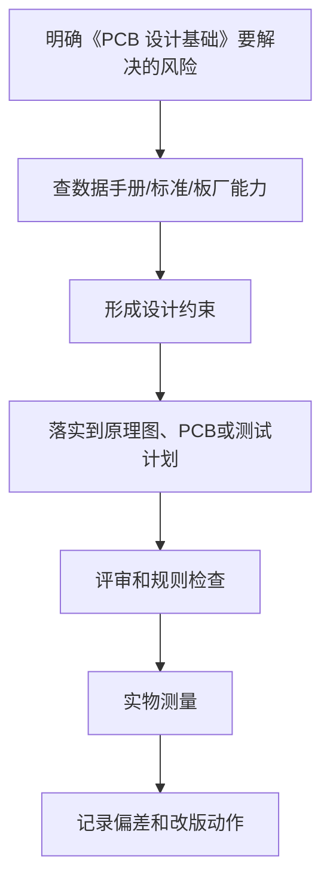

# 10 PCB 设计基础

<!-- lecture-notes:integrated-v2 -->

## 讲义导读：把电路变成能工作的板子

这一章讲的是 **10 PCB 设计基础**，属于 **原理图与 PCB 工程流程**。学习硬件和 PCB 时，不要只看“这根线怎么连”，而要把它当成一次工程闭环：需求是什么，电路原理是否成立，器件是否选对，封装是否可靠，PCB 规则是否符合板厂能力，电源和地怎么走，信号回流在哪里，上电后用什么证据证明它稳定工作。

### 一句话先懂

工程流程的重点是让每根网络、每个封装、每条规则都有来源和检查手段，避免“看起来连上了但板子不能用”。

初学时先问三个问题：这部分电路要完成什么功能；最坏电压、电流、温度、频率和误差在哪里；如果板子不工作，我能从哪个测试点或波形开始定位。

### 通俗类比

原理图像施工图纸，PCB 像现场施工图；网络名、封装、规则和检查表就是图纸会审，少一步都可能在打样后变成真成本。

类比只是入门扶手。真正设计时，要回到电流路径、阻抗、功耗、热、封装、间距、线宽、层叠、回流路径、测试点和制造公差这些可计算、可测量、可检查的对象上。

### 本章学习主线

1. **先定需求和边界**：输入/输出、电压电流、接口、环境、尺寸、成本、安全和可制造性要求是什么？
2. **再读数据手册**：绝对最大额定值、推荐工作条件、典型应用、封装、热阻、布局建议和禁忌分别在哪里？
3. **然后画原理图**：电源树、保护、时钟、复位、接口、测试点和关键网络命名是否清楚？
4. **接着做 PCB**：先定层叠和规则，再布局关键器件，最后按电源、回流、敏感信号、高速信号和制造约束布线。
5. **最后验证实物**：ERC/DRC/DFM、Gerber、BOM、装配图、上电计划、测量记录和复盘缺一不可。

### 本章重点抓手

需求分解、原理图可读性、网络命名、ERC、封装绑定、设计规则、DRC、Gerber、BOM、装配文件和检查清单。

### 最小实践任务

做一次从原理图到 Gerber 的完整输出，逐项检查 ERC/DRC、封装方向、丝印、测试点、孔径、间距和板厂能力。

建议每次设计都保留“设计理由”：为什么选这个器件，为什么这样放置，为什么这条线这么宽，为什么这个电容离引脚这么近，为什么这个测试点必须保留。硬件学习的关键不是画出一块板，而是能解释每个设计选择，并能在实物上验证。

### 常见误区

- 原理图能编译就以为没问题。
- 封装方向和引脚编号不核对实物。
- 没有按板厂能力设置线宽、线距、孔径和阻抗规则。

### 推荐工具

KiCad/Altium、万用表、示波器、逻辑分析仪、稳压电源、电子负载、热像仪、LCR 表、Gerber viewer、厂商 DFM 检查。

### 读完本章应该能做到

- 用自己的话解释本章概念，并指出它影响功能、可靠性、制造、调试还是成本。
- 给出一个最小设计例子，说明原理图、PCB、BOM 和测试方法如何对应。
- 说清至少一个常见硬件故障的现象、可能原因、测量方法和修复方向。
- 把经验规则落到数据手册、IPC/板厂规则、仿真或实测证据上。

> 本节是讲义化改写后的阅读入口。后续正文中的电路、规则、清单和参考资料，都应围绕“需求边界 + 数据手册 + PCB 规则 + 实物验证”来理解。
## 学习目标

学完本章，你应该能：

- 理解 PCB 的基本结构和常见术语。
- 知道从原理图到 PCB 的基本流程。
- 掌握板框、封装、走线、过孔、铺铜、DRC、Gerber 的作用。
- 能完成简单双层 PCB 的基础设计。

PCB 是把原理图变成真实电路板的物理实现。它不仅要连通，还要能制造、能焊接、能调试、能稳定工作。

## 1. PCB 是什么

PCB 是 Printed Circuit Board，印刷电路板。

它由绝缘基材和铜层构成，通过铜箔走线连接元件。

常见结构：

- 铜层
- 绝缘基材
- 阻焊层
- 丝印层
- 焊盘
- 过孔
- 板框

## 2. PCB 常见术语

| 术语 | 英文 | 含义 |
| :--- | :--- | :--- |
| 走线 | Trace / Track | 铜箔导线 |
| 焊盘 | Pad | 元件焊接位置 |
| 过孔 | Via | 连接不同层铜箔 |
| 通孔 | Through Hole | 穿透 PCB 的孔 |
| 铺铜 | Copper Pour | 大面积铜区域 |
| 阻焊 | Solder Mask | 覆盖铜皮的绝缘油墨 |
| 丝印 | Silkscreen | PCB 上的文字图案 |
| 板框 | Board Outline | PCB 外形边界 |
| 飞线 | Ratsnest | 未布线网络提示线 |
| 间距 | Clearance | 铜之间的最小距离 |
| DRC | Design Rules Check | 设计规则检查 |
| Gerber | 制造文件 | 板厂生产 PCB 的图形文件 |

## 3. 从原理图到 PCB

基本流程：

```text
画原理图
  -> 分配封装
  -> ERC
  -> 更新 PCB
  -> 画板框
  -> 设置规则
  -> 摆放元件
  -> 布线
  -> 铺铜
  -> DRC
  -> 3D 检查
  -> 导出 Gerber
```

## 4. 封装

封装是元件在 PCB 上的焊盘和外形。

同一个原理图符号可能对应不同封装。

例如 10k 电阻可以是：

- 0402
- 0603
- 0805
- 1206
- 直插电阻

封装必须和实际购买元件匹配。

## 5. 板框

板框决定 PCB 外形。

设计时考虑：

- 外壳尺寸
- 安装孔位置
- 连接器位置
- 板边留距
- 拼板需求

新手练习可以使用矩形板框，例如 50mm x 30mm。

## 6. 设计规则

设计规则包括：

- 最小线宽
- 最小线距
- 最小过孔孔径
- 最小孔环
- 铜到板边距离
- 差分线规则
- 阻抗规则

新手建议使用板厂常规工艺，不要使用极限线宽线距。

## 7. 摆放元件

摆放顺序：

1. 固定位置器件：接口、按键、LED、安装孔。
2. 核心器件：MCU、电源芯片。
3. 关键外围：去耦电容、晶振、电感。
4. 普通器件：电阻、电容、测试点。

布局原则：

- 去耦靠近电源脚。
- 接口靠近板边。
- 电源路径短。
- 大电流路径短而宽。
- 敏感信号远离噪声源。

## 8. 布线

布线目标：

- 完成所有电气连接。
- 满足电流和信号要求。
- 保持回流路径合理。
- 方便制造和调试。

优先级：

1. 电源。
2. 地。
3. 时钟。
4. 高速或敏感信号。
5. 通信接口。
6. 普通 GPIO。

## 9. 线宽

线宽和电流相关。

原则：

- 普通信号线可以较细。
- 电源线要更宽。
- 大电流用宽线或铺铜。
- 地尽量用地平面。

新手不能用很细的线跑电机、电源输入或 LED 灯带电流。

## 10. 过孔

过孔用于换层。

注意：

- 过孔越多，布线越灵活，但也引入寄生参数。
- 高速信号尽量少过孔。
- 大电流可用多个过孔并联。
- 去耦电容接地过孔要近。

## 11. 铺铜

铺铜常用于 GND。

作用：

- 降低地阻抗。
- 提供回流路径。
- 改善散热。
- 屏蔽部分噪声。

注意：

- 地铜要连续。
- 避免孤岛铜。
- 不要让关键信号跨越地平面裂缝。

## 12. 丝印

丝印应包含：

- 元件位号
- 接口名称
- 电源极性
- 按键功能
- LED 功能
- 版本号
- 测试点名称

注意：

丝印不要压到焊盘。

## 13. DRC

DRC 能检查：

- 未连接网络
- 间距不足
- 线宽不满足
- 过孔尺寸不满足
- 铜到板边距离不足

DRC 必须通过再打样。

但 DRC 不能保证：

- 电路功能正确。
- 布局电气性能好。
- 封装一定和实物一致。

## 14. Gerber

Gerber 是板厂生产 PCB 的主要文件。

导出后要检查：

- 顶层铜
- 底层铜
- 阻焊
- 丝印
- 板框
- 钻孔

使用 Gerber Viewer 查看，不要盲目下单。

## 实操练习

做一块 5V LED 小板：

- 一个电源输入接口。
- 3 个 LED。
- 每个 LED 一个限流电阻。
- 一个电源指示丝印。
- 双层 PCB。
- GND 铺铜。
- 导出 Gerber。

## 检查清单

- 封装是否和实物一致？
- 板框是否正确？
- 接口是否靠板边？
- 去耦电容是否靠近芯片？
- 电源线是否足够宽？
- GND 是否连续？
- 丝印是否清楚？
- DRC 是否通过？
- Gerber 是否检查？

## 常见误区

- 误区：飞线消失就说明 PCB 没问题。
  纠正：连通只是基础，还要看布局、电源、地、工艺。

- 误区：自动布线适合新手省事。
  纠正：入门阶段建议手动布线，才能理解 PCB。

- 误区：板子越小越专业。
  纠正：新手应留足空间，方便焊接和调试。

## 本章总结

PCB 设计基础包括封装、板框、布局、布线、铺铜、DRC 和 Gerber。第一目标不是做得极小极密，而是做得正确、清楚、可制造、可焊接、可调试。

---

## 万字精讲扩展（2026-06-16 更新）
> Last researched: 2026-06-16。本文补充内容以入门到工程实践为主，数值和规则应在真实项目中继续以数据手册、板厂能力表、产品标准和实测结果校准。

### 本章在整套学习路线中的位置

《PCB 设计基础》承担的是把局部知识放进完整硬件设计流程的作用。学习这一章时，不要只看定义，而要关注它怎样影响需求、选型、原理图、PCB、制造、装配、调试和改版。硬件设计的每个决定都会在后面的实物阶段兑现：原理图里少一个保护器件，可能在插拔时烧芯片；PCB 上去耦电容放远，可能在负载跳变时复位；封装核对不严，可能导致整批板子无法焊接；没有测试点，可能让一个本来十分钟能定位的问题拖成几天。

本章学习完成后，至少应能做到三件事。第一，能用自己的话解释关键概念，而不是只背术语。第二，能把概念转换成设计检查项，例如线宽、间距、去耦、回流、保护、测试点、BOM 字段或生产文件。第三，能在调试时根据现象反推可能原因，并用仪器或目检验证。只要这三件事能完成，这章就不再是静态笔记，而会变成你设计下一块板子的工具。

### PCB 类章节的精讲重点

PCB 不是把原理图连通，而是把电流、回流、寄生参数、热、制造和装配同时安排在一块有限面积的板上。布局决定了大部分质量，布线只是把布局意图具体化。一个好的布局会让电源路径短、去耦回路小、接口靠近板边、噪声源远离敏感输入、大电流回路局部闭合、调试点容易接触、连接器方向符合装配习惯。一个坏布局即使 DRC 全部通过，也可能出现纹波大、复位异常、通信偶发失败、ADC 抖动、EMI 超标和返修困难。

从板厂能力表看，很多厂家可以做到很小线宽线距，但“能做”不等于“应该全板都这么做”。PCBWay、OSH Park、Eurocircuits 等资料都强调制造能力、成本和容差之间的关系。入门低压板应优先使用宽松规则，只有在密脚芯片扇出、连接器逃线等局部区域才接近极限。规则设置应按 Net Class 管理：普通 GPIO、电源、大电流、时钟、差分、模拟输入、外部接口分别有不同线宽、间距、过孔和走线策略。

回流路径是 PCB 学习的核心概念。电流总要回到源头，低频时看起来会选择电阻较小的路径，高频时则更受电感和回路面积影响，通常会沿着信号线下方的参考平面返回。如果信号线跨越地缝、换层后没有附近地过孔、或者参考平面被电源铜皮切断，回流会被迫绕路，环路面积增大，串扰、振铃和辐射风险随之上升。因此布线检查不能只看正向线，还要沿着信号路径检查参考平面是否连续。

### 工程学习的底层方法

硬件学习最容易出现的偏差，是把知识点当成孤立名词背诵。真正能落地的学习方式，是把每个知识点放进同一条工程链路里理解：需求从哪里来，器件为什么这样选，原理图如何表达意图，PCB 如何把电气意图变成物理结构，制造和装配会怎样限制你的设计，调试时又如何证明假设成立。这个链路一旦建立，很多看似零散的规则会变成同一个目标的不同侧面：降低回路面积、控制电流路径、保证制造余量、保留测试入口、减少不确定性。

初学阶段不要追求一次学完所有高端主题。更稳妥的路线是先把低压、低速、小电流、少接口的板子做闭环。所谓闭环，不是画完 PCB 就结束，而是完成需求定义、器件选型、原理图、ERC、PCB、DRC、Gerber 检查、打样、焊接、上电、测量、故障记录和改版。每完成一次闭环，你对数据手册、封装、布局、布线、去耦、接地、调试的理解都会变得更具体。没有实物反馈时，很多规则只是口号；有了失败样板以后，规则才会变成可执行的判断。

学习时建议同时维护三类笔记。第一类是概念笔记，用自己的话解释术语，不直接复制资料原文。第二类是规则笔记，把板厂能力、器件要求、个人默认规则写成表格，并标注来源和适用边界。第三类是复盘笔记，记录每块板子的设计假设、测量数据、错误原因和下一版修改。硬件经验的价值往往不在“知道一个规则”，而在知道这个规则什么时候适用、什么时候不够、什么时候必须回到数据手册或标准重新计算。

### 从规则到判断：不要把经验值当标准

很多入门资料会给出 100 nF 去耦、45 度走线、线宽 0.2 mm、线距 0.2 mm、TVS 靠近接口、晶振靠近芯片等经验值。这些经验很有用，但它们不是脱离条件的真理。100 nF 的作用依赖电容封装、ESL、布局回路、电源阻抗和芯片瞬态电流；线宽取决于电流、铜厚、温升、压降、散热铜皮和工作环境；线距受制造能力、电压、安全规范、污染等级和产品要求影响。学习笔记里应当写清楚“为什么”和“边界”，而不是只写一个数字。

工程上可以采用四级依据。最高优先级是安全法规、产品标准和客户要求；其次是芯片数据手册、评估板、应用笔记和参考设计；再往下是板厂能力表、装配厂工艺能力和 EDA 规则；最后才是个人经验和论坛建议。社区经验可以帮助发现常见坑，但不能替代标准和厂商文档。尤其是高压、电池、大电流、电机、射频、高速总线、医疗和汽车场景，入门经验值通常不够，必须引入正式规范、仿真、评审和测试。

### 一个可复用的硬件闭环


Figure: PCB 学习闭环，综合 KiCad 官方流程、板厂 DFM 要求、TI/ADI 布局应用笔记和中文社区调试经验重新整理。

### 调试意识：把问题拆成可验证假设

调试不是“看到不工作就随机改”，而是把系统拆成一组可以测量的假设。电源是否到位，复位是否释放，时钟是否振荡，下载接口是否连通，GPIO 是否能翻转，通信波形是否符合电平和时序，模拟输入是否超量程，负载电流是否超过器件能力，每一步都应该有测量点、预期值和异常解释。硬件调试最忌讳同时改变多个变量，因为这样即使问题消失，也无法知道真正原因。

第一次上电建议采用限流电源，并把电流限值设成符合预期的保守值。先不上昂贵芯片或外部负载，先测裸板短路；再焊电源部分，测输入保护、稳压输出和纹波；再焊主控和下载接口；最后逐个启用传感器、通信接口和执行器。每一步都记录电压、电流、温度和波形截图。对于后续改版，测量记录比口头记忆可靠得多。

### 核心知识点逐条精讲

#### 1. 封装

在《PCB 设计基础》这一章里，`封装` 不是孤立知识点，而是一个需要落实到设计动作、检查动作和测试动作的工程对象。学习时先问三个问题：它解决什么风险，它依赖哪些前置条件，它失败时会表现成什么现象。比如一个规则如果用于 PCB，就要进一步落实到板框、封装、网络类、线宽线距、过孔、参考平面、测试点或生产文件；如果用于电路，就要落实到器件参数、工作条件、热、保护和测量方法。这样做可以避免只记住结论，却不知道如何在下一块板子上执行。

实践中建议把 `封装` 写成可检查条目，而不是写成笼统口号。可检查条目应包含对象、位置、数值或来源、验证方法和异常处理。例如“确认每个外部接口有合适保护”比“注意 ESD”更可执行；“确认 U1 每个 VDD 引脚旁边 1 至 3 mm 内有低 ESL 去耦路径，且地过孔靠近电容地端”比“加 100 nF”更接近工程要求。每个条目都要能在评审时被勾选，在调试时被测量，在改版时被追踪。

当 `封装` 与其他规则冲突时，应按约束优先级处理。安全和法规高于性能，数据手册高于经验，板厂能力高于个人习惯，实际测量高于未经验证的猜测。很多设计取舍没有唯一答案，例如更宽的线有利于电流和压降，却可能破坏阻抗或增加布线困难；更强的滤波有利于噪声，却可能降低响应速度或影响启动；更密的布局有利于面积，却可能损害焊接、返修和散热。笔记要记录取舍理由，而不是只留下最后结果。

#### 2. 板框

在《PCB 设计基础》这一章里，`板框` 不是孤立知识点，而是一个需要落实到设计动作、检查动作和测试动作的工程对象。学习时先问三个问题：它解决什么风险，它依赖哪些前置条件，它失败时会表现成什么现象。比如一个规则如果用于 PCB，就要进一步落实到板框、封装、网络类、线宽线距、过孔、参考平面、测试点或生产文件；如果用于电路，就要落实到器件参数、工作条件、热、保护和测量方法。这样做可以避免只记住结论，却不知道如何在下一块板子上执行。

实践中建议把 `板框` 写成可检查条目，而不是写成笼统口号。可检查条目应包含对象、位置、数值或来源、验证方法和异常处理。例如“确认每个外部接口有合适保护”比“注意 ESD”更可执行；“确认 U1 每个 VDD 引脚旁边 1 至 3 mm 内有低 ESL 去耦路径，且地过孔靠近电容地端”比“加 100 nF”更接近工程要求。每个条目都要能在评审时被勾选，在调试时被测量，在改版时被追踪。

当 `板框` 与其他规则冲突时，应按约束优先级处理。安全和法规高于性能，数据手册高于经验，板厂能力高于个人习惯，实际测量高于未经验证的猜测。很多设计取舍没有唯一答案，例如更宽的线有利于电流和压降，却可能破坏阻抗或增加布线困难；更强的滤波有利于噪声，却可能降低响应速度或影响启动；更密的布局有利于面积，却可能损害焊接、返修和散热。笔记要记录取舍理由，而不是只留下最后结果。

#### 3. 设计规则

在《PCB 设计基础》这一章里，`设计规则` 不是孤立知识点，而是一个需要落实到设计动作、检查动作和测试动作的工程对象。学习时先问三个问题：它解决什么风险，它依赖哪些前置条件，它失败时会表现成什么现象。比如一个规则如果用于 PCB，就要进一步落实到板框、封装、网络类、线宽线距、过孔、参考平面、测试点或生产文件；如果用于电路，就要落实到器件参数、工作条件、热、保护和测量方法。这样做可以避免只记住结论，却不知道如何在下一块板子上执行。

实践中建议把 `设计规则` 写成可检查条目，而不是写成笼统口号。可检查条目应包含对象、位置、数值或来源、验证方法和异常处理。例如“确认每个外部接口有合适保护”比“注意 ESD”更可执行；“确认 U1 每个 VDD 引脚旁边 1 至 3 mm 内有低 ESL 去耦路径，且地过孔靠近电容地端”比“加 100 nF”更接近工程要求。每个条目都要能在评审时被勾选，在调试时被测量，在改版时被追踪。

当 `设计规则` 与其他规则冲突时，应按约束优先级处理。安全和法规高于性能，数据手册高于经验，板厂能力高于个人习惯，实际测量高于未经验证的猜测。很多设计取舍没有唯一答案，例如更宽的线有利于电流和压降，却可能破坏阻抗或增加布线困难；更强的滤波有利于噪声，却可能降低响应速度或影响启动；更密的布局有利于面积，却可能损害焊接、返修和散热。笔记要记录取舍理由，而不是只留下最后结果。

#### 4. 布局布线

在《PCB 设计基础》这一章里，`布局布线` 不是孤立知识点，而是一个需要落实到设计动作、检查动作和测试动作的工程对象。学习时先问三个问题：它解决什么风险，它依赖哪些前置条件，它失败时会表现成什么现象。比如一个规则如果用于 PCB，就要进一步落实到板框、封装、网络类、线宽线距、过孔、参考平面、测试点或生产文件；如果用于电路，就要落实到器件参数、工作条件、热、保护和测量方法。这样做可以避免只记住结论，却不知道如何在下一块板子上执行。

实践中建议把 `布局布线` 写成可检查条目，而不是写成笼统口号。可检查条目应包含对象、位置、数值或来源、验证方法和异常处理。例如“确认每个外部接口有合适保护”比“注意 ESD”更可执行；“确认 U1 每个 VDD 引脚旁边 1 至 3 mm 内有低 ESL 去耦路径，且地过孔靠近电容地端”比“加 100 nF”更接近工程要求。每个条目都要能在评审时被勾选，在调试时被测量，在改版时被追踪。

当 `布局布线` 与其他规则冲突时，应按约束优先级处理。安全和法规高于性能，数据手册高于经验，板厂能力高于个人习惯，实际测量高于未经验证的猜测。很多设计取舍没有唯一答案，例如更宽的线有利于电流和压降，却可能破坏阻抗或增加布线困难；更强的滤波有利于噪声，却可能降低响应速度或影响启动；更密的布局有利于面积，却可能损害焊接、返修和散热。笔记要记录取舍理由，而不是只留下最后结果。

#### 5. Gerber 和 DRC

在《PCB 设计基础》这一章里，`Gerber 和 DRC` 不是孤立知识点，而是一个需要落实到设计动作、检查动作和测试动作的工程对象。学习时先问三个问题：它解决什么风险，它依赖哪些前置条件，它失败时会表现成什么现象。比如一个规则如果用于 PCB，就要进一步落实到板框、封装、网络类、线宽线距、过孔、参考平面、测试点或生产文件；如果用于电路，就要落实到器件参数、工作条件、热、保护和测量方法。这样做可以避免只记住结论，却不知道如何在下一块板子上执行。

实践中建议把 `Gerber 和 DRC` 写成可检查条目，而不是写成笼统口号。可检查条目应包含对象、位置、数值或来源、验证方法和异常处理。例如“确认每个外部接口有合适保护”比“注意 ESD”更可执行；“确认 U1 每个 VDD 引脚旁边 1 至 3 mm 内有低 ESL 去耦路径，且地过孔靠近电容地端”比“加 100 nF”更接近工程要求。每个条目都要能在评审时被勾选，在调试时被测量，在改版时被追踪。

当 `Gerber 和 DRC` 与其他规则冲突时，应按约束优先级处理。安全和法规高于性能，数据手册高于经验，板厂能力高于个人习惯，实际测量高于未经验证的猜测。很多设计取舍没有唯一答案，例如更宽的线有利于电流和压降，却可能破坏阻抗或增加布线困难；更强的滤波有利于噪声，却可能降低响应速度或影响启动；更密的布局有利于面积，却可能损害焊接、返修和散热。笔记要记录取舍理由，而不是只留下最后结果。


### 场景化判断表

| 场景 | 推荐处理 | 典型风险 | 验证方式 |
| :--- | :--- | :--- | :--- |
| 封装 | 先查数据手册、板厂能力或测试目标，再转成 EDA 规则和评审项 | 只凭经验值、没有来源、没有验证方法 | 设计评审、DRC、上电测试和改版复盘 |
| 板框 | 先查数据手册、板厂能力或测试目标，再转成 EDA 规则和评审项 | 只凭经验值、没有来源、没有验证方法 | 设计评审、DRC、上电测试和改版复盘 |
| 设计规则 | 先查数据手册、板厂能力或测试目标，再转成 EDA 规则和评审项 | 只凭经验值、没有来源、没有验证方法 | 设计评审、DRC、上电测试和改版复盘 |
| 布局布线 | 先查数据手册、板厂能力或测试目标，再转成 EDA 规则和评审项 | 只凭经验值、没有来源、没有验证方法 | 设计评审、DRC、上电测试和改版复盘 |
| Gerber 和 DRC | 先查数据手册、板厂能力或测试目标，再转成 EDA 规则和评审项 | 只凭经验值、没有来源、没有验证方法 | 设计评审、DRC、上电测试和改版复盘 |

表格里的“推荐处理”不是固定答案，而是提醒你把每个问题落到来源、约束和验证。硬件工程里最危险的状态不是不知道，而是以为某个经验值在所有场景都成立。每当项目电压、电流、速度、温度、线缆长度、外部环境、制造厂家或装配方式变化时，都应该重新检查这些条目。

### 本章建议工作流



Figure: 《PCB 设计基础》学习和实践工作流，综合官方文档、厂商应用笔记和板厂 DFM 资料整理。

这个工作流的重点是“先约束，后执行，再验证”。例如你要决定线宽，就不要只问别人用多少，而要先知道电流、铜厚、温升、压降和板厂能力；你要决定去耦，就不要只看电容值，而要看瞬态电流路径、封装 ESL、过孔位置和参考平面；你要决定接口保护，就要看接口是否出板、线缆长度、人体接触概率、芯片耐受能力和保护器件泄放路径。只要按这个流程写笔记，每一章都会从知识介绍变成工程方法。

### 常见误区和纠正方法

- 误区：把 DRC 通过当作设计正确。纠正：DRC 只能检查你已经设置的规则，不能理解电路意图；设计正确还需要数据手册核对、布局评审、回流路径检查、制造文件检查和实物测试。
- 误区：把社区经验当成标准。纠正：社区经验适合发现问题和启发思路，最终参数要回到官方文档、板厂能力、器件数据手册和实测结果。
- 误区：只关注能不能工作，不关注能不能维护。纠正：学习阶段就要保留丝印、测试点、版本号、BOM 信息和复盘记录，否则下一次遇到同类问题仍然要从头猜。
- 误区：只看电气连接，不看物理路径。纠正：PCB 中的电流路径、回流路径、寄生电感、寄生电容、热路径和装配空间都会影响结果，原理图正确只是起点。
- 误区：追求一次完美。纠正：硬件设计天然需要迭代，关键是让每次迭代有明确假设、测量证据和改版记录。

### 与相邻章节的关系

《PCB 设计基础》应与前后章节交叉学习。向前看，它依赖基础电学、器件参数和数据手册阅读；向后看，它会影响 PCB 布局布线、制造装配、调试排障和版本管理。比如你在本章学到一个布局规则，应当回到元器件章节确认器件要求，再到 PCB 规则章节设置约束，再到调试章节设计测量点。这样多个笔记之间会形成网络，而不是彼此孤立。

如果某个概念暂时难以完全理解，不要停留在抽象层面反复阅读，可以通过低风险实验建立直觉。低压 LED 板、按键板、传感器板、MCU 最小系统板、MOSFET 负载板和小型 Buck 板都适合作为验证平台。每块板只重点验证两三个主题，效果通常比一块板塞满所有功能更好。


### 实操训练和复盘模板

1. 选一个真实小项目，围绕 `封装` 写一条设计假设、一个检查方法和一个测量方法。
2. 选一个真实小项目，围绕 `板框` 写一条设计假设、一个检查方法和一个测量方法。
3. 选一个真实小项目，围绕 `设计规则` 写一条设计假设、一个检查方法和一个测量方法。
4. 选一个真实小项目，围绕 `布局布线` 写一条设计假设、一个检查方法和一个测量方法。
5. 选一个真实小项目，围绕 `Gerber 和 DRC` 写一条设计假设、一个检查方法和一个测量方法。建议每次练习都输出一页复盘，格式如下：

```text
项目名称：
本章主题：PCB 设计基础
设计假设：
依据来源：数据手册 / 标准 / 板厂能力 / 应用笔记 / 实测经验
实施位置：原理图页码、PCB 区域、BOM 行、测试点编号
预期结果：
实际测量：
偏差原因：
下一版修改：
```

这个模板看起来简单，但能强迫你把“我觉得”变成“我依据什么、做在哪里、测到了什么、下一步怎么改”。硬件学习最怕只留下模糊印象，复盘模板能把每一次小失败转化成下一版的规则。

## 参考资料与延伸阅读

- [Standard / IPC] IPC-2221B Preview: Generic Standard on Printed Board Design: https://webstore.ansi.org/preview-pages/IPC/preview_IPC%2B2221B-2012.pdf
- [Standard / ANSI] IPC-2152, Current Carrying Capacity in Printed Board Design: https://blog.ansi.org/ansi/ipc-2152-current-carrying-capacity-in-pcbs/
- [Tool / Official] KiCad 9.0 PCB Editor Documentation: https://docs.kicad.org/9.0/en/pcbnew/pcbnew.html
- [Tool / Official] Getting Started in KiCad 9.0: https://docs.kicad.org/9.0/en/getting_started_in_kicad/getting_started_in_kicad.html
- [Vendor / TI] PCB Design Guidelines For Reduced EMI: https://www.ti.com/lit/pdf/szza009
- [Vendor / TI] High Speed Layout Guidelines: https://www.ti.com/lit/pdf/scaa082
- [Vendor / TI] AN-1149 Layout Guidelines for Switching Power Supplies: https://www.ti.com/lit/pdf/snva021
- [Vendor / TI] PCB layout guidelines to optimize power supply performance: https://www.ti.com/lit/ml/slyp762/slyp762.pdf
- [Vendor / TI] Grounding in mixed-signal systems demystified, Part 2: https://www.ti.com/lit/pdf/slyt512
- [Vendor / Analog Devices] MT-031 Grounding Data Converters: https://www.analog.com/media/en/training-seminars/tutorials/MT-031.pdf
- [Vendor / Analog Devices] MT-101 Decoupling Techniques: https://www.analog.com/media/en/training-seminars/tutorials/MT-101.pdf
- [Vendor / Microchip] Basic 16-Bit MCU Design and Troubleshooting Checklist: https://ww1.microchip.com/downloads/aemDocuments/documents/MCU16/ProductDocuments/SupportingCollateral/Basic-16-Bit-MCU-Design-and-Troubleshooting-Checklist-DS50003274.pdf
- [Fab / PCBWay] PCB Manufacturing Tolerances: https://www.pcbway.com/pcb_prototype/PCB_Manufacturing_tolerances.html
- [Fab / PCBWay] PCB Design Rule Check: https://www.pcbway.com/pcb_prototype/PCB_Design_Rule_Check.html
- [Fab / OSH Park] Fabrication Services Design Rules: https://docs.oshpark.com/services/
- [Fab / Eurocircuits] PCB Design Guidelines: https://www.eurocircuits.com/technical-guidelines/pcb-design-guidelines/
- [Fab / Eurocircuits] Track Width and Isolation Gap Tolerances: https://www.eurocircuits.com/technical-guidelines/understanding-manufacturing-tolerances-on-a-pcb/track-width-and-isolation-gap-tolerances/
- [Community / 博客园] AD 学习笔记（基础）: https://www.cnblogs.com/Roboduster/p/15329893.html
- [Community / 博客园] Altium Designer PCB 文件的绘制（上：PCB 基础和布局）: https://www.cnblogs.com/zhjblogs/p/14172536.html
- [Community / CSDN] PCB 学习笔记: https://blog.csdn.net/weixin_51933819/article/details/122512816
- [Community / CSDN] PCB 布局布线要求及多层电路板叠加原则: https://blog.csdn.net/Ka_wyb/article/details/142337253
- [Community / 掘金] PCB 设计和布局: https://juejin.cn/post/7612948192174817295
- [Community / 掘金] 芯片电源引脚为什么要加一个 100nF 的电容: https://juejin.cn/post/7325069743144108073
- [Community / 电子工程专辑] 5 步搞定 PCB 调试: https://www.eet-china.com/mp/a393354.html

## 2026 硬件 PCB 资料与设计核对补充

硬件 PCB 类笔记建议按“行业标准 + 厂商资料 + 板厂能力 + 实物测量”四层核对。

- **行业标准**：IPC-2221 用来建立通用 PCB 设计要求，IPC-A-600 关注裸板验收，IPC-A-610 关注电子组件可接受性；具体项目还要结合安规、EMC 和行业标准。
- **EDA 工具**：KiCad 官方文档适合核对开源工作流、原理图/PCB/库/制造输出；Altium 文档适合核对规则驱动设计、DRC、层叠和约束管理。
- **芯片厂商**：TI、Analog Devices、ST、Microchip、NXP 等厂商的 datasheet、application note、evaluation board 和 layout guide，通常比通用教程更接近真实器件约束。
- **板厂能力**：线宽线距、孔径、铜厚、阻抗、板材、阻焊桥、拼板、表面处理和装配能力必须按目标板厂确认，不要只套默认规则。
- **实验要求**：通用规则用 IPC-2221/IPC-A-600/IPC-A-610 等 IPC 体系建立底线，具体器件优先看芯片数据手册、评估板设计文件和厂商 layout guide。 关键结论最好能对应到一次 DRC/DFM 结果、一段数据手册原文、一张波形、一次温升测量或一次上电记录。

通俗地说，标准给底线，数据手册给器件边界，板厂规则给制造边界，仪器测量给现实答案。四者对不上，板子就可能“图上正确、实物翻车”。

参考资料：

- IPC Standards：https://www.ipc.org/standards
- KiCad Documentation：https://docs.kicad.org/
- KiCad Official Site：https://www.kicad.org/
- Altium PCB Design Rules Documentation：https://www.altium.com/documentation/altium-designer/pcb/design-rule-types
- Texas Instruments High-Speed Interface Layout Guidelines：https://www.ti.com/lit/pdf/spraar7
- Texas Instruments PCB Design Guidelines for Reduced EMI：https://www.ti.com/lit/pdf/szza009
- TI Grounding in Mixed-Signal Systems：https://www.ti.com/lit/pdf/SLYT499
- Analog Devices Mixed-Signal PCB Layout Guidelines：https://www.analog.com/en/resources/analog-dialogue/articles/what-are-the-basic-guidelines-for-layout-design-of-mixed-signal-pcbs.html
- Analog Devices RF and Mixed-Signal PCB Layout Guidelines：https://www.analog.com/en/resources/technical-articles/pcbs-layout-guidelines-for-rf--mixedsignal.html
- Microchip PCB Design and Layout Guide：https://ww1.microchip.com/downloads/en/Appnotes/VPPD-01161.pdf
- NXP High Speed Layout Design Guidelines：https://www.nxp.com/docs/en/application-note/AN2536.pdf
