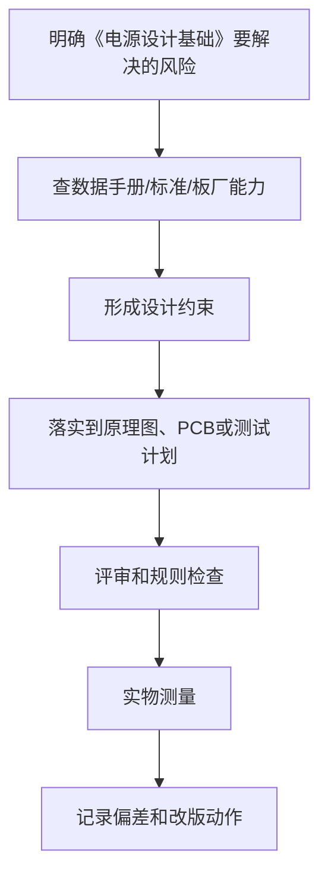

# 15 电源设计基础

<!-- lecture-notes:integrated-v2 -->

## 讲义导读：把电路变成能工作的板子

这一章讲的是 **15 电源设计基础**，属于 **电源、接地与去耦**。学习硬件和 PCB 时，不要只看“这根线怎么连”，而要把它当成一次工程闭环：需求是什么，电路原理是否成立，器件是否选对，封装是否可靠，PCB 规则是否符合板厂能力，电源和地怎么走，信号回流在哪里，上电后用什么证据证明它稳定工作。

### 一句话先懂

电源和地不是理想符号，而是带阻抗、噪声、压降和回流路径的真实网络。

初学时先问三个问题：这部分电路要完成什么功能；最坏电压、电流、温度、频率和误差在哪里；如果板子不工作，我能从哪个测试点或波形开始定位。

### 通俗类比

电源像供水系统：水厂够大不代表每个水龙头压力稳定，管道阻力、支路瞬态和水锤都会影响末端。

类比只是入门扶手。真正设计时，要回到电流路径、阻抗、功耗、热、封装、间距、线宽、层叠、回流路径、测试点和制造公差这些可计算、可测量、可检查的对象上。

### 本章学习主线

1. **先定需求和边界**：输入/输出、电压电流、接口、环境、尺寸、成本、安全和可制造性要求是什么？
2. **再读数据手册**：绝对最大额定值、推荐工作条件、典型应用、封装、热阻、布局建议和禁忌分别在哪里？
3. **然后画原理图**：电源树、保护、时钟、复位、接口、测试点和关键网络命名是否清楚？
4. **接着做 PCB**：先定层叠和规则，再布局关键器件，最后按电源、回流、敏感信号、高速信号和制造约束布线。
5. **最后验证实物**：ERC/DRC/DFM、Gerber、BOM、装配图、上电计划、测量记录和复盘缺一不可。

### 本章重点抓手

电源树、负载瞬态、LDO/DC-DC、纹波、压降、地参考、单点/平面、去耦电容、环路面积和测试点。

### 最小实践任务

为板子画电源树，计算每路电流和功耗，布置去耦并测量上电时序、纹波和负载瞬态。

建议每次设计都保留“设计理由”：为什么选这个器件，为什么这样放置，为什么这条线这么宽，为什么这个电容离引脚这么近，为什么这个测试点必须保留。硬件学习的关键不是画出一块板，而是能解释每个设计选择，并能在实物上验证。

### 常见误区

- 一个 0.1uF 电容到处套。
- 地分割不看回流路径。
- DC-DC 热点、开关环路和反馈线布局随意。

### 推荐工具

KiCad/Altium、万用表、示波器、逻辑分析仪、稳压电源、电子负载、热像仪、LCR 表、Gerber viewer、厂商 DFM 检查。

### 读完本章应该能做到

- 用自己的话解释本章概念，并指出它影响功能、可靠性、制造、调试还是成本。
- 给出一个最小设计例子，说明原理图、PCB、BOM 和测试方法如何对应。
- 说清至少一个常见硬件故障的现象、可能原因、测量方法和修复方向。
- 把经验规则落到数据手册、IPC/板厂规则、仿真或实测证据上。

> 本节是讲义化改写后的阅读入口。后续正文中的电路、规则、清单和参考资料，都应围绕“需求边界 + 数据手册 + PCB 规则 + 实物验证”来理解。
## 学习目标

学完本章，你应该能：

- 理解电源树、电源预算和电源保护。
- 区分 LDO、Buck、Boost、Buck-Boost 的用途。
- 计算 LDO 功耗和发热风险。
- 知道 DC-DC 布局为什么重要。

电源是硬件系统的地基。很多看似通信、程序、芯片的问题，本质是电源不稳、纹波过大、瞬态电流不足或上电顺序错误。

## 1. 电源设计要解决什么

电源设计要保证：

- 电压正确。
- 电流足够。
- 纹波可接受。
- 瞬态响应足够。
- 发热可控。
- 上电顺序正确。
- 异常情况下有保护。

设计前要明确：

- 输入电源是什么。
- 系统需要几路电压。
- 每路电压给哪些模块供电。
- 每路电流典型值和最大值。

## 2. 电源树

电源树描述电源从输入到各模块的路径。

例子：

```text
USB 5V
  -> 5V_SYS
    -> LDO 3.3V
      -> MCU
      -> Sensor
      -> Pull-up
    -> LED Driver
```

电源树应包含：

- 电压名称。
- 转换芯片。
- 最大电流。
- 保护器件。
- 负载模块。

## 3. 电源预算

电源预算用于确认电源芯片是否够用。

示例：

| 模块 | 电压 | 典型电流 | 最大电流 |
| :--- | :--- | :--- | :--- |
| MCU | 3.3V | 30mA | 100mA |
| 传感器 | 3.3V | 5mA | 20mA |
| Wi-Fi | 3.3V | 120mA | 500mA |
| LED | 5V | 60mA | 300mA |

选择电源芯片时按最大电流并留余量。

## 4. LDO

LDO 是低压差线性稳压器。

优点：

- 电路简单。
- 外围少。
- 噪声低。
- 适合小电流。

缺点：

- 效率低。
- 压差和电流越大，发热越大。

功耗：

```text
P = (Vin - Vout) x Iout
```

例子：

```text
Vin = 5V
Vout = 3.3V
Iout = 300mA
P = 0.51W
```

0.51W 对小封装可能已经很热。

## 5. LDO 选型

看这些参数：

- 输入电压范围。
- 输出电压。
- 最大输出电流。
- Dropout 压差。
- 静态电流。
- 输出噪声。
- PSRR。
- 稳定所需输出电容。
- 封装热阻。

注意：

有些 LDO 对输出电容 ESR 有要求。必须按数据手册选电容。

## 6. Buck 降压

Buck 用于从高电压降到低电压。

例子：

- 12V -> 5V
- 5V -> 3.3V

优点：

- 效率高。
- 适合较大电流。

缺点：

- 有开关噪声。
- 外围复杂。
- PCB 布局敏感。

关键器件：

- 电感
- 输入电容
- 输出电容
- 二极管或同步 MOSFET
- 反馈电阻

## 7. Boost 升压

Boost 用于升压。

例子：

- 3.7V 电池 -> 5V

注意：

升压时输入电流可能很大。不能只看输出电流。

大致：

```text
Pin ≈ Pout / 效率
```

如果 5V 输出 1A，输出功率 5W，效率 85%，输入 3.7V：

```text
输入电流 ≈ 5W / 0.85 / 3.7V ≈ 1.59A
```

电池和走线都要承受这个电流。

## 8. Buck-Boost

输入可能高于或低于输出时使用。

例子：

- 锂电池 4.2V 到 3.0V，全程输出 3.3V。

电路更复杂，初学可先用成熟模块或参考设计。

## 9. 电源保护

常见保护：

- 保险丝
- PTC 自恢复保险丝
- 防反接二极管
- MOSFET 防反接
- TVS
- 输入滤波
- 过压保护
- 欠压保护
- 软启动

### 防反接

简单方法：

- 串联二极管，简单但有压降。
- PMOS 防反接，压降低但设计稍复杂。

## 10. 输入输出电容

输入电容：

- 提供瞬态电流。
- 降低输入纹波。
- 靠近电源芯片输入脚。

输出电容：

- 降低输出纹波。
- 改善负载瞬态。
- 保证稳压器稳定。

具体容值和类型按数据手册。

## 11. DC-DC 布局要点

最关键：

- 高频回路面积小。
- 输入电容非常靠近芯片。
- SW 节点面积小。
- 电感位置合理。
- 反馈线远离 SW 节点。
- 地回路短。
- 散热铜皮足够。

新手做 DC-DC，必须参考官方 Layout Example。

## 12. 电源测试

测试内容：

- 空载输出电压。
- 轻载输出电压。
- 满载输出电压。
- 纹波。
- 启动波形。
- 负载瞬态。
- 温升。

用到：

- 万用表。
- 示波器。
- 电子负载。
- 热像仪。

## 实操练习

1. 设计一个 USB 5V 转 3.3V LDO 电源。
2. 计算输出 100mA、300mA、500mA 时 LDO 功耗。
3. 查一个 Buck 芯片数据手册，画出典型应用。
4. 找出它推荐的电感、电容和布局图。
5. 在 PCB 中按推荐布局摆放。

## 检查清单

- 是否画了电源树？
- 是否计算最大电流？
- LDO 功耗是否可接受？
- DC-DC 是否按数据手册布局？
- 输入输出电容是否靠近？
- 是否有防反接和过流保护？
- 是否留了电源测试点？

## 常见误区

- 误区：LDO 输出电流够就行。
  纠正：还要看功耗和散热。

- 误区：DC-DC 原理图对了就行。
  纠正：布局不对可能纹波大、发热、EMI 差。

- 误区：电源适配器标 5V 就一定稳定。
  纠正：负载、线损、瞬态都会影响实际电压。

## 本章总结

电源设计先做电源树和预算，再选 LDO 或 DC-DC，并按数据手册设计外围和布局。电源问题会影响整个系统，必须优先验证。

---

## 万字精讲扩展（2026-06-16 更新）
> Last researched: 2026-06-16。本文补充内容以入门到工程实践为主，数值和规则应在真实项目中继续以数据手册、板厂能力表、产品标准和实测结果校准。

### 本章在整套学习路线中的位置

《电源设计基础》承担的是把局部知识放进完整硬件设计流程的作用。学习这一章时，不要只看定义，而要关注它怎样影响需求、选型、原理图、PCB、制造、装配、调试和改版。硬件设计的每个决定都会在后面的实物阶段兑现：原理图里少一个保护器件，可能在插拔时烧芯片；PCB 上去耦电容放远，可能在负载跳变时复位；封装核对不严，可能导致整批板子无法焊接；没有测试点，可能让一个本来十分钟能定位的问题拖成几天。

本章学习完成后，至少应能做到三件事。第一，能用自己的话解释关键概念，而不是只背术语。第二，能把概念转换成设计检查项，例如线宽、间距、去耦、回流、保护、测试点、BOM 字段或生产文件。第三，能在调试时根据现象反推可能原因，并用仪器或目检验证。只要这三件事能完成，这章就不再是静态笔记，而会变成你设计下一块板子的工具。

### 电源、接地和完整性的精讲重点

电源设计要同时满足电压、电流、噪声、瞬态、效率、热和保护。LDO 简单、噪声低，但压差乘以电流会变成热；Buck 效率高，但布局不当会带来开关噪声和 EMI；Boost 和 Buck-Boost 更要关注输入电流脉动、二极管或同步管应力、启动浪涌和环路稳定。电源树应从输入源开始，列出每一路电压、最大电流、典型电流、启动顺序、允许纹波、保护方式和测试点，而不是画到哪里算哪里。

去耦的本质是给芯片瞬态电流提供一个低阻抗局部回路。ADI MT-101 和 TI 相关资料都强调电容本身不是理想器件，ESR、ESL、封装、过孔和布局都会影响高频效果。一个 100 nF 电容如果离芯片很远、地回路很长，实际效果会明显下降。大电容负责较慢的能量补充，小电容负责较高频的局部电流，二者应按电源入口、模块入口和芯片引脚分层布置。

接地不是把所有 GND 符号连在一起那么简单。更准确的说法是：为每类电流安排可预测、低阻抗、低耦合的返回路径。混合信号系统中常见的建议是使用连续地平面，再通过布局分区和信号路由纪律让模拟电流和数字电流各走各的区域，而不是随意切割地平面。切割地如果没有清晰的跨区策略，很容易让回流绕路，反而增加噪声和 EMI。

### 工程学习的底层方法

硬件学习最容易出现的偏差，是把知识点当成孤立名词背诵。真正能落地的学习方式，是把每个知识点放进同一条工程链路里理解：需求从哪里来，器件为什么这样选，原理图如何表达意图，PCB 如何把电气意图变成物理结构，制造和装配会怎样限制你的设计，调试时又如何证明假设成立。这个链路一旦建立，很多看似零散的规则会变成同一个目标的不同侧面：降低回路面积、控制电流路径、保证制造余量、保留测试入口、减少不确定性。

初学阶段不要追求一次学完所有高端主题。更稳妥的路线是先把低压、低速、小电流、少接口的板子做闭环。所谓闭环，不是画完 PCB 就结束，而是完成需求定义、器件选型、原理图、ERC、PCB、DRC、Gerber 检查、打样、焊接、上电、测量、故障记录和改版。每完成一次闭环，你对数据手册、封装、布局、布线、去耦、接地、调试的理解都会变得更具体。没有实物反馈时，很多规则只是口号；有了失败样板以后，规则才会变成可执行的判断。

学习时建议同时维护三类笔记。第一类是概念笔记，用自己的话解释术语，不直接复制资料原文。第二类是规则笔记，把板厂能力、器件要求、个人默认规则写成表格，并标注来源和适用边界。第三类是复盘笔记，记录每块板子的设计假设、测量数据、错误原因和下一版修改。硬件经验的价值往往不在“知道一个规则”，而在知道这个规则什么时候适用、什么时候不够、什么时候必须回到数据手册或标准重新计算。

### 从规则到判断：不要把经验值当标准

很多入门资料会给出 100 nF 去耦、45 度走线、线宽 0.2 mm、线距 0.2 mm、TVS 靠近接口、晶振靠近芯片等经验值。这些经验很有用，但它们不是脱离条件的真理。100 nF 的作用依赖电容封装、ESL、布局回路、电源阻抗和芯片瞬态电流；线宽取决于电流、铜厚、温升、压降、散热铜皮和工作环境；线距受制造能力、电压、安全规范、污染等级和产品要求影响。学习笔记里应当写清楚“为什么”和“边界”，而不是只写一个数字。

工程上可以采用四级依据。最高优先级是安全法规、产品标准和客户要求；其次是芯片数据手册、评估板、应用笔记和参考设计；再往下是板厂能力表、装配厂工艺能力和 EDA 规则；最后才是个人经验和论坛建议。社区经验可以帮助发现常见坑，但不能替代标准和厂商文档。尤其是高压、电池、大电流、电机、射频、高速总线、医疗和汽车场景，入门经验值通常不够，必须引入正式规范、仿真、评审和测试。

### 一个可复用的硬件闭环


Figure: PCB 学习闭环，综合 KiCad 官方流程、板厂 DFM 要求、TI/ADI 布局应用笔记和中文社区调试经验重新整理。

### 调试意识：把问题拆成可验证假设

调试不是“看到不工作就随机改”，而是把系统拆成一组可以测量的假设。电源是否到位，复位是否释放，时钟是否振荡，下载接口是否连通，GPIO 是否能翻转，通信波形是否符合电平和时序，模拟输入是否超量程，负载电流是否超过器件能力，每一步都应该有测量点、预期值和异常解释。硬件调试最忌讳同时改变多个变量，因为这样即使问题消失，也无法知道真正原因。

第一次上电建议采用限流电源，并把电流限值设成符合预期的保守值。先不上昂贵芯片或外部负载，先测裸板短路；再焊电源部分，测输入保护、稳压输出和纹波；再焊主控和下载接口；最后逐个启用传感器、通信接口和执行器。每一步都记录电压、电流、温度和波形截图。对于后续改版，测量记录比口头记忆可靠得多。

### 核心知识点逐条精讲

#### 1. 电源树

在《电源设计基础》这一章里，`电源树` 不是孤立知识点，而是一个需要落实到设计动作、检查动作和测试动作的工程对象。学习时先问三个问题：它解决什么风险，它依赖哪些前置条件，它失败时会表现成什么现象。比如一个规则如果用于 PCB，就要进一步落实到板框、封装、网络类、线宽线距、过孔、参考平面、测试点或生产文件；如果用于电路，就要落实到器件参数、工作条件、热、保护和测量方法。这样做可以避免只记住结论，却不知道如何在下一块板子上执行。

实践中建议把 `电源树` 写成可检查条目，而不是写成笼统口号。可检查条目应包含对象、位置、数值或来源、验证方法和异常处理。例如“确认每个外部接口有合适保护”比“注意 ESD”更可执行；“确认 U1 每个 VDD 引脚旁边 1 至 3 mm 内有低 ESL 去耦路径，且地过孔靠近电容地端”比“加 100 nF”更接近工程要求。每个条目都要能在评审时被勾选，在调试时被测量，在改版时被追踪。

当 `电源树` 与其他规则冲突时，应按约束优先级处理。安全和法规高于性能，数据手册高于经验，板厂能力高于个人习惯，实际测量高于未经验证的猜测。很多设计取舍没有唯一答案，例如更宽的线有利于电流和压降，却可能破坏阻抗或增加布线困难；更强的滤波有利于噪声，却可能降低响应速度或影响启动；更密的布局有利于面积，却可能损害焊接、返修和散热。笔记要记录取舍理由，而不是只留下最后结果。

#### 2. LDO

在《电源设计基础》这一章里，`LDO` 不是孤立知识点，而是一个需要落实到设计动作、检查动作和测试动作的工程对象。学习时先问三个问题：它解决什么风险，它依赖哪些前置条件，它失败时会表现成什么现象。比如一个规则如果用于 PCB，就要进一步落实到板框、封装、网络类、线宽线距、过孔、参考平面、测试点或生产文件；如果用于电路，就要落实到器件参数、工作条件、热、保护和测量方法。这样做可以避免只记住结论，却不知道如何在下一块板子上执行。

实践中建议把 `LDO` 写成可检查条目，而不是写成笼统口号。可检查条目应包含对象、位置、数值或来源、验证方法和异常处理。例如“确认每个外部接口有合适保护”比“注意 ESD”更可执行；“确认 U1 每个 VDD 引脚旁边 1 至 3 mm 内有低 ESL 去耦路径，且地过孔靠近电容地端”比“加 100 nF”更接近工程要求。每个条目都要能在评审时被勾选，在调试时被测量，在改版时被追踪。

当 `LDO` 与其他规则冲突时，应按约束优先级处理。安全和法规高于性能，数据手册高于经验，板厂能力高于个人习惯，实际测量高于未经验证的猜测。很多设计取舍没有唯一答案，例如更宽的线有利于电流和压降，却可能破坏阻抗或增加布线困难；更强的滤波有利于噪声，却可能降低响应速度或影响启动；更密的布局有利于面积，却可能损害焊接、返修和散热。笔记要记录取舍理由，而不是只留下最后结果。

#### 3. Buck/Boost

在《电源设计基础》这一章里，`Buck/Boost` 不是孤立知识点，而是一个需要落实到设计动作、检查动作和测试动作的工程对象。学习时先问三个问题：它解决什么风险，它依赖哪些前置条件，它失败时会表现成什么现象。比如一个规则如果用于 PCB，就要进一步落实到板框、封装、网络类、线宽线距、过孔、参考平面、测试点或生产文件；如果用于电路，就要落实到器件参数、工作条件、热、保护和测量方法。这样做可以避免只记住结论，却不知道如何在下一块板子上执行。

实践中建议把 `Buck/Boost` 写成可检查条目，而不是写成笼统口号。可检查条目应包含对象、位置、数值或来源、验证方法和异常处理。例如“确认每个外部接口有合适保护”比“注意 ESD”更可执行；“确认 U1 每个 VDD 引脚旁边 1 至 3 mm 内有低 ESL 去耦路径，且地过孔靠近电容地端”比“加 100 nF”更接近工程要求。每个条目都要能在评审时被勾选，在调试时被测量，在改版时被追踪。

当 `Buck/Boost` 与其他规则冲突时，应按约束优先级处理。安全和法规高于性能，数据手册高于经验，板厂能力高于个人习惯，实际测量高于未经验证的猜测。很多设计取舍没有唯一答案，例如更宽的线有利于电流和压降，却可能破坏阻抗或增加布线困难；更强的滤波有利于噪声，却可能降低响应速度或影响启动；更密的布局有利于面积，却可能损害焊接、返修和散热。笔记要记录取舍理由，而不是只留下最后结果。

#### 4. 保护

在《电源设计基础》这一章里，`保护` 不是孤立知识点，而是一个需要落实到设计动作、检查动作和测试动作的工程对象。学习时先问三个问题：它解决什么风险，它依赖哪些前置条件，它失败时会表现成什么现象。比如一个规则如果用于 PCB，就要进一步落实到板框、封装、网络类、线宽线距、过孔、参考平面、测试点或生产文件；如果用于电路，就要落实到器件参数、工作条件、热、保护和测量方法。这样做可以避免只记住结论，却不知道如何在下一块板子上执行。

实践中建议把 `保护` 写成可检查条目，而不是写成笼统口号。可检查条目应包含对象、位置、数值或来源、验证方法和异常处理。例如“确认每个外部接口有合适保护”比“注意 ESD”更可执行；“确认 U1 每个 VDD 引脚旁边 1 至 3 mm 内有低 ESL 去耦路径，且地过孔靠近电容地端”比“加 100 nF”更接近工程要求。每个条目都要能在评审时被勾选，在调试时被测量，在改版时被追踪。

当 `保护` 与其他规则冲突时，应按约束优先级处理。安全和法规高于性能，数据手册高于经验，板厂能力高于个人习惯，实际测量高于未经验证的猜测。很多设计取舍没有唯一答案，例如更宽的线有利于电流和压降，却可能破坏阻抗或增加布线困难；更强的滤波有利于噪声，却可能降低响应速度或影响启动；更密的布局有利于面积，却可能损害焊接、返修和散热。笔记要记录取舍理由，而不是只留下最后结果。

#### 5. 输入输出电容

在《电源设计基础》这一章里，`输入输出电容` 不是孤立知识点，而是一个需要落实到设计动作、检查动作和测试动作的工程对象。学习时先问三个问题：它解决什么风险，它依赖哪些前置条件，它失败时会表现成什么现象。比如一个规则如果用于 PCB，就要进一步落实到板框、封装、网络类、线宽线距、过孔、参考平面、测试点或生产文件；如果用于电路，就要落实到器件参数、工作条件、热、保护和测量方法。这样做可以避免只记住结论，却不知道如何在下一块板子上执行。

实践中建议把 `输入输出电容` 写成可检查条目，而不是写成笼统口号。可检查条目应包含对象、位置、数值或来源、验证方法和异常处理。例如“确认每个外部接口有合适保护”比“注意 ESD”更可执行；“确认 U1 每个 VDD 引脚旁边 1 至 3 mm 内有低 ESL 去耦路径，且地过孔靠近电容地端”比“加 100 nF”更接近工程要求。每个条目都要能在评审时被勾选，在调试时被测量，在改版时被追踪。

当 `输入输出电容` 与其他规则冲突时，应按约束优先级处理。安全和法规高于性能，数据手册高于经验，板厂能力高于个人习惯，实际测量高于未经验证的猜测。很多设计取舍没有唯一答案，例如更宽的线有利于电流和压降，却可能破坏阻抗或增加布线困难；更强的滤波有利于噪声，却可能降低响应速度或影响启动；更密的布局有利于面积，却可能损害焊接、返修和散热。笔记要记录取舍理由，而不是只留下最后结果。


### 场景化判断表

| 场景 | 推荐处理 | 典型风险 | 验证方式 |
| :--- | :--- | :--- | :--- |
| 电源树 | 先查数据手册、板厂能力或测试目标，再转成 EDA 规则和评审项 | 只凭经验值、没有来源、没有验证方法 | 设计评审、DRC、上电测试和改版复盘 |
| LDO | 先查数据手册、板厂能力或测试目标，再转成 EDA 规则和评审项 | 只凭经验值、没有来源、没有验证方法 | 设计评审、DRC、上电测试和改版复盘 |
| Buck/Boost | 先查数据手册、板厂能力或测试目标，再转成 EDA 规则和评审项 | 只凭经验值、没有来源、没有验证方法 | 设计评审、DRC、上电测试和改版复盘 |
| 保护 | 先查数据手册、板厂能力或测试目标，再转成 EDA 规则和评审项 | 只凭经验值、没有来源、没有验证方法 | 设计评审、DRC、上电测试和改版复盘 |
| 输入输出电容 | 先查数据手册、板厂能力或测试目标，再转成 EDA 规则和评审项 | 只凭经验值、没有来源、没有验证方法 | 设计评审、DRC、上电测试和改版复盘 |

表格里的“推荐处理”不是固定答案，而是提醒你把每个问题落到来源、约束和验证。硬件工程里最危险的状态不是不知道，而是以为某个经验值在所有场景都成立。每当项目电压、电流、速度、温度、线缆长度、外部环境、制造厂家或装配方式变化时，都应该重新检查这些条目。

### 本章建议工作流



Figure: 《电源设计基础》学习和实践工作流，综合官方文档、厂商应用笔记和板厂 DFM 资料整理。

这个工作流的重点是“先约束，后执行，再验证”。例如你要决定线宽，就不要只问别人用多少，而要先知道电流、铜厚、温升、压降和板厂能力；你要决定去耦，就不要只看电容值，而要看瞬态电流路径、封装 ESL、过孔位置和参考平面；你要决定接口保护，就要看接口是否出板、线缆长度、人体接触概率、芯片耐受能力和保护器件泄放路径。只要按这个流程写笔记，每一章都会从知识介绍变成工程方法。

### 常见误区和纠正方法

- 误区：把 DRC 通过当作设计正确。纠正：DRC 只能检查你已经设置的规则，不能理解电路意图；设计正确还需要数据手册核对、布局评审、回流路径检查、制造文件检查和实物测试。
- 误区：把社区经验当成标准。纠正：社区经验适合发现问题和启发思路，最终参数要回到官方文档、板厂能力、器件数据手册和实测结果。
- 误区：只关注能不能工作，不关注能不能维护。纠正：学习阶段就要保留丝印、测试点、版本号、BOM 信息和复盘记录，否则下一次遇到同类问题仍然要从头猜。
- 误区：只看电气连接，不看物理路径。纠正：PCB 中的电流路径、回流路径、寄生电感、寄生电容、热路径和装配空间都会影响结果，原理图正确只是起点。
- 误区：追求一次完美。纠正：硬件设计天然需要迭代，关键是让每次迭代有明确假设、测量证据和改版记录。

### 与相邻章节的关系

《电源设计基础》应与前后章节交叉学习。向前看，它依赖基础电学、器件参数和数据手册阅读；向后看，它会影响 PCB 布局布线、制造装配、调试排障和版本管理。比如你在本章学到一个布局规则，应当回到元器件章节确认器件要求，再到 PCB 规则章节设置约束，再到调试章节设计测量点。这样多个笔记之间会形成网络，而不是彼此孤立。

如果某个概念暂时难以完全理解，不要停留在抽象层面反复阅读，可以通过低风险实验建立直觉。低压 LED 板、按键板、传感器板、MCU 最小系统板、MOSFET 负载板和小型 Buck 板都适合作为验证平台。每块板只重点验证两三个主题，效果通常比一块板塞满所有功能更好。


### 实操训练和复盘模板

1. 选一个真实小项目，围绕 `电源树` 写一条设计假设、一个检查方法和一个测量方法。
2. 选一个真实小项目，围绕 `LDO` 写一条设计假设、一个检查方法和一个测量方法。
3. 选一个真实小项目，围绕 `Buck/Boost` 写一条设计假设、一个检查方法和一个测量方法。
4. 选一个真实小项目，围绕 `保护` 写一条设计假设、一个检查方法和一个测量方法。
5. 选一个真实小项目，围绕 `输入输出电容` 写一条设计假设、一个检查方法和一个测量方法。建议每次练习都输出一页复盘，格式如下：

```text
项目名称：
本章主题：电源设计基础
设计假设：
依据来源：数据手册 / 标准 / 板厂能力 / 应用笔记 / 实测经验
实施位置：原理图页码、PCB 区域、BOM 行、测试点编号
预期结果：
实际测量：
偏差原因：
下一版修改：
```

这个模板看起来简单，但能强迫你把“我觉得”变成“我依据什么、做在哪里、测到了什么、下一步怎么改”。硬件学习最怕只留下模糊印象，复盘模板能把每一次小失败转化成下一版的规则。

## 参考资料与延伸阅读

- [Standard / IPC] IPC-2221B Preview: Generic Standard on Printed Board Design: https://webstore.ansi.org/preview-pages/IPC/preview_IPC%2B2221B-2012.pdf
- [Standard / ANSI] IPC-2152, Current Carrying Capacity in Printed Board Design: https://blog.ansi.org/ansi/ipc-2152-current-carrying-capacity-in-pcbs/
- [Tool / Official] KiCad 9.0 PCB Editor Documentation: https://docs.kicad.org/9.0/en/pcbnew/pcbnew.html
- [Tool / Official] Getting Started in KiCad 9.0: https://docs.kicad.org/9.0/en/getting_started_in_kicad/getting_started_in_kicad.html
- [Vendor / TI] PCB Design Guidelines For Reduced EMI: https://www.ti.com/lit/pdf/szza009
- [Vendor / TI] High Speed Layout Guidelines: https://www.ti.com/lit/pdf/scaa082
- [Vendor / TI] AN-1149 Layout Guidelines for Switching Power Supplies: https://www.ti.com/lit/pdf/snva021
- [Vendor / TI] PCB layout guidelines to optimize power supply performance: https://www.ti.com/lit/ml/slyp762/slyp762.pdf
- [Vendor / TI] Grounding in mixed-signal systems demystified, Part 2: https://www.ti.com/lit/pdf/slyt512
- [Vendor / Analog Devices] MT-031 Grounding Data Converters: https://www.analog.com/media/en/training-seminars/tutorials/MT-031.pdf
- [Vendor / Analog Devices] MT-101 Decoupling Techniques: https://www.analog.com/media/en/training-seminars/tutorials/MT-101.pdf
- [Vendor / Microchip] Basic 16-Bit MCU Design and Troubleshooting Checklist: https://ww1.microchip.com/downloads/aemDocuments/documents/MCU16/ProductDocuments/SupportingCollateral/Basic-16-Bit-MCU-Design-and-Troubleshooting-Checklist-DS50003274.pdf
- [Fab / PCBWay] PCB Manufacturing Tolerances: https://www.pcbway.com/pcb_prototype/PCB_Manufacturing_tolerances.html
- [Fab / PCBWay] PCB Design Rule Check: https://www.pcbway.com/pcb_prototype/PCB_Design_Rule_Check.html
- [Fab / OSH Park] Fabrication Services Design Rules: https://docs.oshpark.com/services/
- [Fab / Eurocircuits] PCB Design Guidelines: https://www.eurocircuits.com/technical-guidelines/pcb-design-guidelines/
- [Fab / Eurocircuits] Track Width and Isolation Gap Tolerances: https://www.eurocircuits.com/technical-guidelines/understanding-manufacturing-tolerances-on-a-pcb/track-width-and-isolation-gap-tolerances/
- [Community / 博客园] AD 学习笔记（基础）: https://www.cnblogs.com/Roboduster/p/15329893.html
- [Community / 博客园] Altium Designer PCB 文件的绘制（上：PCB 基础和布局）: https://www.cnblogs.com/zhjblogs/p/14172536.html
- [Community / CSDN] PCB 学习笔记: https://blog.csdn.net/weixin_51933819/article/details/122512816
- [Community / CSDN] PCB 布局布线要求及多层电路板叠加原则: https://blog.csdn.net/Ka_wyb/article/details/142337253
- [Community / 掘金] PCB 设计和布局: https://juejin.cn/post/7612948192174817295
- [Community / 掘金] 芯片电源引脚为什么要加一个 100nF 的电容: https://juejin.cn/post/7325069743144108073
- [Community / 电子工程专辑] 5 步搞定 PCB 调试: https://www.eet-china.com/mp/a393354.html

## 2026 硬件 PCB 资料与设计核对补充

硬件 PCB 类笔记建议按“行业标准 + 厂商资料 + 板厂能力 + 实物测量”四层核对。

- **行业标准**：IPC-2221 用来建立通用 PCB 设计要求，IPC-A-600 关注裸板验收，IPC-A-610 关注电子组件可接受性；具体项目还要结合安规、EMC 和行业标准。
- **EDA 工具**：KiCad 官方文档适合核对开源工作流、原理图/PCB/库/制造输出；Altium 文档适合核对规则驱动设计、DRC、层叠和约束管理。
- **芯片厂商**：TI、Analog Devices、ST、Microchip、NXP 等厂商的 datasheet、application note、evaluation board 和 layout guide，通常比通用教程更接近真实器件约束。
- **板厂能力**：线宽线距、孔径、铜厚、阻抗、板材、阻焊桥、拼板、表面处理和装配能力必须按目标板厂确认，不要只套默认规则。
- **实验要求**：通用规则用 IPC-2221/IPC-A-600/IPC-A-610 等 IPC 体系建立底线，具体器件优先看芯片数据手册、评估板设计文件和厂商 layout guide。 关键结论最好能对应到一次 DRC/DFM 结果、一段数据手册原文、一张波形、一次温升测量或一次上电记录。

通俗地说，标准给底线，数据手册给器件边界，板厂规则给制造边界，仪器测量给现实答案。四者对不上，板子就可能“图上正确、实物翻车”。

参考资料：

- IPC Standards：https://www.ipc.org/standards
- KiCad Documentation：https://docs.kicad.org/
- KiCad Official Site：https://www.kicad.org/
- Altium PCB Design Rules Documentation：https://www.altium.com/documentation/altium-designer/pcb/design-rule-types
- Texas Instruments High-Speed Interface Layout Guidelines：https://www.ti.com/lit/pdf/spraar7
- Texas Instruments PCB Design Guidelines for Reduced EMI：https://www.ti.com/lit/pdf/szza009
- TI Grounding in Mixed-Signal Systems：https://www.ti.com/lit/pdf/SLYT499
- Analog Devices Mixed-Signal PCB Layout Guidelines：https://www.analog.com/en/resources/analog-dialogue/articles/what-are-the-basic-guidelines-for-layout-design-of-mixed-signal-pcbs.html
- Analog Devices RF and Mixed-Signal PCB Layout Guidelines：https://www.analog.com/en/resources/technical-articles/pcbs-layout-guidelines-for-rf--mixedsignal.html
- Microchip PCB Design and Layout Guide：https://ww1.microchip.com/downloads/en/Appnotes/VPPD-01161.pdf
- NXP High Speed Layout Design Guidelines：https://www.nxp.com/docs/en/application-note/AN2536.pdf
