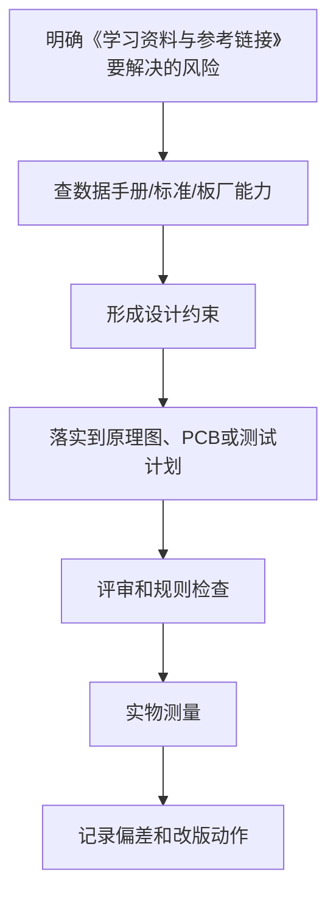

# 37 学习资料与参考链接

## 学习目标

学完本章，你应该能：

- 知道硬件和 PCB 学习应该优先看哪些资料。
- 区分官方文档、教程、论坛和视频的价值。
- 建立长期学习资料库。
- 知道如何用参考设计提高设计质量。

硬件学习资料很多，但质量差异大。优先看官方数据手册、应用笔记、参考设计和 EDA 官方文档。

## 1. 资料优先级

推荐优先级：

1. 芯片官方数据手册。
2. 官方应用笔记。
3. 官方评估板原理图和 PCB。
4. EDA 官方文档。
5. 板厂工艺说明。
6. 经典教材。
7. 高质量工程博客和论坛。
8. 视频教程。
9. 零散短视频和未经验证的图文。

不要把短视频当最终设计依据。

## 2. EDA 工具资料

KiCad：

- [官方文档](https://docs.kicad.org/)
- [KiCad 官网](https://www.kicad.org/)
- [PCB Editor 文档](https://docs.kicad.org/8.0/en/pcbnew/pcbnew.html)

学习重点：

- Getting Started。
- Schematic Editor。
- PCB Editor。
- Footprint Libraries。
- Gerber Export。
- Board Setup、Design Rules、Net Classes、DRC。

立创 EDA：

- 官方帮助文档。
- 打样和贴片说明。
- 器件库说明。

Altium：

- 官方文档。
- Designer 规则和输出文档。

## 3. 芯片厂商资料

常见厂商：

- Texas Instruments
- STMicroelectronics
- Analog Devices
- Microchip
- NXP
- Espressif
- Nordic Semiconductor
- Infineon
- Onsemi

重点找：

- Datasheet。
- Application Note。
- Hardware Design Guide。
- Evaluation Board。
- Reference Design。
- Layout Guide。

## 4. MCU 学习资料

推荐关注：

- 官方参考手册。
- 数据手册。
- 硬件设计指南。
- 开发板原理图。
- 示例工程。

常见平台：

- Arduino：适合入门理解。
- ESP32：适合物联网。
- STM32：适合系统嵌入式学习。
- RP2040：文档友好。

## 5. PCB 工艺资料

板厂通常提供：

- 最小线宽线距。
- 最小孔径。
- 板厚。
- 铜厚。
- 阻焊桥。
- 拼板规则。
- Gerber 要求。
- 贴片文件要求。

每次下单前看板厂能力表。

常用入口：

- [JLCPCB PCB Capabilities](https://jlcpcb.com/capabilities/pcb-capabilities)
- [嘉立创 PCB 工艺能力说明](https://www.jlc.com/portal/vtechnology.html)
- [IPC 标准入口](https://www.ipc.org/meet-your-standards)

## 6. 经典学习主题

基础：

- 电路分析。
- 模拟电子技术。
- 数字电子技术。
- PCB 设计基础。

进阶：

- 信号完整性。
- 电源完整性。
- EMC。
- 开关电源。
- 高速 PCB。
- 模拟前端。

## 7. 如何学习参考设计

参考设计学习步骤：

1. 看系统框图。
2. 看原理图模块。
3. 查关键芯片手册。
4. 对照典型应用。
5. 看 PCB 布局。
6. 观察去耦、电源、地、接口保护。
7. 总结可以复用的设计模式。

不要盲目复制。要理解为什么这样设计。

## 8. 如何建立资料库

建议目录：

```text
hardware_references/
  datasheets/
    mcu/
    power/
    sensors/
    interface/
  app_notes/
  reference_designs/
  pcb_fab/
  tutorials/
  standards/
```

文件命名：

```text
STM32F103_datasheet.pdf
AMS1117_datasheet.pdf
ESP32_hardware_design_guidelines.pdf
USB_TypeC_reference_design.pdf
```

## 9. 学习时如何做笔记

每读一个芯片数据手册，记录：

- 芯片用途。
- 供电范围。
- 最大电流。
- 引脚注意事项。
- 推荐外围。
- PCB 布局要求。
- 封装。
- 替代料。

每做一个项目，记录：

- 用了哪些资料。
- 哪些参考电路被采用。
- 哪些地方做了修改。
- 修改理由。

## 10. 常见参考链接

以下链接作为学习入口：

- [KiCad 官方文档](https://docs.kicad.org/)
- [KiCad 官网](https://www.kicad.org/)
- [KiCad PCB Editor 文档](https://docs.kicad.org/8.0/en/pcbnew/pcbnew.html)
- [嘉立创 EDA 专业版设计规则](https://prodocs.lceda.cn/cn/pcb/design-design-rule/)
- [嘉立创 EDA 标准版 DRC](https://docs.lceda.cn/cn/PCB/Design-Rule-Check/)
- [IPC 标准入口](https://www.ipc.org/meet-your-standards)
- [Texas Instruments 技术资料入口](https://www.ti.com/lit/)
- [TI PCB Design Guidelines For Reduced EMI](https://www.ti.com/lit/an/szza009/szza009.pdf)
- [TI Practical PCB Design Rules](https://www.ti.com/lit/an/slaae45/slaae45.pdf)
- [TI 电机驱动器电路板布局的最佳实践](https://www.ti.com.cn/cn/lit/an/zhcaae6b/zhcaae6b.pdf)
- [ST 官方资源入口](https://www.st.com/content/st_com/en/support/learning.html)
- [Analog Devices 技术文章](https://www.analog.com/en/resources/technical-articles.html)
- [Analog Devices 混合信号 PCB 布局指南](https://www.analog.com/en/resources/analog-dialogue/articles/what-are-the-basic-guidelines-for-layout-design-of-mixed-signal-pcbs.html)
- [Espressif 文档](https://docs.espressif.com/)
- [Nordic 文档](https://docs.nordicsemi.com/)
- [JLCPCB PCB Capabilities](https://jlcpcb.com/capabilities/pcb-capabilities)

中文实践资料：

- [PCB 设计返回路径 / 回流路径实践说明](https://blog.csdn.net/weixin_45365488/article/details/134132810)
- [PCB Layout 布局布线 Checklist 通用版](https://www.cnblogs.com/shaobojiao/p/7940269.html)
- [如何调试自己设计的 PCB 板](https://www.eet-china.com/mp/a17373.html)
- [按照 5 个步骤调试 PCB](https://zhuanlan.zhihu.com/p/467704060)

## 11. 推荐学习方法

不要只收藏资料。

正确方法：

1. 带着项目问题查资料。
2. 从官方资料找依据。
3. 做小实验验证。
4. 把结论写进项目笔记。
5. 下次设计复用自己的总结。

## 12. 判断资料可靠性

可靠性较高：

- 官方数据手册。
- 官方应用笔记。
- 官方评估板。
- 标准组织文档。
- 有实测数据的工程文章。

需要谨慎：

- 没有来源的电路图。
- 只说结论不解释条件的教程。
- 评论区复制来的参数。
- 没有测试的开源硬件。

## 实操练习

1. 为一个 LDO 建立资料卡片。
2. 下载一个 MCU 官方开发板原理图，分析电源和下载接口。
3. 找一个 DC-DC 芯片官方推荐布局，临摹其关键器件摆放。
4. 建立自己的 datasheets 文件夹。
5. 写一篇“我从参考设计学到了什么”的笔记。

## 检查清单

- 是否优先查官方资料？
- 是否保存了数据手册？
- 是否记录了关键参数？
- 是否看了参考布局？
- 是否验证了教程中的电路？
- 是否建立了自己的资料库？

## 常见误区

- 误区：收藏越多学得越多。
  纠正：真正有用的是阅读、实验和总结。

- 误区：开源硬件一定正确。
  纠正：也要检查原理图、PCB 和 issue。

- 误区：视频教程能替代数据手册。
  纠正：最终设计依据必须回到官方资料。

## 本章总结

硬件学习要建立资料判断能力。优先看官方数据手册、应用笔记和参考设计，再结合项目实验。好的资料库和笔记，会让你每做一块板都比上一块更稳。

---

## 万字精讲扩展（2026-06-16 更新）
> Last researched: 2026-06-16。本文补充内容以入门到工程实践为主，数值和规则应在真实项目中继续以数据手册、板厂能力表、产品标准和实测结果校准。

### 本章在整套学习路线中的位置

《学习资料与参考链接》承担的是把局部知识放进完整硬件设计流程的作用。学习这一章时，不要只看定义，而要关注它怎样影响需求、选型、原理图、PCB、制造、装配、调试和改版。硬件设计的每个决定都会在后面的实物阶段兑现：原理图里少一个保护器件，可能在插拔时烧芯片；PCB 上去耦电容放远，可能在负载跳变时复位；封装核对不严，可能导致整批板子无法焊接；没有测试点，可能让一个本来十分钟能定位的问题拖成几天。

本章学习完成后，至少应能做到三件事。第一，能用自己的话解释关键概念，而不是只背术语。第二，能把概念转换成设计检查项，例如线宽、间距、去耦、回流、保护、测试点、BOM 字段或生产文件。第三，能在调试时根据现象反推可能原因，并用仪器或目检验证。只要这三件事能完成，这章就不再是静态笔记，而会变成你设计下一块板子的工具。

### 索引类笔记的精讲重点

索引不是目录的重复，而是学习系统的地图。一个好的索引应回答三个问题：先学什么，学到什么程度可以进入下一章，遇到问题应该回到哪一章查。硬件知识有很强的依赖关系，如果没有先理解电压、电流、功率和器件参数，就直接学 PCB 布线，很多规则只能死记；如果没有做过焊接和调试，就很难理解为什么要留测试点、为什么丝印要清楚、为什么封装核对如此重要。

建议把整套笔记分成四个层级阅读。第一层是安全、基础电学、元器件、数据手册和仪器，目标是能读懂简单电路并安全测量。第二层是原理图、PCB 基础、制造工艺、布局布线、层叠和规则，目标是能画出可打样的低压低速板。第三层是电源、接地、去耦、模电、数电、接口、传感器和负载驱动，目标是能做一个完整嵌入式小系统。第四层是 SI、PI、EMI/EMC、热设计、DFM/DFA/DFT、调试复盘和版本管理，目标是把“能工作”提升到“可维护、可复现、可改版”。

索引还应作为复盘入口。每做完一块板，把问题归类到对应章节：封装错归到物料封装，下载失败归到 MCU 最小系统，ADC 噪声归到模拟和接地，DC-DC 发热归到电源和热设计，焊接困难归到 DFA，调试找不到点归到 DFT 和丝印。这样索引会从静态目录变成问题知识库。

### 工程学习的底层方法

硬件学习最容易出现的偏差，是把知识点当成孤立名词背诵。真正能落地的学习方式，是把每个知识点放进同一条工程链路里理解：需求从哪里来，器件为什么这样选，原理图如何表达意图，PCB 如何把电气意图变成物理结构，制造和装配会怎样限制你的设计，调试时又如何证明假设成立。这个链路一旦建立，很多看似零散的规则会变成同一个目标的不同侧面：降低回路面积、控制电流路径、保证制造余量、保留测试入口、减少不确定性。

初学阶段不要追求一次学完所有高端主题。更稳妥的路线是先把低压、低速、小电流、少接口的板子做闭环。所谓闭环，不是画完 PCB 就结束，而是完成需求定义、器件选型、原理图、ERC、PCB、DRC、Gerber 检查、打样、焊接、上电、测量、故障记录和改版。每完成一次闭环，你对数据手册、封装、布局、布线、去耦、接地、调试的理解都会变得更具体。没有实物反馈时，很多规则只是口号；有了失败样板以后，规则才会变成可执行的判断。

学习时建议同时维护三类笔记。第一类是概念笔记，用自己的话解释术语，不直接复制资料原文。第二类是规则笔记，把板厂能力、器件要求、个人默认规则写成表格，并标注来源和适用边界。第三类是复盘笔记，记录每块板子的设计假设、测量数据、错误原因和下一版修改。硬件经验的价值往往不在“知道一个规则”，而在知道这个规则什么时候适用、什么时候不够、什么时候必须回到数据手册或标准重新计算。

### 从规则到判断：不要把经验值当标准

很多入门资料会给出 100 nF 去耦、45 度走线、线宽 0.2 mm、线距 0.2 mm、TVS 靠近接口、晶振靠近芯片等经验值。这些经验很有用，但它们不是脱离条件的真理。100 nF 的作用依赖电容封装、ESL、布局回路、电源阻抗和芯片瞬态电流；线宽取决于电流、铜厚、温升、压降、散热铜皮和工作环境；线距受制造能力、电压、安全规范、污染等级和产品要求影响。学习笔记里应当写清楚“为什么”和“边界”，而不是只写一个数字。

工程上可以采用四级依据。最高优先级是安全法规、产品标准和客户要求；其次是芯片数据手册、评估板、应用笔记和参考设计；再往下是板厂能力表、装配厂工艺能力和 EDA 规则；最后才是个人经验和论坛建议。社区经验可以帮助发现常见坑，但不能替代标准和厂商文档。尤其是高压、电池、大电流、电机、射频、高速总线、医疗和汽车场景，入门经验值通常不够，必须引入正式规范、仿真、评审和测试。

### 一个可复用的硬件闭环


Figure: PCB 学习闭环，综合 KiCad 官方流程、板厂 DFM 要求、TI/ADI 布局应用笔记和中文社区调试经验重新整理。

### 调试意识：把问题拆成可验证假设

调试不是“看到不工作就随机改”，而是把系统拆成一组可以测量的假设。电源是否到位，复位是否释放，时钟是否振荡，下载接口是否连通，GPIO 是否能翻转，通信波形是否符合电平和时序，模拟输入是否超量程，负载电流是否超过器件能力，每一步都应该有测量点、预期值和异常解释。硬件调试最忌讳同时改变多个变量，因为这样即使问题消失，也无法知道真正原因。

第一次上电建议采用限流电源，并把电流限值设成符合预期的保守值。先不上昂贵芯片或外部负载，先测裸板短路；再焊电源部分，测输入保护、稳压输出和纹波；再焊主控和下载接口；最后逐个启用传感器、通信接口和执行器。每一步都记录电压、电流、温度和波形截图。对于后续改版，测量记录比口头记忆可靠得多。

### 核心知识点逐条精讲

#### 1. 资料优先级

在《学习资料与参考链接》这一章里，`资料优先级` 不是孤立知识点，而是一个需要落实到设计动作、检查动作和测试动作的工程对象。学习时先问三个问题：它解决什么风险，它依赖哪些前置条件，它失败时会表现成什么现象。比如一个规则如果用于 PCB，就要进一步落实到板框、封装、网络类、线宽线距、过孔、参考平面、测试点或生产文件；如果用于电路，就要落实到器件参数、工作条件、热、保护和测量方法。这样做可以避免只记住结论，却不知道如何在下一块板子上执行。

实践中建议把 `资料优先级` 写成可检查条目，而不是写成笼统口号。可检查条目应包含对象、位置、数值或来源、验证方法和异常处理。例如“确认每个外部接口有合适保护”比“注意 ESD”更可执行；“确认 U1 每个 VDD 引脚旁边 1 至 3 mm 内有低 ESL 去耦路径，且地过孔靠近电容地端”比“加 100 nF”更接近工程要求。每个条目都要能在评审时被勾选，在调试时被测量，在改版时被追踪。

当 `资料优先级` 与其他规则冲突时，应按约束优先级处理。安全和法规高于性能，数据手册高于经验，板厂能力高于个人习惯，实际测量高于未经验证的猜测。很多设计取舍没有唯一答案，例如更宽的线有利于电流和压降，却可能破坏阻抗或增加布线困难；更强的滤波有利于噪声，却可能降低响应速度或影响启动；更密的布局有利于面积，却可能损害焊接、返修和散热。笔记要记录取舍理由，而不是只留下最后结果。

#### 2. 厂商应用笔记

在《学习资料与参考链接》这一章里，`厂商应用笔记` 不是孤立知识点，而是一个需要落实到设计动作、检查动作和测试动作的工程对象。学习时先问三个问题：它解决什么风险，它依赖哪些前置条件，它失败时会表现成什么现象。比如一个规则如果用于 PCB，就要进一步落实到板框、封装、网络类、线宽线距、过孔、参考平面、测试点或生产文件；如果用于电路，就要落实到器件参数、工作条件、热、保护和测量方法。这样做可以避免只记住结论，却不知道如何在下一块板子上执行。

实践中建议把 `厂商应用笔记` 写成可检查条目，而不是写成笼统口号。可检查条目应包含对象、位置、数值或来源、验证方法和异常处理。例如“确认每个外部接口有合适保护”比“注意 ESD”更可执行；“确认 U1 每个 VDD 引脚旁边 1 至 3 mm 内有低 ESL 去耦路径，且地过孔靠近电容地端”比“加 100 nF”更接近工程要求。每个条目都要能在评审时被勾选，在调试时被测量，在改版时被追踪。

当 `厂商应用笔记` 与其他规则冲突时，应按约束优先级处理。安全和法规高于性能，数据手册高于经验，板厂能力高于个人习惯，实际测量高于未经验证的猜测。很多设计取舍没有唯一答案，例如更宽的线有利于电流和压降，却可能破坏阻抗或增加布线困难；更强的滤波有利于噪声，却可能降低响应速度或影响启动；更密的布局有利于面积，却可能损害焊接、返修和散热。笔记要记录取舍理由，而不是只留下最后结果。

#### 3. 板厂能力表

在《学习资料与参考链接》这一章里，`板厂能力表` 不是孤立知识点，而是一个需要落实到设计动作、检查动作和测试动作的工程对象。学习时先问三个问题：它解决什么风险，它依赖哪些前置条件，它失败时会表现成什么现象。比如一个规则如果用于 PCB，就要进一步落实到板框、封装、网络类、线宽线距、过孔、参考平面、测试点或生产文件；如果用于电路，就要落实到器件参数、工作条件、热、保护和测量方法。这样做可以避免只记住结论，却不知道如何在下一块板子上执行。

实践中建议把 `板厂能力表` 写成可检查条目，而不是写成笼统口号。可检查条目应包含对象、位置、数值或来源、验证方法和异常处理。例如“确认每个外部接口有合适保护”比“注意 ESD”更可执行；“确认 U1 每个 VDD 引脚旁边 1 至 3 mm 内有低 ESL 去耦路径，且地过孔靠近电容地端”比“加 100 nF”更接近工程要求。每个条目都要能在评审时被勾选，在调试时被测量，在改版时被追踪。

当 `板厂能力表` 与其他规则冲突时，应按约束优先级处理。安全和法规高于性能，数据手册高于经验，板厂能力高于个人习惯，实际测量高于未经验证的猜测。很多设计取舍没有唯一答案，例如更宽的线有利于电流和压降，却可能破坏阻抗或增加布线困难；更强的滤波有利于噪声，却可能降低响应速度或影响启动；更密的布局有利于面积，却可能损害焊接、返修和散热。笔记要记录取舍理由，而不是只留下最后结果。

#### 4. 社区经验

在《学习资料与参考链接》这一章里，`社区经验` 不是孤立知识点，而是一个需要落实到设计动作、检查动作和测试动作的工程对象。学习时先问三个问题：它解决什么风险，它依赖哪些前置条件，它失败时会表现成什么现象。比如一个规则如果用于 PCB，就要进一步落实到板框、封装、网络类、线宽线距、过孔、参考平面、测试点或生产文件；如果用于电路，就要落实到器件参数、工作条件、热、保护和测量方法。这样做可以避免只记住结论，却不知道如何在下一块板子上执行。

实践中建议把 `社区经验` 写成可检查条目，而不是写成笼统口号。可检查条目应包含对象、位置、数值或来源、验证方法和异常处理。例如“确认每个外部接口有合适保护”比“注意 ESD”更可执行；“确认 U1 每个 VDD 引脚旁边 1 至 3 mm 内有低 ESL 去耦路径，且地过孔靠近电容地端”比“加 100 nF”更接近工程要求。每个条目都要能在评审时被勾选，在调试时被测量，在改版时被追踪。

当 `社区经验` 与其他规则冲突时，应按约束优先级处理。安全和法规高于性能，数据手册高于经验，板厂能力高于个人习惯，实际测量高于未经验证的猜测。很多设计取舍没有唯一答案，例如更宽的线有利于电流和压降，却可能破坏阻抗或增加布线困难；更强的滤波有利于噪声，却可能降低响应速度或影响启动；更密的布局有利于面积，却可能损害焊接、返修和散热。笔记要记录取舍理由，而不是只留下最后结果。

#### 5. 个人资料库

在《学习资料与参考链接》这一章里，`个人资料库` 不是孤立知识点，而是一个需要落实到设计动作、检查动作和测试动作的工程对象。学习时先问三个问题：它解决什么风险，它依赖哪些前置条件，它失败时会表现成什么现象。比如一个规则如果用于 PCB，就要进一步落实到板框、封装、网络类、线宽线距、过孔、参考平面、测试点或生产文件；如果用于电路，就要落实到器件参数、工作条件、热、保护和测量方法。这样做可以避免只记住结论，却不知道如何在下一块板子上执行。

实践中建议把 `个人资料库` 写成可检查条目，而不是写成笼统口号。可检查条目应包含对象、位置、数值或来源、验证方法和异常处理。例如“确认每个外部接口有合适保护”比“注意 ESD”更可执行；“确认 U1 每个 VDD 引脚旁边 1 至 3 mm 内有低 ESL 去耦路径，且地过孔靠近电容地端”比“加 100 nF”更接近工程要求。每个条目都要能在评审时被勾选，在调试时被测量，在改版时被追踪。

当 `个人资料库` 与其他规则冲突时，应按约束优先级处理。安全和法规高于性能，数据手册高于经验，板厂能力高于个人习惯，实际测量高于未经验证的猜测。很多设计取舍没有唯一答案，例如更宽的线有利于电流和压降，却可能破坏阻抗或增加布线困难；更强的滤波有利于噪声，却可能降低响应速度或影响启动；更密的布局有利于面积，却可能损害焊接、返修和散热。笔记要记录取舍理由，而不是只留下最后结果。


### 场景化判断表

| 场景 | 推荐处理 | 典型风险 | 验证方式 |
| :--- | :--- | :--- | :--- |
| 资料优先级 | 先查数据手册、板厂能力或测试目标，再转成 EDA 规则和评审项 | 只凭经验值、没有来源、没有验证方法 | 设计评审、DRC、上电测试和改版复盘 |
| 厂商应用笔记 | 先查数据手册、板厂能力或测试目标，再转成 EDA 规则和评审项 | 只凭经验值、没有来源、没有验证方法 | 设计评审、DRC、上电测试和改版复盘 |
| 板厂能力表 | 先查数据手册、板厂能力或测试目标，再转成 EDA 规则和评审项 | 只凭经验值、没有来源、没有验证方法 | 设计评审、DRC、上电测试和改版复盘 |
| 社区经验 | 先查数据手册、板厂能力或测试目标，再转成 EDA 规则和评审项 | 只凭经验值、没有来源、没有验证方法 | 设计评审、DRC、上电测试和改版复盘 |
| 个人资料库 | 先查数据手册、板厂能力或测试目标，再转成 EDA 规则和评审项 | 只凭经验值、没有来源、没有验证方法 | 设计评审、DRC、上电测试和改版复盘 |

表格里的“推荐处理”不是固定答案，而是提醒你把每个问题落到来源、约束和验证。硬件工程里最危险的状态不是不知道，而是以为某个经验值在所有场景都成立。每当项目电压、电流、速度、温度、线缆长度、外部环境、制造厂家或装配方式变化时，都应该重新检查这些条目。

### 本章建议工作流



Figure: 《学习资料与参考链接》学习和实践工作流，综合官方文档、厂商应用笔记和板厂 DFM 资料整理。

这个工作流的重点是“先约束，后执行，再验证”。例如你要决定线宽，就不要只问别人用多少，而要先知道电流、铜厚、温升、压降和板厂能力；你要决定去耦，就不要只看电容值，而要看瞬态电流路径、封装 ESL、过孔位置和参考平面；你要决定接口保护，就要看接口是否出板、线缆长度、人体接触概率、芯片耐受能力和保护器件泄放路径。只要按这个流程写笔记，每一章都会从知识介绍变成工程方法。

### 常见误区和纠正方法

- 误区：把 DRC 通过当作设计正确。纠正：DRC 只能检查你已经设置的规则，不能理解电路意图；设计正确还需要数据手册核对、布局评审、回流路径检查、制造文件检查和实物测试。
- 误区：把社区经验当成标准。纠正：社区经验适合发现问题和启发思路，最终参数要回到官方文档、板厂能力、器件数据手册和实测结果。
- 误区：只关注能不能工作，不关注能不能维护。纠正：学习阶段就要保留丝印、测试点、版本号、BOM 信息和复盘记录，否则下一次遇到同类问题仍然要从头猜。
- 误区：只看电气连接，不看物理路径。纠正：PCB 中的电流路径、回流路径、寄生电感、寄生电容、热路径和装配空间都会影响结果，原理图正确只是起点。
- 误区：追求一次完美。纠正：硬件设计天然需要迭代，关键是让每次迭代有明确假设、测量证据和改版记录。

### 与相邻章节的关系

《学习资料与参考链接》应与前后章节交叉学习。向前看，它依赖基础电学、器件参数和数据手册阅读；向后看，它会影响 PCB 布局布线、制造装配、调试排障和版本管理。比如你在本章学到一个布局规则，应当回到元器件章节确认器件要求，再到 PCB 规则章节设置约束，再到调试章节设计测量点。这样多个笔记之间会形成网络，而不是彼此孤立。

如果某个概念暂时难以完全理解，不要停留在抽象层面反复阅读，可以通过低风险实验建立直觉。低压 LED 板、按键板、传感器板、MCU 最小系统板、MOSFET 负载板和小型 Buck 板都适合作为验证平台。每块板只重点验证两三个主题，效果通常比一块板塞满所有功能更好。


### 实操训练和复盘模板

1. 选一个真实小项目，围绕 `资料优先级` 写一条设计假设、一个检查方法和一个测量方法。
2. 选一个真实小项目，围绕 `厂商应用笔记` 写一条设计假设、一个检查方法和一个测量方法。
3. 选一个真实小项目，围绕 `板厂能力表` 写一条设计假设、一个检查方法和一个测量方法。
4. 选一个真实小项目，围绕 `社区经验` 写一条设计假设、一个检查方法和一个测量方法。
5. 选一个真实小项目，围绕 `个人资料库` 写一条设计假设、一个检查方法和一个测量方法。建议每次练习都输出一页复盘，格式如下：

```text
项目名称：
本章主题：学习资料与参考链接
设计假设：
依据来源：数据手册 / 标准 / 板厂能力 / 应用笔记 / 实测经验
实施位置：原理图页码、PCB 区域、BOM 行、测试点编号
预期结果：
实际测量：
偏差原因：
下一版修改：
```

这个模板看起来简单，但能强迫你把“我觉得”变成“我依据什么、做在哪里、测到了什么、下一步怎么改”。硬件学习最怕只留下模糊印象，复盘模板能把每一次小失败转化成下一版的规则。

## 参考资料与延伸阅读

- [Standard / IPC] IPC-2221B Preview: Generic Standard on Printed Board Design: https://webstore.ansi.org/preview-pages/IPC/preview_IPC%2B2221B-2012.pdf
- [Standard / ANSI] IPC-2152, Current Carrying Capacity in Printed Board Design: https://blog.ansi.org/ansi/ipc-2152-current-carrying-capacity-in-pcbs/
- [Tool / Official] KiCad 9.0 PCB Editor Documentation: https://docs.kicad.org/9.0/en/pcbnew/pcbnew.html
- [Tool / Official] Getting Started in KiCad 9.0: https://docs.kicad.org/9.0/en/getting_started_in_kicad/getting_started_in_kicad.html
- [Vendor / TI] PCB Design Guidelines For Reduced EMI: https://www.ti.com/lit/pdf/szza009
- [Vendor / TI] High Speed Layout Guidelines: https://www.ti.com/lit/pdf/scaa082
- [Vendor / TI] AN-1149 Layout Guidelines for Switching Power Supplies: https://www.ti.com/lit/pdf/snva021
- [Vendor / TI] PCB layout guidelines to optimize power supply performance: https://www.ti.com/lit/ml/slyp762/slyp762.pdf
- [Vendor / TI] Grounding in mixed-signal systems demystified, Part 2: https://www.ti.com/lit/pdf/slyt512
- [Vendor / Analog Devices] MT-031 Grounding Data Converters: https://www.analog.com/media/en/training-seminars/tutorials/MT-031.pdf
- [Vendor / Analog Devices] MT-101 Decoupling Techniques: https://www.analog.com/media/en/training-seminars/tutorials/MT-101.pdf
- [Vendor / Microchip] Basic 16-Bit MCU Design and Troubleshooting Checklist: https://ww1.microchip.com/downloads/aemDocuments/documents/MCU16/ProductDocuments/SupportingCollateral/Basic-16-Bit-MCU-Design-and-Troubleshooting-Checklist-DS50003274.pdf
- [Fab / PCBWay] PCB Manufacturing Tolerances: https://www.pcbway.com/pcb_prototype/PCB_Manufacturing_tolerances.html
- [Fab / PCBWay] PCB Design Rule Check: https://www.pcbway.com/pcb_prototype/PCB_Design_Rule_Check.html
- [Fab / OSH Park] Fabrication Services Design Rules: https://docs.oshpark.com/services/
- [Fab / Eurocircuits] PCB Design Guidelines: https://www.eurocircuits.com/technical-guidelines/pcb-design-guidelines/
- [Fab / Eurocircuits] Track Width and Isolation Gap Tolerances: https://www.eurocircuits.com/technical-guidelines/understanding-manufacturing-tolerances-on-a-pcb/track-width-and-isolation-gap-tolerances/
- [Community / 博客园] AD 学习笔记（基础）: https://www.cnblogs.com/Roboduster/p/15329893.html
- [Community / 博客园] Altium Designer PCB 文件的绘制（上：PCB 基础和布局）: https://www.cnblogs.com/zhjblogs/p/14172536.html
- [Community / CSDN] PCB 学习笔记: https://blog.csdn.net/weixin_51933819/article/details/122512816
- [Community / CSDN] PCB 布局布线要求及多层电路板叠加原则: https://blog.csdn.net/Ka_wyb/article/details/142337253
- [Community / 掘金] PCB 设计和布局: https://juejin.cn/post/7612948192174817295
- [Community / 掘金] 芯片电源引脚为什么要加一个 100nF 的电容: https://juejin.cn/post/7325069743144108073
- [Community / 电子工程专辑] 5 步搞定 PCB 调试: https://www.eet-china.com/mp/a393354.html

<!-- research-notes: enhanced-v1 -->

## 研究笔记增强

> Last reviewed: 2026-06-17。此节用于把《37 学习资料与参考链接》从阅读笔记推进到可复习、可实践、可验证的研究笔记；具体版本、参数和环境仍需结合官方资料、项目约束和实测结果校准。

### 知识定位

把原理图、数据手册、布局布线、制造能力、测试验证和失效分析连起来。

### 重点补充
- 从需求、电源、接口、保护、时钟、复位和调试口建立系统框图。
- 关键参数回到数据手册、参考设计、板厂能力和实测结果。
- 布局布线同时考虑回流路径、去耦、阻抗、热、EMI/EMC 和可制造性。
- 明确适用场景、限制条件、替代方案和迁移成本。

### 实践清单
- 为本章整理一张概念关系图、流程图或最小系统图。
- 写一个最小可运行示例，并保留运行命令、输入、输出和环境版本。
- 列出常见错误、排查命令、关键日志和修复动作。
- 补充安全、性能、兼容性、可维护性和上线运维注意事项。
- 用一次真实问题或练习项目复盘验证笔记是否可用。

### 常见误区
- 只摘抄定义或命令，没有记录上下文、前提条件和边界。
- 只记录成功路径，不记录失败样本、异常现象和排查过程。
- 没有版本、环境和数据样本，导致后续无法复现。
- 把教程默认值直接用于真实项目，没有结合约束重新评估。

### 复盘问题
- 学完《37 学习资料与参考链接》后，能否用自己的话说明它解决什么问题、不解决什么问题？
- 如果要在真实项目中使用，需要哪些前置条件、依赖版本、输入数据和验证手段？
- 失败时最先检查哪三类证据：日志、指标、抓包、堆栈、配置、样本还是硬件测量？
- 有没有形成可重复的最小实验、测试用例或排查命令？

### 延伸方向
- 官方文档和版本变更记录。
- 同类技术、框架或方案对比。
- 面向真实项目的最小实践。
- 故障排查清单和复盘案例库。

### 复盘记录模板

```text
主题：37 学习资料与参考链接
日期：
目标：本次要验证或掌握的具体问题
环境：系统 / 语言 / 框架 / 工具 / 设备 / 版本
步骤：最小可复现流程
现象：成功输出、失败输出、日志、指标或测量数据
分析：为什么会出现该现象，和哪些概念相关
结论：可复用的规则、命令、配置或设计取舍
风险：边界条件、性能、安全、兼容性或维护成本
下一步：继续实验、补充资料或应用到项目
```
