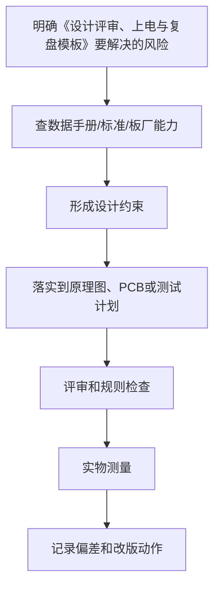

# 39 设计评审、上电与复盘模板

## 学习目标

学完本章，你应该能：

- 在画板前、下单前、焊接前、第一次上电前进行结构化评审。
- 把调试过程记录成可复用的工程文档。
- 区分现象、根因、临时修复和正式改版。
- 形成每一版 PCB 都有记录、可追溯、可复盘的习惯。

硬件开发最怕“凭印象改板”。一块板的问题可能来自原理图、封装、PCB、焊接、物料、测试方法或使用场景。没有记录，第二版很容易修掉一个问题又引入另一个问题。

## 1. 评审分阶段做

推荐阶段：

```text
需求评审 -> 原理图评审 -> PCB 布局评审 -> PCB 布线评审 -> 生产文件评审 -> 焊接评审 -> 首次上电 -> 功能验证 -> 改版复盘
```

每个阶段只解决当前阶段最重要的问题：

| 阶段 | 重点问题 | 不该做什么 |
| :--- | :--- | :--- |
| 需求评审 | 电源、接口、尺寸、环境、风险 | 不急着选封装和布线 |
| 原理图评审 | 功能、电气连接、保护、调试口 | 不用 PCB 美观掩盖电路问题 |
| 布局评审 | 模块位置、电流路径、接口位置 | 不急着把线全部连完 |
| 布线评审 | 回流、线宽、间距、噪声、DRC | 不只看飞线是否消失 |
| 生产文件评审 | Gerber、BOM、CPL、版本 | 不用过期文件下单 |
| 上电评审 | 短路、限流、温升、关键电压 | 不直接接满负载 |
| 复盘评审 | 根因、修复、证据、改版项 | 不只写“已修复” |

## 2. 需求评审模板

```markdown
## 需求评审

- 项目名称：
- 版本目标：
- 使用场景：
- 输入电源：
- 最大输入电压：
- 最小输入电压：
- 最大电流：
- 主要负载：
- 外部接口：
- 板子尺寸限制：
- 安装孔 / 外壳限制：
- 工作温度：
- 是否接触人体：
- 是否连接长线缆：
- 是否有电机、继电器、喇叭等感性负载：
- 是否有大电流或高压：
- 是否需要量产：

## 风险列表

| 风险 | 可能后果 | 规避措施 |
| :--- | :--- | :--- |
|  |  |  |
```

需求评审的核心是把“不确定”写出来。硬件项目中，没定义的输入电压、线缆长度、负载电流，最后都会变成调试问题。

## 3. 原理图评审模板

```markdown
## 原理图评审

### 电源

- [ ] 输入电压范围已标注。
- [ ] 防反接需求已判断。
- [ ] 保险丝 / 限流 / 过压保护需求已判断。
- [ ] LDO / DC-DC 输入输出电容符合数据手册。
- [ ] 电源网络命名清楚。
- [ ] 每个 IC 的电源脚都有去耦电容。
- [ ] 模拟电源、数字电源、外设电源关系清楚。

### MCU / 主控

- [ ] 所有 VDD / VSS / VDDA / VREF 已处理。
- [ ] Reset、Boot、下载接口已处理。
- [ ] 时钟源选择明确。
- [ ] 未用引脚处理方式符合数据手册。
- [ ] 调试串口、SWD/JTAG 或下载口可接入。

### 接口

- [ ] TX/RX、SDA/SCL、MISO/MOSI/SCK 已核对方向。
- [ ] 外部接口电平兼容。
- [ ] 长线缆接口有 ESD 或浪涌保护评估。
- [ ] 连接器 Pin 1、方向、线序已核对实物。

### 保护与可靠性

- [ ] 感性负载有续流或吸收。
- [ ] 外部输入有上拉、下拉或默认状态。
- [ ] 大电流路径有保护或限流。
- [ ] 关键测试点已预留。
```

## 4. PCB 布局评审模板

布局评审要在大量布线之前做。这个阶段改器件位置成本最低。

```markdown
## PCB 布局评审

### 机械与接口

- [ ] 板框尺寸正确。
- [ ] 安装孔位置、孔径、禁布区正确。
- [ ] 连接器靠近板边，插拔方向合理。
- [ ] 高器件不会与外壳、螺丝、线缆干涉。
- [ ] 极性器件方向便于装配检查。

### 电源路径

- [ ] 电源入口、保护、稳压、负载路径清楚。
- [ ] DC-DC 输入电容、芯片、电感、二极管/同步管、输出电容紧凑。
- [ ] 大电流回路短，不穿过敏感区。
- [ ] 发热器件有散热铜皮或散热路径。

### 信号与噪声

- [ ] MCU 去耦电容贴近电源脚。
- [ ] 晶振贴近 MCU，远离接口和开关电源。
- [ ] ADC、传感器、模拟前端远离电机和 DC-DC。
- [ ] TVS 靠近接口，而不是靠近芯片。
- [ ] 高速线预留连续参考地。
```

## 5. PCB 布线评审模板

```markdown
## PCB 布线评审

### 连接性与规则

- [ ] 没有未连接网络。
- [ ] ERC / DRC 已运行。
- [ ] Net Class 与线宽、线距、过孔规则匹配。
- [ ] 所有设计规则来自板厂能力表或项目约束。

### 电源与地

- [ ] 电源线宽满足电流和压降要求。
- [ ] 底层或内层 GND 尽量连续。
- [ ] 关键信号不跨越地缝。
- [ ] 去耦电容到电源脚和地的路径短。
- [ ] 大电流回流不穿过模拟地和 MCU 敏感区。

### 高速、接口、模拟

- [ ] 时钟线短，有连续参考地。
- [ ] USB / 差分线成对、少过孔、少分支。
- [ ] SPI SCK 远离模拟输入，必要时预留串阻。
- [ ] ADC 输入线短，远离开关节点。
- [ ] 接口 ESD 到地路径短且直接。

### 可制造性和可维修性

- [ ] 丝印不压焊盘。
- [ ] Pin 1、极性、电源方向标注清楚。
- [ ] 测试点可接触。
- [ ] 手焊器件周围有足够空间。
- [ ] 连接器、按钮、LED 方向符合使用习惯。
```

## 6. 生产文件评审模板

```markdown
## 生产文件评审

- [ ] Gerber 文件来自当前 PCB 版本。
- [ ] Drill 文件已导出。
- [ ] 板框层正确。
- [ ] 层数、板厚、铜厚与下单参数一致。
- [ ] 阻焊层、丝印层检查正常。
- [ ] BOM 中型号、封装、数量、极性件备注完整。
- [ ] CPL / Pick and Place 坐标方向已检查。
- [ ] 原理图 PDF、装配图、3D 截图已导出。
- [ ] 文件名包含项目名和版本号。
- [ ] 压缩包中没有旧版本文件混入。
```

## 7. 首次上电记录模板

第一次上电要慢，不要一次性接满所有模块。

```markdown
## 首次上电记录

- 项目：
- PCB 版本：
- 日期：
- 操作人：
- 输入电压：
- 限流设置：
- 是否接负载：
- 环境：

### 上电前

- [ ] 目视检查焊接。
- [ ] 电源和 GND 阻值：
- [ ] 电源极性确认。
- [ ] 芯片方向确认。
- [ ] 电解电容、二极管、LED 方向确认。
- [ ] 限流电源已设置。

### 上电过程

| 步骤 | 操作 | 预期 | 实测 | 结论 |
| :--- | :--- | :--- | :--- | :--- |
| 1 | 输入 0V，限流设置 | 无异常 |  |  |
| 2 | 缓慢升到目标电压 | 电流合理 |  |  |
| 3 | 测 LDO / DC-DC 输出 | 电压正确 |  |  |
| 4 | 测 MCU VDD / Reset | 正常 |  |  |
| 5 | 下载程序 | 成功 |  |  |
| 6 | 测接口 | 通信正常 |  |  |

### 异常记录

| 现象 | 位置 | 条件 | 初步判断 | 下一步 |
| :--- | :--- | :--- | :--- | :--- |
|  |  |  |  |  |
```

## 8. 调试记录模板

调试记录要写“条件”，否则无法复现。

```markdown
## 调试记录

- 问题编号：
- PCB 版本：
- 固件版本：
- 测试日期：
- 测试设备：
- 输入电压：
- 负载条件：
- 环境温度：

### 现象

描述看到的事实，不写猜测。

### 复现步骤

1.
2.
3.

### 测量数据

| 测量点 | 工具 | 预期 | 实测 | 备注 |
| :--- | :--- | :--- | :--- | :--- |
|  |  |  |  |  |

### 初步假设

| 假设 | 支持证据 | 反证 | 验证方法 |
| :--- | :--- | :--- | :--- |
|  |  |  |  |

### 结论

- 根因：
- 临时修复：
- 正式改版：
- 是否需要补充测试：
```

## 9. 改版复盘模板

```markdown
## 改版复盘

- 项目：
- 从版本：
- 到版本：
- 改版日期：

### 必改项

| 编号 | 问题 | 根因 | 修改方案 | 验证方法 |
| :--- | :--- | :--- | :--- | :--- |
|  |  |  |  |  |

### 可选优化

| 编号 | 优化项 | 收益 | 风险 | 是否本版处理 |
| :--- | :--- | :--- | :--- | :--- |
|  |  |  |  |  |

### 不处理项

| 项目 | 不处理原因 | 后续条件 |
| :--- | :--- | :--- |
|  |  |  |

### 改版后必须验证

- [ ] 原问题已复测。
- [ ] 相关功能没有回归。
- [ ] 电源、温升、通信、接口已重新测试。
- [ ] BOM、Gerber、CPL、原理图 PDF 已同步。
```

## 10. 问题分类方法

| 类型 | 例子 | 处理方式 |
| :--- | :--- | :--- |
| 原理图错误 | 引脚接错、缺上拉、供电错误 | 必须改原理图 |
| 封装错误 | 引脚编号错、孔径小、方向反 | 修封装库并标记版本 |
| PCB 布局错误 | 去耦远、TVS 远、大电流绕路 | 改布局，不只飞线 |
| PCB 布线错误 | GND 裂缝、线太细、差分不对 | 改布线和规则 |
| 物料错误 | 型号买错、耐压不足、封装不符 | 改 BOM 和替代料 |
| 焊接错误 | 虚焊、连锡、方向反 | 修焊接工艺和检查 |
| 测试错误 | 探头地线太长、限流太低 | 修测试方法 |
| 需求错误 | 负载电流估小、环境变化 | 回到需求评审 |

## 11. 常见复盘误区

- 误区：板子能跑起来就不用记录。
  纠正：能跑起来只说明当前条件下通过，不代表问题不存在。

- 误区：飞线修好就算解决。
  纠正：飞线是临时验证，正式版本要改原理图、PCB 和文档。

- 误区：只记录结论，不记录测量条件。
  纠正：硬件问题强依赖输入电压、负载、温度、线缆和固件版本。

- 误区：每次改版顺手优化很多地方。
  纠正：改动越多，越难判断问题是否真正解决。

## 本章总结

硬件工程能力不仅是会画原理图和 PCB，还包括评审、记录、上电、测量、复盘和版本追踪。把每一次失败板子变成下一版的证据，学习速度会明显提高。

## 参考与延伸阅读

- [KiCad PCB Editor 文档](https://docs.kicad.org/8.0/en/pcbnew/pcbnew.html)
- [嘉立创 EDA 专业版设计规则](https://prodocs.lceda.cn/cn/pcb/design-design-rule/)
- [PCB Layout 布局布线 Checklist 通用版](https://www.cnblogs.com/shaobojiao/p/7940269.html)
- [如何调试自己设计的 PCB 板](https://www.eet-china.com/mp/a17373.html)
- [按照 5 个步骤调试 PCB](https://zhuanlan.zhihu.com/p/467704060)
- [TI 电机驱动器电路板布局的最佳实践](https://www.ti.com.cn/cn/lit/an/zhcaae6b/zhcaae6b.pdf)

---

## 万字精讲扩展（2026-06-16 更新）
> Last researched: 2026-06-16。本文补充内容以入门到工程实践为主，数值和规则应在真实项目中继续以数据手册、板厂能力表、产品标准和实测结果校准。

### 本章在整套学习路线中的位置

《设计评审、上电与复盘模板》承担的是把局部知识放进完整硬件设计流程的作用。学习这一章时，不要只看定义，而要关注它怎样影响需求、选型、原理图、PCB、制造、装配、调试和改版。硬件设计的每个决定都会在后面的实物阶段兑现：原理图里少一个保护器件，可能在插拔时烧芯片；PCB 上去耦电容放远，可能在负载跳变时复位；封装核对不严，可能导致整批板子无法焊接；没有测试点，可能让一个本来十分钟能定位的问题拖成几天。

本章学习完成后，至少应能做到三件事。第一，能用自己的话解释关键概念，而不是只背术语。第二，能把概念转换成设计检查项，例如线宽、间距、去耦、回流、保护、测试点、BOM 字段或生产文件。第三，能在调试时根据现象反推可能原因，并用仪器或目检验证。只要这三件事能完成，这章就不再是静态笔记，而会变成你设计下一块板子的工具。

### 实践、调试和复盘的精讲重点

实践类章节的价值在于把知识变成可验证结果。一个简单项目也应按正式流程做：先写需求，再画功能框图，再选器件，再读数据手册，再画原理图，再做 PCB，再打样焊接，再限流上电，再按模块测试。每个步骤都要留下可检查产物。没有需求，后面无法判断选型是否合理；没有功能框图，原理图容易变成杂乱连接；没有测试计划，上电后只能凭感觉排查。

调试顺序建议固定下来：外观检查、阻值检查、限流上电、输入保护、稳压输出、复位、时钟、下载接口、基础 GPIO、通信接口、模拟采样、负载驱动、长时间运行和温升。遇到异常先缩小范围，而不是马上改焊一堆元件。比如 MCU 不能下载，先确认供电、复位、BOOT、SWD/JTAG 连线、地线、下载器电平和芯片方向；I2C 不通，先看上拉、电平、地址、SCL/SDA 是否反、波形是否被拉低、总线电容是否过大。

复盘要记录事实、假设、验证和结论。事实是测到的电压、电流、波形、温度、现象；假设是你认为可能的原因；验证是你做了什么实验排除或确认；结论是下一版如何修改。不要只写“电源有问题”这种无法复用的句子，而要写“U3 输出在负载阶跃时跌落到 2.8 V，示波器测得输入端也同步跌落，原因是输入线过细且入口电容不足，下一版增加入口电容并加宽输入路径”。这样的复盘才会变成工程能力。

### 工程学习的底层方法

硬件学习最容易出现的偏差，是把知识点当成孤立名词背诵。真正能落地的学习方式，是把每个知识点放进同一条工程链路里理解：需求从哪里来，器件为什么这样选，原理图如何表达意图，PCB 如何把电气意图变成物理结构，制造和装配会怎样限制你的设计，调试时又如何证明假设成立。这个链路一旦建立，很多看似零散的规则会变成同一个目标的不同侧面：降低回路面积、控制电流路径、保证制造余量、保留测试入口、减少不确定性。

初学阶段不要追求一次学完所有高端主题。更稳妥的路线是先把低压、低速、小电流、少接口的板子做闭环。所谓闭环，不是画完 PCB 就结束，而是完成需求定义、器件选型、原理图、ERC、PCB、DRC、Gerber 检查、打样、焊接、上电、测量、故障记录和改版。每完成一次闭环，你对数据手册、封装、布局、布线、去耦、接地、调试的理解都会变得更具体。没有实物反馈时，很多规则只是口号；有了失败样板以后，规则才会变成可执行的判断。

学习时建议同时维护三类笔记。第一类是概念笔记，用自己的话解释术语，不直接复制资料原文。第二类是规则笔记，把板厂能力、器件要求、个人默认规则写成表格，并标注来源和适用边界。第三类是复盘笔记，记录每块板子的设计假设、测量数据、错误原因和下一版修改。硬件经验的价值往往不在“知道一个规则”，而在知道这个规则什么时候适用、什么时候不够、什么时候必须回到数据手册或标准重新计算。

### 从规则到判断：不要把经验值当标准

很多入门资料会给出 100 nF 去耦、45 度走线、线宽 0.2 mm、线距 0.2 mm、TVS 靠近接口、晶振靠近芯片等经验值。这些经验很有用，但它们不是脱离条件的真理。100 nF 的作用依赖电容封装、ESL、布局回路、电源阻抗和芯片瞬态电流；线宽取决于电流、铜厚、温升、压降、散热铜皮和工作环境；线距受制造能力、电压、安全规范、污染等级和产品要求影响。学习笔记里应当写清楚“为什么”和“边界”，而不是只写一个数字。

工程上可以采用四级依据。最高优先级是安全法规、产品标准和客户要求；其次是芯片数据手册、评估板、应用笔记和参考设计；再往下是板厂能力表、装配厂工艺能力和 EDA 规则；最后才是个人经验和论坛建议。社区经验可以帮助发现常见坑，但不能替代标准和厂商文档。尤其是高压、电池、大电流、电机、射频、高速总线、医疗和汽车场景，入门经验值通常不够，必须引入正式规范、仿真、评审和测试。

### 一个可复用的硬件闭环


Figure: PCB 学习闭环，综合 KiCad 官方流程、板厂 DFM 要求、TI/ADI 布局应用笔记和中文社区调试经验重新整理。

### 调试意识：把问题拆成可验证假设

调试不是“看到不工作就随机改”，而是把系统拆成一组可以测量的假设。电源是否到位，复位是否释放，时钟是否振荡，下载接口是否连通，GPIO 是否能翻转，通信波形是否符合电平和时序，模拟输入是否超量程，负载电流是否超过器件能力，每一步都应该有测量点、预期值和异常解释。硬件调试最忌讳同时改变多个变量，因为这样即使问题消失，也无法知道真正原因。

第一次上电建议采用限流电源，并把电流限值设成符合预期的保守值。先不上昂贵芯片或外部负载，先测裸板短路；再焊电源部分，测输入保护、稳压输出和纹波；再焊主控和下载接口；最后逐个启用传感器、通信接口和执行器。每一步都记录电压、电流、温度和波形截图。对于后续改版，测量记录比口头记忆可靠得多。

### 核心知识点逐条精讲

#### 1. 需求评审

在《设计评审、上电与复盘模板》这一章里，`需求评审` 不是孤立知识点，而是一个需要落实到设计动作、检查动作和测试动作的工程对象。学习时先问三个问题：它解决什么风险，它依赖哪些前置条件，它失败时会表现成什么现象。比如一个规则如果用于 PCB，就要进一步落实到板框、封装、网络类、线宽线距、过孔、参考平面、测试点或生产文件；如果用于电路，就要落实到器件参数、工作条件、热、保护和测量方法。这样做可以避免只记住结论，却不知道如何在下一块板子上执行。

实践中建议把 `需求评审` 写成可检查条目，而不是写成笼统口号。可检查条目应包含对象、位置、数值或来源、验证方法和异常处理。例如“确认每个外部接口有合适保护”比“注意 ESD”更可执行；“确认 U1 每个 VDD 引脚旁边 1 至 3 mm 内有低 ESL 去耦路径，且地过孔靠近电容地端”比“加 100 nF”更接近工程要求。每个条目都要能在评审时被勾选，在调试时被测量，在改版时被追踪。

当 `需求评审` 与其他规则冲突时，应按约束优先级处理。安全和法规高于性能，数据手册高于经验，板厂能力高于个人习惯，实际测量高于未经验证的猜测。很多设计取舍没有唯一答案，例如更宽的线有利于电流和压降，却可能破坏阻抗或增加布线困难；更强的滤波有利于噪声，却可能降低响应速度或影响启动；更密的布局有利于面积，却可能损害焊接、返修和散热。笔记要记录取舍理由，而不是只留下最后结果。

#### 2. 原理图评审

在《设计评审、上电与复盘模板》这一章里，`原理图评审` 不是孤立知识点，而是一个需要落实到设计动作、检查动作和测试动作的工程对象。学习时先问三个问题：它解决什么风险，它依赖哪些前置条件，它失败时会表现成什么现象。比如一个规则如果用于 PCB，就要进一步落实到板框、封装、网络类、线宽线距、过孔、参考平面、测试点或生产文件；如果用于电路，就要落实到器件参数、工作条件、热、保护和测量方法。这样做可以避免只记住结论，却不知道如何在下一块板子上执行。

实践中建议把 `原理图评审` 写成可检查条目，而不是写成笼统口号。可检查条目应包含对象、位置、数值或来源、验证方法和异常处理。例如“确认每个外部接口有合适保护”比“注意 ESD”更可执行；“确认 U1 每个 VDD 引脚旁边 1 至 3 mm 内有低 ESL 去耦路径，且地过孔靠近电容地端”比“加 100 nF”更接近工程要求。每个条目都要能在评审时被勾选，在调试时被测量，在改版时被追踪。

当 `原理图评审` 与其他规则冲突时，应按约束优先级处理。安全和法规高于性能，数据手册高于经验，板厂能力高于个人习惯，实际测量高于未经验证的猜测。很多设计取舍没有唯一答案，例如更宽的线有利于电流和压降，却可能破坏阻抗或增加布线困难；更强的滤波有利于噪声，却可能降低响应速度或影响启动；更密的布局有利于面积，却可能损害焊接、返修和散热。笔记要记录取舍理由，而不是只留下最后结果。

#### 3. PCB 评审

在《设计评审、上电与复盘模板》这一章里，`PCB 评审` 不是孤立知识点，而是一个需要落实到设计动作、检查动作和测试动作的工程对象。学习时先问三个问题：它解决什么风险，它依赖哪些前置条件，它失败时会表现成什么现象。比如一个规则如果用于 PCB，就要进一步落实到板框、封装、网络类、线宽线距、过孔、参考平面、测试点或生产文件；如果用于电路，就要落实到器件参数、工作条件、热、保护和测量方法。这样做可以避免只记住结论，却不知道如何在下一块板子上执行。

实践中建议把 `PCB 评审` 写成可检查条目，而不是写成笼统口号。可检查条目应包含对象、位置、数值或来源、验证方法和异常处理。例如“确认每个外部接口有合适保护”比“注意 ESD”更可执行；“确认 U1 每个 VDD 引脚旁边 1 至 3 mm 内有低 ESL 去耦路径，且地过孔靠近电容地端”比“加 100 nF”更接近工程要求。每个条目都要能在评审时被勾选，在调试时被测量，在改版时被追踪。

当 `PCB 评审` 与其他规则冲突时，应按约束优先级处理。安全和法规高于性能，数据手册高于经验，板厂能力高于个人习惯，实际测量高于未经验证的猜测。很多设计取舍没有唯一答案，例如更宽的线有利于电流和压降，却可能破坏阻抗或增加布线困难；更强的滤波有利于噪声，却可能降低响应速度或影响启动；更密的布局有利于面积，却可能损害焊接、返修和散热。笔记要记录取舍理由，而不是只留下最后结果。

#### 4. 限流上电

在《设计评审、上电与复盘模板》这一章里，`限流上电` 不是孤立知识点，而是一个需要落实到设计动作、检查动作和测试动作的工程对象。学习时先问三个问题：它解决什么风险，它依赖哪些前置条件，它失败时会表现成什么现象。比如一个规则如果用于 PCB，就要进一步落实到板框、封装、网络类、线宽线距、过孔、参考平面、测试点或生产文件；如果用于电路，就要落实到器件参数、工作条件、热、保护和测量方法。这样做可以避免只记住结论，却不知道如何在下一块板子上执行。

实践中建议把 `限流上电` 写成可检查条目，而不是写成笼统口号。可检查条目应包含对象、位置、数值或来源、验证方法和异常处理。例如“确认每个外部接口有合适保护”比“注意 ESD”更可执行；“确认 U1 每个 VDD 引脚旁边 1 至 3 mm 内有低 ESL 去耦路径，且地过孔靠近电容地端”比“加 100 nF”更接近工程要求。每个条目都要能在评审时被勾选，在调试时被测量，在改版时被追踪。

当 `限流上电` 与其他规则冲突时，应按约束优先级处理。安全和法规高于性能，数据手册高于经验，板厂能力高于个人习惯，实际测量高于未经验证的猜测。很多设计取舍没有唯一答案，例如更宽的线有利于电流和压降，却可能破坏阻抗或增加布线困难；更强的滤波有利于噪声，却可能降低响应速度或影响启动；更密的布局有利于面积，却可能损害焊接、返修和散热。笔记要记录取舍理由，而不是只留下最后结果。

#### 5. 问题复盘

在《设计评审、上电与复盘模板》这一章里，`问题复盘` 不是孤立知识点，而是一个需要落实到设计动作、检查动作和测试动作的工程对象。学习时先问三个问题：它解决什么风险，它依赖哪些前置条件，它失败时会表现成什么现象。比如一个规则如果用于 PCB，就要进一步落实到板框、封装、网络类、线宽线距、过孔、参考平面、测试点或生产文件；如果用于电路，就要落实到器件参数、工作条件、热、保护和测量方法。这样做可以避免只记住结论，却不知道如何在下一块板子上执行。

实践中建议把 `问题复盘` 写成可检查条目，而不是写成笼统口号。可检查条目应包含对象、位置、数值或来源、验证方法和异常处理。例如“确认每个外部接口有合适保护”比“注意 ESD”更可执行；“确认 U1 每个 VDD 引脚旁边 1 至 3 mm 内有低 ESL 去耦路径，且地过孔靠近电容地端”比“加 100 nF”更接近工程要求。每个条目都要能在评审时被勾选，在调试时被测量，在改版时被追踪。

当 `问题复盘` 与其他规则冲突时，应按约束优先级处理。安全和法规高于性能，数据手册高于经验，板厂能力高于个人习惯，实际测量高于未经验证的猜测。很多设计取舍没有唯一答案，例如更宽的线有利于电流和压降，却可能破坏阻抗或增加布线困难；更强的滤波有利于噪声，却可能降低响应速度或影响启动；更密的布局有利于面积，却可能损害焊接、返修和散热。笔记要记录取舍理由，而不是只留下最后结果。


### 场景化判断表

| 场景 | 推荐处理 | 典型风险 | 验证方式 |
| :--- | :--- | :--- | :--- |
| 需求评审 | 先查数据手册、板厂能力或测试目标，再转成 EDA 规则和评审项 | 只凭经验值、没有来源、没有验证方法 | 设计评审、DRC、上电测试和改版复盘 |
| 原理图评审 | 先查数据手册、板厂能力或测试目标，再转成 EDA 规则和评审项 | 只凭经验值、没有来源、没有验证方法 | 设计评审、DRC、上电测试和改版复盘 |
| PCB 评审 | 先查数据手册、板厂能力或测试目标，再转成 EDA 规则和评审项 | 只凭经验值、没有来源、没有验证方法 | 设计评审、DRC、上电测试和改版复盘 |
| 限流上电 | 先查数据手册、板厂能力或测试目标，再转成 EDA 规则和评审项 | 只凭经验值、没有来源、没有验证方法 | 设计评审、DRC、上电测试和改版复盘 |
| 问题复盘 | 先查数据手册、板厂能力或测试目标，再转成 EDA 规则和评审项 | 只凭经验值、没有来源、没有验证方法 | 设计评审、DRC、上电测试和改版复盘 |

表格里的“推荐处理”不是固定答案，而是提醒你把每个问题落到来源、约束和验证。硬件工程里最危险的状态不是不知道，而是以为某个经验值在所有场景都成立。每当项目电压、电流、速度、温度、线缆长度、外部环境、制造厂家或装配方式变化时，都应该重新检查这些条目。

### 本章建议工作流



Figure: 《设计评审、上电与复盘模板》学习和实践工作流，综合官方文档、厂商应用笔记和板厂 DFM 资料整理。

这个工作流的重点是“先约束，后执行，再验证”。例如你要决定线宽，就不要只问别人用多少，而要先知道电流、铜厚、温升、压降和板厂能力；你要决定去耦，就不要只看电容值，而要看瞬态电流路径、封装 ESL、过孔位置和参考平面；你要决定接口保护，就要看接口是否出板、线缆长度、人体接触概率、芯片耐受能力和保护器件泄放路径。只要按这个流程写笔记，每一章都会从知识介绍变成工程方法。

### 常见误区和纠正方法

- 误区：把 DRC 通过当作设计正确。纠正：DRC 只能检查你已经设置的规则，不能理解电路意图；设计正确还需要数据手册核对、布局评审、回流路径检查、制造文件检查和实物测试。
- 误区：把社区经验当成标准。纠正：社区经验适合发现问题和启发思路，最终参数要回到官方文档、板厂能力、器件数据手册和实测结果。
- 误区：只关注能不能工作，不关注能不能维护。纠正：学习阶段就要保留丝印、测试点、版本号、BOM 信息和复盘记录，否则下一次遇到同类问题仍然要从头猜。
- 误区：只看电气连接，不看物理路径。纠正：PCB 中的电流路径、回流路径、寄生电感、寄生电容、热路径和装配空间都会影响结果，原理图正确只是起点。
- 误区：追求一次完美。纠正：硬件设计天然需要迭代，关键是让每次迭代有明确假设、测量证据和改版记录。

### 与相邻章节的关系

《设计评审、上电与复盘模板》应与前后章节交叉学习。向前看，它依赖基础电学、器件参数和数据手册阅读；向后看，它会影响 PCB 布局布线、制造装配、调试排障和版本管理。比如你在本章学到一个布局规则，应当回到元器件章节确认器件要求，再到 PCB 规则章节设置约束，再到调试章节设计测量点。这样多个笔记之间会形成网络，而不是彼此孤立。

如果某个概念暂时难以完全理解，不要停留在抽象层面反复阅读，可以通过低风险实验建立直觉。低压 LED 板、按键板、传感器板、MCU 最小系统板、MOSFET 负载板和小型 Buck 板都适合作为验证平台。每块板只重点验证两三个主题，效果通常比一块板塞满所有功能更好。


### 实操训练和复盘模板

1. 选一个真实小项目，围绕 `需求评审` 写一条设计假设、一个检查方法和一个测量方法。
2. 选一个真实小项目，围绕 `原理图评审` 写一条设计假设、一个检查方法和一个测量方法。
3. 选一个真实小项目，围绕 `PCB 评审` 写一条设计假设、一个检查方法和一个测量方法。
4. 选一个真实小项目，围绕 `限流上电` 写一条设计假设、一个检查方法和一个测量方法。
5. 选一个真实小项目，围绕 `问题复盘` 写一条设计假设、一个检查方法和一个测量方法。建议每次练习都输出一页复盘，格式如下：

```text
项目名称：
本章主题：设计评审、上电与复盘模板
设计假设：
依据来源：数据手册 / 标准 / 板厂能力 / 应用笔记 / 实测经验
实施位置：原理图页码、PCB 区域、BOM 行、测试点编号
预期结果：
实际测量：
偏差原因：
下一版修改：
```

这个模板看起来简单，但能强迫你把“我觉得”变成“我依据什么、做在哪里、测到了什么、下一步怎么改”。硬件学习最怕只留下模糊印象，复盘模板能把每一次小失败转化成下一版的规则。

## 参考资料与延伸阅读

- [Standard / IPC] IPC-2221B Preview: Generic Standard on Printed Board Design: https://webstore.ansi.org/preview-pages/IPC/preview_IPC%2B2221B-2012.pdf
- [Standard / ANSI] IPC-2152, Current Carrying Capacity in Printed Board Design: https://blog.ansi.org/ansi/ipc-2152-current-carrying-capacity-in-pcbs/
- [Tool / Official] KiCad 9.0 PCB Editor Documentation: https://docs.kicad.org/9.0/en/pcbnew/pcbnew.html
- [Tool / Official] Getting Started in KiCad 9.0: https://docs.kicad.org/9.0/en/getting_started_in_kicad/getting_started_in_kicad.html
- [Vendor / TI] PCB Design Guidelines For Reduced EMI: https://www.ti.com/lit/pdf/szza009
- [Vendor / TI] High Speed Layout Guidelines: https://www.ti.com/lit/pdf/scaa082
- [Vendor / TI] AN-1149 Layout Guidelines for Switching Power Supplies: https://www.ti.com/lit/pdf/snva021
- [Vendor / TI] PCB layout guidelines to optimize power supply performance: https://www.ti.com/lit/ml/slyp762/slyp762.pdf
- [Vendor / TI] Grounding in mixed-signal systems demystified, Part 2: https://www.ti.com/lit/pdf/slyt512
- [Vendor / Analog Devices] MT-031 Grounding Data Converters: https://www.analog.com/media/en/training-seminars/tutorials/MT-031.pdf
- [Vendor / Analog Devices] MT-101 Decoupling Techniques: https://www.analog.com/media/en/training-seminars/tutorials/MT-101.pdf
- [Vendor / Microchip] Basic 16-Bit MCU Design and Troubleshooting Checklist: https://ww1.microchip.com/downloads/aemDocuments/documents/MCU16/ProductDocuments/SupportingCollateral/Basic-16-Bit-MCU-Design-and-Troubleshooting-Checklist-DS50003274.pdf
- [Fab / PCBWay] PCB Manufacturing Tolerances: https://www.pcbway.com/pcb_prototype/PCB_Manufacturing_tolerances.html
- [Fab / PCBWay] PCB Design Rule Check: https://www.pcbway.com/pcb_prototype/PCB_Design_Rule_Check.html
- [Fab / OSH Park] Fabrication Services Design Rules: https://docs.oshpark.com/services/
- [Fab / Eurocircuits] PCB Design Guidelines: https://www.eurocircuits.com/technical-guidelines/pcb-design-guidelines/
- [Fab / Eurocircuits] Track Width and Isolation Gap Tolerances: https://www.eurocircuits.com/technical-guidelines/understanding-manufacturing-tolerances-on-a-pcb/track-width-and-isolation-gap-tolerances/
- [Community / 博客园] AD 学习笔记（基础）: https://www.cnblogs.com/Roboduster/p/15329893.html
- [Community / 博客园] Altium Designer PCB 文件的绘制（上：PCB 基础和布局）: https://www.cnblogs.com/zhjblogs/p/14172536.html
- [Community / CSDN] PCB 学习笔记: https://blog.csdn.net/weixin_51933819/article/details/122512816
- [Community / CSDN] PCB 布局布线要求及多层电路板叠加原则: https://blog.csdn.net/Ka_wyb/article/details/142337253
- [Community / 掘金] PCB 设计和布局: https://juejin.cn/post/7612948192174817295
- [Community / 掘金] 芯片电源引脚为什么要加一个 100nF 的电容: https://juejin.cn/post/7325069743144108073
- [Community / 电子工程专辑] 5 步搞定 PCB 调试: https://www.eet-china.com/mp/a393354.html

<!-- research-notes: enhanced-v1 -->

## 研究笔记增强

> Last reviewed: 2026-06-17。此节用于把《39 设计评审、上电与复盘模板》从阅读笔记推进到可复习、可实践、可验证的研究笔记；具体版本、参数和环境仍需结合官方资料、项目约束和实测结果校准。

### 知识定位

把原理图、数据手册、布局布线、制造能力、测试验证和失效分析连起来。

### 重点补充
- 从需求、电源、接口、保护、时钟、复位和调试口建立系统框图。
- 关键参数回到数据手册、参考设计、板厂能力和实测结果。
- 布局布线同时考虑回流路径、去耦、阻抗、热、EMI/EMC 和可制造性。
- 明确适用场景、限制条件、替代方案和迁移成本。

### 实践清单
- 为本章整理一张概念关系图、流程图或最小系统图。
- 写一个最小可运行示例，并保留运行命令、输入、输出和环境版本。
- 列出常见错误、排查命令、关键日志和修复动作。
- 补充安全、性能、兼容性、可维护性和上线运维注意事项。
- 用一次真实问题或练习项目复盘验证笔记是否可用。

### 常见误区
- 只摘抄定义或命令，没有记录上下文、前提条件和边界。
- 只记录成功路径，不记录失败样本、异常现象和排查过程。
- 没有版本、环境和数据样本，导致后续无法复现。
- 把教程默认值直接用于真实项目，没有结合约束重新评估。

### 复盘问题
- 学完《39 设计评审、上电与复盘模板》后，能否用自己的话说明它解决什么问题、不解决什么问题？
- 如果要在真实项目中使用，需要哪些前置条件、依赖版本、输入数据和验证手段？
- 失败时最先检查哪三类证据：日志、指标、抓包、堆栈、配置、样本还是硬件测量？
- 有没有形成可重复的最小实验、测试用例或排查命令？

### 延伸方向
- 官方文档和版本变更记录。
- 同类技术、框架或方案对比。
- 面向真实项目的最小实践。
- 故障排查清单和复盘案例库。

### 复盘记录模板

```text
主题：39 设计评审、上电与复盘模板
日期：
目标：本次要验证或掌握的具体问题
环境：系统 / 语言 / 框架 / 工具 / 设备 / 版本
步骤：最小可复现流程
现象：成功输出、失败输出、日志、指标或测量数据
分析：为什么会出现该现象，和哪些概念相关
结论：可复用的规则、命令、配置或设计取舍
风险：边界条件、性能、安全、兼容性或维护成本
下一步：继续实验、补充资料或应用到项目
```

<!-- lecture-notes:start -->

## 讲义级补充：如何真正学懂《39 设计评审、上电与复盘模板》

> 适用位置：硬件PCB学习\39_设计评审上电与复盘.md  
> 说明：本补充用于把原始提纲扩展成课堂讲义式学习材料。阅读时建议先看原文，再用本节建立知识框架、例子、实践和自测闭环。

### 1. 这一讲要解决什么问题

这部分知识直接关系到类型安全、资源生命周期和运行时成本。学习时要同时关注语法表面、对象生命周期、内存所有权和编译器会生成什么代码。

学习本讲时，可以用三个问题检查自己是否真的理解：

1. 它解决的真实问题是什么？
2. 如果没有它，系统会出现什么具体麻烦？
3. 在真实项目中，应该用什么现象或指标判断它做得好不好？

### 2. 核心知识拆解

可以把本讲拆成几块来学：

- 类型与值：变量、表达式、引用、指针和 const 语义。
- 生命周期：构造、析构、拷贝、移动和所有权。
- 抽象机制：类、模板、STL、泛型和 RAII。
- 工程能力：构建、调试、测试、性能分析和并发安全。

拆解的好处是防止“整章都懂一点，但哪块都说不清”。复习时可以逐块追问：它的输入是什么、输出是什么、依赖什么、失败时有什么表现。

### 3. 通俗类比

可以把本主题看成一个“输入-处理-输出-反馈”的系统：先弄清输入从哪里来，经过哪些规则或算法，输出给谁使用，再看错误如何被发现和修正。

类比不是严格定义，但能帮助初学者先建立直觉。真正使用时，还要回到术语、公式、接口、数据结构、时序图或工程规范上，把“感觉理解”变成“可验证理解”。

### 4. 具体例子

学习《39 设计评审、上电与复盘模板》时，先做一个最小可验证例子：输入要小，步骤要清楚，输出要能检查。然后故意制造一个错误，观察系统如何失败，并记录排查顺序。

讲义级学习不能只停留在“概念解释”。至少要有一个能跑、能算、能画或能检查的例子。例子越小，越容易看清关键机制；等机制清楚后，再逐步扩展到复杂项目。

### 5. 学习路径

- 先确认基本语法和类型规则，再观察对象创建、拷贝、移动和销毁的时机。
- 把资源管理统一放到 RAII、智能指针和容器语义下理解。
- 遇到模板、并发和性能问题时，用最小示例验证编译器行为。

建议每学完一小节都做一次“复述练习”：不用看笔记，用自己的话讲清楚概念、输入、输出、关键步骤和常见错误。如果讲不清，通常说明还没有真正掌握。

### 6. 课堂讲解框架

可以按下面顺序讲解或复习本主题：

1. 背景：先讲这个知识为什么出现，它试图降低什么成本、解决什么风险或提升什么能力。
2. 基本概念：给出核心名词的准确定义，说明它们之间的关系。
3. 工作流程：按时间顺序描述一次完整过程，必要时画出流程图、状态机或数据流图。
4. 关键细节：解释最容易误解的机制，例如边界条件、异常处理、性能限制、资源生命周期或安全约束。
5. 实战例子：用一个足够小但完整的例子，把概念落到命令、代码、图纸、配置、数据或操作步骤上。
6. 反例与排错：展示错误做法会导致什么现象，再说明如何定位和修复。
7. 总结迁移：最后说明它和相邻知识点的区别、联系以及后续该学什么。

### 7. 最小实践任务

为了避免“看懂了但不会用”，建议为本讲配一个最小实践：

- 选一个可以在 30 到 90 分钟内完成的小任务。
- 明确输入、预期输出和验收标准。
- 记录遇到的第一个错误、定位过程和最终修复方法。
- 完成后写 5 行复盘：我原来以为是什么，实际是什么，下次会如何更快处理。

如果本主题偏理论，实践可以是手算一个小例子、画一张流程图、推导一个简化公式或解释一段真实日志；如果偏工程，实践应该尽量落到可运行命令、可测试代码、可检查配置或可测量硬件现象上。

### 8. 常见误区

- 只记结论，不理解适用条件。
- 只看正常流程，不看异常、边界和失败恢复。
- 学完没有做最小实践，导致知识停留在熟悉感。

遇到这些问题时，不要急着背更多资料。更有效的办法是回到一个最小例子，把输入、状态变化、输出和验证方式重新走一遍。

### 9. 自测题

1. 用一句话说明本讲主题解决的核心问题。
2. 列出本讲最重要的 3 个概念，并说明它们的关系。
3. 举一个生活类比，再指出这个类比在哪些地方不严谨。
4. 写出一个最小实践任务的验收标准。
5. 如果结果不符合预期，你会优先检查哪 3 个环节？为什么？
6. 本讲和相邻章节的知识边界是什么？哪些问题应该交给其他章节解决？

### 10. 复习口诀

先问场景，再看输入；先拆结构，再走流程；先做小例，再谈优化；先会排错，再做规模化。

<!-- lecture-notes:end -->
