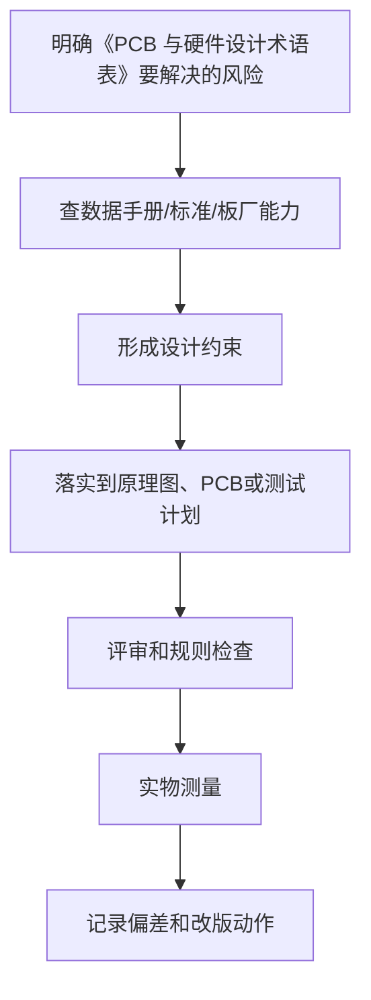

# 40 PCB 与硬件设计术语表

## 学习目标

学完本章，你应该能：

- 快速查阅 PCB、元器件、制造、信号、电源、调试相关术语。
- 看懂数据手册、板厂能力表和 EDA 设置中的常见英文词。
- 区分容易混淆的概念。

术语不是为了背诵，而是为了读文档、提问题和做设计评审时表达准确。

## 1. PCB 基础术语

| 术语 | 英文 | 解释 |
| :--- | :--- | :--- |
| 印制电路板 | PCB, Printed Circuit Board | 用铜箔、绝缘基材和孔连接器件的电路载体 |
| 原理图 | Schematic | 描述电气连接关系的图，不代表物理位置 |
| PCB 布局 | Placement | 在板上摆放元器件 |
| PCB 布线 | Routing | 用铜线、过孔、铺铜连接网络 |
| 网络 | Net | 原理图中电气相连的一组点 |
| 飞线 | Ratsnest / Airwire | PCB 中尚未布线但需要连接的提示线 |
| 板框 | Board Outline / Edge Cuts | PCB 外形边界 |
| 层叠 | Stackup | PCB 各铜层、介质层、阻焊层的结构 |
| 铜层 | Copper Layer | 用于走线、铺铜、平面的导电层 |
| 顶层 | Top Layer | PCB 正面铜层 |
| 底层 | Bottom Layer | PCB 背面铜层 |
| 内层 | Inner Layer | 多层板内部铜层 |
| 平面层 | Plane | 通常作为 GND 或电源的大面积铜层 |
| 铺铜 | Copper Pour / Zone | 大面积铜区域，可连接到指定网络 |
| 孤岛铜 | Copper Island | 没有有效连接的铜皮，通常应移除 |

## 2. 制造与工艺术语

| 术语 | 英文 | 解释 |
| :--- | :--- | :--- |
| 线宽 | Trace Width | 铜走线宽度 |
| 线距 | Clearance / Spacing | 两个导体之间的距离 |
| 孔径 | Drill Size | 钻孔直径 |
| 过孔外径 | Via Diameter | 过孔焊盘外径 |
| 孔环 | Annular Ring | 孔边缘到焊盘边缘的铜环宽度 |
| 阻焊 | Solder Mask | 覆盖铜皮、防止焊锡乱流的绝缘层 |
| 阻焊开窗 | Solder Mask Opening | 露出焊盘的阻焊层开口 |
| 丝印 | Silkscreen / Legend | 板上文字、符号、方向标识 |
| 表面处理 | Surface Finish | 焊盘表面工艺，如 HASL、ENIG |
| HASL | Hot Air Solder Leveling | 热风整平，常见低成本表面处理 |
| ENIG | Electroless Nickel Immersion Gold | 化学镍金，平整度好，适合细间距 |
| V-Cut | V-Score | V 型槽拼板分板方式 |
| 邮票孔 | Mouse Bite | 小孔连接的拼板分板方式 |
| 阻抗控制 | Impedance Control | 通过线宽、线距、介质厚度控制传输线阻抗 |
| Gerber | Gerber Files | PCB 制造图形文件 |
| Drill | Drill File | 钻孔文件 |
| BOM | Bill of Materials | 物料清单 |
| CPL | Component Placement List | 贴片坐标文件，也叫 Pick and Place |
| DFM | Design for Manufacturing | 面向制造的设计 |
| DFA | Design for Assembly | 面向装配的设计 |
| DFT | Design for Test | 面向测试的设计 |

## 3. 元器件与封装术语

| 术语 | 英文 | 解释 |
| :--- | :--- | :--- |
| 符号 | Symbol | 原理图中代表器件功能和引脚的图形 |
| 封装 | Footprint / Package | PCB 上焊盘和外形的物理定义 |
| 引脚 1 | Pin 1 | 器件方向定位基准 |
| 极性 | Polarity | 二极管、电解电容、LED 等方向属性 |
| 通孔 | Through Hole | 插件器件或贯穿孔 |
| 贴片 | SMD / SMT | 表面贴装器件或工艺 |
| 焊盘 | Pad | 焊接器件引脚的铜区域 |
| 焊膏层 | Paste Layer | 钢网开口使用的层 |
| Courtyard | Courtyard | 器件装配占位边界 |
| 3D 模型 | 3D Model | 用于机械检查的器件模型 |
| 替代料 | Alternative Part | 功能和封装兼容的备选器件 |
| MPN | Manufacturer Part Number | 厂商料号 |
| LCSC Part | LCSC 编号 | 立创商城器件编号 |

## 4. 电源术语

| 术语 | 英文 | 解释 |
| :--- | :--- | :--- |
| LDO | Low Dropout Regulator | 低压差线性稳压器 |
| DC-DC | Switching Regulator | 开关稳压器 |
| Buck | Step-down Converter | 降压转换器 |
| Boost | Step-up Converter | 升压转换器 |
| Buck-Boost | Buck-Boost Converter | 升降压转换器 |
| 纹波 | Ripple | 电源输出上的周期性波动 |
| 瞬态响应 | Transient Response | 负载变化时电源恢复能力 |
| 压差 | Dropout Voltage | LDO 输入输出最小压差 |
| 效率 | Efficiency | 输出功率与输入功率之比 |
| 静态电流 | Quiescent Current | 器件空闲时消耗的电流 |
| 使能 | Enable | 控制芯片开关的引脚 |
| 软启动 | Soft Start | 限制启动浪涌的功能 |
| 电源树 | Power Tree | 系统中各级电源转换关系 |
| 去耦 | Decoupling | 在芯片附近提供瞬态电流和降低噪声 |
| 旁路 | Bypass | 给高频噪声提供低阻抗路径 |
| 磁珠 | Ferrite Bead | 高频噪声抑制器件 |
| ESR | Equivalent Series Resistance | 电容等效串联电阻 |
| ESL | Equivalent Series Inductance | 电容等效串联电感 |

## 5. 接地、回流与噪声术语

| 术语 | 英文 | 解释 |
| :--- | :--- | :--- |
| 地 | Ground / GND | 电路参考点和电流返回路径 |
| 地平面 | Ground Plane | 大面积 GND 铜层 |
| 回流路径 | Return Path | 信号电流返回源端的路径 |
| 回路面积 | Loop Area | 正向路径和返回路径围成的面积 |
| 地弹 | Ground Bounce | 地电位因快速电流变化而跳动 |
| 共模噪声 | Common-mode Noise | 多根线相对于地同向变化的噪声 |
| 差模噪声 | Differential-mode Noise | 两根线之间的噪声 |
| 串扰 | Crosstalk | 相邻信号之间的耦合干扰 |
| 屏蔽 | Shielding | 用导体或结构降低干扰耦合 |
| 接地过孔 | Ground Via | 连接不同层 GND 的过孔 |
| 过孔栅栏 | Via Stitching / Via Fence | 用多颗 GND 过孔降低阻抗或隔离噪声 |

## 6. 信号完整性术语

| 术语 | 英文 | 解释 |
| :--- | :--- | :--- |
| 信号完整性 | Signal Integrity, SI | 信号能否以正确波形和时序到达 |
| 传输线 | Transmission Line | 走线长度相对边沿速度不可忽略的结构 |
| 特性阻抗 | Characteristic Impedance | 传输线本身的阻抗 |
| 反射 | Reflection | 阻抗不连续导致信号返回 |
| 端接 | Termination | 用电阻匹配或阻尼反射 |
| 源端串阻 | Series Termination | 在驱动端串联电阻减小振铃 |
| 过冲 | Overshoot | 信号超过目标高电平 |
| 下冲 | Undershoot | 信号低于目标低电平或地 |
| 振铃 | Ringing | 边沿后出现的震荡 |
| 抖动 | Jitter | 边沿时间的不稳定 |
| 偏斜 | Skew | 多根相关信号到达时间差 |
| 差分线 | Differential Pair | 用两根互补信号线传输 |
| 单端信号 | Single-ended Signal | 相对于地传输的单根信号 |
| 长度匹配 | Length Matching | 调整相关走线长度以控制时序差 |
| 蛇形线 | Meander | 为匹配长度而绕出的线形 |

## 7. EMC、ESD 与可靠性术语

| 术语 | 英文 | 解释 |
| :--- | :--- | :--- |
| EMI | Electromagnetic Interference | 电磁干扰发射 |
| EMC | Electromagnetic Compatibility | 电磁兼容，既不干扰别人也能抗干扰 |
| ESD | Electrostatic Discharge | 静电放电 |
| TVS | Transient Voltage Suppressor | 瞬态抑制二极管 |
| 浪涌 | Surge | 较大能量瞬态冲击 |
| EFT | Electrical Fast Transient | 电快速瞬变脉冲群 |
| 保险丝 | Fuse | 过流保护器件 |
| 自恢复保险丝 | PTC Fuse | 过流升温后阻值增大的保护器件 |
| 续流二极管 | Flyback Diode | 感性负载关断时释放能量的二极管 |
| RC 吸收 | RC Snubber | 抑制开关尖峰和振铃的 RC 网络 |
| 爬电距离 | Creepage | 沿绝缘表面的最短距离 |
| 电气间隙 | Clearance | 空气中的最短距离 |
| 降额 | Derating | 器件不按极限值使用，留可靠性余量 |

## 8. 调试与测量术语

| 术语 | 英文 | 解释 |
| :--- | :--- | :--- |
| 万用表 | Multimeter | 测电压、电流、电阻、通断 |
| 示波器 | Oscilloscope | 观察电压随时间变化 |
| 逻辑分析仪 | Logic Analyzer | 捕获数字信号时序 |
| 实验电源 | Bench Power Supply | 可调电压、电流限制的电源 |
| 限流 | Current Limit | 上电时限制最大电流 |
| 探头 | Probe | 示波器测量附件 |
| 地弹簧 | Ground Spring | 缩短探头接地路径的附件 |
| 测试点 | Test Point | 方便探针接触的焊盘或孔 |
| 热像仪 | Thermal Camera | 观察温度分布 |
| 复现 | Reproduce | 按步骤稳定重现问题 |
| 根因 | Root Cause | 真正导致问题的原因 |
| 临时修复 | Workaround | 暂时让系统工作的方法，不等于正式改版 |

## 9. EDA 与检查术语

| 术语 | 英文 | 解释 |
| :--- | :--- | :--- |
| ERC | Electrical Rule Check | 原理图电气规则检查 |
| DRC | Design Rule Check | PCB 设计规则检查 |
| Net Class | Net Class | 一组网络的统一规则 |
| Keepout | Keepout | 禁止布线或放置的区域 |
| Design Rule | Design Rule | 设计约束，如线宽、间距、过孔 |
| 反标注 | Back Annotation | 从 PCB 变化同步回原理图 |
| 正向标注 | Forward Annotation | 从原理图同步到 PCB |
| 封装库 | Footprint Library | 封装集合 |
| 符号库 | Symbol Library | 原理图符号集合 |
| 版本控制 | Version Control | 记录文件变更历史，如 Git |

## 10. 容易混淆的概念

| 概念 A | 概念 B | 区别 |
| :--- | :--- | :--- |
| 原理图正确 | PCB 可工作 | 原理图不包含布局、回流、噪声和制造细节 |
| DRC 通过 | 设计正确 | DRC 只检查规则，不判断电路功能 |
| GND 符号相同 | 回流路径合理 | 网络相同不代表物理路径短 |
| 去耦电容存在 | 去耦有效 | 位置和回路面积决定效果 |
| 板厂能做 | 适合量产 | 极限工艺可能成本高、良率低 |
| 频率低 | 没有高速问题 | 快速边沿也会带来 SI 和 EMI 问题 |
| 差分线等长 | 差分线合格 | 还要考虑阻抗、间距、参考平面和过孔 |
| 飞线修好 | 问题解决 | 飞线只是验证，正式版要改设计文件 |

## 本章总结

术语是硬件学习的索引。遇到不懂的英文词，不要只翻译字面意思，要回到它对应的物理含义、EDA 设置、板厂工艺或测试方法中理解。

## 参考与延伸阅读

- [KiCad PCB Editor 文档](https://docs.kicad.org/8.0/en/pcbnew/pcbnew.html)
- [JLCPCB PCB Capabilities](https://jlcpcb.com/capabilities/pcb-capabilities)
- [IPC 标准入口](https://www.ipc.org/meet-your-standards)
- [Analog Devices 混合信号 PCB 布局指南](https://www.analog.com/en/resources/analog-dialogue/articles/what-are-the-basic-guidelines-for-layout-design-of-mixed-signal-pcbs.html)
- [TI PCB Design Guidelines For Reduced EMI](https://www.ti.com/lit/an/szza009/szza009.pdf)
- [PCB 设计返回路径 / 回流路径实践说明](https://blog.csdn.net/weixin_45365488/article/details/134132810)

---

## 万字精讲扩展（2026-06-16 更新）
> Last researched: 2026-06-16。本文补充内容以入门到工程实践为主，数值和规则应在真实项目中继续以数据手册、板厂能力表、产品标准和实测结果校准。

### 本章在整套学习路线中的位置

《PCB 与硬件设计术语表》承担的是把局部知识放进完整硬件设计流程的作用。学习这一章时，不要只看定义，而要关注它怎样影响需求、选型、原理图、PCB、制造、装配、调试和改版。硬件设计的每个决定都会在后面的实物阶段兑现：原理图里少一个保护器件，可能在插拔时烧芯片；PCB 上去耦电容放远，可能在负载跳变时复位；封装核对不严，可能导致整批板子无法焊接；没有测试点，可能让一个本来十分钟能定位的问题拖成几天。

本章学习完成后，至少应能做到三件事。第一，能用自己的话解释关键概念，而不是只背术语。第二，能把概念转换成设计检查项，例如线宽、间距、去耦、回流、保护、测试点、BOM 字段或生产文件。第三，能在调试时根据现象反推可能原因，并用仪器或目检验证。只要这三件事能完成，这章就不再是静态笔记，而会变成你设计下一块板子的工具。

### 术语类笔记的精讲重点

术语表的价值不在于罗列名词，而在于消除沟通歧义。硬件设计里很多词在不同语境下含义不同，例如 GND 既可能指电路参考点，也可能指铜皮、平面、保护地或测量夹点；过孔可能是普通通孔、盲孔、埋孔、微孔或热过孔；阻抗既可能是直流电阻，也可能是传输线特性阻抗或电源网络阻抗。只背中文翻译，很容易在评审和调试时误解。

术语学习建议采用“三句话模板”：它是什么，它影响什么，工程上怎么检查。例如“回流路径”不是一个抽象词，而是信号或电源电流回到源头的实际路径；它影响环路面积、串扰、辐射和波形质量；检查时要沿着信号线查看参考平面是否连续、换层处是否有地过孔、是否跨越地缝。每个重要术语都应能落到这样的检查动作上。

术语还要标注适用边界。比如“星形接地”在低频大电流或音频系统中可能有意义，但在高速数字板上随意切地往往破坏回流；“模拟地和数字地分开”不等于把地平面切成两块，而是通过分区和布线纪律控制电流路径；“线宽越宽越好”对大电流成立，但对阻抗控制、密脚逃线和焊盘连接未必成立。术语表应服务于判断，而不是制造新的口号。

### 工程学习的底层方法

硬件学习最容易出现的偏差，是把知识点当成孤立名词背诵。真正能落地的学习方式，是把每个知识点放进同一条工程链路里理解：需求从哪里来，器件为什么这样选，原理图如何表达意图，PCB 如何把电气意图变成物理结构，制造和装配会怎样限制你的设计，调试时又如何证明假设成立。这个链路一旦建立，很多看似零散的规则会变成同一个目标的不同侧面：降低回路面积、控制电流路径、保证制造余量、保留测试入口、减少不确定性。

初学阶段不要追求一次学完所有高端主题。更稳妥的路线是先把低压、低速、小电流、少接口的板子做闭环。所谓闭环，不是画完 PCB 就结束，而是完成需求定义、器件选型、原理图、ERC、PCB、DRC、Gerber 检查、打样、焊接、上电、测量、故障记录和改版。每完成一次闭环，你对数据手册、封装、布局、布线、去耦、接地、调试的理解都会变得更具体。没有实物反馈时，很多规则只是口号；有了失败样板以后，规则才会变成可执行的判断。

学习时建议同时维护三类笔记。第一类是概念笔记，用自己的话解释术语，不直接复制资料原文。第二类是规则笔记，把板厂能力、器件要求、个人默认规则写成表格，并标注来源和适用边界。第三类是复盘笔记，记录每块板子的设计假设、测量数据、错误原因和下一版修改。硬件经验的价值往往不在“知道一个规则”，而在知道这个规则什么时候适用、什么时候不够、什么时候必须回到数据手册或标准重新计算。

### 从规则到判断：不要把经验值当标准

很多入门资料会给出 100 nF 去耦、45 度走线、线宽 0.2 mm、线距 0.2 mm、TVS 靠近接口、晶振靠近芯片等经验值。这些经验很有用，但它们不是脱离条件的真理。100 nF 的作用依赖电容封装、ESL、布局回路、电源阻抗和芯片瞬态电流；线宽取决于电流、铜厚、温升、压降、散热铜皮和工作环境；线距受制造能力、电压、安全规范、污染等级和产品要求影响。学习笔记里应当写清楚“为什么”和“边界”，而不是只写一个数字。

工程上可以采用四级依据。最高优先级是安全法规、产品标准和客户要求；其次是芯片数据手册、评估板、应用笔记和参考设计；再往下是板厂能力表、装配厂工艺能力和 EDA 规则；最后才是个人经验和论坛建议。社区经验可以帮助发现常见坑，但不能替代标准和厂商文档。尤其是高压、电池、大电流、电机、射频、高速总线、医疗和汽车场景，入门经验值通常不够，必须引入正式规范、仿真、评审和测试。

### 一个可复用的硬件闭环


Figure: PCB 学习闭环，综合 KiCad 官方流程、板厂 DFM 要求、TI/ADI 布局应用笔记和中文社区调试经验重新整理。

### 调试意识：把问题拆成可验证假设

调试不是“看到不工作就随机改”，而是把系统拆成一组可以测量的假设。电源是否到位，复位是否释放，时钟是否振荡，下载接口是否连通，GPIO 是否能翻转，通信波形是否符合电平和时序，模拟输入是否超量程，负载电流是否超过器件能力，每一步都应该有测量点、预期值和异常解释。硬件调试最忌讳同时改变多个变量，因为这样即使问题消失，也无法知道真正原因。

第一次上电建议采用限流电源，并把电流限值设成符合预期的保守值。先不上昂贵芯片或外部负载，先测裸板短路；再焊电源部分，测输入保护、稳压输出和纹波；再焊主控和下载接口；最后逐个启用传感器、通信接口和执行器。每一步都记录电压、电流、温度和波形截图。对于后续改版，测量记录比口头记忆可靠得多。

### 核心知识点逐条精讲

#### 1. PCB 基础术语

在《PCB 与硬件设计术语表》这一章里，`PCB 基础术语` 不是孤立知识点，而是一个需要落实到设计动作、检查动作和测试动作的工程对象。学习时先问三个问题：它解决什么风险，它依赖哪些前置条件，它失败时会表现成什么现象。比如一个规则如果用于 PCB，就要进一步落实到板框、封装、网络类、线宽线距、过孔、参考平面、测试点或生产文件；如果用于电路，就要落实到器件参数、工作条件、热、保护和测量方法。这样做可以避免只记住结论，却不知道如何在下一块板子上执行。

实践中建议把 `PCB 基础术语` 写成可检查条目，而不是写成笼统口号。可检查条目应包含对象、位置、数值或来源、验证方法和异常处理。例如“确认每个外部接口有合适保护”比“注意 ESD”更可执行；“确认 U1 每个 VDD 引脚旁边 1 至 3 mm 内有低 ESL 去耦路径，且地过孔靠近电容地端”比“加 100 nF”更接近工程要求。每个条目都要能在评审时被勾选，在调试时被测量，在改版时被追踪。

当 `PCB 基础术语` 与其他规则冲突时，应按约束优先级处理。安全和法规高于性能，数据手册高于经验，板厂能力高于个人习惯，实际测量高于未经验证的猜测。很多设计取舍没有唯一答案，例如更宽的线有利于电流和压降，却可能破坏阻抗或增加布线困难；更强的滤波有利于噪声，却可能降低响应速度或影响启动；更密的布局有利于面积，却可能损害焊接、返修和散热。笔记要记录取舍理由，而不是只留下最后结果。

#### 2. 制造工艺术语

在《PCB 与硬件设计术语表》这一章里，`制造工艺术语` 不是孤立知识点，而是一个需要落实到设计动作、检查动作和测试动作的工程对象。学习时先问三个问题：它解决什么风险，它依赖哪些前置条件，它失败时会表现成什么现象。比如一个规则如果用于 PCB，就要进一步落实到板框、封装、网络类、线宽线距、过孔、参考平面、测试点或生产文件；如果用于电路，就要落实到器件参数、工作条件、热、保护和测量方法。这样做可以避免只记住结论，却不知道如何在下一块板子上执行。

实践中建议把 `制造工艺术语` 写成可检查条目，而不是写成笼统口号。可检查条目应包含对象、位置、数值或来源、验证方法和异常处理。例如“确认每个外部接口有合适保护”比“注意 ESD”更可执行；“确认 U1 每个 VDD 引脚旁边 1 至 3 mm 内有低 ESL 去耦路径，且地过孔靠近电容地端”比“加 100 nF”更接近工程要求。每个条目都要能在评审时被勾选，在调试时被测量，在改版时被追踪。

当 `制造工艺术语` 与其他规则冲突时，应按约束优先级处理。安全和法规高于性能，数据手册高于经验，板厂能力高于个人习惯，实际测量高于未经验证的猜测。很多设计取舍没有唯一答案，例如更宽的线有利于电流和压降，却可能破坏阻抗或增加布线困难；更强的滤波有利于噪声，却可能降低响应速度或影响启动；更密的布局有利于面积，却可能损害焊接、返修和散热。笔记要记录取舍理由，而不是只留下最后结果。

#### 3. 电源接地术语

在《PCB 与硬件设计术语表》这一章里，`电源接地术语` 不是孤立知识点，而是一个需要落实到设计动作、检查动作和测试动作的工程对象。学习时先问三个问题：它解决什么风险，它依赖哪些前置条件，它失败时会表现成什么现象。比如一个规则如果用于 PCB，就要进一步落实到板框、封装、网络类、线宽线距、过孔、参考平面、测试点或生产文件；如果用于电路，就要落实到器件参数、工作条件、热、保护和测量方法。这样做可以避免只记住结论，却不知道如何在下一块板子上执行。

实践中建议把 `电源接地术语` 写成可检查条目，而不是写成笼统口号。可检查条目应包含对象、位置、数值或来源、验证方法和异常处理。例如“确认每个外部接口有合适保护”比“注意 ESD”更可执行；“确认 U1 每个 VDD 引脚旁边 1 至 3 mm 内有低 ESL 去耦路径，且地过孔靠近电容地端”比“加 100 nF”更接近工程要求。每个条目都要能在评审时被勾选，在调试时被测量，在改版时被追踪。

当 `电源接地术语` 与其他规则冲突时，应按约束优先级处理。安全和法规高于性能，数据手册高于经验，板厂能力高于个人习惯，实际测量高于未经验证的猜测。很多设计取舍没有唯一答案，例如更宽的线有利于电流和压降，却可能破坏阻抗或增加布线困难；更强的滤波有利于噪声，却可能降低响应速度或影响启动；更密的布局有利于面积，却可能损害焊接、返修和散热。笔记要记录取舍理由，而不是只留下最后结果。

#### 4. SI/EMC 术语

在《PCB 与硬件设计术语表》这一章里，`SI/EMC 术语` 不是孤立知识点，而是一个需要落实到设计动作、检查动作和测试动作的工程对象。学习时先问三个问题：它解决什么风险，它依赖哪些前置条件，它失败时会表现成什么现象。比如一个规则如果用于 PCB，就要进一步落实到板框、封装、网络类、线宽线距、过孔、参考平面、测试点或生产文件；如果用于电路，就要落实到器件参数、工作条件、热、保护和测量方法。这样做可以避免只记住结论，却不知道如何在下一块板子上执行。

实践中建议把 `SI/EMC 术语` 写成可检查条目，而不是写成笼统口号。可检查条目应包含对象、位置、数值或来源、验证方法和异常处理。例如“确认每个外部接口有合适保护”比“注意 ESD”更可执行；“确认 U1 每个 VDD 引脚旁边 1 至 3 mm 内有低 ESL 去耦路径，且地过孔靠近电容地端”比“加 100 nF”更接近工程要求。每个条目都要能在评审时被勾选，在调试时被测量，在改版时被追踪。

当 `SI/EMC 术语` 与其他规则冲突时，应按约束优先级处理。安全和法规高于性能，数据手册高于经验，板厂能力高于个人习惯，实际测量高于未经验证的猜测。很多设计取舍没有唯一答案，例如更宽的线有利于电流和压降，却可能破坏阻抗或增加布线困难；更强的滤波有利于噪声，却可能降低响应速度或影响启动；更密的布局有利于面积，却可能损害焊接、返修和散热。笔记要记录取舍理由，而不是只留下最后结果。

#### 5. 易混概念

在《PCB 与硬件设计术语表》这一章里，`易混概念` 不是孤立知识点，而是一个需要落实到设计动作、检查动作和测试动作的工程对象。学习时先问三个问题：它解决什么风险，它依赖哪些前置条件，它失败时会表现成什么现象。比如一个规则如果用于 PCB，就要进一步落实到板框、封装、网络类、线宽线距、过孔、参考平面、测试点或生产文件；如果用于电路，就要落实到器件参数、工作条件、热、保护和测量方法。这样做可以避免只记住结论，却不知道如何在下一块板子上执行。

实践中建议把 `易混概念` 写成可检查条目，而不是写成笼统口号。可检查条目应包含对象、位置、数值或来源、验证方法和异常处理。例如“确认每个外部接口有合适保护”比“注意 ESD”更可执行；“确认 U1 每个 VDD 引脚旁边 1 至 3 mm 内有低 ESL 去耦路径，且地过孔靠近电容地端”比“加 100 nF”更接近工程要求。每个条目都要能在评审时被勾选，在调试时被测量，在改版时被追踪。

当 `易混概念` 与其他规则冲突时，应按约束优先级处理。安全和法规高于性能，数据手册高于经验，板厂能力高于个人习惯，实际测量高于未经验证的猜测。很多设计取舍没有唯一答案，例如更宽的线有利于电流和压降，却可能破坏阻抗或增加布线困难；更强的滤波有利于噪声，却可能降低响应速度或影响启动；更密的布局有利于面积，却可能损害焊接、返修和散热。笔记要记录取舍理由，而不是只留下最后结果。


### 场景化判断表

| 场景 | 推荐处理 | 典型风险 | 验证方式 |
| :--- | :--- | :--- | :--- |
| PCB 基础术语 | 先查数据手册、板厂能力或测试目标，再转成 EDA 规则和评审项 | 只凭经验值、没有来源、没有验证方法 | 设计评审、DRC、上电测试和改版复盘 |
| 制造工艺术语 | 先查数据手册、板厂能力或测试目标，再转成 EDA 规则和评审项 | 只凭经验值、没有来源、没有验证方法 | 设计评审、DRC、上电测试和改版复盘 |
| 电源接地术语 | 先查数据手册、板厂能力或测试目标，再转成 EDA 规则和评审项 | 只凭经验值、没有来源、没有验证方法 | 设计评审、DRC、上电测试和改版复盘 |
| SI/EMC 术语 | 先查数据手册、板厂能力或测试目标，再转成 EDA 规则和评审项 | 只凭经验值、没有来源、没有验证方法 | 设计评审、DRC、上电测试和改版复盘 |
| 易混概念 | 先查数据手册、板厂能力或测试目标，再转成 EDA 规则和评审项 | 只凭经验值、没有来源、没有验证方法 | 设计评审、DRC、上电测试和改版复盘 |

表格里的“推荐处理”不是固定答案，而是提醒你把每个问题落到来源、约束和验证。硬件工程里最危险的状态不是不知道，而是以为某个经验值在所有场景都成立。每当项目电压、电流、速度、温度、线缆长度、外部环境、制造厂家或装配方式变化时，都应该重新检查这些条目。

### 本章建议工作流



Figure: 《PCB 与硬件设计术语表》学习和实践工作流，综合官方文档、厂商应用笔记和板厂 DFM 资料整理。

这个工作流的重点是“先约束，后执行，再验证”。例如你要决定线宽，就不要只问别人用多少，而要先知道电流、铜厚、温升、压降和板厂能力；你要决定去耦，就不要只看电容值，而要看瞬态电流路径、封装 ESL、过孔位置和参考平面；你要决定接口保护，就要看接口是否出板、线缆长度、人体接触概率、芯片耐受能力和保护器件泄放路径。只要按这个流程写笔记，每一章都会从知识介绍变成工程方法。

### 常见误区和纠正方法

- 误区：把 DRC 通过当作设计正确。纠正：DRC 只能检查你已经设置的规则，不能理解电路意图；设计正确还需要数据手册核对、布局评审、回流路径检查、制造文件检查和实物测试。
- 误区：把社区经验当成标准。纠正：社区经验适合发现问题和启发思路，最终参数要回到官方文档、板厂能力、器件数据手册和实测结果。
- 误区：只关注能不能工作，不关注能不能维护。纠正：学习阶段就要保留丝印、测试点、版本号、BOM 信息和复盘记录，否则下一次遇到同类问题仍然要从头猜。
- 误区：只看电气连接，不看物理路径。纠正：PCB 中的电流路径、回流路径、寄生电感、寄生电容、热路径和装配空间都会影响结果，原理图正确只是起点。
- 误区：追求一次完美。纠正：硬件设计天然需要迭代，关键是让每次迭代有明确假设、测量证据和改版记录。

### 与相邻章节的关系

《PCB 与硬件设计术语表》应与前后章节交叉学习。向前看，它依赖基础电学、器件参数和数据手册阅读；向后看，它会影响 PCB 布局布线、制造装配、调试排障和版本管理。比如你在本章学到一个布局规则，应当回到元器件章节确认器件要求，再到 PCB 规则章节设置约束，再到调试章节设计测量点。这样多个笔记之间会形成网络，而不是彼此孤立。

如果某个概念暂时难以完全理解，不要停留在抽象层面反复阅读，可以通过低风险实验建立直觉。低压 LED 板、按键板、传感器板、MCU 最小系统板、MOSFET 负载板和小型 Buck 板都适合作为验证平台。每块板只重点验证两三个主题，效果通常比一块板塞满所有功能更好。


### 实操训练和复盘模板

1. 选一个真实小项目，围绕 `PCB 基础术语` 写一条设计假设、一个检查方法和一个测量方法。
2. 选一个真实小项目，围绕 `制造工艺术语` 写一条设计假设、一个检查方法和一个测量方法。
3. 选一个真实小项目，围绕 `电源接地术语` 写一条设计假设、一个检查方法和一个测量方法。
4. 选一个真实小项目，围绕 `SI/EMC 术语` 写一条设计假设、一个检查方法和一个测量方法。
5. 选一个真实小项目，围绕 `易混概念` 写一条设计假设、一个检查方法和一个测量方法。建议每次练习都输出一页复盘，格式如下：

```text
项目名称：
本章主题：PCB 与硬件设计术语表
设计假设：
依据来源：数据手册 / 标准 / 板厂能力 / 应用笔记 / 实测经验
实施位置：原理图页码、PCB 区域、BOM 行、测试点编号
预期结果：
实际测量：
偏差原因：
下一版修改：
```

这个模板看起来简单，但能强迫你把“我觉得”变成“我依据什么、做在哪里、测到了什么、下一步怎么改”。硬件学习最怕只留下模糊印象，复盘模板能把每一次小失败转化成下一版的规则。

## 参考资料与延伸阅读

- [Standard / IPC] IPC-2221B Preview: Generic Standard on Printed Board Design: https://webstore.ansi.org/preview-pages/IPC/preview_IPC%2B2221B-2012.pdf
- [Standard / ANSI] IPC-2152, Current Carrying Capacity in Printed Board Design: https://blog.ansi.org/ansi/ipc-2152-current-carrying-capacity-in-pcbs/
- [Tool / Official] KiCad 9.0 PCB Editor Documentation: https://docs.kicad.org/9.0/en/pcbnew/pcbnew.html
- [Tool / Official] Getting Started in KiCad 9.0: https://docs.kicad.org/9.0/en/getting_started_in_kicad/getting_started_in_kicad.html
- [Vendor / TI] PCB Design Guidelines For Reduced EMI: https://www.ti.com/lit/pdf/szza009
- [Vendor / TI] High Speed Layout Guidelines: https://www.ti.com/lit/pdf/scaa082
- [Vendor / TI] AN-1149 Layout Guidelines for Switching Power Supplies: https://www.ti.com/lit/pdf/snva021
- [Vendor / TI] PCB layout guidelines to optimize power supply performance: https://www.ti.com/lit/ml/slyp762/slyp762.pdf
- [Vendor / TI] Grounding in mixed-signal systems demystified, Part 2: https://www.ti.com/lit/pdf/slyt512
- [Vendor / Analog Devices] MT-031 Grounding Data Converters: https://www.analog.com/media/en/training-seminars/tutorials/MT-031.pdf
- [Vendor / Analog Devices] MT-101 Decoupling Techniques: https://www.analog.com/media/en/training-seminars/tutorials/MT-101.pdf
- [Vendor / Microchip] Basic 16-Bit MCU Design and Troubleshooting Checklist: https://ww1.microchip.com/downloads/aemDocuments/documents/MCU16/ProductDocuments/SupportingCollateral/Basic-16-Bit-MCU-Design-and-Troubleshooting-Checklist-DS50003274.pdf
- [Fab / PCBWay] PCB Manufacturing Tolerances: https://www.pcbway.com/pcb_prototype/PCB_Manufacturing_tolerances.html
- [Fab / PCBWay] PCB Design Rule Check: https://www.pcbway.com/pcb_prototype/PCB_Design_Rule_Check.html
- [Fab / OSH Park] Fabrication Services Design Rules: https://docs.oshpark.com/services/
- [Fab / Eurocircuits] PCB Design Guidelines: https://www.eurocircuits.com/technical-guidelines/pcb-design-guidelines/
- [Fab / Eurocircuits] Track Width and Isolation Gap Tolerances: https://www.eurocircuits.com/technical-guidelines/understanding-manufacturing-tolerances-on-a-pcb/track-width-and-isolation-gap-tolerances/
- [Community / 博客园] AD 学习笔记（基础）: https://www.cnblogs.com/Roboduster/p/15329893.html
- [Community / 博客园] Altium Designer PCB 文件的绘制（上：PCB 基础和布局）: https://www.cnblogs.com/zhjblogs/p/14172536.html
- [Community / CSDN] PCB 学习笔记: https://blog.csdn.net/weixin_51933819/article/details/122512816
- [Community / CSDN] PCB 布局布线要求及多层电路板叠加原则: https://blog.csdn.net/Ka_wyb/article/details/142337253
- [Community / 掘金] PCB 设计和布局: https://juejin.cn/post/7612948192174817295
- [Community / 掘金] 芯片电源引脚为什么要加一个 100nF 的电容: https://juejin.cn/post/7325069743144108073
- [Community / 电子工程专辑] 5 步搞定 PCB 调试: https://www.eet-china.com/mp/a393354.html

<!-- research-notes: enhanced-v1 -->

## 研究笔记增强

> Last reviewed: 2026-06-17。此节用于把《40 PCB 与硬件设计术语表》从阅读笔记推进到可复习、可实践、可验证的研究笔记；具体版本、参数和环境仍需结合官方资料、项目约束和实测结果校准。

### 知识定位

把原理图、数据手册、布局布线、制造能力、测试验证和失效分析连起来。

### 重点补充
- 从需求、电源、接口、保护、时钟、复位和调试口建立系统框图。
- 关键参数回到数据手册、参考设计、板厂能力和实测结果。
- 布局布线同时考虑回流路径、去耦、阻抗、热、EMI/EMC 和可制造性。
- 明确适用场景、限制条件、替代方案和迁移成本。

### 实践清单
- 为本章整理一张概念关系图、流程图或最小系统图。
- 写一个最小可运行示例，并保留运行命令、输入、输出和环境版本。
- 列出常见错误、排查命令、关键日志和修复动作。
- 补充安全、性能、兼容性、可维护性和上线运维注意事项。
- 用一次真实问题或练习项目复盘验证笔记是否可用。

### 常见误区
- 只摘抄定义或命令，没有记录上下文、前提条件和边界。
- 只记录成功路径，不记录失败样本、异常现象和排查过程。
- 没有版本、环境和数据样本，导致后续无法复现。
- 把教程默认值直接用于真实项目，没有结合约束重新评估。

### 复盘问题
- 学完《40 PCB 与硬件设计术语表》后，能否用自己的话说明它解决什么问题、不解决什么问题？
- 如果要在真实项目中使用，需要哪些前置条件、依赖版本、输入数据和验证手段？
- 失败时最先检查哪三类证据：日志、指标、抓包、堆栈、配置、样本还是硬件测量？
- 有没有形成可重复的最小实验、测试用例或排查命令？

### 延伸方向
- 官方文档和版本变更记录。
- 同类技术、框架或方案对比。
- 面向真实项目的最小实践。
- 故障排查清单和复盘案例库。

### 复盘记录模板

```text
主题：40 PCB 与硬件设计术语表
日期：
目标：本次要验证或掌握的具体问题
环境：系统 / 语言 / 框架 / 工具 / 设备 / 版本
步骤：最小可复现流程
现象：成功输出、失败输出、日志、指标或测量数据
分析：为什么会出现该现象，和哪些概念相关
结论：可复用的规则、命令、配置或设计取舍
风险：边界条件、性能、安全、兼容性或维护成本
下一步：继续实验、补充资料或应用到项目
```
