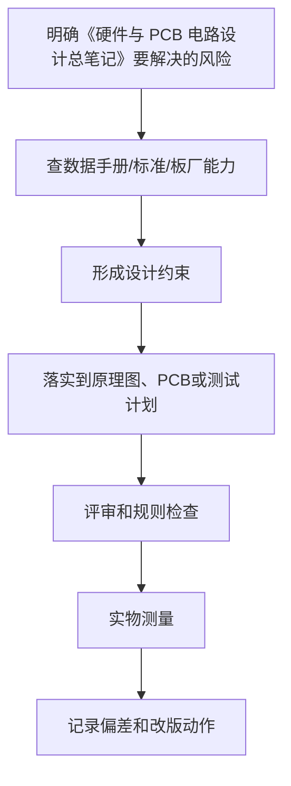

# 硬件与 PCB 电路设计学习笔记

<!-- lecture-notes:integrated-v2 -->

## 讲义导读：把电路变成能工作的板子

这一章讲的是 **硬件与 PCB 电路设计学习笔记**，属于 **硬件 PCB 学习路线**。学习硬件和 PCB 时，不要只看“这根线怎么连”，而要把它当成一次工程闭环：需求是什么，电路原理是否成立，器件是否选对，封装是否可靠，PCB 规则是否符合板厂能力，电源和地怎么走，信号回流在哪里，上电后用什么证据证明它稳定工作。

### 一句话先懂

路线类章节要先建立硬件闭环：需求是否清楚，电路是否能解释，PCB 是否能制造，上电是否有检查，问题是否能复盘。

初学时先问三个问题：这部分电路要完成什么功能；最坏电压、电流、温度、频率和误差在哪里；如果板子不工作，我能从哪个测试点或波形开始定位。

### 通俗类比

做 PCB 像规划一座小城市：原理图是功能规划，器件是建筑，走线是道路，电源是供水供电，地平面是公共基准，回流路径像车辆回程路线，制造规则像施工规范。

类比只是入门扶手。真正设计时，要回到电流路径、阻抗、功耗、热、封装、间距、线宽、层叠、回流路径、测试点和制造公差这些可计算、可测量、可检查的对象上。

### 本章学习主线

1. **先定需求和边界**：输入/输出、电压电流、接口、环境、尺寸、成本、安全和可制造性要求是什么？
2. **再读数据手册**：绝对最大额定值、推荐工作条件、典型应用、封装、热阻、布局建议和禁忌分别在哪里？
3. **然后画原理图**：电源树、保护、时钟、复位、接口、测试点和关键网络命名是否清楚？
4. **接着做 PCB**：先定层叠和规则，再布局关键器件，最后按电源、回流、敏感信号、高速信号和制造约束布线。
5. **最后验证实物**：ERC/DRC/DFM、Gerber、BOM、装配图、上电计划、测量记录和复盘缺一不可。

### 本章重点抓手

学习顺序、知识地图、项目选择、资料来源、常用术语、完整流程和新手避坑。

### 最小实践任务

用一个最小项目做学习主线，例如电源小板、传感器小板或 MCU 最小系统，每学一章都回到这块板上验证。

建议每次设计都保留“设计理由”：为什么选这个器件，为什么这样放置，为什么这条线这么宽，为什么这个电容离引脚这么近，为什么这个测试点必须保留。硬件学习的关键不是画出一块板，而是能解释每个设计选择，并能在实物上验证。

### 常见误区

- 只会连线，不知道电流和回流路径怎么走。
- 只看典型应用图，不读绝对最大额定值、推荐工作条件和布局建议。
- 画完板不做 ERC/DRC/DFM、检查清单和上电预案。

### 推荐工具

KiCad/Altium、万用表、示波器、逻辑分析仪、稳压电源、电子负载、热像仪、LCR 表、Gerber viewer、厂商 DFM 检查。

### 读完本章应该能做到

- 用自己的话解释本章概念，并指出它影响功能、可靠性、制造、调试还是成本。
- 给出一个最小设计例子，说明原理图、PCB、BOM 和测试方法如何对应。
- 说清至少一个常见硬件故障的现象、可能原因、测量方法和修复方向。
- 把经验规则落到数据手册、IPC/板厂规则、仿真或实测证据上。

> 本节是讲义化改写后的阅读入口。后续正文中的电路、规则、清单和参考资料，都应围绕“需求边界 + 数据手册 + PCB 规则 + 实物验证”来理解。

> 适合对象：想从零开始学习电子硬件、原理图设计、PCB 绘制、打样、焊接和调试的人。
这份文档是一份系统学习笔记，不是只讲“怎么画 PCB”。真正能做出可工作的电路板，需要同时理解电子基础、元器件、电源、信号、接口、原理图、PCB 布局布线、制造工艺、焊接调试和安全规范。

如果你是零基础，建议先不要直接挑战高速板、射频板、大功率电源、220V 市电、锂电池快充、四层以上复杂板。先从低压、低速、简单功能板开始，例如 LED 控制板、按键输入板、传感器采集板、单片机最小系统板。

## 目录

1. 硬件学习到底学什么
2. 新手学习路线总览
3. 安全基础
4. 数学与物理基础
5. 电路基础
6. 常见元器件
7. 数据手册阅读
8. 常用工具与仪器
9. 原理图设计基础
10. PCB 设计基础
11. PCB 制造工艺基础
12. PCB 层叠结构
13. PCB 布局原则
14. PCB 布线原则
15. 电源设计基础
16. 接地、回流路径与去耦
17. 模拟电路设计基础
18. 数字电路设计基础
19. 单片机与嵌入式硬件
20. 常见通信接口
21. 传感器与执行器
22. 电机、继电器和大电流负载
23. 信号完整性基础
24. 电源完整性基础
25. EMI / EMC 基础
26. 热设计基础
27. DFM、DFA、DFT
28. 物料、封装和供应链
29. 打样、焊接与装配
30. 调试与故障排查
31. 版本管理与硬件文档
32. KiCad 学习重点
33. 从 0 到 1 画一块 PCB 的完整流程
34. 初学者推荐项目
35. PCB 设计检查清单
36. 常见错误
37. 学习资料与参考链接
38. PCB 工程规则速查
39. 设计评审、上电与复盘模板
40. PCB 与硬件设计术语表

## 1. 硬件学习到底学什么

很多人以为学习 PCB 就是学一个软件，例如 KiCad、Altium Designer、立创 EDA。实际上，EDA 软件只是工具，真正重要的是电路设计能力和工程判断能力。

硬件学习可以拆成几层：

| 层级 | 要学什么 | 目标 |
| :--- | :--- | :--- |
| 电子基础 | 电压、电流、电阻、电容、电感、二极管、三极管、MOSFET | 能看懂基本电路 |
| 电路分析 | 欧姆定律、基尔霍夫定律、分压、滤波、RC 时间常数 | 能估算电路参数 |
| 元器件 | 电阻、电容、电感、IC、连接器、传感器、保护器件 | 会选型、会看规格 |
| 数据手册 | 引脚、推荐电路、绝对最大额定值、时序、封装 | 能按芯片要求设计外围 |
| 原理图 | 电路模块划分、网络连接、电源树、接口定义 | 能表达电路逻辑 |
| PCB 布局 | 元件位置、电源路径、接口位置、信号分区 | 让电路物理结构合理 |
| PCB 布线 | 走线宽度、间距、过孔、回流路径、阻抗 | 让信号和电源可靠传输 |
| 制造工艺 | 板厚、层数、铜厚、线宽线距、孔径、阻焊、丝印 | 确保板子能生产 |
| 焊接装配 | 封装选择、焊盘、钢网、贴片、手焊 | 确保板子能装起来 |
| 调试测试 | 万用表、示波器、逻辑分析仪、电源、热像 | 找出问题并验证设计 |
| 可靠性 | ESD、防反接、过流、过压、热、EMI | 让产品长期稳定 |

一句话总结：

> PCB 不是把线连起来，而是把电路变成真实世界中稳定工作的物理系统。

## 2. 新手学习路线总览

### 阶段 1：电子基础入门

目标：

- 看懂电压、电流、电阻的关系
- 会用万用表测电压、电阻、通断
- 能搭建 LED、电阻、按键、蜂鸣器等简单电路

需要学习：

- 欧姆定律
- 串联、并联
- 分压和限流
- 电容充放电
- 二极管和 LED
- 三极管和 MOSFET 基础
- 万用表使用

推荐练习：

- 用电阻限流点亮 LED
- 用按键控制 LED
- 用三极管控制蜂鸣器
- 用 MOSFET 控制小灯或小电机

### 阶段 2：元器件与数据手册

目标：

- 能根据需求选择常见器件
- 能看懂芯片引脚和推荐电路
- 知道绝对最大额定值不能当正常工作条件

需要学习：

- 电阻、电容、电感参数
- 二极管、稳压管、TVS
- 三极管、MOSFET
- LDO、DC-DC
- MCU、传感器
- 连接器和开关
- 封装类型
- 数据手册结构

推荐练习：

- 找 5 个常见芯片的数据手册
- 画出它们的电源、地、输入、输出、推荐外围
- 总结每个芯片的供电范围和关键引脚

### 阶段 3：原理图设计

目标：

- 会用 EDA 软件画清楚原理图
- 能把电路分成电源、主控、接口、传感器、输出等模块
- 能做 ERC 检查

需要学习：

- 符号库
- 网络标签
- 电源符号
- 参考设计ator
- 分层原理图
- ERC
- BOM
- Netlist

推荐练习：

- 画一个 LED 控制板原理图
- 画一个按键输入板原理图
- 画一个单片机最小系统原理图

### 阶段 4：PCB 布局布线

目标：

- 能把原理图转成 PCB
- 会设置板框、线宽、间距、过孔
- 会完成简单双层板布线
- 会铺铜、做 DRC、导出 Gerber

需要学习：

- PCB 层
- 板框
- 封装
- 飞线
- 走线
- 过孔
- 铺铜
- 设计规则
- DRC
- Gerber
- Drill 文件

推荐练习：

- 完成一块 LED 控制板 PCB
- 完成一块 USB 转串口小板
- 完成一块单片机最小系统板

### 阶段 5：打样、焊接、调试

目标：

- 会下单 PCB
- 会准备 BOM 和贴片文件
- 会手焊常见器件
- 会用仪器排查问题

需要学习：

- Gerber 检查
- BOM
- Pick and Place / CPL
- 手焊
- 回流焊基础
- 万用表
- 示波器
- 逻辑分析仪
- 上电检查
- 短路排查

推荐练习：

- 自己打一块简单板
- 手焊元件
- 测量电源电压
- 下载程序
- 验证每个接口

### 阶段 6：进阶专题

目标：

- 能处理更复杂的真实项目

需要学习：

- 电源完整性
- 信号完整性
- 高速接口
- 差分线
- 阻抗控制
- EMI / EMC
- 热设计
- 安规
- DFM / DFA / DFT
- 可靠性设计

## 3. 安全基础

硬件学习必须先讲安全。软件写错最多崩溃，硬件做错可能烧板、烫伤、起火，甚至触电。

### 3.1 新手不要碰的内容

零基础阶段不要直接做：

- 220V / 110V 市电电路
- 开关电源原边高压部分
- 大容量锂电池充放电
- 大功率电机驱动
- 高压升压电路
- 电动车、电池包、逆变器
- 医疗、汽车、航空相关电路

如果必须接触这些内容，需要有经验的人指导，并使用隔离电源、保险丝、保护外壳、合适的测试工具。

### 3.2 常见危险

| 危险 | 说明 | 预防 |
| :--- | :--- | :--- |
| 触电 | 高压或市电可能致命 | 新手只做低压直流电路 |
| 短路 | 电源正负极直接连通 | 上电前测阻抗，使用限流电源 |
| 过流 | 电流超过器件承受能力 | 加保险丝、限流、保护电路 |
| 过热 | 器件或导线温度过高 | 计算功耗，留散热铜皮 |
| 反接 | 电源极性接反 | 加防反接二极管或 MOSFET |
| ESD | 静电损坏芯片 | 戴防静电手环，正确存放芯片 |
| 电池起火 | 锂电池短路或过充 | 使用保护板和正规充电芯片 |
| 烙铁烫伤 | 烙铁头温度很高 | 使用烙铁架，工作区整洁 |

### 3.3 新手推荐电压范围

建议从这些安全低压开始：

- 3.3V
- 5V
- 9V
- 12V

电流也要控制。刚开始使用实验电源时，建议设置限流，例如 100mA、300mA、500mA，根据电路逐步增加。

### 3.4 上电前安全检查

每次第一次上电前检查：

- 电源正负极是否正确
- 供电电压是否符合芯片要求
- 是否有明显焊锡短路
- 电源和地之间是否短路
- 电解电容、二极管、芯片方向是否正确
- 是否有发热风险
- 实验电源是否设置限流

## 4. 数学与物理基础

硬件设计不要求一开始学很深的数学，但基本计算必须会。

### 4.1 必须掌握的数学

| 内容 | 用途 | 例子 |
| :--- | :--- | :--- |
| 四则运算 | 基础计算 | 电阻、电流、电压 |
| 比例 | 分压、放大倍数 | 两个电阻分压 |
| 单位换算 | 读参数 | mA、uA、kΩ、uF |
| 指数和科学计数法 | 数据手册常用 | 1e-6 F = 1uF |
| 对数基础 | 分贝、滤波器 | dB、增益 |
| 三角函数 | 交流电、相位 | 正弦波 |
| 微积分基础 | 电容电感、信号 | 不必一开始深入 |

### 4.2 常见单位

| 单位 | 含义 | 常见换算 |
| :--- | :--- | :--- |
| V | 电压 | 1V = 1000mV |
| A | 电流 | 1A = 1000mA |
| Ω | 电阻 | 1kΩ = 1000Ω |
| F | 电容 | 1uF = 1000nF = 1000000pF |
| H | 电感 | 1mH = 1000uH |
| W | 功率 | P = U x I |
| Hz | 频率 | 1MHz = 1000kHz |
| dB | 分贝 | 表示比例，常用于增益和衰减 |

### 4.3 工程单位前缀

| 前缀 | 符号 | 倍率 | 例子 |
| :--- | :--- | :--- | :--- |
| Giga | G | 10^9 | GHz |
| Mega | M | 10^6 | MHz、MΩ |
| kilo | k | 10^3 | kΩ |
| milli | m | 10^-3 | mA、mV |
| micro | u / μ | 10^-6 | uF、uA |
| nano | n | 10^-9 | nF |
| pico | p | 10^-12 | pF |

注意：

- `MΩ` 是兆欧，`mΩ` 是毫欧，大小差很多。
- 中文输入中 `μ` 不方便时常写成 `u`，例如 `10uF`。

## 5. 电路基础

### 5.1 电压、电流、电阻

| 概念 | 含义 | 类比 |
| :--- | :--- | :--- |
| 电压 | 推动电荷流动的“压力” | 水压 |
| 电流 | 电荷流动的多少 | 水流量 |
| 电阻 | 阻碍电流流动 | 水管阻力 |

核心公式：

```text
U = I x R
I = U / R
R = U / I
```

例子：

一个 LED 需要 10mA 电流，电源是 5V，LED 正向压降约 2V，则限流电阻：

```text
R = (5V - 2V) / 0.01A = 300Ω
```

可以选常见阻值 330Ω。

### 5.2 功率

功率表示能量消耗或转换速度。

公式：

```text
P = U x I
P = I^2 x R
P = U^2 / R
```

例子：

一个 100Ω 电阻流过 0.1A：

```text
P = I^2 x R = 0.1 x 0.1 x 100 = 1W
```

这时不能用普通 1/4W 电阻，否则会发热甚至烧坏。

### 5.3 串联和并联

串联：

- 电流相同
- 电压分配
- 总电阻等于各电阻相加

并联：

- 电压相同
- 电流分配
- 总电阻小于任意一个支路电阻

### 5.4 分压电路

两个电阻串联可以得到中间电压。

公式：

```text
Vout = Vin x R2 / (R1 + R2)
```

用途：

- 电池电压检测
- 传感器电压缩放
- 设置参考电压

注意：

分压电阻会持续耗电。电阻太小耗电大，电阻太大容易受噪声和输入阻抗影响。

### 5.5 电容

电容可以储存电荷，常用于滤波、去耦、延时。

常见用途：

- 电源去耦
- 输入输出滤波
- 信号耦合
- RC 延时
- 储能

常见参数：

- 容值
- 耐压
- 精度
- 材质
- ESR
- 封装

注意：

电容耐压要留余量。5V 电路不要选 6.3V 电容作为唯一选择，工程上常留更高余量。

### 5.6 电感

电感抵抗电流变化，常用于滤波、DC-DC、电源 EMI 抑制。

常见参数：

- 电感量
- 饱和电流
- 直流电阻 DCR
- 额定电流
- 封装

注意：

电感不是只看电感量。DC-DC 中电感饱和会导致电源异常甚至烧毁。

### 5.7 二极管

二极管通常只允许电流单向流动。

常见类型：

- 普通二极管
- 肖特基二极管
- 稳压二极管
- TVS 二极管
- LED

常见用途：

- 防反接
- 整流
- 续流
- 钳位
- ESD / 浪涌保护

### 5.8 三极管和 MOSFET

三极管和 MOSFET 常用于开关和放大。

三极管：

- 电流控制型
- 有 NPN、PNP
- 适合小电流开关和简单放大

MOSFET：

- 电压控制型
- 有 NMOS、PMOS
- 适合开关控制和大电流负载

新手常用场景：

- MCU 控制 LED 灯带
- MCU 控制继电器
- MCU 控制小电机
- 电源防反接

## 6. 常见元器件

### 6.1 电阻

| 参数 | 含义 | 选型注意 |
| :--- | :--- | :--- |
| 阻值 | 电阻大小 | 按电路计算 |
| 精度 | 实际阻值偏差 | 常见 1%、5% |
| 功率 | 可承受功耗 | 功耗要留余量 |
| 温漂 | 温度变化引起阻值变化 | 精密电路要关注 |
| 封装 | 物理尺寸 | 0603、0805、1206 等 |

常见用途：

- 限流
- 分压
- 上拉
- 下拉
- 采样
- 终端匹配

### 6.2 电容

| 类型 | 特点 | 常见用途 |
| :--- | :--- | :--- |
| 陶瓷电容 | 小、便宜、高频性能好 | 去耦、滤波 |
| 电解电容 | 容量大、有极性 | 电源储能 |
| 钽电容 | 容量较大、体积小 | 电源滤波 |
| 薄膜电容 | 稳定、损耗低 | 音频、交流 |

注意：

- 有极性电容不能接反。
- 陶瓷电容在直流偏压下有效容值会下降。
- 去耦电容要靠近芯片电源引脚。

### 6.3 电感和磁珠

电感：

- 用于 DC-DC、LC 滤波
- 关注饱和电流和 DCR

磁珠：

- 用于高频噪声抑制
- 常放在电源分支或敏感模拟电路前

注意：

磁珠不是万能滤波器，用错可能产生振荡或压降问题。

### 6.4 二极管和保护器件

| 器件 | 用途 | 注意 |
| :--- | :--- | :--- |
| 肖特基二极管 | 低压降整流、防反接 | 漏电较大 |
| TVS | ESD、浪涌保护 | 放在接口附近 |
| 稳压二极管 | 简单稳压、钳位 | 功耗有限 |
| 保险丝 | 过流保护 | 有一次性和自恢复 |
| PTC | 自恢复保险丝 | 响应较慢 |
| NTC | 浪涌抑制、温度检测 | 参数随温度变化 |

### 6.5 芯片 IC

常见 IC：

- MCU
- LDO
- DC-DC
- 运放
- ADC
- DAC
- 电机驱动
- USB 转串口
- 存储器
- 通信芯片
- 传感器

选芯片时看：

- 功能是否满足
- 供电电压
- 输入输出电平
- 封装能否焊接
- 是否有参考设计
- 是否有库存
- 价格是否合适
- 生命周期是否稳定

### 6.6 连接器

连接器常被低估，但真实项目里很重要。

常见类型：

- 排针
- 排母
- JST
- USB
- Type-C
- FPC / FFC
- 端子台
- DC 插座
- SMA / IPEX

选型关注：

- 间距
- 电流能力
- 插拔次数
- 方向
- 是否防呆
- 是否容易购买
- 是否适合手焊
- 机械强度

## 7. 数据手册阅读

数据手册是硬件设计最重要的资料。不要只看网上示例图，一定要看官方数据手册和应用笔记。

### 7.1 数据手册常见结构

| 章节 | 内容 | 为什么重要 |
| :--- | :--- | :--- |
| Features | 主要特性 | 快速判断是否合适 |
| Description | 功能描述 | 理解芯片用途 |
| Pin Configuration | 引脚图 | 防止接错引脚 |
| Pin Description | 引脚说明 | 知道每个脚怎么接 |
| Absolute Maximum Ratings | 绝对最大额定值 | 超过可能永久损坏 |
| Recommended Operating Conditions | 推荐工作条件 | 正常设计应按这里 |
| Electrical Characteristics | 电气参数 | 电压、电流、精度、时序 |
| Typical Application | 典型应用电路 | 画原理图的重要参考 |
| Layout Guidelines | PCB 布局建议 | 高速、电源、模拟电路必看 |
| Package | 封装尺寸 | 做封装和 PCB 必看 |
| Ordering Information | 订购型号 | 防止买错型号 |

### 7.2 绝对最大额定值不是工作条件

数据手册里常有：

```text
Absolute Maximum Ratings
```

这表示芯片能承受的极限，不是推荐长期工作条件。

例如某芯片最大供电 6V，不代表你应该用 6V 供电。正常应看 Recommended Operating Conditions。

### 7.3 典型应用电路要认真看

典型应用电路通常包含：

- 必要电源电容
- 上拉 / 下拉
- 输入输出保护
- 反馈电阻
- 电感和二极管
- 启动配置

新手可以先按典型应用电路画，理解后再修改。

### 7.4 Layout Guidelines 必看

很多芯片是否稳定，取决于布局。

尤其这些芯片：

- DC-DC 电源芯片
- USB 芯片
- 射频芯片
- ADC / DAC
- 高速存储器
- 电机驱动
- 高精度运放

如果数据手册给了推荐布局，优先参考推荐布局。

## 8. 常用工具与仪器

### 8.1 软件工具

| 工具 | 用途 | 适合人群 |
| :--- | :--- | :--- |
| KiCad | 开源 EDA，画原理图和 PCB | 新手、开源项目、专业项目 |
| 立创 EDA | 在线 EDA，和打样贴片结合方便 | 国内新手、快速打样 |
| Altium Designer | 专业商业 EDA | 企业、复杂项目 |
| EasyEDA | 在线 EDA | 快速入门 |
| LTspice | 电路仿真 | 模拟、电源学习 |
| Falstad | 在线电路仿真 | 入门理解电路 |
| Saturn PCB Toolkit | PCB 参数计算 | 线宽、电流、阻抗估算 |
| FreeCAD / Fusion 360 | 机械结构 | 外壳、安装孔 |

### 8.2 基础工具

| 工具 | 用途 | 新手建议 |
| :--- | :--- | :--- |
| 万用表 | 测电压、电阻、电流、通断 | 必买 |
| 可调直流电源 | 限压限流供电 | 强烈建议 |
| 烙铁 | 手焊 | 温控烙铁更好 |
| 焊锡丝 | 焊接 | 选择合适线径 |
| 助焊剂 | 改善焊接 | 贴片焊接很有用 |
| 吸锡带 | 清理多余焊锡 | 必备 |
| 镊子 | 夹贴片元件 | 防静电镊子 |
| 放大镜 / 显微镜 | 检查焊点 | 贴片器件很有用 |
| 面包板 | 搭建简单电路 | 只适合低速低频 |
| 杜邦线 | 临时连接 | 注意接触不可靠 |

### 8.3 进阶仪器

| 仪器 | 用途 | 什么时候需要 |
| :--- | :--- | :--- |
| 示波器 | 看电压随时间变化 | 调电源、信号、时钟 |
| 逻辑分析仪 | 看数字通信波形 | I2C、SPI、UART |
| 函数发生器 | 输出测试信号 | 模拟电路 |
| 电子负载 | 测电源带载能力 | 电源设计 |
| LCR 表 | 测电感、电容、电阻 | 元件确认 |
| 热像仪 | 看发热 | 大电流、电源 |
| 频谱仪 | 看频谱和 EMI | 射频、高速、EMC |

### 8.4 新手最低工具组合

建议最低配置：

- 万用表
- 可调限流电源
- 温控烙铁
- 镊子
- 助焊剂
- 吸锡带
- 放大镜
- USB 转串口模块
- 简易逻辑分析仪

如果预算允许，再买入门示波器。

## 9. 原理图设计基础

原理图不是“画得像电路”，而是准确表达电路连接、功能模块和设计意图。

### 9.1 原理图基本元素

| 元素 | 含义 |
| :--- | :--- |
| Symbol | 元器件符号 |
| Reference Designator | 位号，如 R1、C3、U2 |
| Value | 参数值，如 10k、100nF |
| Net | 电气网络 |
| Net Label | 网络标签 |
| Power Symbol | 电源符号，如 3V3、5V、GND |
| No Connect | 明确不连接 |
| Junction | 连接点 |
| Hierarchical Sheet | 分层原理图 |

### 9.2 原理图模块划分

建议按功能分块：

- 电源输入
- 电源转换
- MCU / 主控
- 时钟
- 复位
- 下载调试接口
- 传感器
- 通信接口
- 按键和指示灯
- 输出驱动
- 保护电路

每个模块放在原理图中清楚的位置，并添加必要注释。

### 9.3 原理图绘制原则

- 电源从左到右或从上到下表达
- 信号流向尽量从左到右
- GND 符号方向一致
- 网络名清楚，例如 `I2C_SCL`、`UART_TX`
- 不要让线交叉太多
- 不要把一个页面塞得太满
- 复杂项目使用分层原理图
- 未连接引脚用 No Connect 标记
- 每个 IC 电源脚附近画去耦电容

### 9.4 电源树

电源树表示各路电压从哪里来、供给谁。

例子：

```text
USB 5V
  -> 5V_SYS
    -> LDO -> 3V3
      -> MCU
      -> Sensor
      -> I2C Pull-up
    -> DC-DC -> 12V
      -> Motor Driver
```

电源树要关注：

- 输入电压范围
- 每路输出电压
- 最大电流
- 上电顺序
- 是否需要保护
- 是否有噪声敏感模块

### 9.5 ERC 检查

ERC 是 Electrical Rules Check，电气规则检查。

能发现：

- 电源引脚未连接
- 输出和输出短接
- 悬空输入
- 未标记的未连接引脚
- 网络命名问题

注意：

ERC 只能发现一部分问题，不能证明电路设计正确。

## 10. PCB 设计基础

PCB 是 Printed Circuit Board，印刷电路板。

PCB 上常见内容：

- 铜箔走线
- 焊盘
- 过孔
- 阻焊层
- 丝印
- 板框
- 安装孔
- 铺铜
- 器件封装

### 10.1 PCB 基本术语

| 术语 | 英文 | 含义 |
| :--- | :--- | :--- |
| 走线 | Trace / Track | 铜箔形成的导线 |
| 焊盘 | Pad | 元件焊接位置 |
| 过孔 | Via | 连接不同铜层的孔 |
| 通孔 | Through Hole | 穿透整板的孔 |
| 盲孔 | Blind Via | 从外层到内层，不贯穿 |
| 埋孔 | Buried Via | 内层之间连接，外面看不到 |
| 铺铜 | Copper Pour / Zone | 大面积铜区域 |
| 阻焊 | Solder Mask | 覆盖铜皮的绝缘油墨 |
| 丝印 | Silkscreen | 板上文字和标记 |
| 板框 | Board Outline | PCB 外形 |
| Keepout | 禁布区 | 禁止走线或放元件区域 |
| Clearance | 间距 | 铜到铜之间最小距离 |
| Annular Ring | 孔环 | 过孔或焊盘孔周围铜环 |

### 10.2 PCB 文件

常见交付文件：

| 文件 | 用途 |
| :--- | :--- |
| Gerber | PCB 各层制造图形 |
| Drill File | 钻孔文件 |
| BOM | 物料清单 |
| CPL / Pick and Place | 贴片坐标文件 |
| Assembly Drawing | 装配图 |
| Schematic PDF | 原理图 PDF |
| Fabrication Drawing | 制造说明 |

### 10.3 PCB 设计规则

设计规则由板厂工艺和电气需求决定。

常见规则：

- 最小线宽
- 最小线距
- 最小过孔孔径
- 最小孔环
- 铜到板边距离
- 阻焊桥宽度
- 丝印最小线宽
- 差分线规则
- 阻抗控制规则

新手建议：

使用板厂常规工艺，不要一开始追求极限线宽线距。

## 11. PCB 制造工艺基础

### 11.1 板材

常见板材：

- FR-4：最常见玻纤板材
- 铝基板：LED、大功率散热
- 高频板材：射频和高速专用
- 柔性板 FPC：可弯折

新手一般使用 FR-4。

### 11.2 板厚

常见板厚：

- 0.8mm
- 1.0mm
- 1.2mm
- 1.6mm
- 2.0mm

默认常用 1.6mm。

选择板厚考虑：

- 机械强度
- 连接器要求
- 阻抗控制
- 外壳空间
- 成本

### 11.3 铜厚

常见铜厚：

- 0.5oz
- 1oz
- 2oz

1oz 铜厚约 35um，是常见默认值。

大电流电路可能需要更厚铜或更宽走线。

### 11.4 表面处理

常见：

- HASL 喷锡
- Lead-free HASL 无铅喷锡
- ENIG 沉金
- OSP

沉金表面平整，适合细间距和较好焊接品质，但成本更高。

### 11.5 阻焊和丝印

阻焊：

- 常见绿色，也可选黑、白、蓝、红
- 防止焊锡桥连
- 保护铜箔

丝印：

- 标元件位号
- 标接口方向
- 标版本号
- 标电源极性
- 标测试点

新手注意：

丝印不要压到焊盘上，否则可能生产时被裁掉或影响焊接。

## 12. PCB 层叠结构

### 12.1 双层板

双层板有顶层和底层。

优点：

- 成本低
- 适合入门
- 手焊方便

缺点：

- 地平面不完整
- 高速和电源性能较差
- 布线复杂时容易绕线

适合：

- 简单 MCU 板
- LED 板
- 按键板
- 低速传感器板

### 12.2 四层板

常见四层结构：

```text
Top Signal
GND Plane
Power Plane
Bottom Signal
```

或：

```text
Top Signal
GND Plane
GND / Power
Bottom Signal
```

优点：

- 有完整地平面
- 回流路径更好
- EMI 更容易控制
- 电源分配更稳定

适合：

- 中等复杂 MCU 板
- USB 板
- 带无线模块的板
- 对稳定性要求更高的产品

### 12.3 多层板

六层、八层或更多用于：

- 高速数字
- DDR
- PCIe
- 高密度 BGA
- 射频
- 复杂电源

新手不建议从多层高速板开始。

## 13. PCB 布局原则

布局比布线更重要。布局错了，后面布线很难救。

### 13.1 先放固定器件

先放位置受机械限制的器件：

- USB 接口
- 电源接口
- 按键
- LED 指示灯
- 显示屏接口
- 天线
- 安装孔
- 外壳相关连接器

### 13.2 按功能分区

常见分区：

- 电源区
- 主控区
- 模拟区
- 数字区
- 通信接口区
- 大电流区
- 高压区
- 用户操作区

原则：

- 噪声大的区域远离敏感区域
- 大电流路径短而粗
- 高频开关节点面积小
- 接口保护器件靠近接口
- 去耦电容靠近芯片电源脚

### 13.3 关键信号优先

先考虑：

- 电源输入路径
- DC-DC 高频回路
- 时钟
- USB / 差分线
- ADC 输入
- 高速 SPI
- 天线馈线
- 大电流输出

普通 GPIO 可以后排。

### 13.4 去耦电容位置

去耦电容应该：

- 靠近芯片电源脚
- 电容到电源脚路径短
- 电容到地路径短
- 优先让小容值高频电容更靠近引脚

错误做法：

- 去耦电容离芯片很远
- 电源先到芯片，再绕到电容
- 电容接地过孔离得很远

### 13.5 接口保护器件位置

ESD / TVS 器件应靠近接口。

原因：

外部静电从接口进来，应尽早泄放到地，不要让静电路径穿过整块板。

### 13.6 晶振布局

晶振要：

- 靠近 MCU 晶振引脚
- 走线短
- 远离高频、大电流、开关节点
- 周围地参考良好
- 负载电容靠近晶振和芯片

### 13.7 天线布局

如果有无线模块或 PCB 天线：

- 天线区域要按模块要求 keepout
- 不要在天线下方铺铜
- 不要靠近金属外壳
- 不要靠近大电流线和高速线
- 严格参考模块硬件设计指南

## 14. PCB 布线原则

### 14.1 线宽

线宽由电流、温升、铜厚、制造能力决定。

粗略原则：

- 信号线可较细
- 电源线要更宽
- 大电流线要很宽或铺铜
- 接地尽量用平面或大面积铜

不要用很细的线跑大电流。

### 14.2 线距

线距由电压、制造能力、噪声和安全要求决定。

注意：

- 普通低压数字信号按板厂常规线距即可
- 高压电路需要更大爬电距离和电气间隙
- 噪声信号和敏感信号要保持距离

### 14.3 走线角度

常见建议：

- 避免锐角
- 常用 45 度或圆弧
- 高速信号关注阻抗连续性

现代工艺中 90 度拐角在低速低频场景通常不是核心问题，但良好习惯仍是避免奇怪尖角。

### 14.4 过孔

过孔会引入寄生电感和寄生电容。

使用原则：

- 普通信号可以合理使用过孔
- 电源和地可以多打过孔降低阻抗
- 高速信号少换层
- 大电流过孔要多个并联
- 去耦电容接地过孔尽量近

### 14.5 铺铜

铺铜常用于：

- 地平面
- 电源平面
- 散热
- 大电流
- 屏蔽

注意：

- 铺铜不能替代合理回流路径设计
- 孤岛铜皮最好移除或用过孔连接
- 地铜要连续
- 不要让高速信号跨越地平面裂缝

### 14.6 回流路径

电流必须形成闭合回路。信号线出去，返回电流通常会沿着附近参考平面回来。

关键原则：

- 信号线下方最好有连续地平面
- 不要让信号跨越地平面分割
- 高频信号回流路径要短
- 回路面积越小，辐射越小

### 14.7 差分线

差分线常见于：

- USB
- Ethernet
- LVDS
- PCIe
- HDMI

设计要点：

- 成对走线
- 长度匹配
- 间距稳定
- 阻抗控制
- 尽量少过孔
- 避免跨分割

新手如果做 USB 2.0，也要认真参考芯片和连接器布局建议。

## 15. 电源设计基础

电源是硬件稳定性的根基。

### 15.1 常见电源类型

| 类型 | 特点 | 使用场景 |
| :--- | :--- | :--- |
| LDO | 简单、噪声低、效率低 | 小电流、低噪声 |
| Buck | 降压 DC-DC，效率高 | 电池、较大电流 |
| Boost | 升压 DC-DC | 电池升压 |
| Buck-Boost | 升降压 | 输入可能高于或低于输出 |
| Charge Pump | 电荷泵 | 小电流升压或反压 |
| PMIC | 电源管理芯片 | 复杂系统 |

### 15.2 LDO

LDO 适合：

- 5V 转 3.3V 小电流
- 模拟电路低噪声供电
- MCU 小系统

关注参数：

- 输入电压范围
- 输出电压
- 输出电流
- 压差 Dropout
- 静态电流
- 噪声
- 稳定所需电容
- 热阻

功耗计算：

```text
P = (Vin - Vout) x Iout
```

例子：

5V 转 3.3V，输出 300mA：

```text
P = (5 - 3.3) x 0.3 = 0.51W
```

这已经可能明显发热。

### 15.3 DC-DC

DC-DC 效率高，但布局更敏感。

关注：

- 输入电压范围
- 输出电压
- 最大电流
- 开关频率
- 电感选型
- 二极管或同步整流
- 输入输出电容
- 反馈电阻
- 补偿网络
- Layout Guidelines

布局重点：

- 高频电流环路面积最小
- 输入电容靠近开关管和芯片
- 电感靠近开关节点
- SW 节点铜皮不要过大
- 反馈线远离开关节点
- 地回路短而粗

### 15.4 电源保护

常见保护：

- 保险丝
- TVS
- 防反接
- 过压保护
- 过流保护
- 欠压锁定
- 输入滤波
- 软启动

### 15.5 电源预算

做设计前要列电源预算：

| 模块 | 电压 | 典型电流 | 最大电流 |
| :--- | :--- | :--- | :--- |
| MCU | 3.3V | 30mA | 100mA |
| 传感器 | 3.3V | 5mA | 20mA |
| Wi-Fi 模块 | 3.3V | 100mA | 500mA |
| LED | 5V | 60mA | 300mA |

电源芯片要按最大电流并留余量选择。

## 16. 接地、回流路径与去耦

### 16.1 GND 不是理想的 0V

真实 PCB 上，地线和地平面有电阻、电感。大电流或高频电流流过时，地电位会变化。

因此：

- 地平面要低阻抗
- 回流路径要短
- 模拟地和数字地要合理规划
- 大电流地不要穿过敏感模拟区域

### 16.2 单点接地和地平面

简单理解：

- 低频、大电流、模拟场景常讨论单点接地
- 高频数字场景更依赖完整连续地平面

新手不要机械地把地割成很多块。错误分割地平面可能让回流路径变差，反而增加噪声。

### 16.3 去耦电容

去耦电容用于给芯片瞬态电流提供本地来源，并降低电源噪声。

常见组合：

- 每个 IC 电源脚附近 100nF
- 每个电源分支放 1uF 或 10uF
- 电源入口放更大电容

注意：

具体值以芯片数据手册为准。

### 16.4 旁路和滤波

旁路：

- 让高频噪声从电源旁路到地

滤波：

- 用 RC、LC、磁珠、电容等降低噪声

常见：

- 电源入口 LC 滤波
- ADC 参考电压 RC 滤波
- 模拟电源磁珠隔离

## 17. 模拟电路设计基础

模拟电路处理连续信号，例如电压、电流、声音、温度、压力。

### 17.1 运算放大器

运放常用于：

- 放大
- 缓冲
- 滤波
- 比较
- 电流采样

关注参数：

- 供电范围
- 输入共模范围
- 输出摆幅
- 增益带宽积
- 压摆率
- 输入失调电压
- 输入偏置电流
- 噪声
- 稳定性

新手常见错误：

- 单电源运放输入超出共模范围
- 输出不能到达电源轨却按理想运放设计
- 忽略带宽和压摆率
- 反馈布局太长

### 17.2 ADC

ADC 把模拟信号转换成数字量。

关注：

- 分辨率
- 采样率
- 输入范围
- 参考电压
- 输入阻抗
- 采样保持时间
- 噪声
- 布局

ADC 设计要点：

- 参考电压要稳定低噪声
- 输入信号要在允许范围内
- 模拟输入走线远离数字噪声
- 必要时加 RC 滤波
- 地参考要干净

### 17.3 DAC

DAC 把数字量转换为模拟电压或电流。

用途：

- 音频输出
- 控制电压
- 波形生成
- 校准

### 17.4 滤波器

常见滤波：

- 低通滤波：通过低频，抑制高频
- 高通滤波：通过高频，抑制低频
- 带通滤波：通过某个频段
- 带阻滤波：抑制某个频段

最简单低通 RC：

```text
fc = 1 / (2πRC)
```

## 18. 数字电路设计基础

数字电路处理高低电平。

### 18.1 逻辑电平

常见电平：

- 1.8V
- 3.3V
- 5V

注意：

3.3V MCU 不一定能承受 5V 输入。必须看数据手册是否 5V tolerant。

### 18.2 上拉和下拉

上拉：

- 通过电阻连接到电源，让默认状态为高

下拉：

- 通过电阻连接到地，让默认状态为低

常见阻值：

- 4.7k
- 10k
- 100k

用途：

- 按键
- I2C
- 芯片启动配置
- 复位引脚

### 18.3 时钟

时钟是数字系统的节拍。

常见来源：

- 内部 RC
- 外部晶振
- 有源晶振
- PLL

布局注意：

- 靠近芯片
- 走线短
- 远离噪声源
- 负载电容正确

### 18.4 复位

复位电路确保系统从已知状态启动。

常见：

- RC 复位
- 复位芯片
- 手动复位按键
- 看门狗复位

## 19. 单片机与嵌入式硬件

### 19.1 MCU 最小系统

一个 MCU 最小系统通常需要：

- 电源
- 去耦电容
- 复位电路
- 时钟
- 下载 / 调试接口
- 启动模式配置
- 基本 IO

### 19.2 常见 MCU 平台

| 平台 | 特点 | 适合 |
| :--- | :--- | :--- |
| Arduino | 入门简单，生态丰富 | 电子入门 |
| ESP32 | Wi-Fi / BLE，性价比高 | 物联网 |
| STM32 | 系列多，工业常见 | 嵌入式学习 |
| RP2040 | 文档友好，Pico 生态 | 教学、开源 |
| AVR | 经典简单 | 基础学习 |

### 19.3 下载调试接口

常见：

- UART Bootloader
- SWD
- JTAG
- USB DFU

设计时要：

- 留下载接口
- 标明引脚
- 保留 GND
- 必要时留 3.3V 或 VTref
- 不要把调试引脚占死

### 19.4 Boot 配置

很多 MCU 有启动模式引脚，例如选择从 Flash、系统 Bootloader 或外部存储启动。

这些引脚通常需要上拉或下拉。必须按数据手册设计。

## 20. 常见通信接口

### 20.1 UART

特点：

- TX、RX、GND
- 异步串口
- 简单易调试

注意：

- TX 接对方 RX
- RX 接对方 TX
- 电平要匹配
- 波特率一致

### 20.2 I2C

特点：

- SCL 时钟
- SDA 数据
- 多设备总线
- 需要上拉电阻

注意：

- 上拉到正确电压
- 总线电容不能太大
- 地址不能冲突
- 线太长会不稳定

常见上拉：

- 4.7k
- 2.2k
- 10k

具体取值与速度、电容、功耗有关。

### 20.3 SPI

特点：

- SCLK
- MOSI
- MISO
- CS
- 速度较快

注意：

- 每个从设备通常一个 CS
- 线较长时注意串扰和边沿
- 高速 SPI 要注意走线和地参考

### 20.4 USB

特点：

- 差分信号 D+ / D-
- 对布局要求比 UART/I2C/SPI 高

注意：

- 差分线成对走
- 阻抗控制
- 靠近接口放 ESD
- 注意 Type-C CC 电阻
- 不要随意改变差分线间距

### 20.5 CAN

特点：

- 工业和汽车常用
- 差分总线
- 抗干扰较强

需要：

- CAN 控制器或 MCU 内置 CAN
- CAN 收发器
- 终端电阻
- ESD / 共模保护

### 20.6 RS-485

特点：

- 差分通信
- 适合长距离
- 工业常用

注意：

- 终端电阻
- 偏置电阻
- 防雷和 ESD
- 共地或隔离

## 21. 传感器与执行器

### 21.1 传感器

常见传感器：

- 温湿度
- 光照
- 压力
- 加速度
- 陀螺仪
- 距离
- 电流
- 电压
- 霍尔
- 麦克风

选型关注：

- 测量范围
- 精度
- 分辨率
- 响应时间
- 接口类型
- 供电电压
- 功耗
- 校准方式
- 封装和安装位置

### 21.2 传感器布局

不同传感器要求不同：

- 温度传感器远离发热器件
- 光照传感器要有开窗
- 气压传感器要接触空气
- 麦克风要有声孔
- IMU 要靠近机械参考中心
- 电流采样要 Kelvin 连接

### 21.3 执行器

常见执行器：

- LED
- 蜂鸣器
- 继电器
- 电机
- 舵机
- 加热片
- 电磁阀

执行器通常涉及更大电流和噪声，需要驱动和保护。

## 22. 电机、继电器和大电流负载

### 22.1 继电器

继电器线圈是感性负载，断开时会产生反向电压。

必须考虑：

- 驱动三极管或 MOSFET
- 续流二极管
- 线圈电流
- 触点电流
- 触点电压
- 触点火花

### 22.2 电机

电机是噪声源。

设计要点：

- 驱动芯片电流足够
- 电源有足够裕量
- 加大电容储能
- 布线短而粗
- 电机线远离敏感信号
- 必要时加 TVS、RC 吸收、磁珠

### 22.3 MOSFET 开关

选 MOSFET 看：

- Vds 耐压
- Id 电流
- Rds(on)
- Vgs 阈值
- 栅极电荷
- 封装散热
- 是否逻辑电平驱动

注意：

`Vgs(th)` 只是开始导通的阈值，不代表完全导通。用 MCU 3.3V 驱动时，要选逻辑电平 MOSFET。

## 23. 信号完整性基础

信号完整性关注信号在 PCB 上是否保持正确形状和时序。

### 23.1 什么时候要关心信号完整性

这些情况需要特别关注：

- 高速时钟
- USB、Ethernet、PCIe
- DDR 存储器
- 高速 ADC / DAC
- 长线缆
- 边沿很快的数字信号

注意：

信号完整性不只看频率，也看上升沿和下降沿。低频但边沿很快，也可能产生问题。

### 23.2 常见问题

| 问题 | 说明 |
| :--- | :--- |
| 反射 | 阻抗不连续导致信号反弹 |
| 串扰 | 一根线影响另一根线 |
| 过冲 | 信号超过目标电压 |
| 振铃 | 信号边沿后出现震荡 |
| 时序偏斜 | 多根线到达时间不同 |
| 地弹 | 地参考被瞬态电流抬升 |

### 23.3 基础处理方法

- 缩短信号线
- 保持连续参考地
- 避免跨地缝
- 控制阻抗
- 必要时端接
- 差分线长度匹配
- 时钟线远离敏感信号
- 减少过孔

## 24. 电源完整性基础

电源完整性关注芯片获得的电源是否稳定、低噪声、低阻抗。

### 24.1 常见问题

- 电源纹波过大
- 芯片瞬态电流导致掉压
- 去耦不足
- 地弹
- 电源平面阻抗高
- 电源噪声耦合到模拟信号

### 24.2 基础方法

- 合理电源树
- 每个芯片就近去耦
- 电源入口有储能电容
- 地平面连续
- 大电流路径短
- 模拟电源单独滤波
- DC-DC 布局严格按推荐

## 25. EMI / EMC 基础

EMI 是电磁干扰，EMC 是电磁兼容。

### 25.1 基本概念

| 术语 | 含义 |
| :--- | :--- |
| EMI | 电磁干扰，设备对外产生干扰 |
| EMC | 电磁兼容，设备既不严重干扰别人，也能抗干扰 |
| ESD | 静电放电 |
| 辐射干扰 | 通过空间传播 |
| 传导干扰 | 通过线缆、电源传播 |
| 共模噪声 | 两根线相对地同方向噪声 |
| 差模噪声 | 两根线之间的噪声 |

### 25.2 EMI 来源

常见来源：

- DC-DC 开关节点
- 电机
- 继电器
- 高速时钟
- 长线缆
- 大电流回路
- 不连续地平面

### 25.3 基础抑制方法

- 缩小高 di/dt 回路面积
- 减小高 dv/dt 节点面积
- 保持地平面连续
- 接口加 ESD / EMI 滤波
- 时钟线短且有地参考
- 电源入口加滤波
- 外壳和屏蔽合理接地
- 避免线缆直接连接噪声节点

## 26. 热设计基础

### 26.1 为什么要热设计

器件发热会导致：

- 性能下降
- 寿命降低
- 保护关断
- 烧毁
- 外壳烫手

### 26.2 功耗计算

常见：

```text
P = U x I
P = I^2 x R
P = (Vin - Vout) x Iout  // LDO
```

### 26.3 热阻

热阻表示热从芯片传到环境的难易程度。

常见参数：

- θJA：结到环境热阻
- θJC：结到壳热阻

温升估算：

```text
温升 = 功耗 x 热阻
```

### 26.4 PCB 散热方法

- 增加铜皮面积
- 使用热过孔
- 使用多层地 / 电源平面
- 选择更大封装
- 加散热片
- 增加风道
- 远离热敏器件

## 27. DFM、DFA、DFT

### 27.1 DFM

DFM 是 Design for Manufacturing，面向制造的设计。

关注：

- 线宽线距是否能生产
- 孔径是否太小
- 阻焊桥是否足够
- 板边距离是否满足
- 拼板是否合理
- Gerber 是否完整

### 27.2 DFA

DFA 是 Design for Assembly，面向装配的设计。

关注：

- 元件间距是否方便贴片和焊接
- 极性方向是否清楚
- 丝印是否标明方向
- 连接器是否干涉
- 大器件是否有机械固定
- 手焊元件是否留足空间

### 27.3 DFT

DFT 是 Design for Test，面向测试的设计。

关注：

- 电源测试点
- GND 测试点
- UART / SWD 测试点
- 关键模拟信号测试点
- 关键通信接口测试点
- 产测夹具接触点

新手做板也要留测试点。没有测试点，调试会很痛苦。

## 28. 物料、封装和供应链

### 28.1 BOM

BOM 是 Bill of Materials，物料清单。

通常包含：

- 位号
- 数量
- 器件名称
- 参数
- 封装
- 厂商
- 厂商型号
- 供应商型号
- 替代料
- 是否贴片

### 28.2 封装

封装是元件在 PCB 上的物理焊盘和外形。

常见：

- 0402
- 0603
- 0805
- 1206
- SOT-23
- SOT-223
- SOIC
- TSSOP
- QFN
- QFP
- BGA

新手建议：

- 电阻电容先用 0603 或 0805，手焊友好
- IC 尽量选 SOIC、TSSOP、QFP 等可观察引脚封装
- 初期少用 QFN 和 BGA

### 28.3 替代料

真实项目要考虑替代料。

特别是：

- 电阻电容
- LDO
- MOSFET
- 连接器
- 晶振

替代料要确认参数和封装兼容，不是“看起来差不多”就能替代。

### 28.4 生命周期

选芯片时关注：

- 是否停产
- 是否长期供货
- 是否容易购买
- 是否有涨价风险
- 是否有国产替代

## 29. 打样、焊接与装配

### 29.1 打样前检查

下单前：

- DRC 通过
- ERC 通过
- Gerber 用查看器检查
- 板框正确
- 孔位正确
- 丝印没有压焊盘
- 极性标识清楚
- 连接器方向正确
- 封装和实物匹配
- BOM 和 PCB 位号一致

### 29.2 手焊基础

手焊要点：

- 烙铁温度合适
- 焊盘先上锡
- 使用助焊剂
- 不要长时间加热芯片
- 焊后清洁
- 用放大镜检查虚焊和连锡

### 29.3 焊接顺序

建议：

1. 先焊电源部分
2. 检查无短路
3. 上电测电源
4. 再焊主控
5. 下载程序
6. 再焊外设模块
7. 分模块测试

不要一口气全焊完再上电。全焊完再发现短路，排查会更难。

### 29.4 极性器件

注意方向：

- 电解电容
- 钽电容
- 二极管
- LED
- IC
- 连接器
- 晶体管

丝印必须清楚标方向。

## 30. 调试与故障排查

### 30.1 第一次上电流程

推荐：

1. 目检焊点
2. 万用表测电源对地电阻
3. 实验电源设置限流
4. 慢慢升压或直接低电流上电
5. 观察电流是否异常
6. 测各路电源电压
7. 摸或测是否有发热
8. 确认复位和时钟
9. 尝试下载程序
10. 分模块测试接口

### 30.2 常见故障

| 故障 | 可能原因 |
| :--- | :--- |
| 电源短路 | 焊锡桥、芯片方向错、电容反接、PCB 连接错 |
| 电压不对 | LDO 引脚错、反馈电阻错、负载过大 |
| MCU 无法下载 | SWD 接错、复位异常、BOOT 配置错、电源不稳 |
| 串口无输出 | TX/RX 接反、波特率错、电平不匹配 |
| I2C 不通 | 没上拉、地址错、SCL/SDA 接反、总线被拉低 |
| SPI 异常 | CPOL/CPHA 错、CS 错、线太长 |
| ADC 噪声大 | 参考电压噪声、地不好、输入未滤波 |
| 芯片发热 | 短路、过压、负载过大、封装散热不足 |
| 电机干扰 MCU | 电源跌落、地弹、没有续流和滤波 |

### 30.3 调试思路

按顺序排查：

1. 电源是否正确
2. 地是否可靠
3. 时钟是否工作
4. 复位是否释放
5. 下载接口是否正确
6. 关键引脚电平是否正确
7. 通信波形是否正确
8. 软件配置是否匹配硬件
9. 外设是否焊接正确

### 30.4 用仪器看什么

万用表：

- 电源电压
- 通断
- 电阻
- 电流

示波器：

- 电源纹波
- 时钟波形
- 复位波形
- PWM
- 开关节点

逻辑分析仪：

- UART
- I2C
- SPI
- GPIO 时序

热像仪：

- 发热点
- 散热效果

## 31. 版本管理与硬件文档

硬件也需要版本管理。

### 31.1 文件命名

建议：

```text
project_name/
  hardware/
    schematic/
    pcb/
    gerber/
    bom/
    datasheets/
    fabrication/
    test/
```

版本命名：

```text
v0.1_prototype
v0.2_fix_power
v1.0_release
```

### 31.2 硬件版本记录

每次改板记录：

- 版本号
- 修改日期
- 修改原因
- 修改内容
- 已知问题
- 测试结论

### 31.3 必备文档

- 原理图 PDF
- PCB 源文件
- Gerber
- BOM
- CPL
- 测试说明
- 上电步骤
- 接口定义
- 已知问题
- 变更记录

## 32. KiCad 学习重点

KiCad 是开源 EDA 软件，适合学习和实际项目。

### 32.1 KiCad 核心模块

| 模块 | 用途 |
| :--- | :--- |
| Project Manager | 项目管理 |
| Schematic Editor | 原理图编辑 |
| Symbol Editor | 符号编辑 |
| PCB Editor | PCB 编辑 |
| Footprint Editor | 封装编辑 |
| Gerber Viewer | Gerber 查看 |
| Calculator Tools | PCB 计算工具 |

### 32.2 KiCad 基本流程

1. 新建项目
2. 画原理图
3. 给元件分配封装
4. ERC 检查
5. 更新 PCB
6. 画板框
7. 设置设计规则
8. 摆放元件
9. 布线
10. 铺铜
11. DRC 检查
12. 3D 查看
13. 导出 Gerber 和钻孔文件
14. 打样

### 32.3 KiCad 必学功能

- 符号库管理
- 封装库管理
- 网络标签
- 电源符号
- ERC
- Assign Footprints
- Update PCB from Schematic
- Board Setup
- Net Classes
- Route Tracks
- Add Filled Zones
- DRC
- Plot Gerber
- Generate Drill Files
- 3D Viewer

### 32.4 KiCad 新手注意

- 符号和封装是分开的
- 原理图正确不代表封装正确
- 每个元件都要检查封装
- 连接器方向必须核对实物
- DRC 通过不代表电路一定能工作
- 导出 Gerber 后要用 Gerber Viewer 检查

## 33. 从 0 到 1 画一块 PCB 的完整流程

这里以“USB 供电的 MCU LED 控制小板”为例。

### 33.1 需求定义

先写清楚：

- 输入：USB 5V
- 输出：3 个 LED
- 控制：MCU GPIO
- 下载：SWD 或 UART
- 指示：电源 LED
- 尺寸：50mm x 30mm
- 层数：双层
- 供电：5V 转 3.3V

### 33.2 选型

选择：

- MCU
- LDO
- USB 接口
- LED
- 电阻
- 电容
- 下载接口
- 按键

确认：

- 供电电压
- 封装能焊
- 库存可买
- 数据手册完整

### 33.3 画原理图

模块：

- USB 输入
- 5V 电源保护
- LDO 3.3V
- MCU 最小系统
- LED 输出
- 下载接口
- 复位按键

检查：

- 电源网络命名
- GND 完整
- 每个 IC 有去耦
- 下载接口有 GND
- LED 有限流电阻
- 未用引脚处理

### 33.4 ERC

运行 ERC，解决：

- 未连接
- 电源未驱动
- 引脚类型冲突
- 悬空网络

### 33.5 分配封装

例如：

- 电阻：0603 或 0805
- 电容：0603 或 0805
- LED：0603 或 0805
- LDO：SOT-23-5
- MCU：QFP 或 SOIC 初学更友好
- 接口：实物对应封装

### 33.6 设置 PCB

设置：

- 板框
- 层数
- 最小线宽
- 最小线距
- 过孔大小
- 网类

新手可以设置：

- 普通信号线：0.20mm - 0.25mm
- 电源线：0.5mm 或更宽
- GND：铺铜

具体以板厂能力和电流需求为准。

### 33.7 摆放元件

顺序：

1. USB 接口放板边
2. 下载接口放方便插的位置
3. LED 放用户能看到的位置
4. MCU 放中间
5. LDO 靠近电源输入和 MCU
6. 去耦电容靠近 MCU 电源脚
7. 复位按键放边缘或易按位置

### 33.8 布线

优先：

1. 电源输入
2. 3.3V 电源
3. GND 规划
4. 下载接口
5. 时钟 / 复位
6. LED GPIO

原则：

- 电源线宽
- 信号线短
- 少绕路
- GND 铺铜
- 避免孤岛地

### 33.9 丝印

标注：

- 板名
- 版本号
- 电源正负
- 接口方向
- LED 名称
- 按键功能
- 测试点名称

### 33.10 DRC

解决所有 DRC 报错。

常见：

- 间距不足
- 未连接
- 丝印压焊盘
- 板边距离不足
- 过孔太小

### 33.11 3D 检查

看：

- 接口方向
- 元件高度
- 连接器是否干涉
- 安装孔是否被挡
- 极性是否明显

### 33.12 导出制造文件

导出：

- Gerber
- Drill
- BOM
- CPL
- 原理图 PDF
- 装配图

### 33.13 打样下单

选择：

- 板厚
- 铜厚
- 阻焊颜色
- 表面处理
- 数量
- 是否贴片

### 33.14 焊接与调试

顺序：

1. 焊电源输入和 LDO
2. 测 3.3V
3. 焊 MCU 和去耦
4. 测复位和下载
5. 下载点灯程序
6. 焊 LED 和按键
7. 分别测试

## 34. 初学者推荐项目

### 项目 1：LED 限流板

学习：

- 电阻限流
- PCB 走线
- 接口
- 丝印

功能：

- 输入 5V
- 点亮多个 LED
- 每个 LED 有独立限流电阻

### 项目 2：按键 LED 板

学习：

- 按键
- 上拉 / 下拉
- 去抖概念
- GPIO

### 项目 3：USB 转串口小板

学习：

- USB 接口
- UART
- ESD
- LDO
- Type-C 基础

### 项目 4：MCU 最小系统板

学习：

- MCU 电源
- 去耦
- 复位
- 时钟
- 下载接口
- GPIO

### 项目 5：温湿度传感器板

学习：

- I2C
- 上拉电阻
- 传感器布局
- 数据读取

### 项目 6：MOSFET 负载控制板

学习：

- MOSFET
- 大电流走线
- 续流二极管
- 负载保护

### 项目 7：小型 Buck 电源板

学习：

- DC-DC
- 电感
- 输入输出电容
- 高频回路
- 纹波测量

注意：

电源板比普通数字板更依赖布局，必须严格参考芯片推荐布局。

## 35. PCB 设计检查清单

### 35.1 原理图检查

- 电源输入范围是否正确
- 每个芯片供电电压是否正确
- 去耦电容是否完整
- 复位电路是否正确
- 时钟电路是否正确
- 下载接口是否完整
- Boot 引脚配置是否正确
- 输入输出电平是否匹配
- LED 是否有限流电阻
- 感性负载是否有续流路径
- 接口是否有必要保护
- 未用引脚是否按手册处理
- ERC 是否通过

### 35.2 封装检查

- 封装和实物是否一致
- 引脚编号是否一致
- 极性方向是否正确
- 连接器方向是否正确
- 孔径是否适合
- 焊盘是否适合手焊或贴片
- 3D 模型是否大致匹配

### 35.3 布局检查

- 固定器件位置是否正确
- 接口是否在板边
- 去耦电容是否靠近电源脚
- 电源芯片关键器件是否靠近
- 晶振是否靠近 MCU
- 高噪声区域是否远离模拟区
- 大电流路径是否短
- 测试点是否可接触
- 安装孔是否留足空间

### 35.4 布线检查

- 所有网络是否连接
- 电源线是否足够宽
- GND 是否连续
- 关键回流路径是否完整
- 差分线是否成对
- 高速线是否少过孔
- 模拟输入是否远离噪声
- 开关节点面积是否小
- 反馈线是否远离噪声
- DRC 是否通过

### 35.5 生产检查

- Gerber 是否完整
- Drill 文件是否完整
- 板框是否正确
- 丝印是否清楚
- 丝印是否压焊盘
- 阻焊是否正确
- BOM 是否完整
- CPL 坐标是否正确
- 极性标识是否明确
- 版本号是否在板上

### 35.6 上电检查

- 电源和地是否短路
- 实验电源限流是否设置
- 电源电压是否正确
- LDO / DC-DC 是否发热
- MCU 供电是否正常
- 复位是否正常
- 时钟是否正常
- 下载是否成功

## 36. 常见错误

| 错误 | 后果 | 解决 |
| :--- | :--- | :--- |
| 不看数据手册 | 接错引脚、外围错误 | 先看官方手册和参考设计 |
| 不放去耦电容 | 芯片复位、通信异常 | 每个电源脚附近放去耦 |
| 去耦电容离芯片太远 | 高频去耦无效 | 靠近电源脚和地 |
| 连接器方向错 | 板子插不上或线序错 | 核对实物和 3D |
| 封装错 | 元件焊不上 | 打印 1:1 核对或查封装图 |
| 电源线太细 | 压降、发热 | 按电流加宽 |
| GND 被割裂 | 噪声、EMI、通信异常 | 保持连续地平面 |
| 没有测试点 | 调试困难 | 关键电源和信号留测试点 |
| 没有限流上电 | 一上电烧板 | 使用限流电源 |
| 大电流和模拟混在一起 | ADC 噪声大 | 分区布局 |
| DC-DC 随便布线 | 纹波大、发热、EMI | 按芯片推荐布局 |
| 输入输出电平不匹配 | 烧芯片或通信失败 | 加电平转换 |
| 只做正常状态 | 产品不稳定 | 加保护、异常状态和测试 |

## 37. 学习资料与参考链接

### 官方和规范资料

- [KiCad 官方文档](https://docs.kicad.org/)
- [KiCad 入门文档](https://docs.kicad.org/master/en/getting_started_in_kicad/getting_started_in_kicad.html)
- [KiCad 官方介绍](https://www.kicad.org/about/kicad/)
- [IPC 标准入口](https://www.ipc.org/meet-your-standards)
- [IPC Design for Manufacturing 页面](https://www.ipc.org/design-manufacturing-confirmed-ipc-standards)
- [TI 电源 PCB Layout 指南视频](https://www.ti.com/video/6245175641001)
- [TI Practical PCB Design Rules 示例资料](https://www.ti.com/lit/an/slaae45/slaae45.pdf)
- [ST STM32 硬件入门应用笔记示例](https://www.st.com/resource/en/application_note/an6274-getting-started-with-stm32c5-mcu-hardware-development-stmicroelectronics.pdf)
- [Analog Devices 混合信号 PCB 指南](https://www.analog.com/en/resources/analog-dialogue/articles/what-are-the-basic-guidelines-for-layout-design-of-mixed-signal-pcbs.html)

### 推荐学习顺序

1. 电子基础
2. 常见元器件
3. 万用表和电源
4. 面包板简单实验
5. 数据手册阅读
6. KiCad 原理图
7. KiCad PCB
8. 打样和焊接
9. 示波器和逻辑分析仪
10. MCU 最小系统
11. 电源设计
12. 信号完整性和 EMI

### 最后总结

学习硬件和 PCB，最重要的是形成工程闭环：

```text
需求 -> 选型 -> 原理图 -> PCB -> DRC/ERC -> 打样 -> 焊接 -> 上电 -> 调试 -> 修改 -> 再版
```

不要只停留在画图软件里。硬件能力必须通过真实板子验证。第一块板即使有错误也很正常，关键是记录问题、理解原因、修改设计。每完成一版板子，你都会真正理解更多电路、布局、制造和调试知识。

新手最稳的路线是：

1. 先做低压低速简单板
2. 每块板只增加少量新知识
3. 每次打样都写检查清单
4. 每次调试都记录问题
5. 每次改版都写变更说明

这样学习，才能从“会画线”逐步变成“能设计可工作的硬件”。

## 38. PCB 工程规则速查

工程规则不是背几个固定线宽线距，而是把板厂能力、芯片数据手册、电气需求和可靠性要求写进 EDA 约束。建议每个项目开始时先定义设计等级：练习板、MCU 小板、接口板、电源驱动板、高速板或安规产品。不同等级不应共用一套规则。

最少应在 EDA 中设置：

- 普通信号、电源、大电流、时钟、差分、模拟、外部接口等 Net Class。
- 线宽、线距、过孔孔径、过孔外径、阻焊开窗和差分规则。
- 板厂能力表中的最小值，以及本项目实际采用的保守值。
- 下单参数表，包括层数、板厚、铜厚、表面处理、阻抗控制、BOM 和 CPL 版本。

低压低速板可以从较宽松规则开始，但大电流、高压、阻抗控制、安规距离必须单独计算或按标准处理。详见 [38_ENGINEERING_RULES_QUICK_REFERENCE.md](38_PCB工程规则速查.md)。

## 39. 设计评审、上电与复盘模板

硬件项目要分阶段评审：

```text
需求评审 -> 原理图评审 -> PCB 布局评审 -> PCB 布线评审 -> 生产文件评审 -> 焊接评审 -> 首次上电 -> 功能验证 -> 改版复盘
```

每个阶段都应留下记录，尤其是：

- 输入电压、最大电流、接口、尺寸、环境和安全风险。
- 电源、MCU、接口、保护、测试点是否完整。
- 去耦、晶振、DC-DC、TVS、大电流回路和模拟区域布局是否合理。
- 首次上电的限流值、测量点、电流、电压、温升和异常现象。
- 改版时的问题编号、根因、修改方案和验证方法。

不要只写“已修复”。要写清楚现象、复现条件、测量证据、根因、临时修复和正式改版。详见 [39_DESIGN_REVIEW_AND_BRINGUP_TEMPLATES.md](39_设计评审上电与复盘.md)。

## 40. PCB 与硬件设计术语表

硬件资料中会频繁出现英文术语，例如 Stackup、Clearance、Annular Ring、Solder Mask、Gerber、CPL、Return Path、Ground Bounce、Series Termination、Creepage、ESD、DRC、ERC 等。

学习术语时要关注它对应的工程含义：

- 它是电气概念、制造概念、封装概念还是测试概念。
- 它会影响哪个设计文件或 EDA 设置。
- 它是否需要查板厂能力表、数据手册或标准。
- 它和相近概念有什么区别。

详见 [40_GLOSSARY.md](40_PCB与硬件设计术语.md)。

---

## 万字精讲扩展（2026-06-16 更新）
> Last researched: 2026-06-16。本文补充内容以入门到工程实践为主，数值和规则应在真实项目中继续以数据手册、板厂能力表、产品标准和实测结果校准。

### 本章在整套学习路线中的位置

《硬件与 PCB 电路设计总笔记》承担的是把局部知识放进完整硬件设计流程的作用。学习这一章时，不要只看定义，而要关注它怎样影响需求、选型、原理图、PCB、制造、装配、调试和改版。硬件设计的每个决定都会在后面的实物阶段兑现：原理图里少一个保护器件，可能在插拔时烧芯片；PCB 上去耦电容放远，可能在负载跳变时复位；封装核对不严，可能导致整批板子无法焊接；没有测试点，可能让一个本来十分钟能定位的问题拖成几天。

本章学习完成后，至少应能做到三件事。第一，能用自己的话解释关键概念，而不是只背术语。第二，能把概念转换成设计检查项，例如线宽、间距、去耦、回流、保护、测试点、BOM 字段或生产文件。第三，能在调试时根据现象反推可能原因，并用仪器或目检验证。只要这三件事能完成，这章就不再是静态笔记，而会变成你设计下一块板子的工具。

### 索引类笔记的精讲重点

索引不是目录的重复，而是学习系统的地图。一个好的索引应回答三个问题：先学什么，学到什么程度可以进入下一章，遇到问题应该回到哪一章查。硬件知识有很强的依赖关系，如果没有先理解电压、电流、功率和器件参数，就直接学 PCB 布线，很多规则只能死记；如果没有做过焊接和调试，就很难理解为什么要留测试点、为什么丝印要清楚、为什么封装核对如此重要。

建议把整套笔记分成四个层级阅读。第一层是安全、基础电学、元器件、数据手册和仪器，目标是能读懂简单电路并安全测量。第二层是原理图、PCB 基础、制造工艺、布局布线、层叠和规则，目标是能画出可打样的低压低速板。第三层是电源、接地、去耦、模电、数电、接口、传感器和负载驱动，目标是能做一个完整嵌入式小系统。第四层是 SI、PI、EMI/EMC、热设计、DFM/DFA/DFT、调试复盘和版本管理，目标是把“能工作”提升到“可维护、可复现、可改版”。

索引还应作为复盘入口。每做完一块板，把问题归类到对应章节：封装错归到物料封装，下载失败归到 MCU 最小系统，ADC 噪声归到模拟和接地，DC-DC 发热归到电源和热设计，焊接困难归到 DFA，调试找不到点归到 DFT 和丝印。这样索引会从静态目录变成问题知识库。

### 工程学习的底层方法

硬件学习最容易出现的偏差，是把知识点当成孤立名词背诵。真正能落地的学习方式，是把每个知识点放进同一条工程链路里理解：需求从哪里来，器件为什么这样选，原理图如何表达意图，PCB 如何把电气意图变成物理结构，制造和装配会怎样限制你的设计，调试时又如何证明假设成立。这个链路一旦建立，很多看似零散的规则会变成同一个目标的不同侧面：降低回路面积、控制电流路径、保证制造余量、保留测试入口、减少不确定性。

初学阶段不要追求一次学完所有高端主题。更稳妥的路线是先把低压、低速、小电流、少接口的板子做闭环。所谓闭环，不是画完 PCB 就结束，而是完成需求定义、器件选型、原理图、ERC、PCB、DRC、Gerber 检查、打样、焊接、上电、测量、故障记录和改版。每完成一次闭环，你对数据手册、封装、布局、布线、去耦、接地、调试的理解都会变得更具体。没有实物反馈时，很多规则只是口号；有了失败样板以后，规则才会变成可执行的判断。

学习时建议同时维护三类笔记。第一类是概念笔记，用自己的话解释术语，不直接复制资料原文。第二类是规则笔记，把板厂能力、器件要求、个人默认规则写成表格，并标注来源和适用边界。第三类是复盘笔记，记录每块板子的设计假设、测量数据、错误原因和下一版修改。硬件经验的价值往往不在“知道一个规则”，而在知道这个规则什么时候适用、什么时候不够、什么时候必须回到数据手册或标准重新计算。

### 从规则到判断：不要把经验值当标准

很多入门资料会给出 100 nF 去耦、45 度走线、线宽 0.2 mm、线距 0.2 mm、TVS 靠近接口、晶振靠近芯片等经验值。这些经验很有用，但它们不是脱离条件的真理。100 nF 的作用依赖电容封装、ESL、布局回路、电源阻抗和芯片瞬态电流；线宽取决于电流、铜厚、温升、压降、散热铜皮和工作环境；线距受制造能力、电压、安全规范、污染等级和产品要求影响。学习笔记里应当写清楚“为什么”和“边界”，而不是只写一个数字。

工程上可以采用四级依据。最高优先级是安全法规、产品标准和客户要求；其次是芯片数据手册、评估板、应用笔记和参考设计；再往下是板厂能力表、装配厂工艺能力和 EDA 规则；最后才是个人经验和论坛建议。社区经验可以帮助发现常见坑，但不能替代标准和厂商文档。尤其是高压、电池、大电流、电机、射频、高速总线、医疗和汽车场景，入门经验值通常不够，必须引入正式规范、仿真、评审和测试。

### 一个可复用的硬件闭环


Figure: PCB 学习闭环，综合 KiCad 官方流程、板厂 DFM 要求、TI/ADI 布局应用笔记和中文社区调试经验重新整理。

### 调试意识：把问题拆成可验证假设

调试不是“看到不工作就随机改”，而是把系统拆成一组可以测量的假设。电源是否到位，复位是否释放，时钟是否振荡，下载接口是否连通，GPIO 是否能翻转，通信波形是否符合电平和时序，模拟输入是否超量程，负载电流是否超过器件能力，每一步都应该有测量点、预期值和异常解释。硬件调试最忌讳同时改变多个变量，因为这样即使问题消失，也无法知道真正原因。

第一次上电建议采用限流电源，并把电流限值设成符合预期的保守值。先不上昂贵芯片或外部负载，先测裸板短路；再焊电源部分，测输入保护、稳压输出和纹波；再焊主控和下载接口；最后逐个启用传感器、通信接口和执行器。每一步都记录电压、电流、温度和波形截图。对于后续改版，测量记录比口头记忆可靠得多。

### 核心知识点逐条精讲

#### 1. 完整学习路线

在《硬件与 PCB 电路设计总笔记》这一章里，`完整学习路线` 不是孤立知识点，而是一个需要落实到设计动作、检查动作和测试动作的工程对象。学习时先问三个问题：它解决什么风险，它依赖哪些前置条件，它失败时会表现成什么现象。比如一个规则如果用于 PCB，就要进一步落实到板框、封装、网络类、线宽线距、过孔、参考平面、测试点或生产文件；如果用于电路，就要落实到器件参数、工作条件、热、保护和测量方法。这样做可以避免只记住结论，却不知道如何在下一块板子上执行。

实践中建议把 `完整学习路线` 写成可检查条目，而不是写成笼统口号。可检查条目应包含对象、位置、数值或来源、验证方法和异常处理。例如“确认每个外部接口有合适保护”比“注意 ESD”更可执行；“确认 U1 每个 VDD 引脚旁边 1 至 3 mm 内有低 ESL 去耦路径，且地过孔靠近电容地端”比“加 100 nF”更接近工程要求。每个条目都要能在评审时被勾选，在调试时被测量，在改版时被追踪。

当 `完整学习路线` 与其他规则冲突时，应按约束优先级处理。安全和法规高于性能，数据手册高于经验，板厂能力高于个人习惯，实际测量高于未经验证的猜测。很多设计取舍没有唯一答案，例如更宽的线有利于电流和压降，却可能破坏阻抗或增加布线困难；更强的滤波有利于噪声，却可能降低响应速度或影响启动；更密的布局有利于面积，却可能损害焊接、返修和散热。笔记要记录取舍理由，而不是只留下最后结果。

#### 2. 章节整合

在《硬件与 PCB 电路设计总笔记》这一章里，`章节整合` 不是孤立知识点，而是一个需要落实到设计动作、检查动作和测试动作的工程对象。学习时先问三个问题：它解决什么风险，它依赖哪些前置条件，它失败时会表现成什么现象。比如一个规则如果用于 PCB，就要进一步落实到板框、封装、网络类、线宽线距、过孔、参考平面、测试点或生产文件；如果用于电路，就要落实到器件参数、工作条件、热、保护和测量方法。这样做可以避免只记住结论，却不知道如何在下一块板子上执行。

实践中建议把 `章节整合` 写成可检查条目，而不是写成笼统口号。可检查条目应包含对象、位置、数值或来源、验证方法和异常处理。例如“确认每个外部接口有合适保护”比“注意 ESD”更可执行；“确认 U1 每个 VDD 引脚旁边 1 至 3 mm 内有低 ESL 去耦路径，且地过孔靠近电容地端”比“加 100 nF”更接近工程要求。每个条目都要能在评审时被勾选，在调试时被测量，在改版时被追踪。

当 `章节整合` 与其他规则冲突时，应按约束优先级处理。安全和法规高于性能，数据手册高于经验，板厂能力高于个人习惯，实际测量高于未经验证的猜测。很多设计取舍没有唯一答案，例如更宽的线有利于电流和压降，却可能破坏阻抗或增加布线困难；更强的滤波有利于噪声，却可能降低响应速度或影响启动；更密的布局有利于面积，却可能损害焊接、返修和散热。笔记要记录取舍理由，而不是只留下最后结果。

#### 3. 工程闭环

在《硬件与 PCB 电路设计总笔记》这一章里，`工程闭环` 不是孤立知识点，而是一个需要落实到设计动作、检查动作和测试动作的工程对象。学习时先问三个问题：它解决什么风险，它依赖哪些前置条件，它失败时会表现成什么现象。比如一个规则如果用于 PCB，就要进一步落实到板框、封装、网络类、线宽线距、过孔、参考平面、测试点或生产文件；如果用于电路，就要落实到器件参数、工作条件、热、保护和测量方法。这样做可以避免只记住结论，却不知道如何在下一块板子上执行。

实践中建议把 `工程闭环` 写成可检查条目，而不是写成笼统口号。可检查条目应包含对象、位置、数值或来源、验证方法和异常处理。例如“确认每个外部接口有合适保护”比“注意 ESD”更可执行；“确认 U1 每个 VDD 引脚旁边 1 至 3 mm 内有低 ESL 去耦路径，且地过孔靠近电容地端”比“加 100 nF”更接近工程要求。每个条目都要能在评审时被勾选，在调试时被测量，在改版时被追踪。

当 `工程闭环` 与其他规则冲突时，应按约束优先级处理。安全和法规高于性能，数据手册高于经验，板厂能力高于个人习惯，实际测量高于未经验证的猜测。很多设计取舍没有唯一答案，例如更宽的线有利于电流和压降，却可能破坏阻抗或增加布线困难；更强的滤波有利于噪声，却可能降低响应速度或影响启动；更密的布局有利于面积，却可能损害焊接、返修和散热。笔记要记录取舍理由，而不是只留下最后结果。

#### 4. 综合参考

在《硬件与 PCB 电路设计总笔记》这一章里，`综合参考` 不是孤立知识点，而是一个需要落实到设计动作、检查动作和测试动作的工程对象。学习时先问三个问题：它解决什么风险，它依赖哪些前置条件，它失败时会表现成什么现象。比如一个规则如果用于 PCB，就要进一步落实到板框、封装、网络类、线宽线距、过孔、参考平面、测试点或生产文件；如果用于电路，就要落实到器件参数、工作条件、热、保护和测量方法。这样做可以避免只记住结论，却不知道如何在下一块板子上执行。

实践中建议把 `综合参考` 写成可检查条目，而不是写成笼统口号。可检查条目应包含对象、位置、数值或来源、验证方法和异常处理。例如“确认每个外部接口有合适保护”比“注意 ESD”更可执行；“确认 U1 每个 VDD 引脚旁边 1 至 3 mm 内有低 ESL 去耦路径，且地过孔靠近电容地端”比“加 100 nF”更接近工程要求。每个条目都要能在评审时被勾选，在调试时被测量，在改版时被追踪。

当 `综合参考` 与其他规则冲突时，应按约束优先级处理。安全和法规高于性能，数据手册高于经验，板厂能力高于个人习惯，实际测量高于未经验证的猜测。很多设计取舍没有唯一答案，例如更宽的线有利于电流和压降，却可能破坏阻抗或增加布线困难；更强的滤波有利于噪声，却可能降低响应速度或影响启动；更密的布局有利于面积，却可能损害焊接、返修和散热。笔记要记录取舍理由，而不是只留下最后结果。

#### 5. 长期复盘

在《硬件与 PCB 电路设计总笔记》这一章里，`长期复盘` 不是孤立知识点，而是一个需要落实到设计动作、检查动作和测试动作的工程对象。学习时先问三个问题：它解决什么风险，它依赖哪些前置条件，它失败时会表现成什么现象。比如一个规则如果用于 PCB，就要进一步落实到板框、封装、网络类、线宽线距、过孔、参考平面、测试点或生产文件；如果用于电路，就要落实到器件参数、工作条件、热、保护和测量方法。这样做可以避免只记住结论，却不知道如何在下一块板子上执行。

实践中建议把 `长期复盘` 写成可检查条目，而不是写成笼统口号。可检查条目应包含对象、位置、数值或来源、验证方法和异常处理。例如“确认每个外部接口有合适保护”比“注意 ESD”更可执行；“确认 U1 每个 VDD 引脚旁边 1 至 3 mm 内有低 ESL 去耦路径，且地过孔靠近电容地端”比“加 100 nF”更接近工程要求。每个条目都要能在评审时被勾选，在调试时被测量，在改版时被追踪。

当 `长期复盘` 与其他规则冲突时，应按约束优先级处理。安全和法规高于性能，数据手册高于经验，板厂能力高于个人习惯，实际测量高于未经验证的猜测。很多设计取舍没有唯一答案，例如更宽的线有利于电流和压降，却可能破坏阻抗或增加布线困难；更强的滤波有利于噪声，却可能降低响应速度或影响启动；更密的布局有利于面积，却可能损害焊接、返修和散热。笔记要记录取舍理由，而不是只留下最后结果。


### 场景化判断表

| 场景 | 推荐处理 | 典型风险 | 验证方式 |
| :--- | :--- | :--- | :--- |
| 完整学习路线 | 先查数据手册、板厂能力或测试目标，再转成 EDA 规则和评审项 | 只凭经验值、没有来源、没有验证方法 | 设计评审、DRC、上电测试和改版复盘 |
| 章节整合 | 先查数据手册、板厂能力或测试目标，再转成 EDA 规则和评审项 | 只凭经验值、没有来源、没有验证方法 | 设计评审、DRC、上电测试和改版复盘 |
| 工程闭环 | 先查数据手册、板厂能力或测试目标，再转成 EDA 规则和评审项 | 只凭经验值、没有来源、没有验证方法 | 设计评审、DRC、上电测试和改版复盘 |
| 综合参考 | 先查数据手册、板厂能力或测试目标，再转成 EDA 规则和评审项 | 只凭经验值、没有来源、没有验证方法 | 设计评审、DRC、上电测试和改版复盘 |
| 长期复盘 | 先查数据手册、板厂能力或测试目标，再转成 EDA 规则和评审项 | 只凭经验值、没有来源、没有验证方法 | 设计评审、DRC、上电测试和改版复盘 |

表格里的“推荐处理”不是固定答案，而是提醒你把每个问题落到来源、约束和验证。硬件工程里最危险的状态不是不知道，而是以为某个经验值在所有场景都成立。每当项目电压、电流、速度、温度、线缆长度、外部环境、制造厂家或装配方式变化时，都应该重新检查这些条目。

### 本章建议工作流



Figure: 《硬件与 PCB 电路设计总笔记》学习和实践工作流，综合官方文档、厂商应用笔记和板厂 DFM 资料整理。

这个工作流的重点是“先约束，后执行，再验证”。例如你要决定线宽，就不要只问别人用多少，而要先知道电流、铜厚、温升、压降和板厂能力；你要决定去耦，就不要只看电容值，而要看瞬态电流路径、封装 ESL、过孔位置和参考平面；你要决定接口保护，就要看接口是否出板、线缆长度、人体接触概率、芯片耐受能力和保护器件泄放路径。只要按这个流程写笔记，每一章都会从知识介绍变成工程方法。

### 常见误区和纠正方法

- 误区：把 DRC 通过当作设计正确。纠正：DRC 只能检查你已经设置的规则，不能理解电路意图；设计正确还需要数据手册核对、布局评审、回流路径检查、制造文件检查和实物测试。
- 误区：把社区经验当成标准。纠正：社区经验适合发现问题和启发思路，最终参数要回到官方文档、板厂能力、器件数据手册和实测结果。
- 误区：只关注能不能工作，不关注能不能维护。纠正：学习阶段就要保留丝印、测试点、版本号、BOM 信息和复盘记录，否则下一次遇到同类问题仍然要从头猜。
- 误区：只看电气连接，不看物理路径。纠正：PCB 中的电流路径、回流路径、寄生电感、寄生电容、热路径和装配空间都会影响结果，原理图正确只是起点。
- 误区：追求一次完美。纠正：硬件设计天然需要迭代，关键是让每次迭代有明确假设、测量证据和改版记录。

### 与相邻章节的关系

《硬件与 PCB 电路设计总笔记》应与前后章节交叉学习。向前看，它依赖基础电学、器件参数和数据手册阅读；向后看，它会影响 PCB 布局布线、制造装配、调试排障和版本管理。比如你在本章学到一个布局规则，应当回到元器件章节确认器件要求，再到 PCB 规则章节设置约束，再到调试章节设计测量点。这样多个笔记之间会形成网络，而不是彼此孤立。

如果某个概念暂时难以完全理解，不要停留在抽象层面反复阅读，可以通过低风险实验建立直觉。低压 LED 板、按键板、传感器板、MCU 最小系统板、MOSFET 负载板和小型 Buck 板都适合作为验证平台。每块板只重点验证两三个主题，效果通常比一块板塞满所有功能更好。


### 实操训练和复盘模板

1. 选一个真实小项目，围绕 `完整学习路线` 写一条设计假设、一个检查方法和一个测量方法。
2. 选一个真实小项目，围绕 `章节整合` 写一条设计假设、一个检查方法和一个测量方法。
3. 选一个真实小项目，围绕 `工程闭环` 写一条设计假设、一个检查方法和一个测量方法。
4. 选一个真实小项目，围绕 `综合参考` 写一条设计假设、一个检查方法和一个测量方法。
5. 选一个真实小项目，围绕 `长期复盘` 写一条设计假设、一个检查方法和一个测量方法。建议每次练习都输出一页复盘，格式如下：

```text
项目名称：
本章主题：硬件与 PCB 电路设计总笔记
设计假设：
依据来源：数据手册 / 标准 / 板厂能力 / 应用笔记 / 实测经验
实施位置：原理图页码、PCB 区域、BOM 行、测试点编号
预期结果：
实际测量：
偏差原因：
下一版修改：
```

这个模板看起来简单，但能强迫你把“我觉得”变成“我依据什么、做在哪里、测到了什么、下一步怎么改”。硬件学习最怕只留下模糊印象，复盘模板能把每一次小失败转化成下一版的规则。

## 参考资料与延伸阅读

- [Standard / IPC] IPC-2221B Preview: Generic Standard on Printed Board Design: https://webstore.ansi.org/preview-pages/IPC/preview_IPC%2B2221B-2012.pdf
- [Standard / ANSI] IPC-2152, Current Carrying Capacity in Printed Board Design: https://blog.ansi.org/ansi/ipc-2152-current-carrying-capacity-in-pcbs/
- [Tool / Official] KiCad 9.0 PCB Editor Documentation: https://docs.kicad.org/9.0/en/pcbnew/pcbnew.html
- [Tool / Official] Getting Started in KiCad 9.0: https://docs.kicad.org/9.0/en/getting_started_in_kicad/getting_started_in_kicad.html
- [Vendor / TI] PCB Design Guidelines For Reduced EMI: https://www.ti.com/lit/pdf/szza009
- [Vendor / TI] High Speed Layout Guidelines: https://www.ti.com/lit/pdf/scaa082
- [Vendor / TI] AN-1149 Layout Guidelines for Switching Power Supplies: https://www.ti.com/lit/pdf/snva021
- [Vendor / TI] PCB layout guidelines to optimize power supply performance: https://www.ti.com/lit/ml/slyp762/slyp762.pdf
- [Vendor / TI] Grounding in mixed-signal systems demystified, Part 2: https://www.ti.com/lit/pdf/slyt512
- [Vendor / Analog Devices] MT-031 Grounding Data Converters: https://www.analog.com/media/en/training-seminars/tutorials/MT-031.pdf
- [Vendor / Analog Devices] MT-101 Decoupling Techniques: https://www.analog.com/media/en/training-seminars/tutorials/MT-101.pdf
- [Vendor / Microchip] Basic 16-Bit MCU Design and Troubleshooting Checklist: https://ww1.microchip.com/downloads/aemDocuments/documents/MCU16/ProductDocuments/SupportingCollateral/Basic-16-Bit-MCU-Design-and-Troubleshooting-Checklist-DS50003274.pdf
- [Fab / PCBWay] PCB Manufacturing Tolerances: https://www.pcbway.com/pcb_prototype/PCB_Manufacturing_tolerances.html
- [Fab / PCBWay] PCB Design Rule Check: https://www.pcbway.com/pcb_prototype/PCB_Design_Rule_Check.html
- [Fab / OSH Park] Fabrication Services Design Rules: https://docs.oshpark.com/services/
- [Fab / Eurocircuits] PCB Design Guidelines: https://www.eurocircuits.com/technical-guidelines/pcb-design-guidelines/
- [Fab / Eurocircuits] Track Width and Isolation Gap Tolerances: https://www.eurocircuits.com/technical-guidelines/understanding-manufacturing-tolerances-on-a-pcb/track-width-and-isolation-gap-tolerances/
- [Community / 博客园] AD 学习笔记（基础）: https://www.cnblogs.com/Roboduster/p/15329893.html
- [Community / 博客园] Altium Designer PCB 文件的绘制（上：PCB 基础和布局）: https://www.cnblogs.com/zhjblogs/p/14172536.html
- [Community / CSDN] PCB 学习笔记: https://blog.csdn.net/weixin_51933819/article/details/122512816
- [Community / CSDN] PCB 布局布线要求及多层电路板叠加原则: https://blog.csdn.net/Ka_wyb/article/details/142337253
- [Community / 掘金] PCB 设计和布局: https://juejin.cn/post/7612948192174817295
- [Community / 掘金] 芯片电源引脚为什么要加一个 100nF 的电容: https://juejin.cn/post/7325069743144108073
- [Community / 电子工程专辑] 5 步搞定 PCB 调试: https://www.eet-china.com/mp/a393354.html

## 2026 硬件 PCB 资料与设计核对补充

硬件 PCB 类笔记建议按“行业标准 + 厂商资料 + 板厂能力 + 实物测量”四层核对。

- **行业标准**：IPC-2221 用来建立通用 PCB 设计要求，IPC-A-600 关注裸板验收，IPC-A-610 关注电子组件可接受性；具体项目还要结合安规、EMC 和行业标准。
- **EDA 工具**：KiCad 官方文档适合核对开源工作流、原理图/PCB/库/制造输出；Altium 文档适合核对规则驱动设计、DRC、层叠和约束管理。
- **芯片厂商**：TI、Analog Devices、ST、Microchip、NXP 等厂商的 datasheet、application note、evaluation board 和 layout guide，通常比通用教程更接近真实器件约束。
- **板厂能力**：线宽线距、孔径、铜厚、阻抗、板材、阻焊桥、拼板、表面处理和装配能力必须按目标板厂确认，不要只套默认规则。
- **实验要求**：通用规则用 IPC-2221/IPC-A-600/IPC-A-610 等 IPC 体系建立底线，具体器件优先看芯片数据手册、评估板设计文件和厂商 layout guide。 关键结论最好能对应到一次 DRC/DFM 结果、一段数据手册原文、一张波形、一次温升测量或一次上电记录。

通俗地说，标准给底线，数据手册给器件边界，板厂规则给制造边界，仪器测量给现实答案。四者对不上，板子就可能“图上正确、实物翻车”。

参考资料：

- IPC Standards：https://www.ipc.org/standards
- KiCad Documentation：https://docs.kicad.org/
- KiCad Official Site：https://www.kicad.org/
- Altium PCB Design Rules Documentation：https://www.altium.com/documentation/altium-designer/pcb/design-rule-types
- Texas Instruments High-Speed Interface Layout Guidelines：https://www.ti.com/lit/pdf/spraar7
- Texas Instruments PCB Design Guidelines for Reduced EMI：https://www.ti.com/lit/pdf/szza009
- TI Grounding in Mixed-Signal Systems：https://www.ti.com/lit/pdf/SLYT499
- Analog Devices Mixed-Signal PCB Layout Guidelines：https://www.analog.com/en/resources/analog-dialogue/articles/what-are-the-basic-guidelines-for-layout-design-of-mixed-signal-pcbs.html
- Analog Devices RF and Mixed-Signal PCB Layout Guidelines：https://www.analog.com/en/resources/technical-articles/pcbs-layout-guidelines-for-rf--mixedsignal.html
- Microchip PCB Design and Layout Guide：https://ww1.microchip.com/downloads/en/Appnotes/VPPD-01161.pdf
- NXP High Speed Layout Design Guidelines：https://www.nxp.com/docs/en/application-note/AN2536.pdf
