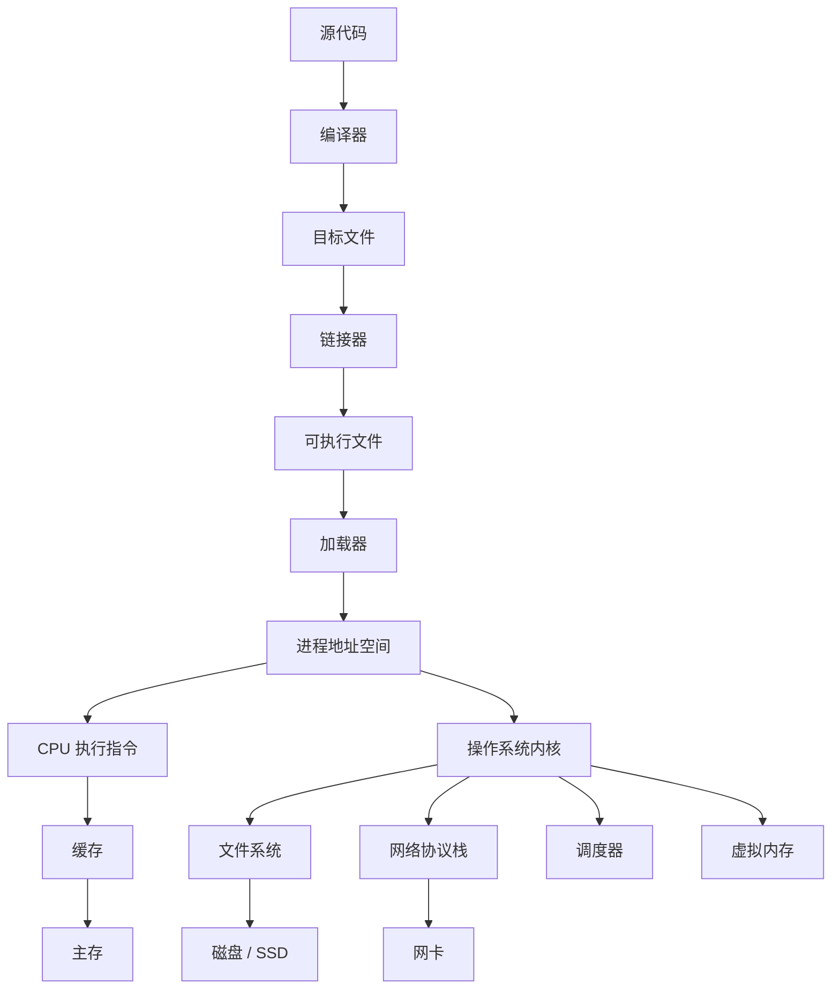

# 计算机系统学习笔记总览

最后调研时间：2026-06-13  
适合对象：已经学过一点编程，想系统理解“程序如何在计算机上运行”的学习者。  
核心参考路径：CSAPP（Computer Systems: A Programmer's Perspective）、OSTEP（Operating Systems: Three Easy Pieces）、计算机组成与体系结构、Linux 系统编程、TCP/IP 与 HTTP 标准。

## 这套笔记解决什么问题

很多人会写代码，但不清楚代码运行时发生了什么：

- `int` 为什么会溢出？
- 浮点数为什么会有误差？
- C 程序如何变成可执行文件？
- 函数调用栈是什么？
- 进程、线程、协程到底有什么区别？
- 虚拟内存为什么能让每个进程“以为自己独占内存”？
- `malloc` 为什么会慢、为什么会碎片化？
- 文件描述符、管道、socket 是什么？
- TCP 为什么可靠，HTTP 和 TCP 是什么关系？
- 多线程为什么会出现竞态、死锁、可见性问题？
- 性能瓶颈应该怎么定位？

计算机系统不是某一个单独知识点，而是一条贯穿“硬件 -> 操作系统 -> 编译链接 -> 运行时 -> 网络 -> 存储 -> 性能”的主线。

## 文件结构

| 文件 | 主题 | 重点 |
|---|---|---|
| [01-overview-and-roadmap.md](01-总览和学习路线.md) | 学习路线总览 | 计算机系统分层、学习顺序、实验路线 |
| [02-data-representation.md](02-数据表示.md) | 信息表示 | 二进制、整数、补码、浮点、字符编码 |
| [03-program-execution-and-assembly.md](03-程序执行和汇编.md) | 程序执行与汇编 | ISA、寄存器、栈帧、调用约定、控制流 |
| [04-computer-architecture.md](04-计算机组成与体系架构.md) | 计算机组成与体系结构 | CPU、流水线、缓存、存储层次、I/O |
| [05-compilation-linking-loading.md](05-编译链接和加载.md) | 编译、链接、加载 | 预处理、编译、汇编、ELF、动态链接 |
| [06-memory-system.md](06-内存系统.md) | 内存系统 | 虚拟内存、页表、TLB、堆、栈、mmap |
| [07-process-thread-scheduling.md](07-进程线程与调度.md) | 进程、线程与调度 | 进程模型、上下文切换、调度、信号 |
| [08-concurrency-synchronization.md](08-并发与同步.md) | 并发与同步 | 竞态、锁、条件变量、死锁、内存模型 |
| [09-io-filesystem-storage.md](09-IO与文件系统和存储.md) | I/O、文件系统与存储 | 文件描述符、缓冲、磁盘、文件系统、日志 |
| [10-networking.md](10-网络系统.md) | 网络系统 | TCP/IP、UDP、Socket、HTTP、DNS、TLS |
| [11-performance-debugging-observability.md](11-性能调试和可观测性.md) | 性能、调试与可观测性 | profiling、perf、strace、gdb、日志、指标 |
| [12-security-reliability.md](12-安全与可靠性.md) | 安全与可靠性 | 内存安全、权限、隔离、崩溃恢复、防御思维 |
| [13-references.md](13-参考.md) | 参考资料 | 官方文档、经典教材、中文社区入口 |
| [14-labs-and-case-studies.md](14-实验与案例.md) | 实验与案例 | 从小程序、系统工具、故障现象反推底层机制 |

## 一张总图



## 学习主线

推荐按下面顺序学：

1. 信息表示：先理解二进制、补码、浮点、编码。
2. 程序执行：理解汇编、寄存器、栈、函数调用。
3. 编译链接：理解源代码如何变成进程。
4. 体系结构：理解 CPU、缓存、流水线、内存层次。
5. 虚拟内存：理解地址空间、页表、TLB、缺页。
6. 进程线程：理解并发执行的基础抽象。
7. 并发同步：理解锁、条件变量、死锁、内存可见性。
8. I/O 与文件系统：理解文件描述符、磁盘、缓存、持久化。
9. 网络：理解 socket、TCP/UDP、HTTP。
10. 性能与调试：用工具观察系统。
11. 安全与可靠性：理解系统为什么会崩、会泄漏、会被攻击。
12. 实验与案例：把每章概念压到可复现的小程序、命令输出和故障分析里。

## 学习时最重要的习惯

- 不只背概念，要写小程序验证。
- 不只看高级语言，要看汇编、进程、系统调用。
- 遇到性能问题先测量，不凭感觉优化。
- 遇到并发问题先缩小复现，不靠打印碰运气。
- 学系统要重视工具：`gdb`、`strace`、`ltrace`、`perf`、`top`、`vmstat`、`iostat`、`tcpdump`、`ss`。
- 学网络和 OS 时要看标准、man page 和官方文档。
- 每个实验都记录：环境、命令、预期现象、实际输出、解释和下一步追问。

## 参考资料

- [CSAPP 官方课程资源](https://csapp.cs.cmu.edu/)  

- [OSTEP 官方在线书](https://pages.cs.wisc.edu/~remzi/OSTEP/)  

- [RISC-V International Specifications](https://riscv.org/technical/specifications/)  

- [Linux man-pages project](https://www.kernel.org/doc/man-pages/)  

- [IETF RFC 9293 - Transmission Control Protocol](https://www.rfc-editor.org/rfc/rfc9293)  

- [IETF RFC 9110 - HTTP Semantics](https://www.rfc-editor.org/rfc/rfc9110)  

<!-- research-notes: enhanced-v1 -->

## 研究笔记增强

> Last reviewed: 2026-06-17。此节用于把《计算机系统学习笔记总览》从阅读笔记推进到可复习、可实践、可验证的研究笔记；具体版本、参数和环境仍需结合官方资料、项目约束和实测结果校准。

### 知识定位

把硬件、指令、编译链接、进程线程、内存、文件系统和网络连接成程序运行的完整路径。

### 重点补充
- 理解数据表示、指令执行、缓存、虚拟内存和系统调用的关系。
- 把编译、链接、加载和运行时错误放在同一条链路中分析。
- 通过 perf、strace、日志、指标和实验验证系统假设。
- 明确适用场景、限制条件、替代方案和迁移成本。

### 实践清单
- 为本章整理一张概念关系图、流程图或最小系统图。
- 写一个最小可运行示例，并保留运行命令、输入、输出和环境版本。
- 列出常见错误、排查命令、关键日志和修复动作。
- 补充安全、性能、兼容性、可维护性和上线运维注意事项。
- 用一次真实问题或练习项目复盘验证笔记是否可用。

### 常见误区
- 只摘抄定义或命令，没有记录上下文、前提条件和边界。
- 只记录成功路径，不记录失败样本、异常现象和排查过程。
- 没有版本、环境和数据样本，导致后续无法复现。
- 把教程默认值直接用于真实项目，没有结合约束重新评估。

### 复盘问题
- 学完《计算机系统学习笔记总览》后，能否用自己的话说明它解决什么问题、不解决什么问题？
- 如果要在真实项目中使用，需要哪些前置条件、依赖版本、输入数据和验证手段？
- 失败时最先检查哪三类证据：日志、指标、抓包、堆栈、配置、样本还是硬件测量？
- 有没有形成可重复的最小实验、测试用例或排查命令？

### 延伸方向
- 官方文档和版本变更记录。
- 同类技术、框架或方案对比。
- 面向真实项目的最小实践。
- 故障排查清单和复盘案例库。

### 复盘记录模板

```text
主题：计算机系统学习笔记总览
日期：
目标：本次要验证或掌握的具体问题
环境：系统 / 语言 / 框架 / 工具 / 设备 / 版本
步骤：最小可复现流程
现象：成功输出、失败输出、日志、指标或测量数据
分析：为什么会出现该现象，和哪些概念相关
结论：可复用的规则、命令、配置或设计取舍
风险：边界条件、性能、安全、兼容性或维护成本
下一步：继续实验、补充资料或应用到项目
```

<!-- lecture-notes:start -->

## 讲义级补充：如何真正学懂《计算机系统学习笔记总览》

> 适用位置：计算机系统\00-README.md  
> 说明：本补充用于把原始提纲扩展成课堂讲义式学习材料。阅读时建议先看原文，再用本节建立知识框架、例子、实践和自测闭环。

### 1. 这一讲要解决什么问题

计算机系统知识解释程序为什么这样运行。学习时要把高级语言、编译器、指令、内存、操作系统、文件、网络和硬件资源联系起来，避免只停留在 API 使用层。

学习本讲时，可以用三个问题检查自己是否真的理解：

1. 它解决的真实问题是什么？
2. 如果没有它，系统会出现什么具体麻烦？
3. 在真实项目中，应该用什么现象或指标判断它做得好不好？

### 2. 核心知识拆解

可以把本讲拆成几块来学：

- 表示：数据如何编码，指令如何表达操作。
- 执行：CPU、寄存器、内存和操作系统如何协作。
- 资源：进程、线程、文件、网络和设备如何被管理。
- 诊断：性能、崩溃、安全和可靠性如何分析。

拆解的好处是防止“整章都懂一点，但哪块都说不清”。复习时可以逐块追问：它的输入是什么、输出是什么、依赖什么、失败时有什么表现。

### 3. 通俗类比

可以把程序运行类比成工厂流水线：源代码经过编译链接变成机器能执行的指令，CPU 负责加工，内存负责临时摆放材料，磁盘负责长期仓储，操作系统负责调度工人和分配场地。

类比不是严格定义，但能帮助初学者先建立直觉。真正使用时，还要回到术语、公式、接口、数据结构、时序图或工程规范上，把“感觉理解”变成“可验证理解”。

### 4. 具体例子

学习《计算机系统学习笔记总览》时，可以用一个最小程序做追踪：从源代码、编译产物、进程启动、内存占用到系统调用逐步观察。系统知识越底层，越需要用工具看到证据。

讲义级学习不能只停留在“概念解释”。至少要有一个能跑、能算、能画或能检查的例子。例子越小，越容易看清关键机制；等机制清楚后，再逐步扩展到复杂项目。

### 5. 学习路径

- 先从一个简单程序出发，追踪它如何被编译、加载、执行和退出。
- 再理解 CPU、内存、文件系统、进程线程、网络和安全机制如何配合。
- 最后用调试器、性能分析器和系统日志把抽象概念落到真实现象。

建议每学完一小节都做一次“复述练习”：不用看笔记，用自己的话讲清楚概念、输入、输出、关键步骤和常见错误。如果讲不清，通常说明还没有真正掌握。

### 6. 课堂讲解框架

可以按下面顺序讲解或复习本主题：

1. 背景：先讲这个知识为什么出现，它试图降低什么成本、解决什么风险或提升什么能力。
2. 基本概念：给出核心名词的准确定义，说明它们之间的关系。
3. 工作流程：按时间顺序描述一次完整过程，必要时画出流程图、状态机或数据流图。
4. 关键细节：解释最容易误解的机制，例如边界条件、异常处理、性能限制、资源生命周期或安全约束。
5. 实战例子：用一个足够小但完整的例子，把概念落到命令、代码、图纸、配置、数据或操作步骤上。
6. 反例与排错：展示错误做法会导致什么现象，再说明如何定位和修复。
7. 总结迁移：最后说明它和相邻知识点的区别、联系以及后续该学什么。

### 7. 最小实践任务

为了避免“看懂了但不会用”，建议为本讲配一个最小实践：

- 选一个可以在 30 到 90 分钟内完成的小任务。
- 明确输入、预期输出和验收标准。
- 记录遇到的第一个错误、定位过程和最终修复方法。
- 完成后写 5 行复盘：我原来以为是什么，实际是什么，下次会如何更快处理。

如果本主题偏理论，实践可以是手算一个小例子、画一张流程图、推导一个简化公式或解释一段真实日志；如果偏工程，实践应该尽量落到可运行命令、可测试代码、可检查配置或可测量硬件现象上。

### 8. 常见误区

- 只记结论，不理解适用条件。
- 只看正常流程，不看异常、边界和失败恢复。
- 学完没有做最小实践，导致知识停留在熟悉感。

遇到这些问题时，不要急着背更多资料。更有效的办法是回到一个最小例子，把输入、状态变化、输出和验证方式重新走一遍。

### 9. 自测题

1. 用一句话说明本讲主题解决的核心问题。
2. 列出本讲最重要的 3 个概念，并说明它们的关系。
3. 举一个生活类比，再指出这个类比在哪些地方不严谨。
4. 写出一个最小实践任务的验收标准。
5. 如果结果不符合预期，你会优先检查哪 3 个环节？为什么？
6. 本讲和相邻章节的知识边界是什么？哪些问题应该交给其他章节解决？

### 10. 复习口诀

先问场景，再看输入；先拆结构，再走流程；先做小例，再谈优化；先会排错，再做规模化。

<!-- lecture-notes:end -->
