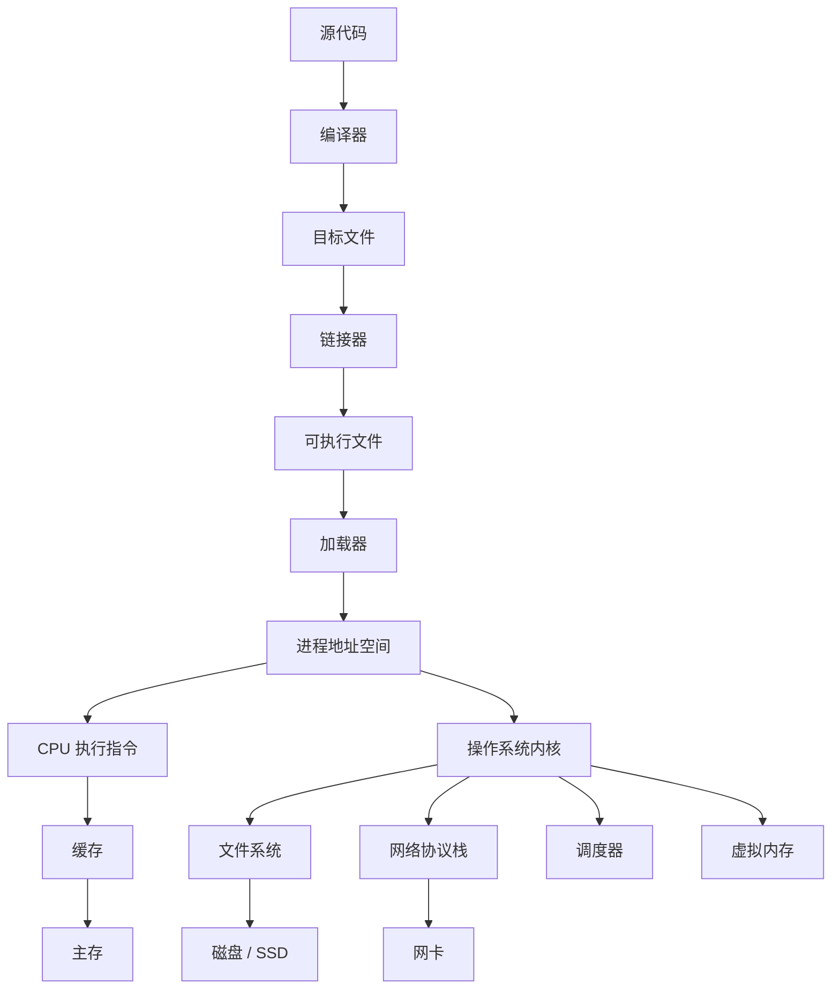

# 计算机系统学习笔记总览

最后调研时间：2026-06-13  
适合对象：已经学过一点编程，想系统理解“程序如何在计算机上运行”的学习者。  
核心参考路径：CSAPP（Computer Systems: A Programmer's Perspective）、OSTEP（Operating Systems: Three Easy Pieces）、计算机组成与体系结构、Linux 系统编程、TCP/IP 与 HTTP 标准。

## 这套笔记解决什么问题

很多人会写代码，但不清楚代码运行时发生了什么：

- `int` 为什么会溢出？
- 浮点数为什么会有误差？
- C 程序如何变成可执行文件？
- 函数调用栈是什么？
- 进程、线程、协程到底有什么区别？
- 虚拟内存为什么能让每个进程“以为自己独占内存”？
- `malloc` 为什么会慢、为什么会碎片化？
- 文件描述符、管道、socket 是什么？
- TCP 为什么可靠，HTTP 和 TCP 是什么关系？
- 多线程为什么会出现竞态、死锁、可见性问题？
- 性能瓶颈应该怎么定位？

计算机系统不是某一个单独知识点，而是一条贯穿“硬件 -> 操作系统 -> 编译链接 -> 运行时 -> 网络 -> 存储 -> 性能”的主线。

## 文件结构

| 文件 | 主题 | 重点 |
|---|---|---|
| [01-overview-and-roadmap.md](01-总览和学习路线.md) | 学习路线总览 | 计算机系统分层、学习顺序、实验路线 |
| [02-data-representation.md](02-数据表示.md) | 信息表示 | 二进制、整数、补码、浮点、字符编码 |
| [03-program-execution-and-assembly.md](03-程序执行和汇编.md) | 程序执行与汇编 | ISA、寄存器、栈帧、调用约定、控制流 |
| [04-computer-architecture.md](04-计算机组成与体系架构.md) | 计算机组成与体系结构 | CPU、流水线、缓存、存储层次、I/O |
| [05-compilation-linking-loading.md](05-编译链接和加载.md) | 编译、链接、加载 | 预处理、编译、汇编、ELF、动态链接 |
| [06-memory-system.md](06-内存系统.md) | 内存系统 | 虚拟内存、页表、TLB、堆、栈、mmap |
| [07-process-thread-scheduling.md](07-进程线程与调度.md) | 进程、线程与调度 | 进程模型、上下文切换、调度、信号 |
| [08-concurrency-synchronization.md](08-并发与同步.md) | 并发与同步 | 竞态、锁、条件变量、死锁、内存模型 |
| [09-io-filesystem-storage.md](09-IO与文件系统和存储.md) | I/O、文件系统与存储 | 文件描述符、缓冲、磁盘、文件系统、日志 |
| [10-networking.md](10-网络系统.md) | 网络系统 | TCP/IP、UDP、Socket、HTTP、DNS、TLS |
| [11-performance-debugging-observability.md](11-性能调试和可观测性.md) | 性能、调试与可观测性 | profiling、perf、strace、gdb、日志、指标 |
| [12-security-reliability.md](12-安全与可靠性.md) | 安全与可靠性 | 内存安全、权限、隔离、崩溃恢复、防御思维 |
| [13-references.md](13-参考.md) | 参考资料 | 官方文档、经典教材、中文社区入口 |
| [14-labs-and-case-studies.md](14-实验与案例.md) | 实验与案例 | 从小程序、系统工具、故障现象反推底层机制 |

## 一张总图

## 学习主线

推荐按下面顺序学：

1. 信息表示：先理解二进制、补码、浮点、编码。
2. 程序执行：理解汇编、寄存器、栈、函数调用。
3. 编译链接：理解源代码如何变成进程。
4. 体系结构：理解 CPU、缓存、流水线、内存层次。
5. 虚拟内存：理解地址空间、页表、TLB、缺页。
6. 进程线程：理解并发执行的基础抽象。
7. 并发同步：理解锁、条件变量、死锁、内存可见性。
8. I/O 与文件系统：理解文件描述符、磁盘、缓存、持久化。
9. 网络：理解 socket、TCP/UDP、HTTP。
10. 性能与调试：用工具观察系统。
11. 安全与可靠性：理解系统为什么会崩、会泄漏、会被攻击。
12. 实验与案例：把每章概念压到可复现的小程序、命令输出和故障分析里。

## 学习时最重要的习惯

- 不只背概念，要写小程序验证。
- 不只看高级语言，要看汇编、进程、系统调用。
- 遇到性能问题先测量，不凭感觉优化。
- 遇到并发问题先缩小复现，不靠打印碰运气。
- 学系统要重视工具：`gdb`、`strace`、`ltrace`、`perf`、`top`、`vmstat`、`iostat`、`tcpdump`、`ss`。
- 学网络和 OS 时要看标准、man page 和官方文档。
- 每个实验都记录：环境、命令、预期现象、实际输出、解释和下一步追问。

## 参考资料

- [CSAPP 官方课程资源](https://csapp.cs.cmu.edu/)  

- [OSTEP 官方在线书](https://pages.cs.wisc.edu/~remzi/OSTEP/)  

- [RISC-V International Specifications](https://riscv.org/technical/specifications/)  

- [Linux man-pages project](https://www.kernel.org/doc/man-pages/)  

- [IETF RFC 9293 - Transmission Control Protocol](https://www.rfc-editor.org/rfc/rfc9293)  

- [IETF RFC 9110 - HTTP Semantics](https://www.rfc-editor.org/rfc/rfc9110)  
