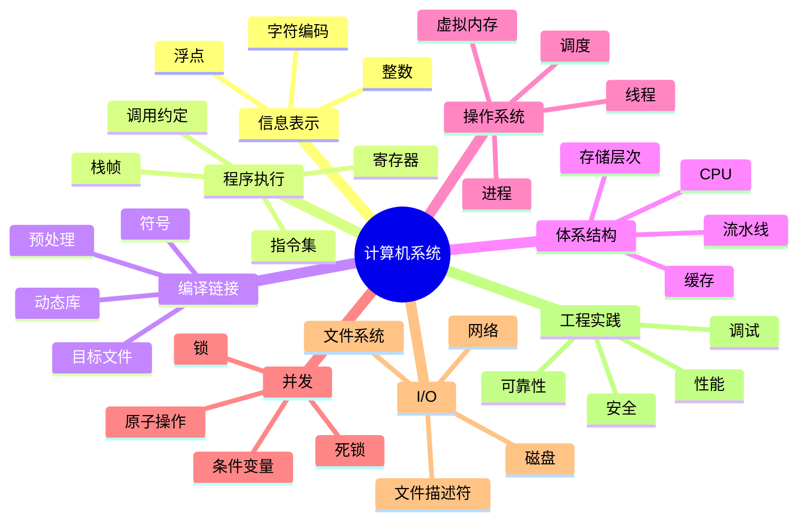

# 01. 计算机系统总览与学习路线

最后调研时间：2026-06-11

## 1. 什么是计算机系统

计算机系统研究的是程序从源代码到运行、从单机到网络、从 CPU 到磁盘的完整过程。

它关心的问题不是“如何写一个功能”，而是：

```text
程序为什么能运行？
程序运行时依赖哪些抽象？
这些抽象如何由硬件和操作系统实现？
当程序变慢、崩溃、并发错误、网络异常时，应该如何定位？
```

一段简单代码背后隐藏了很多系统层机制：

```c
printf("hello\n");
```

背后可能涉及：

- 编译器把 C 代码翻译成机器指令。
- 链接器把 `printf` 符号解析到 C 标准库。
- 加载器把程序映射到进程地址空间。
- 操作系统创建进程并调度运行。
- CPU 执行指令并访问寄存器、缓存和内存。
- `printf` 最终通过系统调用写入文件描述符 `stdout`。
- 终端驱动或伪终端显示文本。

## 2. 系统分层

```text
应用程序
运行时库 / 标准库
系统调用接口
操作系统内核
驱动程序
硬件：CPU / 内存 / 磁盘 / 网卡 / 外设
```

每一层都提供抽象：

| 层 | 提供的抽象 |
|---|---|
| CPU | 指令、寄存器、异常、中断 |
| 内存系统 | 地址、缓存、页、虚拟内存 |
| 操作系统 | 进程、线程、文件、socket、权限 |
| 文件系统 | 文件、目录、路径、持久化 |
| 网络协议栈 | socket、连接、包、可靠传输 |
| 编译工具链 | 目标文件、符号、链接、调试信息 |
| 运行时库 | `malloc`、`printf`、线程库、动态加载 |

## 3. 为什么学计算机系统

学系统的直接收益：

- 写出更可靠的程序。
- 理解内存错误、段错误、栈溢出。
- 理解并发 bug。
- 能定位性能瓶颈。
- 能理解网络异常。
- 能更好地使用 Linux。
- 能读懂系统日志和工具输出。
- 能理解高级框架背后的运行成本。

典型场景：

| 问题 | 需要的系统知识 |
|---|---|
| 程序偶发崩溃 | 内存布局、指针、栈、调试器 |
| 服务 CPU 飙高 | 调度、profiling、系统调用、锁竞争 |
| 接口响应慢 | 网络、I/O、缓存、队列 |
| 多线程结果不稳定 | 竞态、同步、内存可见性 |
| 文件写入后断电丢数据 | 文件系统缓存、fsync、日志 |
| 容器内看不到资源 | 进程、namespace、cgroup |
| C/C++ 链接失败 | 符号、目标文件、动态库 |

## 4. 推荐学习路径

### 阶段 1：信息表示与 C 基础

目标：

- 理解二进制和十六进制。
- 理解补码和溢出。
- 理解浮点误差。
- 理解指针、数组、结构体、内存布局。

实践：

- 写程序观察整数溢出。
- 打印变量地址。
- 用 `sizeof` 查看结构体大小。
- 用 `hexdump` 查看二进制文件。

### 阶段 2：机器级程序

目标：

- 看懂基础汇编。
- 理解寄存器。
- 理解栈帧。
- 理解函数调用。
- 理解条件跳转和循环。

实践：

```bash
gcc -S main.c
objdump -d a.out
gdb ./a.out
```

### 阶段 3：编译、链接、加载

目标：

- 理解 `.c -> .o -> executable`。
- 理解静态库和动态库。
- 理解符号解析。
- 理解 ELF。
- 理解程序加载到进程地址空间。

实践：

```bash
gcc -c foo.c
ar rcs libfoo.a foo.o
gcc main.o -L. -lfoo
readelf -h a.out
nm a.out
ldd a.out
```

### 阶段 4：操作系统核心抽象

目标：

- 理解进程、线程、地址空间、文件描述符。
- 理解系统调用。
- 理解调度。
- 理解信号。

实践：

```bash
ps aux
top
strace ./a.out
cat /proc/$$/maps
```

### 阶段 5：虚拟内存和内存分配

目标：

- 理解虚拟地址和物理地址。
- 理解页表和 TLB。
- 理解缺页异常。
- 理解堆、栈、mmap。
- 理解 `malloc` 的基本工作方式。

实践：

- 写程序分配大内存。
- 查看 `/proc/<pid>/maps`。
- 用 `valgrind` 或 sanitizers 查内存错误。

### 阶段 6：并发

目标：

- 理解线程。
- 理解锁。
- 理解条件变量。
- 理解死锁。
- 理解原子操作和内存模型。

实践：

- 写一个计数器竞态程序。
- 用 mutex 修复。
- 写生产者消费者队列。
- 故意制造死锁并排查。

### 阶段 7：I/O、文件系统、网络

目标：

- 理解文件描述符。
- 理解阻塞和非阻塞 I/O。
- 理解缓存和持久化。
- 理解 TCP/UDP。
- 理解 HTTP。

实践：

- 写 echo server。
- 用 `tcpdump` 抓包。
- 用 `ss` 查看连接。
- 用 `strace` 看系统调用。

### 阶段 8：性能、调试、安全

目标：

- 会用调试器。
- 会用性能分析工具。
- 会看系统指标。
- 理解常见安全问题。
- 理解可靠性设计。

实践：

```bash
gdb ./a.out
perf stat ./a.out
perf record ./a.out
perf report
strace -c ./a.out
```

## 5. 计算机系统知识地图



## 6. 学习方法

### 6.1 不要只看书

系统知识必须实验验证。推荐每学一个概念就写最小程序。

例如学虚拟内存：

- 写程序分配内存。
- 打印地址。
- 查看 `/proc/<pid>/maps`。
- 故意越界访问。
- 用调试器看崩溃点。

### 6.2 不要只学 Linux 命令

命令是入口，不是本质。

例如 `ps` 背后是进程模型，`top` 背后是调度和 CPU 时间，`ls` 背后是文件系统目录项和 inode，`curl` 背后是 DNS、TCP、TLS、HTTP。

### 6.3 建议配套实验

| 主题 | 实验 |
|---|---|
| 信息表示 | Data Lab / 位运算练习 |
| 汇编 | Bomb Lab / objdump 分析 |
| 缓存 | Cache Lab / 矩阵转置优化 |
| Shell | 写简易 shell |
| malloc | 写简易内存分配器 |
| Proxy | 写 HTTP proxy |
| 线程 | 写线程池 |
| 网络 | 写 echo server |

## 7. 参考资料

- [CSAPP 官方资源](https://csapp.cs.cmu.edu/)  

- [CMU 15-213 Introduction to Computer Systems](https://www.cs.cmu.edu/~213/)  

- [OSTEP 官方在线书](https://pages.cs.wisc.edu/~remzi/OSTEP/)  

- [Linux man-pages project](https://www.kernel.org/doc/man-pages/)  

- [Beej's Guide to Network Programming](https://beej.us/guide/bgnet/)  

- [CSDN：CSAPP 学习笔记入口](https://so.csdn.net/so/search?q=CSAPP%20%E5%AD%A6%E4%B9%A0%E7%AC%94%E8%AE%B0)  


<!-- research-notes: enhanced-v1 -->

## 研究笔记增强

> Last reviewed: 2026-06-17。此节用于把《01. 计算机系统总览与学习路线》从阅读笔记推进到可复习、可实践、可验证的研究笔记；具体版本、参数和环境仍需结合官方资料、项目约束和实测结果校准。

### 知识定位

把硬件、指令、编译链接、进程线程、内存、文件系统和网络连接成程序运行的完整路径。

### 重点补充
- 理解数据表示、指令执行、缓存、虚拟内存和系统调用的关系。
- 把编译、链接、加载和运行时错误放在同一条链路中分析。
- 通过 perf、strace、日志、指标和实验验证系统假设。
- 明确适用场景、限制条件、替代方案和迁移成本。

### 实践清单
- 为本章整理一张概念关系图、流程图或最小系统图。
- 写一个最小可运行示例，并保留运行命令、输入、输出和环境版本。
- 列出常见错误、排查命令、关键日志和修复动作。
- 补充安全、性能、兼容性、可维护性和上线运维注意事项。
- 用一次真实问题或练习项目复盘验证笔记是否可用。

### 常见误区
- 只摘抄定义或命令，没有记录上下文、前提条件和边界。
- 只记录成功路径，不记录失败样本、异常现象和排查过程。
- 没有版本、环境和数据样本，导致后续无法复现。
- 把教程默认值直接用于真实项目，没有结合约束重新评估。

### 复盘问题
- 学完《01. 计算机系统总览与学习路线》后，能否用自己的话说明它解决什么问题、不解决什么问题？
- 如果要在真实项目中使用，需要哪些前置条件、依赖版本、输入数据和验证手段？
- 失败时最先检查哪三类证据：日志、指标、抓包、堆栈、配置、样本还是硬件测量？
- 有没有形成可重复的最小实验、测试用例或排查命令？

### 延伸方向
- 官方文档和版本变更记录。
- 同类技术、框架或方案对比。
- 面向真实项目的最小实践。
- 故障排查清单和复盘案例库。

### 复盘记录模板

```text
主题：01. 计算机系统总览与学习路线
日期：
目标：本次要验证或掌握的具体问题
环境：系统 / 语言 / 框架 / 工具 / 设备 / 版本
步骤：最小可复现流程
现象：成功输出、失败输出、日志、指标或测量数据
分析：为什么会出现该现象，和哪些概念相关
结论：可复用的规则、命令、配置或设计取舍
风险：边界条件、性能、安全、兼容性或维护成本
下一步：继续实验、补充资料或应用到项目
```

<!-- lecture-notes:start -->

## 讲义级补充：如何真正学懂《01. 计算机系统总览与学习路线》

> 适用位置：计算机系统\01-总览和学习路线.md  
> 说明：本补充用于把原始提纲扩展成课堂讲义式学习材料。阅读时建议先看原文，再用本节建立知识框架、例子、实践和自测闭环。

### 1. 这一讲要解决什么问题

计算机系统知识解释程序为什么这样运行。学习时要把高级语言、编译器、指令、内存、操作系统、文件、网络和硬件资源联系起来，避免只停留在 API 使用层。

学习本讲时，可以用三个问题检查自己是否真的理解：

1. 它解决的真实问题是什么？
2. 如果没有它，系统会出现什么具体麻烦？
3. 在真实项目中，应该用什么现象或指标判断它做得好不好？

### 2. 核心知识拆解

可以把本讲拆成几块来学：

- 表示：数据如何编码，指令如何表达操作。
- 执行：CPU、寄存器、内存和操作系统如何协作。
- 资源：进程、线程、文件、网络和设备如何被管理。
- 诊断：性能、崩溃、安全和可靠性如何分析。

拆解的好处是防止“整章都懂一点，但哪块都说不清”。复习时可以逐块追问：它的输入是什么、输出是什么、依赖什么、失败时有什么表现。

### 3. 通俗类比

可以把程序运行类比成工厂流水线：源代码经过编译链接变成机器能执行的指令，CPU 负责加工，内存负责临时摆放材料，磁盘负责长期仓储，操作系统负责调度工人和分配场地。

类比不是严格定义，但能帮助初学者先建立直觉。真正使用时，还要回到术语、公式、接口、数据结构、时序图或工程规范上，把“感觉理解”变成“可验证理解”。

### 4. 具体例子

学习《01. 计算机系统总览与学习路线》时，可以用一个最小程序做追踪：从源代码、编译产物、进程启动、内存占用到系统调用逐步观察。系统知识越底层，越需要用工具看到证据。

讲义级学习不能只停留在“概念解释”。至少要有一个能跑、能算、能画或能检查的例子。例子越小，越容易看清关键机制；等机制清楚后，再逐步扩展到复杂项目。

### 5. 学习路径

- 先从一个简单程序出发，追踪它如何被编译、加载、执行和退出。
- 再理解 CPU、内存、文件系统、进程线程、网络和安全机制如何配合。
- 最后用调试器、性能分析器和系统日志把抽象概念落到真实现象。

建议每学完一小节都做一次“复述练习”：不用看笔记，用自己的话讲清楚概念、输入、输出、关键步骤和常见错误。如果讲不清，通常说明还没有真正掌握。

### 6. 课堂讲解框架

可以按下面顺序讲解或复习本主题：

1. 背景：先讲这个知识为什么出现，它试图降低什么成本、解决什么风险或提升什么能力。
2. 基本概念：给出核心名词的准确定义，说明它们之间的关系。
3. 工作流程：按时间顺序描述一次完整过程，必要时画出流程图、状态机或数据流图。
4. 关键细节：解释最容易误解的机制，例如边界条件、异常处理、性能限制、资源生命周期或安全约束。
5. 实战例子：用一个足够小但完整的例子，把概念落到命令、代码、图纸、配置、数据或操作步骤上。
6. 反例与排错：展示错误做法会导致什么现象，再说明如何定位和修复。
7. 总结迁移：最后说明它和相邻知识点的区别、联系以及后续该学什么。

### 7. 最小实践任务

为了避免“看懂了但不会用”，建议为本讲配一个最小实践：

- 选一个可以在 30 到 90 分钟内完成的小任务。
- 明确输入、预期输出和验收标准。
- 记录遇到的第一个错误、定位过程和最终修复方法。
- 完成后写 5 行复盘：我原来以为是什么，实际是什么，下次会如何更快处理。

如果本主题偏理论，实践可以是手算一个小例子、画一张流程图、推导一个简化公式或解释一段真实日志；如果偏工程，实践应该尽量落到可运行命令、可测试代码、可检查配置或可测量硬件现象上。

### 8. 常见误区

- 只记结论，不理解适用条件。
- 只看正常流程，不看异常、边界和失败恢复。
- 学完没有做最小实践，导致知识停留在熟悉感。

遇到这些问题时，不要急着背更多资料。更有效的办法是回到一个最小例子，把输入、状态变化、输出和验证方式重新走一遍。

### 9. 自测题

1. 用一句话说明本讲主题解决的核心问题。
2. 列出本讲最重要的 3 个概念，并说明它们的关系。
3. 举一个生活类比，再指出这个类比在哪些地方不严谨。
4. 写出一个最小实践任务的验收标准。
5. 如果结果不符合预期，你会优先检查哪 3 个环节？为什么？
6. 本讲和相邻章节的知识边界是什么？哪些问题应该交给其他章节解决？

### 10. 复习口诀

先问场景，再看输入；先拆结构，再走流程；先做小例，再谈优化；先会排错，再做规模化。

<!-- lecture-notes:end -->
