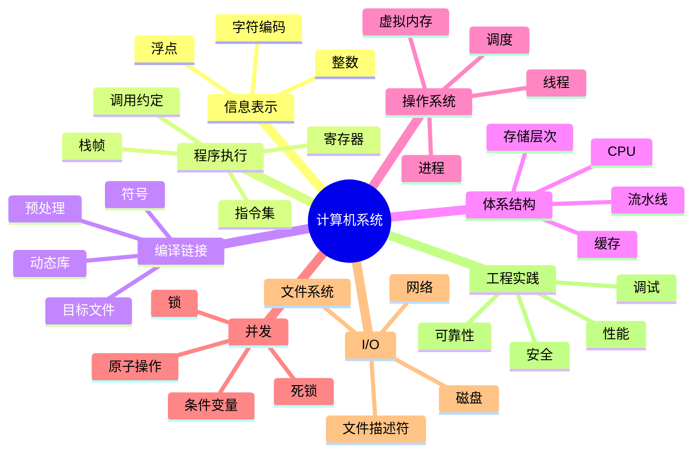

# 01. 计算机系统总览与学习路线

最后调研时间：2026-06-11

## 1. 什么是计算机系统

计算机系统研究的是程序从源代码到运行、从单机到网络、从 CPU 到磁盘的完整过程。

它关心的问题不是“如何写一个功能”，而是：

```text
程序为什么能运行？
程序运行时依赖哪些抽象？
这些抽象如何由硬件和操作系统实现？
当程序变慢、崩溃、并发错误、网络异常时，应该如何定位？
```

一段简单代码背后隐藏了很多系统层机制：

```c
printf("hello\n");
```

背后可能涉及：

- 编译器把 C 代码翻译成机器指令。
- 链接器把 `printf` 符号解析到 C 标准库。
- 加载器把程序映射到进程地址空间。
- 操作系统创建进程并调度运行。
- CPU 执行指令并访问寄存器、缓存和内存。
- `printf` 最终通过系统调用写入文件描述符 `stdout`。
- 终端驱动或伪终端显示文本。

## 2. 系统分层

```text
应用程序
运行时库 / 标准库
系统调用接口
操作系统内核
驱动程序
硬件：CPU / 内存 / 磁盘 / 网卡 / 外设
```

每一层都提供抽象：

| 层 | 提供的抽象 |
|---|---|
| CPU | 指令、寄存器、异常、中断 |
| 内存系统 | 地址、缓存、页、虚拟内存 |
| 操作系统 | 进程、线程、文件、socket、权限 |
| 文件系统 | 文件、目录、路径、持久化 |
| 网络协议栈 | socket、连接、包、可靠传输 |
| 编译工具链 | 目标文件、符号、链接、调试信息 |
| 运行时库 | `malloc`、`printf`、线程库、动态加载 |

## 3. 为什么学计算机系统

学系统的直接收益：

- 写出更可靠的程序。
- 理解内存错误、段错误、栈溢出。
- 理解并发 bug。
- 能定位性能瓶颈。
- 能理解网络异常。
- 能更好地使用 Linux。
- 能读懂系统日志和工具输出。
- 能理解高级框架背后的运行成本。

典型场景：

| 问题 | 需要的系统知识 |
|---|---|
| 程序偶发崩溃 | 内存布局、指针、栈、调试器 |
| 服务 CPU 飙高 | 调度、profiling、系统调用、锁竞争 |
| 接口响应慢 | 网络、I/O、缓存、队列 |
| 多线程结果不稳定 | 竞态、同步、内存可见性 |
| 文件写入后断电丢数据 | 文件系统缓存、fsync、日志 |
| 容器内看不到资源 | 进程、namespace、cgroup |
| C/C++ 链接失败 | 符号、目标文件、动态库 |

## 4. 推荐学习路径

### 阶段 1：信息表示与 C 基础

目标：

- 理解二进制和十六进制。
- 理解补码和溢出。
- 理解浮点误差。
- 理解指针、数组、结构体、内存布局。

实践：

- 写程序观察整数溢出。
- 打印变量地址。
- 用 `sizeof` 查看结构体大小。
- 用 `hexdump` 查看二进制文件。

### 阶段 2：机器级程序

目标：

- 看懂基础汇编。
- 理解寄存器。
- 理解栈帧。
- 理解函数调用。
- 理解条件跳转和循环。

实践：

```bash
gcc -S main.c
objdump -d a.out
gdb ./a.out
```

### 阶段 3：编译、链接、加载

目标：

- 理解 `.c -> .o -> executable`。
- 理解静态库和动态库。
- 理解符号解析。
- 理解 ELF。
- 理解程序加载到进程地址空间。

实践：

```bash
gcc -c foo.c
ar rcs libfoo.a foo.o
gcc main.o -L. -lfoo
readelf -h a.out
nm a.out
ldd a.out
```

### 阶段 4：操作系统核心抽象

目标：

- 理解进程、线程、地址空间、文件描述符。
- 理解系统调用。
- 理解调度。
- 理解信号。

实践：

```bash
ps aux
top
strace ./a.out
cat /proc/$$/maps
```

### 阶段 5：虚拟内存和内存分配

目标：

- 理解虚拟地址和物理地址。
- 理解页表和 TLB。
- 理解缺页异常。
- 理解堆、栈、mmap。
- 理解 `malloc` 的基本工作方式。

实践：

- 写程序分配大内存。
- 查看 `/proc/<pid>/maps`。
- 用 `valgrind` 或 sanitizers 查内存错误。

### 阶段 6：并发

目标：

- 理解线程。
- 理解锁。
- 理解条件变量。
- 理解死锁。
- 理解原子操作和内存模型。

实践：

- 写一个计数器竞态程序。
- 用 mutex 修复。
- 写生产者消费者队列。
- 故意制造死锁并排查。

### 阶段 7：I/O、文件系统、网络

目标：

- 理解文件描述符。
- 理解阻塞和非阻塞 I/O。
- 理解缓存和持久化。
- 理解 TCP/UDP。
- 理解 HTTP。

实践：

- 写 echo server。
- 用 `tcpdump` 抓包。
- 用 `ss` 查看连接。
- 用 `strace` 看系统调用。

### 阶段 8：性能、调试、安全

目标：

- 会用调试器。
- 会用性能分析工具。
- 会看系统指标。
- 理解常见安全问题。
- 理解可靠性设计。

实践：

```bash
gdb ./a.out
perf stat ./a.out
perf record ./a.out
perf report
strace -c ./a.out
```

## 5. 计算机系统知识地图



## 6. 学习方法

### 6.1 不要只看书

系统知识必须实验验证。推荐每学一个概念就写最小程序。

例如学虚拟内存：

- 写程序分配内存。
- 打印地址。
- 查看 `/proc/<pid>/maps`。
- 故意越界访问。
- 用调试器看崩溃点。

### 6.2 不要只学 Linux 命令

命令是入口，不是本质。

例如 `ps` 背后是进程模型，`top` 背后是调度和 CPU 时间，`ls` 背后是文件系统目录项和 inode，`curl` 背后是 DNS、TCP、TLS、HTTP。

### 6.3 建议配套实验

| 主题 | 实验 |
|---|---|
| 信息表示 | Data Lab / 位运算练习 |
| 汇编 | Bomb Lab / objdump 分析 |
| 缓存 | Cache Lab / 矩阵转置优化 |
| Shell | 写简易 shell |
| malloc | 写简易内存分配器 |
| Proxy | 写 HTTP proxy |
| 线程 | 写线程池 |
| 网络 | 写 echo server |

## 7. 参考资料

- CSAPP 官方资源  
  [https://csapp.cs.cmu.edu/](https://csapp.cs.cmu.edu/)

- CMU 15-213 Introduction to Computer Systems  
  [https://www.cs.cmu.edu/~213/](https://www.cs.cmu.edu/~213/)

- OSTEP 官方在线书  
  [https://pages.cs.wisc.edu/~remzi/OSTEP/](https://pages.cs.wisc.edu/~remzi/OSTEP/)

- Linux man-pages project  
  [https://www.kernel.org/doc/man-pages/](https://www.kernel.org/doc/man-pages/)

- Beej's Guide to Network Programming  
  [https://beej.us/guide/bgnet/](https://beej.us/guide/bgnet/)

- CSDN：CSAPP 学习笔记入口  
  [https://so.csdn.net/so/search?q=CSAPP%20%E5%AD%A6%E4%B9%A0%E7%AC%94%E8%AE%B0](https://so.csdn.net/so/search?q=CSAPP%20%E5%AD%A6%E4%B9%A0%E7%AC%94%E8%AE%B0)

