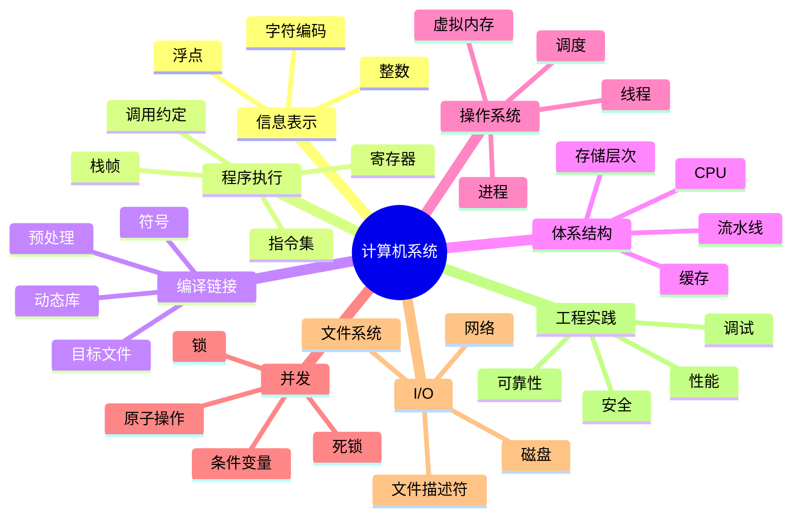

# 01. 计算机系统总览与学习路线

<!-- lecture-notes:integrated-v2 -->

## 讲义导读：把程序运行拆成系统链路

这一章讲的是 **01. 计算机系统总览与学习路线**，属于 **计算机系统学习路线**。读计算机系统时，不要把它当成名词表，而要把它当成一条从源代码到真实机器行为的链路：代码写下去，编译器怎么翻译，链接器怎么装配，加载器怎么启动，进程怎么占用地址空间，CPU 怎么执行指令，内核怎么处理系统调用，文件和网络怎么把数据送出去。

### 一句话先懂

这一章的目标是先搭地图：以后看到整数溢出、段错误、慢查询、网络超时、死锁时，知道它大概落在哪一层、该用什么工具验证。

初学时可以先盯住三个问题：第一，程序此刻在哪一层运行；第二，这一层把什么输入转换成了什么输出；第三，如果结果不对，应该用哪个工具观察证据。

### 通俗类比

可以把系统看成一条生产线：源代码是图纸，编译器把图纸翻译成机器能执行的工单，链接器把零件装配成成品，加载器把车间布置好，进程是一条隔离的生产线，CPU 是工人，寄存器和缓存是手边工具，内存是工作台，内核是车间管理员，系统调用是服务窗口，文件和网络是仓储与物流。

类比只是入门扶手。真正考试、调试或做项目时，要回到准确术语：地址、字节、指令、寄存器、符号、页表、文件描述符、socket、锁、调度、缓存、协议字段和错误码。能把类比翻译回这些具体对象，才算真的懂。

### 本章学习主线

1. **先定位层级**：这是语言问题、编译链接问题、运行时问题、内核问题、硬件问题，还是网络/存储问题？
2. **再追踪路径**：一次完整过程从哪里开始，经过哪些对象，最后在哪里产生可见结果？
3. **然后看状态**：关键状态包括寄存器、栈、堆、页表、文件偏移、进程状态、锁状态、TCP 状态和缓存状态。
4. **接着找边界**：位宽、对齐、权限、资源限制、并发时序、平台差异和标准未定义行为，都会让直觉失效。
5. **最后做验证**：用小程序、命令、日志、反汇编、抓包、性能计数或 sanitizer 证明解释是对的。

### 本章重点抓手

按数据表示、程序执行、体系结构、编译链接、内存、进程线程、并发、I/O、网络、性能、安全这条顺序建立知识坐标。

### 最小实践任务

选一个 hello world，从源文件一路追到进程和系统调用；再选一个故障现象，练习从症状反推可能层级。

建议把每次实验记录成固定格式：目标、环境、最小代码、运行命令、观察结果、底层解释、容易误判的点、下一步问题。这样以后遇到段错误、性能抖动、死锁、网络超时或数据丢失时，不会只凭感觉猜。

### 常见误区

- 只背术语，不追踪一次真实运行路径。
- 把语言层现象和操作系统、硬件层现象混在一起。
- 只看平均性能，不看缓存、I/O、锁竞争、上下文切换等具体瓶颈。

### 推荐观察工具

gcc/clang、objdump/readelf、gdb、strace、perf、pmap、ss、tcpdump、/proc、日志和小基准测试。

### 读完本章应该能做到

- 用自己的话解释本章概念，并能指出它处在系统链路的哪一层。
- 画出一个最小路径图，说明数据或控制流从哪里来、到哪里去。
- 用至少一个命令或实验观察到真实现象，而不是只复述结论。
- 说清一个常见故障的表现、可能原因、验证方式和修复方向。

> 本节是讲义化改写后的阅读入口。后续正文中的定义、命令、图示和参考资料，都应围绕“系统链路 + 可观察证据”来理解。

最后调研时间：2026-06-11

## 1. 什么是计算机系统

计算机系统研究的是程序从源代码到运行、从单机到网络、从 CPU 到磁盘的完整过程。

它关心的问题不是“如何写一个功能”，而是：

```text
程序为什么能运行？
程序运行时依赖哪些抽象？
这些抽象如何由硬件和操作系统实现？
当程序变慢、崩溃、并发错误、网络异常时，应该如何定位？
```

一段简单代码背后隐藏了很多系统层机制：

```c
printf("hello\n");
```

背后可能涉及：

- 编译器把 C 代码翻译成机器指令。
- 链接器把 `printf` 符号解析到 C 标准库。
- 加载器把程序映射到进程地址空间。
- 操作系统创建进程并调度运行。
- CPU 执行指令并访问寄存器、缓存和内存。
- `printf` 最终通过系统调用写入文件描述符 `stdout`。
- 终端驱动或伪终端显示文本。

## 2. 系统分层

```text
应用程序
运行时库 / 标准库
系统调用接口
操作系统内核
驱动程序
硬件：CPU / 内存 / 磁盘 / 网卡 / 外设
```

每一层都提供抽象：

| 层 | 提供的抽象 |
|---|---|
| CPU | 指令、寄存器、异常、中断 |
| 内存系统 | 地址、缓存、页、虚拟内存 |
| 操作系统 | 进程、线程、文件、socket、权限 |
| 文件系统 | 文件、目录、路径、持久化 |
| 网络协议栈 | socket、连接、包、可靠传输 |
| 编译工具链 | 目标文件、符号、链接、调试信息 |
| 运行时库 | `malloc`、`printf`、线程库、动态加载 |

## 3. 为什么学计算机系统

学系统的直接收益：

- 写出更可靠的程序。
- 理解内存错误、段错误、栈溢出。
- 理解并发 bug。
- 能定位性能瓶颈。
- 能理解网络异常。
- 能更好地使用 Linux。
- 能读懂系统日志和工具输出。
- 能理解高级框架背后的运行成本。

典型场景：

| 问题 | 需要的系统知识 |
|---|---|
| 程序偶发崩溃 | 内存布局、指针、栈、调试器 |
| 服务 CPU 飙高 | 调度、profiling、系统调用、锁竞争 |
| 接口响应慢 | 网络、I/O、缓存、队列 |
| 多线程结果不稳定 | 竞态、同步、内存可见性 |
| 文件写入后断电丢数据 | 文件系统缓存、fsync、日志 |
| 容器内看不到资源 | 进程、namespace、cgroup |
| C/C++ 链接失败 | 符号、目标文件、动态库 |

## 4. 推荐学习路径

### 阶段 1：信息表示与 C 基础

目标：

- 理解二进制和十六进制。
- 理解补码和溢出。
- 理解浮点误差。
- 理解指针、数组、结构体、内存布局。

实践：

- 写程序观察整数溢出。
- 打印变量地址。
- 用 `sizeof` 查看结构体大小。
- 用 `hexdump` 查看二进制文件。

### 阶段 2：机器级程序

目标：

- 看懂基础汇编。
- 理解寄存器。
- 理解栈帧。
- 理解函数调用。
- 理解条件跳转和循环。

实践：

```bash
gcc -S main.c
objdump -d a.out
gdb ./a.out
```

### 阶段 3：编译、链接、加载

目标：

- 理解 `.c -> .o -> executable`。
- 理解静态库和动态库。
- 理解符号解析。
- 理解 ELF。
- 理解程序加载到进程地址空间。

实践：

```bash
gcc -c foo.c
ar rcs libfoo.a foo.o
gcc main.o -L. -lfoo
readelf -h a.out
nm a.out
ldd a.out
```

### 阶段 4：操作系统核心抽象

目标：

- 理解进程、线程、地址空间、文件描述符。
- 理解系统调用。
- 理解调度。
- 理解信号。

实践：

```bash
ps aux
top
strace ./a.out
cat /proc/$$/maps
```

### 阶段 5：虚拟内存和内存分配

目标：

- 理解虚拟地址和物理地址。
- 理解页表和 TLB。
- 理解缺页异常。
- 理解堆、栈、mmap。
- 理解 `malloc` 的基本工作方式。

实践：

- 写程序分配大内存。
- 查看 `/proc/<pid>/maps`。
- 用 `valgrind` 或 sanitizers 查内存错误。

### 阶段 6：并发

目标：

- 理解线程。
- 理解锁。
- 理解条件变量。
- 理解死锁。
- 理解原子操作和内存模型。

实践：

- 写一个计数器竞态程序。
- 用 mutex 修复。
- 写生产者消费者队列。
- 故意制造死锁并排查。

### 阶段 7：I/O、文件系统、网络

目标：

- 理解文件描述符。
- 理解阻塞和非阻塞 I/O。
- 理解缓存和持久化。
- 理解 TCP/UDP。
- 理解 HTTP。

实践：

- 写 echo server。
- 用 `tcpdump` 抓包。
- 用 `ss` 查看连接。
- 用 `strace` 看系统调用。

### 阶段 8：性能、调试、安全

目标：

- 会用调试器。
- 会用性能分析工具。
- 会看系统指标。
- 理解常见安全问题。
- 理解可靠性设计。

实践：

```bash
gdb ./a.out
perf stat ./a.out
perf record ./a.out
perf report
strace -c ./a.out
```

## 5. 计算机系统知识地图



## 6. 学习方法

### 6.1 不要只看书

系统知识必须实验验证。推荐每学一个概念就写最小程序。

例如学虚拟内存：

- 写程序分配内存。
- 打印地址。
- 查看 `/proc/<pid>/maps`。
- 故意越界访问。
- 用调试器看崩溃点。

### 6.2 不要只学 Linux 命令

命令是入口，不是本质。

例如 `ps` 背后是进程模型，`top` 背后是调度和 CPU 时间，`ls` 背后是文件系统目录项和 inode，`curl` 背后是 DNS、TCP、TLS、HTTP。

### 6.3 建议配套实验

| 主题 | 实验 |
|---|---|
| 信息表示 | Data Lab / 位运算练习 |
| 汇编 | Bomb Lab / objdump 分析 |
| 缓存 | Cache Lab / 矩阵转置优化 |
| Shell | 写简易 shell |
| malloc | 写简易内存分配器 |
| Proxy | 写 HTTP proxy |
| 线程 | 写线程池 |
| 网络 | 写 echo server |

## 7. 参考资料

- [CSAPP 官方资源](https://csapp.cs.cmu.edu/)  

- [CMU 15-213 Introduction to Computer Systems](https://www.cs.cmu.edu/~213/)  

- [OSTEP 官方在线书](https://pages.cs.wisc.edu/~remzi/OSTEP/)  

- [Linux man-pages project](https://www.kernel.org/doc/man-pages/)  

- [Beej's Guide to Network Programming](https://beej.us/guide/bgnet/)  

- [CSDN：CSAPP 学习笔记入口](https://so.csdn.net/so/search?q=CSAPP%20%E5%AD%A6%E4%B9%A0%E7%AC%94%E8%AE%B0)

## 2026 计算机系统资料与实验核对补充

这一组笔记建议按“教材主线 + 标准文档 + 本机实验”三层学习，不要只看二手总结。

- **教材主线**：CS:APP 适合建立程序员视角，OSTEP 适合按虚拟化、并发、持久化理解操作系统。
- **接口核对**：Linux man-pages 用来查系统调用、库函数和命令行为；Linux Kernel docs 用来查内核机制；POSIX.1-2024 用来核对可移植接口；ELF gABI 用来核对目标文件、符号、重定位和动态链接。
- **工具链核对**：GCC/LLVM/Clang 文档用于确认编译选项、优化、调试信息和 sanitizer 行为，不要只凭旧教程记命令。
- **网络核对**：HTTP 语义看 RFC 9110，HTTP 缓存看 RFC 9111，TCP 看 RFC 9293，QUIC 看 RFC 9000；抓包结果要和协议字段对应起来。
- **实验要求**：优先用 CS:APP 建立程序员视角，用 OSTEP 建立操作系统主线，再用 Linux man-pages、Linux Kernel docs、POSIX.1-2024、ELF gABI 和 RFC 原文核对接口细节。 每个结论最好配一个能复现的最小程序或命令输出。

通俗地说，教材负责“搭骨架”，标准负责“定规则”，实验负责“验真假”。系统知识最怕只会背概念；能把源码、命令输出、内核接口和协议原文对上，才真正能用于排错和优化。

参考资料：

- CS:APP 官方网站：https://csapp.cs.cmu.edu/
- OSTEP 官方网站：https://pages.cs.wisc.edu/~remzi/OSTEP/
- Linux man-pages：https://man7.org/linux/man-pages/
- Linux Kernel Documentation：https://docs.kernel.org/
- POSIX.1-2024 / The Open Group Base Specifications Issue 8：https://pubs.opengroup.org/onlinepubs/9799919799/
- GCC Online Documentation：https://gcc.gnu.org/onlinedocs/
- LLVM Documentation：https://llvm.org/docs/
- ELF gABI / Linux Foundation Referenced Specifications：https://refspecs.linuxfoundation.org/
- RFC 9110 HTTP Semantics：https://www.rfc-editor.org/info/rfc9110/
- RFC 9111 HTTP Caching：https://www.rfc-editor.org/info/rfc9111/
- RFC 9293 Transmission Control Protocol：https://www.rfc-editor.org/info/rfc9293/
- RFC 9000 QUIC：https://www.rfc-editor.org/info/rfc9000/
- Clang Sanitizers：https://clang.llvm.org/docs/AddressSanitizer.html
