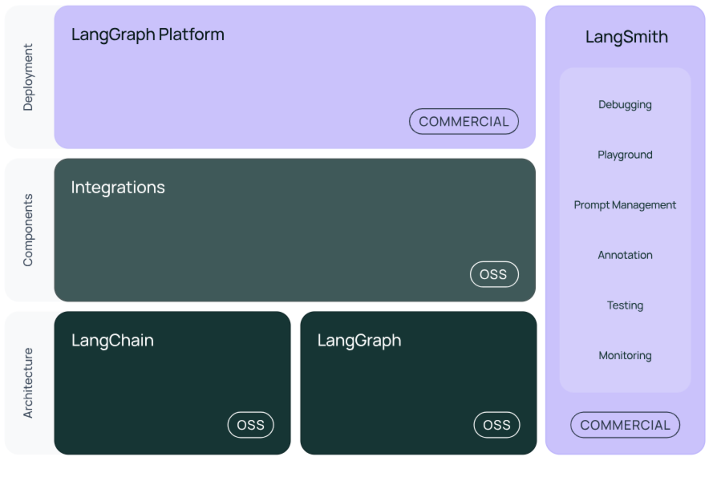
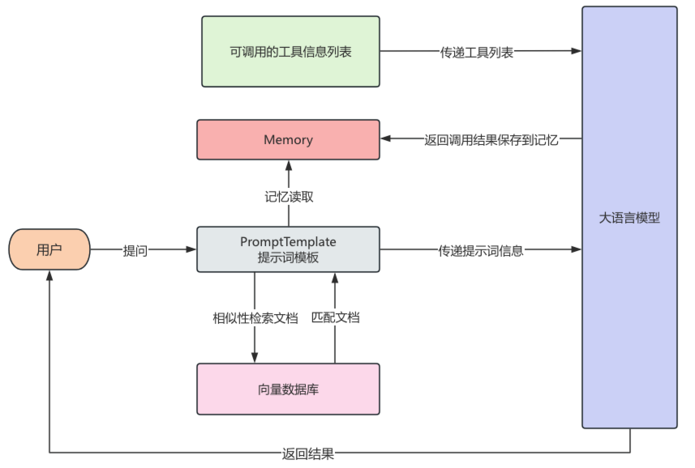
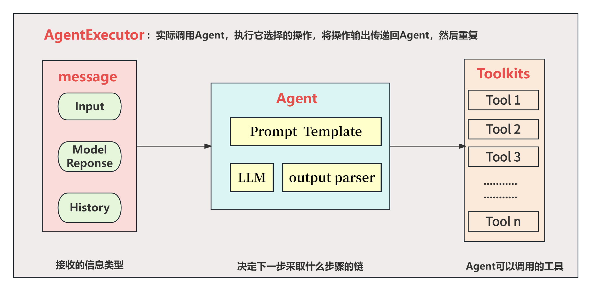
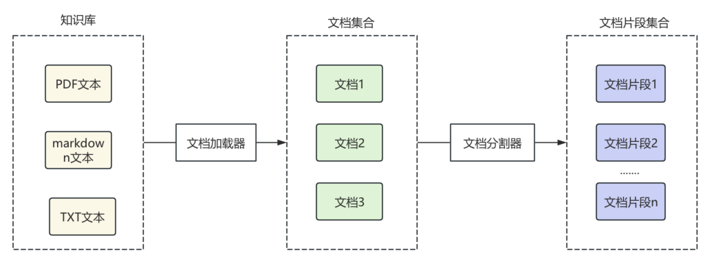
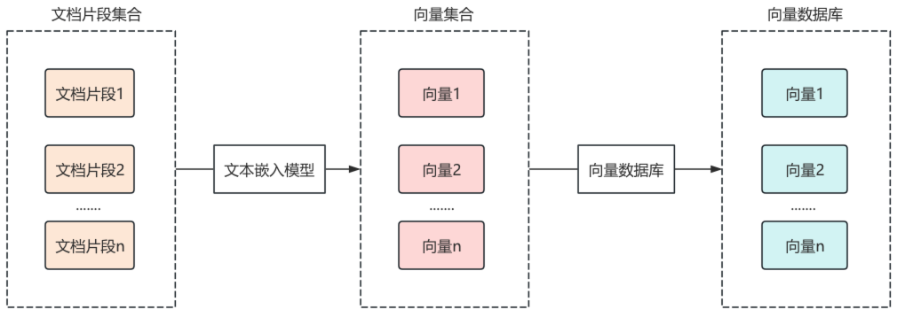

# 1.介绍



## 参考文档

LangChain **模型接口**可参考官方文档：https://reference.langchain.com/python/langchain_core/language_models/

LangChain **提示词**官方文档参考：https://reference.langchain.com/python/langchain_core/prompts/

LangChain **输出解析器**可参考文档：https://reference.langchain.com/python/langchain_core/output_parsers/

langChain **链式调用**可参考文档：https://reference.langchain.com/python/langchain_core/runnables/

 langchain **记忆存储**相关内容，可参考文档：https://docs.langchain.com/oss/python/langchain/short-term-memory

LangChain**内置工具**列表：https://docs.langchain.com/oss/python/integrations/tools

langchain **内置第三方搜索**库:https://python.langchain.com/docs/integrations/tools/#search

**Ollama Embedding **可参考文档：https://python.langchain.com/api_reference/community/embeddings/langchain_community.embeddings.ollama.OllamaEmbeddings.html

## 核心库

**langchain-core**

- 功能：提供 LangChain 的核心抽象和基类，是其他模块的基础。
- 主要组件：
  - Runnable：LangChain 的核心执行接口，所有链、代理和工具都基于此抽象。
  - PromptTemplate：用于动态生成模型输入的模板，支持字符串和聊天消息格式。
  - OutputParser：解析语言模型的输出（如 JSON、列表、结构化数据）。
  - Callbacks：用于监控和调试执行过程，支持日志记录、性能分析等。
- 用途：定义通用的接口和工具，确保模块之间的兼容性和可扩展性。

**langchain**

- 功能：主包，包含核心功能模块，依赖 `langchain-core`。
- 主要子模块：
  - LLMs：与语言模型交互的接口（如 OpenAI、Hugging Face）。
  - Chat Models：专为对话场景优化的模型接口。
  - Memory：管理对话上下文的模块（如 `ConversationBufferMemory`）。
  - Chains：组合提示、模型和其他组件的工作流（如 `LLMChain`、`RetrievalQA`）。
  - Agents：动态决策和工具调用的模块。
  - Tools：外部工具接口（如搜索、计算器）。
- 用途：提供构建复杂应用的完整工具集，适合快速开发。

**langchain-community**

- 功能：社区贡献的扩展模块，包含大量第三方集成和工具。
- 主要内容：
  - 向量存储：支持 Chroma、FAISS、Pinecone 等向量数据库。
  - 文档加载器：支持从 PDF、CSV、网页等加载数据。
  - 工具：如 Wikipedia、SerpAPI、Arxiv 等。
  - 模型集成：支持 Hugging Face、Anthropic、Cohere 等模型。
- 用途：扩展 LangChain 的功能，适合需要特定集成或开源替代方案的场景。

## 语言模型集成库

LangChain 支持与多种语言模型和嵌入模型的集成，这些集成通常以单独的子包形式提供，需单独安装。以下是常见的模型集成库：

**langchain-openai**

- 功能：与 OpenAI 的 GPT 模型和嵌入模型（如 text-embedding-ada-002）交互。
- 用途：适合需要高性能模型的商业应用。

**langchain-huggingface**

- 功能：支持 Hugging Face 的开源模型和嵌入模型（如 SentenceTransformers）。
- 用途：适合本地部署或开源模型的场景

**其他模型集成**

- `langchain-cohere`: 支持 Cohere 的嵌入和生成模型。
- `langchain-mistralai`: 支持 Mistral AI 的模型。
- `langchain-google-genai`: 支持 Google 的 Gemini 模型。

## 向量存储和检索库

LangChain 支持多种向量数据库，用于存储和检索文本的向量表示。这些库通常在 `langchain-community` 中，或以独立包形式提供。

**langchain-chroma**

- 功能：与 Chroma 向量数据库集成，支持高效的向量存储和检索。
- 用途：适合本地或小型应用的向量存储。

**langchain-pinecone**

- 功能：与 Pinecone 云向量数据库集成。
- 用途：适合大规模、分布式向量存储。

**langchain-faiss**

- 功能：与 FAISS（Facebook AI Similarity Search）集成，支持高效的本地向量搜索。
- 用途：适合高性能、本地化场景。

**其他向量存储**

- Weaviate (`langchain-weaviate`): 支持云原生向量数据库。
- Qdrant (`langchain-qdrant`): 高性能向量搜索。
- Elasticsearch (`langchain-elasticsearch`): 结合 Elasticsearch 的搜索能力。

## 工具和外部服务集成

LangChain 提供了大量工具库，用于与外部服务交互。这些工具通常在 `langchain-community` 中，或者需要单独安装。

**langchain-serpapi**

- 功能：与 SerpAPI 集成，用于网页搜索。
- 用途：为代理提供实时搜索能力。

**langchain-wikipedia**

- 功能：查询 Wikipedia 的内容。
- 用途：快速获取百科知识。
- 安装：包含在 `langchain-community`。

**其他工具**

- Arxiv：查询学术论文。
- Wolfram Alpha：数学和科学计算。
- Zapier：自动化工作流集成。

## 辅助库

LangChain 生态还包括一些辅助库，用于调试、部署和增强功能。

**langsmith**

- 功能：LangChain 官方的调试和监控平台，用于记录链和代理的执行细节。
- 用途：优化性能、分析模型行为。

**langserve**

- 功能：将 LangChain 应用部署为 REST API。
- 用途：快速上线 LangChain 应用。

**langgraph**

- 功能：构建基于图的工作流，适合复杂、有状态的应用程序。
- 用途：实现多步骤推理或循环任务。

## 文档加载和处理库

LangChain 提供多种文档加载器和文本处理工具，通常在 `langchain-community` 中。

**文档加载器**

- PDF：`PyPDF2`, `pdfplumber`。
- Web：`BeautifulSoup`, `WebBaseLoader`。
- CSV/Excel：`pandas`。

**文本分割器**

- 功能：将长文本切分为适合模型处理的块。
- 类型：
  - `CharacterTextSplitter`：按字符数分割。
  - `RecursiveCharacterTextSplitter`：递归分割，保留语义。
  - `TokenTextSplitter`：按 token 数分割。

## LangChain核心模块



**LLM 大模型接口**

LangChain 封装了不同模型的调用方式，它统一了各种模型的接口，切换不同模型变得轻松。

**PromptTemplate提示词模板***

大模型的输出质量在很大程度上取决于提示词（Prompt）的设计，在LangChain 把提示词封装成模板，支持变量动态替换，管理起来更清晰，能灵活控制 Prompt 内容，避免硬编码。

**Chain链**

Chain链是 LangChain 的核心思想之一，一个 Chain 就是将多个模块串起来完成一系列操作，Chain链可以将上一步操作的结果交给下一步进行执行，比如用提示词模板生成 Prompt，将渲染后的提示词交给大模型生成回答，再将大模型的回答将结果输出到控制台，Chain和Linux中的管道符十分类似，每一步的输出自动作为下一步输入，实现模块串联。

**Memory记忆**

在和大模型对话时，大模型本身并不具备有记忆历史对话的功能，但是在使用ChatGPT、DeepSeek等大模型时，发现它们在同一个会话内有“上下文记忆”的能力，这样能使对话更加连贯。

LangChain 也提供了类似的记忆功能。通过 memory，可以把用户的历史对话保存下来，使大模型拥有历史记忆的能力，如下示例，每一轮对话会从ConversationSummaryBufferMemory中读取历史对话，渲染到Prompt供大模型使用。

对话结束之后，会将对话内容保存到ConversationSummaryBufferMemory，如果历史记忆超过一定大小，为了节省和大模型之间调用的token消耗，会对历史记忆进行摘要提取、压缩之后再保存，这样大模型拥有了记忆功能。

**MCP 与工具调用**

大语言模型本身是一种基于大量数据训练而成的人工智能，它本身是基于大量的数据为基础对结果进行预测，因此，大模型可能会出现给出1+1=3这种情况，大模型本身是不会“上网”， 也不会算数的，因此，可以给大模型接入各种各样的工具如Google搜索、高德地图定位信息查询、图像生成等等。

在现如今，很多的大模型都支持了工具调用，也就是将可用的工具信息列表在调用大模型时传递过去，这些信息包括工具的用途、参数说明等等，大模型会根据这些工具的作用确定调用哪些工具，并且根据参数的描述，来返回调用工具的参数。

最终将工具调用结果返回给大模型，完成用户交给的任务，整个过程中，大模型会根据任务判断是否调用工具，并组织执行，这个自动决策执行的过程，就是由 agent 完成的。

agent 会自己思考、分步骤执行，非常适合复杂任务处理.

对于那些不支持工具调用的大模型，也可以根据提示词将可选的工具和调用方法传递给大模型，但是大模型的预测有很强的不确定性，返回结果的准确率会显著下降。

**RAG检索**

在一些LLM的使用场景，需要使用一些特定的文档让LLM根据这些文档的内容进行回复，而这些特定的文档通常不在LLM的训练数据中，此时RAG检索就有用武之地。

在LangChain中，可以读取文档作为大模型的知识库，来进行增强搜索，LangChain封装各种类型的文档读取器，可以将读取文档得到的数据，通过LangChain文档分割器对文档进行分割，通过文本嵌入模型对文本进行向量化，将文本的向量信息保存到向量数据库。

当用户向AI发起提问时，在向量数据库中检索出与提问相关的文档，然后与用户问题一起发送给大模型，这个过程就叫做RAG（检索增强生成，Retrieval-Augmented Generation），RAG 能让大模型回答特定领域的问答变得更加精准、实时，避免出现幻觉

# 2.Model大模型接口

LangChain 模型接口可参考官方文档：https://reference.langchain.com/python/langchain_core/language_models/

## Model的分类

LangChain中将大语言模型分为以下几种，我们主要使用的是聊天模型：

| 模型类型                    | 输入形式                                                     | 输出形式                            | 主要特点                                                     | 典型适用场景                                                 |
| --------------------------- | ------------------------------------------------------------ | ----------------------------------- | ------------------------------------------------------------ | ------------------------------------------------------------ |
| LLM（Large Language Model） | 纯文本字符串                                                 | 文本字符串                          | 1. 最基础的文本生成模型 2. 无上下文记忆 3. 高速、轻量        | 1. 单轮问答 2. 摘要生成 3. 文本改写/扩写 4. 指令执行（Instruct 模型） |
| ChatModel（聊天模型）       | 消息列表（`List[BaseMessage]`）包括 `HumanMessage`, `SystemMessage`, `AIMessage`等 | 聊天消息对象（`AIMessage` ）        | 1. 面向对话场景 2. 支持多轮上下文 3. 更贴近人类对话逻辑      | 1. 智能助手 2. 客服机器人 3. 多轮推理任务 4. LangChain Agent 工具调用 |
| Embeddings（文本向量模型）  | 文本字符串或列表（`str`或 `List[str]`）                      | 向量（`List[float]` 或 `ndarray` ） | 1. 将文本转化为语义向量 2. 可用于相似度搜索 3. 通常不生成文本 | 1. 文本检索增强（RAG） 2. 知识库问答 3. 聚类 / 分类 / 推荐系统 |


## Model继承体系

在 LangChain 的类结构中，顶层基类是 `BaseLanguageModel`，用于定义模型的通用接口。它分为两支：`BaseChatModel` 和 `BaseLLM`

接入聊天模型时需继承 `BaseChatModel`，如常用的 `ChatOpenAI`；而文本生成模型则继承 `BaseLLM`，如 `OpenAI`。

## 创建环境变量

创建.env 文件内容如下：

```txt
DEEPSEEK_BASE_URL=xxx
DEEPSEEK_API_KEY=xxx
MODEL=xxx
```

加载环境变量:

```python
import os
from dotenv import load_dotenv 
load_dotenv(override=True)
deepseek_api_key = os.getenv("DEEPSEEK_API_KEY")
```

## Chat Model 主要参数

| 参数名      | 参数含义                                                     |
| ----------- | ------------------------------------------------------------ |
| model       | 指定使用的大语言模型名称（如 `"gpt-4"`、`"gpt-3.5-turbo"` 等） |
| temperature | 温度，温度越高，输出内容越随机；温度越低，输出内容越确定     |
| timeout     | 请求超时时间                                                 |
| max_tokens  | 生成内容的最大token数                                        |
| stop        | 模型在生成时遇到这些“停止词”将立刻停止生成，常用于控制输出的边界。 |
| max_retries | 最大重试请求次数                                             |
| api_key     | 大模型供应商提供的API秘钥                                    |
| base_url    | 大模型供应商API 请求地址                                     |

**接入大模型：**

不同平台接口兼容不同：

| 组件             | 接口格式       | 说明                                       |
| :--------------- | :------------- | :----------------------------------------- |
| **OpenAI**       | 标准格式       | 很多平台都兼容这种格式                     |
| **DeepSeek官方** | 兼容OpenAI格式 | DeepSeek官方API本身就是兼容OpenAI格式的    |
| **百炼平台**     | 兼容OpenAI格式 | 百炼为了开发者方便，也实现了OpenAI兼容接口 |
| **ChatDeepSeek** | DeepSeek专用   | 可能有一些DeepSeek特定的实现细节           |

使用bailian平台:

```python
from langchain_openai import ChatOpenAI
model = ChatOpenAI(
    model=MODEL,
    temperature=0,
    max_tokens=None,
    timeout=None,
    max_retries=2,
    base_url=BAILIAN_BASE_URL,
    api_key=BAILIAN_API_KEY,
)
print(model.invoke("什么是LangChain?"))
```

使用deepseek厂商专用：

```python
from langchain_deepseek import ChatDeepSeek
model = ChatDeepSeek(
    model="deepseek-chat",
    temperature=0,
    max_tokens=None,
    timeout=None,
    max_retries=2,
    base_url=DEEPSEEK_BASE_URL,
    api_key=DEEPSEEK_API_KEY,
)
print(model.invoke("什么是LangChain?"))
```

**注意:**同一模型在不同平台名称可能不同

设置本地部署的模型：

```python
from langchain_ollama import ChatOllama
# 设置本地模型，不使用深度思考
model = ChatOllama(base_url="http://localhost:11434", model="qwen3:14b", reasoning=False)
```


## Message组件

调用模型后返回了一条AI消息，在LangChain中，消息有几种不同的类型。所有消息都有 `type` 、 `content` 、 `response_metadata` 等属性。

- **HumanMessage**：人类消息，type为"user"，表示来自用户输入。比如“实现 一个快速排序方法”。 
- **AIMessage**： AI 消息，type为"ai"，这可以是文本，也可以是调用工具的请求。
-  **SystemMessage**：系统消息，type为"system"，告诉大模型当前的背景是什么，应该如何做，并不是所有模型提供商都支持这个消息类型 
- **ToolMessage/FunctionMessage**：工具消息，type为"tool"，用于函数调用结果的消息类型 
- **ChatMessage**：可以自定义角色的通用消息类型。 


| 属性名            | 属性作用                                                     |
| ----------------- | ------------------------------------------------------------ |
| type              | 描述了是哪个类型的消息，包含类型有"user"、“ai”、“system” 和 “tool” |
| content           | 通常是字符串，有些情况下可能是字典列表，这个字典列表用于大模型的多模态输出。 |
| name              | 用来区分当消息类型相同，对消息进行区分，但不是所有模型都支持这一功能。 |
| response_metadata | AI消息才会包含的属性，大语言模型的响应中附加元数据，根据不同模型会有不同，如可能会包含本次 token 使用量等信息。 |
| tool_calls        | AI消息才会包含的属性，当大语言模型决定调用工具时，在 `AIMessage` 中就会包含这个属性，可以通过 `.tool_calls` 属性进行获取该属性返回一个 `ToolCall` 列表，每个 `ToolCall` 是一个字典，包含以下字段：`name` :应调用的工具名`args` : 调用工具的参数`id` : 工具调用的唯一标识 ID |


## 模型调用方法

### 对话模型

```python
# 构建消息列表
messages = [SystemMessage(content="你叫小亮，是一个乐于助人的人工助手"),
            HumanMessage(content="你是谁")
            ]
# 同步调用大模型
response = model.invoke(messages)
# 打印结果
print(response.content)
print(type(response))
```

### 非流式输出(invoke)

同步调用，结果一次性全部输出，这是Langchain与LLM交互时的默认行为，是最简单、最稳定的语言模型调用方式。当用户发出请求后，系统在后台等待模型生成完整响应，然后一次性将全部结果返回。在大多数问答、摘要、信息抽取类任务中，非流式输出提供了结构清晰、逻辑完整的结果，适合快速集成和部署

```python
response = model.invoke(messages)
```

### 流式输出(stream)

一种更具交互感的模型输出方式，用户不再需要等待完整答案，而是能看到模型逐个token 地实时返回内容。  适合构建强调“实时反馈”的应用，如聊天机器人、写作助手等。

```python
'''流式输出'''
response = model.stream(messages)
for chunk in response:
    print(chunk.content, end="",flush=True) # 刷新缓冲区 (无换行符，缓冲区未刷新，内容可能不会立即显示)
print("\n")
print(type(response))
```

### 批量调用(batch)

ngChain 支持 **批量调用（Batch Inference）**，也就是**一次性向模型提交多个输入并并行处理**，从而显著提升吞吐量。

```python
# 批量调用大模型
response = model.batch(batch_input)
for q, r in zip(questions, response):
    print(f"问题：{q}\n回答：{r}\n")
```


### 异步调用(ainvoke)

LangChain 提供 `ainvoke()` 异步调用接口，用于在 异步环境（async/await） 中高效并行地执行模型推理。
它的核心作用是：让你同时调用多个模型请求而不阻塞主线程 —— 特别适合大批量请求或 Web 服务场景（如 FastAPI）。

```python
async def main():
    # 异步调用一条请求
    response = await model.ainvoke("解释一下LangChain是什么")
    print(response)
    
# 运行异步程序的入口点
asyncio.run(main())
```

# 3.PromptTemplate提示词模板

LangChain 提示词官方文档参考：https://reference.langchain.com/python/langchain_core/prompts/

## 提示词模板分类

- `PromptTemplate`：文本生成模型提示词模板，用字符串拼接变量生成提示词
- `ChatPromptTemplate`：聊天模型提示词模板，适用于如 `gpt-3.5-turbo`、`gpt-4` 等聊天模型
- `HumanMessagePromptTemplate`：人类消息提示词模板
- `SystemMessagePromptTemplate`：系统消息提示词模板
- `FewShotPromptTemplate`：少样本学习提示词模板， 构建一个 Prompt，其中包含多个 示例，可以 自动将这些示例格式化并插入到主 Prompt 中 。
- `PipelinePrompt`：管道提示词模板，用于把几个提示词组合在一起使用。

## 模板类继承关系

在 LangChain 的类结构中，顶层基类是 `BasePromptTemplate`，用于定义Prompt 模板系统必须实现的核心方法，而`StringPromptTemplate` 和 `BaseChatPromptTemplate`两个子类分别继承。

**接入聊天模型时需继承`BaseChatPromptTemplate`；而文本生成模型则继承`StringPromptTemplate` 。**

## 文本提示词模板

`PromptTemplate` 针对文本生成模型的提示词模板，也是LangChain提供的最基础的模板，通过格式化字符串生成提示词，在执行invoke时将变量格式化到提示词模板中

主要参数：

- template：定义提示词模板的字符串，其中包含文本和变量占位符（如{name}） ；

- input_variables： 列表，指定了模板中使用的变量名称，在调用模板时被替换；

- partial_variables：字典，用于定义模板中一些固定的变量名。这些值不需要再每次调用时被替换。

函数介绍：

format()：给input_variables变量赋值，并返回提示词。利用format() 进行格式化时就一定要赋值，否则会报错。当在template中未设置input_variables，则会自动忽略。

### 创建提示词

**使用构造方法**

```python
# 创建一个PromptTemplate对象，用于生成格式化的提示词模板
# 该模板包含两个变量：role（角色）和question（问题）
template = PromptTemplate(template="你是一个专业的{role}工程师，请回答我的问题给出回答，我的问题是：{question}",
                        input_variables=['role', 'question'])

# 使用模板格式化具体的提示词内容
# 将role替换为"python开发"，question替换为"冒泡排序怎么写？"
prompt = template.format(role="python开发",question="冒泡排序怎么写？")

# 输出格式化后的提示词内容
print(prompt)
```

**调用from_template(常用)**

```python
# 创建一个PromptTemplate对象，用于生成格式化的提示词模板
# 模板包含两个占位符：{role}表示角色，{question}表示问题
template = PromptTemplate.from_template("你是一个专业的{role}工程师，请回答我的问题给出回答，我的问题是：{question}")

# 使用指定的角色和问题参数来格式化模板，生成最终的提示词字符串
# role: 工程师角色描述
# question: 具体的技术问题
prompt = template.format(role="python开发",question="冒泡排序怎么写？")

# 输出生成的提示词
print(prompt)
```

###  部分提示词模板

```python
# 创建一个包含时间变量的模板，时间变量使用partial_variables预设为当前时间
# 然后格式化问题生成最终提示词
template1 = PromptTemplate.from_template("现在时间是：{time},请对我的问题给出答案，我的问题是：{question}",
partial_variables={"time": datetime.now().strftime("%Y-%m-%d %H:%M:%S")})
prompt1 = template1.format(question="今天是几号？")
print(prompt1)

# 创建一个包含时间变量的模板，通过partial方法预设时间变量为当前时间
# 然后格式化问题生成最终提示词
template2 = PromptTemplate.from_template("现在时间是：{time},请对我的问题给出答案，我的问题是：{question}")
partial = template2.partial(time=datetime.now().strftime("%Y-%m-%d %H:%M:%S"))
prompt2 = partial.format(question="今天是几号？")
print(prompt2)
```

### 组合提示词模板

```python
# 创建一个PromptTemplate模板，用于生成介绍某个主题的提示词
# 该模板包含两个占位符：topic（主题）和length（字数限制）
template1 = PromptTemplate.from_template("请用一句话介绍{topic}，要求通俗易懂\n") + "内容不超过{length}个字"
# 使用format方法填充模板中的占位符，生成具体的提示词
prompt1 = template1.format(topic="LangChain", length=20)
print(prompt1)

# 分别创建两个独立的PromptTemplate模板
prompt_a = PromptTemplate.from_template("请用一句话介绍{topic}，要求通俗易懂\n")
prompt_b = PromptTemplate.from_template("内容不超过{length}个字")
# 将两个模板进行拼接组合
prompt_all = prompt_a + prompt_b
# 填充组合后模板的占位符，生成最终的提示词
prompt2 = prompt_all.format(topic="LangChain", length=20)
print(prompt2)
```

### 提示词方法

**方法**

- invoke：格式化提示词模板为PromptValue  
- format：格式化提示词模板为字符串  
- partial：格式化提示词模板为一个新的提示词模板，可以继续进行格式化  ,在部分提示词模板下用

## 对话提示词模板

### 创建提示词

**构造方法**

```python
# 创建聊天提示模板，包含系统角色设定、用户询问和AI回答的对话历史
# 以及用户当前输入的占位符
prompt_template = ChatPromptTemplate([
    ("system", "你是一个AI助手，你的名字是{name}"),
    ("human", "你能做什么事"),
    ("ai", "我可以陪你聊天，讲笑话，写代码"),
    ("human", "{user_input}"),
])

# 使用指定的参数格式化提示模板，生成最终的提示字符串
# name: AI助手的名称
# user_input: 用户的当前输入
prompt = prompt_template.format(name="小张", user_input="你可以做什么")
print(prompt)
```

**调用from_message(常用)**

```python
# 创建聊天提示模板，包含系统角色设定和用户问题格式
# 系统消息定义了AI的角色，人类消息定义了问题的输入格式
chat_prompt = ChatPromptTemplate.from_messages([
    ("system", "你是一个{role}，请回答我提出的问题"),
    ("human", "请回答:{question}")
])

# 使用指定的角色和问题参数填充模板，生成具体的提示内容
# role: 指定AI扮演的角色
# question: 用户提出的具体问题
prompt_value = chat_prompt.invoke({"role": "python开发工程师", "question": "冒泡排序怎么写"})

# 输出生成的提示内容
print(prompt_value.to_string())
```

### 提示词方法

- format_messages

  作用：将模板变量替换后，直接生成 消息列表（`List[BaseMessage]`），一般包含：`SystemMessage``HumanMessage``AIMessage`

  常用场景：用于手动查看或调试 Prompt 的最终“消息结构”，或者自己拼接进 Chain

- format_prompt

  作用：生成一个 `PromptValue` 对象，这是一种抽象层次更高的封装。

  - 对于 `PromptTemplate`（单纯文本），返回 `StringPromptValue`
  - 对于 `ChatPromptTemplate`（对话模板），返回 `ChatPromptValue`

  `PromptValue` 有两个常用方法：

  - `.to_string()` → 转成文本
  - `.to_messages()` → 转成消息列表（同上）

  返回值：`PromptValue` 对象

### 实例化参数类型

- str类型 列表参数格式是str类型（不推荐），因为默认都是HumanMessage。

- dict类型

- message类型 `System/Human/AIMessage` 是 `langchain` 中用于构建不同角色的一个类。它通常用于创建聊天消息的一部分，特别是当你构建一个多轮对话的 prompt 模板时，区分系统、AI、和人类消息。

- BaseChatPromptTemplate 类型
  使用 BaseChatPromptTemplate，可以理解为ChatPromptTemplate里嵌套了ChatPromptTemplate
  
- BaseMessagePromptTemplate 类型

  LangChain提供不同类型的MessagePromptTemplate。最常用的是SystemMessagePromptTemplate 、HumanMessagePromptTemplate 和AIMessagePromptTemplate ，分别创建系统消息、人工消息和AI消息，它们是ChatMessagePromptTemplate的特定角色子类。
  
  
  
  **基本概念：**
  

HumanMessagePromptTemplate，专用于生成用户消息（HumanMessage） 的模板类，是ChatMessagePromptTemplate的特定角色子类。

- 本质：预定义了 role=“human” 的 MessagePromptTemplate，且无需无需手动指定角色
- 模板化：支持使用变量占位符，可以在运行时填充具体值
- 格式化：能够将模板与输入变量结合生成最终的聊天消息
- 输出类型：生成 HumanMessage 对象（ content + role=“human” ）
- 设计目的 ：简化用户输入消息的模板化构造，避免重复定义角色
  

SystemMessagePromptTemplate、AIMessagePromptTemplate：类似于上面，不再赘述

ChatMessagePromptTemplate，用于构建聊天消息的模板。它允许你创建可重用的消息模板，这些模板可以动态地插入变量值来生成最终的聊天消息

- 角色指定：可以为每条消息指定角色（如 “system”、“human”、“ai”） 等，角色灵活。
- 模板化：支持使用变量占位符，可以在运行时填充具体值
- 格式化：能够将模板与输入变量结合生成最终的聊天消息
  
  
  
## 少量样本提示词模板

**方法**

- FewShotPromptTemplate  

- FewShotChatMessagePromptTemplate  
- Example selectors

  ### FewShotPromptTemplate  

- 构建一个 Prompt，其中包含多个 示例（examples）；
- 自动将这些示例格式化并插入到主 Prompt 中；
- 实现 Few-Shot Prompting 方式，以增强大模型在特定任务（如分类、问答、翻译等）上的表现。

它通常由以下几部分构成：

1. `examples`：少量的人工示例（dict 列表）；
2. `example_prompt`：如何格式化每个示例（使用 `PromptTemplate`）；
3. `prefix`：示例之前的文字说明（可选）；
4. `suffix`：用户真正的问题模板；
5. `input_variables`：最终 suffix 中需要传入的变量。

### FewShotChatMessagePromptTemplate

特点：

- 自动将示例格式化为聊天消息（ HumanMessage / AIMessage 等）
- 输出结构化聊天消息（ List[BaseMessage] ）
- 保留对话轮次结构

### Example selectors

在实际开发中，我们可以根据当前输入，使用示例选择器，从大量候选示例中选取最相关的示例子集。

使用的好处：避免盲目传递所有示例，减少 token 消耗的同时，还可以提升输出效果。

示例选择策略：语义相似选择、长度选择、最大边际相关示例选择等

- 语义相似选择：通过余弦相似度等度量方式评估语义相关性，选择与输入问题最相似的 k 个示例。
- 长度选择：根据输入文本的长度，从候选示例中筛选出长度最匹配的示例。增强模型对文本结构的理解。比语义相似度计算更轻量，适合对响应速度要求高的场景。
- 最大边际相关示例选择：优先选择与输入问题语义相似的示例；同时，通过惩罚机制避免返回同质化的内容。

## 消息占位符提示词模板

如果我们不确定消息何时生成，也不确定要插入几条消息，比如在提示词中添加聊天历史记忆这种场景，可以在ChatPromptTemplate添加`MessagesPlaceholder`占位符，在调用invoke时，在占位符处插入消息。

### 显式使用MessagesPlaceholder


```python
# 构建一个 ChatPromptTemplate，包含多种消息类型：
prompt = ChatPromptTemplate.from_messages([
    # 插入 memory 占位符，用于填充历史对话记录（如多轮对话上下文）
    MessagesPlaceholder("memory"),

    # 添加一条系统消息，设定 AI 的角色或行为准则
    SystemMessage("你是一个资深的Python应用开发工程师，请认真回答我提出的Python相关的问题"),

    # 添加一条用户问题消息，用变量 {question} 表示
    ("human", "{question}")
])

# 调用 prompt.invoke 来格式化整个 Prompt 模板
# 传入的参数中：
# - memory：是一组历史消息，表示之前的对话内容（多轮上下文）
# - question：是当前用户的问题
prompt_value = prompt.invoke({
    "memory": [
        # 用户第一轮说的话
        HumanMessage("我的名字叫亮仔，是一名程序员"),
        # AI 第一轮的回应
        AIMessage("好的，亮仔你好")
    ],
    # 当前问题：结合上下文，测试模型是否记住了用户名字
    "question": "请问我的名字叫什么？"
})

# 打印生成的完整 prompt 文本，格式化后的聊天记录
print(prompt_value.to_string())
```


### 隐式使用MessagesPlaceholder

`"placeholder"` 是 `("placeholder", "{memory}")` 的简写语法，等价于 `MessagesPlaceholder("memory")`。

```python
# 使用 ChatPromptTemplate 构建一个多角色对话提示模板
prompt = ChatPromptTemplate.from_messages([
    # 占位符，用于插入对话“记忆”内容，即之前的聊天记录（历史上下文）
    ("placeholder", "{memory}"),

    # 系统消息，用于设定 AI 的角色 —— 是一个资深的 Python 应用开发工程师
    SystemMessage("你是一个资深的Python应用开发工程师，请认真回答我提出的Python相关的问题"),

    # 用户当前提问，使用变量 {question} 进行动态填充
    ("human", "{question}")
])

# 使用 invoke 方法传入上下文变量，生成格式化后的对话 prompt 内容
prompt_value = prompt.invoke({
    # memory：是之前的对话上下文，会被插入到 {memory} 的位置
    "memory": [
        # 用户第一轮对话
        HumanMessage("我的名字叫亮仔，是一名程序员"),
        # AI 第一轮回答
        AIMessage("好的，亮仔你好")
    ],

    # 当前的问题，将替换模板中的 {question}
    "question": "请问我的名字叫什么？"
})
# 使用 .to_string() 将格式化后的对话链转换成纯文本字符串，方便查看输出
print(prompt_value.to_string())

```

## 提示词模板仓库

LangChain Hub ：https://smith.langchain.com/hub  一个公共的 prompt仓库。专门存放 LangChain 的 Prompt、Chains、Tools 等。我们可以在 hub 中搜索通用的提示词模板并使用。代码如下：

```python
from langchain import hub

prompt = hub.pull("hwchase17/openai-tools-agent")

# 查看结构（Langchain PromptTemplate 的 repr）
print(prompt)

# 或者访问具体字段
print(prompt.messages)
```

# 4.Parser输出解析器

输出解析器（Output Parser）负责获取 model 的输出并将其转换为更合适的格式。

LangChain 输出解析器可参考文档：https://reference.langchain.com/python/langchain_core/output_parsers/

输出解析器是LangChain框架中的重要组件，它的作用是将大语言模型的原始输出内容解析为如JSON、XML、YAML等结构化数据。在LangChain中，输出解析器位于模型和最终数据输出之间，作为数据处理的中间层。通过输出解析器，可以实现如下目的：

- 指定格式输出：将模型的文本输出转换指定格式
- 数据校验：确保输出内容符合预期的格式和类型
- 错误处理：当解析失败时，进行错误修复和重试
- 输出格式提示词：生成对应格式要求的提示词，如要生成JSON的具体描述，可以通过提示词传递给大模型，达到返回特定格式数据的目的

## 输出解析器分类

| 解析器类型           | 适用场景       | 输出格式         |
| -------------------- | -------------- | ---------------- |
| StrOutputParser      | 简单文本输出   | 字符串           |
| JsonOutputParser     | JSON格式数据   | 字典/列表        |
| PydanticOutputParser | 复杂结构化数据 | Pydantic模型对象 |
| ListOutputParser     | 列表数据       | Python列表       |
| DatetimeOutputParser | 时间日期数据   | datetime对象     |
| BooleanOutputParser  | 布尔值输出     | True/False       |

## 输出解析器方法

parse：将大模型输出的内容，格式化成指定的格式返回。

format_instructions：它会返回一段清晰的格式说明字符串，告诉 model 希望输出成什么格式（比如 JSON，或者特定格式）。

## 输出解析器继承关系

在 LangChain 的类结构中，顶层基类是 `BaseLLMOutputParser`，用于定义所有 LLM 输出解析器的抽象父类。而`BaseTransformOutputParser`是一个泛型类，用于“对模型输出进行转换”，我们常用的 `StrOutputParser`、`ListOutputParser`等均继承自 `BaseTransformOutputParser`。

## 常用输出解析器

### 字符串解析器(StrOutputParser)

可以简单地将任何输入转换为字符串。从结果中提取content字段转换为字符串输出。

```python
# 创建字符串输出解析器，用于解析模型返回的结果
parser = StrOutputParser ()

# 打印解析后的结构化结果
response = parser.invoke(result)
```

### Json解析器(JsonOutputParser)

用于将大模型的自由文本输出转换为结构化JSON数据的工具。适合场景：特别适用于需要严格结构化输出的场景，比如 API 调用、数据存储或下游任务处理。

实现方式：

- 用户自己通过提示词指明返回Json格式
- 借助JsonOutputParser的get_format_instructions() ，生成格式说明，指导模型输出JSON 结构

**指定提示词返回**

```python
chat_prompt = ChatPromptTemplate.from_messages([
    ("system", "你是一个{role}，请简短回答我提出的问题，结果返回json格式，q字段表示问题，a字段表示答案。"),
    ("human", "请回答:{question}")
])


# 创建JSON输出解析器实例
parser = JsonOutputParser()
# 调用解析器处理结果数据，将输入转换为JSON格式的响应
response = parser.invoke(result)
```

**get_format_instructions 生成格式**

```python
class Person(BaseModel):
    time: str = Field(description="时间")
    person: str = Field(description="人物")
    event: str = Field(description="事件")
    
 # 创建JSON输出解析器，用于将model输出解析为Person对象
parser = JsonOutputParser(pydantic_object=Person)

# 获取格式化指令，告诉model如何输出符合要求的JSON格式
format_instructions = parser.get_format_instructions()
# 格式化提示词，填入具体主题和格式化指令
prompt = chat_prompt.format_messages(topic="小米", format_instructions=format_instructions)

# 初始化ChatOllama大语言模型实例
model = ChatOllama(model="qwen3:14b", reasoning=False)

# 调用大语言模型获取响应结果
result = model.invoke(prompt)

# 使用解析器将模型输出解析为结构化数据
response = parser.invoke(result)
    
```

### 列表解析器(CommaSeparatedListOutputParser)

将模型的文本响应转换为一个用逗号分隔的列表（List[str]）

```python
# 创建逗号分隔列表输出解析器实例
parser = CommaSeparatedListOutputParser()

# 获取格式化指令，用于指导模型输出格式
format_instructions = parser.get_format_instructions()

# 格式化聊天提示消息，将占位符替换为实际值
prompt = chat_prompt.format_messages(topic="小米", format_instructions=format_instructions)
```

### XML 解析器(XMLOutputParser)

将模型的自由文本输出转换为可编程处理的 XML 数据

**注意**：XMLOutputParser 不会直接将模型的输出保持为原始XML字符串，而是会解析XML并转换成Python字典（或类似结构化的数据）。目的是为了方便程序后续处理数据，而不是单纯保留XML格式。

```python
# 创建 XML 输出解析器实例
parser = XMLOutputParser()

# 获取格式化指令（这会告诉模型如何以 XML 格式输出）
format_instructions = parser.get_format_instructions()
# 创建提示模板
chat_prompt = ChatPromptTemplate.from_messages([
    ("system", f"你是一个AI助手，只能输出XML格式的结构化数据。{format_instructions}"),
    ("human", "请生成5个关于{topic}的内容，每个内容包含<name>和<description>两个字段")
])

# 格式化提示，将 {topic} 替换为实际主题
prompt = chat_prompt.format_messages(topic="小米", format_instructions=format_instructions)

```

## 解析器进阶用法

### Pydantic解析器(PydanticOutputParser)

 LangChain 输出解析器体系中**最常用、最强大**的结构化解析器之一

能直接基于 Pydantic 模型 定义输出结构，并利用其类型校验与自动文档能力。 对于结构更复杂、具有强类型约束的需求，`PydanticOutputParser` 则是最佳选择。它结合了Pydantic模型的强大功能，提供了类型验证、数据转换等高级功能。

```python
class Product(BaseModel):
    name: str = Field(description="产品名称")
    category: str = Field(description="产品类别")
    description: str = Field(description="产品简介")

    @field_validator("description")
    def validate_description(cls, value):
      
        if len(value) < 10:
            raise ValueError('产品简介长度必须大于等于10')
        return value


# 创建Pydantic输出解析器实例，用于解析模型输出为Product对象
parser = PydanticOutputParser(pydantic_object=Product)

# 获取格式化指令，用于指导模型输出符合Product模型的JSON格式
format_instructions = parser.get_format_instructions()

# 创建聊天提示模板，包含系统消息和人类消息
prompt_template = ChatPromptTemplate.from_messages([
    ("system", "你是一个AI助手，你只能输出结构化的json数据\n{format_instructions}"),
    ("human", "请你输出标题为：{topic}的新闻内容")
])

# 格式化提示消息，填充主题和格式化指令
prompt = prompt_template.format_messages(topic="小米", format_instructions=format_instructions)
```

# 5.LCEL链式调用

langChain 链式调用可参考文档：https://reference.langchain.com/python/langchain_core/runnables/

LCEL，全称为 LangChain Expression Language，是一种专为 LangChain 框架设计的表达语言。它通过一种链式组合的方式，允许开发者使用清晰、声明式的语法来构建语言模型驱动的应用流程。


## 基本结构

在LangChain中，一个基本的`Chain`结构主要由三部分构成，分别是提示词模板、大模型和结果解析器（结构化解析器）


- Prompt：Prompt 是一个 BasePromptTemplate，这意味着它接受一个模板变量的字典并生成一个PromptValue 。PromptValue 可以传递给 model（它以字符串作为输入）或 ChatModel（它以消息序列作为输入）。
- Model：将 PromptValue 传递给 model。如果我们的 model 是一个 ChatModel，这意味着它将输出一个 BaseMessage 。
- OutputParser：将 model 的输出传递给 output_parser，它是一个 BaseOutputParser，意味着它可以接受字符串或 BaseMessage 作为输入。
- chain：我们可以使用 | 运算符轻松创建这个Chain。 | 运算符在 LangChain 中用于将两个元素组合在一起。

## 核心分析

### Runable接口

`Runnable` 是 LangChain 中所有链的通用接口，用于描述“可以执行的数据流节点”。用于构建所有链（Chain）组件。它代表“一个可以调用（运行）的流程单元”，无论是：

- 单个组件（如 prompt、model）
- 一个序列流程（如 prompt → model → parser）
- 并行、多路、多输入多输出的复合结构

只要实现了 `Runnable` 接口，它就可以像函数一样 `.invoke()`，或用管道符 `|` 组合。

在Runnable接口中定义了以下核心方法：

`invoke(input)`：同步执行，处理单个输入，最常用的方法

`batch(inputs)`：批量执行，处理多个输入，提升处理效率

`stream(input)`：流式执行，逐步返回结果，经典的使用场景是大模型是一点点输出的，不是一下返回整个结果，可以通过 `stream()` 方法，进行流式输出

`ainvoke(input)`：异步执行，用于高并发场景。

### 管道运算符

这是 LCEL 最具特色的语法符号。多个 `Runnable` 对象可以通过 `|` 串联起来，形成清晰的数据处理链。例如：

```python
prompt | model | parser
```

表示数据将依次传入提示模板、模型和输出解析器，最终输出结构化结果。

### PromptTemplate 与 OutputParser

LCEL 强调组件之间的职责明确，Prompt 只负责模板化输入，Parser 只负责格式化输出，Model 只负责推理。

### Runable类继承体系

在 LangChain 的类结构中，顶层基类是 `Runnable`，用于定义所有可执行对象的统一接口，实现了把“执行一个逻辑单元”抽象为一个统一的运行单元。包括：

- `invoke(input)`：同步执行
- `ainvoke(input)`：异步执行
- `batch(inputs)`：批量执行
- `stream(input)`：流式输出

而 `RunnableSerializable` 在 `Runnable` 基础上增加 **序列化/反序列化** 能力，作为 LangChain 内部链路的父类基类。

我们常用的Prompt、Parser、LLM 都继承自这个类，因而它们都可以被组合进 Chain / Graph 中。

## 链式调用基础用法

### 顺序链（   |   ）

LangChain 的一个典型链条由Prompt、Model、OutputParser （可没有）组成，然后可以通过 链（Chain） 把它们顺序组合起来，让一个任务的输出成为下一个任务的输入。

**初始化模型，提示词模板，解析器**

```python
#=========================================================
#初始化模型，提示词模板， 解析器
'''初始化 模型'''
model = ChatOpenAI(
    model=MODEL,
    temperature=0,
    max_tokens=None,
    timeout=None,
    max_retries=2,
    base_url=DEEPSEEK_BASE_URL,
    api_key=DEEPSEEK_API_KEY,
)

'''初始化提示词模板'''
# 创建聊天提示模板，包含系统角色设定和用户问题输入
chat_prompt = ChatPromptTemplate.from_messages([
    ("system", "你是一个{role}，请简短回答我提出的问题"),
    ("human", "请回答:{question}")
])

'''初始化解析器'''
parser = StrOutputParser ()
```


**不使用LCEL链式调用实现：**

```python
#=======================================================================
#调用
#提示词调用
chat_prompt = ChatPromptTemplate.from_messages([
    ("system", "你是一个{role}，请简短回答我提出的问题"),
    ("human", "请回答:{question}")
])
prompt = chat_prompt.invoke({"role": "AI助手", "question": "什么是LangChain"})

#模型调用
result = model.invoke(prompt)

#解析器调用
response = parser.invoke(result)
```

**使用LCEL链式调用实现**

```python
# 构建处理链：提示模板 -> 模型 -> 输出解析器
chain = chat_prompt | model | parser

# 执行处理链并记录最终结果及数据类型
result_chain = chain.invoke({"role": "AI助手", "question": "什么是LangChain"})
logger.info(f"Chain执行结果:\n {result_chain}")
logger.info(f"Chain执行结果类型: {type(result_chain)}")
```

### 分支链（RunnableBranch）

在LangChain中提供了类RunnableBranch来完成LCEL中的条件分支判断，它可以根据输入的不同采用不同的处理逻辑

```python
# 构建提示词
english_prompt = ChatPromptTemplate.from_messages([
    ("system", "你是一个英语翻译专家，你叫小英"),
    ("human", "{query}")
])

japanese_prompt = ChatPromptTemplate.from_messages([
    ("system", "你是一个日语翻译专家，你叫小日"),
    ("human", "{query}")
])

korean_prompt = ChatPromptTemplate.from_messages([
    ("system", "你是一个韩语翻译专家，你叫小韩"),
    ("human", "{query}")
])


def determine_language(inputs):
    """判断语言种类"""
    query = inputs["query"]
    if "日语" in query:
        return "japanese"
    elif "韩语" in query:
        return "korean"
    else:
        return "english"


# 初始化Ollama聊天模型，指定使用qwen3:8b模型，关闭推理模式
model = ChatOllama(model="qwen3:8b", reasoning=False)
# 创建字符串输出解析器，用于处理模型输出
parser = StrOutputParser()
# 创建一个可运行的分支链，根据输入文本的语言类型选择相应的处理流程
# 返回值：
#   RunnableBranch对象，可根据输入动态选择执行路径的可运行链
chain = RunnableBranch(
    (lambda x: determine_language(x) == "japanese", japanese_prompt | model | parser),
    (lambda x: determine_language(x) == "korean", korean_prompt | model | parser),
    (english_prompt | model | parser)
)

# 测试查询
test_queries = [
    {'query': '请你用韩语翻译这句话:"见到你很高兴"'},
    {'query': '请你用日语翻译这句话:"见到你很高兴"'},
    {'query': '请你用英语翻译这句话:"见到你很高兴"'}
]

for query_input in test_queries:
    # 判断使用哪个提示词
    lang = determine_language(query_input)
    logger.info(f"检测到语言类型: {lang}")

    # 根据语言类型选择对应的提示词并格式化
    if lang == "japanese":
        prompt = japanese_prompt
    elif lang == "korean":
        prompt = korean_prompt
    else:
        prompt = english_prompt

    # 格式化提示词并打印
    formatted_messages = prompt.format_messages(**query_input)
    logger.info("格式化后的提示词:")
    for msg in formatted_messages:
        logger.info(f"[{msg.type}]: {msg.content}")

    # 执行链
    result = chain.invoke(query_input)
    logger.info(f"输出结果: {result}\n")
```


### 串行链（chain1   |    chain2）

```python
# 设置本地模型，不使用深度思考
model = ChatOllama(model="qwen3:8b", reasoning=False)

# 子链1提示词
prompt1 = ChatPromptTemplate.from_messages([
    ("system", "你是一个知识渊博的计算机专家，请用中文简短回答"),
    ("human", "请简短介绍什么是{topic}")
])
# 子链1解析器
parser1 = StrOutputParser()
# 子链1：生成内容
chain1 = prompt1 | model | parser1

# 子链2提示词
prompt2 = ChatPromptTemplate.from_messages([
    ("system", "你是一个翻译助手，将用户输入内容翻译成英文"),
    ("human", "{input}")
])
# 子链2解析器
parser2 = StrOutputParser()

# 子链2：翻译内容
chain2 = prompt2 | model | parser2

# 组合成一个复合 Chain，使用 lambda 函数将chain1执行结果content内容添加input键作为参数传递给chain2
full_chain = chain1 | (lambda content: {"input": content}) | chain2

# 调用复合链
result = full_chain.invoke({"topic": "langchain"})
logger.info(result)
```


### 并行链（RunnableParallel）

在 **Langchain** 中，创建**并行链（Parallel Chains）**，是指**同时运行多个子链（Chain）**，并在它们都完成后汇总结果。这在以下场景中非常有用：

- 同时问多个问题并聚合结果
- 多个 model 同时工作取最优答案
- 多路径推理、多模态处理（如图片+文字）

```python
# 设置本地模型，不使用深度思考
model = ChatOllama(model="qwen3:8b", reasoning=False)

# 并行链1提示词
prompt1 = ChatPromptTemplate.from_messages([
    ("system", "你是一个知识渊博的计算机专家，请用中文简短回答"),
    ("human", "请简短介绍什么是{topic}")
])
# 并行链1解析器
parser1 = StrOutputParser()
# 并行链1：生成中文结果
chain1 = prompt1 | model | parser1

# 并行链2提示词
prompt2 = ChatPromptTemplate.from_messages([
    ("system", "你是一个知识渊博的计算机专家，请用英文简短回答"),
    ("human", "请简短介绍什么是{topic}")
])
# 并行链2解析器
parser2 = StrOutputParser()

# 并行链2：生成英文结果
chain2 = prompt2 | model | parser2

# 创建并行链,用于同时执行多个语言处理链
parallel_chain = RunnableParallel({
    "chinese": chain1,
    "english": chain2
})

# 调用复合链
result = parallel_chain.invoke({"topic": "langchain"})
logger.info(result)

```

## 链式调用进阶语法

### 函数转可执行链（RunnableLambda）

`RunnableLambda` 是 LangChain 的一个包装器，它可以把一个普通的 Python 函数（lambda 或 def） 转换为一个 可执行的链（Runnable）。然后我们就可以像对待模型、Prompt、Parser 一样，把它与其他组件用 `|` 运算符连接。

```python
# 设置本地模型，不使用深度思考
model = ChatOllama(model="qwen3:8b", reasoning=False)


# 一个简单的打印函数，调试用
def debug_print(x):
    logger.info(f"中间结果:{x}")
    return {"input": x}


# 子链1提示词
prompt1 = ChatPromptTemplate.from_messages([
    ("system", "你是一个知识渊博的计算机专家，请用中文简短回答"),
    ("human", "请简短介绍什么是{topic}")
])
# 子链1解析器
parser1 = StrOutputParser()
# 子链1：生成内容
chain1 = prompt1 | model | parser1

# 子链2提示词
prompt2 = ChatPromptTemplate.from_messages([
    ("system", "你是一个翻译助手，将用户输入内容翻译成英文"),
    ("human", "{input}")
])
# 子链2解析器
parser2 = StrOutputParser()

# 子链2：翻译内容
chain2 = prompt2 | model | parser2
# 创建一个可运行的调试节点，用于打印中间结果
debug_node = RunnableLambda(debug_print)

# 构建完整的处理链，将chain1、调试打印和chain2串联起来
full_chain = chain1 | debug_print | chain2

# 调用复合链
result = full_chain.invoke({"topic": "langchain"})
logger.info(f"最终结果:{result}")
```


### 参数传递

`RunnableParallel` 是 LangChain 构建“多路并发数据流”的核心模块，它能让检索、预处理、翻译等操作并行执行，并将结果无缝衔接到后续的 LLM 推理中。

```python
def retrieval_doc(question):
    """模拟知识库检索"""
    logger.info(f"检索器接收到用户提出问题：{question}")
    return "你是一个说话风趣幽默的AI助手，你叫亮仔"


# 设置本地模型，不使用深度思考
model = ChatOllama(model="qwen3:8b", reasoning=False)

# 构建提示词
prompt = ChatPromptTemplate.from_messages([
    ("system", "{retrieval_info}"),
    ("human", "请简短回答{question}")
])
# 创建字符串输出解析器
parser = StrOutputParser()
# 构建完整链条（Chain）：
# - 首先从输入中取出 question（问题）并传给两个函数：
#   1. 传给 lambda 获取 retrieval_info（角色设定）
#   2. 使用 itemgetter 保留 question 原文
# - 然后将这些内容输入 prompt 模板
# - 模型执行推理
# - 最后解析模型输出为纯文本
chain = {
            "retrieval_info": lambda x: retrieval_doc(x["question"]),
            "question": itemgetter("question")
        } | prompt | model | parser

# 5.执行链
result = chain.invoke({'question': '你是谁，什么叫LangChain？'})
logger.info(result)
```

### 数据透传(RunnablePassthrough)

**适用于大多数RAG场景**

RunnablePassthrough是一个相对特殊的组件，它的作用是将输入数据原样传递到下一个可执行组件，同时还能对传递的数据进行数据重组。虽然功能简单，但在复杂的 Chain 构建中非常常用，尤其用于 保持输入数据流不中断 或 与并行分支结合。

RunnablePassthrough最强大的功能是可以重新组织数据结构，为后续链执行做准备

```python
def retrieval_doc(question):
    """模拟知识库检索"""
    logger.info(f"检索器接收到用户提出问题：{question}")
    return "你是一个说话风趣幽默的AI助手，你叫亮仔"


# 设置本地模型，不使用深度思考
model = ChatOllama(model="qwen3:8b", reasoning=False)

# 构建提示词
prompt = ChatPromptTemplate.from_messages([
    ("system", "{retrieval_info}"),
    ("human", "请简短回答{question}")
])
# 创建字符串输出解析器
parser = StrOutputParser()
# 构建链
# 1. 使用 RunnablePassthrough.assign 注入 retrieval_info 字段，
#    实际上是让 `retrieval_doc` 函数在链开始时执行，并将其结果加到 inputs 字典中。
#    即：输入 {"question": "xxx"} -> 输出 {"question": "xxx", "retrieval_info": "你是一个愤怒的语文老师..."}
# 2. 该完整字典被传入 prompt 中生成对话消息
# 3. 然后传入 model 获取回答
# 4. 最后使用 parser 提取字符串输出
chain = RunnablePassthrough.assign(retrieval_info=retrieval_doc) | prompt | model | parser

# 执行链
result = chain.invoke({'question': '你是谁，什么是LangChain'})
logger.info(result)
```


### 图形化打印链图

在使用 Langchain Expression Language (LCEL) 创建链（比如 `RunnableSequence`, `RunnableParallel` 等）后，可以通过内置的 `.get_graph().print_ascii()` 来生成类似“流程图”的输出，非常适合调试和理解链的结构。

```python
# 设置本地模型，不使用深度思考
model = ChatOllama(model="qwen3:8b", reasoning=False)

# 并行链1提示词
prompt1 = ChatPromptTemplate.from_messages([
    ("system", "你是一个知识渊博的计算机专家，请用中文简短回答"),
    ("human", "请简短介绍什么是{topic}")
])
# 并行链1解析器
parser1 = StrOutputParser()
# 并行链1：生成中文结果
chain1 = prompt1 | model | parser1

# 并行链2提示词
prompt2 = ChatPromptTemplate.from_messages([
    ("system", "你是一个知识渊博的计算机专家，请用英文简短回答"),
    ("human", "请简短介绍什么是{topic}")
])
# 并行链2解析器
parser2 = StrOutputParser()

# 并行链2：生成英文结果
chain2 = prompt2 | model | parser2

# 创建并行链,用于同时执行多个语言处理链
parallel_chain = RunnableParallel({
    "chinese": chain1,
    "english": chain2
})
# 将并行链的计算图绘制为PNG图片并保存
# parallel_chain.get_graph().draw_png("chain.png")
# 打印并行链的ASCII图形表示
parallel_chain.get_graph().print_ascii()
# 调用复合链
result = parallel_chain.invoke({"topic": "langchain"})
logger.info(f"最终结果:{result}")
```

# 6.Memory记忆存储

 langchain 记忆存储相关内容，可参考文档：https://docs.langchain.com/oss/python/langchain/short-term-memory

所有的历史信息都输入给模型，让模型输出最终结果。一个记忆组件要实现的三个最基本功能：

- 读取记忆组件保存的历史对话信息
- 写入历史对话信息到记忆组件
- 存储历史对话消息

在LangChain中，提供这个功能的模块就称为 Memory(记忆) ，用于存储用户和模型交互的历史信息。给大语言模型添加记忆功能的方法如下：

- 在链执行前，将历史消息从记忆组件读取出来，和用户输入一起添加到提示词中，传递给大语言模型。
- 在链执行完毕后，将用户的输入和大语言模型输出，一起写入到记忆组件中
- 下一次调用大语言模型时，重复这个过程。


## BaseChatMessageHistory简介

`BaseChatMessageHistory`是用来保存聊天消息历史的抽象基类

**属性:**`messages: List[BaseMessage]`：用来接收和读取历史消息的只读属性

**方法:** 

- `add_messages`：批量添加消息，默认实现是每个消息都去调用一次add_message
- `add_message`：单独添加消息，实现类必须重写这个方法，否则会抛出异常
- `clear()`：清空所有消息，实现类必须重写这个方法

在 LangChain 的类结构中，顶层基类是 `BaseChatMemory`，用于 控制“什么时候加载记忆、什么时候写入”等核心功能， 是所有“聊天记忆类”的抽象基类，定义了统一接口。其职责不是存储数据，而是 协调数据读写。`InMemoryChatMessageHistory` 是具体实现，定义了 “记忆存在哪、怎么存”

LangChain中常用的消息历史组件以及它们的特性，其中`InMemoryChatMessageHistory`是`BaseChatMemory`默认使用的聊天消息历史组件。

| 组件名称                        | 特性                            |
| ------------------------------- | ------------------------------- |
| InMemoryChatMessageHistory      | 基于内存存储的聊天消息历史组件  |
| FileChatMessageHistory          | 基于文件存储的聊天消息历史组件  |
| RedisChatMessageHistory         | 基于Redis存储的聊天消息历史组件 |
| ElasticsearchChatMessageHistory | 基于ES存储的聊天消息历史组件    |

## 实践使用

### LCEL调用

```python
# 定义 Prompt
prompt = ChatPromptTemplate.from_messages([
    MessagesPlaceholder(variable_name="history"),  # 用于插入历史消息
    ("human", "{input}")
])
# 初始化Ollama语言模型实例，配置基础URL、模型名称和推理模式
llm = ChatOllama(model="qwen3:14b", reasoning=False)
parser = StrOutputParser()
# 构建处理链：将提示词模板、语言模型和输出解析器组合
chain = prompt | llm | parser


#================================================================
# 创建内存聊天历史记录实例，用于存储对话历史
history = InMemoryChatMessageHistory()
# 创建带消息历史的可运行对象，用于处理带历史记录的对话
runnable = RunnableWithMessageHistory(
    chain,
    get_session_history=lambda session_id: history,
    input_messages_key="input",  # 指定输入键
    history_messages_key="history"  # 指定历史消息键
)
# 清空历史记录
history.clear()
# 配置运行时参数，设置会话ID
config = RunnableConfig(configurable={"session_id": "default"})
logger.info(runnable.invoke({"input": "我叫什么？我的爱好是什么？"}, config))
```

### 记忆窗口裁剪

记忆裁剪是指在长时间对话中，**有选择地保留、压缩或丢弃部分历史消息**，以保证模型的推理性能和成本可控。`trim_messages` 是 LangChain 中提供的一个**工具函数**，用于从消息列表中**裁剪出“最近 N 条”消息**。它常用于控制记忆窗口（window memory）

**手动裁剪**

```python
# 存储会话历史
store = {}
# 保留的历史轮数
k = 2
def get_session_history(session_id: str) -> InMemoryChatMessageHistory:
    """获取或创建会话历史"""
    if session_id not in store:
        store[session_id] = InMemoryChatMessageHistory()

    # 只保留最近 k 轮对话（2k 条消息）
    history = store[session_id]
    if len(history.messages) > k * 2:
        # 保留最近的消息
        
        # 手动修剪
        # trimmed_messages = history.messages[-k * 2:]
        
        # 使用trim_message进行修建
        trimmed_messages = trim_messages(
            history.messages,
            max_tokens=k * 2,  # 保留的消息数量
            token_counter=llm,
            strategy="last",    # 保留最近的
            include_system=False  # 是否包含系统消息
        )
        
        
        history.clear()
        history.add_messages(trimmed_messages)

    return history

# 创建带历史的链
chain = RunnableWithMessageHistory(
    prompt | llm,
    get_session_history,
    input_messages_key="question",
    history_messages_key="history"
)

# 配置
config = RunnableConfig(configurable={"session_id": "demo"})

# 主循环
print("开始对话（输入 'quit' 退出）")
while True:
    question = input("\n输入问题：")
    if question.lower() in ['quit', 'exit', 'q']:
        break

    response = chain.invoke({"question": question}, config)
    print("AI回答:", response.content)

    # 可选：显示当前历史消息数
    history = get_session_history("demo")
    print(f"[当前历史消息数: {len(history.messages)}]")
```

**trim_message高阶用法**

```python
# 1. 按消息数量裁剪（保留最近3条）
trimmed = trim_messages(
    messages,
    max_tokens=3,  # 保留3条消息
    strategy="last",
    include_system=True  # 保留系统消息
)

# 2. 按token数量裁剪（更精细）
trimmed = trim_messages(
    messages,
    max_tokens=100,  # 保留最近100个token
    strategy="last",
    token_counter=llm  # 使用模型的tokenizer计数
)

# 3. 保留第一条消息（如系统提示）
trimmed = trim_messages(
    messages,
    max_tokens=100,
    strategy="last",
    start_on="human",  # 从第一条人类消息开始
    include_system=True
)
```


### Redis存储

使用内存管理消息记录的方式只是临时使用，在实际生产环境都需要持久化的存储数据库。langchain 提供了很多基于其他存储系统的扩展依赖，例如 redis、kafka、MongoDB 等，具体参考官网：https://python.langchain.ac.cn/docs/integrations/memory/。

```python
# Redis 配置
REDIS_URL = "redis://localhost:6379/0"

# 初始化模型
llm = ChatOllama(model="qwen3:14b", reasoning=False)

# 创建提示模板
prompt = ChatPromptTemplate.from_messages([
    MessagesPlaceholder("history"),
    ("human", "{question}")
])

# 保留的历史轮数
k = 2


def get_session_history(session_id: str) -> RedisChatMessageHistory:
    """获取或创建会话历史（使用 Redis）"""
    # 创建 Redis 历史对象
    history = RedisChatMessageHistory(
        session_id=session_id,
        url=REDIS_URL,
        ttl=3600  # 1小时过期
    )

    # 自动修剪：只保留最近 k 轮对话（2k 条消息）
    if len(history.messages) > k * 2:
        # 保留最近的消息
        messages_to_keep = history.messages[-k * 2:]
        history.clear()
        history.add_messages(messages_to_keep)

    return history


# 创建带历史的链
chain = RunnableWithMessageHistory(
    prompt | llm,
    get_session_history,
    input_messages_key="question",
    history_messages_key="history"
)

# 配置
config = RunnableConfig(configurable={"session_id": "demo"})

# 主循环
print("开始对话（输入 'quit' 退出）")
while True:
    question = input("\n输入问题：")
    if question.lower() in ['quit', 'exit', 'q']:
        break

    response = chain.invoke({"question": question}, config)
    logger.info(f"AI回答:{response.content}")

    # 可选：显示当前历史消息数
    history = get_session_history("demo")
    logger.info(f"[当前历史消息数: {len(history.messages)}]")
```

# 7.Tool工具调用

两种调用方式：

- Functioncall 调用 
- MCP

Function Calling 最早是 OpenAI 在其 API 中引入的一项功能，允许开发者将大语言模型（如 GPT-4）与外部函数或工具集成。通过 Function Calling，模型可以理解用户请求并生成调用外部函数所需的参数，从而实现更复杂、更动态的任务处理。

**目前更主流的方式是使用 MCP 来完成工具调用**（具体可查看MCP的相关内容）


| 对比维度       | Function Calling                       | MCP                                   | 优势方             |
| :------------- | :------------------------------------- | :------------------------------------ | :----------------- |
| **架构设计**   | 模型直接调用（或通过框架）             | 三层分布式架构（Client-Server-Host）  | MCP更灵活          |
| **跨平台支持** | ❌ 平台特定（OpenAI的FC与Google的不同） | ✅ 跨平台标准协议                      | **MCP完胜**        |
| **工具管理**   | 代码内硬编码，新增工具要改代码         | 工具注册到MCP Server，动态发现        | **MCP完胜**        |
| **扩展性**     | 差——每加一个新工具/新模型都要适配      | 优——工具定义一次，任何MCP兼容模型可用 | **MCP完胜**        |
| **复杂度**     | 低——简单易用，学习曲线平缓             | 高——需要部署和维护MCP Server          | Function Calling胜 |
| **安全性**     | 基础——依赖开发者自己实现权限控制       | 完善——内置认证、授权、审计、限流      | **MCP完胜**        |
| **适用规模**   | 小型项目、单一模型、简单工具调用       | 中大型系统、多模型、多工具、企业级    | MCP适合复杂场景    |

# 8.Agent智能体

## 工作流程

Agent工作流程：



1. 输入解析：语言模型分析用户输入，理解任务目标。
2. 推理规划：使用推理框架（如 ReAct）生成操作计划；决定是否调用工具、调用哪些工具以及调用顺序。
3. 工具调用：根据推理计划调用工具，传递输入并获取结果；工具结果反馈给语言模型。
4. 迭代推理：语言模型根据工具结果更新推理，可能触发更多工具调用；循环直到任务完成或达到终止条件。
5. 输出生成：语言模型综合所有信息，生成最终答案。

Agent通常使用的推理框架：

- ReAct（Reasoning + Acting）：结合推理和行动，模型在每次迭代中思考（生成推理）并执行（调用工具）。
- OpenAI Functions：利用 OpenAI 的函数调用能力，结构化工具调用。
- Plan-and-Execute：先规划完整步骤，再逐一执行。

Agent接收输入并决定采取的操作，AgentExecutor来执行操作。AgentExecutor的内部包含**串行**和**并行**调用的两种常用模式。

## 实践使用

### 并行调用

并行工具调用指的是在大模型调用外部工具时，可以在单次交互过程中可以同时调用多个工具，并行执行以解决用户的问题。

```python
@tool
def get_weather(loc):
    # Step 1.构建请求
    url = "https://api.openweathermap.org/data/2.5/weather"

    # Step 2.设置查询参数
    params = {
        "q": loc,
        "appid": os.getenv("OPENWEATHER_API_KEY"),  # 输入API key
        "units": "metric",  # 使用摄氏度而不是华氏度
        "lang": "zh_cn"  # 输出语言为简体中文
    }

    # Step 3.发送GET请求
    response = httpx.get(url, params=params)

    # Step 4.解析响应
    data = response.json()
    return json.dumps(data)


# 初始化ChatOllama语言模型实例，用于处理自然语言任务
llm = ChatOllama(model="qwen3:14b", reasoning=False)

# 创建聊天提示模板，定义agent的对话结构和角色
prompt = ChatPromptTemplate.from_messages(
    [
        ("system", "你是天气助手，请根据用户的问题，给出相应的天气信息"),
        ("human", "{input}"),
        ("placeholder", "{agent_scratchpad}"),
    ]
)

# 定义可用工具列表，包含获取天气信息的工具函数
tools = [get_weather]

# 创建工具调用agent，整合语言模型、工具和提示模板。该agent能够根据用户问题调用相应工具获取天气信息
agent = create_tool_calling_agent(llm, tools, prompt)

# 创建agent执行器，负责协调agent和工具的执行流程
# agent参数指定要执行的agent实例
# tools参数提供agent可调用的工具列表
# verbose参数设置为True，启用详细输出模式便于调试
agent_executor = AgentExecutor(agent=agent, tools=tools, verbose=True)

# 执行agent，处理用户关于北京和上海天气的查询请求
result = agent_executor.invoke({"input": "请问今天北京和上海的天气怎么样，哪个城市更热？"})

# 输出执行结果
print(result)
```

### 多工具串联调用

```python
@tool
def get_weather(loc):
    # Step 1.构建请求
    url = "https://api.openweathermap.org/data/2.5/weather"

    # Step 2.设置查询参数
    params = {
        "q": loc,
        "appid": os.getenv("OPENWEATHER_API_KEY"),  # 输入API key
        "units": "metric",  # 使用摄氏度而不是华氏度
        "lang": "zh_cn"  # 输出语言为简体中文
    }

    # Step 3.发送GET请求
    response = httpx.get(url, params=params)

    # Step 4.解析响应
    data = response.json()
    return json.dumps(data)


@tool
def write_file(content):
    print(f"写入文件内容：{content}")
    return "已成功写入本地文件。"


# 初始化ChatOllama语言模型实例，用于处理自然语言任务
llm = ChatOllama(model="qwen3:14b", reasoning=False)

# 创建聊天提示模板，定义系统角色和用户输入格式
prompt = ChatPromptTemplate.from_messages(
    [
        ("system",
         "你是天气助手，请根据用户的问题，给出相应的天气信息，如果用户需要将查询结果写入文件，请使用write_file工具"),
        ("human", "{input}"),
        ("placeholder", "{agent_scratchpad}"),
    ]
)

# 定义可用工具列表，包括获取天气信息和写入文件功能
tools = [get_weather, write_file]

# 创建工具调用代理，整合语言模型、工具和提示模板
agent = create_tool_calling_agent(llm, tools, prompt)

# 创建代理执行器，用于执行代理任务并管理工具调用过程
agent_executor = AgentExecutor(agent=agent, tools=tools, verbose=True)

# 执行用户查询任务，获取北京和上海的温度信息并写入文件
result = agent_executor.invoke({"input": "查一下北京和上海现在的温度，并将结果写入本地的文件中。"})

print(result)
```

## 实战

### 联网搜索问答

```python
# 创建Google Serper API包装器实例
api_wrapper = GoogleSerperAPIWrapper()

# 创建Google搜索工具实例
search_tool = GoogleSerperRun(api_wrapper=api_wrapper)
# 将搜索工具添加到工具列表中
tools = [search_tool]

# 定义聊天提示模板，包含系统角色设定、用户输入和代理执行过程占位符
prompt = ChatPromptTemplate.from_messages([
    ("system", "你是一名助人为乐的助手，并且可以调用工具进行网络搜索，获取实时信息。"),
    ("human", "{input}"),
    ("placeholder", "{agent_scratchpad}"),
])

# 创建Ollama聊天模型实例，使用qwen3:8b模型
llm = ChatOllama(model="qwen3:8b", reasoning=False)

# 创建工具调用代理，整合语言模型、工具和提示模板
agent = create_tool_calling_agent(llm, tools, prompt)

# 创建代理执行器，用于执行代理并管理工具调用过程
agent_executor = AgentExecutor(agent=agent, tools=tools, verbose=True)

# 调用代理执行器，传入用户查询问题
agent_executor.invoke({"input": "小米最近发布的新品是什么？"})
```


### 浏览器自动化

angChain还封装了非常多种不同的Agent实现形式

| **函数名**                            | **功能描述**          | **适用场景**   |
| ------------------------------------- | --------------------- | -------------- |
| create_tool_calling_agent             | 创建使用工具的Agent   | 通用工具调用   |
| create_openai_tools_agent             | 创建OpenAI工具Agent   | OpenAI模型专用 |
| create_openai_functions_agent         | 创建OpenAI函数Agent   | OpenAI函数调用 |
| create_react_agent                    | 创建ReAct推理Agent    | 推理+行动模式  |
| create_structured_chat_agent          | 创建结构化聊天Agent   | 多输入工具支持 |
| create_conversational_retrieval_agent | 创建对话检索Agent     | 检索增强对话   |
| create_json_chat_agent                | 创建JSON聊天Agent     | JSON格式交互   |
| create_xml_agent                      | 创建XML格式Agent      | XML逻辑格式    |
| create_self_ask_with_search_agent     | 创建自问自答搜索Agent | 自主搜索推理   |

| 对比项                    | `create_react_agent`                          | `create_openai_tools_agent`                   |
| ------------------------- | --------------------------------------------- | --------------------------------------------- |
| 核心机制                  | 基于 **ReAct 推理框架**（思考→行动→观察）     | 基于 **OpenAI Tool Calling** 协议             |
| 是否依赖 Function Calling | 否                                            | 是                                            |
| 支持模型范围              | 任意聊天模型（包括本地模型，如 Ollama、vLLM） | 仅支持 OpenAI 支持工具调用的模型（如 GPT-4o） |
| 推理方式                  | 多轮思维链、可解释                            | 单轮结构化调用、高效                          |
| 优点                      | 逻辑透明、可控性高                            | 调用高效、接口原生支持                        |
| 适用场景                  | 本地/自定义模型、多步复杂推理                 | OpenAI 模型、标准工具调用流程、MCP 客户端调用 |

**自动化提取网页内容，然后进行分析，最后生成报告**

```python
# 创建同步Playwright浏览器实例
sync_browser = create_sync_playwright_browser()

# 从浏览器实例创建PlayWright工具包
toolkit = PlayWrightBrowserToolkit.from_browser(sync_browser=sync_browser)

# 获取工具包中的所有工具
tools = toolkit.get_tools()

# 从Hub拉取OpenAI工具代理的提示模板
prompt = hub.pull("hwchase17/openai-tools-agent")

# 创建ChatOllama语言模型实例，使用qwen3:8b模型
llm = ChatOllama(model="qwen3:8b", reasoning=False)

# 创建OpenAI工具代理，整合语言模型、工具和提示模板
agent = create_openai_tools_agent(llm, tools, prompt)

# 创建代理执行器，用于执行代理任务并管理工具调用
agent_executor = AgentExecutor(agent=agent, tools=tools, verbose=True)


if __name__ == "__main__":
    # 定义任务
    command = {
        "input": "访问这个网站https://www.cuiliangblog.cn/detail/section/227788709 并帮我总结一下这个网站的内容"
    }

    # 执行任务
    response = agent_executor.invoke(command)
    print(response)
```

### 组合 LCEL 链实现浏览器自动化

```python
@tool
def summarize_website(url: str) -> str:
    """
    访问指定网站并返回内容总结。

    参数:
        url (str): 要访问和总结的网页URL。

    返回:
        str: 网页正文内容的总结，若失败则返回错误信息。
    """
    try:
        # 创建同步Playwright浏览器实例
        sync_browser = create_sync_playwright_browser()

        # 从浏览器实例创建PlayWright工具包
        toolkit = PlayWrightBrowserToolkit.from_browser(sync_browser=sync_browser)

        # 获取工具包中的所有工具
        tools = toolkit.get_tools()

        # 从Hub拉取OpenAI工具代理的提示模板
        prompt = hub.pull("hwchase17/openai-tools-agent")

        # 创建ChatOllama语言模型实例，使用qwen3:8b模型
        llm = ChatOllama(model="qwen3:8b", reasoning=False)

        # 创建OpenAI工具代理，整合语言模型、工具和提示模板
        agent = create_openai_tools_agent(llm, tools, prompt)

        # 创建代理执行器，用于执行代理任务并管理工具调用
        agent_executor = AgentExecutor(agent=agent, tools=tools, verbose=True)
        command = {
            "input": f"访问这个网站 {url} 并帮我详细总结这个网页的正文内容，评论交流区、版权信息、友情链接等其他内容不要总结。"
        }
        result = agent_executor.invoke(command)
        return result.get("output", "无法获取网站内容总结")

    except Exception as e:
        return f"网站访问失败: {str(e)}"


@tool
def save_file(summary: str) -> str:
    """
    将文本内容生成为md文件。

    参数:
        summary (str): 需要保存为文件的内容。

    返回:
        str: 保存成功的文件名路径信息。
    """
    filename = f"summary_{datetime.now().strftime('%Y%m%d_%H%M%S')}.md"
    with open(filename, "w", encoding="utf-8") as f:
        f.write("# 网页内容总结\n\n")
        f.write(summary)
    return f"已保存至 {filename}"


# 初始化格式化语言模型
format_llm = ChatOllama(model="qwen3:8b", reasoning=False)

# 定义格式化提示模板，用于优化总结内容以适应MD文件格式
format_prompt = ChatPromptTemplate.from_template(
    """请优化以下网站总结内容，使其更适合MD文件格式：
    
    原始总结：
    {summary}
    
    优化后的内容："""
)

# 创建字符串输出解析器
format_parser = StrOutputParser()

# 构建格式化处理链：模板 -> 模型 -> 解析器
format_chain = format_prompt | format_llm | format_parser

# 构建主流程链：网站总结 -> 格式化 -> 保存文件
chain = (
        summarize_website
        | (lambda summary: {"summary": summary})
        | format_chain
        | save_file
)

# 执行整个流程链，传入目标URL进行网站内容总结与保存
chain.invoke({"url": "https://www.cuiliangblog.cn/detail/section/227788709"})

```

# 9.MCP实战

## 创建mcp server

```python
import json
import os
import httpx
import dotenv
from mcp.server.fastmcp import FastMCP
from loguru import logger

dotenv.load_dotenv()

# 创建FastMCP实例，用于启动天气服务器SSE服务
mcp = FastMCP("WeatherServerSSE", host="0.0.0.0", port=8000)


@mcp.tool()
def get_weather(city: str) -> str:
    """
    查询指定城市的即时天气信息。
    参数 city: 城市英文名，如 Beijing
    返回: OpenWeather API 的 JSON 字符串
    """
    url = "https://api.openweathermap.org/data/2.5/weather"
    params = {
        "q": city,
        "appid": os.getenv("OPENWEATHER_API_KEY"),
        "units": "metric",
        "lang": "zh_cn"
    }
    resp = httpx.get(url, params=params, timeout=10)
    data = resp.json()
    logger.info(f"查询 {city} 天气结果：{data}")
    return json.dumps(data, ensure_ascii=False)


if __name__ == "__main__":
    logger.info("启动 MCP SSE 天气服务器，监听 http://0.0.0.0:8000/sse")
    # 运行MCP客户端，使用Server-Sent Events(SSE)作为传输协议
    mcp.run(transport="sse")

```

## 创建mcp配置文件

```python
{
  "mcpServers": {
    "weather": {
      "url": "http://127.0.0.1:8000/sse",
      "transport": "sse"
    },
    "fetch": {
      "command": "uvx",
      "args": [
        "mcp-server-fetch"
      ],
      "transport": "stdio"
    }
  }
}
```

## Lanchain客户端

```python
import asyncio
import json
from typing import Any, Dict
from dotenv import load_dotenv
from langchain import hub
from langchain.agents import AgentExecutor, create_openai_tools_agent
from langchain_mcp_adapters.client import MultiServerMCPClient
from langchain_ollama import ChatOllama
from loguru import logger

# 加载 .env 文件中的环境变量，override=True 表示覆盖已存在的变量
load_dotenv(override=True)

def load_servers(file_path: str = "mcp.json") -> Dict[str, Any]:
    """
    从指定的 JSON 文件中加载 MCP 服务器配置。

    参数:
        file_path (str): 配置文件路径，默认为 "mcp.json"

    返回:
        Dict[str, Any]: 包含 MCP 服务器配置的字典，若文件中没有 "mcpServers" 键则返回空字典
    """
    with open(file_path, "r", encoding="utf-8") as file:
        data = json.load(file)
        return data.get("mcpServers", {})

async def run_chat_loop() -> None:
    """
    启动并运行一个基于 MCP 工具的聊天代理循环。
    
    该函数会：
    1. 加载 MCP 服务器配置；
    2. 初始化 MCP 客户端并获取工具；
    3. 创建基于 Ollama 的语言模型和代理；
    4. 启动命令行聊天循环；
    5. 在退出时清理资源。
    
    返回:
        None
    """
    # 1️⃣ 加载服务器配置
    servers_cfg = load_servers()
    
    # 2️⃣ 初始化 MCP 客户端并获取工具
    mcp_client = MultiServerMCPClient(servers_cfg)
    tools = await mcp_client.get_tools()
    logger.info(f"✅ 已加载 {len(tools)} 个 MCP 工具： {[t.name for t in tools]}")
    
    # 3️⃣ 初始化语言模型、提示模板和代理执行器
    llm = ChatOllama(model="qwen3:8b", reasoning=False)
    prompt = hub.pull("hwchase17/openai-tools-agent")
    agent = create_openai_tools_agent(llm, tools, prompt)
    agent_executor = AgentExecutor(agent=agent, tools=tools, verbose=True)

    # 4️⃣ CLI 聊天
    logger.info("\n🤖 MCP Agent 已启动，输入 'quit' 退出")
    while True:
        user_input = input("\n你: ").strip()
        if user_input.lower() == "quit":
            break
        try:
            result = await agent_executor.ainvoke({"input": user_input})
            print(f"\nAI: {result['output']}")
        except Exception as exc:
            logger.error(f"\n⚠️  出错: {exc}")

    # 5️⃣ 清理
    logger.info("🧹 会话已结束，Bye!")

if __name__ == "__main__":
    # 启动异步事件循环并运行聊天代理
    asyncio.run(run_chat_loop())

```

# 10.RAG文本处理

## Langchain 实现RAG

### Langchain组件

| LangChain组件    | 作用                               | 常用组件类                                                   |
| ---------------- | ---------------------------------- | ------------------------------------------------------------ |
| 文档加载器       | 对各种格式的文档信息进行加载       | `Document` （文档组件）、`UnstructuredPDFLoader`（PDF文档加载器）、`UnstructuredFileLoader`（文件文档加载器）、`UnstructuredMarkdownLoader`（markdown文档文本加载器） |
| 文档分割器       | 将加载的文档分割成文档片段         | `RecursiveCharacterTextSplitter` （递归字符文本分割器）      |
| 文本嵌入模型组件 | 将文本信息向量化                   | `OpenAIEmbeddings` （OpenAI文本嵌入模型）、`HuggingFaceEmbeddings`（HuggingFace文本嵌入模型） |
| 向量数据库组件   | 将向量和元数据信息保存到向量数据库 | `VectorStore` （向量数据库，不同向量数据库有不同的实现类）   |
| 文本检索器       | 根据用户提问在向量数据库中进行检索 | `VectorStoreRetriever` （向量数据库检索器）                  |

### Langchain实现流程





## 文档加载器

### Langchain文档加载器

常用的LangChain文档加载器如下：

| 文档加载器                 | 作用                |
| -------------------------- | ------------------- |
| CSVLoader                  | 从CSV加载文档       |
| JSONLoader                 | 从JSON数据加载文档  |
| PyPDFLoader                | 从PDF数据加载文档   |
| UnstructuredHTMLLoader     | 从HTML数据加载文档  |
| UnstructuredMarkdownLoader | 从Markdown加载文档  |
| UnstructuredExcelLoader    | 从Excel文件加载数据 |

Langchain文档加载器继承关系：


### Document文档类

`Document`类中，主要包含两个重要属性：

- `page_content`：表示文档的内容，类型是字符串

- `metadata` ：与文档本身无关的元数据信息。可以保存文档 ID、文件名等任意信息，类型是字典

### 文档加载器使用

```python
# 1.创建文档加载器，并指定路径
document_load = UnstructuredMarkdownLoader(file_path="LangChain框架入门09：什么是RAG？.md")

# 2.加载文档
documents = document_load.load()

# 3.打印文档内容
print(f"文档数量：{len(documents)}")
for document in documents:
    print(f"文档内容：{document.page_content}")
    print(f"文档元数据：{document.metadata}")
```

### 自定义文档加载器

```python
import os
from datetime import datetime
from langchain_core.documents import Document
from langchain.document_loaders.base import BaseLoader

class SimpleQALoader(BaseLoader):
    """
    简单的问答文件加载器
    
    该加载器用于从文本文件中加载问答对，文件格式要求每两行为一组，
    第一行为问题(Q)，第二行为答案(A)
    
    Args:
        file_path (str): 问答文件的路径
        time_fmt (str): 时间格式字符串，默认为 "%Y-%m-%d %H:%M:%S"
    """

    def __init__(self, file_path: str, time_fmt: str = "%Y-%m-%d %H:%M:%S"):
        self.file_path = file_path
        self.time_fmt = time_fmt

    def load(self):
        """
        加载并解析问答文件
        
        读取文件中的问答对，每两行构成一个问答文档，第一行为问题，第二行为答案。
        每个文档包含问题和答案的组合内容，以及文件的元数据信息。
        
        Returns:
            list[Document]: 包含问答内容的文档列表，每个文档包含page_content和metadata
        """
        with open(self.file_path, "r", encoding="utf-8") as f:
            lines = [line.strip() for line in f if line.strip()]

        docs = []
        created_ts = os.path.getctime(self.file_path)
        created_at = datetime.fromtimestamp(created_ts).strftime(self.time_fmt)

        # 每两行构成一个 Q/A
        for i in range(0, len(lines), 2):
            q = lines[i].lstrip("Q：:").strip()
            a = lines[i+1].lstrip("A：:").strip()
            page_content = f"Q: {q}\nA: {a}"

            doc = Document(
                page_content=page_content,
                metadata={
                    "source": self.file_path,
                    "created_at": created_at,
                }
            )
            docs.append(doc)

        return docs


# 使用示例
if __name__ == "__main__":
    loader = SimpleQALoader("faq.txt")
    docs = loader.load()
    print(f"共解析到 {len(docs)} 个文档")
    for i, d in enumerate(docs, 1):
        print(f"\n--- 文档 {i} ---")
        print(d.page_content)
        print("元数据：", d.metadata)
```

## 文本分割器

### Langchain文本分割器

| 分割器                         | 作用               |
| ------------------------------ | ------------------ |
| RecursiveCharacterTextSplitter | 递归按字符分割文本 |
| CharacterTextSplitter          | 按指定字符分割文本 |
| MarkdownHeaderTextSplitter     | 按Markdown标题分割 |
| PythonCodeTextSplitter         | 专门分割Python代码 |
| TokenTextSplitter              | 按Token数量分割    |
| HTMLHeaderTextSplitter         | 按HTML标题分割     |

大部分文本分割器都继承自`TextSplitter`基类，该基类定义了分割文本的核心方法：

- `split_text()`：将文本字符串分割成字符串列表
- `split_documents()`：将`Document`对象列表分割成更小文本片段的`Document`对象列表
- `create_documents()`：通过字符串列表创建`Document`对象

## 递归文本分割器用法

**`RecursiveCharacterTextSplitter`**是LangChain中最常用的通用文本分割器，它会根据指定的字符优先级递归分割文本，直到所有片段长度不超过指定上限。

首先介绍一下RecursiveCharacterTextSplitter构造函数几个核心参数：

- `chunk_size`： 每个片段的最大字符数
- `chunk_overlap`：片段之间的重叠字符数
- `length_function`：计算长度函数
- `is_separator_regex`： 分隔符是否为正则表达式
- `separators`：自定义分隔符

### 分割文本

```python
from langchain_text_splitters import RecursiveCharacterTextSplitter

# 1.分割文本内容
content = (
    "大模型RAG（检索增强生成）是一种结合生成模型与外部知识检索的技术，通过从大规模文档或数据库中检索相关信息，辅助生成模型以提升回答的准确性和相关性。其核心流程包括用户输入查询、系统检索相关知识、生成模型基于检索结果生成内容，并输出最终答案。RAG的优势在于能够弥补生成模型的知识盲区，提供更准确、实时和可解释的输出，广泛应用于问答系统、内容生成、客服、教育和企业领域。然而，其也面临依赖高质量知识库、可能的响应延迟、较高的维护成本以及数据隐私等挑战。")
# 2.定义递归文本分割器
# 使用RecursiveCharacterTextSplitter创建文本分割器，设置块大小为100，重叠长度为30
text_splitter = RecursiveCharacterTextSplitter(chunk_size=100, chunk_overlap=30, length_function=len)

# 3.分割文本
# 将原始文本内容分割成多个文本块
splitter_texts = text_splitter.split_text(content)

# 4.转换为文档对象
# 将分割后的文本块转换为文档对象列表
splitter_documents = text_splitter.create_documents(splitter_texts)
print(f"原始文本大小：{len(content)}")
print(f"分割文档数量：{len(splitter_documents)}")
for splitter_document in splitter_documents:
    print(f"文档片段大小：{len(splitter_document.page_content)},文档内容：{splitter_document.page_content}")

```

### 分割文档对象

```python
from langchain_text_splitters import RecursiveCharacterTextSplitter
from langchain_unstructured import UnstructuredLoader

# 1.创建文档加载器，进行文档加载
loader = UnstructuredLoader("rag.txt")
documents = loader.load()

# 2.定义递归文本分割器
# 创建RecursiveCharacterTextSplitter实例，用于将文档分割成指定大小的文本块
# chunk_size: 每个文本块的最大字符数为100
# chunk_overlap: 相邻文本块之间的重叠字符数为30
# length_function: 使用len函数计算文本长度
text_splitter = RecursiveCharacterTextSplitter(chunk_size=100, chunk_overlap=30, length_function=len)

# 3.分割文本
# 使用文本分割器将加载的文档分割成多个较小的文档片段
splitter_documents = text_splitter.split_documents(documents)

# 输出分割后的文档信息
print(f"分割文档数量：{len(splitter_documents)}")
for splitter_document in splitter_documents:
    print(f"文档片段：{splitter_document.page_content}")
    print(f"文档片段大小：{len(splitter_document.page_content)}, 文档元数据：{splitter_document.metadata}")

```

### 自定义分割符

```python
# 2.定义递归文本分割器
text_splitter = RecursiveCharacterTextSplitter(chunk_size=100,
                                               chunk_overlap=30,
                                               length_function=len,
                                               separators=["。", "?", "\n\n", "\n", " ", ""]
                                              )
```

## 按标题分割markdown文档

**MarkdownHeaderTextSplitter**

```python
from langchain_community.document_loaders import TextLoader
from langchain_text_splitters import MarkdownHeaderTextSplitter, RecursiveCharacterTextSplitter

# 1.文档加载
# 创建文本加载器并加载Markdown文档
loader = TextLoader(file_path="RAG入门.md")
documents = loader.load()
document_text = documents[0].page_content

# 2.定义文本分割器，设置指定要分割的标题
# 配置Markdown标题分割规则，指定不同级别的标题标记及其对应的元数据标签
headers_to_split_on = [
    ("#", "Header 1"),
    ("##", "Header 2")
]
headers_text_splitter = MarkdownHeaderTextSplitter(headers_to_split_on=headers_to_split_on)

# 3.按标题分割文档
# 使用标题分割器将文档按Markdown标题结构进行分割
headers_splitter_documents = headers_text_splitter.split_text(document_text)

print(f"按标题分割文档数量：{len(headers_splitter_documents)}")
for splitter_document in headers_splitter_documents:
    print(f"按标题分割文档片段大小：{len(splitter_document.page_content)}, 文档元数据：{splitter_document.metadata}")

# 4.定义递归文本分割器
# 创建递归字符分割器，用于进一步细分过大的文档片段
# chunk_size: 每个文本块的目标大小为100个字符
# chunk_overlap: 相邻文本块之间的重叠字符数为30
# length_function: 使用len函数计算文本长度
text_splitter = RecursiveCharacterTextSplitter(chunk_size=100,
                                               chunk_overlap=30,
                                               length_function=len
                                              )

# 5.递归分割文本
# 对已按标题分割的文档片段进行二次递归分割，确保每个片段不超过指定大小
recursive_documents = text_splitter.split_documents(headers_splitter_documents)
print(f"第二次递归文本分割文档数量：{len(recursive_documents)}")
for recursive_document in recursive_documents:
    print(
        f"第二次递归文本分割文档片段大小：{len(recursive_document.page_content)}, 文档元数据：{recursive_document.metadata}")

```

## 自定义文本分割器

```python
from typing import List

from langchain_community.document_loaders import TextLoader
from langchain_text_splitters import TextSplitter


class CustomTextSplitter(TextSplitter):
    """
    自定义文本分割器类
    
    该类继承自TextSplitter，用于将文本按照特定规则进行分割
    分割策略：首先按段落分割，然后对每个段落提取第一句话
    """

    def split_text(self, text: str) -> List[str]:
        """
        将输入文本分割成多个文本片段
        
        参数:
            text (str): 需要分割的原始文本字符串
            
        返回:
            List[str]: 分割后的文本片段列表，每个片段为段落的第一句话
        """
        text = text.strip()
        # 1.按段落进行分割
        text_array = text.split("\n\n")

        result_texts = []
        for text_item in text_array:
            strip_text_item = text_item.strip()
            if strip_text_item is None:
                continue
            # 2.按句进行分割
            result_texts.append(strip_text_item.split("。")[0])
        return result_texts


# 1.文档加载
loader = TextLoader(file_path="RAG入门.md")
documents = loader.load()
document_text = documents[0].page_content

# 2.定义文本分割器
splitter = CustomTextSplitter()

# 3.文本分割
splitter_texts = splitter.split_text(document_text)
for splitter_text in splitter_texts:
    print(
        f"文本分割片段大小：{len(splitter_text)}, 文本内容：{splitter_text}")

```

# 11.RAG向量数据库

## VectorStore存储组件

### VectorStore组件介绍

对非结构化数据的存储与检索，最常用的方法是先将文本进行嵌入，转换为向量后存储到向量数据库中；在查询时，同样将查询文本嵌入生成向量，再将该向量传递给向量数据库，由数据库完成后续的相似度计算与检索过程。

在 LangChain 中，这一过程由顶层接口 VectorStore 统一管理，不同类型的向量数据库只需实现该接口中的抽象方法即可完成集成。VectorStore 接口提供了多个常用方法，例如：

- `add_texts`：将文本列表转换为向量，并存储到向量数据库。
- `add_documents`：将文档列表转换为向量，并存储到向量数据库。
- `as_retriever`：返回向量数据库初始化的检索器。
- `similarity_search_with_relevance_scores`：进行相似性检索，返回文档及其相关性得分（范围在[0, 1]之间）。
- `delete`：根据向量id删除向量数据
- `from_texts`：传入文本列表、元数据信息、文本嵌入模型，返回创建好的VectorStore。

`VectorStore`接口，常用的实现类如下：

| 类名                | 描述                                                  |
| ------------------- | ----------------------------------------------------- |
| InMemoryVectorStore | 基于内存实现的向量数据库                              |
| ElasticsearchStore  | Elasticsearch为基础实现的向量数据库                   |
| TencentVectorDB     | 腾讯向量数据库，当前类还在community包下，没有独立出来 |
| PineconeVectorStore | Pinecone向量数据库                                    |
| WeaviateVectorStore | Weaviate向量数据库                                    |

### RedisVectorStore数据存储

```python
from langchain_ollama import OllamaEmbeddings
from langchain_redis import RedisConfig, RedisVectorStore
import dotenv

# 读取env配置
dotenv.load_dotenv()

# 初始化 Embedding 模型
embedding = OllamaEmbeddings(model="deepseek-r1:14b")

# ========== 存储数据 ==========
# 定义待处理的文本数据列表
texts = [
    "我喜欢吃苹果",
    "苹果是我最喜欢吃的水果",
    "我喜欢用苹果手机",
]

# 获取文本向量
# 使用embedding模型将文本转换为向量表示
embeddings = embedding.embed_documents(texts)

# 打印结果
# 遍历并打印每个文本及其对应的向量信息
for i, vec in enumerate(embeddings, 1):
    print(f"文本 {i}: {texts[i-1]}")
    print(f"向量长度: {len(vec)}")
    print(f"前5个向量值: {vec[:10]}\n")

# 定义每条文本对应的元数据信息
metadata = [{"segment_id": "1"}, {"segment_id": "2"}, {"segment_id": "3"}]

# 配置Redis连接参数和索引名称
config = RedisConfig(
    index_name="newsgroups",
    redis_url="redis://localhost:6379",
)

# 创建Redis向量存储实例
vector_store = RedisVectorStore(embedding, config=config)

# 将文本和元数据添加到向量存储中
ids = vector_store.add_texts(texts, metadata)

# 打印前5个存储记录的ID
print(ids[0:5])
```

### RedisVectorStore数据检索

```python
from langchain_ollama import OllamaEmbeddings
from langchain_redis import RedisConfig, RedisVectorStore
import dotenv

# 读取env配置
dotenv.load_dotenv()

# 初始化 Embedding 模型
embedding = OllamaEmbeddings(model="deepseek-r1:14b")

# 配置Redis连接参数和索引名称
config = RedisConfig(
    index_name="newsgroups",
    redis_url="redis://localhost:6379",
)

# 创建Redis向量存储实例
vector_store = RedisVectorStore(embedding, config=config)


# ========== 查询数据 ==========
# 定义查询文本
query = "我喜欢用什么手机"

# 将查询语句向量化，并在Redis中做相似度检索
results = vector_store.similarity_search_with_score(query, k=3)

print("=== 查询结果 ===")
for i, (doc, score) in enumerate(results, 1):
    similarity = 1 - score  #  score 是距离，可以转成相似度
    print(f"结果 {i}:")
    print(f"内容: {doc.page_content}")
    print(f"元数据: {doc.metadata}")
    print(f"相似度: {similarity:.4f}")

```

## Retrievers检索器组件

### BaseRetriever接口

`BaseRetriever` 是检索器相关类的顶层接口。当给定一个查询文本需要进行非结构化查询时，它比 `VectorStore` 更为通用。检索器本身不需要存储文档，只要能够对文档进行检索并返回检索到的文档即可。检索器可以通过 `VectorStore` 创建，也可以对诸如维基百科等数据源进行检索。

在 langchain 项目中， VectorStore 是 底层存储接口，负责和具体的向量数据库交互（比如 Redis、Weaviate、Milvus、Pinecone 等） ，而 VectorStoreRetriever 是 LangChain 的 **Retriever 抽象**（Retriever 是统一的“检索器”接口，用于在链/Agent 中做检索）。

最重要的是，`BaseRetriever` 是一个可运行组件，它可以方便地使用 LECL 表达式对检索器组件进行集成。检索器接受一个查询文本作为输入，返回一个 `Document` 对象列表作为输出。`BaseRetriever` 的 `invoke` 方法定义如下：

```python
def invoke(
    self, input: str, config: Optional[RunnableConfig] = None, **kwargs: Any
) -> List[Document]:
```

### VectorStoreRetriever使用

在 RAG 应用中，当需要基于向量数据库进行文档检索时，就可以使用`VectorStoreRetriever`。它封装了向量数据库检索的底层逻辑，能够直接调用 `VectorStore` 的方法，从向量数据库中检索最相关的文档。

在前面介绍 `VectorStore` 常用方法时，包括了 `as_retriever()` 方法，该方法可以构建一个检索器对象，这个检索器就是 `VectorStoreRetriever`。

```python
from langchain_ollama import OllamaEmbeddings
from langchain_redis import RedisConfig, RedisVectorStore
import dotenv

# 读取env配置
dotenv.load_dotenv()

# 初始化 Embedding 模型
embedding = OllamaEmbeddings(model="deepseek-r1:14b")

# 配置Redis连接参数和索引名称
config = RedisConfig(
    index_name="newsgroups",
    redis_url="redis://localhost:6379",
)

# 创建Redis向量存储实例
vector_store = RedisVectorStore(embedding, config=config)


# 创建检索器，进行数据检索
retriever = vector_store.as_retriever()
documents = retriever.invoke("介绍一下我喜欢用什么手机")

for document in documents:
    print(document.page_content)
    print(document.metadata)
    print("=================================")
```

在默认情况下，检索器使用**相似性检索**方式进行检索。另一种检索方式是**最大边际相关性检索**（简称 `MMR`），可以在调用 `as_retriever()` 方法时通过 `search_type="mmr"` 指定，但前提是检索器所使用的底层数据库必须支持该检索方式。

```python
retriever = vector_store.as_retriever(search_type="mmr")
```


除了 `search_type` 之外，还可以使用 `search_kwargs` 将参数传递给 `VectorStore` 的底层搜索方法，例如传递 `k` 值，将默认匹配度最高的前三个文档返回（默认 `k=4`）。

```python
retriever = vector_store.as_retriever(search_type="mmr", search_kwargs={"k": 3})
```

### MultiQueryRetriever使用

在向量检索过程中，查询文本会被转换为向量，并通过计算向量间距离来检索相似文档。然而，检索结果的准确性可能会受到查询文本表达方式的影响。

因此，为了提升查询结果的准确性，可以将查询文本传递给大语言模型，由其生成多个不同表达方式的查询文本变体。随后，使用这些不同的查询文本分别进行文档检索，并将所有检索结果汇总、排序，返回最相关的文档。

`MultiQueryRetriever`（多查询检索器）正是实现上述 RAG 检索优化逻辑的工具。可以使用 `MultiQueryRetriever.from_llm()` 方法创建一个多查询检索器。进入 `from_llm()` 源码可以看到，除了需要传递检索器对象和模型对象之外，还可以传入 `prompt` 参数，该参数用于调用大模型生成多个查询文本的提示词，并提供了默认值。

```python
from langchain.retrievers import MultiQueryRetriever
from langchain_core.prompts import PromptTemplate
from langchain_ollama import OllamaEmbeddings, ChatOllama
from langchain_redis import RedisConfig, RedisVectorStore
import dotenv

# 读取env配置
dotenv.load_dotenv()

# 初始化 Embedding 模型
embedding = OllamaEmbeddings(model="deepseek-r1:14b")
# 初始化大语言模型
llm = ChatOllama(model="deepseek-r1:14b", reasoning=False)
# 配置Redis连接参数和索引名称
config = RedisConfig(
    index_name="newsgroups",
    redis_url="redis://localhost:6379",
)

# 创建Redis向量存储实例
vector_store = RedisVectorStore(embedding, config=config)

# 创建多查询检索器
retriever = vector_store.as_retriever()
retriever_from_llm = MultiQueryRetriever.from_llm(
    retriever=retriever, llm=llm,
    prompt=PromptTemplate(
        input_variables=["question"],
        template="""你是一个 AI 语言模型助手。你的任务是：
        为给定的用户问题生成 3 个不同的版本，以便从向量数据库中检索相关文档。
        通过生成用户问题的多种视角（改写版本），
        你的目标是帮助用户克服基于距离的相似性搜索的某些局限性。
        请将这些改写后的问题用换行符分隔开。原始问题：{question}""")
)

# 5.进行数据检索
documents = retriever_from_llm.invoke("介绍一下我喜欢使用的手机")

for document in documents:
    print(document.page_content)
    print(document.metadata)
    print("=================================")

```

### 自定义检索器

```python
from typing import List

from langchain_core.callbacks import CallbackManagerForRetrieverRun
from langchain_core.documents import Document
from langchain_core.retrievers import BaseRetriever


class KeywordsRetriever(BaseRetriever):
    """自定义检索器
    
    该检索器根据查询中的关键词来检索相关文档，支持返回前k个匹配的文档
    
    Attributes:
        documents: 文档列表，用于检索的文档集合
        k: 返回文档数量，指定最多返回多少个相关文档
    """
    documents: List[Document]
    k: int

    def _get_relevant_documents(self, query: str, *, run_manager: CallbackManagerForRetrieverRun) -> List[Document]:
        """根据查询关键词检索相关文档
        
        Args:
            query: 查询字符串，将被拆分为多个关键词进行匹配
            run_manager: 回调管理器，用于处理检索过程中的回调
            
        Returns:
            List[Document]: 包含匹配文档的列表，最多返回k个文档
        """
        # 获取返回文档数量参数
        k = self.k if self.k is not None else 3
        documents_result = []

        # 将查询字符串按空格拆分为关键词列表
        query_keywords = query.split(" ")

        # 遍历所有文档，筛选包含任一关键词的文档
        for document in self.documents:
            if any(query_keyword in document.page_content for query_keyword in query_keywords):
                documents_result.append(document)

        # 返回前k个匹配的文档
        return documents_result[:k]


# 定义文档列表，包含用于检索的文本内容
documents = [
    Document("苹果是我最喜欢吃的水果"),
    Document("我喜欢吃苹果"),
    Document("我喜欢用苹果手机"),
]

# 创建关键词检索器实例，设置文档集合和返回文档数量
retriever = KeywordsRetriever(documents=documents, k=1)

# 执行检索操作，根据查询"手机"查找相关文档
result = retriever.invoke("手机")

# 输出检索结果，打印匹配文档的内容
for document in result:
    print(document.page_content)
    print("===========================")

```

# 12.LangSmith监控

## 介绍

angSmith 是由 LangChain 团队开发的一款 用于调试、测试、评估和监控 LLM 应用的开发者工具平台，适用于构建基于大型语言模型（LLMs）的复杂应用。它特别适合在使用 LangChain、OpenAI Function calling、Agent、RAG（检索增强生成）等场景中进行调试与监控。它是一个 SaaS 服务平台，由 LangChain 官方运营，服务托管在云端。使用 LangSmith 需要注册账号，并通过云端 API Key 接入。

### 监控功能介绍

- Trace（调用追踪）：记录和可视化每一次 LLM 调用链条（Trace Tree）。记录模型调用的输入、输出、使用的模型名称、参数（如 temperature、top_p 等）、token 使用情况。
- Telemetry（性能指标监控）：统计调用性能指标，便于优化性能和成本。例如：平均响应时间、总调用次数、成功/失败次数、Token 使用量（input/output 分别统计）
- Dataset / Run Comparison（运行比对与评估）：用于自动化评估 LLM 系统的准确性和一致性，用于监控模型版本变更或 prompt 改动后的影响
- Tagging & Metadata（标签与元数据）：支持给每次调用打标签，比如：哪个用户触发的（user_id）、哪个环境（prod/dev）、哪个版本（v1.2.0），可用于后续查询和聚合分析，便于精细监控和定位问题
- 错误监控（Error Tracing）：自动记录错误类型、异常堆栈，支持错误分组分析（如调用某个 retriever 的失败率较高），可集成告警系统（Slack, Webhook 等）

### 使用场景总结

| 场景                   | LangSmith 帮助点                            |
| ---------------------- | ------------------------------------------- |
| Chain 调试             | 可视化各步骤输入输出、耗时、调用顺序        |
| RAG 应用监控           | 监控 Retriever/LLM 效果、错误情况、响应质量 |
| Prompt 优化与 A/B Test | 比较不同 prompt 的性能与效果                |
| 模型版本对比           | 运行历史版本对比评估                        |
| 用户行为分析           | 利用 tagging 分析调用频率、失败率、使用行为 |

## 使用

登录https://smith.langchain.com/

# 13.LangServer网络服务

## 介绍

LangServe 是 LangChain 官方提供的一个工具，用于 把 LangChain 的 Chain/Agent 包装成 API 服务，可以直接部署成 HTTP 接口

### 组件功能

- 让你在本地调试好一个 Chain/Agent 之后，快速对外提供 API
- 避免手写 FastAPI/Flask 等接口代码
- 自动生成 OpenAPI 文档（Swagger UI）和 Playground（交互式测试）

### 核心优势

- 简单易用：通过少量代码即可完成模型服务的部署；
- 高性能：支持并发请求和高效推理，满足生产环境需求；
- 灵活扩展：可与其他工具（如 LangChain）无缝集成，构建复杂 AI 应用。

## 使用实践


### 创建chain

```python
from langchain_core.output_parsers import StrOutputParser
from langchain_core.prompts import ChatPromptTemplate
from langchain_ollama import ChatOllama

# Prompt
prompt = ChatPromptTemplate.from_messages([
    ("system", "你是一个翻译助手。请将输入翻译成{language}。"),
    ("human", "{input}")
])

# LLM
llm = ChatOllama(base_url="http://localhost:11434", model="qwen3:14b", reasoning=False)
parser = StrOutputParser()

# 构建 chain 对象
translation_chain = prompt | llm | parser
```

### 构建Langserver服务端

```python
from fastapi import FastAPI
from langserve import add_routes
from chain import translation_chain

app = FastAPI(
    title="翻译助手",
    version="v1.0",
    description="基于LangChain框架构建的翻译服务"
)

# 直接传 Chain 对象，不要 invoke
add_routes(app, translation_chain, path="/trans")

if __name__ == "__main__":
    import uvicorn
    uvicorn.run(app, host="0.0.0.0", port=8000)
```

### 访问接口文档

访问http://127.0.0.1:8000/docs获取接口文档内容

### 访问程序web页面

访问http://127.0.0.1:8000/translation/playground/即可通过浏览器进行交互

### 访问API接口

### 客户端访问

```python
from langserve import RemoteRunnable

client = RemoteRunnable("http://127.0.0.1:8000/translation")
print(client.invoke({"input": "你好", "language": "法语"}))

```

